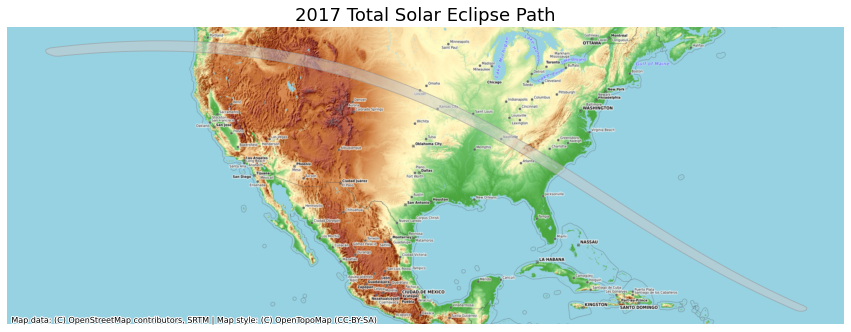

# Using BaseMaps in Plots


```python
import contextily as cx
import geopandas as gpd
import os

%matplotlib inline
import matplotlib.pyplot as plt
```


```python
data_pkg_path = 'data'
folder = 'eclipse'
upath_file = os.path.join(data_pkg_path, folder, 'upath17.shp')
path_gdf = gpd.read_file(upath_file)
```


```python
fig, ax = plt.subplots(1, 1)
fig.set_size_inches(15,7)
path_gdf.plot(ax=ax)
plt.show()
```


    

    


https://svs.gsfc.nasa.gov/4518


```python
fig, ax = plt.subplots(1, 1)
fig.set_size_inches(15,7)
path_gdf.plot(ax=ax, facecolor='#cccccc', edgecolor='#969696', alpha=0.5)

cx.add_basemap(ax, crs=path_gdf.crs, source=cx.providers.OpenTopoMap, zoom=6)
plt.show()
```


    

    


```python
path_reprojected = path_gdf.to_crs('epsg:3857')
fig, ax = plt.subplots(1, 1)
fig.set_size_inches(15,7)
path_reprojected.plot(ax=ax, facecolor='#cccccc', edgecolor='#969696', alpha=0.5)

cx.add_basemap(ax, crs=path_reprojected.crs, source=cx.providers.OpenTopoMap)
ax.set_axis_off()
plt.title('2017 Total Solar Eclipse Path', size = 18)

output_folder = 'output'
output_path = os.path.join(output_folder, 'eclipse_path.png')
plt.savefig(output_path, dpi=300)
plt.show()
```


    

    

