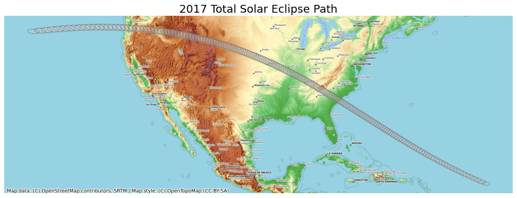

# Creating Animated Maps


```python
import contextily as cx
import geopandas as gpd
import os

%matplotlib inline
import matplotlib.pyplot as plt
from matplotlib.animation import FuncAnimation, PillowWriter
```


```python
data_pkg_path = 'data'
folder = 'eclipse'
upath_file = os.path.join(data_pkg_path, folder, 'upath17.shp')
path_gdf = gpd.read_file(upath_file)
umbra_file = os.path.join(data_pkg_path, folder, 'w_umbra17_1m.shp')
umbra_gdf = gpd.read_file(umbra_file)
```


```python
path_reprojected = path_gdf.to_crs('epsg:3857')
umbra_reprojected = umbra_gdf.to_crs('epsg:3857')
```

https://svs.gsfc.nasa.gov/4518


```python
fig, ax = plt.subplots(1, 1)
fig.set_size_inches(15,7)
path_reprojected.plot(ax=ax, facecolor='#cccccc', edgecolor='#969696', alpha=0.5)
umbra_reprojected.plot(ax=ax, facecolor='none', edgecolor='#636363', alpha=0.5)

cx.add_basemap(ax, crs=path_reprojected.crs, source=cx.providers.OpenTopoMap)
ax.set_axis_off()
plt.title('2017 Total Solar Eclipse Path', size = 18)

plt.show()
```


    

    


```python
path_boundary = path_reprojected.geometry.unary_union
umbra_subset = umbra_reprojected[umbra_reprojected.geometry.intersects(path_boundary)]
```


```python
fig, ax = plt.subplots(1, 1)
fig.set_size_inches(15,7)
path_reprojected.plot(ax=ax, facecolor='#cccccc', edgecolor='#969696', alpha=0.5)
umbra_subset.plot(ax=ax, facecolor='none', edgecolor='#636363', alpha=0.5)

cx.add_basemap(ax, crs=path_reprojected.crs, source=cx.providers.OpenTopoMap)
ax.set_axis_off()
plt.title('2017 Total Solar Eclipse Path', size = 18)

plt.show()
```


    

    


```python
fig, ax = plt.subplots(1, 1)
fig.set_size_inches(15,7)
plt.tight_layout()

def animate(i):
    ax.clear()
    # Get the point from the points list at index i
    umbra_filtered = umbra_subset.iloc[i:i+1]
    path_reprojected.plot(ax=ax, facecolor='#cccccc', edgecolor='#969696', alpha=0.5)
    cx.add_basemap(ax, crs=path_reprojected.crs, source=cx.providers.OpenTopoMap)
    umbra_filtered.plot(ax=ax, facecolor='#252525', edgecolor='#636363', alpha=0.5)
    ax.set_axis_off()
    props = dict(boxstyle='round', facecolor='wheat', alpha=0.5)
    time = umbra_filtered.iloc[0].UTCTime
    text = 'Time: {} UTC'.format(time)
    ax.text(0.05, 0.20, text, transform=ax.transAxes, fontsize=16,
            verticalalignment='top', bbox=props)
    ax.set_title('2017 Total Solar Eclipse Path', size = 18)

ani = FuncAnimation(fig, animate, frames=len(umbra_subset),
                    interval=500, repeat=True, cache_frame_data=True)
plt.close()
```


```python
import matplotlib as mpl
mpl.rcParams['animation.embed_limit'] = 2**128
from IPython.display import HTML
#HTML(ani.to_jshtml())
```


```python
output_folder = 'output'
output_path = os.path.join(output_folder, 'solar_eclipse.gif')

#ani.save(output_path, writer=PillowWriter(fps=5))
```


```python

```
