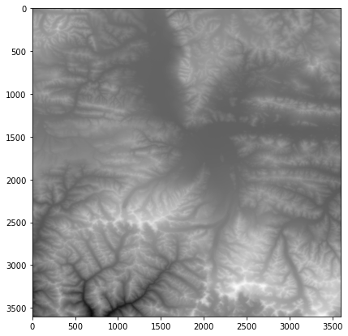
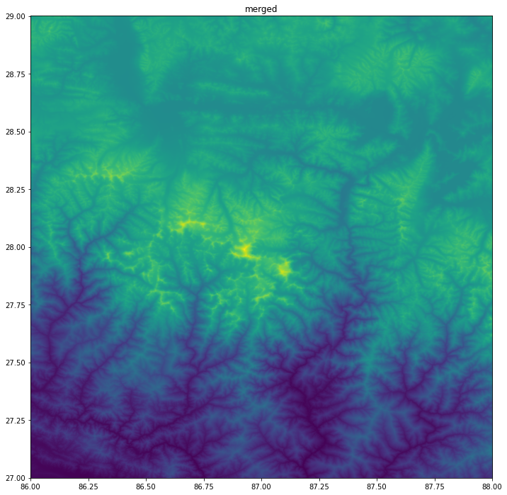

# Visualizing Rasters


```python
import glob
import os
import rasterio
import numpy as np

%matplotlib inline
import matplotlib.pyplot as plt
```

Define input and output paths.


```python
data_pkg_path = 'data'
srtm_path = os.path.join(data_pkg_path, 'srtm', '*.hgt')
all_files = glob.glob(srtm_path)
all_files
```


    ['data/srtm/N28E086.hgt',
     'data/srtm/N28E087.hgt',
     'data/srtm/N27E087.hgt',
     'data/srtm/N27E086.hgt']


```python
file1 = all_files[0]
dataset = rasterio.open(file1)
band = dataset.read(1)
transform = dataset.transform
dataset.close()
```


```python
fig, ax = plt.subplots(1, 1)
fig.set_size_inches(7,7)

ax.imshow(band, cmap='Greys_r')
plt.show()
```


    

    


```python
from rasterio.plot import show

fig, ax = plt.subplots(1, 1)
fig.set_size_inches(7,7)

show(band, cmap='Greys_r', ax=ax, transform=transform)
plt.show()
```


    

    


```python
datasets = []
for file in all_files:
    path = os.path.join(srtm_path, file)
    dataset = rasterio.open
```


```python
fig, axes = plt.subplots(1, 4)
fig.set_size_inches(15,3)
plt.tight_layout()
```


    

    


```python
fig, axes = plt.subplots(1, 4)
fig.set_size_inches(15,3)
plt.tight_layout()

for index, file in enumerate(all_files):
    with rasterio.open(file) as dataset:
        band = dataset.read(1)
        transform = dataset.transform
    ax = axes[index]
    show(band, ax=ax, cmap='Greys_r', transform=transform)
    filename = all_files[index]
    ax.set_title(os.path.basename(filename))

plt.show()
```


    

    


```python
from rasterio import merge

dataset_list = []
for file in all_files:
    dataset_list.append(rasterio.open(file))

merged_data, merged_transform = merge.merge(dataset_list)
```

Similarly, we can visualize the merged raster.


```python
fig, ax = plt.subplots(1, 1)
fig.set_size_inches(12, 12)
show(merged_data, ax=ax, cmap='viridis', transform=merged_transform)
ax.set_title('merged')
plt.show()
```


    

    


```python
merged_array = merged_data.squeeze()
```


```python
rows, cols = np.where(merged_array == np.max(merged_array))
row = rows[0]
col = cols[0]
lon, lat = rasterio.transform.xy(merged_transform, row, col)
print(lat, lon)
```

    27.988888888888887 86.92555555555556


```python
fig, ax = plt.subplots(1, 1)
fig.set_size_inches(12, 12)
show(merged_data, ax=ax, cmap='viridis', transform=merged_transform)
ax.plot(lon, lat, '^r', markersize=11)
ax.annotate("Mt. Everest",
            xy=(lon, lat), xycoords='data',
            xytext=(20, 20), textcoords='offset points',
            arrowprops=dict(arrowstyle="->", color='black')
            )

output_folder = 'output'
output_path = os.path.join(output_folder, 'mt_everest.png')
plt.savefig(output_path, dpi=300)

plt.show()
```


    

    


```python

```
