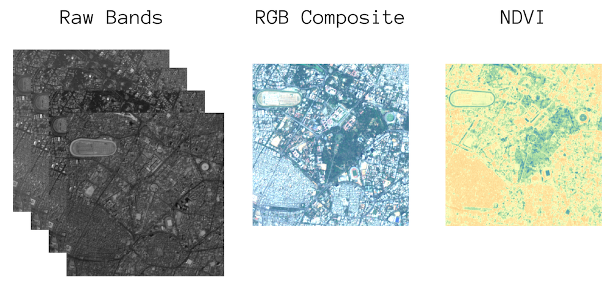

# Raster Computation

In the previous section we saw how RasterIO can help us read and write geospatial rasters and use built-in modules to do some geoprocessing. In this section we will see how we can do computation on the rasters. As RasterIO reads raster bands as NumPy arrays, we can apply any operation on the data that is supported by NumPy.

In this example, we will take a satellite image from the Sentinel-2 satellite and see how we can create various composites and calculate NDVI (Normalized Differential Vegetation Index).




```python
import os
data_pkg_path = 'data'
sentinel2_dir = 'sentinel2'
```

The directory contains 4 JPEG2000 files with the `.jp2` extension. It also contains other metadata files. We saw how the `os.listdir()` function can help find all files in the directory, but if we wanted to find a subset of files that match a pattern, Python has another helpful module called `glob`. It allows us the to use unix-style [wildcards](https://tldp.org/LDP/GNU-Linux-Tools-Summary/html/x11655.htm) such as `*`, `?` etc. in Python to match filenames.


Below code finds all files that end with `.jp2`.


```python
import glob

pattern = '*.jp2'

path = os.path.join(data_pkg_path, sentinel2_dir, pattern)
files = glob.glob(path)
print(files)
```

    ['data\\sentinel2\\T43PGQ_20200218T050851_B02.jp2', 'data\\sentinel2\\T43PGQ_20200218T050851_B03.jp2', 'data\\sentinel2\\T43PGQ_20200218T050851_B04.jp2', 'data\\sentinel2\\T43PGQ_20200218T050851_B08.jp2']


Each file is a separate band from the same scene. The band names are part of the file name, so we can use the `in` operator to check which the file corresponding to each band name.


```python
bands = {
    'red': 'B04',
    'green': 'B03',
    'blue': 'B02',
    'nir': 'B08'
}
band_files = {}

for band_name, band_number in bands.items():
    for filename in files:
        if band_number in filename:
            band_files[band_name] = filename
print(band_files)
```

    {'red': 'data\\sentinel2\\T43PGQ_20200218T050851_B04.jp2', 'green': 'data\\sentinel2\\T43PGQ_20200218T050851_B03.jp2', 'blue': 'data\\sentinel2\\T43PGQ_20200218T050851_B02.jp2', 'nir': 'data\\sentinel2\\T43PGQ_20200218T050851_B08.jp2'}


All the files come from the same scene and have the same metadata. Let's open any one of the file and read the metadata.


```python
import rasterio

red_dataset = rasterio.open(band_files['red'])
metadata = red_dataset.meta
print(metadata)
```

    {'driver': 'JP2OpenJPEG', 'dtype': 'uint16', 'nodata': None, 'width': 10980, 'height': 10980, 'count': 1, 'crs': CRS.from_epsg(32643), 'transform': Affine(10.0, 0.0, 699960.0,
           0.0, -10.0, 1500000.0)}


We can now loop through all bands and read the data.


```python
band_datasets = {}
for band_name, band_file in band_files.items():
    dataset = rasterio.open(band_file)
    band_dataset = dataset.read(1)
    band_datasets[band_name] = band_dataset
    dataset.close()
print(band_datasets)
```

    {'red': array([[   0,    0,    0, ..., 1683, 1678, 1624],
           [   0,    0,    0, ..., 1571, 1737, 1636],
           [   0,    0,    0, ..., 1307, 1537, 1332],
           ...,
           [1167, 1161, 1055, ..., 1499, 1457, 1453],
           [1235, 1183, 1085, ..., 1479, 1484, 1479],
           [1275, 1261, 1168, ..., 1541, 1539, 1473]], dtype=uint16), 'green': array([[   0,    0,    0, ..., 1189, 1161, 1144],
           [   0,    0,    0, ..., 1169, 1196, 1129],
           [   0,    0,    0, ..., 1087, 1169, 1097],
           ...,
           [1077, 1075,  972, ..., 1198, 1193, 1210],
           [1087, 1089,  985, ..., 1209, 1211, 1213],
           [1134, 1105, 1031, ..., 1238, 1232, 1221]], dtype=uint16), 'blue': array([[   0,    0,    0, ..., 1132, 1121, 1088],
           [   0,    0,    0, ..., 1121, 1146, 1108],
           [   0,    0,    0, ..., 1100, 1158, 1066],
           ...,
           [1167, 1164, 1094, ..., 1187, 1184, 1175],
           [1174, 1163, 1132, ..., 1190, 1204, 1198],
           [1205, 1173, 1170, ..., 1229, 1215, 1191]], dtype=uint16), 'nir': array([[   0,    0,    0, ..., 2348, 2342, 2279],
           [   0,    0,    0, ..., 2571, 2482, 2273],
           [   0,    0,    0, ..., 2436, 2390, 2289],
           ...,
           [2148, 2047, 2001, ..., 2451, 2474, 2587],
           [2211, 2097, 2006, ..., 2441, 2445, 2533],
           [2219, 2100, 1995, ..., 2457, 2449, 2566]], dtype=uint16)}


## Combining Bands into a Composite

Let's see how we can combine the individual bands into a single raster with 3 bands. This was we can create a true-color or false-color composite.

We can combine the 'red', 'green' and 'blue' bands to form a RGB (true-color) composite image.

We can use the same metadata parameters as the input image, with one little change. We can update the band count to 3. Since `metadata` is a dictionary, we can use the `update()` method to change set a key to a new value.


```python
metadata.update({'count':3})
```

We have a dictionary that contains all the metadata parameters that we can pass to the `rasterio.open()` method. But a function accepts arguments in the form of keywords, such as `count=3, dtype=uint16, ....`. Python provides a special operator `**` which converts a dictionary into keyword arguments suitable to be passed to functions.


```python
output_filename = 'rgb.jp2'
output_dir = 'output'
output_path = os.path.join(output_dir, output_filename)

rgb_dataset = rasterio.open(output_path, 'w', **metadata)
```

Now the dataset is created, we can write data from each band.


```python
rgb_dataset.write(band_datasets['red'], 1)
rgb_dataset.write(band_datasets['green'], 2)
rgb_dataset.write(band_datasets['blue'], 3)
rgb_dataset.close()
print('Successfully written output file at {}'.format(output_path))
```

## Calculating NDVI

We can perform band-math on the datasets using NumPy functions. We will use the Red and NIR bands on the input image to calculate NDVI.

The forumla for computing NDVI is as follows

`NDVI = (NIR - RED) / ( NIR + RED)`

Before we do so, we need to set the correct data type for the input data. The input bands contains integer values and are stored as the `uint16` (unsigned integer 16-bits). When we do some operation on 2 numbers that are unsigned (meaning they can't store negative values), but output is a negative number, it results an [integer overflow](https://en.wikipedia.org/wiki/Integer_overflow) error. See below example.


```python
import numpy as np
a = np.array([10], dtype=np.uint16)
b = np.array([20], dtype=np.uint16)

print(a-b)
```

    [65526]


If we expect the results maybe negative, we can change the datatype to one that supports negative numbers.


```python
a = a.astype(np.int16)
b = b.astype(np.int16)
print(a-b)
```

    [-10]


Since NDVI values can be negative and also any real number, we should change the type to a floating point type.


```python
red = band_datasets['red'].astype(np.float32)
nir = band_datasets['nir'].astype(np.float32)
```

Before we do the calculation, we need to deal with one more potential issue. Since the NDVI formula requires us to divide numbers, we may end up accidentely dividing a number with 0. Let's see what happens if we divide a number by 0.


```python
print(a/0)
```

    [inf]


    C:\Users\ujaval\anaconda3\envs\python_foundation\lib\site-packages\ipykernel_launcher.py:1: RuntimeWarning: divide by zero encountered in true_divide
      """Entry point for launching an IPython kernel.


To avoice this warning of division by zero, we can set NumPy to ignore such cases


```python
np.seterr(divide='ignore', invalid='ignore')
```


    {'divide': 'warn', 'over': 'warn', 'under': 'ignore', 'invalid': 'warn'}


Now we can do the calculations using regular Python syntax.


```python
ndvi = (nir - red) / (nir + red)
```

We can now write the resulting rastre to disk. Since the JP2 driver supports writing only integer data, we can choose to write it as a GeoTIFF file.


```python
metadata.update({'count': 1, 'dtype': 'float32', 'driver': 'GTiff'})
print(metadata)
```

    {'driver': 'GTiff', 'dtype': 'float32', 'nodata': None, 'width': 10980, 'height': 10980, 'count': 1, 'crs': CRS.from_epsg(32643), 'transform': Affine(10.0, 0.0, 699960.0,
           0.0, -10.0, 1500000.0)}


```python
output_filename = 'ndvi.tif'
output_dir = 'output'
output_path = os.path.join(output_dir, output_filename)

ndvi_dataset = rasterio.open(output_path, 'w', **metadata)
ndvi_dataset.write(ndvi, 1)
ndvi_dataset.close()
print('Successfully written output file at {}'.format(output_path))
```

## Exercise

Take the Sentinel-2 bands and create a False Color Composite (FCC). A *NRG Color Composite* is created with the following configuration.

- Band 1: NIR
- Band 2: Red
- Band 3: Green


----
