\newpage

***

```{r echo=FALSE, fig.align='center', out.width='250pt'}
knitr::include_graphics('images/spatial_thoughts_logo.png')
```

***

\newpage

# Introduction 

This class focuses on techniques for the automation of GIS workflows. You will learn techniques that will help you be more productive, create beautiful visualizations and solve complex spatial analysis problems. This class is ideal for participants who already use QGIS and want to take their skills to the next level.

Below are the topics covered in this class

- Processing Framework - Algorithms, Batch processing, and Modeler 
- Animating time-series data
- Creating 3D fly-through from aerial imagery
- Advanced Expressions for enabling faster data editing, fuzzy matching, and more.

Before we do the exercises, it will help you to learn a bit more about open-source and how the QGIS project operates. 

[{width="400px"}](https://docs.google.com/presentation/d/13R-RbR5LJmBr5F-VAN0OXh7fRxRC8olFIl2yrOFgG-w/edit?usp=sharing){target="_blank"}

[View the Presentation &#8599;](https://docs.google.com/presentation/d/13R-RbR5LJmBr5F-VAN0OXh7fRxRC8olFIl2yrOFgG-w/edit?usp=sharing){target="_blank"}


# Software

This course requires QGIS LTR version 3.22. 

Please review [QGIS-LTR Installation Guide](install-qgis-ltr.html) for step-by-step instructions.

# Get the Data Package


The examples in this class use a variety of datasets. All the required layers, project files etc. are supplied to you in the ``advanced_qgis.zip`` file along with your class materials. Unzip this file to the `Downloads` directory. 

*Not enrolled in our instructor-led class but want to work through the material on your own?* [Get free access to the data package](https://docs.google.com/forms/d/e/1FAIpQLSeU4jJDVUFjxPpBoMHjxcy8z6BH6TVhS-jtyYL8TPDvWxn6sw/viewform){target="_blank"}


# Concept: Processing Framework

QGIS 2.0 introduced a new concept called Processing Framework. Previously known as Sextante, the Processing Framework provides an environment within QGIS to run native and third-party algorithms for processing data. It is now the recommended way to run any type of data processing and analysis within QGIS - including tasks such as selecting features, altering attributes, saving layers etc. - that can be accomplished by other means. But leveraging the processing framework allows you to be more productive, fast, and less error-prone. 

The Processing Framework consists of the following distinct elements that work together.

- **Processing Toolbox**: Contains individual tools (i.e. algorithms) grouped by providers and functionality
- **Batch Processing Interface**: Allows any processing tool to be executed on multiple layers together.
- **Graphical Modeler**: This allows the user to define the workflow and chain multiple processing steps together using a drag-and-drop mechanism. 
- **History Manager**: Records and stores all executions of algorithms to allow users to reproduce the past analysis.
- **Results Viewer**: An interface to view non-spatial outputs from algorithms - such as tables and charts.

[{width="400px"}](https://docs.google.com/presentation/d/1Vej8xgY710C-dsxneVXO_6UkXNkcIrYukzgJqxI2j3k/edit?usp=sharing){target="_blank"}

[View the Presentation](https://docs.google.com/presentation/d/1Vej8xgY710C-dsxneVXO_6UkXNkcIrYukzgJqxI2j3k/edit?usp=sharing){target="_blank"}


We will learn about each of these through hands-on exercises in the following sections.

# 1. Processing Toolbox

Processing Toolbox is available from the top-level menu **Processing &rarr; Toolbox**. There are hundreds of algorithms available out of the box. They are organized by *Providers*. The tools created by QGIS developers are available as a **Native** QGIS provider. Processing Framework providers an easy way to integrate tools written by other software and libraries such as GDAL, GRASS, and SAGA. QGIS Plugins can also add new functionality via processing algorithms in the toolbox.  

```{r echo=FALSE, fig.align='center', out.width='75%'}
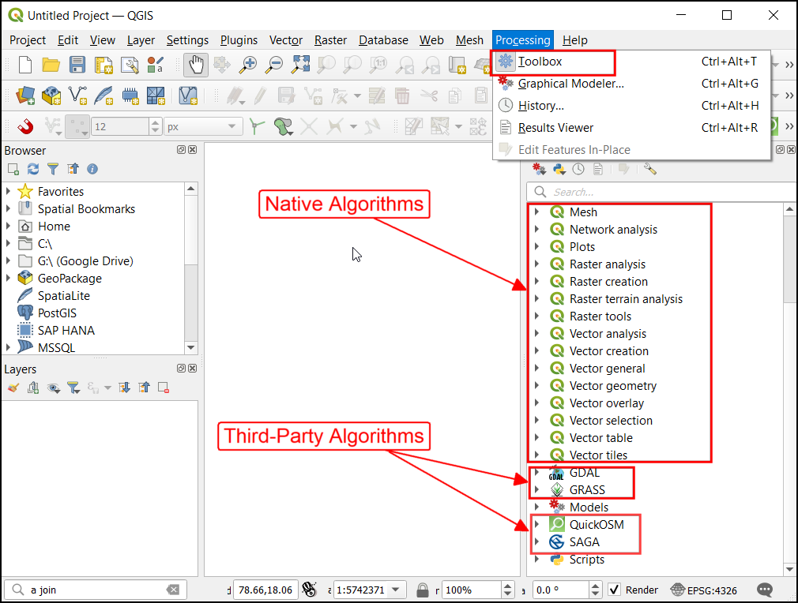
```


## 1.1 Find the length of national highways in a state

This exercise aims is to show how a multi-step spatial analysis problem can be solved using a purely processing-based workflow. This exercise also shows the richness of available algorithms in QGIS that can do sophisticated operations that previously needed plugins or were more complex.

We will work with roads extracted from OpenStreetMap for the state of Karnataka in India. The admin boundary for the state and the districts come from DataMeet.

1. Browse to the data directory and expand ``karnataka.gpkg``. Drag and drop the ``karnataka``, ``karnataka_districts`` and ``karnataka_major_roads`` layers to the canvas.

```{r echo=FALSE, fig.align='center', out.width='75%'}
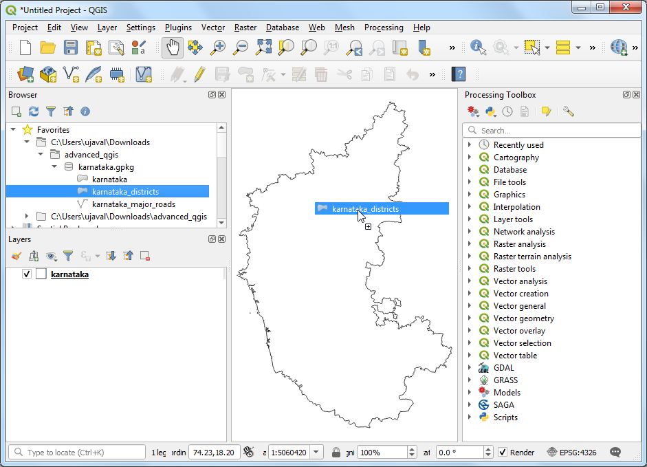
```

2. The layer ``karnataka_major_roads`` contain all major roads, including national highways, state highways, major arterial roads etc. Select the layer and use the keyboard shortcut **F6** to open the attribute table.

```{r echo=FALSE, fig.align='center', out.width='75%'}
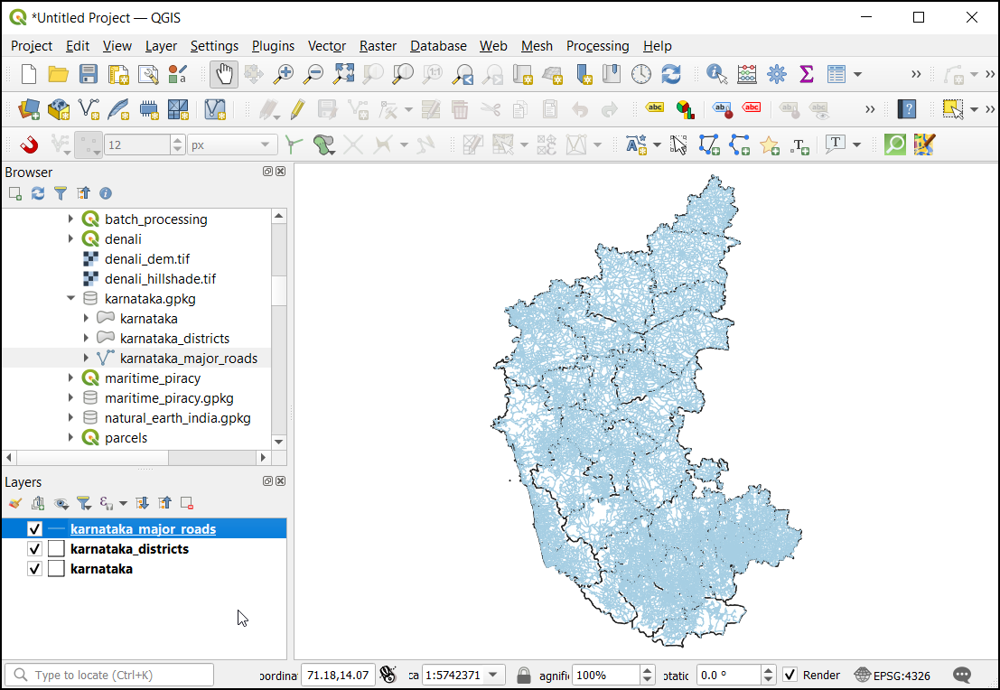
```

3. You will notice that the ``ref`` column has information about road designation. As we are interested in only national highways, we can use the information in this column to extract relevant road segments.

```{r echo=FALSE, fig.align='center', out.width='75%'}
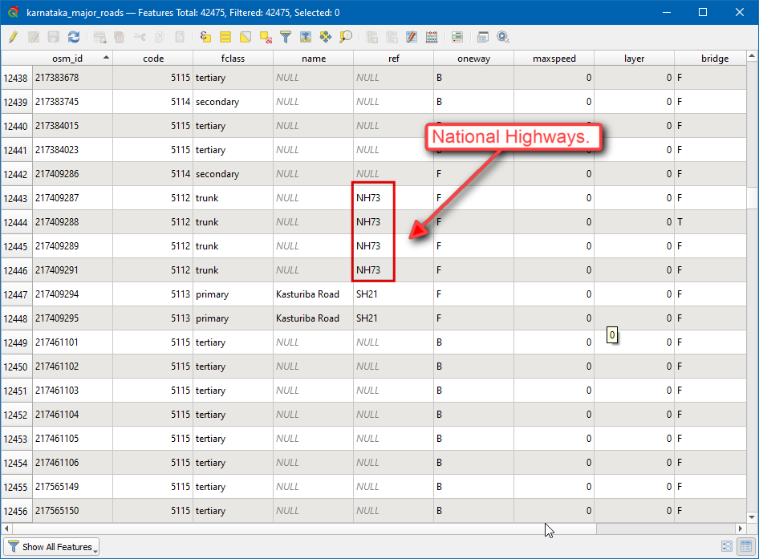
```

4. You can use tools such as *Select by expression*, export the selected features as a new layer and continue to work. But the processing toolbox providers a much seamless workflow. Search for the algorithm **Extract by expression**.

```{r echo=FALSE, fig.align='center', out.width='75%'}
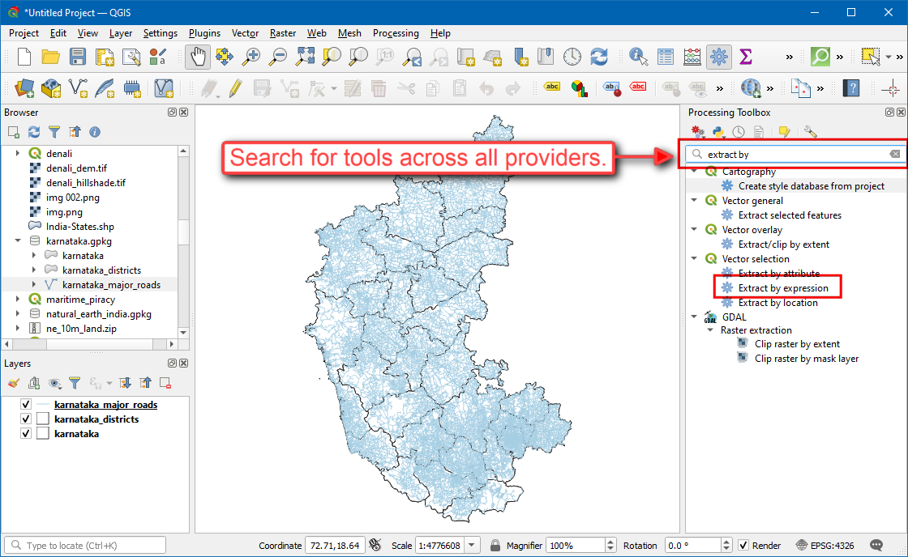
```

5. Enter the following expression to extract the features where the value of the ``ref`` field starts with the letters ``NH``.

> We are using *Regular Expression (or RegEx)* to match the field value to a specific pattern. Regular expressions are quite powerful and can be used for many complex data filtering operations. [Here's a good tutorial](https://medium.com/factory-mind/regex-tutorial-a-simple-cheatsheet-by-examples-649dc1c3f285) that explains the basics of regular expressions. 

```
regexp_match("ref", '^NH')
```

```{r echo=FALSE, fig.align='center', out.width='75%'}
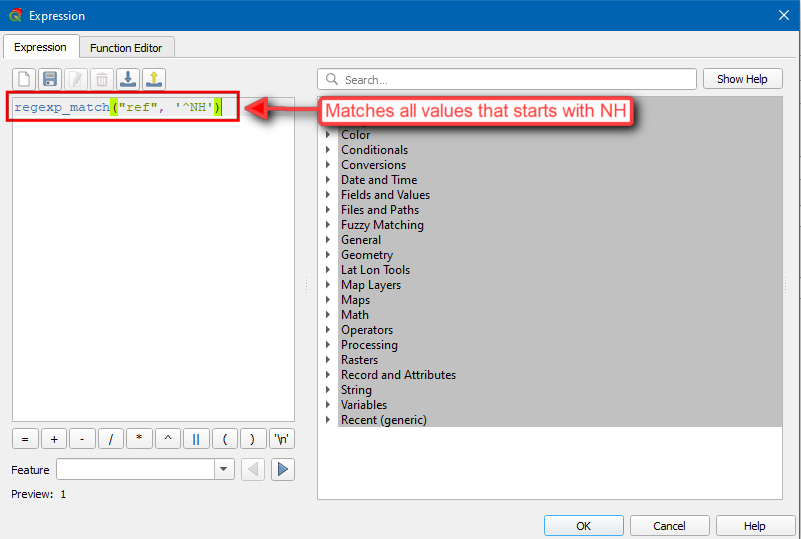
```


6. You will get a new layer ``Matching Features`` in the Layers Panel. Next, we want to calculate the length of each segment. You can use the built-in algorithm **Add geometry attributes**

```{r echo=FALSE, fig.align='center', out.width='75%'}
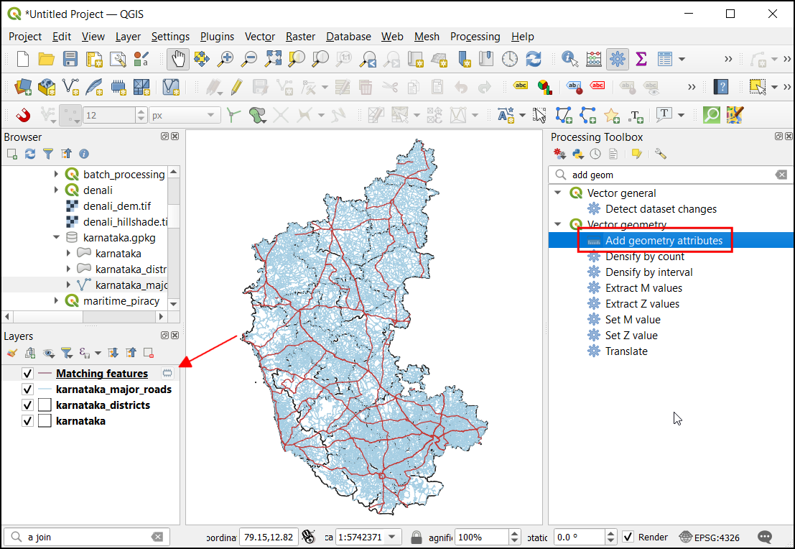
```

7. The source layer is in the Geographic CRS EPSG:4326. But for the analysis, we want the lengths to be measured in meters/kilometers. The algorithm provides us with a handy option to calculate the distances in **Elliposidal** math - which is ideal for layers in the geographic CRS.

```{r echo=FALSE, fig.align='center', out.width='75%'}
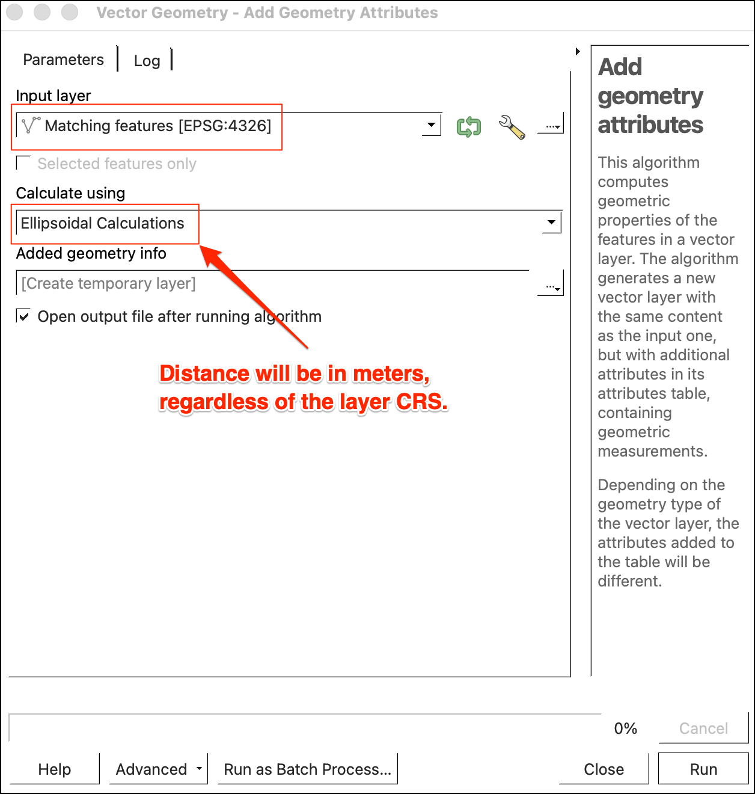
```

8. A new layer with an additional field called ``length`` will be added to the Layers panel. The distances in this field are in meters. Let's convert them to kilometers. You may reach out to the trusty QGIS field calculator to add a new field. That's a perfectly valid way - but as mentioned earlier, there is a *processing* way to do things which is the preferred way. Search and open the **Field Calculator** processing algorithm instead and enter the following expression.

```
"length"/1000
```

```{r echo=FALSE, fig.align='center', out.width='75%'}
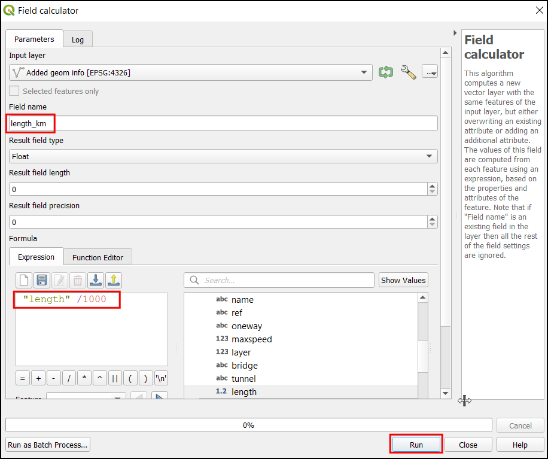
```

9. A new layer with the field ``length_km`` will be added to the Layers panel. Now we are ready to find out the answer. We just need to sum up the values in the ``length_km`` field. Use the **Basic Statistics for Fields** algorithm.

```{r echo=FALSE, fig.align='center', out.width='75%'}
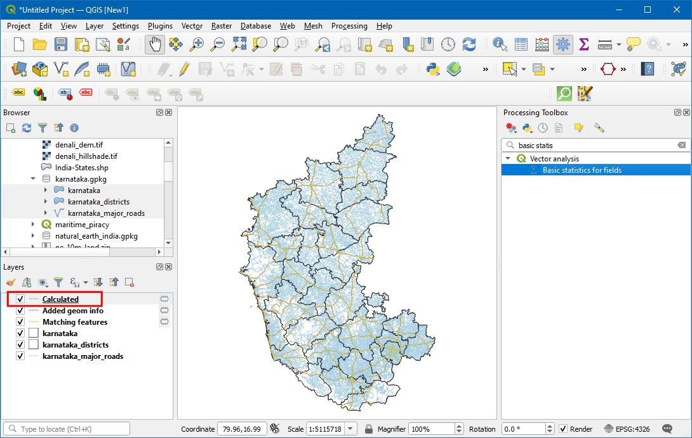
```

10. In the *Basic Statistics for Fields* dialog, select ``Calculated`` as the *Input layer* and ``length_km`` as the *Field to calculate statistics on*. Click *Run*. 

```{r echo=FALSE, fig.align='center', out.width='75%'}
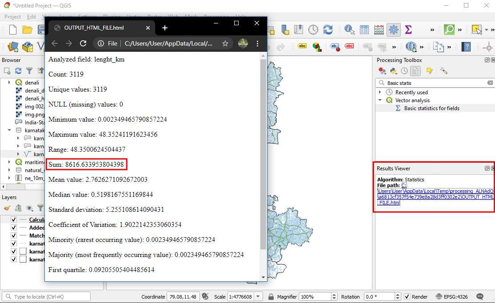
```

11. The result is a table of different statistics on the column. As the result is not a layer, it will be displayed in the *Results Viewer*. The panel will contain the link to an HTML file containing the statistics. The **Sum** contains the total length of national highways in the state. 

```{r echo=FALSE, fig.align='center', out.width='75%'}
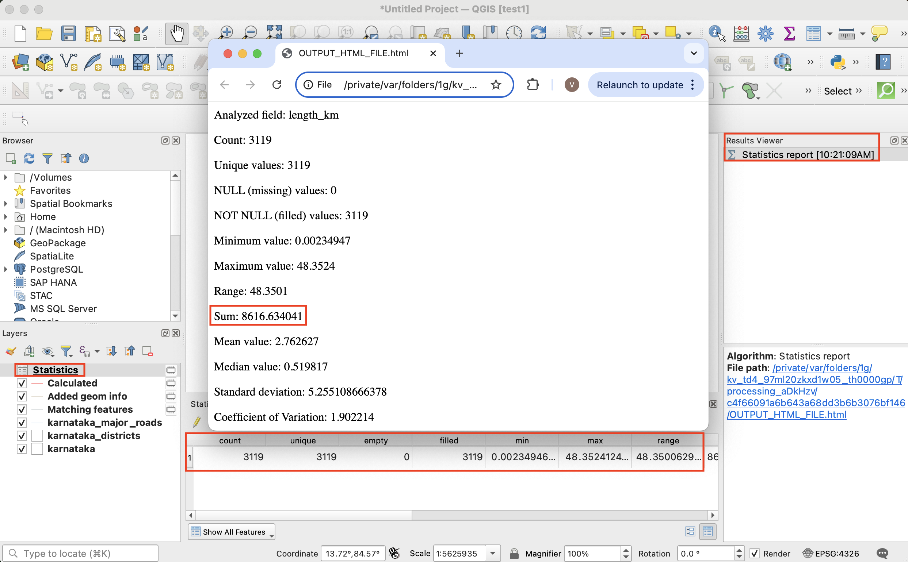
```

> *What do you think of the results?* The resulting number may not be perfect because the OpenStreetMap database may have missing roads or are classified differently. But it is close to the number provided in the [official statistics](https://morth.nic.in/sites/default/files/PragatiKiNayiGati/pdf/karnataka.pdf).

12. The final layer is called ``Calculated`` and is a temporary memory layer. Let's save it to the disk so we can use it later. The layer contains many fields which are not relevant to us, so let's delete some columns before saving them. The *classic* way to do this is to toggle editing and use the *Delete Column* button from the Attribute Table. If you wanted to rename/reorder certain fields, that needed a plugin. But now, we have a really easy processing algorithm called **Refactor Fields** that can add, delete, rename, re-order and change the field types all at once. Delete fields that are not required and save the result as the layer ``national_highways`` in the source ``karnataka.gpkg``.

```{r echo=FALSE, fig.align='center', out.width='75%'}
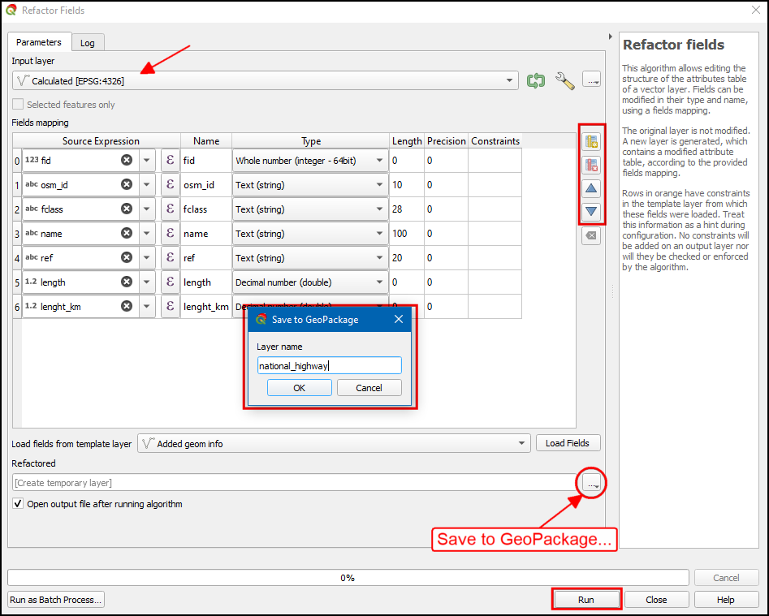
```

13. The layer ``national_highways`` will be added to the Layers panel. We achieved the goal of the exercise, but we can explore the results a bit better if we can break down the results into a smaller administrative unit. Let's try to calculate the length of national highways for each district in the state.

```{r echo=FALSE, fig.align='center', out.width='75%'}
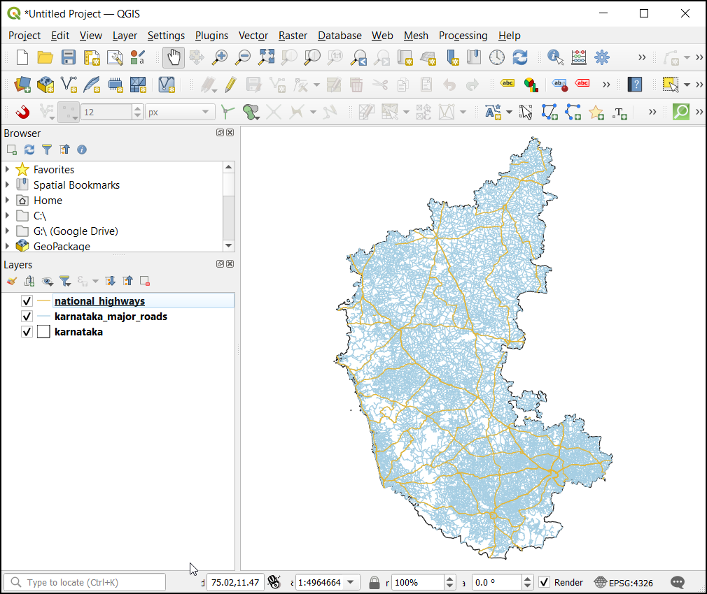
```

14. We have the district information in the ``karnataka_districts`` layer, but not in the ``national_highways`` layer. To add the name of the district to the roads layer, we need to perform a spatial-join. This is done using the **Join attributes by Location** algorithm. Select the ``national_highways`` as the input layer and do a one-to-one join with the ``karnataka_districts`` layer. Select only the **DISTRICT** field to be added to the output.

```{r echo=FALSE, fig.align='center', out.width='75%'}
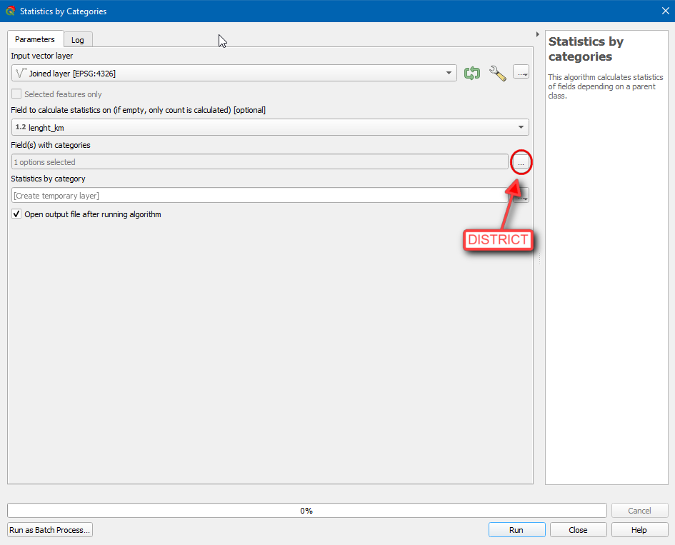
```

15. The new layer ``Joined layer`` now has the intersecting district name in the **DISTRICT** field. We can now sum the road lengths and group them for each district. You may recall that in earlier versions of QGIS, you needed a plugin called Group Stats to do this. But now we can do this via the built-in **Statistic by Categories** algorithm. Select the ``Joined layer`` as the *Input vector layer*, **length_km** as the *Field to calculate statistics on*.  Select  the **DISTRICT** field as the *Field(s) with Categories*. Click *Run*.

```{r echo=FALSE, fig.align='center', out.width='75%'}
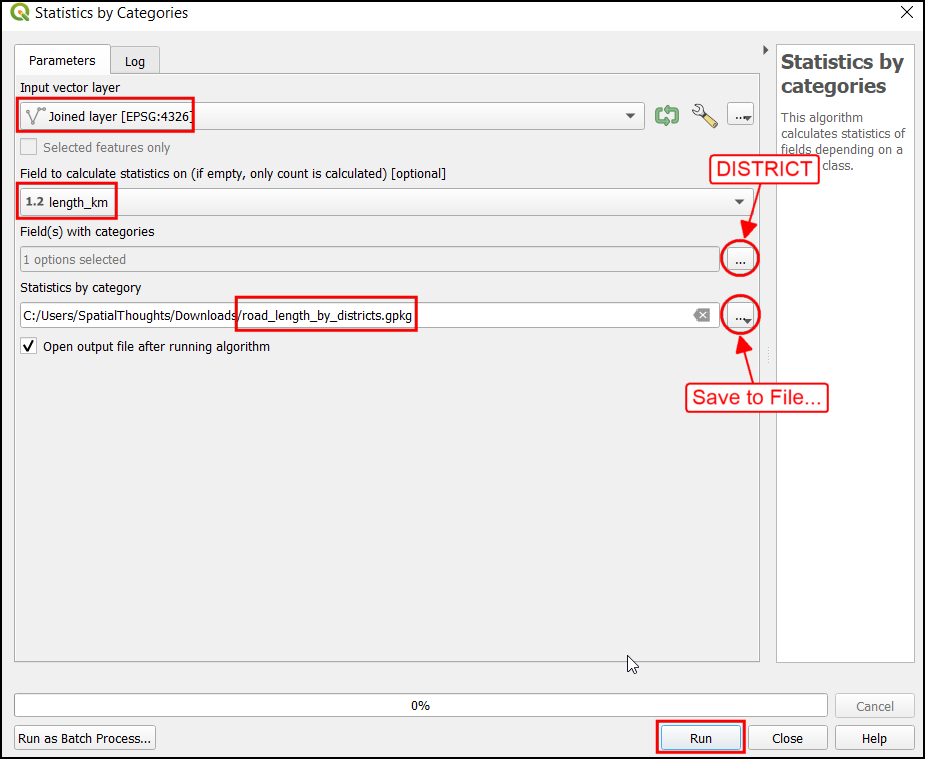
```

16. The output of the algorithm is a table containing various statistics on the ``length_km`` column for each district. The values in the **Sum** column is the total length of national highways in the district.

```{r echo=FALSE, fig.align='center', out.width='75%'}
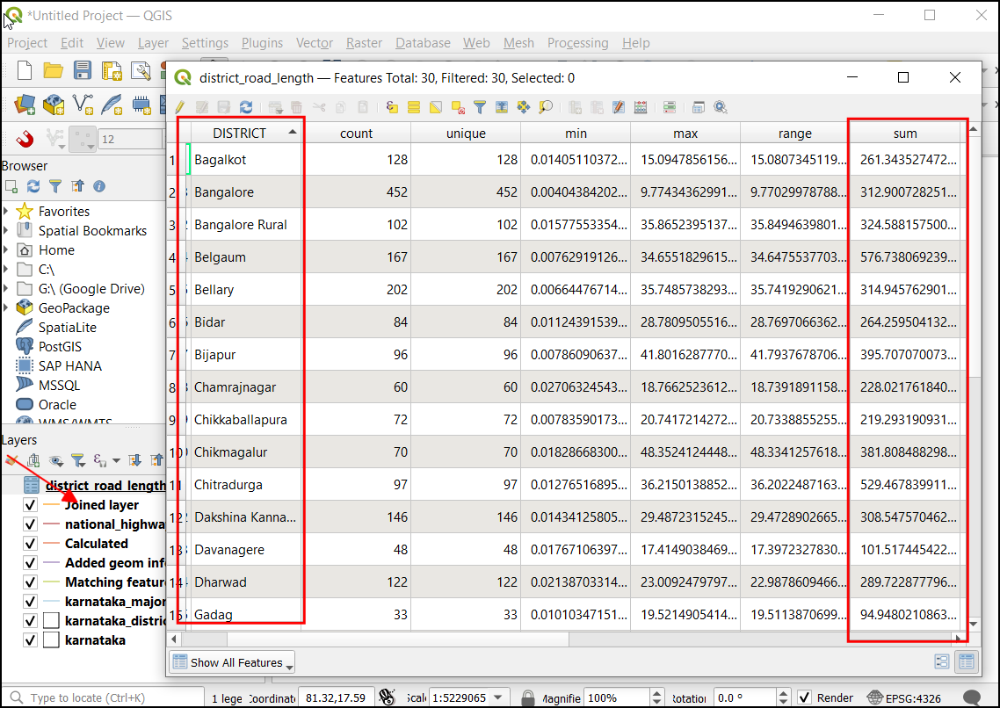
```

Note that we did data processing, spatial analysis and statistical analysis - all using just processing algorithms in a fast, reproducible and intuitive workflow.

## 1.2 Challenge: Post-process the output

Save the ``Statistics by category`` layer to the ``karnataka.gpkg`` as a new layer called ``national_highways_by_district``. Apply the following formatting changes before saving the table:

* Rename the **DISTRICT** field to **district**.
* Rename the **sum** field to **total_length**.
* Round the lengths in the **total_length** field to nearest integer using the `round()` function.
* Delete all remaining fields.

Hint: You can apply an expression on a field in the *Refactor Fields* algorithm by entering it in the *Source Expression* column.

## 1.3 Learn more

Did you know there are over 1000 tools in the Processing Toolbox that can help you do many different tasks? Click on the image to see my video where I share a few of my favorites tools.

[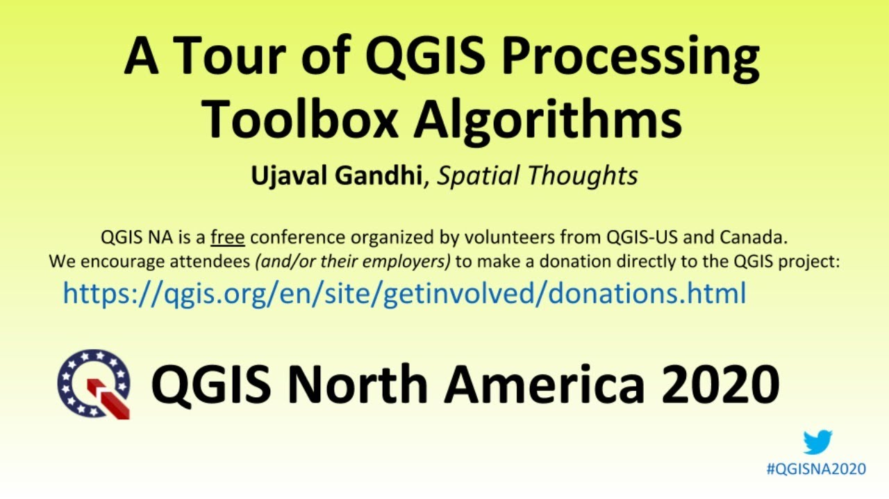{width="70%"}](https://www.youtube.com/watch?v=Tkqj3VCxrqI){target="_blank"}

## 1.4 Running Processing Algorithms from the Locator Bar

To take your processing experience to the next-level, you can use the built-in **Locator Bar**. At the bottom-left of QGIS main window, there is a universal search bar that can do keyword-search across layers, settings, processing algorithms and more. You can open the locator bar using the keyboard shortcut **Ctrl+K**. 

```{r echo=FALSE, fig.align='center', out.width='75%'}
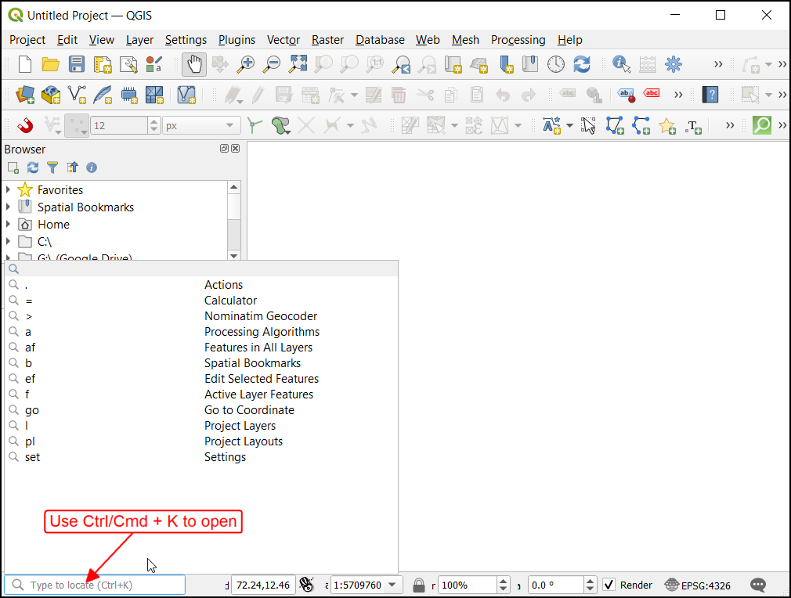
```

I find that rather than clicking-around the processing toolbox, you can just use the locator bar to search and open the algorithms. Type **Ctrl+K**, followed by **a** (to restrict search to algorithms), followed by a **space** and **a few characters**. Use the arrow keys to select and press **Enter** to open the algorithm. 

{target="_blank"}](images/advanced_qgis/locator.png)

## 1.5 In-place Editing

Processing algorithms are designed to take inputs and produce outputs. The default behavior is to create a new layer after each operation. This is useful for many workflows, especially in an enterprise setting, where you may not have the ability to edit the source data. If your algorithms are altering the source data, that also means that the workflows cannot be reproduced easily. So you would want a setup where the algorithms read from source data and create modified outputs.

An exception to this workflow is when you are doing data editing. When your workflow involves creating new features or editing them - creating a new layer for every edit is undesirable. A recent [QGIS crowd-funding campaign](https://north-road.com/edit-features-in-place-using-qgis-spatial-operations-campaign/) added the ability for processing algorithms to modify the features in-place and this functionality is available out-of-the-box in QGIS now.

1. Load the **basic_network_analysis** project from the data package. This project contains a street network for Washington DC from DCGISopendata where the arrows display the digitizing direction of the line segments. You can click the **Edit Features In-Place** button in the processing toolbox to use algorithms that support this functionality. Once this mode is activated, processing algorithms will modify the selected features in the chosen layer instead of creating a new layer.

```{r echo=FALSE, fig.align='center', out.width='75%'}
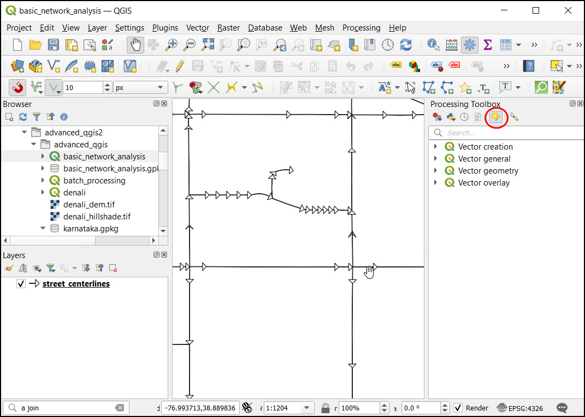
```

2. Select a line segment and run the **Reverse line direction** algorithm. The algorithm will enable editing on the layer, perform the operation and overwrite the existing feature with a segment in the reverse direction. You will see that the arrow rendering is now in the opposite direction.

{target="_blank"}](images/advanced_qgis/inplace2.png)


# 2. Batch Processing

So far we have run the algorithm on 1 layer at a time. But each processing algorithm can also be run in a **Batch** mode on multiple inputs. This provides an easy way to process large amounts of data and automate repetitive tasks.

The batch processing interface can be invoked by right-clicking any processing algorithm and choosing **Execute as Batch Process**.

## 2.1 Clip multiple layers to a polygon

We will take multiple country-level data layers and use the batch processing operation to clip them to a state polygon in a single operation.

1. Open the **batch_processing** project.

```{r echo=FALSE, fig.align='center', out.width='75%'}
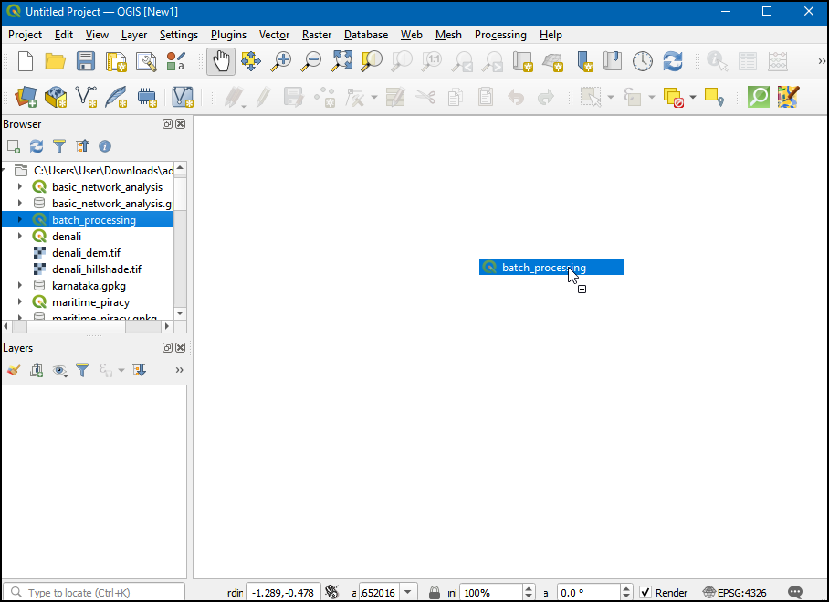
```

2. Next, right-click on the ``state boundary`` layer, and click **Zoom to Layer**.

```{r echo=FALSE, fig.align='center', out.width='75%'}
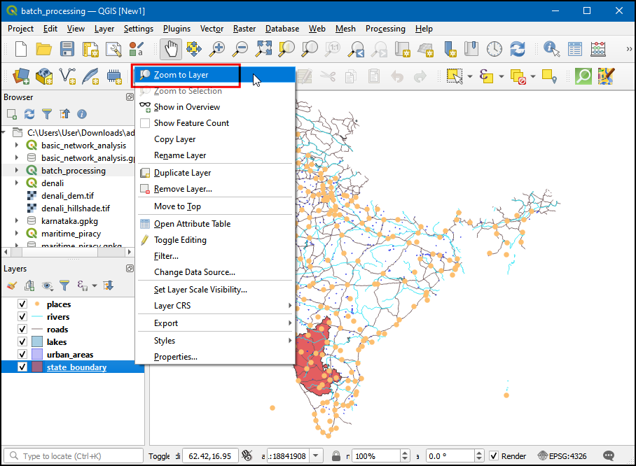
```

3. Now that we have centered on our area of interest, under the **Processing** menu and select **toolbox**. Now in *Processing Toolbox*, search for **clip**, under **Vector overlay &rarr; Clip** right-click and select **Execute as Batch Process..**. 

```{r echo=FALSE, fig.align='center', out.width='75%'}
knitr::include_graphics('images/advanced_qgis/batch03.png')
```

4. In the *Batch processing - Clip* dialog box, click the *Autofill...* under the *Input layer* column and choose *Select from Open Layers..*. 

```{r echo=FALSE, fig.align='center', out.width='75%'}
knitr::include_graphics('images/advanced_qgis/batch04.png')
```

5. Select all data layers except ``state_boundary`` and click **OK**. 

```{r echo=FALSE, fig.align='center', out.width='75%'}
knitr::include_graphics('images/advanced_qgis/batch05.png')
```

6. Under *Overlay Layer* select the **state_boundary** layer. Then click the drop-down button near *Autofill...*  and choose to **Fill Down**. This will auto-populate all the *Overlay Layer* with the ``state_boundary`` layer. 

```{r echo=FALSE, fig.align='center', out.width='75%'}
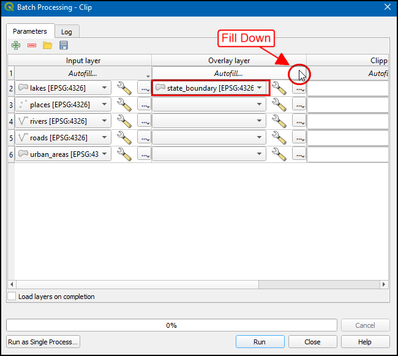
```

7. Under *Clipped*, select *...* button to add the output filenames. 

```{r echo=FALSE, fig.align='center', out.width='75%'}
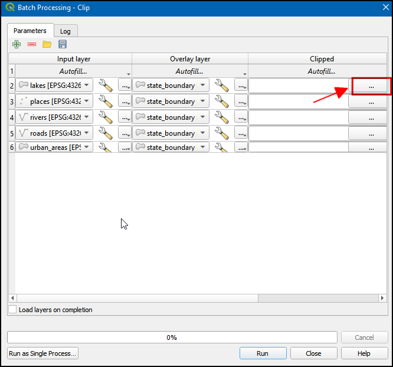
```

8. In the *Save File* dialog box, enter the *File name* as ``clipped_``. This is just the prefix of the name that you will auto-complete in the next step. Select **GPKG files (.gpkg)** in  *Save as type*. Click **Save**.

```{r echo=FALSE, fig.align='center', out.width='75%'}
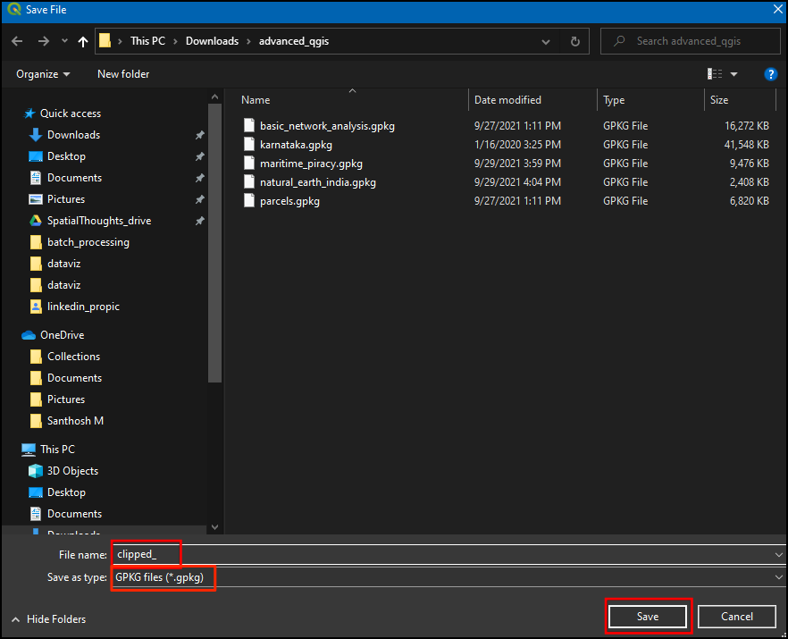
```

9. Next, you will be prompted to choose the *Autofill settings*. Select to **Fill with parameter values** as the *Autofill mode*, and **Input layer** as the *Parameter to use*. Click **OK**. 

```{r echo=FALSE, fig.align='center', out.width='75%'}
knitr::include_graphics('images/advanced_qgis/batch09.png')
```

10. Note that each row has a different file name now. The output file name is the result of the chosen prefix and the autofill settings. Make sure the *Load layers on completion* box is checked and click *Run*.

```{r echo=FALSE, fig.align='center', out.width='75%'}
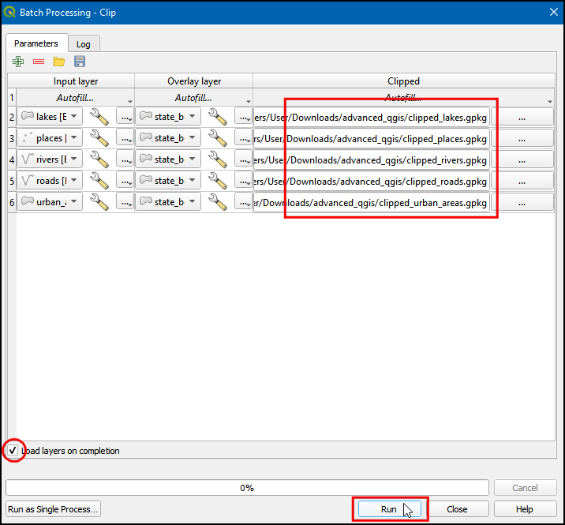
```

11. The resulting clipped layers will be added to the *Layers panel*. Turn off all previous layers in the Layers panel to see the results clearly. We can now combine all the clipped layers into a single *geopackage* file for ease of sharing. Now in the *Processing Toolbox*, search and select the **Package Layers**.

```{r echo=FALSE, fig.align='center', out.width='75%'}
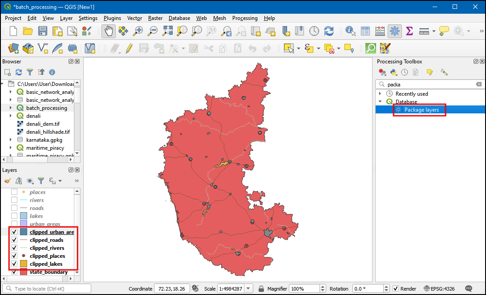
```

12. In the *Package Layers*  dialog box, in *Input layers* choose all the clipped layers and in *Destination GeoPackage* click *...* and select **Save to File...**. Then save the file as ``clipped.gpkg``. Click **Run**

```{r echo=FALSE, fig.align='center', out.width='75%'}
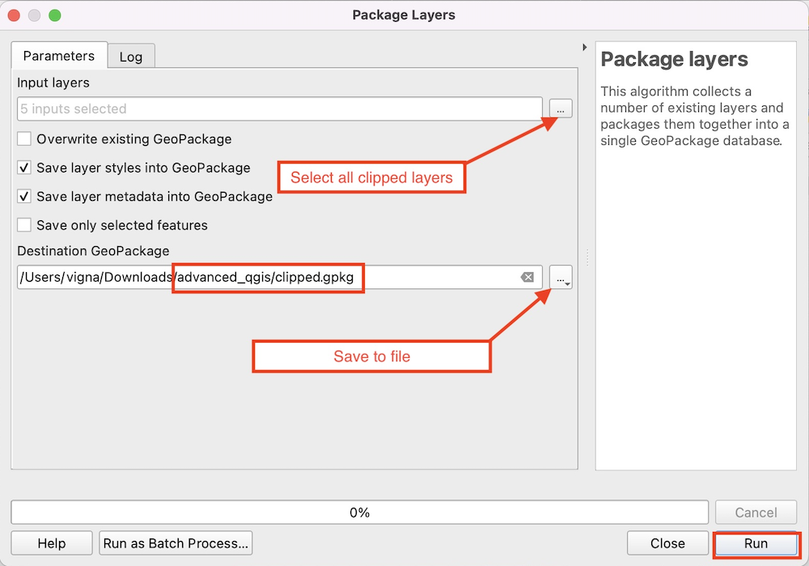
```

13. Now a new ``clipped.gpkg`` geopackage layer will be created with all the clipped layers in it. 

```{r echo=FALSE, fig.align='center', out.width='75%'}
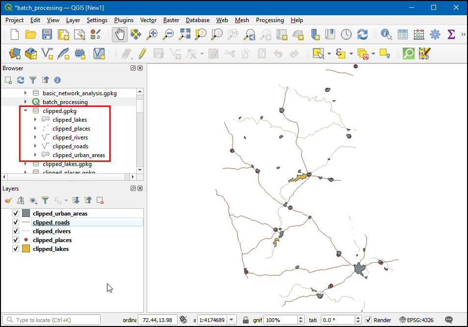
```

# 3. Graphical Modeler

GIS Workflows typically involve many steps - with each step generating intermediate output that is used by the next step. If you change the input data or want to tweak a parameter, you will need to run through the entire process again manually. Fortunately, Processing Framework provides a graphical modeler that can help you define your workflow and run it with a single invocation. You can also run these workflows as a batch over a large number of inputs.

## 3.1 Find the hotspots of piracy incidents

National Geospatial-Intelligence Agency’s Maritime Safety Information portal provides a shapefile of all incidents of maritime piracy in the form of Anti-shipping Activity Messages. We can create a density map by aggregating the incident points over a global hexagonal grid.

The steps needed to create a hex-bin layer suitable for visualization is as follows:

- Reproject the input to an equal-area projection
- Create a global hexagonal grid layer
- Select all grids that intersect with at least 1 point
- Count points within each grid
 
We will now learn how to build a model that runs the above processing steps in a single workflow.

1. Open the **maritime_piracy** project.

```{r echo=FALSE, fig.align='center', out.width='75%'}
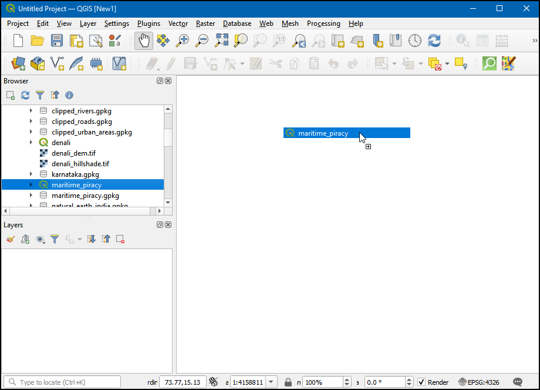
```

2. Launch the modeler from **Processing &rarr; Graphical Modeler** 

```{r echo=FALSE, fig.align='center', out.width='75%'}
knitr::include_graphics('images/advanced_qgis/modeler2.png')
```

3. In the Processing Modeler dialog, locate the *Model Properties* panel. Enter ``piracy_hexbin`` as the Name of the model and ``projects`` as the Groups. Note that there is a History panel in the bottom left, which keeps track of all the work done in Model Builder. Click the Save button.

```{r echo=FALSE, fig.align='center', out.width='75%'}
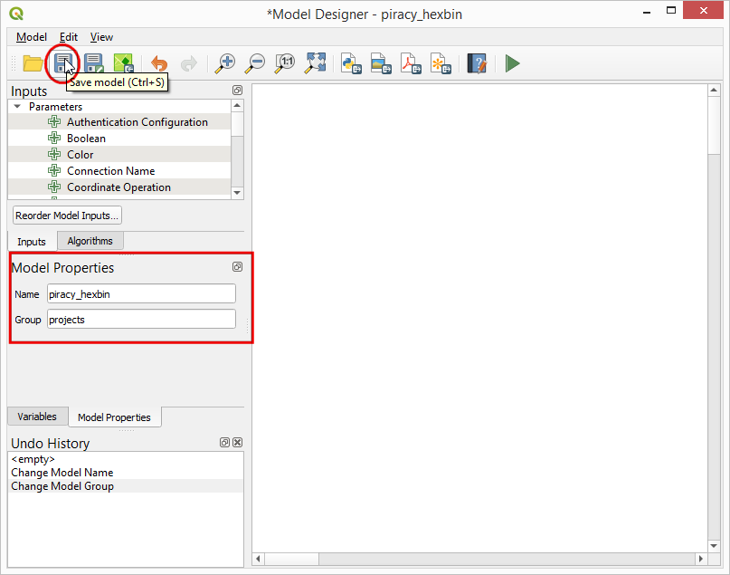
```

4. Save the model as ```piracy_hexbin.model3```. Also, check the folder in which it is being saved. *Processing &rarr; models*, from this location QGIS will read the model by default. 

```{r echo=FALSE, fig.align='center', out.width='75%'}
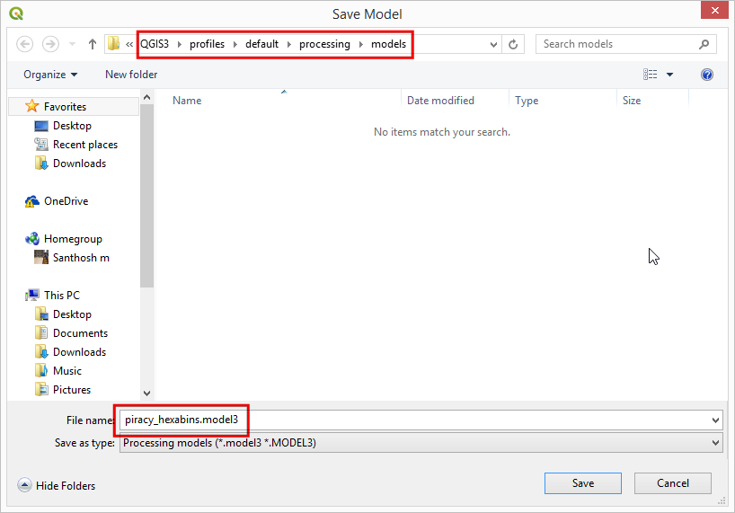
```

5. Now, we can start building a graphical model of our processing pipeline. The Processing modeler dialog contains a left-hand panel and the main canvas. On the left-hand panel, locate the Inputs panel listing various types of input data types. Scroll down and select the **+ Vector Layer** input. Drag it to the canvas. 

```{r echo=FALSE, fig.align='center', out.width='75%'}
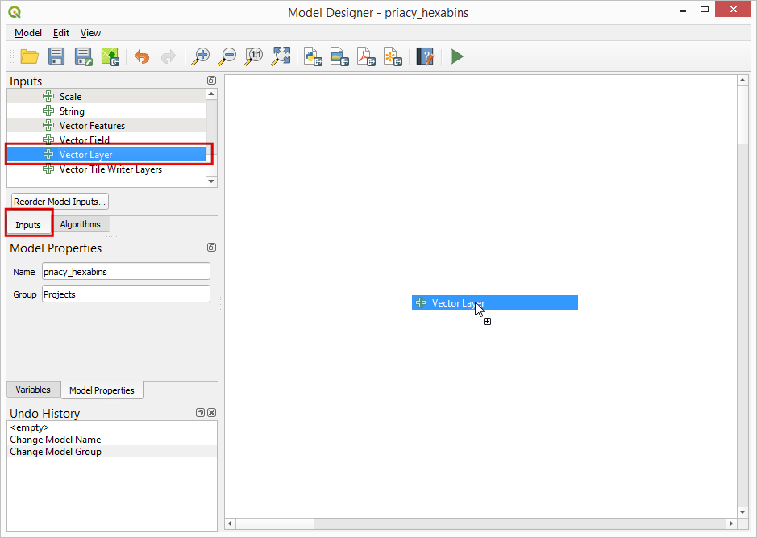
```

6. Enter **Input Points** as the *Description* and **Point** as the *Geometry type*. This input represents the piracy incidents point layer.

```{r echo=FALSE, fig.align='center', out.width='75%'}
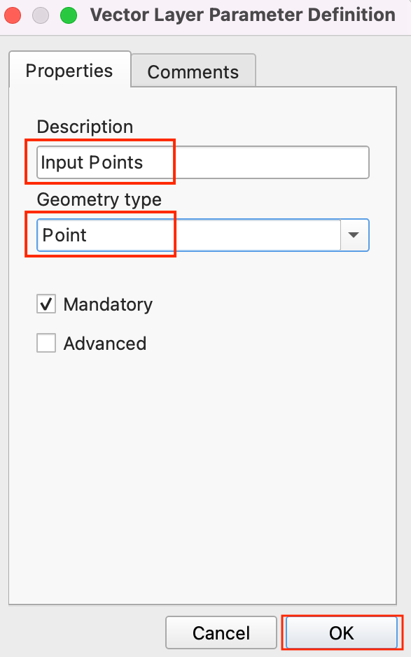
```

7. Next, drag another **+ Vector Layer** input to the canvas. Enter **Base Layer** as the *Description* and **Polygon** as the *Geometry type*. This input represents the natural earth global land layer in which we will use as the extent of the grid layer.

```{r echo=FALSE, fig.align='center', out.width='50%'}
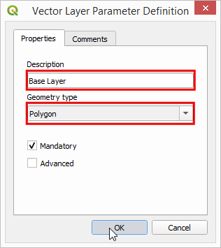
```

8. As we are generating a global hexagonal grid, we can ask the user to supply us with the grid size as an input instead of hard-coding it as part of our model. This way, the user can quickly experiment with different grid sizes without changing the model at all. Select a **+ Number** input and drag it to the canvas. Enter **Grid Size** as the Parameter name, **Integer** as the Number Type, **200000** as Default Value, and click OK.

```{r echo=FALSE, fig.align='center', out.width='50%'}
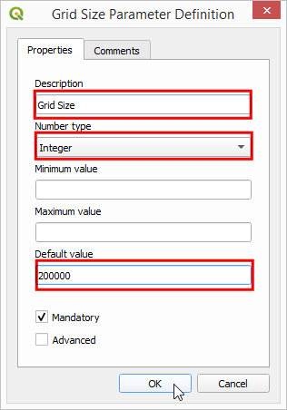
```

9. Now that we have our user inputs defined, we are ready to add processing steps. All of the processing algorithms are available to you under the *Algorithms* tab. The first step in our pipeline will be to reproject the base layer to the Project CRS. Search for the **Reproject layer** algorithm and drag it to the canvas.

```{r echo=FALSE, fig.align='center', out.width='75%'}
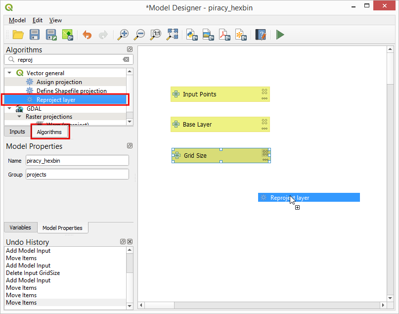
```

10. In the *Reproject layer* dialog, select **Base Layer**, by clicking the button under the *Input Layer* and select **Model Input** as the *Input layer*. Check the Use **project CRS** as the *Target CRS*. Click OK.

```{r echo=FALSE, fig.align='center', out.width='75%'}
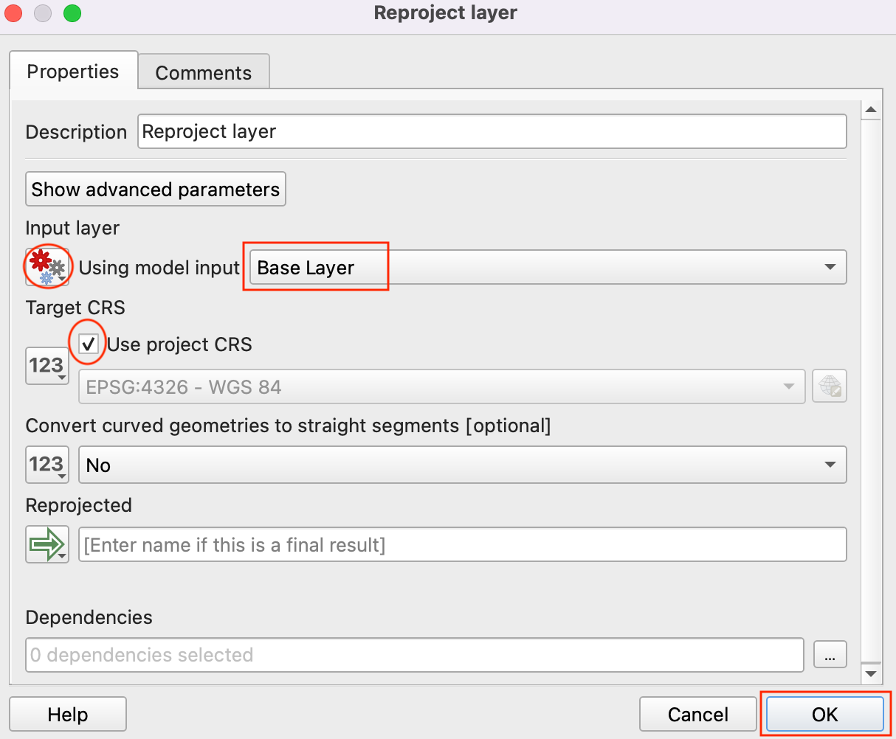
```

11. In the Processing Modeler canvas, you will notice a connection appear between the ```+ Base Layer``` input and the ```Reproject layer``` algorithm. This connection indicates the flow of our processing pipeline. The next step is to create a hexagonal grid. Now search for the **Create grid** algorithm and drag it to the canvas.

```{r echo=FALSE, fig.align='center', out.width='75%'}
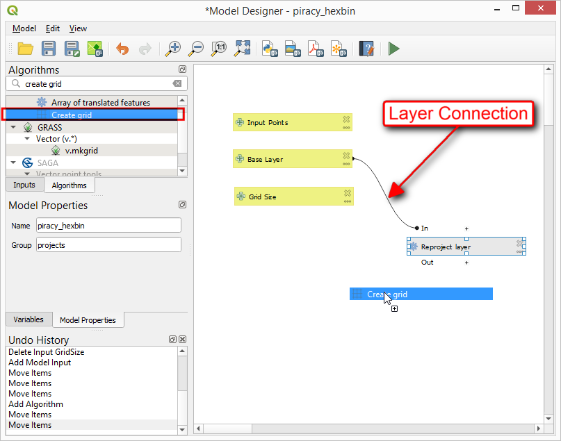
```

12. In the Create grid dialog, choose **Hexagon (polygon)** as the *Grid type*. Select **Algorithm Output** by clicking the button under *Grid extent* and choose **'Reprojected' from the algorithm 'Reproject Layer'** as the Grid extent.

```{r echo=FALSE, fig.align='center', out.width='75%'}
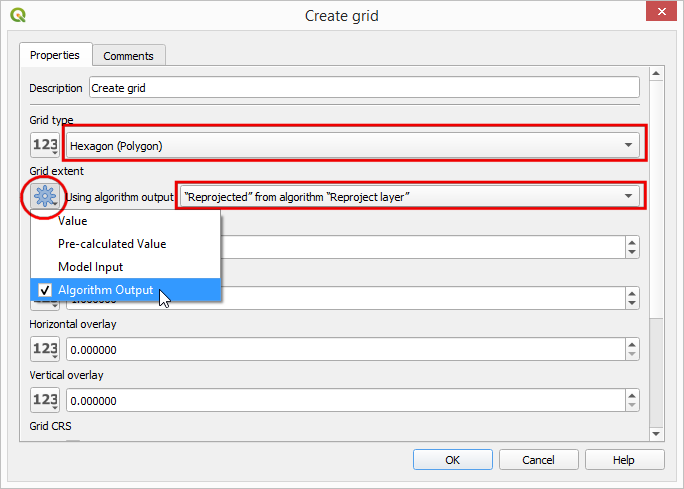
```

13. Select **Model input** by clicking the button under *Horizontal Spacing* and choose **Grid Size** as the *Horizontal Spacing*. Click OK. 

```{r echo=FALSE, fig.align='center', out.width='75%'}
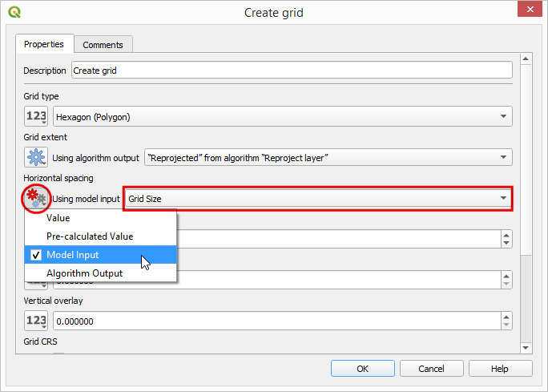
```

14. Select **Model input** by clicking the button under *Vertical Spacing* and choose **Grid Size** as the *Vertical Spacing*. Click OK. 

```{r echo=FALSE, fig.align='center', out.width='75%'}
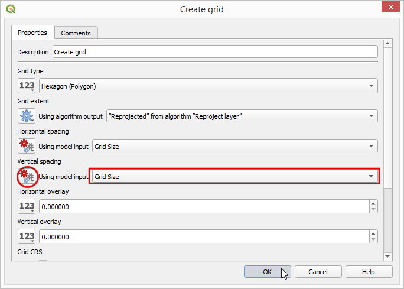
```

15. At this point, we have a global hexagonal grid. The grid spans the full extent of the base layer, including land areas and places where there are no points. Let us filter out those grid polygons where there are no input points. Search for **Extract by location** algorithm and drag it to the canvas.

```{r echo=FALSE, fig.align='center', out.width='75%'}
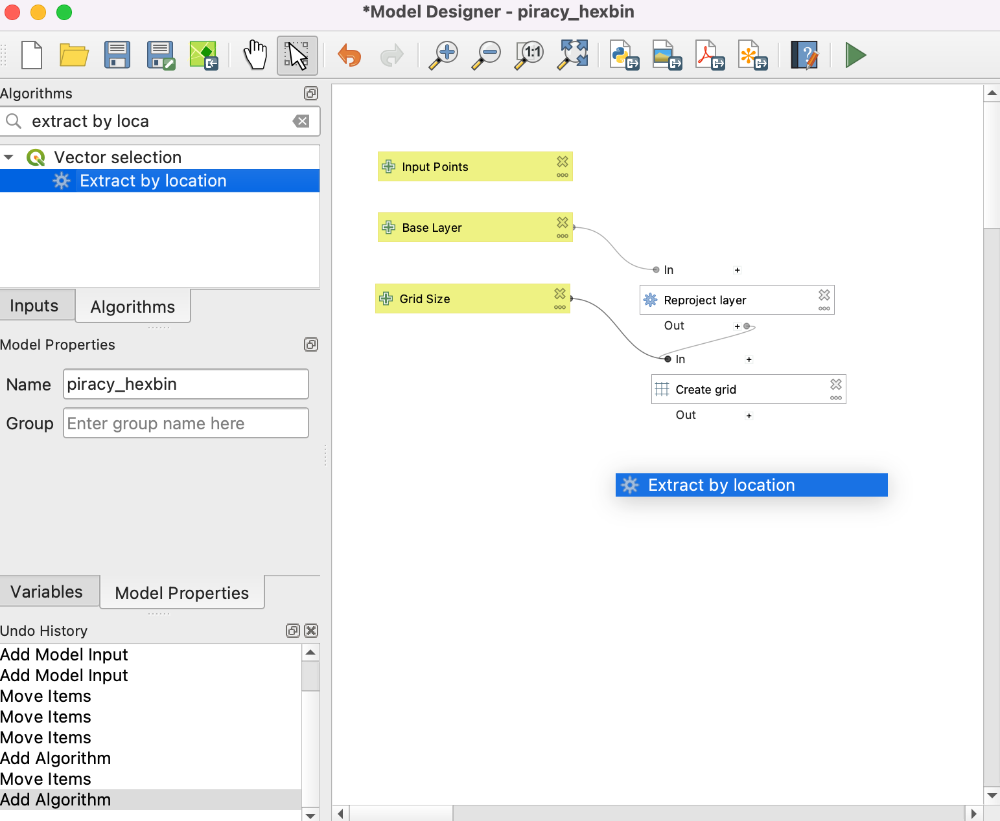
```

16. Select **Algorithm Output** from the icon below *Extract features from*. Now choose **'Grid' from the algorithm 'Generate Grid'**. Click **...** at the right end.

```{r echo=FALSE, fig.align='center', out.width='75%'}
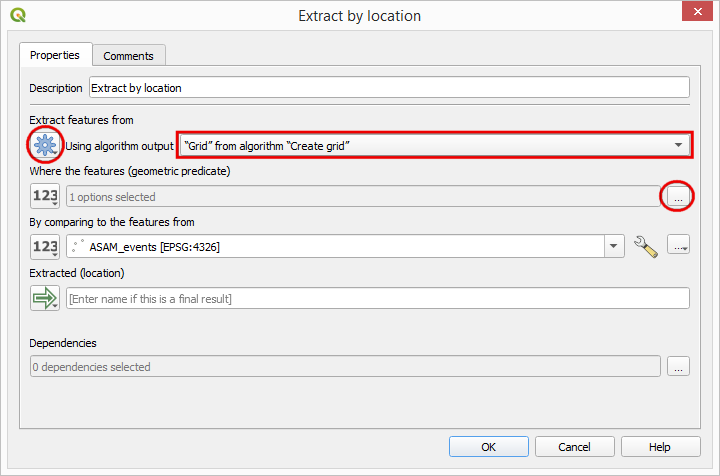
```

17. Select **Intersect** by clicking the button, as Where the features(geometric predicate). And click the triangle button to go back to the previous window. Now click OK. 

```{r echo=FALSE, fig.align='center', out.width='75%'}
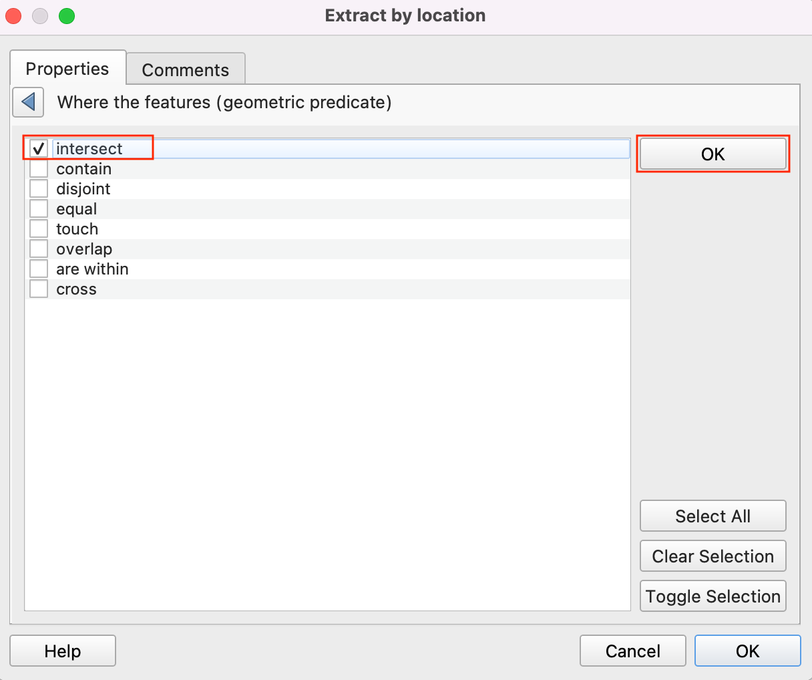
```

18. Select **Model input** by clicking the button under *By comparing to the features from* and choose **Input Points** as *By comparing to the features from*. Click OK.

```{r echo=FALSE, fig.align='center', out.width='75%'}
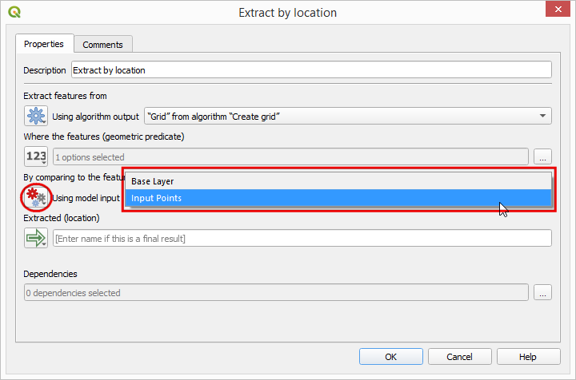
```

19. Now, we have only those grid polygons that contain some input points. To aggregate these points, we will use **Count points in polygon** algorithm. Search and drag it to the canvas.

```{r echo=FALSE, fig.align='center', out.width='75%'}
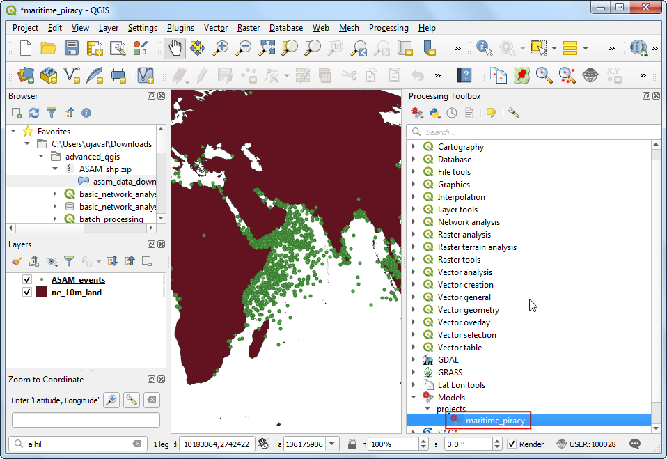
```

20. Select **Algorithm Output** by clicking the button under *Polygons* and choose **'Extracted (location)' from algorithm 'Extract by location'** for *Polygons*. Now, Select **Model Input** by clicking the button under *Points* and choose **Input Points** for *Points*. Type **NUMPOINTS** in **Count field name**. At the bottom, name the Count output layer as **Aggregated**. Click OK. 

```{r echo=FALSE, fig.align='center', out.width='75%'}
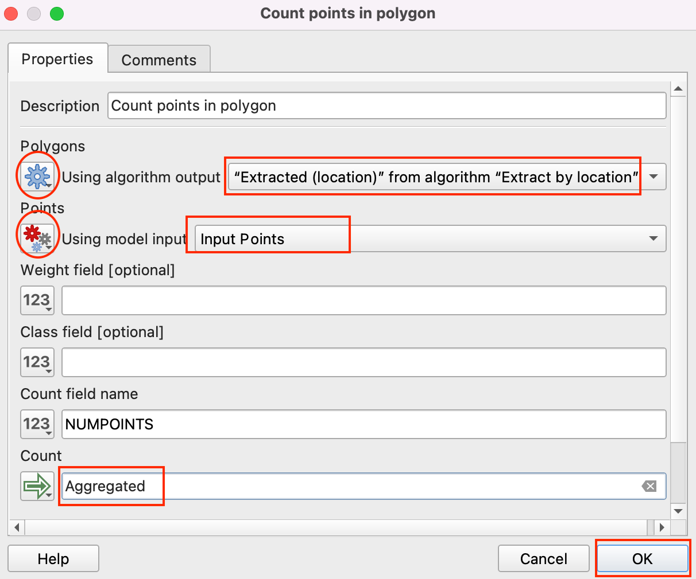
```

21. The model is now complete. Click the *Save* button. If the model is saved, then a green notification will pop on the screen.

```{r echo=FALSE, fig.align='center', out.width='75%'}
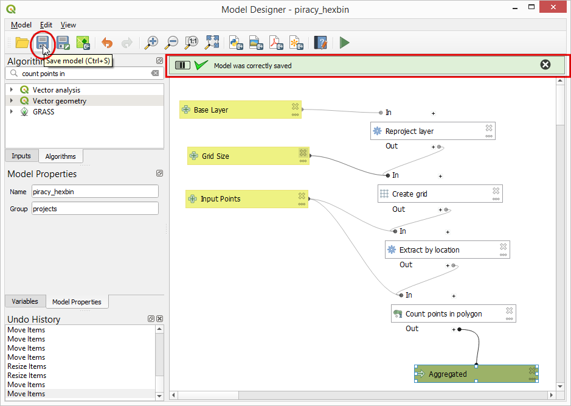
```

22. Switch to the main QGIS window. You can find your newly created model in the *Processing Toolbox* under **Models &rarr; projects &rarr; piracy_hexbin**. Double-click to run the model. 

```{r echo=FALSE, fig.align='center', out.width='75%'}
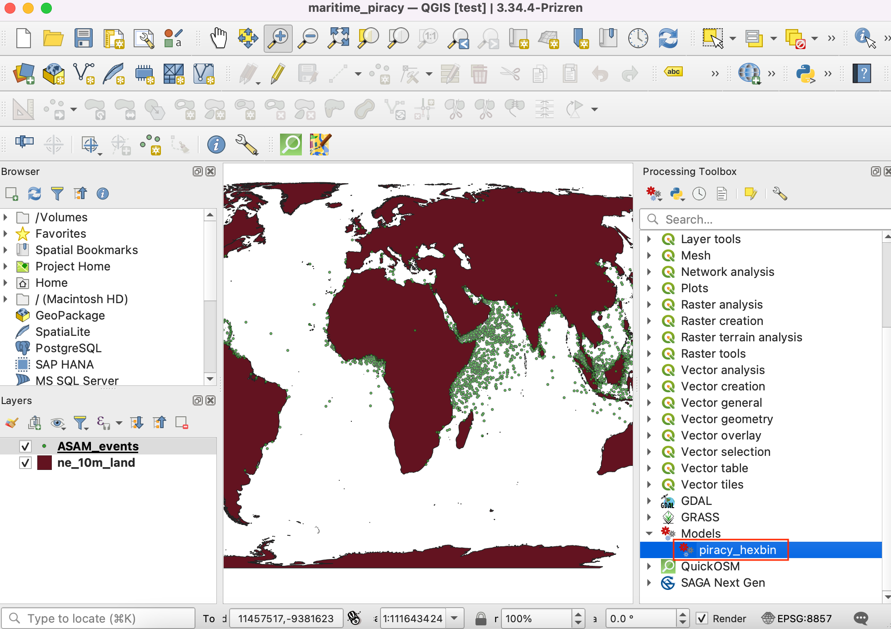
```

23. Our *Base Layer* is the ``ne_10m_land`` and the *Input Points* layer is ``ASAM_events``. The Grid Size needs to be specified in the units of the selected CRS. Enter ``100000`` as the Grid Size. Grid size is in the unit of the current CRS, which is meters. Click Run to start the processing pipeline. Once the process finishes, click Close.

```{r echo=FALSE, fig.align='center', out.width='75%'}
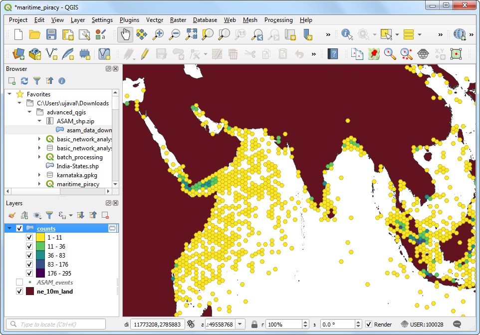
```

24. You will see a new layer ``Aggregated`` loaded as the result of the model. As you explore, you will notice the layer contains an attribute called *NUMPOINTS* containing the number of piracy incidents points contained within that grid feature. Let’s style this layer to display this information better. Click the *Open Layer Styling Panel* button from the *Layers panel.* Select **Graduated** symbology and **NUMPOINTS** as the Column. Click the dropdown next to the Color ramp and select the **Viridis** ramp. Click the dropdown again and select **Invert Color Ramp** to reverse the order of color. The Graduated symbology will divide the values in the selected column into distinct classes and assign a different color to each of the classes. Select **Natural Breaks (Jenks)** as the Mode and click **Classify**.

```{r echo=FALSE, fig.align='center', out.width='75%'}
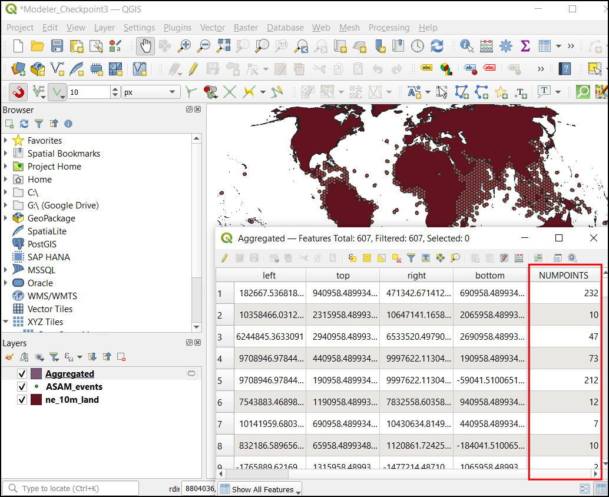
```

25. We will use a clever trick to make the visualization better. We can use QGIS variables to set the edges of the hexagon with a slightly darker shade of the fill color. Click on the **Symbol**. Click **Simple Fill**. Click the **Data defined override** button next to **Stroke color** and select **Edit**.

```{r echo=FALSE, fig.align='center', out.width='75%'}
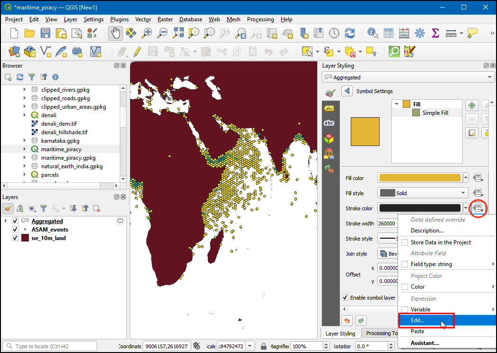
```


26. Enter the following expression to set the stroke color to 30% darker than the fill color and click OK. The map rendering will change to a much smoother visualization.

```
darker( @symbol_color , 130)
```
```{r echo=FALSE, fig.align='center', out.width='75%'}
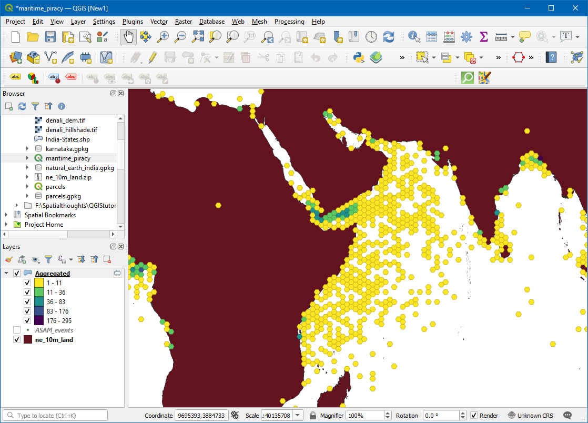
```


## 3.2 Challenge: Improve the model

Can you change the model so that instead of entering the grid size in meters, the user can enter the size in kilometers? 

> Hint: The **Create Grid** algorithm expects the size in meters, so you will have to convert the input to meters.


## Concept: Spatial Indexing

When you ran your model, you may have noticed a warning message **No spatial index exists for the input layer, performance will be severely degraded**. This is because certain spatial queries make use of a spatial index and QGIS warns you when having a spatial index can speed up your operations. PostGIS documentation has a good [overview of spatial indexes](https://postgis.net/workshops/postgis-intro/indexing.html) and why they are important.

You can compare a *spatial index* to a book *index*. When you want to search for a particular term, rather than scanning each page sequentially, you can speed up your search by looking up the index and directly going to the pages where the word appears. Spatial indexes work in similarly. You spent the effort once to create the index and all subsequent operations can make use of it. When you create a spatial index, each feature's bounding box is used to establish its relationship with other features. This is stored alongside the dataset and can be used by algorithms. When trying to determine spatial relationships, the algorithms speed-up the look-up using the following *two-pass* method:

* Step 1: Use the spatial index to determine which target features' bounding boxes intersect with the source feature's bounding box. Since the spatial index already has computed this - this is very fast. The result is a list of candidate features.
* Step 2: Now that there is a small subset of candidate features, iterate over them and use their full geometry to evaluate exact intersections. 

For large datasets, this approach helps reduce the processing time significantly.

[{width="400px"}](https://docs.google.com/presentation/d/1K1lR1JfonxGbmj8rCIVln_WkbWv6-tOYTYHAEJKAiw4/edit?usp=sharing){target="_blank"}

[View the Presentation](https://docs.google.com/presentation/d/1K1lR1JfonxGbmj8rCIVln_WkbWv6-tOYTYHAEJKAiw4/edit?usp=sharing){target="_blank"}

## 3.3 Add Spatial Index to the Model

QGIS has built-in tools to create and use spatial indexes. Let's see how we can create a spatial index for a layer and use it in our model.

1. Double click on the ```piracy_hexbin``` model from *Processing Toolbox*, select **ne_10m_land** as *Base Layer*, **200000** as *Grid size* and **ASAM_events** as *Inputs Points*. Click Run. 


```{r echo=FALSE, fig.align='center', out.width='75%'}
knitr::include_graphics('images/advanced_qgis/Index01.png')
```

2. Switch to *Log*, and note down the execution time of the model. In this instance we got *34.80 seconds* (The exact time will vary depending on your computer configuration).  Also note that it prompts a warning *No spatial index exists for input layer, performance will be severely degraded*. 

```{r echo=FALSE, fig.align='center', out.width='75%'}
knitr::include_graphics('images/advanced_qgis/Index02.png')
```

3. To create spatial index  right-click the **Aggregated** layer and select *Properties*. 

```{r echo=FALSE, fig.align='center', out.width='75%'}
knitr::include_graphics('images/advanced_qgis/Index03.png')
```

4. In the *Layer Properties* dialog, switch to the *Source* tab. You will see the *Create Spatial Index* button. This button indicates that this layer does not currently have a spatial index. Click that button to create a spatial index. But we will use a better and more scalable way. Click **OK** and close the *Layer  Properties* dialog.

```{r echo=FALSE, fig.align='center', out.width='75%'}
knitr::include_graphics('images/advanced_qgis/Index04.png')
```

5. Go to **Processing &rarr; Toolbox**. Search for the algorithm **Vector general &rarr; Create spatial index** and double-click to launch it.

```{r echo=FALSE, fig.align='center', out.width='75%'}
knitr::include_graphics('images/advanced_qgis/Index05.png')
```

6. Select **Aggregated** layer as the *Input layer* and click *Run*. 

```{r echo=FALSE, fig.align='center', out.width='75%'}
knitr::include_graphics('images/advanced_qgis/Index06.png')
```

7. Creating a spatial index is usually a fast operation. Once the algorithm finishes, right-click on the **Aggregated** layer and select *Properties*. Switch to the *Source* tab and you will see that the button has now changed to *Spatial Index Exists* - indicating that the layer now has a spatial index.

```{r echo=FALSE, fig.align='center', out.width='75%'}
knitr::include_graphics('images/advanced_qgis/Index07.png')
```

8. While creating a spatial index on a layer like this is useful, it is even more powerful to have the spatial index created during the execution of our model. We will see how to add the spatial index creation step in our model. Right-click the ```piracy_hexbin``` model and select *Edit Model…*. Search **Create spatial index** in *Algorithms* tab and drag it to the model canvas.

```{r echo=FALSE, fig.align='center', out.width='75%'}
knitr::include_graphics('images/advanced_qgis/Index08.png')
```

9. Choose **Algorithm output** from the button below *Input Layer*, and select **“Grid” from algorithm “Create Grid”.** Click OK.

```{r echo=FALSE, fig.align='center', out.width='75%'}
knitr::include_graphics('images/advanced_qgis/Index09.png')
```

10. You will see that the newly added ```Create spatial index``` algorithm is connected to the ```Create grid``` algorithm. But the workflow should be, **Create grid &rarr; Create spatial index &rarr; Extract from location**. 

```{r echo=FALSE, fig.align='center', out.width='75%'}
knitr::include_graphics('images/advanced_qgis/Index10.png')
```

11.  Right-click the ```Extract by location``` 
layer and select *Edit*. In *Extract features from* select **“Indexed Layer” from algorithm “Create spatial index”**.  

```{r echo=FALSE, fig.align='center', out.width='75%'}
knitr::include_graphics('images/advanced_qgis/Index11.png')
```

12.  Now you will see the model diagram updated and the connection changed between the ```Create Grid``` and ```Extract by location``` layer. Click *Save model*. 

```{r echo=FALSE, fig.align='center', out.width='75%'}
knitr::include_graphics('images/advanced_qgis/Index12.png')
```

13. Now return to the main canvas and select ```piracy_hexbin``` model. 

```{r echo=FALSE, fig.align='center', out.width='75%'}
knitr::include_graphics('images/advanced_qgis/Index13.png')
```

14. Select **ne_10m_land** as *Base Layer*, **200000** as *Grid size* and **ASAM_events** as *Inputs Points*. Click Run. 

```{r echo=FALSE, fig.align='center', out.width='75%'}
knitr::include_graphics('images/advanced_qgis/Index14.png')
```

15. In this instance we got *3.39 seconds* (The exact time will vary depending on your computer configuration). Also, note that it has executed 5 algorithms which is including creating the spatial index. 

```{r echo=FALSE, fig.align='center', out.width='75%'}
knitr::include_graphics('images/advanced_qgis/Index15.png')
```


## 3.4 Using Conditions 

A key feature introduced in QGIS 3.14 was the ability for models to have a conditional branch. This allows models to check for a condition and execute a different part of the model based on the output of the condition. This is equivalent to *If/Else statements* in a programming language.

Let us develop a *Conditional branch* in the `piracy_hexbin` model. We will add a new check-box input *Use Spatial Index* - that allows the user to specify whether to use a spatial index in the model. We will add a conditional branch that takes the following actions:

- If the *Use Spatial Index* option is selected, the model will create a spatial index for the grid layer and use it in the subsequent steps.
- If the option is not selected, the model will proceed without generating a spatial index.

1. Right-click the ```piracy_hexbin``` model and select **Edit Model…**.

```{r echo=FALSE, fig.align='center', out.width='75%'}
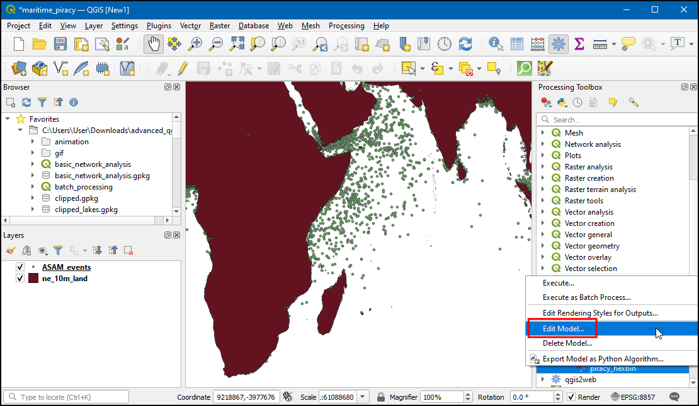
```

2.  Search for **+Boolean** in *Inputs* tab and drag to canvas. 

```{r echo=FALSE, fig.align='center', out.width='75%'}
knitr::include_graphics('images/advanced_qgis/conditionalBranch02.png')
```

3.  Give *Description* as **Use Spatial Index**, leave **Checked** unticked. Click **OK**. 

```{r echo=FALSE, fig.align='center', out.width='50%'}
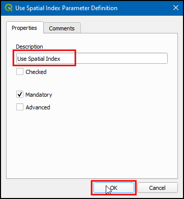
```

4.  Now, search for **Conditional branch** in *Algorithms* tabs and drag to canvas. 

```{r echo=FALSE, fig.align='center', out.width='75%'}
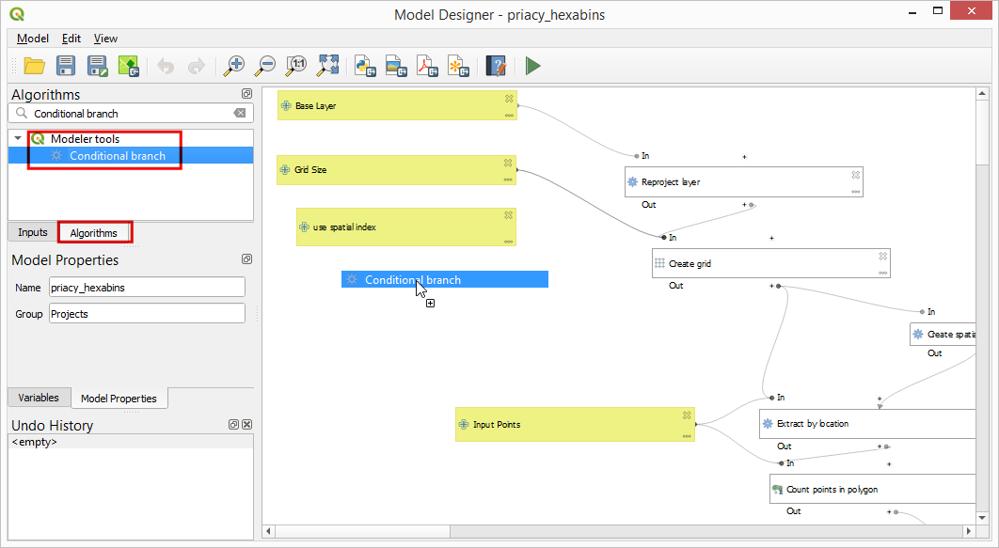
```

5. Click the Add button and select the Expression Dialog button. 

```{r echo=FALSE, fig.align='center', out.width='75%'}
knitr::include_graphics('images/advanced_qgis/conditionalBranch05.png')
```
6. All the model output and intermediate layers will be displayed in Bold characters, double click in **usespatialindex**. It will add the variable `@usespatialindex` as the expression. Click *OK*. 

```{r echo=FALSE, fig.align='center', out.width='75%'}
knitr::include_graphics('images/advanced_qgis/conditionalBranch06.png')
```

7. Now, in *Branch Name* type **Use Spatial Index**. We will add another branch now. Click the *Add* button and enter the *Branch Name* as **Don't Use Spatial Index**. Since this is the opposite condition, we can use the expression `NOT @usespatialindex` Click *OK*.

> Make sure to hit the *Enter* key after typing the *Branch Name*. The input may not be saved if you forget to do so.

```{r echo=FALSE, fig.align='center', out.width='75%'}
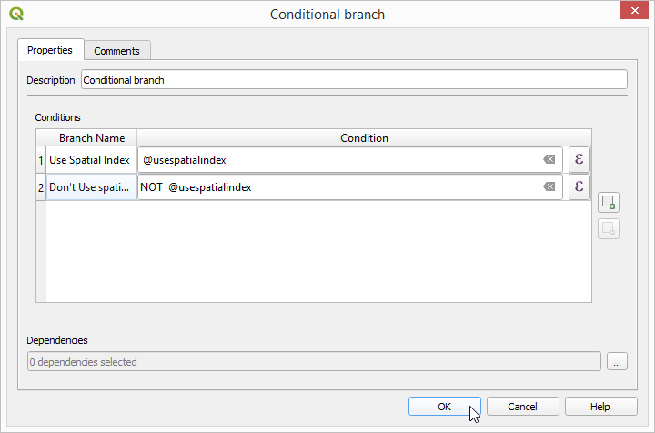
```

8. We have 2 branches in the model. Let's connect them to appropriate algorithms. Double click on ``Create spatial index`` algorithm in model canvas and click *…* next to *Dependencies.* 

```{r echo=FALSE, fig.align='center', out.width='75%'}
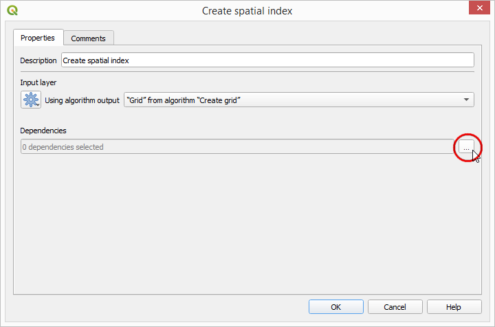
```

9. Choose **Condition “Use Spatial Index” from algorithm “Conditional branch”** and click **OK**. The *Use Spatial Index* branch is now ready. Let's build the other branch.

```{r echo=FALSE, fig.align='center', out.width='75%'}
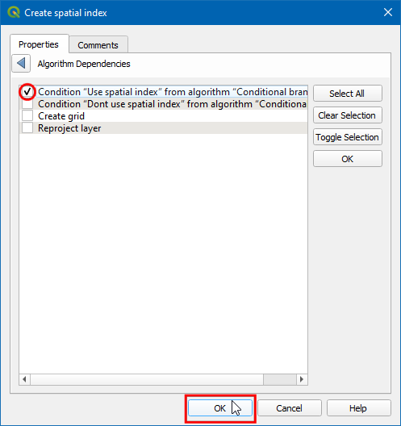
```

10.  Search for **Extract by location** in  *Algorithms* tab and drag to canvas.

```{r echo=FALSE, fig.align='center', out.width='75%'}
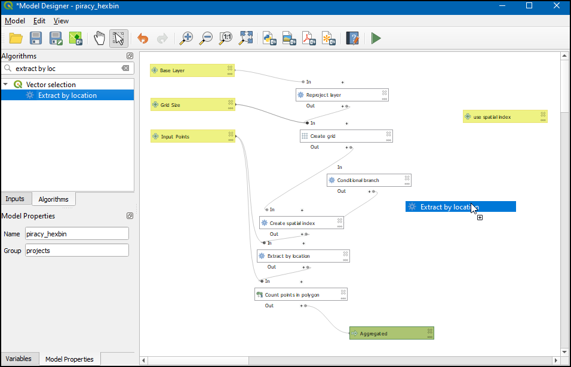
```

11. In the *Description* type **Extract by location (No Spatial Index)**. Choose *Algorithm Output* in *Extract features from* and select **"Grid" from algorithm "Create grid"**. Click *…* next to *Dependencies*.

```{r echo=FALSE, fig.align='center', out.width='75%'}
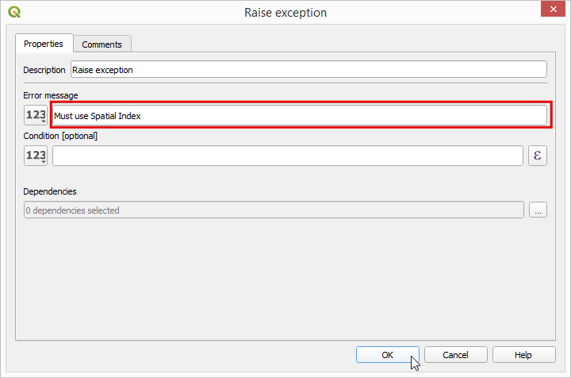
```

12. Choose **Condition “Dont use Spatial Index” from algorithm “Conditional branch”**. Click **OK**.

```{r echo=FALSE, fig.align='center', out.width='75%'}
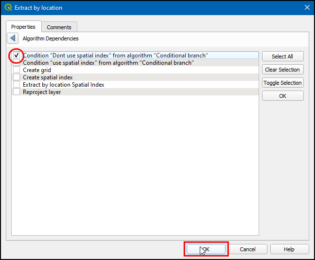
```

13. Similarly in *Extract by location* using *Spatial Index* change the description to **Extract by location (Spatial Index)**. Both the branches will be executed according to the user selection whether to use the spatial index or not. The next step is to update the the *Count points in polygon* algorithm to use the appropriate output. Double-click on the algorithm box.

```{r echo=FALSE, fig.align='center', out.width='75%'}
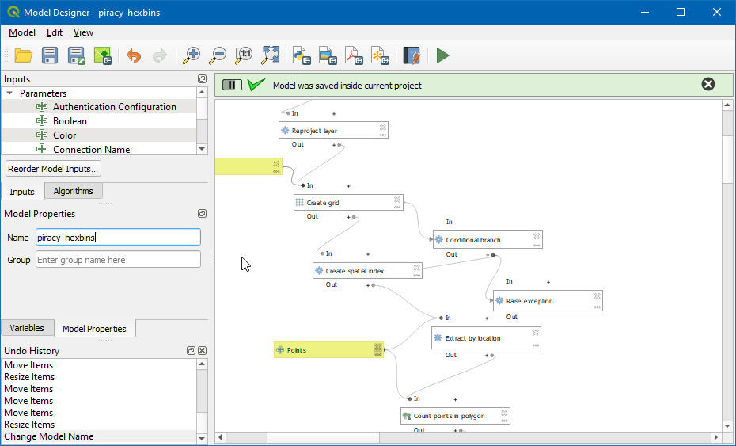
```

14. Under *Polygons* change *Algorithm output* to *Pre-calculated Value*, then press the *Expression* button. 

```{r echo=FALSE, fig.align='center', out.width='75%'}
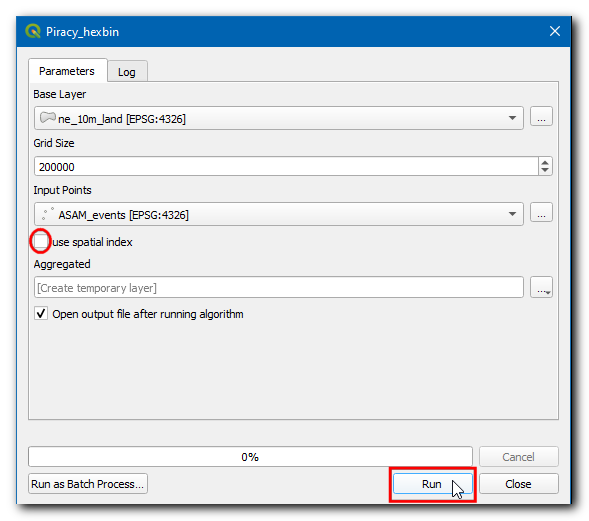
```

15. In the *Expression Dialog*, we need to select output from any one of the *Extract by location* algorithms based on the user condition of ``@usespatialindex``. We can use the ``if`` condition to return a layer based on user input. Use the expression below. Remember to pick the variables from the list and double-click them to enter them in your expression. If you had named the algorithms or input differently, the variable names will be different for you. Click **OK**. 

```
if( @usespatialindex ,  
    @Extract_by_location__Spatial_Index__OUTPUT ,
    @Extract_by_location__No_Spatial_Index__OUTPUT) 
```

```{r echo=FALSE, fig.align='center', out.width='75%'}
knitr::include_graphics('images/advanced_qgis/conditionalBranch15.png')
```

16. Now click ... in *Dependencies*. 

```{r echo=FALSE, fig.align='center', out.width='75%'}
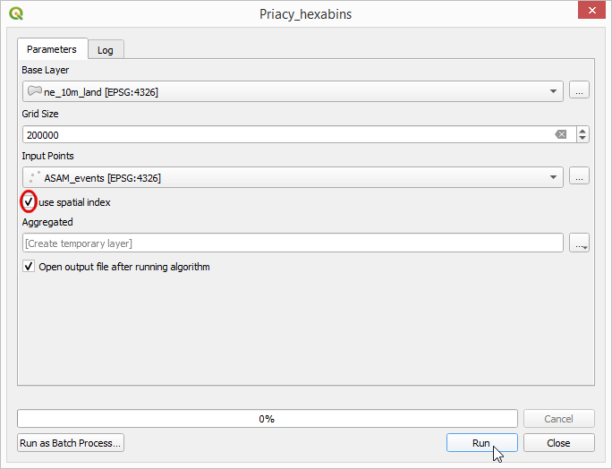
```

17.  Check ``Extract by location (Spatial Index)`` and ``Extract by location (No Spatial Index)`` and click **OK**. 

```{r echo=FALSE, fig.align='center', out.width='75%'}
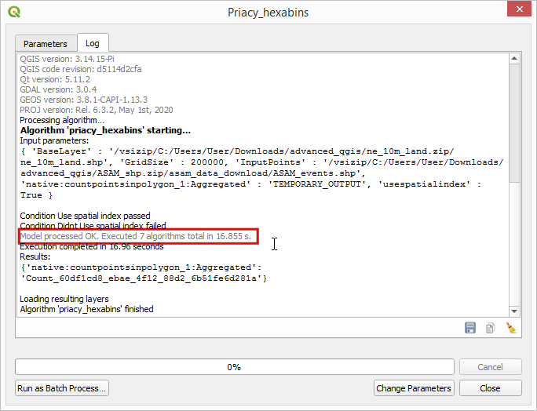
```

18. Now that the model is completed, click **Zoom full** button to view the model. Let us save the model click **Save model** button. 

```{r echo=FALSE, fig.align='center', out.width='75%'}
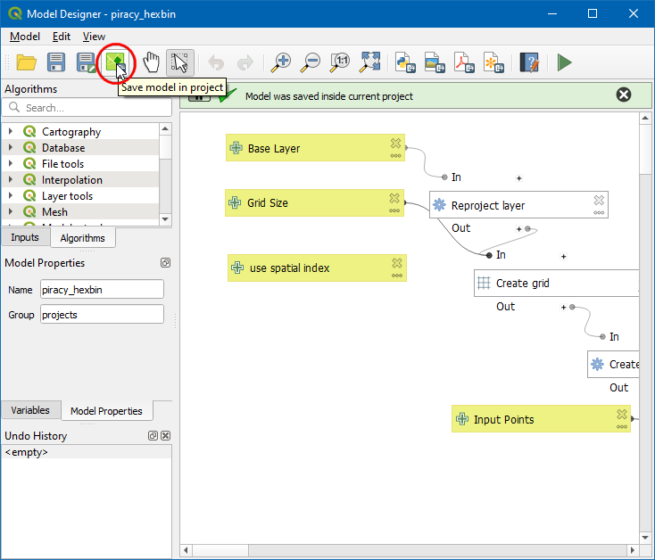
```

19. Now in the *Processing toolbox*, under that  **Models &rarr; projects &rarr; piracy_hexbin** model will be available. Double click to execute it. 

```{r echo=FALSE, fig.align='center', out.width='75%'}
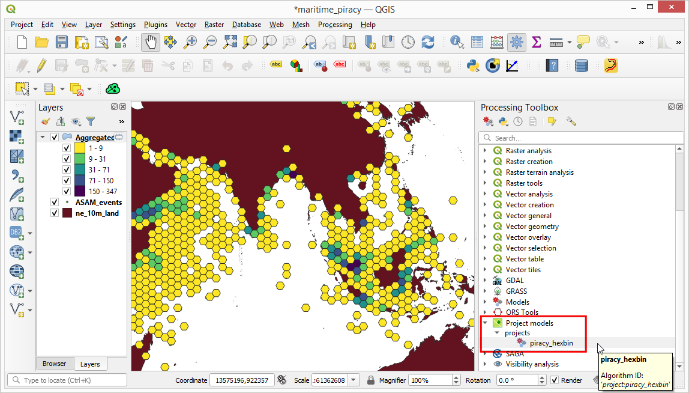
```

20.  In the *Base Layer* select **ne_10m_land**, *Grid size* as **100000**, and *Input points* as **ASAM_events**, check *Use Spatial Index* and click **Run**.

```{r echo=FALSE, fig.align='center', out.width='75%'}
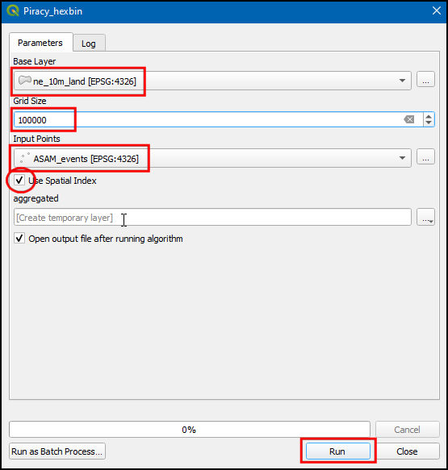
```

21. Switch to *Log*, we can notice the *Create spatial index* algorithm is activated, and the total time of execution is 7.41 seconds. 

```{r echo=FALSE, fig.align='center', out.width='75%'}
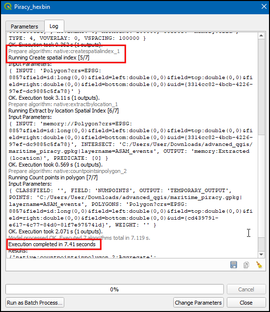
```

22. Now switch to *Parameters*, un-check the *Use Spatial Index* and click **Run**.  tab. 

```{r echo=FALSE, fig.align='center', out.width='75%'}
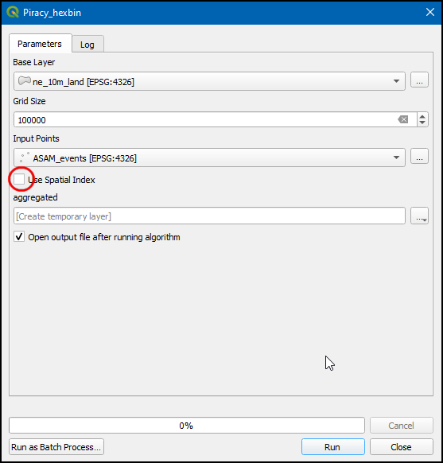
```

23.  Switch to the *Log*, we can notice the *No spatial index exists for input layer, performance will be severely degraded* warning get displayed, and the execution took  78.897 seconds. 

```{r echo=FALSE, fig.align='center', out.width='75%'}
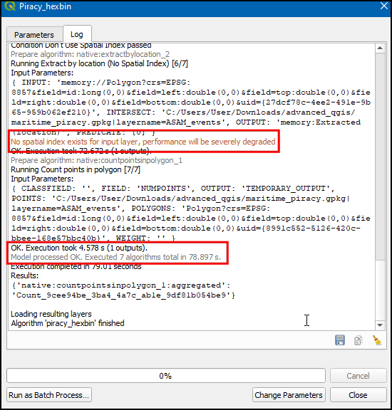
```


## 3.5 Enabling Reproducible Workflows

1. To ensure that you are always able to reproduce your results, it is recommended to bundle the model in your project. The modeler interface has a button **Save model in project** that will embed the model in your QGIS project file.

```{r echo=FALSE, fig.align='center', out.width='75%'}
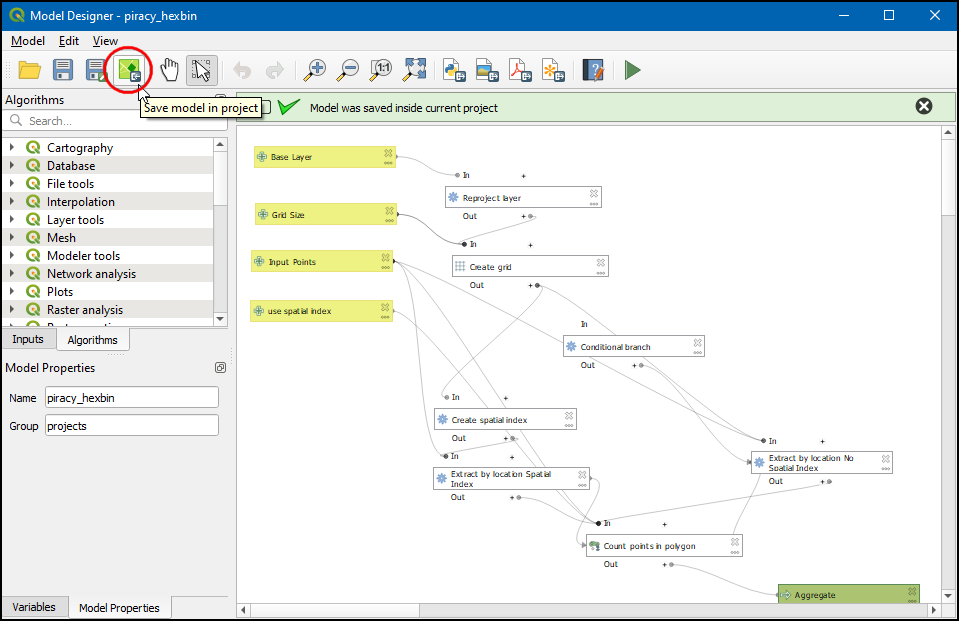
```

2. Once the model is embedded, Whenever you open the project, the model will be available to the user under the **Project models** in the Processing Toolbox.

```{r echo=FALSE, fig.align='center', out.width='75%'}
knitr::include_graphics('images/advanced_qgis/reproducibleWorkflows02.png')
```

3. Now, lets save this project in ``martime_piracy.gpkg`` geopackage. Click **Project &rarr; Save To &rarr; GeoPackage...**. 

```{r echo=FALSE, fig.align='center', out.width='75%'}
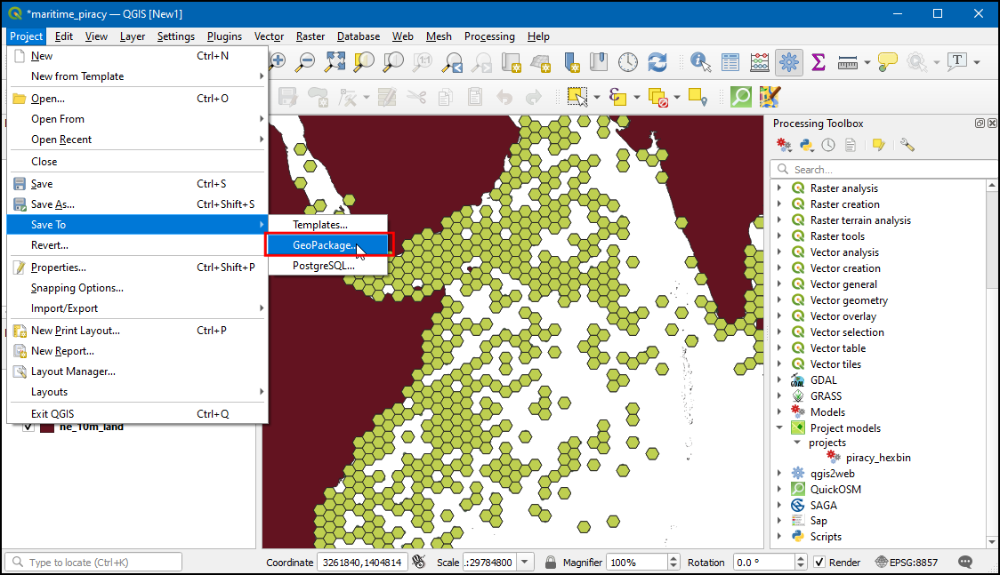
```

4. In the *Save project to GeoPackage* dialog box, click ... to browse to martime_piracy geopackage.

```{r echo=FALSE, fig.align='center', out.width='75%'}
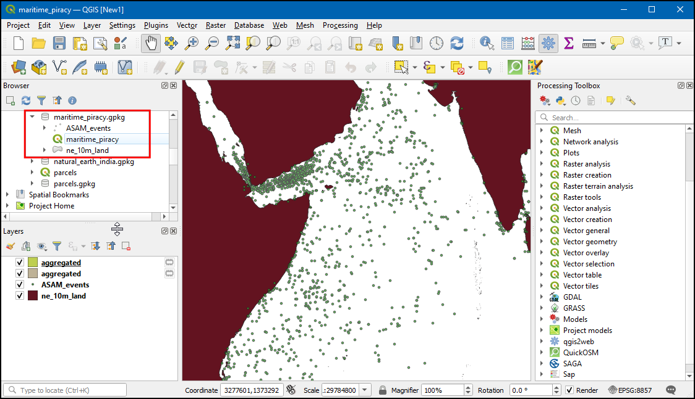
```

5. Enter project name as ``martime_piracy`` and click **OK**. 

```{r echo=FALSE, fig.align='center', out.width='75%'}
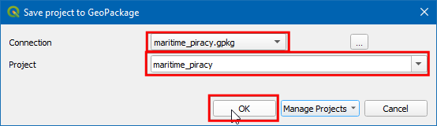
```

6. Now in *Browser*, under ``martime_piracy.gpkg`` the project is saved. You now have just 1 GeoPackage file that contains all your input layers, styles, project and models. Sharing this 1 file will enable anyone to reproduce your output using the embedded model and layers.

```{r echo=FALSE, fig.align='center', out.width='75%'}

```

# 4. 2D Animations

Time is an important component of many spatial datasets. Along with location information, time providers another dimension for analysis and visualization of data. If you are working with a dataset that contains timestamps or have observations recorded at multiple time-steps, you can easily visualize it using the **Temporal Controller** in QGIS 3.14 or above.

## 4.1 Create a GIF showing changes in piracy hotspots over time

We will continue to work with the maritime piracy dataset. First, we will create a heatmap visualization and then animate the heatmap to show how the piracy hot-spots have changed over the past 2 decades.

1. Open the **maritime_piracy** project from the data package. There are thousands of incidents and it is difficult to determine with more piracy. Rather than individual points, a better way to visualize this data is through a heatmap. Select the ``ASAM_events`` layers and click the **Open the layer Styling Panel** button in the Layers panel. Click the **Single symbol** drop-down. 

```{r echo=FALSE, fig.align='center', out.width='75%'}
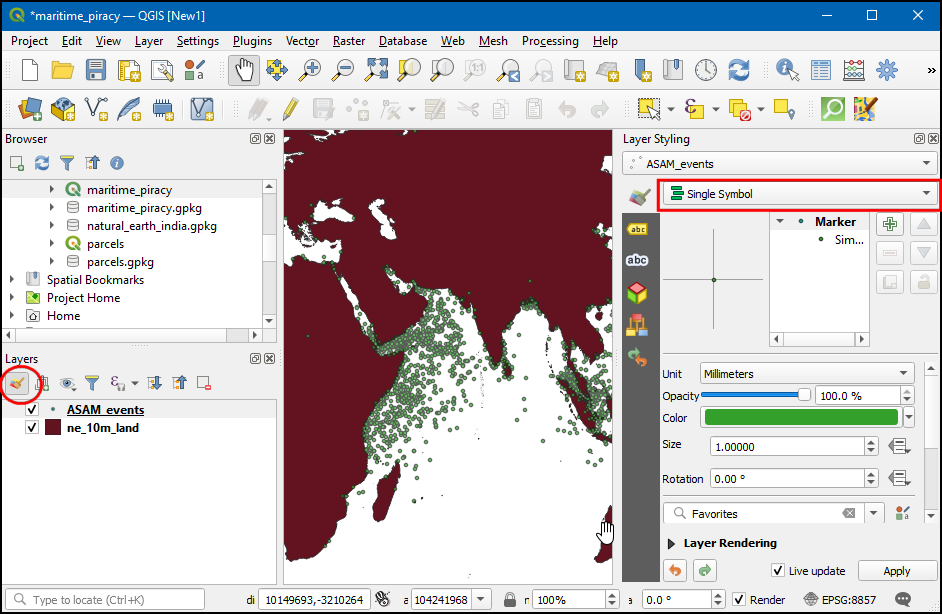
```

2. In the renderer selection drop-down, select **Heatmap** renderer. Next, select the **Viridis** color ramp from the Color ramp selector. Adjust the Radius value to **5.0.** At the bottom, expand the *Layer Rendering* section and adjust the opacity to **75.0%**. This gives a nice visual effect of the hotspots with the land layer below.

```{r echo=FALSE, fig.align='center', out.width='75%'}
knitr::include_graphics('images/advanced_qgis/2d02.png')
```

3. Now let’s animate this data to show the yearly map of piracy incidents. Right click on ``ASAM_event`` layer, and choose *Properties.*

```{r echo=FALSE, fig.align='center', out.width='75%'}
knitr::include_graphics('images/advanced_qgis/2d03.png')
```

4. In the layer properties dialog box,  select the *Temporal* tab and enable it by clicking the checkbox.

```{r echo=FALSE, fig.align='center', out.width='75%'}
knitr::include_graphics('images/advanced_qgis/2d04.png')
```

5. The source data contains an attribute ``dateofocc`` - representing the date on which the incident took place. This is the field that will be used to determine the points that are rendered for each time period. Select **Single Field with Data/Time** in *Configuration* Drop down menu, **dateofocc** as Field. Click *OK*.

```{r echo=FALSE, fig.align='center', out.width='75%'}
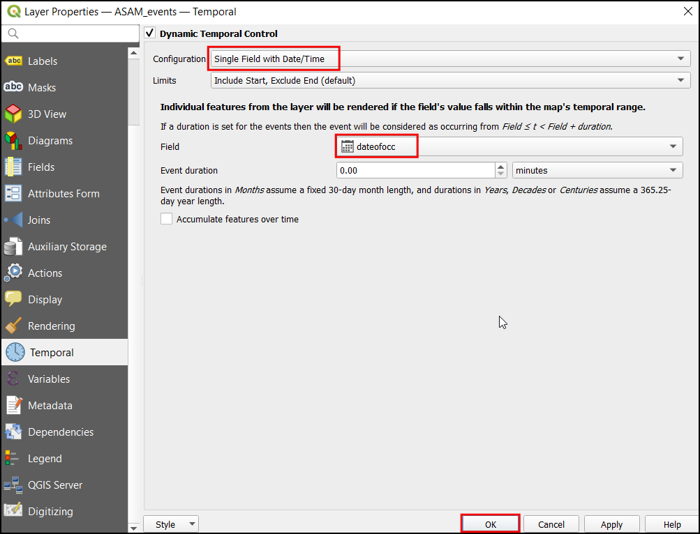
```

6. Now a *Clock symbol* will appear next to the layer name. Click on the **Temporal Control Panel** (Clock icon) from Map Navigation Toolbar. 

```{r echo=FALSE, fig.align='center', out.width='75%'}
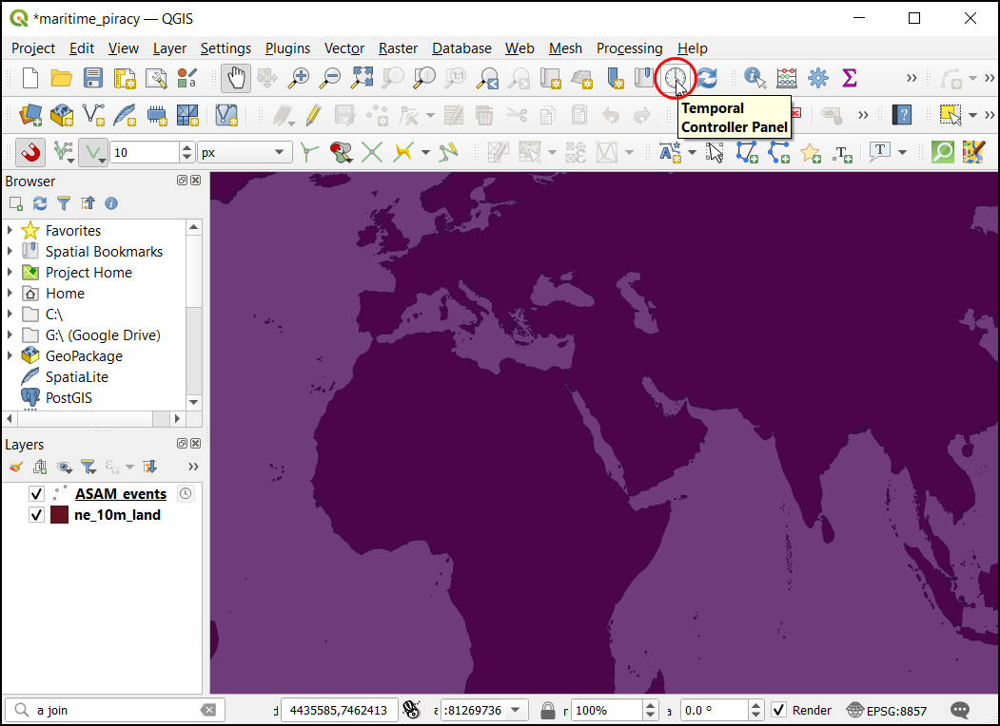
```

7. Click on the *Animated Temporal Navigation* (play icon).

```{r echo=FALSE, fig.align='center', out.width='75%'}
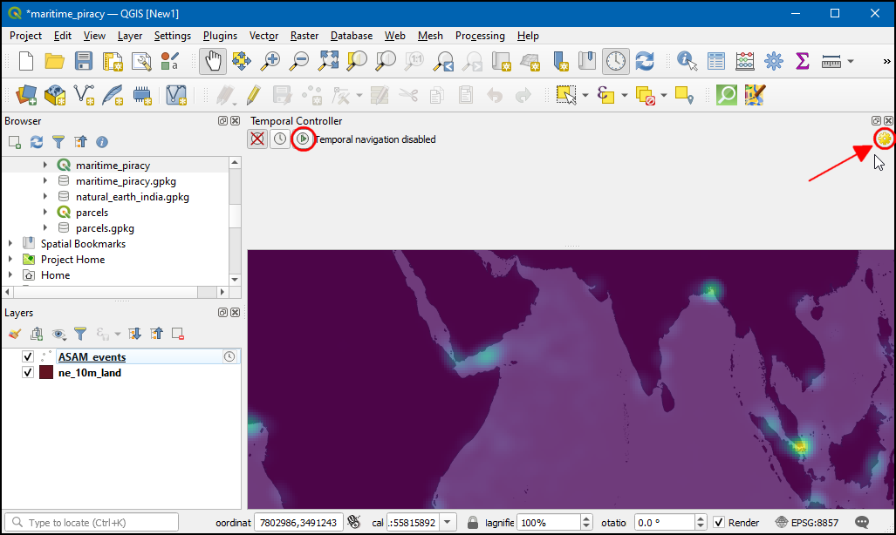
```

8. By default,  the date range is set to the current date. Click *Set to Full Range* button to set the date range from the dataset.

```{r echo=FALSE, fig.align='center', out.width='75%'}
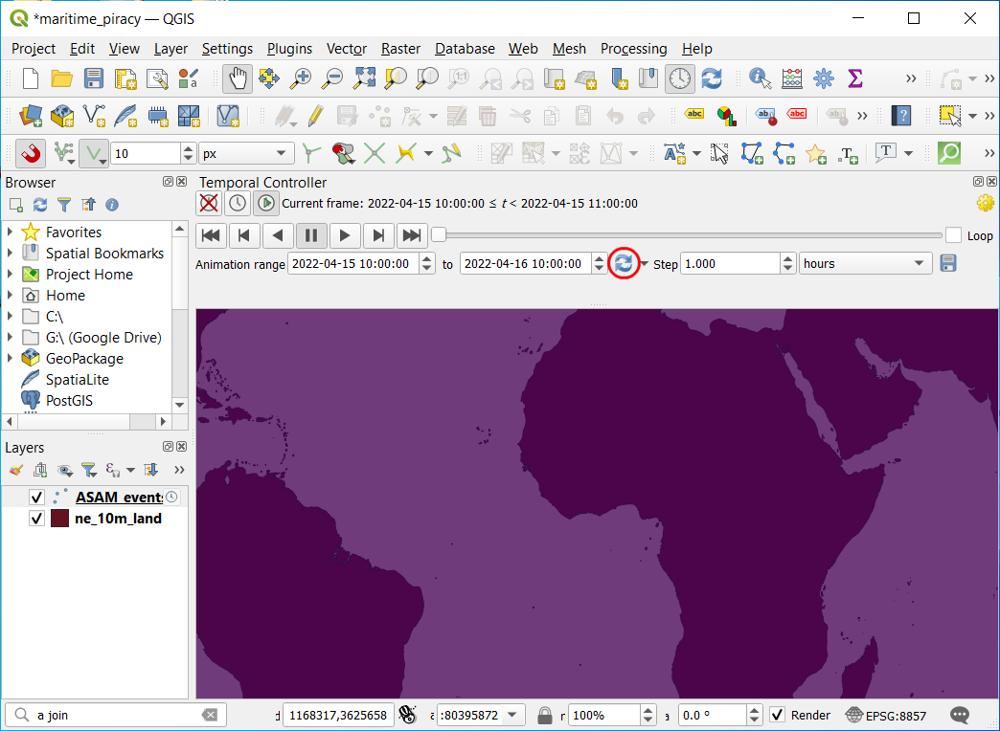
```

9. Now the data will be set to ``2000-01-02`` to ``2018-01-01``. We want to create an animation showing yearly changes to the hotspot. Set the *Step* to **years**. Click *play* button to start rendering.  

```{r echo=FALSE, fig.align='center', out.width='75%'}
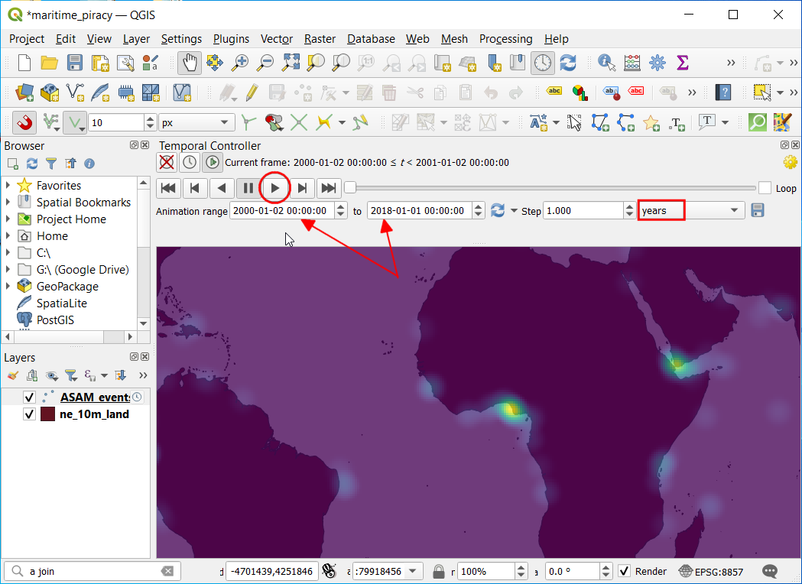
```

10. It will be useful to add a label to the animation showing the date of the animation frame being displayed. We can use the *Title Decoration* to place that label. Go to **View &rarr; Decorations &rarr; Title Label Decorations.** Click the checkbox to enable it and then the **Insert an Expression** button.

```{r echo=FALSE, fig.align='center', out.width='75%'}
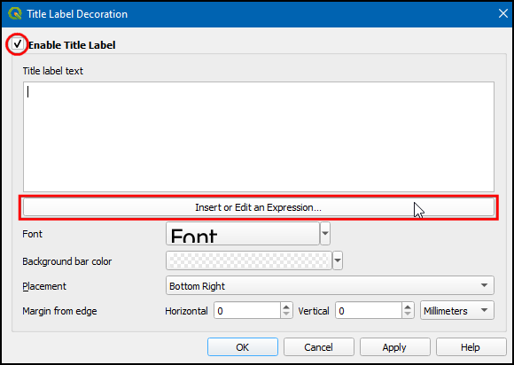
```

11. Enter the following expression to display the year and click *OK*.

```format_date(@map_start_time, 'yyyy-MM-dd')```

```{r echo=FALSE, fig.align='center', out.width='75%'}
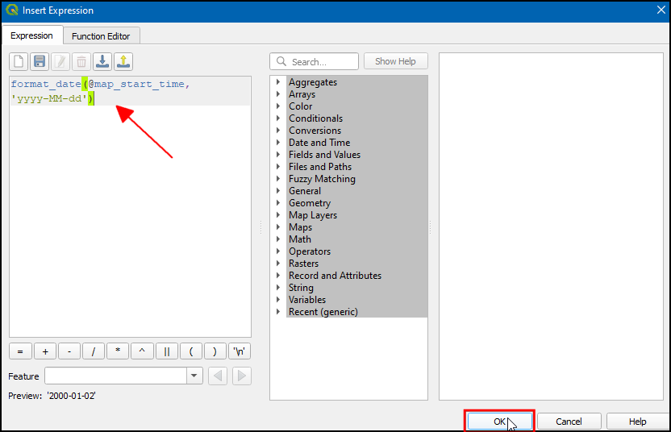
```

12. Select font size as **25**, set background color as **white.** In placement choose **Bottom Right.** Now click OK.

{target="_blank"}](images/advanced_qgis/2d12.png)

13. Once the parameters are set accordingly, the date will displayed on the map. To export these as images and convert them as GIF select the **Export Animation** (save icon) in the Temporal controller window.

```{r echo=FALSE, fig.align='center', out.width='75%'}
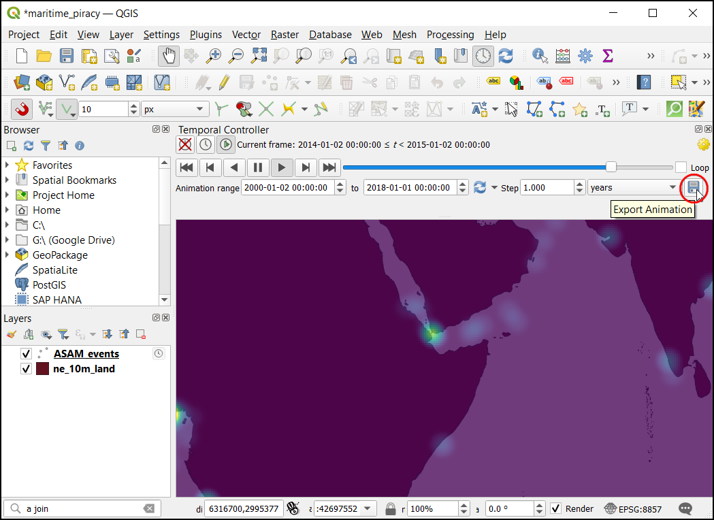
```

14. Choose the directory to save the images and select the ``ne_10_land`` for map extent.

```{r echo=FALSE, fig.align='center', out.width='75%'}
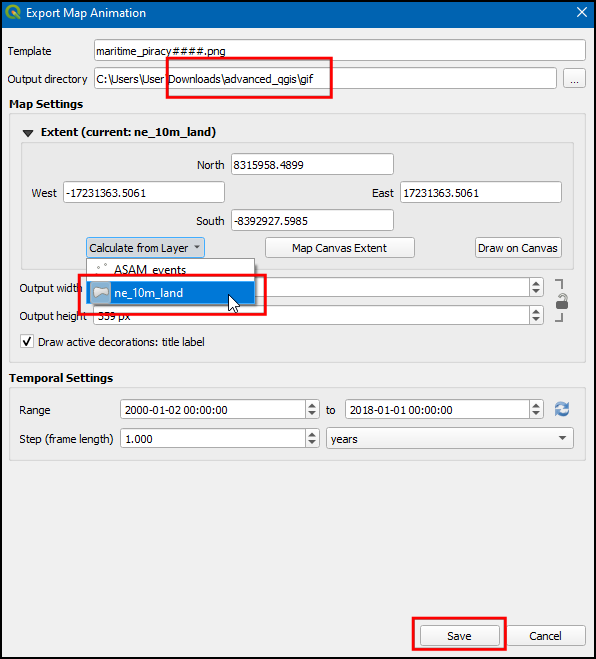
```

15. Once the export finishes, you will see PNG images for each year in the output directory. Now let’s create an animated GIF from these images. There are many options for creating animations from individual image frames. We like ] for an easy and online tool. Visit the site and click Choose Files and select all the .png files. You may want to sort the images by Type to allow easy bulk selection of only .png files. Once selected, click the Upload and make a GIF! button.

```{r echo=FALSE, fig.align='center', out.width='75%'}
knitr::include_graphics('images/advanced_qgis/2d15.png')
```

## 4.2 Challenge: Improve the animation

You will notice that for each frame of the animation, the year is displayed at the top-center. But instead of the full date and time, let’s change it to display the year that the map represents. Also, place the copyright info at the bottom right. The output should look something like below. 

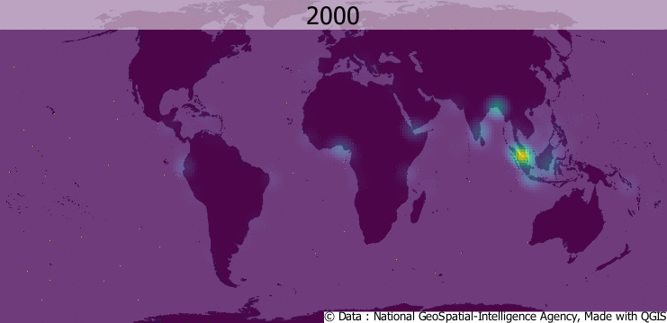{target="_blank"}](images/advanced_qgis/2d16.png)

# 5. 3D Animations

Recent versions of QGIS include native support for 3D data. Using this feature, you can easily view, explore and animate 3D elevation data. Note that your computer must have a supported graphics card for this feature to work.

## 5.1 Create a 3D Flythrough

We will work with a 5m Digital Elevation Model (DEM) of Denali peak in Alaska and create an animation showing a 3D visualization of the dataset.

1. Open the **denali** project from the data package. The data contains the raw DEM layer and a hillshade layer created from the DEM.

```{r echo=FALSE, fig.align='center', out.width='75%'}
knitr::include_graphics('images/advanced_qgis/3d01.png')
```

2. Let's create a colorized hillshade. It is possible to drape an image or colorized DEM to a hillshade layer using QGIS's **Layer Blending Modes**. Click on the **Open the Layer Styling Panel** icon. In the *Layer styling* panel, choose ``denali_hillshade`` and under *Layer Rendering* choose **Multiply** as *Blending mode*. The selected layer will be blended with the bottom layer. This is a great way to visualize your elevation dataset.

```{r echo=FALSE, fig.align='center', out.width='75%'}
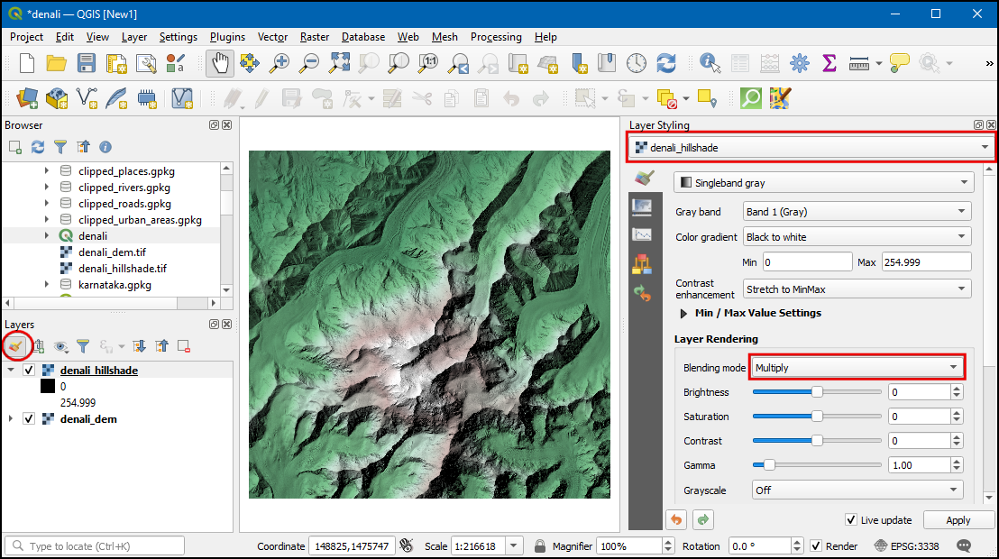
```

3. Let's view this data in 3D. Go to **View &rarr; New 3D Map View**.

```{r echo=FALSE, fig.align='center', out.width='75%'}
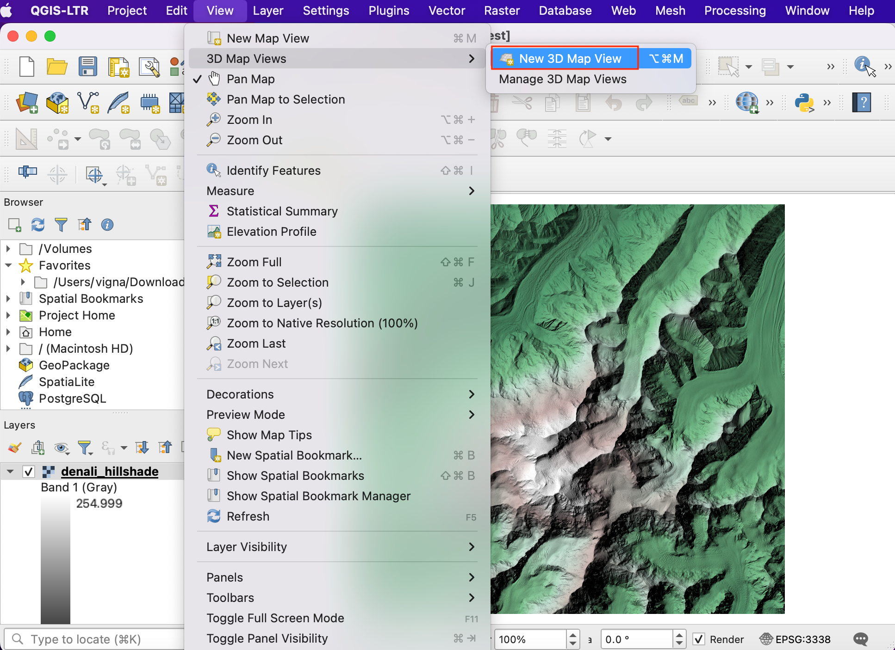
```

4. A new map window will open containing the rendered map layers from the main canvas. Click the **Configure** button.

```{r echo=FALSE, fig.align='center', out.width='75%'}
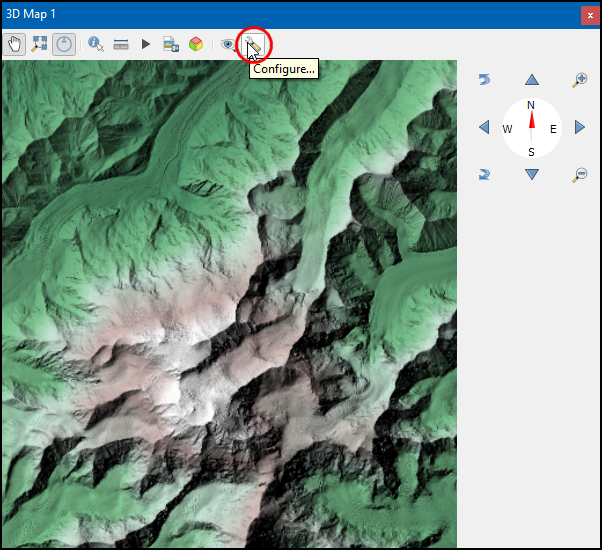
```

5. In the *Terrain* section, select **DEM (Raster Layer)** as the *Type*. Select ``denali_dem`` layer as the *Elevation*. Click OK.

```{r echo=FALSE, fig.align='center', out.width='50%'}
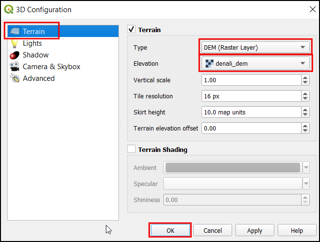
```

6. In the 3D view, you can hold the *Shift* key and drag your mouse to tilt the top-down view. You will see the map in 3D. You can also use the controls on the right-hand panel to tilt, zoom and pan the view.

```{r echo=FALSE, fig.align='center', out.width='75%'}
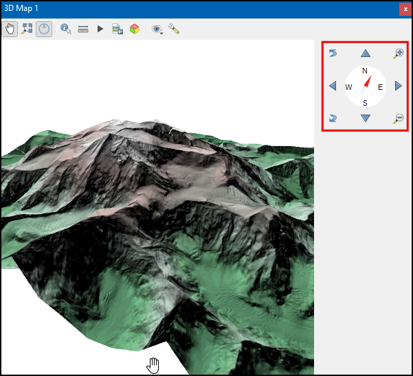
```

7. Now we will create an animation. Click the *Animations* button in the toolbar. To animate the view, we must define certain *keyframes*. Once you define a specific view for keyframes at different times, the system will try to smoothly animate the views between them. You can use the slider to go to a specific time, use the controls to set a specific view and click the *+* button to add a keyframe. Click the *Play* button to see the animation in action.

```{r echo=FALSE, fig.align='center', out.width='75%'}
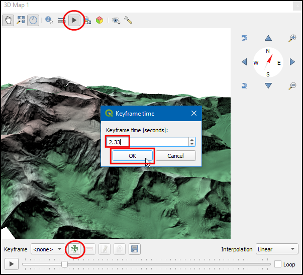
```

8. Once you are satisfied, click the *Export Animation Frames* button. Choose an output directory on your computer and click OK. Individual frames will be rendered and saved as separate files.

```{r echo=FALSE, fig.align='center', out.width='75%'}
knitr::include_graphics('images/advanced_qgis/3d08.png')
```

9. As we did in the previous section, you can use a service such as *[ezgif.com](https://ezgif.com/maker)* to create a GIF/Video from these frames. 

{target="_blank"}](images/advanced_qgis/3d09.png)

# 6. Summary Aggregate Expressions

QGIS expression engine has a powerful function called 'summary aggregates' that allows evaluating a feature's geometry and attributes with those of another layer. Expressions can be used for static calculations as well as on-the-fly computations, such as labels, virtual fields, symbology etc. This enables some powerful use cases.

The summary aggregate function operates on all the values from a different layer, returning a single summary value. The syntax of the aggregate function is as follows

```
aggregate(
  layer:='layer name or id',
  aggregate:='aggegate type',
  expression:='expression to aggregate',
  filter:='optional filter expression,
  concatenator:='optional string to use to join values',
  order_by:='optional expression to order the features'
  )
```  

[{width="400px"}](https://docs.google.com/presentation/d/1F-gH729oWv4zcCecXd9BYoNdqHr7KaahgMPm_4XCgBY/edit?usp=sharing){target="_blank"}

[View the Presentation](https://docs.google.com/presentation/d/1F-gH729oWv4zcCecXd9BYoNdqHr7KaahgMPm_4XCgBY/edit?usp=sharing){target="_blank"}

## 6.1 Count features from another layer

We will work with a land parcels data layer provided by the City of San Francisco. The goal of this exercise is to demonstrate the use of aggregate expression for on-the-fly computation when digitizing new features.

1. Open the **parcels** project from the data package. Select the ``boundary`` layer and click the **Open Field Calculator** button.

```{r echo=FALSE, fig.align='center', out.width='75%'}
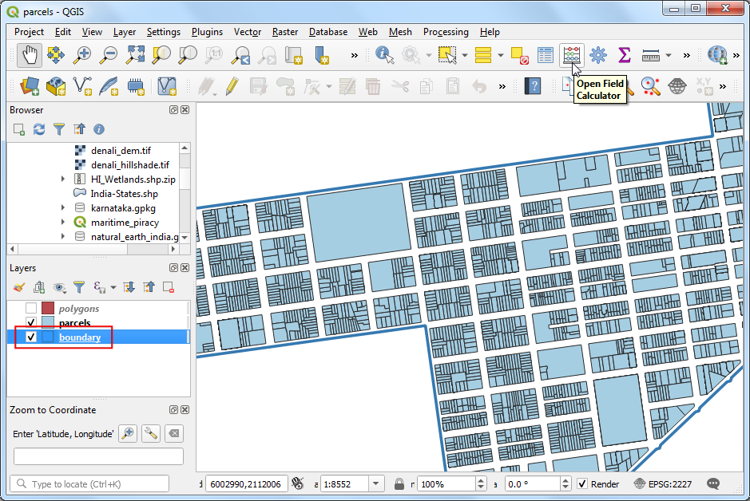
```

2. Add a new field named ``count`` with the following expression. The expression is reading the features from the ``parcels`` layer and giving an aggregate count of the features. You will notice that the the result will be displayed at the bottom of the window.

```
aggregate(
 layer:= 'parcels',
 aggregate:='count',
 expression:=fid
 )
```

```{r echo=FALSE, fig.align='center', out.width='75%'}
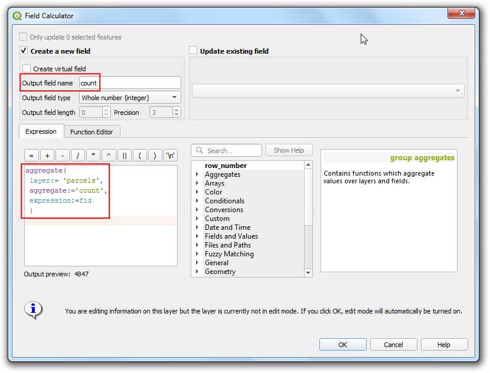
```

3. Now we can apply the same concept in a dynamic calculation. Back in the main QGIS window, select the ``polygons`` layer and right-click it. Select **Properties**.

```{r echo=FALSE, fig.align='center', out.width='75%'}
knitr::include_graphics('images/advanced_qgis/aggregate3.png')
```

4. Switch to the **Attributes Form** tab. Select the field ``count`` and choose **Text Edit** as the *Widget Type*. At the **Default Value** field at the bottom, enter the following expression. Note that additional filter value. Here the ``$geometry`` refers to the geometry of the ``parcels`` layer and ``geometry(@parent)`` refers to the geometry of feature from the ``polygons`` layer. Click OK.

```
aggregate(
 layer:= 'parcels',
 aggregate:='count',
 expression:=fid,
 filter:=intersects($geometry, geometry(@parent))
 )
```

```{r echo=FALSE, fig.align='center', out.width='75%'}
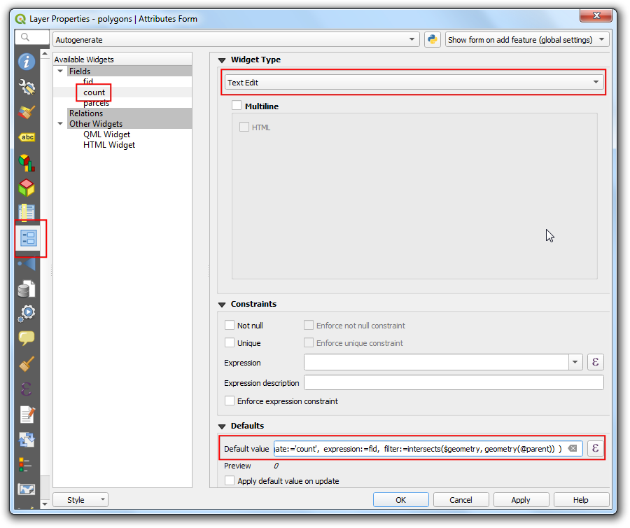
```

5. Back in QGIS, click the **Toggle Editing** button and draw a polygon using the **Add Polygon Feature** button. Right-click to finish the drawing. As soon as you finish, the count of intersecting features will be calculated by the aggregate expression and displayed in the ``count`` field.

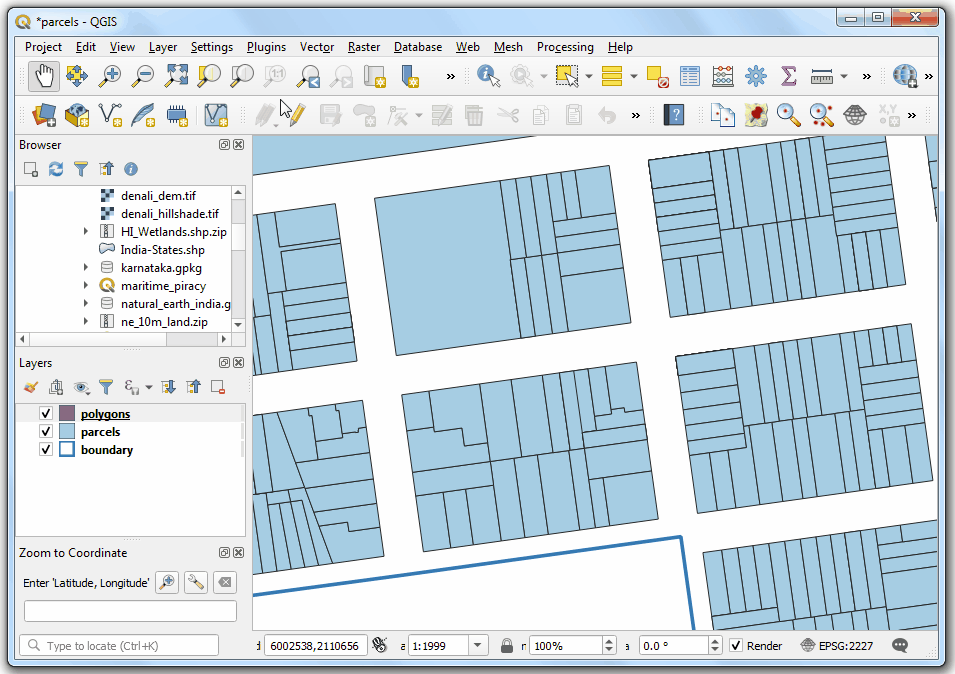{target="_blank"}](images/advanced_qgis/aggregate5.png)

6. There are many different types of aggregates available. We can use an aggregate called **concatenate** to compute a comma-separated text of all feature ids. Go to the **Attribute Form** properties again and select the ``parcels`` field. Enter the following expression as the **Default Value**.

```
aggregate(
 layer:= 'parcels',
 aggregate:='concatenate',
 concatenator:=',',
 expression:=to_string(fid),
 filter:=intersects($geometry, geometry(@parent))
 )
```

```{r echo=FALSE, fig.align='center', out.width='75%'}
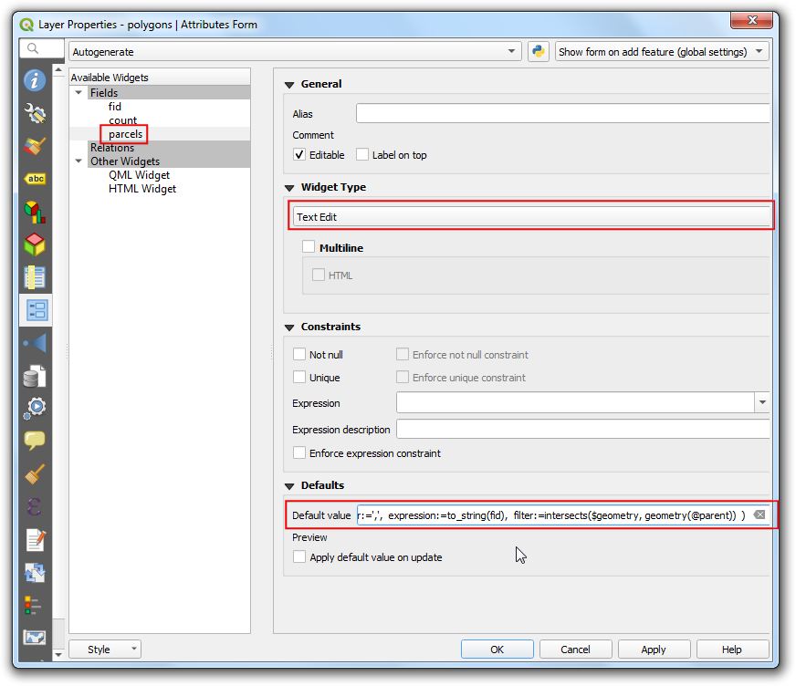
```

7. Now when to add a new feature, all the intersecting feature ids will be displayed along with the count.

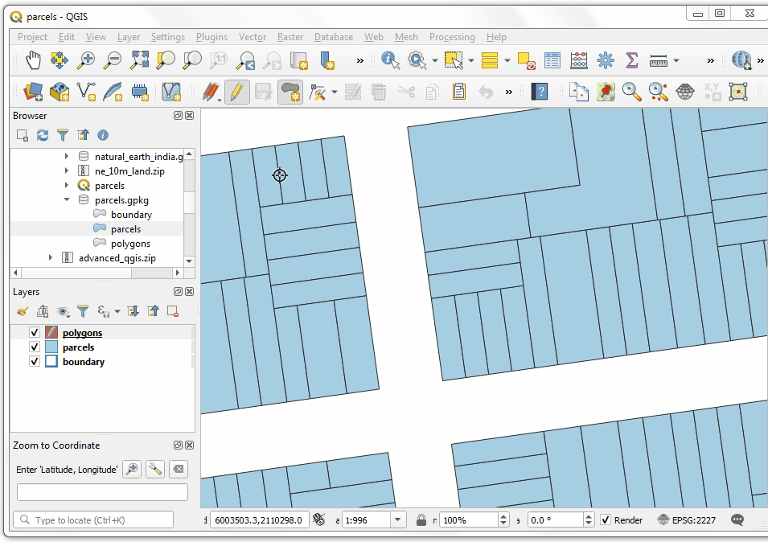{target="_blank"}](images/advanced_qgis/aggregate7.png)

## 6.2 Learn more

Apart from `aggregate()`, there are other advanced functions such as `array_foreach()` and `eval()` that are very powerful. Learn about them in the following video where I explain some use cases.

[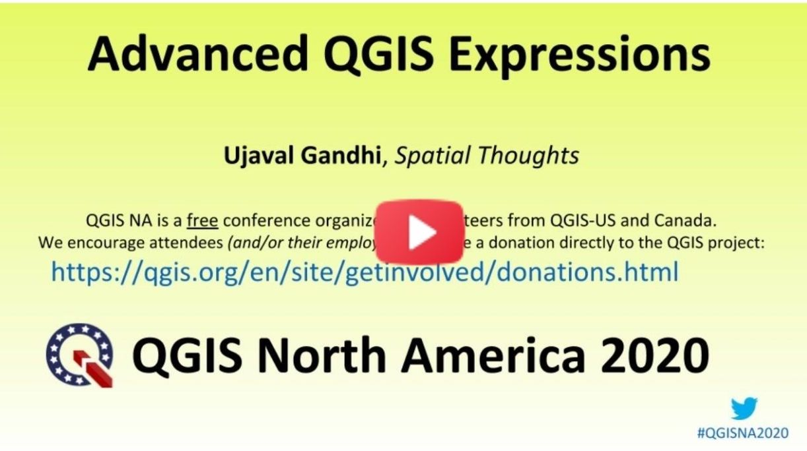{width="70%"}](https://www.youtube.com/watch?v=IXPCec8vgLA){target="_blank"}

# Data Credits
* OpenStreetMap (osm) data layers: Data/Maps Copyright 2019 Geofabrik GmbH and OpenStreetMap Contributors. [OSM India free extract](https://download.geofabrik.de/asia/india.html) downloaded from Geofabrik.
* India State boundary: Downloaded from [Datameet Spatial Data repository](https://github.com/datameet/maps/tree/master/States).
* Anti-shipping Activity Messages: [Maritime Safety Information portal](https://msi.nga.mil/NGAPortal/MSI.porta) , National Geospatial-Intelligence Agency
* Land boundaries: Made with Natural Earth. Free vector and raster map data @ naturalearthdata.com.
* Road Network: District of Columbia [Open Data Catalog](https://opendata.dc.gov/). 
* [Alaska IFSAR DTM](https://www.usgs.gov/centers/eros/science/usgs-eros-archive-digital-elevation-interferometric-synthetic-aperture-radar) distributed by USGS Earth Resources Observation and Science (EROS), Downloaded from USGS Earth Explorer
* Parcels and Neighborhood boundaries downloaded from [DataSF Open Data Portal](https://datasf.org/opendata/)

# License


This course material is licensed under a [Creative Commons Attribution-NonCommercial 4.0 International License](https://creativecommons.org/licenses/by-nc/4.0/). You are free to use the material for any non-commercial purpose. Kindly give appropriate credit to the original author.

If you would like to utilize these materials as part of a commercial offering, you can purchase a *Trainer License* for a small fee. 

Please [contact us](https://spatialthoughts.com/contact/) for pricing and terms.

<!--
This material is part of the *Trainer's Package* and the buyer gets a non-exclusive, non-transferable, perpetual license to the material. You can fully customize and brand the materials to your requirements.
-->

&copy; 2021 Spatial Thoughts [www.spatialthoughts.com](https://spatialthoughts.com)

***

**This course is offered as an instructor-led online class. Visit [Spatial Thoughts](https://spatialthoughts.com/events/) to know details of upcoming sessions.**