\newpage

***

**This course is also offered as an in-person class. To attend one of my workshops, visit the [Upcoming Classes](https://spatialthoughts.com/events/) page. Please sign up for [my mailing list](https://mailchi.mp/1d44f6c0c955/spatialthoughts) to know when new sessions are scheduled.**

***

\newpage

# Introduction 

This class focuses on techniques for automation of GIS workflows. You will learn techniques that will help you be more productive, create beautiful visualizations and solve complex spatial analysis problems. This class is ideal for participants who already use QGIS and want to take their skills to the next level.

Below are the topics covered in this class

- Processing Framework - Algorithms, Batch processing and Modeler 
- Animating time-series data
- Creating 3D fly-through from aerial imagery
- Advanced Expressions for enabling faster data editing, fuzzy matching and more.

# Get the Data Package
The code examples in this class use a variety of datasets. All the required layers, project files etc. are available in the [advanced_qgis.zip](https://drive.google.com/uc?export=download&id=1VXQ5u9mvNIYhM8KgFDzC2PDtEclcDSWa) [~160MB]. Download and unzip this file to the `Downloads` directory.

# Processing Framework

QGIS 2.0 introduced a new concept called Processing Framework. Previously known as Sextante, the Processing Framework provides an environment within QGIS to run native and third-party algorithms for processing data. It is now the recommended way to run any type of data processing and analysis within QGIS - including tasks such as selecting features, altering attributes, saving layers etc. - that can be accomplished by other means. But leveraging the processing framework allows you to be more productive, fast, and less error prone. 

The Processing Framework consists of the following distinct elements that work together.

- **Processing Toolbox**: Contains individual tools (i.e. algorithms) grouped by providers and functionality
- **Batch Processing Interface**: Allows any processing tool to be executed on multiple layers together.
- **Graphical Modeler**: Allows the user to define the workflow and chain multiple processing steps together using a drag-and-drop mechanism. 
- **History Manager**: Records and stores all executions of algorithms to allow users to reproduce past analysis.
- **Results Viewer**: An interface to view non-spatial outputs from algorithms - such as tables and charts.

We will learn about each of these through hands-on exercises in the following sections.

## Processing Toolbox

Processing Toolbox is available from the top-level menu **Processing &rarr; Toolbox**. There are hundreds of algorithms available out of the box. They are organized by *Providers*. The tools created by QGIS developers is available as a **Native** QGIS provider. Processing Framework providers an easy way to integrate tools written by other software and libraries such as GDAL, GRASS and SAGA. QGIS Plugins can also add new functionality via processing algorithms in the toolbox.  


### Why should you use Processing Algorithms

- Well tested and rigorous implementations
- Majority are written in C++ and are faster than alternatives
- Long processes can run the the background while you continue to use QGIS
- Many multi-threaded algorithms can take advantage of multi-core CPU on your machines and give you better performance
- Robust handling of invalid geometry
- Ability to see progress of the operation and cancel it
- Easily run on all or just selected features


### Review default settings

You can control what providers are available in settings. The Processing Options menu also provides a way to fine-tune the configuration of the framework.


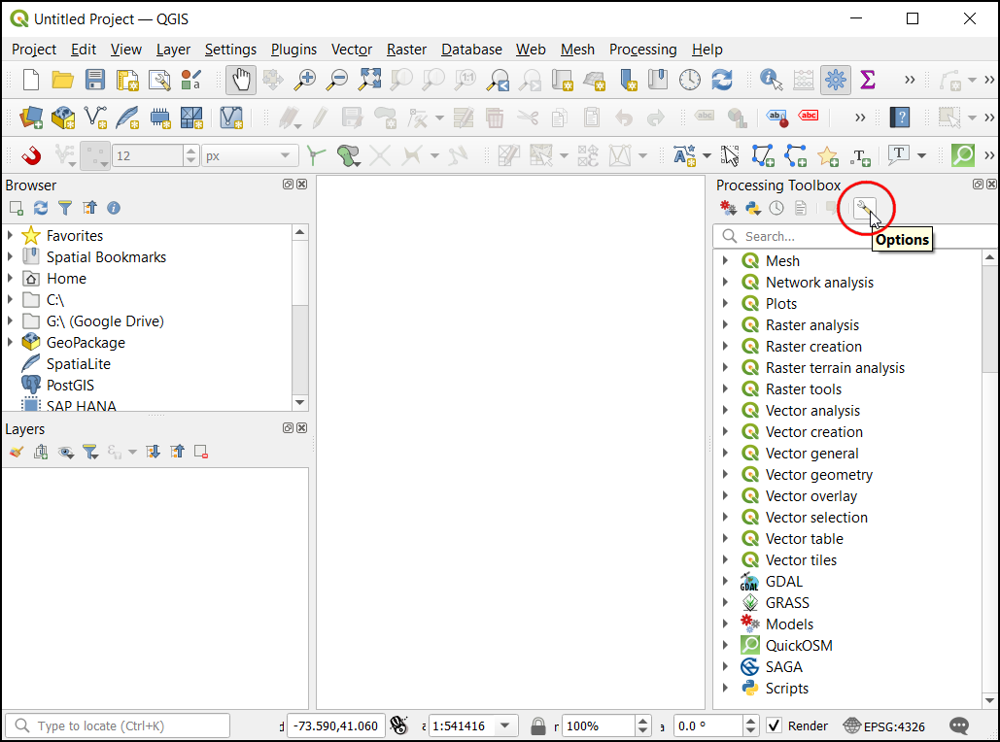


I strongly recommend, changing the default settings and enable the option *Prefer output filename for layer names*. This option ensures that when you use batch processing, the resulting layers are unique.

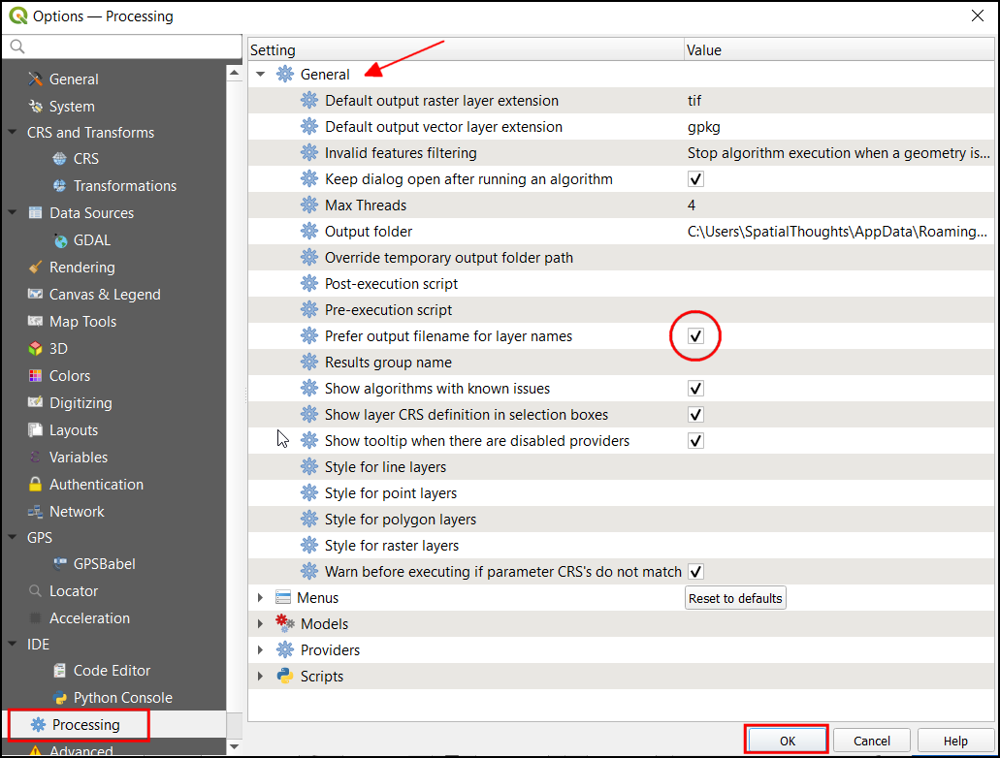

### Exercise: Find the length of national highways in a state

The aim of this exercise is to show how a multi-step spatial analysis problem can be solved using a purely processing-based workflow. This exercise also shows the richness of available algorithms in QGIS that are able to do sophisticated operations that previously needed plugins or were more complex.

We will work with roads extracted from OpenStreetMap for the state of Karnataka in India. The admin boundary for the  state and the districts come from DataMeet.

Browse to the data directory and expand ``karnataka.gpkg``. Drag and drop the ``karnataka``, ``karnataka_districts`` and ``karnataka_major_roads`` layers to the canvas.


The layer ``karnataka_major_roads`` contain all major roads, including national highways, state highways, major arterial roads etc. Select the layer and use the keyboard shortcut **F6** to open the attribute table.


You will notice that the ``ref`` column has information about road designation. As we are interested in only national highways, we can use the information in this column to extract relevant road segments.


You can use tools such as *Select by expression*, export the selected features as a new layer and continue to work. But the processing toolbox providers a much seamless workflow. Search for the algorithm **Extract by expression**.


Enter the following expression to extract the features where the value of the ``ref`` field starts with the letters ``NH``.

```
regexp_match("ref", '^NH')
```


You will get a new layer ``Matching Features`` in the Layers Panel. Next, we want to calculate the length of each segment. You can use the built-in algorithm **Add geometry attributes**


The source layer is in the Geographic CRS EPSG:4326. But for the analysis, we want the lengths to be measured in meters/kilometers. The algorithm provides us with a handy option to calculate the distances in **Elliposidal** math - which is ideal for layers in the geographic CRS.


A new layer with an additional field called ``length`` will be added to the Layers panel. The distances in this field are in meters. Let's convert them to kilometers. You may reach out for the trusty QGIS field calculator to add a new field. That's a perfectly valid way - but as mentioned earlier, there is a *processing* way to do things which is the preferred way. Search and open the **Field Calculator** processing algorithm instead and enter the following expression.

```
"length"/1000
```


A new layer with the field ``length_km`` will be added to the Layers panel. Now we are ready to find out the answer. We just need to sum of the values in the ``length_km`` field. Use the **Basic Statictics for Fields** algorithm.


The result is a table of different statistics on the column. As the result is not a layer, it will be displayed in the *Results Viewer*. The panel will contain the link to a HTML file containing the statistics. The **Sum** contains the total length of national highways in the state. 


> *What do you think of the results?* The resulting number may not be perfect because the OpenStreetMap database may have missing roads or are classified differently. But it is close to the number provided in the [official statistics](https://morth.nic.in/sites/default/files/PragatiKiNayiGati/pdf/karnataka.pdf).

The final layer is called ``Calculated`` and is a temporary memory layer. Let's save it to the disk so we can use it later. The layer contains many fields which are not relevant to us, so let's delete some columns before saving. The *classic* way to do this is to toggle editing and use the *Delete Column* button from the Attribute Table. If you wanted to rename/reorder certain fields, that needed a plugin. But now, we have a really easy processing algorithm called **Refactor Fields** that can add, delete, rename, re-order and change the field types all at once. Delete fields that are not required and save the result as the layer ``national_highways`` in the source ``karnataka.gpkg``.


The layer ``national_highways`` will be added to the Layers panel. We achieved the goal of the exercise, but
we can explore the results a bit better if we can break down the results by a smaller administrative unit. Let's try to calculate the length of national highways for each district in the state.


We have the district information in the ``karnataka_districts`` layer, but not in the ``national_highways`` layer. To add the name of the district to the roads layer, we need to perform a spatial-join. This is done using the **Join attributes by Location** algorithm.


Select the ``national_highways`` as the input layer and do a one-to-one join with the ``karnataka_districts`` layer. Select only the **DISTRICT** field to be added to the output.


The new layer ``Joined layer`` now has the intersecting district name in the **DISTRICT** field. We can now sum the road lengths and group them for each district. You may recall that in earlier versions of QGIS ,you needed a plugin called Group Stats to do this. But now we can do this via the built-in **Statistic by Categories** algorithm.


The output of the algorithm is a table containing various statistics on the ``length_km`` column for each district. The values in the **Sum** column is the total length of national highways in the district.

Note that we did data processing, spatial analysis and statistical analysis - all using just processing algorithms in a fast, re-producible and intuitive workflow.

### The Locator Bar

To take your processing experience to the next-level, you can use the built-in **Locator Bar**. At the bottom-left of QGIS main window, there is a universal search bar that can do keyword-search across layers, settings, processing algorithms and more. You can open the locator bar using the keyboard shortcut **Ctrl+K**. 


I find that rather than clicking-around the processing toolbox, you can just use locator bar to search and open the algorithms. Type **Ctrl+K**, followed by **a** (to restrict search to algorithms), followed by a **space** and **a few characters**. Use the arrow keys to select and press **Enter** to open the algorithm. 

{target="_blank"}](images/advanced_qgis/locator.png)

### In-place Editing

Processing algorithms are designed to take inputs and produce outputs. The default behavior is to create a new layer after each operation. This is useful for many workflows, especially in an enterprise setting, where you may not have the ability to edit the source data. If your algorithms are altering the source data, that also means that the workflows cannot be reproduced easily. So you would want a setup where the algorithms read from a source data and create modified outputs.

An exception to this workflow is when you are doing data editing. When your workflow involves creating new features or editing them - creating a new layer for every edit is undesirable. A recent [QGIS crowd-funding campaign](https://north-road.com/edit-features-in-place-using-qgis-spatial-operations-campaign/) added the ability for processing algorithms to modify the features in-place and this functionality is available out-of-the-box in QGIS now.

Load the **basic_network_analysis** project from the data package. This project contains a street network for Washington DC from DCGISopendata where the arrows display the digitizing direction of the line segments. You can click the **Edit Features In-Place** button in the processing toolbox to use algorithms that support this functionality. Once this mode is activated, processing algorithms will modify the selected features in the chosen layer instead of creating a new layer.


Select a line segment and run the **Reverse line direction** algorithm. The algorithm will enable editing on the layer, perform the operation and overwrite the existing feature with a segment in the reverse direction. You will see that the arrow rendering is now in the opposite direction.

{target="_blank"}](images/advanced_qgis/inplace2.png)


## Batch Processing

So far we have run the algorithm on 1 layer at a time. But each processing algorithm can also be run in a **Batch** mode on multiple inputs. This provides an easy way to process large amounts of data and automate repetitive tasks.

The batch processing interface can be invoked by right-clicking any processing algorithm and choosing **Execute as Batch Process**.

### Exercise: Clip multiple layers to a polygon

We will take multiple country-level data layers and use the batch processing operation to clip them to a state polygon in a single operation.

Open the **batch_processing** project from the data package.Select the ``India-States`` layer and use the **Select Features** tool to select a state by clicking it.

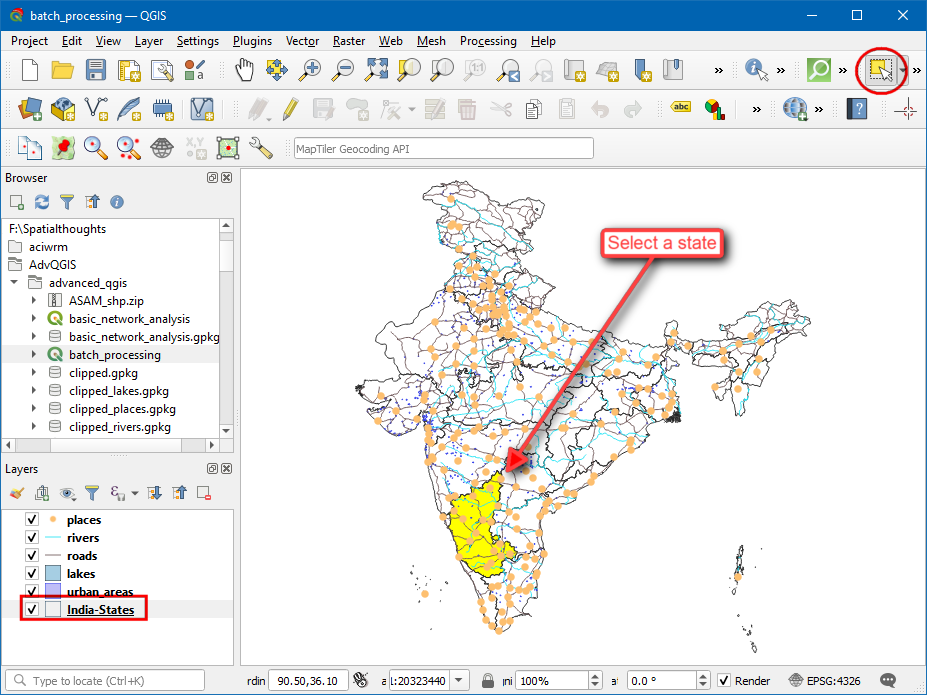

Next, use the **Extract selected features** processing algorithm to create a new layer from the selected feature. This will create a new layer called ``Selected features``


Search for the **Vector Overlay &rarr; Clip** algorithm and right-click on it. Select **Execute as Batch Process**.

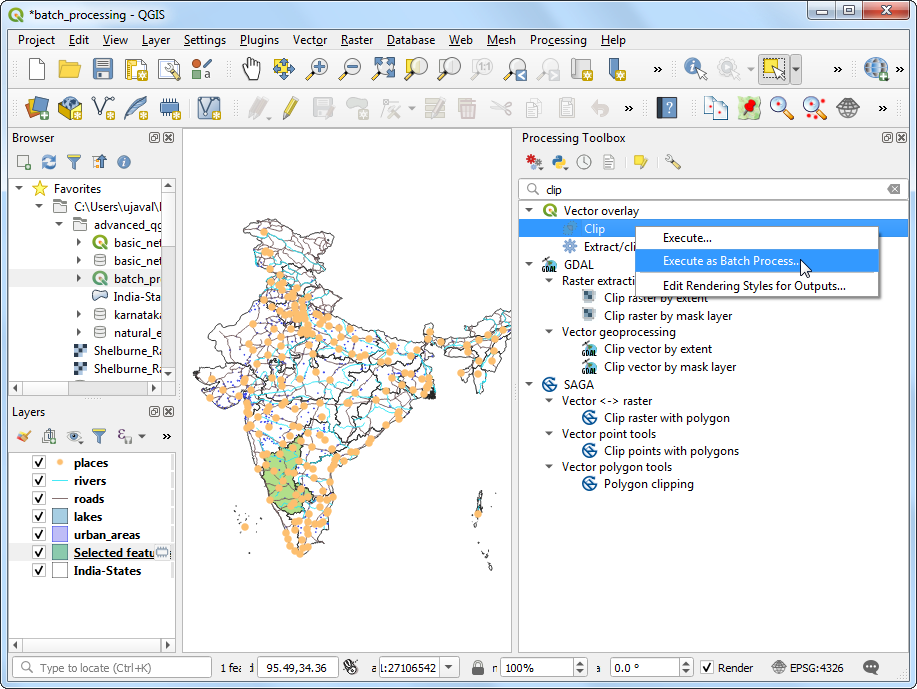

In the batch processing dialog, click the *...* button on the first row of the *Input layer* column and choose *Select from Open Layers..*. Select all data layers that you want to clip.

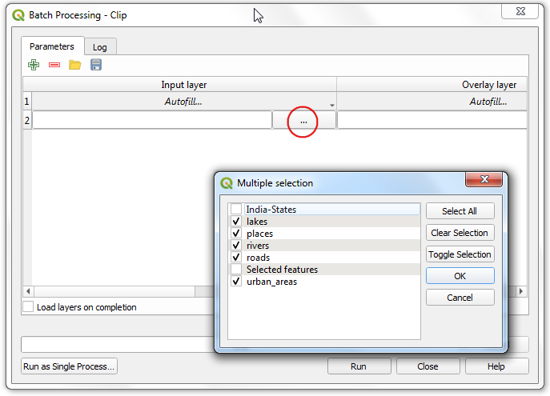

Similarly, select the ``Selected features`` layer as the *Overlay layer*.


As all input layers need to be clipped with the same overlay layer, you can click *Autofill..* and select *Fill Down* to autofill all the remaining rows with the same value.

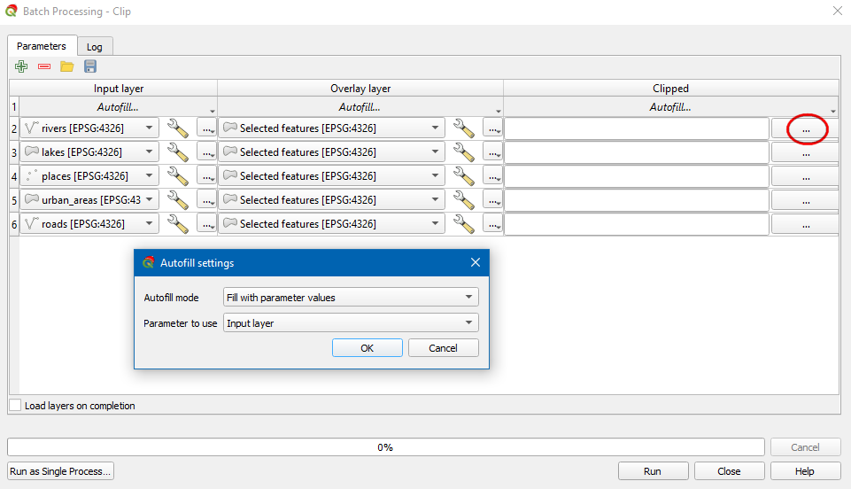

In the last *Clipped* column, click the *...* button and name the output ``clipped_``. When prompted, choose *Fill with parameter values* as the *autofill mode*, and *Input layer* as the *Parameter to use*.


Make sure the *Load layers on completion* box is checked and click *Run*.

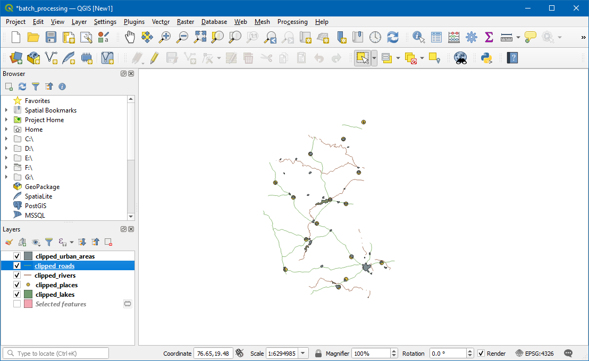

Resulting clipped layers will be added to the Layers panel. We can combine all the clipped layers into a single geopackage file for ease of sharing. Run the **Package Layers** processing algorithms.

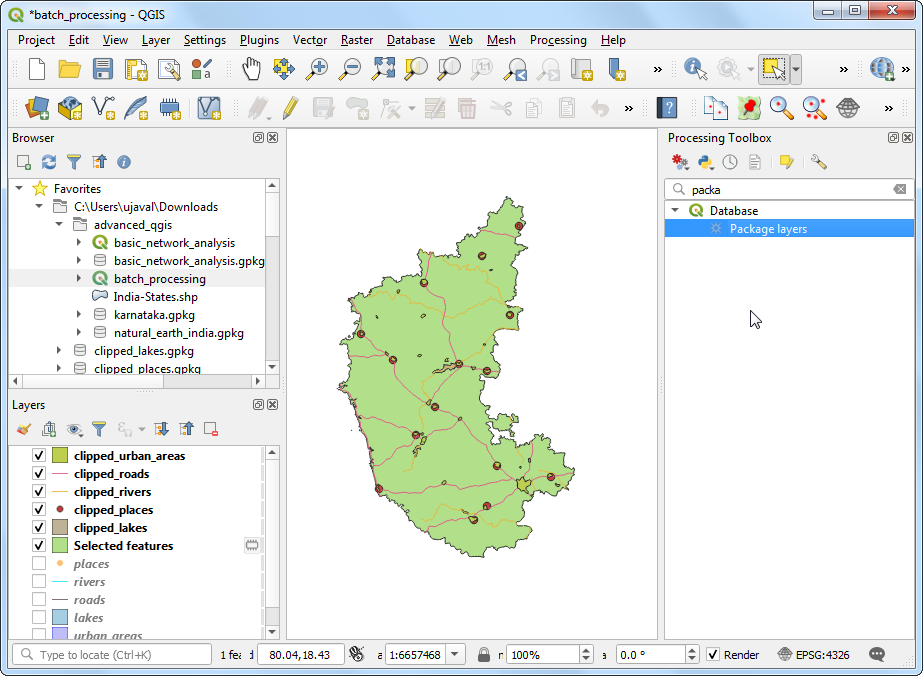

Choose all the clipped layers and save the output as ``clipped.gpkg``.


## Graphical Modeler

GIS Workflows typically involve many steps - with each step generating intermediate output that is used by the next step. If you change the input data or want to tweak a parameter, you will need to run through the entire process again manually. Fortunately, Processing Framework provides a graphical modeler that can help you define your workflow and run it with a single invocation. You can also run these workflows as a batch over a large number of inputs.

### Exercise: Find the hotspots of piracy indidents

National Geospatial-Intelligence Agency’s Maritime Safety Information portal provides a shapefile of all incidents of maritime piracy in the form on Anti-shipping Activity Messages. We can create a density map by aggregating the incident pints over a global hexagonal grid.

The steps needed to create a hex-bin layer suitable for visualization is as follows

- Reproject the input to an equal-area projection
- Create a global hexagonal grid layer
- Select all grids that intersect with at least 1 point
- Count points within each grid

We will now learn how to build a model that runs the above processing steps in a single workflow.

Open the **maritime_piracy** project.


Launch the modeler from **Processing &rarr; Graphical Modeler**


In the Processing Modeler dialog, locate the *Model Properties* panel. Enter ``piracy_hexbin`` as the Name of the model and ``projects`` as the Groups. Click the Save button.


Save the model as ``piracy_hexbin``.


Now we can start building a graphical model of our processing pipeline. The Processing modeler dialog contains a left-hand panel and a main canvas. On he left-hand panel, locate the Inputs panel listing various types of input data types. Scroll down and select the **+ Vector Layer** input. Drag it to the canvas.


Enter **Input Points** as the Parameter name and **Point** as the Geometry type. This input represents the piracy incidents point layer.


Next, drag another **+ Vector Layer** input to the canvas. Enter **Base Layer** as the Parameter name and *Polygon* as the Geometry type. This input represents the natural earth global land layer which we will use as the extent of the grid layer.


As we are generating a global hexagonal grid, we can ask the user to supply us the grid size as an input instead of hard-coding it as part of our model. This way, the user can quickly experiment with different grid sizes without changing the model at all. select a **+ Number** input and drag it to the canvas. Enter **Grid Size** as the Parameter name and click OK.


Now that we have our user inputs defined, we are ready to add processing steps. All of the processing algorithms are available to you under the *Algorithms* tab. The first step in our pipeline will be to reproject the base layer to the Project CRS. Search for **Reproject layer** algorithm and drag it to the canvas.


In the Reproject layer dialog, select **Base Layer** as the Input layer. Check the Use **project CRS** as the Target CRS. Click OK.


In the Processing Modeler canvas, you will notice a connection appear between the + Base Layer input and the Reproject layer algorithm. This connection indicates the flow of our processing pipeline. Next step is to create a hexagonal grid. Search for the **Create grid** algorithm and drag it to the canvas.


In the Generate grid dialog, choose **Hexagon (polygon)** as the Grid type. Select Extent of **'Reprojected' from algorithm 'Reproject Layer'** as the Grid extent. Click the 123 button under the Horizontal spacing label and choose **Model input**.


Select **Grid Size** input for Using model input. Repeat the same process for Vertical Spacing. Click OK.


At this point, we have a global hexagonal grid. The grid spans the full extent of the base layer, including land areas and places where there are no points. Let’s filter out those grid polygons where there are no input points. Search for **Extract by location** algorithm and drag it to the canvas.


For Extract features from, select **'Grid' from algorithm 'Generate Grid'**, Where the features (geometric predicate) as **Intersect** and By comparing to the features from as **Input points**. Click OK.


Now we have only those grid polygons that contain some input points. To aggregate these points, we will use **Count points in polygon** algorithm. Search and drag it to the canvas.


Select **'Extracted (location)' from algorithm 'Extract by location'** as the value for Polygons. The Points layer would be **Input Points**. At the bottom, name the Count output layer as **counts**. Click OK.


The model is now complete. Click the Save button.


Switch to the main QGIS window. You can find your newly created model in the Processing Toolbox under ** Models &rarr; projects &rarr; piracy_hexbin**. Double-click to run the model. 


Our Base Layer is the ``ne_10m_land`` and the Input Points layer is ``ASAM_event``s. The Grid Size needs to be specified in the units of the selected CRS. Enter ``100000`` (100 Kms) as the Grid Size. Click Run to start the processing pipeline. Once the process finishes, click Close.


You will see a new layer **Counts** loaded as the result of the model. As you explore, you will notice the layer contains an attribute called NUMPOINTS containing the number of piracy incidents points contained within that grid feature. Let’s style this layer to display this information better. Click the **Open Layer Styling Panel** button from the Layers panel. Select Graduated symbology and NUMPOINTS as the Column. Click the dropdown next to Color ramp and select the Viridis ramp. Click the dropdown again and select Invert Color Ramp to reverse the order of color. The Graduated symbology will divide the values in the selected column into distinct classes and assign a different color to each of the classes. Select Natural Breaks (Jenks) as the Mode and click Classify.


We will use a clever trick to make the visualization better. We can use QGIS variables to set the edges of the hexagon a slightly darker shade of the fill color. Click on the **Symbol**. Click **Simple Fill**. Click the **Data defined override** button next to **Stroke color** and select **Edit**>


Enter the following expression to set the stroke color to 30% darker than the fill color and click OK. The map rendering will change to a much smoother visualization.

```
darker( @symbol_color , 130)
```


### Challenge: Improve the model

Can you change the model so that instead of entering the grid size in meters, the user can enter the size in kilometers? 

> Hint: The **Create Grid** algorithm expects the size in meters, so you will have to convert the input to meters.

### Enabling Reproducible Workflows

To ensure that you are always able to reproduce your results, it is recommended to bundle the model in your project. The modeler interface has a button **save model in project** that will embed the model in your QGIS project file.


Once the model is embedded, Whenever you open the project, the model will be available to the user under the **Project models** in the Processing Toolbox.


# 2D Animations

Time is an important component of many spatial datasets. Along with location information, time providers another dimension for analysis and visualization of data. If you are working with dataset that contains timestamps or have observations recorded at multiple time-steps, you can easily visualize it using the **TimeManager** plugin in QGIS.

## TimeManager

TimeManager allows you to view and export ‘slices’ of data between certain time intervals that can be combined into animations.

Go to **Plugins &rarr; Manage and Install Plugins...**.  Search for and install the **TimeManager** plugin.


## Exercise: Create a GIF showing changes in piracy hotspots over time

We will continue to work with the maritime piracy dataset. First we will create a heatmap visualization and then animate the heatmap to show how the piracy hot-spots have changed over past 2 decades.

Open the **maritime_piracy** project from the data package. There are thousands of incidents and it is difficult to determine with more piracy. Rather than individual points, a better way to visualize this data is through a heatmap. Select the ``ASAM_events`` layers and click the **Open the layer Styling Panel** button in the Layers panel. Click the **Single symbol** drop-down.

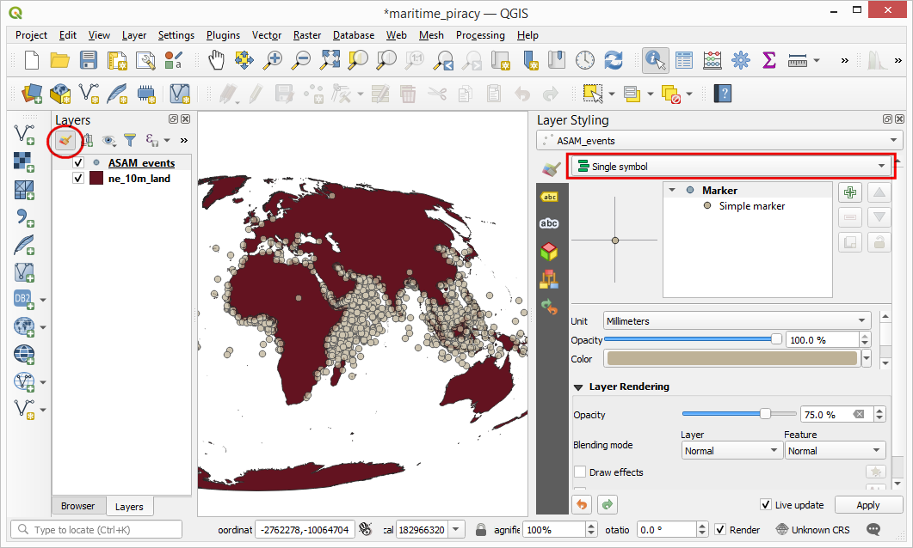

In the renderer selection drop-down, select **Heatmap** renderer. Next, select the **Viridis** color ramp from the Color ramp selector. Adjust the Radius value to **5.0**. At the bottom, expand the *Layer Rendering* section and adjust the Opacity to **75.0%**. This gives a nice visual effect of the hotspots with the land layer below.

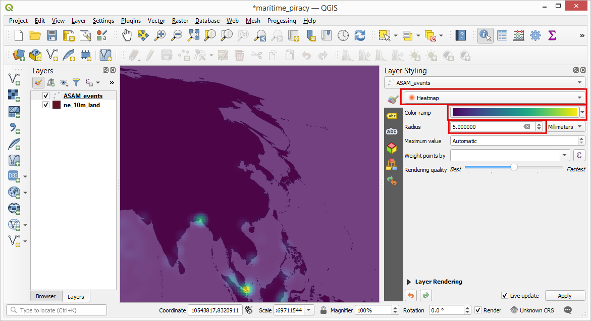

Now let’s animate this data to show the yearly map of piracy incidents. Go to **Plugins &rarr; TimeManager &rarr; Toggle visibility**. In the *TimeManager* panel, click **Settings**.

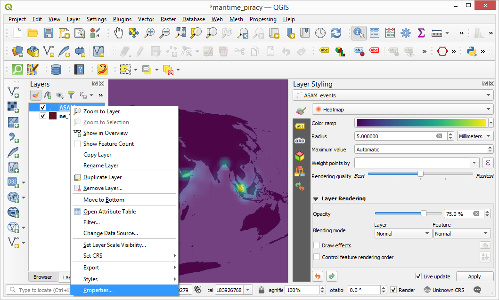

In the Time manager settings window, click **Add layer** button.

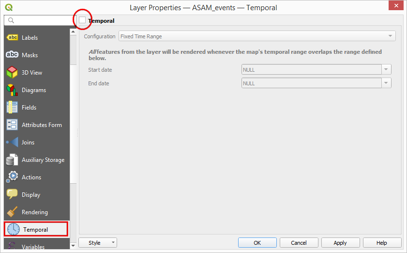

The source data contains an attribute ``dateofocc`` - representing the date on which the incident took place. This is the field that will be used by the plugin to determine the points that are rendered for each time period. Select **ASAM_events** as the Layer and **dateofocc** as the Start time. The End time should be set to Same as start. Click OK. Back in the Time manager *settings* window, click OK.

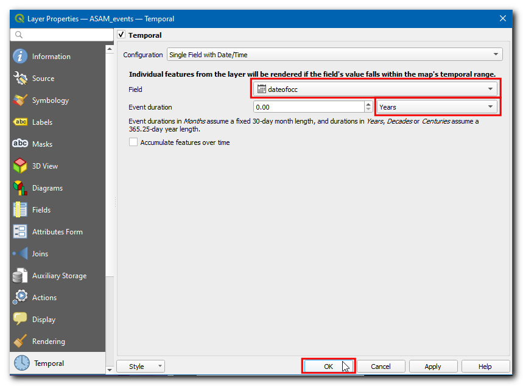

Click the **Power icon** in the TimeManager panel to enable the plugin. Set the Time frame size to be **1 years**. Once enabled, you will see a filter icon next to the ASAM_events layer. TimeManager works by applying a filter to the layer based on the selected field and specified time period.  Click the **Play button** to see the yearly piracy hotspot animation.

{target="_blank"}](images/advanced_qgis/timeseries6.png)

Now we can export the animation. Before exporting, make sure to set the time-slider in the Time Manager panel to the start position. Export of the animation will start from the current position of the time slider. Click the **Export Video** button in the Time Manager panel.

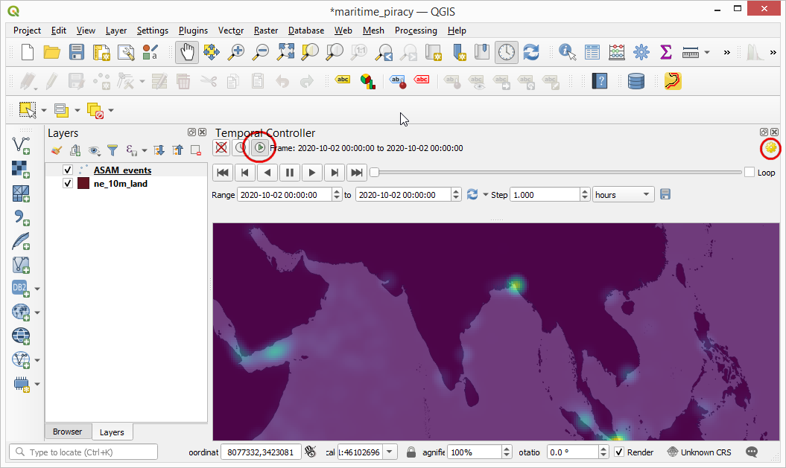

In the Export Video dialog, click Select output folder and select a directory on your computer. Select the Frames only option and click OK to start the export process.

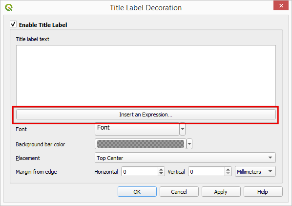

Once the export finishes, you will see PNG images for each year in the output directory. Now let’s create an animated GIF from these images. There are many options for creating animations from individual image frames. I like **[ezgif.com](https://ezgif.com/maker)** for an easy and online tool. Visit the site and click Choose Files and select all the .png files. Note that the export folder will also have a .pgw file for each frame which contains the georeference information. You may want to sort the images by Type to allow easy bulk selection of only .png files. Once selected, click the Upload and make a GIF! button.

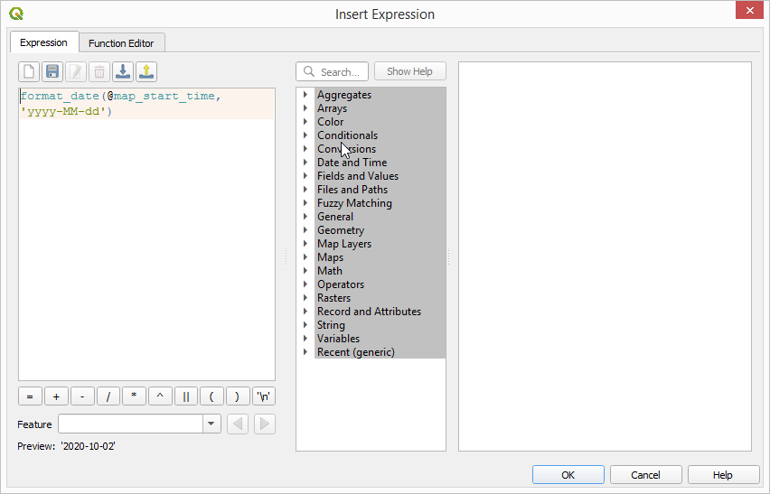

## Challenge: Improve the animation

You will notice that for each frame of the animation, a date is displayed at the bottom-right. Instead of the full date and time, let’s change it to display the year that the map represents. Also change the placement of the label to the top-left corner. The output should look something like below.

{target="_blank"}](images/advanced_qgis/timeseries10.png)

# 3D Animations

Recent versions of QGIS include native support for 3D data. Using this feature, you can easily view, explore and animate 3D elevation data. Note that your computer must have a supported graphics card for this feature to work.

## Exercise: Create a 3D Flythrough

We will work with a 5m Digital Elevation Model (DEM) of Denali peak in Alaska and create an animation showing a 3D visualization of the dataset.

Open the **denali** project from the data package. The data contains the raw DEM layer and a hillshade layer created from the DEM.


Go to **View &rarr; New 3D Map View**.


A new map window will open containing the rendered map layers from the main canvas. Click the **Configure** button.


In the *Terrain* section, select **DEM (Raster Layer)** as the *Type*. Select ``denali_dem`` layer as the *Elevation*. Click OK.

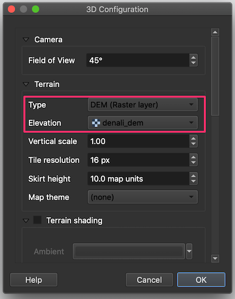

In the 3D view, you can hold the **Shift** key and drag your mouse to tilt the top-down view. You will see the map in 3D. You can also use the controls on the right-hand panel to tilt,zoom and pan the view.

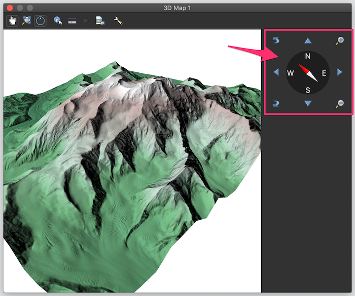

Now we will create an animation. Click the **Animations** button in the toolbar. To animate the view, we must define certain **keyframes**. Once you define a specific view for keyframes at different times, the system will try to smoothly animate the views between them. You can use the slider to go to a specific time, use the controls to set a specific view and click the **+** button to add a keyframe. Click the **Play** button to see the animation in action.


Once you are satisfied, click the **Export Animation Frames** button. Choose an output directory on your computer and click OK. Individual frames will be rendered and saved as separate files.


As we did in the previous section, you can use a service such as **[ezgif.com](https://ezgif.com/maker)** to create a GIF/Video from these frames. 

{target="_blank"}](images/advanced_qgis/3d.png)

# Summary Aggregate Expressions

QGIS expression engine has a powerful function called 'summary aggregates' that allows evaluating a feature's geometry and attributes with those of another layer. Expressions can be used for static calculations as well as on-the-fly computations, such as labels, virtual fields, symbology etc. This enables some powerful use cases.

The summary aggregate function operates on all the values from a different layer, returning a single summary value. The syntax of the aggregate function is as follows

```
aggregate(
  layer:='layer name or id',
  aggregate:='aggegate type',
  expression:='expression to aggregate',
  filter:='optional filter expression,
  concatenator:='optional string to use to join values',
  order_by:='optional expression to order the features'
  )
```  

## Exercise: Count features from another layer

We will work with a land parcels data layer provided by the City of San Francisco. The goal of this exercise is to demonstrate the use of aggregate expression for on-the-fly computation when digitizing new features.

Open the **parcels** project from the data package. Select the ``boundary`` layer and click the **Open Field Calculator** button.


Add a new field named ``count`` with the following expression. The expression is reading the features from the ``parcels`` layer and giving an aggregate count of the features. You will notice that the the result will be displayed at the bottom of the window.

```
aggregate(
 layer:= 'parcels',
 aggregate:='count',
 expression:=fid
 )
```


Now we can apply the same concept in a dynamic calculation. Back in the main QGIS window, select the ``polygons`` layer and right-click it. Select **Properties**.


Switch to the **Attributes Form** tab. Select the field ``count`` and choose **Text Edit** as the *Widget Type*. At the **Default Value** field at the bottom, enter the following expression. Note that additional filter value. Here the ``$geometry`` refers to the geometry of the ``parcels`` layer and ``geometry(@parent)`` refers to the geometry of feature from the ``polygons`` layer. Click OK.

```
aggregate(
 layer:= 'parcels',
 aggregate:='count',
 expression:=fid,
 filter:=intersects($geometry, geometry(@parent))
 )
```


Back in QGIS, click the **Toggle Editing** button and draw a polygon using the **Add Polygon Feature** button. Right-click to finish the drawing. As soon as you finish, the count of intersecting features will be calculated by the aggregate expression and displayed in the ``count`` field.

{target="_blank"}](images/advanced_qgis/aggregate5.png)

There are many different types of aggregates available. We can use an aggregate called **concatanate** to compute a comma-separated text of all feature ids. Go to the **Attribute Form** properties again and select ``parcels`` field. Enter the following expression as the **Default Value**.

```
aggregate(
 layer:= 'parcels',
 aggregate:='concatenate',
 concatenator:=',',
 expression:=to_string(fid),
 filter:=intersects($geometry, geometry(@parent))
 )
```


Now when to add a new feature, all the intersecting feature ids will be displayed along with the count.

{target="_blank"}](images/advanced_qgis/aggregate7.png)


# Data Credits
* OpenStreetMap (osm) data layers: Data/Maps Copyright 2019 Geofabrik GmbH and OpenStreetMap Contributors. [OSM India free extract](https://download.geofabrik.de/asia/india.html) downloaded from Geofabrik.
* India State boundary: Downloaded from [Datameet Spatial Data repository](https://github.com/datameet/maps/tree/master/States).
* Anti-shipping Activity Messages: [Maritime Safety Information portal](https://msi.nga.mil/NGAPortal/MSI.porta) , National Geospatial-Intelligence Agency
* Land boundaries: Made with Natural Earth. Free vector and raster map data @ naturalearthdata.com.
* Road Network: District of Columbia [Open Data Catalog](https://opendata.dc.gov/). 
* [Alaska IFSAR DTM](https://www.usgs.gov/centers/eros/science/usgs-eros-archive-digital-elevation-interferometric-synthetic-aperture-radar) distributed by USGS Earth Resources Observation and Science (EROS), Downloaded from USGS Earth Explorer
* Parcels and Neighborhood boundaries downloaded from [DataSF Open Data Portal](https://datasf.org/opendata/)

# License

This course is licensed under a [Creative Commons Attribution 4.0 International License](http://creativecommons.org/licenses/by/4.0/deed.en_US). You are free to use the material in any form as you wish. Kindly give appropriate credit to the original author.

&copy; 2020 Ujaval Gandhi [www.spatialthoughts.com](https://spatialthoughts.com)