\newpage

***

```{r echo=FALSE, fig.align='center', out.width='75%', out.width='250pt'}
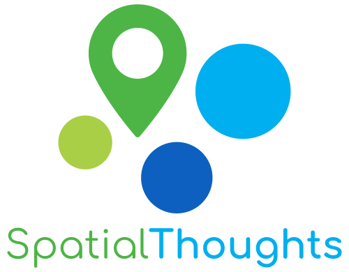
```

***

\newpage

# Introduction 

This course covers agentic coding workflows specializing in geospatial data science. You will get hands-on experience setting up your agent and understand how to use Skills and MCP servers to augment domain-specific capabilities. We cover best practices for using coding agents to rapidly solve complex problems - grounded in established science and human-in-the-loop validation. We cover hands-on examples using Claude Code - including crime hotspot mapping, route optimization, and object detection from aerial imagery. You will also learn how to use agents to manage a personal knowledge base and create a website that automatically updates with new information.

[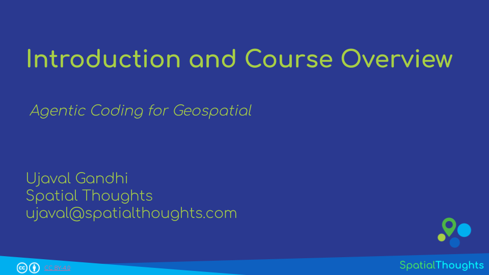{width="400px"}](https://docs.google.com/presentation/d/1gQV_YIBTE_o8ziY0Oza-BX8BOmvATfPq6vHaC4_cNKI/edit?usp=sharing){target="_blank"}

[Google Slides &#8599;](https://docs.google.com/presentation/d/1gQV_YIBTE_o8ziY0Oza-BX8BOmvATfPq6vHaC4_cNKI/edit?usp=sharing){target="_blank"} [PDF &#8599;](https://github.com/spatialthoughts/courses/releases/download/presentations/Agentic_Coding_for_Geospatial_Introduction.pdf)

----

# Installation and Preparation

## Sign-up for GitHub

Visit [GitHub.com](https://github.com/) and create a free account. If you already have an account, skip this step.

## Install Git and GitHub CLI

Follow our [Git and GitHub CLI Installation Guide](install-git-github.html) to install and configure Git and GitHub CLI.

## Install Conda and Setup an Environment

We will use conda to install the required Python packages and manage local development environments. 

Follow our step-by-step [Conda Installation Guide](install-conda.html) to install Miniconda for your operating system. Once you have a working conda installation, follow the steps below.

1. *(Windows users)*, search for Anaconda Powershell Prompt and launch it. *(Mac/Linux users)*: Launch a Terminal window. Run the following commands to create a fresh environment and activate it.

```{bash eval=FALSE}
conda create --name claude_code_workshop -y
conda activate claude_code_workshop
```

2. Now your environment is ready. We will install the required packages from `conda-forge`.

```{bash eval=FALSE}
conda install -c conda-forge pandas geopandas matplotlib jupyterlab rioxarray gdal rio-cogeo ipykernel
```

Your local development environment is now ready.

## Install Visual Studio Code

We recommend Visual Studio Code (VS Code) editor for this workshop. 

Follow our step-by-step [Visual Studio Code Installation Guide](install-vscode.html) to install and configure VS Code on your system. Make sure to complete the steps to set VS Code as your default editor.

## Install Claude Code

Follow our step-by-step [Claude Code Installation Guide](install-claude-code.html) to install and configure Claude Code on your system.

## Install Obsidian

[Obsidian](https://obsidian.md/) is a free app for creating and managing notes. We will be using Obsidian for setting up your personal knowledge base using Claude. Visit [Obsidian Download](https://obsidian.md/download) page and install Obsidian for your platform.

## Sign-up for OpenRouteService API

[OpenRouteService (ORS)](https://openrouteservice.org/) provides a free API for routing, distance matrix, geocoding, route optimization etc. using OpenStreetMap data. To obtain an API key, visit the [HeiGIT Sign Up page](https://account.heigit.org/signup) and create an account. Once your account is activated, you can visit the [Dashboard](https://account.heigit.org/manage/key) and copy the long string displayed under *Basic Key*. 

## Install QGIS

We will configure and use the QGIS MCP server to allow Claude Code to use QGIS directly. Please follow our [QGIS-LTR Installation Guide](install-qgis-ltr.html) to install QGIS. If you already have a recent QGIS version (`3.40+` or `4.0+`) installed on your computer, you can skip this step.

# Get the Data Package

The code examples and reference materials used in this workshop are supplied to you in the `agentic_coding_geospatial.zip` file. Unzip this file to a directory - preferably to the `<home folder>/Desktop/agentic_coding_geospatial/` folder. 

Download [agentic_coding_geospatial.zip](https://github.com/spatialthoughts/courses/releases/download/data/agentic_coding_geospatial.zip).

> Note: Certification and Support are only available for participants in our paid instructor-led classes.


# Get Familiar with the Command Prompt

Our primary interface for this course will be the Terminal. We will now cover basic terminal commands that will help you get comfortable with the environment.

*(Windows users)*, search for Anaconda Powershell Prompt and launch it. *(Mac/Linux users)*: Launch a Terminal window. 

The following are some of the common terminal commands we will need to browse and manage files.


|   **Command**    | **Description**                     | **Example**     |
|:-----------------|:------------------------------------|:---------------------|
| `cd`             | Change directory                    | `cd Desktop` |
| `cd ..`          | Change to the parent directory      | `cd ..` |
| `ls`             | List files in the current directory | `ls` |
| `rm `            | Delete a file                       | `rm test.txt` |
| `rm -R`          | Delete a directory (Mac/Linux)      | `rm -R test` |
| `rm -Recurse`    | Delete a directory (Windows)        | `rm -Recurse test` |
| `mkdir`          | Create a directory                  | `mkdir test` |
| `cat`            | Print the contents of a file        | `cat test.txt` |
| `clear`          | Clear screen                        | `clear` |


# 1. Introduction to Agentic Coding

[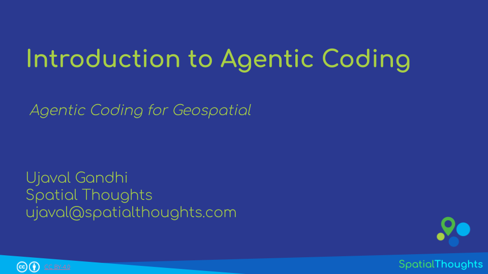{width="400px"}](https://docs.google.com/presentation/d/1iRaSLeWlBHvqVOyt5BSy2gkpDyhYlCQi-7P1XgN1p7M/edit?usp=sharing){target="_blank"}

[Google Slides &#8599;](https://docs.google.com/presentation/d/1iRaSLeWlBHvqVOyt5BSy2gkpDyhYlCQi-7P1XgN1p7M/edit?usp=sharing){target="_blank"} [PDF &#8599;](https://github.com/spatialthoughts/courses/releases/download/presentations/Agentic_Coding_for_Geospatial_Introduction_to_Agentic_Coding.pdf)


## 1.1 Setting up your Agent

A good practice is to always setup a [CLAUDE.md](https://code.claude.com/docs/en/memory) file for your project. This file contains instructions and rules to be followed when working inside the project directory. If you already have a directory with some code or have cloned a Git repository, Claude Code can automatically create the `CLAUDE.md` file using the `/init` command. Here we are starting with a blank project, so we will create a new `CLAUDE.md` file with instructions.

1. We will first navigate to the project directory and start Claude Code. *(Windows users)*, search for Anaconda Powershell Prompt and launch it. *(Mac/Linux users)*: Launch a Terminal window. Use the `cd` command to change the current working directory to the project directory.

*Windows*
```{bash eval=FALSE}
cd Desktop\agentic_coding_geospatial
```

*Mac/Linux*

```{bash eval=FALSE}
cd Desktop/agentic_coding_geospatial
```

```{r echo=FALSE, fig.align='center', out.width='75%'}
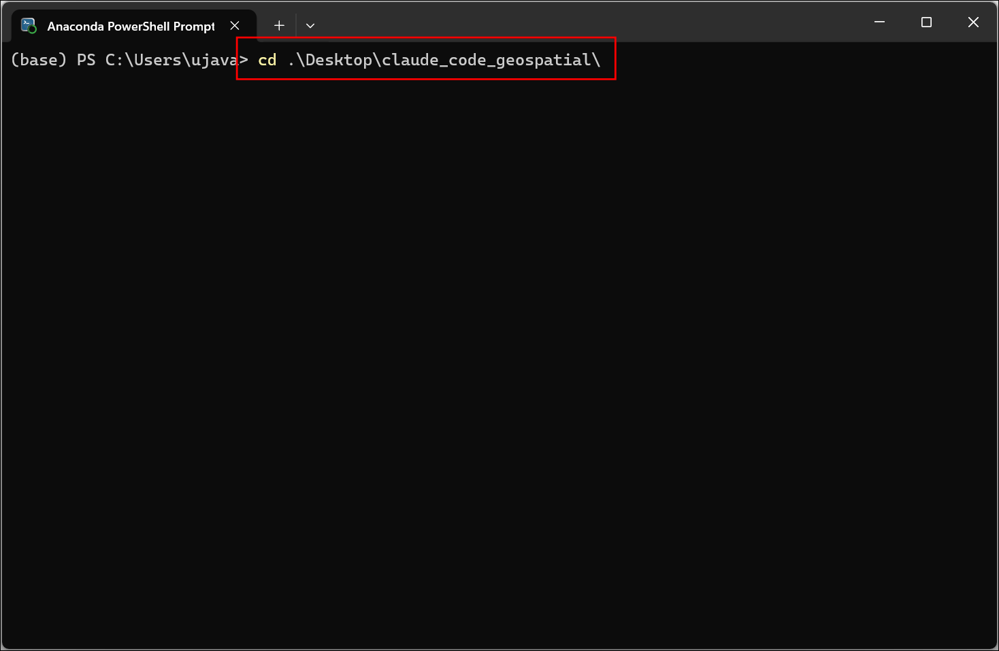
```

2. Once you are inside the project folder, launch Claude Code by entering the following command. The first time you start Claude Code inside a directory, there will be a security notification. You can choose **Yes, I trust this folder**. 

```{bash eval=FALSE}
claude
```

```{r echo=FALSE, fig.align='center', out.width='75%'}
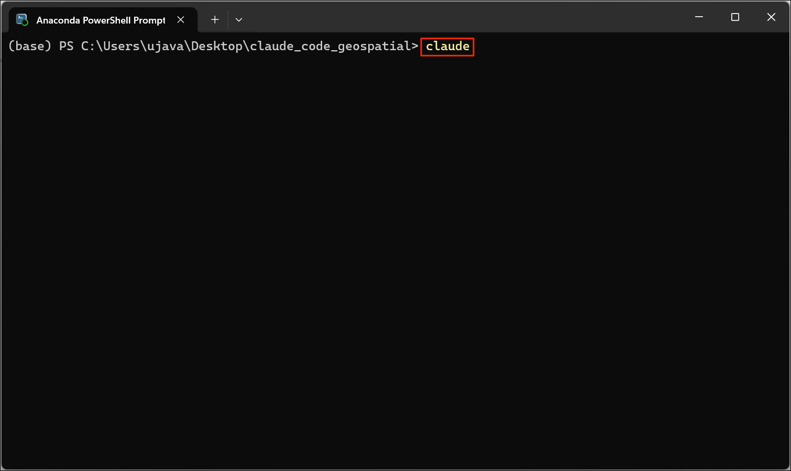
```

3. Invoke the `/memory` command to setup the project `CLAUDE.md`

```{bash eval=FALSE}
/memory
```

```{r echo=FALSE, fig.align='center', out.width='75%'}
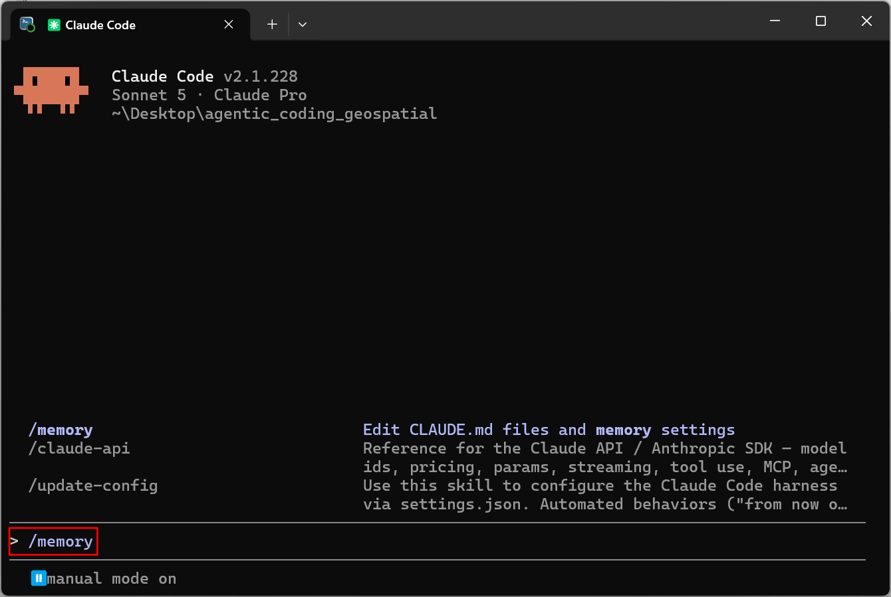
```

4. Select **Project instructions** and press *Enter*.

```{r echo=FALSE, fig.align='center', out.width='75%'}
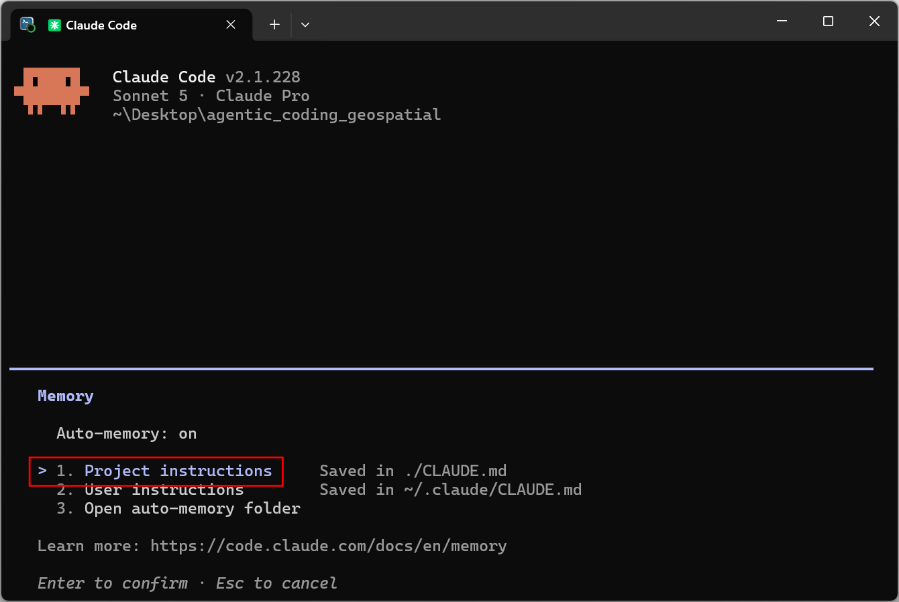
```

5. Your default editor (Visual Studio Code) will now open with a new `CLAUDE.md` file.  Paste the following content and save the file. Close the file once saved.

```
# CLAUDE.md

## Geospatial Stack Preferences

- Prefer Python-based approaches
- Use existing packages instead of building solutions from scratch
- My preference for geospatial packages are below
  - Pandas for tabular data
  - GeoPandas for vector geospatial data
  - XArray ecosystem (rioxarray, xarray-spatial etc) for raster geospatial data
  - Scikit-learn for Machine Learning
  - GeoAI (geoai-py) for Deep Learning
- Web Apps
  - Streamlit for data driven apps
  - Leaflet for interactive mapping apps
  - Self contained HTML for small apps

## Other Preferences

- Write code that is simple to understand and explain
- Always install python packages in a conda environment. Never install anything in the base environment. Ask the user for confirmation on their preferred conda environment before installing anything.
- Do not use emojis
```

```{r echo=FALSE, fig.align='center', out.width='75%'}
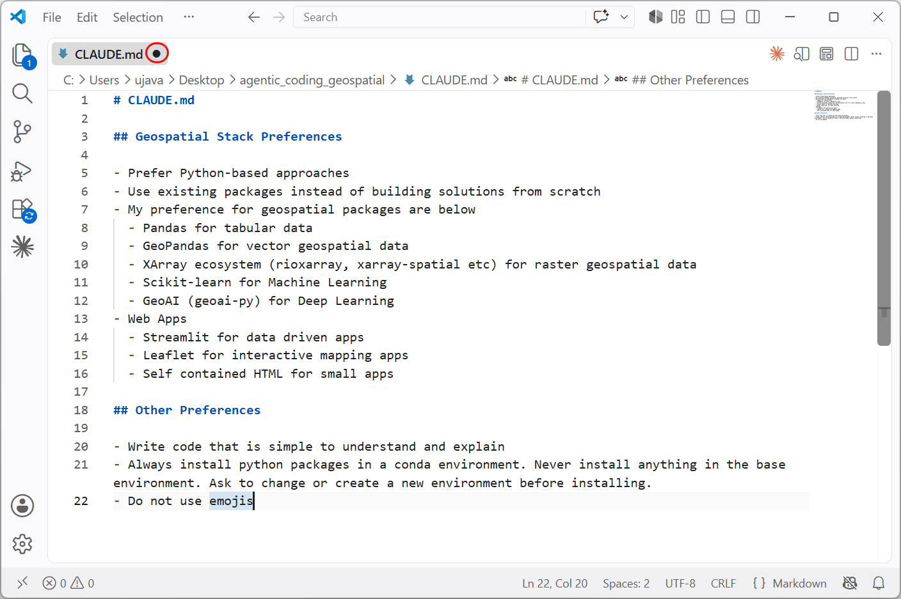
```

6. Make sure you now have a `CLAUDE.md` file in your `<home folder>/Desktop/agentic_coding_geospatial/` folder.

```{r echo=FALSE, fig.align='center', out.width='75%'}
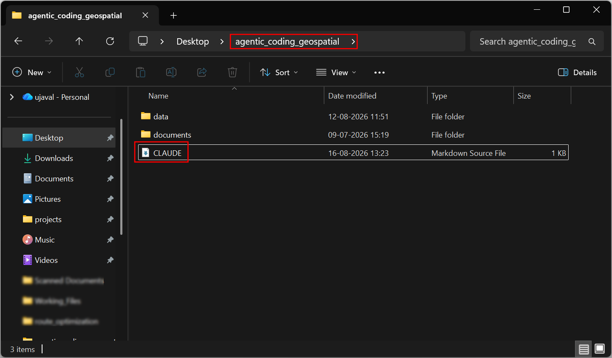
```

7. You can also use the `/context` command to check if the file contents has been loaded into the current context. 

> Learn more about [Managing Context](https://code.claude.com/docs/en/best-practices#manage-context-aggressively)

```{bash eval=FALSE}
/context
```

```{r echo=FALSE, fig.align='center', out.width='75%'}
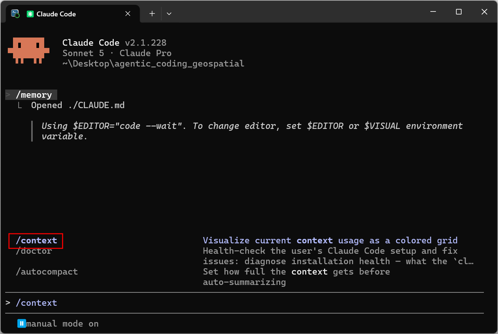
```

8. Verify that you have the Memory file in the context.

```{r echo=FALSE, fig.align='center', out.width='75%'}
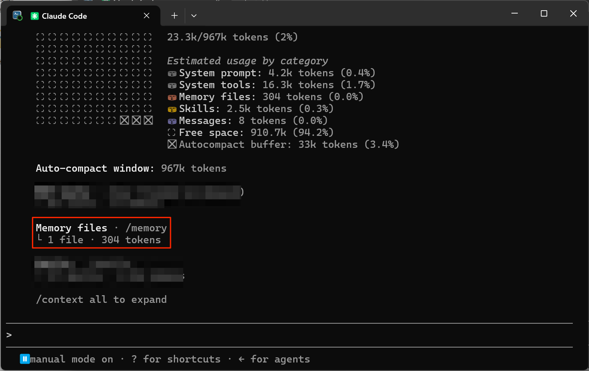
```

9. At the prompt, you can invoke several [commands](https://code.claude.com/docs/en/commands) for configuration. You can type `/help` to see all available commands. Let's run a few commands. First enable [Plan Mode](https://code.claude.com/docs/en/permission-modes#analyze-before-you-edit-with-plan-mode) by entering the `/plan` command. Next choose the model using the `/model` command. The default model choice is good for now, and you can change the model at any time.

```{r echo=FALSE, fig.align='center', out.width='75%'}
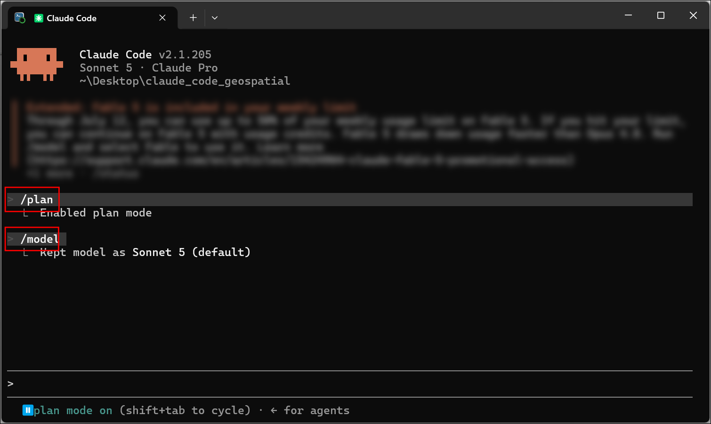
```

Now we are ready to use Claude Code for our first data analysis task.

# 2. Geospatial Data Analysis (Mapping Crime Hotspots)

We will now use Claude Code to do some data exploration, cleaning and analysis. This will give you a feel of how agents work and how to guide them. We will take the Police.uk data on street-level crime for the City of London (The *Square Mile* area) and identify crime hotspots.

## 2.1 Exploratory Data Analysis (EDA)

1. Enter the following prompt into Claude Code and press *Enter*. Make sure the *Plan mode* is on. This will ensure Claude Code will first make an implementation plan and wait for your approval before diving into coding.

```
I would like to do an exploratory data analysis of crime data in the folder data/london_crime_2024. 

* Give me a summary of the rows, columns and any missing data. 
* Flag any data quality issues. 
* Create charts showing different types of crime and monthly patterns.

Produce the output as a Python script and PNG images.
```

```{r echo=FALSE, fig.align='center', out.width='75%'}
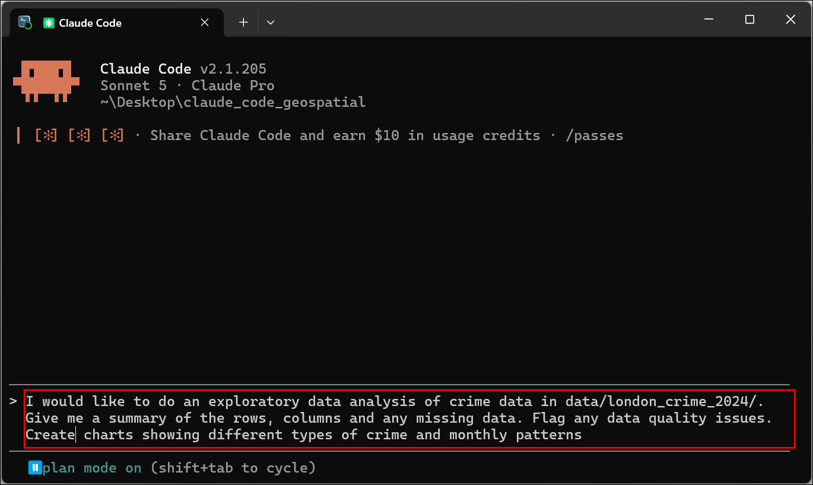
```

2. As the project-level `CLAUDE.md` states, all the work needs to be done in a conda virtual environment. Claude will prompt you to choose an environment. Choose the **claude_code_workshop** environment created for this class and press *Enter*.

```{r echo=FALSE, fig.align='center', out.width='75%'}
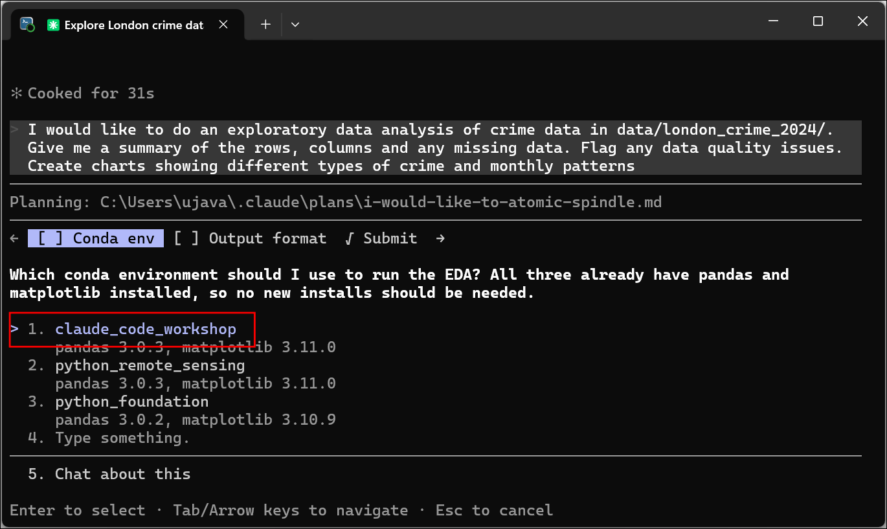
```

3. For the *Output format*, choose **Python script + saved PNGs**.

```{r echo=FALSE, fig.align='center', out.width='75%'}
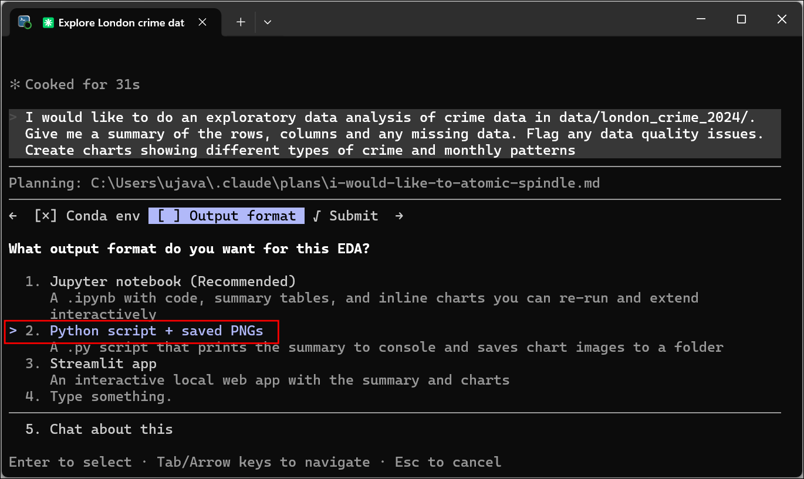
```

4. Review the answers and select *Submit answers*. Press *Enter*.

> Depending on your operating system, Claude Code version, and selected model, you may see a slightly different set of questions.

```{r echo=FALSE, fig.align='center', out.width='75%'}
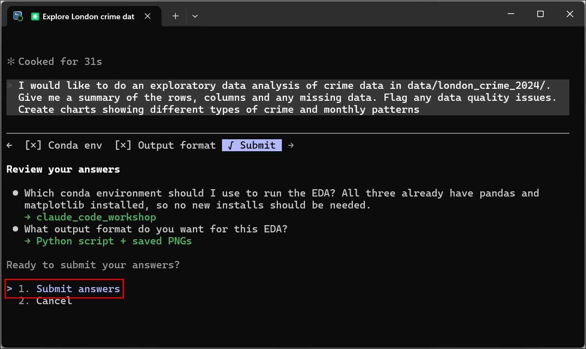
```

5. Now Claude Code will go through the data and come up with a plan for building the required script for exploratory data analysis. You can review the plan and edit it as per your requirements. Use the **Ctrl+G** shortcut to open an editor with the plan and make any necessary edits. Once you are satisfied, confirm the execution by selecting **Yes, and use auto mode**.

```{r echo=FALSE, fig.align='center', out.width='75%'}
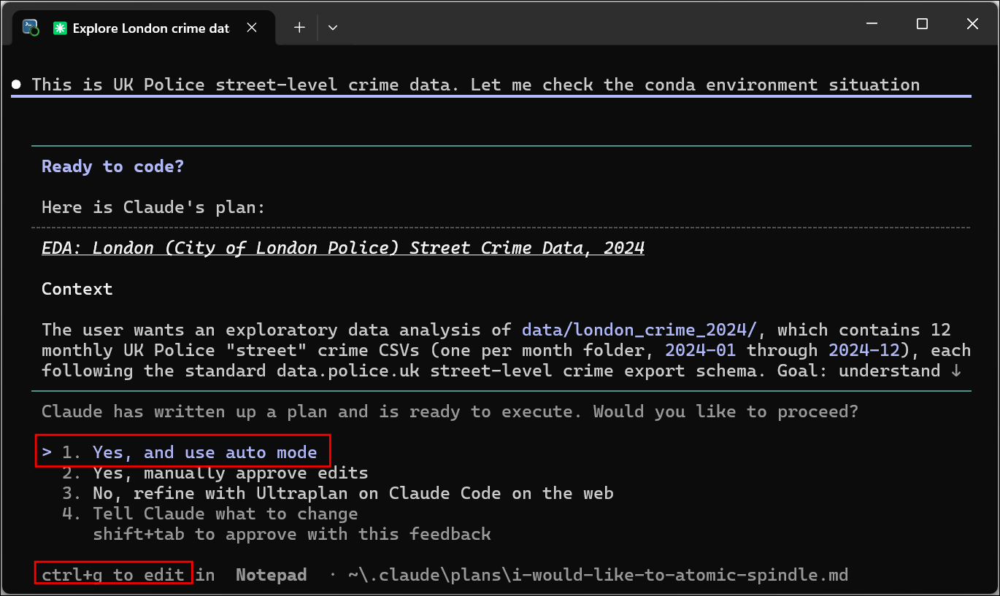
```

6. Claude Code will write the Python scripts and run it using the installed packages in the conda environment.

```{r echo=FALSE, fig.align='center', out.width='75%'}
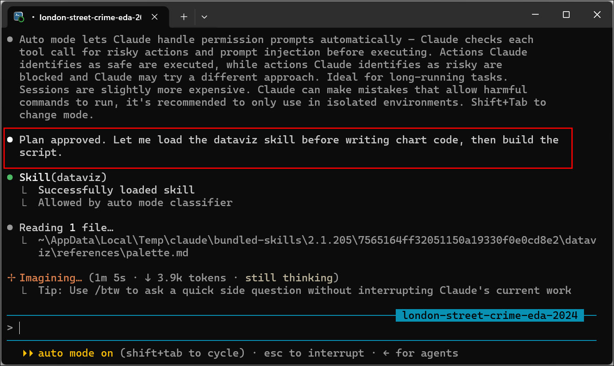
```

7. Once done, it will prints the summary of its findings.

```{r echo=FALSE, fig.align='center', out.width='75%'}
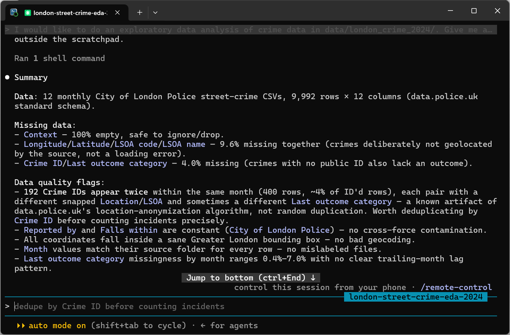
```

8. The analysis will also produce some charts in the `output/` subfolder.
 
```{r echo=FALSE, fig.align='center', out.width='75%'}
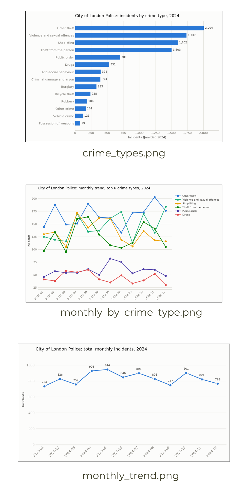
```

## 2.2 Data Cleaning and Spatial Analysis

Now that we have a good understanding of the data structure, we can ask Claude to help us with analyzing the data. In this section, we will go through the workflow of identifying hotspots off thefts. Starting with data cleaning, we will iteratively improve our analysis and learn how we can use existing references (research papers, manuals etc.) to ground the behavior of the model.

1. Back in Claude Code, switch to the plan mode. You can use *Shift+Tab* till you see **plan mode on**. Enter the following prompt. Claude Code will ask you clarifying questions. You can read through the explanation and select the options that make sense for the analysis.

```
I want to analyze theft hotspots. 
Help me select the categories for theft crimes and filter the data.
```

```{r echo=FALSE, fig.align='center', out.width='75%'}
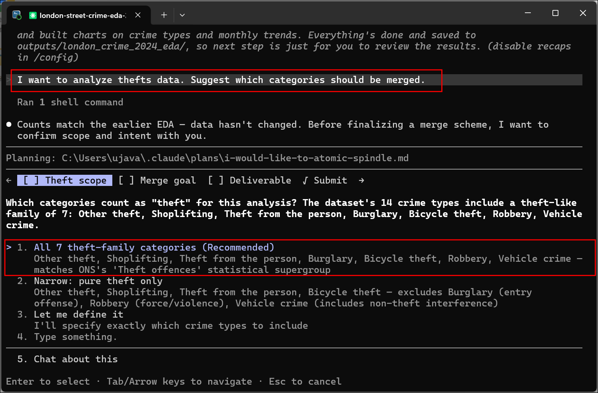
```

2. For the *merge goal*, select **Align to official ONS groupings**.

```{r echo=FALSE, fig.align='center', out.width='75%'}
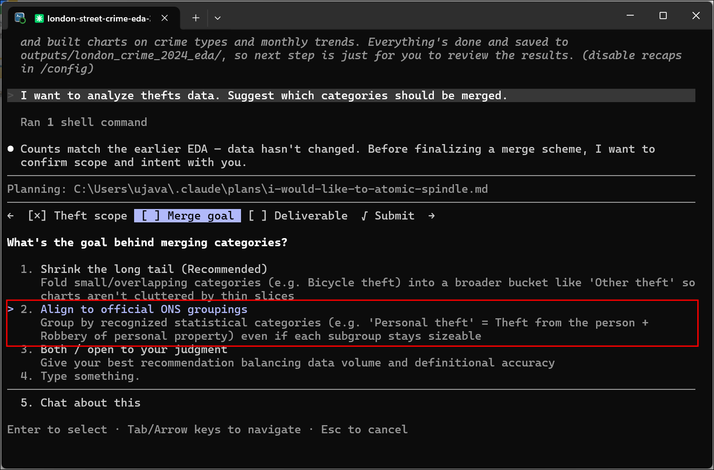
```

3. Select *Submit answers* and press *Enter*.

```{r echo=FALSE, fig.align='center', out.width='75%'}
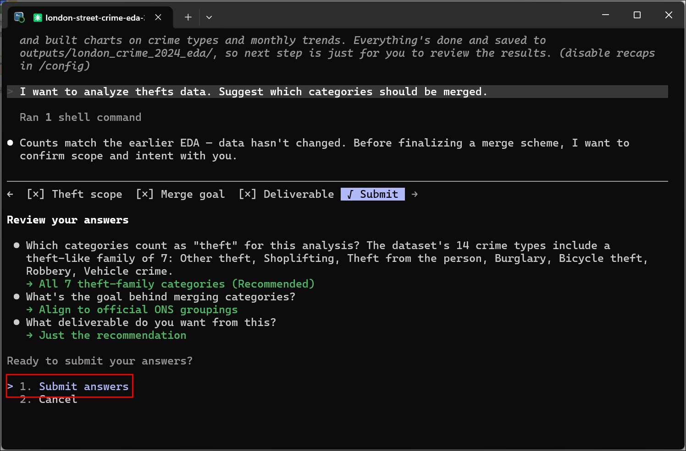
```

4. Review the plan and make any adjustments if required. Select **Yes, and use auto mode** to proceed.

```{r echo=FALSE, fig.align='center', out.width='75%'}
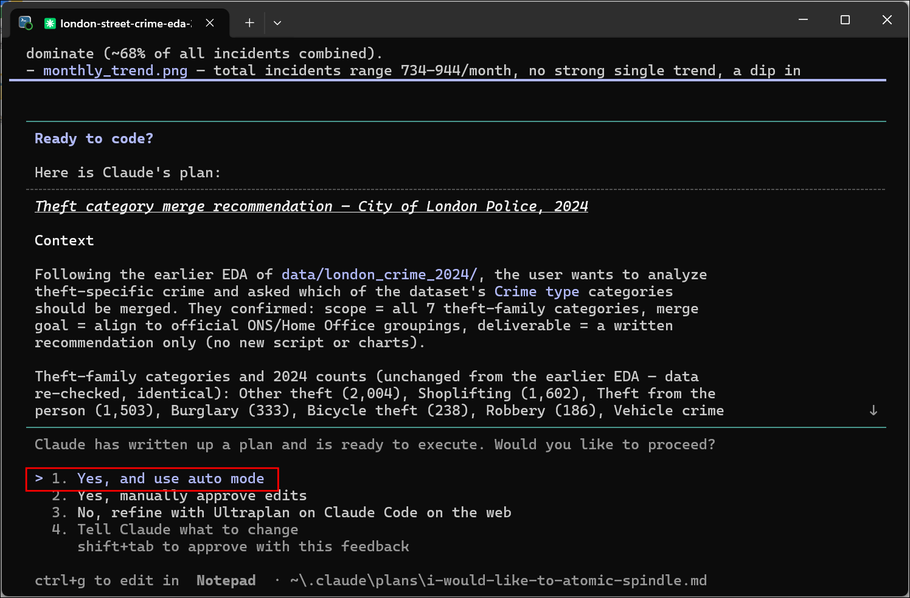
```

5. Claude will produce a merge script and the output CSV file.

```{r echo=FALSE, fig.align='center', out.width='75%'}
knitr::include_graphics('images/agentic_coding_geospatial/hotspot5.png')
```

6. This is the cleaned version of our original dataset. We can use this for mapping hotspots. Switch to the plan mode (*Shift+Tab*) and enter the following prompt. 

```
I want to map the theft hotspots. 
Suggest what would be the best technique for the analysis.
```

```{r echo=FALSE, fig.align='center', out.width='75%'}
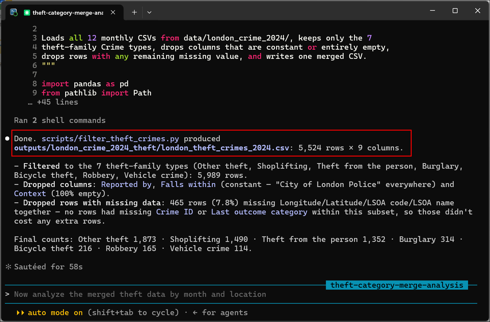
```

7. Answer the clarifying questions and select the **Kernel Density Estimation (KDE)** as the technique. Select *Submit answers* and press *Enter*.

```{r echo=FALSE, fig.align='center', out.width='75%'}
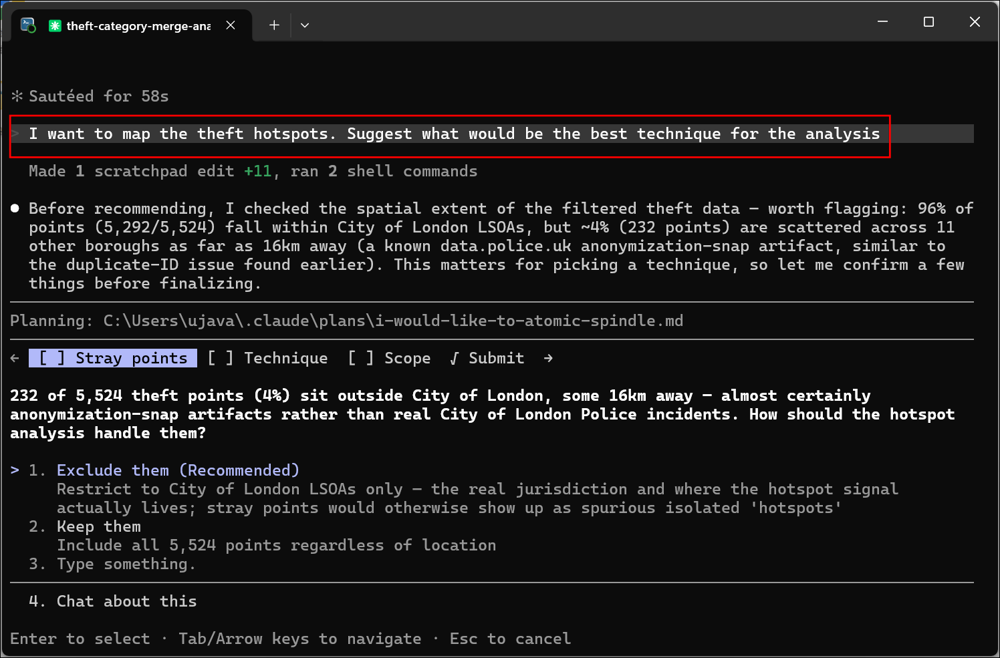
```

8. Once the analysis is planned, enter the following prompt to build the script.

```
Create a static visualiztion using matplotlib using gaussian_kde.
```

```{r echo=FALSE, fig.align='center', out.width='75%'}
knitr::include_graphics('images/agentic_coding_geospatial/hotspot8.png')
```

9. Claude Code will produce a script and a map with hotspot visualization.

```{r echo=FALSE, fig.align='center', out.width='75%'}
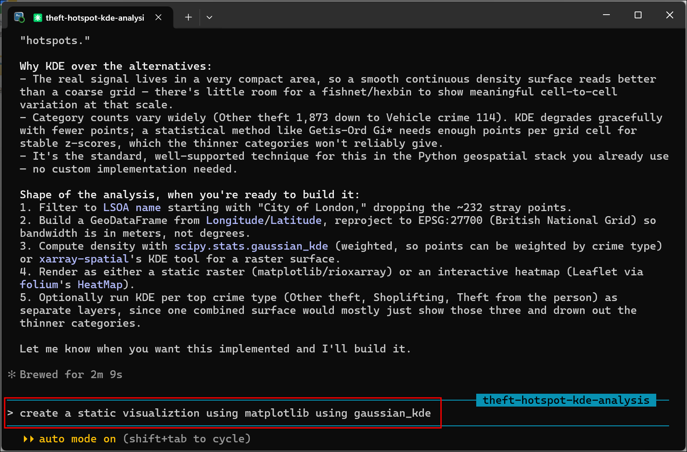
```

```{r echo=FALSE, fig.align='center', out.width='75%'}
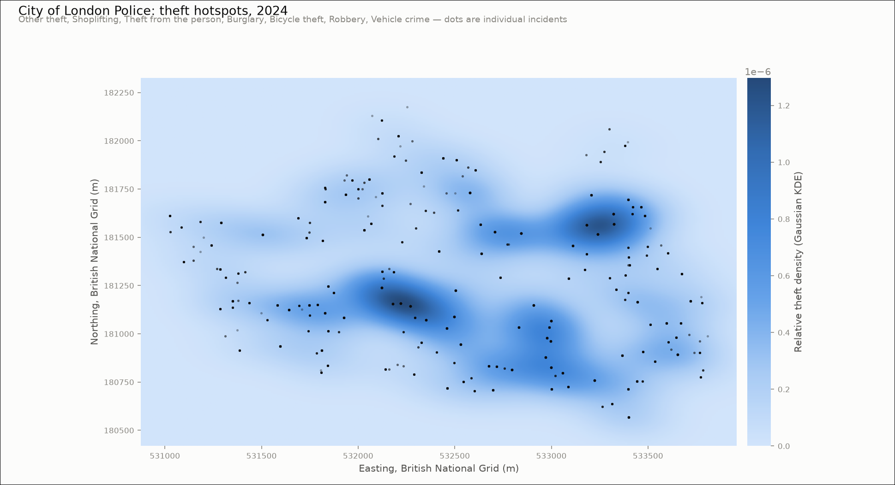
```

10. While this is a good starting point, we can improve it by providing well-known and high quality reference material to guide the implementation. We have provided an extract of a research report [Mapping Crime: Understanding Hot Spots](https://www.ojp.gov/pdffiles1/nij/209393.pdf) in your data package that contains useful tips and best practices for crime mapping. We can improve our analysis by using this reference. Enter the plan mode (*Shift+Tab*) and write the following prompt.

```
I have some reference material for crime mapping in documents/hotspots.pdf. 
Incorporate suggestions from that and give me an updated plan.
Follow the reference exactly and report any deviations in the plan.
```

```{r echo=FALSE, fig.align='center', out.width='75%'}
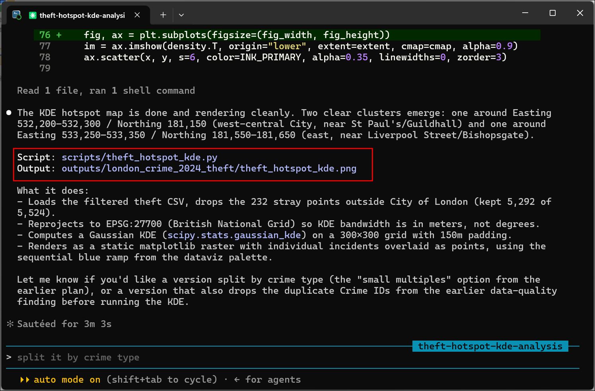
```

11. Select the option to use the **Quartic kernel** and deny option to extend the analysis beyond the scope of the original request.

```{r echo=FALSE, fig.align='center', out.width='75%'}
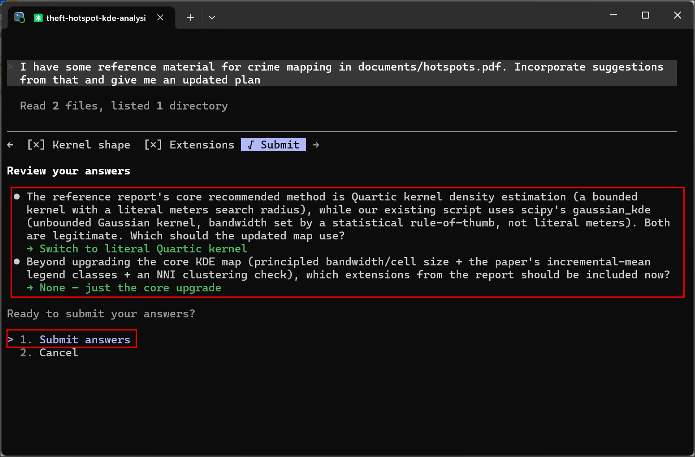
```

12. Once the plan is ready, review it. We can be explicit about the desired output, so you can select **Tell Claude what to change**.

```{r echo=FALSE, fig.align='center', out.width='75%'}
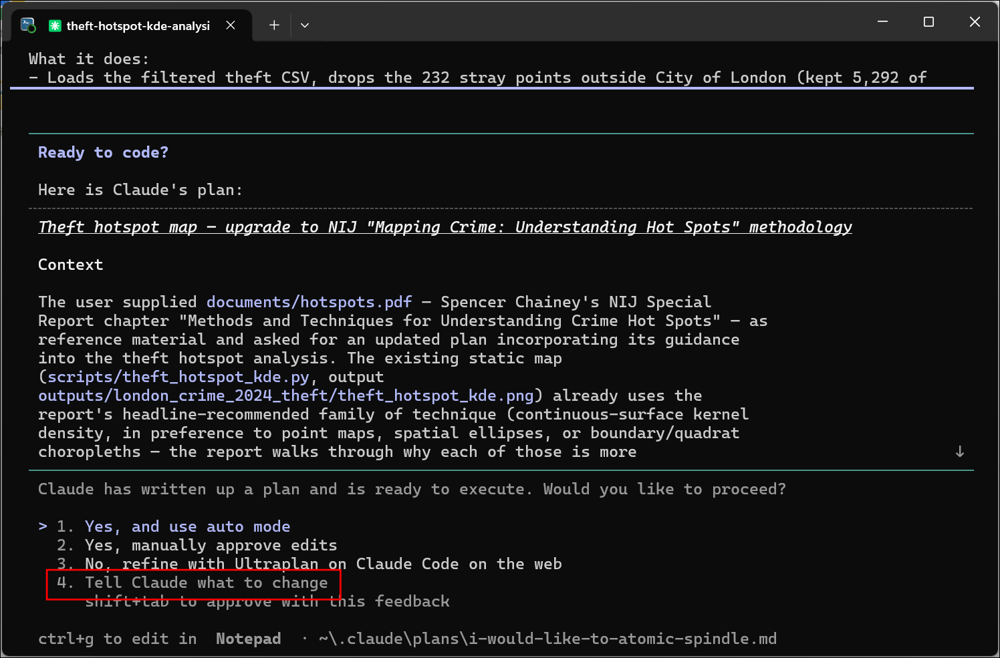
```

13. Ask for the following change.

```
Save the updated script and chart with the _v2 suffix.
```

```{r echo=FALSE, fig.align='center', out.width='75%'}
knitr::include_graphics('images/agentic_coding_geospatial/hotspot13.png')
```

14. Claude Code will build the required script and produce the new hotspot visualization. 

```{r echo=FALSE, fig.align='center', out.width='75%'}
knitr::include_graphics('images/agentic_coding_geospatial/hotspot14.png')
```


```{r echo=FALSE, fig.align='center', out.width='75%'}
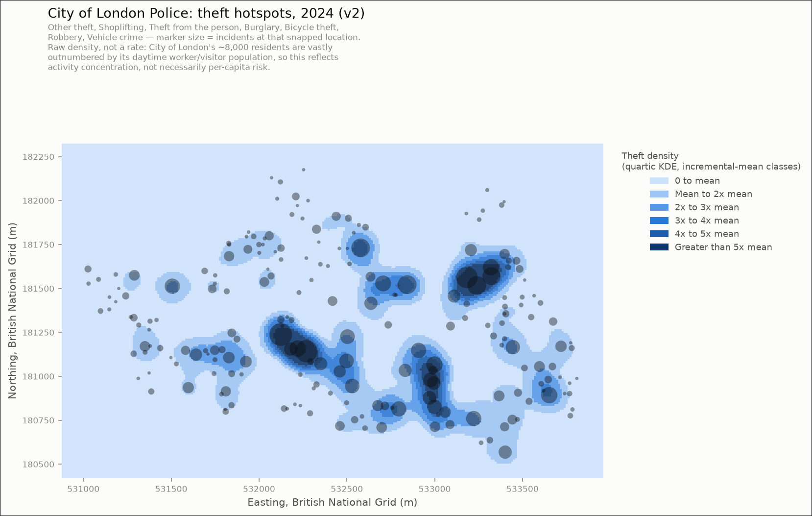
```

15. The new map is much more interpretable and based in scientifically validated technique. Let's extract the hotspots. Enter the following prompt.

```
Use the criteria "Greater than 5x mean" to extract hotspots and convert then to polygons.
Save the results as a GeoJSON london_theft_hotspots.geojson.
```

```{r echo=FALSE, fig.align='center', out.width='75%'}
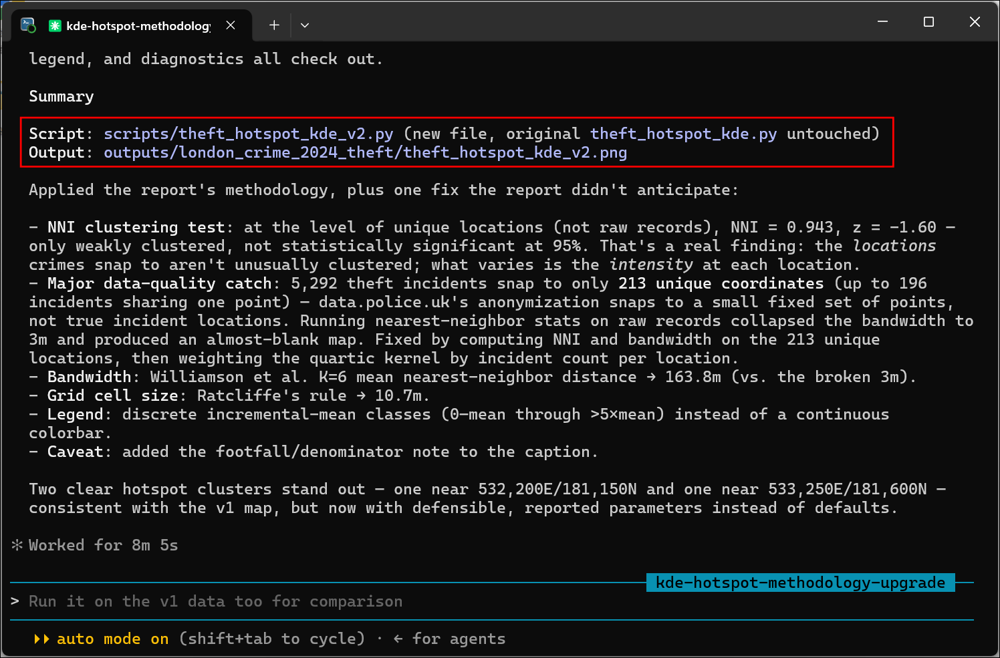
```

16. The raster hotspots will be vectorized using the given threshold and saved as a GeoJSON file.

```{r echo=FALSE, fig.align='center', out.width='75%'}
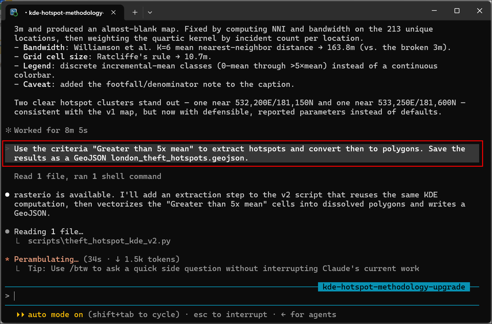
```

17. We can visualize and explore the results in GeoLibre. Open https://web.geolibre.app/ in a browser. Drag and drop the GeoJSON file and verify the results.

```{r echo=FALSE, fig.align='center', out.width='75%'}
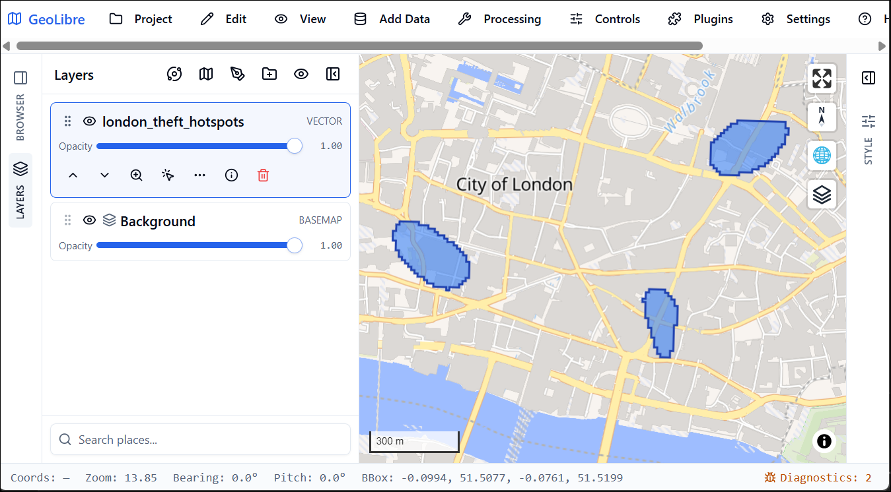
```

## 2.3 Monitoring Usage

It's a good practice to keep an eye on your token usage and costs. You can use the following command to know the utilization in the current session and how much quota is left in your plan.

```
/usage
```

```{r echo=FALSE, fig.align='center', out.width='75%'}
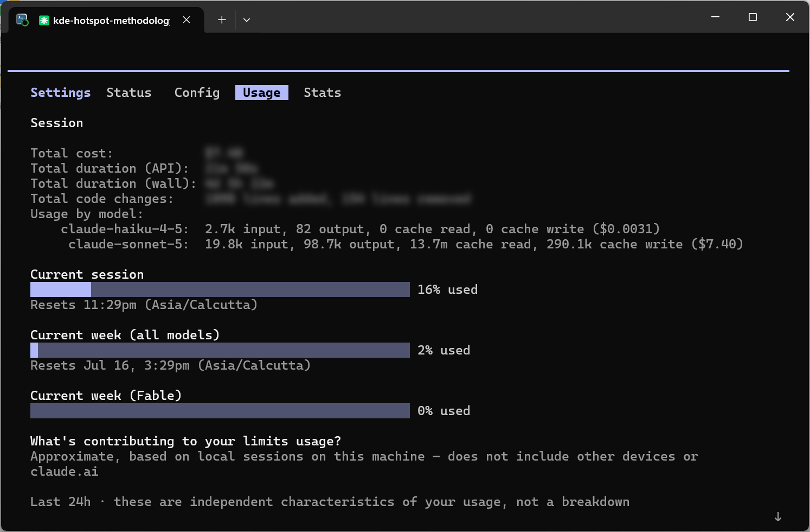
```


# 3 Using Web APIs (Route Optimization)

In this section, we will learn how to use Claude Code to build Jupyter notebooks for data analysis and interactively guide the agent to reach the desired solution and validate the results. We will be implementing a real-world scenario of optimizing delivery routes based on a route optimization algorithm.

In your data package, you will find the following files in the `data/route_optimization/` folder.

* `Delivery_Locations.geojson`: A set of 100 addresses in Washington DC area representing delivery locations.
* `Grocery_Store_Locations.geojson`: A set of 14 grocery store locations which needs to fulfill the delivery to these locations.

We will use Claude Code to build a Jupyter Notebook that builds an end-to-end workflow that loads the data, finds optimal delivery routes and writes PDF manifests with delivery schedule for each store.


[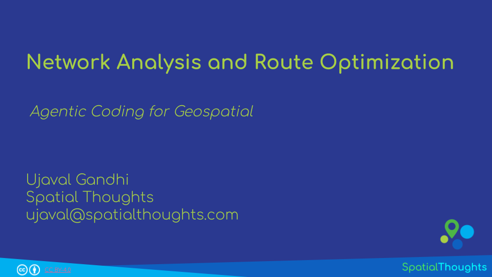{width="400px"}](https://docs.google.com/presentation/d/1qF0D-697kSUbosBGBZkNYfQ7sn4pxcvGI53OpWs9dGE/edit?usp=sharing){target="_blank"}

[Google Slides &#8599;](https://docs.google.com/presentation/d/1qF0D-697kSUbosBGBZkNYfQ7sn4pxcvGI53OpWs9dGE/edit?usp=sharing){target="_blank"} [PDF &#8599;](https://github.com/spatialthoughts/courses/releases/download/presentations/Agentic_Coding_for_Geospatial_Network_Analysis_and_Route_Optimization.pdf)


## 3.1 Using Claude Code in VS Code

Let's install the **Claude Code for VS Code** extension.

1. Click the *Extensions* button on the left-hand panel. Search for  **Claude** and select the  **Claude Code for VS Code by Anthropic** extension.

```{r echo=FALSE, fig.align='center', out.width='75%'}
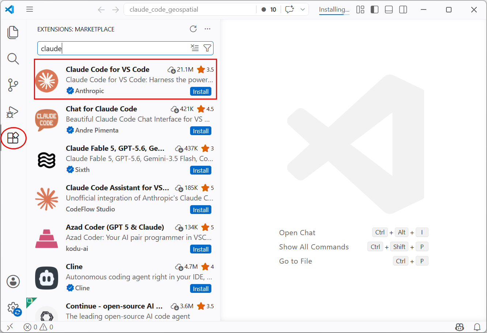
```

2. Click *Install*.

```{r echo=FALSE, fig.align='center', out.width='75%'}
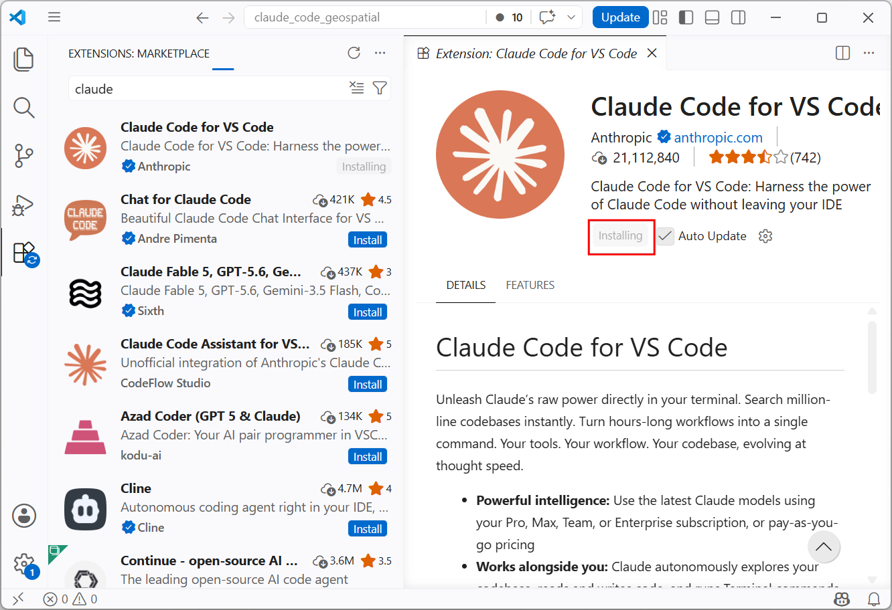
```

3. Once installed, it can be invoked from the *Toggle Chat* button and selecting the *Claude Code* tab. 

```{r echo=FALSE, fig.align='center', out.width='75%'}
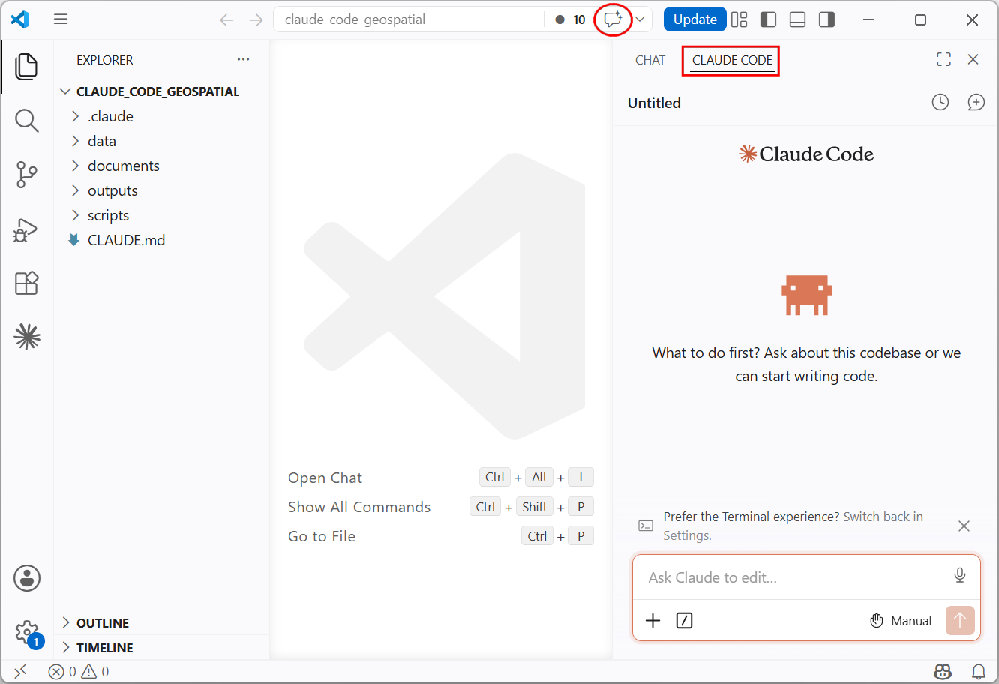
```

## 3.2 Building Notebooks

Now that we have Claude Code running inside VS Code, we can prompt it to build a Jupyter notebook for us.

1. Ensure the workshop folder `agentic_coding_geospatial` is open in VS Code. Enter the following prompt.

```
I want to build a notebook to find optimal delivery routes. 
Create a new notebook scripts/route_optimization.ipynb
Read the .geojson files in data/route_optimization/ folder and
display the data on an interactive map.
```

```{r echo=FALSE, fig.align='center', out.width='75%'}
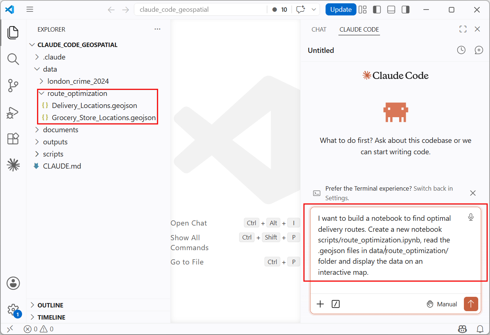
```

2. This is a simple and straightforward task. Our project level `CLAUDE.md` already has preferences listed for how to setup the environment and what packages to use. Claude Code will start creating the notebook and will pause periodically for confirmation. You can choose **Yes** to proceed.

```{r echo=FALSE, fig.align='center', out.width='75%'}
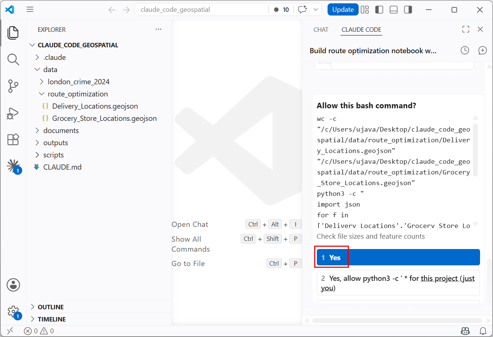
```

3. Once the task finishes, a new notebook `route_optimization.ipynb` will be created in the `scripts/` folder as instructed.

```{r echo=FALSE, fig.align='center', out.width='75%'}
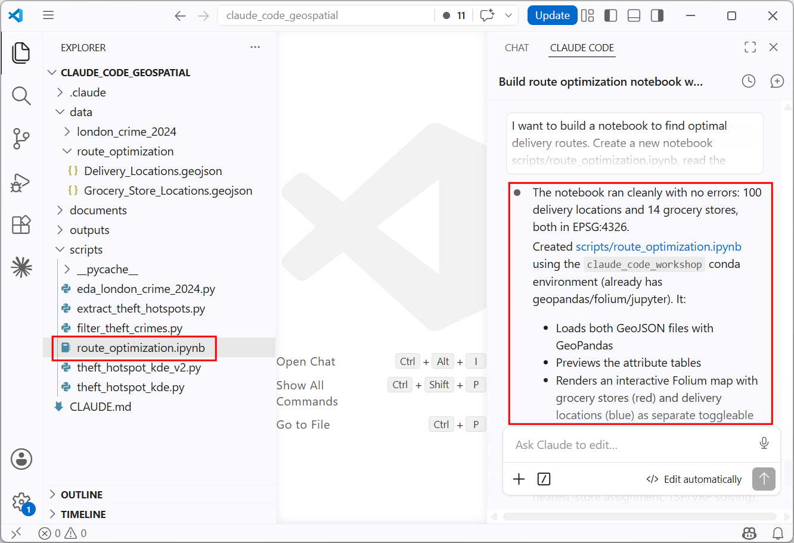
```

4. Locate the notebook in the *Explorer* tab and double-click to open it. The notebook will have the datasets visualized on an interactive map.

```{r echo=FALSE, fig.align='center', out.width='75%'}
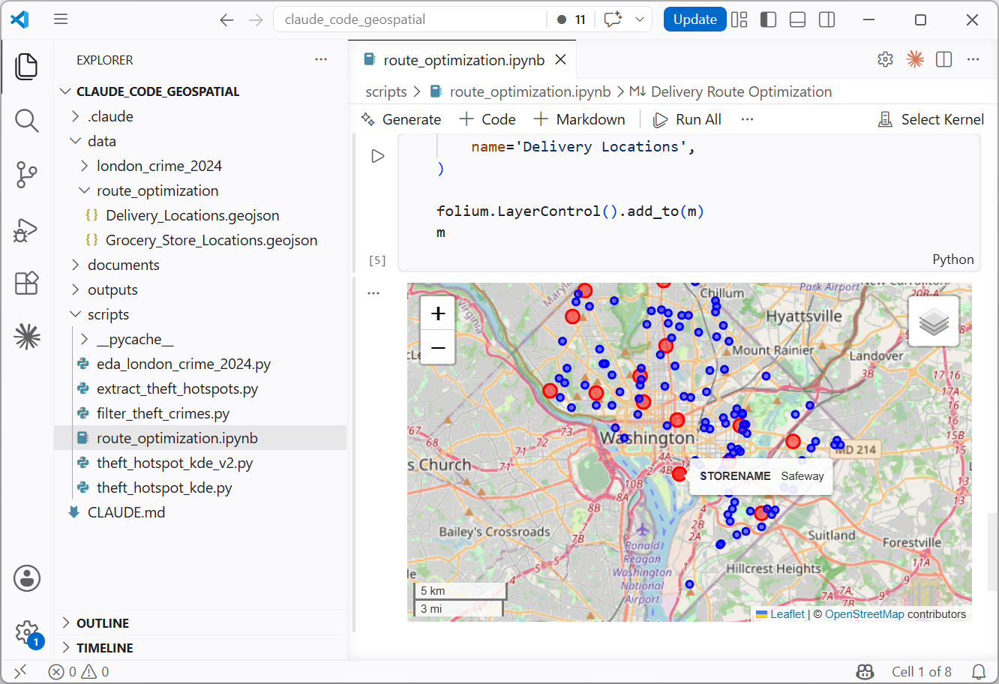
```

## 3.3 Interactive Data Analysis

Now, let's build the core of our data analysis to find the optimal delivery routes. This is a complex problem that requires a lot more context and direction. We will use the *Plan mode* and guide Claude Code towards building the code that solves the problem.

1. Make sure the notebook `route_optimization.ipynb` is open. Open Claude Code from the *Toggle Chat* button.

```{r echo=FALSE, fig.align='center', out.width='75%'}
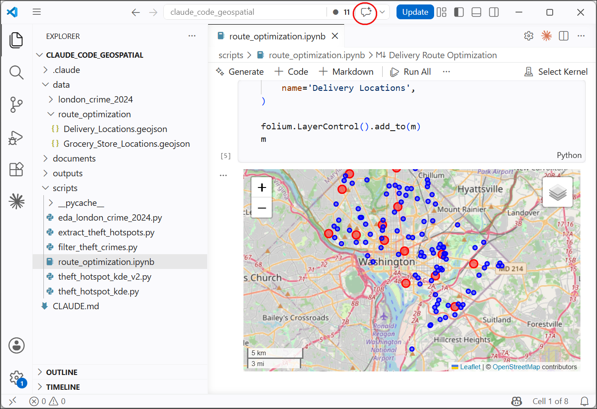
```

2. Switch to the **Plan** mode.

```{r echo=FALSE, fig.align='center', out.width='50%'}
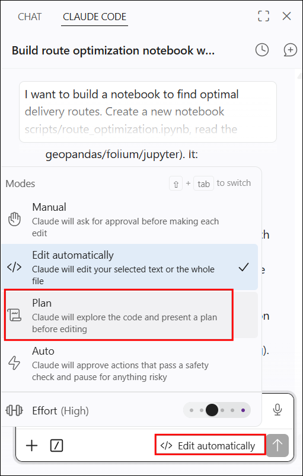
```

3. Enter the following prompt.

```
I want to use OpenRouteService API. 
Give me options on different approaches to plan for the most optimal delivery routes from each store. 

Here are the constraints:

- A single trip will consist of 10 deliveries at maximum.
- The delivery will originate at a grocery store and end at the same delivery store.
- All stores are capable of fulfilling the order but can do a maximum of 5 delivery trips each day.

The goal is to minimize the total distance traveled.

The output is the assignment and delivery schedule for each store along with a GeoJSON of the optimal delivery routes for visual inspection.
```

```{r echo=FALSE, fig.align='center', out.width='50%'}
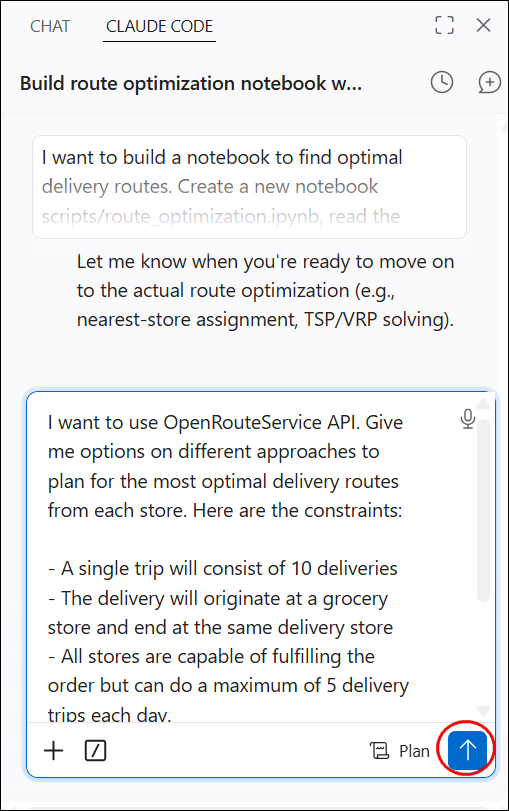
```

4. Claude Code will trigger the *AskUserQuestion* tool to collect more information. For the Vehicle Routing Problem (VRS) approach, select the **ORS Optimization API (VROOM)**.

```{r echo=FALSE, fig.align='center', out.width='60%'}
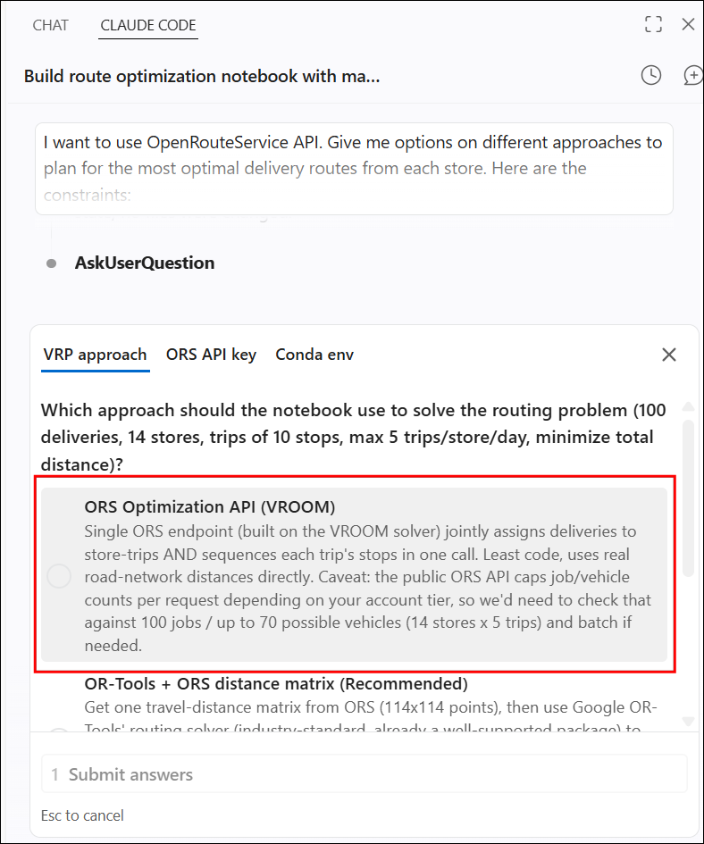
```

5. We need to enter our API key. Select **Other** and enter the API key in the response below, replacing the `<your-api-key>` with your actual API key.  If you do have your key handy, you can login to your [HeiGIT Account](https://account.heigit.org/manage/key) and copy the long string displayed under *Basic Key*. 

```
Yes, I have a key. Save the API key in a separate cell in the notebook.

ORS_API_KEY='<your-api-key>'
```

```{r echo=FALSE, fig.align='center', out.width='60%'}
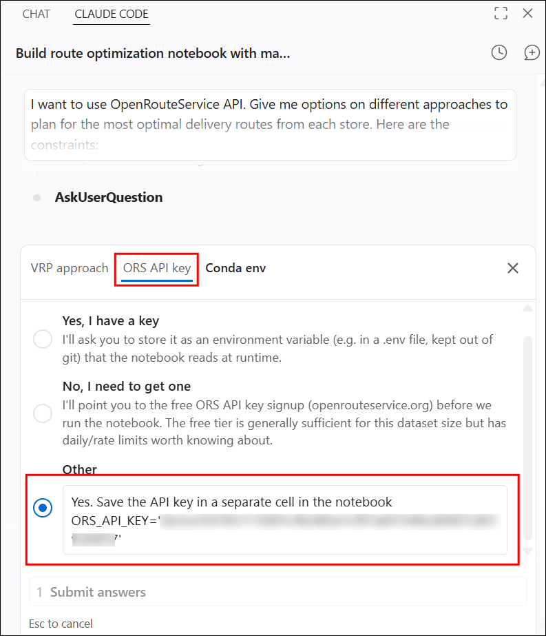
```

6. For the *Conda env*, select the `claude_code_workshop` conda environment that we have setup. You can then click *Submit answers*.

```{r echo=FALSE, fig.align='center', out.width='60%'}
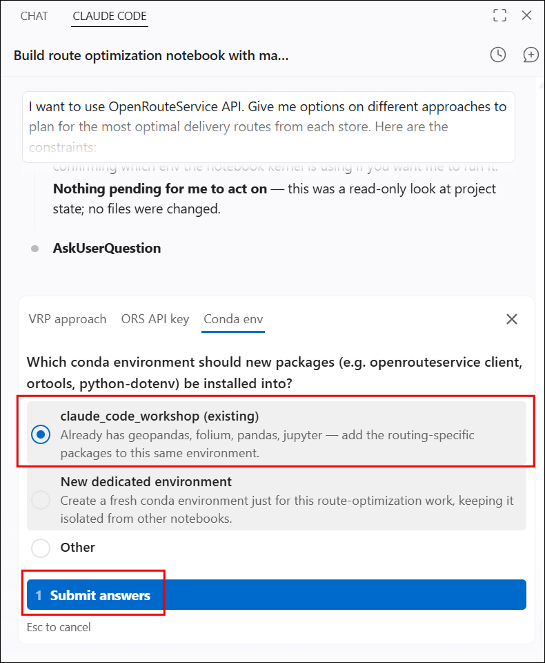
```

7. As we are asking for delivery schedules, you may be prompted to choose store operating hours. We keep things simple and choose **Trip order per store** listing.

```{r echo=FALSE, fig.align='center', out.width='60%'}

```

8. After obtaining the necessary information, Claude Code will kick-off an agent to do the planning. Approve any permissions it may need.

```{r echo=FALSE, fig.align='center', out.width='60%'}

```

9. The OpenRouteService API has limits on how many Origin-Destination pairs it can solve. If you get prompted to choose for an approach, choose **Two-stage: assign + batch, then ORS Optimization per trip** approach.

```{r echo=FALSE, fig.align='center', out.width='60%'}

```

10. Once the plan it ready, it will be opened in VS Code. Review the plan and suggest any changes by adding comments. You can select any text and enter comments on what you would like changed. For example, in the initial plan that Claude Code came up with - it wanted to use the `openrouteservice` Python package. We can instead ask it to use the API directly instead of a client library by adding a comment like below.

```
Instead, use the REST API directly.
```

```{r echo=FALSE, fig.align='center', out.width='75%'}

```

11. After adding the comment, choose **Send feedback and keep planning**.

```{r echo=FALSE, fig.align='center', out.width='60%'}

```

12. Once the plan is modified and you are satisfied, choose **Yes, and auto-accept**.

```{r echo=FALSE, fig.align='center', out.width='75%'}

```

13. Claude Code will now start implementing the plan. 

```{r echo=FALSE, fig.align='center', out.width='60%'}

```

14. Once the notebook is built, it will also test it to ensure it runs without any errors. Once everything is done, it will print a summary.

```{r echo=FALSE, fig.align='center', out.width='60%'}

```

15. Open the notebook and review the results. You will see the map with the planned routes for all the delivery locations.

```{r echo=FALSE, fig.align='center', out.width='75%'}

```

## 3.4 Validation and Export

When building with AI - you need to spend most of your time validating the results and guiding the model. Let's learn some techniques for validation.

1. When reviewing the initial output of the delivery route, you will notice that some of the routes are very long and does not look optimal. We can ask Claude Code to fix this using the following prompt.

```
I see that some stores are not assigned any deliveries even if they are quite close to an address. 
The assignment tries to assign 10 deliveries in each route - 
making some of them quite long while nearby stores end up without any deliveries.
Update the plan to address this problem.
```

```{r echo=FALSE, fig.align='center', out.width='75%'}

```

2. Claude Code will go through the notebook and come up with a fix. Give your approval to apply the fix.

```{r echo=FALSE, fig.align='center', out.width='75%'}

```

3. Your prompt will also force Claude to do a more thorough validation of the results.

```{r echo=FALSE, fig.align='center', out.width='50%'}

```

4. The updated routes look much better, but we still need to do a closer inspection. We can export the results in any vector data format, so we can use a GIS to view and verify it better. Enter the below prompt.

```
Save the routes as a single GeoJSON file in the outputs/route_optimization/
folder so I can validate the results.
```

```{r echo=FALSE, fig.align='center', out.width='50%'}

```

5. A new file `routes.geojson` will be created. Locate it in the VS Code *Explorer*. Right-click and select *Reveal in File Explorer* to open the folder on your computer.

```{r echo=FALSE, fig.align='center', out.width='75%'}

```

6. We can visualize and explore the results in GeoLibre. Open https://web.geolibre.app/ in a browser. Drag and drop `routes.geojson`, along with the source data `Delivery_Locations.geojson` and `Grocery_Store_Locations.geojson` and verify the results.

```{r echo=FALSE, fig.align='center', out.width='75%'}

```

7. Once we are satisfied with the output, we can generate PDF manifests with the planned routes. These files are the output from our analysis that can be handed over to the operations team for implementation. Enter the following prompt. If prompted for a PDF library, choose **Install reportlab** and click *Submit answers*.

```
Generate PDF manifests in the outputs/route_optimization/ folder containing
delivery order and addresses for each trip.
1 manifest per store.
```

```{r echo=FALSE, fig.align='center', out.width='50%'}

```

8. The code will be added to the notebook and PDFs will be generated.

```{r echo=FALSE, fig.align='center', out.width='50%'}

```

9. The PDFs now contain delivery routes for each store.

```{r echo=FALSE, fig.align='center', out.width='60%'}

```

# Assignment

Now you are ready to put your agentic coding skills to test by solving a spatial analysis problem from scratch. 

**Problem Statement**

You are a data scientist for a real-estate company who wants to enhance their property listings by assigning a **livability score** to each of their properties to help buyers pick properties that suit their lifestyle. 

Your task is to calculate such a score for all the *Apartment Buildings* in your city. Consider the factors that are important to home buyers. You can design the score using metrics such as:

* Total number of parks within a certain distance
* Total number of restaurants within a certain distance
* Distance to the nearest metro/rail/bus stop
* Distance to the nearest school
* ...

These are some examples and you can pick the criteria that make sense to you based on the knowledge of your city. You can use OpenStreetMap to obtain the data for apartment building polygons and the required amenities.

**Required output**

* A GeoPackage containing the apartment buildings layer enriched with attributes for each factor and the final livability score.
* A 1-2 page report on your analysis describing the methodology and steps you have taken to validate the results. 

Below are example reports shared by participants of our live class for inspiration:

* [Livability of Stockholm's apartment buildings](https://github.com/spatialthoughts/courses/releases/download/documents/stockholm_livability_report.pdf) by Marco Hernández
* [Bozeman Apartment Livability Index: Methodology Report](https://github.com/spatialthoughts/courses/releases/download/documents/Bozeman_Livability_Index_Methodology_Report.pdf) by Colin A. Shaw

**Tips**

* You can prompt the agent to use the Python package `osmnx` which can easily extract the required data from OpenStreetMap.
* Instead of trying to one-shot the whole analysis, build your notebook by prompting the agent to plan and build one step at a time. Validate the output from each step before moving to the next.
* Start simply and use a simple buffer / linear distance. You may add an option to use an `network distance`/`isochrone` instead of simple circular buffer for a more realistic distances.
* Look at methodology followed by existing livability scores on websites such as [AreaVibes](https://www.areavibes.com/madison-wi/capitol/) and [PropTiger](https://www.proptiger.com/buzz/livability-score).


# 4. Using Skills

Skills are a set of instructions that teach an AI agent how to perform specific, multi-step workflows. [Skills in Claude Code]((https://code.claude.com/docs/en/skills)) are defined by a `SKILL.md` containing natural-language instructions for the agent along with specific examples and patterns. You can also publish your skill on GitHub and make it available for others to download and use with their own agent.

[{width="400px"}](https://docs.google.com/presentation/d/18zyVBK70rY-mv0tiZwKQqRO6pY1A4762HAYrJCVKCjk/edit?usp=sharing){target="_blank"}

[Google Slides &#8599;](https://docs.google.com/presentation/d/18zyVBK70rY-mv0tiZwKQqRO6pY1A4762HAYrJCVKCjk/edit?usp=sharing){target="_blank"} [PDF &#8599;](https://github.com/spatialthoughts/courses/releases/download/presentations/Agentic_Coding_for_Geospatial_Using_Skills.pdf)


## 4.1 Installing a Skill

We will install the [Humanizer](https://github.com/blader/humanizer/tree/main) skill that improves the text generated by AI models and makes them sound more natural.

1. Start Claude Code in the Terminal. *(Windows users)*, search for Anaconda Powershell Prompt and launch it. *(Mac/Linux users)*: Launch a Terminal window. Use the `cd` command to change the current working directory to the project directory. Once you are inside the project folder, launch Claude Code by entering the following command.

```{bash eval=FALSE}
claude
```

```{r echo=FALSE, fig.align='center', out.width='75%'}

```

2. There are multiple ways to install skills. The  [`npx skills`](https://github.com/vercel-labs/skills) command provides an easy to to install skills for a wide range of coding agents. However this requires installation of Node.js on your system. For Claude Code, you can install Skills as plugins. Run the following command to add the GitHub repository.

```{bash eval=FALSE}
/plugin marketplace add blader/humanizer
```

```{r echo=FALSE, fig.align='center', out.width='75%'}

```

3. Next run the following command to install the `humanizer` skills as a plugin.

```{bash eval=FALSE}
/plugin install humanizer@humanizer
```

```{r echo=FALSE, fig.align='center', out.width='75%'}

```

4. When prompted, select **Install for you (user scope)**.

```{r echo=FALSE, fig.align='center', out.width='75%'}

```

5. The plugin will be installed and activated.

```{r echo=FALSE, fig.align='center', out.width='75%'}

```

## 4.2 Using a Skill

Once installed, Skills are triggered automatically when your prompt matches the task handled by the skill. We will use the Humanizer skills to review and rewrite a paragraph.

1. Enter the following prompt into Claude Code. Claude Code will use the selected model and generate a text summary.

```
Give me a 100-word summary of this article
https://cloudnativegeo.org/blog/2026/02/the-technical-debt-of-earth-embedding-products/
```

```{r echo=FALSE, fig.align='center', out.width='75%'}

```

2. We will now invoke the `humanizer` skill by asking Claude Code to review and update the text. Enter the following prompt and press *Enter*. 

```
Review the summary and remove signs of AI writing
```

```{r echo=FALSE, fig.align='center', out.width='75%'}

```

3. The `humanizer` skill will be used to rewrite the text by removing common AI-writing patterns.

```{r echo=FALSE, fig.align='center', out.width='75%'}

```

## 4.3 Creating a Skill

The real power of Skills lies in automating custom workflows. We will learn how to create a new skill for your custom workflow and use it. We will create a new skill named `create-cog` for converting raster data into a Cloud Optimized GeoTIFF (COG) format.

1. Enter the following prompt. `Create a new skill from the following text:` and paste the content below.

```{r echo=FALSE, comment=''}
cat(readLines('code/agentic_coding_geospatial/create-cog-skill.md'), sep = '\n')
```

```{r echo=FALSE, fig.align='center', out.width='75%'}

```

2. If prompted, install the skill as a project-level skill. This will be installed in the `.claude` directory in the current folder.

```{r echo=FALSE, fig.align='center', out.width='75%'}

```

3. Run the following command to reload the skills so the new skill is available.

```
/reload-skills
```

```{r echo=FALSE, fig.align='center', out.width='75%'}

```

4. Let's test the skill. You have a regular GeoTIFF file in your data package. Let's ask Claude Code to convert it. Enter the prompt below.

```
Convert the file data/chirps/chirps-v3.0.2025.tif to a Cloud Optimized GeoTIFF
```

```{r echo=FALSE, fig.align='center', out.width='75%'}

```

5. The skill will be invoked as a new file will be generated as per the instructions in the skill.

```{r echo=FALSE, fig.align='center', out.width='75%'}

```

6. Let's test the skill with a remote file. Enter the following prompt.

```
Convert the file https://data.chc.ucsb.edu/products/CHIRPS/v3.0/annual/global/tifs/chirps-v3.0.2024.tif to a COG
```

```{r echo=FALSE, fig.align='center', out.width='75%'}

```

7. As specified in the skill, Claude Code will use the `/vsicurl` virtual file system to access the file instead of downloading it.

```{r echo=FALSE, fig.align='center', out.width='75%'}

```

8. Skills can also be invoked using commands. Let's test the skill to ensure it follows the validation instructions. Enter the following prompt.

```
/create-cog Convert this file https://storage.googleapis.com/spatialthoughts-public-data/ntl/viirs/viirs_ntl_2021_global.tif
```

```{r echo=FALSE, fig.align='center', out.width='75%'}

```

9. As our input is already a COG, the skill will correctly stop and not convert the file.

```{r echo=FALSE, fig.align='center', out.width='75%'}

```


## 4.4 Useful Skills

* [Anthropic Official Skills](https://github.com/anthropics/skills/tree/main): Official skills repository by Anthropic. `skill-creator`, `pdf`, `xlsx` are useful skills for Data Science work.
* [Karpathy-Inspired Claude Code Guidelines](https://github.com/multica-ai/andrej-karpathy-skills): Improve Claude Code behavior, derived from Andrej Karpathy's observations on LLM coding pitfalls.
* [Skills Leaderboard](https://www.skills.sh/): Discover, install and manage skills using the `skills` CLI.
* [Geospatial Skills for Agents](https://isaac.earth/geospatial-skills/#catalog): A catalog of installable geospatial tools and capabilities designed for coding agents, covering raster/vector processing, satellite data, and interactive visualization.
* [SpatialThoughts AI Skills](https://github.com/spatialthoughts/spatialthoughts-ai-skills/): Repository containing skills accompanied with Spatial Thoughts Courses. 
* [GeoSQL](https://github.com/dekart-xyz/geosql): Skill for data scientists and analysts working with geospatial data on PostGIS, BigQuery, Snowflake, and Wherobots.


# 5. Building a Personal Knowledge Website

An AI second brain is a persistent digital memory system that stores your notes and ideas. Andrej Karpathy popularized the idea of a implementing such a knowledge base using the note taking app Obsidian and coding agents like Claude Code. In this section, we will take the core ideas behind the [LLM-Wiki](https://gist.github.com/karpathy/442a6bf555914893e9891c11519de94f) system and learn how to setup a simplified version to collect, organize and maintain an archive of your notes and bookmarks. We will also publish and host them as an auto-updating website on Github Pages so you can always find and recall items from your archive.

[{width="400px"}](https://docs.google.com/presentation/d/1w2N_7FtX4v9nHJoX-se3rLw-KcbfKepEhr9b6Lk7wPI/edit?usp=sharing){target="_blank"}

[Google Slides &#8599;](https://docs.google.com/presentation/d/1w2N_7FtX4v9nHJoX-se3rLw-KcbfKepEhr9b6Lk7wPI/edit?usp=sharing){target="_blank"} [PDF &#8599;](https://github.com/spatialthoughts/courses/releases/download/presentations/Agentic_Coding_for_Geospatial_Personal_Knowledge_Base.pdf)


## 5.1 Setting up your Personal Knowledge Base

We will now create a new folder on your computer and setup a structure to create a personal knowledge base.

1.  *(Windows users)*, search for Anaconda Powershell Prompt and launch it. *(Mac/Linux users)*: Launch a Terminal window. Create a new directory using the `mkdir` command.

*Windows*
```{bash eval=FALSE}
mkdir Desktop\personal_knowledge_base
```

*Mac/Linux*
```{bash eval=FALSE}
mkdir Desktop/personal_knowledge_base
```

```{r echo=FALSE, fig.align='center', out.width='75%'}

```

2. Next, switch to the directory using the `cd` command.

*Windows*
```{bash eval=FALSE}
cd Desktop\personal_knowledge_base
```

*Mac/Linux*
```{bash eval=FALSE}
cd Desktop/personal_knowledge_base
```

```{r echo=FALSE, fig.align='center', out.width='75%'}

```

3. Start Claude Code and when prompted, choose **Yes, I trust this folder**. 

```{bash eval=FALSE}
claude
```

```{r echo=FALSE, fig.align='center', out.width='75%'}

```

4. Invoke the `/memory` command to setup the project `CLAUDE.md`

```{bash eval=FALSE}
/memory
```

```{r echo=FALSE, fig.align='center', out.width='75%'}

```

5. Select **Project instructions** and press *Enter*.

```{r echo=FALSE, fig.align='center', out.width='75%'}

```

6.  Your default editor (Visual Studio Code) will now open with a new `CLAUDE.md` file.  Paste the following content and save the file. Close the file once saved.

```{r echo=FALSE, comment=''}
cat(readLines('code/agentic_coding_geospatial/personal_knowledge_base/CLAUDE.md'), sep = '\n')
```

```{r echo=FALSE, fig.align='center', out.width='75%'}

```

7. Once the CLAUDE.md is setup, enter the following prompt.

```
Read CLAUDE.md and setup the folder structure for my notes
```

```{r echo=FALSE, fig.align='center', out.width='75%'}

```

8. Claude Code will setup the structure as per instructions in the CLAUDE.md file.

```{r echo=FALSE, fig.align='center', out.width='75%'}

```

## 5.2 Populating Notes with Obsidian

1. Launch Obsidian. Click *Open* and browse to `personal_knowledge_base` the open the folder as vault.

```{r echo=FALSE, fig.align='center', out.width='50%'}

```

2. You will see your `personal_knowledge_base` folder along with the subfolders created in the previous step. Select the `raw/New_Notes.md` file.

```{r echo=FALSE, fig.align='center', out.width='75%'}

```

3. Add some notes to this file. Each new line becomes a separate note. You can copy the following 3 notes to get started.

```
https://cloudnativegeo.org/blog/2026/02/the-technical-debt-of-earth-embedding-products/ Article comparing different earth embeddings

https://github.com/montimaj/agribound Python package for delineating field boundaries

https://zenodo.org/records/18647054
```

```{r echo=FALSE, fig.align='center', out.width='75%'}

```

4. In the Claude Code session, enter the following prompt.

```
Ingest new notes
```

```{r echo=FALSE, fig.align='center', out.width='75%'}

```

5. Claude Code will visit hte URLs and populate each note with a summary, keywords and topics.

```{r echo=FALSE, fig.align='center', out.width='75%'}

```

6. You will see new files appear in your Obsidian vault. Open the `notes/` folder to see the newly created pages. The `index.md` is the homepage for the knowledge base where all topics are listed.

```{r echo=FALSE, fig.align='center', out.width='75%'}

```

7. You can open individual topic pages to see the notes contained in them.

```{r echo=FALSE, fig.align='center', out.width='75%'}

```

8. Each note has links to different topics. You can visualize these connections using a graph view. Click on the *Open graph view* button.

```{r echo=FALSE, fig.align='center', out.width='75%'}

```

9. The default visualization includes all subfolders along with the `index.md` file. We can remove them from the view to see the actual shape of the notes. Click *Filters* and enter the following expression. You can also toggle the *Existing files only* and *Orphans* buttons.

```{r echo=FALSE, fig.align='center', out.width='75%'}

```

```
path:notes  -file:log -file:index
```

10. You will not see the connection between the notes clearly.

```{r echo=FALSE, fig.align='center', out.width='75%'}

```

11. To help collect and add notes from the web to your vault, you can use the [Obsidian Web Clipper](https://obsidian.md/clipper) extension. Install the extension for your browser. Once installed, locate the icon in your browser's extension area.

```{r echo=FALSE, fig.align='center', out.width='75%'}

```

12. The Web Clipper lets you extract text from any web page and save it directly to your Obsidian vault. Many websites - such as ones requiring user login - are not accessible by AI Agents. The extension makes it easy to add such pages as notes. Visit the following post from LinkedIn and click the *Obsidian Web Clipper* icon.

> If you do not have a LinkedIn account, you can use any other web page for this step.

```
https://www.linkedin.com/feed/update/urn:li:activity:7478690057026207745/
```

```{r echo=FALSE, fig.align='center', out.width='75%'}

```

13. The extension will populate a note. Change the folder name to be **raw** instead of the default *Clippings*. Click *Add to Obsidian* button.

```{r echo=FALSE, fig.align='center', out.width='75%'}

```

14. A new Markdown page will be added in the `raw/` folder. Our vault is setup to process all the inputs from this folder, so we can now ask Claude Code to process this note.

```{r echo=FALSE, fig.align='center', out.width='75%'}

```

15. Enter the following prompt in Claude Code.

```
Ingest new notes
```

```{r echo=FALSE, fig.align='center', out.width='75%'}

```

16. The vault will be updated with the new note.

```{r echo=FALSE, fig.align='center', out.width='75%'}

```


## 5.3 Publishing Your Notes Website

Claude Code can build, deploy and update websites. We will learn how to use these capabilities by turning our local Obsidian folder into a static website and host it for free on Github Pages. We will also configure it so it updates automatically every time we add new notes to our personal knowledge base. This allows you to always access and search your notes from anywhere.

1. We will first verify and ensure you are logged in to your GitHub account in the Terminal. *(Windows users)*, search for Anaconda Powershell Prompt and launch it. *(Mac/Linux users)*: Launch a Terminal window and enter the following command. If you get an error message, or do not see your account listed, follow our [Configure GitHub CLI](install-git-github.html#configure-github-cli) to complete the steps for logging in.

```{bash eval=FALSE}
gh auth status
```

```{r echo=FALSE, fig.align='center', out.width='75%'}

```

2. We have provided a template for a website based on the MkDocs static site generator. Visit the template repository at https://github.com/spatialthoughts/personal-notes-website-template

```{r echo=FALSE, fig.align='center', out.width='75%'}

```

3. Copy the instructions for Claude Code from the README.md page.

```{r echo=FALSE, fig.align='center', out.width='75%'}

```

4. Paste it in your Claude Code session and press *Enter*.

```{r echo=FALSE, fig.align='center', out.width='75%'}

```

5. You will be prompted to enter a repository name for your website. Pick the repository name of your choice.

```{r echo=FALSE, fig.align='center', out.width='75%'}

```

6. Claude Code will now copy the relevant files from the template and setup your vault as a MkDocs website. Enter the following prompt to push your changes to GitHub and make the website live.

```
Push the changes
```

```{r echo=FALSE, fig.align='center', out.width='75%'}

```

7. GitHub provides free hosting service for public repositories via GitHub pages. Select **Yes, create public repo** when prompted to choose what type of repository to setup.

```{r echo=FALSE, fig.align='center', out.width='75%'}

```

8. Claude Code will use the `gh` command to create and configure the repository. Once the deployment is complete, you can go to the URL of your website displayed in the output.

```{r echo=FALSE, fig.align='center', out.width='75%'}

```

9. You will see all your notes from the Obsidian vault published on the website.

```{r echo=FALSE, fig.align='center', out.width='75%'}

```

10. The website is setup to auto-deploy whenever a new change is pushed. Let's test this. Enter a new note in your Obsidian vault.

> Pro tip: You can indicate the main topic for the note by encloding it in the `[[ ]]`. This is the Obsidian syntax for indicating internal links.

```
https://www.geomermaids.com/cookbook/duckdb-spatial/ Optimizing DuckDB Spatial Queries [[SQL]]
```

```{r echo=FALSE, fig.align='center', out.width='75%'}

```

11. Ask Claude Code to *Ingest new notes* and it will update the vault and push updates to the GitHub repository.

```{r echo=FALSE, fig.align='center', out.width='75%'}

```

12. Wait for 1-2 minutes for the GitHub Action to deploy the updated site. You will see the new site with the updated note.

```{r echo=FALSE, fig.align='center', out.width='75%'}

```

## 5.4 Useful Resources

* [LLM-Wiki](https://gist.github.com/karpathy/442a6bf555914893e9891c11519de94f): Andrej Karpathy's original write-up on setting up a personal knowledge base.
* [Karpathy's LLM Wiki - Full Beginner Setup Guide](https://www.youtube.com/watch?v=iXd0t60YmMw): Video tutorial on setting-up a full LLM-Wiki knowledge base.
* [OpenKnowledge](https://openknowledge.ai/): AI-native markdown editor. Similar to Obsidian but fully open-source and comes with a [built-in template](https://openknowledge.ai/docs/workflows/karpathy-llm-wiki) for building a personal knowledge base.


# 6. Using MCP Servers

The [Model Context Protocol (MCP)](https://modelcontextprotocol.io/docs/2026-07-28/getting-started/intro) is an open standard for connecting external tools to AI Agents. MCP Servers allow your Agent to carry out tasks on different applications. In this section, we will learn how MCP servers work and how to configure your agents to use them.

[{width="400px"}](https://docs.google.com/presentation/d/1uaxad3a4VE9AqHTUwyfiSqUIEch9kJeAzN6n27FlFj4/edit?usp=sharing){target="_blank"}

[Google Slides &#8599;](https://docs.google.com/presentation/d/1uaxad3a4VE9AqHTUwyfiSqUIEch9kJeAzN6n27FlFj4/edit?usp=sharing){target="_blank"} [PDF &#8599;](https://github.com/spatialthoughts/courses/releases/download/presentations/Agentic_Coding_for_Geospatial_Using_MCP_Servers.pdf)

## 6.1 Installing and Using the QGIS MCP Server

The QGIS MCP server allows you to connect Claude Code to QGIS and provides tools to add layers, edut features, call processing algorithms and more. Configuring the MCP server is a two-step process:

* Install the [QGIS MCP](https://plugins.qgis.org/plugins/qgis_mcp_plugin/) plugin in QGIS. 
* Configure Claude Code with the QGIS MCP server.

We will go through each step and learn how to setup the server and use it from Claude Code.

1. Open QGIS. From the *Plugins* menu, choose *Manage and Install Plugins...*.

```{r echo=FALSE, fig.align='center', out.width='75%'}

```

2. In the *Plugin Manager*, select the *All* tab, search and locate the **QGIS MCP** plugin. Click on the *Install Plugin* button to install it.

```{r echo=FALSE, fig.align='center', out.width='75%'}

```

3. Once installed, start the MCP server from *Plugins &rarr; QGIS MCP &rarr; Run MCP*.

```{r echo=FALSE, fig.align='center', out.width='75%'}

```

4. You can also start the server from the *Plugin Toolbar* menu. Once started, the plugin button will turn green to indicate that the server is running.

```{r echo=FALSE, fig.align='center', out.width='75%'}

```

5. Next *(Windows users)*, search for Anaconda Powershell Prompt and launch it. *(Mac/Linux users)*: Launch a Terminal window. Activate the workshop environment and install the `uv` package manager which is required by the QGIS MCP server.

```{bash eval=FALSE}
conda activate claude_code_workshop
conda install -c conda-forge uv
```

```{r echo=FALSE, fig.align='center', out.width='75%'}
knitr::include_graphics('images/agentic_coding_geospatial/qgismcp5.png')
```

6. Run the following command to add the QGIS MCP server to Claude Code configuration.

```{bash eval=FALSE}
claude mcp add -s user qgis -- uvx --from https://github.com/nkarasiak/qgis-mcp/archive/refs/heads/main.zip qgis-mcp-server
```

```{r echo=FALSE, fig.align='center', out.width='75%'}

```

7. Start Claude Code. Run the following command for managing MCP servers.

```{bash eval=FALSE}
/mcp
```

```{r echo=FALSE, fig.align='center', out.width='75%'}

```

8. Verify that `qgis` is connected. Press *Esc* to exit.

```{r echo=FALSE, fig.align='center', out.width='75%'}
knitr::include_graphics('images/agentic_coding_geospatial/qgismcp8.png')
```

9. Enter the following prompt to test the connection to the QGIS MCP server. If the connection is working fine, you will get a success return message.

```
ping qgis
```

```{r echo=FALSE, fig.align='center', out.width='75%'}

```

10. Let's use the MCP server. Enter the following prompt.

```
Load the raster data/chirps/chirps-v3.0.2025.tif in QGIS
```

```{r echo=FALSE, fig.align='center', out.width='75%'}
knitr::include_graphics('images/agentic_coding_geospatial/qgismcp10.png')
```

11. Claude Code will use the tools provided by the MCP server to load the data layer in QGIS.

```{r echo=FALSE, fig.align='center', out.width='75%'}

```

## 6.2 Useful MCP Servers

* [Google Colab MCP](https://github.com/googlecolab/colab-mcp): Build, edit and run Google Colab notebooks using Claude Code.
* [QGIS MCP](https://github.com/nkarasiak/qgis-mcp): Connect QGIS using the Model Context Protocol (MCP), enabling Claude to directly control QGIS - manage layers, edit features, run processing algorithms, render maps, and more.

# 7. Using GeoAI (Object Detection)

We will now build a notebook that uses a pre-trained model to detect buildings from aerial imagery, running on Google Colab so we can take advantage of its free GPU access. We will select an image from OpenAerialMap and use a pre-trained model to extract building polygons from it.

[{width="400px"}](https://docs.google.com/presentation/d/15vWZLJmcAAc_66IkVfVuh31NmpzwxhV7s33coDDM-B4/edit?usp=sharing){target="_blank"}

[Google Slides &#8599;](https://docs.google.com/presentation/d/15vWZLJmcAAc_66IkVfVuh31NmpzwxhV7s33coDDM-B4/edit?usp=sharing){target="_blank"} [PDF &#8599;](https://github.com/spatialthoughts/courses/releases/download/presentations/Agentic_Coding_for_Geospatial_GeoAI_Basics.pdf)


## 7.1 Configuring the Colab MCP Server

We will setup and configure a connection to the [Google Colab MCP](https://github.com/googlecolab/colab-mcp) server which will allow Claude Code to create, modify and run Google Colab notebooks.

1. Start Claude Code in the Terminal. *(Windows users)*, search for Anaconda Powershell Prompt and launch it. *(Mac/Linux users)*: Launch a Terminal window. Use the `cd` command to change the current working directory to the project directory.

```{bash eval=FALSE}
claude
```

```{r echo=FALSE, fig.align='center', out.width='75%'}

```

2. Enter the prompt below to setup the MCP server. In the world of agentic coding, you can point your agent to install instructions like these and it will configure itself instead of you doing this yourself.

```
Setup an MCP server according to the instructions at
  https://github.com/googlecolab/colab-mcp
```

```{r echo=FALSE, fig.align='center', out.width='75%'}

```

3. You can select the workshop Conda environment when prompted to select an environment for installing dependencies.

```{r echo=FALSE, fig.align='center', out.width='75%'}

```

4. Claude Code will install the dependency and update the local configuration file `.claude.json` with the required information. Restart Claude Code for the changes to take effect. You can exit the session using **Ctrl + C** and start it again by typing `claude`.

```{r echo=FALSE, fig.align='center', out.width='75%'}

```

5. Once the session is restarted, enter the following command.

```
/mcp
```

```{r echo=FALSE, fig.align='center', out.width='75%'}

```

6. If everything went fine, you should see the `colab-mcp` server connected.

```{r echo=FALSE, fig.align='center', out.width='75%'}

```


## 7.2 Building Notebooks in the Cloud

Now that we have configured the MCP server, we can prompt Claude Code to create cloud-hosted notebooks using Google Colab.

1. Enter the following prompt.

```
Create a new colab notebook
```

```{r echo=FALSE, fig.align='center', out.width='75%'}

```

2. Claude Code will using the `colab-mcp` server to open a connection. Approve the execution requests.

```{r echo=FALSE, fig.align='center', out.width='75%'}

```

3. A new tab will open in Google Chrome and you will be prompted to connect to the Colab MCP server. Click **Connect**. Ensure that you are signed-in to your Google account.

```{r echo=FALSE, fig.align='center', out.width='75%'}

```

4. If this round-trip command was successful, a new notebook will be created. If you get errors, see the steps outlined in [Debugging Colab MCP Connection](#debugging-colab-mcp-connection).

```{r echo=FALSE, fig.align='center', out.width='75%'}

```

5. Next, let's add some code and execute it. Enter the following prompt.

```
Add a cell to print "hello world" and run it
```

```{r echo=FALSE, fig.align='center', out.width='75%'}

```

6. The MCP server will add the cell and run the notebook in a cloud-hosted machine.

```{r echo=FALSE, fig.align='center', out.width='75%'}

```

### Debugging Colab MCP Connection

Colab MCP server can be a bit flaky and you may see errors when establishing the connection. Here are a few things you can try.

1. Type `/mcp` and check whether the `colab-mcp` server is connected. If it is disconnected, select it and press *Enter* to reconnect.

```{r echo=FALSE, fig.align='center', out.width='75%'}

```

2. If you have a Google Colab tab open but the Claude Code is not able to connect to it, you can go to **Tools &rarr; Command palette**.

```{r echo=FALSE, fig.align='center', out.width='75%'}

```

3. Search for **mcp** and select *Connect to a local Colab MCP server* to connect that notebook to the MCP server.

```{r echo=FALSE, fig.align='center', out.width='75%'}

```


## 7.3 Using Deep Learning Models

1. We will now build a notebook to detect building footprints from an aerial image. Enter the following prompt.

```
Create a new Colab Notebook named "building_detection".

This notebook will use a pre-trained model for building footprint extraction from GeoAI and run it on the provided image. 

Structure the notebook following this example https://opengeoai.org/examples/building_footprints_africa/

The provided image can be large. So use the GeoAI package to split the input image into tiles 

Reproject the tiles to a suitable local UTM crs.

The model is trained on images around 50cm-1m resolution images. Check the resolution of the provided image and if it is higher resolution (i.e. 5cm, 10cm) - resample the tiles to 50cm resolution before running the inference. 

Save the results as a GeoJSON file in EPSG:4326 CRS.

Use this image from OpenAerialMap to test the notebook https://oin-hotosm-temp.s3.us-east-1.amazonaws.com/69493c8084a859b011c94266/0/69493c8084a859b011c94267.tif
```

```{r echo=FALSE, fig.align='center', out.width='75%'}

```

2. Claude Code will now build the workflow and populate the cells in the Colab notebook. Once done, we need to change the runtime to use a GPU.

```{r echo=FALSE, fig.align='center', out.width='75%'}

```

3. Open the notebook and click on the dropdown for *Additional connection options* and select *Change runtime type*.

```{r echo=FALSE, fig.align='center', out.width='75%'}

```

4. Select **T4 GPU** and click *Save*.

```{r echo=FALSE, fig.align='center', out.width='75%'}

```

5. Back in Claude Code, enter the following prompt.

```
Run the notebook
```

```{r echo=FALSE, fig.align='center', out.width='75%'}

```

6. The inference pipeline will be executed.

```{r echo=FALSE, fig.align='center', out.width='75%'}

```

7. View the notebook and you will get the detected building footprints as a polygon layer. Let's download and view the results. Click on the **Files** tab from the left-hand panel in Colab.

```{r echo=FALSE, fig.align='center', out.width='75%'}

```

8. Browse to the directory where the output is saved and locate the `building_footprint.geojson` file.

```{r echo=FALSE, fig.align='center', out.width='75%'}

```

9. Click on the *:* button next to it and select *Download*.

```{r echo=FALSE, fig.align='center', out.width='75%'}

```

10. We can open the source imagery and the detections in GeoLibre Web for detailed QA. Visit https://web.geolibre.app/ and select **Add Data &rarr; Raster Layer**.

```{r echo=FALSE, fig.align='center', out.width='75%'}

```

11. Paste the URL of the image that we used for the notebook and click *Load*

```
https://oin-hotosm-temp.s3.us-east-1.amazonaws.com/69493c8084a859b011c94266/0/69493c8084a859b011c94267.tif
```

```{r echo=FALSE, fig.align='center', out.width='75%'}

```

12. Next, go to **Add Data &rarr; Vector Layer**. Click on the *Drop file or click to  browse* panel. Browse to the downloaded GeoJSON file and select it and click *Load*.

```{r echo=FALSE, fig.align='center', out.width='75%'}

```

13. Check how well the model performed in detecting and extracting the buildings.

```{r echo=FALSE, fig.align='center', out.width='75%'}

```

14. Save the completed notebook by going to **File &rarr; Save a copy in Drive**.

```{r echo=FALSE, fig.align='center', out.width='75%'}

```


If you want to catch up to this step and use a sample notebook generated in this step, click the button below. [](https://colab.research.google.com/github/spatialthoughts/courses/blob/master/code/agentic_coding_geospatial/buiding_detection.ipynb)

15. You can test the workflow on other aerial imagery from OpenAerialMap. [Browse OpenAerialMap](https://map.openaerialmap.org/#/) and find an image in your region. Make sure the image contains a few buildings. Replace the image used in this notebook with the URL of the new image and run the notebook.

```{r echo=FALSE, fig.align='center', out.width='75%'}

```


## Exercise

You will notice that since the footprints were vectorized from a raster layer, they have jagged edges. We can make the output polygons much better by *Regularizing* the polygons. GeoAI has several algorithms for [Building Regularization](https://opengeoai.org/examples/building_regularization/). Prompt Claude Code to add a step at the end to regularize the polygons and save them.

```{r echo=FALSE, fig.align='center', out.width='75%'}

```


# Data Credits

- London Crime Statistics: ASB Incidents, Crime and Outcome - UK Home Office. Retrieved 2026-07-01. https://data.police.uk/about/
- Addresses and Store Locations: District of Columbia Open Data Catalog. Accessed: July 2026 https://opendata.dc.gov/
- Aerial imagery captured by WELL Labs on 31 August 2025, retrieved via OpenAerialMap. https://map.openaerialmap.org/

# License

This course material is licensed under a [Creative Commons Attribution 4.0 International (CC BY 4.0)](https://creativecommons.org/licenses/by/4.0/). You are free to re-use and adapt the material but are required to give appropriate credit to the original author as below:

*Agentic Coding for Geospatial* course by Ujaval Gandhi [www.spatialthoughts.com](https://spatialthoughts.com)

&copy; 2026 Spatial Thoughts [www.spatialthoughts.com](https://spatialthoughts.com)