\newpage


```{r echo=FALSE, fig.align='center', out.width='250pt'}
knitr::include_graphics('images/spatial_thoughts_logo.png')
```

\newpage


> Note: This workshop is no longer being maintained. You can check out our [Advanced QGIS](advanced-qgis.html) course which covers the same topics in much more depth.


# Introduction 

This workshop focuses on techniques for automation of GIS workflows and covers the Processing Toolbox in detail. Below are the topics covered in this workshop

- Processing Providers
- Processing Algorithms, 
- Processing Modeler
- Batch processing

# Get the Data Package

The code examples in this workshop use a variety of datasets. All the required layers, project files etc. are supplied to you in the zip file `automating_gis_workflows.zip`. Unzip this file to the `Downloads` directory.

Download [automating_gis_workflows.zip](https://github.com/spatialthoughts/courses/releases/download/data/automating_gis_workflows.zip)

# The Processing Framework

QGIS 2.0 introduced a new concept called Processing Framework. Previously known as Sextante, the Processing Framework provides an environment within QGIS to run native and third-party algorithms for processing data. It is now the recommended way to run any type of data processing and analysis within QGIS - including tasks such as selecting features, altering attributes, saving layers etc. - that can be accomplished by other means. But leveraging the processing framework allows you to be more productive, fast, and less error prone. 

The Processing Framework consists of the following distinct elements that work together.

- **Processing Toolbox**: Contains individual tools (i.e. algorithms) grouped by providers and functionality
- **Batch Processing Interface**: Allows any processing tool to be executed on multiple layers together.
- **Graphical Modeler**: Allows the user to define the workflow and chain multiple processing steps together using a drag-and-drop mechanism. 
- **History Manager**: Records and stores all executions of algorithms to allow users to reproduce past analysis.
- **Results Viewer**: An interface to view non-spatial outputs from algorithms - such as tables and charts.

\newpage


# Processing Toolbox

Processing Toolbox is available from the top-level menu **Processing &rarr; Toolbox**. There are hundreds of algorithms available out of the box. They are organized by *Providers*. The tools created by QGIS developers is available as a **Native** QGIS provider. Processing Framework providers an easy way to integrate tools written by other software and libraries such as GDAL, GRASS and SAGA. QGIS Plugins can also add new functionality via processing algorithms in the toolbox.  

```{r echo=FALSE, fig.align='center', out.width='75%'}
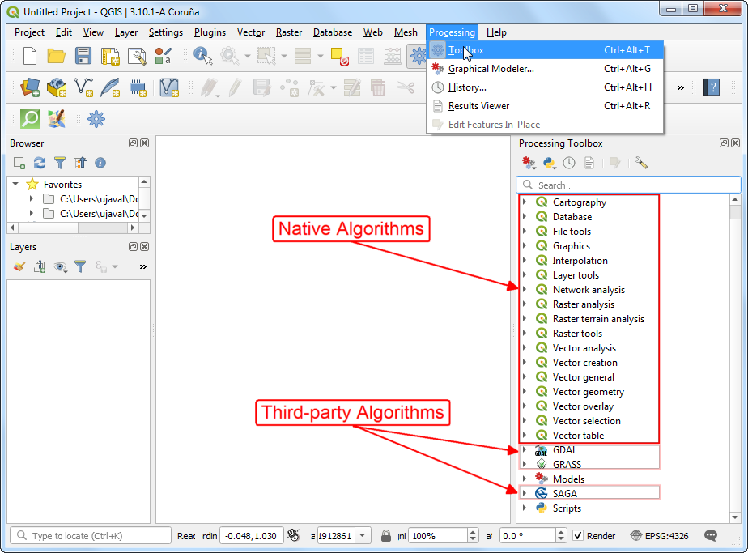
```

## Why should you use Processing Algorithms

- Well tested and rigorous implementations
- Majority are written in C++ and are faster than alternatives
- Long processes can run the the background while you continue to use QGIS
- Many multi-threaded algorithms can take advantage of multi-core CPU on your machines and give you better performance
- Robust handling of invalid geometry
- Ability to see progress of the operation and cancel it
- Easily run on all or just selected features

## Exercise: Find the length of interstate highways in each state of the US

The aim of this exercise is to show how a multi-step spatial analysis problem can be solved using a purely processing-based workflow. This exercise also shows the richness of available algorithms in QGIS that are able to do sophisticated operations that previously needed plugins or were more complex.

We will work with shapefiles provided by US Census Bureau. The ``tl_2019_us_primaryroads.zip`` file comes TIGER/Line roads database and contains all the major roads in the US - including Interstate highways. The ``tl_2019_us_state.zip`` file comes from the Cartographic Boundary Files and contains the state boundaries. 

1. Browse to the data directory and expand ``tl_2019_us_primaryroads.zip`` and ``tl_2019_us_state.zip`` files. Drag and drop the ``tl_2019_us_primaryroads.shp`` and ``tl_2019_us_state.shp`` layers to the canvas.

```{r echo=FALSE, fig.align='center', out.width='75%'}
knitr::include_graphics('images/automating_gis_workflows/1.png')
```

2. The layer ``tl_2019_us_primaryroads`` contain all major roads, including interstate highways, state highways, US highways etc. Select the layer and use the keyboard shortcut **F6** to open the attribute table. You will notice that the ``RTTYP`` column has information about road designation. As we are interested in only interstate highways, we can use the information in this column to extract relevant road segments.

> Note: The roads layer has 2 line segments per road, representing the route in both directions. 

```{r echo=FALSE, fig.align='center', out.width='75%'}
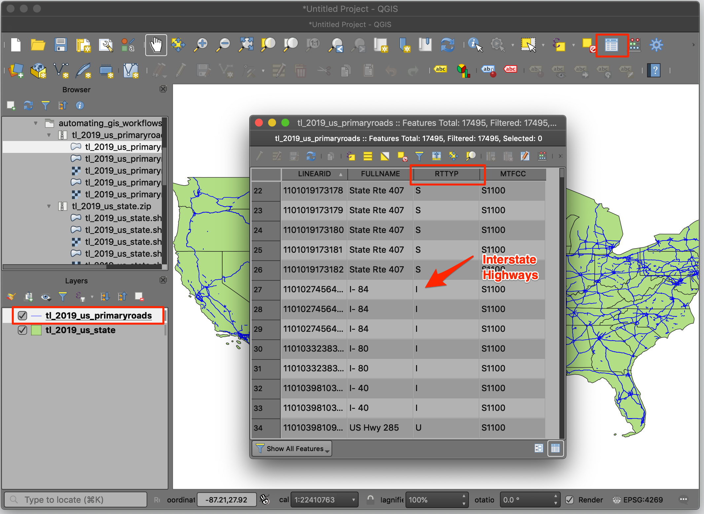
```

3. Open the Processing Toolbox by going to **Processing &rarr; Toolbox**

```{r echo=FALSE, fig.align='center', out.width='75%'}
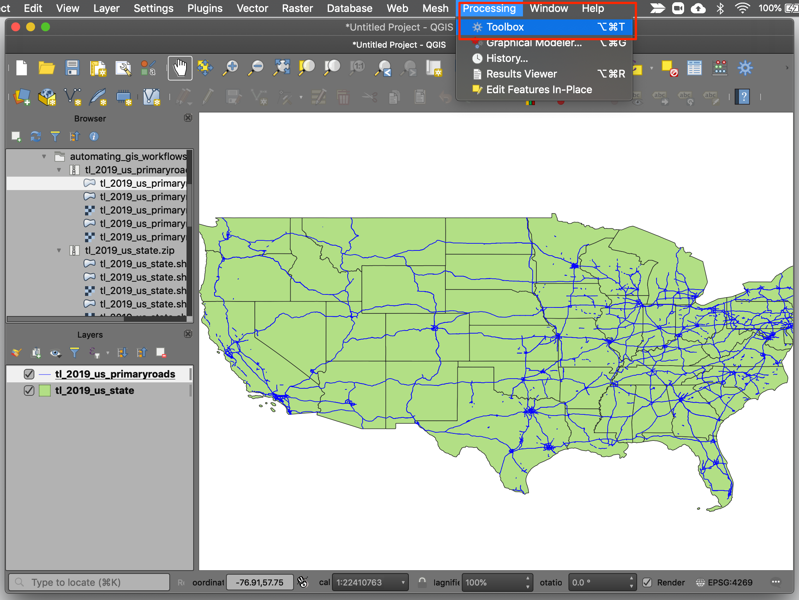
```

4. You can use tools such as *Select by expression*, export the selected features as a new layer and continue to work. But the processing toolbox providers a better and seamless workflow. Search for the algorithm **Extract by attribute**.

```{r echo=FALSE, fig.align='center', out.width='75%'}
knitr::include_graphics('images/automating_gis_workflows/4.png')
```

5. Select ``tl_2019_us_primaryroads`` as the *Input layer*. Select ``RTTYP`` as the *Selection attribute* and ``I`` as the *Value*. This will extract all feature where RTTYP value is I (Interstate). Click *Run*.

```{r echo=FALSE, fig.align='center', out.width='75%'}
knitr::include_graphics('images/automating_gis_workflows/5.png')
```

6. You will get a new layer ``Extracted (attribute)`` in the Layers Panel. Next, we want to calculate the length of each segment. You can use the built-in algorithm **Add geometry attributes**

```{r echo=FALSE, fig.align='center', out.width='75%'}
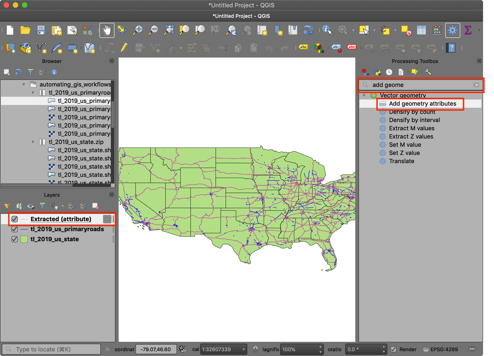
```

7. The source layer is in the Geographic CRS EPSG:4269 (NAD83) with degrees as units. But for the analysis, we want the lengths to be measured in linear units - such as miles. The algorithm provides us with a handy option to calculate the distances in **Elliposidal** math - which is ideal for layers in the geographic CRS. Select ``Extracted (attribute)`` as the *Input layer*, select ``Ellipsoidal`` as *Calculate using* and click *Run*.

```{r echo=FALSE, fig.align='center', out.width='75%'}
knitr::include_graphics('images/automating_gis_workflows/7.png')
```

8. A new layer with an additional field called ``length`` will be added to the Layers panel. The distances in this field are in meters. 

```{r echo=FALSE, fig.align='center', out.width='75%'}
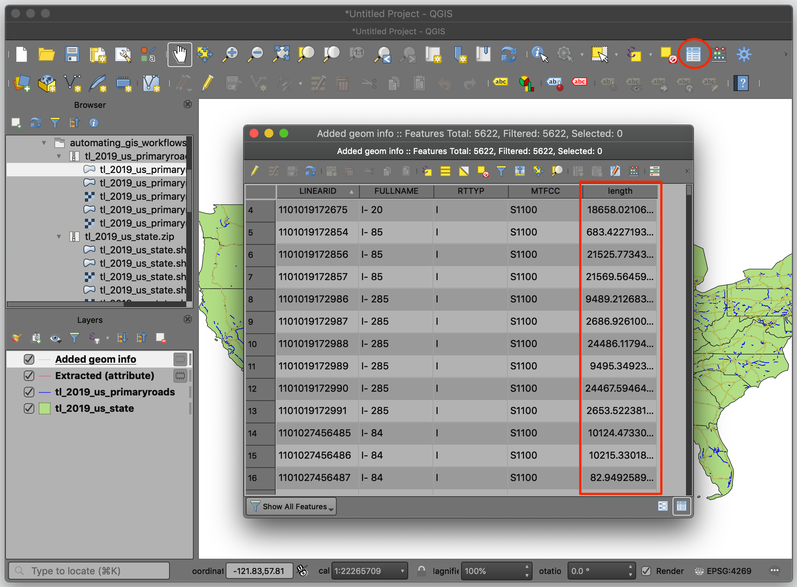
```

9. We have the state information in the ``tl_2019_us_state`` layer, but not in the roads layer. To add the name of the state to the roads layer, we need to perform a spatial-join. This is done using the **Join attributes by Location** algorithm.

```{r echo=FALSE, fig.align='center', out.width='75%'}
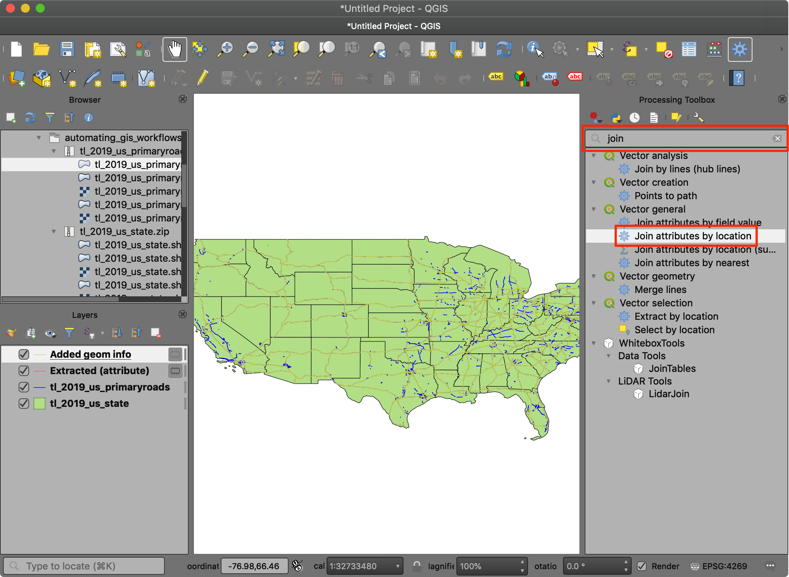
```

10. Select the ``Added geom info`` as the *Input layer* and ``tl_2019_us_state`` as the *Join layer*. For the *Fields to add*, we need only the ``NAME`` of the state.

```{r echo=FALSE, fig.align='center', out.width='75%'}
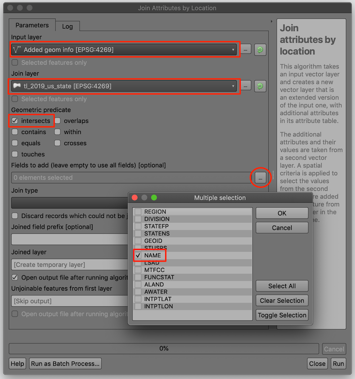
```

11. Fortunately for us, each road segment is split at the state boundary. So we can select ``Take attribute of the first located feature only`` and click *Run* to perform a one-to-one join. 

> If our input road layers had segments that crossed state lines, we would have to do an extra step of splitting them so when we count road lengths per state - we get accurate results. You may do this by converting the states layer to lines using *Polygons to lines* algorithm, followed by the *Split by Lines* to split the road segments at the boundary.

```{r echo=FALSE, fig.align='center', out.width='75%'}
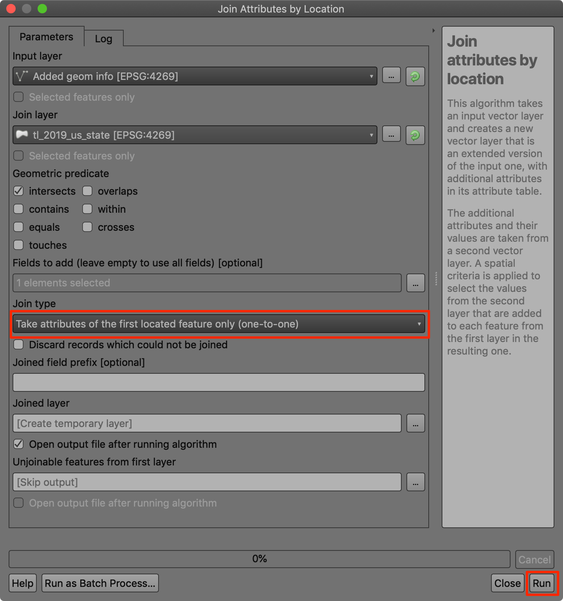
```

12. The new layer ``Joined layer`` now has the state name for every road segment.

```{r echo=FALSE, fig.align='center', out.width='75%'}
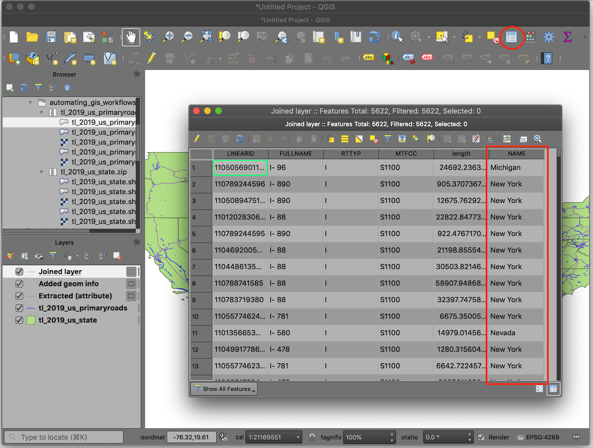
```

13. We can now sum the road lengths and group them for each state You may recall that in earlier versions of QGIS, you needed a plugin called Group Stats to do this. But now we can do this via the built-in **Statistic by Categories** algorithm.

```{r echo=FALSE, fig.align='center', out.width='75%'}
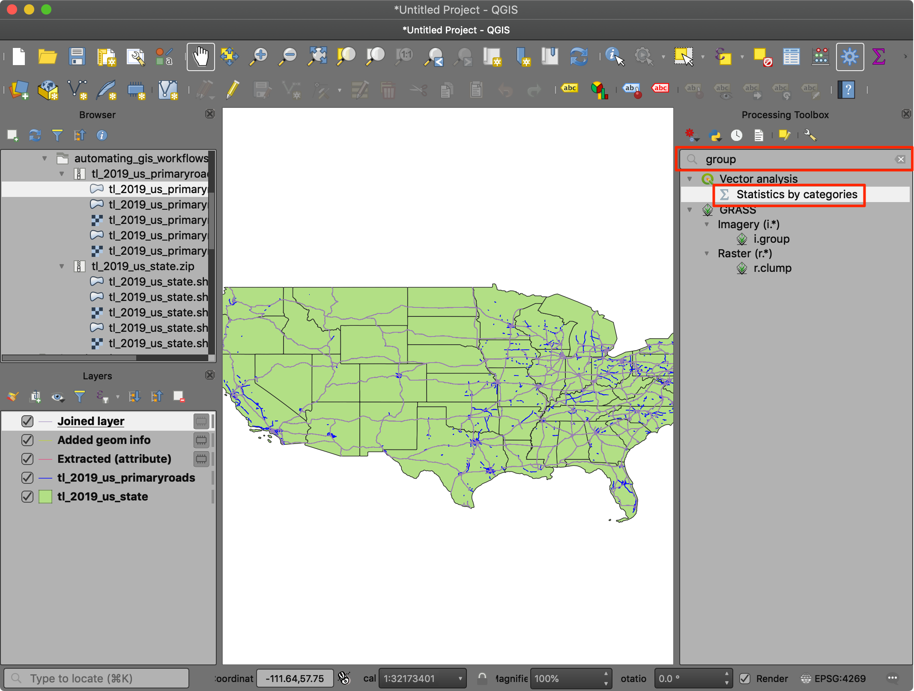
```

14. Select ``Joined layer`` as the *Input vector layer*. We want to calculate lengths, but group them by states. So select ``length`` as the *Field to calculate statistics on* and ``NAME`` as the *Field(s) with categories*. Click *Run*.

```{r echo=FALSE, fig.align='center', out.width='75%'}
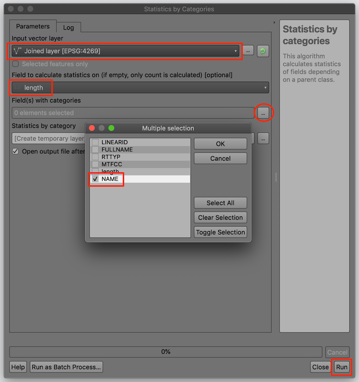
```

15. The output of the algorithm is a table containing various statistics on the ``length`` column for each state. The values in the **sum** column is the total length of national highways in the district.

```{r echo=FALSE, fig.align='center', out.width='75%'}
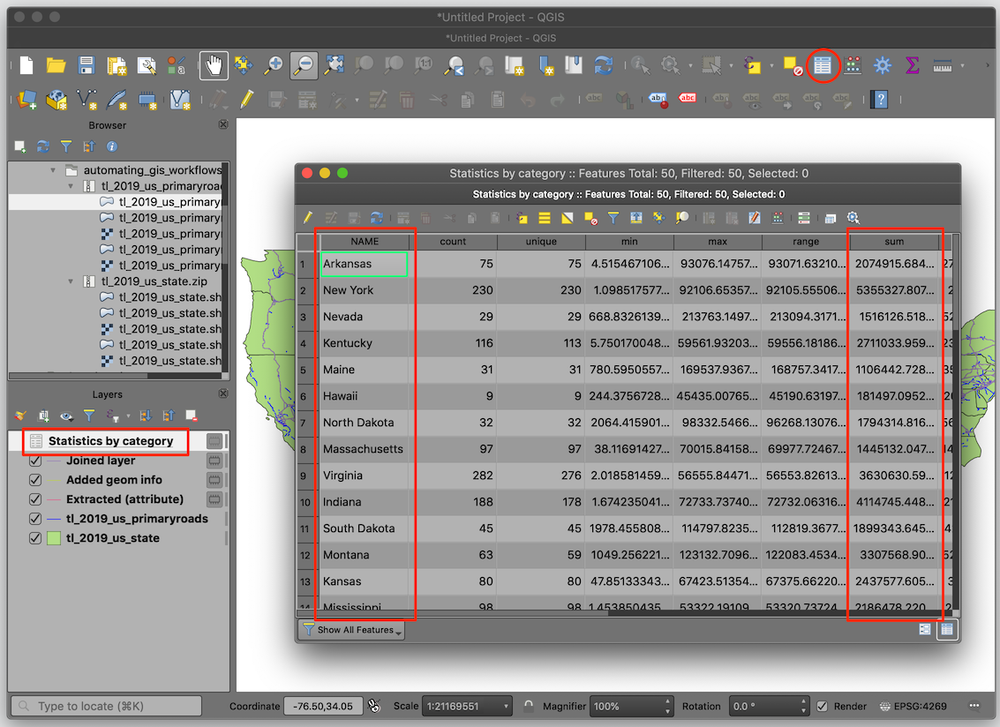
```

16. The layer contains many fields which are not relevant to us, so let's delete some columns before saving. The *classic* way to do this is to toggle editing and use the *Delete Column* button from the Attribute Table. If you wanted to rename/reorder certain fields, that needed a plugin. But now, we have a really easy processing algorithm called **Refactor Fields** that can add, delete, rename, re-order, re-calculate and change the field types all at once. 

```{r echo=FALSE, fig.align='center', out.width='75%'}
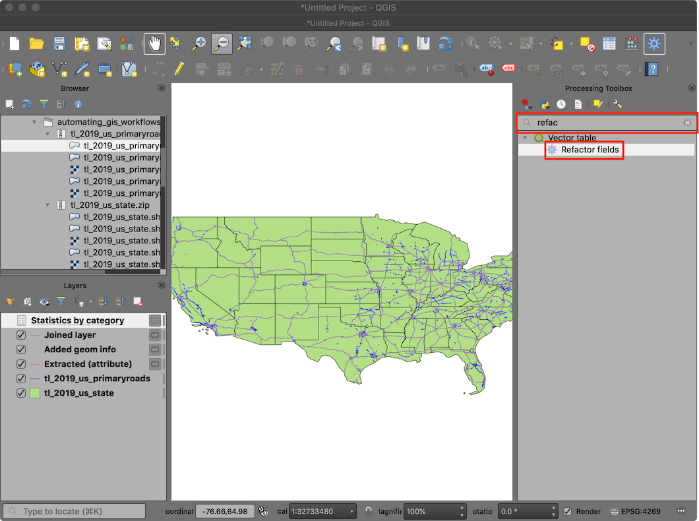
```

17. In the *Refactor fields* dialog, select rows containing fields that you want to delete and click the *Delete selected field* button. Delete all except the ``NAME`` and ``sum`` fields.

```{r echo=FALSE, fig.align='center', out.width='75%'}

```

18. The lengths contained in the ``sum`` field is in meters. We can convert it to miles here itself. Click the button next to ``sum`` in the *Source experssion* column and enter the following expression that converts meters to miles and rounds the value to the nearest integer. Click *OK*.

```
round(sum*0.000621371)
```

```{r echo=FALSE, fig.align='center', out.width='75%'}
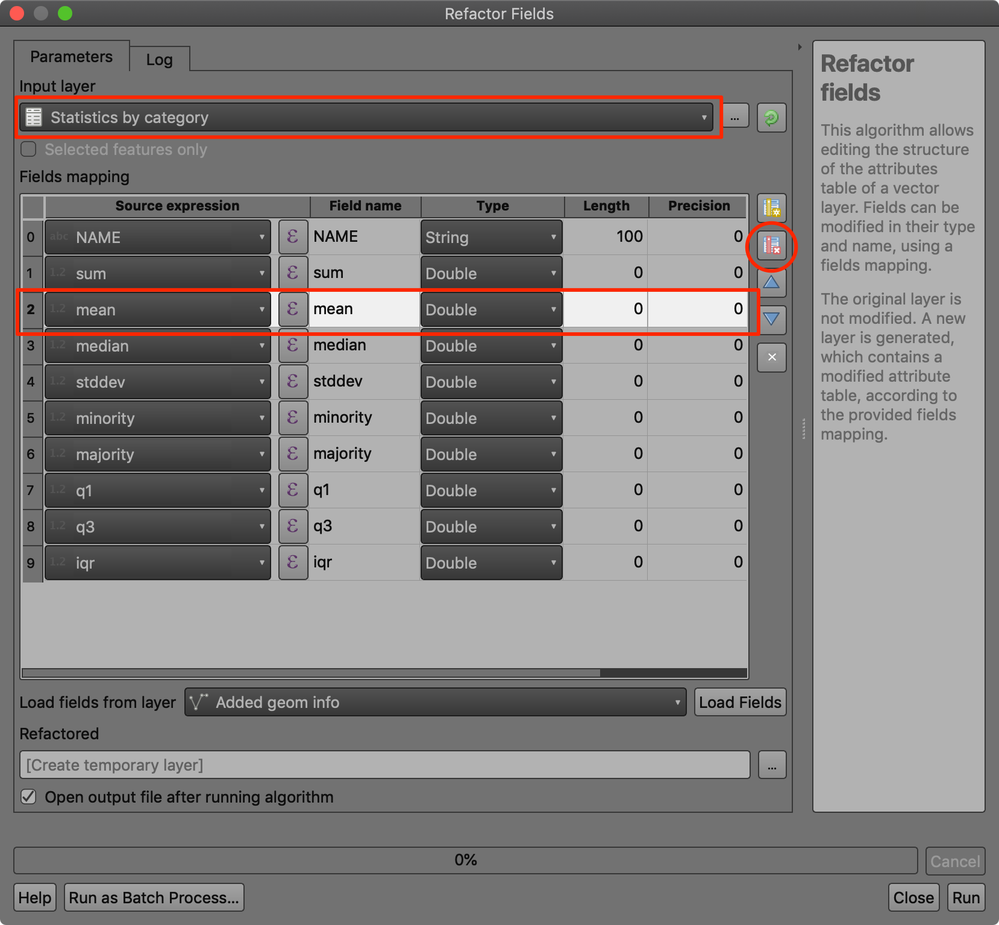
```

19. We can also rename the field to a better name. Change the *Field name* of ``NAME`` to ``State`` and ``sum`` to ``Length_Miles``. We are ready to apply the changes. So far we have created temporary output layers, but this is the final result of the analysis, so we can save it to the disk. Click the ``...`` button at the bottom and select ``Save to GeoPackage``.

```{r echo=FALSE, fig.align='center', out.width='75%'}
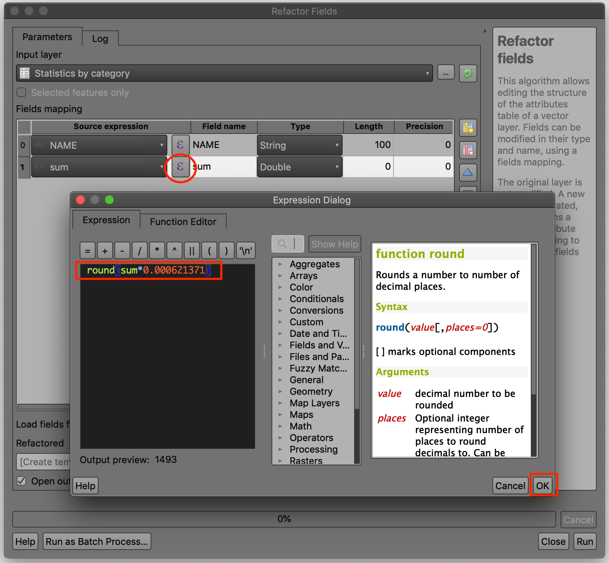
```

20. Enter the name of the file as ``roads.gpkg``. When prompted for a layer name, enter ``road_length_by_state``. Click *Run*.

```{r echo=FALSE, fig.align='center', out.width='75%'}
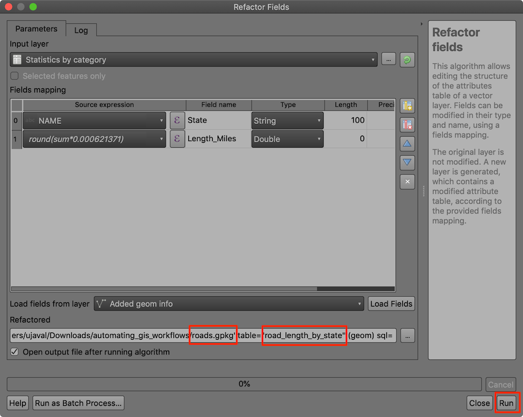
```

21. A new layer ``road_length_by_state`` will be added to the *Layers* panel. The table will have the fields renamed and re-calculated as we had specified.

```{r echo=FALSE, fig.align='center', out.width='75%'}

```

> Note: The refactor fields algorithm has a [bug](https://github.com/qgis/QGIS/issues/32492) for the Mac version that makes all fields as strings regardless of the user's choice. This is a known issue and will be fixed in the future version. Till then, if you are on Mac, a workaround is to use the *Field Calculator* algorithm to take the result and add fields with correct types and conversion expressions such as  to_int(), to_double() etc. 

Note that we did data processing, spatial analysis and statistical analysis - all using just processing algorithms in a fast, re-producible and intuitive workflow.

## Lesser Known Algorithms

The Processing Toolbox contains hundreds of algorithms - with new ones being added everyday. Many plugins also add processing algorithms that support new functionality. While you may think that processing algorithms are meant for **analysis** - there are plenty of algorithms that offer functionality that is beyond geoprocessing. Here are a few algorithms that I find very useful to automate my workflows that you may not be aware of.

* ``Download file``: Download file from a URL or FTP site. Allows you to automate tasks where you need to download new data regularly and process it.
* ``Import geotagged photos``: Extracts latitude, longitude and azimuth information from a directory of photos and creates a point layer.
* ``Add autoincremental field``: Simple but very useful algorithm to add a unique integer field. Many databases (even geopackage) requires that each layer has a unique integer field. This algorithm helps creating this field if your source layer doesn't have one. CAD or CSV layers frequently have this problem.
* ``Create spatial index``: Spatial indexes speed up your geoprocessing operation a lot. This algorithm can create spatial indices on many types of layers, including those loaded from a database.
* ``ORS Tools Algorithms``: OpenRouteService (ORS) provides a QGIS plugin which installs a slew of network analysis algorithms to the Processing Toolbox. They allow rich network analysis functionality using OpenStreetMap data and it works without having to download any data.

> A fun and interesting algorithm is called ``Topological coloring``. This algorithm implements helps with cartography by allowing you assign a *color_id* to your polygon layers such that no adjacent polygons have the same color.

```{r echo=FALSE, fig.align='center', out.width='75%'}
knitr::include_graphics('images/automating_gis_workflows/color3.png')
```

\newpage

# Graphical Modeler

As we saw in the previous example, GIS Workflows typically involve many steps - with each step generating intermediate output that is used by the next step. If you change the input data or want to tweak a parameter, you will need to run through the entire process again manually. Fortunately, Processing Framework provides a graphical modeler that can help you define your workflow and run it with a single invocation. You can also run these workflows as a batch over a large number of inputs.

## Exercise: Build a model to calculate road lengths

We will take the workflow from the previous section and build a model that can precisely reproduce all the intermediate steps and give us the result. The model will allow us to specify the input layers and parameters and perform all intermediate steps without any user input. This will greatly speed up our analysis and ensure we do not make manual errors when running the same calculations again.

1. Open the modeler tool from **Processing &rarr; Graphical Modeler**.

```{r echo=FALSE, fig.align='center', out.width='75%'}
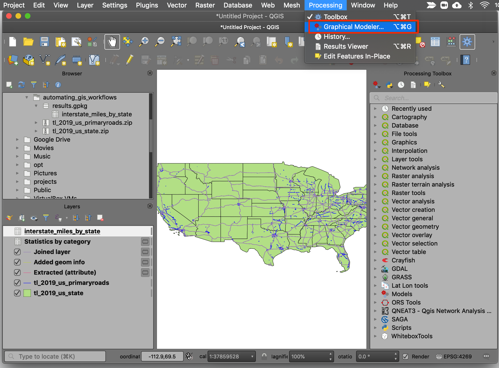
```

2. Enter the name of the model as ``calculate_road_lengths`` and click the *Save* button. Save the model as ``calculate_road_lengths.model3`` file at the default location.

```{r echo=FALSE, fig.align='center', out.width='75%'}
knitr::include_graphics('images/automating_gis_workflows/model2.png')
```

3. The modeler interface contains the left-hand panel with 2 tabs - *Inputs* and *Algorithms*. Our first step is to define the inputs to the model. In our case, the inputs are the 2 vector layers - primary roads and states. Find the ``Vector Layer`` input and drag it to the canvas. 

```{r echo=FALSE, fig.align='center', out.width='75%'}
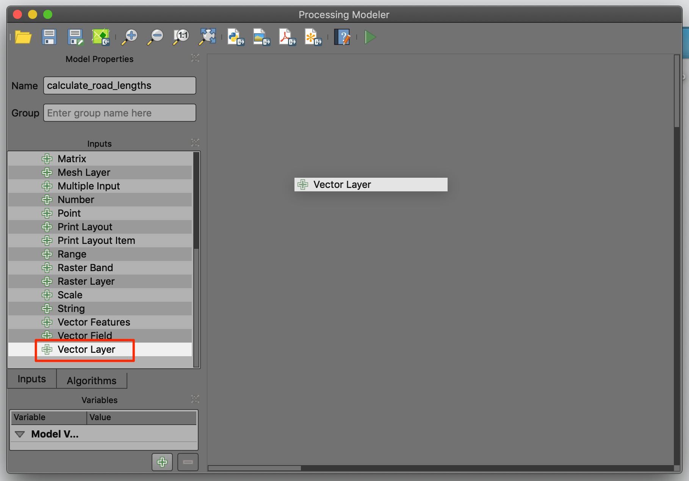
```

4. In the *Vector Layer Parameter Definition* dialog, enter ``Roads`` as the *Parameter name* and set ``Line`` as the *Geometry Type*. Click *OK*.

```{r echo=FALSE, fig.align='center', out.width='75%'}
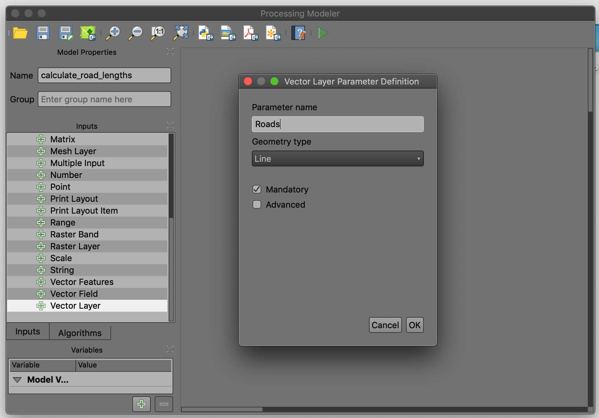
```

5. Similarly, drag another ``Vector Layer`` input. ``States`` as the *Parameter name* and set ``Polygon`` as the *Geometry Type*. Click *OK*.

```{r echo=FALSE, fig.align='center', out.width='75%'}
knitr::include_graphics('images/automating_gis_workflows/model5.png')
```

6. You should have 2 boxes representing the input layers. Now switch to the *Algorithms* tab and search for the ``Extract by attribute`` algorithm. Drag it to the canvas.

```{r echo=FALSE, fig.align='center', out.width='75%'}
knitr::include_graphics('images/automating_gis_workflows/model6.png')
```

7. Fill in the parameters the same way we did in the previous exercise. ``Roads`` as the *Input layer*, ``RTTYP`` as the *Selection attribute* and ``I`` as the *Value*. Click *OK*.

```{r echo=FALSE, fig.align='center', out.width='75%'}
knitr::include_graphics('images/automating_gis_workflows/model7.png')
```

8. In the modeler canvas, you will see a new box with the *Extract by attribute* algorithm and an arrow connecting it with one of the inputs. This indicates that the algorithm is using that input for processing. Next search for and add the ``Add geometry attributes`` algorithm.

```{r echo=FALSE, fig.align='center', out.width='75%'}
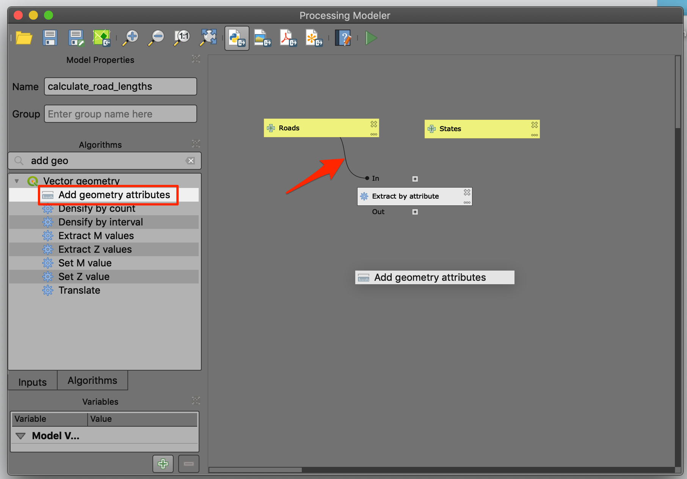
```

9. Set the ``'Extracted (attribute)' from algorithm 'Extract by Attribute'`` as the *Input layer*. Select ``Ellipsoidal`` as the method for *Calculate using*. Click *OK*.

```{r echo=FALSE, fig.align='center', out.width='75%'}
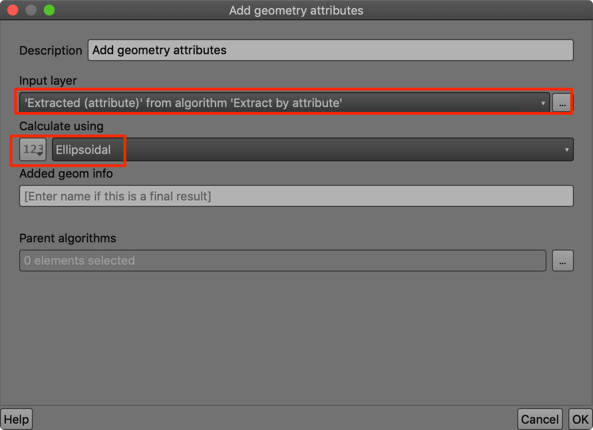
```

10. Referring back to the previous example, the next step in the processing is doing a spatial join. Search for and add the ``Join attribute by location`` algorithm.

```{r echo=FALSE, fig.align='center', out.width='75%'}
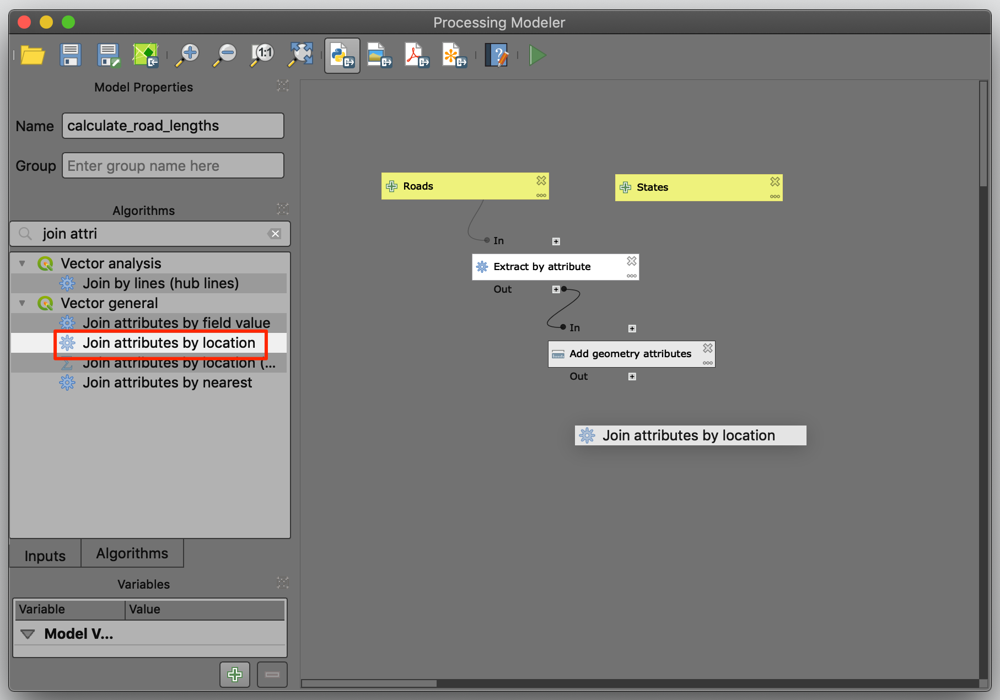
```

11. Set the ``'Added geom info' from algorithm 'Add geometry attributes'`` as the *Input layer*. The *Joim layer* will be the ``States`` layer. In the *Fields to add*, enter ``NAME``. Click *OK*.

```{r echo=FALSE, fig.align='center', out.width='75%'}
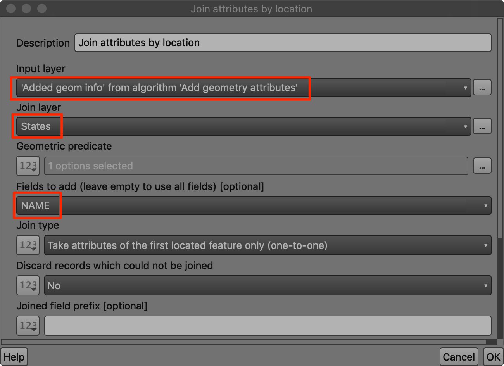
```

12. In the canvas, you will see another arrow now connecting the ``States`` input to the ``Join attributes by location`` box. Next, add the ``Statistics by category`` algorithm.

```{r echo=FALSE, fig.align='center', out.width='75%'}
knitr::include_graphics('images/automating_gis_workflows/model12.png')
```

13. Set the ``'Join layer' from algorithm 'Join attribues by location'`` as the *Input vector layer*. Enter ``length`` as the *Field to calculate statistics on* and ``NAME`` as the *Field(s) with categories*. Click *OK*.

```{r echo=FALSE, fig.align='center', out.width='75%'}
knitr::include_graphics('images/automating_gis_workflows/model13.png')
```

14. We are at the last step now. Add the ``Refactor fields`` algorithm.

```{r echo=FALSE, fig.align='center', out.width='75%'}
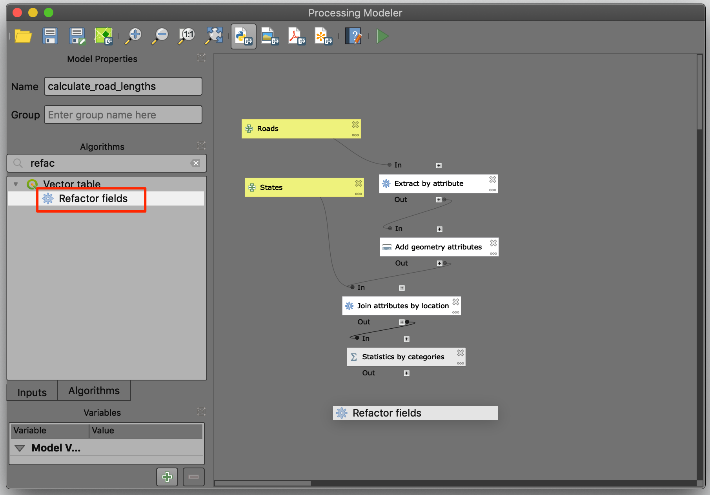
```

15. Set ``'Statistics by category' from algorithm 'Statistics by categories'`` as the *Input layer*. The *Field mapping* table is empty. We need to add rows for the fields that we want in the output. Click *Add new field* twice to add 2 rows. Configure the rows to match our input in Step 19 from the previous exercise. As this is the final result, we should specify the name of the output layer. Enter ``road_length_by_states`` as *Refactored*. Click *OK*.

```{r echo=FALSE, fig.align='center', out.width='75%'}
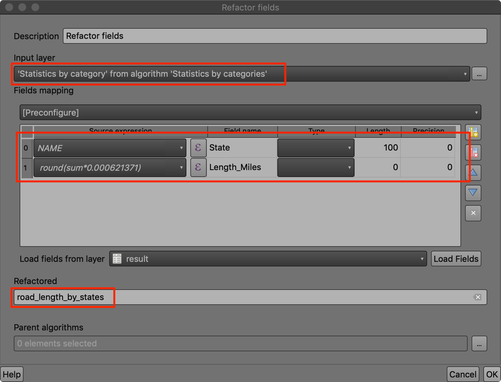
```

16. The model is ready to run. Click the *Run* button.

```{r echo=FALSE, fig.align='center', out.width='75%'}
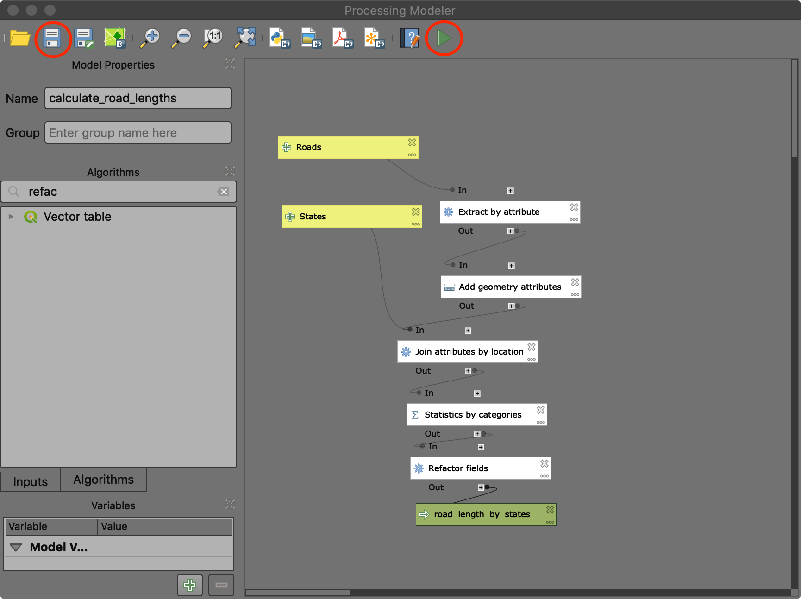
```

17. Set ``tl_2019_us_primaryroads`` as *Roads* and ``tl_2019_us_states`` as *States*. Click *Run*.

```{r echo=FALSE, fig.align='center', out.width='75%'}
knitr::include_graphics('images/automating_gis_workflows/model17.png')
```

18. As the model runs, you will each step of the process being run and intermediate results generated. 

```{r echo=FALSE, fig.align='center', out.width='75%'}
knitr::include_graphics('images/automating_gis_workflows/model18.png')
```

19. Once the process finishes, you will see only 1 new layer - our final result, loaded to the *Layers* panel. You can verify that the result is exactly the same as our manual processing in the previous example. But this time, we only had to specify the inputs and the model did all the hard work.

```{r echo=FALSE, fig.align='center', out.width='75%'}
knitr::include_graphics('images/automating_gis_workflows/model19.png')
```

20. Let's learn how to improve this model. We can generalize this model a little to calculate lengths of not only interstate highways, but other types of roads as well. Go back to the modeler window. Switch to the *Inputs* tab and drag a new *String* input. Enter ``Road Category`` as the *Parameter name*.

> If you closed the modeler window, you can open it again by going to Processing &rarr; Toolbox &rarr; Models. Locate the ``calculate_road_lengths`` model, right-click and select *Edit*.

```{r echo=FALSE, fig.align='center', out.width='75%'}
knitr::include_graphics('images/automating_gis_workflows/model20.png')
```

21. Now instead of hard-coding the value ``I`` for the road category, we will make it user configurable. Right-click the ``Extract by attribute`` box and select *Edit*. 

```{r echo=FALSE, fig.align='center', out.width='75%'}
knitr::include_graphics('images/automating_gis_workflows/model21.png')
```

22. Select the *123* button for *Value* and select ``Model Input``. 

```{r echo=FALSE, fig.align='center', out.width='75%'}
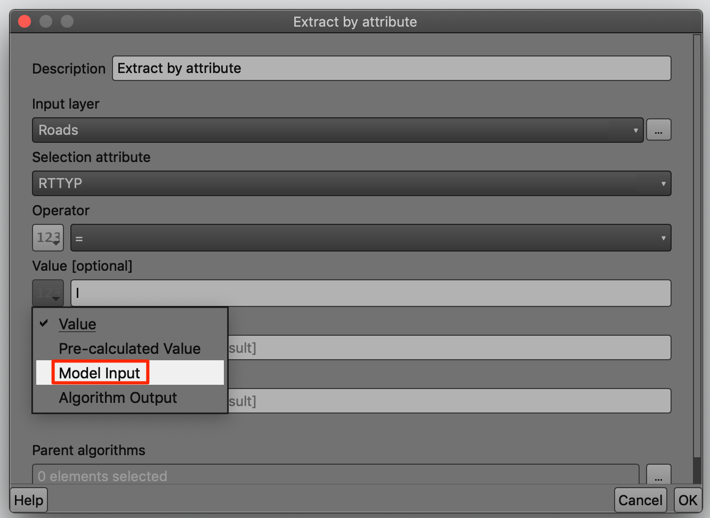
```

23. The parameter ``Road Category`` will be auto-selected for the value. This update to our model will allow the user to enter any value as the *Road Category* which will be used by this algorithm.

```{r echo=FALSE, fig.align='center', out.width='75%'}
knitr::include_graphics('images/automating_gis_workflows/model23.png')
```

24. Let's test the updated algorithm. Click *Run*.

```{r echo=FALSE, fig.align='center', out.width='75%'}
knitr::include_graphics('images/automating_gis_workflows/model24.png')
```

25. You will see a new input in the model dialog. Enter ``U`` and select the other vector layer inputs. Click *Run*. The result will be a table with lengths of US Highways for each state.

```{r echo=FALSE, fig.align='center', out.width='75%'}
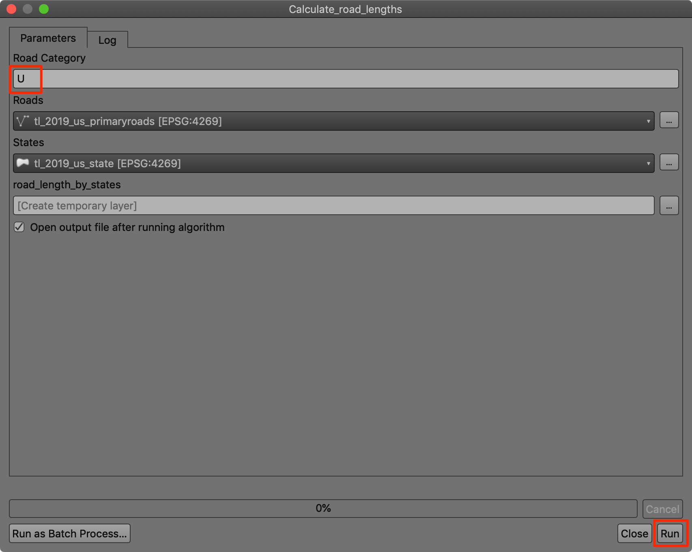
```

\newpage

# Batch Processing

So far we have run the algorithm on 1 layer at a time. But each processing algorithm can also be run in a **Batch** mode on multiple inputs. This provides an easy way to process large amounts of data and automate repetitive tasks.

The batch processing interface can be invoked by right-clicking any processing algorithm and choosing **Execute as Batch Process**.

## Exercise: Clip multiple layers to a polygon

We will take multiple country-level data layers and use the batch processing operation to clip them to a state polygon in a single operation.

Open the **batch_processing** project from the data package. The project contains 5 layers in total. The ``tl_2019_us_state`` represents individual states. The other layers ``tl_2019_us_places``, ``tl_2019_us_mil``, ``tl_2019_us_rails`` and ``tl_2019_us_primaryroads`` are line and polygon layers which need to be clipped.

1. Select the ``tl_2019_us_state`` layer and use the **Select Features** tool to select a state by clicking it.

```{r echo=FALSE, fig.align='center', out.width='75%'}
knitr::include_graphics('images/automating_gis_workflows/batch1.png')
```

2. Next, run the **Extract selected features** processing algorithm. Select ``tl_2019_us_state`` as the *Input layer* and click *Run*. This will create a new layer with the selected state polygon called ``Selected features``

```{r echo=FALSE, fig.align='center', out.width='75%'}
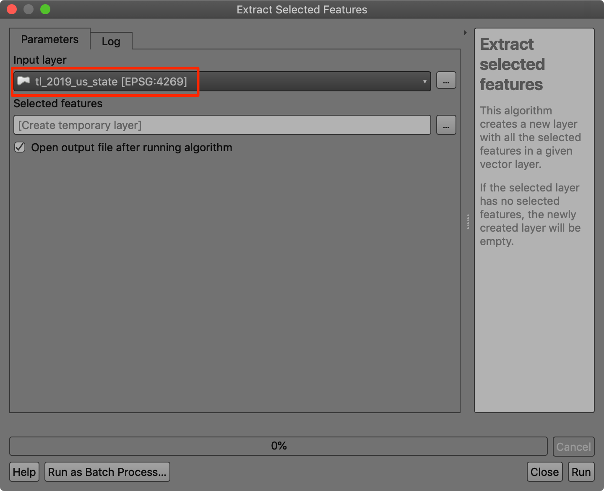
```

3. Search for the **Vector Overlay &rarr; Clip** algorithm and right-click on it. Select **Execute as Batch Process**.

```{r echo=FALSE, fig.align='center', out.width='75%'}
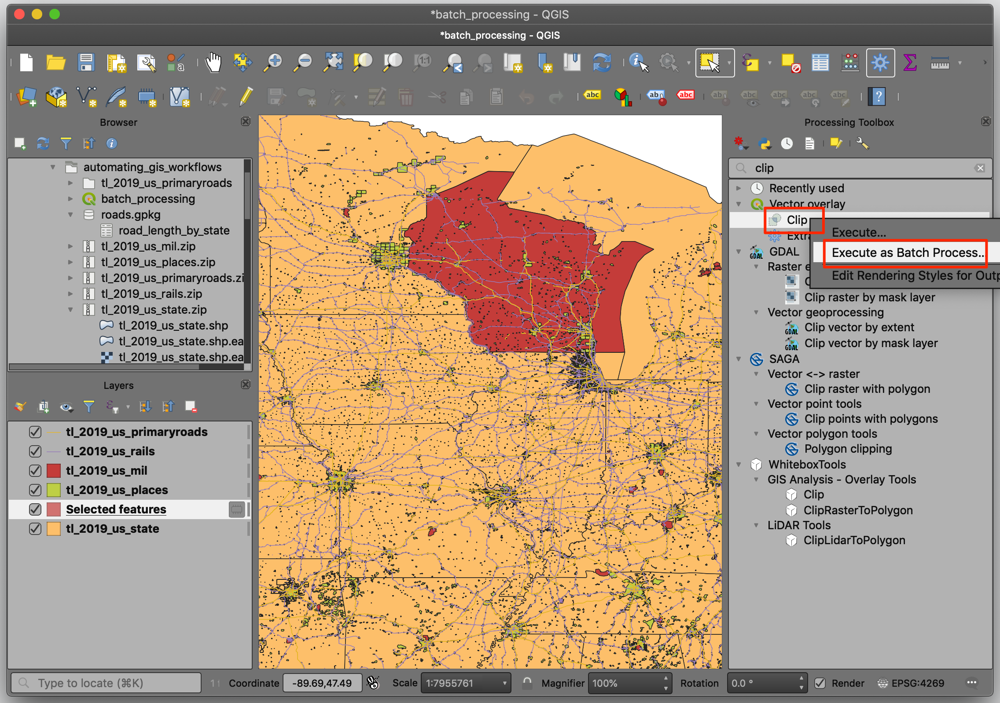
```

4. In the batch processing dialog, click the *...* button on the first row of the *Input layer* column and choose *Select from Open Layers..*. Select ``tl_2019_us_places``, ``tl_2019_us_mil``, ``tl_2019_us_rails`` and ``tl_2019_us_primaryroads`` layers and click *OK*. 3 new rows will be automatically added to accommodate all 4 inputs.

```{r echo=FALSE, fig.align='center', out.width='75%'}
knitr::include_graphics('images/automating_gis_workflows/batch4.png')
```

5. Click the *...* button on the first row of the *Overlay layer* column. Select the ``Selected features`` layer as the *Overlay layer*.

```{r echo=FALSE, fig.align='center', out.width='75%'}
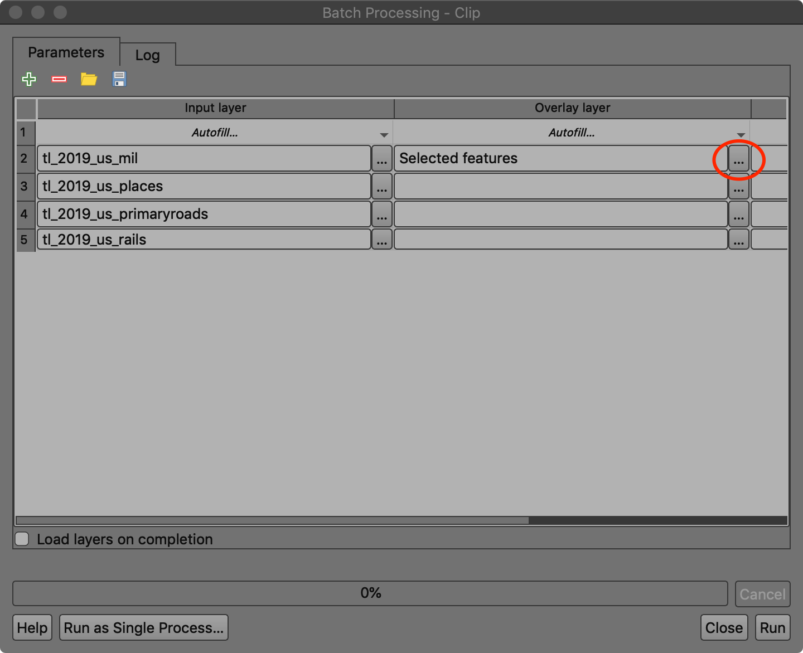
```

6. As all input layers need to be clipped with the same overlay layer, you can click *Autofill..* and select *Fill Down* to autofill all the remaining rows with the same value.

```{r echo=FALSE, fig.align='center', out.width='75%'}
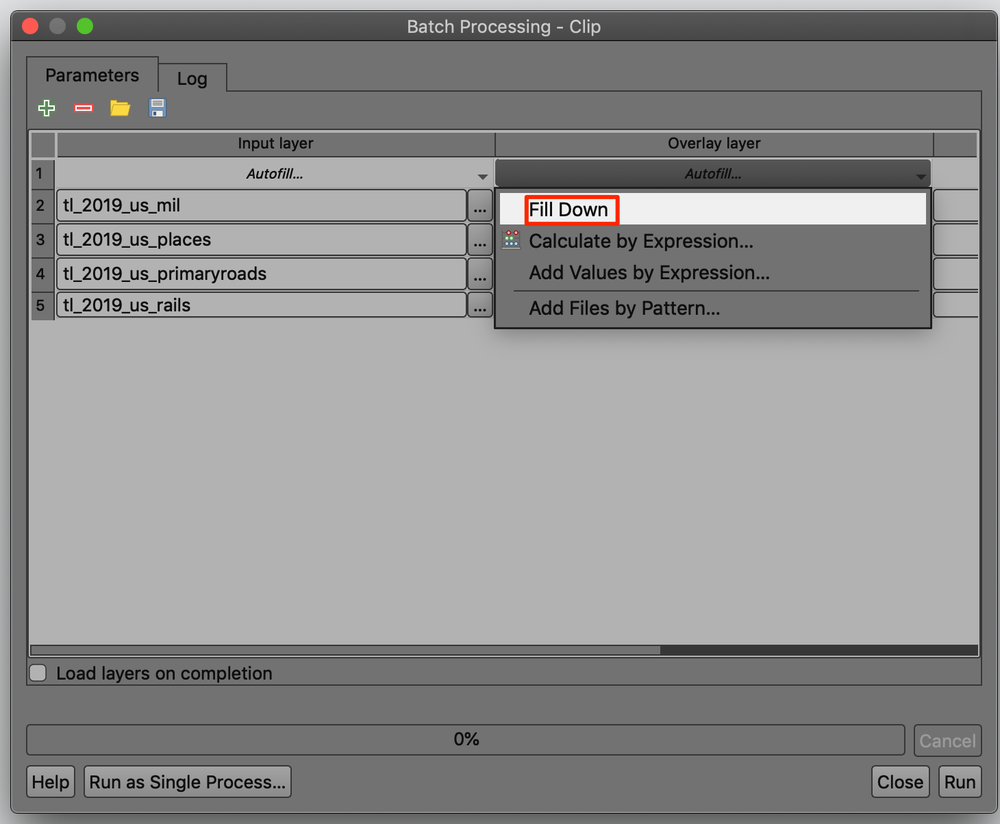
```

7. In the last *Clipped* column, click the *...* button and name the output ``clipped_``. When prompted, choose *Fill with parameter values* as the *autofill mode*, and *Input layer* as the *Parameter to use*.

```{r echo=FALSE, fig.align='center', out.width='75%'}
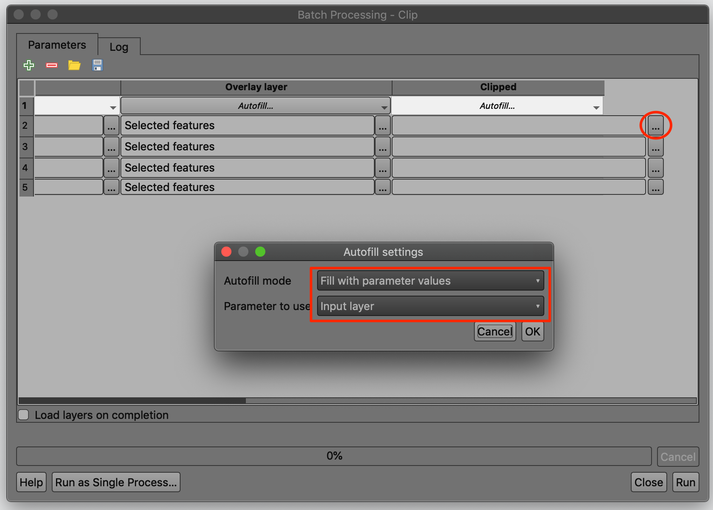
```

8. Make sure the *Load layers on completion* box is checked and click *Run*.

```{r echo=FALSE, fig.align='center', out.width='75%'}
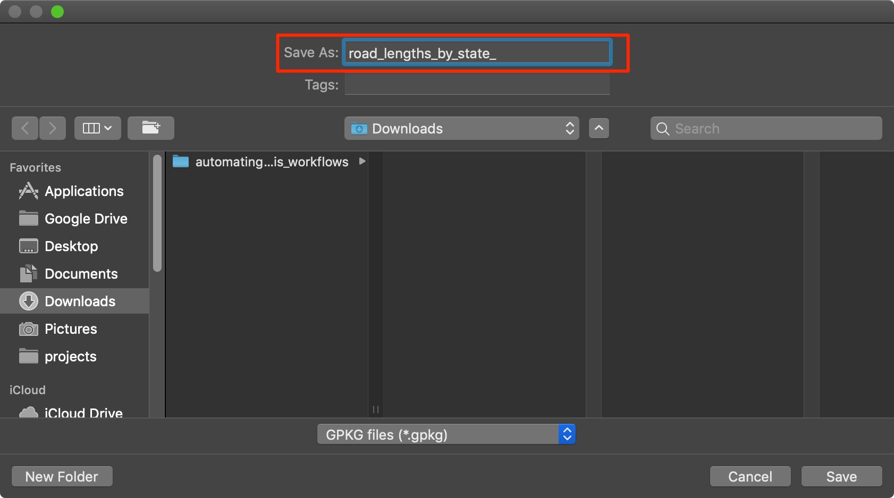
```

9. Resulting clipped layers will be added to the Layers panel. We can combine all the clipped layers into a single geopackage file for ease of sharing. Run the **Package Layers** processing algorithm.

```{r echo=FALSE, fig.align='center', out.width='75%'}
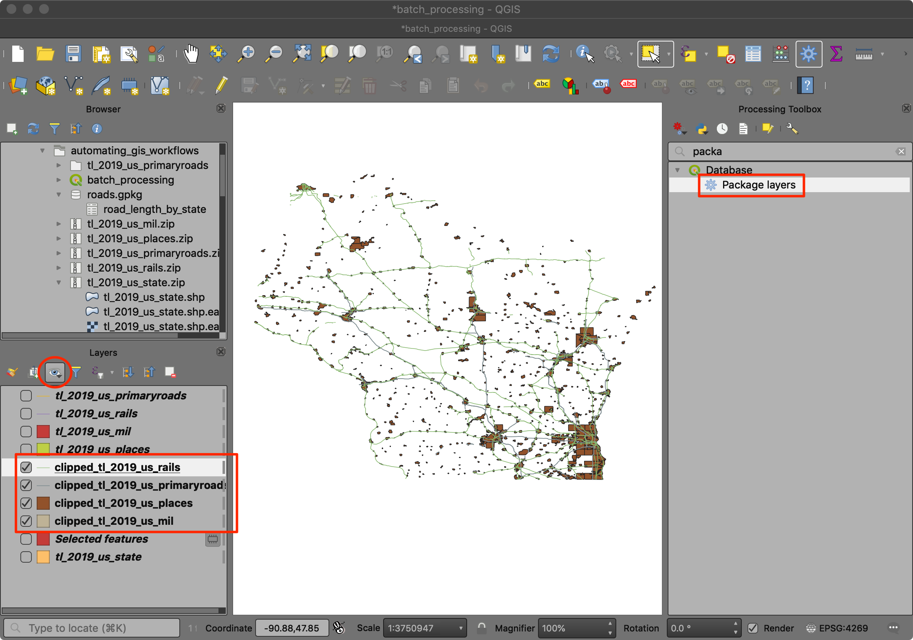
```

10. Choose all the clipped layers and save the output as ``clipped.gpkg``.

```{r echo=FALSE, fig.align='center', out.width='75%'}
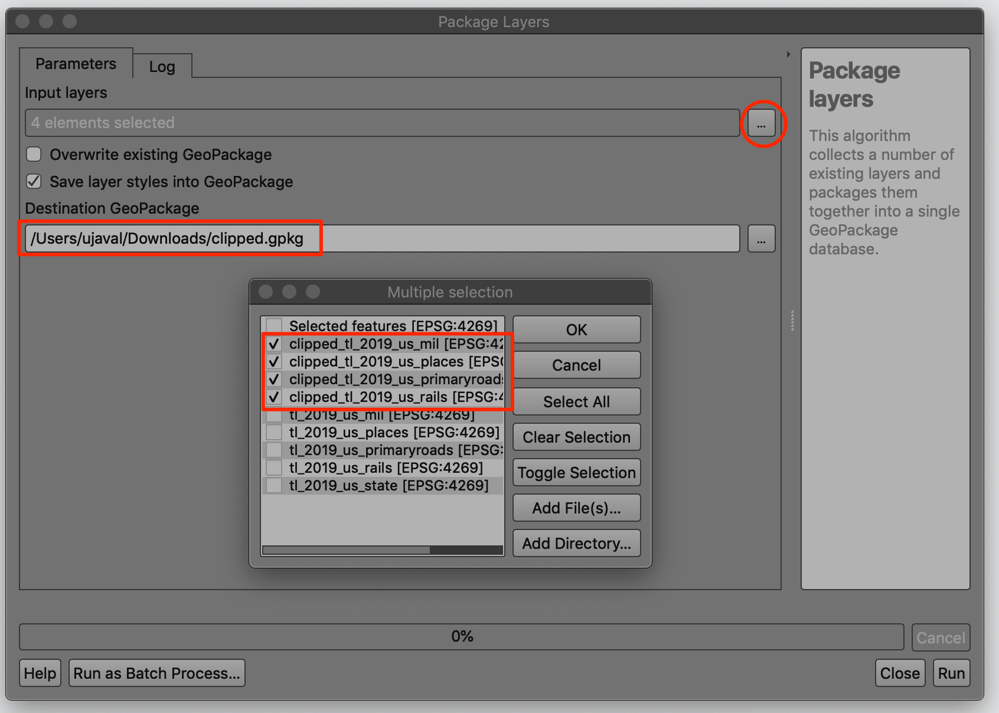
```

\newpage

# Packaging Your Work

We saw how we can save multiple layers to a single geopackage file. This makes data sharing easy between computers and users. Your spatial analysis project contains a lot more information than the dataset. There are layer styles, settings, variables, processing models etc. that are saved in different places. Modern versions of QGIS have the ability to store all relevant information into a single geopackage. This means you can document your entire project in a single geopackage.

## Exercise: Package source layers, results and model in a GeoPackage

We will take the source layers and result of the spatial analysis exercise of finding length of interstate roads and package them up in a GeoPackage.

1. Load the ``tl_2019_us_primaryroads``, ``tl_2019_us_state`` and ``road_lengths_by_state`` layers in QGIS. Run the **Package Layers** processing algorithm.

```{r echo=FALSE, fig.align='center', out.width='75%'}
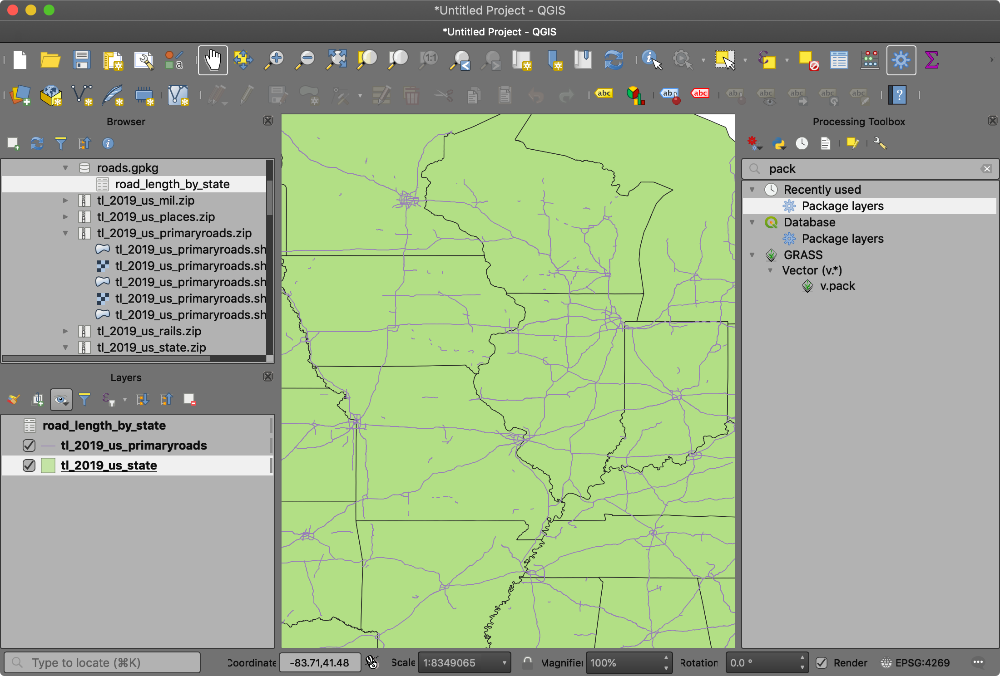
```

2. Choose all the layers as the *Input layers*. Make sure the *Save layer stles into GeoPackage* option is checked. Name the *Destination GeoPackage* as ``results.gpkg``. Click *Run*.

```{r echo=FALSE, fig.align='center', out.width='75%'}
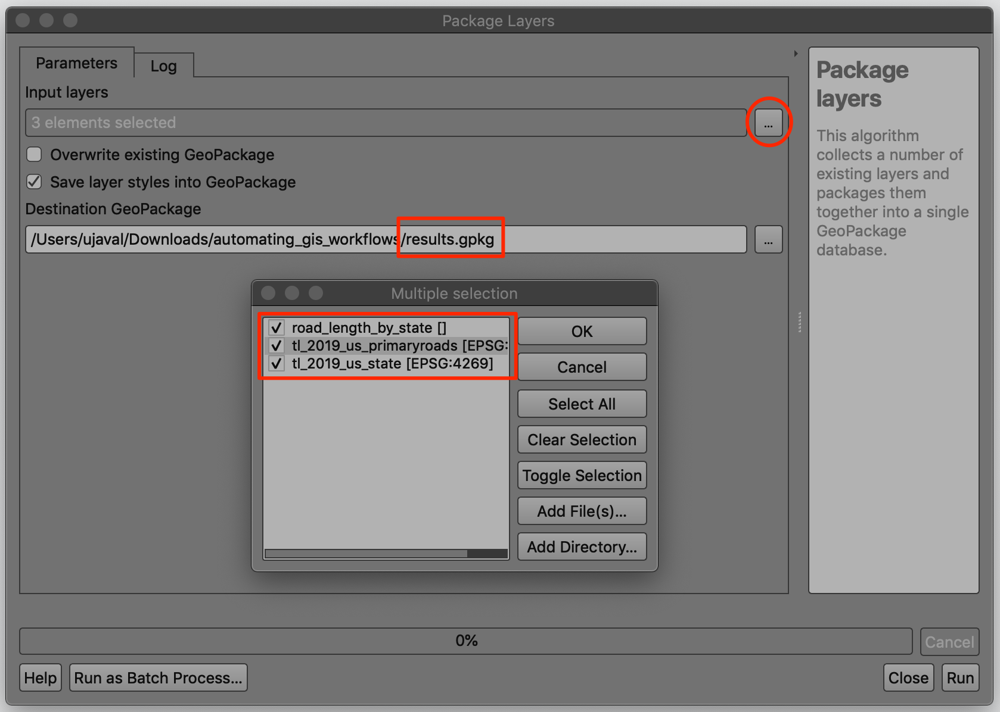
```

3. Now the layers and their respective layer styles are all contained in a single geopackage file. Click *New Project* button. You can click *Don't Save* when prompted to save the current project.

```{r echo=FALSE, fig.align='center', out.width='75%'}
knitr::include_graphics('images/automating_gis_workflows/package3.png')
```

4. In the fresh project, drag all the layers from the ``results.gpkg`` back in QGIS. Now that all loaded layers are from a single geopackage, we can save the project. Go to **Project &rarr; Save To &rarr; GeoPackage**.

```{r echo=FALSE, fig.align='center', out.width='75%'}
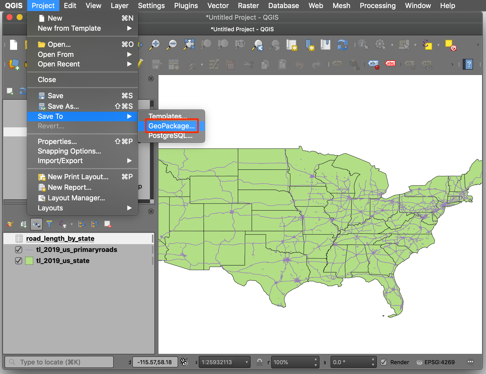
```

5. Click the *...* button next to *Connection* and browse to the ``results.gpkg`` file. Click *OK*. Enter ``results`` as the *Project* name. Click *OK*.

```{r echo=FALSE, fig.align='center', out.width='75%'}
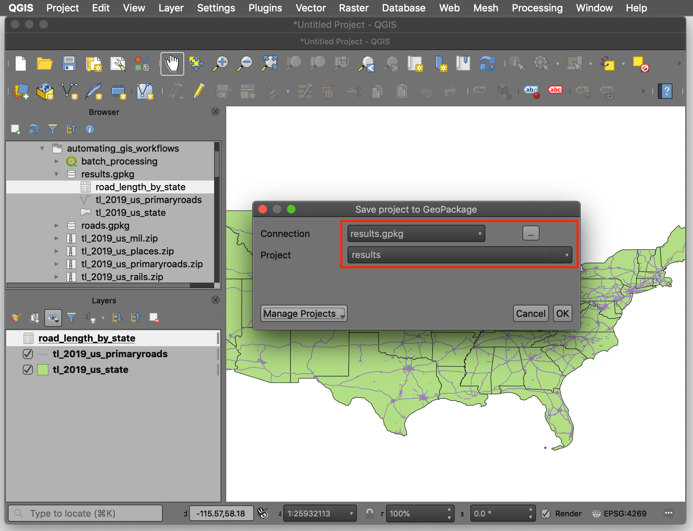
```

6. Now the current project - with its layers, settings, variables etc. is also saved inside the ``results.gpkg`` file. Click the *Refresh* button in the *Browser* panel and expand the ``results.gpkg`` file. You will see the ``results`` project.

```{r echo=FALSE, fig.align='center', out.width='75%'}
knitr::include_graphics('images/automating_gis_workflows/package6.png')
```

7. We can also package our processing model that created the results inside the package. This is a good practice since anyone who has the geopackage can reproduce the results using the included model. Open Processing Toolbox and locate the ``calculate_road_lenghts`` model under *Models*. Right-click and select *Edit Model*.

```{r echo=FALSE, fig.align='center', out.width='75%'}
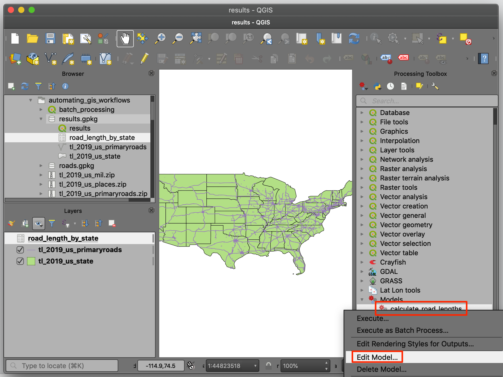
```

8. In the Processing Modeler toolbar, click the *Save model in project* button. You will get a success message confirming that the model was saved inside the current project.

```{r echo=FALSE, fig.align='center', out.width='75%'}
knitr::include_graphics('images/automating_gis_workflows/package8.png')
```

9. Back in the main QGIS window, you will see a new section in the Processing Toolbox called *Project Models*. This folder contains the models that are saved inside the current project. Anyone who opens this project will have this folder and all the models within it.

```{r echo=FALSE, fig.align='center', out.width='75%'}
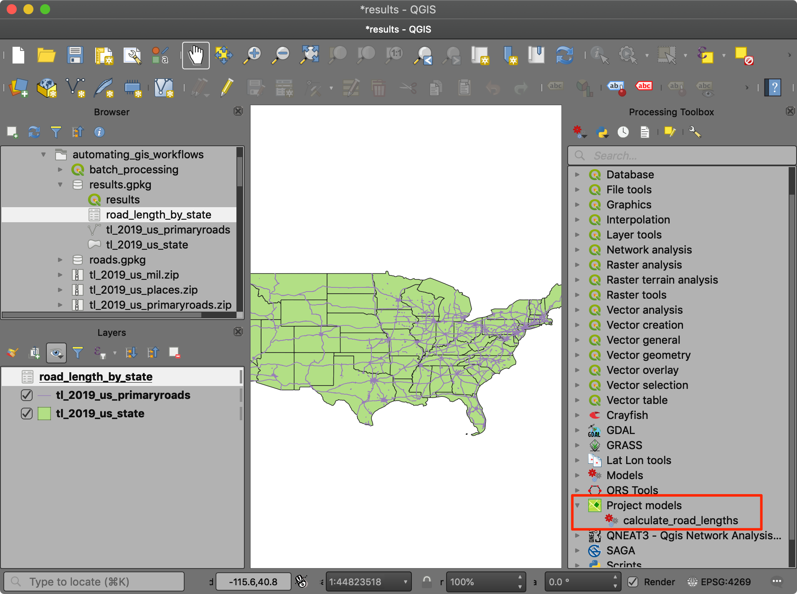
```

GeoPackage is a flexible and versatile format that is adopted across QGIS. You saw how you can package all relevant information about your project inside a single file. Following these practices of saving your models along with source data ensures no information is lost. It also ensures you have well documented workflows that are reproducible by you in the future or by anyone with whom you have shared your data.

\newpage


# Data Credits
* [TIGER/Line Shapefiles 2019](https://www.census.gov/geographies/mapping-files/time-series/geo/tiger-line-file.html), US Census Bureau.
* [Cartographic Boundary Files 2018](https://www.census.gov/geographies/mapping-files/time-series/geo/carto-boundary-file.html) for US States, US Census Bureau.

# License

This workshop material is licensed under a [Creative Commons Attribution 4.0 International (CC BY 4.0)](https://creativecommons.org/licenses/by/4.0/). You are free to re-use and adapt the material but are required to give appropriate credit to the original author as below:

*Automating GIS Workflows with QGIS* by Ujaval Gandhi [www.spatialthoughts.com](https://spatialthoughts.com)

***