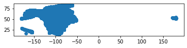

conda create --name python_foundation
conda activate python_foundation
conda install geopandas


```python
import os
import pandas as pd
from geopandas import GeoDataFrame
from shapely.geometry import Point
```


    ---------------------------------------------------------------------------

    ModuleNotFoundError                       Traceback (most recent call last)

    <ipython-input-14-4d9e4d88d4f4> in <module>
          1 import os
          2 import pandas as pd
    ----> 3 import matplotlib
          4 from geopandas import GeoDataFrame
          5 from shapely.geometry import Point


    ModuleNotFoundError: No module named 'matplotlib'


```python
filenames = ['US.txt', 'CA.txt', 'MX.txt']
home_dir = os.path.expanduser('~')

folder = 'Downloads/python_geospatial/'
column_names = ['geonameid', 'name', 'asciiname', 'alternatenames', 'latitude', 'longitude', 'feature class', 'feature code', 'country code', 'cc2', 'admin1 code', 'admin2 code', 'admin3 code', 'admin4 code', 'population', 'elevation', 'dem', 'timezone', 'modification date']

df_list = []
for filename in filenames:
    path = os.path.join(home_dir, folder, filename)
    df = pd.read_csv(path, sep='\t', names=column_names)
    df_list.append(df)
merged_df = pd.concat(df_list, axis=0, ignore_index=True)
display(merged_df)
```

    /Users/ujaval/opt/anaconda3/envs/python_foundation/lib/python3.8/site-packages/IPython/core/interactiveshell.py:3062: DtypeWarning: Columns (9,11) have mixed types.Specify dtype option on import or set low_memory=False.
      has_raised = await self.run_ast_nodes(code_ast.body, cell_name,
    /Users/ujaval/opt/anaconda3/envs/python_foundation/lib/python3.8/site-packages/IPython/core/interactiveshell.py:3062: DtypeWarning: Columns (9,13) have mixed types.Specify dtype option on import or set low_memory=False.
      has_raised = await self.run_ast_nodes(code_ast.body, cell_name,
    /Users/ujaval/opt/anaconda3/envs/python_foundation/lib/python3.8/site-packages/IPython/core/interactiveshell.py:3062: DtypeWarning: Columns (9) have mixed types.Specify dtype option on import or set low_memory=False.
      has_raised = await self.run_ast_nodes(code_ast.body, cell_name,


<div>
<style scoped>
    .dataframe tbody tr th:only-of-type {
        vertical-align: middle;
    }

    .dataframe tbody tr th {
        vertical-align: top;
    }

    .dataframe thead th {
        text-align: right;
    }
</style>
<table border="1" class="dataframe">
  <thead>
    <tr style="text-align: right;">
      <th></th>
      <th>geonameid</th>
      <th>name</th>
      <th>asciiname</th>
      <th>alternatenames</th>
      <th>latitude</th>
      <th>longitude</th>
      <th>feature class</th>
      <th>feature code</th>
      <th>country code</th>
      <th>cc2</th>
      <th>admin1 code</th>
      <th>admin2 code</th>
      <th>admin3 code</th>
      <th>admin4 code</th>
      <th>population</th>
      <th>elevation</th>
      <th>dem</th>
      <th>timezone</th>
      <th>modification date</th>
    </tr>
  </thead>
  <tbody>
    <tr>
      <th>0</th>
      <td>2130833</td>
      <td>McArthur Reef</td>
      <td>McArthur Reef</td>
      <td>NaN</td>
      <td>52.06667</td>
      <td>177.86667</td>
      <td>U</td>
      <td>RFU</td>
      <td>US</td>
      <td>NaN</td>
      <td>AK</td>
      <td>16</td>
      <td>NaN</td>
      <td>NaN</td>
      <td>0</td>
      <td>NaN</td>
      <td>-9999</td>
      <td>Asia/Kamchatka</td>
      <td>2016-07-05</td>
    </tr>
    <tr>
      <th>1</th>
      <td>3577483</td>
      <td>The Narrows</td>
      <td>The Narrows</td>
      <td>The Narrows</td>
      <td>18.37502</td>
      <td>-64.72517</td>
      <td>H</td>
      <td>CHN</td>
      <td>US</td>
      <td>VG</td>
      <td>00</td>
      <td>NaN</td>
      <td>NaN</td>
      <td>NaN</td>
      <td>0</td>
      <td>NaN</td>
      <td>-9999</td>
      <td>America/St_Thomas</td>
      <td>2018-11-06</td>
    </tr>
    <tr>
      <th>2</th>
      <td>3831601</td>
      <td>Nantucket Shoals</td>
      <td>Nantucket Shoals</td>
      <td>NaN</td>
      <td>41.06917</td>
      <td>-69.67983</td>
      <td>U</td>
      <td>SHSU</td>
      <td>US</td>
      <td>NaN</td>
      <td>MA</td>
      <td>NaN</td>
      <td>NaN</td>
      <td>NaN</td>
      <td>0</td>
      <td>NaN</td>
      <td>-9999</td>
      <td>NaN</td>
      <td>2019-03-18</td>
    </tr>
    <tr>
      <th>3</th>
      <td>3831610</td>
      <td>Little Stellwagen Basin</td>
      <td>Little Stellwagen Basin</td>
      <td>NaN</td>
      <td>42.11667</td>
      <td>-70.28333</td>
      <td>U</td>
      <td>BSNU</td>
      <td>US</td>
      <td>NaN</td>
      <td>00</td>
      <td>NaN</td>
      <td>NaN</td>
      <td>NaN</td>
      <td>0</td>
      <td>NaN</td>
      <td>-9999</td>
      <td>America/New_York</td>
      <td>2017-05-26</td>
    </tr>
    <tr>
      <th>4</th>
      <td>3831661</td>
      <td>Cashes Ledge</td>
      <td>Cashes Ledge</td>
      <td>Cash Ledge,Cashe Ledge</td>
      <td>42.91328</td>
      <td>-68.95380</td>
      <td>U</td>
      <td>RDGU</td>
      <td>US</td>
      <td>NaN</td>
      <td>NaN</td>
      <td>NaN</td>
      <td>NaN</td>
      <td>NaN</td>
      <td>0</td>
      <td>NaN</td>
      <td>-9999</td>
      <td>NaN</td>
      <td>2019-02-11</td>
    </tr>
    <tr>
      <th>...</th>
      <td>...</td>
      <td>...</td>
      <td>...</td>
      <td>...</td>
      <td>...</td>
      <td>...</td>
      <td>...</td>
      <td>...</td>
      <td>...</td>
      <td>...</td>
      <td>...</td>
      <td>...</td>
      <td>...</td>
      <td>...</td>
      <td>...</td>
      <td>...</td>
      <td>...</td>
      <td>...</td>
      <td>...</td>
    </tr>
    <tr>
      <th>3002254</th>
      <td>12158849</td>
      <td>Rancho</td>
      <td>Rancho</td>
      <td>Rancho,San Martin,San Martín</td>
      <td>25.80089</td>
      <td>-100.38209</td>
      <td>P</td>
      <td>PPLX</td>
      <td>MX</td>
      <td>NaN</td>
      <td>19</td>
      <td>NaN</td>
      <td>NaN</td>
      <td>NaN</td>
      <td>0</td>
      <td>NaN</td>
      <td>551</td>
      <td>America/Monterrey</td>
      <td>2020-05-11</td>
    </tr>
    <tr>
      <th>3002255</th>
      <td>12158850</td>
      <td>Emporio</td>
      <td>Emporio</td>
      <td>Emporio,Tepetitan,Tepetitán</td>
      <td>17.77891</td>
      <td>-92.42383</td>
      <td>P</td>
      <td>PPL</td>
      <td>MX</td>
      <td>NaN</td>
      <td>27</td>
      <td>NaN</td>
      <td>NaN</td>
      <td>NaN</td>
      <td>0</td>
      <td>NaN</td>
      <td>22</td>
      <td>America/Mexico_City</td>
      <td>2020-05-11</td>
    </tr>
    <tr>
      <th>3002256</th>
      <td>12158851</td>
      <td>Zeta</td>
      <td>Zeta</td>
      <td>El Trebol,El Trébol,Zeta</td>
      <td>15.78197</td>
      <td>-93.43607</td>
      <td>P</td>
      <td>PPL</td>
      <td>MX</td>
      <td>NaN</td>
      <td>5</td>
      <td>NaN</td>
      <td>NaN</td>
      <td>NaN</td>
      <td>0</td>
      <td>NaN</td>
      <td>11</td>
      <td>America/Mexico_City</td>
      <td>2020-05-11</td>
    </tr>
    <tr>
      <th>3002257</th>
      <td>12158853</td>
      <td>Cotztitla</td>
      <td>Cotztitla</td>
      <td>Cotztitla,San Jose Cotztitla,San José Cotztitla</td>
      <td>18.94229</td>
      <td>-97.62164</td>
      <td>P</td>
      <td>PPL</td>
      <td>MX</td>
      <td>NaN</td>
      <td>21</td>
      <td>NaN</td>
      <td>NaN</td>
      <td>NaN</td>
      <td>0</td>
      <td>NaN</td>
      <td>2284</td>
      <td>America/Mexico_City</td>
      <td>2020-05-11</td>
    </tr>
    <tr>
      <th>3002258</th>
      <td>12158854</td>
      <td>Puerto de Buena Vista</td>
      <td>Puerto de Buena Vista</td>
      <td>Lazaro Cardenas,Lázaro Cárdenas,Puerto de Buen...</td>
      <td>19.68575</td>
      <td>-101.12824</td>
      <td>P</td>
      <td>PPL</td>
      <td>MX</td>
      <td>NaN</td>
      <td>16</td>
      <td>NaN</td>
      <td>NaN</td>
      <td>NaN</td>
      <td>0</td>
      <td>NaN</td>
      <td>2058</td>
      <td>America/Mexico_City</td>
      <td>2020-05-11</td>
    </tr>
  </tbody>
</table>
<p>3002259 rows × 19 columns</p>
</div>


```python

mountains = merged_df[merged_df['feature class']=='T']

geometry = [Point(xy) for xy in zip(mountains.longitude, mountains.latitude)]
crs = {'init': 'epsg:4326'}
gdf = GeoDataFrame(mountains, crs=crs, geometry=geometry)

output_filename = 'mountains.gpkg'
output_path = os.path.join(home_dir, folder, output_filename)

gdf.to_file(driver='GPKG', filename=output_path, encoding='utf-8')
```


```python
gdf.plot()
```


    <matplotlib.axes._subplots.AxesSubplot at 0x16bd19a60>




