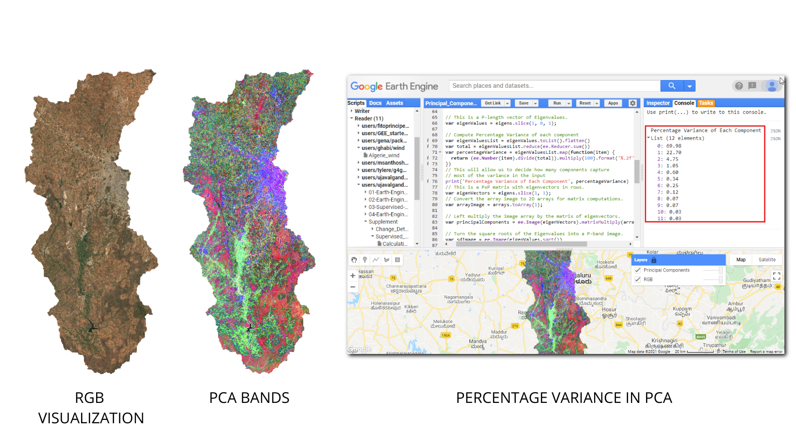
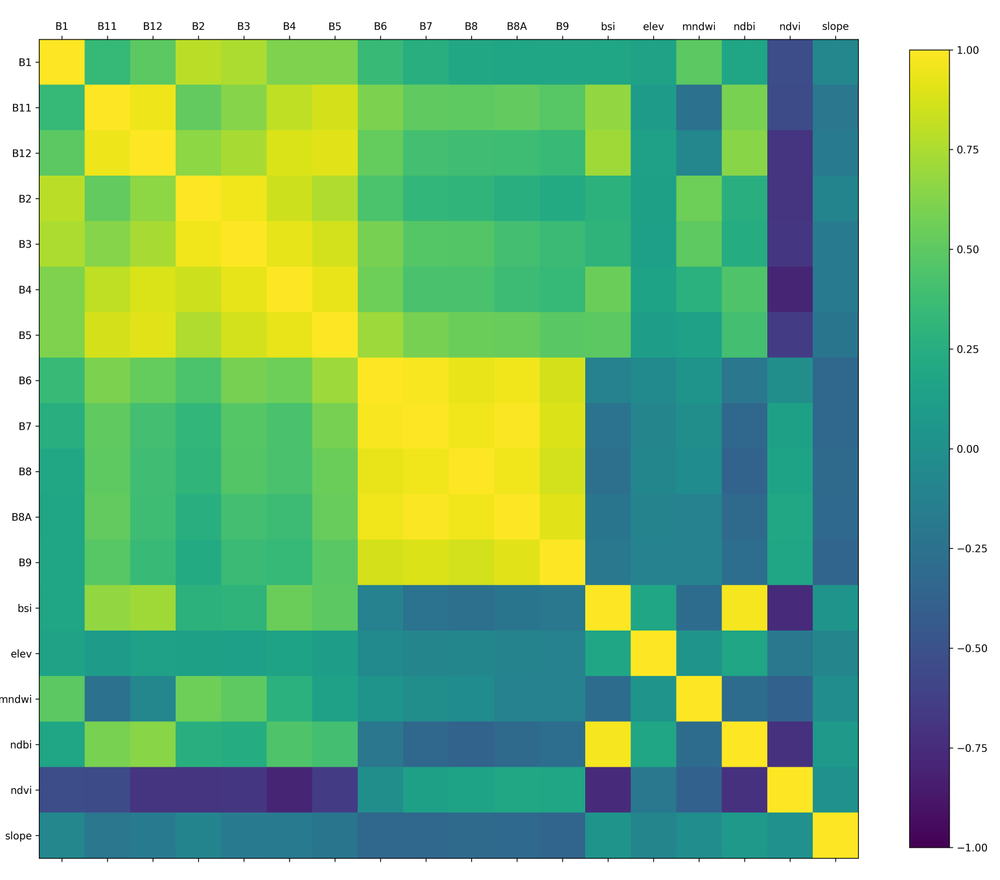
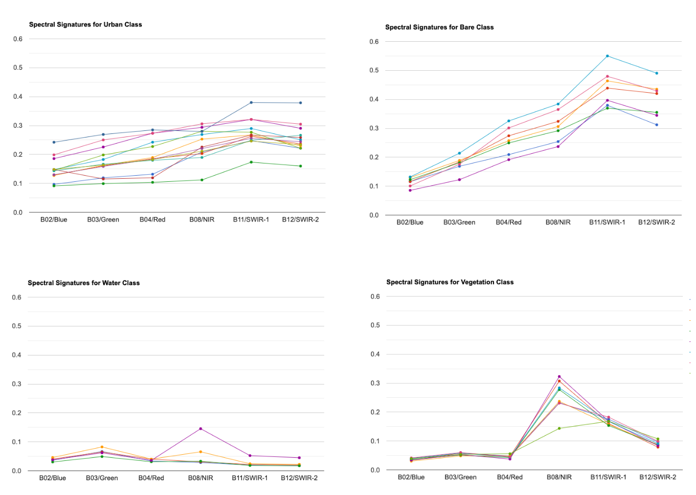
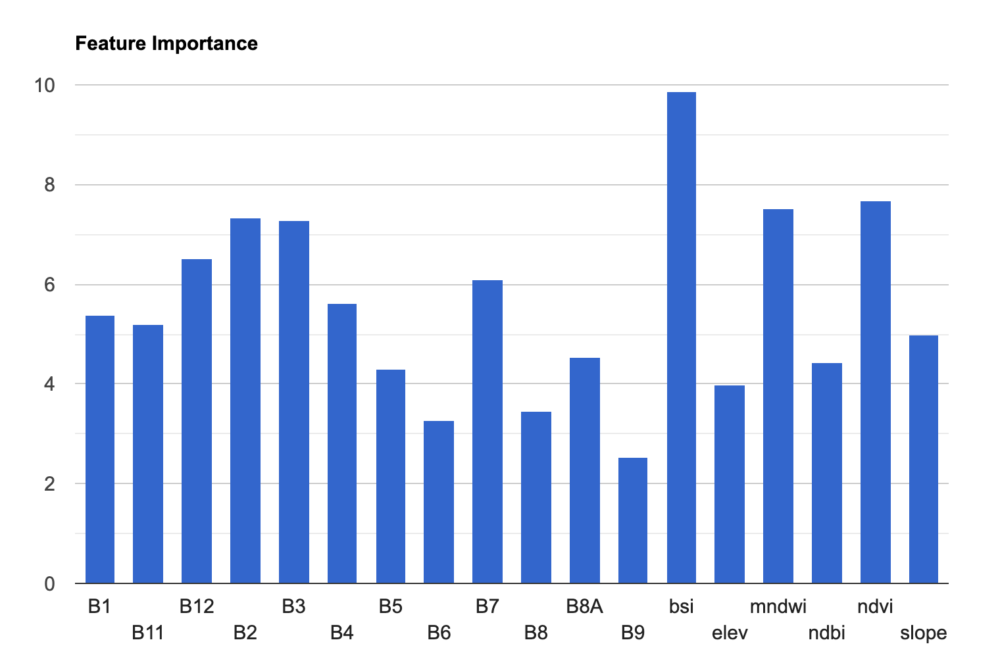
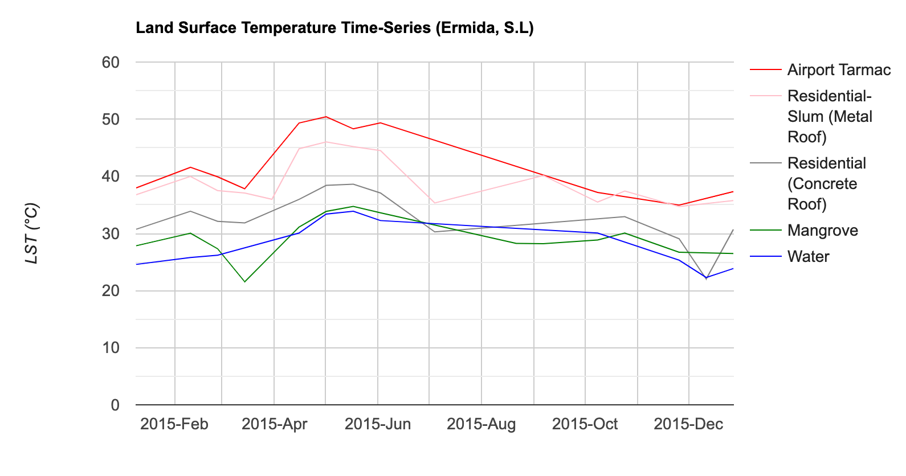
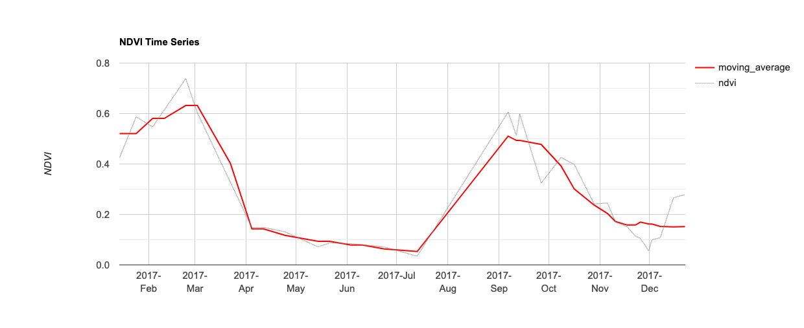
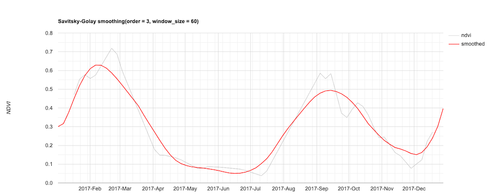
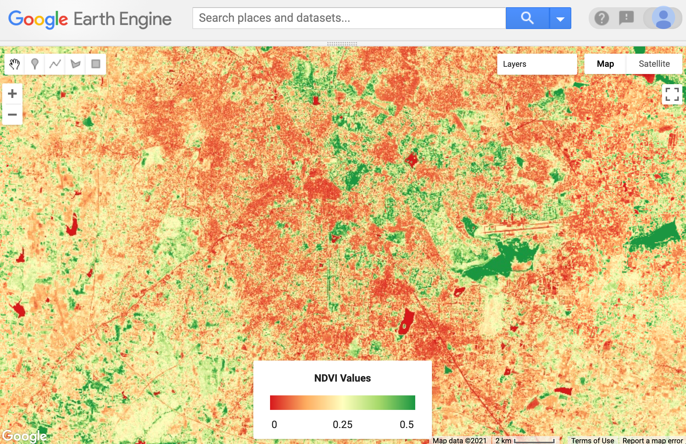
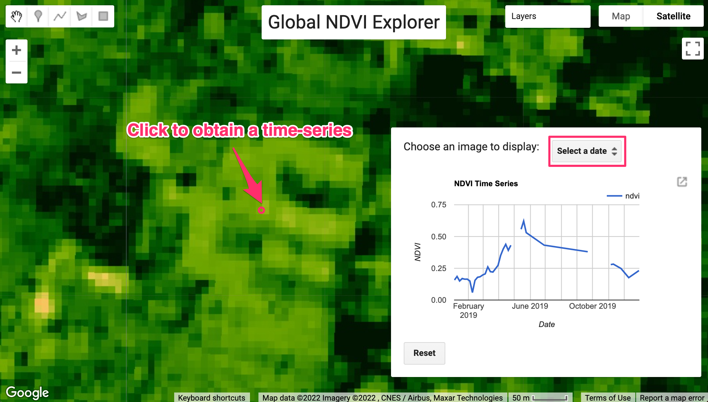

\newpage

***

```{r echo=FALSE, fig.align='center', out.width='75%', out.width='250pt'}
knitr::include_graphics('images/spatial_thoughts_logo.png')
```

***

\newpage

# Introduction 

This page contains Supplementary Materials for the End-to-End Google Earth Engine course. It is a collection useful scripts and code snippets that can be adapted for your projects. 

Please visit the [End-to-End Google Earth Engine](https://courses.spatialthoughts.com/end-to-end-gee.html) course page for the full course material.

# Advanced Supervised Classification Techniques

## Hyperparameter Tuning

A recommended best practice for improving the accuracy of your machine learning model is to tune different parameters. For example, when using the `ee.Classifier.smileRandomForest()` classifier, we must specify the *Number of Trees*. We know that higher number of trees result in more computation requirement, but it doesn't necessarily result in better results. Instead of guessing, we programmatically try a range of values and choose the smallest value possible that results in the highest accuracy.

```{r echo=FALSE, fig.align='center', out.width='75%', fig.cap='Supervised Classification Output'}
knitr::include_graphics('images/end_to_end_gee/hyperparameter_tuning.png')
```

[Open in Code Editor &#8599;](https://code.earthengine.google.co.in/?scriptPath=users%2Fujavalgandhi%2FEnd-to-End-GEE%3ASupplement%2FSupervised_Classification%2FHyperparameter_Tuning){target="_blank"}

```{js eval=FALSE, code=readLines('code/end_to_end_gee/Supplement/Supervised_Classification/Hyperparameter_Tuning')}
```


## Post-Processing Classification Results

Supervised classification results often contain salt-and-pepper noise caused by mis-classified pixels. It is usually preferable to apply some post-processing techniques to remove such noise. The following script contains the code for two popular techniques for post-processing classification results.

* Using un-supervised clustering to replacing classified value by majority value in each cluster.
* Replacing isolated pixels with surrounding value with a majority filter.

> Remember that the neighborhood methods are scale-dependent so the results will change as you zoom in/out. Export the results at the desired scale to see the effect of post-processing.

```{r echo=FALSE, fig.align='center', out.width='100%'}
knitr::include_graphics('images/end_to_end_gee/post_processing.png')
```

[Open in Code Editor &#8599;](https://code.earthengine.google.co.in/?scriptPath=users%2Fujavalgandhi%2FEnd-to-End-GEE%3ASupplement%2FSupervised_Classification%2FPost_Processing_Classification_Results){target="_blank"}

```{js eval=FALSE, code=readLines('code/end_to_end_gee/Supplement/Supervised_Classification/Post_Processing_Classification_Results')}
```

## Principal Component Analysis (PCA)

PCA is a very useful technique in improving your supervised classification results. This is a statistical technique that compresses data from a large number of bands into fewer uncorrelated bands. You can run PCA on your image and add the first few (typically 3) principal component bands to the original composite before sampling training points. In the example below, you will notice that 97% of the variance from the 13-band original image is captured in the 3-band PCA image. This sends a stronger signal to the classifier and improves accuracy by allowing it to distinguish different classes better.

```{r echo=FALSE, fig.align='center', out.width='75%'}

```

[Open in Code Editor &#8599;](https://code.earthengine.google.co.in/?scriptPath=users%2Fujavalgandhi%2FEnd-to-End-GEE%3ASupplement%2FSupervised_Classification%2FPrincipal_Components_Analysis){target="_blank"}

```{js eval=FALSE, code=readLines('code/end_to_end_gee/Supplement/Supervised_Classification/Principal_Components_Analysis')}
```


## Multi-temporal Composites for Crop Classification

Crop classification is a difficult problem. A useful technique that aids in clear distinction of crops is to account for crop phenology. This technique can be applied to detect a specific type of crop or distinguish crops from other forms of vegetation. You can create composite images for different periods of the cropping cycle and create a stacked image to be used for classification. This allows the classifier to learn the temporal pattern and detect pixels that exhibit similar patterns.


```{r echo=FALSE, fig.align='center', out.width='100%', fig.cap='Capturing Crop Phenology through Seasonal Composites'}
knitr::include_graphics('images/end_to_end_gee/seasonal_composite.png')
```

[Open in Code Editor &#8599;](https://code.earthengine.google.co.in/?scriptPath=users%2Fujavalgandhi%2FEnd-to-End-GEE%3ASupplement%2FSupervised_Classification%2FSeasonal_Composites_for_Crop_Classification){target="_blank"}

```{js eval=FALSE, code=readLines('code/end_to_end_gee/Supplement/Supervised_Classification/Seasonal_Composites_for_Crop_Classification')}
```

## Computing Correlation

A useful technique to aid crop classification is to model the correlation between precipitation and changes in vegetation. This allows the model to capture differentiated responses to rainfall (i.e. raid-fed crops vs permanent forests).  We first prepare an image collection where each image consists of 2 bands - cumulative rainfall for each month and average NDVI for the next month. This will create 11 images per year which show precipitation and 1-month lagged NDVI at each pixels. The collection is then reduced using the `ee.Reducer.pearsonsCorrelation()` which outputs a `correlation` band. Positive values will show regions where precipitation caused an increase in NDVI. Adding this band to your input image for classification will greatly aid the classifier in separating different types of vegetation.

[Open in Code Editor &#8599;](https://code.earthengine.google.com/?scriptPath=users%2Fujavalgandhi%2FEnd-to-End-GEE%3ASupplement%2FSupervised_Classification%2FRainfall_NDVI_Correlation){target="_blank"}

```{js eval=FALSE, code=readLines('code/end_to_end_gee/Supplement/Supervised_Classification/Rainfall_NDVI_Correlation')}
```

## Calculating Band Correlation Matrix

When selecting features for your machine learning model, it is important to have features which are not correlated with each other. Correlated features makes it difficult for machine learning models to discover the interactions between different features. A commonly used technique to aid in removing redundant variables is to create a Correlation Matrix. In Earth Engine, you can take a multi-band image and calculate pair-wise correlation between the bands using either `ee.Reducer.pearsonsCorrelation()` or `ee.Reducer.spearmansCorrelation()`. The correlation matrix helps you identify variables that are redundant and can be removed. The code below also shows how to export the table of features that can be used in other software to compute correlation.

```{r echo=FALSE, fig.align='center', out.width='80%', fig.cap='Correlation Matrix created in Python using data exported from GEE'}

```

[Open in Code Editor &#8599;](https://code.earthengine.google.co.in/?scriptPath=users%2Fujavalgandhi%2FEnd-to-End-GEE%3ASupplement%2FSupervised_Classification%2FCorrelation_Matrix){target="_blank"}

```{js eval=FALSE, code=readLines('code/end_to_end_gee/Supplement/Supervised_Classification/Correlation_Matrix')}
```


## Calculating Area by Class

This code snippet shows how to use a [Grouped Reducer](https://developers.google.com/earth-engine/guides/reducers_grouping) to calculate area covered by each class in a classified image. It also shows how to use the `ui.Chart.feature.byProperty()` function to create a column chart and the `ui.Chart.feature.byFeature()` function to create a pie chart with areas of each class.

```{r echo=FALSE, fig.align='center', out.width='50%'}
knitr::include_graphics('images/end_to_end_gee/area_by_class_bar.png')
```

```{r echo=FALSE, fig.align='center', out.width='50%'}
knitr::include_graphics('images/end_to_end_gee/area_by_class_pie.png')
```

[Open in Code Editor &#8599;](https://code.earthengine.google.co.in/?scriptPath=users%2Fujavalgandhi%2FEnd-to-End-GEE%3ASupplement%2FSupervised_Classification%2FCalculating_Area_by_Class){target="_blank"}

```{js eval=FALSE, code=readLines('code/end_to_end_gee/Supplement/Supervised_Classification/Calculating_Area_by_Class')}
```

## Spectral Signature Plots

For supervised classification, it is useful to visualize average spectral responses for each band for each class. Such charts are called *Spectral Response Curves* or *Spectral Signatures*. Such charts helps determine separability of classes. If classes have very different signatures, a classifier will be able to separate them well.

We can also plot spectral signatures of all training samples for a class and check the quality of the training dataset. If all training samples show similar signatures - it indicates that you have done a good job of collecting appropriate samples. You can also catch potential outliers from these plots.

These charts provide a qualitative and visual methods for checking separability of classes. For quantitative methods, one can apply measures such as Spectral Distance, Mahalanobis distance, Bhattacharyya distance , Jeffreys-Matusita (JM) distance etc. You can find the code for these in [this Stack Exchange answer](https://gis.stackexchange.com/a/323778/5160).


```{r echo=FALSE, fig.align='center', out.width='100%', fig.cap='Mean Signatures for All Classes'}
knitr::include_graphics('images/end_to_end_gee/mean_signatures.png')
```


```{r echo=FALSE, fig.align='center', out.width='100%', fig.cap='Spectral Signatures for All Training Points by Class'}

```

[Open in Code Editor &#8599;](https://code.earthengine.google.co.in/?scriptPath=users%2Fujavalgandhi%2FEnd-to-End-GEE%3ASupplement%2FSupervised_Classification%2FSpectral_Signatures){target="_blank"}

```{js eval=FALSE, code=readLines('code/end_to_end_gee/Supplement/Supervised_Classification/Spectral_Signatures')}
```

## Identify Misclassified GCPs

While doing accuracy assessment, you will see the validation features that were not classified correctly. It is useful to visually see the points that were misclassified. We can use `ee.Filter.eq()` and `ee.Filter.neq()` filters to filter the features where the actual and predicted classes were different. The code below shows how to implement this and also use the `style()` function visualize them effectively.

[Open in Code Editor &#8599;](https://code.earthengine.google.com/?scriptPath=users%2Fujavalgandhi%2FEnd-to-End-GEE%3ASupplement%2FSupervised_Classification%2FIdentify_Misclassified_Data){target="_blank"}

```{js eval=FALSE, code=readLines('code/end_to_end_gee/Supplement/Supervised_Classification/Identify_Misclassified_Data')}
```

## Image Normalization and Standardization

For machine learning, it is a recommended practice to either normalize or standardize your features. The code below shows how to implement these feature scaling techniques.

[Open in Code Editor &#8599;](https://code.earthengine.google.co.in/?scriptPath=users%2Fujavalgandhi%2FEnd-to-End-GEE%3ASupplement%2FSupervised_Classification%2FImage_Normalization_and_Standardization){target="_blank"}

```{js eval=FALSE, code=readLines('code/end_to_end_gee/Supplement/Supervised_Classification/Image_Normalization_and_Standardization')}
```

## Calculate Feature Importance 

Many classifiers in GEE have a `explain()` method that calculates feature importances. The classifier will assign a score to each input variable on how useful they were at predicting the correct value. The script below shows how to extract the feature importance and create a chart to visualize it.

```{r echo=FALSE, fig.align='center', out.width='100%', fig.cap='Relative Feature Importance'}

```

[Open in Code Editor &#8599;](https://code.earthengine.google.com/?scriptPath=users%2Fujavalgandhi%2FEnd-to-End-GEE%3ASupplement%2FSupervised_Classification%2FFeature_Importance){target="_blank"}

```{js eval=FALSE, code=readLines('code/end_to_end_gee/Supplement/Supervised_Classification/Feature_Importance')}
```

## Classification with Migrated Training Samples

[Open in Code Editor &#8599;](https://code.earthengine.google.co.in/?scriptPath=users%2Fujavalgandhi%2FEnd-to-End-GEE%3ASupplement%2FSupervised_Classification%2FClassification_with_Migrated_Training_Samples){target="_blank"}

```{js eval=FALSE, code=readLines('code/end_to_end_gee/Supplement/Supervised_Classification/Classification_with_Migrated_Training_Samples')}
```

## Time Series Modeling

[Open in Code Editor &#8599;](https://code.earthengine.google.co.in/?scriptPath=users%2Fujavalgandhi%2FEnd-to-End-GEE%3ASupplement%2FSupervised_Classification%2FTime_Series_Modeling){target="_blank"}

```{js eval=FALSE, code=readLines('code/end_to_end_gee/Supplement/Supervised_Classification/Time_Series_Modeling')}
```

## Using SAR data

[Open in Code Editor &#8599;](https://code.earthengine.google.co.in/?scriptPath=users%2Fujavalgandhi%2FEnd-to-End-GEE%3ASupplement%2FSupervised_Classification%2FUsing_SAR_data){target="_blank"}

```{js eval=FALSE, code=readLines('code/end_to_end_gee/Supplement/Supervised_Classification/Using_SAR_data')}
```


# Advanced Change Detection Techniques

## Landslide Detection using Dynamic World

[Open in Code Editor &#8599;](https://code.earthengine.google.co.in/?scriptPath=users%2Fujavalgandhi%2FEnd-to-End-GEE%3ASupplement%2FChange_Detection%2FDynamic_World_Landslides_Detection){target="_blank"}

```{js eval=FALSE, code=readLines('code/end_to_end_gee/Supplement/Change_Detection/Dynamic_World_Landslides_Detection')}
```

## Urban Growth Detection using Dynamic World

[Open in Code Editor &#8599;](https://code.earthengine.google.co.in/?scriptPath=users%2Fujavalgandhi%2FEnd-to-End-GEE%3ASupplement%2FChange_Detection%2FDynamic_World_Urban_Growth){target="_blank"}

```{js eval=FALSE, code=readLines('code/end_to_end_gee/Supplement/Change_Detection/Dynamic_World_Urban_Growth')}
```

## Conflict Mapping

During the [Israel-Palestine Crisis of 2021](https://en.wikipedia.org/wiki/2021_Israel%E2%80%93Palestine_crisis), Gaza was bombed heavily during May 2021. We are able to monitor and detect bombed sites using Sentinel-2 images captured before and after the bombing. Jamon Van Den Hoek put together a [Google Earth Engine App](https://jamonvdh.users.earthengine.app/view/gaza-bomb-damage-analysis) with his analysis of the bombing. The script below is an adaptation with open-source code showing how to carry out such mapping using change detection techniques.

[Open in Code Editor &#8599;](https://code.earthengine.google.co.in/?scriptPath=users%2Fujavalgandhi%2FEnd-to-End-GEE%3ASupplement%2FChange_Detection%2FGaza_Conflict_Change_Detection_Index){target="_blank"}

```{js eval=FALSE, code=readLines('code/end_to_end_gee/Supplement/Change_Detection/Gaza_Conflict_Change_Detection_Index')}
```

# Image Collection Processing

## Aggregating and Visualizing ImageCollections

[Open in Code Editor &#8599;](https://code.earthengine.google.co.in/?scriptPath=users%2Fujavalgandhi%2FEnd-to-End-GEE%3ASupplement%2FImage_Collections%2FAggregating_and_Visualizing_ImageCollections){target="_blank"}

```{js eval=FALSE, code=readLines('code/end_to_end_gee/Supplement/Image_Collections/Aggregating_and_Visualizing_ImageCollections')}
```

## Exporting ImageCollections

[Open in Code Editor &#8599;](https://code.earthengine.google.co.in/?scriptPath=users%2Fujavalgandhi%2FEnd-to-End-GEE%3ASupplement%2FImage_Collections%2FExporting_ImageCollections){target="_blank"}

```{js eval=FALSE, code=readLines('code/end_to_end_gee/Supplement/Image_Collections/Exporting_ImageCollections')}
```

## Get Pixelwise Dates for Composites

[Open in Code Editor &#8599;](https://code.earthengine.google.co.in/?scriptPath=users%2Fujavalgandhi%2FEnd-to-End-GEE%3ASupplement%2FImage_Collections%2FGet_Pixelwise_Dates_in_Composites){target="_blank"}

```{js eval=FALSE, code=readLines('code/end_to_end_gee/Supplement/Image_Collections/Get_Pixelwise_Dates_in_Composites')}
```

## Filter Images by Cloud Cover in a Region

This script shows how to calculate the cloud cover in a region, and set an image property with the cloud cover for a given region. We can then apply a filter to select images having no cloud cover in the region. This is useful where you are working in a very cloudy region and want to ensure that you are filtering for clouds in your region of interest, instead of the whole scene.

[Open in Code Editor &#8599;](https://code.earthengine.google.co.in/?scriptPath=users%2Fujavalgandhi%2FEnd-to-End-GEE%3ASupplement%2FImage_Collections%2FFilter_by_Cloud_Cover_In_Region){target="_blank"}

```{js eval=FALSE, code=readLines('code/end_to_end_gee/Supplement/Image_Collections/Filter_by_Cloud_Cover_In_Region')}
```


## Harmonized Landsat Time Series

[Open in Code Editor &#8599;](https://code.earthengine.google.co.in/?scriptPath=users%2Fujavalgandhi%2FEnd-to-End-GEE%3ASupplement%2FImage_Collections%2FHarmonized_Landsat_Time_Series){target="_blank"}

```{js eval=FALSE, code=readLines('code/end_to_end_gee/Supplement/Image_Collections/Harmonized_Landsat_Time_Series')}
```

## Visualize Number of Images in Composites

[Open in Code Editor &#8599;](https://code.earthengine.google.co.in/?scriptPath=users%2Fujavalgandhi%2FEnd-to-End-GEE%3ASupplement%2FImage_Collections%2FVisualize_Number_of_Images_in_Composites){target="_blank"}

```{js eval=FALSE, code=readLines('code/end_to_end_gee/Supplement/Image_Collections/Visualize_Number_of_Images_in_Composites')}
```

# Advanced Image Processing

## Working with Landsat Collection 2

[Open in Code Editor &#8599;](https://code.earthengine.google.co.in/?scriptPath=users%2Fujavalgandhi%2FEnd-to-End-GEE%3ASupplement%2FImage_Processing%2FLandsat_Indices){target="_blank"}

```{js eval=FALSE, code=readLines('code/end_to_end_gee/Supplement/Image_Processing/Landsat_Indices')}
```

## Derive LST from Landsat Images

Many researchers are interested in studying the effects of climate change and the urban environment. Landsat sensors have thermal bands which makes it possible to study these interactions at high spatial and temporal resolutions. The script below shows how to compute LST using two different methods.

- Method 1: Using the [LST Computation Algorithm by Sofia Ermida](https://www.mdpi.com/2072-4292/12/9/1471).
- Method 2: Using [Landsat Collection 2 Level 2 Dataset](https://www.usgs.gov/landsat-missions/landsat-collection-2-surface-temperature).

The script generates a map of land surface temperature distribution along with a time series for different land surfaces.

```{r echo=FALSE, fig.align='center', out.width='100%', fig.cap='LST Time-Series for Different Landcovers'}

```

[Open in Code Editor &#8599;](https://code.earthengine.google.co.in/?scriptPath=users%2Fujavalgandhi%2FEnd-to-End-GEE%3ASupplement%2FImage_Processing%2FLandsat_LST){target="_blank"}

```{js eval=FALSE, code=readLines('code/end_to_end_gee/Supplement/Image_Processing/Landsat_LST')}
```

# Time-Series Smoothing and Gap-filling

## Moving Window Smoothing

A technique applied to a time series for removal of the fine-grained variation between time steps is known as Smoothing. This example shows how a moving-window smoothing algorithm can be applied in Earth Engine. Using a [ Save-all Join](https://developers.google.com/earth-engine/guides/joins_save_all), the collection is joined with itself and all images that fall within the temporal-window are added as a property of each image. Next, a *mean* reducer is applied on all the images, resulting in the average value of the pixel within the time-frame. The resulting time-series reduces the sharp peaks and valleys - and is more robust against outliers (such as cloudy pixels) 

```{r echo=FALSE, fig.align='center', out.width='100%', fig.cap='Moving Window Average Smoothing'}

```

[Open in Code Editor &#8599;](https://code.earthengine.google.co.in/?accept_repo=users%2Fujavalgandhi%2FEnd-to-End-GEE&scriptPath=users%2Fujavalgandhi%2FEnd-to-End-GEE%3ASupplement%2FTime_Series_Smoothing%2FMoving_Window_Smoothing){target="_blank"}

```{js eval=FALSE, code=readLines('code/end_to_end_gee/Supplement/Time_Series_Smoothing/Moving_Window_Smoothing')}
```

## Temporal Interpolation

The code below shows how to do temporal gap-filling of time-series data. A detailed explanation of the code and other examples are described in our blog post [Temporal Gap-Filling with Linear Interpolation in GEE](https://spatialthoughts.com/2021/11/08/temporal-interpolation-gee/){target="_blank"}.

[Open in Code Editor &#8599;](https://code.earthengine.google.co.in/?accept_repo=users%2Fujavalgandhi%2FEnd-to-End-GEE&scriptPath=users%2Fujavalgandhi%2FEnd-to-End-GEE%3ASupplement%2FTime_Series_Smoothing%2FTemporal_Interpolation){target="_blank"}

```{js eval=FALSE, code=readLines('code/end_to_end_gee/Supplement/Time_Series_Smoothing/Temporal_Interpolation')}
```

## Savitzky-Golay Smoothing

The Savitzky–Golay filter fits a polynomial to a set of data points in a time-series. The [Open Earth Engine Library (OEEL)](https://www.open-geocomputing.org/OpenEarthEngineLibrary/) provides an efficient implementation of this filter that can be applied on an ImageCollection. However, the time-series must be pre-processed so there are images at a regular interval. We use the [interpolation technique](#temporal-interpolation) described in the previous section and prepare a continous time-series without any masked pixels. The result is a new ImageCollection containing images at a regular interval (5-day) and with pixel values smoothed using the Savitzky–Golay filter.

```{r echo=FALSE, fig.align='center', out.width='100%', fig.cap='Savitzky-Golay Smoothing'}

```

[Open in Code Editor &#8599;](https://code.earthengine.google.co.in/?scriptPath=users%2Fujavalgandhi%2FEnd-to-End-GEE%3ASupplement%2FTime_Series_Smoothing%2FSavitzky_Golay_Smoothing){target="_blank"}

```{js eval=FALSE, code=readLines('code/end_to_end_gee/Supplement/Time_Series_Smoothing/Savitzky_Golay_Smoothing')}
```


# User Interface Templates

## Adding a Discrete Legend

You may want to add a legend for a classified image to your map visualization in your App. Here's a code snippet that shows how you can build it using the UI Widgets.

```{r echo=FALSE, fig.align='center', out.width='100%', fig.cap='Creating a Discrete Map Legend'}
knitr::include_graphics('images/end_to_end_gee/map_legend.png')
```

[Open in Code Editor &#8599;](https://code.earthengine.google.co.in/?scriptPath=users%2Fujavalgandhi%2FEnd-to-End-GEE%3ASupplement%2FUI_Widgets_and_Apps%2FMap_Legend){target="_blank"}

```{js eval=FALSE, code=readLines('code/end_to_end_gee/Supplement/UI_Widgets_and_Apps/Map_Legend')}
```

## Adding a Continous Legend

If you are displaying a raster layer in your app with a color palette, you can use the following technique to add a colorbar using the snipet below.

```{r echo=FALSE, fig.align='center', out.width='100%', fig.cap='Creating a Continuous Raster Legend'}

```

[Open in Code Editor &#8599;](https://code.earthengine.google.co.in/?scriptPath=users%2Fujavalgandhi%2FEnd-to-End-GEE%3ASupplement%2FUI_Widgets_and_Apps%2FColorbar_Legend){target="_blank"}

```{js eval=FALSE, code=readLines('code/end_to_end_gee/Supplement/UI_Widgets_and_Apps/Colorbar_Legend')}
```

## Change Visualization UI App

A common use-case for Earth Engine Apps is to display 2 images in a split panel app. Below script contains a simple template that you can use to create an interactive split panel app. Here we have 2 map objects - `leftMap` and `rightMap`. You can add different images to each of the maps and users will be able to explore them side-by-side. {target="_blank"}]


```{r echo=FALSE, fig.align='center', out.width='100%', fig.cap='A Split Panel App that displays Pre- and Post-Storm Images'}
knitr::include_graphics('images/end_to_end_gee/dust_storm_app.png')
```

[Open in Code Editor &#8599;](https://code.earthengine.google.com/?scriptPath=users%2Fujavalgandhi%2FEnd-to-End-GEE%3ASupplement%2FUI_Widgets_and_Apps%2FChange_Visualization_UI_App){target="_blank"}

```{js eval=FALSE, code=readLines('code/end_to_end_gee/Supplement/UI_Widgets_and_Apps/Change_Visualization_UI_App')}
```

## NDVI Explorer UI App

Earth Engine Apps allow you to display interactive charts in response to user action. This app shows the common design pattern to build an app that allows the user to click anywhere on the map and obtain a chart using the clicked-location.


```{r echo=FALSE, fig.align='center', out.width='100%', fig.cap='Global NDVI Explorer App'}

```

[Open in Code Editor &#8599;](https://code.earthengine.google.com/?scriptPath=users%2Fujavalgandhi%2FEnd-to-End-GEE%3ASupplement%2FUI_Widgets_and_Apps%2FNDVI%20Explorer%20UI%20App){target="_blank"}

```{js eval=FALSE, code=readLines('code/end_to_end_gee/Supplement/UI_Widgets_and_Apps/NDVI Explorer UI App')}
```

# Code Sharing and Script Modules

As your Earth Engine project grows, you need a way to organize and share your code to collaborate with others. We will learn some best practices on how best to set-up your project in Earth Engine.

## Sharing a Single Script

To share your code from a single script, you need to use the **Get Link** button in the code editor. As you click the button, the contents of your code editor is captured and encoded into a URL. When you share this URL with someone, they will be able see same content as your code editor. This is a great way to send a snapshot of your code so others can reproduce your output. Remember that the script links are just snapshots, if you change your code after sending the link to someone, they will not see the updates.

> When trying to send someone a link, do NOT click the *Copy Script Path* button. Sending this path to someone will NOT give them access to your code. The script path only works only on public or shared repositories. 

```{r echo=FALSE, fig.align='center', out.width='75%', fig.cap='Code Sharing using Get Link button'}
knitr::include_graphics('images/end_to_end_gee/get_link.png')
```


While sharing the script using *Get Link*, you should also share any private **Assets** that you may have uploaded and are using in the script. You can share the asset with a specific email address, or check the *Anyone can read* box if you want anyone with the script link to be able to access it. Failing to do so will prevent others from running your script.


```{r echo=FALSE, fig.align='center', out.width='75%', fig.cap='Sharing Uploaded Assets'}
knitr::include_graphics('images/end_to_end_gee/sharing_assets.png')
```

Learn more in the [Script links](https://developers.google.com/earth-engine/guides/playground#get-link) section of the Google Earth Engine User Guide.


## Sharing Multiple Scripts

If you want to share a collection of scripts with other users or your collaborators, the best way is to create a new **Repository**. 


```{r echo=FALSE, fig.align='center', out.width='40%', fig.cap='Creating New Repository'}
knitr::include_graphics('images/end_to_end_gee/new_repository.png')
```

You can put multiple scripts within the repository and share the repository with other users. You can grant them **Reader** or **Writer** access so they can view/add/modify/delete scripts in that repository. If you want to make it readable by **Public**, you can check the *Anyone can read* option. You will see a URL in the form of `https://code.earthengine.google.co.in/?accept_repo=...`. When you share this URL with other users and they visit that link, your repository will be added to their Code Editor under the *Reader* or *Writer* folder depending on their access.

```{r echo=FALSE, fig.align='center', out.width='75%', fig.cap='Creating New Repository'}
knitr::include_graphics('images/end_to_end_gee/sharing_repository.png')
```

Learn more in the [Script Manager](https://developers.google.com/earth-engine/guides/playground#script-manager-scripts-tab) section of the Google Earth Engine User Guide.


## Sharing Code between Scripts

For a large project, it is preferable to share commonly used functions between scripts. That way, each script doesn't have to re-implement the same code. Earth Engine enables this using **Script Modules**. Using a special object called `exports`, you can expose a function to other scripts. Learn more in the [Script modules](https://developers.google.com/earth-engine/guides/playground#script-modules) section of the Google Earth Engine User Guide.

There are many Earth Engine users who have shared their repositories publicly and written script modules to perform a variety of tasks. Here's an example of using the `grid` module from the `users/gena/packages` repository to create regularly spaced grids in Earth Engine.


```{r echo=FALSE, fig.align='center', out.width='100%', fig.cap='Using a function from a script module'}
knitr::include_graphics('images/end_to_end_gee/script_modules.png')
```

[Open in Code Editor &#8599;](https://code.earthengine.google.co.in/?accept_repo=users%2Fujavalgandhi%2FEnd-to-End-GEE&scriptPath=users%2Fujavalgandhi%2FEnd-to-End-GEE%3ASupplement%2FMiscellaneous%2FCode_Sharing_and_Script_Modules){target="_blank"}

```{js eval=FALSE, code=readLines('code/end_to_end_gee/Supplement/Miscellaneous/Code_Sharing_and_Script_Modules')}
```


\newpage


# License

The course material (text, images, presentation, videos) is licensed under a [Creative Commons Attribution 4.0 International License](https://creativecommons.org/licenses/by/4.0/).

The code (scripts, Jupyter notebooks) is licensed under the MIT License. For a copy, see https://opensource.org/licenses/MIT

Kindly give appropriate credit to the original author as below:

Copyright &copy; 2022 Ujaval Gandhi [www.spatialthoughts.com](https://spatialthoughts.com)


# Citing and Referencing

You can cite the course materials as follows

* Gandhi, Ujaval, 2021. *End-to-End Google Earth Engine* Course. Spatial Thoughts. https://courses.spatialthoughts.com/end-to-end-gee.html

***

**This course is offered as an instructor-led online class. Visit [Spatial Thoughts](https://spatialthoughts.com/events/) to know details of upcoming sessions.**
