\newpage

***

```{r echo=FALSE, fig.align='center', out.width='75%', out.width='250pt'}
knitr::include_graphics('images/spatial_thoughts_logo.png')
```

***

\newpage

# Introduction 

Google Earth Engine is a cloud-based platform that enables large-scale processing of satellite imagery to detect changes, map trends, and quantify differences on the Earth’s surface. This course covers the full range of topics in Earth Engine to give the participants practical skills to master the platform and implement their remote sensing projects.

[{width="400px"}](https://docs.google.com/presentation/d/1q8HRDTqgQEp3Hmi8IG0T7djPLTC1wRig3jXrwFTmoVE/edit?usp=sharing){target="_blank"}

[View the Presentation](https://docs.google.com/presentation/d/1q8HRDTqgQEp3Hmi8IG0T7djPLTC1wRig3jXrwFTmoVE/edit?usp=sharing){target="_blank"}

# Setting up the Environment

## Sign-up for Google Earth Engine

If you already have a Google Earth Engine account, you can skip this step.

Visit [https://signup.earthengine.google.com/](https://signup.earthengine.google.com/){target="_blank"} and sign-up with your Google account. You can use your existing gmail account to sign-up. It usually takes a 1-2 days for approval. Hence do this step as soon as possible.

Tips to ensure smooth sign-up process:

- Use Google Chrome browser.
- When signing up for Earth Engine, please log out of all Google accounts and ensure you are logged into only 1 account which you want associated with Earth Engine. 
- Access to Google Earth Engine is granted via Google Groups. The default settings should be fine, but verify you have the correct setting enabled.
    - Visit [groups.google.com](http://groups.google.com/){target="_blank"}
    - Click on Settings (gear icon) and select Global Settings.
    - Make sure the option Allow group managers to add me to their groups is checked.

## Complete the Class Pre-Work

This class needs about 2-hours of pre-work. Please watch the following videos to get a good understanding of remote sensing and how Earth Engine works. Videos are available online and can be streamed using video links below. 

### Introduction to Remote Sensing

This video introduces the remote sensing concepts, terminology and techniques. 

[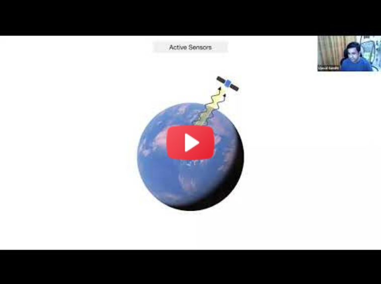{width="400px"}](https://www.youtube.com/watch?v=xAyNu9HbK8s){target="_blank"}

- [Watch the Video](https://www.youtube.com/watch?v=xAyNu9HbK8s){target="_blank"}
- [View the Presentation](https://docs.google.com/presentation/d/1opRKXIV8XSMa5h7Gqw10KXY5nW7_khfdiBmyDEcylUE/edit?usp=sharing){target="_blank"}

### Introduction to Google Earth Engine

This video gives a broad overview of Google Earth Engine with selected case studies and application. The video also covers the Earth Engine architecture and how it is different than traditional remote sensing software.

[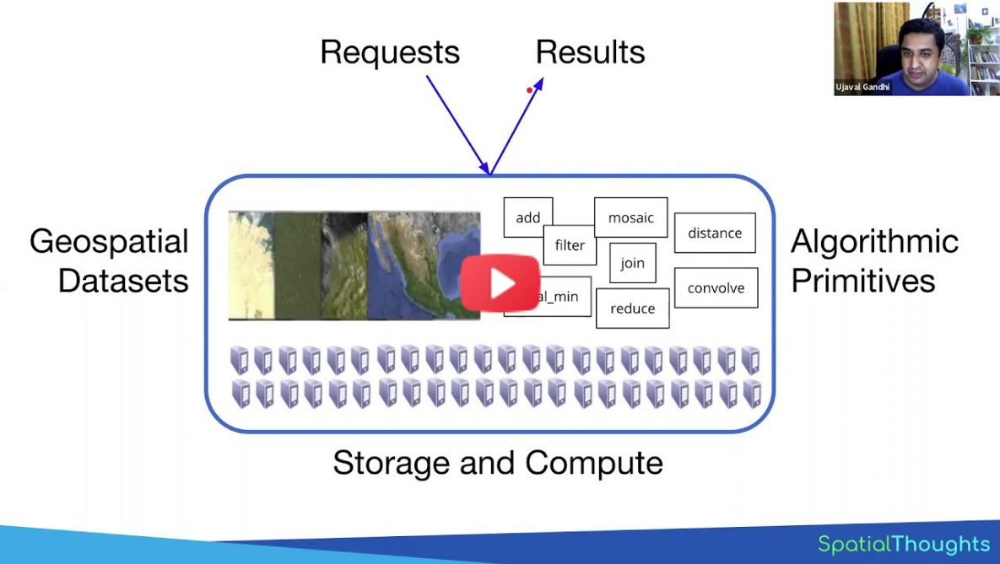{width="400px"}](https://www.youtube.com/watch?v=kpfncBHZBto){target="_blank"}

- [Watch the Video](https://www.youtube.com/watch?v=kpfncBHZBto){target="_blank"}
- [View the Presentation](https://docs.google.com/presentation/d/1RMyufK1bD7_Mj0b0Pub-CADiBsmT8LqyGMXIgem3UW4/edit?usp=sharing){target="_blank"}

### Take the Quizes

After you watch the videos, please complete the following 2 Quizzes

1. Quiz-1 [Remote Sensing Fundamentals](https://forms.gle/BoaYhMgpjwNn3amS8){target="_blank"}.
2. Quiz-2 [Google Earth Engine Fundamentals](https://forms.gle/pGVShApd9f6uVYR89){target="_blank"}.


## Get the Course Materials

The course material and exercises are in the form of Earth Engine scripts shared via a code repository.

1. [Click this link](https://code.earthengine.google.com/?accept_repo=users/ujavalgandhi/End-to-End-GEE) to open Google Earth Engine code editor and add the repository to your account.
2. If successful, you will have a new repository named `users/ujavalgandhi/End-to-End-GEE` in the *Scripts* tab in the *Reader* section.
3. Verify that your code editor looks like below

```{r echo=FALSE, fig.align='center', out.width='75%', fig.cap='Code Editor After Adding the Class Repository'}
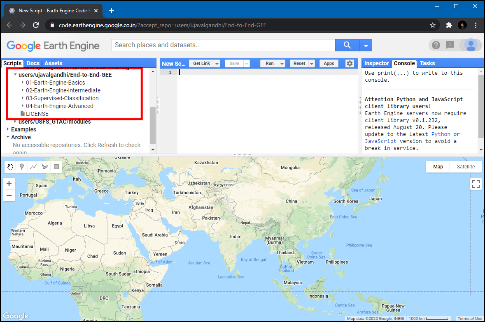
```


\newpage

# Module 1: Earth Engine Basics

Module 1 is designed to give you basic skills to be able to find datasets you need for your project, filter them to your region of interest, apply basic processing and export the results. Mastering this will allow you to start using Earth Engine for your project quickly and save a lot of time pre-processing the data.

## 01. Hello World

This script introduces the basic Javascript syntax. To learn more, visit [Introduction to JavaScript for Earth Engine](https://developers.google.com/earth-engine/tutorials/tutorial_js_01) section of the Earth Engine User Guide. 


```{r echo=FALSE, fig.align='center', out.width='75%', fig.cap='Hello World'}
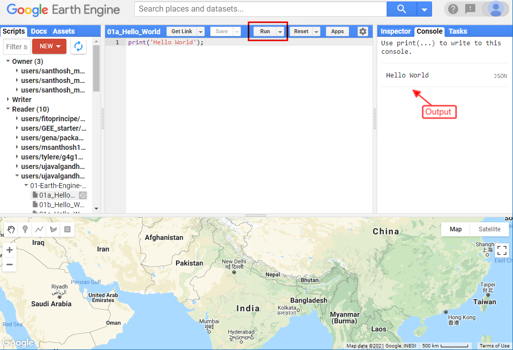
```

```{js eval=FALSE, code=readLines('code/end_to_end_gee/01-Earth-Engine-Basics/01b_Hello_World_(complete)')}
```

### Exercise

```{js eval=FALSE, code=readLines('code/end_to_end_gee/01-Earth-Engine-Basics/01c_Hello_World_(exercise)')}
```

### Saving Your Work

When you modify any script for the course repository, you may want to save a copy for yourself. If you try to click the *Save* button, you will get an error message like below

```{r echo=FALSE, fig.align='center', out.width='75%'}
knitr::include_graphics('images/end_to_end_gee/setup1.png')
```

This is because the shared class repository is a *Read-only* repository. You can click *Yes* to save a copy in your own repository. If this is the first time you are using Earth Engine, you will be prompted to choose the name of your *home folder*. Choose the name carefully, as it cannot be changed once created.

```{r echo=FALSE, fig.align='center', out.width='60%'}
knitr::include_graphics('images/end_to_end_gee/setup2.png')
```

## 02. Working with Image Collections

Most datasets in Earth Engine come as a `ImageCollection`. An ImageCollection is a dataset that consists of images takes at different time and locations - usually from the same satellite or data provider. You can load a collection by searching the [Earth Engine Data Catalog](https://developers.google.com/earth-engine/datasets) for the *ImageCollection ID*. Search for the *Sentinel-2 Level 1C* dataset and you will find its id `COPERNICUS/S2_SR`. Visit the [Sentinel-2, Level 1C page](https://developers.google.com/earth-engine/datasets/catalog/COPERNICUS_S2) and see *Explore in Earth Engine* section to find the code snippet to load and visualize the collection. This snippet is a great starting point for your work with this dataset. Click the **Copy Code Sample** button and paste the code into the code editor. Click *Run* and you will see the image tiles load in the map.


```{r echo=FALSE, fig.align='center', out.width='75%'}
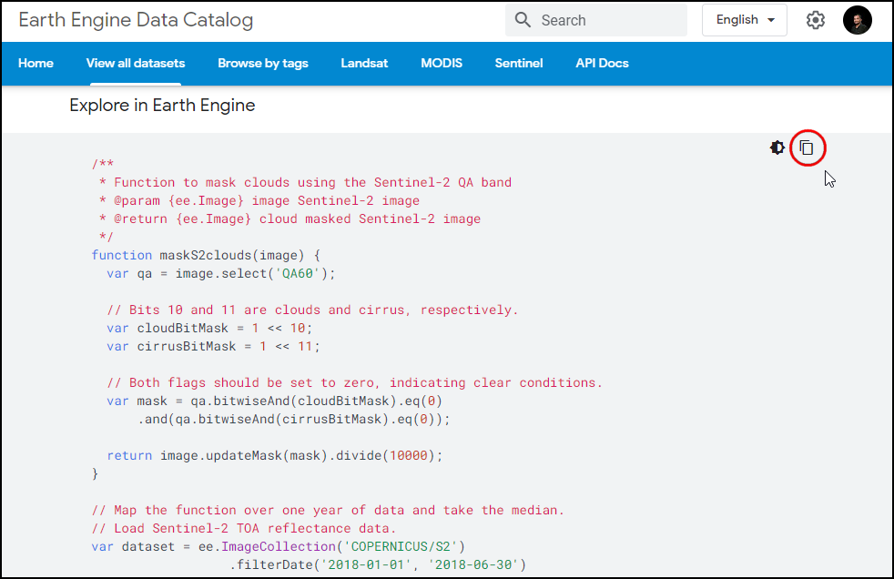
```

In the code snippet, You will see a function `Map.setCenter()` which sets the viewport to a specific location and zoom level. The function takes the X coordinate (longitude), Y coordinate (latitude) and Zoom Level parameters. Replace the X and Y coordinates with the coordinates of your city and click *Run* to see the images of your city.

```{r echo=FALSE, fig.align='center', out.width='75%'}
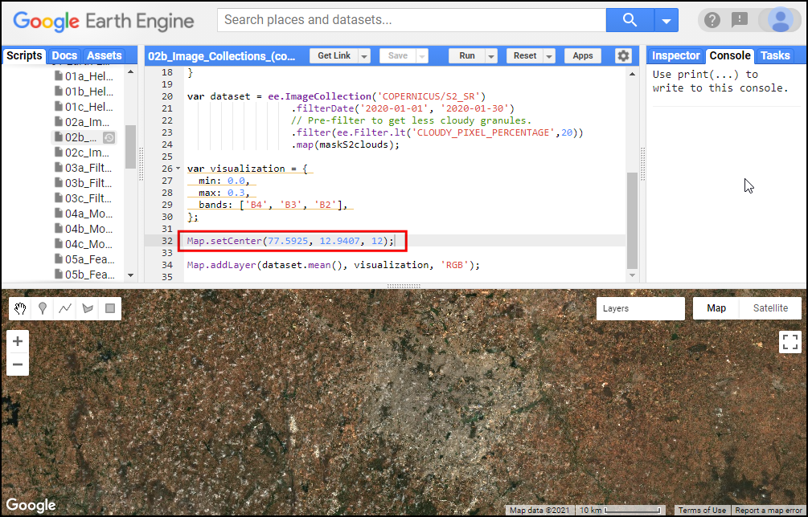
```

### Exercise

```{js eval=FALSE, code=readLines('code/end_to_end_gee/01-Earth-Engine-Basics/02c_Image_Collections_(exercise)')}
```

## 03. Filtering Image Collections

The collection contains all imagery ever collected by the sensor. The entire collections are not very useful. Most applications require a subset of the images. We use **filters** to select the appropriate images. There are many types of filter functions, look at `ee.Filter...` module to see all available filters. Select a filter and then run the `filter()` function with the filter parameters. 

We will learn about 3 main types of filtering techniques

* **Filter by metadata**: You can apply a filter on the image metadata using filters such as `ee.Filter.eq()`, `ee.Filter.lt()` etc. You can filter by PATH/ROW values, Orbit number, Cloud cover etc.
* **Filter by date**: You can select images in a particular date range using filters such as `ee.Filter.date()`.
* **Filter by location**: You can select the subset of images with a bounding box, location or geometry using the `ee.Filter.bounds()`. You can also use the drawing tools to draw a geometry for filtering.

After applying the filters, you can use the `size()` function to check how many images matches the filters.

```{r echo=FALSE, fig.align='center', out.width='75%'}
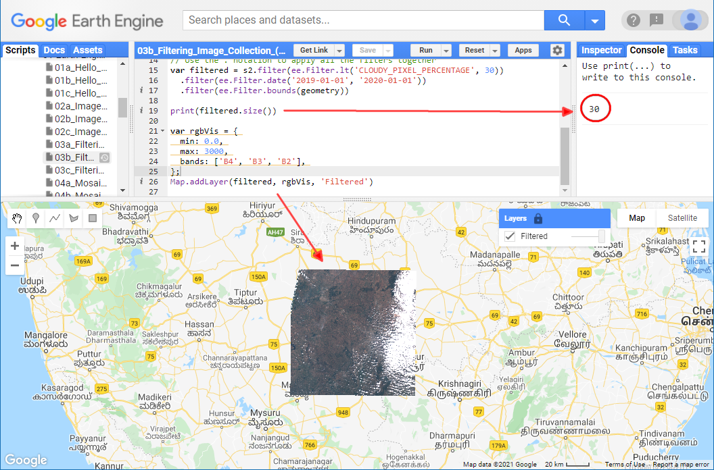
```

```{js eval=FALSE, code=readLines('code/end_to_end_gee/01-Earth-Engine-Basics/03b_Filtering_Image_Collection_(complete)')}
```

### Exercise

```{js eval=FALSE, code=readLines('code/end_to_end_gee/01-Earth-Engine-Basics/03c_Filtering_Image_Collection_(exercise)')}
```

## 04. Creating Mosaics and Composites from ImageCollections

The default order of the collection is by date. So when you display the the collection, it implicitly creates a mosaic with the latest pixels in top. You can call `.mosaic()` on a ImageCollection to create a mosaic image from the pixels at the top.

We can also create composite image by applying a selection criteria to each pixel from all pixels in the stack. Here we use the `median()` function to create a composite where each pixel value is the median of all pixels from the stack.

> Tip: If you need to create a mosaic where the images are in a specific order, you can use the `.sort()` function to sort your collection by a property first.

```{js eval=FALSE, code=readLines('code/end_to_end_gee/01-Earth-Engine-Basics/04b_Mosaics_and_Composites_(complete)')}
```


```{r echo=FALSE, fig.align='center', out.width='100%', fig.cap='Mosaic vs. Composite'}
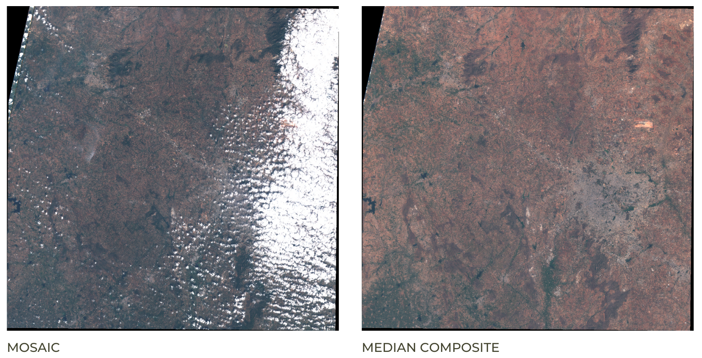
```

### Exercise

```{js eval=FALSE}
// Create a median composite for the year 2020 and load it to the map

// Compare both the composites to see the changes in your city
```

## 05. Working with Feature Collections

Feature Collections are similar to Image Collections - but they contain *Features*, not images. They are equivalent to Vector Layers in a GIS. We can load, filter and display Feature Collections using similar techniques that we have learnt so far. 

Search for *GAUL Second Level Administrative Boundaries* and load the collection. This is a global collection that contain all Admin2 boundaries. We can apply a filter using the `ADM1_NAME` property to get all Admin2 boundaries (i.e. Districts) from a state.

```{js eval=FALSE, code=readLines('code/end_to_end_gee/01-Earth-Engine-Basics/05b_Feature_Collections_(complete)')}
```

```{r echo=FALSE, fig.align='center', out.width='75%'}
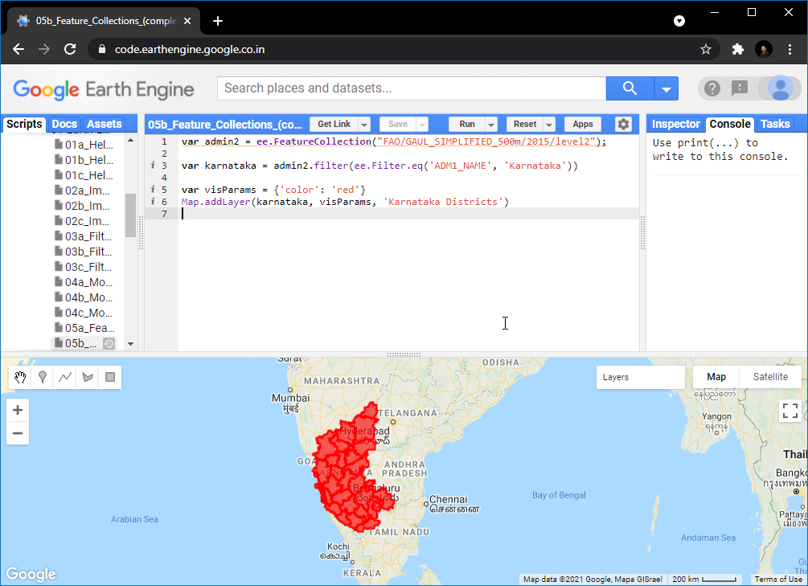
```

### Exercise

```{js eval=FALSE, code=readLines('code/end_to_end_gee/01-Earth-Engine-Basics/05c_Feature_Collections_(exercise)')}
```

## 06. Importing Data

You can import vector or raster data into Earth Engine. We will now import a shapefile of [Urban Areas](https://www.naturalearthdata.com/downloads/10m-cultural-vectors/10m-urban-area/) for Natural Earth. Unzip the `ne_10m_urban_areas.zip` into a folder on your computer. In the Code Editor, go to *Assets &rarr; New &rarr; Table Upload &rarr; Shape Files*. Select the `.shp`, `.shx`, `.dbf` and .`prj` files. Enter `ne_10m_urban_areas` as the *Asset Name* and click  *Upload*. Once the upload and ingest finishes, you will have a new asset in the *Assets* tab. The shapefile is imported as a Feature Collection in Earth Engine. Select the `ne_10m_urban_areas` asset and click *Import*.  You can then visualize the imported data.


```{r echo=FALSE, fig.align='center', out.width='100%', fig.cap='Importing a Shapefile'}
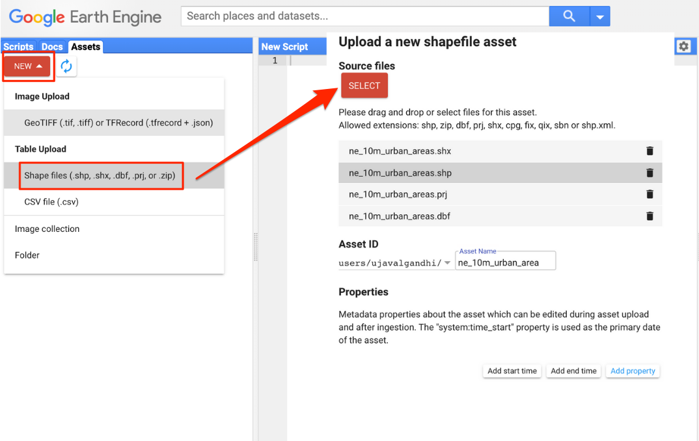
```

```{js eval=FALSE, code=readLines('code/end_to_end_gee/01-Earth-Engine-Basics/06b_Import_(complete)')}
```


### Exercise

```{js eval=FALSE, code=readLines('code/end_to_end_gee/01-Earth-Engine-Basics/06c_Import_(exercise)')}
```

## 07. Clipping Images

It is often desirable to clip the images to your area of interest. You can use the `clip()` function to mask out an image using a geometry.

> While in a Desktop software, clipping is desirable to remove unneccesary portion of a large image and save computation time, in Earth Engine clipping can actually increase the computation time. As described in the [Earth Engine Coding Best Practices](https://developers.google.com/earth-engine/guides/best_practices?hl=en#if-you-dont-need-to-clip,-dont-use-clip) guide, avoid clipping the images or do it at the end of your script.

```{js eval=FALSE, code=readLines('code/end_to_end_gee/01-Earth-Engine-Basics/07b_Clipping_(complete)')}
```

```{r echo=FALSE, fig.align='center', out.width='100%', fig.cap='Original vs. Clipped Image'}
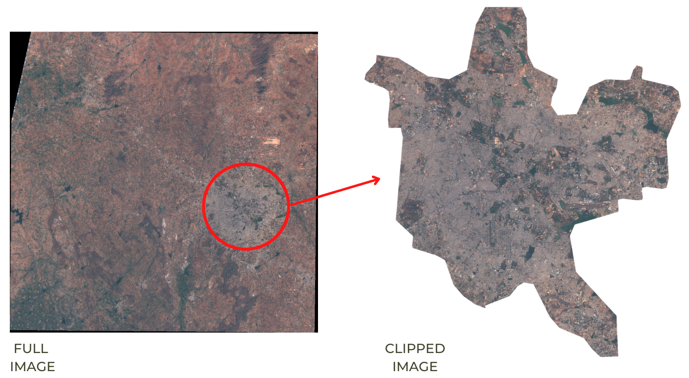
```

### Exercise

```{js eval=FALSE}
// Add the imported table to the Map
// Use the Inspector to find the id of your home city or any urban area of your choice
// Change the filter to use the id of the selected feature
```

## 08. Exporting Data

Earth Engine allows for exporting both vector and raster data to be used in an external program. Vector data can be exported as a `CSV` or a `Shapefile`, while Rasters can be exported as `GeoTIFF` files. We will now export the Sentinel-2 Composite as a GeoTIFF file.

> Tip: Code Editor supports autocompletion of API functions using the combination *Ctrl+Space*. Type a few characters of a function and press *Ctrl+Space* to see autocomplete suggestions. You can also use the same key combination to fill all parameters of the function automatically.

```{js eval=FALSE, code=readLines('code/end_to_end_gee/01-Earth-Engine-Basics/08b_Export_(complete)')}
```

```{r echo=FALSE, fig.align='center', out.width='75%'}
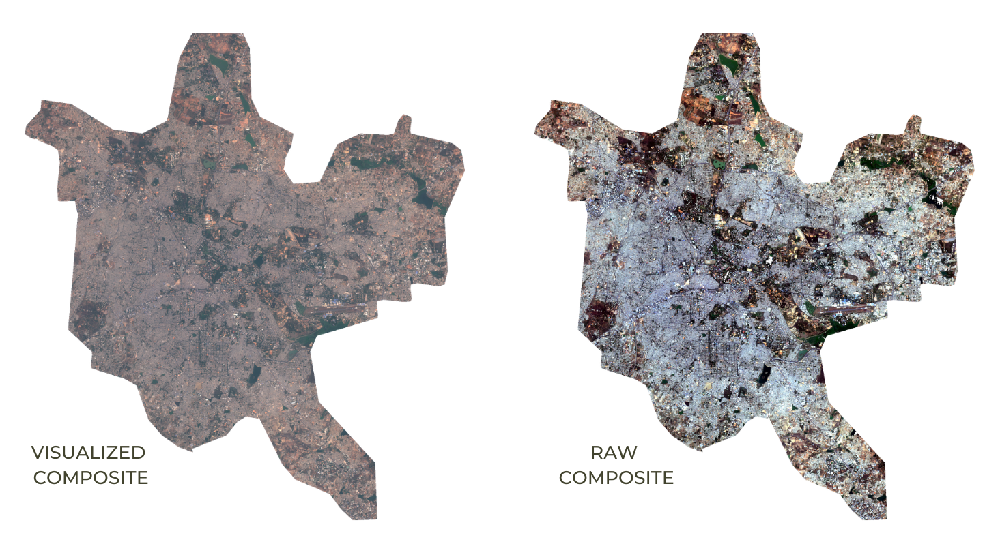
```

### Exercise

```{js eval=FALSE}

// Write the export function to export the results for your chosen urban area
```

## Assignment 1

```{js eval=FALSE, code=readLines('code/end_to_end_gee/01-Earth-Engine-Basics/Assignment1')}
```

```{r echo=FALSE, fig.align='center', out.width='75%', fig.cap='Assignment1 Expected Output'}
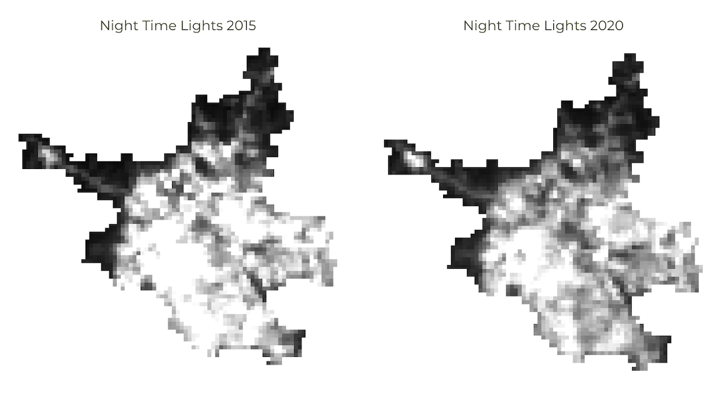
```

\newpage

# Module 2: Earth Engine Intermediate

Module 2 builds on the basic Earth Engine skills you have gained. This model introduces the parallel programming concepts using Map/Reduce - which is key in effectively using Earth Engine for analyzing large volumes of data. You will learn how to use the Earth Engine API for calculating various spectral indicies, do cloud masking and then use map/reduce to do apply these computations to collections of imagery. You will also learn how to take long time-series of data and create charts.

[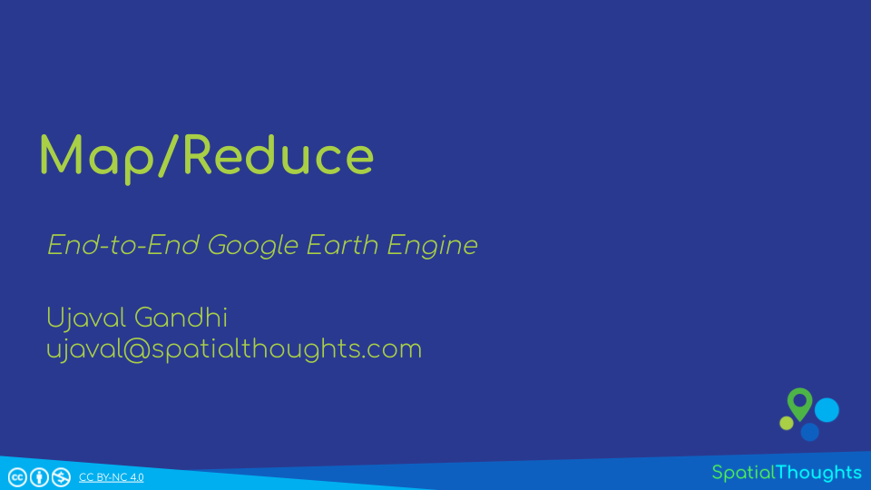{width="400px"}](https://docs.google.com/presentation/d/10qOyxhubkwnsAVjniW54ETgwUHq3DXYKo3HGb6Gemi0/edit?usp=sharing){target="_blank"}

[View the Presentation](https://docs.google.com/presentation/d/10qOyxhubkwnsAVjniW54ETgwUHq3DXYKo3HGb6Gemi0/edit?usp=sharing){target="_blank"}

## 01. Earth Engine Objects

This script introduces the basics of the Earth Engine API. When programming in Earth Engine, you must use the Earth Engine API so that your computations can use the Google Earth Engine servers. To learn more, visit [Earth Engine Objects and Methods](https://developers.google.com/earth-engine/tutorial_js_02) section of the Earth Engine User Guide. 

```{js eval=FALSE, code=readLines('code/end_to_end_gee/02-Earth-Engine-Intermediate/01b_Earth_Engine_Objects_(complete)')}
```

> As a general rule, you should always use Earth Engine API methods in your code, there is one exception where you will need to use client-side Javascript method. If you want to get the current time, the server doesn't know your time. You need to use javascript method and cast it to an Earth Engine object.
  ```
  var now = Date.now()
  print(now)
  var now = ee.Date(now)
  print(now)
  ```

### Exercise

```{js eval=FALSE, code=readLines('code/end_to_end_gee/02-Earth-Engine-Intermediate/01c_Earth_Engine_Objects_(exercise)')}
```

## 02. Calculating Indices

Spectral Indices are central to many aspects of remote sensing. Whether you are studying vegetation or tracking fires - you will need to compute a pixel-wise ratio of 2 or more bands. The most commonly used formula for calculating an index is the *Normalized Difference* between 2 bands. Earth Engine provides a helper function `normalizedDifference()` to help calculate normalized indices, such as Normalized Difference Vegetation Index (NDVI). For more complex formulae, you can also use the `expression()` function to describe the calculation.


```{js eval=FALSE, code=readLines('code/end_to_end_gee/02-Earth-Engine-Intermediate/02b_Calculating_Indices_(complete)')}
```


```{r echo=FALSE, fig.align='center', out.width='75%', fig.cap='MNDWI, SAVI and NDVI images'}
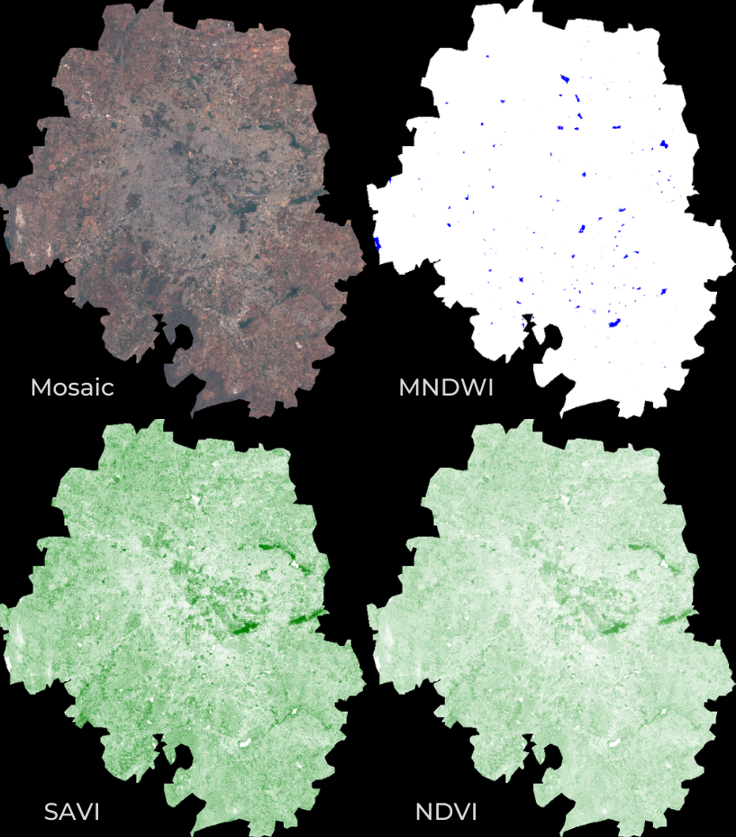
```

### Exercise

```{js eval=FALSE, code=readLines('code/end_to_end_gee/02-Earth-Engine-Intermediate/02c_Calculating_Indices_(exercise)')}
```

## 03. Computation on ImageCollections

So far we have learnt how to run computation on single images. If you want to apply some computation - such as calculating an index - to many images, you need to use `map()`. You first define a function that takes 1 image and returns the result of the computation on that image. Then you can `map()` that function over the ImageCollection which results in a new ImageCollection with the results of the computation. This is similar to a *for-loop* that you maybe familiar with - but using `map()` allows the computation to run in parallel. Learn more at [Mapping over an ImageCollection](https://developers.google.com/earth-engine/guides/ic_mapping)


```{js eval=FALSE, code=readLines('code/end_to_end_gee/02-Earth-Engine-Intermediate/03b_Computation_on_Image_Collections_(complete)')}
```


```{r echo=FALSE, fig.align='center', out.width='100%', fig.cap='NDVI computation on an ImageCollection'}
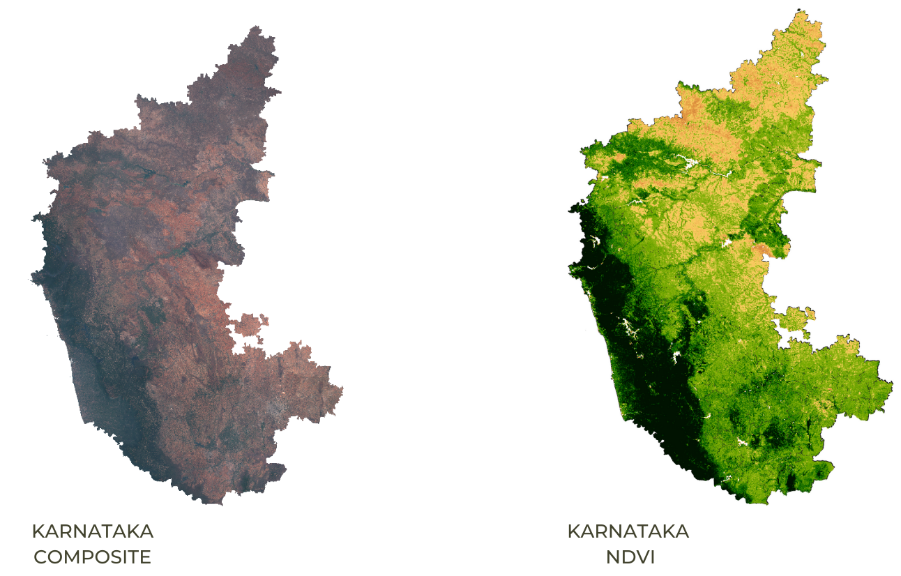
```


### Exercise

```{js eval=FALSE, code=readLines('code/end_to_end_gee/02-Earth-Engine-Intermediate/03c_Computation_on_Image_Collections_(exercise)')}
```

## 04. Cloud Masking

Masking pixels in an image makes those pixels transparent and excludes them from analysis and visualization. To mask an image, we can use the `updateMask()` function and pass it an image with 0 and 1 values. All pixels where the mask image is 0 will be masked.

Most remote sensing datasets come with a QA or Cloud Mask band that contains the information on whether pixels is cloudy or not. Your *Code Editor* contains pre-defined functions for masking clouds for popular datasets under *Scripts Tab &rarr; Examples &rarr; Cloud Masking*. 

The script below takes the Sentinel-2 masking function and shows how to apply it on an image.

```{js eval=FALSE, code=readLines('code/end_to_end_gee/02-Earth-Engine-Intermediate/04b_Cloud_Masking_(complete)')}
```

```{r echo=FALSE, fig.align='center', out.width='100%', fig.cap='Applying pixel-wise QA bitmask'}
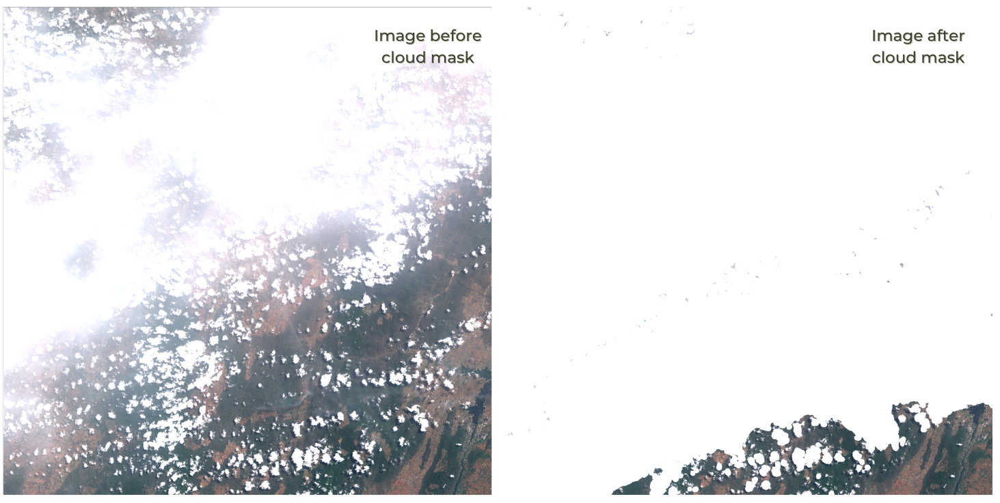
```


### Exercise

```{js eval=FALSE, code=readLines('code/end_to_end_gee/02-Earth-Engine-Intermediate/04c_Cloud_Masking_(exercise)')}
```


> If you are using Sentinel-2 data, do check out the an alternative cloud masking techninque using the *S2 Cloudless* dataset. [Learn more](https://medium.com/google-earth/more-accurate-and-flexible-cloud-masking-for-sentinel-2-images-766897a9ba5f)
  ```
  var imageSR = ee.Image('COPERNICUS/S2_SR/20190703T050701_20190703T052312_T43PGP')
  var s2Cloudless = ee.Image('COPERNICUS/S2_CLOUD_PROBABILITY/20190703T050701_20190703T052312_T43PGP')
  var clouds = s2Cloudless.lt(50)
  var cloudlessMasked = imageSR.mask(clouds)
  var rgbVis = {min: 0.0, max: 3000, bands: ['B4', 'B3', 'B2']};
  Map.addLayer(cloudlessMasked, rgbVis, 'S2 Cloudless Masked Image')
  ```

## 05. Reducers

When writing parallel computing code, a *Reduce* operation allows you to compute statistics on a large amount of inputs. In Earth Engine, you need to run reduction operation when creating composites, calculating statistics, doing regression analysis etc. The Earth Engine API comes with a large number of built-in reducer functions (such as `ee.Reducer.sum()`, `ee.Reducer.histogram()`, `ee.Reducer.linearFit()` etc.) that can perform a variety of statistical operations on input data. You can run reducers using the `reduce()` function. Earth Engine supports running reducers on all data structures that can hold multiple values, such as Images (reducers run on different bands), ImageCollection, FeatureCollection, List, Dictionary etc. The script below introduces basic concepts related to reducers.


```{js eval=FALSE, code=readLines('code/end_to_end_gee/02-Earth-Engine-Intermediate/05b_Reducers_(complete)')}
```

### Exercise

```{js eval=FALSE, code=readLines('code/end_to_end_gee/02-Earth-Engine-Intermediate/05c_Reducers_(exercise)')}
```

## 06. Time-Series Charts

Now we can put together all the skills we have learnt so far - filter, map, reduce, and cloud-masking to create a chart of average NDVI values for a given farm over 1 year. Earth Engine API comes with support for charting functions based on the Google Chart API. Here we use the `ui.Chart.image.series()` function to create a time-series chart.


```{r echo=FALSE, fig.align='center', out.width='100%', fig.cap='Computing NDVI Time-series for a Farm'}
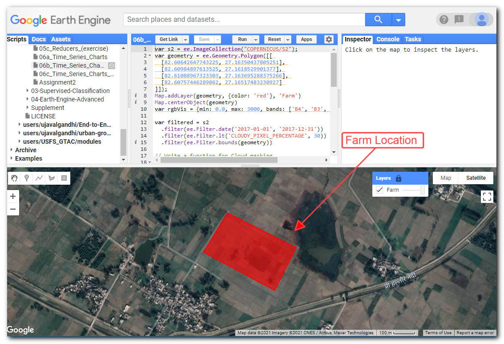
```

```{js eval=FALSE, code=readLines('code/end_to_end_gee/02-Earth-Engine-Intermediate/06b_Time_Series_Charts_(complete)')}
```


```{r echo=FALSE, fig.align='center', out.width='100%', fig.cap='NDVI Time-series showing Dual-Cropping Cycle'}
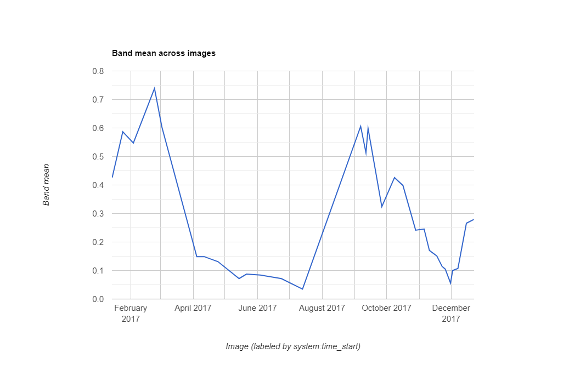
```

### Exercise

```{js eval=FALSE}
// Delete the farm boundary from the previous script 
// and add another farm at a location of your choice

// Print the chart.
```

## Assignment 2

```{js eval=FALSE, code=readLines('code/end_to_end_gee/02-Earth-Engine-Intermediate/Assignment2')}
```


```{r echo=FALSE, fig.align='center', out.width='75%', fig.cap='Assignment2 Expected Output'}
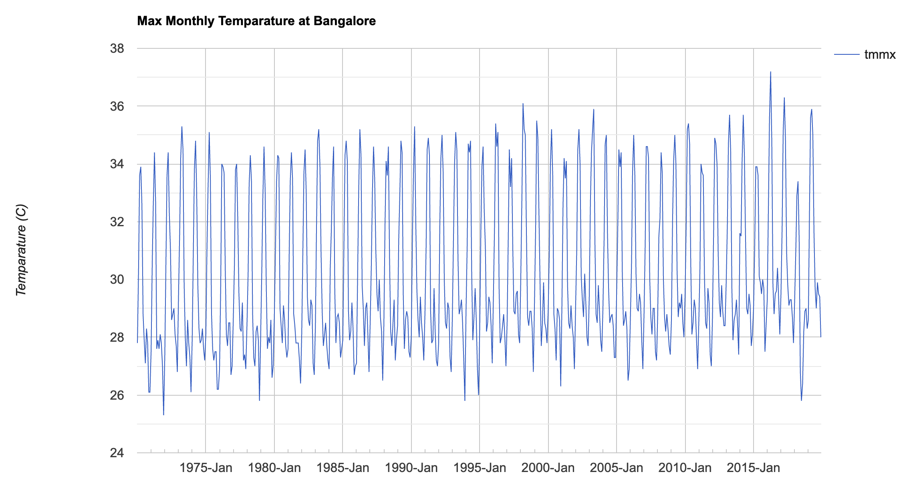
```

\newpage


# Module 3: Supervised Classification and Change Detection

## Introduction to Machine Learning and Supervised Classification

Supervised classification is arguably the most important classical machine learning techniques in remote sensing. Applications range from generating Land Use/Land Cover maps to change detection. Google Earth Engine is unique suited to do supervised classification at scale. The interactive nature of Earth Engine development allows for iterative development of supervised classification workflows by combining many different datasets into the model. This module covers basic supervised classification workflow, accuracy assessment, hyperparameter tuning and change detection.

[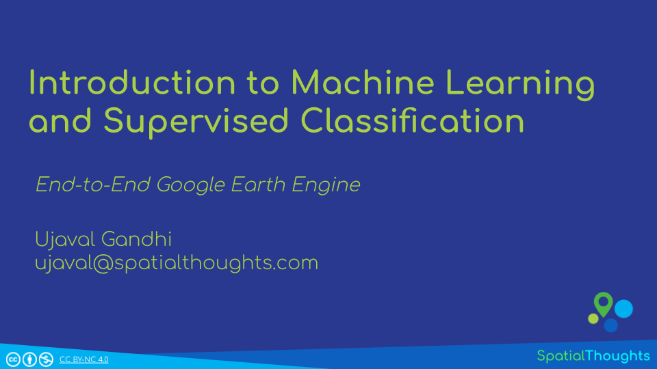{width="400px"}](https://docs.google.com/presentation/d/19L1b5vsxb38xS8GlHNKOjvPZ0IGqDhv93681btMEL5w/edit?usp=sharing){target="_blank"}

[View the Presentation](https://docs.google.com/presentation/d/19L1b5vsxb38xS8GlHNKOjvPZ0IGqDhv93681btMEL5w/edit?usp=sharing){target="_blank"}

## Introduction to Change Detection

Many earth observation datasets are available at regular intervals over long periods of time. This enables us to detect changes on the Earth's surface. Change detection technique in remote sensing fall in the following categories

- **Single Band Change**: Measuring change in spectral index using a threshold
- **Multi Band Change**: Measuring spectral distance and spectral angle between two multispectral images
- **Classification of Change**: One-pass classification using stacked image containing bands from before and after an event
- **Post Classification Comparison**: Comparing two classified images and computing class transitions

In the following sections, we will apply the supervised classification techniques for change detection using multi-temporal images.

[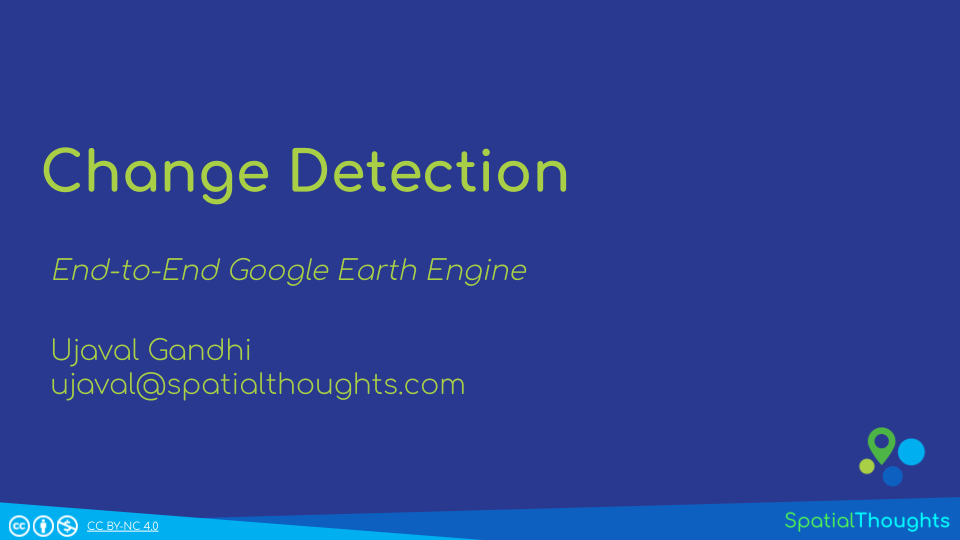{width="400px"}](https://docs.google.com/presentation/d/1vdFTWJ61yDuVfbfhpnumQ8zuMPGwGcHpHsBTRgo_o5I/edit?usp=sharing){target="_blank"}

[View the Presentation](https://docs.google.com/presentation/d/1vdFTWJ61yDuVfbfhpnumQ8zuMPGwGcHpHsBTRgo_o5I/edit?usp=sharing){target="_blank"}


## 01. Basic Supervised Classification

We will learn how to do a basic land cover classification using training samples collected from the Code Editor using the High Resolution basemap imagery provided by Google Maps. This method requires no prior training data and is quite effective to generate high quality classification samples anywhere in the world. The goal is to classify each source pixel into one of the following classes - urban, bare, water or vegetation. Using the drawing tools in the code editor, you create 4 new feature collection with points representing pixels of that class. Each feature collection has a property called `landcover` with values of 0, 1, 2 or 3 indicating whether the feature collection represents urban, bare, water or vegetation respectively. We then train a *Random Forest* classifier using these training set to build a model and apply it to all the pixels of the image to create a 4 class image.

> Fun fact: The classifiers in Earth Engine API have names starting with **smile** - such as `ee.Classifier.smileRandomForest()`. The *smile* part refers to the [Statistical Machine Intelligence and Learning Engine (SMILE)](https://haifengl.github.io/index.html) JAVA library which is used by Google Earth Engine to implement these algorithms.

```{js eval=FALSE, code=readLines('code/end_to_end_gee/03-Supervised-Classification/01d_Basic_Supervised_Classification_(noimport)')}
```

```{r echo=FALSE, fig.align='center', out.width='75%', fig.cap='Supervised Classification Output'}
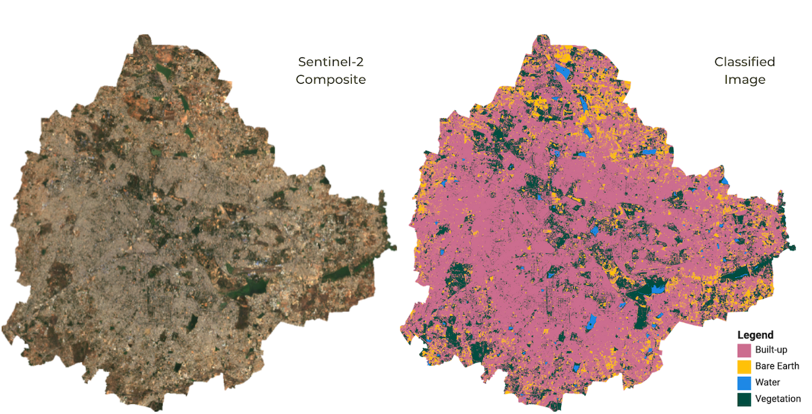
```

### Exercise

```{js eval=FALSE, code=readLines('code/end_to_end_gee/03-Supervised-Classification/01c_Basic_Supervised_Classification_(exercise)')}
```


## 02. Accuracy Assessment

It is important to get a quantitative estimate of the accuracy of the classification. To do this, a common strategy is to divide your training samples into 2 random fractions - one used for *training* the model and the other for *validation* of the predictions. Once a classifier is trained, it can be used to classify the entire image. We can then compare the classified values with the ones in the validation fraction. We can use the `ee.Classifier.confusionMatrix()` method to calculate a *Confusion Matrix* representing expected accuracy.

> Don't get carried away tweaking your model to give you the highest validation accuracy. You must use both qualitative measures (such as visual inspection of results) along with quantitative measures to assess the results. 


```{js eval=FALSE, code=readLines('code/end_to_end_gee/03-Supervised-Classification/02b_Accuracy_Assessment_(complete)')}
```

```{r echo=FALSE, fig.align='center', out.width='75%', fig.cap='Accuracy Assessment'}
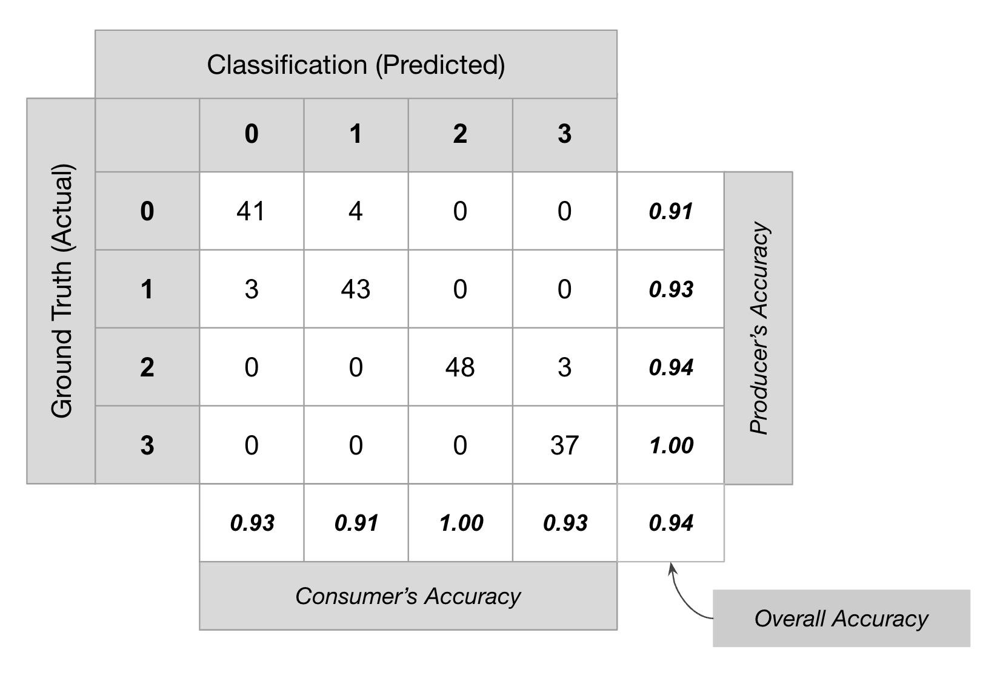
```

## 03. Improving the Classification

One feature that make Earth Engine data model really well suited for machine learning tasks is its ability to easily incorporate data sources of different spatial  resolutions, projections and data types together easily. By giving additional information to the classifier, it is able to separate different classes easily. Here we take the same example and augment it with different spectral indicies such as - NDVI, NDBI, MNDWI and BSI. We also add slope and elevation bands from the ALOS DEM. The result is a much improve classification.


```{js eval=FALSE, code=readLines('code/end_to_end_gee/03-Supervised-Classification/03b_Improving_the_Classification_(complete)')}
```


```{r echo=FALSE, fig.align='center', out.width='75%', fig.cap='Improved Classification Accuracy with use of Dpectral Indices and Elevation Data'}
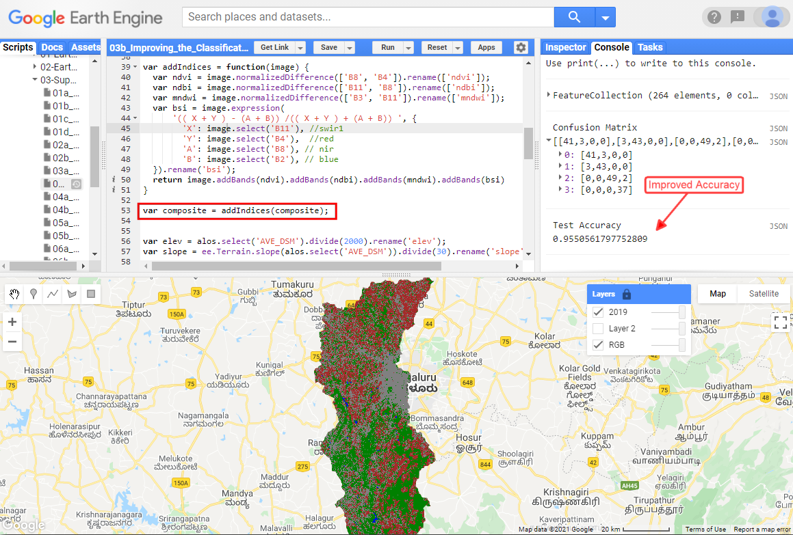
```

## 04. Hyperparameter Tuning

A recommended best practice for improving the accuracy of your machine learning model is to tune different parameters. For example, when using the `ee.Classifer.smileRandomForest()` classifier, we must specify the *Number of Trees*. We know that higher number of trees result in more computation requirement, but it doesn't necessarily result in better results. Instead of guessing, we programatically try a range of values and choose the smallest value possible that results in the highest accuracy.

```{js eval=FALSE, code=readLines('code/end_to_end_gee/03-Supervised-Classification/04b_Hyperparameter_Tuning_(complete)')}
```


```{r echo=FALSE, fig.align='center', out.width='75%', fig.cap='Supervised Classification Output'}
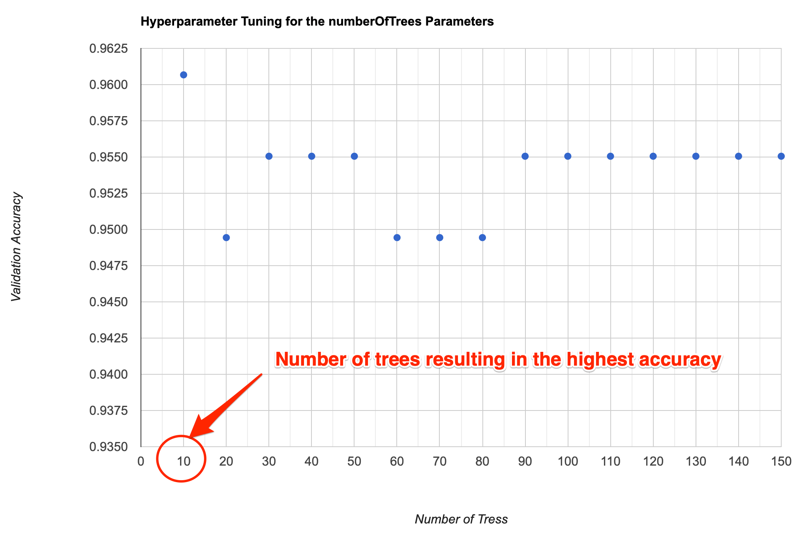
```

## 05. Exporting Classification Results

When working with complex classifiers over large regions, you may get a *User memory limit exceeded* or *Computation timed out* error in the Code Editor. The reason for this is that there is a fixed time limit and smaller memory allocated for code that is run with the *On-Demand Computation* mode. For larger computations, you can use the *Batch* mode with the `Export` functions. Exports run in the background and can run longer than 5-minutes time allocated to the computation code run form the Code Editor. This allows you to process very large and complex datasets. Here's an example showing how to export your classification results to Google Drive.

> We can only export Images or FeatureCollections. What if you wanted to export a number that is the result of a long computation? A useful *hack* is to create a FeatureCollection with just 1 feature containing `null` geometry and a property containing the number you want to export.

```{js eval=FALSE, code=readLines('code/end_to_end_gee/03-Supervised-Classification/05b_Exporting_Classification_Results_(complete)')}
```

```{r echo=FALSE, fig.align='center', out.width='75%', fig.cap='Exported Classification Outputs'}
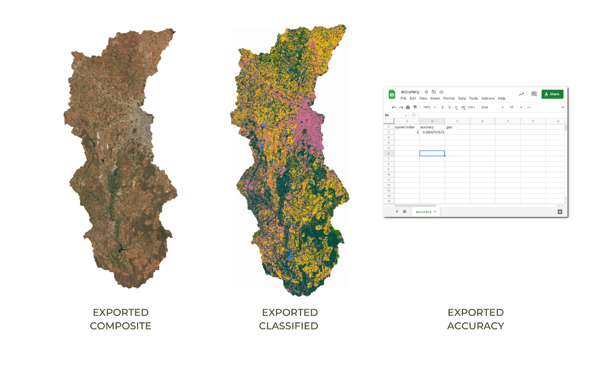
```

## 06. Calculating Area

Now that we have the results of out classification, we will learn how to calculate area for pixels in each class. Calculating area for features is done using the `area()` function and for images using the `ee.Image.pixelArea()` function. The `ee.Image.pixelArea()` function creates an image where each pixel's value is the area of the pixel. We multiply this pixel area image with our image and sum up the area using the `reduceRegion()` function.

```{js eval=FALSE, code=readLines('code/end_to_end_gee/03-Supervised-Classification/06b_Calculating_Area_(complete)')}
```

```{r echo=FALSE, fig.align='center', out.width='75%', fig.cap='Calculating Green Cover from Classified Image'}
knitr::include_graphics('images/end_to_end_gee/area_calculation.png')
```

> If you want to compute area covered by each class, you can use a [Grouped Reducer](https://developers.google.com/earth-engine/reducers_grouping). See the *Supplement* to see a code snippet.

### Exercise

```{js eval=FALSE}
// Exercise
// Compute and print the percentage green cover of the city
```

## 07. Direct Classification of Change

This technique of change detection is also known as *One-pass Classification* or *Direct Multi-date Classification*. Here we create a single stacked image containing bands from before and after images. We train a classifier with training data sampled from the stacked image and apply the classifier on the stacked image to find all change pixels.

```{js eval=FALSE, code=readLines('code/end_to_end_gee/03-Supervised-Classification/07b_Classifying_Change_(complete)')}
```

```{r echo=FALSE, fig.align='center', out.width='75%', fig.cap='All pixels that changed from bare ground to built-up'}
knitr::include_graphics('images/end_to_end_gee/change_classification.png')
```

### Exercise

```{js eval=FALSE}
// Add an NDBI band to improve the detection of changes.

var addNDBI = function(image) {
  var ndbi = image.normalizedDifference(['B11', 'B8']).rename(['ndbi']);
  return image.addBands(ndbi)
}

// use addNDBI() function to add the NDBI band to both 2019 and 2020 composite images
// Hint1: You can save the resulting image in the same variable to avoid changing 
// a lot of code.
// var image = addNDBI(image)

```

## 08. Post-classification Comparison

We dealing with multi-class images, a useful metric for change detection is to know how many pixels from class X changed to class Y. This can be accomplished using the `ee.Reducer.frequencyHistogram()` reducer as shown below.

```{js eval=FALSE, code=readLines('code/end_to_end_gee/03-Supervised-Classification/08b_Post_Classification_Comparison_(complete)')}
```

### Exercise

```{js eval=FALSE}
// Exercise
// Show all areas where water became other classes and display the result
// Hint1: Select class 3 pixels from before image and NOT class 3 pixels from after image
// Hint2: use the .and() operation to select pixels matching both conditions
```


```{r echo=FALSE, fig.align='center', out.width='75%', fig.cap='Lost water pixels between 2019 and 2020'}
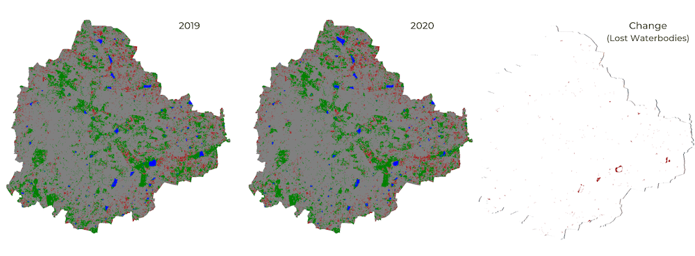
```

# Module 4: Earth Engine Advanced

This module is focused on helping you build skills to scale your analysis in Earth Engine. We will cover topics ranging from building an app, code sharing and using the Python API for bulk exports and advanced analysis.


## 01. Client vs. Server

The User Interface elements in your Code Editor - Map View, Drawing Tools etc. are 'client-side' elements. They run in YOUR browser. Image Collections, feature collections, calculations on Earth Engine objects etc. are 'server-side' elements. They run in Google's data center. You cannot mix both these objects. To learn more, visit the [Client vs. Server](https://developers.google.com/earth-engine/guides/client_server) section of the Earth Engine User Guide.

* To convert client-side objects to server-side objects, you can use the appropriate API function. Server-side functions start with `ee.`, such `ee.Date()`, `ee.Image()` etc.
* To convert server-side objects to client-side objects, you can call `.getInfo()` on am Earth Engine object. For the Python API, this is the only way to extract information from a server-side object, but the Javascript API provides a better (and preferred) - method for bring server-side objects to client-side using the `evaluate()` method. This method asynchronously retrieves the value of the object, without blocking the user interface - meaning it will let your code continue to execute while it fetches the value. 

```{js eval=FALSE, code=readLines('code/end_to_end_gee/04-Earth-Engine-Advanced/01b_Client_vs_Server_(complete)')}
```

## 02. Building and Publishing an App

Earth Engine comes with a User Interface API that allows you to build an interactive web application powered by Earth Engine. Building a web mapping application typically requires the skills of a full stack developer and are out of reach for most analysts and scientists. But the Earth Engine User Interface API makes this process much more accessible by providing ready-to-use widgets, such as Buttons, Drop-down Menus, Sliders etc. - and free cloud hosting to allow anyone to publish an app with just a few lines of code. 

The apps run in your browser, so they need to use *client-side* functions. All the user interface functions are contained in the `ui.` package - such as `ui.Select()`, `ui.Button()`. You can create those elements by calling these functions with appropriate parameters. The main container object is the `ui.Panel()` which can contain different types of widgets. Learn more in the [Earth Engine User Interface API](https://developers.google.com/earth-engine/guides/ui) section of the Earth Engine User Guide.

The code below shows how to build an app called [Night Lights Explorer](https://santhosh-m.users.earthengine.app/view/night-lights-explorer) that allows anyone to pick a year/month and load the *VIIRS Nighttime Day/Night Band Composite* for the selected month. Copy/paste the code below to your Code Editor and click *Run*.

```{js eval=FALSE, code=readLines('code/end_to_end_gee/04-Earth-Engine-Advanced/02b_Building_an_App_with_UI_Widgets_(complete)')}
```

```{r echo=FALSE, fig.align='center', out.width='100%'}
knitr::include_graphics('images/end_to_end_gee/app1.png')
```

You will see a panel on the right-hand side with 2 drop-down boxes and a button. These are User Interface (UI) widgets provided by the Earth Engine API that allows the user to interactively select the values. You can select the values for *year* and *month* and click *Load* button to see the image for the selected month. We will now publish this app. Click on the *Apps* button.

```{r echo=FALSE, fig.align='center', out.width='100%', fig.cap='App with UI Elements'}
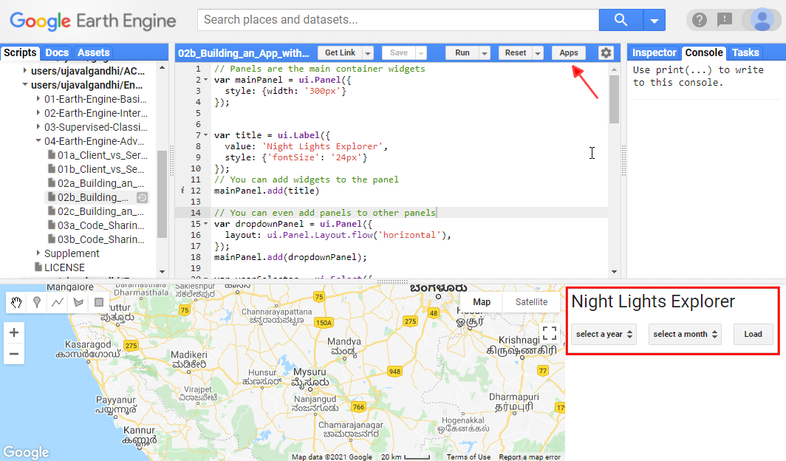
```

In the *Manage Apps* window, click *New App*.

```{r echo=FALSE, fig.align='center', out.width='60%'}
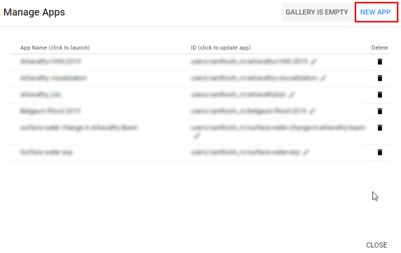
```

Enter the name of your app. The app will be hosted on Google Cloud, so you will need to create and link a Google Cloud project with the app. If you don't have a Google Cloud account, you can click the *Not Yet* button to create a new project.

```{r echo=FALSE, fig.align='center', out.width='50%'}
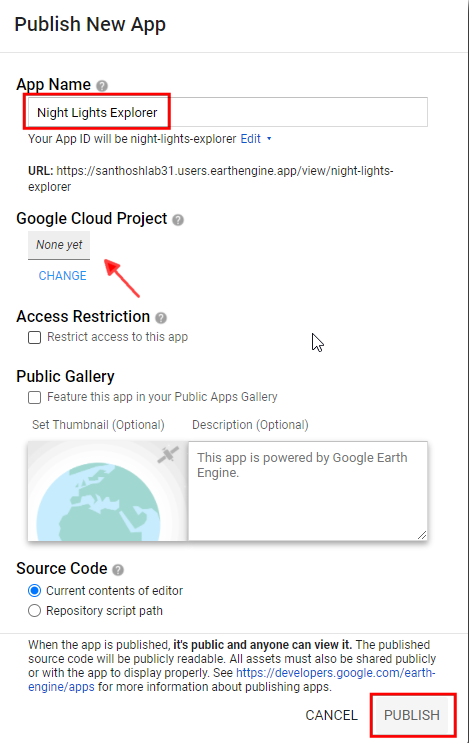
```

When prompted to *Choose a Cloud Project for your apps*, you can select *Create a new Cloud Project* and enter an unique id and click *Select*.

```{r echo=FALSE, fig.align='center', out.width='50%'}
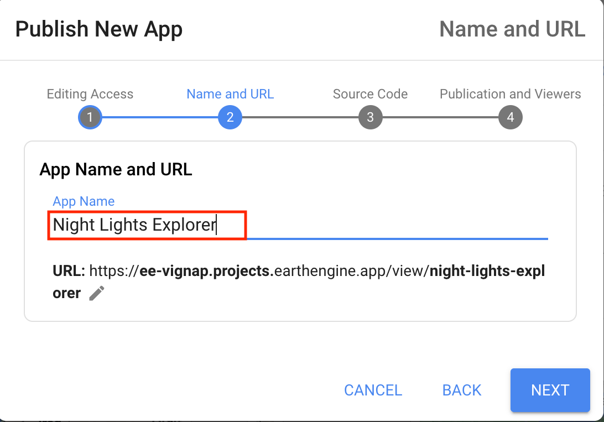
```

You may get an error asking you to accept the terms of service. Click the *Cloud Terms of Service* link and follow the instructions. Once done, click *OK*.

```{r echo=FALSE, fig.align='center', out.width='60%'}
knitr::include_graphics('images/end_to_end_gee/app6.png')
```

Back in the *Publish New App* dialog, leave all other settings to default and click *Publish*.


```{r echo=FALSE, fig.align='center', out.width='50%'}
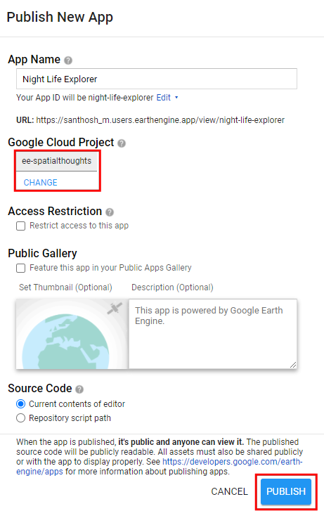
```

The app will be hosted on Google Cloud and you can access it by clicking on the *App Name* of your app in the *Manage Apps* dialog.

```{r echo=FALSE, fig.align='center', out.width='60%'}
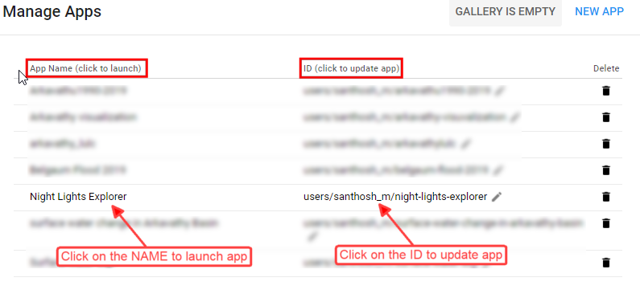
```

You will see your Earth Engine powered app running in the browser. Anyone can access and interact with the app by just visiting the App URL.

> The app publishing process takes a few minutes. So if you get an error that your app is not yet ready, check back in a few minutes.

```{r echo=FALSE, fig.align='center', out.width='100%'}
knitr::include_graphics('images/end_to_end_gee/app9.png')
```

### Exercise

```{js eval=FALSE}
// Exercise
// Add a button called 'Reset'
// Clicking the button should remove all loaded layers

// Hint: Use Map.clear() for removing the layers
```

## 03. Code Sharing and Script Modules

As your Earth Engine project grows, you need a way to organize and share your code to collaborate with others. We will learn some best practices on how best to set-up your project in Earth Engine.

### Sharing a Single Script

To share your code from a single script, you need to use the **Get Link** button in the code editor. As you click the button, the contents of your code editor is captured and encoded into a URL. When you share this URL with someone, they will be able see same content as your code editor. This is a great way to send a snapshot of your code so others can reproduce your output. Remember that the script links are just snapshots, if you change your code after sending the link to someone, they will not see the updates.


```{r echo=FALSE, fig.align='center', out.width='60%', fig.cap='Code Sharing using Get Link button'}
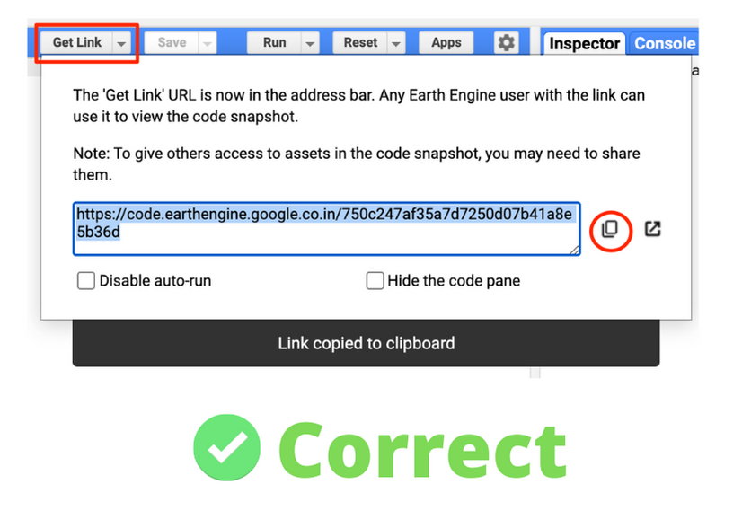
```

While sharing the script using *Get Link*, you should also share any private **Assets** that you may have uploaded and are using in the script. You can share the asset with a specific email address, or check the *Anyone can read* box if you want anyone with the script link to be able to access it. Failing to do so will prevent others to see your code, but they will not be able to run the script.


```{r echo=FALSE, fig.align='center', out.width='75%', fig.cap='Sharing Uploaded Assets'}
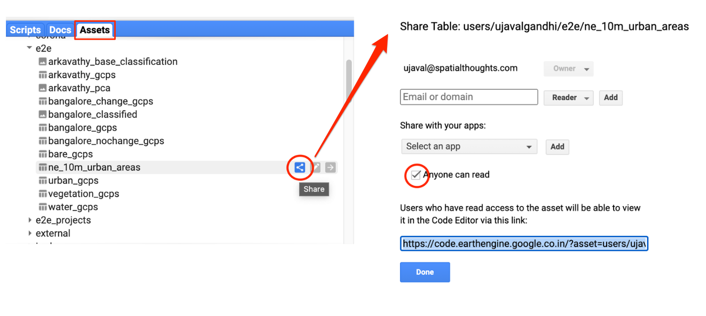
```

Learn more in the [Script links](https://developers.google.com/earth-engine/guides/playground#get-link) section of the Google Earth Engine User Guide.


### Sharing Multiple Scripts

If you want to share a collection of scripts with other users or your collaborators, the best way is to create a new **Repository**. 


```{r echo=FALSE, fig.align='center', out.width='40%', fig.cap='Creating New Repository'}
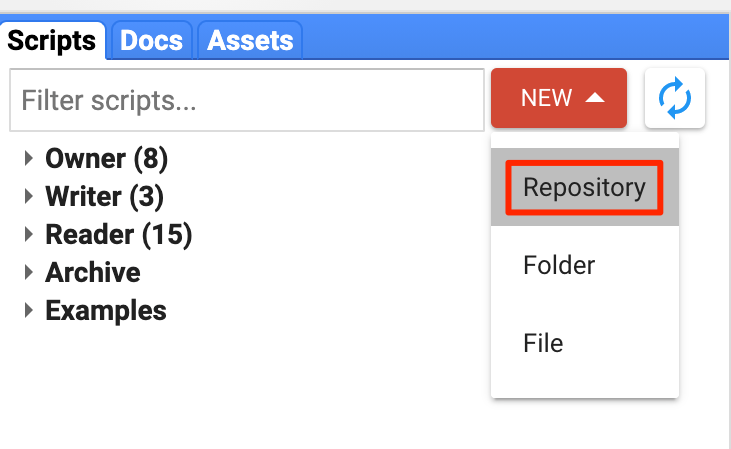
```

You can put multiple scripts within the repository and share the repository with other users. You can grant them **Reader** or **Writer** access so they can view/add/modify/delete scripts in that repository. If you want to make it readable by **Public**, you can check the *Anyone can read* option. You will see a URL in the form of `https://code.earthengine.google.co.in/?accept_repo=...`. When you share this URL with other users and they visit that link, your repository will be added to their Code Editor under the *Reader* or *Writer* folder depending on their access.

```{r echo=FALSE, fig.align='center', out.width='75%', fig.cap='Creating New Repository'}
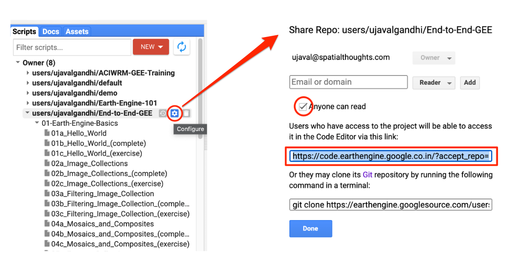
```

Learn more in the [Script Manager](https://developers.google.com/earth-engine/guides/playground#script-manager-scripts-tab) section of the Google Earth Engine User Guide.


### Sharing Code between Scripts

For a large project, it is preferable to share commonly used functions between scripts. That way, each script doesn't have to re-implement the same code. Earth Engine enables this using **Script Modules**. Using a special object called `exports`, you can expose a function to other scripts. Learn more in the [Script modules](https://developers.google.com/earth-engine/guides/playground#script-modules) section of the Google Earth Engine User Guide.

There are many Earth Engine users who have shared their repositories publicly and written script modules to perform a variety of tasks. Here's an example of using the `grid` module from the `users/gena/packages` repository to create regularly spaced grids in Earth Engine.

```{js eval=FALSE, code=readLines('code/end_to_end_gee/04-Earth-Engine-Advanced/03b_Code_Sharing_and_Script_Modules_(complete)')}
```

```{r echo=FALSE, fig.align='center', out.width='100%', fig.cap='Using a function from a script module'}
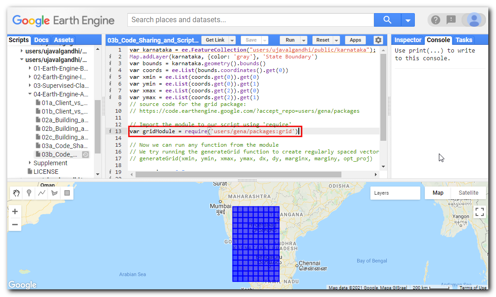
```

There is no centralized collection of public repositories. Here are a few selected modules, which have very useful functions to make you productive in Earth Engine.

* [geetools](https://github.com/fitoprincipe/geetools-code-editor/wiki): Tools for cloud masking, batch processing, and more
* [kongdd_packages](https://github.com/gee-hydro/gee_packages): Tools for  temporal interpolation, trend analysis, visualization and more
* [ee-palettes](https://github.com/gee-community/ee-palettes): Module for generating color palettes

## 05. Introduction to the Python API


```{r child='python_api_syntax.md'}
```

```{r echo=FALSE, fig.align='center', out.width='100%', fig.cap='Interactive leaflet map created using geemap'}
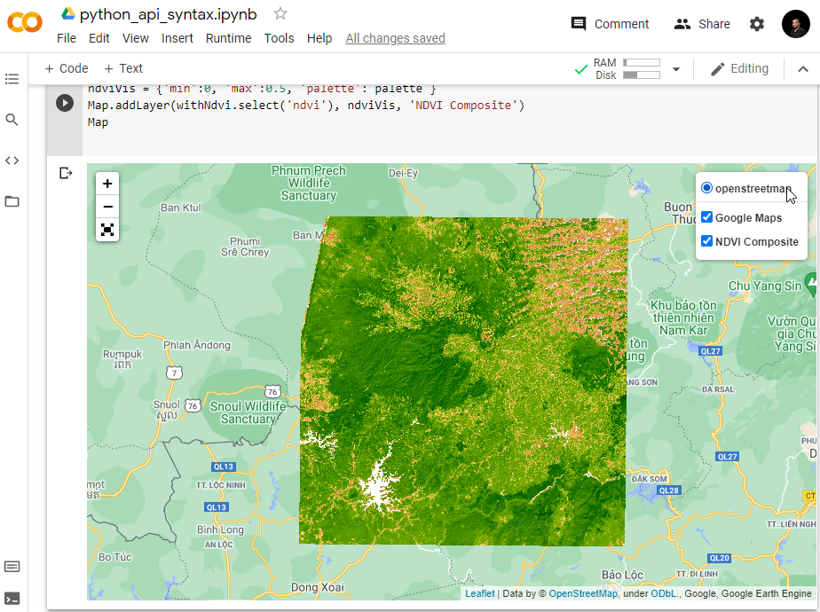
```

## 06. Exporting an ImageCollection 


```{r child='export_a_collection.md'}
```

```{r echo=FALSE, fig.align='center', out.width='100%', fig.cap='Launching multiple tasks using the  Python API'}
knitr::include_graphics('images/end_to_end_gee/exporting_a_collection.png')
```

\newpage

# Supplement

This section contains useful scripts and code snippets that can be adapted for your projects. 

## Advanced Supervised Classification Techniques

### Post-Processing Classification Results

Supervised classification results often contain salt-and-pepper noise caused by mis-classified pixels. It is usually preferable to apply some post-processing techniques to remove such noise. The following script contains the code for two popular techniques for post-processing classification results.

* Using un-supervised clustering to replacing classified value by majority value in each cluster.
* Replacing isolated pixels with surrounding value with a majority filter.

> Remember that the neighborhood methods are scale-dependent so the results will change as you zoom in/out. Export the results at the desired scale to see the effect of post-processing.


```{js eval=FALSE, code=readLines('code/end_to_end_gee/Supplement/Supervised_Classification/Post_Processing_Classification_Results')}
```

### Principal Component Analysis (PCA)

PCA is a very useful technique in improving your supervised classification results. This is a statistical technique that compresses data from a large number of bands into fewer uncorrelated bands. You can run PCA on your image and add the first few (typically 3) principal component bands to the original composite before sampling training points. In the example below, you will notice that 97% of the variance from the 13-band original image is captured in the 3-band PCA image. This sends a stronger signal to the classifier and improves accuracy by allowing it to distinguish different classes better.

```{js eval=FALSE, code=readLines('code/end_to_end_gee/Supplement/Supervised_Classification/Principal_Components_Analysis')}
```

### Multi-temporal Composites for Crop Classification

Crop classification is a difficult problem. A useful technique that aids in clear distinction of crops is to account for crop phenology. This technique can be applied to detect a specific type of crop or distinguish crops from other forms of vegetation. You can create composite images for different periods of the cropping cycle and create a stacked image to be used for classification. This allows the classifier to learn the temporal pattern and detect pixels that exhibit similar patterns.

```{js eval=FALSE, code=readLines('code/end_to_end_gee/Supplement/Supervised_Classification/Seasonal_Composites_for_Crop_Classification')}
```

### Calculating Area by Class

This code snippet shows how to use a [Grouped Reducer](https://developers.google.com/earth-engine/guides/reducers_grouping) to calculate area covered by each class in a classified image. It also shows how to use the `ui.Chart.image.byClass()` function to create a chart showing the area for each class.

```{js eval=FALSE, code=readLines('code/end_to_end_gee/Supplement/Supervised_Classification/Calculating_Area_by_Class')}
```


## User Interface Templates

\newpage

# Guided Projects

Below are step-by-step video-based walkthrough of implementing real-world projects using Earth Engine. You can continue their learning journey by implementing these projects for their region of interest after the class.

## Get the Code

1. [Click this link](https://code.earthengine.google.com/?accept_repo=users/ujavalgandhi/End-to-End-
Projects) to open Google Earth Engine code editor and add the repository to your account.
2. If successful, you will have a new repository named `users/ujavalgandhi/End-to-End-Projects` in the *Scripts* tab in the *Reader* section.


## Project 1: Drought Monitoring

Calculating Rainfall Deviation from the 30-year mean using CHIRPS Gridded Rainfall Data

[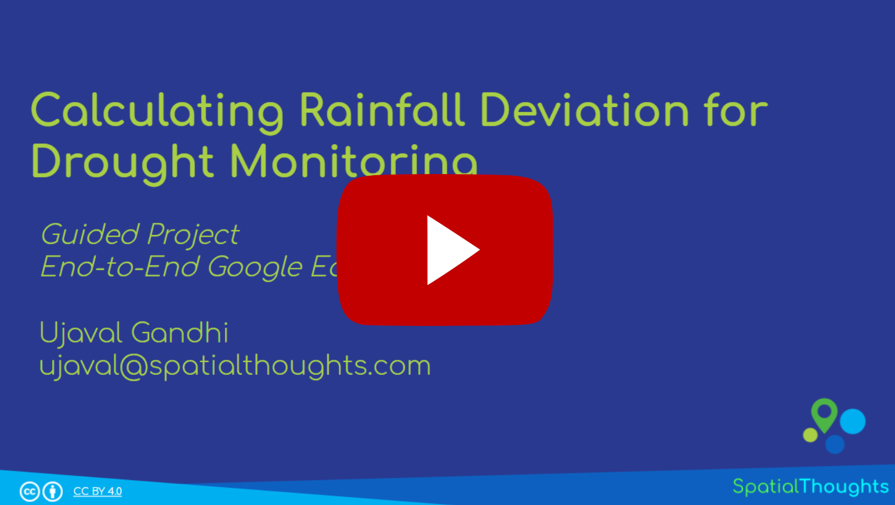{width="400px"}](https://www.youtube.com/watch?v=zHUCM3XLc6k&list=PLppGmFLhQ1HJ5VhW6BZfhPX6spUcTY7SR){target="_blank"}

[Start Guided Project](https://www.youtube.com/watch?v=zHUCM3XLc6k&list=PLppGmFLhQ1HJ5VhW6BZfhPX6spUcTY7SR){target="_blank"}


## Project 2: Flood Mapping

Rapid mapping of a flood using Sentinel-1 SAR Data.

[{width="400px"}](https://www.youtube.com/watch?v=jYsK9Y4ICrY&list=PLppGmFLhQ1HJzzKVS_4v8nBiXLYxAu100){target="_blank"}

[Start Guided Project](https://www.youtube.com/watch?v=jYsK9Y4ICrY&list=PLppGmFLhQ1HJzzKVS_4v8nBiXLYxAu100){target="_blank"}

## Project 3: Extracting Time-Series

Extracting a 10-year NDVI time-series over multiple polygons using MODIS data.

[{width="400px"}](https://www.youtube.com/watch?v=LqSClCXrMl4&list=PLppGmFLhQ1HJV1CctqanQvXQI1JmqGDDD){target="_blank"}

[Start Guided Project](https://www.youtube.com/watch?v=LqSClCXrMl4&list=PLppGmFLhQ1HJV1CctqanQvXQI1JmqGDDD){target="_blank"}

\newpage

# Learning Resources

* [Awesome Earth Engine](https://github.com/giswqs/Awesome-GEE): A curated list of Google Earth Engine resources.

# Data Credits

* `ne_10m_urban_areas.zip`: Urban Areas Shapefile. Downloaded from Natural Earth. Free vector and raster map data @ naturalearthdata.com.

# License

The course material (text, images, presentation, videos) is licensed under a [Creative Commons Attribution 4.0 International License](https://creativecommons.org/licenses/by/4.0/).

The code (scripts, Jupyter notebooks) is licensed under the MIT License. For a copy, see https://opensource.org/licenses/MIT

You are free to use the material for any purpose - even commercially. The license requires you give appropriate credit to the original author as below.

Copyright &copy; 2021 Ujaval Gandhi [www.spatialthoughts.com](https://spatialthoughts.com)

***

**This course is offered as an instructor-led online class. Visit [Spatial Thoughts](https://spatialthoughts.com/events/) to know details of upcoming sessions.**
