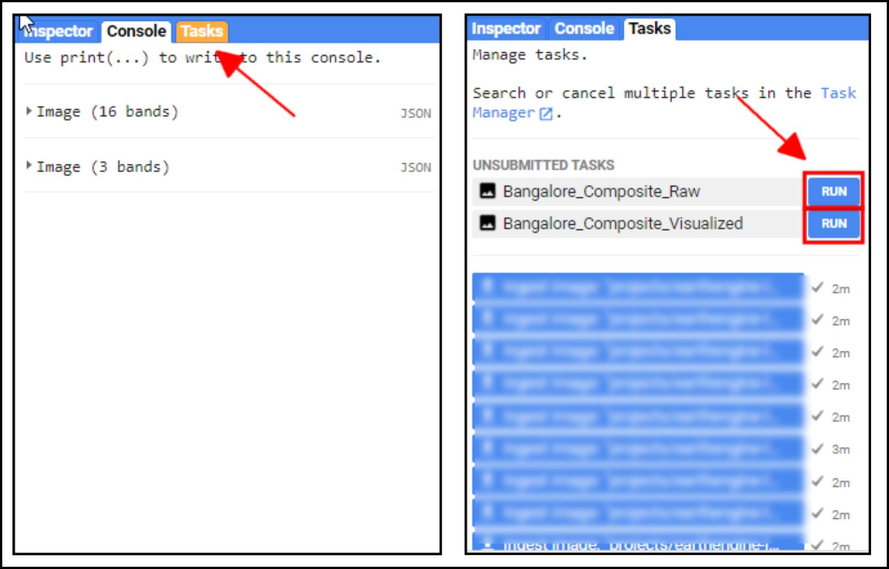
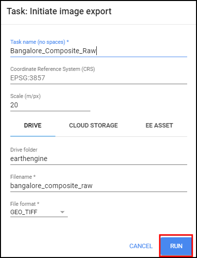
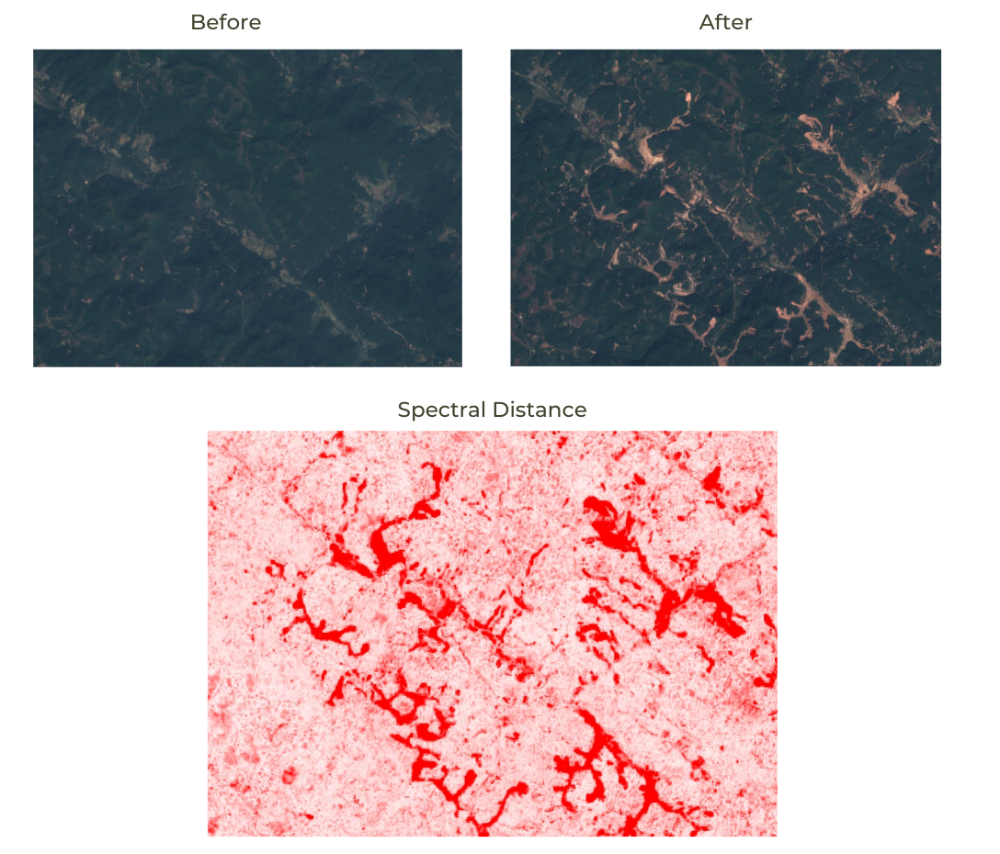
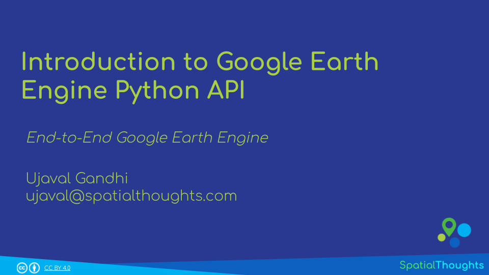
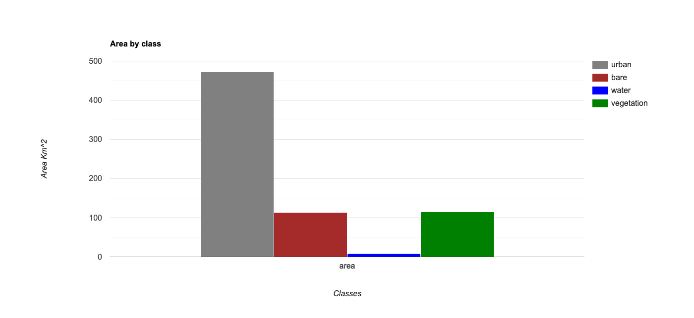
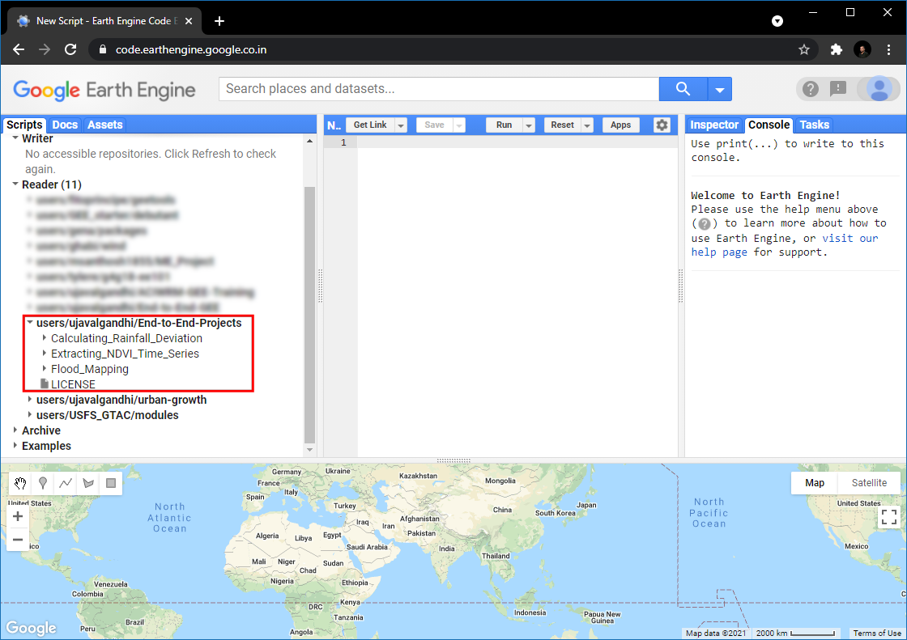
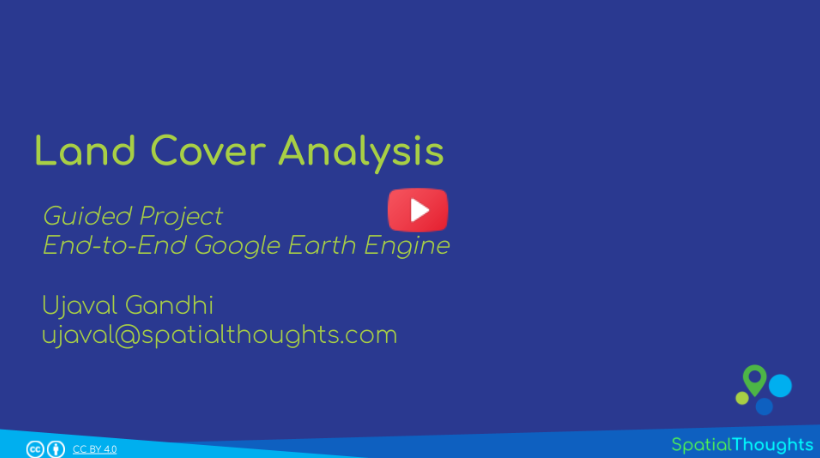

\newpage

***

```{r echo=FALSE, fig.align='center', out.width='75%', out.width='250pt'}
knitr::include_graphics('images/spatial_thoughts_logo.png')
```

***

\newpage

# Introduction 

Google Earth Engine is a cloud-based platform that enables large-scale processing of satellite imagery to detect changes, map trends, and quantify differences on the Earth’s surface. This course covers the full range of topics in Earth Engine to give the participants practical skills to master the platform and implement their remote sensing projects.

[{width="400px"}](https://docs.google.com/presentation/d/1q8HRDTqgQEp3Hmi8IG0T7djPLTC1wRig3jXrwFTmoVE/edit?usp=sharing){target="_blank"}

[View the Presentation &#8599;](https://docs.google.com/presentation/d/1q8HRDTqgQEp3Hmi8IG0T7djPLTC1wRig3jXrwFTmoVE/edit?usp=sharing){target="_blank"}

# Setting up the Environment

## Sign-up for Google Earth Engine

If you already have a Google Earth Engine account, you can skip this step.

Visit [https://signup.earthengine.google.com/](https://signup.earthengine.google.com/){target="_blank"} and sign-up with your Google account. You can use your existing gmail account to sign-up. It usually takes 1-2 days for approval. Hence do this step as soon as possible.

Tips to ensure smooth sign-up process:

- Use Google Chrome browser.
- When signing up for Earth Engine, please log out of all Google accounts and ensure you are logged into only 1 account which you want associated with Earth Engine. 
- Prefer using your university/organization email for signing up.
- Access to Google Earth Engine is granted via Google Groups. The default settings should be fine, but verify you have the correct setting enabled.
    - Visit [groups.google.com](http://groups.google.com/){target="_blank"}
    - Click on Settings (gear icon) and select Global Settings.
    - Make sure the option Allow group managers to add me to their groups is checked.

## Complete the Class Pre-Work

This class needs about 2-hours of pre-work. Please watch the following videos to get a good understanding of remote sensing and how Earth Engine works. Videos are available online and can be streamed using the video links below. 

### Introduction to Remote Sensing

This video introduces the remote sensing concepts, terminology and techniques. 

[{width="400px"}](https://www.youtube.com/watch?v=xAyNu9HbK8s){target="_blank"}

- [Watch the Video](https://www.youtube.com/watch?v=xAyNu9HbK8s){target="_blank"}
- [View the Presentation &#8599;](https://docs.google.com/presentation/d/1opRKXIV8XSMa5h7Gqw10KXY5nW7_khfdiBmyDEcylUE/edit?usp=sharing){target="_blank"}

### Introduction to Google Earth Engine

This video gives a broad overview of Google Earth Engine with selected case studies and application. The video also covers the Earth Engine architecture and how it is different than traditional remote sensing software.

[{width="400px"}](https://www.youtube.com/watch?v=kpfncBHZBto){target="_blank"}

- [Watch the Video](https://www.youtube.com/watch?v=kpfncBHZBto){target="_blank"}
- [View the Presentation &#8599;](https://docs.google.com/presentation/d/1RMyufK1bD7_Mj0b0Pub-CADiBsmT8LqyGMXIgem3UW4/edit?usp=sharing){target="_blank"}

### Take the Quizes

After you watch the videos, please complete the following 2 Quizzes

1. Quiz-1 [Remote Sensing Fundamentals](https://forms.gle/BoaYhMgpjwNn3amS8){target="_blank"}.
2. Quiz-2 [Google Earth Engine Fundamentals](https://forms.gle/pGVShApd9f6uVYR89){target="_blank"}.


## Get the Course Materials

The course material and exercises are in the form of Earth Engine scripts shared via a code repository.

1. [Click this link](https://code.earthengine.google.co.in/?accept_repo=users/ujavalgandhi/End-to-End-GEE) to open Google Earth Engine code editor and add the repository to your account.
2. If successful, you will have a new repository named `users/ujavalgandhi/End-to-End-GEE` in the *Scripts* tab in the *Reader* section.
3. Verify that your code editor looks like below

```{r echo=FALSE, fig.align='center', out.width='75%', fig.cap='Code Editor After Adding the Class Repository'}
knitr::include_graphics('images/end_to_end_gee/repository.png')
```

If you do not see the repository in the *Reader* section, click *Refresh repository cache* button in your *Scripts* tab and it will show up.

```{r echo=FALSE, fig.align='center', out.width='50%', fig.cap='Refresh repository cache'}
knitr::include_graphics('images/end_to_end_gee/repository_cache.png')
```


\newpage

# Module 1: Earth Engine Basics

Module 1 is designed to give you basic skills to be able to find datasets you need for your project, filter them to your region of interest, apply basic processing and export the results. Mastering this will allow you to start using Earth Engine for your project quickly and save a lot of time pre-processing the data.

## 01. Hello World

This script introduces the basic Javascript syntax and the video covers the programming concepts you need to learn when using Earth Engine. To learn more, visit [Introduction to JavaScript for Earth Engine](https://developers.google.com/earth-engine/tutorials/tutorial_js_01) section of the Earth Engine User Guide. 

[{width="400px"}](https://www.youtube.com/watch?v=RV3Sv5iogHs){target="_blank"}

- [Watch the Video](https://www.youtube.com/watch?v=RV3Sv5iogHs){target="_blank"}

The *Code Editor* is an Integrated Development Environment (IDE) for Earth Engine Javascript API.. It offers an easy way to type, debug, run and manage code. Type the code below and click *Run* to execute it and see the output in the *Console* tab.

> Tip: You can use the keyboard shortcut *Ctrl+Enter* to run the code in the Code Editor

```{r echo=FALSE, fig.align='center', out.width='75%', fig.cap='Hello World'}
knitr::include_graphics('images/end_to_end_gee/hello_world.png')
```

[Open in Code Editor &#8599;](https://code.earthengine.google.co.in/?scriptPath=users%2Fujavalgandhi%2FEnd-to-End-GEE%3A01-Earth-Engine-Basics%2F01b_Hello_World_(complete)){target="_blank"}

```{js eval=FALSE, code=readLines('code/end_to_end_gee/01-Earth-Engine-Basics/01b_Hello_World_(complete)')}
```


### Exercise


[Try in Code Editor &#8599;](https://code.earthengine.google.co.in/?scriptPath=users%2Fujavalgandhi%2FEnd-to-End-GEE%3A01-Earth-Engine-Basics%2F01c_Hello_World_(exercise)){target="_blank"}

```{js eval=FALSE, code=readLines('code/end_to_end_gee/01-Earth-Engine-Basics/01c_Hello_World_(exercise)')}
```

### Saving Your Work

When you modify any script for the course repository, you may want to save a copy for yourself. If you try to click the *Save* button, you will get an error message like below

```{r echo=FALSE, fig.align='center', out.width='75%'}
knitr::include_graphics('images/end_to_end_gee/setup1.png')
```

This is because the shared class repository is a *Read-only* repository. You can click *Yes* to save a copy in your repository. If this is the first time you are using Earth Engine, you will be prompted to choose a *Earth Engine username*. Choose the name carefully, as it cannot be changed once created.

```{r echo=FALSE, fig.align='center', out.width='50%'}
knitr::include_graphics('images/end_to_end_gee/setup2.png')
```

After entering your username, your home folder will be created. After that, you will be prompted to enter a new repository. A repository can help you organize and share code. Your account can have multiple repositories and each repository can have multiple scripts inside it. To get started, you can create a repository named *default*. Finally, you will be able to save the script.

## 02. Working with Image Collections

Most datasets in Earth Engine come as a `ImageCollection`. An ImageCollection is a dataset that consists of images takes at different time and locations - usually from the same satellite or data provider. You can load a collection by searching the [Earth Engine Data Catalog](https://developers.google.com/earth-engine/datasets) for the *ImageCollection ID*. Search for the *Sentinel-2 Level 1C* dataset and you will find its id `COPERNICUS/S2_SR`. Visit the [Sentinel-2, Level 1C page](https://developers.google.com/earth-engine/datasets/catalog/COPERNICUS_S2) and see *Explore in Earth Engine* section to find the code snippet to load and visualize the collection. This snippet is a great starting point for your work with this dataset. Click the **Copy Code Sample** button and paste the code into the code editor. Click *Run* and you will see the image tiles load in the map.


```{r echo=FALSE, fig.align='center', out.width='75%'}
knitr::include_graphics('images/end_to_end_gee/image_collection1.png')
```

In the code snippet, You will see a function `Map.setCenter()` which sets the viewport to a specific location and zoom level. The function takes the X coordinate (longitude), Y coordinate (latitude) and Zoom Level parameters. Replace the X and Y coordinates with the coordinates of your city and click *Run* to see the images of your city.

```{r echo=FALSE, fig.align='center', out.width='75%'}
knitr::include_graphics('images/end_to_end_gee/image_collection2.png')
```

### Exercise


[Try in Code Editor &#8599;](https://code.earthengine.google.co.in/?scriptPath=users%2Fujavalgandhi%2FEnd-to-End-GEE%3A01-Earth-Engine-Basics%2F02c_Image_Collections_(exercise)){target="_blank"}

```{js eval=FALSE, code=readLines('code/end_to_end_gee/01-Earth-Engine-Basics/02c_Image_Collections_(exercise)')}
```

## 03. Filtering Image Collections

The collection contains all imagery ever collected by the sensor. The entire collections are not very useful. Most applications require a subset of the images. We use **filters** to select the appropriate images. There are many types of filter functions, look at `ee.Filter...` module to see all available filters. Select a filter and then run the `filter()` function with the filter parameters. 

We will learn about 3 main types of filtering techniques

* **Filter by metadata**: You can apply a filter on the image metadata using filters such as `ee.Filter.eq()`, `ee.Filter.lt()` etc. You can filter by PATH/ROW values, Orbit number, Cloud cover etc.
* **Filter by date**: You can select images in a particular date range using filters such as `ee.Filter.date()`.
* **Filter by location**: You can select the subset of images with a bounding box, location or geometry using the `ee.Filter.bounds()`. You can also use the drawing tools to draw a geometry for filtering.

After applying the filters, you can use the `size()` function to check how many images match the filters.

```{r echo=FALSE, fig.align='center', out.width='75%'}
knitr::include_graphics('images/end_to_end_gee/filters.png')
```

[Open in Code Editor &#8599;](https://code.earthengine.google.co.in/?scriptPath=users%2Fujavalgandhi%2FEnd-to-End-GEE%3A01-Earth-Engine-Basics%2F03b_Filtering_Image_Collection_(complete)){target="_blank"}

```{js eval=FALSE, code=readLines('code/end_to_end_gee/01-Earth-Engine-Basics/03b_Filtering_Image_Collection_(complete)')}
```


### Exercise

[Try in Code Editor &#8599;](https://code.earthengine.google.co.in/?scriptPath=users%2Fujavalgandhi%2FEnd-to-End-GEE%3A01-Earth-Engine-Basics%2F03c_Filtering_Image_Collection_(exercise)){target="_blank"}

```{js eval=FALSE, code=readLines('code/end_to_end_gee/01-Earth-Engine-Basics/03c_Filtering_Image_Collection_(exercise)')}
```

## 04. Creating Mosaics and Composites from ImageCollections

The default order of the collection is by date. So when you display the collection, it implicitly creates a mosaic with the latest pixels on top. You can call `.mosaic()` on a ImageCollection to create a mosaic image from the pixels at the top.

We can also create a composite image by applying selection criteria to each pixel from all pixels in the stack. Here we use the `median()` function to create a composite where each pixel value is the median of all pixels from the stack.

> Tip: If you need to create a mosaic where the images are in a specific order, you can use the `.sort()` function to sort your collection by a property first.


```{r echo=FALSE, fig.align='center', out.width='100%', fig.cap='Mosaic vs. Composite'}
knitr::include_graphics('images/end_to_end_gee/mosaic_composite.png')
```

[Open in Code Editor &#8599;](https://code.earthengine.google.co.in/?scriptPath=users%2Fujavalgandhi%2FEnd-to-End-GEE%3A01-Earth-Engine-Basics%2F04b_Mosaics_and_Composites_(complete)){target="_blank"}

```{js eval=FALSE, code=readLines('code/end_to_end_gee/01-Earth-Engine-Basics/04b_Mosaics_and_Composites_(complete)')}
```


### Exercise

[Try in Code Editor &#8599;](https://code.earthengine.google.co.in/?scriptPath=users%2Fujavalgandhi%2FEnd-to-End-GEE%3A01-Earth-Engine-Basics%2F04c_Mosaics_and_Composites_(exercise)){target="_blank"}

```{js eval=FALSE}
// Create a median composite for the year 2020 and load it to the map

// Compare both the composites to see the changes in your city
```


## 05. Working with Feature Collections

Feature Collections are similar to Image Collections - but they contain *Features*, not images. They are equivalent to Vector Layers in a GIS. We can load, filter and display Feature Collections using similar techniques that we have learned so far. 

Search for *GAUL Second Level Administrative Boundaries* and load the collection. This is a global collection that contains all Admin2 boundaries. We can apply a filter using the `ADM1_NAME` property to get all Admin2 boundaries (i.e. Districts) from a state.

```{r echo=FALSE, fig.align='center', out.width='75%'}
knitr::include_graphics('images/end_to_end_gee/feature_collection.png')
```

[Open in Code Editor &#8599;](https://code.earthengine.google.co.in/?scriptPath=users%2Fujavalgandhi%2FEnd-to-End-GEE%3A01-Earth-Engine-Basics%2F05b_Feature_Collections_(complete)){target="_blank"}

```{js eval=FALSE, code=readLines('code/end_to_end_gee/01-Earth-Engine-Basics/05b_Feature_Collections_(complete)')}
```


### Exercise

[Try in Code Editor &#8599;](https://code.earthengine.google.co.in/?scriptPath=users%2Fujavalgandhi%2FEnd-to-End-GEE%3A01-Earth-Engine-Basics%2F05c_Feature_Collections_(exercise)){target="_blank"}

```{js eval=FALSE, code=readLines('code/end_to_end_gee/01-Earth-Engine-Basics/05c_Feature_Collections_(exercise)')}
```

## 06. Importing Data

You can import vector or raster data into Earth Engine. We will now import a shapefile of [Urban Areas](https://www.naturalearthdata.com/downloads/10m-cultural-vectors/10m-urban-area/) for Natural Earth. Unzip the `ne_10m_urban_areas.zip` into a folder on your computer. In the Code Editor, go to *Assets &rarr; New &rarr; Table Upload &rarr; Shape Files*. Select the `.shp`, `.shx`, `.dbf` and .`prj` files. Enter `ne_10m_urban_areas` as the *Asset Name* and click  *Upload*. Once the upload and ingest finishes, you will have a new asset in the *Assets* tab. The shapefile is imported as a Feature Collection in Earth Engine. Select the `ne_10m_urban_areas` asset and click *Import*.  You can then visualize the imported data.


```{r echo=FALSE, fig.align='center', out.width='75%', fig.cap='Importing a Shapefile'}
knitr::include_graphics('images/end_to_end_gee/import.png')
```

[Open in Code Editor &#8599;](https://code.earthengine.google.co.in/?scriptPath=users%2Fujavalgandhi%2FEnd-to-End-GEE%3A01-Earth-Engine-Basics%2F06b_Import_(complete)){target="_blank"}

```{js eval=FALSE, code=readLines('code/end_to_end_gee/01-Earth-Engine-Basics/06b_Import_(complete)')}
```


### Exercise

[Try in Code Editor &#8599;](https://code.earthengine.google.co.in/?scriptPath=users%2Fujavalgandhi%2FEnd-to-End-GEE%3A01-Earth-Engine-Basics%2F06c_Import_(exercise)){target="_blank"}


```{js eval=FALSE, code=readLines('code/end_to_end_gee/01-Earth-Engine-Basics/06c_Import_(exercise)')}
```

## 07. Clipping Images

It is often desirable to clip the images to your area of interest. You can use the `clip()` function to mask out an image using a geometry.

> While in a Desktop software, clipping is desirable to remove unnecessary portion of a large image and save computation time, in Earth Engine clipping can actually increase the computation time. As described in the [Earth Engine Coding Best Practices](https://developers.google.com/earth-engine/guides/best_practices?hl=en#if-you-dont-need-to-clip,-dont-use-clip) guide, avoid clipping the images or do it at the end of your script.


```{r echo=FALSE, fig.align='center', out.width='100%', fig.cap='Original vs. Clipped Image'}
knitr::include_graphics('images/end_to_end_gee/clipping.png')
```

[Open in Code Editor &#8599;](https://code.earthengine.google.co.in/?scriptPath=users%2Fujavalgandhi%2FEnd-to-End-GEE%3A01-Earth-Engine-Basics%2F07b_Clipping_(complete)){target="_blank"}

```{js eval=FALSE, code=readLines('code/end_to_end_gee/01-Earth-Engine-Basics/07b_Clipping_(complete)')}
```

### Exercise


[Try in Code Editor &#8599;](https://code.earthengine.google.co.in/?scriptPath=users%2Fujavalgandhi%2FEnd-to-End-GEE%3A01-Earth-Engine-Basics%2F07c_Clipping_(exercise)){target="_blank"}


```{js eval=FALSE}
// Add the imported table to the Map
// Use the Inspector to find the id of your home city or any urban area of your choice
// Change the filter to use the id of the selected feature
```

## 08. Exporting Data

Earth Engine allows for exporting both vector and raster data to be used in an external program. Vector data can be exported as a `CSV` or a `Shapefile`, while Rasters can be exported as `GeoTIFF` files. We will now export the Sentinel-2 Composite as a GeoTIFF file.

> Tip: Code Editor supports autocompletion of API functions using the combination *Ctrl+Space*. Type a few characters of a function and press *Ctrl+Space* to see autocomplete suggestions. You can also use the same key combination to fill all parameters of the function automatically.

Once you run this script, the *Tasks* tab will be highlighted. Switch to the tab and you will see the tasks waiting. Click *Run* next to each task to start the process.  

```{r echo=FALSE, fig.align='center', out.width='75%'}

```

On clicking the *Run* button, you will be prompted for a confirmation dialog. Verify the settings and click *Run* to start the export.

```{r echo=FALSE, fig.align='center', out.width='40%'}

```

Once the Export finishes, a GeoTiff file for each export task will be added to your Google Drive in the specified folder. You can download them and use it in a GIS software.

```{r echo=FALSE, fig.align='center', out.width='75%'}
knitr::include_graphics('images/end_to_end_gee/exporting_data.png')
```

[Open in Code Editor &#8599;](https://code.earthengine.google.co.in/?scriptPath=users%2Fujavalgandhi%2FEnd-to-End-GEE%3A01-Earth-Engine-Basics%2F08b_Export_(complete)){target="_blank"}

```{js eval=FALSE, code=readLines('code/end_to_end_gee/01-Earth-Engine-Basics/08b_Export_(complete)')}
```

### Exercise


[Try in Code Editor &#8599;](https://code.earthengine.google.co.in/?scriptPath=users%2Fujavalgandhi%2FEnd-to-End-GEE%3A01-Earth-Engine-Basics%2F08c_Export_(exercise)){target="_blank"}

```{js eval=FALSE}

// Write the export function to export the results for your chosen urban area
```

## Assignment 1

Load the Night Lights Data for 2019 and 2020. Compare the imagery for your region and find the changes in the city. 

```{r echo=FALSE, fig.align='center', out.width='75%', fig.cap='Assignment1 Expected Output'}
knitr::include_graphics('images/end_to_end_gee/assignment1.png')
```

[Try in Code Editor &#8599;](https://code.earthengine.google.co.in/?scriptPath=users%2Fujavalgandhi%2FEnd-to-End-GEE%3A01-Earth-Engine-Basics%2FAssignment1){target="_blank"}

```{js eval=FALSE, code=readLines('code/end_to_end_gee/01-Earth-Engine-Basics/Assignment1')}
```


\newpage

# Module 2: Earth Engine Intermediate

Module 2 builds on the basic Earth Engine skills you have gained. This model introduces the parallel programming concepts using Map/Reduce - which is key in effectively using Earth Engine for analyzing large volumes of data. You will learn how to use the Earth Engine API for calculating various spectral indices, do cloud masking and then use map/reduce to do apply these computations to collections of imagery. You will also learn how to take long time-series of data and create charts.

[{width="400px"}](https://docs.google.com/presentation/d/10qOyxhubkwnsAVjniW54ETgwUHq3DXYKo3HGb6Gemi0/edit?usp=sharing){target="_blank"}

[View the Presentation &#8599;](https://docs.google.com/presentation/d/10qOyxhubkwnsAVjniW54ETgwUHq3DXYKo3HGb6Gemi0/edit?usp=sharing){target="_blank"}

## 01. Earth Engine Objects

This script introduces the basics of the Earth Engine API. When programming in Earth Engine, you must use the Earth Engine API so that your computations can use the Google Earth Engine servers. To learn more, visit [Earth Engine Objects and Methods](https://developers.google.com/earth-engine/tutorial_js_02) section of the Earth Engine User Guide. 

[Open in Code Editor &#8599;](https://code.earthengine.google.co.in/?scriptPath=users%2Fujavalgandhi%2FEnd-to-End-GEE%3A02-Earth-Engine-Intermediate%2F01b_Earth_Engine_Objects_(complete)){target="_blank"}

```{js eval=FALSE, code=readLines('code/end_to_end_gee/02-Earth-Engine-Intermediate/01b_Earth_Engine_Objects_(complete)')}
```


> As a general rule, you should always use Earth Engine API methods in your code, there is one exception where you will need to use client-side Javascript method. If you want to get the current time, the server doesn't know your time. You need to use javascript method and cast it to an Earth Engine object.
  ```
  var now = Date.now()
  print(now)
  var now = ee.Date(now)
  print(now)
  ```

### Exercise


[Try in Code Editor &#8599;](https://code.earthengine.google.co.in/?scriptPath=users%2Fujavalgandhi%2FEnd-to-End-GEE%3A02-Earth-Engine-Intermediate%2F01c_Earth_Engine_Objects_(exercise)){target="_blank"}

```{js eval=FALSE, code=readLines('code/end_to_end_gee/02-Earth-Engine-Intermediate/01c_Earth_Engine_Objects_(exercise)')}
```

## 02. Calculating Indices

Spectral Indices are central to many aspects of remote sensing. Whether you are studying vegetation or tracking fires - you will need to compute a pixel-wise ratio of 2 or more bands. The most commonly used formula for calculating an index is the *Normalized Difference* between 2 bands. Earth Engine provides a helper function `normalizedDifference()` to help calculate normalized indices, such as Normalized Difference Vegetation Index (NDVI). For more complex formulae, you can also use the `expression()` function to describe the calculation.

```{r echo=FALSE, fig.align='center', out.width='75%', fig.cap='MNDWI, SAVI and NDVI images'}
knitr::include_graphics('images/end_to_end_gee/indices.png')
```

[Open in Code Editor &#8599;](https://code.earthengine.google.co.in/?scriptPath=users%2Fujavalgandhi%2FEnd-to-End-GEE%3A02-Earth-Engine-Intermediate%2F02b_Calculating_Indices_(complete)){target="_blank"}

```{js eval=FALSE, code=readLines('code/end_to_end_gee/02-Earth-Engine-Intermediate/02b_Calculating_Indices_(complete)')}
```


### Exercise


[Try in Code Editor &#8599;](https://code.earthengine.google.co.in/?scriptPath=users%2Fujavalgandhi%2FEnd-to-End-GEE%3A02-Earth-Engine-Intermediate%2F02c_Calculating_Indices_(exercise)){target="_blank"}

```{js eval=FALSE, code=readLines('code/end_to_end_gee/02-Earth-Engine-Intermediate/02c_Calculating_Indices_(exercise)')}
```

## 03. Computation on ImageCollections

So far we have learnt how to run computation on single images. If you want to apply some computation - such as calculating an index - to many images, you need to use `map()`. You first define a function that takes 1 image and returns the result of the computation on that image. Then you can `map()` that function over the ImageCollection which results in a new ImageCollection with the results of the computation. This is similar to a *for-loop* that you maybe familiar with - but using `map()` allows the computation to run in parallel. Learn more at [Mapping over an ImageCollection](https://developers.google.com/earth-engine/guides/ic_mapping)

```{r echo=FALSE, fig.align='center', out.width='100%', fig.cap='NDVI computation on an ImageCollection'}
knitr::include_graphics('images/end_to_end_gee/imagecollection_computation.png')
```

[Open in Code Editor &#8599;](https://code.earthengine.google.co.in/?scriptPath=users%2Fujavalgandhi%2FEnd-to-End-GEE%3A02-Earth-Engine-Intermediate%2F03b_Computation_on_Image_Collections_(complete)){target="_blank"}

```{js eval=FALSE, code=readLines('code/end_to_end_gee/02-Earth-Engine-Intermediate/03b_Computation_on_Image_Collections_(complete)')}
```

### Exercise

[Try in Code Editor &#8599;](https://code.earthengine.google.co.in/?scriptPath=users%2Fujavalgandhi%2FEnd-to-End-GEE%3A02-Earth-Engine-Intermediate%2F03c_Computation_on_Image_Collections_(exercise)){target="_blank"}

```{js eval=FALSE, code=readLines('code/end_to_end_gee/02-Earth-Engine-Intermediate/03c_Computation_on_Image_Collections_(exercise)')}
```

## 04. Cloud Masking

Masking pixels in an image makes those pixels transparent and excludes them from analysis and visualization. To mask an image, we can use the `updateMask()` function and pass it an image with 0 and 1 values. All pixels where the mask image is 0 will be masked.

Most remote sensing datasets come with a QA or Cloud Mask band that contains the information on whether pixels is cloudy or not. Your *Code Editor* contains pre-defined functions for masking clouds for popular datasets under *Scripts Tab &rarr; Examples &rarr; Cloud Masking*. To understand how cloud-masking functions work and learn advanced techniques for bitmasking, please refer to our article on [Working with QA Bands and Bitmasks in Google Earth Engine
](https://spatialthoughts.com/2021/08/19/qa-bands-bitmasks-gee/).

The script below takes the Sentinel-2 masking function and shows how to apply it on an image.


```{r echo=FALSE, fig.align='center', out.width='100%', fig.cap='Applying pixel-wise QA bitmask'}
knitr::include_graphics('images/end_to_end_gee/cloud_masking.png')
```

[Open in Code Editor &#8599;](https://code.earthengine.google.co.in/?scriptPath=users%2Fujavalgandhi%2FEnd-to-End-GEE%3A02-Earth-Engine-Intermediate%2F04b_Cloud_Masking_(complete)){target="_blank"}

```{js eval=FALSE, code=readLines('code/end_to_end_gee/02-Earth-Engine-Intermediate/04b_Cloud_Masking_(complete)')}
```

### Exercise


[Try in Code Editor &#8599;](https://code.earthengine.google.co.in/?scriptPath=users%2Fujavalgandhi%2FEnd-to-End-GEE%3A02-Earth-Engine-Intermediate%2F04c_Cloud_Masking_(exercise)){target="_blank"}


```{js eval=FALSE, code=readLines('code/end_to_end_gee/02-Earth-Engine-Intermediate/04c_Cloud_Masking_(exercise)')}
```

> If you are using Sentinel-2 data, do check out the an alternative cloud masking techninque using the *S2 Cloudless* dataset. [Learn more](https://medium.com/google-earth/more-accurate-and-flexible-cloud-masking-for-sentinel-2-images-766897a9ba5f)
  ```
  var imageSR = ee.Image('COPERNICUS/S2_SR/20190703T050701_20190703T052312_T43PGP')
  var s2Cloudless = ee.Image('COPERNICUS/S2_CLOUD_PROBABILITY/20190703T050701_20190703T052312_T43PGP')
  var clouds = s2Cloudless.lt(50)
  var cloudlessMasked = imageSR.mask(clouds)
  var rgbVis = {min: 0.0, max: 3000, bands: ['B4', 'B3', 'B2']};
  Map.addLayer(cloudlessMasked, rgbVis, 'S2 Cloudless Masked Image')
  ```

## 05. Reducers

When writing parallel computing code, a *Reduce* operation allows you to compute statistics on a large amount of inputs. In Earth Engine, you need to run reduction operation when creating composites, calculating statistics, doing regression analysis etc. The Earth Engine API comes with a large number of built-in reducer functions (such as `ee.Reducer.sum()`, `ee.Reducer.histogram()`, `ee.Reducer.linearFit()` etc.) that can perform a variety of statistical operations on input data. You can run reducers using the `reduce()` function. Earth Engine supports running reducers on all data structures that can hold multiple values, such as Images (reducers run on different bands), ImageCollection, FeatureCollection, List, Dictionary etc. The script below introduces basic concepts related to reducers.

[Open in Code Editor &#8599;](https://code.earthengine.google.co.in/?scriptPath=users%2Fujavalgandhi%2FEnd-to-End-GEE%3A02-Earth-Engine-Intermediate%2F05b_Reducers_(complete)){target="_blank"}

```{js eval=FALSE, code=readLines('code/end_to_end_gee/02-Earth-Engine-Intermediate/05b_Reducers_(complete)')}
```


### Exercise


[Try in Code Editor &#8599;](https://code.earthengine.google.co.in/?scriptPath=users%2Fujavalgandhi%2FEnd-to-End-GEE%3A02-Earth-Engine-Intermediate%2F05c_Reducers_(exercise)){target="_blank"}


```{js eval=FALSE, code=readLines('code/end_to_end_gee/02-Earth-Engine-Intermediate/05c_Reducers_(exercise)')}
```

## 06. Time-Series Charts

Now we can put together all the skills we have learnt so far - filter, map, reduce, and cloud-masking to create a chart of average NDVI values for a given farm over 1 year. Earth Engine API comes with support for charting functions based on the Google Chart API. Here we use the `ui.Chart.image.series()` function to create a time-series chart.


```{r echo=FALSE, fig.align='center', out.width='100%', fig.cap='Computing NDVI Time-series for a Farm'}
knitr::include_graphics('images/end_to_end_gee/charts1.png')
```

```{r echo=FALSE, fig.align='center', out.width='100%', fig.cap='NDVI Time-series showing Dual-Cropping Cycle'}
knitr::include_graphics('images/end_to_end_gee/charts2.png')
```

[Open in Code Editor &#8599;](https://code.earthengine.google.co.in/?scriptPath=users%2Fujavalgandhi%2FEnd-to-End-GEE%3A02-Earth-Engine-Intermediate%2F06b_Time_Series_Charts_(complete)){target="_blank"}

```{js eval=FALSE, code=readLines('code/end_to_end_gee/02-Earth-Engine-Intermediate/06b_Time_Series_Charts_(complete)')}
```


### Exercise


[Try in Code Editor &#8599;](https://code.earthengine.google.co.in/?scriptPath=users%2Fujavalgandhi%2FEnd-to-End-GEE%3A02-Earth-Engine-Intermediate%2F06c_Time_Series_Charts_(exercise)){target="_blank"}

```{js eval=FALSE}
// Delete the farm boundary from the previous script 
// and add another farm at a location of your choice

// Print the chart.
```

## Assignment 2

```{r echo=FALSE, fig.align='center', out.width='75%', fig.cap='Assignment2 Expected Output'}
knitr::include_graphics('images/end_to_end_gee/assignment2.png')
```

[Try in Code Editor &#8599;](https://code.earthengine.google.co.in/?scriptPath=users%2Fujavalgandhi%2FEnd-to-End-GEE%3A02-Earth-Engine-Intermediate%2FAssignment2){target="_blank"}

```{js eval=FALSE, code=readLines('code/end_to_end_gee/02-Earth-Engine-Intermediate/Assignment2')}
```


\newpage


# Module 3: Supervised Classification

## Introduction to Machine Learning and Supervised Classification

Supervised classification is arguably the most important classical machine learning techniques in remote sensing. Applications range from generating Land Use/Land Cover maps to change detection. Google Earth Engine is unique suited to do supervised classification at scale. The interactive nature of Earth Engine development allows for iterative development of supervised classification workflows by combining many different datasets into the model. This module covers basic supervised classification workflow, accuracy assessment, hyperparameter tuning and change detection.

[{width="400px"}](https://docs.google.com/presentation/d/19L1b5vsxb38xS8GlHNKOjvPZ0IGqDhv93681btMEL5w/edit?usp=sharing){target="_blank"}

[View the Presentation &#8599;](https://docs.google.com/presentation/d/19L1b5vsxb38xS8GlHNKOjvPZ0IGqDhv93681btMEL5w/edit?usp=sharing){target="_blank"}


## 01. Basic Supervised Classification

We will learn how to do a basic land cover classification using training samples collected from the Code Editor using the High Resolution basemap imagery provided by Google Maps. This method requires no prior training data and is quite effective to generate high quality classification samples anywhere in the world. The goal is to classify each source pixel into one of the following classes - urban, bare, water or vegetation. Using the drawing tools in the code editor, you create 4 new feature collection with points representing pixels of that class. Each feature collection has a property called `landcover` with values of 0, 1, 2 or 3 indicating whether the feature collection represents urban, bare, water or vegetation respectively. We then train a *Random Forest* classifier using these training set to build a model and apply it to all the pixels of the image to create a 4 class image.

> Fun fact: The classifiers in Earth Engine API have names starting with **smile** - such as `ee.Classifier.smileRandomForest()`. The *smile* part refers to the [Statistical Machine Intelligence and Learning Engine (SMILE)](https://haifengl.github.io/index.html) JAVA library which is used by Google Earth Engine to implement these algorithms.

```{r echo=FALSE, fig.align='center', out.width='75%', fig.cap='Supervised Classification Output'}
knitr::include_graphics('images/end_to_end_gee/classified.png')
```

[Open in Code Editor &#8599;](https://code.earthengine.google.co.in/?scriptPath=users%2Fujavalgandhi%2FEnd-to-End-GEE%3A03-Supervised-Classification%2F01d_Basic_Supervised_Classification_(noimport)){target="_blank"}


```{js eval=FALSE, code=readLines('code/end_to_end_gee/03-Supervised-Classification/01d_Basic_Supervised_Classification_(noimport)')}
```


### Exercise

[Try in Code Editor &#8599;](https://code.earthengine.google.co.in/?scriptPath=users%2Fujavalgandhi%2FEnd-to-End-GEE%3A03-Supervised-Classification%2F01c_Basic_Supervised_Classification_(exercise)){target="_blank"}

```{js eval=FALSE, code=readLines('code/end_to_end_gee/03-Supervised-Classification/01c_Basic_Supervised_Classification_(exercise)')}
```

## 02. Accuracy Assessment

It is important to get a quantitative estimate of the accuracy of the classification. To do this, a common strategy is to divide your training samples into 2 random fractions - one used for *training* the model and the other for *validation* of the predictions. Once a classifier is trained, it can be used to classify the entire image. We can then compare the classified values with the ones in the validation fraction. We can use the `ee.Classifier.confusionMatrix()` method to calculate a *Confusion Matrix* representing expected accuracy.

Classification results are evaluated based on the following metrics

* **Overall Accuracy**: How many samples were classified correctly.
* **Producer’s Accuracy**: How well did the classification predict each class.
* **Consumer’s Accuracy (Reliability)**: How reliable is the prediction in each class.
* **Kappa Coefficient**: How well the classification performed as compared to random assignment.

```{r echo=FALSE, fig.align='center', out.width='75%', fig.cap='Accuracy Assessment'}
knitr::include_graphics('images/end_to_end_gee/accuracy_assessment.png')
```

> Don't get carried away tweaking your model to give you the highest validation accuracy. You must use both qualitative measures (such as visual inspection of results) along with quantitative measures to assess the results. 


[Open in Code Editor &#8599;](https://code.earthengine.google.co.in/?scriptPath=users%2Fujavalgandhi%2FEnd-to-End-GEE%3A03-Supervised-Classification%2F02b_Accuracy_Assessment_(complete)){target="_blank"}

```{js eval=FALSE, code=readLines('code/end_to_end_gee/03-Supervised-Classification/02b_Accuracy_Assessment_(complete)')}
```

### Exercise

[Try in Code Editor &#8599;](https://code.earthengine.google.co.in/?scriptPath=users%2Fujavalgandhi%2FEnd-to-End-GEE%3A03-Supervised-Classification%2F02c_Accuracy_Assessment_(exercise)){target="_blank"}

```{js eval=FALSE, code=readLines('code/end_to_end_gee/03-Supervised-Classification/02c_Accuracy_Assessment_(exercise)')}
```

## 03. Improving the Classification

The Earth Engine data-model is especially well suited for machine learning tasks because of its ability to easily incorporate data sources of different spatial resolutions, projections and data types together By giving additional information to the classifier, it is able to separate different classes easily. Here we take the same example and augment it with the following techniques

* *Apply Cloud Masking*
* *Add Spectral Indices*: We add bands for different spectral indices such as - NDVI, NDBI, MNDWI and BSI. 
* *Add Elevation and Slope*: We also add slope and elevation bands from the ALOS DEM. 
* *Normalize the Inputs*: Machine learning models work best when all the inputs have the same scale. We will divide each band with the maximum value. This method ensures that all input values are between 0-1. A more [complete and robust technique](#image-normalization-and-standardization) for image normalization is provided in the course Supplement.

Our training features have more parameters and contain values of the same scale. The result is a much improved classification.


```{r echo=FALSE, fig.align='center', out.width='75%', fig.cap='Improved Classification Accuracy with use of Spectral Indices and Elevation Data'}
knitr::include_graphics('images/end_to_end_gee/improving_classification.png')
```


[Open in Code Editor &#8599;](https://code.earthengine.google.co.in/?scriptPath=users%2Fujavalgandhi%2FEnd-to-End-GEE%3A03-Supervised-Classification%2F03b_Improving_the_Classification_(complete)){target="_blank"}


```{js eval=FALSE, code=readLines('code/end_to_end_gee/03-Supervised-Classification/03b_Improving_the_Classification_(complete)')}
```

### Exercise

[Try in Code Editor &#8599;](https://code.earthengine.google.co.in/?scriptPath=users%2Fujavalgandhi%2FEnd-to-End-GEE%3A03-Supervised-Classification%2F03c_Improving_the_Classification_(exercise)){target="_blank"}

```{js eval=FALSE, code=readLines('code/end_to_end_gee/03-Supervised-Classification/03c_Improving_the_Classification_(exercise)')}
```

## 04. Exporting Classification Results

When working with complex classifiers over large regions, you may get a *User memory limit exceeded* or *Computation timed out* error in the Code Editor. The reason for this is that there is a fixed time limit and smaller memory allocated for code that is run with the *On-Demand Computation* mode. For larger computations, you can use the *Batch* mode with the `Export` functions. Exports run in the background and can run longer than 5-minutes time allocated to the computation code run from the Code Editor. This allows you to process very large and complex datasets. Here's an example showing how to export your classification results to Google Drive.

> We can only export Images or FeatureCollections. What if you wanted to export a number that is the result of a long computation? A useful *hack* is to create a FeatureCollection with just 1 feature containing `null` geometry and a property containing the number you want to export.

```{r echo=FALSE, fig.align='center', out.width='75%', fig.cap='Exported Classification Outputs'}
knitr::include_graphics('images/end_to_end_gee/export_classification.png')
```

[Open in Code Editor &#8599;](https://code.earthengine.google.co.in/?scriptPath=users%2Fujavalgandhi%2FEnd-to-End-GEE%3A03-Supervised-Classification%2F04b_Exporting_Classification_Results_(complete)){target="_blank"}

```{js eval=FALSE, code=readLines('code/end_to_end_gee/03-Supervised-Classification/04b_Exporting_Classification_Results_(complete)')}
```

### Exercise


It is also a good idea to export the classified image as an Asset. This will allows you to import the classified image in another script without running the whole classification workflow. Use the Export.image.toAsset() function to export the classified image as an asset.

[Try in Code Editor &#8599;](https://code.earthengine.google.co.in/?scriptPath=users%2Fujavalgandhi%2FEnd-to-End-GEE%3A03-Supervised-Classification%2F04c_Exporting_Classification_Results_(exercise)){target="_blank"}

```{js eval=FALSE, code=readLines('code/end_to_end_gee/03-Supervised-Classification/04c_Exporting_Classification_Results_(exercise)')}
```

## 05. Calculating Area

Now that we have the results of our classification, we will learn how to calculate the area for pixels in each class. Calculating area for features is done using the `area()` function and for images using the `ee.Image.pixelArea()` function. The `ee.Image.pixelArea()` function creates an image where each pixel's value is the area of the pixel. We multiply this pixel area image with our image and sum up the area using the `reduceRegion()` function.

> The `ee.Image.pixelArea()` function uses a custom equal-area projection for area calculation. The result is area in square meters regardless of the projection of the input image. [Learn more](https://groups.google.com/g/google-earth-engine-developers/c/Ccaorx-obVw/m/_ZQdP2wVAgAJ)


```{r echo=FALSE, fig.align='center', out.width='75%', fig.cap='Calculating Green Cover from Classified Image'}
knitr::include_graphics('images/end_to_end_gee/area_calculation.png')
```

[Open in Code Editor &#8599;](https://code.earthengine.google.co.in/?scriptPath=users%2Fujavalgandhi%2FEnd-to-End-GEE%3A03-Supervised-Classification%2F05b_Calculating_Area_(complete)){target="_blank"}

```{js eval=FALSE, code=readLines('code/end_to_end_gee/03-Supervised-Classification/05b_Calculating_Area_(complete)')}
```

> If you want to compute area covered by each class, you can use a [Grouped Reducer](https://developers.google.com/earth-engine/reducers_grouping). See the [Supplement](#calculating-area-by-class) to see a code snippet.

### Exercise

[Try in Code Editor &#8599;](https://code.earthengine.google.co.in/?scriptPath=users%2Fujavalgandhi%2FEnd-to-End-GEE%3A03-Supervised-Classification%2F05c_Calculating_Area_(exercise)){target="_blank"}

```{js eval=FALSE}
// Exercise
// Compute and print the percentage green cover of the city
```

# Module 4: Change Detection

## Introduction to Change Detection

Many earth observation datasets are available at regular intervals over long periods of time. This enables us to detect changes on the Earth's surface. Change detection technique in remote sensing fall in the following categories

- **Single Band Change**: Measuring change in a single band image or a spectral index using a threshold
- **Multi Band Change**: Measuring spectral distance and spectral angle between two multiband images
- **Classification of Change**: One-pass classification using stacked image containing bands from before and after an event
- **Post Classification Comparison**: Comparing two classified images and computing class transitions

In the following sections, we will apply the supervised classification techniques for change detection using multi-temporal images.

[{width="400px"}](https://docs.google.com/presentation/d/1vdFTWJ61yDuVfbfhpnumQ8zuMPGwGcHpHsBTRgo_o5I/edit?usp=sharing){target="_blank"}

[View the Presentation &#8599;](https://docs.google.com/presentation/d/1vdFTWJ61yDuVfbfhpnumQ8zuMPGwGcHpHsBTRgo_o5I/edit?usp=sharing){target="_blank"}

## 01. Spectral Index Change

Many types of change can be detected by measuring the change in a spectral index and applying a threshold. This technique is suitable when there is a suitable spectral index is available for the type of change you are interested in detecting.

Here we apply this technique to map the extent and severity of a forest fire. The **Normalized Burn Ratio (NBR)** is an index that is designed to highlight burnt vegetation areas. We compute the NBR for before and after images. Then we apply a suitable threshold to find burnt areas.

```{r echo=FALSE, fig.align='center', out.width='75%', fig.cap='Spectral Index Change Detection'}
knitr::include_graphics('images/end_to_end_gee/spectral_index_change.png')
```

[Open in Code Editor &#8599;](https://code.earthengine.google.co.in/?scriptPath=users%2Fujavalgandhi%2FEnd-to-End-GEE%3A04-Change-Detection%2F01b_Spectral_Index_Change_(complete)){target="_blank"}

```{js eval=FALSE, code=readLines('code/end_to_end_gee/04-Change-Detection/01b_Spectral_Index_Change_(complete)')}
```

### Exercise

```{r echo=FALSE, fig.align='center', out.width='75%', fig.cap='Classifying the Change Image'}
knitr::include_graphics('images/end_to_end_gee/spectral_index_change_exercise.png')
```

[Try in Code Editor &#8599;](https://code.earthengine.google.co.in/?scriptPath=users%2Fujavalgandhi%2FEnd-to-End-GEE%3A04-Change-Detection%2F01c_Spectral_Index_Change_(exercise)){target="_blank"}

```{js eval=FALSE, code=readLines('code/end_to_end_gee/04-Change-Detection/01c_Spectral_Index_Change_(exercise)')}
```

## 02. Spectral Distance Change

When you want to detect changes from multi-band images, a useful technique is to compute the Spectral Distance and Spectral Angle between the two images. Pixels that exhibit a large change will have a larger distance compared to those that did not change. This technique is particularly useful when there are no suitable index to detect the change. It can be applied to detect change after natural disasters or human conflicts.

Here we use this technique to detect landslides using before/after composites. You may learn more about this technique at [Craig D'Souza's Change Detection](https://goo.gl/xotYhk) presentation.

```{r echo=FALSE, fig.align='center', out.width='75%', fig.cap='Spectral Distance Change Detection'}

```

[Open in Code Editor &#8599;](https://code.earthengine.google.co.in/?scriptPath=users%2Fujavalgandhi%2FEnd-to-End-GEE%3A04-Change-Detection%2F01b_Spectral_Distance_Change_(complete)){target="_blank"}

```{js eval=FALSE, code=readLines('code/end_to_end_gee/04-Change-Detection/02b_Spectral_Distance_Change_(complete)')}
```

### Exercise

[Try in Code Editor &#8599;](https://code.earthengine.google.co.in/?scriptPath=users%2Fujavalgandhi%2FEnd-to-End-GEE%3A04-Change-Detection%2F01c_Spectral_Distance_Change_(exercise)){target="_blank"}

```{js eval=FALSE, code=readLines('code/end_to_end_gee/04-Change-Detection/02c_Spectral_Distance_Change_(exercise)')}
```

## 03. Direct Classification of Change

This technique of change detection is also known as *One-pass Classification* or *Direct Multi-date Classification*. Here we create a single stacked image containing bands from before and after images. We train a classifier with training data sampled from the stacked image and apply the classifier on the stacked image to find all change pixels.

```{r echo=FALSE, fig.align='center', out.width='100%', fig.cap='All pixels that changed from bare ground to built-up'}
knitr::include_graphics('images/end_to_end_gee/change_classification.png')
```

[Open in Code Editor &#8599;](https://code.earthengine.google.co.in/?scriptPath=users%2Fujavalgandhi%2FEnd-to-End-GEE%3A04-Change-Detection%2F03b_Classifying_Change_(complete)){target="_blank"}


```{js eval=FALSE, code=readLines('code/end_to_end_gee/04-Change-Detection/03b_Classifying_Change_(complete)')}
```

### Exercise

[Try in Code Editor &#8599;](https://code.earthengine.google.co.in/?accept_repo=users%2Fujavalgandhi%2FEnd-to-End-GEE&scriptPath=users%2Fujavalgandhi%2FEnd-to-End-GEE%3A04-Change-Detection%2F03c_Classifying_Change_(exercise)){target="_blank"}

```{js eval=FALSE}
// Add an NDBI band to improve the detection of changes.

var addNDBI = function(image) {
  var ndbi = image.normalizedDifference(['B11', 'B8']).rename(['ndbi']);
  return image.addBands(ndbi)
}

// use addNDBI() function to add the NDBI band to both 2019 and 2020 composite images
// Hint1: You can save the resulting image in the same variable to avoid changing 
// a lot of code.
// var image = addNDBI(image)

```

## 04. Post-classification Comparison

We dealing with multi-class images, a useful metric for change detection is to know how many pixels from class X changed to class Y. This can be accomplished using the `ee.Reducer.frequencyHistogram()` reducer as shown below.


[Open in Code Editor &#8599;](https://code.earthengine.google.co.in/?scriptPath=users%2Fujavalgandhi%2FEnd-to-End-GEE%3A04-Change-Detection%2F04b_Post_Classification_Comparison_(complete)){target="_blank"}

```{js eval=FALSE, code=readLines('code/end_to_end_gee/04-Change-Detection/04b_Post_Classification_Comparison_(complete)')}
```

### Exercise


```{r echo=FALSE, fig.align='center', out.width='100%', fig.cap='Lost water pixels between 2019 and 2020'}
knitr::include_graphics('images/end_to_end_gee/post_classification.png')
```

[Try in Code Editor &#8599;](https://code.earthengine.google.co.in/?scriptPath=users%2Fujavalgandhi%2FEnd-to-End-GEE%3A04-Change-Detection%2F04c_Post_Classification_Comparison_(exercise)){target="_blank"}

```{js eval=FALSE}
// Exercise
// Show all areas where water became other classes and display the result
// Hint1: Select class 3 pixels from before image and NOT class 3 pixels from after image
// Hint2: use the .and() operation to select pixels matching both conditions
```


# Module 5: Earth Engine Apps

This module is focused the concepts related to client vs. server that will help you in creating web apps. We will be building an app using the Earth Engine User Interface API and publishing it to Google Cloud.

## 01. Client vs. Server

The User Interface elements in your Code Editor - Map View, Drawing Tools etc. are 'client-side' elements. They run in YOUR browser. Image Collections, feature collections, calculations on Earth Engine objects etc. are 'server-side' elements. They run in Google's data center. You cannot mix both these objects. To learn more, visit the [Client vs. Server](https://developers.google.com/earth-engine/guides/client_server) section of the Earth Engine User Guide.

* To convert client-side objects to server-side objects, you can use the appropriate API function. Server-side functions start with `ee.`, such `ee.Date()`, `ee.Image()` etc.
* To convert server-side objects to client-side objects, you can call `.getInfo()` on am Earth Engine object. For the Python API, this is the only way to extract information from a server-side object, but the Javascript API provides a better (and preferred) - method for bring server-side objects to client-side using the `evaluate()` method. This method asynchronously retrieves the value of the object, without blocking the user interface - meaning it will let your code continue to execute while it fetches the value. 

> Tip: You can use `ee.Algorithms.ObjectType()` to get the type of a server-side object

[Open in Code Editor &#8599;](https://code.earthengine.google.co.in/?scriptPath=users%2Fujavalgandhi%2FEnd-to-End-GEE%3A05-Earth-Engine-Apps%2F01b_Client_vs_Server_(complete)){target="_blank"}
```{js eval=FALSE, code=readLines('code/end_to_end_gee/05-Earth-Engine-Apps/01b_Client_vs_Server_(complete)')}
```

### Exercise

[Try in Code Editor &#8599;](https://code.earthengine.google.co.in/?scriptPath=users%2Fujavalgandhi%2FEnd-to-End-GEE%3A05-Earth-Engine-Apps%2F01c_Client_vs_Server_(exercise)){target="_blank"}

```{js eval=FALSE, code=readLines('code/end_to_end_gee/05-Earth-Engine-Apps/01c_Client_vs_Server_(exercise)')}
```

## 02. Using UI Elements

Earth Engine comes with a User Interface API that allows you to build an interactive web application powered by Earth Engine.

The Earth Engine API provides a library of User Interface (UI) widgets - such as Buttons, Drop-down Menus, Sliders etc. - that can be used to create interactive apps. All the user interface functions are contained in the `ui.` package - such as `ui.Select()`, `ui.Button()`. You can create those elements by calling these functions with appropriate parameters. Learn more in the [Earth Engine User Interface API](https://developers.google.com/earth-engine/guides/ui) section of the Earth Engine User Guide.

This section shows how to build a drop-down selector using the `ui.Select()` widget.

[Open in Code Editor &#8599;](https://code.earthengine.google.co.in/?scriptPath=users%2Fujavalgandhi%2FEnd-to-End-GEE%3A05-Earth-Engine-Apps%2F02b_Using_UI_Elements_(complete)){target="_blank"}
```{js eval=FALSE, code=readLines('code/end_to_end_gee/05-Earth-Engine-Apps/02b_Using_UI_Elements_(complete)')}
```

### Exercise

[Try in Code Editor &#8599;](https://code.earthengine.google.co.in/?scriptPath=users%2Fujavalgandhi%2FEnd-to-End-GEE%3A05-Earth-Engine-Apps%2F02c_Using_UI_Elements_(exercise)){target="_blank"}

```{js eval=FALSE, code=readLines('code/end_to_end_gee/05-Earth-Engine-Apps/02c_Using_UI_Elements_(exercise)')}
```


## 03. Building and Publishing an App

Building a web mapping application typically requires the skills of a full stack developer and are out of reach for most analysts and scientists. But the Earth Engine User Interface API makes this process much more accessible by providing ready-to-use widgets and free cloud hosting to allow anyone to publish an app with just a few lines of code.  The main container object is the `ui.Panel()` which can contain different types of widgets. 

The code below shows how to build an app called [Night Lights Explorer](https://santhosh-m.users.earthengine.app/view/night-lights-explorer) that allows anyone to pick a year/month and load the *VIIRS Nighttime Day/Night Band Composite* for the selected month. Copy/paste the code below to your Code Editor and click *Run*.


```{r echo=FALSE, fig.align='center', out.width='100%'}
knitr::include_graphics('images/end_to_end_gee/app1.png')
```

You will see a panel on the right-hand side with 2 drop-down boxes and a button. These are User Interface (UI) widgets provided by the Earth Engine API that allows the user to interactively select the values. You can select the values for *year* and *month* and click *Load* button to see the image for the selected month. 

[Open in Code Editor &#8599;](https://code.earthengine.google.co.in/?scriptPath=users%2Fujavalgandhi%2FEnd-to-End-GEE%3A05-Earth-Engine-Apps%2F03b_Building_an_App_with_UI_Widgets_(complete)){target="_blank"}


```{js eval=FALSE, code=readLines('code/end_to_end_gee/05-Earth-Engine-Apps/03b_Building_an_App_with_UI_Widgets_(complete)')}
```


### Exercise

[Try in Code Editor &#8599;](https://code.earthengine.google.co.in/?scriptPath=users%2Fujavalgandhi%2FEnd-to-End-GEE%3A05-Earth-Engine-Apps%2F03c_Building_an_App_with_UI_Widgets_(exercise)){target="_blank"}

```{js eval=FALSE}
// Exercise
// Add a button called 'Reset'
// Clicking the button should remove all loaded layers

// Hint: Use Map.clear() for removing the layers
```

## 04. Publishing the App

We will now publish this app. Click on the *Apps* button.

```{r echo=FALSE, fig.align='center', out.width='100%', fig.cap='App with UI Elements'}
knitr::include_graphics('images/end_to_end_gee/app2.png')
```


In the *Manage Apps* window, click *New App*.

```{r echo=FALSE, fig.align='center', out.width='60%'}
knitr::include_graphics('images/end_to_end_gee/app3.png')
```

Enter the name of your app. The app will be hosted on Google Cloud, so you will need to create and link a Google Cloud project with the app. If you don't have a Google Cloud account, you can click the *Not Yet* button to create a new project.

```{r echo=FALSE, fig.align='center', out.width='50%'}
knitr::include_graphics('images/end_to_end_gee/app4.png')
```

When prompted to *Choose a Cloud Project for your apps*, you can select *Create a new Cloud Project* and enter an unique id and click *Select*.

```{r echo=FALSE, fig.align='center', out.width='50%'}
knitr::include_graphics('images/end_to_end_gee/app5.png')
```

You may get an error asking you to accept the terms of service. Click the *Cloud Terms of Service* link and follow the instructions. Once done, click *OK*.

```{r echo=FALSE, fig.align='center', out.width='60%'}
knitr::include_graphics('images/end_to_end_gee/app6.png')
```

Back in the *Publish New App* dialog, leave all other settings to default and click *Publish*.


```{r echo=FALSE, fig.align='center', out.width='50%'}
knitr::include_graphics('images/end_to_end_gee/app7.png')
```

The app will be hosted on Google Cloud and you can access it by clicking on the *App Name* of your app in the *Manage Apps* dialog.

```{r echo=FALSE, fig.align='center', out.width='60%'}
knitr::include_graphics('images/end_to_end_gee/app8.png')
```

You will see your Earth Engine powered app running in the browser. Anyone can access and interact with the app by just visiting the App URL.

> The app publishing process takes a few minutes. So if you get an error that your app is not yet ready, check back in a few minutes.

[Explore The App &#8599;](https://ujavalgandhi.users.earthengine.app/view/night-lights-explorer){target="_blank"}

```{r echo=FALSE, fig.align='center', out.width='100%'}
knitr::include_graphics('images/end_to_end_gee/app9.png')
```

### Exercise

[Try in Code Editor &#8599;](https://code.earthengine.google.co.in/?scriptPath=users%2Fujavalgandhi%2FEnd-to-End-GEE%3A05-Earth-Engine-Apps%2F04c_Publishing_the_App_(exercise)){target="_blank"}

```{js eval=FALSE, code=readLines('code/end_to_end_gee/05-Earth-Engine-Apps/04c_Publishing_the_App_(exercise)')}
```

## 05. Create a Split Panel App

Another useful widget that can be used in Apps is `ui.SplitPanel()`. This allows you to create an app that can display 2 different images of the same region that can be explored interactively by swiping. Here we create an app to explore the [ESA WorldCover 10m](https://developers.google.com/earth-engine/datasets/catalog/ESA_WorldCover_v100) global classification dataset. 

On the left-hand panel, we will load a Sentinel-2 composite for the year 2020. On the right-hand panel, we will load the 11-class landcover classification of the same region.

[Open in Code Editor &#8599;](https://code.earthengine.google.co.in/?scriptPath=users%2Fujavalgandhi%2FEnd-to-End-GEE%3A05-Earth-Engine-Apps%2F05b_Split_Panel_App_(complete)){target="_blank"}

```{js eval=FALSE, code=readLines('code/end_to_end_gee/05-Earth-Engine-Apps/05b_Split_Panel_App_(complete)')}
```

### Exercise

[Try in Code Editor &#8599;](https://code.earthengine.google.co.in/?scriptPath=users%2Fujavalgandhi%2FEnd-to-End-GEE%3A05-Earth-Engine-Apps%2F05c_Split_Panel_App_(exercise)){target="_blank"}

```{js eval=FALSE, code=readLines('code/end_to_end_gee/05-Earth-Engine-Apps/05c_Split_Panel_App_(exercise)')}
```

# Module 6: Google Earth Engine Python API

## Introduction to the Python API

Till this point in the course, we have used the Earth Engine Javascript API for all our analysis. Earth Engine also provides a Python API. If you are a Python programmer, you may prefer to use the Python API to integrate Earth Engine in your spatial analysis workflow. There are many options for running Python code that uses the Google Earth Engine API. We will use the following two methods in this course.


[{width="400px"}](https://docs.google.com/presentation/d/1hPVRnxp2Vp1VHXBtu36SH_UtEOjPz70KcDV-zGIin3U/edit?usp=sharing){target="_blank"}

[View the Presentation &#8599;](https://docs.google.com/presentation/d/1hPVRnxp2Vp1VHXBtu36SH_UtEOjPz70KcDV-zGIin3U/edit?usp=sharing){target="_blank"}


### Google Colab

An easy way to start using the Google Earth Engine Python API is via [Google Colab](https://colab.research.google.com/). Google Colaboratory provides a hosted environment to run Python notebooks without having to install Python locally. It also comes pre-installed with many useful packages - including the Google Earth Engine Python API. You can simply visit https://colab.research.google.com/ and start a new notebook. 


### Local Development Environment

An advantage of Python API is that you can use it in your own development environment - so you get a lot more flexibility to automate as well as combine other analysis and visualization libraries with Earth Engine. This requires installing Python and the Earth Engine Python API on your machine or server. You also need to do a one-time authentication and save the token on the machine. The preferred method for installing the Earth Engine Python API is via Anaconda. Please follow our [Google Earth Engine Python API Installation Guide](install-gee-python-api.html) for step-by-step instructions.


## 01. Python API Syntax

[Open in Google Colab &#8599;](https://colab.research.google.com/github/spatialthoughts/courses/blob/master/code/end_to_end_gee/01_python_api_syntax.ipynb){target="_blank"}

```{r child='end-to-end-gee-output/01_python_api_syntax.md'}
```


## 02. Automatic Conversion of Javascript Code to Python

[Open in Google Colab &#8599;](https://colab.research.google.com/github/spatialthoughts/courses/blob/master/code/end_to_end_gee/02_automatic_conversion_of_scripts.ipynb){target="_blank"}


```{r echo=FALSE, fig.align='center', out.width='100%', fig.cap='Interactive leaflet map created by geemap'}
knitr::include_graphics('images/end_to_end_gee/automatic_conversion.png')
```


```{r child='end-to-end-gee-output/02_automatic_conversion_of_scripts.md'}
```


## 03. Batch Exports

[Open in Google Colab &#8599;](https://colab.research.google.com/github/spatialthoughts/courses/blob/master/code/end_to_end_gee/03_export_a_collection.ipynb){target="_blank"}

```{r child='end-to-end-gee-output/03_export_a_collection.md'}
```

```{r echo=FALSE, fig.align='center', out.width='100%', fig.cap='Launching multiple tasks using the  Python API'}
knitr::include_graphics('images/end_to_end_gee/exporting_a_collection.png')
```

## 04. Creating Charts in Python

[Open in Google Colab &#8599;](https://colab.research.google.com/github/spatialthoughts/courses/blob/master/code/end_to_end_gee/04_creating_charts.ipynb){target="_blank"}

```{r child='end-to-end-gee-output/04_creating_charts.md'}
```

## 05. Automating Downloads

Another common use of the GEE Python API is to automate data processing and export. You can create a Python script that can be called from a server or launched on a schedule using tools such as [Windows Scheduler](https://medium.com/@roddyjaques/how-to-run-anaconda-programs-with-a-bat-file-5f6dd7675508) or [crontab](https://donny-son.github.io/posts/cronjob-with-conda/). 

This script below provides a complete example of automating a download using Google Earth Engine API. It uses the Google Earth Engine API to compute the average soil moisture for the given time period over all districts in a state. The result is then downloaded as a JSON file and saved locally.

> Make sure you have completed the [one-time authentication flow](install-gee-python-api.html#authentication) before running the script.

Follow the steps below to create a script to download data from GEE. 


1. Create a new file named `download_data.py` with the content shown below.

```{py eval=FALSE, code=readLines('code/end_to_end_gee/download_data.py')}
``` 

2. From the terminal, navigate to the directory where you have created the file and type the command below to run the script.

```
python download_data.py
```

```{r echo=FALSE, fig.align='center', out.width='75%'}
knitr::include_graphics('images/end_to_end_gee/download2.png')
```

3. The script will download the data from GEE and save a file to your current directory.

```{r echo=FALSE, fig.align='center', out.width='75%'}
knitr::include_graphics('images/end_to_end_gee/download3.png')
```

\newpage

# Supplement

This section contains useful scripts and code snippets that can be adapted for your projects. 

## Advanced Supervised Classification Techniques

### Hyperparameter Tuning

A recommended best practice for improving the accuracy of your machine learning model is to tune different parameters. For example, when using the `ee.Classifier.smileRandomForest()` classifier, we must specify the *Number of Trees*. We know that higher number of trees result in more computation requirement, but it doesn't necessarily result in better results. Instead of guessing, we programmatically try a range of values and choose the smallest value possible that results in the highest accuracy.

```{r echo=FALSE, fig.align='center', out.width='75%', fig.cap='Supervised Classification Output'}
knitr::include_graphics('images/end_to_end_gee/hyperparameter_tuning.png')
```

[Open in Code Editor &#8599;](https://code.earthengine.google.co.in/?scriptPath=users%2Fujavalgandhi%2FEnd-to-End-GEE%3ASupplement%2FSupervised_Classification%2FHyperparameter_Tuning){target="_blank"}

```{js eval=FALSE, code=readLines('code/end_to_end_gee/Supplement/Supervised_Classification/Hyperparameter_Tuning')}
```


### Post-Processing Classification Results

Supervised classification results often contain salt-and-pepper noise caused by mis-classified pixels. It is usually preferable to apply some post-processing techniques to remove such noise. The following script contains the code for two popular techniques for post-processing classification results.

* Using un-supervised clustering to replacing classified value by majority value in each cluster.
* Replacing isolated pixels with surrounding value with a majority filter.

> Remember that the neighborhood methods are scale-dependent so the results will change as you zoom in/out. Export the results at the desired scale to see the effect of post-processing.

```{r echo=FALSE, fig.align='center', out.width='100%'}
knitr::include_graphics('images/end_to_end_gee/post_processing.png')
```

[Open in Code Editor &#8599;](https://code.earthengine.google.co.in/?scriptPath=users%2Fujavalgandhi%2FEnd-to-End-GEE%3ASupplement%2FSupervised_Classification%2FPost_Processing_Classification_Results){target="_blank"}

```{js eval=FALSE, code=readLines('code/end_to_end_gee/Supplement/Supervised_Classification/Post_Processing_Classification_Results')}
```

### Principal Component Analysis (PCA)

PCA is a very useful technique in improving your supervised classification results. This is a statistical technique that compresses data from a large number of bands into fewer uncorrelated bands. You can run PCA on your image and add the first few (typically 3) principal component bands to the original composite before sampling training points. In the example below, you will notice that 97% of the variance from the 13-band original image is captured in the 3-band PCA image. This sends a stronger signal to the classifier and improves accuracy by allowing it to distinguish different classes better.

```{r echo=FALSE, fig.align='center', out.width='75%'}
knitr::include_graphics('images/end_to_end_gee/pca.png')
```

[Open in Code Editor &#8599;](https://code.earthengine.google.co.in/?scriptPath=users%2Fujavalgandhi%2FEnd-to-End-GEE%3ASupplement%2FSupervised_Classification%2FPrincipal_Components_Analysis){target="_blank"}

```{js eval=FALSE, code=readLines('code/end_to_end_gee/Supplement/Supervised_Classification/Principal_Components_Analysis')}
```


### Multi-temporal Composites for Crop Classification

Crop classification is a difficult problem. A useful technique that aids in clear distinction of crops is to account for crop phenology. This technique can be applied to detect a specific type of crop or distinguish crops from other forms of vegetation. You can create composite images for different periods of the cropping cycle and create a stacked image to be used for classification. This allows the classifier to learn the temporal pattern and detect pixels that exhibit similar patterns.


```{r echo=FALSE, fig.align='center', out.width='100%', fig.cap='Capturing Crop Phenology through Seasonal Composites'}
knitr::include_graphics('images/end_to_end_gee/seasonal_composite.png')
```

[Open in Code Editor &#8599;](https://code.earthengine.google.co.in/?scriptPath=users%2Fujavalgandhi%2FEnd-to-End-GEE%3ASupplement%2FSupervised_Classification%2FSeasonal_Composites_for_Crop_Classification){target="_blank"}

```{js eval=FALSE, code=readLines('code/end_to_end_gee/Supplement/Supervised_Classification/Seasonal_Composites_for_Crop_Classification')}
```

### Computing Correlation

A useful technique to aid crop classification is to model the correlation between precipitation and changes in vegetation. This allows the model to capture differentiated responses to rainfall (i.e. raid-fed crops vs permanent forests).  We first prepare an image collection where each image consists of 2 bands - cumulative rainfall for each month and average NDVI for the next month. This will create 11 images per year which show precipitation and 1-month lagged NDVI at each pixels. The collection is then reduced using the `ee.Reducer.pearsonsCorrelation()` which outputs a `correlation` band. Positive values will show regions where precipitation caused an increase in NDVI. Adding this band to your input image for classification will greatly aid the classifier in separating different types of vegetation.

[Open in Code Editor &#8599;](https://code.earthengine.google.com/?scriptPath=users%2Fujavalgandhi%2FEnd-to-End-GEE%3ASupplement%2FSupervised_Classification%2FRainfall_NDVI_Correlation){target="_blank"}

```{js eval=FALSE, code=readLines('code/end_to_end_gee/Supplement/Supervised_Classification/Rainfall_NDVI_Correlation')}
```

### Calculating Band Correlation Matrix

When selecting features for your machine learning model, it is important to have features which are not correlated with each other. Correlated features makes it difficult for machine learning models to discover the interactions between different features. A commonly used technique to aid in removing redundant variables is to create a Correlation Matrix. In Earth Engine, you can take a multi-band image and calculate pair-wise correlation between the bands using either `ee.Reducer.pearsonsCorrelation()` or `ee.Reducer.spearmansCorrelation()`. The correlation matrix helps you identify variables that are redundant and can be removed. The code below also shows how to export the table of features that can be used in other software to compute correlation.

```{r echo=FALSE, fig.align='center', out.width='80%', fig.cap='Correlation Matrix created in Python using data exported from GEE'}
knitr::include_graphics('images/end_to_end_gee/correlation_matrix.png')
```

[Open in Code Editor &#8599;](https://code.earthengine.google.co.in/?scriptPath=users%2Fujavalgandhi%2FEnd-to-End-GEE%3ASupplement%2FSupervised_Classification%2FCorrelation_Matrix){target="_blank"}

```{js eval=FALSE, code=readLines('code/end_to_end_gee/Supplement/Supervised_Classification/Correlation_Matrix')}
```


### Calculating Area by Class

This code snippet shows how to use a [Grouped Reducer](https://developers.google.com/earth-engine/guides/reducers_grouping) to calculate area covered by each class in a classified image. It also shows how to use the `ui.Chart.image.byClass()` function to create a chart showing the area for each class.

```{r echo=FALSE, fig.align='center', out.width='100%'}

```

[Open in Code Editor &#8599;](https://code.earthengine.google.co.in/?scriptPath=users%2Fujavalgandhi%2FEnd-to-End-GEE%3ASupplement%2FSupervised_Classification%2FCalculating_Area_by_Class){target="_blank"}

```{js eval=FALSE, code=readLines('code/end_to_end_gee/Supplement/Supervised_Classification/Calculating_Area_by_Class')}
```

### Spectral Signature Plots

For supervised classification, it is useful to visualize average spectral responses for each band for each class. Such charts are called *Spectral Response Curves* or *Spectral Signatures*. Such charts helps determine separability of classes. If classes have very different signatures, a classifier will be able to separate them well.

We can also plot spectral signatures of all training samples for a class and check the quality of the training dataset. If all training samples show similar signatures - it indicates that you have done a good job of collecting appropriate samples. You can also catch potential outliers from these plots.

These charts provide a qualitative and visual methods for checking separability of classes. For quantitative methods, one can apply measures such as Spectral Distance, Mahalanobis distance, Bhattacharyya distance , Jeffreys-Matusita (JM) distance etc. You can find the code for these in [this Stack Exchange answer](https://gis.stackexchange.com/a/323778/5160).


```{r echo=FALSE, fig.align='center', out.width='100%', fig.cap='Mean Signatures for All Classes'}
knitr::include_graphics('images/end_to_end_gee/mean_signatures.png')
```


```{r echo=FALSE, fig.align='center', out.width='100%', fig.cap='Spectral Signatures for All Training Points by Class'}
knitr::include_graphics('images/end_to_end_gee/spectral_signatures.png')
```

[Open in Code Editor &#8599;](https://code.earthengine.google.co.in/?scriptPath=users%2Fujavalgandhi%2FEnd-to-End-GEE%3ASupplement%2FSupervised_Classification%2FSpectral_Signatures){target="_blank"}

```{js eval=FALSE, code=readLines('code/end_to_end_gee/Supplement/Supervised_Classification/Spectral_Signatures')}
```

### Identify Misclassified GCPs

While doing accuracy assessment, you will see the validation features that were not classified correctly. It is useful to visually see the points that were misclassified. We can use `ee.Filter.eq()` and `ee.Filter.neq()` filters to filter the features where the actual and predicted classes were different. The code below shows how to implement this and also use the `style()` function visualize them effectively.

[Open in Code Editor &#8599;](https://code.earthengine.google.com/?scriptPath=users%2Fujavalgandhi%2FEnd-to-End-GEE%3ASupplement%2FSupervised_Classification%2FIdentify_Misclassified_Data){target="_blank"}

```{js eval=FALSE, code=readLines('code/end_to_end_gee/Supplement/Supervised_Classification/Identify_Misclassified_Data')}
```

### Image Normalization and Standardization

For machine learning, it is a recommended practice to either normalize or standardize your features. The code below shows how to implement these feature scaling techniques.

[Open in Code Editor &#8599;](https://code.earthengine.google.co.in/?scriptPath=users%2Fujavalgandhi%2FEnd-to-End-GEE%3ASupplement%2FSupervised_Classification%2FImage_Normalization_and_Standardization){target="_blank"}

```{js eval=FALSE, code=readLines('code/end_to_end_gee/Supplement/Supervised_Classification/Image_Normalization_and_Standardization')}
```

### Calculate Feature Importance 

Many classifiers in GEE have a `explain()` method that calculates feature importances. The classifier will assign a score to each input variable on how useful they were at predicting the correct value. The script below shows how to extract the feature importance and create a chart to visualize it.

```{r echo=FALSE, fig.align='center', out.width='100%', fig.cap='Relative Feature Importance'}
knitr::include_graphics('images/end_to_end_gee/feature_importance.png')
```

[Open in Code Editor &#8599;](https://code.earthengine.google.com/?scriptPath=users%2Fujavalgandhi%2FEnd-to-End-GEE%3ASupplement%2FSupervised_Classification%2FFeature_Importance){target="_blank"}

```{js eval=FALSE, code=readLines('code/end_to_end_gee/Supplement/Supervised_Classification/Feature_Importance')}
```

### Classification with Migrated Training Samples

[Open in Code Editor &#8599;](https://code.earthengine.google.co.in/?scriptPath=users%2Fujavalgandhi%2FEnd-to-End-GEE%3ASupplement%2FSupervised_Classification%2FClassification_with_Migrated_Training_Samples){target="_blank"}

```{js eval=FALSE, code=readLines('code/end_to_end_gee/Supplement/Supervised_Classification/Classification_with_Migrated_Training_Samples')}
```

## Advanced Change Detection Techniques

### Landslide Detection using Dynamic World

[Open in Code Editor &#8599;](https://code.earthengine.google.co.in/?scriptPath=users%2Fujavalgandhi%2FEnd-to-End-GEE%3ASupplement%2FChange_Detection%2FDynamic_World_Landslides_Detection){target="_blank"}

```{js eval=FALSE, code=readLines('code/end_to_end_gee/Supplement/Change_Detection/Dynamic_World_Landslides_Detection')}
```

### Urban Growth Detection using Dynamic World

[Open in Code Editor &#8599;](https://code.earthengine.google.co.in/?scriptPath=users%2Fujavalgandhi%2FEnd-to-End-GEE%3ASupplement%2FChange_Detection%2FDynamic_World_Urban_Growth){target="_blank"}

```{js eval=FALSE, code=readLines('code/end_to_end_gee/Supplement/Change_Detection/Dynamic_World_Urban_Growth')}
```

### Conflict Mapping

During the [Israel-Palestine Crisis of 2021](https://en.wikipedia.org/wiki/2021_Israel%E2%80%93Palestine_crisis), Gaza was bombed heavily during May 2021. We are able to monitor and detect bombed sites using Sentinel-2 images captured before and after the bombing. Jamon Van Den Hoek put together a [Google Earth Engine App](https://jamonvdh.users.earthengine.app/view/gaza-bomb-damage-analysis) with his analysis of the bombing. The script below is an adaptation with open-source code showing how to carry out such mapping using change detection techniques.

[Open in Code Editor &#8599;](https://code.earthengine.google.co.in/?scriptPath=users%2Fujavalgandhi%2FEnd-to-End-GEE%3ASupplement%2FChange_Detection%2FGaza_Conflict_Change_Detection_Index){target="_blank"}

```{js eval=FALSE, code=readLines('code/end_to_end_gee/Supplement/Change_Detection/Gaza_Conflict_Change_Detection_Index')}
```

## Image Collection Processing

### Aggregating and Visualizing ImageCollections

[Open in Code Editor &#8599;](https://code.earthengine.google.co.in/?scriptPath=users%2Fujavalgandhi%2FEnd-to-End-GEE%3ASupplement%2FImage_Collections%2FAggregating_and_Visualizing_ImageCollections){target="_blank"}

```{js eval=FALSE, code=readLines('code/end_to_end_gee/Supplement/Image_Collections/Aggregating_and_Visualizing_ImageCollections')}
```

### Exporting ImageCollections

[Open in Code Editor &#8599;](https://code.earthengine.google.co.in/?scriptPath=users%2Fujavalgandhi%2FEnd-to-End-GEE%3ASupplement%2FImage_Collections%2FExporting_ImageCollections){target="_blank"}

```{js eval=FALSE, code=readLines('code/end_to_end_gee/Supplement/Image_Collections/Exporting_ImageCollections')}
```

### Get Pixelwise Dates for Composites

[Open in Code Editor &#8599;](https://code.earthengine.google.co.in/?scriptPath=users%2Fujavalgandhi%2FEnd-to-End-GEE%3ASupplement%2FImage_Collections%2FGet_Pixelwise_Dates_in_Composites){target="_blank"}

```{js eval=FALSE, code=readLines('code/end_to_end_gee/Supplement/Image_Collections/Get_Pixelwise_Dates_in_Composites')}
```

### Visualize Number of Images in Composites

[Open in Code Editor &#8599;](https://code.earthengine.google.co.in/?scriptPath=users%2Fujavalgandhi%2FEnd-to-End-GEE%3ASupplement%2FImage_Collections%2FVisualize_Number_of_Images_in_Composites){target="_blank"}

```{js eval=FALSE, code=readLines('code/end_to_end_gee/Supplement/Image_Collections/Visualize_Number_of_Images_in_Composites')}
```

## Advanced Image Processing

### Working with Landsat Collection 2

[Open in Code Editor &#8599;](https://code.earthengine.google.co.in/?scriptPath=users%2Fujavalgandhi%2FEnd-to-End-GEE%3ASupplement%2FImage_Processing%2FLandsat_Indices){target="_blank"}

```{js eval=FALSE, code=readLines('code/end_to_end_gee/Supplement/Image_Processing/Landsat_Indices')}
```

### Derive LST from Landsat Images

Many researchers are interested in studying the effects of climate change and the urban environment. Landsat sensors have thermal bands which makes it possible to study these interactions at high spatial and temporal resolutions. We use the [LST Computation Algorithm by Sofia Ermida](https://www.mdpi.com/2072-4292/12/9/1471) and generate a map of land surface temperature distribution along with a time series. Here's a script that produces the image plot showing LST for different land surfaces.

```{r echo=FALSE, fig.align='center', out.width='100%', fig.cap='LST Time-Series for Different Landcovers'}
knitr::include_graphics('images/end_to_end_gee/landsat_lst_time_series.png')
```

[Open in Code Editor &#8599;](https://code.earthengine.google.co.in/?scriptPath=users%2Fujavalgandhi%2FEnd-to-End-GEE%3ASupplement%2FImage_Processing%2FLandsat_LST){target="_blank"}

```{js eval=FALSE, code=readLines('code/end_to_end_gee/Supplement/Image_Processing/Landsat_LST')}
```

## Time-Series Smoothing and Gap-filling

### Moving Window Smoothing

A technique applied to a time series for removal of the fine-grained variation between time steps is known as Smoothing. This example shows how a moving-window smoothing algorithm can be applied in Earth Engine. Using a [ Save-all Join](https://developers.google.com/earth-engine/guides/joins_save_all), the collection is joined with itself and all images that fall within the temporal-window are added as a property of each image. Next, a *mean* reducer is applied on all the images, resulting in the average value of the pixel within the time-frame. The resulting time-series reduces the sharp peaks and valleys - and is more robust against outliers (such as cloudy pixels) 

```{r echo=FALSE, fig.align='center', out.width='100%', fig.cap='Moving Window Average Smoothing'}
knitr::include_graphics('images/end_to_end_gee/Moving_Window_Smoothing.png')
```

[Open in Code Editor &#8599;](https://code.earthengine.google.co.in/?accept_repo=users%2Fujavalgandhi%2FEnd-to-End-GEE&scriptPath=users%2Fujavalgandhi%2FEnd-to-End-GEE%3ASupplement%2FTime_Series_Smoothing%2FMoving_Window_Smoothing){target="_blank"}

```{js eval=FALSE, code=readLines('code/end_to_end_gee/Supplement/Time_Series_Smoothing/Moving_Window_Smoothing')}
```

### Temporal Interpolation

The code below shows how to do temporal gap-filling of time-series data. A detailed explanation of the code and other examples are described in our blog post [Temporal Gap-Filling with Linear Interpolation in GEE](https://spatialthoughts.com/2021/11/08/temporal-interpolation-gee/){target="_blank"}.

[Open in Code Editor &#8599;](https://code.earthengine.google.co.in/?accept_repo=users%2Fujavalgandhi%2FEnd-to-End-GEE&scriptPath=users%2Fujavalgandhi%2FEnd-to-End-GEE%3ASupplement%2FTime_Series_Smoothing%2FTemporal_Interpolation){target="_blank"}

```{js eval=FALSE, code=readLines('code/end_to_end_gee/Supplement/Time_Series_Smoothing/Temporal_Interpolation')}
```

### Savitzky-Golay Smoothing

The Savitzky–Golay filter fits a polynomial to a set of data points in a time-series. The [Open Earth Engine Library (OEEL)](https://www.open-geocomputing.org/OpenEarthEngineLibrary/) provides an efficient implementation of this filter that can be applied on an ImageCollection. However, the time-series must be pre-processed so there are images at a regular interval. We use the [interpolation technique](#temporal-interpolation) described in the previous section and prepare a continous time-series without any masked pixels. The result is a new ImageCollection containing images at a regular interval (5-day) and with pixel values smoothed using the Savitzky–Golay filter.

```{r echo=FALSE, fig.align='center', out.width='100%', fig.cap='Savitzky-Golay Smoothing'}
knitr::include_graphics('images/end_to_end_gee/Savitzky_Golay_Smoothing.png')
```

[Open in Code Editor &#8599;](https://code.earthengine.google.co.in/?scriptPath=users%2Fujavalgandhi%2FEnd-to-End-GEE%3ASupplement%2FTime_Series_Smoothing%2FSavitzky_Golay_Smoothing){target="_blank"}

```{js eval=FALSE, code=readLines('code/end_to_end_gee/Supplement/Time_Series_Smoothing/Savitzky_Golay_Smoothing')}
```


## User Interface Templates

### Adding a Discrete Legend

You may want to add a legend for a classified image to your map visualization in your App. Here's a code snippet that shows how you can build it using the UI Widgets.

```{r echo=FALSE, fig.align='center', out.width='100%', fig.cap='Creating a Discrete Map Legend'}
knitr::include_graphics('images/end_to_end_gee/map_legend.png')
```

[Open in Code Editor &#8599;](https://code.earthengine.google.co.in/?scriptPath=users%2Fujavalgandhi%2FEnd-to-End-GEE%3ASupplement%2FUI_Widgets_and_Apps%2FMap_Legend){target="_blank"}

```{js eval=FALSE, code=readLines('code/end_to_end_gee/Supplement/UI_Widgets_and_Apps/Map_Legend')}
```

### Adding a Continous Legend

If you are displaying a raster layer in your app with a color palette, you can use the following technique to add a colorbar using the snipet below.

```{r echo=FALSE, fig.align='center', out.width='100%', fig.cap='Creating a Continuous Raster Legend'}
knitr::include_graphics('images/end_to_end_gee/colorbar.png')
```

[Open in Code Editor &#8599;](https://code.earthengine.google.co.in/?scriptPath=users%2Fujavalgandhi%2FEnd-to-End-GEE%3ASupplement%2FUI_Widgets_and_Apps%2FColorbar_Legend){target="_blank"}

```{js eval=FALSE, code=readLines('code/end_to_end_gee/Supplement/UI_Widgets_and_Apps/Colorbar_Legend')}
```

### Change Visualization UI App

A common use-case for Earth Engine Apps is to display 2 images in a split panel app. Below script contains a simple template that you can use to create an interactive split panel app. Here we have 2 map objects - `leftMap` and `rightMap`. You can add different images to each of the maps and users will be able to explore them side-by-side. {target="_blank"}]


```{r echo=FALSE, fig.align='center', out.width='100%', fig.cap='A Split Panel App that displays Pre- and Post-Storm Images'}
knitr::include_graphics('images/end_to_end_gee/dust_storm_app.png')
```

[Open in Code Editor &#8599;](https://code.earthengine.google.com/?scriptPath=users%2Fujavalgandhi%2FEnd-to-End-GEE%3ASupplement%2FUI_Widgets_and_Apps%2FChange_Visualization_UI_App){target="_blank"}

```{js eval=FALSE, code=readLines('code/end_to_end_gee/Supplement/UI_Widgets_and_Apps/Change_Visualization_UI_App')}
```

### NDVI Explorer UI App

Earth Engine Apps allow you to display interactive charts in response to user action. This app shows the common design pattern to build an app that allows the user to click anywhere on the map and obtain a chart using the clicked-location.


```{r echo=FALSE, fig.align='center', out.width='100%', fig.cap='Global NDVI Explorer App'}
knitr::include_graphics('images/end_to_end_gee/global_ndvi_explorer.png')
```

[Open in Code Editor &#8599;](https://code.earthengine.google.com/?scriptPath=users%2Fujavalgandhi%2FEnd-to-End-GEE%3ASupplement%2FUI_Widgets_and_Apps%2FNDVI%20Explorer%20UI%20App){target="_blank"}

```{js eval=FALSE, code=readLines('code/end_to_end_gee/Supplement/UI_Widgets_and_Apps/NDVI Explorer UI App')}
```

## Code Sharing and Script Modules

As your Earth Engine project grows, you need a way to organize and share your code to collaborate with others. We will learn some best practices on how best to set-up your project in Earth Engine.

### Sharing a Single Script

To share your code from a single script, you need to use the **Get Link** button in the code editor. As you click the button, the contents of your code editor is captured and encoded into a URL. When you share this URL with someone, they will be able see same content as your code editor. This is a great way to send a snapshot of your code so others can reproduce your output. Remember that the script links are just snapshots, if you change your code after sending the link to someone, they will not see the updates.

> When trying to send someone a link, do NOT click the *Copy Script Path* button. Sending this path to someone will NOT give them access to your code. The script path only works only on public or shared repositories. 

```{r echo=FALSE, fig.align='center', out.width='75%', fig.cap='Code Sharing using Get Link button'}
knitr::include_graphics('images/end_to_end_gee/get_link.png')
```


While sharing the script using *Get Link*, you should also share any private **Assets** that you may have uploaded and are using in the script. You can share the asset with a specific email address, or check the *Anyone can read* box if you want anyone with the script link to be able to access it. Failing to do so will prevent others from running your script.


```{r echo=FALSE, fig.align='center', out.width='75%', fig.cap='Sharing Uploaded Assets'}
knitr::include_graphics('images/end_to_end_gee/sharing_assets.png')
```

Learn more in the [Script links](https://developers.google.com/earth-engine/guides/playground#get-link) section of the Google Earth Engine User Guide.


### Sharing Multiple Scripts

If you want to share a collection of scripts with other users or your collaborators, the best way is to create a new **Repository**. 


```{r echo=FALSE, fig.align='center', out.width='40%', fig.cap='Creating New Repository'}
knitr::include_graphics('images/end_to_end_gee/new_repository.png')
```

You can put multiple scripts within the repository and share the repository with other users. You can grant them **Reader** or **Writer** access so they can view/add/modify/delete scripts in that repository. If you want to make it readable by **Public**, you can check the *Anyone can read* option. You will see a URL in the form of `https://code.earthengine.google.co.in/?accept_repo=...`. When you share this URL with other users and they visit that link, your repository will be added to their Code Editor under the *Reader* or *Writer* folder depending on their access.

```{r echo=FALSE, fig.align='center', out.width='75%', fig.cap='Creating New Repository'}
knitr::include_graphics('images/end_to_end_gee/sharing_repository.png')
```

Learn more in the [Script Manager](https://developers.google.com/earth-engine/guides/playground#script-manager-scripts-tab) section of the Google Earth Engine User Guide.


### Sharing Code between Scripts

For a large project, it is preferable to share commonly used functions between scripts. That way, each script doesn't have to re-implement the same code. Earth Engine enables this using **Script Modules**. Using a special object called `exports`, you can expose a function to other scripts. Learn more in the [Script modules](https://developers.google.com/earth-engine/guides/playground#script-modules) section of the Google Earth Engine User Guide.

There are many Earth Engine users who have shared their repositories publicly and written script modules to perform a variety of tasks. Here's an example of using the `grid` module from the `users/gena/packages` repository to create regularly spaced grids in Earth Engine.


```{r echo=FALSE, fig.align='center', out.width='100%', fig.cap='Using a function from a script module'}
knitr::include_graphics('images/end_to_end_gee/script_modules.png')
```

[Open in Code Editor &#8599;](https://code.earthengine.google.co.in/?accept_repo=users%2Fujavalgandhi%2FEnd-to-End-GEE&scriptPath=users%2Fujavalgandhi%2FEnd-to-End-GEE%3ASupplement%2FMiscellaneous%2FCode_Sharing_and_Script_Modules){target="_blank"}

```{js eval=FALSE, code=readLines('code/end_to_end_gee/Supplement/Miscellaneous/Code_Sharing_and_Script_Modules')}
```


### Useful Public Repositories

Please visit [Awesome Earth Engine](https://github.com/giswqs/Awesome-GEE) to see a curated list of Google Earth Engine resources. 

We also have a few recommendations of a few selected packages, which have very useful functions to make you productive in Earth Engine.

**General Purpose Packages**

* [eepackages](https://github.com/gee-community/ee-packages-py): A set of Google Earth Engine utilities by maintained by Gennadii Donchyts for both Javascript and Python API.
* [geetools](https://github.com/fitoprincipe/geetools-code-editor/wiki): Tools for cloud masking, batch processing, and more
* [ee-palettes](https://github.com/gee-community/ee-palettes): Module for generating color palettes
* [spectral](https://github.com/awesome-spectral-indices/spectral): A javascript module that provides ready-to-use curated list of spectral indices for GEE.
* [eemont](https://github.com/davemlz/eemont): Python package that provides utility methods to create a more fluid code by being friendly with the Python method chaining.

**Application Specific Packages**

* [LEAF-Toolbox](https://github.com/rfernand387/LEAF-Toolbox/wiki): Google Earth Engine application that produces various Vegetation Biophysical Products, including Leaf Area Index (LAI).
* [RivWidthCloud](https://github.com/seanyx/RivWidthCloudPaper): Package to automate extracting river centerline and width for both Javascript and Python API.

\newpage

# Guided Projects

Below are step-by-step video-based walkthrough of implementing real-world projects using Earth Engine. You can continue their learning journey by implementing these projects for their region of interest after the class.

## Get the Code

1. [Click this link](https://code.earthengine.google.co.in/?accept_repo=users/ujavalgandhi/End-to-End-Projects) to open Google Earth Engine code editor and add the repository to your account.
2. If successful, you will have a new repository named `users/ujavalgandhi/End-to-End-Projects` in the *Scripts* tab in the *Reader* section.

```{r echo=FALSE, fig.align='center', out.width='75%', fig.cap='Code Editor After Adding the Projects Repository'}

```

If you do not see the repository in the *Reader* section, click *Refresh repository cache* button in your *Scripts* tab and it will show up.

```{r echo=FALSE, fig.align='center', out.width='50%', fig.cap='Refresh repository cache'}
knitr::include_graphics('images/end_to_end_gee/repository_cache.png')
```

## Project 1: Drought Monitoring

Calculating Rainfall Deviation from the 30-year mean using CHIRPS Gridded Rainfall Data

[{width="400px"}](https://www.youtube.com/watch?v=zHUCM3XLc6k&list=PLppGmFLhQ1HJ5VhW6BZfhPX6spUcTY7SR){target="_blank"}

[Start Guided Project](https://www.youtube.com/watch?v=zHUCM3XLc6k&list=PLppGmFLhQ1HJ5VhW6BZfhPX6spUcTY7SR){target="_blank"}


## Project 2: Flood Mapping

Rapid mapping of a flood using Sentinel-1 SAR Data.

[{width="400px"}](https://www.youtube.com/watch?v=jYsK9Y4ICrY&list=PLppGmFLhQ1HJzzKVS_4v8nBiXLYxAu100){target="_blank"}

[Start Guided Project](https://www.youtube.com/watch?v=jYsK9Y4ICrY&list=PLppGmFLhQ1HJzzKVS_4v8nBiXLYxAu100){target="_blank"}

## Project 3: Extracting Time-Series

Extracting a 10-year NDVI time-series over multiple polygons using MODIS data.

[{width="400px"}](https://www.youtube.com/watch?v=LqSClCXrMl4&list=PLppGmFLhQ1HJV1CctqanQvXQI1JmqGDDD){target="_blank"}

[Start Guided Project](https://www.youtube.com/watch?v=LqSClCXrMl4&list=PLppGmFLhQ1HJV1CctqanQvXQI1JmqGDDD){target="_blank"}


## Project 4: LandCover Analysis

Use existing land cover products to extract specific classes and compute statistics across many regions.

[{width="400px"}](https://youtube.com/playlist?list=PLppGmFLhQ1HLl0St2wiOPePr58sKu0Vh1){target="_blank"}

[Start Guided Project](https://youtube.com/playlist?list=PLppGmFLhQ1HLl0St2wiOPePr58sKu0Vh1){target="_blank"}


\newpage

# Learning Resources

* [Cloud-Based Remote Sensing with Google Earth Engine: Fundamentals and Applications](https://www.eefabook.org/): A free and open-access book with 55-chapters covering fundamentals and applications of GEE. Also includes YouTube videos summarizing each chapter.
* [Awesome Earth Engine](https://github.com/giswqs/Awesome-GEE): A curated list of Google Earth Engine resources.

# Data Credits

* **Sentinel-2 Level-1C, Level-2A** and **Sentinel-1 SAR GRD**: Contains Copernicus Sentinel data.
* **TerraClimate: Monthly Climate and Climatic Water Balance for Global Terrestrial Surfaces, University of Idaho**: Abatzoglou, J.T., S.Z. Dobrowski, S.A. Parks, K.C. Hegewisch, 2018, Terraclimate, a high-resolution global dataset of monthly climate and climatic water balance from 1958-2015, Scientific Data 5:170191, doi:10.1038/sdata.2017.191
* **VIIRS Stray Light Corrected Nighttime Day/Night Band Composites Version 1**: C. D. Elvidge, K. E. Baugh, M. Zhizhin, and F.-C. Hsu, “Why VIIRS data are superior to DMSP for mapping nighttime lights,” Asia-Pacific Advanced Network 35, vol. 35, p. 62, 2013.
* **FAO GAUL 500m: Global Administrative Unit Layers 2015, Second-Level Administrative Units**: Source of Administrative boundaries: The Global Administrative Unit Layers (GAUL) dataset,
implemented by FAO within the CountrySTAT and Agricultural Market Information System
(AMIS) projects.
* **CHIRPS Pentad: Climate Hazards Group InfraRed Precipitation with Station Data (version 2.0 final)**: Funk, Chris, Pete Peterson, Martin Landsfeld, Diego Pedreros, James Verdin, Shraddhanand Shukla, Gregory Husak, James Rowland, Laura Harrison, Andrew Hoell & Joel Michaelsen. "The climate hazards infrared precipitation with stations—a new environmental record for monitoring extremes". Scientific Data 2, 150066. doi:10.1038/sdata.2015.66 2015.
* **MOD13Q1.006 Terra Vegetation Indices 16-Day Global 250m**: Didan, K. (2015). <i>MOD13Q1 MODIS/Terra Vegetation Indices 16-Day L3 Global 250m SIN Grid V006</i> [Data set]. NASA EOSDIS Land Processes DAAC. Accessed 2021-05-06 from https://doi.org/10.5067/MODIS/MOD13Q1.006
* **Natural Earth Urban Areas**: Urban Areas Shapefile. Downloaded from Natural Earth. Free vector and raster map data @ naturalearthdata.com.
* **ESA WorldCover v100**: Zanaga, D., Van De Kerchove, R., De Keersmaecker, W., Souverijns, N., Brockmann, C., Quast, R., Wevers, J., Grosu, A., Paccini, A., Vergnaud, S., Cartus, O., Santoro, M., Fritz, S., Georgieva, I., Lesiv, M., Carter, S., Herold, M., Li, Linlin, Tsendbazar, N.E., Ramoino, F., Arino, O., 2021. ESA WorldCover 10 m 2020 v100. [doi:10.5281/zenodo.5571936](https://doi.org/10.5281/zenodo.5571936)


# References

## Composites

* Phan, T.N.; Kuch, V.; Lehnert, L.W. Land Cover Classification using Google Earth Engine and Random Forest Classifier—The Role of Image Composition. Remote Sens. 2020, 12, 2411. https://doi.org/10.3390/rs12152411
* D. Simonetti, U. Pimple, A. Langner, A. Marelli, Pan-tropical Sentinel-2 cloud-free annual composite datasets, Data in Brief, Volume 39, 2021, 107488, ISSN 2352-3409,https://doi.org/10.1016/j.dib.2021.107488.

## Supervised Classification

* Shetty, S.; Gupta, P.K.; Belgiu, M.; Srivastav, S.K. Assessing the Effect of Training Sampling Design on the Performance of Machine Learning Classifiers for Land Cover Mapping Using Multi-Temporal Remote Sensing Data and Google Earth Engine. Remote Sens. 2021, 13, 1433. https://doi.org/10.3390/rs13081433
* Kelley, L.C.; Pitcher, L.; Bacon, C. Using Google Earth Engine to Map Complex Shade-Grown Coffee Landscapes in Northern Nicaragua. Remote Sens. 2018, 10, 952. https://doi.org/10.3390/rs10060952
* Arsalan Ghorbanian, Mohammad Kakooei, Meisam Amani, Sahel Mahdavi, Ali Mohammadzadeh, Mahdi Hasanlou, Improved land cover map of Iran using Sentinel imagery within Google Earth Engine and a novel automatic workflow for land cover classification using migrated training samples, ISPRS Journal of Photogrammetry and Remote Sensing, Volume 167, 2020, https://doi.org/10.1016/j.isprsjprs.2020.07.013
* Tassi, A.; Vizzari, M. Object-Oriented LULC Classification in Google Earth Engine Combining SNIC, GLCM, and Machine Learning Algorithms. Remote Sens. 2020, 12, 3776. https://doi.org/10.3390/rs12223776
* Cristina Gómez, Joanne C. White, Michael A. Wulder, Optical remotely sensed time series data for land cover classification: A review, ISPRS Journal of Photogrammetry and Remote Sensing, Volume 116, 2016, Pages 55-72, ISSN 0924-2716, https://doi.org/10.1016/j.isprsjprs.2016.03.008


# License

The course material (text, images, presentation, videos) is licensed under a [Creative Commons Attribution 4.0 International License](https://creativecommons.org/licenses/by/4.0/).

The code (scripts, Jupyter notebooks) is licensed under the MIT License. For a copy, see https://opensource.org/licenses/MIT

Kindly give appropriate credit to the original author as below:

Copyright &copy; 2022 Ujaval Gandhi [www.spatialthoughts.com](https://spatialthoughts.com)


# Citing and Referencing

You can cite the course materials as follows

* Gandhi, Ujaval, 2021. *End-to-End Google Earth Engine* Course. Spatial Thoughts. https://courses.spatialthoughts.com/end-to-end-gee.html

***

**This course is offered as an instructor-led online class. Visit [Spatial Thoughts](https://spatialthoughts.com/events/) to know details of upcoming sessions.**
