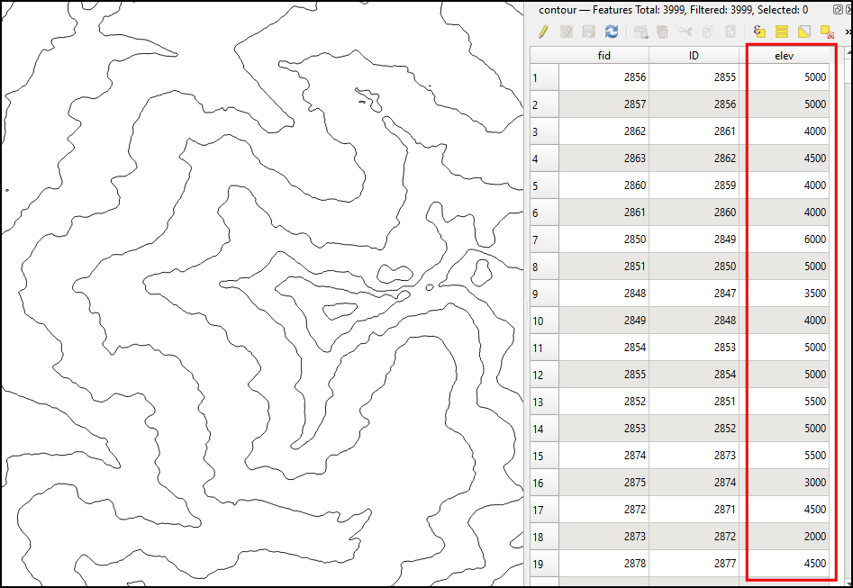
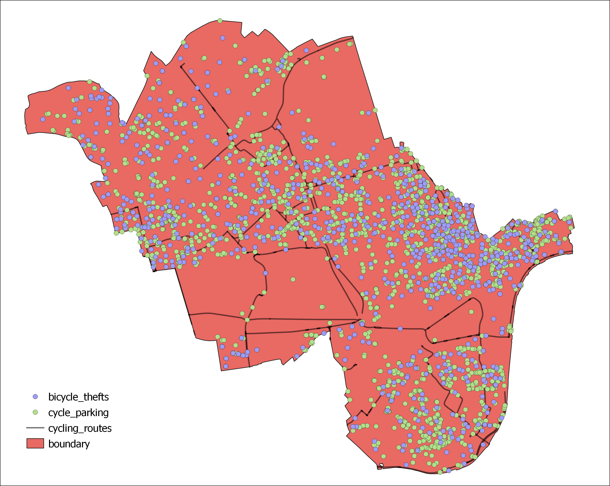
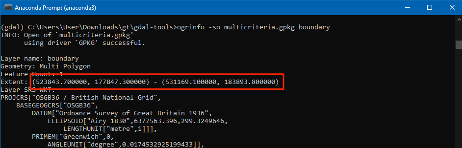
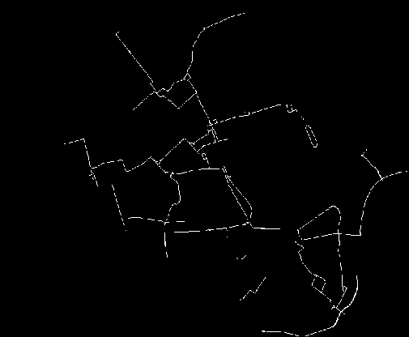
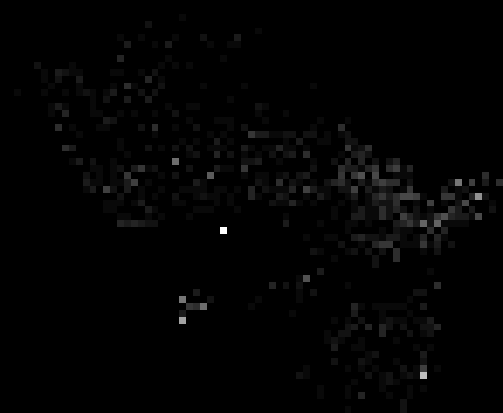
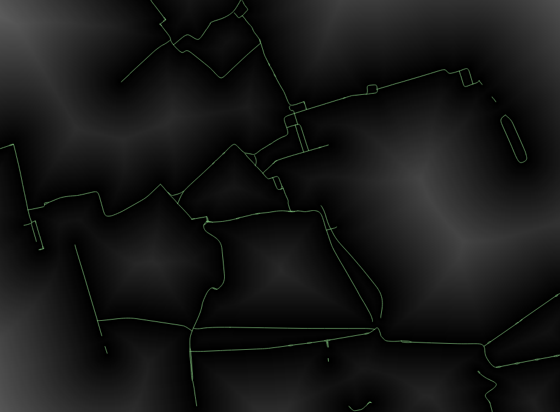
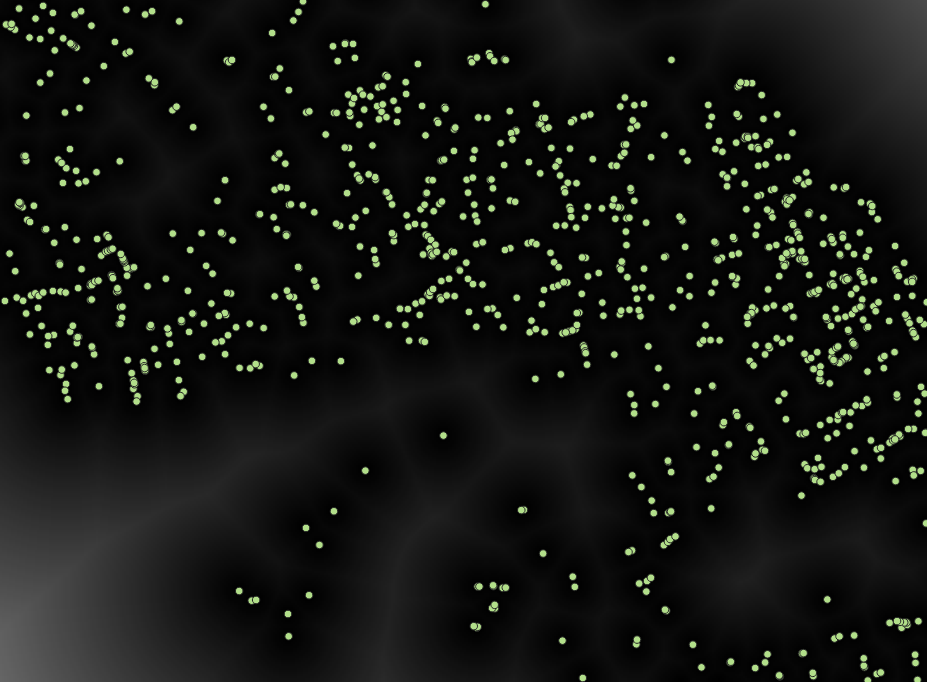
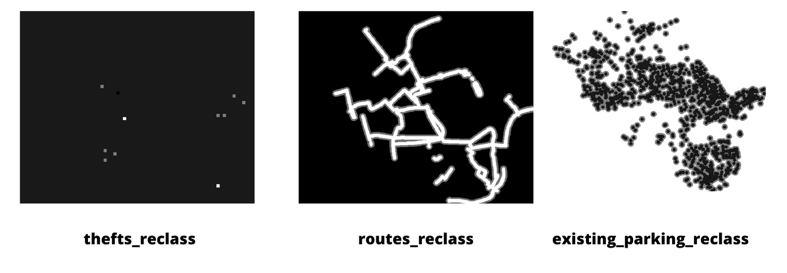
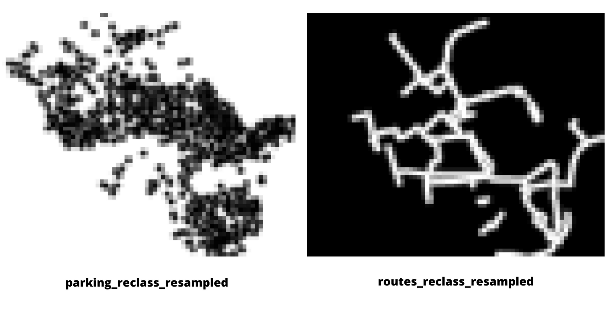
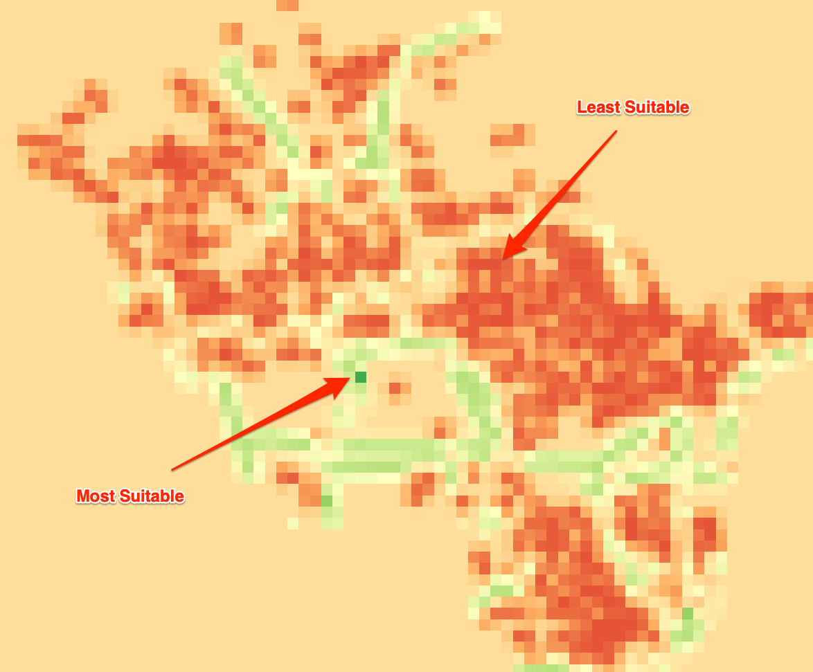

\newpage

***

```{r echo=FALSE, fig.align='center', out.width='250pt'}
knitr::include_graphics('images/spatial_thoughts_logo.png')
```

***

\newpage

# Introduction 

[GDAL](https://gdal.org/)  is an open-source library for raster and vector geospatial data formats. The library comes with a vast collection of utility programs that can perform many geoprocessing tasks. This class introduces GDAL and OGR utilities with example workflows for processing raster and vector data. The class also shows how to use these utility programs to build Spatial ETL pipelines and do batch processing.


[{width="400px"}](https://docs.google.com/presentation/d/1JvGjb5eNM9F--zfyTFAeAk0R5UG6weFpOUVDVkJSnho/edit?usp=sharing
){target="_blank"}

[View the Presentation](https://docs.google.com/presentation/d/1JvGjb5eNM9F--zfyTFAeAk0R5UG6weFpOUVDVkJSnho/edit?usp=sharing){target="_blank"}


# Get the Data Package

The code examples in this class use a variety of datasets. All the required datasets are supplied to you in the ``gdal_tools.zip`` file. Unzip this file to the `Downloads` directory. All commands below assume the data is available in the ``<home folder>/Downloads/gdal_tools/`` directory.

*Not enrolled in our instructor-led class but want to work through the material on your own?* [Get free access to the data package](https://docs.google.com/forms/d/e/1FAIpQLScfS6sICXfbAfPr2MOAkfAIbpj8G6v3FR_YtMRGOoKrDnDBtw/viewform){target="_blank"}

# Software

This course requires installing the GDAL package. Along with GDAL, we highly recommend installing QGIS to view the result of the command-line operations. You will find installation instructions for both the software below.

## GDAL

The preferred method for installing the GDAL Tools is via Anaconda. Follow these steps to install Anaconda and the GDAL library.

[Download the Anaconda Installer](https://www.anaconda.com/products/individual) for Python 3.7 (or a higher version) for your operating system. Once downloaded, double click the installer and install it into the default suggested directory.

*Note: If your username has spaces, or non-English characters, it causes problems. In that case, you can install it to a path such as  `C:\anaconda`.*

```{r echo=FALSE, fig.align='center', out.width='75%'}
knitr::include_graphics('images/gdal/conda.png')
```

### Windows

Once Anaconda installed, search for *Anaconda Prompt* in the Start Menu and launch a new window.

1. Create a new environment named `gdal`. When prompted to confirm, type `y` and press *Enter*.

```
conda create --name gdal
```
> Note: You can select *Right Click &rarr; Paste* to paste commands in Anaconda Prompt.

```{r echo=FALSE, fig.align='center', out.width='75%'}
knitr::include_graphics('images/gdal/condawin1.png')
```

2. Activate the environment and install the `gdal` package. When prompted to confirm, type `y` and press *Enter*.

```
conda activate gdal
conda install -c conda-forge gdal
```


```{r echo=FALSE, fig.align='center', out.width='75%'}
knitr::include_graphics('images/gdal/condawin2.png')
```

3. Once the installation finishes, verify if you are able to run the GDAL tools. Type the following command and check if a version number is printed.

```
gdalinfo --version
```

> The version number displayed for you may be slightly different. As long as you do not get a `command not found` error, you should be set for the class.


```{r echo=FALSE, fig.align='center', out.width='75%'}
knitr::include_graphics('images/gdal/condawin3.png')
```

### Mac/Linux

Once Anaconda is installed, launch a *Terminal* window.

1. Create a new environment named `gdal`. When prompted to confirm, type `y` and press *Enter*.

```
conda create --name gdal
```

```{r echo=FALSE, fig.align='center', out.width='75%'}
knitr::include_graphics('images/gdal/condamac1.png')
```

2. Activate the environment and install the `gdal` package. When prompted to confirm, type `y` and press *Enter*.

```
conda activate gdal
conda install -c conda-forge gdal
```

```{r echo=FALSE, fig.align='center', out.width='75%'}
knitr::include_graphics('images/gdal/condamac2.png')
```

3. Once the installation finishes, verify if you are able to run the GDAL tools. Type the following command and check if a version number is printed.

```
gdalinfo --version
```

> The version number displayed for you may be slightly different. As long as you do not get a `command not found` error, you should be set for the class.

```{r echo=FALSE, fig.align='center', out.width='75%'}
knitr::include_graphics('images/gdal/condamac3.png')
```

## QGIS 

This course uses QGIS LTR version 3.16 for visualization of results. It is not mandatory to install QGIS, but highly recommended.

Please review [QGIS-LTR Installation Guide](install-qgis-ltr.html) for step-by-step instructions.

# Getting Familiar with the Command Prompt

All the commands in the exercises below are expected to be run from the *Anaconda Prompt* on Windows or a *Terminal* on Mac/Linux. We will now cover basic terminal commands that will help you get comfortable with the environment

### Windows


|   **Command**    | **Description**                     | **Example**     |
|:-----------------|:------------------------------------|:---------------------|
| `cd`             | Change directory                    | `cd Downloads\gdal-tools` |
| `cd ..`          | Change to the parent directory      | `cd ..` |
| `dir`            | List files in the current directory | `dir` |
| `del`            | Delete a file                       | `del test.txt` |
| `rmdir`          | Delete a directory                  | `rmdir /s test` |
| `mkdir`          | Create a directory                  | `mkdir test` |
| `type`           | Print the contents of a file        | `type test.txt` |
| `> output.txt`   | Redirect the output to a file       | `dir /b *.csv > output.txt` |
| `cls`            | Clear screen                        | `cls` |


### Mac/Linux

|   **Command**    | **Description**                     | **Example**     |
|:-----------------|:------------------------------------|:---------------------|
| `cd`             | Change directory                    | `cd Downloads/gdal-tools` |
| `cd ..`          | Change to the parent directory      | `cd ..` |
| `ls`             | List files in the current directory | `ls` |
| `rm `            | Delete a file                       | `rm test.txt` |
| `rm -R`          | Delete a directory                  | `rm -R test` |
| `mkdir`          | Create a directory                  | `mkdir test` |
| `cat`            | Print the contents of a file        | `cat test.txt` |
| `> output.txt`   | Redirect the output to a file       | `ls *.csv > output.txt` |
| `clear`          | Clear screen                        | `clear` |


# 1. GDAL Tools

## 1.1 Basic Raster Processing

We will start learning the basic GDAL commands by processing elevation rasters from SRTM. In the *Command Prompt* window, use the `cd` command to change to the `srtm` directory which 4 individual SRTM tiles around the Mt. Everest region.

```
cd srtm
```

Use the `gdalinfo` command to check the information about a single image. 
```
gdalinfo N28E086.hgt
```

```{r echo=FALSE, fig.align='center', out.width='75%'}
knitr::include_graphics('images/gdal/gdalinfo1.png')
```

A useful parameter is `-stats` which computes and displays image statistics. Run it on the raster to get some statistics of pixel values in the image.
```
gdalinfo -stats N28E086.hgt
```

```{r echo=FALSE, fig.align='center', out.width='75%'}
knitr::include_graphics('images/gdal/gdalinfo2.png')
```

### 1.1.1 Merging Tiles

We will now merge the 4 neighboring SRTM tiles into 1 raster so we can work with them together. GDAL provides a useful format called [Virtual Raster](https://gdal.org/drivers/raster/vrt.html) that allows us to create a *Virtual* file with `.vrt` extension that is a pointer to multiple source files. A `.vrt` file is just a text file, so it doesn't consume any disk space but allows us to run any GDAL command as if it was a raster file. 

First we need to create a text file containing all the files we want to merge. We can use the `dir` command on Command prompt to list the files matching the pattern `*.hgt` and redirect the output to a file. Here the `/b` option runs the command in the *Bare* mode which excludes all info except file names. 

**Windows**
```
dir /b *.hgt > filelist.txt
```

For Mac/Linux systems, the same can be achieved using the `ls` command.

**Mac/Linux**
```
ls *.hgt > filelist.txt
```

Once the command finishes, verify that the `filelist.txt` has the names of the source tiles.

```{r echo=FALSE, fig.align='center', out.width='50%'}
knitr::include_graphics('images/gdal/merging1.png')
```

We can now use the `gdalbuildvrt` program to create a virtual raster from the source files in the `filelist.txt`.

```
gdalbuildvrt -input_file_list filelist.txt merged.vrt
```

```{r echo=FALSE, fig.align='center', out.width='100%'}
knitr::include_graphics('images/gdal/merging2.png')
```

> Note: We could have done this operation in a  single step using the command `gdalbuildvrt merged.vrt *.hgt`. However, some versions of GDAL on Windows do not expand the `*` wildcard correctly and the command results in an error. It is recommended to use a file list instead of wildcards with GDAL commands on Windows to avoid unexpected results.[[reference](https://github.com/OSGeo/gdal/issues/1749)]

### Exercise 1

Can you find what is the highest elevation value in the merged raster? Since these rasters are around the Mt.Everest region, the *MAXIMUM* value will be the elevation of the summit.


```{r echo=FALSE, fig.align='center', out.width='75%'}
knitr::include_graphics('images/gdal/exercise1.png')
```

### 1.1.2 Converting Formats

Let's convert the *Virtual Raster* to a GeoTIFF file. `gdal_translate` program allows us to convert between any of the hundreds of data formats supported by GDAL. The format is recognized from the file extension. Alternatively, you can also specify it using the `-of` option with the [short name of the format](https://gdal.org/drivers/raster/index.html) such a **GTiff**.
```
gdal_translate -of GTiff merged.vrt merged.tif
```

```{r echo=FALSE, fig.align='center', out.width='75%'}
knitr::include_graphics('images/gdal/compression1.png')
```

### 1.1.3 Compressing Output

The default output GeoTIFF file is uncompressed - meaning each pixel's value is stored on the disk without any further processing. For large rasters, this can consume a lot of disk space. A smart approach is to use a lossless compression algorithm to reduce the size of the raster while maintaining full fidelity of the original data. GDAL supports many compression algorithms out-of-the-box and can be specified with GDAL commands using the `-co` option. The most popular loss-less compression algorithms are **DEFLATE**, **LZW** and **PACKBITS**. We can try the `DEFLATE` algorithm on our dataset.

```
gdal_translate -of GTiff merged.vrt merged.tif -co COMPRESS=DEFLATE
```

```{r echo=FALSE, fig.align='center', out.width='75%'}
knitr::include_graphics('images/gdal/compression2.png')
```


The uncompressed file size was **100+ MB**. After applying the  *DEFLATE* compression, the file size was reduced to **73MB**. We can further reduce the file size by specifying additional options. The `PREDICTOR` option helps compress data better when the neighboring values are correlated. For elevation data, this is definitely the case. The `TILED` option will compress the data in blocks rather than line-by-line.

```
gdal_translate -of GTiff merged.vrt merged.tif -co COMPRESS=DEFLATE -co TILED=YES -co PREDICTOR=2
```

```{r echo=FALSE, fig.align='center', out.width='75%'}
knitr::include_graphics('images/gdal/compression3.png')
```

The resulting file now comes out much smaller at **39MB**. Check this article [GeoTIFF compression and optimization with GDAL](https://kokoalberti.com/articles/geotiff-compression-optimization-guide/) to learn more about various options and compression algorithms. 

### 1.1.4 Setting NoData Values

The output from `gdalinfo` program shows that the original data has a *NoData* Value set to `-32768`. We can set a new *NoData* value. The `-a_nodata` option allows us to specify a new value.

```
gdal_translate -of GTiff merged.vrt merged.tif -co COMPRESS=DEFLATE -co TILED=YES -co PREDICTOR=2 -a_nodata -9999
```

After running the command, you can verify the results using the `gdalinfo` command.

### 1.1.5 Wrting Cloud-Optimized GeoTIFF (COG)

A new format called [Cloud-Optimized GeoTIFF (COG)](https://www.cogeo.org/) is making access to such a vast amount of imagery easier to access and analyze. A *Cloud-optimized* GeoTIFF is behaving just like a regular GeoTIFF imagery, but instead of downloading the entire image locally, you can access *portions* of imagery hosted on a cloud server streamed to clients like QGIS. This makes it very efficient to access this data and even analyze it - without downloading large files. GDAL makes it very easy to create COG files by specifying the `-of COG` option.

```
gdal_translate -of COG merged.vrt merged_cog.tif -co COMPRESS=DEFLATE -co PREDICTOR=2 -a_nodata -9999
```

## 1.2 Processing Elevation Data


GDAL comes with the `gdaldem` utility that provides a suite of tools for visualizing and analyzing Digital Elevation Models (DEM). The tool supports the following modes

* Hillshade
* Slope
* Aspect
* Color-relief
* Terrain Ruggedness Index (TRI)
* Topographic Position Index (TPI)
* Roughness

Am important point to note is that the x, y and z units of the DEM should be of same unit. If you are using data in a Geographic CRS (like EPSG:4326) and the height units are in meters, you must specify a scale value using `-s` option.

### 1.2.1 Creating Hillshade

Let's create a hillshade map from the merged SRTM dataset. The `hillshade` mode creates an 8-bit raster with a nice shaded relief effect. This dataset has X and Y units in degrees and Z units in meters. So we specify `111120` as the scale value.

```
gdaldem hillshade merged.tif hillshade.tif -s 111120
```

`gdaldem` supports multiple hillshading algorithms. Apart from the default, it currently includes the following algorithms.

* Combined shading (`-combined`):  A combination of slope and oblique shading.
* Multidirectional shading (`-multidirectional`): A combination of hillshading illuminated from 225 deg, 270 deg, 315 deg, and 360 deg azimuth.

Let's create a hillshade map with the `-multidirectional` option.

```
gdaldem hillshade merged.tif hillshade_combined.tif -s 111120 -multidirectional
```

```{r echo=FALSE, fig.align='center', out.width='100%'}
knitr::include_graphics('images/gdal/hillshade.png')
```

### 1.2.2 Creating Color Relief

A color relief map is an elevation map where different ranges of elevations are colored differently. The `color-relief` mode can create a color relief map with the colors and elevation ranges supplied in a text file. 

Your data package contains a `colormap.txt` file with the following content. The format of the text file is `elevation, red, green, blue` values.

```{bash eval=FALSE, code=readLines('code/gdal/colormap.txt')}
```
We can supply this file to create a colorized elevation map.

```
gdaldem color-relief merged.tif colormap.txt colorized.tif
```

```{r echo=FALSE, fig.align='center', out.width='75%', fig.cap='Color Relief'}
knitr::include_graphics('images/gdal/colorized.png')
```

### Exercise 2

Save the color relief in the PNG format.

### 1.2.3 Creating Contours

The GDAL package comes with the utility `gdal_countour` that creates contour lines and polygons from DEMs.

You can specify the interval between contour lines using the  `-i` option.
```
gdal_contour merged.tif contours.gpkg -i 500
```

```{r echo=FALSE, fig.align='center', out.width='75%', fig.cap='Contour Lines from DEM'}
knitr::include_graphics('images/gdal/contours_withoutelevation.png')
```

Running the command with default options generates a vector layer with contours but they do not have any attributes. If you want to label your contour lines in your map, you may want to create contours with elevation values as an attribute. You can use the `-a` option and specify the name of the attribute.
```
gdal_contour merged.tif contours.gpkg -i 500 -a elev
```

```{r echo=FALSE, fig.align='center', out.width='75%', fig.cap='Contour Lines with Elevation Attribute'}

```

### Exercise 3

Create polygon contours shapefile from `merged.tif` and name the attributes `MINELEV` and `MAXELEV` represented by each polygon.

## 1.3 Processing Aerial Imagery

Use the `cd` command to change to the `naip` directory which contains individual aerial imagery tiles in the **JPEG2000** format.

```
cd naip
```

### 1.3.1 Create a preview image from source tiles

The source imagery is heavily compressed and covers a large region. Instead of loading the full resolution tiles in a viewer, it is a good practice to create a preview mosaic that can help us assess the coverage and quality of the data.

We first create a *Virtual Raster* mosaic from all the `.jp2` tiles. We can create a text file containing all the files we want to merge. 

**Windows**
```
dir /b *.jp2 > filelist.txt
```

**Mac/Linux**
```
ls *.jp2 > filelist.txt
```

```{r echo=FALSE, fig.align='center', out.width='75%', fig.cap='Text File with the List of Images'}
knitr::include_graphics('images/gdal/aoi_textfile.png')
```

```
gdalbuildvrt -input_file_list filelist.txt naip.vrt
```

We can use the `-outsize` option and specify a percentage to generate a smaller size preview. The below command generates a 2% preview image in JPEG format.

```
gdal_translate -of JPEG -outsize 2% 2% naip.vrt naip_preview.jpg 
```

```{r echo=FALSE, fig.align='center', out.width='75%'}
knitr::include_graphics('images/gdal/naip_preview.jpg')
```

### 1.3.2 Create a Tile Index

When working with large amounts of imagery tiles, it is useful to generate a tile index. A tile index layer is a polygon layer with the bounding box of each tile. An index layer allows us to check the coverage of the source data and locate specific tiles. It is a simple but effective way to catalog raster data from a hard drive or from a folder on your computer.

`gdaltindex` program creates a tile index from a list of input files. Here we can use the `--optfile` option to supply the list of files via a file.

```
gdaltindex -write_absolute_path index.shp --optfile filelist.txt
```

### 1.3.3 Mosaic and clip to AOI

Let's say we want to mosaic all the source tiles into a single image. We also want to clip the mosaic to a given AOI.

```{r echo=FALSE, fig.align='center', out.width='75%'}
knitr::include_graphics('images/gdal/aoiselection.png')
```

We can use the `gdalwarp` utility to clip the raster using the `-cutline` option. We can also add JPEG compression to the output file to reduce the file size. Refer to the post [GeoTiff Compression for Dummies](https://blog.cleverelephant.ca/2015/02/geotiff-compression-for-dummies.html) by Paul Ramsey that gives more insights into compression imagery. 

> Note that JPEG is a lossy compression method and is suited only for photographic rasters such as aerial/drone imagery. For scientific datasets, you should always use lossless compression as shown in the [previous section](#compressing-output).

```
gdalwarp -cutline aoi.shp  -crop_to_cutline naip.vrt aoi.tif -co COMPRESS=JPEG -co TILED=YES -co PHOTOMETRIC=YCBCR
```

```{r echo=FALSE, fig.align='center', out.width='75%'}
knitr::include_graphics('images/gdal/mosaic.png')
```


### 1.3.5 Creating Overviews

If you try loading the resulting raster into a viewer, you will notice that it takes a lot of time for it to render. Zoom/Pan operations are quite slow as well. This is because the viewer is rendering all the pixels at native resolution. Since this is a very high-resolution dataset, it requires processing a lot of pixels, even if you are zoomed out. A common solution to this problem is to create *Pyramid Tiles* or *Overviews*. This process creates low-resolution versions of the image by averaging pixel values from higher resolution pixels. If the pyramid tiles are present, imagery viewers can use it to speed up the rendering process. GDAL provides the utility `gdaladdo` to create overview tiles. GeoTIFF format supports storing the overviews within the file itself. For other formats, the program generates external overviews in the `.ovr` format.

You can run the `gdaladdo` (**GDAL**-**Add**-**O**verview) command with default options to create internal overviews. Once the overviews are created, try opening the `aoi.tif` in QGIS. You will see that it renders much faster and zoom/pan operations are very smooth.
```
gdaladdo aoi.tif
```

The default overviews use the nearest neighbor resampling. We can pick any resampling method from the many available algorithms. We can try the bilinear interpolation using the `-r bilinear` option. Since the source imagery is JPEG compressed, we will compress the overviews with the same compression.

```
gdaladdo -r bilinear --config COMPRESS_OVERVIEW JPEG aoi.tif
```

## 1.4 Processing Satellite Imagery

This section shows how to use the satellite data from Landsat-8 and create various derived products. Use the `cd` command to switch to the `landsat8` directory which contains Landsat-8 imagery. This directory has 5 individual GeoTIFF files for 5 different bands from a single landsat-8 scene.

```
cd landsat8
```

### 1.4.1 Merging individual bands into RGB composite

Let's create an RGB composite image by combining three 3 different bands - Red, Green and Blue - into a single image. We can use the `gdal_merge.py` command to merge different images. Here we must use the `-separate` option which tells the command to place each image in a separate band.

```
gdal_merge.py -o rgb.tif -separate -co PHOTOMETRIC=RGB -co COMPRESS=DEFLATE RT_LC08_L1TP_137042_20190920_20190926_01_T1_2019-09-20_B4.TIF RT_LC08_L1TP_137042_20190920_20190926_01_T1_2019-09-20_B3.TIF RT_LC08_L1TP_137042_20190920_20190926_01_T1_2019-09-20_B2.TIF
```

Once the command finishes, you can view the result in QGIS. 

```{r echo=FALSE, fig.align='center', out.width='75%'}
knitr::include_graphics('images/gdal/rgb.png')
```

### 1.4.2 Apply Histogram Stretch and Color Correction

The resulting composite appears quite dark and has low-contrast. QGIS applies a default contrast stretch based on the minimum and maximum values in the image. Due to the presence of clouds and cloud-shadows - there are outlier pixels that make the default contrast stretch not optimal.

Here's what the histogram of the RGB composite looks like.

```{r echo=FALSE, fig.align='center', out.width='75%'}
knitr::include_graphics('images/gdal/histogram.png')
```


We can apply a histogram stretch to increase the contrast. This is done using the `-scale` option. Since most of the pixels have a value between 0 and 0.3, we can choose these are minimum and maximum values and apply a contrast stretch to make them go from 0 to 255. The resulting image will be an 8-bit color image where the input pixel values are linearly scaled to the target value.

> Note: Scaling the image will alter the pixel values. The resulting image is suitable for visualization, but they should never be used for analysis. Scientific analysis should always use the un-scaled pixel values.

```
gdal_translate -scale 0 0.3 0 255 -ot Byte rgb.tif rgb_stretch.tif
```


```{r echo=FALSE, fig.align='center', out.width='75%', fig.cap='RGB Composite with Linear Stretch'}
knitr::include_graphics('images/gdal/rgb_stretch_linear.png')
```

We can also apply a non-linear stretch. `gdal_translate` has a `-exponent` option that scales the input values using the following formula. Choosing an exponent value between 0 and 1 will enhance low intensity values - resulting in a brighter image. [Learn more](https://homepages.inf.ed.ac.uk/rbf/HIPR2/pixexp.htm)

Let's try exponent value of **0.5**. The result is a much better looking output.
```
gdal_translate -scale 0 0.3 0 255 -exponent 0.5 -ot Byte rgb.tif rgb_stretch.tif
```

```{r echo=FALSE, fig.align='center', out.width='75%', fig.cap='RGB Composite with Exponential Stretch'}
knitr::include_graphics('images/gdal/rgb_stretch_exponent.png')
```


### 1.4.3 Raster Algebra

For raster algebra operations, GDAL provides a raster calculator program `gdal_calc.py`. The input rasters are specified using using any letters from A-Z. These letters can be then referenced in the expression. The expression is specified using the `--calc` option and it supports NumPy syntax and [functions](https://numpy.org/doc/stable/reference/routines.math.html#). 

```
gdalinfo -stats landsat8/RT_LC08_L1TP_137042_20190920_20190926_01_T1_2019-09-20_B4.TIF
```
It is important to set NoData value. As seen from the output above, NoData is set to -9999.
 
```
gdal_calc.py -A RT_LC08_L1TP_137042_20190920_20190926_01_T1_2019-09-20_B5.TIF -B RT_LC08_L1TP_137042_20190920_20190926_01_T1_2019-09-20_B4.TIF --outfile ndvi.tif --calc="(A-B)/(A+B)" --NoDataValue=-9999
```

```{r echo=FALSE, fig.align='center', out.width='75%'}
knitr::include_graphics('images/gdal/ndvi.png')
```


### Exercise 4

Create an NRG Composite image with Near Infrared, Red and Green bands. Apply a contrast stretch to the result and save it as a PNG image.

```{r echo=FALSE, fig.align='center', out.width='75%', fig.cap='NRG Composite'}
knitr::include_graphics('images/gdal/nrg_stretch.png')
```

### 1.4.4 Pan Sharpening

Most satellite and airborne sensors capture images in the *Pan-chromatic* band along with other spectral bands. The *Red*, *Green*, and *Blue* bands capture signals in the *Red*, *Green*, and *Blue* portions of the electromagnetic spectrum respectively. But the *Pan*-band captures the data across the entire range of wavelengths in the visible spectrum. This allows the sensor to capture the data in a higher spatial resolution than other bands which capture the signal from a subset of this wavelength range.

Landsat-8 satellite produces images at a **30m** spatial resolution in the *Red*, *Green*, *Blue* bands and at a **15m** spatial resolution in the *Panchromatic* band. We can use the higher spatial resolution of the *Panchromatic* band to improve the resolution of the other bands, resulting in a sharper image with more details. This process is called *Pan-Sharpening*.

GDAL comes with a script `gdal_pansharpen.py` that implements the [Brovey algorithm](https://gdal.org/drivers/raster/vrt.html#gdal-vrttut-pansharpen) to compute the pansharpened output. In the example below we fuse the 15m resolution panchromatic  band (B8) with the RGB composite created in the previous step.

```
gdal_pansharpen.py RT_LC08_L1TP_137042_20190920_20190926_01_T1_2019-09-20_B8.TIF rgb.tif pansharpened.tif -r bilinear -co COMPRESS=DEFLATE -co PHOTOMETRIC=RGB
```

We can apply the same contrast stretch as before and compare the output. You will notice that the resulting composite is much sharper and can resolve the details in the scene much better.

```
gdal_translate -scale 0 0.3 0 255 -exponent 0.5 -ot Byte -a_nodata 0 pansharpened.tif pansharpened_stretch.tif
```

```{r echo=FALSE, fig.align='center', out.width='75%'}
knitr::include_graphics('images/gdal/pansharpen_before.png')
```

```{r echo=FALSE, fig.align='center', out.width='75%'}
knitr::include_graphics('images/gdal/pansharpen_after.png')
```


## 1.5 Processing WMS Layers

GDAL supports reading from a variety of web services, including [Web Map Services (WMS)](https://gdal.org/drivers/raster/wms.html) layers.

### 1.5.1 Listing WMS Layers

NASA's Socioeconomic Data and Applications Center (SEDAC) provides many useful data layers though [WMS Services](https://sedac.ciesin.columbia.edu/maps/services). We can list all available layers using `gdalinfo`.

```
gdalinfo WMS:http://sedac.ciesin.columbia.edu/geoserver/wms
```

```{r echo=FALSE, fig.align='center', out.width='100%'}
knitr::include_graphics('images/gdal/wms1.png')
```

We can get more information about a particular layer by specifying the output from the command above. Let's get more info about the [Global Reservoir and Dam (GRanD), v1](https://sedac.ciesin.columbia.edu/data/set/grand-v1-reservoirs-rev01) layer.

```
gdalinfo "WMS:https://sedac.ciesin.columbia.edu/geoserver/wms?SERVICE=WMS&VERSION=1.1.1&REQUEST=GetMap&LAYERS=grand-v1%3Agrand-v1-reservoirs-rev01&SRS=EPSG:4326&BBOX=-153.037,-45.881,176.825,70.398"
```

### 1.5.2 Creating a Service Description File

GDAL can also create a Service Description XML file from a WMS layer. Many GIS programs, including QGIS recognize these XML files as valid raster layers. This allows users to easily drag-and-drop them into their favorite viewer to access a WMS service without any configuration. `gdal_translate` can write the WMS XML files by specifying `-of WMS` option.

```
gdal_translate -of WMS "WMS:https://sedac.ciesin.columbia.edu/geoserver/wms?SERVICE=WMS&VERSION=1.1.1&REQUEST=GetMap&LAYERS=grand-v1%3Agrand-v1-reservoirs-rev01&SRS=EPSG:4326&BBOX=-153.037,-45.881,176.825,70.398" reservoirs.xml
```

### 1.5.3 Downloading WMS Layers

Some applications require offline access to WMS layers. If you want to use a WMS layer as a reference map for field-data collection, or use the layer on a system with low-bandwidth, you can create a georeferenced raster from a WMS layer. Depending on the server configuration, WMS layers can serve data for resolutions exceeding their native resolution, so one should explicitly specify the output resolution. We can use `gdalwarp` with the `-tr` option to specify the output resolution you need for the offline raster. In the example below, we create a 0.1 degree resolution raster from the WMS layer.

```
gdalwarp -tr 0.1 0.1 "WMS:https://sedac.ciesin.columbia.edu/geoserver/wms?SERVICE=WMS&VERSION=1.1.1&REQUEST=GetMap&LAYERS=grand-v1%3Agrand-v1-reservoirs-rev01&SRS=EPSG:4326&BBOX=-153.037,-45.881,176.825,70.398" reservoirs.tif
```

```{r echo=FALSE, fig.align='center', out.width='75%'}
knitr::include_graphics('images/gdal/wms4.png')
```

We can change the WMS URL with any other configuration parameter. We can extract a smaller region by specifying a different bounding box coordinate using the `BBOX` parameter. The command below uses `gdal_translate` to create an output raster of 10000 x 10000 pixels with the data layer clipped to India.

```
gdal_translate -outsize 10000 10000 "WMS:https://sedac.ciesin.columbia.edu/geoserver/wms?SERVICE=WMS&VERSION=1.1.1&REQUEST=GetMap&LAYERS=grand-v1%3Agrand-v1-reservoirs-rev01&SRS=EPSG:4326&BBOX=68.106,6.762,97.412,37.078" reservoirs_india.tif
```

```{r echo=FALSE, fig.align='center', out.width='75%'}
knitr::include_graphics('images/gdal/wms5.png')
```

Learn more about offline WMS and comparison between different formats in this article [Offline WMS – Benchmarking raster formats for QField](https://www.opengis.ch/2020/06/09/offline-wms-benchmarking-raster-formats-for-qfield/) by OpenGIS.ch.

## 1.6 Georeferencing

GDAL command-line utilities are extremely useful in batch georeferencing tasks. We will learn 2 different techniques for georeferencing/warping images.

### 1.6.1 Georeferencing Images with Bounding Box Coordinates

Often you get images from web portals that are maps but lack georeferencing information. Data from weather satellites, output from simulations, exports from photo editing software etc. can contain images that reference a fixed frame on the earth but are given in regular image formats such as JPEG or PNG. If the bounding box coordinates and the CRS used in creating these images are known, use `gdal_translate` command to assign georeference information. The  `-a_ullr` option allows you to specify the bounding box coordinates using the Upper-Left (UL) and Lower-Right (LR) coordinates.

Your data package contains the image file `earth_at_night.jpg`. This is a beautifully rendered image of the earth captured at night time. You will see that this is a plain JPEG image without any georeference information.

```
gdalinfo earth_at_night.jpg
```

Since this is a global image, we know the corner coordinates. We can assign the CRS **EPSG:4326** using the `-a_srs` option and specify the bounding box coordinates in the following order `<ulx> <uly> <lrx> <lry>`. 
 
```
gdal_translate -a_ullr -180 90 180 -90 -a_srs EPSG:4326 earth_at_night.jpg earth_at_night.tif -co COMPRESS=JPEG -co TILED=YES -co PHOTOMETRIC=RGB
```

The resulting file `earth_at_night.tif` is a GeoTiff file with the correct georeference information and can now be used in GIS software.

```
gdalinfo earth_at_night.tif
```

```{r echo=FALSE, fig.align='center'}
knitr::include_graphics('images/gdal/earth_at_night.png')
```

### 1.6.2 Georeferencing with GCPs

Another option for georeferencing images it by using Ground Control Points (GCPs) or Tie-Points. A GCP specifies the real-world coordinates for a given pixel in the image. The GCPs can be obtained by reading the map markings or locating landmarks from a georeferenced source. Given a set of GCPs, `gdalwarp` can georeference the image using a variety of transformation types.

Your data package contain an old scanned map called `1870_southern_india.jpg`. 

```{r echo=FALSE, fig.align='center'}
knitr::include_graphics('images/gdal/scanned_map.png')
```

The map has graticule lines with latitude and longitude markings. To obtain the GCPs, we can read the coordinate values at the grid intersections and find the pixel's image coordinates. You can use an image viewer or the *Georeferencer* tool in QGIS to obtain GCPs like below.

|   **pixel (column)**    | **line (row)** | **X (Longitude)**   | **Y (Latitude)** |
|:---------------|:---------|:--------------------|:----------------|
| 418  | 893  | 70 | 15 |
| 380  | 2432 | 70 | 5 |
| 3453 | 2434 | 90 | 5 |
| 3407 | 895  | 90 | 15 |
| 2662 | 911  | 85 | 15 |

The first step is to store these GCPs in the image metadata using utility `gdal_translate`.

```
gdal_translate -gcp 418 893 70 15 -gcp 380 2432 70 5 -gcp 3453 2434  90 5 -gcp 3407 895 90 15 -gcp 2662 911 85 15 1870_southern-india.jpg india-with-gcp.tif
```

Now that the GCPs are stored in the image, we are ready to do the georeferencing. Assuming the CRS of the map is a Geographic CRS based on the Everest 1830 datum, we choose **EPSG:4042** as the target CRS. 

Next, we need to choose the transformation type. `gdalwarp` supports the following transformation types

* *Polynomial 1,2 or 3* using `-order` option
* *Thin Plate Spline* using the `-tps` option

Let's try **Polynomial 1** transformation and check the results.

```
gdalwarp -t_srs EPSG:4042 -order 1 -tr 0.005 0.005  india-with-gcp.tif india-reprojected-polynomial.tif -co COMPRESS=JPEG -co JPEG_QUALITY=50 -co PHOTOMETRIC=YCBCR
```

We can use the same GCPs and do a Thin-plate-spline transformation.

```
gdalwarp -t_srs EPSG:4042 -tps -tr 0.005 0.005 india-with-gcp.tif india-reprojected-tps.tif -co COMPRESS=JPEG -co JPEG_QUALITY=50 -co PHOTOMETRIC=YCBCR
```

```{r echo=FALSE, fig.align='center'}
knitr::include_graphics('images/gdal/georeference_gcp.png')
```


# 2. OGR Tools

We will now learn to process vector data using OGR Tools. These are a suite of tools that are part of the GDAL package and follow the same convention. In addition to format translation, the OGR tools also support running Spatial SQL queries - making them very powerful to build Spatial ETL pipelines.

## 2.1 ETL Basics

In this section, we will see how we can build an Extract-Transform-Load (ETL) process in a step-by-step manner. The example workflow will show you how to

1. Read a CSV data source
2. Convert it to point data layer
3. Assign it a CRS
4. Extract a subset
5. Change the data type of a column
6. Write the results to a GeoPackage.


Your data package has a CSV file called `worldcities.csv`. This file contains basic information about major cities in the world along with their coordinates.

Let's use the `ogrinfo` command to inspect the dataset.

```
ogrinfo worldcities.csv
```


```{r echo=FALSE, fig.align='center', out.width='75%'}
knitr::include_graphics('images/gdal/ogr_csv01.png')
```

The program can open and read the file successfully, but it doesn't show any other info. We can use the `-al` option to actually read all the lines from the file and combine it with the `-so` option to print a summary.

```
ogrinfo -so -al worldcities.csv
```

```{r echo=FALSE, fig.align='center', out.width='75%'}
knitr::include_graphics('images/gdal/ogr_csv02.png')
```

We now get a summary with the total number of features in the file along with columns and their types. This is a plain CSV file. Let's turn it into a spatial data layer using the X and Y coordinates supplied in the `lng` and `lat` fields. The `-oo` option allows us to specify format-specific options. The [OGR CSV Driver](https://gdal.org/drivers/vector/csv.html#reading-csv-containing-spatial-information) allows specifying a list of column names or a name pattern (such as `Lat*`) s using the `X_POSSIBLE_NAMES` and `Y_POSSIBLE_NAMES` options to specify which columns contain geometry information.

```
ogrinfo -so -al worldcities.csv -oo X_POSSIBLE_NAMES=lng -oo Y_POSSIBLE_NAMES=lat
```

```{r echo=FALSE, fig.align='center', out.width='75%'}
knitr::include_graphics('images/gdal/ogr_csv03.png')
```

OGR is now able to recognize this layer as Point geometry layer. Let's write this to a spatial data format. We can use the `ogr2ogr` utility to translate between different formats. The following command creates a new GeoPackage file called `worldcities.gpkg` from the CSV file.

```
ogr2ogr -f GPKG worldcities.gpkg worldcities.csv -oo X_POSSIBLE_NAMES=lng -oo Y_POSSIBLE_NAMES=lat 
```

```{r echo=FALSE, fig.align='center', out.width='75%'}
knitr::include_graphics('images/gdal/ogr_csv04.png')
```

We can open the result in a GIS software and it shows the cities layer. While the point layer loads fine, it is missing a CRS. We can use the `a_srs` option to assign a CRS to the resulting layer.

```
ogr2ogr -f GPKG worldcities.gpkg worldcities.csv -oo X_POSSIBLE_NAMES=lng -oo Y_POSSIBLE_NAMES=lat -a_srs EPSG:4326
```

```{r echo=FALSE, fig.align='center', out.width='75%'}
knitr::include_graphics('images/gdal/ogr_csv05.png')
```

OGR tools allow executing SQL queries against the data source. It supports a subset of the SQL capability that is described in the [OGR SQL Syntax](https://gdal.org/user/ogr_sql_dialect.html#ogr-sql-dialect). A simple way to select a subset of features is using the `-where` option. This allows you to specify an attribute query to filter the results. Here we modify our command to extract only the cities where the `country` column has the value **India**.

```
ogr2ogr -f GPKG mycities.gpkg worldcities.csv -oo X_POSSIBLE_NAMES=lng -oo Y_POSSIBLE_NAMES=lat -a_srs EPSG:4326  -where "country = 'India'"
```

```{r echo=FALSE, fig.align='center', out.width='75%'}
knitr::include_graphics('images/gdal/ogr_csv06.png')
```

You can also execute any SQL statement on the input data source. This is a very powerful feature that allows you to filter, join, transform, and summarize the input data. We can apply this on our data layer to transform a column type from string to integer. The column `population` from the input CSV has the type *string*. Since this field is primarily used to store integer values, we can use the `CAST()` SQL function to change the type to *integer*. The `SELECT` statement also allows us to pick only the relevant fields that will get written to the output.

```
ogr2ogr -f GPKG mycities.gpkg worldcities.csv -oo X_POSSIBLE_NAMES=lng -oo Y_POSSIBLE_NAMES=lat -a_srs EPSG:4326 -sql "SELECT city, country, CAST(population AS integer) as population from worldcities where country = 'India'"
```

```{r echo=FALSE, fig.align='center', out.width='75%'}
knitr::include_graphics('images/gdal/ogr_csv07.png')
```

Lastly, we can rename the name of the output layer using the `-nln` option. 
```
ogr2ogr -f GPKG mycities.gpkg worldcities.csv -oo X_POSSIBLE_NAMES=lng -oo Y_POSSIBLE_NAMES=lat -a_srs EPSG:4326 -sql "SELECT city, country, CAST(population AS integer) as population from worldcities where country = 'India'" -nln mycities
```

```{r echo=FALSE, fig.align='center', out.width='75%'}
knitr::include_graphics('images/gdal/ogr_csv08.png')
```

This shows the power of OGR command-line tools. In just a single line, we can read, filter, transform and write the results in any output format supported by OGR. 

## Exercise 5

Write a command using `ogr2ogr` that performs the following operations. 

* Read the newly created `mycities` layer from the `mycities.gpkg` file.
* Reproject the layer to a new CRS **EPSG:7755** (WGS84 / India NSF LCC).
* Save the results as a shapefile `mycities.shp`

All of the above operations should be done in a single-command. Once you arrive at a solution, see if you can improve it by working on the following challenges:

* Challenge 1: You will get a warning that some field values could not be written correctly. This is because the default encoding for the Shapefile format is *ISO-8859-1* - which doesn't support non-latin characters. You can specify the encoding to **UTF-8** using the `-lco` option in `ogr2ogr` command. *Hint: Review the [Layer Creation Options](https://gdal.org/drivers/vector/shapefile.html#layer-creation-options) for the shapefile driver to see the correct syntax*.

* Challenge 2: While you are exploring the Layer Creation Options, add an option to create a spatial index on the output shapefile. *Hint: You can specify the `-lco` option multiple times in the command.*

## 2.2 Using Virtual Layers

Similar to GDAL, OGR also supports [Virtual File Format (VRT)](https://gdal.org/drivers/vector/vrt.html). Compared to the raster version, the OGR Virtual Driver is much more capable and can be used for on-the-fly data transformations. Multiple data layers can be combined into a single *virtual* layer using the XML-based `.vrt` format files. VRT files are also used to configure reading tabular data into spatial data formats.

### 2.2.1 Read Geonames Files

Your data package contains 3 large text files from Geonames in the `geonames` folder. These are plain-text files in a Tab-Separated Values (TSV) format. Change to the `geonames` directory.

```
cd geonames
```

Let's try reading one of the files `CA.txt` - which has over 300K records of all placenames in Canada. To read this file, we need to create a new file called `CA.vrt` with the following content. Save the file in the same `geonames` directory.

```
<OGRVRTDataSource>
	    <OGRVRTLayer name="CA">
	        <SrcDataSource>CSV:CA.txt</SrcDataSource>
	        <SrcLayer>CA</SrcLayer>
	    </OGRVRTLayer>
</OGRVRTDataSource>
```

```{r echo=FALSE, fig.align='center', out.width='60%'}
knitr::include_graphics('images/gdal/geonames1.png')
```

Let's check if OGR can read the source text file via the newly created `CA.vrt` file.

```
ogrinfo -al -so CA.vrt
```

```{r echo=FALSE, fig.align='center', out.width='60%'}
knitr::include_graphics('images/gdal/geonames2.png')
```

The `ogrinfo` command was able to successfully read the data and show us the summary of the attributes as well as the total feature count. Note that OGR has built-in support for the geonames file format. So it was able to correctly detect the geometry columns without us specifying it. For other datasets, you will have to specify the geometry columns explicitly via the `<GeometryField>` attribute in the VRT file.

### 2.2.2 Applying Filters

VRT format supports applying SQL queries on the source layer using the `<SrcSQL>` field. This allows us to create an on-the-fly filter that reads only a subset of the data. Update the `CA.vrt` with the following content.

```
<OGRVRTDataSource>
	    <OGRVRTLayer name="CA">
	        <SrcDataSource>CSV:CA.txt</SrcDataSource>
	        <SrcLayer>CA</SrcLayer>
  	     	<SrcSQL>select * from CA where "FEATCLASS" = 'T'</SrcSQL>
	    </OGRVRTLayer>
</OGRVRTDataSource>
```

```{r echo=FALSE, fig.align='center', out.width='60%'}
knitr::include_graphics('images/gdal/geonames3.png')
```

The VRT file now contains a SQL query to select only the mountain features from the source file. Let's run `ogrinfo` again and check the output.

```
ogrinfo -al -so CA.vrt
```

```{r echo=FALSE, fig.align='center', out.width='60%'}
knitr::include_graphics('images/gdal/geonames4.png')
```

You will see that the output contains a subset of features, even though we never changed the source data. 

### 2.2.3 Merging Files

The real power of the VRT file format lies in its ability to dynamically combine multiple data sources into a single data layer. We can adapt the previously created file and use `<OGRVRTUnionLayer>` to create a single layer from the 3 separate text files. Save the following content into a new file named `NA.vrt`.

```
<OGRVRTDataSource>
	<OGRVRTUnionLayer name="NA">
	
	    <OGRVRTLayer name="CA">
	        <SrcDataSource>CSV:CA.txt</SrcDataSource>
	        <SrcLayer>CA</SrcLayer>
	     	<SrcSQL>select * from CA where "FEATCLASS" = 'T'</SrcSQL>
	    </OGRVRTLayer>
	
	    <OGRVRTLayer name="MX">
	        <SrcDataSource>CSV:MX.txt</SrcDataSource>
	        <SrcLayer>MX</SrcLayer>
	     	<SrcSQL>select * from MX where "FEATCLASS" = 'T'</SrcSQL>
	    </OGRVRTLayer>
	
	    <OGRVRTLayer name="US">
	        <SrcDataSource>CSV:US.txt</SrcDataSource>
	        <SrcLayer>US</SrcLayer>
	     	<SrcSQL>select * from US where "FEATCLASS" = 'T'</SrcSQL>
	    </OGRVRTLayer>
	
    </OGRVRTUnionLayer>	
</OGRVRTDataSource>
```

```{r echo=FALSE, fig.align='center', out.width='60%'}
knitr::include_graphics('images/gdal/geonames5.png')
```

Let's now translate the `NA.vrt` to a GeoPackage using the `ogr2ogr` command.

```
ogr2ogr -f GPKG NA.gpkg NA.vrt -a_srs EPSG:4326
```

> This operation requires a lot of processing and may take a few minutes. You can add the `--config GDAL_CACHEMAX 512` option to speed up the process. See [Tips for Improving Performance](#tips-for-improving-performance) section for more details.

This command reads all 3 text files, filters them for matching features, combines them and writes out a spatial layer containing all mountains in North America.

```{r echo=FALSE, fig.align='center', out.width='75%'}
knitr::include_graphics('images/gdal/geonames6.png')
```

## 2.3 Geoprocessing and Spatial Queries

We have seen examples of using SQL queries in OGR commands. So far we have used the queries that adhere to the OGR SQL Dialect. OGR Tools also have support [SQLite dialect](https://gdal.org/user/sql_sqlite_dialect.html). The major advantage of using the SQLite dialect is that you can use Spatial SQL functions provided by [Spatialite](http://www.gaia-gis.it/spatialite/). This enables a wide range of applications where you can do spatial queries using OGR tools. A major difference when using the SQLite dialect is that you must specify the geometry column explicitly.

Let's do some geoprocessing and see how we can use spatial queries with OGR Tools. Your data package as a geopackage file `spatial_query.gpkg`. This geopackage contains 2 layers.

* `metro_stations`: Point layer with metro rail locations in the city of Melbourne.
* `bars_and_pubs`: Point layer with locations of bars and pubs in the city of Melbourne.

Let's see how we can add a new layer to this geopackage with all bars and pubs that are within 500m of a metro station.


### 2.3.1 Reprojecting Vector Layers

The source data layers are in the CRS `EPSG:4326`. As we want to run a spatial query with distance in meters, let's reproject both the layers to a projected CRS. Let's use the `ogr2ogr` command to reproject both the input layers and save them into the same geopackage. We can use `-t_srs` option allows us to specify **EPSG:7855** (GDA2020 / MGA Zone 55) as the target projection. the `-update` option along with `-nln` tells `ogr2ogr` to create a new layer and save it in the same geopackage.

```
ogr2ogr -t_srs EPSG:7855 spatial_query.gpkg spatial_query.gpkg bars_and_pubs -update -nln bars_and_pubs_reprojected
ogr2ogr -t_srs EPSG:7855 spatial_query.gpkg spatial_query.gpkg metro_stations -update -nln metro_stations_reprojected
```

```{r echo=FALSE, fig.align='center', out.width='75%'}
knitr::include_graphics('images/gdal/geoprocessing1.png')
```

### 2.3.2 Creating Buffers

Let's buffer the `metro_stations_reprojected` layer using a distance of **500** meters. Here we specify the SQL query with the `-sql` option. Note the use of the `ST_Buffer()` function which is provided by the Spatialite engine. We need to specify `-dialect SQLITE` as the query uses spatial functions.

> Spatial database functions often have the `ST_` prefix. ST stands for **Spatial Type**.

```
ogr2ogr spatial_query.gpkg spatial_query.gpkg -update -nln metro_stations_buffer -sql "SELECT m.station, ST_Buffer(m.geom, 500) as geom FROM metro_stations_reprojected m" -dialect SQLITE 
```

```{r echo=FALSE, fig.align='center', out.width='75%', fig.cap='Metro Station Buffers'}
knitr::include_graphics('images/gdal/geoprocessing2.png')
```

This query results in individual overlapping buffers. We can dissolve the buffers using `ST_Collect()` function.

```
ogr2ogr spatial_query.gpkg spatial_query.gpkg -update -nln metro_stations_buffer_dissolved -sql "SELECT ST_Union(d.geom) as geom FROM (SELECT ST_Collect(buffer(m.geom, 500)) as geom FROM metro_stations_reprojected m) as d" -dialect SQLITE
```

```{r echo=FALSE, fig.align='center', out.width='75%', fig.cap='Dissolved Buffers'}
knitr::include_graphics('images/gdal/geoprocessing3.png')
```

### 2.3.2 Performing Spatial Queries

Now that we have a polygon layer with the buffer region around the metro stations, we can use the `ST_Within()` function to find all points from the `bars_and_pubs_reprojected` layer that are contained within this region. The following command adds a new layer `selected` with the resulting points.

```
ogr2ogr -t_srs EPSG:4326 spatial_query.gpkg spatial_query.gpkg -update -nln selected -sql "SELECT  b.* from bars_and_pubs_reprojected as b JOIN metro_stations_buffer_dissolved as m ON ST_Within( b.geom, m.geom)" -dialect SQLITE 
```

```{r echo=FALSE, fig.align='center', out.width='75%'}
knitr::include_graphics('images/gdal/geoprocessing4.png')
```

### 2.3.3 Data Cleaning

The previous query does the job and you find all points that are within the buffer region. But you will notice that there are many duplicate points at the same location. Upon inspecting, you will note that the source data contains multiple features for each establishment from different years. We can run a final SQL query to de-duplicate the data by selecting the feature from the latest year for each establishment. Note that some column names have spaces in the names, so we enclose them in double-quotes.

```
ogr2ogr -t_srs EPSG:4326 spatial_query.gpkg spatial_query.gpkg -update -nln cleaned -sql "SELECT t1.* FROM selected t1 JOIN (SELECT \"Property ID\", MAX(\"Census year\") as year FROM selected GROUP BY \"Property ID\") t2 ON t1.\"Property ID\" = t2.\"Property ID\" AND t1.\"Census year\" = t2.year"
```

```{r echo=FALSE, fig.align='center', out.width='75%'}
knitr::include_graphics('images/gdal/geoprocessing5.png')
```

# 3. Multi Criteria Weighted Overlay Analysis

Multi-criteria analysis is the process of the allocation of land to suit a specific objective on the basis of a variety of attributes that the selected areas should possess. Although this is a common GIS operation, it is best performed in the raster space. Below is the typical workflow to take source vector data, transform them to appropriate rasters, re-classify them and perform mathematical operations to do a suitability analysis.

We will work with crime and infrastructure data for the city of London and find suitable areas to build new parking facilities that can help reduce bicycle thefts. Our analysis will apply the following 3 criteria. The proposed parking must be

1. In a bicycle theft hotspot
2. Close to a bicycle route
3. Far from existing parking facilities

```{r echo=FALSE, fig.align='center', out.width='75%'}

```

## 3.1 Rasterize vector layers

The step in the overlay analysis is to convert each vector data layer to raster. This is accomplished using the `gdal_rasterize` command. Let's check the content of the data layers provided in the `multicriteria.gpkg`.

```
ogrinfo multicriteria.gpkg
```

```{r echo=FALSE, fig.align='center', out.width='75%'}
knitr::include_graphics('images/gdal/multicriteria1.png')
```

An important consideration is that all rasters must be of the same extent. We can inspect use the boundary layer and find out the extent in the CRS of the layer. We will specify this extent using the `-te` option with `gdal_rasterize` command.

```
ogrinfo -so multicriteria.gpkg boundary
```

```{r echo=FALSE, fig.align='center', out.width='75%'}

```

Let's start by rasterizing the `cycling_routes` layer. We want to create an output raster where the pixel values are **1** where there is a route and **0** where there are no routes. This value is specified using the `-burn` option. We can set the resolution of the output raster to be **10** meters using the `-tr` option. Once the command finishes, each pixel's value will be set to 1 or 0 depending on whether a route line intersects it or not.

```
gdal_rasterize -ot Int16 -burn 1 -tr 10 10 -te 523843.7 177847.3 531169.1 183893.8 multicriteria.gpkg -l cycling_routes routes.tif
```

```{r echo=FALSE, fig.align='center', out.width='75%'}

```

We can rasterize the `cycle_parking` layer with the same options.

```
gdal_rasterize -ot Int16 -burn 1 -tr 10 10 -te 523843.7 177847.3 531169.1 183893.8 multicriteria.gpkg -l cycle_parking existing_parking.tif
```
```{r echo=FALSE, fig.align='center', out.width='75%'}
knitr::include_graphics('images/gdal/multicriteria4.png')
```

Now only the `bicycle_thefts` layer need to be rasterized. This is a dense point layer with locations of individual thefts - with overlapping points. We can create a raster layer by adding the total number of points within each pixel and calculate the density of thefts. This type of approach in mapping point density is called Binning or Aggregation. We can use the `-add` option to increment the value to the pixel for each input feature. 

```
gdal_rasterize -burn 1 -add -tr 100 100 -te 523843.7 177847.3 531169.1 183893.8 multicriteria.gpkg -l bicycle_thefts thefts.tif -ot Int16
```

```{r echo=FALSE, fig.align='center', out.width='75%'}

```


## 3.2 Generate proximity (Euclidean distance) rasters

Now that we have all the input layers converted, we can generate proximity rasters. These are also known as Euclidean distance rasters - where each pixel in the output raster represents the distance to the nearest pixel in the input raster. The distance can be specified in *pixels* or *geographic units* using the `-distunits` option.  This resulting raster can be then used to determine suitable areas which are within certain distance from the input. 

```
gdal_proximity.py routes.tif routes_proximity.tif -ot Int16 -distunits GEO
```

```{r echo=FALSE, fig.align='center', out.width='75%'}

```

```
gdal_proximity.py existing_parking.tif existing_parking_proximity.tif -ot Int16 -distunits GEO
```

```{r echo=FALSE, fig.align='center', out.width='75%'}

```

## 3.3 Re-classify raster values

To use the proximity rasters in overlay analysis, we must first re-classify it to create discrete values. Here we use the range 0-100 and assign an appropriate value based on the input range. 

For point density raster representing **Thefts**, we assign higher value to more thefts. For **Routes** raster, we assign higher value to pixels that are close to the routes. Lastly, for the **Existing Parking** raster, we assigned higher value to pixels that are far away. The final assignment look like below.

|   **Thefts**  | **Routes**  | **Existing Parking** | Re-Class Value
|:--------------|:------------|:---------------------|---------------
| > 20          | 0-50m       | > 100m               | 100
| 10-20         | 50-100m     | 50-100m              | 50
| < 10          | > 100m      | < 50m                | 10

The following commands uses `gdal_calc.py` to take the continuous values from the input rasters and create re-classified rasters with discrete values.

```
gdal_calc.py -A thefts.tif --outfile thefts_reclass.tif --calc="100*(A>20) + 50*(A>10)*(A<=20) + 10*(A<10)"
```

```
gdal_calc.py -A routes_proximity.tif --outfile routes_reclass.tif --calc="100*(A<=50) + 50*(A>50)*(A<=100) + 10*(A>100)"
```

```
gdal_calc.py -A existing_parking_proximity.tif --outfile existing_parking_reclass.tif --calc="100*(A>100) + 50*(A>50)*(A<=100) + 10*(A<50)"
```

```{r echo=FALSE, fig.align='center', out.width='100%'}

```

## 3.4 Overlay analysis

Now we are ready to do the final overlay analysis. Before we proceed, it is important to make sure that all the rasters have the same pixel resolution. We downsample the `existing_parking_reclass.tif` and `routes_reclass.tif` layers so their resolution matches `thefts_reclass.tif` layer.

```
gdalwarp -r average -tr 100 100 existing_parking_reclass.tif parking_reclass_resampled.tif
gdalwarp -r average -tr 100 100 routes_reclass.tif routes_reclass_resampled.tif
```

```{r echo=FALSE, fig.align='center', out.width='75%'}

```

For our analysis, we will give equal important to all 3 criteria. We simply add all 3 rasters and normalize the pixel values so they are in the 0-100 range. We set the NoData value in the output using the `--NoDataValue` option.

```
gdal_calc.py -A thefts_reclass.tif -B routes_reclass_resampled.tif -C parking_reclass_resampled.tif --outfile suitability.tif --calc="(A + B + C)/3" --NoDataValue=0
```

```{r echo=FALSE, fig.align='center', out.width='75%'}

```

The resulting raster represents the suitability of new bicycle parking facilities.

## Exercise 6

Perform a *Weighted* Multi-Criteria Overlay Analysis where different criteria are assigned weights on their relative importance. Let's assume that the proximity to cycling routes is not as important as the other two factors in the final decision. We can give more important to other criteria as below.

* Theft Density: Weight=2
* Routes: Weight=1
* Existing Parking: Weight=2

Create another raster `weighted_suitability.tif` with the above weights and compare the output with the previous result.


# 4. Running commands in batch

You can run the GDAL/OGR commands in a loop using Python. Say you want to convert the format of the images from JPEG200 to GeoTiff. You would run a command such as below.

```
gdal_translate -of GTiff -co COMPRESS=JPEG {input} {output}
```

But it would be a lot of manual effort if you want to run the commands on hundreds of input files. Here's where a simple python script can help you automate running the commands in a batch. The data directory contains a file called `batch.py` with the following python code.

```{python eval=FALSE, code=readLines('code/gdal/batch.py')}
```

In Anaconda Prompt, run the following command from `gdal-tools` directory to start batch processing on all tiles contained in the `naip/` directory.

```
python batch.py
```

The data directory also contains an example of running the batch commands in parallel using python's built-in multiprocessing library. If your system has multi-core CPU, running commands in parallel like this on multiple threads can give you performance boost over running them in series.

```{python eval=FALSE, code=readLines('code/gdal/batch_parallel.py')}
```

The script runs the commands both in parallel and serial mode and prints the time taken by each of them.

```
python batch-parallel.py
```

# Tips for Improving Performance

## Configuration Options

GDAL has several [configuration options](https://gdal.org/user/configoptions.html) that can be tweaked to help with faster processing.

* `--config GDAL_CACHEMAX 512`: This option is the one that helps speed up most GDAL commands by allowing them to use larger amount of RAM (512 MB) reading/writing data.
* `--config GDAL_NUM_THREADS ALL_CPUS`: This option helps speed up write speed by using multiple threads for compression.
* `--debug on`: Turn on debugging mode. This prints additional information that may help you find performance bottlenecks.

## Multithreading

`gdalwarp` utility supports multithreaded processing. There are 2 different options for parallel processing.

* `-multi`: This option parallelizes I/O and CPU operations.
* `-wo NUM_THREADS=ALL_CPUS`: This option parallelizes CPU operations over several cores.

There is also another option that allows `gdalwarp` to use more RAM for caching. This option is very helpful to speed up operations on large rasters

* `-wm`: Set a higher memory for caching

All of these options can be combined that may result in faster processing of the data.

```
gdalwarp -cutline aoi.shp  -crop_to_cutline naip.vrt aoi.tif -co COMPRESS=JPEG -co TILED=YES -co PHOTOMETRIC=YCBCR -multi -wo NUM_THREADS=ALL_CPUS -wm 512 --config GDAL_CACHEMAX 512
```

# Supplement

## Creating Colorized Hillshade

If you want to merge hillshade and color-relief to create a colored shaded relief map, you can use use `gdal_calc.py` to create do gamma and overlay calculations to combine the 2 rasters. [^1]

[^1]: Code reference https://gis.stackexchange.com/questions/255537/merging-hillshade-dem-data-into-color-relief-single-geotiff-with-qgis-and-gdal

```
gdal_calc.py -A hillshade.tif --outfile=gamma_hillshade.tif \
  --calc="uint8(((A / 255.)**(1/0.5)) * 255)"
```

```
gdal_calc.py -A gamma_hillshade.tif -B colorized.tif --allBands=B \
--calc="uint8( ( \
                 2 * (A/255.)*(B/255.)*(A<128) + \
                 ( 1 - 2 * (1-(A/255.))*(1-(B/255.)) ) * (A>=128) \
               ) * 255 )" --outfile=colorized_hillshade.tif
```               


```{r echo=FALSE, fig.align='center', out.width='75%', fig.cap='Colorized Shaded Relief'}
knitr::include_graphics('images/gdal/colorized_hillshade.png')
```

## Splitting a Mosaic into Tiles

When delivering large mosaics, it is a good idea to split your large input file into smaller chunks. If you are working with a very large mosaic, splitting it into smaller chunks and processing them independently can help overcome memory issues. GDAL ships with a handy script called `gdal_retile.py` that is designed for this task.

Let's say we have a large GeoTIFF file `aoi.tif` and want to split it into tiles of 5000 pixels. We can use the following command to split the file and write the output to a directory named `tiles/`.

```
gdal_retile.py -targetDir tiles -ps 5000 5000 aoi.tif
```

# Resources
* [GDAL Tips](https://twitter.com/gdaltips) `@gdaltips` on Twitter

# Data Credits

* Landsat: Landsat-8 image courtesy of the U.S. Geological Survey. Image downloaded from [Google Cloud Platform](https://console.cloud.google.com/marketplace/details/usgs-public-data/landast) and pre-processed using [Semi Automatic Classification Plugin from QGIS](https://fromgistors.blogspot.com/p/semi-automatic-classification-plugin.html)
* Earth at Night image: Credit: NASA Earth Observatory/NOAA NGDC. Earth at Night flat hi-resolution map downloaded from [NASA earth observatory](https://earthobservatory.nasa.gov/features/NightLights/page3.php)
* William Mackenzie 1870 map of Southern India:  out-of-copyright scanned map downloaded from [Hipkiss’s Scanned Old Maps](http://www.hipkiss.org/data/maps.html)
* NAIP 2016 Aerial Imagery for California: The National Agriculture Imagery Program (NAIP). USDA-FSA-APFO Aerial Photography Field Office. Downloaded from [NRCS](https://nrcs.app.box.com/v/naip/folder/18144379349)
* Melbourne Metro Stations: © 2019 [The City of Melbourne Open Data Portal](https://data.melbourne.vic.gov.au/). Data provided by Metro Trains Melbourne 
* Melbourne Bars and Pubs: © 2019 [The City of Melbourne Open Data Portal](https://data.melbourne.vic.gov.au/). Data provided by Census of Land Use and Employment (CLUE)
* Bicycle Parking: [Cycling Infrastructure data: Public Tfl data](https://cycling.data.tfl.gov.uk/). Contains OS data © Crown copyright and database rights 2016 and Geomni UK Map data © and database rights [2019]
* Cycling Thefts: London Individual crime and anti-social behavior (ASB) incidents, including street-level location information and subsequent police and court outcomes associated with the crime. Published by Single Online Home National Digital Team under Open Government Licence v3.0. Downloaded from https://data.police.uk/
* Westminster Boundary: [Statistical GIS Boundary Files for London](https://data.london.gov.uk/). Contains National Statistics data © Crown copyright and database right [2015], Contains Ordnance Survey data © Crown copyright and database right [2015]

# License

This course material is licensed under a [Creative Commons Attribution-NonCommercial 4.0 International License](https://creativecommons.org/licenses/by-nc/4.0/). You are free to use the material for any non-commercial purpose. Kindly give appropriate credit to the original author.

&copy; 2020 Ujaval Gandhi [www.spatialthoughts.com](http://spatialthoughts.com)

***

**This course is offered as an instructor-led online class. Visit [Spatial Thoughts](https://spatialthoughts.com/events/) to know details of upcoming sessions.**
