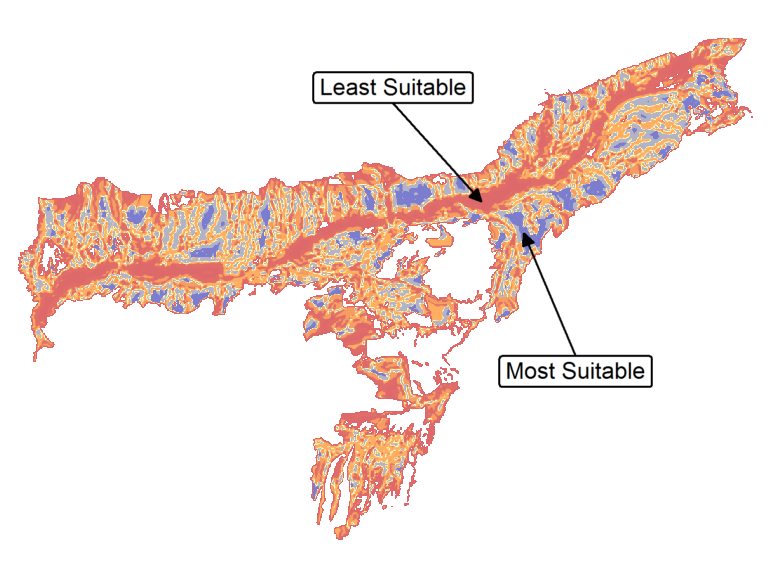

\newpage

***

```{r echo=FALSE, fig.align='center', out.width='250pt'}
knitr::include_graphics('images/spatial_thoughts_logo.png')
```

***

\newpage

# Introduction 

[GDAL](https://gdal.org/)  is an open-source library for raster and vector geospatial data formats. The library comes with a vast collection of utility programs that can perform many geoprocessing tasks. This class introduces GDAL utilities with example workflows for processing satellite and aerial imagery.

# Get the Data Package

The code examples in this class use a variety of datasets. All the required datasets are supplied to you in the ``gdal_tools.zip`` file. Unzip this file to the `Downloads` directory. All commands below assume the data is available in the ``<home folder>/Downloads/gdal_tools/`` directory.

*Not enrolled in our instructor-led class but want to work through the material on your own?* [Get free access to the data package](https://docs.google.com/forms/d/e/1FAIpQLScfS6sICXfbAfPr2MOAkfAIbpj8G6v3FR_YtMRGOoKrDnDBtw/viewform){target="_blank"}

# Installation

The preferred method for installing the GDAL Tools is via Anaconda. Follow these steps to install Anaconda and the GDAL library.

[Download the Anaconda Installer](https://www.anaconda.com/products/individual) for Python 3.7 (or a higher version) for your operating system. Once downloaded, double click the installer and install it into the default suggested directory.

*Note: If your username has spaces, or non-English characters, it causes problems. In that case, you can install it to a path such as  `C:\anaconda`.*

```{r echo=FALSE, fig.align='center', out.width='75%'}
knitr::include_graphics('images/gdal/conda.png')
```

## Windows

Once Anaconda installed, search for *Anaconda Prompt* in the Start Menu and launch a new window.

1. Create a new environment named `gdal`. When prompted to confirm, type `y` and press *Enter*.

```
conda create --name gdal
```

> Note: You can use the shortcut *Shift + Insert* to paste commands in Anaconda Prompt.

2. Activate the environment and install the `gdal` package. When prompted to confirm, type `y` and press *Enter*.

```
conda activate gdal
conda install -c conda-forge gdal
```

3. Once the installation finishes, check if the GDAL tools are available. Type `gdalinfo` and press *Enter*. If you an output showing usage help, the installation is successful. 

## Mac/Linux

Once Anaconda is installed, launch a *Terminal* window.

1. Create a new environment named `gdal`. When prompted to confirm, type `y` and press *Enter*.

```
conda create --name gdal
```

```{r echo=FALSE, fig.align='center', out.width='75%'}
knitr::include_graphics('images/gdal/condamac1.png')
```

2. Activate the environment and install the `gdal` package. When prompted to confirm, type `y` and press *Enter*.

```
conda activate gdal
conda install -c conda-forge gdal
```

```{r echo=FALSE, fig.align='center', out.width='75%'}
knitr::include_graphics('images/gdal/condamac2.png')
```

3. Once the installation finishes, check if the GDAL tools are available. Type `gdalinfo` and press *Enter*. If you an output showing usage help, the installation is successful. 

```{r echo=FALSE, fig.align='center', out.width='75%'}
knitr::include_graphics('images/gdal/condamac3.png')
```

# Running the Commands

All the commands in the exercises below are expected to be run from the *Anaconda Shell* on Windows or a *Terminal* on Mac/Linux. Before running the commands, you must activate the environment where you have installed the gdal library.

1. Launch a new window and activate the `gdal` environment.

2. Change the current directory to the data package directory.

```
cd Downloads\gdal-tools
```

>> **Note:** Many commandline examples are long and span multiple lines. To improve readability, they are separated by **^** character at the end if each line. This is a line continuation character that enables the shell to interpret it as a single command. If you are running these on Mac or Linux, replace the **^** character with **\\**

# GDAL Tools

## Working with Elevation Data

```
gdalinfo N27E086.hgt
```

```
gdalinfo -stats N27E086.hgt
```

### Merging Tiles

```
gdalbuildvrt merged.vrt *.hgt
```

### Converting Formats

```
gdal_translate merged.vrt merged.tif
```

### Compressing Output
```
gdal_translate merged.vrt merged.tif -co COMPRESS=DEFLATE
```

```
gdal_translate merged.vrt merged.tif -co COMPRESS=DEFLATE -co TILED=YES
```

### Setting NoData Values

```
gdal_translate merged.vrt merged.tif -co COMPRESS=DEFLATE -co TILED=YES -a_nodata -9999
```

### Wrting Cloud-Optimized GeoTiff

```
gdal_translate -of COG merged.vrt merged.tif -co COMPRESS=DEFLATE
```


### Exercise 1

What is the highest elevation value in the merged raster?

## Analyzing and Visualizing DEMs

### Creating Hillshade

```
gdaldem hillshade merged.tif hillshade.tif -s 111120
```

```
gdaldem hillshade merged.tif hillshade_combined.tif -s 111120 -combined
```

```
gdaldem color-relief merged.tif colormap.txt colorized.tif
```

### Creating Contours

```
gdal_contour merged.tif contours.gpkg -i 500
```

```
gdal_contour merged.tif contours.gpkg -i 500 -a elev
```

### Exercise 2

Create polygon contours shapefile from `merged.tif` and name the attributes `MINELEV` and `MAXELEV` represented by each polygon.

## Processing Satellite Data

This section shows how to take satellite data from Landsat-8 and create various derived products.

### Merging individual bands into RGB composite

```{bash eval=FALSE}
gdal_merge -o rgb.tif -separate ^
  -co PHOTOMETRIC=RGB -co COMPRESS=DEFLATE ^
  landsat8/RT_LC08_L1TP_137042_20190920_20190926_01_T1_2019-09-20_B4.TIF ^
  landsat8/RT_LC08_L1TP_137042_20190920_20190926_01_T1_2019-09-20_B3.TIF ^
  landsat8/RT_LC08_L1TP_137042_20190920_20190926_01_T1_2019-09-20_B2.TIF
```

```{r echo=FALSE, fig.align='center'}
knitr::include_graphics('images/gdal/rgb.png')
```

### Apply Histogram Stretch and Color Correction

```{bash eval=FALSE}
gdal_translate -scale 0 0.3 0 255 -exponent 0.5 -ot Byte ^
  rgb.tif rgb_stretch.tif
```

```{r echo=FALSE, fig.align='center'}
knitr::include_graphics('images/gdal/rgb_stretch.png')
```

### Pan Sharpening

```{bash eval=FALSE}
gdal_pansharpen ^
  landsat8/RT_LC08_L1TP_137042_20190920_20190926_01_T1_2019-09-20_B8.TIF ^
  rgb.tif pansharpened.tif -r bilinear -co COMPRESS=DEFLATE -co PHOTOMETRIC=RGB

gdal_translate -scale 0 0.3 0 255 -exponent 0.5 -ot Byte -a_nodata 0 ^
  pansharpened.tif pansharpened_stretch.tif
```

```{r echo=FALSE, fig.align='center'}
knitr::include_graphics('images/gdal/pansharpen_before.png')
```

```{r echo=FALSE, fig.align='center'}
knitr::include_graphics('images/gdal/pansharpen_after.png')
```

### Computing NDVI

```{bash eval=FALSE}
gdalinfo -stats ^
  landsat8/RT_LC08_L1TP_137042_20190920_20190926_01_T1_2019-09-20_B4.TIF
```
It is important to set nodata value. As seen from the output above, nodata is set to -9999.
 
```{bash eval=FALSE}
gdal_calc ^
  -A landsat8/RT_LC08_L1TP_137042_20190920_20190926_01_T1_2019-09-20_B5.TIF ^
  -B landsat8/RT_LC08_L1TP_137042_20190920_20190926_01_T1_2019-09-20_B4.TIF ^
  --outfile ndvi.tif --calc="(A-B)/(A+B)" --NoDataValue=-9999
```

```{r echo=FALSE, fig.align='center'}
knitr::include_graphics('images/gdal/ndvi.png')
```

## Georeferencing

### Georeferencing images with corner coordinates

You can easily assign bounding box coordinates to any image using the `a_ullr` option.

```{bash eval=FALSE}
gdalinfo earth_at_night.jpg

gdal_translate -a_ullr -180 90 180 -90 -a_srs EPSG:4326 ^
  earth_at_night.jpg earth_at_night.tif ^
  -co PHOTOMETRIC=RGB -co COMPRESS=DEFLATE

gdalinfo earth_at_night.tif
```

```{r echo=FALSE, fig.align='center'}
knitr::include_graphics('images/gdal/earth_at_night.png')
```

### Georeferencing with GCPs

GCP format is [pixel line X Y]. You can use QGIS Georeferencer to obtain the GCPs. Ideally, this process is used with images that have known corner coordinates. In that case, if you know the image dimensions, pixel and line values can be obtained easily.

Let's georeference this old scanned map.

```{r echo=FALSE, fig.align='center'}
knitr::include_graphics('images/gdal/scanned_map.png')
```

First store the GCPs in the file

```{bash eval=FALSE}
gdal_translate ^
  -gcp 418 893 70 15 ^
  -gcp 380 2432 70 5 ^
  -gcp 3453 2434  90 5 ^
  -gcp 3407 895 90 15 ^
  -gcp 2662 911 85 15 ^
  1870_southern-india.jpg india-with-gcp.tif
```

Next, reproject the image using the GCPs
```{bash eval=FALSE}
gdalwarp -t_srs EPSG:4042 -r bilinear -tr 0.005 0.005 -overwrite ^
  india-with-gcp.tif india-reprojected.tif
```

Try a Thin-plate-spline transformation with some compression options.

```{bash eval=FALSE}
gdalwarp -t_srs EPSG:4042 -tps -r bilinear -tr 0.005 0.005 -overwrite ^
  india-with-gcp.tif india-reprojected.tif ^
  -co COMPRESS=JPEG -co JPEG_QUALITY=50 -co PHOTOMETRIC=YCBCR
```

```{r echo=FALSE, fig.align='center'}
knitr::include_graphics('images/gdal/georeference_gcp.png')
```

## Processing of Aerial Imagery

### Create a preview image from source tiles
```{bash eval=FALSE}
gdalbuildvrt naip.vrt naip/*.jp2
gdal_translate -of JPEG -outsize 2% 2% naip.vrt naip_preview.jpg 
```

```{r echo=FALSE, fig.align='center'}
knitr::include_graphics('images/gdal/naip_preview.jpg')
```

### Select a subset of tiles

```{bash eval=FALSE}
gdaltindex index.shp naip/*.jp2
```
We have the area of interest defined in the ``aoi.shp`` file. We want to select and mosaic only the tiles intersecting our AOI

```{r echo=FALSE, fig.align='center'}
knitr::include_graphics('images/gdal/aoiselection.png')
```

Select and save the intersecting tiles using *Extract by Location* Processing algorithm in QGIS and save the selection as a CSV file ``selection.csv``.

```{r echo=FALSE, fig.align='center'}
knitr::include_graphics('images/gdal/aoiselected.png')
```

Edit the file to remove the header line. This creates a text file with source tile locations that can be supplied to the `gdalbuildvrt` command.

```{bash eval=FALSE}
gdalbuildvrt -input_file_list selected.csv aoi.vrt
```

### Mosaic and clip to AOI

```{bash eval=FALSE}
gdalwarp -cutline naip/aoi.shp  -crop_to_cutline aoi.vrt aoi.tif ^
  -co PHOTOMETRIC=RGB -co COMPRESS=DEFLATE -dstnodata 0
```

```{r echo=FALSE, fig.align='center'}
knitr::include_graphics('images/gdal/mosaic.png')
```

# OGR Tools

## Working with CSV files

```
ogrinfo worldcities.csv
```

```
ogrinfo -so -al worldcities.csv
```

```
ogrinfo -so -al worldcities.csv -oo X_POSSIBLE_NAMES=lng -oo Y_POSSIBLE_NAMES=lat
```

```
ogr2ogr -f GPKG worldcities.gpkg worldcities.csv -oo X_POSSIBLE_NAMES=lng -oo Y_POSSIBLE_NAMES=lat 
```

```
ogr2ogr -f GPKG worldcities.gpkg worldcities.csv -oo X_POSSIBLE_NAMES=lng -oo Y_POSSIBLE_NAMES=lat -a_srs EPSG:4326
```

```
ogr2ogr -f GPKG mycities.gpkg worldcities.csv -oo X_POSSIBLE_NAMES=lng -oo Y_POSSIBLE_NAMES=lat -a_srs EPSG:4326  -where "country = 'India'"
```

[OGR SQL Syntax](https://gdal.org/user/ogr_sql_dialect.html#ogr-sql-dialect)

```
ogr2ogr -f GPKG mycities.gpkg worldcities.csv -oo X_POSSIBLE_NAMES=lng -oo Y_POSSIBLE_NAMES=lat -a_srs EPSG:4326 -sql "SELECT city, country, CAST(population AS integer) as population from worldcities where country = 'India'"
```

```
ogr2ogr -f GPKG mycities.gpkg worldcities.csv -oo X_POSSIBLE_NAMES=lng -oo Y_POSSIBLE_NAMES=lat -a_srs EPSG:4326 -sql "SELECT city, country, CAST(population AS integer) as population from worldcities where country = 'India'" -nln mycities
```


# Multi Criteria Weighted Overlay Analysis

Multi-criteria analysis is the process of the allocation of land to suit a specific
objective on the basis of a variety of attributes that the selected areas should possess.

Although this is a common GIS operation, it is best performed in the raster space. Below is the typical workflow to take source vector data, transform them to appropriate rasters, re-classify them and perform mathematical operations to do a suitability analysis.

The problem statement is **Locate the suitable areas for development**, that are

* Close to roads
* Away from waterbodies
* Not in protected areas

## Rasterize vector layers

For overlay analysis, all rasters must be of the same extent. So we first find the extent of the dataset that we can use while rasterizing.

```{bash eval=FALSE}
ogrinfo -so osm/assam.gpkg boundary
```

```{bash eval=FALSE}
gdal_rasterize -ot Int16 -burn 1 -tr 15 15 -te 170134 2669018 798842 3097324 ^
  osm/assam.gpkg -l roads roads.tif
```

```{r echo=FALSE, fig.align='center'}
knitr::include_graphics('images/gdal/roads_raster.png')
```

```{bash eval=FALSE}
gdal_rasterize -ot Int16 -burn 1 -tr 15 15 -te 170134 2669018 798842 3097324 ^
  osm/assam.gpkg -l boundary boundary.tif
```

Use `-i` for inverse rasterization. We want to rasterize 'un-protected' areas

```{bash eval=FALSE}
gdal_rasterize -i -ot Int16 -burn 1 -tr 15 15 -te 170134 2669018 798842 3097324 ^
  osm/assam.gpkg -l protected_regions protected_regions.tif
```

We need a water layer, but the source data has a polygon and a polyline water features layer. We create 2 rasters and then add them to create a single water features raster.

```{bash eval=FALSE}
gdal_rasterize -ot Int16 -burn 1 -tr 15 15 -te 170134 2669018 798842 3097324 ^
  osm/assam.gpkg -l water_polygons water_polygons.tif

gdal_rasterize -ot Int16 -burn 1 -tr 15 15 -te 170134 2669018 798842 3097324 ^
  osm/assam.gpkg -l water_polylines water_polylines.tif


gdal_calc -A water_polygons.tif -B water_polylines.tif ^
  --outfile water_add.tif --calc="A+B"

gdal_calc -A water_add.tif --outfile water.tif ^
  --calc="A>0"
```

```{r echo=FALSE, fig.align='center'}
knitr::include_graphics('images/gdal/water_raster.png')
```

## Generate proximity (Euclidean distance) rasters
```{bash eval=FALSE}
gdal_proximity roads.tif roads_proximity.tif ^
  -ot Int16 -distunits GEO

gdal_proximity water.tif water_proximity.tif ^
  -ot Int16 -distunits GEO
```

```{r echo=FALSE, fig.align='center'}
knitr::include_graphics('images/gdal/roads_proximity.png')
```

## Re-classify raster values

**Roads** Give higher score to nearer pixels

0-1000m --> 100

1000-5000m --> 50

\>5000m --> 10

```{bash eval=FALSE}
gdal_calc -A roads_proximity.tif --outfile roads_class.tif ^
  --calc="100*(A<=1000) + 50*(A>1000)*(A<=5000) + 10*(A>5000)"
```

```{r echo=FALSE, fig.align='center'}
knitr::include_graphics('images/gdal/roads_class.png')
```

**Water** Give lower score to nearer pixels

0-1000m --> 10

1000 -5000m ---> 50

\>5000m --> 100

```{bash eval=FALSE}
gdal_calc -A water_proximity.tif --outfile water_class.tif ^
  --calc="100*(A>5000) + 50*(A>1000)*(A<=5000) + 10*(A<1000)"
```

```{r echo=FALSE, fig.align='center'}
knitr::include_graphics('images/gdal/water_class.png')
```

## Overlay analysis

Roads and Water have a range of values, but protected areas are either 0 or 1. So we combine these together accordingly.

```{bash eval=FALSE}
gdal_calc ^
  -A roads_class.tif -B water_class.tif -C protected_regions.tif -D boundary.tif ^
  --outfile suitability.tif --calc="(A + B)*(C>0)*D" --NoDataValue=0
```

Smooth the output
```{bash eval=FALSE}
gdalwarp -r cubicspline -tr 60 60 -dstnodata 0 ^
  suitability.tif suitability_final.tif
```

```{r echo=FALSE, fig.align='center'}

```

# Running commands in batch

You can run the GDAL/OGR commands in a loop using Python. Open OSGeo4W Shell and type the following to set the correct system paths

```{bash eval=FALSE}
py3_env
```

Say you want to convert the format of the images from JPEG200 to GeoTiff. You would run a command such as below.

```{bash eval=FALSE}
gdal_translate -of GTiff -co COMPRESS=JPEG {input} {output}
```

But it would be a lot of manual effort if you want to run the commands on hundreds of input files. Here's where a simple python script can help you automate running the commands in a batch. The data directory contains a file called `batch.py` with the following python code.

```{python eval=FALSE, code=readLines('code/gdal/batch.py')}
```

In OsGeo4W shell, run the following command to start batch processing on all tiles contained in the `naip/` directory.

```{bash eval=FALSE}
python3 batch.py
```

The data directory also contains an example of running the batch commands in parallel using python's built-in multiprocessing library. If your system has multi-core CPU, running commands in parallel like this on multiple threads can give you performance boost over running them in series.

```{python eval=FALSE, code=readLines('code/gdal/batch_parallel.py')}
```

The script runs the commands both in parallel and serial mode and prints the time taken by each of them.

```{bash eval=FALSE}
python3 batch-parallel.py
```


# Data Credits

* OpenStreetMap (osm) data layers: Data/Maps Copyright 2019 Geofabrik GmbH and OpenStreetMap Contributors. [OSM India free extract](https://download.geofabrik.de/asia/india.html) downloaded from Geofabrik.
* Landsat: Landsat-8 image courtesy of the U.S. Geological Survey. Image downloaded from [Google Cloud Platform](https://console.cloud.google.com/marketplace/details/usgs-public-data/landast) and pre-processed using [Semi Automatic Classification Plugin from QGIS](https://fromgistors.blogspot.com/p/semi-automatic-classification-plugin.html)
* Earth at Night image: Credit: NASA Earth Observatory/NOAA NGDC. Earth at Night flat hi-resolution map downloaded from [NASA earth observatory](https://earthobservatory.nasa.gov/features/NightLights/page3.php)
* William Mackenzie 1870 map of Southern India:  out-of-copyright scanned map downloaded from [Hipkiss’s Scanned Old Maps](http://www.hipkiss.org/data/maps.html)
* NAIP 2016 Aerial Imagery for California: The National Agriculture Imagery Program (NAIP). USDA-FSA-APFO Aerial Photography Field Office. Downloaded from [NRCS](https://nrcs.app.box.com/v/naip/folder/18144379349)

# License

This course material is licensed under a [Creative Commons Attribution-NonCommercial 4.0 International License](https://creativecommons.org/licenses/by-nc/4.0/). You are free to use the material for any non-commercial purpose. Kindly give appropriate credit to the original author.

&copy; 2020 Ujaval Gandhi [www.spatialthoughts.com](http://spatialthoughts.com)

***

**This course is offered as an instructor-led online class. Visit [Spatial Thoughts](https://spatialthoughts.com/events/) to know details of upcoming sessions.**
