\newpage

***

```{r echo=FALSE, fig.align='center', out.width='250pt'}
knitr::include_graphics('images/spatial_thoughts_logo.png')
```

***

\newpage

# Introduction 

[GDAL](https://gdal.org/)  is an open-source library for raster and vector geospatial data formats. The library comes with a vast collection of utility programs that can perform many geoprocessing tasks. This class introduces GDAL and OGR utilities with example workflows for processing raster and vector data. The class also shows how to use these utility programs to build Spatial ETL pipelines and do batch processing.


[](https://www.youtube.com/watch?v=72WVyc8Jtz4&list=PLppGmFLhQ1HLVaHVf4TsnJ4HXZBSfxLOK&index=2){target="_blank"}

[Watch the Video &#8599;](https://www.youtube.com/watch?v=72WVyc8Jtz4&list=PLppGmFLhQ1HLVaHVf4TsnJ4HXZBSfxLOK&index=2){target="_blank"}

[Access the Presentation &#8599;](https://docs.google.com/presentation/d/1JvGjb5eNM9F--zfyTFAeAk0R5UG6weFpOUVDVkJSnho/edit?usp=sharing){target="_blank"}

# Setting up the Environment

This course requires installing the GDAL package. Along with GDAL, we highly recommend installing QGIS to view the result of the command-line operations. You will find installation instructions for both the software below.

## Install GDAL

The preferred method for installing the GDAL Tools is via Anaconda. Follow these steps to install Anaconda and the GDAL library.

[Download the Anaconda Installer](https://www.anaconda.com/products/individual) for Python 3.7 (or a higher version) for your operating system. Once downloaded, double click the installer and install it into the default suggested directory.

*Note: If your username has spaces, or non-English characters, it causes problems. In that case, you can install it to a path such as  `C:\anaconda`.*

```{r echo=FALSE, fig.align='center', out.width='75%'}
knitr::include_graphics('images/gdal/conda.png')
```

### Windows

Once Anaconda installed, search for *Anaconda Prompt* in the Start Menu and launch a new window.

1. Create a new environment named `gdal`. When prompted to confirm, type `y` and press *Enter*.

```
conda create --name gdal
```
> Note: You can select *Right Click &rarr; Paste* to paste commands in Anaconda Prompt.

```{r echo=FALSE, fig.align='center', out.width='75%'}
knitr::include_graphics('images/gdal/condawin1.png')
```

2. Activate the environment and install the `gdal` package along with the jp2 format driver `libgdal-jp2openjpeg`. . When prompted to confirm, type `y` and press *Enter*.

```
conda activate gdal
conda install -c conda-forge gdal libgdal-jp2openjpeg
```


```{r echo=FALSE, fig.align='center', out.width='75%'}
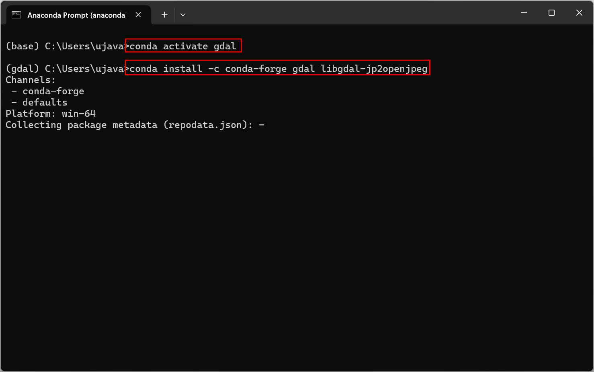
```

3. Once the installation finishes, verify if you are able to run the GDAL tools. Type the following command and check if a version number is printed.

```
gdalinfo --version
```

> The version number displayed for you may be slightly different. As long as you do not get a `command not found` error, you should be set for the class.


```{r echo=FALSE, fig.align='center', out.width='75%'}
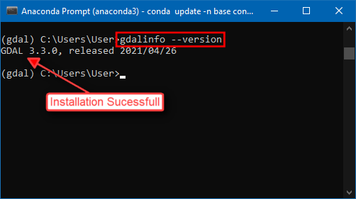
```

### Mac/Linux

Once Anaconda is installed, launch a *Terminal* window.

1. Create a new environment named `gdal`. When prompted to confirm, type `y` and press *Enter*.

```
conda create --name gdal
```

```{r echo=FALSE, fig.align='center', out.width='75%'}
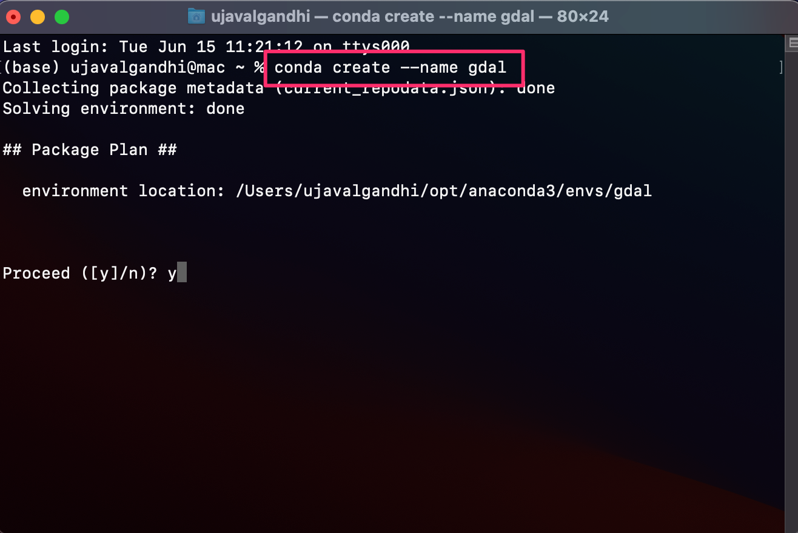
```

2. Activate the environment and install the `gdal` package, along with the jp2 format driver `libgdal-jp2openjpeg`. When prompted to confirm, type `y` and press *Enter*.

```
conda activate gdal
conda install -c conda-forge gdal libgdal-jp2openjpeg
```

```{r echo=FALSE, fig.align='center', out.width='75%'}
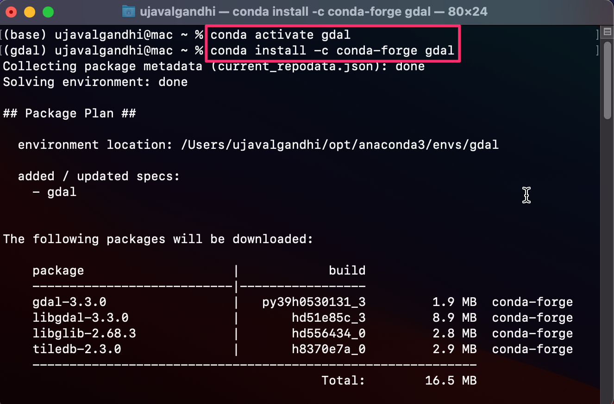
```

3. Once the installation finishes, verify if you are able to run the GDAL tools. Type the following command and check if a version number is printed.

```
gdalinfo --version
```

> The version number displayed for you may be slightly different. As long as you do not get a `command not found` error, you should be set for the class.

```{r echo=FALSE, fig.align='center', out.width='75%'}
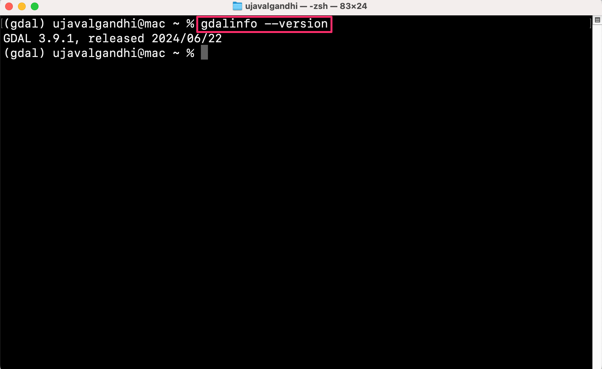
```

### Google Colab Notebook [Optional]

We also provide a Google Colab Notebook for the course that allows you to run all the workflows in the cloud without the need to install any packages or download any datasets. You may use this as an alternative environment if you cannot install the software on your machine due to security restrictions.

[](https://colab.research.google.com/github/spatialthoughts/courses/blob/master/code/gdal/mastering_gdal_tools.ipynb){target="_blank"}

## Install QGIS 

This course uses QGIS LTR version for visualization of results. It is not mandatory to install QGIS, but highly recommended.

Please review [QGIS-LTR Installation Guide](install-qgis-ltr.html) for step-by-step instructions.

# Download the Data Package

The code examples in this class use a variety of datasets. All the required datasets are supplied to you in the ``gdal_tools.zip`` file. Unzip this file to the `Downloads` directory. All commands below assume the data is available in the ``<home folder>/Downloads/gdal_tools/`` directory.

Download [gdal-tools.zip](https://storage.googleapis.com/spatialthoughts-public-data/course_data_packages/gdal-tools.zip).

> Note: Certification and Support are only available for participants in our paid instructor-led classes.

# Get the Course Videos

The course is accompanied by a set of videos covering the all the modules. These videos are recorded from our live instructor-led classes and are edited to make them easier to consume for self-study. We have 2 versions of the videos:

## YouTube

We have created a YouTube Playlist with separate videos for each section and exercise to enable effective online-learning. [Access the YouTube Playlist &#8599;](https://www.youtube.com/playlist?list=PLppGmFLhQ1HLVaHVf4TsnJ4HXZBSfxLOK){target="_blank"}

## Vimeo

We are also making combined full-length video for each module available on Vimeo. These videos can be downloaded for offline learning. [Access the Vimeo Playlist &#8599;](https://vimeo.com/showcase/11112911){target="_blank"}


# Getting Familiar with the Command Prompt

All the commands in the exercises below are expected to be run from the *Anaconda Prompt* on Windows or a *Terminal* on Mac/Linux. We will now cover basic terminal commands that will help you get comfortable with the environment

### Windows


|   **Command**    | **Description**                     | **Example**     |
|:-----------------|:------------------------------------|:---------------------|
| `cd`             | Change directory                    | `cd Downloads\gdal-tools` |
| `cd ..`          | Change to the parent directory      | `cd ..` |
| `dir`            | List files in the current directory | `dir` |
| `del`            | Delete a file                       | `del test.txt` |
| `rmdir`          | Delete a directory                  | `rmdir /s test` |
| `mkdir`          | Create a directory                  | `mkdir test` |
| `type`           | Print the contents of a file        | `type test.txt` |
| `> output.txt`   | Redirect the output to a file       | `dir /b  > test.txt` |
| `cls`            | Clear screen                        | `cls` |


### Mac/Linux

|   **Command**    | **Description**                     | **Example**     |
|:-----------------|:------------------------------------|:---------------------|
| `cd`             | Change directory                    | `cd Downloads/gdal-tools` |
| `cd ..`          | Change to the parent directory      | `cd ..` |
| `ls`             | List files in the current directory | `ls` |
| `rm `            | Delete a file                       | `rm test.txt` |
| `rm -R`          | Delete a directory                  | `rm -R test` |
| `mkdir`          | Create a directory                  | `mkdir test` |
| `cat`            | Print the contents of a file        | `cat test.txt` |
| `> output.txt`   | Redirect the output to a file       | `ls > test.txt` |
| `clear`          | Clear screen                        | `clear` |


# 1. GDAL Tools

[](https://www.youtube.com/watch?v=QMJR6JCogDk&list=PLppGmFLhQ1HLVaHVf4TsnJ4HXZBSfxLOK&index=6){target="_blank"}

[Start Module Videos &#8599;](https://www.youtube.com/watch?v=QMJR6JCogDk&list=PLppGmFLhQ1HLVaHVf4TsnJ4HXZBSfxLOK&index=6){target="_blank"}

## 1.1 Basic Raster Processing

We will start learning the basic GDAL commands by processing elevation rasters from SRTM. In the *Command Prompt* window, use the `cd` command to change to the `srtm` directory which 4 individual SRTM tiles around the Mt. Everest region.

```
cd srtm
```

Use the `gdalinfo` command to check the information about a single image. 
```
gdalinfo N28E086.hgt
```

```{r echo=FALSE, fig.align='center', out.width='75%'}
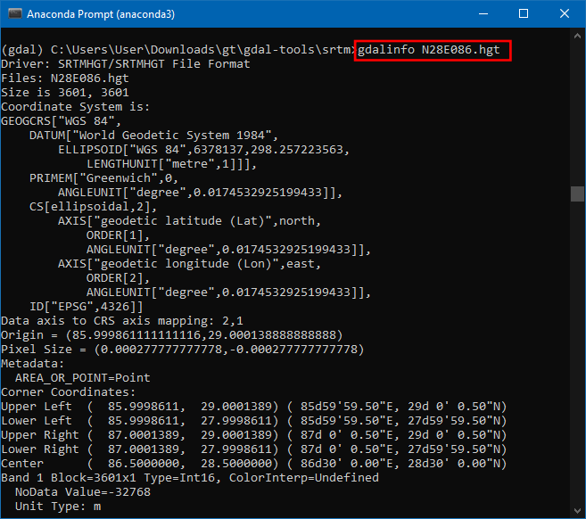
```

A useful parameter is `-stats` which computes and displays image statistics. Run it on the raster to get some statistics of pixel values in the image.
```
gdalinfo -stats N28E086.hgt
```

```{r echo=FALSE, fig.align='center', out.width='75%'}
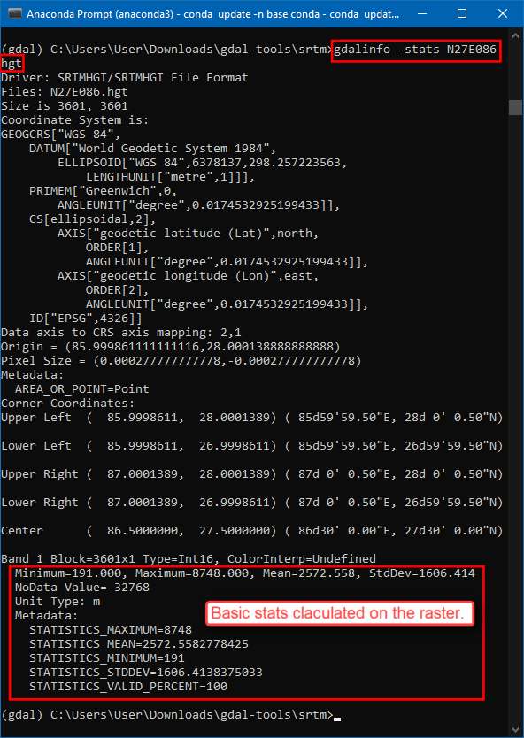
```

### 1.1.1 Merging Tiles

We will now merge the 4 neighboring SRTM tiles into 1 raster so we can work with them together. GDAL provides a useful format called [Virtual Raster](https://gdal.org/drivers/raster/vrt.html) that allows us to create a *Virtual* file with `.vrt` extension that is a pointer to multiple source files. A `.vrt` file is just a text file, so it doesn't consume any disk space but allows us to run any GDAL command as if it was a raster file. 

First we need to create a text file containing all the files we want to merge. We can use the `dir` command on Command prompt to list the files matching the pattern `*.hgt` and redirect the output to a file. Here the `/b` option runs the command in the *Bare* mode which excludes all info except file names. 

**Windows**
```
dir /b *.hgt > filelist.txt
```

For Mac/Linux systems, the same can be achieved using the `ls` command.

**Mac/Linux**
```
ls *.hgt > filelist.txt
```

Once the command finishes, verify that the `filelist.txt` has the names of the source tiles.

```{r echo=FALSE, fig.align='center', out.width='50%'}
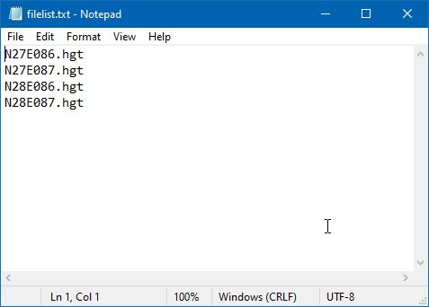
```

We can now use the `gdalbuildvrt` program to create a virtual raster from the source files in the `filelist.txt`.

```
gdalbuildvrt -input_file_list filelist.txt merged.vrt
```

```{r echo=FALSE, fig.align='center', out.width='100%'}
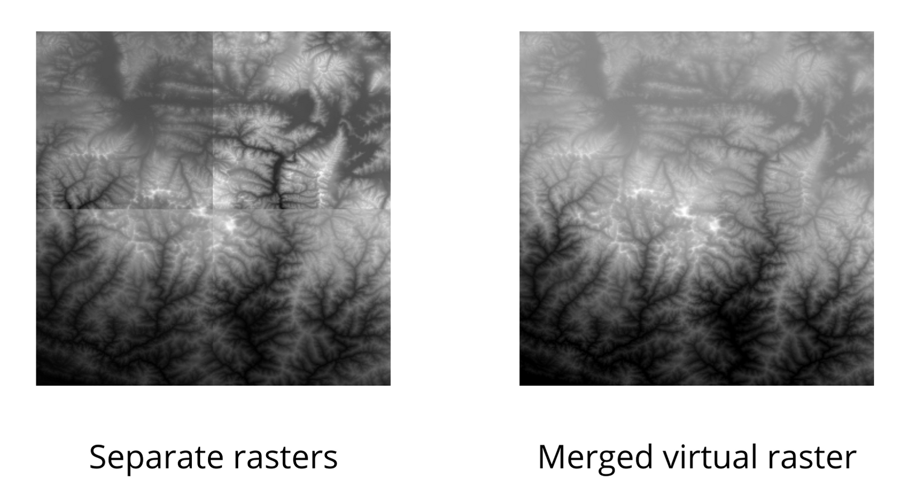
```

> Note: We could have done this operation in a  single step using the command `gdalbuildvrt merged.vrt *.hgt`. However, some versions of GDAL on Windows do not expand the `*` wildcard correctly and the command results in an error. It is recommended to use a file list instead of wildcards with GDAL commands on Windows to avoid unexpected results.[[reference](https://github.com/OSGeo/gdal/issues/1749)]

### Exercise 1

Can you find what is the highest elevation value in the merged raster? Since these rasters are around the Mt.Everest region, the *MAXIMUM* value will be the elevation of the summit.


```{r echo=FALSE, fig.align='center', out.width='75%'}
knitr::include_graphics('images/gdal/exercise1.png')
```

### 1.1.2 Converting Formats

Let's convert the *Virtual Raster* to a GeoTIFF file. `gdal_translate` program allows us to convert between any of the hundreds of data formats supported by GDAL. The format is recognized from the file extension. Alternatively, you can also specify it using the `-of` option with the [short name of the format](https://gdal.org/drivers/raster/index.html) such a **GTiff**.
```
gdal_translate -of GTiff merged.vrt merged.tif
```

```{r echo=FALSE, fig.align='center', out.width='75%'}
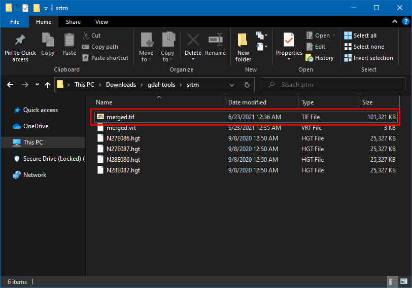
```

### 1.1.3 Compressing Output

[](https://www.youtube.com/watch?v=9iG7uormxPk&list=PLppGmFLhQ1HLVaHVf4TsnJ4HXZBSfxLOK&index=11){target="_blank"}

[Watch the Video &#8599;](https://www.youtube.com/watch?v=9iG7uormxPk&list=PLppGmFLhQ1HLVaHVf4TsnJ4HXZBSfxLOK&index=11){target="_blank"}

[Access the Presentation &#8599;](https://docs.google.com/presentation/d/1WMl2nkUS4fl2qJjPsi5s2X_ST1BXuEFiVQhg0BRf1EI/edit?usp=sharing){target="_blank"}

The default output GeoTIFF file is uncompressed - meaning each pixel's value is stored on the disk without any further processing. For large rasters, this can consume a lot of disk space. A smart approach is to use a lossless compression algorithm to reduce the size of the raster while maintaining full fidelity of the original data. GDAL supports many compression algorithms out-of-the-box and can be specified with GDAL commands using the `-co` option. The most popular loss-less compression algorithms are **DEFLATE**, **LZW** and **PACKBITS**. We can try the `DEFLATE` algorithm on our dataset.

```
gdal_translate -of GTiff merged.vrt merged.tif -co COMPRESS=DEFLATE
```

```{r echo=FALSE, fig.align='center', out.width='75%'}
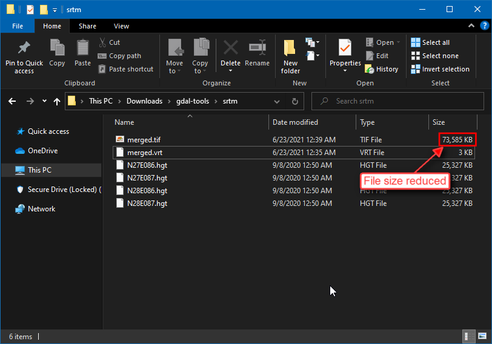
```


The uncompressed file size was **100+ MB**. After applying the  *DEFLATE* compression, the file size was reduced to **75MB**. We can further reduce the file size by specifying additional options. The `PREDICTOR` option helps compress data better when the neighboring values are correlated. For elevation data, this is definitely the case. The `TILED` option will compress the data in blocks rather than line-by-line.

> Note: You can split long commands into multiple lines using the line-continuation character. Windows shell uses `^` as the line-continuation, while Mac/Linux shells use `\` as the line continuation.

**Windows**
```
gdal_translate -of GTiff merged.vrt merged.tif ^
  -co COMPRESS=DEFLATE -co TILED=YES -co PREDICTOR=2
```

**Mac/Linux**
```
gdal_translate -of GTiff merged.vrt merged.tif \
  -co COMPRESS=DEFLATE -co TILED=YES -co PREDICTOR=2
```


```{r echo=FALSE, fig.align='center', out.width='75%'}
knitr::include_graphics('images/gdal/compression3.png')
```

The resulting file now comes out much smaller at **39MB**. Check this article [GeoTIFF compression and optimization with GDAL](https://kokoalberti.com/articles/geotiff-compression-optimization-guide/) to learn more about various options and compression algorithms. 

### 1.1.4 Setting NoData Values

The output from `gdalinfo` program shows that the original data has a *NoData* Value set to `-32768`. We can set a new *NoData* value. The `-a_nodata` option allows us to specify a new value.

**Windows**
```
gdal_translate -of GTiff merged.vrt merged.tif ^
  -co COMPRESS=DEFLATE -co TILED=YES -co PREDICTOR=2 -a_nodata -9999
```

**Mac/Linux**

```
gdal_translate -of GTiff merged.vrt merged.tif \
  -co COMPRESS=DEFLATE -co TILED=YES -co PREDICTOR=2 -a_nodata -9999
```

After running the command, you can verify the results using the `gdalinfo` command.

### 1.1.5 Writing Cloud-Optimized GeoTIFF (COG)

[](https://www.youtube.com/watch?v=vHrT9pKmQgQ&list=PLppGmFLhQ1HLVaHVf4TsnJ4HXZBSfxLOK&index=12){target="_blank"}

[Watch the Video &#8599;](https://www.youtube.com/watch?v=vHrT9pKmQgQ&list=PLppGmFLhQ1HLVaHVf4TsnJ4HXZBSfxLOK&index=12){target="_blank"}

[Access the Presentation &#8599;](https://docs.google.com/presentation/d/1Wbx3ru3lQM5h_vw53OpPx5192IX3cwwXkyszfT2ZeO8/edit?usp=sharing){target="_blank"}

A new format called [Cloud-Optimized GeoTIFF (COG)](https://www.cogeo.org/) is making access to such a vast amount of imagery easier to access and analyze. A *Cloud-optimized* GeoTIFF is behaving just like a regular GeoTIFF imagery, but instead of downloading the entire image locally, you can access *portions* of imagery hosted on a cloud server streamed to clients like QGIS. This makes it very efficient to access this data and even analyze it - without downloading large files. GDAL makes it very easy to create COG files by specifying the `-of COG` option. Specifying the `-co NUM_THREADS=ALL_CPUS` helps speed up the creation process by using all available CPUs for compression and creating internal overviews.

The [GDAL COG Driver](https://gdal.org/drivers/raster/cog.html) has the following creation options `-co` enabled by default. 

* Has internal tiling (i.e. `-co TILED=YES`)
* LZW Compression (i.e. `-co COMPRESS=LZW`)
* Automatic Selection of Predictor (i.e. `-co PREDICTOR=YES` chooses appropriate predictor for data type)

**Windows**
```
gdal_translate -of COG merged.vrt merged_cog.tif ^
  -co COMPRESS=DEFLATE -co PREDICTOR=YES -co NUM_THREADS=ALL_CPUS ^
  -a_nodata -9999
```

**Mac/Linux**
```
gdal_translate -of COG merged.vrt merged_cog.tif \
  -co COMPRESS=DEFLATE -co PREDICTOR=YES -co NUM_THREADS=ALL_CPUS \
  -a_nodata -9999
```

## 1.2 Processing Elevation Data


GDAL comes with the `gdaldem` utility that provides a suite of tools for visualizing and analyzing Digital Elevation Models (DEM). The tool supports the following modes

* Hillshade
* Slope
* Aspect
* Color-relief
* Terrain Ruggedness Index (TRI)
* Topographic Position Index (TPI)
* Roughness

Am important point to note is that the x, y and z units of the DEM should be of same unit. If you are using data in a Geographic CRS (like EPSG:4326) and the height units are in meters, you must specify a scale value using `-s` option.

### 1.2.1 Creating Hillshade

Let's create a hillshade map from the merged SRTM dataset. The `hillshade` mode creates an 8-bit raster with a nice shaded relief effect. This dataset has X and Y units in degrees and Z units in meters. So we specify `111120` as the scale value.

```
gdaldem hillshade merged.tif hillshade.tif -s 111120
```

`gdaldem` supports multiple hillshading algorithms. Apart from the default, it currently includes the following algorithms.

* Combined shading (`-combined`):  A combination of slope and oblique shading.
* Multidirectional shading (`-multidirectional`): A combination of hillshading illuminated from 225 deg, 270 deg, 315 deg, and 360 deg azimuth.

Let's create a hillshade map with the `-multidirectional` option.

```
gdaldem hillshade merged.tif hillshade_combined.tif -s 111120 -multidirectional
```

```{r echo=FALSE, fig.align='center', out.width='100%'}
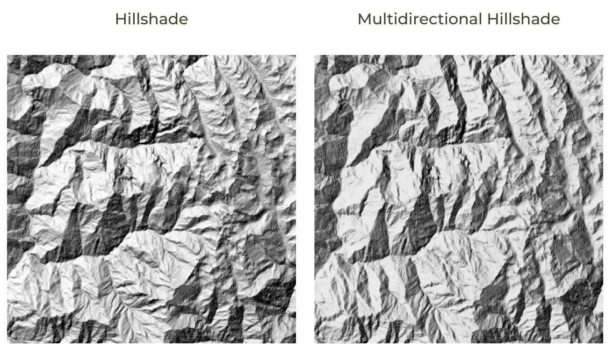
```

> Creating hillshade that is representative of a terrain is more of an 'art' than science. The best hand-drawn relief shading is still done manually by cartographers. Recent advances in Deep Learning have shown promise to reproduce the state-of-the-art relief shading using automated techniques. Learn more about [Cartographic Relief Shading with Neural Networks](https://arxiv.org/pdf/2010.01256.pdf){target="_blank"} and the accompanying software [Eduard](https://eduard.earth/){target="_blank"}.

### 1.2.2 Creating Color Relief

A color relief map is an elevation map where different ranges of elevations are colored differently. The `color-relief` mode can create a color relief map with the colors and elevation ranges supplied in a text file. 

We need to supply the colormap using a text file. Create a new file called `colormap.txt` with the following content and save it in the same directory as `merged.tif`. The format of the text file is `elevation, red, green, blue` values.

```{bash eval=FALSE, code=readLines('code/gdal/colormap.txt')}
```
We can supply this file to create a colorized elevation map.

```
gdaldem color-relief merged.tif colormap.txt colorized.tif
```

```{r echo=FALSE, fig.align='center', out.width='75%', fig.cap='Color Relief'}
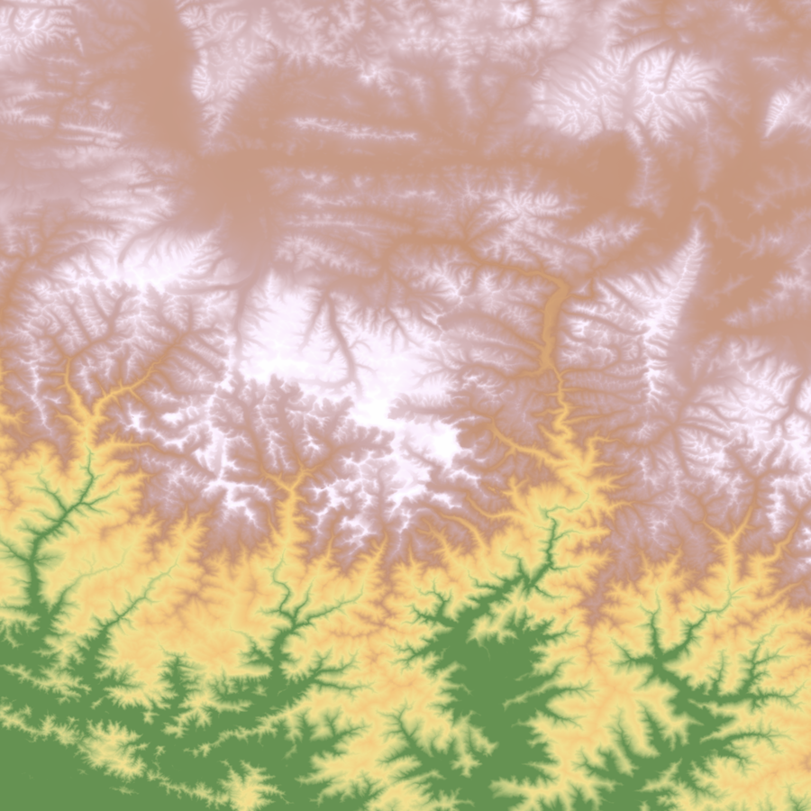
```

### Exercise 2

Save the color relief in the PNG format.


## 1.3 Processing Aerial Imagery

Use the `cd` command to change to the `naip` directory which contains individual aerial imagery tiles in the **JPEG2000** format.

```
cd naip
```

### 1.3.1 Create a preview image from source tiles

The source imagery is heavily compressed and covers a large region. Instead of loading the full resolution tiles in a viewer, it is a good practice to create a preview mosaic that can help us assess the coverage and quality of the data.

We first create a *Virtual Raster* mosaic from all the `.jp2` tiles. We can create a text file containing all the files we want to merge. 

**Windows**
```
dir /b *.jp2 > filelist.txt
```

**Mac/Linux**
```
ls *.jp2 > filelist.txt
```

```{r echo=FALSE, fig.align='center', out.width='75%', fig.cap='Text File with the List of Images'}
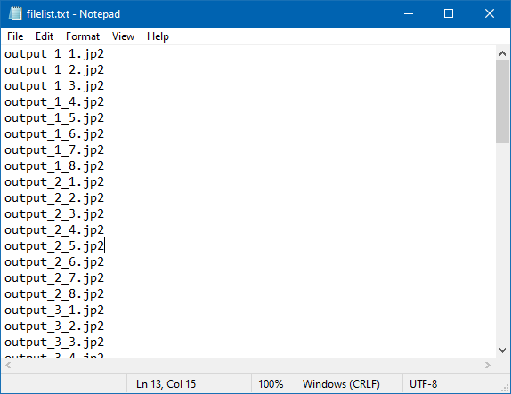
```

We are working with Photometric RGB tiles and want to apply JPEG compression on the result. To avoid JPEG artifact and maintain nodata values, it is a good practice to add an Alpha band which will contain the mask containing all valid pixels. We use the `-addalpha` option to create an alpha band.
```
gdalbuildvrt -addalpha -input_file_list filelist.txt naip.vrt
```

We can use the `-outsize` option and specify a percentage to generate a smaller size preview. The below command generates a 2% preview image in JPEG format. Since we have a 4-band image, we specify which bands to be used for generating the JPG image using the `-b` option.

```
gdal_translate -b 1 -b 2 -b 3 -of JPEG -outsize 2% 2% naip.vrt naip_preview.jpg 
```

```{r echo=FALSE, fig.align='center', out.width='75%'}
knitr::include_graphics('images/gdal/naip_preview.jpg')
```

### 1.3.2 Create a Tile Index

When working with large amounts of imagery tiles, it is useful to generate a tile index. A tile index layer is a polygon layer with the bounding box of each tile. An index layer allows us to check the coverage of the source data and locate specific tiles. It is a simple but effective way to catalog raster data from a hard drive or from a folder on your computer.

`gdaltindex` program creates a tile index from a list of input files. Here we can use the `--optfile` option to supply the list of files via a file.

```
gdaltindex -write_absolute_path index.shp --optfile filelist.txt
```

### 1.3.3 Mosaic and clip to AOI

Let's say we want to mosaic all the source tiles into a single image. We also want to clip the mosaic to a given AOI.

```{r echo=FALSE, fig.align='center', out.width='75%'}
knitr::include_graphics('images/gdal/aoiselection.png')
```

We can use the `gdalwarp` utility to clip the raster using the `-cutline` option. 

```
gdalwarp -cutline aoi.shp  -crop_to_cutline naip.vrt aoi_cut.tif -co COMPRESS=DEFLATE -co TILED=YES
```

We can also add JPEG compression to the output file to reduce the file size. Refer to the post [GeoTiff Compression for Dummies](https://blog.cleverelephant.ca/2015/02/geotiff-compression-for-dummies.html) by Paul Ramsey that gives more insights into compression imagery. Note that JPEG is a lossy compression method and can cause edge artifacts for image mosaics. To prevent this, we specify the `--config GDAL_TIFF_INTERNAL_MASK YES` option that uses the mask from the alpha band.

**Windows**
```
gdal_translate aoi_cut.tif aoi.tif ^
  -co COMPRESS=JPEG -co TILED=YES -co PHOTOMETRIC=YCBCR -co JPEG_QUALITY=75 ^
  -b 1 -b 2 -b 3 -mask 4 --config GDAL_TIFF_INTERNAL_MASK YES
```

**Mac/Linux**
```
gdal_translate aoi_cut.tif aoi.tif \
  -co COMPRESS=JPEG -co TILED=YES -co PHOTOMETRIC=YCBCR -co JPEG_QUALITY=75 \
  -b 1 -b 2 -b 3 -mask 4 --config GDAL_TIFF_INTERNAL_MASK YES
```

```{r echo=FALSE, fig.align='center', out.width='75%'}
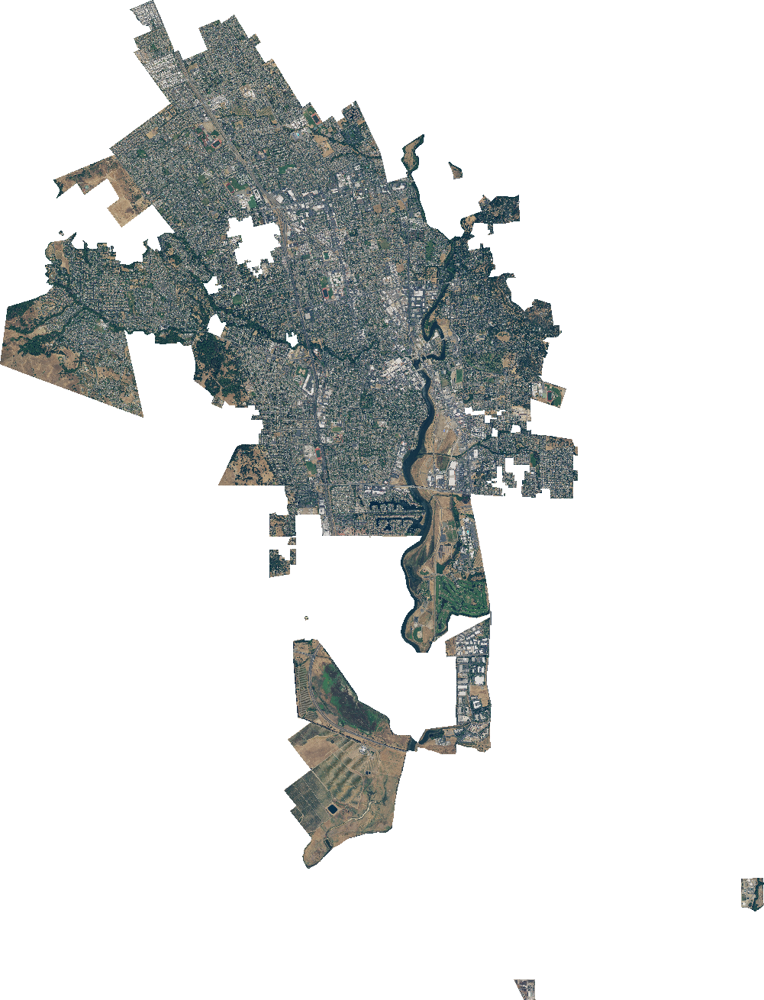
```


### 1.3.4 Creating Overviews

If you try loading the resulting raster into a viewer, you will notice that it takes a lot of time for it to render. Zoom/Pan operations are quite slow as well. This is because the viewer is rendering all the pixels at native resolution. Since this is a very high-resolution dataset, it requires processing a lot of pixels, even if you are zoomed out. A common solution to this problem is to create *Pyramid Tiles* or *Overviews*. This process creates low-resolution versions of the image by averaging pixel values from higher resolution pixels. If the pyramid tiles are present, imagery viewers can use it to speed up the rendering process. GDAL provides the utility `gdaladdo` to create overview tiles. GeoTIFF format supports storing the overviews within the file itself. For other formats, the program generates external overviews in the `.ovr` format.

You can run the `gdaladdo` (**GDAL**-**Add**-**O**verview) command with default options to create internal overviews. Once the overviews are created, try opening the `aoi.tif` in QGIS. You will see that it renders much faster and zoom/pan operations are very smooth.
```
gdaladdo aoi.tif
```

The default overviews use the nearest neighbor resampling. We can pick any resampling method from the many available algorithms. We can try the bilinear interpolation using the `-r bilinear` option. Since the source imagery is JPEG compressed, we will compress the overviews with the same compression.

```
gdaladdo -r bilinear --config COMPRESS_OVERVIEW JPEG aoi.tif
```

## 1.4 Processing Satellite Imagery

This section shows how to use the satellite data from Landsat-8 and create various derived products. Use the `cd` command to switch to the `landsat8` directory which contains Landsat-8 imagery. This directory has 5 individual GeoTIFF files for 5 different bands from a single landsat-8 scene.

| **Band Number** |**Band Name** |
|:----------------|:-------------|
| B2              | Blue         |
| B3              | Green        |
| B4              | Red          |
| B5              | Near Infrared|
| B8              | Panchromatic |

```
cd landsat8
```

### 1.4.1 Merging individual bands into RGB composite

Let's create an RGB composite image by combining three 3 different bands - Red, Green and Blue - into a single image. Here we must use the `-separate` option which tells the command to place each image in a separate band.

> Note: GDAL tools also have a `gdal_merge.py` script that can also merge rasters into an image. But this script loads all rasters into memory before merging them. This can lead to excessive RAM usage and out of memory errors when working with large files. `gdal_merge.py` can also be slower than using `gdal_translate` - when you have large files. So a preferred approach for merging large files would be using the virtual raster as shown here.

**Windows**
```
gdalbuildvrt -o rgb.vrt -separate ^
  RT_LC08_L1TP_137042_20190920_20190926_01_T1_2019-09-20_B4.tif ^
  RT_LC08_L1TP_137042_20190920_20190926_01_T1_2019-09-20_B3.tif ^
  RT_LC08_L1TP_137042_20190920_20190926_01_T1_2019-09-20_B2.tif
```

**Mac/Linux**
```
gdalbuildvrt -o rgb.vrt -separate \
  RT_LC08_L1TP_137042_20190920_20190926_01_T1_2019-09-20_B4.tif \
  RT_LC08_L1TP_137042_20190920_20190926_01_T1_2019-09-20_B3.tif \
  RT_LC08_L1TP_137042_20190920_20190926_01_T1_2019-09-20_B2.tif
```

Then use `gdal_translate` to merge them.

```
gdal_translate rgb.vrt rgb.tif -co PHOTOMETRIC=RGB -co COMPRESS=DEFLATE 
```

Once the command finishes, you can view the result in QGIS. 

```{r echo=FALSE, fig.align='center', out.width='75%'}
knitr::include_graphics('images/gdal/rgb.png')
```

### 1.4.2 Apply Histogram Stretch and Color Correction

The resulting composite appears quite dark and has low-contrast. QGIS applies a default contrast stretch based on the minimum and maximum values in the image. Due to the presence of clouds and cloud-shadows - there are outlier pixels that make the default contrast stretch not optimal.

Here's what the histogram of the RGB composite looks like.

```{r echo=FALSE, fig.align='center', out.width='75%'}
knitr::include_graphics('images/gdal/histogram.png')
```


We can apply a histogram stretch to increase the contrast. This is done using the `-scale` option. Since most of the pixels have a value between 0 and 0.3, we can choose these are minimum and maximum values and apply a contrast stretch to make them go from 0 to 255. The resulting image will be an 8-bit color image where the input pixel values are linearly scaled to the target value.

> Note: Scaling the image will alter the pixel values. The resulting image is suitable for visualization, but they should never be used for analysis. Scientific analysis should always use the un-scaled pixel values.

```
gdal_translate -scale 0 0.3 0 255 -ot Byte rgb.tif rgb_stretch.tif
```


```{r echo=FALSE, fig.align='center', out.width='75%', fig.cap='RGB Composite with Linear Stretch'}
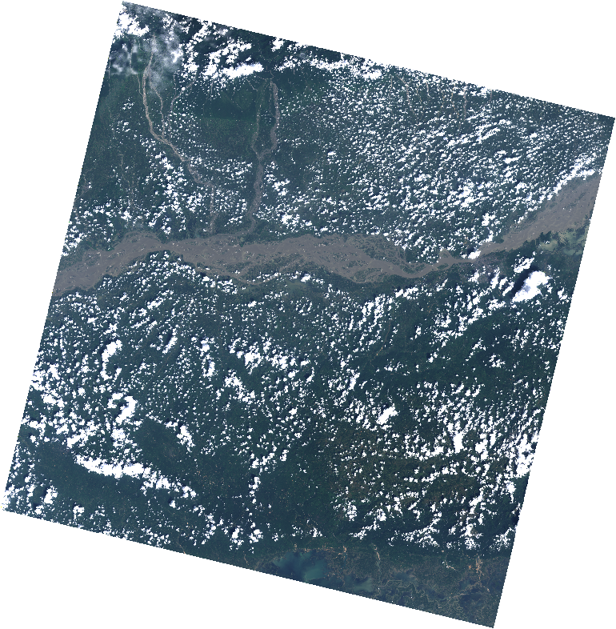
```

We can also apply a non-linear stretch. `gdal_translate` has a `-exponent` option that scales the input values using the following formula. Choosing an exponent value between 0 and 1 will enhance low intensity values - resulting in a brighter image. [Learn more](https://homepages.inf.ed.ac.uk/rbf/HIPR2/pixexp.htm)

Let's try exponent value of **0.5**. The result is a much better looking output.
```
gdal_translate -scale 0 0.3 0 255 -exponent 0.5 -ot Byte rgb.tif rgb_stretch.tif
```

```{r echo=FALSE, fig.align='center', out.width='75%', fig.cap='RGB Composite with Exponential Stretch'}
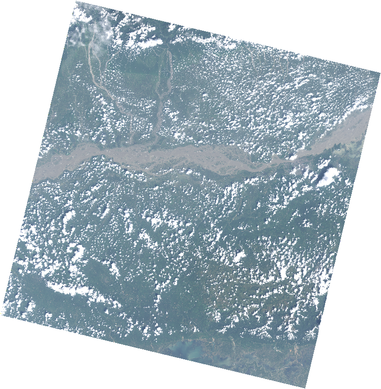
```


### 1.4.3 Raster Algebra

[](https://www.youtube.com/watch?v=P3WwxzhcZrA&list=PLppGmFLhQ1HLVaHVf4TsnJ4HXZBSfxLOK&index=26){target="_blank"}

[Watch the Video &#8599;](https://www.youtube.com/watch?v=P3WwxzhcZrA&list=PLppGmFLhQ1HLVaHVf4TsnJ4HXZBSfxLOK&index=26){target="_blank"}

[Access the Presentation &#8599;](https://docs.google.com/presentation/d/1_MRRAlTLsfaiTmVTvpFP0nKv7Kbm75X82teMztZjwHY/edit?usp=sharing){target="_blank"}

For raster algebra operations, GDAL provides a raster calculator program `gdal_calc.py`. The input rasters are specified using any letters from A-Z. These letters can be then referenced in the expression. The expression is specified using the `--calc` option and it supports NumPy syntax and [functions](https://numpy.org/doc/stable/reference/routines.math.html#). 

```
gdalinfo -stats RT_LC08_L1TP_137042_20190920_20190926_01_T1_2019-09-20_B4.tif
```
It is important to set NoData value. As seen from the output above, NoData is set to **-999**.
 
> Note that Windows users need to specify the full path to the GDAL scripts and run it with the python command as shown below. Mac/Linux users can just type the script name directly but if you get an error, you can also specify the full path on Mac/Linux as `python $CONDA_PREFIX/bin/gdal_merge.py`


**Windows**
```
python %CONDA_PREFIX%\Scripts\gdal_calc.py ^
  -A RT_LC08_L1TP_137042_20190920_20190926_01_T1_2019-09-20_B5.tif ^
  -B RT_LC08_L1TP_137042_20190920_20190926_01_T1_2019-09-20_B4.tif ^
  --outfile ndvi.tif --calc="(A-B)/(A+B)" --NoDataValue=-999
```

**Mac/Linux**
```
gdal_calc.py -A RT_LC08_L1TP_137042_20190920_20190926_01_T1_2019-09-20_B5.tif \
  -B RT_LC08_L1TP_137042_20190920_20190926_01_T1_2019-09-20_B4.tif \
  --outfile ndvi.tif --calc="(A-B)/(A+B)" --NoDataValue=-999
```

```{r echo=FALSE, fig.align='center', out.width='75%'}
knitr::include_graphics('images/gdal/ndvi.png')
```


### Exercise 3

Create an NRG Composite image with Near Infrared, Red and Green bands. Apply a contrast stretch to the result and save it as a PNG image.

```{r echo=FALSE, fig.align='center', out.width='75%', fig.cap='NRG Composite'}
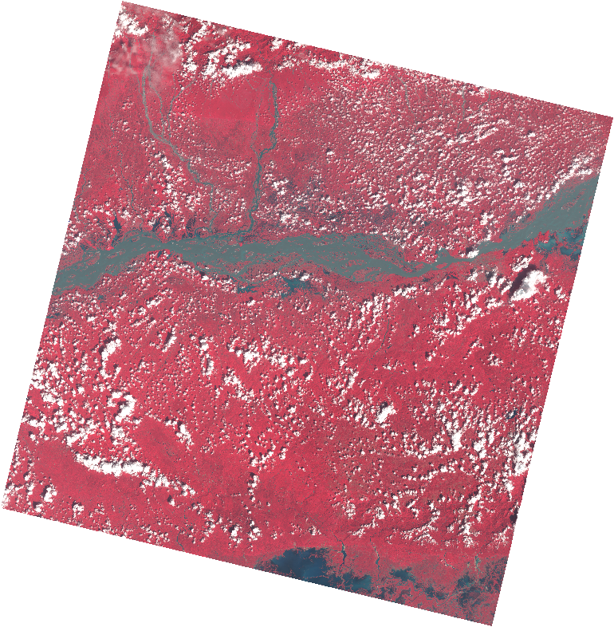
```

### 1.4.4 Pan Sharpening

[](https://www.youtube.com/watch?v=RqlKS6iT488&list=PLppGmFLhQ1HLVaHVf4TsnJ4HXZBSfxLOK&index=28){target="_blank"}

[Watch the Video &#8599;](https://www.youtube.com/watch?v=RqlKS6iT488&list=PLppGmFLhQ1HLVaHVf4TsnJ4HXZBSfxLOK&index=28){target="_blank"}

[Access the Presentation &#8599;](https://docs.google.com/presentation/d/1Gav3_0P1BsOrdrYk-Hi2D4gbLHt1cJakAlARqjsGYzg/edit?usp=sharing){target="_blank"}

Most satellite and airborne sensors capture images in the *Pan-chromatic* band along with other spectral bands. The *Red*, *Green*, and *Blue* bands capture signals in the *Red*, *Green*, and *Blue* portions of the electromagnetic spectrum respectively. But the *Pan*-band captures the data across the entire range of wavelengths in the visible spectrum. This allows the sensor to capture the data in a higher spatial resolution than other bands which capture the signal from a subset of this wavelength range.

Landsat-8 satellite produces images at a **30m** spatial resolution in the *Red*, *Green*, *Blue* bands and at a **15m** spatial resolution in the *Panchromatic* band. We can use the higher spatial resolution of the *Panchromatic* band to improve the resolution of the other bands, resulting in a sharper image with more details. This process is called *Pan-Sharpening*.

GDAL comes with a script `gdal_pansharpen.py` that implements the [Brovey algorithm](https://gdal.org/drivers/raster/vrt.html#gdal-vrttut-pansharpen) to compute the pansharpened output. In the example below we fuse the 15m resolution panchromatic  band (B8) with the RGB composite created in the previous step.

**Windows**
```
python %CONDA_PREFIX%\Scripts\gdal_pansharpen.py RT_LC08_L1TP_137042_20190920_20190926_01_T1_2019-09-20_B8.tif ^
  rgb.tif pansharpened.tif -r bilinear -co COMPRESS=DEFLATE -co PHOTOMETRIC=RGB
```

**Mac/Linux**
```
gdal_pansharpen.py RT_LC08_L1TP_137042_20190920_20190926_01_T1_2019-09-20_B8.tif \
  rgb.tif pansharpened.tif -r bilinear -co COMPRESS=DEFLATE -co PHOTOMETRIC=RGB
```

We can apply the same contrast stretch as before and compare the output. You will notice that the resulting composite is much sharper and can resolve the details in the scene much better.

**Windows**
```
gdal_translate -scale 0 0.3 0 255 -exponent 0.5 -ot Byte -a_nodata 0 ^
  pansharpened.tif pansharpened_stretch.tif
```

**Mac/Linux**
```
gdal_translate -scale 0 0.3 0 255 -exponent 0.5 -ot Byte -a_nodata 0 \
  pansharpened.tif pansharpened_stretch.tif
```

```{r echo=FALSE, fig.align='center', out.width='75%'}
knitr::include_graphics('images/gdal/pansharpen_before.png')
```

```{r echo=FALSE, fig.align='center', out.width='75%'}
knitr::include_graphics('images/gdal/pansharpen_after.png')
```

## 1.5 Processing WMS Layers

GDAL supports reading from a variety of web services, including [Web Map Services (WMS)](https://gdal.org/drivers/raster/wms.html) layers.

### 1.5.1 Listing WMS Layers

NASA's Socioeconomic Data and Applications Center (SEDAC) provides many useful data layers though [WMS Services](https://sedac.ciesin.columbia.edu/maps/services). We can pick the URL for the appropriate service and list all available layers using `gdalinfo`.

```
gdalinfo "WMS:https://sedac.ciesin.columbia.edu/geoserver/ows?version=1.3.0"
```

```{r echo=FALSE, fig.align='center', out.width='100%'}
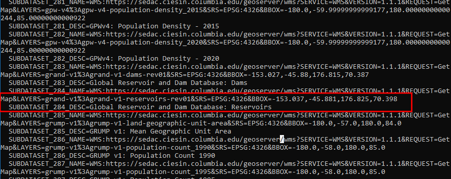
```

We can get more information about a particular layer by specifying the output from the command above. Let's get more info about the [Global Reservoir and Dam (GRanD), v1](https://sedac.ciesin.columbia.edu/data/set/grand-v1-reservoirs-rev01) layer.

```
gdalinfo "WMS:https://sedac.ciesin.columbia.edu/geoserver/ows?SERVICE=WMS&VERSION=1.3.0&REQUEST=GetMap&LAYERS=grand-v1%3Agrand-v1-reservoirs-rev01&CRS=CRS:84&BBOX=-153.037,-45.881,176.825,70.398"
```

### 1.5.2 Creating a Service Description File

GDAL can also create a Service Description XML file from a WMS layer. Many GIS programs, including QGIS recognize these XML files as valid raster layers. This allows users to easily drag-and-drop them into their favorite viewer to access a WMS service without any configuration. `gdal_translate` can write the WMS XML files by specifying `-of WMS` option.

```
gdal_translate -of WMS "WMS:https://sedac.ciesin.columbia.edu/geoserver/ows?SERVICE=WMS&VERSION=1.3.0&REQUEST=GetMap&LAYERS=grand-v1%3Agrand-v1-reservoirs-rev01&CRS=CRS:84&BBOX=-153.037,-45.881,176.825,70.398" reservoirs.xml
```

### 1.5.3 Downloading WMS Layers

Some applications require offline access to WMS layers. If you want to use a WMS layer as a reference map for field-data collection, or use the layer on a system with low-bandwidth, you can create a georeferenced raster from a WMS layer. Depending on the server configuration, WMS layers can serve data for resolutions exceeding their native resolution, so one should explicitly specify the output resolution. We can use `gdalwarp` with the `-tr` option to specify the output resolution you need for the offline raster. In the example below, we create a 0.1 degree resolution raster from the WMS layer.

```
gdalwarp -tr 0.1 0.1 reservoirs.xml reservoirs.tif -co COMPRESS=DEFLATE -co TILED=YES
```

```{r echo=FALSE, fig.align='center', out.width='75%'}
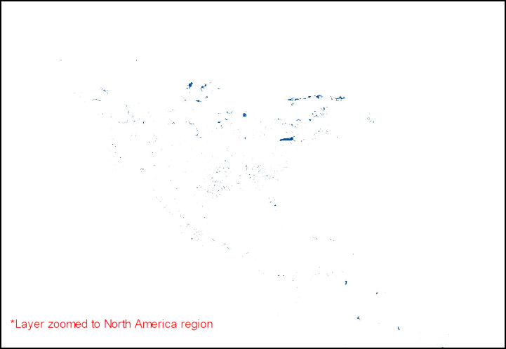
```

We can also extract a higher resolution extract for a specific region by specifying the extent using the `-te` option.

```
gdalwarp -tr 0.005 0.005 -te 68.106 6.762 97.412 37.078 reservoirs.xml reservoirs_india.tif -co COMPRESS=DEFLATE -co TILED=YES
```

```{r echo=FALSE, fig.align='center', out.width='75%'}
knitr::include_graphics('images/gdal/wms5.png')
```

Learn more about offline WMS and comparison between different formats in this article [Offline WMS – Benchmarking raster formats for QField](https://www.opengis.ch/2020/06/09/offline-wms-benchmarking-raster-formats-for-qfield/) by OpenGIS.ch.


### Exercise 4 

Instead of specifying the resolution in degrees, we want to download the layer at a specific resolution in meters. We can re-project the layer to a projected CRS and specify the output resolution in the units of the target CRS.

Create a command that takes the `reservoirs.xml` file and creates a GeoTiff file called `reservoirs_india_reprojected.tif `for the India region at 500m resolution in the CRS **WGS 84 / India NSF LCC (EPSG:7755)**.

You can use the hints below to construct your command.

* Specify the extent using `-te` option as `68.106 6.762 97.412 37.078` in the `xmin ymin xmax ymax` order.
* The extent coordinates are in WGS84 Lat/Lon coordinates. So specify the CRS of the extent coordinates using `-te_srs`.
* Use the `-t_srs` option to specify the target CRS as `EPSG:7755`.
* Use the `-tr` option to specify the X and Y pixel resolution.


## 1.6 Georeferencing

GDAL command-line utilities are extremely useful in batch georeferencing tasks. We will learn 2 different techniques for georeferencing/warping images.

### 1.6.1 Georeferencing Images with Bounding Box Coordinates

Often you get images from web portals that are maps but lack georeferencing information. Data from weather satellites, output from simulations, exports from photo editing software etc. can contain images that reference a fixed frame on the earth but are given in regular image formats such as JPEG or PNG. If the bounding box coordinates and the CRS used in creating these images are known, use `gdal_translate` command to assign georeference information. The  `-a_ullr` option allows you to specify the bounding box coordinates using the Upper-Left (UL) and Lower-Right (LR) coordinates.

Your data package contains the image file `earth_at_night.jpg`. This is a beautifully rendered image of the earth captured at night time. You will see that this is a plain JPEG image without any georeference information.

```
gdalinfo earth_at_night.jpg
```

Since this is a global image, we know the corner coordinates. We can assign the CRS **EPSG:4326** using the `-a_srs` option and specify the bounding box coordinates in the following order `<ulx> <uly> <lrx> <lry>`. 
 
**Windows**
```
gdal_translate -a_ullr -180 90 180 -90 -a_srs EPSG:4326 ^
  earth_at_night.jpg earth_at_night.tif ^
  -co COMPRESS=JPEG -co TILED=YES -co PHOTOMETRIC=RGB
```

**Mac/Linux**
```
gdal_translate -a_ullr -180 90 180 -90 -a_srs EPSG:4326 \
  earth_at_night.jpg earth_at_night.tif \
  -co COMPRESS=JPEG -co TILED=YES -co PHOTOMETRIC=RGB
```

The resulting file `earth_at_night.tif` is a GeoTiff file with the correct georeference information and can now be used in GIS software.

```
gdalinfo earth_at_night.tif
```

```{r echo=FALSE, fig.align='center'}
knitr::include_graphics('images/gdal/earth_at_night.png')
```

### 1.6.2 Georeferencing with GCPs

Another option for georeferencing images it by using Ground Control Points (GCPs) or Tie-Points. A GCP specifies the real-world coordinates for a given pixel in the image. The GCPs can be obtained by reading the map markings or locating landmarks from a georeferenced source. Given a set of GCPs, `gdalwarp` can georeference the image using a variety of transformation types.

Your data package contain an old scanned map called `1870_southern_india.jpg`. 

```{r echo=FALSE, fig.align='center'}
knitr::include_graphics('images/gdal/scanned_map.png')
```

The map has graticule lines with latitude and longitude markings. To obtain the GCPs, we can read the coordinate values at the grid intersections and find the pixel's image coordinates. You can use an image viewer or the *Georeferencer* tool in QGIS to obtain GCPs like below.

|   **pixel (column)**    | **line (row)** | **X (Longitude)**   | **Y (Latitude)** |
|:---------------|:---------|:--------------------|:----------------|
| 418  | 893  | 70 | 15 |
| 380  | 2432 | 70 | 5 |
| 3453 | 2434 | 90 | 5 |
| 3407 | 895  | 90 | 15 |
| 2662 | 911  | 85 | 15 |

The first step is to store these GCPs in the image metadata using utility `gdal_translate`.

**Windows**
```
gdal_translate -gcp 418 893 70 15 -gcp 380 2432 70 5 -gcp 3453 2434  90 5 ^
  -gcp 3407 895 90 15 -gcp 2662 911 85 15 ^
  1870_southern-india.jpg india-with-gcp.tif
```

**Mac/Linux**
```
gdal_translate -gcp 418 893 70 15 -gcp 380 2432 70 5 -gcp 3453 2434  90 5 \
  -gcp 3407 895 90 15 -gcp 2662 911 85 15 \
  1870_southern-india.jpg india-with-gcp.tif
```

Now that the GCPs are stored in the image, we are ready to do the georeferencing. Assuming the CRS of the map is a Geographic CRS based on the Everest 1830 datum, we choose **EPSG:4042** as the target CRS. 

Next, we need to choose the transformation type. `gdalwarp` supports the following transformation types

* *Polynomial 1,2 or 3* using `-order` option
* *Thin Plate Spline* using the `-tps` option

Let's try **Polynomial 1** transformation and check the results.

**Windows**
```
gdalwarp -t_srs EPSG:4042 -order 1 -tr 0.005 0.005  ^
  india-with-gcp.tif india-reprojected-polynomial.tif ^
  -co COMPRESS=JPEG -co JPEG_QUALITY=50 -co PHOTOMETRIC=YCBCR
```

**Mac/Linux**
```
gdalwarp -t_srs EPSG:4042 -order 1 -tr 0.005 0.005 \
  india-with-gcp.tif india-reprojected-polynomial.tif \
  -co COMPRESS=JPEG -co JPEG_QUALITY=50 -co PHOTOMETRIC=YCBCR
```


```{r echo=FALSE, fig.align='center'}
knitr::include_graphics('images/gdal/georeference_gcp.png')
```

### Exercise 5 

Try the Thin-plate-spline transformation on the `india-with-gcp.tif` file and save the results as `india-reprojected-tps.tif` file. Note the Thin-Place-Splie option is available at `-tps` with the `gdalwarp` command.


## Assignment 

UK’s Department of Environment Food & Rural Affairs (DEFRA) provides country-wide LiDAR data and products via the [Defra Data Services Platform](https://environment.data.gov.uk/DefraDataDownload/?Mode=survey) under an open license. 

Your data package contains a folder `london_1m_dsm`. This folder contains 1m resolution Digital Surface Model (DSM) tiles for central London generated from a LIDAR survey. The tiles are in the [Arc/Info ASCII Grid](https://gdal.org/drivers/raster/aaigrid.html) format with the `.asc` extension. The tiles do not contain any projection information but the [metadata](https://environment.data.gov.uk/dataset/6f51a299-351f-4e30-a5a3-2511da9688f7) contains the information that the CRS for the dataset is **EPSG:27700 British National Grid**.

Apply the skills you learnt in this module to create an output product suitable for analysis. The result should be a single georeferenced mosaic in the GeoTIFF format with appropriate compression.

* Hint: Use the `gdal_translate` program with the `-a_srs` option to assign a CRS.

# 2. OGR Tools

We will now learn to process vector data using OGR Tools. These are a suite of tools that are part of the GDAL package and follow the same convention. In addition to format translation, the OGR tools also support running Spatial SQL queries - making them very powerful to build Spatial ETL pipelines.

[](https://www.youtube.com/watch?v=3g6fOVYor4c&list=PLppGmFLhQ1HLVaHVf4TsnJ4HXZBSfxLOK&index=35){target="_blank"}

[Start Module Videos &#8599;](https://www.youtube.com/watch?v=3g6fOVYor4c&list=PLppGmFLhQ1HLVaHVf4TsnJ4HXZBSfxLOK&index=35){target="_blank"}

## 2.1 ETL Basics

In this section, we will see how we can build an Extract-Transform-Load (ETL) process in a step-by-step manner. The example workflow will show you how to

1. Read a CSV data source
2. Convert it to point data layer
3. Assign it a CRS
4. Extract a subset
5. Change the data type of a column
6. Write the results to a GeoPackage.

### 2.1.1 Read a CSV data source

Your data package has a CSV file called `worldcities.csv`. This file contains basic information about major cities in the world along with their coordinates.

Let's use the `ogrinfo` command to inspect the dataset.

```
ogrinfo worldcities.csv
```


```{r echo=FALSE, fig.align='center', out.width='75%'}
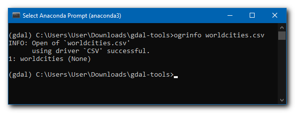
```

The program can open and read the file successfully, but it doesn't show any other info. We can use the `-al` option to actually read all the lines from the file and combine it with the `-so` option to print a summary.

```
ogrinfo -so -al worldcities.csv
```

```{r echo=FALSE, fig.align='center', out.width='75%'}
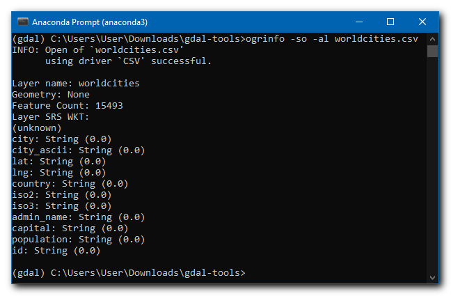
``` 

### 2.1.2 Convert it to point data layer

We now get a summary with the total number of features in the file along with columns and their types. This is a plain CSV file. Let's turn it into a spatial data layer using the X and Y coordinates supplied in the `lng` and `lat` fields. The `-oo` option allows us to specify format-specific options. The [OGR CSV Driver](https://gdal.org/drivers/vector/csv.html#reading-csv-containing-spatial-information) allows specifying a list of column names or a name pattern (such as `Lat*`) s using the `X_POSSIBLE_NAMES` and `Y_POSSIBLE_NAMES` options to specify which columns contain geometry information.

```
ogrinfo -so -al worldcities.csv -oo X_POSSIBLE_NAMES=lng -oo Y_POSSIBLE_NAMES=lat
```

```{r echo=FALSE, fig.align='center', out.width='75%'}
knitr::include_graphics('images/gdal/ogr_csv03.png')
```

OGR is now able to recognize this layer as Point geometry layer. Let's write this to a spatial data format. We can use the `ogr2ogr` utility to translate between different formats. The following command creates a new GeoPackage file called `worldcities.gpkg` from the CSV file.

**Windows**
```
ogr2ogr -f GPKG worldcities.gpkg worldcities.csv ^
  -oo X_POSSIBLE_NAMES=lng -oo Y_POSSIBLE_NAMES=lat 
```

**Mac/Linux**
```
ogr2ogr -f GPKG worldcities.gpkg worldcities.csv \
  -oo X_POSSIBLE_NAMES=lng -oo Y_POSSIBLE_NAMES=lat 
```

```{r echo=FALSE, fig.align='center', out.width='75%'}
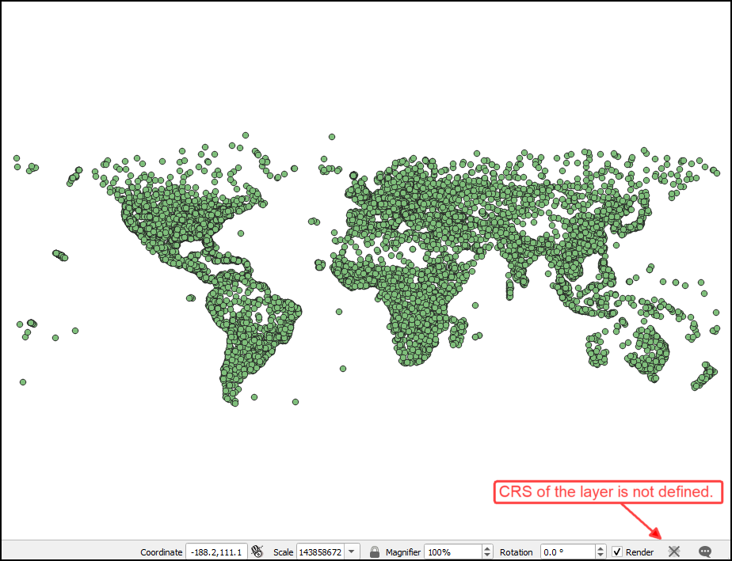
```

### 2.1.3 Assign it a CRS

We can open the result in a GIS software and it shows the cities layer. While the point layer loads fine, it is missing a CRS. We can use the `a_srs` option to assign a CRS to the resulting layer.

**Windows**
```
ogr2ogr -f GPKG worldcities.gpkg worldcities.csv ^
  -oo X_POSSIBLE_NAMES=lng -oo Y_POSSIBLE_NAMES=lat -a_srs EPSG:4326
```

**Mac/Linux**
```
ogr2ogr -f GPKG worldcities.gpkg worldcities.csv \
  -oo X_POSSIBLE_NAMES=lng -oo Y_POSSIBLE_NAMES=lat -a_srs EPSG:4326
```

```{r echo=FALSE, fig.align='center', out.width='75%'}
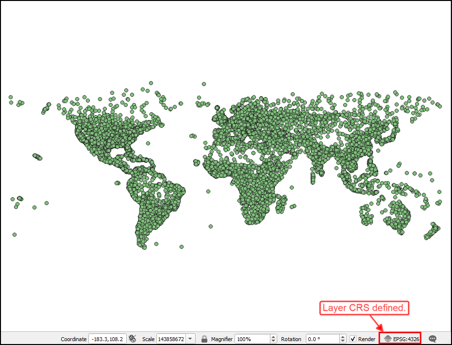
```

### 2.1.4 Extract a subset

OGR tools allow executing SQL queries against the data source. It supports a subset of the SQL capability that is described in the [OGR SQL Syntax](https://gdal.org/user/ogr_sql_dialect.html#ogr-sql-dialect). A simple way to select a subset of features is using the `-where` option. This allows you to specify an attribute query to filter the results. Here we modify our command to extract only the cities where the `country` column has the value **India**.

**Windows**
```
ogr2ogr -f GPKG mycities.gpkg worldcities.csv ^
  -oo X_POSSIBLE_NAMES=lng -oo Y_POSSIBLE_NAMES=lat -a_srs EPSG:4326 ^
  -where "country = 'India'"
```

**Mac/Linux**
```
ogr2ogr -f GPKG mycities.gpkg worldcities.csv \
  -oo X_POSSIBLE_NAMES=lng -oo Y_POSSIBLE_NAMES=lat -a_srs EPSG:4326 \
  -where "country = 'India'"
```

```{r echo=FALSE, fig.align='center', out.width='75%'}
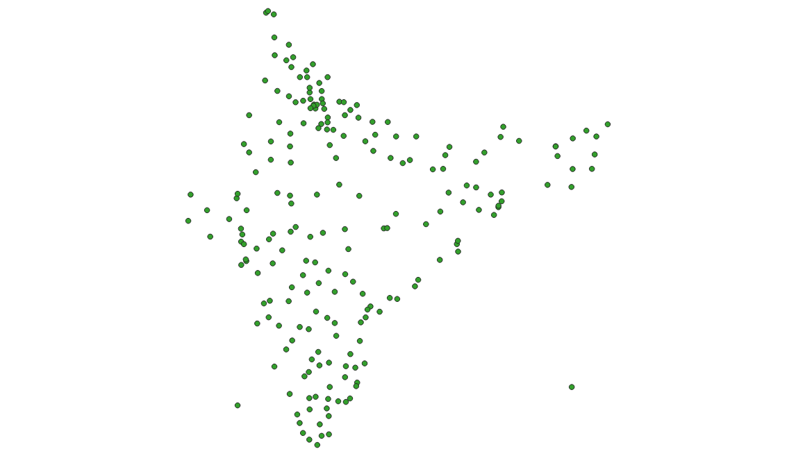
```

### 2.1.5 Change the data type of a column

You can also execute any SQL statement on the input data source. This is a very powerful feature that allows you to filter, join, transform, and summarize the input data. We can apply this on our data layer to transform a column type from string to integer. The column `population` from the input CSV has the type *string*. Since this field is primarily used to store integer values, we can use the `CAST()` SQL function to change the type to *integer*. The `SELECT` statement also allows us to pick only the relevant fields that will get written to the output.

**Windows**
```
ogr2ogr -f GPKG mycities.gpkg worldcities.csv ^
  -oo X_POSSIBLE_NAMES=lng -oo Y_POSSIBLE_NAMES=lat -a_srs EPSG:4326 ^
  -sql "SELECT city, country, CAST(population AS integer) as population ^
    from worldcities where country = 'India'"
```

**Mac/Linux**
```
ogr2ogr -f GPKG mycities.gpkg worldcities.csv \
  -oo X_POSSIBLE_NAMES=lng -oo Y_POSSIBLE_NAMES=lat -a_srs EPSG:4326 \
  -sql "SELECT city, country, CAST(population AS integer) as population \
    from worldcities where country = 'India'"
```

```{r echo=FALSE, fig.align='center', out.width='75%'}
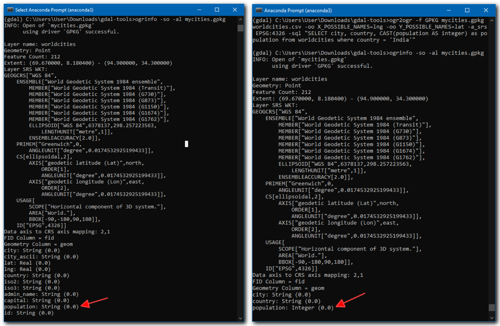
```

### 2.1.6 Rename the layer in GeoPackage.

Lastly, we can rename the name of the output layer using the `-nln` option. 

**Windows**
```
ogr2ogr -f GPKG mycities.gpkg worldcities.csv ^
  -oo X_POSSIBLE_NAMES=lng -oo Y_POSSIBLE_NAMES=lat -a_srs EPSG:4326 ^
  -sql "SELECT city, country, CAST(population AS integer) as population ^
  from worldcities where country = 'India'" -nln mycities
```
**Mac/Linux**
```
ogr2ogr -f GPKG mycities.gpkg worldcities.csv \
  -oo X_POSSIBLE_NAMES=lng -oo Y_POSSIBLE_NAMES=lat -a_srs EPSG:4326 \
  -sql "SELECT city, country, CAST(population AS integer) as population \
  from worldcities where country = 'India'" -nln mycities
```

```{r echo=FALSE, fig.align='center', out.width='75%'}
knitr::include_graphics('images/gdal/ogr_csv08.png')
```

This shows the power of OGR command-line tools. In just a single line, we can read, filter, transform and write the results in any output format supported by OGR. 

### Exercise 6

Write a command using `ogr2ogr` that performs the following operations. 

* Read the newly created `mycities` layer from the `mycities.gpkg` file.
* Reproject the layer to a new CRS **EPSG:7755** (WGS84 / India NSF LCC).
* Save the results as a shapefile `mycities.shp`

All of the above operations should be done in a single-command. Once you arrive at a solution, see if you can improve it by working on the following challenges:

* Challenge 1: You will get a warning that some field values could not be written correctly. This is because the default encoding for the Shapefile format is *ISO-8859-1* - which doesn't support non-latin characters. You can specify the encoding to **UTF-8** using the `-lco` option in `ogr2ogr` command. *Hint: Review the [Layer Creation Options](https://gdal.org/drivers/vector/shapefile.html#layer-creation-options) for the shapefile driver to see the correct syntax*.

* Challenge 2: While you are exploring the Layer Creation Options, add an option to create a spatial index on the output shapefile. *Hint: You can specify the `-lco` option multiple times in the command.*

## 2.2 Merging Vector Files

Another useful utility provided by OGR is [ogrmerge.py](https://gdal.org/programs/ogrmerge.html). This command can merge several vector layers into a single data layer. It also has several options to control how the datasets are merged - making it a very handy tool for data processing tasks.

We will work with several GeoJSON files containing locations of earthquakes. Your data package contains several GEOJSON files in the `earthquakes/` directory. We will merge these 12 files into a single file. Switch to the directory

```
cd earthquakes
```

We will create a geopackage file by merging all files in the directory. Windows users may need to specify the full path to `ogrmerge.py` script as follows.

*Windows*
```
python %CONDA_PREFIX%\Scripts\ogrmerge.py -o earthquakes.gpkg *.geojson
```

*Mac/Linux*
```
ogrmerge.py -o earthquakes.gpkg *.geojson
```


```{r echo=FALSE, fig.align='center', out.width='75%'}
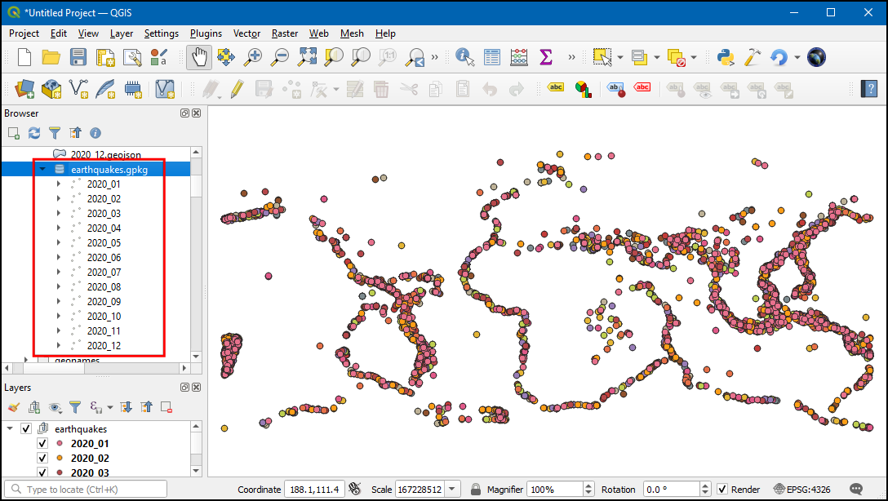
```

The result will be a single geopackage containing 12 layers - one for each source file. For most applications, it will be preferable to combine source files into a single layer. We can use the `-single` option to indicate we want a single layer as the output. We also use the `-nln` option to specify the name of the merged layer. Since the GeoPackage dataset already exists, we need to specify the `-overwrite_ds` to overwrite the file with the new content.

*Windows*
```
python %CONDA_PREFIX%\Scripts\ogrmerge.py -o earthquakes.gpkg *.geojson ^
  -single -nln all_earthquakes -overwrite_ds
```

*Mac/Linux*
```
ogrmerge.py -o earthquakes.gpkg *.geojson \
  -single -nln all_earthquakes -overwrite_ds
```

Now you will have a single layer named `all_earthquakes` in the GeoPackage containing all earthquakes recorded during the year.

```{r echo=FALSE, fig.align='center', out.width='75%'}
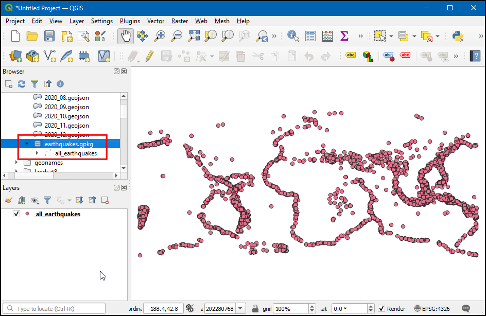
```


> Tip: There is a very useful option `-src_layer_field_name` that can add a new field to the output layer containing the name of the input file which contributed that particular record.

### Exercise 7

Create a new GeoPackage `large_earthquakes.gpkg` containing only the earthquakes with magnitude greater than 4.5.

* Use `ogr2ogr` utility to read the `earthquakes.gpkg` file created in the previous section.
* Use the `-where` option to write the query to filter the records where `mag` field has values greater `>4.5`.

Challenge: Instead of creating a new geopackage, add a layer named `large_earthquakes` to the existing `earthquakes.gpkg` file. *Hint: Use the `-update` option along with `-nln` to specify the layer name.*


## 2.3 Geoprocessing and Spatial Queries

We have seen examples of using SQL queries in OGR commands. So far we have used the queries that adhere to the OGR SQL Dialect. OGR Tools also have support [SQLite dialect](https://gdal.org/user/sql_sqlite_dialect.html). The major advantage of using the SQLite dialect is that you can use Spatial SQL functions provided by [Spatialite](http://www.gaia-gis.it/spatialite/). This enables a wide range of applications where you can do spatial queries using OGR tools. A major difference when using the SQLite dialect is that you must specify the geometry column explicitly.

Let's do some geoprocessing and see how we can use spatial queries with OGR Tools. Your data package as a geopackage file `spatial_query.gpkg`. This geopackage contains 2 layers.

* `metro_stations`: Point layer with metro rail locations in the city of Melbourne.
* `bars_and_pubs`: Point layer with locations of bars and pubs in the city of Melbourne.

Let's see how we can add a new layer to this geopackage with all bars and pubs that are within 500m of a metro station.


### 2.3.1 Reprojecting Vector Layers

The source data layers are in the CRS `EPSG:4326`. As we want to run a spatial query with distance in meters, let's reproject both the layers to a projected CRS. Let's use the `ogr2ogr` command to reproject both the input layers and save them into the same geopackage. We can use `-t_srs` option allows us to specify **EPSG:7855** (GDA2020 / MGA Zone 55) as the target projection. the `-update` option along with `-nln` tells `ogr2ogr` to create a new layer and save it in the same geopackage.

**Windows**
```
ogr2ogr -t_srs EPSG:7855 spatial_query.gpkg spatial_query.gpkg ^
  bars_and_pubs -update -nln bars_and_pubs_reprojected
ogr2ogr -t_srs EPSG:7855 spatial_query.gpkg spatial_query.gpkg ^
  metro_stations -update -nln metro_stations_reprojected
```

**Mac/Linux**
```
ogr2ogr -t_srs EPSG:7855 spatial_query.gpkg spatial_query.gpkg \
  bars_and_pubs -update -nln bars_and_pubs_reprojected
ogr2ogr -t_srs EPSG:7855 spatial_query.gpkg spatial_query.gpkg \
  metro_stations -update -nln metro_stations_reprojected
```

```{r echo=FALSE, fig.align='center', out.width='75%'}
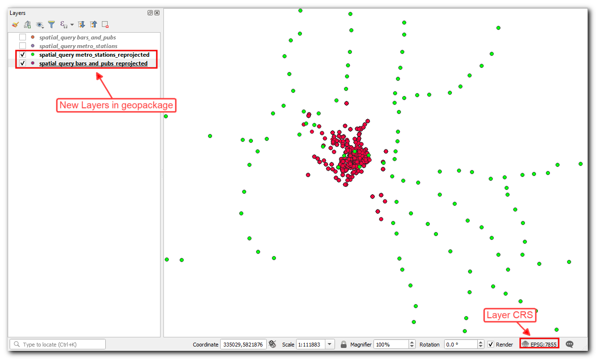
```

### 2.3.2 Creating Buffers

Let's buffer the `metro_stations_reprojected` layer using a distance of **500** meters. Here we specify the SQL query with the `-sql` option. Note the use of the `ST_Buffer()` function which is provided by the Spatialite engine. We need to specify `-dialect SQLITE` as the query uses spatial functions.

> Spatial database functions often have the `ST_` prefix. ST stands for **Spatial Type**.

**Windows**
```
ogr2ogr spatial_query.gpkg spatial_query.gpkg -update -nln metro_stations_buffer ^
  -sql "SELECT m.station, ST_Buffer(m.geom, 500) as geom FROM ^
    metro_stations_reprojected m" -dialect SQLITE 
```

**Mac/Linux**
```
ogr2ogr spatial_query.gpkg spatial_query.gpkg -update -nln metro_stations_buffer \
  -sql "SELECT m.station, ST_Buffer(m.geom, 500) as geom FROM \
    metro_stations_reprojected m" -dialect SQLITE 
```

```{r echo=FALSE, fig.align='center', out.width='75%', fig.cap='Metro Station Buffers'}
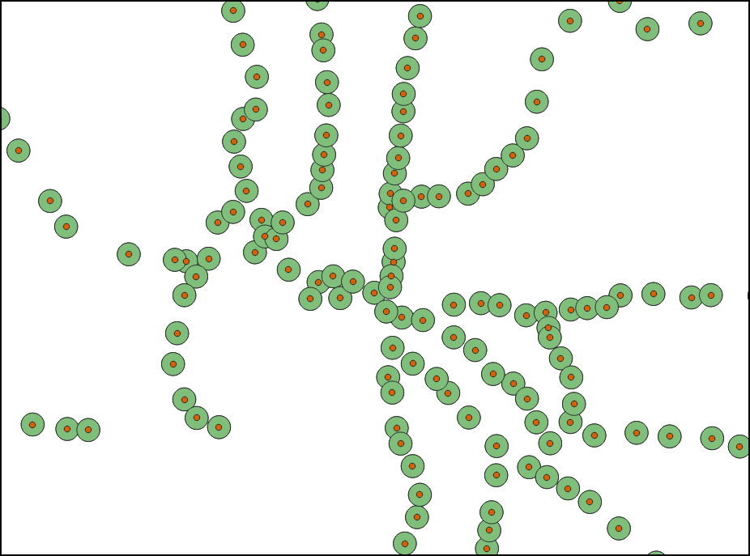
```

This query results in individual overlapping buffers. We can dissolve the buffers using `ST_Collect()` function.

**Windows**
```
ogr2ogr spatial_query.gpkg spatial_query.gpkg -update ^
  -nln metro_stations_buffer_dissolved -sql "SELECT ST_Union(d.geom) as geom ^
    FROM (SELECT ST_Collect(buffer(m.geom, 500)) as geom ^
    FROM metro_stations_reprojected m) as d" -dialect SQLITE
```

**Mac/Linux**
```
ogr2ogr spatial_query.gpkg spatial_query.gpkg -update \
  -nln metro_stations_buffer_dissolved -sql "SELECT ST_Union(d.geom) as geom \
  FROM (SELECT ST_Collect(buffer(m.geom, 500)) as geom \
  FROM metro_stations_reprojected m) as d" -dialect SQLITE
```

```{r echo=FALSE, fig.align='center', out.width='75%', fig.cap='Dissolved Buffers'}
knitr::include_graphics('images/gdal/geoprocessing3.png')
```

### 2.3.3 Performing Spatial Queries

Now that we have a polygon layer with the buffer region around the metro stations, we can use the [`ogr_layer_algebra.py`](https://gdal.org/programs/ogr_layer_algebra.html) tool to select the metro stations falling within the buffer region. This tool can perform various types of spatial queries, including Intersection, Difference (Erase), Union etc. We will use the *Clip* mode to select features from the input layer clipped to the features from the secondary layer.

**Windows**
```
python %CONDA_PREFIX%\Scripts\ogr_layer_algebra.py Clip ^
  -input_ds spatial_query.gpkg -input_lyr bars_and_pubs_reprojected ^
  -method_ds spatial_query.gpkg -method_lyr metro_stations_buffer_dissolved ^
  -output_ds output.gpkg -output_lyr selected -nlt POINT
```

**Mac/Linux**
```
ogr_layer_algebra.py Clip \
  -input_ds spatial_query.gpkg -input_lyr bars_and_pubs_reprojected \
  -method_ds spatial_query.gpkg -method_lyr metro_stations_buffer_dissolved \
  -output_ds output.gpkg -output_lyr selected -nlt POINT
```

```{r echo=FALSE, fig.align='center', out.width='75%'}
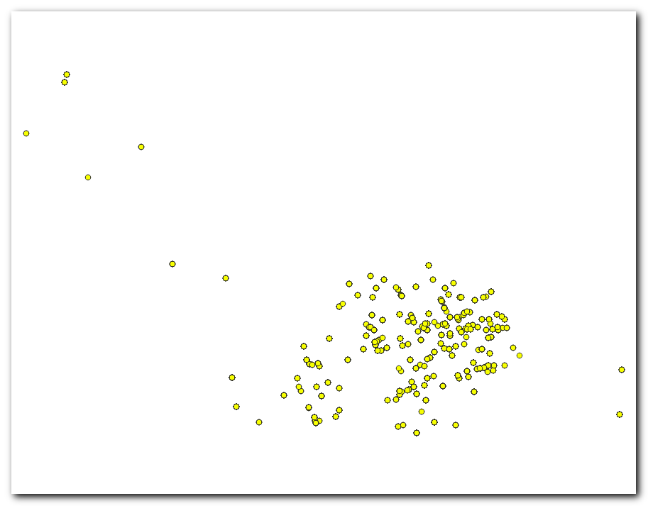
```

### 2.3.4 Data Cleaning

The previous query does the job and you find all points that are within the buffer region. But you will notice that there are many duplicate points at the same location. Upon inspecting, you will note that the source data contains multiple features for each establishment from different years. We can run a final SQL query to de-duplicate the data by selecting the feature from the latest year for each establishment. Note that some column names have spaces in the names, so we enclose them in double-quotes.

**Windows**
```
ogr2ogr -t_srs EPSG:4326 output.gpkg output.gpkg -update ^
  -nln cleaned -sql "SELECT t1.* FROM selected t1 ^
  JOIN (SELECT \"Property ID\", MAX(\"Census year\") as year FROM selected ^
  GROUP BY \"Property ID\") t2 ON t1.\"Property ID\" = t2.\"Property ID\" ^
  AND t1.\"Census year\" = t2.year"
```

**Mac/Linux**
```
ogr2ogr -t_srs EPSG:4326 output.gpkg output.gpkg -update \
  -nln cleaned -sql "SELECT t1.* FROM selected t1 \
  JOIN (SELECT \"Property ID\", MAX(\"Census year\") as year FROM selected \
  GROUP BY \"Property ID\") t2 ON t1.\"Property ID\" = t2.\"Property ID\" \
  AND t1.\"Census year\" = t2.year"
```

```{r echo=FALSE, fig.align='center', out.width='75%'}
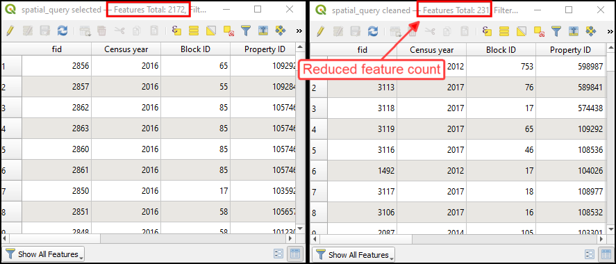
```

\newpage

# 3. Running commands in batch

You can run the GDAL/OGR commands in a loop using Python. For example, if we wanted to convert the format of the images from JPEG200 to GeoTiff for all files in a directory, we would want to run a command like below for every image. Here we want the `{input}` and `{output}` values to be determined from the files in a directory.

```
gdal_translate -of GTiff -co COMPRESS=JPEG {input} {output}
```

But it would be a lot of manual effort if you want to run the commands on hundreds of input files. Here's where a simple python script can help you automate running the commands in a batch. The data directory contains a file called `batch.py` with the following python code.

```{python eval=FALSE, code=readLines('code/gdal/batch.py')}
```

In Anaconda Prompt, run the following command from `gdal-tools` directory to start batch processing on all tiles contained in the `naip/` directory.

```
python batch.py
```

The data directory also contains an example of running the batch commands in parallel using python's built-in multiprocessing library. If your system has multi-core CPU, running commands in parallel like this on multiple threads can give you performance boost over running them in series.

```{python eval=FALSE, code=readLines('code/gdal/batch_parallel.py')}
```

The script runs the commands both in parallel and serial mode and prints the time taken by each of them.

```
python batch_parallel.py
```

\newpage

# 4. Automating and Scheduling GDAL/OGR Jobs

The easiest way to run commands on a schedule on a Linux-based server is using a [Cron Job](https://towardsdatascience.com/create-your-first-cronjob-on-the-linux-server-74e2fdc76e78).

You will have to edit your `crontab` and schedule the execution of your script (either Shell Script or Python Script). The key is to activate the conda environment before execution of the script.

Assuming you have created a script to execute some GDAL/OGR commands and placed it at `/usr/local/bin/batch.py`, here's a sample crontab entry that executes it every morning at 6am.

```
0 6 * * * conda activate gdal;python /use/local/bin/batch.py; conda deactivate
```

If you get an error while execution, you may have to include some environment variables in the crontab file so it can find `conda` correctly. [Learn more](https://unix.stackexchange.com/questions/454957/cron-job-to-run-under-conda-virtual-environment).

```
SHELL=/bin/bash
BASH_ENV=~/.bashrc
0 6 * * * conda activate gdal;python batch-parallel.py; conda deactivate
```

# Tips for Improving Performance

## Configuration Options

GDAL has several [configuration options](https://gdal.org/user/configoptions.html) that can be tweaked to help with faster processing.

* `--config GDAL_CACHEMAX 512`: This option is the one that helps speed up most GDAL commands by allowing them to use larger amount of RAM (512 MB) reading/writing data.
* `--config GDAL_NUM_THREADS ALL_CPUS`: This option helps speed up write speed by using multiple threads for compression.
* `--debug on`: Turn on debugging mode. This prints additional information that may help you find performance bottlenecks.

## Multithreading

`gdalwarp` utility supports multithreaded processing. There are 2 different options for parallel processing.

* `-multi`: This option parallelizes I/O and CPU operations.
* `-wo NUM_THREADS=ALL_CPUS`: This option parallelizes CPU operations over several cores.

There is also another option that allows `gdalwarp` to use more RAM for caching. This option is very helpful to speed up operations on large rasters

* `-wm`: Set a higher memory for caching

All of these options can be combined that may result in faster processing of the data.

```
gdalwarp -cutline aoi.shp  -crop_to_cutline naip.vrt aoi.tif -co COMPRESS=DEFLATE -co TILED=YES -multi -wo NUM_THREADS=ALL_CPUS -wm 512 --config GDAL_CACHEMAX 512
```

# Supplement

## Check Supported Formats and Capabilities

The GDAL binaries are built to include support for many common data formats. To check what formats are supported in your GDAL distribution, you can run the following command

```
gdalinfo --formats
```

Alternatively the `--format` flag can be used with any other utilities like `gdal_translate` or `ogrinfo` to obtain this list.

The output lists the shortnames of all the drivers, whether supports vector or raster data along with abbreviations indicating the capabilities.

| Abbreviation | Capabilities |
| ------------ | ------------ |
| r            | read         |
| ro           | read only   |
| w            | write (create dataset) |
| w+           | write with (support to update) |
| s            | supports subdatasets |
| v            | supports virtual access - eg. /vsimem/ |

That means an abbreviation of `rov` indicates that it is a read-only format that supports virtual access.

QGIS distributes versions of GDAL that also has support for non-open formats, such as MrSID. You can use the commands from the included GDAL distribution. The location will depend on the platform and the distribution. Below is an example of how to set the correct path and environment variables for using that.

Open a Command Prompt/Terminal and run the following to set the correct path.

**Windows**
```
set OSGEO4W_ROOT=C:\OSGeo4W
call "%OSGEO4W_ROOT%\bin\o4w_env.bat" 
set PATH=%OSGEO4W_ROOT%\bin;%OSGEO4W_ROOT%\apps\qgis-ltr\bin
```

**Mac**
```
export PATH=/Applications/$QGIS_VERSION.app/Contents/MacOS/bin:$PATH
```

Running `gdalinfo --formats` will not list MrSID and other proprietary formats.

## Extracting Image Metadata and Statistics

You can run `gdalinfo` command with the `-json` option which returns the info as a JSON string. This allows you to programatically access the information and parse it. 

Let's say we want to extract the maximum value of the `merged.vrt` created in the [Merging Tiles](#merging-tiles) section. We can get the output of the command as a JSON by supplying the `-json` option.

```
gdalinfo -stats -json merged.vrt
```

Next, we need a way to parse the JSON and extract the fields we are interested in. There are many other command-line utilities designed to do just that. Here we use the popular JSON processing utility [jq](https://stedolan.github.io/jq/). You can download and install the `jq CLI` for your operating system and make sure it is in the system path. Then we can extract the required data using the `jq` query like below.

```
gdalinfo -stats -json merged.vrt | jq ".bands[0].maximum"
```

```{r echo=FALSE, fig.align='center', out.width='60%'}
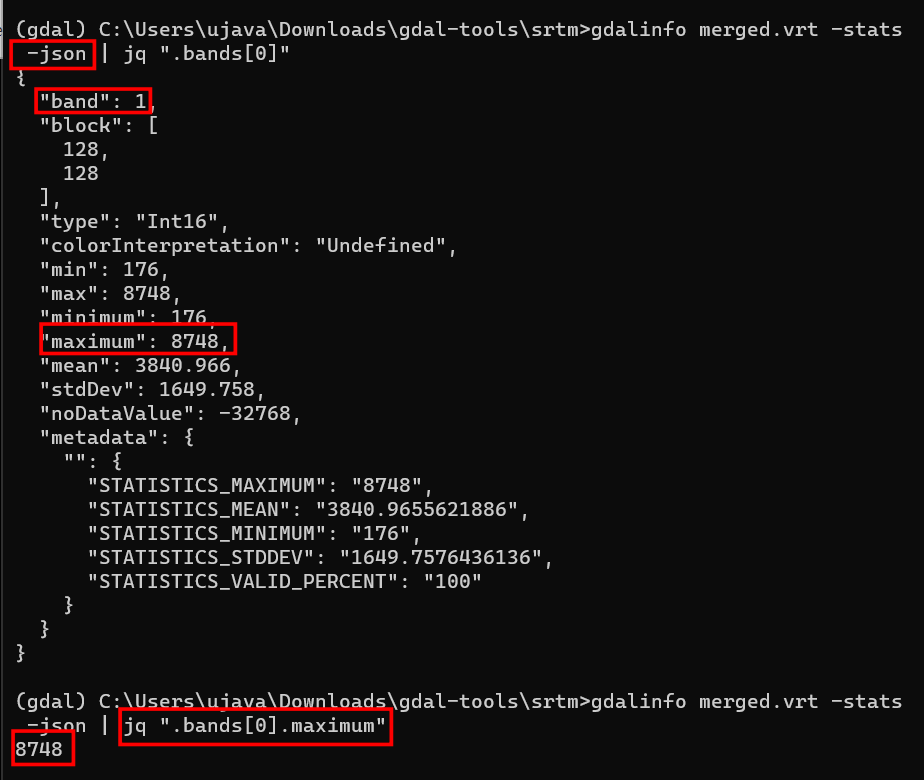
```

Alternatively, you can also run the command via Python and use the `json` module to parse and extract the results. The code below shows how to extract the min and max values for each of the SRTM tiles used in the example earlier.

```{python eval=FALSE, code=readLines('code/gdal/gdalinfo.py')}
```

## Validating COGs

If you want to check whether a given GeoTIFF file is a valid Cloud-Optimized GeoTIFF (COG) or not, there are several methods.

1. Using the `rio` command-line utility

Rasterio provides a command-line utility called [rio](https://rasterio.readthedocs.io/en/stable/cli.html){target="_blank"} to perform various raster operations on the command-line. The [rio-cogeo](https://cogeotiff.github.io/rio-cogeo/){target="_blank"} plugin to Rasterio adds support for creation and validation of COGs.

You can install the required libraries in your conda environment as follows.

```
conda create --name cogeo
conda activate cogeo
conda install -c conda-forge rasterio rio-cogeo
```

Once installed, you can validate a COG using the `rio cogeo` command.

```
rio cogeo validate merged_cog.tif
```

This works on cloud-hosted files as well.

```
rio cogeo validate /vsicurl/https://storage.googleapis.com/spatialthoughts-public-data/ntl/viirs/viirs_ntl_2021_global.tif
```

2. Using Python

You can use the [validate_cloud_optimized_geotiff.py](https://github.com/rouault/cog_validator/blob/master/validate_cloud_optimized_geotiff.py) script to check whether a file is a valid COG.

```
python validate_cloud_optimized_geotiff.py merged_cog.tif
```

You can also use it in your Python script as follows

```
import validate_cloud_optimized_geotiff.py
validate_cloud_optimized_geotiff.validate('merged_cog.tif')
```

## Creating Contours

> Note : The `merged.tif` file used below was created in the [Merging Tiles](#merging-tiles) section.

The GDAL package comes with the utility `gdal_countour` that creates contour lines and polygons from DEMs.

You can specify the interval between contour lines using the  `-i` option.
```
gdal_contour merged.tif contours.gpkg -i 500
```

```{r echo=FALSE, fig.align='center', out.width='75%', fig.cap='Contour Lines from DEM'}
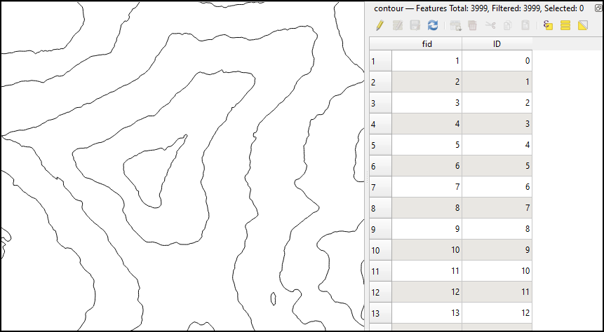
```

Running the command with default options generates a vector layer with contours but they do not have any attributes. If you want to label your contour lines in your map, you may want to create contours with elevation values as an attribute. You can use the `-a` option and specify the name of the attribute.
```
gdal_contour merged.tif contours.gpkg -i 500 -a elev
```

```{r echo=FALSE, fig.align='center', out.width='75%', fig.cap='Contour Lines with Elevation Attribute'}
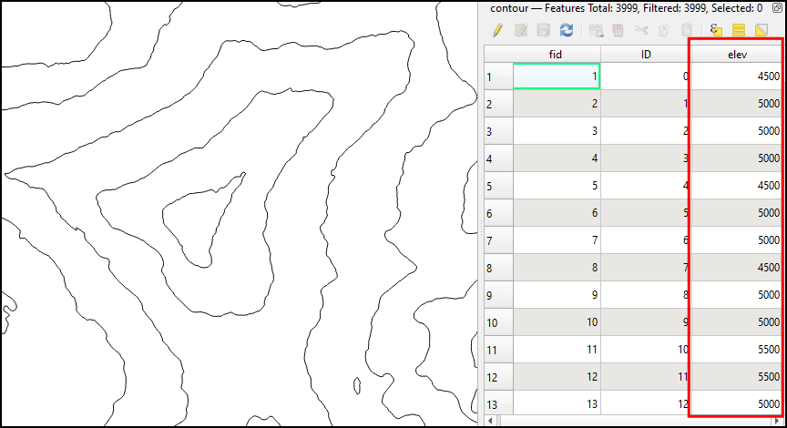
```

You can also create polygon contours. Polygon contours are useful in some applications such as hydrology where you want to derive average depth of rainfall in the region between isohyets. You can specify the `-p` option to create polygon contours. The options `-amin` and `-amax` can be provided to specify the attribute names which will store the min and max elevation for each polygon. The command below creates a contour shapefile for the input `merged.tif` DEM.

```
gdal_contour merged.tif contour_polygons.shp -i 500 -p -amin MINELEV -amax MAXELEV
```

```{r echo=FALSE, fig.align='center', out.width='75%', fig.cap='Contour Polygons with Elevation Attributes'}
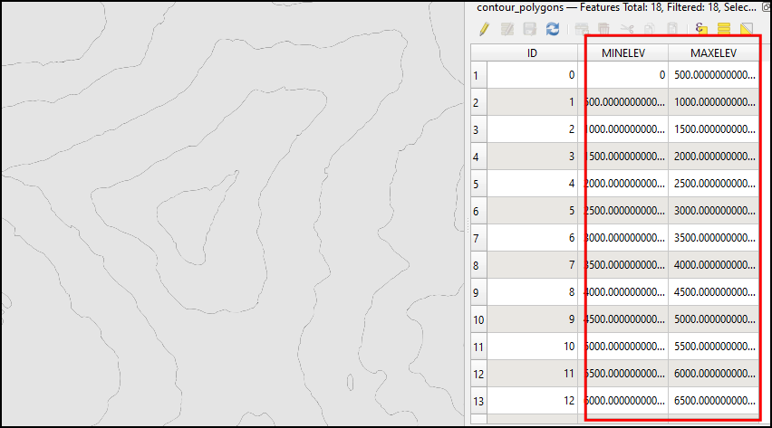
```

## Creating Colorized Imagery

We can use `gdaldem color-relief` command to apply a color palette to any  one-band image to create a rendered image. 

We create a file `ntl_colormap.txt` containing the pixel intensity values mapped to RGB colors. The key `nv` is used to assign a color to NoData values.

```
0 0 0 4
20 145 43 129
40 251 133 96
50 254 216 154
60 252 253 191
nv 255 255 255
```

Apply the colormap to the single-band nighttime lights image.

```
gdaldem color-relief \
  /vsicurl/https://storage.googleapis.com/spatialthoughts-public-data/ntl/viirs/viirs_ntl_2021_india.tif \
  ntl_colormap.txt ntl_colorized.tif
```

Convert the colorized GeoTIFF to a PNG. Specify the value 255 to set the transparency for the NoData values.

```
gdal_translate -of PNG -a_nodata 255 ntl_colorized.tif ntl_colorized.png
```

```{r echo=FALSE, fig.align='center', out.width='75%'}
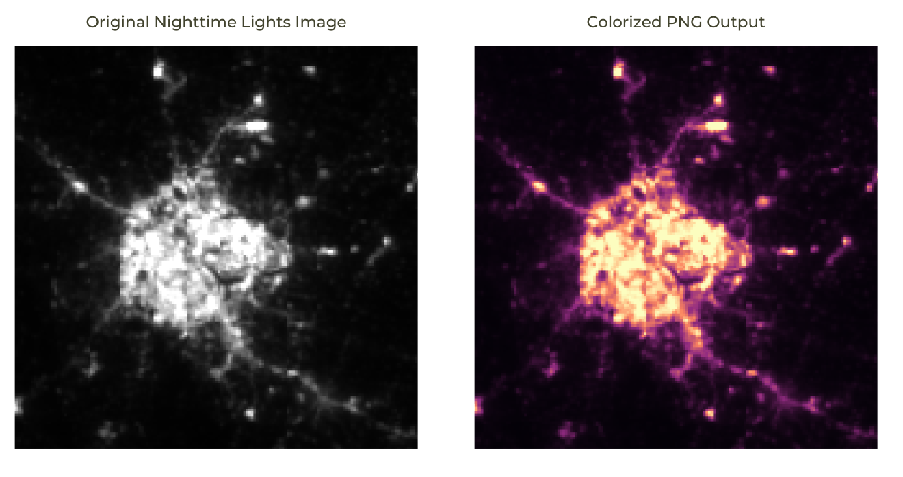
```

## Creating Colorized Hillshade

If you want to merge hillshade and color-relief to create a colored shaded relief map, you can use use `gdal_calc.py` to create do gamma and overlay calculations to combine the 2 rasters. [^1]

[^1]: Code reference https://gis.stackexchange.com/questions/255537/merging-hillshade-dem-data-into-color-relief-single-geotiff-with-qgis-and-gdal

```
gdal_calc.py -A hillshade.tif --outfile=gamma_hillshade.tif \
  --calc="uint8(((A / 255.)**(1/0.5)) * 255)"
```

```
gdal_calc.py -A gamma_hillshade.tif -B colorized.tif --allBands=B \
--calc="uint8( ( \
                 2 * (A/255.)*(B/255.)*(A<128) + \
                 ( 1 - 2 * (1-(A/255.))*(1-(B/255.)) ) * (A>=128) \
               ) * 255 )" --outfile=colorized_hillshade.tif
```               


```{r echo=FALSE, fig.align='center', out.width='75%', fig.cap='Colorized Shaded Relief'}
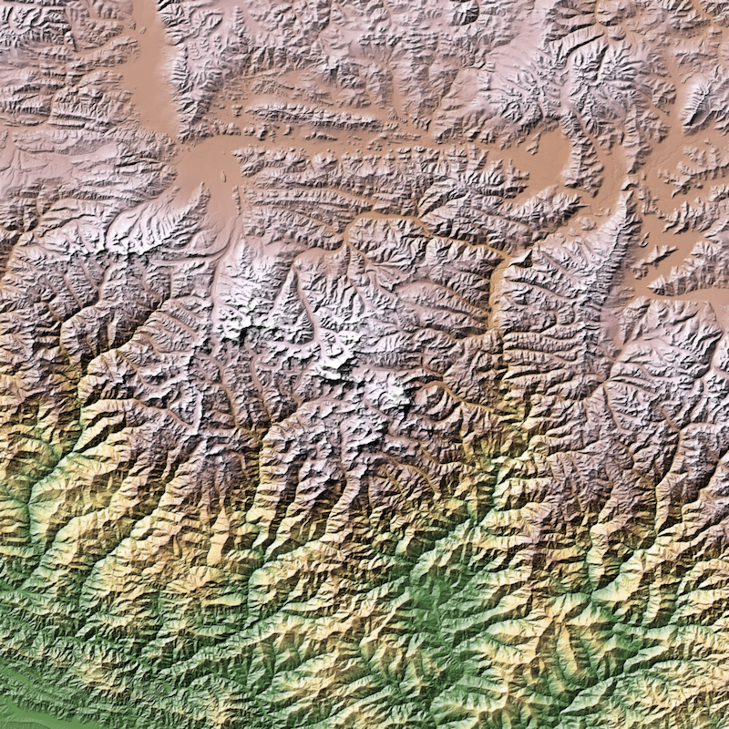
```

## Removing JPEG Compression Artifacts

Applying JPEG compression on aerial or drone imagery can cause the results to have edge artifacts. Since JPEG is a lossy compression algorithm, it causes no-data values (typically 0) being converted to non-zero values. This causes problems when you want to mosaic different tiles, or mask the black pixels. Fortunately, GDAL comes with a handy tool called [nearblack](https://gdal.org/programs/nearblack.html) that is designed to solve this problem. You can specify a tolerance value to remove edge pixels that may not be exactly 0. It scans the image inwards till it finds these near-black pixel values and masks them. Let's say we have a mosaic of JPEG compressed imagery without an alpha band and we want to set a mask. If we simply set 0 as nodata value, you will end up with edge artifacts, along with many dark pixels within the mosaic (building shadows/water etc.) being masked. Instead we use the `nearblack` program to set edge pixels with value 0-5 being considered nodata.

```
nearblack -near 5 -setmask -o aoi_masked.tif aoi.tif \
  -co COMPRESS=JPEG -co TILED=YES -co PHOTOMETRIC=YCBCR
```

```{r echo=FALSE, fig.align='center', out.width='75%', fig.cap='JPEG Artifacts Cleaned by GDAL nearblack'}
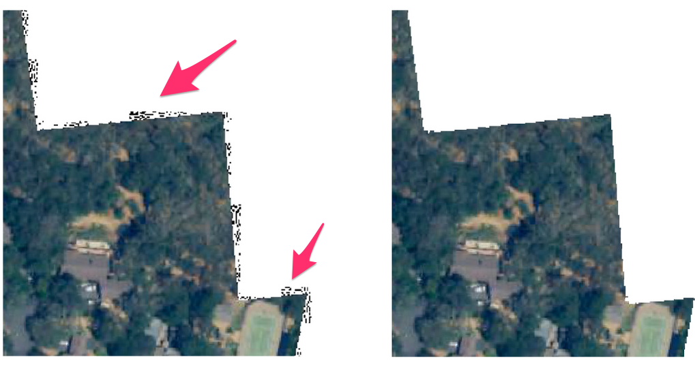
```

## Splitting a Mosaic into Tiles

When delivering large mosaics, it is a good idea to split your large input file into smaller chunks. If you are working with a very large mosaic, splitting it into smaller chunks and processing them independently can help overcome memory issues. This is also helpful to prepare the satellite imagery for Deep Learning. GDAL ships with a handy script called `gdal_retile.py` that is designed for this task.

Let's say we have a large GeoTIFF file `aoi.tif` and want to split it into tiles of 256 x 256 pixels, with an overlap to 10 pixels.

First we create a directory where the output tiles will be written.
```
mkdir tiles
```

We can now use the following command to split the file and write the output to the `tiles` directory.

```
gdal_retile.py -ps 256 256 -overlap 10 -targetDir tiles/ aoi.tif
```

This will create smaller GeoTiff files. If you want to train a Deep Learning model, you would typically require JPEG or PNG tiles. You can batch-convert these to JPEG format using the technique shown in the [Running Commands in batch](#running-commands-in-batch) section. Since JPEG/PNG cannot hold the georeferencing information, we supply the `WORLDFILE=YES` creation option. 

```
gdal_translate -of JPEG <input_tile>.tif <input_tile>.jpg -co WORLDFILE=YES
```

This will create a sidecar file with the `.wld` extension that will store the georeferencing information for each tile. GDAL will automatically apply the georeferencing information to the JPEG tile as long this file exists in the same directory. This way, you can make inference using the JPG tiles, and use the `.wld` files with your output to automatically georeference and mosaic the results.

## Extracting Projection Information from a Raster

Sometimes you may need to extract and preserve georeferencing information from a raster to be used later or with a different file. A typical use case is Deep Learning - where you need to convert your georeferenced tile (i.e. a GeoTIFF file) into a PNG or JPEG tile. If you used `gdal_retile.py` as shown in the [previous section](#splitting-a-mosaic-into-tiles), you will have a *World File* accompanying each tile. But many times, you only have the original GeoTIFF file and the resulting PNG tile. To copy the georeferencing information from the GeoTIFF and apply it to the PNG, you can use the following process.

Let's say we have a georeferenced tile named `tile_1_1.tif` and a annotated version of this tile from a training dataset as a non-georeferenced tile `tile_1_1_annotated.png`. We want to georeference this PNG file using the projection and extent of the GeoTIFF file.

```{r echo=FALSE, fig.align='center', out.width='75%'}
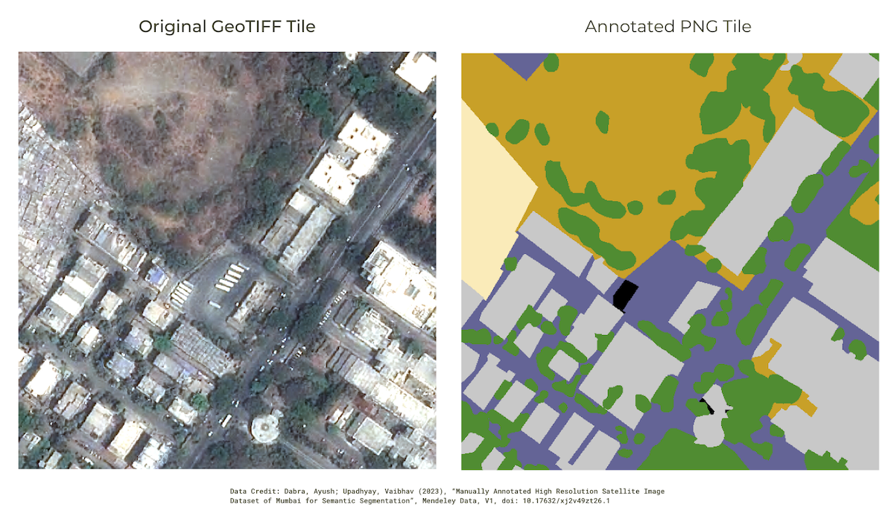
```

We can extract the extent and resolution of the original GeoTIFF using the [`listgeo`](http://geotiff.maptools.org/listgeo.html) tool. This tool is already part of the standard GDAL conda distribution. We will extract the world file using the `-tfw` flag that generates an ESRI world file.

```
listgeo -tfw tile_1_1.tif
```

You will see that a new file named `tile_1_1.tfw` is generated alongside the original GeoTIFF. Next we extract the projecton information using [`gdalsrsinfo`](https://gdal.org/programs/gdalsrsinfo.html) command. This command prints the projection information in a variety of supported formats. We save the output to a file with a `.prj` extension.

```
gdalsrsinfo tile_1_1.tif > tile_1_1.prj
```

The `tile_1_1.tfw` and `tile_1_1.prj` contain all the information we need to georeference the PNG tile. 

Let's convert the PNG to a GeoTIFF file and assign the projection of the original tile.

```
gdal_translate -a_srs tile_1_1.prj tile_1_1_annotated.png tile_1_1_annotated.tif
```

The resulting file contains the projection but the extents are not correct. We can use the [`geotifcp`](http://geotiff.maptools.org/geotifcp.html) tool to apply the extents from the world file to the GeoTIFF. This tool is also part of the standard GDAL conda distribution.

```
geotifcp -e tile_1_1.tfw tile_1_1_annotated.tif tile_1_1_annotated_georeferenced.tif
```


## Merging Files with Different Resolutions

If you had a bunch of tiles that you wanted to merge, but some tiles had a different resolution, you can use specify the `-resolution` flag with `gdalbuildvrt` to ensure the output file has the expected resolution.

Continuing the example from the [Processing Aerial Imagery](#processing-aerial-imagery) section, we can create a virtual raster and specify the `resolution` flag

```
gdalbuildvrt -input_file_list filelist.txt naip.vrt -resolution highest -r bilinear
```

Translating this file using `gdal_translate` or subsetting it with `gdalwarp` will result in a mosaic with the highest resolution from the source tiles.

## Calculate Pixel-Wise Statistics over Multiple Rasters

`gdal_calc.py` can compute pixel-wise statistics over many input rasters or multi-band rasters. Starting GDAL v3.3, it supports the full range of numpy functions, such as `numpy.average()`, `numpy.sum()` etc.

Here's an example showing how to compute the per-pixel total from 12 different input rasters. The `prism` folder in your data package contains 12 rasters of precipitation over the continental US. We will compute pixel-wise total precipitation from these rasters. When you read multiple rasters using the same input flag `-A`, gdal_calc.py creates a 3D numpy array. It can then be reduced along the axis 0 to produce totals.

```
cd prism
```

```
gdal_calc.py \
	-A PRISM_ppt_stable_4kmM3_201701_bil.bil \
	-A PRISM_ppt_stable_4kmM3_201702_bil.bil \
	-A PRISM_ppt_stable_4kmM3_201703_bil.bil \
	-A PRISM_ppt_stable_4kmM3_201704_bil.bil \
	-A PRISM_ppt_stable_4kmM3_201705_bil.bil \
	-A PRISM_ppt_stable_4kmM3_201706_bil.bil \
	-A PRISM_ppt_stable_4kmM3_201707_bil.bil \
	-A PRISM_ppt_stable_4kmM3_201708_bil.bil \
	-A PRISM_ppt_stable_4kmM3_201709_bil.bil \
	-A PRISM_ppt_stable_4kmM3_201710_bil.bil \
	-A PRISM_ppt_stable_4kmM3_201711_bil.bil \
	-A PRISM_ppt_stable_4kmM3_201712_bil.bil \
	--calc='numpy.sum(A, axis=0)' \
	--outfile total.tif
```

Currently, `gdal_calc.py` doesn't support reading multi-band rasters as a 3D array. So if you want to apply a similar computation on a multi-band raster, you'll have to specify each band separately. Let's say, we want to calculate the pixel-wise average value from the RGB composite created in the [Merging individual bands into RGB composite](#merging-individual-bands-into-rgb-composite) section. We can use the command as follows.

```
gdal_calc.py \
  -A rgb.tif --A_band=1 \
  -B rgb.tif --B_band=2 \
  -C rgb.tif --C_band=3 \
  --calc='(A+B+C)/3' \
  --outfile mean.tif
```

## Extracting Values from a Raster

A useful tool called [`gdallocationinfo`](https://gdal.org/programs/gdallocationinfo.html) comes with the GDAL suite that can do point lookups from the raster at one or more pairs of coordinates. Combined with GDAL's capabilities to stream data from cloud datasets with the [Virtual File System](https://gdal.org/user/virtual_file_systems.html), you can efficiently lookup pixel values from without having to load the entire raster into memory.

For example, we have a large (8GB) single-band Cloud-Optimized GeoTiff (COG) file on a Google Cloud Storage bucket. This file is a global mosaic of VIIRS Nighttime Lights for the year 2021 and the pixel values are the radiance values. 

```{r echo=FALSE, fig.align='center', out.width='75%', fig.cap='VIIRS Nighttime Lights 2021'}
knitr::include_graphics('images/gdal/ntl_query1.png')
```

To access this file, we use the `/vsigs/` (Google Cloud Storage files) handler and provide the path in form of `/vgigs/<bucket_name>/<file_name>`. This particular file is public, so we add the config option `--config GS_NO_SIGN_REQUEST YES`.

```
gdalinfo /vsigs/spatialthoughts-public-data/ntl/viirs/viirs_ntl_2021_global.tif --config GS_NO_SIGN_REQUEST YES
```

We are successfully able to open and lookup the metadata of this file. Now let's query the pixel value at a single coordinate using `gdallocationinfo`. We specify the location in WGS84 Lon/Lat format, so use the `-wgs84` option.

```
gdallocationinfo -valonly /vsigs/spatialthoughts-public-data/ntl/viirs/viirs_ntl_2021_global.tif -wgs84 77.5946 12.9716 --config GS_NO_SIGN_REQUEST YES
```

You can also lookup values of multiple points from a file. Let's say we have a text file called `coordinates.txt` with the following 2 coordinates.

```
77.5946 12.9716
77.1025 28.7041
```

We can lookup the pixel values at these coordinates by supplying this to the `gdallocationinfo` command. We also supply the `-xml` option so the output is structured and can be used for post processing.

```
cat coordinates.txt | gdallocationinfo /vsigs/spatialthoughts-public-data/ntl/viirs/viirs_ntl_2021_global.tif \
  -wgs84 --config GS_NO_SIGN_REQUEST YES -xml
```

```{r echo=FALSE, fig.align='center', out.width='75%', fig.cap='Querying single or multiple values'}
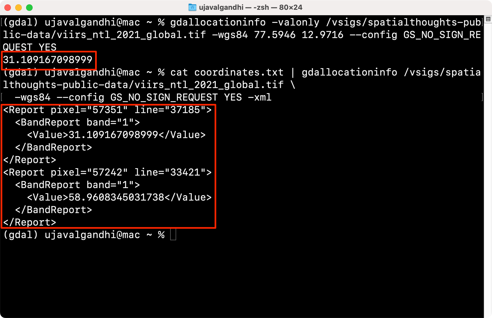
```

## Masking Values using a Binary Raster

Often we have binary images representing a data mask. We can use `numpy.where()` function with `gdal_calc.py` to mask pixels from any raster with a mask image.

Let's say we have a `binary.tif` containing pixel values 0 and 1. We now want to set all pixels from `merged.tif` to No Data where the `binary.tif` is 0. Assuming, we want to use **-32768** as the *No Data* value, we can use a command like below.

```
gdal_calc.py -A merged.tif -B binary.tif \
  --calc="numpy.where(B==1, A, -32768)" \
  --NoDataValue -32768 --outfile masked.tif
```

This command says *Wherever the value of B raster is 1, the output should be the pixel values from A else it should be -32768*. Since we are also setting the `-NoDataValue` to -32768, the command effectively sets all pixels where the condition doesn't match (B != 1) to NoData.

```{r echo=FALSE, fig.align='center', out.width='75%'}
knitr::include_graphics('images/gdal/binary_mask.png')
```


## Raster to Vector Conversion

GDAL comes with the `gdal_polygonize.py` allowing us to convert rasters to vector layers. Let's say we want to extract the coordinates of the highest elevation from the merged raster in the [Merging Tiles](#merging-tiles) section. Querying the raster with `gdalinfo -stats` shows us that the highest pixel value is **8748**. 

We can use `gdal_calc.py` to create a raster using the condition to match only the pixels with that value.

```
gdal_calc.py --calc 'A==8748' -A merged.vrt --outfile everest.tif --NoDataValue=0
```

The result of a boolean expression like above will be a raster with 1 and 0 pixel values. As we set the NoData to 0, we only have 1 pixel with value 1 where the condition matched. We can convert it to a vector using `gdal_polygonize.py`.

```
gdal_polygonize.py everest.tif everest.shp
```

If we want to extract the centroid of the polygon and print the coordinates, we can use `ogrinfo` command.

```
ogrinfo everest.shp -sql 'SELECT AsText(ST_Centroid(geometry)) from everest' -dialect SQLite
```

## Viewshed Analysis

The `gdal_viewshed` command can do visibility analysis using elevation rasters. This is a very useful analysis for many applications including urban planning and telecommunications. We can take the London 1m DSM dataset and carry out the visibility analysis from a location.

We will determine all the areas of London that are visible from the top of the [Tower 42](https://en.wikipedia.org/wiki/Tower_42) building. This is a skyscraper located in the city of London.

We take the merged DSM created for [Assignment 1](https://courses.spatialthoughts.com/gdal-tools.html#assignment) and generate a viewshed.

The CRS of the dataset is EPSG:27700 so we need to get the observer location coordinates in this CRS. We can use the `gdaltransform` command to convert the Lat/Lon coordinates to the coordinates in the target CRS. Run the command below and press enter.

```
gdaltransform -s_srs EPSG:4326 -t_srs EPSG:27700
```

The command takes input from the terminal. Enter the X and Y coordinate as follows
```
-0.083738 51.515178
```

```{r echo=FALSE, fig.align='center', out.width='75%', fig.cap='Results of Viewshed Analysis'}
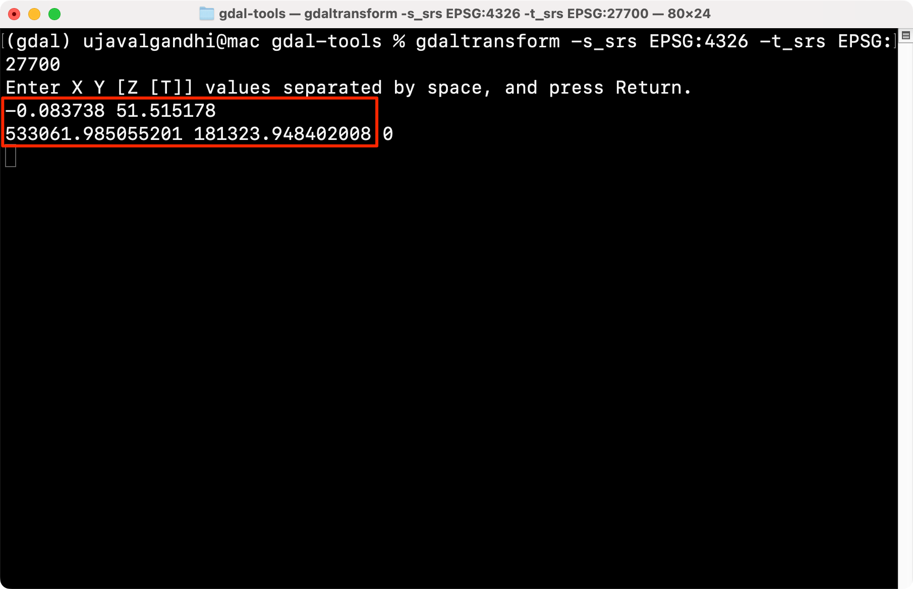
```


The output of the command are the X and Y coordinates **533061.985055201 181323.948402008**. We round them off and use it in the `gdal_viewshed` command.

```
gdal_viewshed -b 1 -ox 533062 -oy 181324 -oz 10 -md 100000.0 -f GTiff -co COMPRESS=DEFLATE -co PREDICTOR=2 merged.tif viewshed_tower42.tif
```

```{r echo=FALSE, fig.align='center', out.width='75%', fig.cap='Results of Viewshed Analysis'}
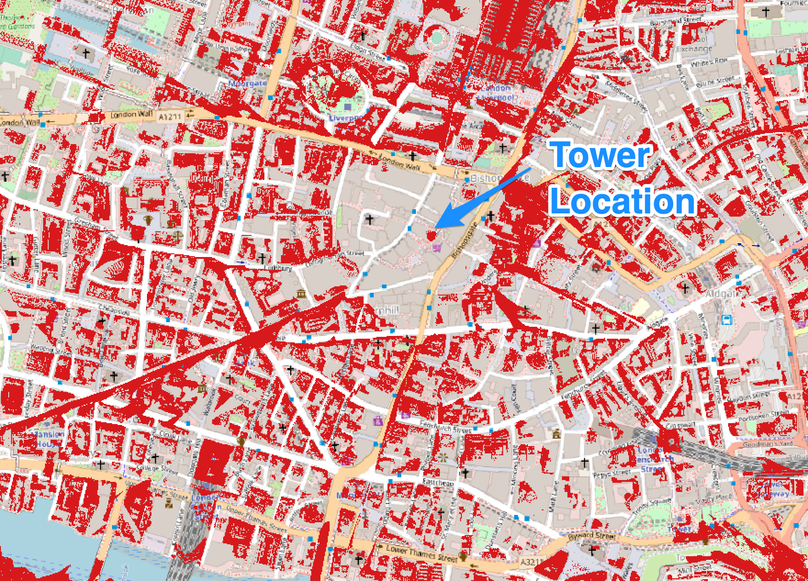
```


## Working with KML Files

Keyhole Markup Language (KML) is a XML-based file format primarily used by Google Earth. Often time, GIS users want to export their data to KML for visualizing it in Google Earth. You may also want to extract data from KML files or convert them into other spatial formats used in GIS. The [GDAL KML Driver](https://gdal.org/drivers/vector/kml.html) can both read and write KML files and provides many options to make the conversion compatible.

### Exporting Data to KML files

Let's take the `metro_stations` layer from the `spatial_query.gpkg` file in your data package and export it to a KML file `metro_stations.kml`.

```
ogr2ogr -f KML metro_stations.kml spatial_query.gpkg metro_stations 
```

```{r echo=FALSE, fig.align='center', out.width='75%', fig.cap='KML Export without NameField'}
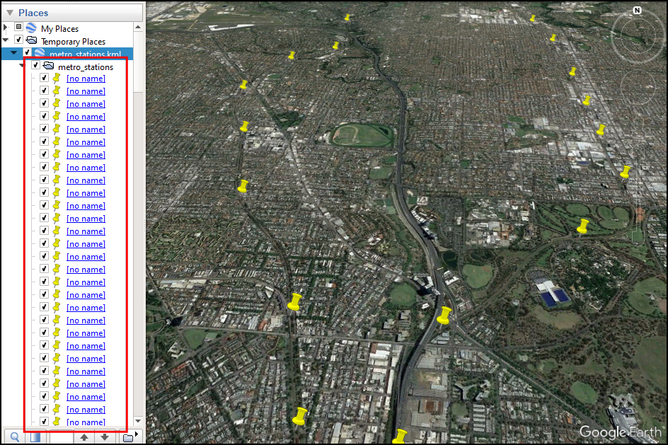
```

While the above command works, you will notice that when you open the resulting file in Google Earth, the placemarks for each feature doesn't have any labels. This is because the KML format expects a field called **Name** in the layer which is used as the label for each placemark. If your data layer does not have such a field, you can supply an alternate field name that will be used as labels using the `-dsco` option. The `metro_stations` layer has a field named `station` which we can use as the name field.

```
ogr2ogr -f KML metro_stations.kml spatial_query.gpkg metro_stations -dsco NameField=station
```

```{r echo=FALSE, fig.align='center', out.width='75%', fig.cap='KML Export with NameField'}
knitr::include_graphics('images/gdal/kml2.png')
```


### Converting KML Files to Other Formats

The KML file format supports having multiple data layers within the same KML file. We will now learn how to extract a specific data layer and convert it to a shapefile. GDAL supports reading data from a URL using the [Virtual File System](https://gdal.org/user/virtual_file_systems.html). We can read a KML file from the internet using the `vsicurl/` prefix.

```
ogrinfo /vsicurl/https://developers.google.com/kml/documentation/KML_Samples.kml
```

```{r echo=FALSE, fig.align='center', out.width='75%'}
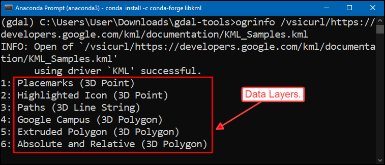
```

Let's read the `Paths` layer

```
ogrinfo /vsicurl/https://developers.google.com/kml/documentation/KML_Samples.kml Paths
```

```{r echo=FALSE, fig.align='center', out.width='75%'}
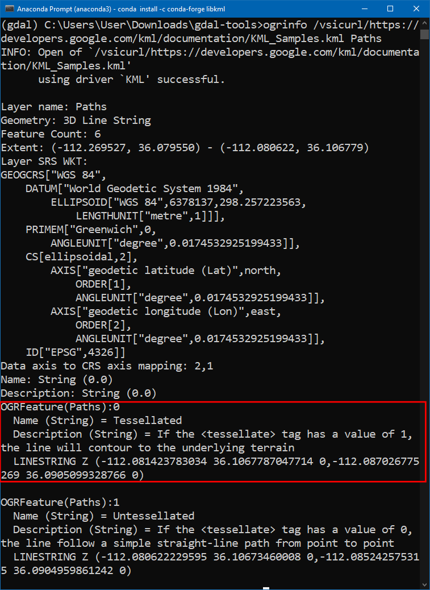
```

To extract the `Paths` layer from this KML file, we can use `ogr2ogr` command. The default options create many unwanted fields in the output. We can select a subset of the input fields using the `-select` option.

```
ogr2ogr -f "ESRI Shapefile" paths.shp /vsicurl/https://developers.google.com/kml/documentation/KML_Samples.kml Paths -select "NAME,Description"
```

```{r echo=FALSE, fig.align='center', out.width='75%'}
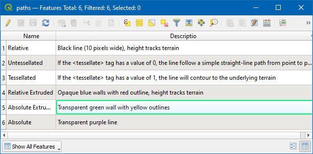
```

You can also convert a KML layer to a CSV file. The [GDAL CSV Driver](https://gdal.org/drivers/vector/csv.html) is able to extract the geometry of features using the `GEOMETRY` layer creation option. Let's convert the `Placemark` layer from the `KML_Samples.kml` to a CSV file with **X**, **Y** and **Z** columns extracted from the geometry.

```
ogr2ogr -f CSV points.csv /vsicurl/https://developers.google.com/kml/documentation/KML_Samples.kml Placemarks -lco GEOMETRY=AS_XYZ
```

```{r echo=FALSE, fig.align='center', out.width='75%'}
knitr::include_graphics('images/gdal/kml6.png')
```

### KML vs. LIBKML Drivers

If your GDAL binaries are compiled with support for the [LIBKML Driver](https://gdal.org/drivers/vector/libkml.html#vector-libkml), it is preferable to use it over the **KML** driver. The **LIBKML** driver supports many more options and allows you to create fully featured KMLs. 

Below is an example of data conversion using the LIBKML driver. To specify the name field, the LIBKML driver uses an environment variable called `LIBKML_NAME_FIELD` that can be specified with the `--config` option

```
ogr2ogr -f LIBKML metro_stations.kml spatial_query.gpkg metro_stations --config LIBKML_NAME_FIELD station
```

If your GDAL version has both KML and LIBKML drivers, OGR will prefer the LIBKML driver. To force OGR to use the KML driver for reading files, you can add `--config OGR_SKIP LIBKML` to your command.


## Group Statistics

We can use SQL GROUP BY clause in `ogr2ogr` to generate summary statistics from a layer. Let's first create a geopackage from the `worldcities.csv` layer.

```
ogr2ogr -oo X_POSSIBLE_NAMES=lng -oo Y_POSSIBLE_NAMES=lat -a_srs EPSG:4326 \
  -sql "SELECT city, country, CAST(population as integer) as population from worldcities" \
  worldcities.gpkg worldcities.csv -nln worldcities
```

We have a layer `worldcities.gpkg` that has **population** and **country** columns. Let's calculate the total population per country. We can save the resulting statistics as an Excel sheet.

```
ogr2ogr stats.xlsx worldcities.gpkg \
  -sql "SELECT country, sum(population) as total_population from worldcities GROUP BY country"
```

## Using Virtual Layers

Similar to GDAL, OGR also supports [Virtual File Format (VRT)](https://gdal.org/drivers/vector/vrt.html). Compared to the raster version, the OGR Virtual Driver is much more capable and can be used for on-the-fly data transformations. Multiple data layers can be combined into a single *virtual* layer using the XML-based `.vrt` format files. VRT files are also used to configure reading tabular data into spatial data formats.

### Read Geonames Files

Your data package contains 3 large text files from Geonames in the `geonames` folder. These are plain-text files in a Tab-Separated Values (TSV) format. Change to the `geonames` directory.

```
cd geonames
```

Let's try reading one of the files `CA.txt` - which has over 300K records of all placenames in Canada. To read this file, we need to create a new file called `CA.vrt` with the following content. Save the file in the same `geonames` directory.

```
<OGRVRTDataSource>
	    <OGRVRTLayer name="CA">
	        <SrcDataSource>CSV:CA.txt</SrcDataSource>
	        <SrcLayer>CA</SrcLayer>
	    </OGRVRTLayer>
</OGRVRTDataSource>
```

```{r echo=FALSE, fig.align='center', out.width='60%'}
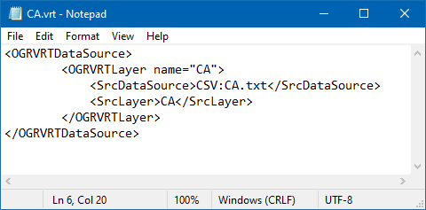
```

Let's check if OGR can read the source text file via the newly created `CA.vrt` file.

```
ogrinfo -al -so CA.vrt
```

```{r echo=FALSE, fig.align='center', out.width='60%'}
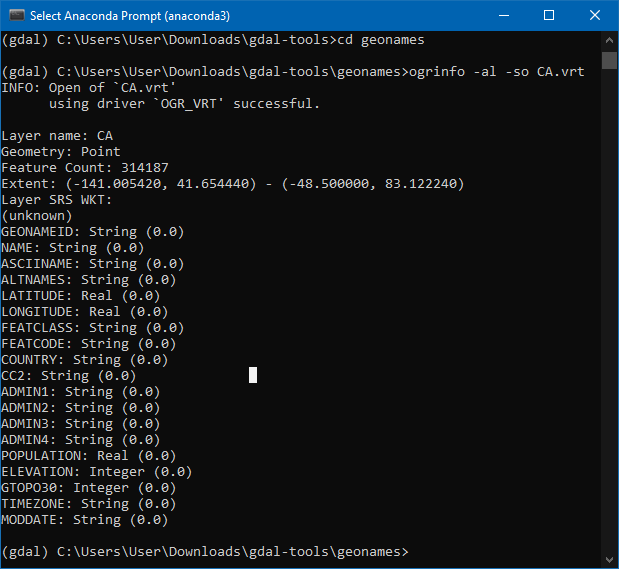
```

The `ogrinfo` command was able to successfully read the data and show us the summary of the attributes as well as the total feature count. Note that OGR has built-in support for the geonames file format. So it was able to correctly detect the geometry columns without us specifying it. For other datasets, you will have to specify the geometry columns explicitly via the `<GeometryField>` attribute in the VRT file.

### Applying Filters

VRT format supports applying SQL queries on the source layer using the `<SrcSQL>` field. This allows us to create an on-the-fly filter that reads only a subset of the data. Update the `CA.vrt` with the following content.

```
<OGRVRTDataSource>
	    <OGRVRTLayer name="CA">
	        <SrcDataSource>CSV:CA.txt</SrcDataSource>
	        <SrcLayer>CA</SrcLayer>
  	     	<SrcSQL>select * from CA where "FEATCLASS" = 'T'</SrcSQL>
	    </OGRVRTLayer>
</OGRVRTDataSource>
```

```{r echo=FALSE, fig.align='center', out.width='60%'}
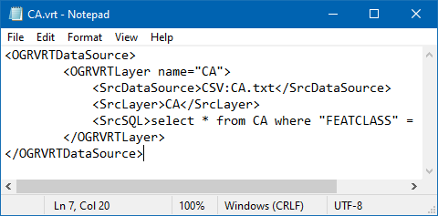
```

The VRT file now contains a SQL query to select only the mountain features from the source file. Let's run `ogrinfo` again and check the output.

```
ogrinfo -al -so CA.vrt
```

```{r echo=FALSE, fig.align='center', out.width='60%'}
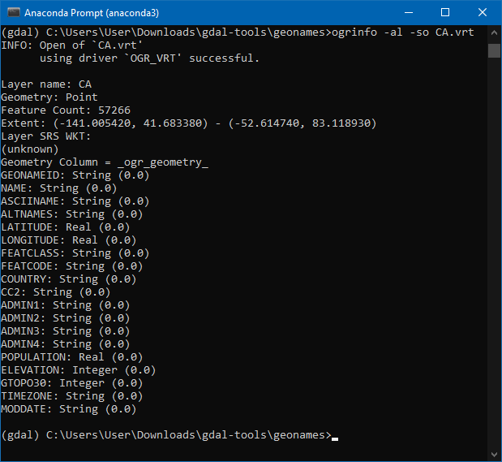
```

You will see that the output contains a subset of features, even though we never changed the source data. 

### Merging Files

The real power of the VRT file format lies in its ability to dynamically combine multiple data sources into a single data layer. We can adapt the previously created file and use `<OGRVRTUnionLayer>` to create a single layer from the 3 separate text files. Save the following content into a new file named `NA.vrt`.

```
<OGRVRTDataSource>
	<OGRVRTUnionLayer name="NA">
	
	    <OGRVRTLayer name="CA">
	        <SrcDataSource>CSV:CA.txt</SrcDataSource>
	        <SrcLayer>CA</SrcLayer>
	     	<SrcSQL>select * from CA where "FEATCLASS" = 'T'</SrcSQL>
	    </OGRVRTLayer>
	
	    <OGRVRTLayer name="MX">
	        <SrcDataSource>CSV:MX.txt</SrcDataSource>
	        <SrcLayer>MX</SrcLayer>
	     	<SrcSQL>select * from MX where "FEATCLASS" = 'T'</SrcSQL>
	    </OGRVRTLayer>
	
	    <OGRVRTLayer name="US">
	        <SrcDataSource>CSV:US.txt</SrcDataSource>
	        <SrcLayer>US</SrcLayer>
	     	<SrcSQL>select * from US where "FEATCLASS" = 'T'</SrcSQL>
	    </OGRVRTLayer>
	
    </OGRVRTUnionLayer>	
</OGRVRTDataSource>
```

```{r echo=FALSE, fig.align='center', out.width='60%'}
knitr::include_graphics('images/gdal/geonames5.png')
```

Let's now translate the `NA.vrt` to a GeoPackage using the `ogr2ogr` command.

```
ogr2ogr -f GPKG NA.gpkg NA.vrt -a_srs EPSG:4326
```

> This operation requires a lot of processing and may take a few minutes. You can add the `--config GDAL_CACHEMAX 512` option to speed up the process. See [Tips for Improving Performance](#tips-for-improving-performance) section for more details.

This command reads all 3 text files, filters them for matching features, combines them and writes out a spatial layer containing all mountains in North America.

```{r echo=FALSE, fig.align='center', out.width='75%'}
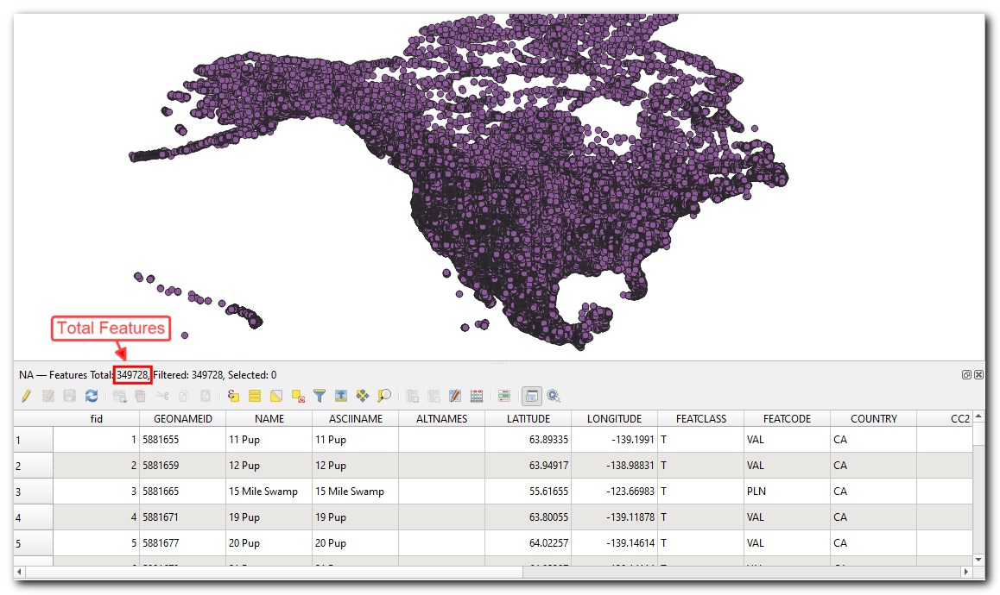
```

# Resources
* [GDAL Tips](https://twitter.com/gdaltips) `@gdaltips` on Twitter
* A Gentle Introduction to GDAL by Robert Simmon [Part-1](https://medium.com/planet-stories/a-gentle-introduction-to-gdal-part-1-a3253eb96082), [Part-2](https://medium.com/@robsimmon/a-gentle-introduction-to-gdal-part-2-map-projections-gdalwarp-e05173bd710a), [Part-3](https://medium.com/planet-stories/a-gentle-introduction-to-gdal-part-3-geodesy-local-map-projections-794c6ff675ca), [Part-4](https://medium.com/planet-stories/a-gentle-introduction-to-gdal-part-4-working-with-satellite-data-d3835b5e2971), [Part-5](https://medium.com/@robsimmon/a-gentle-introduction-to-gdal-part-5-shaded-relief-ec29601db654), [Part-6](https://medium.com/@robsimmon/a-gentle-introduction-to-gdal-part-6-1-visualizing-data-8e6e7d6ef641), [Part-7](https://medium.com/@robsimmon/a-gentle-introduction-to-gdal-part-7-transforming-data-178df8640dd2)
* [Data Science at the Command Line](https://datascienceatthecommandline.com/2e/chapter-1-introduction.html) by Jeroen Janssens

# Data Credits

* Landsat: Landsat-8 image courtesy of the U.S. Geological Survey. Image downloaded from [Google Cloud Platform](https://console.cloud.google.com/marketplace/details/usgs-public-data/landast) and pre-processed using [Semi Automatic Classification Plugin from QGIS](https://fromgistors.blogspot.com/p/semi-automatic-classification-plugin.html)
* Earth at Night image: Credit: NASA Earth Observatory/NOAA NGDC. Earth at Night flat hi-resolution map downloaded from [NASA earth observatory](https://earthobservatory.nasa.gov/features/NightLights/page3.php)
* William Mackenzie 1870 map of Southern India:  out-of-copyright scanned map downloaded from [Hipkiss’s Scanned Old Maps](http://www.hipkiss.org/data/maps.html)
* NAIP 2016 Aerial Imagery for California: The National Agriculture Imagery Program (NAIP). USDA-FSA-APFO Aerial Photography Field Office. Downloaded from [NRCS](https://nrcs.app.box.com/v/naip/folder/18144379349)
* London 1m DSM. Downloaded from Defra Data Services Platform. © Environment Agency copyright and/or database right 2019. All rights reserved. 
* Melbourne Metro Stations: © 2019 [The City of Melbourne Open Data Portal](https://data.melbourne.vic.gov.au/). Data provided by Metro Trains Melbourne 
* Melbourne Bars and Pubs: © 2019 [The City of Melbourne Open Data Portal](https://data.melbourne.vic.gov.au/). Data provided by Census of Land Use and Employment (CLUE)
* VIIRS Annual VNL V2 for 2021. C. D. Elvidge, M. Zhizhin, T. Ghosh, F-C. Hsu, "Annual time series of global VIIRS nighttime lights derived from monthly averages: 2012 to 2019", Remote Sensing (In press)

# License

This course material is licensed under a [Creative Commons Attribution-NonCommercial 4.0 International License](https://creativecommons.org/licenses/by-nc/4.0/). You are free to use the material for any non-commercial purpose. Kindly give appropriate credit to the original author.

If you would like to utilize these materials as part of a commercial offering, you can purchase a *Trainer License* for a small fee. 

Please [contact us](https://spatialthoughts.com/contact/) for pricing and terms.

&copy; 2020 Ujaval Gandhi [www.spatialthoughts.com](http://spatialthoughts.com)

***

**This course is offered as an instructor-led online class. Visit [Spatial Thoughts](https://spatialthoughts.com/events/) to know details of upcoming sessions.**
