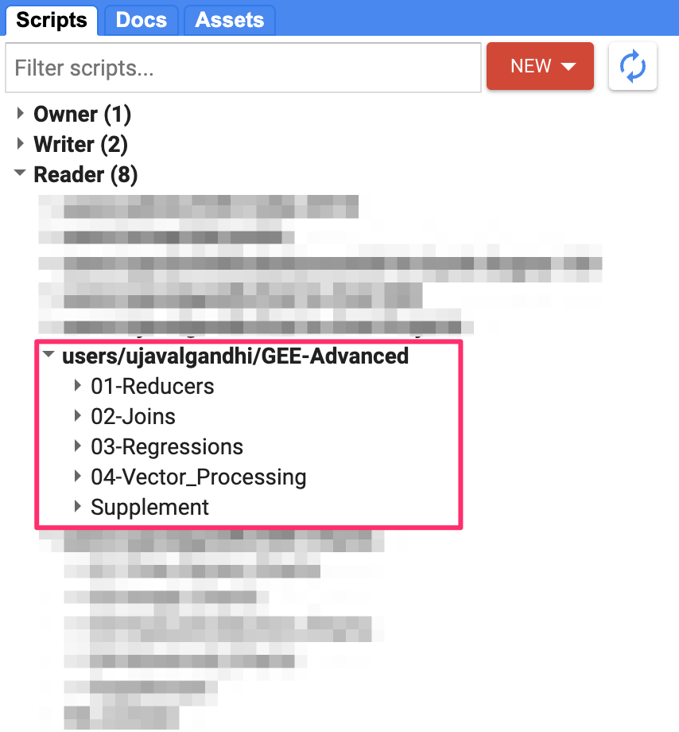
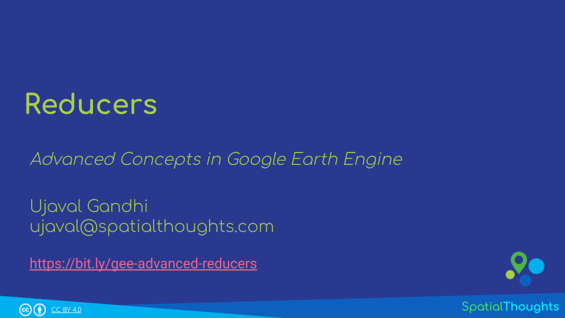
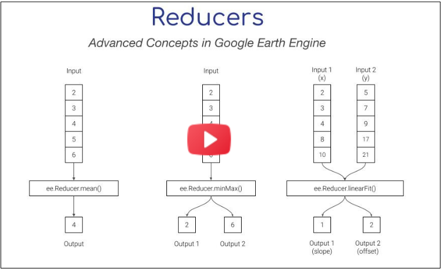
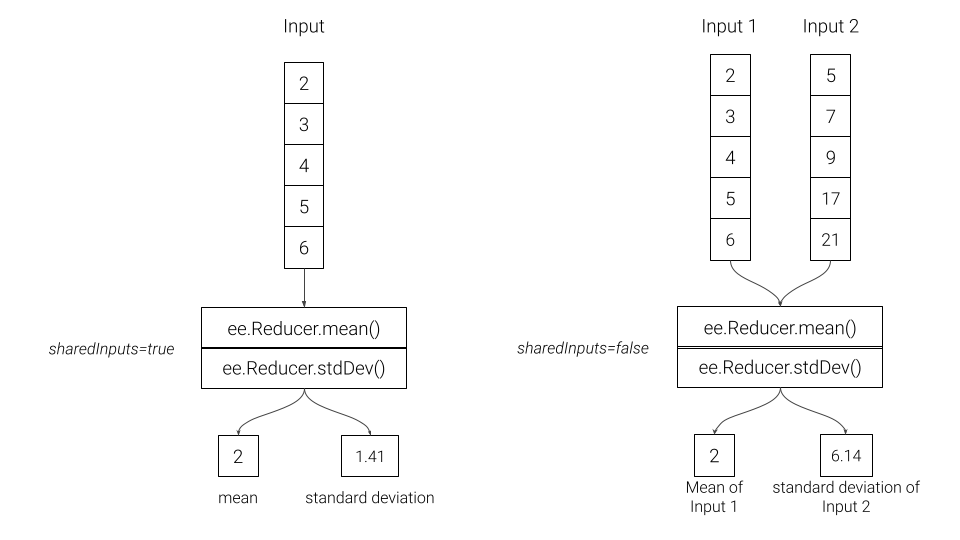
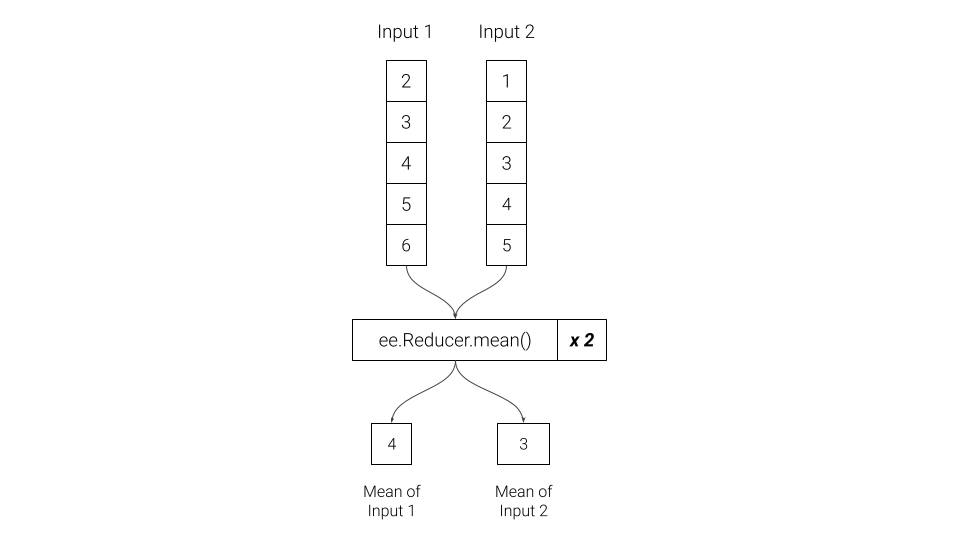

\newpage

***

```{r echo=FALSE, fig.align='center', out.width='75%', out.width='250pt'}
knitr::include_graphics('images/spatial_thoughts_logo.png')
```

***

\newpage

# Introduction 

This is an advanced-level course that is suited for participants who are familiar with the Google Earth Engine API and want to learn advanced data processing techniques and understand the inner-workings in Earth Engine. This class covers the following topics:

* Reducers
* Joins *(coming soon)*
* Regressions *(coming soon)*
* Vector Data Processing and Visualization *(coming soon)*

# Sign-up for Google Earth Engine

If you already have a Google Earth Engine account, you can skip this step.

Visit our [GEE Sign-Up Guide](gee-sign-up.html) for step-by-step instructions.


# Get the Course Materials

The course material and exercises are in the form of Earth Engine scripts shared via a code repository.

1. [Click this link](https://code.earthengine.google.co.in/?accept_repo=users/ujavalgandhi/GEE-Advanced) to open Google Earth Engine code editor and add the repository to your account.
2. If successful, you will have a new repository named `users/ujavalgandhi/GEE-Advanced` in the *Scripts* tab in the *Reader* section.
3. Verify that your code editor looks like below

```{r echo=FALSE, fig.align='center', out.width='50%', fig.cap='Code Editor with Workshop Repository'}

```
If you do not see the repository in the *Reader* section, click *Refresh repository cache* button in your *Scripts* tab and it will show up.

```{r echo=FALSE, fig.align='center', out.width='50%', fig.cap='Refresh repository cache'}
knitr::include_graphics('images/common/repository_cache.png')
```

# 1. Reducers

Reducer is an object used to compute statistics or perform aggregations. Reducers can aggregate data over time, space, bands, lists and other data structures in Earth Engine. Each reducer can take one or more input and generate one of more outputs.

[{width="400px"}](https://docs.google.com/presentation/d/1l3C4p-mwYyDQaERn6QkixMavkKeSz8MzxK9et89ED2E/edit?usp=sharing){target="_blank"}

[View the Presentation &#8599;](https://docs.google.com/presentation/d/1l3C4p-mwYyDQaERn6QkixMavkKeSz8MzxK9et89ED2E/edit?usp=sharing){target="_blank"}


This module is also available as video. 

[{width="400px"}](https://vimeo.com/855669629){target="_blank"}

[Watch Video](https://vimeo.com/855669629){target="_blank"}


## 01. Combined Reducers

You can create a new reducer by combining multiple reducers. Combined reducers are useful to compute multiple statistics together. The resulting reducer is run in parallel and is highly efficient than running each reducer independently.

```{r echo=FALSE, fig.align='center', out.width='75%', fig.cap='Combined Reducers'}

```

[Open in Code Editor &#8599;](https://code.earthengine.google.co.in/?scriptPath=users%2Fujavalgandhi%2FGEE-Advanced%3A01-Reducers%2F01b_Combined_Reducers_(complete)){target="_blank"}

```{js eval=FALSE, code=readLines('code/gee_advanced/01-Reducers/01b_Combined_Reducers_(complete)')}
```

## 02. Repeated Reducers

A reducer can be repeated multiple times to create a multi-input reducer. These are useful for computing the same statistics on different inputs.

```{r echo=FALSE, fig.align='center', out.width='75%', fig.cap='Repeated Reducers'}

```

[Open in Code Editor &#8599;](https://code.earthengine.google.co.in/?scriptPath=users%2Fujavalgandhi%2FGEE-Advanced%3A01-Reducers%2F02b_Repeated_Reducer_(complete)){target="_blank"}

```{js eval=FALSE, code=readLines('code/gee_advanced/01-Reducers/02b_Repeated_Reducer_(complete)')}
```

## 03. Grouped Reducers

You can group the output of a reducer by the value of a specified input. These are useful in computing grouped statistics (i.e. statistics by category).

```{r echo=FALSE, fig.align='center', out.width='75%', fig.cap='Grouped Reducers'}
knitr::include_graphics('images/gee_advanced/grouped_reducers.png')
```

[Open in Code Editor &#8599;](https://code.earthengine.google.co.in/?scriptPath=users%2Fujavalgandhi%2FGEE-Advanced%3A01-Reducers%2F03b_Grouped_Reducers_(complete)){target="_blank"}

```{js eval=FALSE, code=readLines('code/gee_advanced/01-Reducers/03b_Grouped_Reducers_(complete)')}
```

## 04. Weighted vs. Unweighted Reducers

Default calculations in Earth Engine uses weighted reducers. Weighted reducers account for fractional area of each pixel covered by the geometry. Unweighted reducers count pixels as whole if their centroid is covered by the geometry. You can choose to run any reducer in un-weighted mode using `.unweighted()`. Most software packages for remote sensing do not have support for weighted reducers, so Earth Engine users may choose to run their analysis un-weighted mode to verify and compare their results generated from other packages.


```{r echo=FALSE, fig.align='center', out.width='75%', fig.cap='Weighted vs. Unweighted Reducers'}
knitr::include_graphics('images/gee_advanced/weighted_vs_unweighted.png')
```

[Open in Code Editor &#8599;](https://code.earthengine.google.co.in/?scriptPath=users%2Fujavalgandhi%2FGEE-Advanced%3A01-Reducers%2F04b_Weighted_vs_Unweighted_Reducers_(complete)){target="_blank"}

```{js eval=FALSE, code=readLines('code/gee_advanced/01-Reducers/04b_Weighted_vs_Unweighted_Reducers_(complete)')}
```

## 05. Zonal Statistics - Vector

[Open in Code Editor &#8599;](https://code.earthengine.google.co.in/?scriptPath=users%2Fujavalgandhi%2FGEE-Advanced%3A01-Reducers%2F05b_Zonal_Statistics_Vector_(complete)){target="_blank"}

```{js eval=FALSE, code=readLines('code/gee_advanced/01-Reducers/05b_Zonal_Statistics_Vector_(complete)')}
```

## 06. Zonal Statistics - Raster

[Open in Code Editor &#8599;](https://code.earthengine.google.co.in/?scriptPath=users%2Fujavalgandhi%2FGEE-Advanced%3A01-Reducers%2F06b_Zonal_Statistics_Raster_(complete)){target="_blank"}

```{js eval=FALSE, code=readLines('code/gee_advanced/01-Reducers/06b_Zonal_Statistics_Raster_(complete)')}
```

# Joins

*Coming Soon...*

# Regressions

*Coming Soon...*

# Vector Data Processing and Visualization

*Coming Soon...*

----

# License

The course material (text, images, presentation, videos) is licensed under a [Creative Commons Attribution 4.0 International License](https://creativecommons.org/licenses/by/4.0/).

The code (scripts, Jupyter notebooks) is licensed under the MIT License. For a copy, see https://opensource.org/licenses/MIT

You are free to re-use and adapt the material but are required to give appropriate credit to the original author as below:

Copyright &copy; 2023 Ujaval Gandhi [www.spatialthoughts.com](https://spatialthoughts.com)


# Citing and Referencing

You can cite the course materials as follows

* Gandhi, Ujaval, 2023. *Advanced Concepts in Google Earth Engine* course. Spatial Thoughts. https://courses.spatialthoughts.com/gee-advanced.html

***
