\newpage

***

```{r echo=FALSE, fig.align='center', out.width='75%', out.width='250pt'}
knitr::include_graphics('images/spatial_thoughts_logo.png')
```

***

\newpage

# Introduction 

This is an intermediate-level workshop that is suited for participants who are familiar with the Google Earth Engine API and want to learn advanced data visualization methods. This class also introduces novel earth observation and climate datasets along with techniques to work with

[{width="400px"}](https://docs.google.com/presentation/d/1_mqS5eqJghkBBpspnvnyVuz6utfgfe_TVjLiTC-JtsM/edit?usp=sharing){target="_blank"}

[View the Presentation &#8599;](https://docs.google.com/presentation/d/1_mqS5eqJghkBBpspnvnyVuz6utfgfe_TVjLiTC-JtsM/edit?usp=sharing){target="_blank"}


# Get the Workshop Materials

The course material and exercises are in the form of Earth Engine scripts shared via a code repository.

1. [Click this link](https://code.earthengine.google.co.in/?accept_repo=users/ujavalgandhi/GEE-Charts) to open Google Earth Engine code editor and add the repository to your account.
2. If successful, you will have a new repository named `users/ujavalgandhi/GEE-Charts` in the *Scripts* tab in the *Reader* section.
3. Verify that your code editor looks like below

```{r echo=FALSE, fig.align='center', out.width='50%', fig.cap='Code Editor with Workshop Repository'}
knitr::include_graphics('images/gee_charts/repository.png')
```
If you do not see the repository in the *Reader* section, click *Refresh repository cache* button in your *Scripts* tab and it will show up.

```{r echo=FALSE, fig.align='center', out.width='50%', fig.cap='Refresh repository cache'}
knitr::include_graphics('images/common/repository_cache.png')
```


# 1. Time-Series Charts

In this section, we will explore various built-in functions to create time-series charts from ImageCollections. We will also explore the customization options provided by Google Charts to make high-quality functional graphics.

## 1.1 Simple Time-Series

We start by using the time-series charting function `ui.Chart.image.series()` that allows you to create a time-series plot from an ImageCollection at a single location. You get one time-series per band of the input dataset. We take the TerraClimate dataset and select the bands for monthly maximum and minimum temperatures. The resulting chart is a [Line Chart](https://developers.google.com/chart/interactive/docs/gallery/linechart) that can be further customized using the `.setOptions()` method.

Here are the customization applied to the default time-series chart:

- `lineWidth`: Sets the thickness of the line
- `pointSize`: Sets the size of the data point
- `title`: Sets the chart title
- `vAxis`: Sets the options for Y-Axis. Axis label is specified using the `title` option.
- `hAxis`: Sets the options for X-Axis. Grid lines are specified using the `gridlines` option. Date format for tick labels is specified with `format` option.
- `series`: Sets the options for each individual time-series. Series count starts from 0.

```{r echo=FALSE, fig.align='center', out.width='75%', fig.cap='Time-Series Chart'}
knitr::include_graphics('images/gee_charts/time_series.png')
```

[Open in Code Editor &#8599;](https://code.earthengine.google.co.in/?scriptPath=users%2Fujavalgandhi%2FGEE-Charts%3A01-Time_Series_Charts%2F01b_Time_Series_(complete)){target="_blank"}

```{js eval=FALSE, code=readLines('code/gee_charts/01-Time_Series_Charts/01b_Time_Series_(complete)')}
```

### Exercise

[Open in Code Editor &#8599;](https://code.earthengine.google.co.in/?scriptPath=users%2Fujavalgandhi%2FGEE-Charts%3A01-Time_Series_Charts%2F01c_Time_Series_(exercise)){target="_blank"}

```
// Exercise

// a) Delete the 'geometry' and add a new point at your chosen location
// b) Modify the chart options display the series with dashed lines
// c) Print the chart.

// See reference:
// https://developers.google.com/chart/interactive/docs/lines#dashed 
```

## 1.2 Time-Series with Trendlines

Google Charts can dynamically compute and display [Trendlines](https://developers.google.com/chart/interactive/docs/gallery/trendlines) on the chart. You can choose from linear, polynomial or exponential trendlines. The linear trendline fit a least-square regression model on the dataset. Here we take a time-series of precipitation data, aggregate it to yearly precipitation and then display a linear trendline to indicate whether we see an increasing or decreasing rainfall in the region.

Here are the styling options applied to the time-series chart:

- `vAxis.ticks`: Sets the tick positions for Y-Axis. We manually specify the exact tick marks we want.
- `gridlines.color`: Sets the color of the grid lines.
- `legend`: Sets the position of the legend. The `in` options makes the legend appear inside the chart.
- `series.visibleInLegend`: Sets whether a particular series label is visible in the legend.
- `trendlines`: Sets the option for trendlines. We override the default label using `labelInLegend` option.


```{r echo=FALSE, fig.align='center', out.width='75%', fig.cap='Time-Series Chart with Trendline'}
knitr::include_graphics('images/gee_charts/time_series_trend.png')
```

[Open in Code Editor &#8599;](https://code.earthengine.google.co.in/?scriptPath=users%2Fujavalgandhi%2FGEE-Charts%3A01-Time_Series_Charts%2F02b_Time_Series_With_Trend_(complete)){target="_blank"}

```{js eval=FALSE, code=readLines('code/gee_charts/01-Time_Series_Charts/02b_Time_Series_With_Trend_(complete)')}
```
### Exercise

[Open in Code Editor &#8599;](https://code.earthengine.google.co.in/?scriptPath=users%2Fujavalgandhi%2FGEE-Charts%3A01-Time_Series_Charts%2F02c_Time_Series_With_Trend_(exercise)){target="_blank"}

```
// Exercise

// a) Delete the 'geometry' and add a new point at your chosen location
// b) Modify the chart options to remove the legend from the chart.
// c) Print the chart.

// Hint: Use legend 'position' option
// See reference:
// https://developers.google.com/chart/interactive/docs/gallery/linechart
```


## 1.3 Time-Series at Multiple Locations

So far, we have learnt how to display time-series of one or more variables at a single location using the `ui.Chart.image.series()` function. If you wanted to plot time-series of multiple locations in a single chart, you can use the `ui.Chart.image.series.byRegion()` function. This function takes a FeatureCollection with one or more locations and extract the time-series at each geometry.

Here we take the Global Forecast System (GFS) dataset and create a chart of 16-day temperature-forecasts at 2 cities.


```{r echo=FALSE, fig.align='center', out.width='75%', fig.cap='Time-Series Chart at Multiple Locations'}
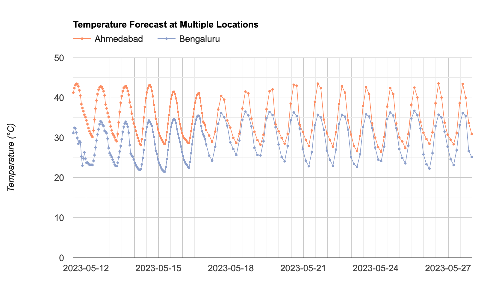
```

[Open in Code Editor &#8599;](https://code.earthengine.google.co.in/?scriptPath=users%2Fujavalgandhi%2FGEE-Charts%3A01-Time_Series_Charts%2F03b_Time_Series_By_Region_(complete)){target="_blank"}

```{js eval=FALSE, code=readLines('code/gee_charts/01-Time_Series_Charts/03b_Time_Series_By_Region_(complete)')}
```

### Exercise

[Open in Code Editor &#8599;](https://code.earthengine.google.co.in/?scriptPath=users%2Fujavalgandhi%2FGEE-Charts%3A01-Time_Series_Charts%2F03c_Time_Series_By_Region_(exercise)){target="_blank"}

```
// Exercise

// a) Replace the 'geometry1' and 'geometry2' points with your chosen locations.
// b) Modify the chart options to limit the Y-Axis range to the 
//    actual range of temperatures at your chosen locations (i.e. between 20-45 degrees)
// c) Print the chart.
```


## 1.4 Multi-Year Time-Series

Another useful function to plot time-series is ``ui.Chart.image.doySeriesByYear()` that extracts and plots values from an image band at different Day-Of-Year (DOY) over many years. This type of chart is helpful visualize both inter-annual and inter-annual variations in a single chart.

Here we take the MODIS 16-day Vegetation Indices (VI) dataset and create a chart of NDVI Time-Series over 4 years.

Here are the styling options applied to the time-series chart:

- `interpolateNulls`: Sets whether to fill missing (i.e masked) time-series values
- `curveType`: Apply smoothing on the time-series by [fitting a function](https://developers.google.com/chart/interactive/docs/gallery/linechart#curving-the-lines).

```{r echo=FALSE, fig.align='center', out.width='75%', fig.cap='DOY Time-Series Chart'}
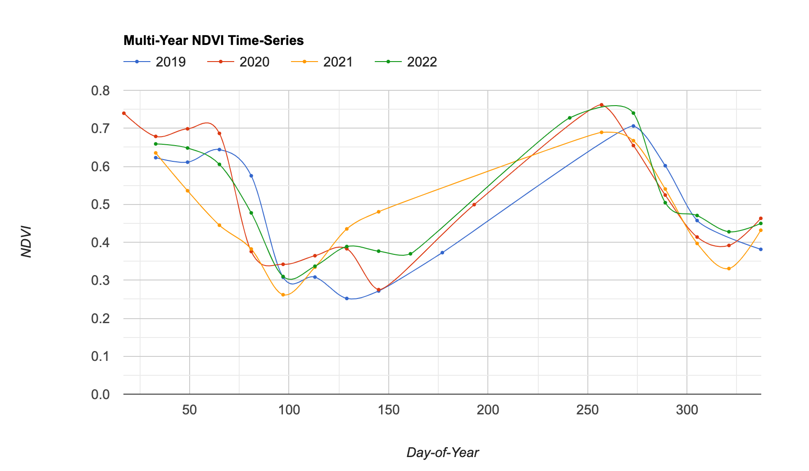
```

[Open in Code Editor &#8599;](https://code.earthengine.google.co.in/?scriptPath=users%2Fujavalgandhi%2FGEE-Charts%3A01-Time_Series_Charts%2F04b_Time_Series_By_Year_(complete)){target="_blank"}

```{js eval=FALSE, code=readLines('code/gee_charts/01-Time_Series_Charts/04b_Time_Series_By_Year_(complete)')}
```

### Exercise

```{r echo=FALSE, fig.align='center', out.width='100%', fig.cap='Exercise 04c'}
knitr::include_graphics('images/gee_charts/time_series_by_year_exercise.png')
```

[Open in Code Editor &#8599;](https://code.earthengine.google.co.in/?scriptPath=users%2Fujavalgandhi%2FGEE-Charts%3A01-Time_Series_Charts%2F04c_Time_Series_By_Year_(exercise)){target="_blank"}

```
// Exercise

// a) Replace the 'geometry' with your chosen location.
// b) Modify the chart to specify custom colors for each year.
//    Use color codes from https://colorbrewer2.org/
// c) Modify the chart to plot only the time-series
//    with lines without any points.
// c) Print the chart.
```


# 2. Image Charts

This section covers charting functions and techniques to plot values from an image. We will also learn how to deal with limitations of the charting API and create plots by extracting data from large regions.

## 2.1 Image Histogram

A histogram plot is a bar chart showing count of pixel values. Typically the pixel values are grouped into range of values called *buckets* on the X-Axis and the total count of pixels is shown on the Y-Axis.

Here we take the Harmonized Night Time Lights dataset that contains images from both DMSP and VIIRS sensors. 

Below is the list of styling options applied to the histogram:

- `hAxis.ticks`: Sets the tick labels on the X-Axis.
- `bar.gap`: Sets the gap between each histogram bar


```{r echo=FALSE, fig.align='center', out.width='75%', fig.cap='Image Histogram'}
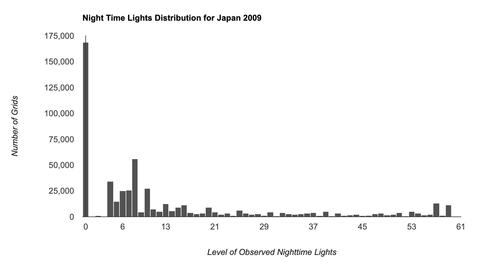
```

[Open in Code Editor &#8599;](https://code.earthengine.google.co.in/?scriptPath=users%2Fujavalgandhi%2FGEE-Charts%3A02-Image_Charts%2F01b_Image_Histogram_(complete)){target="_blank"}

```{js eval=FALSE, code=readLines('code/gee_charts/02-Image_Charts/01b_Image_Histogram_(complete)')}
```

### Exercise

```{r echo=FALSE, fig.align='center', out.width='100%', fig.cap='Exercise 01c'}
knitr::include_graphics('images/gee_charts/image_histogram_exercise.png')
```

[Open in Code Editor &#8599;](https://code.earthengine.google.co.in/?scriptPath=users%2Fujavalgandhi%2FGEE-Charts%3A02-Image_Charts%2F01c_Image_Histogram_(exercise)){target="_blank"}

```
// Exercise

// The code now has a function createChart that creates a chart
// for the given year

// a) Change the name of the country to your chosen country
// b) Call the function to create histograms for the year 2010 and 2020
// c) Print the charts.
```

## 2.2 Image Scatter Chart

A scatter plot is useful to explore the relationship between 2 variables. In Earth Engine, you can extract the pixel values from an image using any of the sampling functions such as `sample()` or `stratifiedSample()` to get a FeatureCollection with pixel values for a random subset of the pixels. We can then plot the results using the built-in charting functions for FeatureCollections.

Here we use the Sentinel-2 Surface Reflectance dataset along with Global Surface Water Yearly Water History dataset to get reflectance values of water and non-water pixels within the chosen region. We then use the `ui.Chart.feature.groups()` function to plot the results. Note that you can explicitly set the desired chart type using the `setChartType()` function.

Below is the list of new styling options applied to the scatter plot:

- `titleTextStyle`: Sets the style of the title text.
- `dataOpacity`: Sets the transparency for the data points. Useful when you have overlapping data points.
- `pointShape`: Sets the shape of the marker from the [available marker shapes](https://developers.google.com/chart/interactive/docs/points).

```{r echo=FALSE, fig.align='center', out.width='75%', fig.cap='Scatter Plot'}
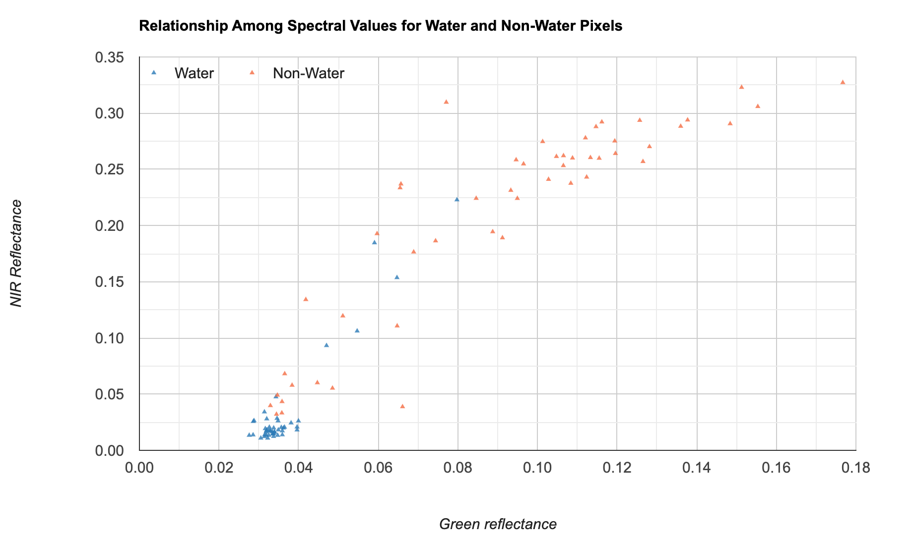
```

[Open in Code Editor &#8599;](https://code.earthengine.google.co.in/?scriptPath=users%2Fujavalgandhi%2FGEE-Charts%3A02-Image_Charts%2F02b_Image_Scatter_Chart_(complete)){target="_blank"}

```{js eval=FALSE, code=readLines('code/gee_charts/02-Image_Charts/02b_Image_Scatter_Chart_(complete)')}
```

### Exercise

[Open in Code Editor &#8599;](https://code.earthengine.google.co.in/?scriptPath=users%2Fujavalgandhi%2FGEE-Charts%3A02-Image_Charts%2F02c_Image_Scatter_Chart_(exercise)){target="_blank"}

```
// Exercise
// The code now contains a function createChart() that creates a scatter plot
// between the chosen bands

// a) Delete the 'geometry' and add a new polygon at your chosen location
// b) Create a chart for B3 and B11
// c) Print the chart.
```


## 2.3 Image Class Areas (Table)

Many analysts would want to create a chart or a table showing areas of different landcover classes in an image. The EE API has a dedicated function `ui.Chart.Image.byClass()` that can tabulate image pixel values by class. 

Here we use the ESA Landcover 2021 dataset and create a **Table** chart of areas within the buffer zone of a location. Note that we are using `setChartType()` function with the option **Table** to create a table. Such tables are useful when you are creating apps and want to display a formatted table. The [Global Population Explorer](https://google.earthengine.app/view/population-explorer) is a good example where you can switch between a *Bar Chart* and a *Table* to display the results.


```{r echo=FALSE, fig.align='center', out.width='75%', fig.cap='Table Chart'}
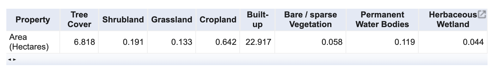
```

[Open in Code Editor &#8599;](https://code.earthengine.google.co.in/?scriptPath=users%2Fujavalgandhi%2FGEE-Charts%3A02-Image_Charts%2F03b_Area_By_Class_Table_(complete)){target="_blank"}

```{js eval=FALSE, code=readLines('code/gee_charts/02-Image_Charts/03b_Area_By_Class_Table_(complete)')}
```

### Exercise

[Open in Code Editor &#8599;](https://code.earthengine.google.co.in/?scriptPath=users%2Fujavalgandhi%2FGEE-Charts%3A02-Image_Charts%2F03c_Area_By_Class_Table_(exercise)){target="_blank"}

```
// Exercise

// a) Delete the 'geometry' and add a new point at your chosen location
// b) Change the buffer distance to 10km and Area units to Square Kilometers
// c) Print the chart.
```

# 3. FeatureCollection Charts

## 3.1 Image Class Areas (Pie Chart)

One of the biggest limitations of the GEE Charting API is that it cannot create charts from more than 10000000 pixels. While this may seem like a big number, you can easily run into this limit when working with images that cover large areas. If you try creating charts for large regions, you may run into an error such as below:

> *Image.reduceRegion: Too many pixels in the region. Found 159578190, but maxPixels allows only 10000000. Ensure that you are not aggregating at a higher resolution than you intended; that is a frequent cause of this error. If not, then you may set the 'maxPixels' argument to a limit suitable for your computation; set 'bestEffort' to true to aggregate at whatever scale results in 'maxPixels' total pixels; or both.*

```{r echo=FALSE, fig.align='center', out.width='75%', fig.cap='Chart Error'}
knitr::include_graphics('images/gee_charts/chart_error.png')
```

Fortunately, there is a way around it. Earth Engine allows you to aggregate values from very large regions using reducers that have an option to specify a `maxPixels` parameter. You will need to use the appropriate reducer and create a FeatureCollection with the results. The resulting value can then be plotted easily using the charting functions.

Here we take the same dataset as the previous section, but try to summarize the area by class over a much larger region. We use a Grouped Reducer to compute the class areas and post-process the result into a FeatureCollection. If you find the code hard to understand, please review our article on [Calculating Area in Google Earth Engine](https://spatialthoughts.com/2020/06/19/calculating-area-gee/) for explanation.

We set the chart type to `PieChart` and plot the percentage of area of each class in the region.


Below is the list of new styling options applied to the pie chart:

- `pieSliceBorderColor`: Sets the edge color of each pie slice.
- `pieSliceTextStyle`: Sets the text style of pie slice labels.
- `pieSliceText`: Sets the format of the text.
- `sliceVisibilityThreshold`: Sets the threshold below which to group small slices into *others* category.


```{r echo=FALSE, fig.align='center', out.width='75%', fig.cap='Pie Chart'}
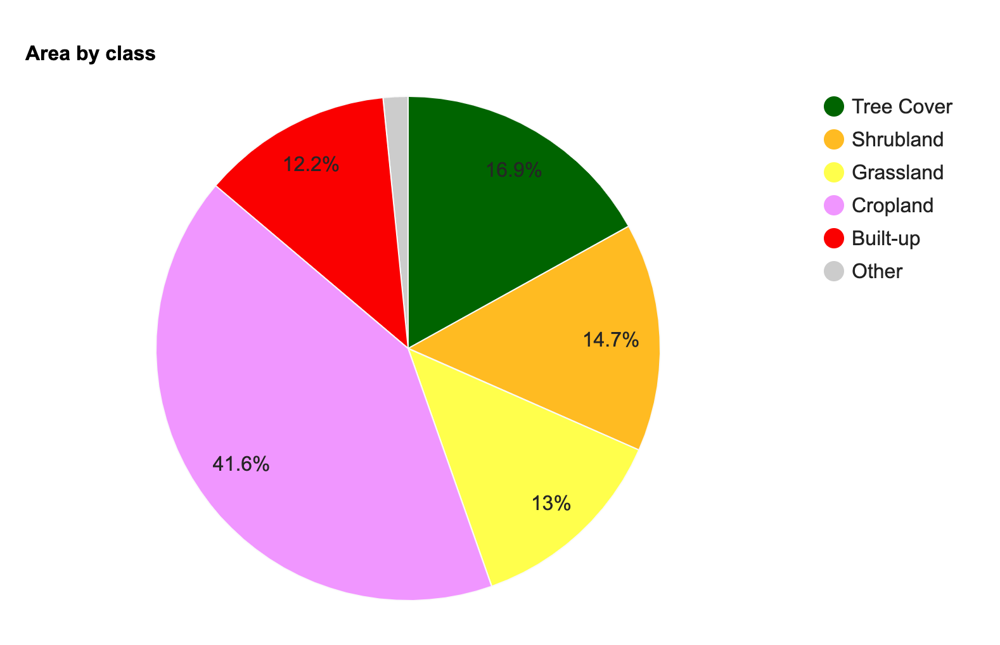
```

[Open in Code Editor &#8599;](https://code.earthengine.google.co.in/?scriptPath=users%2Fujavalgandhi%2FGEE-Charts%3A03-FeatureCollection_Charts%2F01b_Area_By_Class_Pie_Chart_(complete)){target="_blank"}

```{js eval=FALSE, code=readLines('code/gee_charts/03-FeatureCollection_Charts/01b_Area_By_Class_Pie_Chart_(complete)')}
```

### Exercise

[Open in Code Editor &#8599;](https://code.earthengine.google.co.in/?scriptPath=users%2Fujavalgandhi%2FGEE-Charts%3A03-FeatureCollection_Charts%2F01c_Area_By_Class_Pie_Chart_(exercise)){target="_blank"}

```
/ Exercise

// a) Delete the 'geometry' and add a new point at your chosen location
// b) Modify the chart options to show one of the slices separated from the pie.
// c) Print the chart.

// Hint: Use the 'offset' property 
// https://developers.google.com/chart/interactive/docs/gallery/piechart#exploding-a-slice
```
```{r echo=FALSE, fig.align='center', out.width='75%', fig.cap='Exercise 04c'}
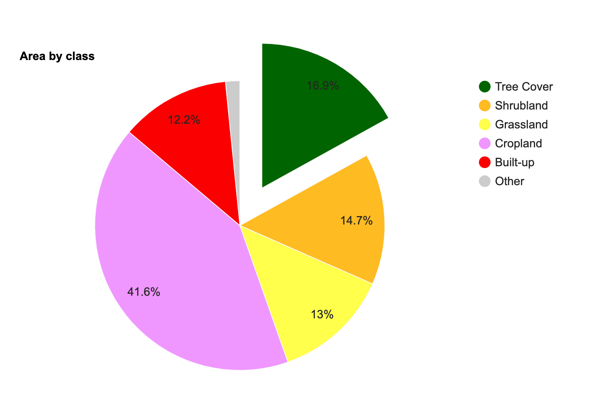
```

## 3.2 FeatureCollection Column Chart

In the previous example, we used the `ui.Chart.feature.byFeature()` function to create a plot from the properties of each feature. There are fewer built-in functions to create different plots from FeatureCollections, but we can always use the GEE API to process our data and create a FeatureCollection to meet our requirements. 

Here we take the WRI Global Power Plant Database and create a plot showing total installed capacity by fuel type for the chosen country. The FeatureCollection has one feature for each power plant, so we first need to process the collection to create one feature for each fuel type having a property with the total capacity. We use the a [Grouped Reducer](https://developers.google.com/earth-engine/guides/reducers_grouping) with the `reduceColumns()` function to calculate group statistics on a FeatureCollection.

We then use the `ui.Chart.feature.byFeature()` function to create a Bar Chart. 

> Google Charts uses the term *Column Chart* for a vertical bar chart, while the term *Bar Chart* is used for a horizonal bar chart.


Below is the list of new styling options applied to the column chart:

- `backgroundColor`: Sets the background color for the whole chart.

```{r echo=FALSE, fig.align='center', out.width='75%', fig.cap='Column Chart'}
knitr::include_graphics('images/gee_charts/group_stats_column_chart.png')
```

[Open in Code Editor &#8599;](https://code.earthengine.google.co.in/?scriptPath=users%2Fujavalgandhi%2FGEE-Charts%3A03-FeatureCollection_Charts%2F02b_Group_Statistics_Column_Chart_(complete)){target="_blank"}

```{js eval=FALSE, code=readLines('code/gee_charts/03-FeatureCollection_Charts/02b_Group_Statistics_Column_Chart_(complete)')}
```

### Exercise


[Open in Code Editor &#8599;](https://code.earthengine.google.co.in/?scriptPath=users%2Fujavalgandhi%2FGEE-Charts%3A03-FeatureCollection_Charts%2F02c_Group_Statistics_Column_Chart_(exercise)){target="_blank"}

```
// a) Change the country name to your chosen country
// b) Sort the groupFc by 'capacity_mw' property so the bars are plotted
//    from largest to smallest values
// c) Print the chart

// Hint: Use the .sort() function
```

```{r echo=FALSE, fig.align='center', out.width='75%', fig.cap='Exercise 02c'}
knitr::include_graphics('images/gee_charts/group_stats_column_chart_exercise.png')
```


# 4. Advanced Charts

## 4.1 DataTable Charts

The charting helper functions provided by the GEE Javascript API offer a simpler way to create many types of commonly used charts. But in doing so, it offers a subset of the functionality provided by Google Charts API. Whenever you find yourself limited by the built-in charting functions and want additional customization, you can use the `ui.Chart()` function which allows you to specify a Google Charts [DataTable](https://developers.google.com/chart/interactive/docs/reference#DataTable) for creating your chart. There are many options to create a DataTable object but I would recommend using the [Javascript Literal Initializer](https://developers.google.com/chart/interactive/docs/datatables_dataviews#javascriptliteral) which is more explicit and readable compared to other methods. You create a table object with a `cols` key containing column specifications and a `rows` key with the data values.

Here we take a sample dataset from the survey of [Users of open Big Earth data – An analysis of the current state](https://doi.org/10.1016/j.cageo.2021.104916) by Wagemann, J. et. al and reproduce a chart showing *Use of Programming Languages* for using the GEE Charts API. 

Below is the list of new styling options applied to the pie chart:

- `annotations.alwaysOutside`: Renders the annotations outside of the bars.
- `annotations.textStyle`: Sets the text style of the annotations.
- `annotations.boxStyle`: Sets the style of the box around annotation text.

```{r echo=FALSE, fig.align='center', out.width='75%', fig.cap='DataTable Column Chart'}
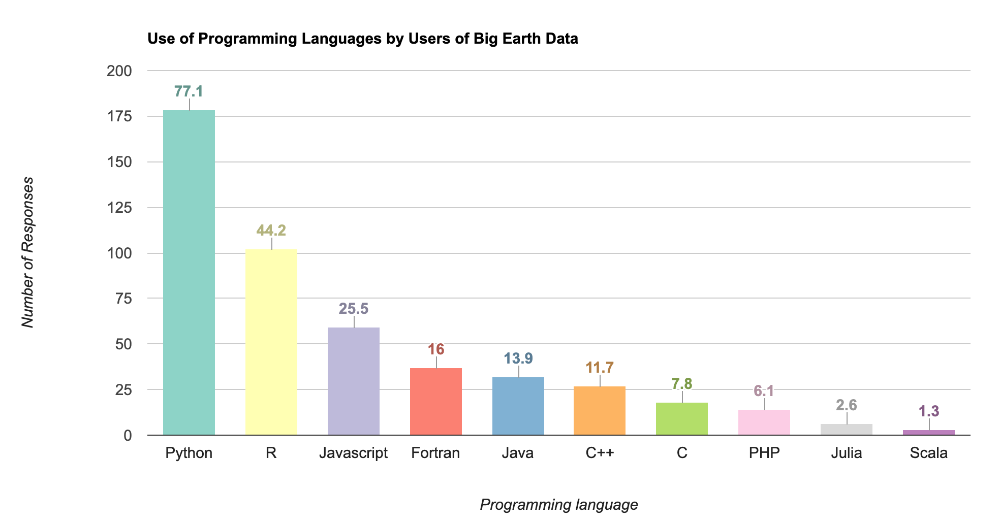
```

[Open in Code Editor &#8599;](https://code.earthengine.google.co.in/?scriptPath=users%2Fujavalgandhi%2FGEE-Charts%3A04-Advanced_Charts%2F01b_DataTable_Chart_(complete)){target="_blank"}

```{js eval=FALSE, code=readLines('code/gee_charts/04-Advanced_Charts/01b_DataTable_Chart_(complete)')}
```

### Exercise


[Open in Code Editor &#8599;](https://code.earthengine.google.co.in/?scriptPath=users%2Fujavalgandhi%2FGEE-Charts%3A04-Advanced_Charts%2F01c_DataTable_Chart_(exercise)){target="_blank"}

```
// Exercise

// The DataTable now has an additional value with the 'f' key showing the formatted value

// a) Change the chart to show horizonal bars. Hint: Use the type 'BarChart'
// b) Fix the X and Y-axis labels
```

```{r echo=FALSE, fig.align='center', out.width='75%', fig.cap='Exercise 01c'}
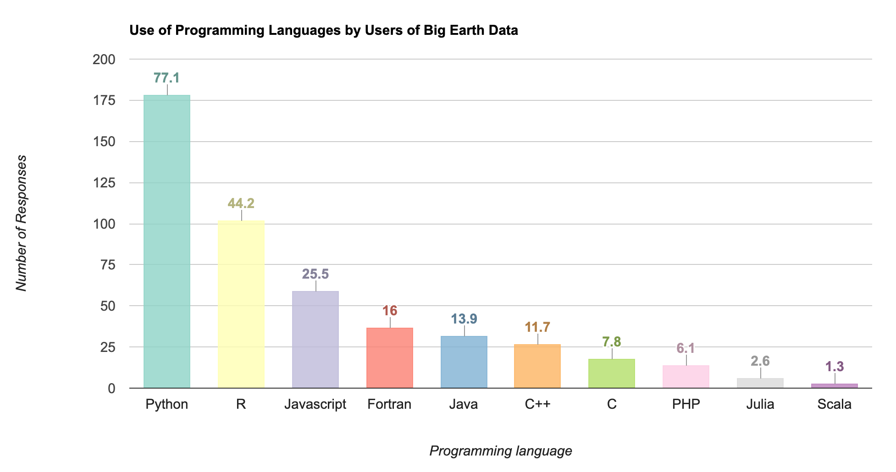
```


## 4.2 Box Plots

Many scientific analysis require showing the spread of values at each data point using a *Box Plot* or a *Whisker Plot*. Google Charts supports this using [Intervals](https://developers.google.com/chart/interactive/docs/gallery/intervals). To display the intervals, we must define a DataTable where certain columns are assigned the `role` of an `interval`. 

We start with a Sentinel-2 NDVI Time-Series at a farm polygon showing the median values within the polygon at each observation. We process the results using [Combined Reducers](https://developers.google.com/earth-engine/guides/reducers_intro#combining-reducers) and calculate the minimum, first quartile, second quartile, third quartile and maximum values. Since these values will be used in a DataTable, we apply additional formatting to create a dictionary for each row as per the Javascript literal format.

Below is the list of new styling options applied to the interval chart:

- `intervals`: Sets style of the interval values.
- `interval`: Override the style of selected intervals.

```{r echo=FALSE, fig.align='center', out.width='75%', fig.cap='Box Plot'}
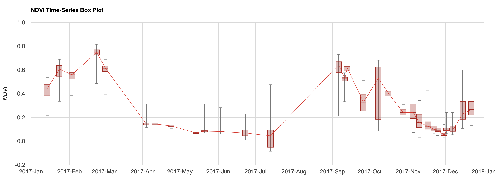
```

[Open in Code Editor &#8599;](https://code.earthengine.google.co.in/?scriptPath=users%2Fujavalgandhi%2FGEE-Charts%3A04-Advanced_Charts%2F02b_Box_Plots_(complete)){target="_blank"}

```{js eval=FALSE, code=readLines('code/gee_charts/04-Advanced_Charts/02b_Box_Plots_(complete)')}
```

### Exercise


[Open in Code Editor &#8599;](https://code.earthengine.google.co.in/?scriptPath=users%2Fujavalgandhi%2FGEE-Charts%3A04-Advanced_Charts%2F02b_Box_Plots_(exercise)){target="_blank"}

```
// Exercise

// a) Delete the 'geometry' and add a polygon at your chosen location.
// b) Modify the chart options hide the line connecting the bars.
// c) Print the chart.

// Hint: Set the lideWidth to 0.
```

```{r echo=FALSE, fig.align='center', out.width='75%', fig.cap='Exercise 02c'}
knitr::include_graphics('images/gee_charts/box_plot_exercise.png')
```


# Supplement

## Dual Y-Axis Chart

When you are plotting 2 series on a chart that have very different ranges - it makes sense to have 2 separate y-Axes. You can assign the left axis to one series and right axis to another using the `series.targetAxisIndex` option. Here's an example of plotting a monthly NDVI vs Rainfall time-series on the same chart.

```{r echo=FALSE, fig.align='center', out.width='100%', fig.cap='Dual Y-Axis Chart'}
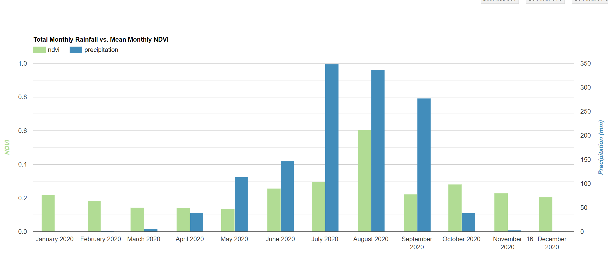
```

[Open in Code Editor &#8599;](https://code.earthengine.google.co.in/?scriptPath=users%2Fujavalgandhi%2FGEE-Charts%3ASupplement%2FDual_YAxis_Plots){target="_blank"}

```{js eval=FALSE, code=readLines('code/gee_charts/Supplement/Dual_YAxis_Plots')}
```

## Night Time Lights (NTL) Trends

The section on [Time-Series with Trendlines](#time-series-with-trendlines) covered how to add trendlines to the chart. We can apply this technique on a dataset of annual nighttime lights to see the effect of COVID19. We plot two series on a plot and display the trendline for the pre-covid series. This helps show the effect of COVID19 on the trend of nighttime lights.


```{r echo=FALSE, fig.align='center', out.width='75%', fig.cap='Annual NTL Trend'}
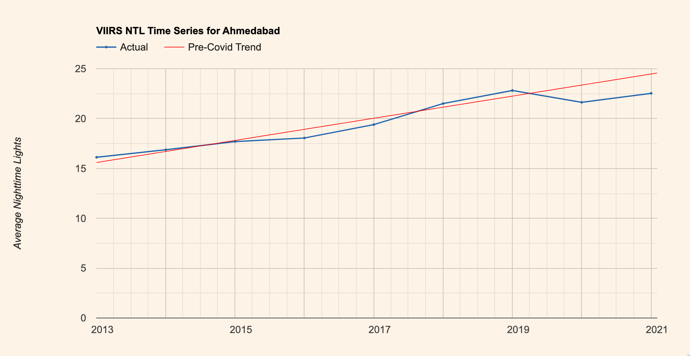
```

[Open in Code Editor &#8599;](https://code.earthengine.google.co.in/?scriptPath=users%2Fujavalgandhi%2FGEE-Charts%3ASupplement%2FNight_Time_Lights_Trends){target="_blank"}

```{js eval=FALSE, code=readLines('code/gee_charts/Supplement/Night_Time_Lights_Trends')}
```

## Population Time Series

Earth Engine makes it very easy to plot variables over time and compare trends of different regions. Here we take the LandScan population dataset and compare the population of two countries over time.


```{r echo=FALSE, fig.align='center', out.width='75%', fig.cap='Population Time-Series'}
knitr::include_graphics('images/gee_charts/population_time_series.png')
```

[Open in Code Editor &#8599;](https://code.earthengine.google.co.in/?scriptPath=users%2Fujavalgandhi%2FGEE-Charts%3ASupplement%2FPopulation_TimeSeries_Chart){target="_blank"}

```{js eval=FALSE, code=readLines('code/gee_charts/Supplement/Population_TimeSeries_Chart')}
```

## Stacked Bar Chart

You can use the `isStacked` option to `true` on charts of type *ColumnChart* or *BarChart* to create a stacked chart. We continue with the dataset from the section on [DataTable charts](#datatable-charts) and create a stacked bar chart.


```{r echo=FALSE, fig.align='center', out.width='75%', fig.cap='Regular vs. Stacked Bar Charts'}
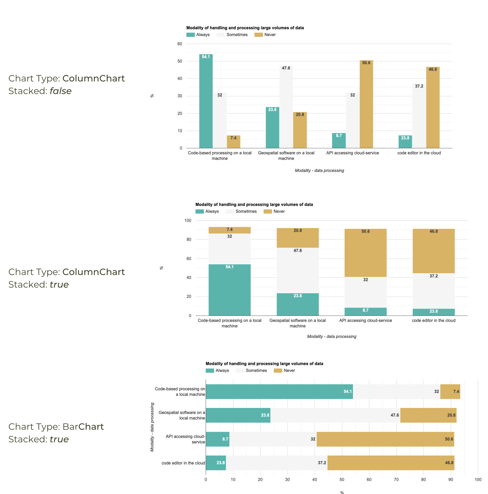
```

[Open in Code Editor &#8599;](https://code.earthengine.google.co.in/?scriptPath=users%2Fujavalgandhi%2FGEE-Charts%3ASupplement%2FStacked_BarChart){target="_blank"}

```{js eval=FALSE, code=readLines('code/gee_charts/Supplement/Stacked_BarChart')}
```

## Colored Bar Chart

It is possible to assign a different color to each bar of a bar chart. You neeed to create a DataTable with a column having a *style* role and define the color for each row. Here we create a chart that uses a unique color for each bar that representing the year of forest loss. The chart has a one-to-one correspondence with the map palette - making it a very useful tool in interpretation of the spatial and temporal aspects of the trend.

```{r echo=FALSE, fig.align='center', out.width='75%', fig.cap='Colored Bar Chart'}
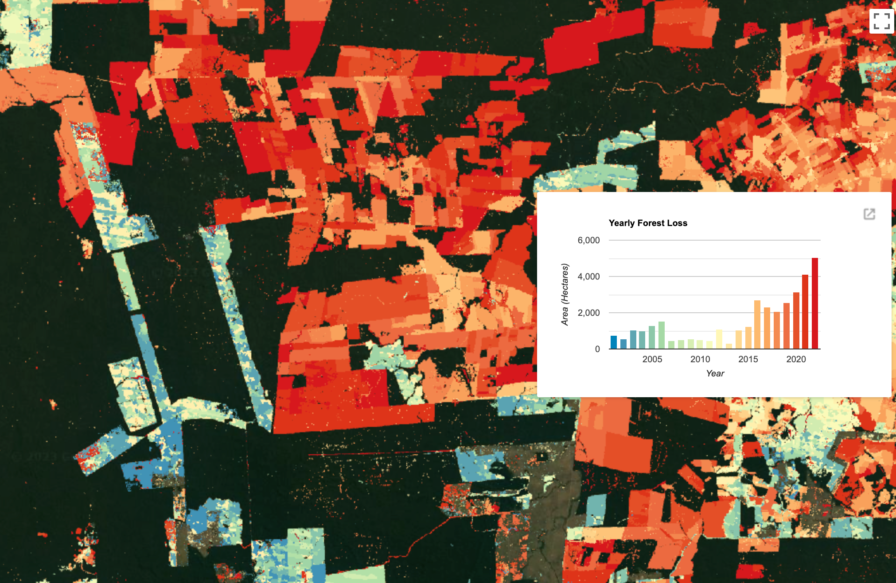
```

[Open in Code Editor &#8599;](https://code.earthengine.google.co.in/?scriptPath=users%2Fujavalgandhi%2FGEE-Charts%3ASupplement%2FDataTable_Colored_Bars){target="_blank"}

```{js eval=FALSE, code=readLines('code/gee_charts/Supplement/DataTable_Colored_Bars')}
```

## Transect Chart

You can sample values from an image along a line transect and generate a FeatureCollection with latitude, longitude and DN values. This can be then plotted to create a transect chart like below.

```{r echo=FALSE, fig.align='center', out.width='75%'}
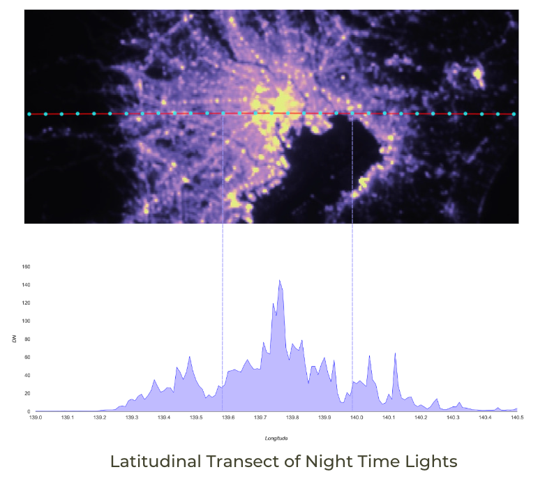
```

[Open in Code Editor &#8599;](https://code.earthengine.google.co.in/?scriptPath=users%2Fujavalgandhi%2FGEE-Charts%3ASupplement%2FTransect_Chart){target="_blank"}

```{js eval=FALSE, code=readLines('code/gee_charts/Supplement/Transect_Chart')}
```

# References

- Google Earth Engine Developer Guide: [Chart Documentation](https://developers.google.com/earth-engine/guides/charts_overview)

# Data Credits

- Abatzoglou, J.T., S.Z. Dobrowski, S.A. Parks, K.C. Hegewisch, 2018, Terraclimate, a high-resolution global dataset of monthly climate and climatic water balance from 1958-2015, Scientific Data 5:170191, doi:10.1038/sdata.2017.191
- Funk, Chris, Pete Peterson, Martin Landsfeld, Diego Pedreros, James Verdin, Shraddhanand Shukla, Gregory Husak, James Rowland, Laura Harrison, Andrew Hoell & Joel Michaelsen. "The climate hazards infrared precipitation with stations-a new environmental record for monitoring extremes". Scientific Data 2, 150066. doi:10.1038/sdata.2015.66 2015.
- GFS: Global Forecast System 384-Hour Predicted Atmosphere Data. https://www.emc.ncep.noaa.gov/emc/pages/numerical_forecast_systems/gfs.php
- MOD13Q1.006 Terra Vegetation Indices 16-Day Global 250m: Didan, K. (2015). MOD13Q1 MODIS/Terra Vegetation Indices 16-Day L3 Global 250m SIN Grid V006 [Data set]. NASA EOSDIS Land Processes DAAC. Accessed 2023-05-06 from https://doi.org/10.5067/MODIS/MOD13Q1.006
- Li, Xuecao; Zhou, Yuyu; zhao, Min; Zhao, Xia (2020): Harmonization of DMSP and VIIRS nighttime light data from 1992-2020 at the global scale. figshare. Dataset. https://doi.org/10.6084/m9.figshare.9828827.v5
- Sentinel-2 Level-2A: Contains Copernicus Sentinel data.
- Zanaga, D., Van De Kerchove, R., Daems, D., De Keersmaecker, W., Brockmann, C., Kirches, G., Wevers, J., Cartus, O., Santoro, M., Fritz, S., Lesiv, M., Herold, M., Tsendbazar, N.E., Xu, P., Ramoino, F., Arino, O., 2022. ESA WorldCover 10 m 2021 v200. (doi:10.5281/zenodo.7254221)
- Global Energy Observatory, Google, KTH Royal Institute of Technology in Stockholm, Enipedia, World Resources Institute. 2019. Global Power Plant Database. Published on Resource Watch and Google Earth Engine. http://resourcewatch.org/ https://earthengine.google.com/
- Wagemann, Julia, Siemen, Stephan, Seeger, Bernhard, & Bendix, Jörg. (2020). User requirements of Big Earth Data - Survey 2019 (0.1) [Data set]. Zenodo. https://doi.org/10.5281/zenodo.4075058
- Elvidge, C.D, Zhizhin, M., Ghosh T., Hsu FC, Taneja J. Annual time series of global VIIRS nighttime lights derived from monthly averages:2012 to 2019. Remote Sensing 2021, 13(5), p.922, https://doi.org/10.3390/rs13050922
- Sims, K., Reith, A., Bright, E., McKee, J., & Rose, A. (2022). LandScan Global 2021 [Data set]. Oak Ridge National Laboratory. https://doi.org/10.
48690/1527702
- Hansen, M. C., P. V. Potapov, R. Moore, M. Hancher, S. A. Turubanova, A. Tyukavina, D. Thau, S. V. Stehman, S. J. Goetz, T. R. Loveland, A. Kommareddy, A. Egorov, L. Chini, C. O. Justice, and J. R. G. Townshend. 2013. "High-Resolution Global Maps of 21st-Century Forest Cover Change." Science 342 (15 November): 850-53. 10.1126/science.1244693 Data available on-line at: https://glad.earthengine.app/view/global-forest-change.
- Elvidge, C.D, Zhizhin, M., Ghosh T., Hsu FC, Taneja J. Annual time series of global VIIRS nighttime lights derived from monthly averages:2012 to 2019. Remote Sensing 2021, 13(5), p.922, doi:10.3390/rs13050922 doi:10.3390/rs13050922

# License

The workshop material (text, images, presentation, videos) is licensed under a [Creative Commons Attribution 4.0 International License](https://creativecommons.org/licenses/by/4.0/).

The code (scripts, Jupyter notebooks) is licensed under the MIT License. For a copy, see https://opensource.org/licenses/MIT

You are free to re-use and adapt the material but are required to give appropriate credit to the original author as below:

Copyright &copy; 2023 Ujaval Gandhi [www.spatialthoughts.com](https://spatialthoughts.com)


# Citing and Referencing

You can cite the course materials as follows

* Gandhi, Ujaval, 2023. *Creating Publication Quality Charts with GEE* Workshop. Spatial Thoughts. https://courses.spatialthoughts.com/gee-charts.html

***
