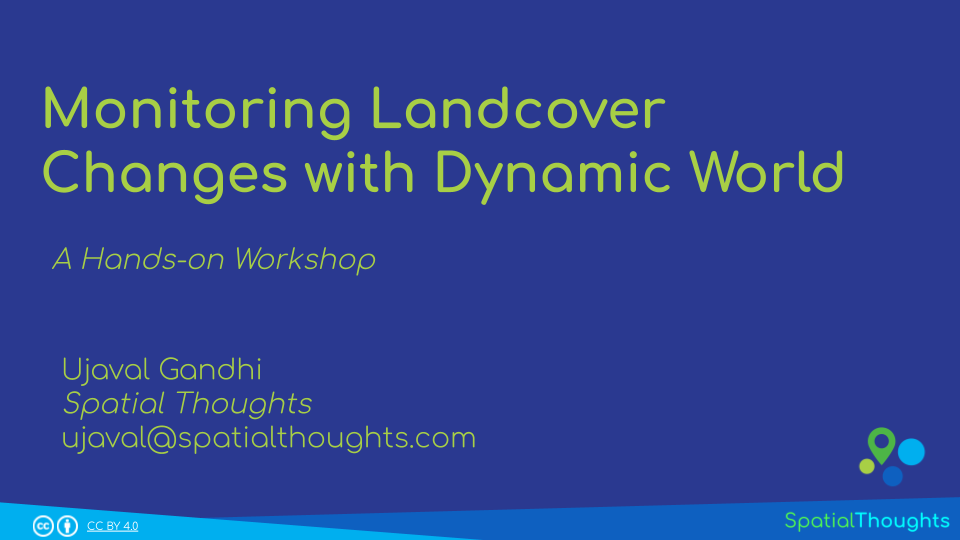
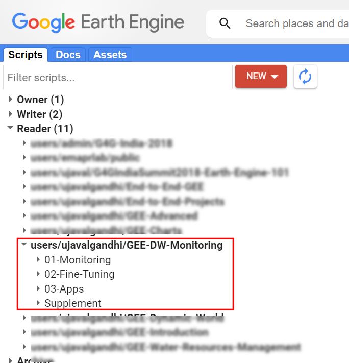
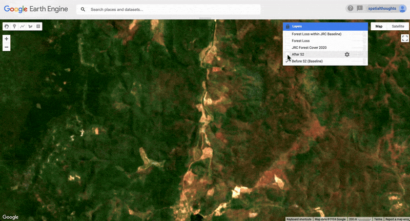
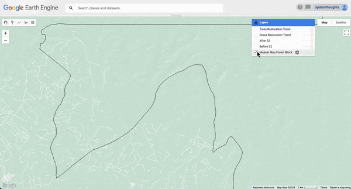
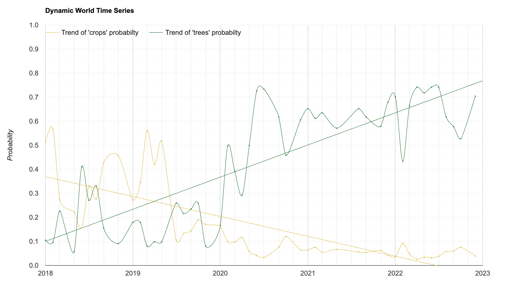
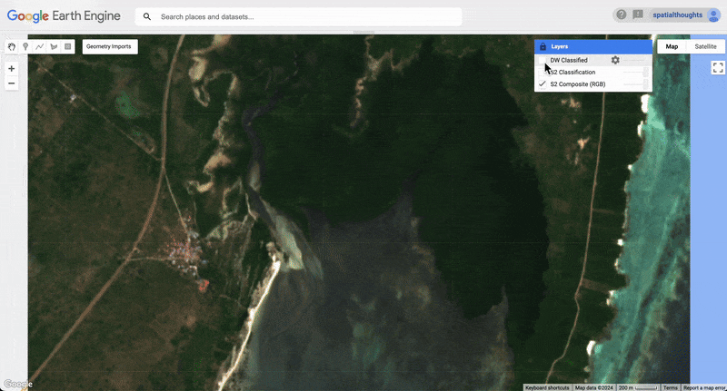
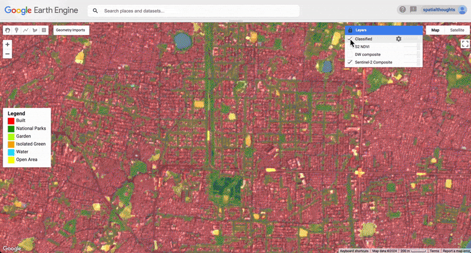
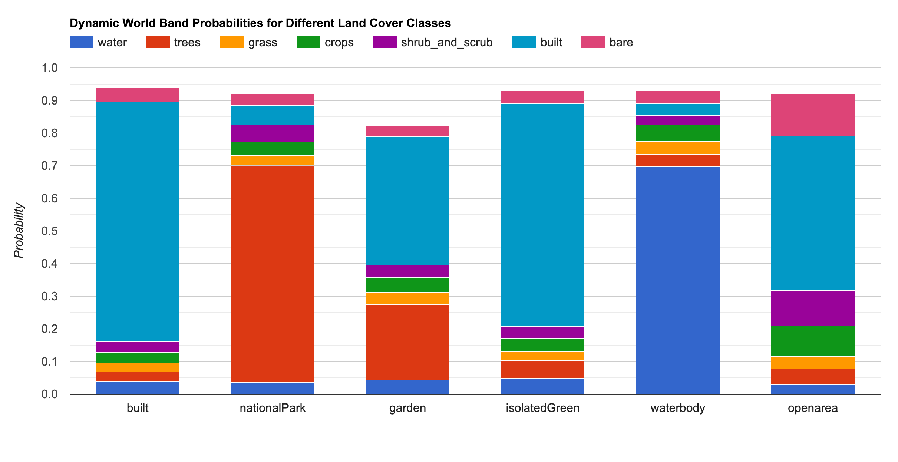
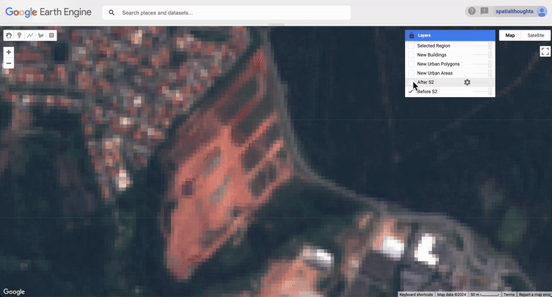
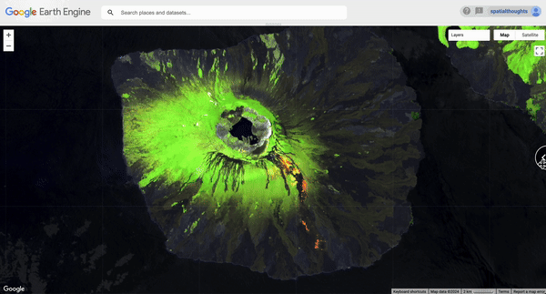

\newpage

<!--- Install package vembedr to get YouTube videos rendered -->
```{r echo=FALSE}
suppressWarnings(library("vembedr"))
```

\newpage

# Introduction 

Dynamic World is a landcover product developed by Google and World Resources Institute (WRI). It is a unique dataset that is designed to make it easy for users to develop locally-relevant landcover classification easily. Contrary to other landcover products which try to classify the pixels into a single class – the Dynamic World (DW) model gives you the the probability of the pixel belonging to each of the 9 different landcover classes. The full dataset contains the DW class probabilities for every Sentinel-2 scene since 2015 having <35% cloud-cover. It is also updated continuously with detections from new Sentinel-2 scenes as soon as they are available. This makes DW ideal for change detection and monitoring applications.

[{width="400px"}](https://docs.google.com/presentation/d/1tDiGSjGyv1Uf37dBYfK9CEQEJlpRMJuWCFbY5D1xDYY/edit?usp=sharing){target="_blank"}

[View the Presentation &#8599;](https://docs.google.com/presentation/d/1tDiGSjGyv1Uf37dBYfK9CEQEJlpRMJuWCFbY5D1xDYY/edit?usp=sharing){target="_blank"}


## Quiz - Introduction to Dynamic World


This is a short quiz to test your understanding of the Dynamic World dataset.

[Launch Quiz &#8599;](https://forms.gle/7r6dYdR4oZxQzcm69){target="_blank"}.


# Setting up the Environment

## Sign-up for Google Earth Engine

If you already have a Google Earth Engine account, you can skip this step.

Visit our [GEE Sign-Up Guide](gee-sign-up.html) for step-by-step instructions.

## Get the Workshop Materials

The workshop material and exercises are in the form of Earth Engine scripts shared via a code repository.

1. [Click this link](https://code.earthengine.google.com/?accept_repo=users/ujavalgandhi/GEE-DW-Monitoring) to open Google Earth Engine code editor and add the repository to your account.
2. If successful, you will have a new repository named `users/ujavalgandhi/GEE-DW-Monitoring` in the *Scripts* tab in the *Reader* section.
3. Verify that your code editor looks like below

```{r echo=FALSE, fig.align='center', out.width='50%', fig.cap='Code Editor After Adding the Workshop Repository'}

```
If you do not see the repository in the *Reader* section, click *Refresh repository cache* button in your *Scripts* tab and it will show up.

\newpage

# Module 1: Monitoring Landcover Changes

## 01. Monitoring Surface Water

```{r echo=FALSE, fig.align='center', out.width='100%', fig.cap='Surface Water Monitoring'}
knitr::include_graphics('images/gee_dw_monitoring/surface_water_monitoring.gif')
```


[Open in Code Editor &#8599;](https://code.earthengine.google.com/?scriptPath=users%2Fujavalgandhi%2FGEE-DW-Monitoring%3A01-Monitoring%2F01_surface_water_monitoring){target="_blank"}

```{js eval=FALSE, code=readLines('code/gee_dw_monitoring/01-Monitoring/01_surface_water_monitoring')}
```

## 02. Monitoring Urban Growth

```{r echo=FALSE, fig.align='center', out.width='100%', fig.cap='Urban Growth Monitoring'}
knitr::include_graphics('images/gee_dw_monitoring/urban_growth_monitoring.gif')
```

[Open in Code Editor &#8599;](https://code.earthengine.google.com/?scriptPath=users%2Fujavalgandhi%2FGEE-DW-Monitoring%3A01-Monitoring%2F02_urban_growth_monitoring){target="_blank"}

```{js eval=FALSE, code=readLines('code/gee_dw_monitoring/01-Monitoring/02_urban_growth_monitoring')}
```

## 03. Monitoring Deforestation

```{r echo=FALSE, fig.align='center', out.width='100%', fig.cap='Deforestation Monitoring'}

```


```{r echo=FALSE, fig.align='center', out.width='100%', fig.cap='Discovering Optimal Probability Threshold'}
knitr::include_graphics('images/gee_dw_monitoring/trees_threshold.png')
```

[Open in Code Editor &#8599;](https://code.earthengine.google.com/?scriptPath=users%2Fujavalgandhi%2FGEE-DW-Monitoring%3A01-Monitoring%2F03_deforestation_monitoring){target="_blank"}

```{js eval=FALSE, code=readLines('code/gee_dw_monitoring/01-Monitoring/03_deforestation_monitoring')}
```

## 04. Monitoring Restoration Trends

```{r echo=FALSE, fig.align='center', out.width='100%', fig.cap='Restoration Monitoring'}

```

```{r echo=FALSE, fig.align='center', out.width='100%', fig.cap='Trend of Landcover Probabilties'}

```

[Open in Code Editor &#8599;](https://code.earthengine.google.com/?scriptPath=users%2Fujavalgandhi%2FGEE-DW-Monitoring%3A01-Monitoring%2F04_restoration_monitoring){target="_blank"}

```{js eval=FALSE, code=readLines('code/gee_dw_monitoring/01-Monitoring/04_restoration_monitoring')}
```

# Module 2: Fine-Tuning Dynamic World Classification

## 01. Mangrove Classification

[Open in Code Editor &#8599;](https://code.earthengine.google.com/?scriptPath=users%2Fujavalgandhi%2FGEE-DW-Monitoring%3A02-Fine-Tuning%2F01_fine_tuning_mangroves){target="_blank"}

```{r echo=FALSE, fig.align='center', out.width='100%', fig.cap='Mangrove Classification using Dynamic World'}

```


## 02. Urban Tree Cover Classification

[Open in Code Editor &#8599;](https://code.earthengine.google.com/?scriptPath=users%2Fujavalgandhi%2FGEE-DW-Monitoring%3A02-Fine-Tuning%2F02_fine_tuning_urban_tree_cover){target="_blank"}

```{r echo=FALSE, fig.align='center', out.width='100%', fig.cap='Urban Tree Cover Classification using Dynamic World'}

```

```{r echo=FALSE, fig.align='center', out.width='100%'}

```


# Supplement

## Surface Water Monitoring (Large Regions)

```{r echo=FALSE, fig.align='center', out.width='100%', fig.cap='Monitoring Surface Water Extent for Lake Powell'}
knitr::include_graphics('images/gee_dw_monitoring/monitoring_lake_powell.gif')
```

[Open in Code Editor &#8599;](https://code.earthengine.google.com/?scriptPath=users%2Fujavalgandhi%2FGEE-DW-Monitoring%3ASupplement%2Fsurface_water_monitoring_composites){target="_blank"}

```{js eval=FALSE, code=readLines('code/gee_dw_monitoring/Supplement/surface_water_monitoring_composites')}
```

## Urban Growth Animation

```{r echo=FALSE, fig.align='center', out.width='100%', fig.cap='Growth of Bengaluru, India (2016-2024)'}
knitr::include_graphics('images/gee_dw_monitoring/urban_growth_animation.gif')
```

[Open in Code Editor &#8599;](https://code.earthengine.google.com/?scriptPath=users%2Fujavalgandhi%2FGEE-DW-Monitoring%3ASupplement%2Furban_growth_animation){target="_blank"}

```{js eval=FALSE, code=readLines('code/gee_dw_monitoring/Supplement/urban_growth_animation')}
```

## Urban Growth with Building Counts

```{r echo=FALSE, fig.align='center', out.width='100%', fig.cap='Detecting New Buildings'}

```

[Open in Code Editor &#8599;](https://code.earthengine.google.com/?scriptPath=users%2Fujavalgandhi%2FGEE-DW-Monitoring%3ASupplement%2Furban_growth_with_buildings){target="_blank"}

```{js eval=FALSE, code=readLines('code/gee_dw_monitoring/Supplement/urban_growth_with_buildings')}
```

## Determining Contiguous Built Environment

```{r echo=FALSE, fig.align='center', out.width='100%', fig.cap='Contiguous Urban Area vs. Municipal City Limit'}
knitr::include_graphics('images/gee_dw_monitoring/contiguous_urban_area.gif')
```

[Open in Code Editor &#8599;](https://code.earthengine.google.com/?scriptPath=users%2Fujavalgandhi%2FGEE-DW-Monitoring%3ASupplement%2Fcontiguous_urban_area){target="_blank"}

```{js eval=FALSE, code=readLines('code/gee_dw_monitoring/Supplement/contiguous_urban_area')}
```

## Monitoring Refugee Camps

[Open in Code Editor &#8599;](https://code.earthengine.google.com/?scriptPath=users%2Fujavalgandhi%2FGEE-DW-Monitoring%3ASupplement%2Fmonitoring_refugee_camps){target="_blank"}

```{js eval=FALSE, code=readLines('code/gee_dw_monitoring/Supplement/monitoring_refugee_camps')}
```

## Active Lava Classification 

[Open in Code Editor &#8599;](https://code.earthengine.google.com/?scriptPath=users%2Fujavalgandhi%2FGEE-DW-Monitoring%3ASupplement%2Ffine_tuning_lava_flow){target="_blank"}

```{r echo=FALSE, fig.align='center', out.width='100%', fig.cap='Classifying Active Lava Flow vs. Lava Beds'}

```
----

# Learning Resources

* [Google Earth Engine User Guide](https://developers.google.com/earth-engine/)
* [Cloud-Based Remote Sensing with Google Earth Engine: Fundamentals and Applications](https://www.eefabook.org/): A free and open-access book with 55-chapters covering fundamentals and applications of GEE. Also includes YouTube videos summarizing each chapter.
* [Spatial Thoughts OpenCourseWare](https://courses.spatialthoughts.com/)
    * End-to-End Google Earth Engine
    * Google Earth Engine for Water Resources Management
    * Creating Publication Quality Charts with GEE
    * Earth Engine Advanced Concepts


# Data Credits

* **Sentinel-2 Level-1C, Level-2A** and **Sentinel-1 SAR GRD**: Contains Copernicus Sentinel data.
* **Dynamic World V1**: Brown, C.F., Brumby, S.P., Guzder-Williams, B. et al. Dynamic World, Near real-time global 10 m land use land cover mapping. Sci Data 9, 251 (2022). doi:10.1038/s41597-022-01307-4
* **Kenya Admin Level 4 boundaries**: Central Bureau of Statistics (CBS), OCHA Regional Office for Southern and Eastern Africa (ROSEA). Downloaded from https://data.humdata.org/dataset/kenya-admin-level-4-boundaries 
* **LSIB 2017: Large Scale International Boundary Polygons, Simplified**: United States Department of State, Office of the Geographer
* **FAO GAUL 500m: Global Administrative Unit Layers 2015, Second-Level Administrative Units**: Source of Administrative boundaries: The Global Administrative Unit Layers (GAUL) dataset,
implemented by FAO within the CountrySTAT and Agricultural Market Information System
(AMIS) projects.


# License

The course material (text, images, presentation, videos) is licensed under a [Creative Commons Attribution 4.0 International License](https://creativecommons.org/licenses/by/4.0/).

The code (scripts, Jupyter notebooks etc.) is licensed under the MIT License. For a copy, see https://opensource.org/licenses/MIT

Kindly give appropriate credit to the original author as below:

Copyright &copy; 2024 Ujaval Gandhi [www.spatialthoughts.com](https://spatialthoughts.com)


# Citing and Referencing

You can cite the course materials as follows

* Gandhi, Ujaval, 2024. *Monitoring Landcover Changes using Dynamic World* workshop. Spatial Thoughts. https://courses.spatialthoughts.com/gee-dynamic-world.html

***
