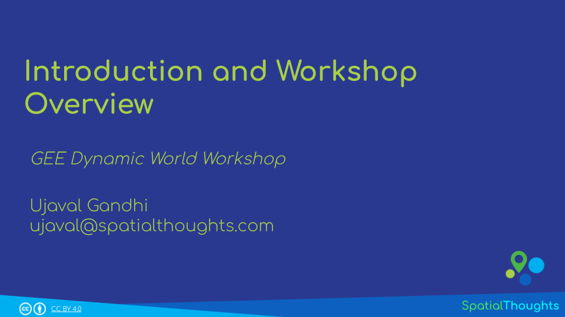
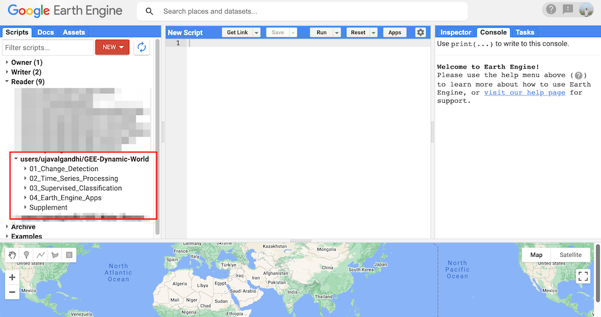
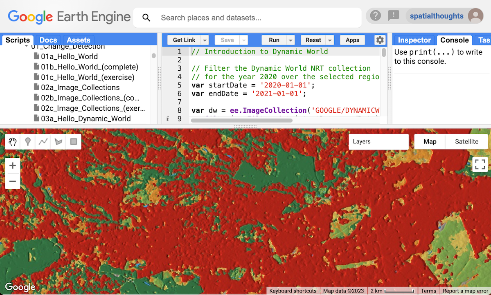
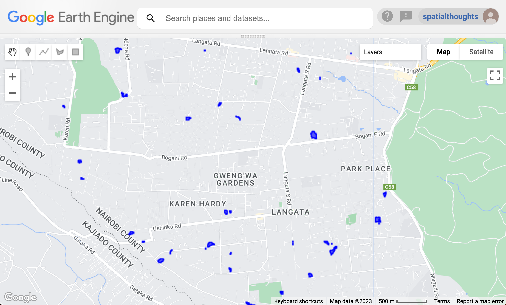

\newpage

<!--- Install package vembedr to get YouTube videos rendered -->
```{r echo=FALSE}
suppressWarnings(library("vembedr"))
```

\newpage

# Introduction 

Dynamic World is a landcover product developed by Google and World Resources Institute (WRI). It is a unique dataset that is designed to make it easy for users to develop locally-relevant landcover classification easily. Contrary to other landcover products which try to classify the pixels into a single class – the Dynamic World (DW) model gives you the the probability of the pixel belonging to each of the 9 different landcover classes. The full dataset contains the DW class probabilities for every Sentinel-2 scene since 2015 having <35% cloud-cover. It is also updated continuously with detections from new Sentinel-2 scenes as soon as they are available. This makes DW ideal for change detection and monitoring applications.

```{r echo=FALSE, fig.align='center', out.width='100%'}
knitr::include_graphics('images/gee_dynamic_world/dw_banner.png')
```

This workshop focuses on building skills in Google Earth engine to utilize Dynamic World. The workshop consists of the following 4 modules:

1. Change Detection
2. Supervised Classification
3. Time Series Processing
4. Earth Engine Apps

Pre-requisites:

* Familiarity with remote sensing datasets and concepts is helpful but not required.
* **No programming background or experience is required.**


[{width="400px"}](https://docs.google.com/presentation/d/141OgchhM12UE3mWBZH_sCdPpfIzeHOAYCg8g5zuQ2as/edit?usp=sharing){target="_blank"}

[View the Presentation &#8599;](https://docs.google.com/presentation/d/141OgchhM12UE3mWBZH_sCdPpfIzeHOAYCg8g5zuQ2as/edit?usp=sharing){target="_blank"}


## Quiz - Introduction to Dynamic World


This is a short quiz to test your understanding of the Dynamic World dataset.

[Launch Quiz &#8599;](https://forms.gle/7r6dYdR4oZxQzcm69){target="_blank"}.


# Setting up the Environment

## Sign-up for Google Earth Engine

If you already have a Google Earth Engine account, you can skip this step.

Visit our [GEE Sign-Up Guide](gee-sign-up.html) for step-by-step instructions.

## Get the Workshop Materials

The workshop material and exercises are in the form of Earth Engine scripts shared via a code repository.

1. [Click this link](https://code.earthengine.google.co.in/?accept_repo=users/ujavalgandhi/GEE-Dynamic-World) to open Google Earth Engine code editor and add the repository to your account.
2. If successful, you will have a new repository named `users/ujavalgandhi/GEE-Dynamic-World` in the *Scripts* tab in the *Reader* section.
3. Verify that your code editor looks like below

```{r echo=FALSE, fig.align='center', out.width='50%', fig.cap='Code Editor After Adding the Workshop Repository'}

```

If you do not see the repository in the *Reader* section, click *Refresh repository cache* button in your *Scripts* tab and it will show up.

\newpage

# Module 1: Change Detection

## 01. Hello World

[Open in Code Editor &#8599;](https://code.earthengine.google.co.in/?scriptPath=users%2Fujavalgandhi%2FGEE-Dynamic-World%3A01_Change_Detection%2F01b_Hello_World_(complete)){target="_blank"}

```{js eval=FALSE, code=readLines('code/gee_dynamic_world/01_Change_Detection/01b_Hello_World_(complete)')}
```

### Exercise

[Try in Code Editor &#8599;](https://code.earthengine.google.co.in/?scriptPath=users%2Fujavalgandhi%2FGEE-Dynamic-World%3A01_Change_Detection%2F01c_Hello_World_(exercise)){target="_blank"}

```{js eval=FALSE, code=readLines('code/gee_dynamic_world/01_Change_Detection/01c_Hello_World_(exercise)')}
```

## 02. Image Collections

[Open in Code Editor &#8599;](https://code.earthengine.google.co.in/?scriptPath=users%2Fujavalgandhi%2FGEE-Dynamic-World%3A01_Change_Detection%2F02b_Image_Collections_(complete)){target="_blank"}

```{js eval=FALSE, code=readLines('code/gee_dynamic_world/01_Change_Detection/02b_Image_Collections_(complete)')}
```

### Exercise

[Try in Code Editor &#8599;](https://code.earthengine.google.co.in/?scriptPath=users%2Fujavalgandhi%2FGEE-Dynamic-World%3A01_Change_Detection%2F02c_Image_Collections_(exercise)){target="_blank"}

```{js eval=FALSE, code=readLines('code/gee_dynamic_world/01_Change_Detection/02c_Image_Collections_(exercise)')}
```

## 03. Hello Dynamic World

```{r echo=FALSE, fig.align='center', out.width='75%'}

```


[Open in Code Editor &#8599;](https://code.earthengine.google.co.in/?scriptPath=users%2Fujavalgandhi%2FGEE-Dynamic-World%3A01_Change_Detection%2F03b_Hello_Dynamic_World_(complete)){target="_blank"}

```{js eval=FALSE, code=readLines('code/gee_dynamic_world/01_Change_Detection/03b_Hello_Dynamic_World_(complete)')}
```

### Exercise

[Try in Code Editor &#8599;](https://code.earthengine.google.co.in/?scriptPath=users%2Fujavalgandhi%2FGEE-Dynamic-World%3A01_Change_Detection%2F03c_Hello_Dynamic_World_(exercise)){target="_blank"}

```{js eval=FALSE}
// Exercise

// Change the startDate and endDate variables in the script
// to load the Dynamic World Composite for Jan-Mar 2023

// Set the center to your area of interest
```

## 04. Filtering Image Collections

[Open in Code Editor &#8599;](https://code.earthengine.google.co.in/?scriptPath=users%2Fujavalgandhi%2FGEE-Dynamic-World%3A01_Change_Detection%2F04b_Filtering_Image_Collection_(complete)){target="_blank"}

```{js eval=FALSE, code=readLines('code/gee_dynamic_world/01_Change_Detection/04b_Filtering_Image_Collection_(complete)')}
```

### Exercise

[Try in Code Editor &#8599;](https://code.earthengine.google.co.in/?scriptPath=users%2Fujavalgandhi%2FGEE-Dynamic-World%3A01_Change_Detection%2F04c_Filtering_Image_Collection_(exercise)){target="_blank"}

```{js eval=FALSE, code=readLines('code/gee_dynamic_world/01_Change_Detection/04c_Filtering_Image_Collection_(exercise)')}
```


## 05. Mosaics and Composites


```{r echo=FALSE, fig.align='center', out.width='75%', fig.cap='Mean Composite of Built Probability'}
knitr::include_graphics('images/gee_dynamic_world/dw_composite.png')
```


[Open in Code Editor &#8599;](https://code.earthengine.google.co.in/?scriptPath=users%2Fujavalgandhi%2FGEE-Dynamic-World%3A01_Change_Detection%2F05b_Mosaics_and_Composites_(complete)){target="_blank"}

```{js eval=FALSE, code=readLines('code/gee_dynamic_world/01_Change_Detection/05b_Mosaics_and_Composites_(complete)')}
```

### Exercise

[Try in Code Editor &#8599;](https://code.earthengine.google.co.in/?scriptPath=users%2Fujavalgandhi%2FGEE-Dynamic-World%3A01_Change_Detection%2F05c_Mosaics_and_Composites_(exercise)){target="_blank"}

```{js eval=FALSE}
// Exercise

// Change the code to display the probability of 'crops'
// from the Dynamic World Composite
// Display the results in a green palette.

```

## 06. Feature Collections


[Open in Code Editor &#8599;](https://code.earthengine.google.co.in/?scriptPath=users%2Fujavalgandhi%2FGEE-Dynamic-World%3A01_Change_Detection%2F06b_Feature_Collections_(complete)){target="_blank"}

```{js eval=FALSE, code=readLines('code/gee_dynamic_world/01_Change_Detection/06b_Feature_Collections_(complete)')}
```

### Exercise

[Try in Code Editor &#8599;](https://code.earthengine.google.co.in/?scriptPath=users%2Fujavalgandhi%2FGEE-Dynamic-World%3A01_Change_Detection%2F06c_Feature_Collections_(exercise)){target="_blank"}

```{js eval=FALSE, code=readLines('code/gee_dynamic_world/01_Change_Detection/06c_Feature_Collections_(exercise)')}
```

## 07. Import

[Open in Code Editor &#8599;](https://code.earthengine.google.co.in/?scriptPath=users%2Fujavalgandhi%2FGEE-Dynamic-World%3A01_Change_Detection%2F07b_Import_(complete)){target="_blank"}

```{js eval=FALSE, code=readLines('code/gee_dynamic_world/01_Change_Detection/07b_Import_(complete)')}
```

### Exercise

[Try in Code Editor &#8599;](https://code.earthengine.google.co.in/?scriptPath=users%2Fujavalgandhi%2FGEE-Dynamic-World%3A01_Change_Detection%2F07c_Import_(exercise)){target="_blank"}

```{js eval=FALSE, code=readLines('code/gee_dynamic_world/01_Change_Detection/07c_Import_(exercise)')}
```

## 08. Clipping

[Open in Code Editor &#8599;](https://code.earthengine.google.co.in/?scriptPath=users%2Fujavalgandhi%2FGEE-Dynamic-World%3A01_Change_Detection%2F08b_Clipping_(complete)){target="_blank"}

```{js eval=FALSE, code=readLines('code/gee_dynamic_world/01_Change_Detection/08b_Clipping_(complete)')}
```

### Exercise

[Try in Code Editor &#8599;](https://code.earthengine.google.co.in/?scriptPath=users%2Fujavalgandhi%2FGEE-Dynamic-World%3A01_Change_Detection%2F08c_Clipping_(exercise)){target="_blank"}

```{js eval=FALSE}
// Change the Admin4 region to your region of choice
// Clip the dwComposite and display the 'built' probability on the Map
```

## 09. Change Detection

```{r echo=FALSE, fig.align='center', out.width='75%', fig.cap='Newly Urbanized Areas Detected in Langata, Nairobi'}
knitr::include_graphics('images/gee_dynamic_world/new_urban.png')
```

[Open in Code Editor &#8599;](https://code.earthengine.google.co.in/?scriptPath=users%2Fujavalgandhi%2FGEE-Dynamic-World%3A01_Change_Detection%2F09b_Change_Detection_(complete)){target="_blank"}

```{js eval=FALSE, code=readLines('code/gee_dynamic_world/01_Change_Detection/09b_Change_Detection_(complete)')}
```

### Exercise

[Try in Code Editor &#8599;](https://code.earthengine.google.co.in/?scriptPath=users%2Fujavalgandhi%2FGEE-Dynamic-World%3A01_Change_Detection%2F09c_Change_Detection_(exericse)){target="_blank"}

```{js eval=FALSE}
// Exercise
// Change the script to find urban growth in your selected
// admin4 region
```

## 10. Convert to Vector

```{r echo=FALSE, fig.align='center', out.width='75%', fig.cap='Vectorized Polygons for Newly Urbanized Areas'}

```

[Open in Code Editor &#8599;](https://code.earthengine.google.co.in/?scriptPath=users%2Fujavalgandhi%2FGEE-Dynamic-World%3A01_Change_Detection%2F10b_Convert_to_Vector_(complete)){target="_blank"}

```{js eval=FALSE, code=readLines('code/gee_dynamic_world/01_Change_Detection/10b_Convert_to_Vector_(complete)')}
```

### Exercise

[Try in Code Editor &#8599;](https://code.earthengine.google.co.in/?scriptPath=users%2Fujavalgandhi%2FGEE-Dynamic-World%3A01_Change_Detection%2F10c_Convert_to_Vector_(exercise)){target="_blank"}

```{js eval=FALSE}
// Exercise
// Change the script to see change polygons your selected
// admin4 region
```

## 11. Export

[Open in Code Editor &#8599;](https://code.earthengine.google.co.in/?scriptPath=users%2Fujavalgandhi%2FGEE-Dynamic-World%3A01_Change_Detection%2F11b_Export_(complete)){target="_blank"}

```{js eval=FALSE, code=readLines('code/gee_dynamic_world/01_Change_Detection/11b_Export_(complete)')}
```

### Exercise

[Try in Code Editor &#8599;](https://code.earthengine.google.co.in/?scriptPath=users%2Fujavalgandhi%2FGEE-Dynamic-World%3A01_Change_Detection%2F11c_Export_(exercise)){target="_blank"}

```{js eval=FALSE}
// Exercise
// Change the filter to your chosen region
// Export the results
```

## Quiz - Module 1


This is a short quiz to test your understanding of the Module 1 concepts.

[Launch Quiz &#8599;](https://forms.gle/ygkmHMyJbmDJoB6P6){target="_blank"}.


# Module 2: Supervised Classification

[{width="400px"}](https://docs.google.com/presentation/d/1vVNZQn0WVYIMSIeIhBi6GlfAEVK7tsyt8i5NJ7eogKo/edit?usp=sharing){target="_blank"}

[View the Presentation &#8599;](https://docs.google.com/presentation/d/1vVNZQn0WVYIMSIeIhBi6GlfAEVK7tsyt8i5NJ7eogKo/edit?usp=sharing){target="_blank"}


## 01. Basic Supervised Classification

[Open in Code Editor &#8599;](https://code.earthengine.google.co.in/?scriptPath=users%2Fujavalgandhi%2FGEE-Dynamic-World%3A02_Supervised_Classification%2F01b_Basic_Supervised_Classification_(complete)){target="_blank"}

```{js eval=FALSE, code=readLines('code/gee_dynamic_world/02_Supervised_Classification/01d_Basic_Supervised_Classification_(noimport))')}
```

### Exercise

[Try in Code Editor &#8599;](https://code.earthengine.google.co.in/?scriptPath=users%2Fujavalgandhi%2FGEE-Dynamic-World%3A02_Supervised_Classification%2F01c_Basic_Supervised_Classification_(exercise)){target="_blank"}

```{js eval=FALSE}
// Perform supervised classification for your chosen region

// Delete the 'geometry' from imports
// Draw a polygon anywhere along the coastline to
// create a new geometry
// Make sure the chosen region has mangroves and water
```


## 02. Supervised Classification with Dynamic World Bands

```{r echo=FALSE, fig.align='center', out.width='75%', fig.cap='Comparison of classification results using S2 vs DW bands'}
knitr::include_graphics('images/gee_dynamic_world/s2_vs_dw.png')
```

[Open in Code Editor &#8599;](https://code.earthengine.google.co.in/?scriptPath=users%2Fujavalgandhi%2FGEE-Dynamic-World%3A02_Supervised_Classification%2F02b_Supervised_Classification_with_DW_(complete)){target="_blank"}

```{js eval=FALSE, code=readLines('code/gee_dynamic_world/02_Supervised_Classification/02d_Supervised_Classification_with_DW_(noimport)')}
```

### Exercise

[Try in Code Editor &#8599;](https://code.earthengine.google.co.in/?scriptPath=users%2Fujavalgandhi%2FGEE-Dynamic-World%3A02_Supervised_Classification%2F01c_Basic_Supervised_Classification_(exercise)){target="_blank"}

```{js eval=FALSE}
// Perform supervised classification for your chosen region

// Delete the 'geometry' from imports
// Draw a polygon anywhere along the coastline to
// create a new geometry
// Make sure the chosen region has mangroves and water
```

## 03. Accuracy Assessment

[Open in Code Editor &#8599;](https://code.earthengine.google.co.in/?scriptPath=users%2Fujavalgandhi%2FGEE-Dynamic-World%3A02_Supervised_Classification%2F03b_Accuracy_Assessment_(complete)){target="_blank"}

```{js eval=FALSE, code=readLines('code/gee_dynamic_world/02_Supervised_Classification/03b_Accuracy_Assessment_(complete)')}
```

### Exercise

[Try in Code Editor &#8599;](https://code.earthengine.google.co.in/?scriptPath=users%2Fujavalgandhi%2FGEE-Dynamic-World%3A02_Supervised_Classification%2F03c_Accuracy_Assessment_(exercise)){target="_blank"}

```{js eval=FALSE}
// Calculate and print the following assessment metrics
// 1. Producer's accuracy
// 2. Consumer's accuracy
// 3. F1-score

// Hint: Look at the ee.ConfusionMatrix module for appropriate methods
```

## 04. Improving the Classification

[Open in Code Editor &#8599;](https://code.earthengine.google.co.in/?scriptPath=users%2Fujavalgandhi%2FGEE-Dynamic-World%3A02_Supervised_Classification%2F04b_Improving_the_Classification_(complete)){target="_blank"}

```{js eval=FALSE, code=readLines('code/gee_dynamic_world/02_Supervised_Classification/04b_Improving_the_Classification_(complete)')}
```

### Exercise

[Try in Code Editor &#8599;](https://code.earthengine.google.co.in/?scriptPath=users%2Fujavalgandhi%2FGEE-Dynamic-World%3A02_Supervised_Classification%2F04c_Improving_the_Classification_(exercise)){target="_blank"}

```{js eval=FALSE}
// Classify S2 + DW Composite

// Create a new image by stacking S2 and DW Bands
var stacked = composite.addBands(probabilityImage);

// Run the classifyImage() function on the stacked image
// and display the results
```

## 05. Exporting Classification Results

[Open in Code Editor &#8599;](https://code.earthengine.google.co.in/?scriptPath=users%2Fujavalgandhi%2FGEE-Dynamic-World%3A02_Supervised_Classification%2F05b_Exporting_Classification_Results_(complete)){target="_blank"}

```{js eval=FALSE, code=readLines('code/gee_dynamic_world/02_Supervised_Classification/05b_Exporting_Classification_Results_(complete)')}
```

### Exercise

[Try in Code Editor &#8599;](https://code.earthengine.google.co.in/?scriptPath=users%2Fujavalgandhi%2FGEE-Dynamic-World%3A02_Supervised_Classification%2F05c_Exporting_Classification_Results_(exercise)){target="_blank"}

```{js eval=FALSE}
// Exercise
// Export both classified images as assets
// Run the script and start the export tasks
```

## 06. Calculating Area

[Open in Code Editor &#8599;](https://code.earthengine.google.co.in/?scriptPath=users%2Fujavalgandhi%2FGEE-Dynamic-World%3A02_Supervised_Classification%2F06b_Calculating_Area_(complete)){target="_blank"}

```{js eval=FALSE, code=readLines('code/gee_dynamic_world/02_Supervised_Classification/06b_Calculating_Area_(complete)')}
```

### Exercise

[Try in Code Editor &#8599;](https://code.earthengine.google.co.in/?scriptPath=users%2Fujavalgandhi%2FGEE-Dynamic-World%3A02_Supervised_Classification%2F06c_Calculating_Area_(exercise)){target="_blank"}

```{js eval=FALSE, code=readLines('code/gee_dynamic_world/02_Supervised_Classification/06c_Calculating_Area_(exercise)')}
```

## Quiz - Module 2


This is a short quiz to test your understanding of the Module 2 concepts.

[Launch Quiz &#8599;](https://forms.gle/8Kx6HqZvuGQnozt78){target="_blank"}.


# Learning Resources

* [Google Earth Engine User Guide](https://developers.google.com/earth-engine/)
* [Cloud-Based Remote Sensing with Google Earth Engine: Fundamentals and Applications](https://www.eefabook.org/): A free and open-access book with 55-chapters covering fundamentals and applications of GEE. Also includes YouTube videos summarizing each chapter.
* [Spatial Thoughts OpenCourseWare](https://courses.spatialthoughts.com/)
    * End-to-End Google Earth Engine
    * Google Earth Engine for Water Resources Management
    * Creating Publication Quality Charts with GEE
    * Earth Engine Advanced Concepts


# Data Credits

* **Sentinel-2 Level-1C, Level-2A** and **Sentinel-1 SAR GRD**: Contains Copernicus Sentinel data.
* **Dynamic World V1**: Brown, C.F., Brumby, S.P., Guzder-Williams, B. et al. Dynamic World, Near real-time global 10 m land use land cover mapping. Sci Data 9, 251 (2022). doi:10.1038/s41597-022-01307-4
* **FAO GAUL 500m: Global Administrative Unit Layers 2015, Second-Level Administrative Units**: Source of Administrative boundaries: The Global Administrative Unit Layers (GAUL) dataset,
implemented by FAO within the CountrySTAT and Agricultural Market Information System
(AMIS) projects.


# License

The course material (text, images, presentation, videos) is licensed under a [Creative Commons Attribution 4.0 International License](https://creativecommons.org/licenses/by/4.0/).

The code (scripts, Jupyter notebooks) is licensed under the MIT License. For a copy, see https://opensource.org/licenses/MIT

Kindly give appropriate credit to the original author as below:

Copyright &copy; 2023 Ujaval Gandhi [www.spatialthoughts.com](https://spatialthoughts.com)


# Citing and Referencing

You can cite the course materials as follows

* Gandhi, Ujaval, 2023. *Hands-on Introduction to Dynamic World* workshop. Spatial Thoughts. https://courses.spatialthoughts.com/gee-dynamic-world.html

***
