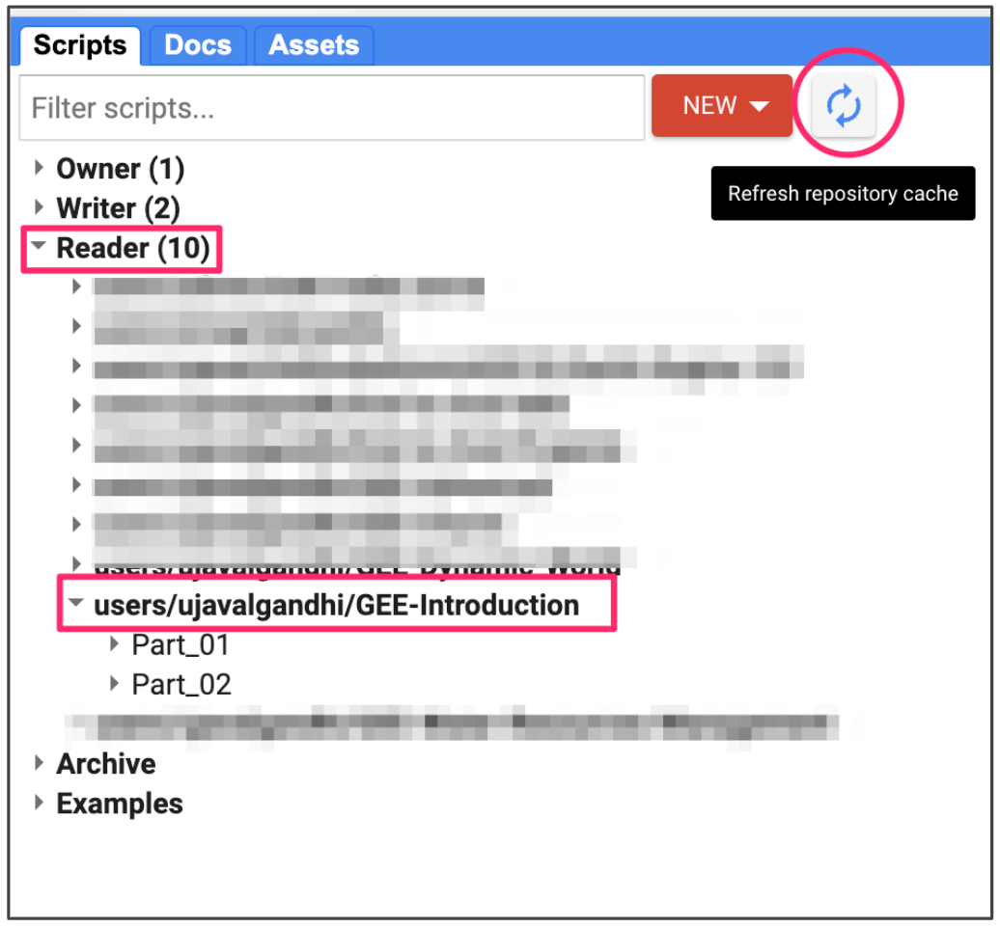

\newpage

***

```{r echo=FALSE, fig.align='center', out.width='75%', out.width='250pt'}
knitr::include_graphics('images/spatial_thoughts_logo.png')
```

***

\newpage

# Introduction 

This 5-hour hands-on workshop is designed to help participants learn the basics of the Google Earth Engine platform. This beginner-friendly class covers a range of topics to help participants get comfortable with the Code Editor environment and the Google Earth Engine API to implement remote sensing workflows. During the workshop, you will learn how to load, filter, analyze, and export datasets from the Earth Engine Data Catalog. The workshop also covers Map/Reduce programming concepts so you can scale your analysis to large regions and work with time-series data.

[{width="400px"}](https://docs.google.com/presentation/d/1wCinjis7AnC_-yYlMBq2PH94mdHWkZvJQr2Il6MY4Sk/edit?usp=sharing){target="_blank"}

[View the Presentation &#8599;](https://docs.google.com/presentation/d/1wCinjis7AnC_-yYlMBq2PH94mdHWkZvJQr2Il6MY4Sk/edit?usp=sharing){target="_blank"}

# Setting up the Environment

## Sign-up for Google Earth Engine

If you already have a Google Earth Engine account, you can skip this step.

Visit our [GEE Sign-Up Guide](gee-sign-up.html) for step-by-step instructions.

## Get the Course Materials

The course material and exercises are in the form of Earth Engine scripts shared via a code repository.

1. [Click this link](https://code.earthengine.google.co.in/?accept_repo=users/ujavalgandhi/GEE-Introduction) to open Google Earth Engine code editor and add the repository to your account.
2. If successful, you will have a new repository named `users/ujavalgandhi/GEE-Introduction` in the *Scripts* tab in the *Reader* section.
3. Verify that your code editor looks like below

```{r echo=FALSE, fig.align='center', out.width='50%', fig.cap='Code Editor After Adding the Workshop Repository'}

```

If you do not see the repository in the *Reader* section, click *Refresh repository cache* button in your *Scripts* tab and it will show up.

\newpage

# Part 1: Data Discovery, Processing and Export

## 01. Hello World

[Open in Code Editor &#8599;](https://code.earthengine.google.co.in/?scriptPath=users%2Fujavalgandhi%2FGEE-Introduction%3APart_01%2F01b_Hello_World_(complete)){target="_blank"}

```{js eval=FALSE, code=readLines('code/gee_introduction/Part_01/01b_Hello_World_(complete)')}
```


### Exercise

[Try in Code Editor &#8599;](https://code.earthengine.google.co.in/?scriptPath=users%2Fujavalgandhi%2FGEE-Introduction%3APart_01%2F01c_Hello_World_(exercise)){target="_blank"}

```{js eval=FALSE, code=readLines('code/gee_introduction/Part_01/01c_Hello_World_(exercise)')}
```

## 02. ImageCollections

[Open in Code Editor &#8599;](https://code.earthengine.google.co.in/?scriptPath=users%2Fujavalgandhi%2FGEE-Introduction%3APart_01%2F02b_Image_Collections_(complete)){target="_blank"}

```{js eval=FALSE, code=readLines('code/gee_introduction/Part_01/02b_Image_Collections_(complete)')}
```


### Exercise

[Try in Code Editor &#8599;](https://code.earthengine.google.co.in/?scriptPath=users%2Fujavalgandhi%2FGEE-Introduction%3APart_01%2F02c_Image_Collections_(exercise)){target="_blank"}

```{js eval=FALSE, code=readLines('code/gee_introduction/Part_01/02c_Image_Collections_(exercise)')}
```

## 02. ImageCollections

[Open in Code Editor &#8599;](https://code.earthengine.google.co.in/?scriptPath=users%2Fujavalgandhi%2FGEE-Introduction%3APart_01%2F02b_Image_Collections_(complete)){target="_blank"}

```{js eval=FALSE, code=readLines('code/gee_introduction/Part_01/02b_Image_Collections_(complete)')}
```


### Exercise

[Try in Code Editor &#8599;](https://code.earthengine.google.co.in/?scriptPath=users%2Fujavalgandhi%2FGEE-Introduction%3APart_01%2F02c_Image_Collections_(exercise)){target="_blank"}

```{js eval=FALSE, code=readLines('code/gee_introduction/Part_01/02c_Image_Collections_(exercise)')}
```


## 03. Filtering ImageCollections

[Open in Code Editor &#8599;](https://code.earthengine.google.co.in/?scriptPath=users%2Fujavalgandhi%2FGEE-Introduction%3APart_01%2F03b_Filtering_Image_Collection_(complete)){target="_blank"}

```{js eval=FALSE, code=readLines('code/gee_introduction/Part_01/03b_Filtering_Image_Collection_(complete)')}
```


### Exercise

[Try in Code Editor &#8599;](https://code.earthengine.google.co.in/?scriptPath=users%2Fujavalgandhi%2FGEE-Introduction%3APart_01%2F03c_Filtering_Image_Collection_(exercise)){target="_blank"}

```{js eval=FALSE, code=readLines('code/gee_introduction/Part_01/03c_Filtering_Image_Collection_(exercise)')}
```


## 04. Mosaics and Composites

[Open in Code Editor &#8599;](https://code.earthengine.google.co.in/?scriptPath=users%2Fujavalgandhi%2FGEE-Introduction%3APart_01%2F04b_Mosaics_and_Composites_(complete)){target="_blank"}

```{js eval=FALSE, code=readLines('code/gee_introduction/Part_01/04b_Mosaics_and_Composites_(complete)')}
```


### Exercise

[Try in Code Editor &#8599;](https://code.earthengine.google.co.in/?scriptPath=users%2Fujavalgandhi%2FGEE-Introduction%3APart_01%2F04c_Mosaics_and_Composites_(exercise)){target="_blank"}

```{js eval=FALSE, code=readLines('code/gee_introduction/Part_01/04c_Mosaics_and_Composites_(exercise)')}
```


## 05. FeatureCollections

[Open in Code Editor &#8599;](https://code.earthengine.google.co.in/?scriptPath=users%2Fujavalgandhi%2FGEE-Introduction%3APart_01%2F05b_Feature_Collections_(complete)){target="_blank"}

```{js eval=FALSE, code=readLines('code/gee_introduction/Part_01/05b_Feature_Collections_(complete)')}
```


### Exercise

[Try in Code Editor &#8599;](https://code.earthengine.google.co.in/?scriptPath=users%2Fujavalgandhi%2FGEE-Introduction%3APart_01%2F05c_Feature_Collections_(exercise)){target="_blank"}

```{js eval=FALSE, code=readLines('code/gee_introduction/Part_01/05c_Feature_Collections_(exercise)')}
```


## 06. Clipping

[Open in Code Editor &#8599;](https://code.earthengine.google.co.in/?scriptPath=users%2Fujavalgandhi%2FGEE-Introduction%3APart_01%2F06b_Clipping_(complete)){target="_blank"}

```{js eval=FALSE, code=readLines('code/gee_introduction/Part_01/06b_Clipping_(complete)')}
```


### Exercise

[Try in Code Editor &#8599;](https://code.earthengine.google.co.in/?scriptPath=users%2Fujavalgandhi%2FGEE-Introduction%3APart_01%2F06c_Clipping_(exercise)){target="_blank"}

```{js eval=FALSE, code=readLines('code/gee_introduction/Part_01/06c_Clipping_(exercise)')}
```

## 07. Export

[Open in Code Editor &#8599;](https://code.earthengine.google.co.in/?scriptPath=users%2Fujavalgandhi%2FGEE-Introduction%3APart_01%2F07b_Export_(complete)){target="_blank"}

```{js eval=FALSE, code=readLines('code/gee_introduction/Part_01/07b_Export_(complete)')}
```

### Exercise

[Try in Code Editor &#8599;](https://code.earthengine.google.co.in/?scriptPath=users%2Fujavalgandhi%2FGEE-Introduction%3APart_01%2F07c_Export_(exercise)){target="_blank"}

```{js eval=FALSE, code=readLines('code/gee_introduction/Part_01/07c_Export_(exercise)')}

```

\newpage

# Part 2: Computation in Earth Engine

## 01. Calculating Indices

[Open in Code Editor &#8599;](https://code.earthengine.google.co.in/?scriptPath=users%2Fujavalgandhi%2FGEE-Introduction%3APart_02%2F01b_Calculating_Indices_(complete)){target="_blank"}

```{js eval=FALSE, code=readLines('code/gee_introduction/Part_02/01b_Calculating_Indices_(complete)')}
```

### Exercise

[Try in Code Editor &#8599;](https://code.earthengine.google.co.in/?scriptPath=users%2Fujavalgandhi%2FGEE-Introduction%3APart_02%2F01c_Calculating_Indices_(exercise)){target="_blank"}

```{js eval=FALSE, code=readLines('code/gee_introduction/Part_02/01c_Calculating_Indices_(exercise)')}
```

## 02. Computation on ImageCollections

[Open in Code Editor &#8599;](https://code.earthengine.google.co.in/?scriptPath=users%2Fujavalgandhi%2FGEE-Introduction%3APart_02%2F02b_Computation_on_Image_Collections_(complete)){target="_blank"}

```{js eval=FALSE, code=readLines('code/gee_introduction/Part_02/02b_Computation_on_Image_Collections_(complete)')}
```

### Exercise

[Try in Code Editor &#8599;](https://code.earthengine.google.co.in/?scriptPath=users%2Fujavalgandhi%2FGEE-Introduction%3APart_02%2F02c_Computation_on_Image_Collections_(exercise)){target="_blank"}

```{js eval=FALSE, code=readLines('code/gee_introduction/Part_02/02c_Computation_on_Image_Collections_(exercise)')}
```

## 03. Reducing ImageCollections

[Open in Code Editor &#8599;](https://code.earthengine.google.co.in/?scriptPath=users%2Fujavalgandhi%2FGEE-Introduction%3APart_02%2F03b_Reducing_Image_Collections_(complete)){target="_blank"}

```{js eval=FALSE, code=readLines('code/gee_introduction/Part_02/03b_Reducing_Image_Collections_(complete)')}
```

### Exercise

[Try in Code Editor &#8599;](https://code.earthengine.google.co.in/?scriptPath=users%2Fujavalgandhi%2FGEE-Introduction%3APart_02%2F03c_Reducing_Image_Collections_(exercise)){target="_blank"}

```{js eval=FALSE, code=readLines('code/gee_introduction/Part_02/03c_Reducing_Image_Collections_(exercise)')}
```

## 04. Reducing Images

[Open in Code Editor &#8599;](https://code.earthengine.google.co.in/?scriptPath=users%2Fujavalgandhi%2FGEE-Introduction%3APart_02%2F04b_Reducing_Images_(complete)){target="_blank"}

```{js eval=FALSE, code=readLines('code/gee_introduction/Part_02/04b_Reducing_Images_(complete)')}
```

### Exercise

[Try in Code Editor &#8599;](https://code.earthengine.google.co.in/?scriptPath=users%2Fujavalgandhi%2FGEE-Introduction%3APart_02%2F04c_Reducing_Images_(exericse)){target="_blank"}

```{js eval=FALSE, code=readLines('code/gee_introduction/Part_02/04c_Reducing_Images_(exericse)')}
```

## 05. Time-Series Charts

[Open in Code Editor &#8599;](https://code.earthengine.google.co.in/?scriptPath=users%2Fujavalgandhi%2FGEE-Introduction%3APart_02%2F05b_Time_Series_Charts_(complete)){target="_blank"}

```{js eval=FALSE, code=readLines('code/gee_introduction/Part_02/05b_Time_Series_Charts_(complete)')}
```

### Exercise

[Try in Code Editor &#8599;](https://code.earthengine.google.co.in/?scriptPath=users%2Fujavalgandhi%2FGEE-Introduction%3APart_02%2F05c_Time_Series_Charts_(exercise)){target="_blank"}

```{js eval=FALSE, code=readLines('code/gee_introduction/Part_02/05c_Time_Series_Charts_(exercise)')}
```


# Learning Resources

* [Google Earth Engine User Guide](https://developers.google.com/earth-engine/)
* [Cloud-Based Remote Sensing with Google Earth Engine: Fundamentals and Applications](https://www.eefabook.org/): A free and open-access book with 55-chapters covering fundamentals and applications of GEE. Also includes YouTube videos summarizing each chapter.
* [Spatial Thoughts OpenCourseWare](https://courses.spatialthoughts.com/)
    * End-to-End Google Earth Engine
    * Google Earth Engine for Water Resources Management
    * Creating Publication Quality Charts with GEE
    * Earth Engine Advanced Concepts


# Data Credits

* **Sentinel-2 Level-1C, Level-2A** and **Sentinel-1 SAR GRD**: Contains Copernicus Sentinel data.
* **FAO GAUL 500m: Global Administrative Unit Layers 2015, Second-Level Administrative Units**: Source of Administrative boundaries: The Global Administrative Unit Layers (GAUL) dataset,
implemented by FAO within the CountrySTAT and Agricultural Market Information System
(AMIS) projects.


# License

The course material (text, images, presentation, videos) is licensed under a [Creative Commons Attribution 4.0 International License](https://creativecommons.org/licenses/by/4.0/).

The code (scripts, Jupyter notebooks) is licensed under the MIT License. For a copy, see https://opensource.org/licenses/MIT

Kindly give appropriate credit to the original author as below:

Copyright &copy; 2023 Ujaval Gandhi [www.spatialthoughts.com](https://spatialthoughts.com)


# Citing and Referencing

You can cite the course materials as follows

* Gandhi, Ujaval, 2023. *Introduction to Google Earth Engine* workshop. Spatial Thoughts. https://courses.spatialthoughts.com/end-to-end-gee.html

***
