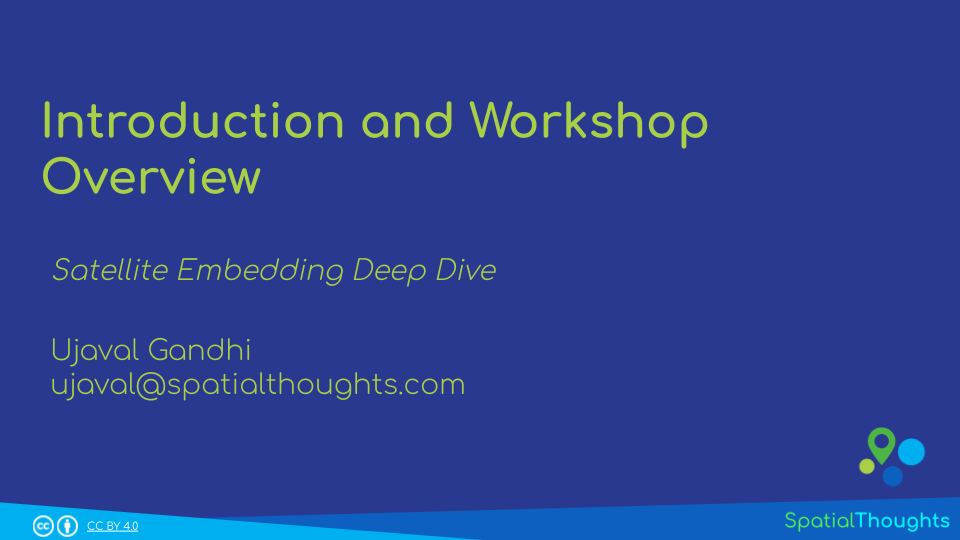
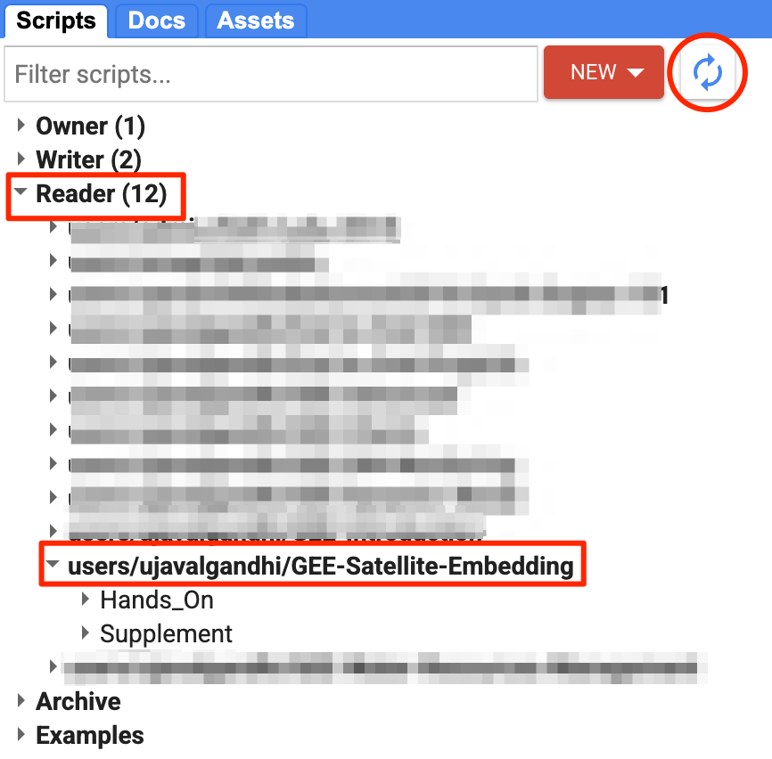

\newpage

<!--- Install package vembedr to get YouTube videos rendered -->
```{r echo=FALSE}
suppressWarnings(library("vembedr"))
```

\newpage

# Introduction 

Google [Satellite Embedding Dataset](https://developers.google.com/earth-engine/datasets/catalog/GOOGLE_SATELLITE_EMBEDDING_V1_ANNUAL) is a global dataset of pre-computed, analysis-ready geospatial embeddings for each year from 2017 onwards. This dataset was produced by Google DeepMind's AlphaEarth Foundations model and presents a big leap in making remote sensing and climate datasets useful. Along with making existing remote sensing workflows more efficient, this dataset unlocks a range of new use cases. This workshop is designed to help you get started with the dataset in GEE and use it for a variety of applications.

[{width="400px"}](https://docs.google.com/presentation/d/1X0LodVyTO9ou68LiuRMAeUhPYaortMND2x-0Rb1LkzM/edit?usp=sharing){target="_blank"}

[View the Presentation &#8599;](https://docs.google.com/presentation/d/1X0LodVyTO9ou68LiuRMAeUhPYaortMND2x-0Rb1LkzM/edit?usp=sharing){target="_blank"}

# Setting up the Environment

## Sign-up for Google Earth Engine

If you already have a Google Earth Engine account, you can skip this step.

Visit our [GEE Sign-Up Guide](gee-sign-up.html) for step-by-step instructions.

## Get the Workshop Materials

The workshop material and exercises are in the form of Earth Engine scripts shared via a code repository.

1. [Click this link](https://code.earthengine.google.co.in/?accept_repo=users/ujavalgandhi/GEE-Satellite-Embedding) to open Google Earth Engine code editor and add the repository to your account.
2. If successful, you will have a new repository named `users/ujavalgandhi/GEE-Satellite-Embedding` in the *Scripts* tab in the *Reader* section.

If you do not see the repository in the *Reader* section, click *Refresh repository cache* button in your *Scripts* tab and it will show up.

```{r echo=FALSE, fig.align='center', out.width='50%', fig.cap='Workshop Repository'}

```

\newpage

# Hands-on With Satellite Embedding Dataset

## 01. Visualizing Embeddings

[Open in Code Editor &#8599;](https://code.earthengine.google.co.in/?scriptPath=users%2Fujavalgandhi%2FGEE-Satellite-Embedding%3AHands_On%2F01b_Visualizing_Embeddings_(complete)){target="_blank"}

```{js eval=FALSE, code=readLines('code/gee_satellite_embedding/Hands_On/01b_Visualizing_Embeddings_(complete)')}
```

### Exercise

[Open in Code Editor &#8599;](https://code.earthengine.google.co.in/?scriptPath=users%2Fujavalgandhi%2FGEE-Satellite-Embedding%3AHands_On%2F01c_Visualizing_Embeddings_(exercise)){target="_blank"}
```
// Exercise

// Delete the geometry
// Draw a geometry for your region of interest
// Try visualizing the embeddings with different bands (A01, A02, A03...)
// Try changing the number of clusters to see different levels of detail
```

## 02. Crop Type Mapping

[Open in Code Editor &#8599;](https://code.earthengine.google.co.in/?scriptPath=users%2Fujavalgandhi%2FGEE-Satellite-Embedding%3AHands_On%2F02b_Unsupervised_Classification_(complete)){target="_blank"}

```{js eval=FALSE, code=readLines('code/gee_satellite_embedding/Hands_On/02b_Unsupervised_Classification_(complete)')}
```

### Exercise

[Open in Code Editor &#8599;](https://code.earthengine.google.co.in/?scriptPath=users%2Fujavalgandhi%2FGEE-Satellite-Embedding%3AHands_On%2F02c_Unsupervised_Classification_(exercise)){target="_blank"}

```{js eval=FALSE, code=readLines('code/gee_satellite_embedding/Hands_On/02c_Unsupervised_Classification_(exercise)')}
```

## 03. Mapping Mangroves

[Open in Code Editor &#8599;](https://code.earthengine.google.co.in/?scriptPath=users%2Fujavalgandhi%2FGEE-Satellite-Embedding%3AHands_On%2F03b_Supervised_Classification_(complete)){target="_blank"}

```{js eval=FALSE, code=readLines('code/gee_satellite_embedding/Hands_On/03b_Supervised_Classification_(complete)')}
```

### Exercise

[Open in Code Editor &#8599;](https://code.earthengine.google.co.in/?scriptPath=users%2Fujavalgandhi%2FGEE-Satellite-Embedding%3AHands_On%2F03c_Supervised_Classification_(exercise)){target="_blank"}

```{js eval=FALSE, code=readLines('code/gee_satellite_embedding/Hands_On/03c_Supervised_Classification_(exercise)')}
```


## 04. Finding Objects with Similarity Search

[Open in Code Editor &#8599;](https://code.earthengine.google.co.in/?scriptPath=users%2Fujavalgandhi%2FGEE-Satellite-Embedding%3AHands_On%2F04b_Similarity_Search_(complete)){target="_blank"}

```{js eval=FALSE, code=readLines('code/gee_satellite_embedding/Hands_On/04b_Similarity_Search_(complete)')}
```

### Exercise

[Open in Code Editor &#8599;](https://code.earthengine.google.co.in/?scriptPath=users%2Fujavalgandhi%2FGEE-Satellite-Embedding%3AHands_On%2F04c_Similarity_Search_(exercise)){target="_blank"}

```{js eval=FALSE, code=readLines('code/gee_satellite_embedding/Hands_On/04c_Similarity_Search_(exercise)')}
```

# Supplement

## Mapping Surface Water with Unsupervised Clustering

[Open in Code Editor &#8599;](https://code.earthengine.google.co.in/?scriptPath=users%2Fujavalgandhi%2FGEE-Satellite-Embedding%3ASupplement%2FUnsupervised_Clustering_Surface_Water){target="_blank"}

```{js eval=FALSE, code=readLines('code/gee_satellite_embedding/Supplement/Unsupervised_Clustering_Surface_Water')}
```

## Mapping Urban Tree Cover with Supervised Classification

[Open in Code Editor &#8599;](https://code.earthengine.google.com/?scriptPath=users%2Fujavalgandhi%2FGEE-Satellite-Embedding%3ASupplement%2FSupervised_Classification_Urban_Tree_Cover){target="_blank"}

```{js eval=FALSE, code=readLines('code/gee_satellite_embedding/Supplement/Supervised_Classification_Urban_Tree_Cover')}
```
----

# Learning Resources

* Official Tutorials in Google Earth Engine User Guide
  * [Introduction to the Satellite Embedding Dataset](https://developers.google.com/earth-engine/tutorials/community/satellite-embedding-01-introduction)
  * [Unsupervised Classification with Satellite Embedding Dataset](https://developers.google.com/earth-engine/tutorials/community/satellite-embedding-02-unsupervised-classification)
  * [Supervised Classification with Satellite Embedding Dataset](https://developers.google.com/earth-engine/tutorials/community/satellite-embedding-03-supervised-classification)
  * [Regression with Satellite Embedding Dataset](https://developers.google.com/earth-engine/tutorials/community/satellite-embedding-04-regression)
  * [Similarity Search with Satellite Embedding Dataset](https://developers.google.com/earth-engine/tutorials/community/satellite-embedding-05-similarity-search)


# Data Credits
* **Satellite Embedding V1**: The AlphaEarth Foundations Satellite Embedding dataset is produced by Google and Google DeepMind.
* **Sentinel-2 Level-1C, Level-2A**: Contains Copernicus Sentinel data.
* **FAO GAUL 500m: Global Administrative Unit Layers 2015, Second-Level Administrative Units**: Source of Administrative boundaries: The Global Administrative Unit Layers (GAUL) dataset, implemented by FAO within the CountrySTAT and Agricultural Market Information System
(AMIS) projects.

# References

* Brown, C. F., Kazmierski, M. R., Pasquarella, V J., Rucklidge, W. J., Samsikova, M., Zhang, C., Shelhamer, E., Lahera, E., Wiles, O., Ilyushchenko, S., Gorelick, N., Zhang, L. L., Alj, S., Schechter, E., Askay, S., Guinan, O., Moore, R., Boukouvalas, A., & Kohli, P.(2025). AlphaEarth Foundations: An embedding field model for accurate and efficient global mapping from sparse label data. arXiv preprint arXiv.2507.22291. doi:10.48550/arXiv.2507.22291
* Houriez, L., Pilarski, S., Vahedi, B., Ahmadalipour, A., Scully, T. H., Aflitto, N., Andre, D., Jaffe, C., Wedner, M., Mazzola, R., Jeffery, J., Messinger, B., McGinley-Smith, S., & Russell, S. (2025, August). Scalable geospatial data generation using AlphaEarth foundations model (arXiv:2508.11739). arXiv. https://arxiv.org/abs/2508.11739


# License

The course material (text, images, presentation, videos) is licensed under a [Creative Commons Attribution 4.0 International License](https://creativecommons.org/licenses/by/4.0/).

The code (scripts, Jupyter notebooks etc.) is licensed under the MIT License. For a copy, see https://opensource.org/licenses/MIT

Kindly give appropriate credit to the original author as below:

Copyright &copy; 2025 Ujaval Gandhi [www.spatialthoughts.com](https://spatialthoughts.com)


# Citing and Referencing

You can cite the course materials as follows

* Gandhi, Ujaval, 2025. *Satellite Embedding Deep Dive* workshop. Spatial Thoughts. https://courses.spatialthoughts.com/gee-satellite-embedding.html

***
