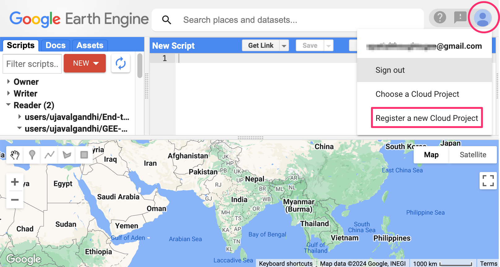
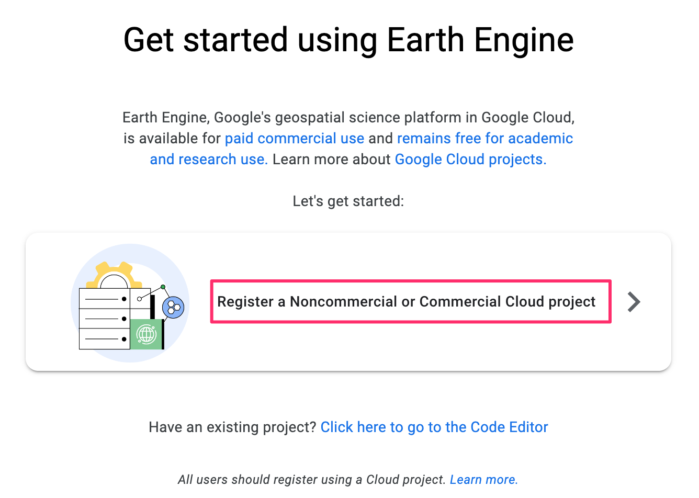
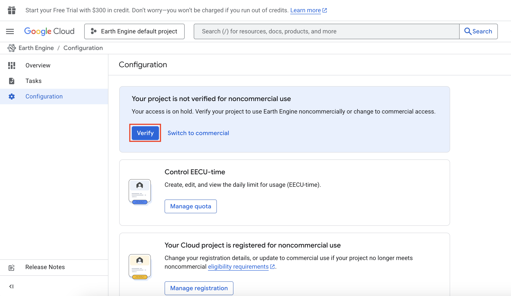
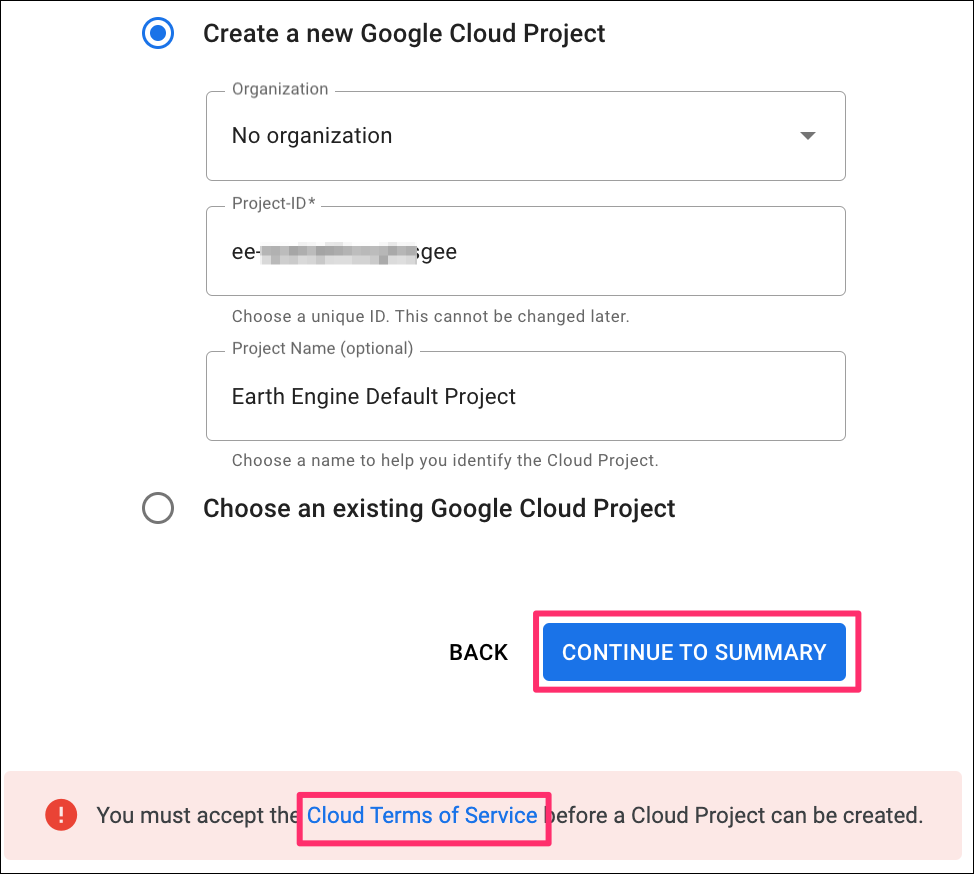
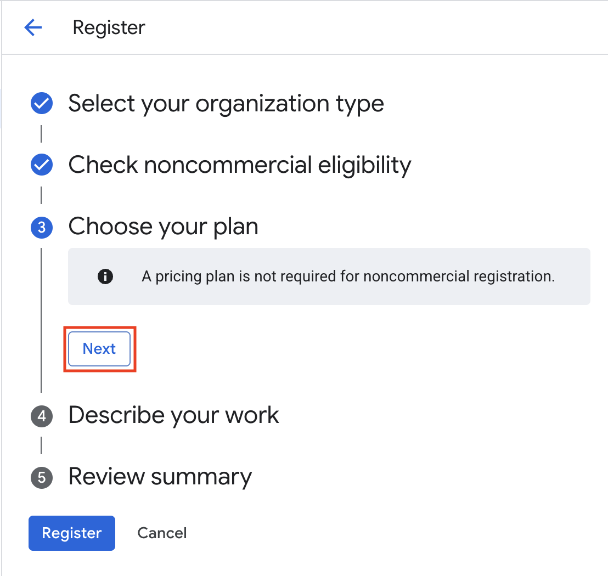
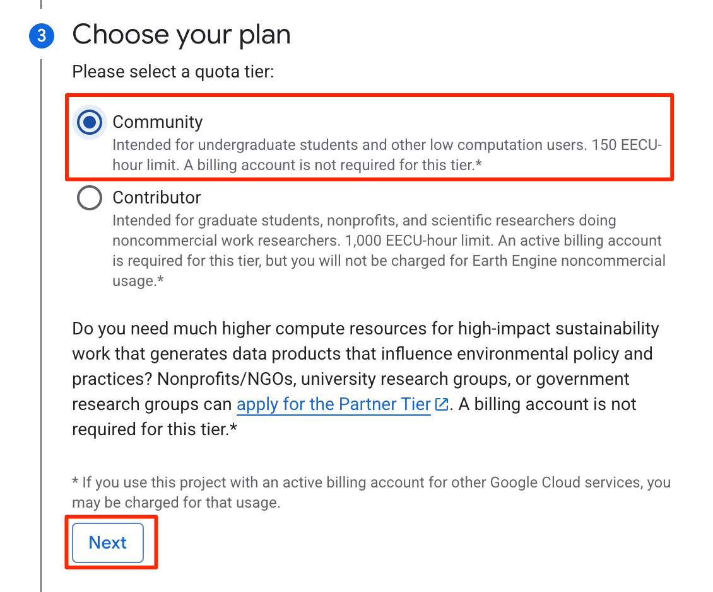
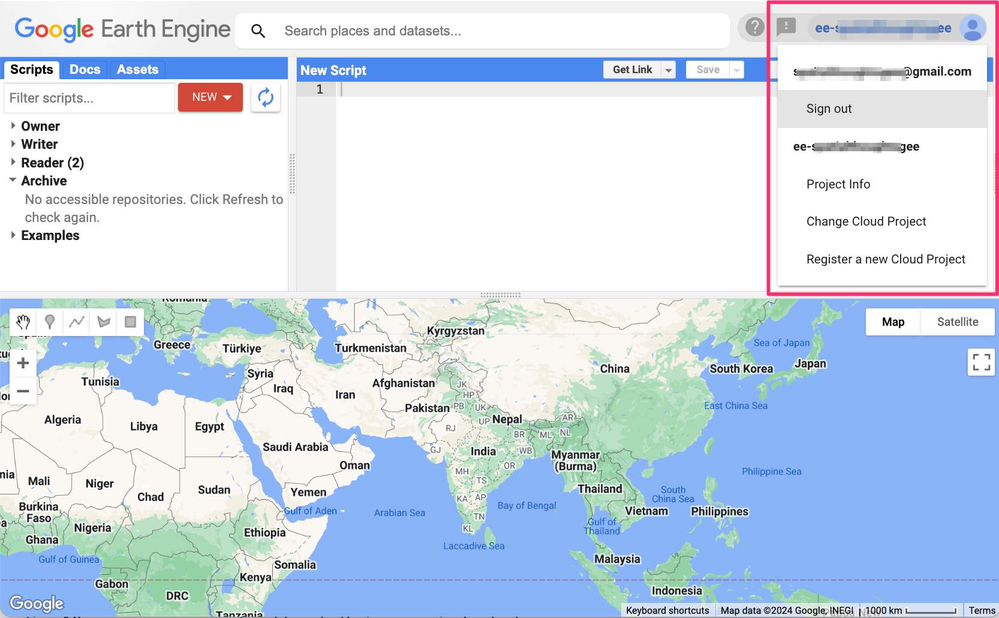

As of June 2024, all users of Google Earth Engine require an account which is linked to a Google Cloud Project. Below are the official instructions for obtaining an account.

* [Earth Engine access](https://developers.google.com/earth-engine/guides/access) for new users.
* [Transition Guide](https://developers.google.com/earth-engine/guides/transition_to_cloud_projects) for existing users.

We have put together a simplified FAQ and step-by-step guide below for users who may not be familiar with Google Cloud. 

----

### FAQ 

* **Why the requirement for a Cloud Project?** Previously - Earth Engine was a separate Google service with it's own systems and was governed by its own Terms of Service. It is now integrated with Google Cloud Platform and is one of hundreds of other cloud offerings. This means that the usage of GEE is now governed by the *Google Cloud Terms of Service* and it uses the standard cloud systems for access, logging, billing etc. It helps Earth Engine team offer better integration with other Google Cloud offerings. Using Google Cloud requires a *Project* - which is just a workspace where you can enable different services.
* **Should I sign-up for a Cloud Project?** As of June 2024, you do not have an option to use Earth Engine without a cloud project. If you do not sign-up, your GEE account will stop functioning at some point in the future.
* **Do I have to pay for Google Cloud?** Earth Engine remains free for [Noncommercial and Research Use](https://earthengine.google.com/noncommercial/). You do not need to setup a billing account or pay if you qualify for this category. For [Commercial Use](https://earthengine.google.com/commercial/), you will need to setup a billing account and choose a [Pricing Plan](https://cloud.google.com/earth-engine/pricing).

Ready sign-up for Earth Engine with a Cloud Project? Follow the steps below.

----

### Choose a Sign-up Method

* **First-time GEE Users**: Visit the [Project Registration Page](https://code.earthengine.google.com/register) to start the [Sign-up Flow](#sign-up-flow).
* **Existing GEE Users**: Visit the [Earth Engine Code Editor](https://code.earthengine.google.com) and click on the account logo in the top-right corner and select *Register a new Cloud Project*. This will start the [Sign-up Flow](#sign-up-flow).

```{r echo=FALSE, fig.align='left', out.width='75%'}

```

### Sign-up Flow

1. On the *Product Registration Page*, select `Register a Noncommercial or Commercial Cloud project`.

```{r echo=FALSE, fig.align='center', out.width='75%'}

```

2. Next, you need to choose *How do you want to use Earth Engine?*. Choose the `Paid usage` or `Unpaid usage` depending on your use case. Click *Next*. Since we are a training provider, we have chosen *Unpaid usage &rarr; Trainer & trainees*. You should select the category that applies to you. 

```{r echo=FALSE, fig.align='center', out.width='50%'}

```

3. In the next dialog, choose *Create a new Google Cloud Project*. Select `No organization` for *Organization* and enter a *Project-ID*. This id needs to be unique. A standard practice is to use the project-ID in the form of `ee-<yourusername>`. Click *CONTINUE TO SUMMARY*. If you have never used Google Cloud before, an error message will be displayed with a note *You must accept the Cloud Terms of Service before a Cloud Project can be created*. Click on the link that will open the Google Cloud Console. If you do not get the warning, skip to step 6.

```{r echo=FALSE, fig.align='center', out.width='50%'}

```

4. Choose your *Country* and review the *Google Cloud Platform Terms of Service* and the terms of service of *any applicable services and APIs*. After reviewing, click *AGREE AND CONTINUE*.

```{r echo=FALSE, fig.align='center', out.width='50%'}
knitr::include_graphics('images/gee_sign_up/cloud4.png')
```

5. Once the Terms of Service have been accepted, go back to the previous tab and click *CONTINUE TO SUMMARY*.

```{r echo=FALSE, fig.align='center', out.width='50%'}

```

6. You will be presented with a summary in the *Confirm your Cloud project information* dialog. Review and click *CONFIRM*.

```{r echo=FALSE, fig.align='center', out.width='50%'}

```

7. The project will be registered and you will be redirected to the Code Editor. If you are not redirected automatically, visit the [Earth Engine Code Editor](https://code.earthengine.google.com).

```{r echo=FALSE, fig.align='center', out.width='50%'}
knitr::include_graphics('images/gee_sign_up/cloud7.png')
```

8. Your code editor will now display information about the linked project. 

```{r echo=FALSE, fig.align='center', out.width='75%'}

```

Done! You are now ready to start using your Earth Engine account with a Cloud Project.


> Disclaimer: The information provider below is general information to help new users. The cloud-integration with Earth Engine is evolving and may change in the future. Read to the official guides linked above for up-to-date information.

