\newpage

***

```{r echo=FALSE, fig.align='center', out.width='100%', out.width='250pt'}
knitr::include_graphics('images/spatial_thoughts_logo.png')
```

***

\newpage

# Introduction 

GIS and Remote Sensing plays a critical role in the management of water resources. Many practitioners in this field are constrained by the availability of tools and computing resources to use these techniques effectively. Recent advances in cloud computing technology have given rise to platforms such as Google Earth Engine, which provide free access to a large pool of computational resources and datasets. The course is designed for researchers in the water sector, academicians, water managers, and stakeholders with basic knowledge of Remote Sensing. It will enable them to leverage this platform for water resource management applications.

You will learn Google Earth Engine programming by building the following 5 complete applications:

1. Surface Water Mapping
2. Precipitation Time Series Analysis
3. Land Use Land Cover Classification
4. Flood Mapping
5. Drought Monitoring

[{width="400px"}](https://docs.google.com/presentation/d/1-PqksKb2QB8YJTQic5M80ZAsKh1Ld6OxOoO6BG77Uhg/edit?usp=sharing){target="_blank"}

[View the Presentation &#8599;](https://docs.google.com/presentation/d/1-PqksKb2QB8YJTQic5M80ZAsKh1Ld6OxOoO6BG77Uhg/edit?usp=sharing){target="_blank"}


# Setting up the Environment

## Sign-up for Google Earth Engine

If you already have a Google Earth Engine account, you can skip this step.

Visit [https://signup.earthengine.google.com/](https://signup.earthengine.google.com/){target="_blank"} and sign-up with your Google account. You can use your existing gmail account to sign-up. It usually takes 1-2 days for approval. Hence do this step as soon as possible.

Tips to ensure smooth sign-up process:

- Use Google Chrome browser.
- When signing up for Earth Engine, please log out of all Google accounts and ensure you are logged into only 1 account which you want associated with Earth Engine.
- Prefer using your university/organization email for signing up.
- Access to Google Earth Engine is granted via Google Groups. The default settings should be fine, but verify you have the correct setting enabled.
    - Visit [groups.google.com](http://groups.google.com/){target="_blank"}
    - Click on Settings (gear icon) and select Global Settings.
    - Make sure the option Allow group managers to add me to their groups is checked.


## Get the Course Materials

The course material and exercises are in the form of Earth Engine scripts shared via a code repository.

1. [Click this link](https://code.earthengine.google.co.in/?accept_repo=users/ujavalgandhi/GEE-Water-Resources-Management) to open Google Earth Engine code editor and add the repository to your account.
2. If successful, you will have a new repository named `users/ujavalgandhi/GEE-Water-Resources-Management` in the *Scripts* tab in the *Reader* section.
3. Verify that your code editor looks like below

> If you do not see the repository in the *Reader* section, refresh your browser tab and it will show up.

```{r echo=FALSE, fig.align='center', out.width='100%', fig.cap='Code Editor After Adding the Class Repository'}
knitr::include_graphics('images/gee_water_resources_management/repository.png')
```


\newpage


# Module 1: Google Earth Engine Fundamentals

In Module 1, you will gain the essential skills to find datasets, filter them to your region, clip them to your boundary, calculate remote sensing indices, extract water-bodies using thresholding techniques and export raster data.

## 01. Hello World

This script introduces the basic Javascript syntax and the video covers the programming concepts you need to learn when using Earth Engine. To learn more, visit [Introduction to JavaScript for Earth Engine](https://developers.google.com/earth-engine/tutorials/tutorial_js_01) section of the Earth Engine User Guide. 

[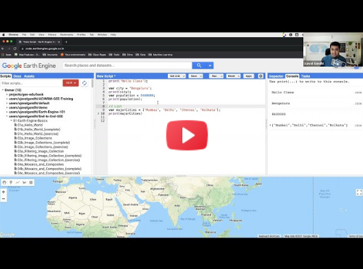{width="400px"}](https://www.youtube.com/watch?v=RV3Sv5iogHs){target="_blank"}

- [Watch the Video](https://www.youtube.com/watch?v=RV3Sv5iogHs){target="_blank"}

The *Code Editor* is an Integrated Development Environment (IDE) for Earth Engine Javascript API. It offers an easy way to type, debug, run and manage code. Type the code below and click *Run* to execute it and see the output in the *Console* tab.

> Tip: You can use the keyboard shortcut *Ctrl+Enter* to run the code in the Code Editor

```{r echo=FALSE, fig.align='center', out.width='100%', fig.cap='Hello World'}
knitr::include_graphics('images/gee_water_resources_management/hello_world.png')
```

```{js eval=FALSE, code=readLines('code/gee_water_resources_management/01-Earth_Engine_Basics/01b_Hello_World_(complete)')}
```

[Open in Code Editor &#8599;](https://code.earthengine.google.co.in/?scriptPath=users%2Fujavalgandhi%2FGEE-Water-Resources-Management%3A01-Earth_Engine_Basics%2F01b_Hello_World_(complete)){target="_blank"}

### Exercise


```{js eval=FALSE, code=readLines('code/gee_water_resources_management/01-Earth_Engine_Basics/01c_Hello_World_(exercise)')}
```

[Try in Code Editor &#8599;](https://code.earthengine.google.co.in/?scriptPath=users%2Fujavalgandhi%2FGEE-Water-Resources-Management%3A01-Earth_Engine_Basics%2F01c_Hello_World_(exercise)){target="_blank"}


### Saving Your Work

When you modify any script for the course repository, you may want to save a copy for yourself. If you try to click the *Save* button, you will get an error message like below

```{r echo=FALSE, fig.align='center', out.width='75%'}
knitr::include_graphics('images/gee_water_resources_management/setup1.png')
```

This is because the shared class repository is a *Read-only* repository. You can click *Yes* to save a copy in your repository. If this is the first time you are using Earth Engine, you will be prompted to choose a *Earth Engine username*. Choose the name carefully, as it cannot be changed once created.

```{r echo=FALSE, fig.align='center', out.width='50%'}
knitr::include_graphics('images/gee_water_resources_management/setup2.png')
```

After entering your username, your home folder will be created. After that, you will be prompted to enter a new repository. A repository can help you organize and share code. Your account can have multiple repositories and each repository can have multiple scripts inside it. To get started, you can create a repository named *default*. Finally, you will be able to save the script.

## 02. Working with Image Collections

Most datasets in Earth Engine come as a `ImageCollection`. An ImageCollection is a dataset that consists of images takes at different time and locations - usually from the same satellite or data provider. You can load a collection by searching the [Earth Engine Data Catalog](https://developers.google.com/earth-engine/datasets) for the *ImageCollection ID*. Search for the *Sentinel-2 Level 2A* dataset and you will find its id `COPERNICUS/S2_SR`. Visit the [Sentinel-2, Level 2A page](https://developers.google.com/earth-engine/datasets/catalog/COPERNICUS_S2_SR) and see *Explore in Earth Engine* section to find the code snippet to load and visualize the collection. This snippet is a great starting point for your work with this dataset. Click the **Copy Code Sample** button and paste the code into the code editor. Click *Run* and you will see the image tiles load in the map.


```{r echo=FALSE, fig.align='center', out.width='100%'}
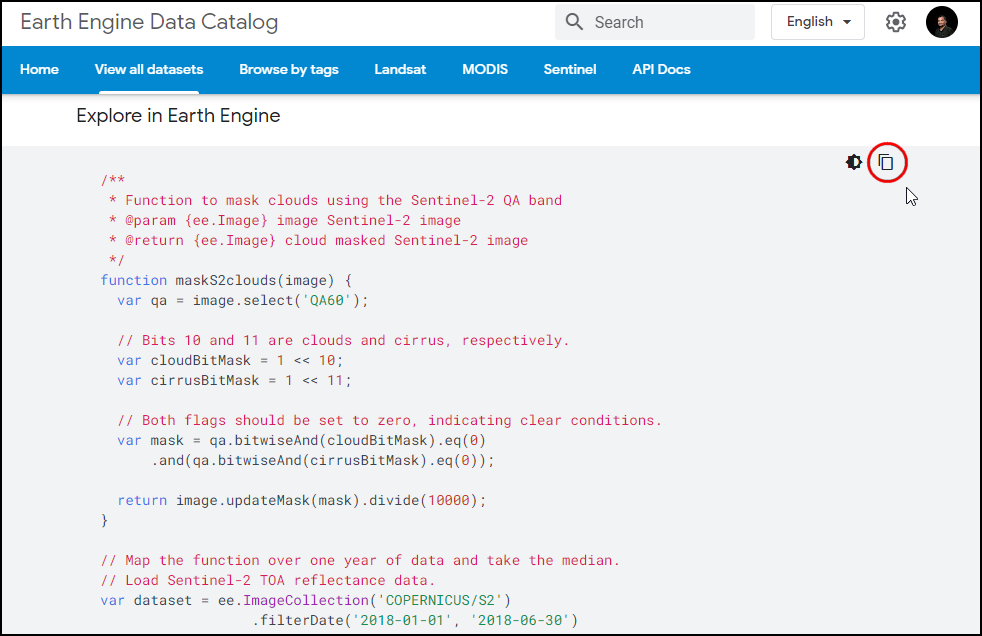
```

In the code snippet, You will see a function `Map.setCenter()` which sets the viewport to a specific location and zoom level. The function takes the X coordinate (longitude), Y coordinate (latitude) and Zoom Level parameters ranging from 1 (whole world) to 22 (pixel level). Replace the X and Y coordinates with the coordinates of your city and click *Run* to see the images of your city.

```{r echo=FALSE, fig.align='center', out.width='100%'}
knitr::include_graphics('images/gee_water_resources_management/image_collection2.png')
```

```{js eval=FALSE, code=readLines('code/gee_water_resources_management/01-Earth_Engine_Basics/02b_Image_Collections_(complete)')}
```

[Open in Code Editor &#8599;](https://code.earthengine.google.co.in/?scriptPath=users%2Fujavalgandhi%2FGEE-Water-Resources-Management%3A01-Earth_Engine_Basics%2F02b_Image_Collections_(complete)){target="_blank"}

### Exercise

```{js eval=FALSE, code=readLines('code/gee_water_resources_management/01-Earth_Engine_Basics/02b_Image_Collections_(complete)')}
```

[Try in Code Editor &#8599;](https://code.earthengine.google.co.in/?scriptPath=users%2Fujavalgandhi%2FGEE-Water-Resources-Management%3A01-Earth_Engine_Basics%2F02c_Image_Collections_(exercise)){target="_blank"}

## 03. Filtering Image Collections

The collection contains all imagery ever collected by the sensor. The entire collections are not very useful. Most applications require a subset of the images. We use **filters** to select the appropriate images. There are many types of filter functions, look at `ee.Filter...` module to see all available filters. Select a filter and then run the `filter()` function with the filter parameters. 

We will learn about 3 main types of filtering techniques

* **Filter by metadata**: You can apply a filter on the image metadata using filters such as `ee.Filter.eq()`, `ee.Filter.lt()` etc. You can filter by PATH/ROW values, Orbit number, Cloud cover etc.
* **Filter by date**: You can select images in a particular date range using filters such as `ee.Filter.date()`.
* **Filter by location**: You can select the subset of images with a bounding box, location or geometry using the `ee.Filter.bounds()`. You can also use the drawing tools to draw a geometry for filtering.

After applying the filters, you can use the `.size()` function to check how many images match the filter criteria.

```{r echo=FALSE, fig.align='center', out.width='100%'}
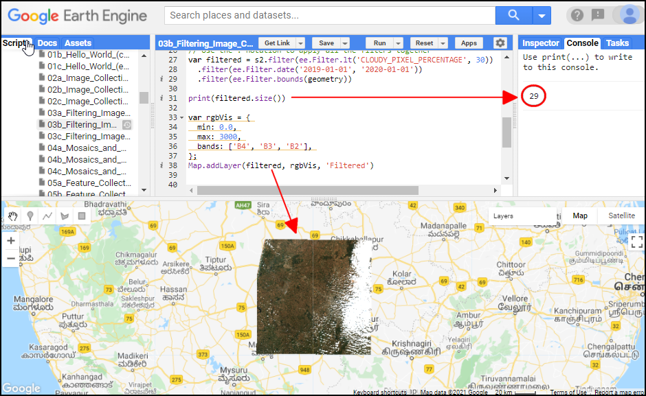
```

```{js eval=FALSE, code=readLines('code/gee_water_resources_management/01-Earth_Engine_Basics/03b_Filtering_Image_Collection_(complete)')}
```

[Open in Code Editor &#8599;](https://code.earthengine.google.co.in/?scriptPath=users%2Fujavalgandhi%2FGEE-Water-Resources-Management%3A01-Earth_Engine_Basics%2F03b_Filtering_Image_Collection_(complete)){target="_blank"}

### Exercise

```{js eval=FALSE, code=readLines('code/gee_water_resources_management/01-Earth_Engine_Basics/03c_Filtering_Image_Collection_(exercise)')}
```

[Try in Code Editor &#8599;](https://code.earthengine.google.co.in/?scriptPath=users%2Fujavalgandhi%2FGEE-Water-Resources-Management%3A01-Earth_Engine_Basics%2F03c_Filtering_Image_Collection_(exercise)){target="_blank"}

## 04. Mosaics and Composites

The default order of the collection is by date. So when you display the collection, it implicitly creates a mosaic with the latest pixels on top. You can call `.mosaic()` on a ImageCollection to create a mosaic image from the pixels at the top (i.e) first image in the stack.

We can also create a composite image by applying selection criteria to each pixel from all pixels in the stack. Here we use the `.median()` function to create a composite where each pixel value is the median of all pixels values at each pixel from the stack for all matching bands.

> Tip: If you need to create a mosaic where the images are in a specific order, you can use the `.sort()` function to sort your collection by a property first.


```{r echo=FALSE, fig.align='center', out.width='100%', fig.cap='Mosaic vs. Median Composite'}
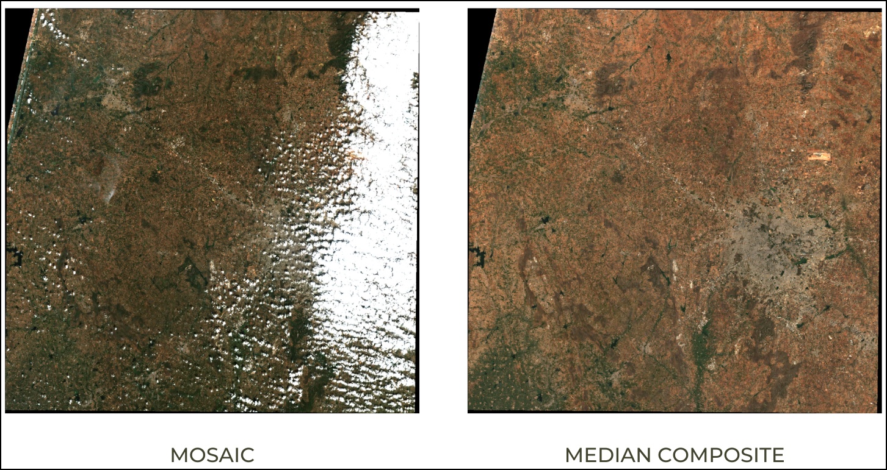
```

```{js eval=FALSE, code=readLines('code/gee_water_resources_management/01-Earth_Engine_Basics/04b_Mosaics_and_Composites_(complete)')}
```

[Open in Code Editor &#8599;](https://code.earthengine.google.co.in/?scriptPath=users%2Fujavalgandhi%2FGEE-Water-Resources-Management%3A01-Earth_Engine_Basics%2F04b_Mosaics_and_Composites_(complete)){target="_blank"}

### Exercise

```{js eval=FALSE}
// Create a median composite for the year 2020 and load it to the map

// Compare both the composites to see the changes in your city
```

[Try in Code Editor &#8599;](https://code.earthengine.google.co.in/?scriptPath=users%2Fujavalgandhi%2FGEE-Water-Resources-Management%3A01-Earth_Engine_Basics%2F04c_Mosaics_and_Composites_(exercise)){target="_blank"}

## 05. Feature Collections

Feature Collections are similar to Image Collections - but they contain *Features*, not images. They are equivalent to a Vector Layers in a GIS. We can load, filter and display Feature Collections using similar techniques that we have learned so far. 

Search for *GAUL Second Level Administrative Boundaries* and load the collection. This is a global collection that contains all Admin2 boundaries. We can apply a filter using the `ADM1_NAME` property to get all Admin2 boundaries (i.e. Districts) from a state.

```{r echo=FALSE, fig.align='center', out.width='100%'}
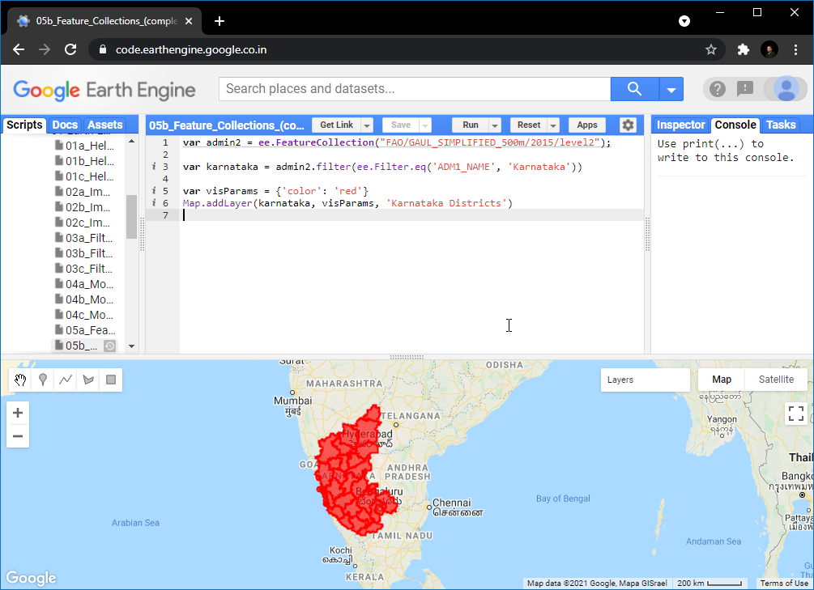
```


```{js eval=FALSE, code=readLines('code/gee_water_resources_management/01-Earth_Engine_Basics/05b_Feature_Collections_(complete)')}
```
[Open in Code Editor &#8599;](https://code.earthengine.google.co.in/?scriptPath=users%2Fujavalgandhi%2FGEE-Water-Resources-Management%3A01-Earth_Engine_Basics%2F05b_Feature_Collections_(complete)){target="_blank"}


### Exercise

```{js eval=FALSE}
// Add the admin2 layer to the map using Map.addLayer() function
// Go to your home city and inspect the layer to find the name of the region
// Use the ADM2_NAME property and apply a filter
// Display only the selected polygon on the map.
```
[Try in Code Editor &#8599;](https://code.earthengine.google.com/?scriptPath=users%2Fujavalgandhi%2FGEE-Water-Resources-Management%3A01-Earth_Engine_Basics%2F05c_Feature_Collections_(exercise)){target="_blank"}

## 06. Clipping

It is often desirable to clip the images to your area of interest. You can use the `clip()` function to mask an image using geometry.

> While in Desktop softwares, clipping is used to remove the unnecessary portion of a large image to save computation time, but in the Earth Engine, clipping can *increase* the computation time. As described in the [Earth Engine Coding Best Practices](https://developers.google.com/earth-engine/guides/best_practices?hl=en#if-you-dont-need-to-clip,-dont-use-clip) guide, avoid clipping or do it at the very end of your process.


```{r echo=FALSE, fig.align='center', out.width='100%', fig.cap='Full Image vs. Clipped Image'}
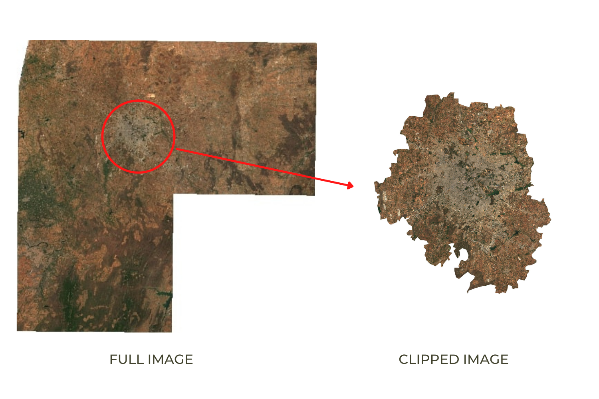
```

```{js eval=FALSE, code=readLines('code/gee_water_resources_management/01-Earth_Engine_Basics/06b_Clipping_(complete)')}
```
[Open in Code Editor &#8599;](https://code.earthengine.google.co.in/?scriptPath=users%2Fujavalgandhi%2FGEE-Water-Resources-Management%3A01-Earth_Engine_Basics%2F06b_Clipping_(complete)){target="_blank"}


### Exercise

```{js eval=FALSE}
// Add the GAUL admin boundary to the Map
// Search for your city and inspect the ADM2_NAME
// Replace the name with the ADM2_NAME of your selected region
// And display the clipped composite on the map.
```
[Try in Code Editor &#8599;](https://code.earthengine.google.co.in/?scriptPath=users%2Fujavalgandhi%2FGEE-Water-Resources-Management%3A01-Earth_Engine_Basics%2F06c_Clipping_(exercise)){target="_blank"}

## 07. Calculating Indices

Spectral Indices are central to many aspects of remote sensing. For almost all research/work, you will need to compute one spectral indices. The most commonly used formula for calculating an index is computing the *Normalized Difference* between 2 bands. Earth Engine provides a helper function `normalizedDifference()` to help calculate normalized indices, such as Normalized Difference Vegetation Index (NDVI) or Modified Normalized Difference Water Index (MNDWI). 

Some indices - such as the Automated Water Extraction Index (AWEI) - require calculation using a more complex formula.In such cases, you can use the `expression()` function which allow you to to construct formula with common arithmatic operators. The script below shows how to implement common water-related indices in Earth Engine. Note that the AWEI formula expects the pixel values to be reflectances, so we need to apply a scaling factor of 0.0001 to convert the Sentinel-2 band values to reflectances.

```{r echo=FALSE, fig.align='center', out.width='100%', fig.cap='RGB, MNDWI, NDVI and AWEI images'}
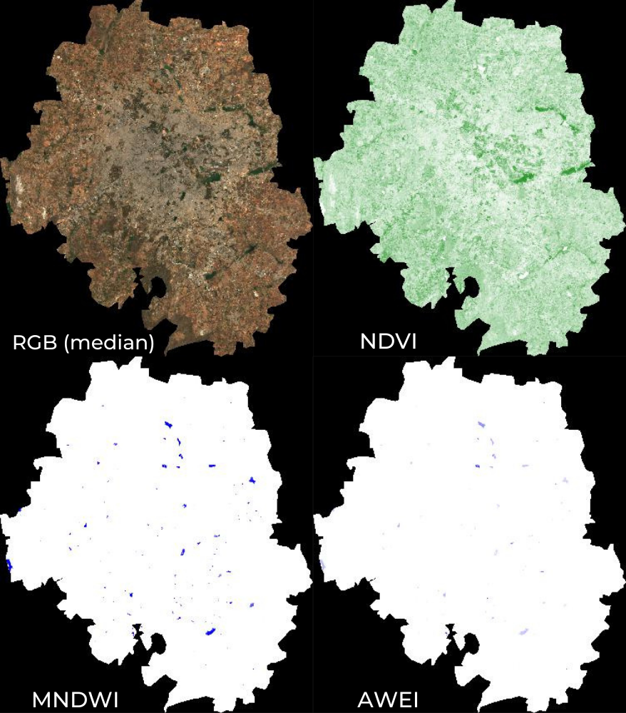
```

```{js eval=FALSE, code=readLines('code/gee_water_resources_management/01-Earth_Engine_Basics/07b_Calculating_Indices_(complete)')}
```
[Open in Code Editor &#8599;](https://code.earthengine.google.co.in/?scriptPath=users%2Fujavalgandhi%2FGEE-Water-Resources-Management%3A01-Earth_Engine_Basics%2F07b_Calculating_Indices_(complete)){target="_blank"}

### Exercise

There is another version of AWEI called AWEIsh. This index is useful where there are mountain or building shadows. This works best where there are shadows but no bright reflective surfaces (snow, roof). The expression for AWEI (sh) is as follows

```AWEI (sh) = BLUE + 2.5*GREEN - 1.5*(NIR + SWIR1) - 0.25*SWIR2```

We have implemented both versions of AWEI in the script. Add them to the map and visualize both of them.

[Try in Code Editor &#8599;](https://code.earthengine.google.co.in/?scriptPath=users%2Fujavalgandhi%2FGEE-Water-Resources-Management%3A01-Earth_Engine_Basics%2F07c_Calculating_Indices_(exercise)){target="_blank"}

## 08. Computation on Images

Inspecting the MNDWI or AWEI index images, you will see that water pixels have a higher value than other pixels. If we wanted to extract those pixels, we can apply a threshold value to select all pixels above a certain value. The result will be a binary image with pixel values 1 or 0. For all the pixels that matched the condition, the resulting value will be 1, and for other pixels it will be 0. The conditions can be written using the *logical operators* like greater than `.gt()`, lesser than `.lt()`, equal to `.eq()`, greater than or equal to `.gte()`, etc. We can also combine multiple layers to create a condition using the *boolean operators* like AND `.and()`, OR `.or()` functions. The script below shows how to implement static thresholding in Earth Engine.

```{r echo=FALSE, fig.align='center', out.width='100%', fig.cap='Extracting Waterbodies using a Simple Threshold'}
knitr::include_graphics('images/gee_water_resources_management/threshold.png')
```

```{js eval=FALSE, code=readLines('code/gee_water_resources_management/01-Earth_Engine_Basics/08b_Computation_on_Images_(complete)')}
```
[Open in Code Editor &#8599;](https://code.earthengine.google.co.in/?scriptPath=users%2Fujavalgandhi%2FGEE-Water-Resources-Management%3A01-Earth_Engine_Basics%2F08b_Computation_on_Images_(complete)){target="_blank"}

### Exercise

Replace the selected region with the region of your choice and and adjust the MNDWI thresholds to extract the waterbodies.

Try different thresholds and add images to the map to compare

- Hint: Try negative thresholds -0.1 and -0.2
- Hint: Try positive thresholds 0.1 and 0.2

```{js eval=FALSE, code=readLines('code/gee_water_resources_management/01-Earth_Engine_Basics/08c_Computation_on_Images_(exercise)')}
```
[Try in Code Editor &#8599;](https://code.earthengine.google.co.in/?scriptPath=users%2Fujavalgandhi%2FGEE-Water-Resources-Management%3A01-Earth_Engine_Basics%2F08c_Computation_on_Images_(exercise)){target="_blank"}

## 09. Export

Earth Engine allows for exporting both vector and raster data to be used in an external program. Vector data can be exported as a `CSV` or a `Shapefile`, while Rasters can be exported as `GeoTIFF` files. We will now export the Sentinel-2 Composite as a GeoTIFF file.

During the export, we can export either a raw image or visualized image. The raw image will retain the original pixel values and is ideal if the image needs to be used for further analysis. The visualized image will generate an RGB visualization of the image. The visualized image will look exactly like you see it in Earth Engine with the visualization parameters, but original pixel values will be lost. The visualized image should not use it for analysis purposes. 

> Tip: Code Editor supports autocompletion of API functions using the combination *Ctrl+Space*. Type a few characters of a function and press *Ctrl+Space* to see autocomplete suggestions. You can also use the same key combination to fill all parameters of the function automatically.

```{js eval=FALSE, code=readLines('code/gee_water_resources_management/01-Earth_Engine_Basics/09b_Export_(complete)')}
```
[Open in Code Editor &#8599;](https://code.earthengine.google.co.in/?scriptPath=users%2Fujavalgandhi%2FGEE-Water-Resources-Management%3A01-Earth_Engine_Basics%2F09b_Export_(complete)){target="_blank"}

Once you run this script, the *Tasks* tab will be highlighted. Switch to the tab and you will see the tasks waiting. Click *Run* next to each task to start the process. On clicking the *Run* button, you will be prompted for a confirmation dialog. Verify the settings and click *Run* to start the export.

```{r echo=FALSE, fig.align='center', out.width='150%', fig.cap='Console, Tasks and Confirmation.'}
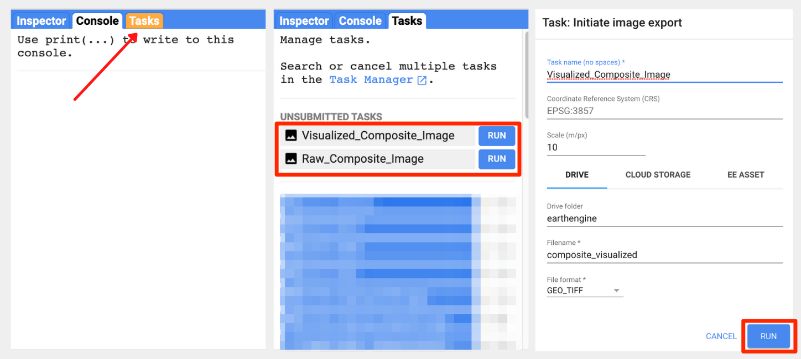
```

Once the Export finishes, a GeoTiff file for each export task will be added to your Google Drive in the specified folder. You can download them and use it any program that reads GeoTiff files.

```{r echo=FALSE, fig.align='center', out.width='100%', fig.cap='Visualized vs Raw'}
knitr::include_graphics('images/gee_water_resources_management/export_image.png')
```

### Exercise

Export the ```waterMndwi``` image to your drive.

[Try in Code Editor &#8599;](https://code.earthengine.google.co.in/?scriptPath=users%2Fujavalgandhi%2FGEE-Water-Resources-Management%3A01-Earth_Engine_Basics%2F09c_Export_(exercise)){target="_blank"}


# Module 2: Surface Water Mapping

In this Module, we will learn create an vectore surface water map for a water shed boundary in [HydroSheds](https://www.hydrosheds.org/page/hydrobasins) using [JRC - Global Surface Water](https://global-surface-water.appspot.com/#features). This data contains more accurate global-level surface water information. Using this, we will map the surface water, then learn to water mask and get specific information, execute morphological operations, and create a vector map for a river basin. 

[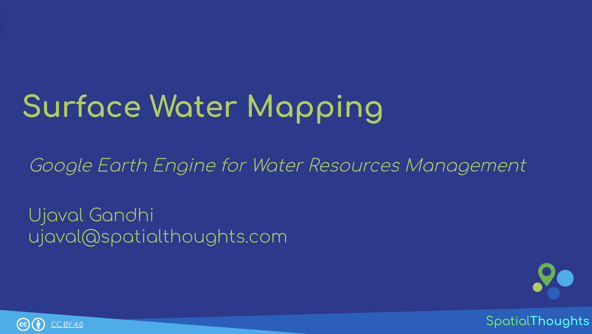{width="400px"}](https://docs.google.com/presentation/d/15EIaoRWc-obUrl2kqzlw_mYIaSAzYn7aOOE9SyU6XKc/edit?usp=sharing){target="_blank"}

[View the Presentation &#8599;](https://docs.google.com/presentation/d/15EIaoRWc-obUrl2kqzlw_mYIaSAzYn7aOOE9SyU6XKc/edit?usp=sharing){target="_blank"}

## 01. Load Global Surface Water Data

Lets load the [JRC Global Surface Water Mapping Layers](https://developers.google.com/earth-engine/datasets/catalog/JRC_GSW1_3_GlobalSurfaceWater). This data is the Spatio-temporal distribution of surface water. It is a single image with 7 bands, where each band contains unique information. Let's use the `occurrence` band, which includes information on the frequency of the water present from 1984-2020. The pixel value ranges from 0-100, where 0 represents No trace of water in any year, and 100 represents water present in all 36 years.

Use the Inspector to find the frequency of water present in the location. 

```{r echo=FALSE, fig.align='center', out.width='100%', fig.cap='Frequency of water present over Bellandur lake'}
knitr::include_graphics('images/gee_water_resources_management/Load_Global_Surface_Water_Data_01.png')
```

[Open in Code Editor &#8599;](https://code.earthengine.google.com/?scriptPath=users%2Fujavalgandhi%2FGEE-Water-Resources-Management%3A02-Surface_Water_Mapping%2F01b_Load_Global_Surface_Water_Data_(complete)){target="_blank"}

### Exercise

The `max_extent` band gives information on whether a pixel ever contained water or not, 0 represents the pixel has no water present in any of the months, and 1 represents the pixel has contained water in it for at least 1 month.

Load the `max_extent` band and visualize it with correct parameters.

```{js eval=FALSE}
// Create a map showing everywhere surface water was present.
// Select the 'max_extent' band and display the results
```

[Try in Code Editor &#8599;](https://code.earthengine.google.com/?scriptPath=users%2Fujavalgandhi%2FGEE-Water-Resources-Management%3A02-Surface_Water_Mapping%2F01c_Load_Global_Surface_Water_Data_(exercise)){target="_blank"}

## 02. Create a Water Mask

Earth Engine has a `mask` function to represent the *No Data* values in an Image. Any masked pixel of an image will not be used for analysis or visualization. There are two types of masks `selfMask` and `updateMask.` 

The `selfMask` will remove all the pixel values with *zero*. In the `max_extent` band visualization, we saw the pixel value is either 0 or 1, the pixel value with 0 contains no information, but the pixel value with 1 represents the water occurrence. So to remove the No Data pixel within the image, we can use the selfMask function. This will mask all pixel value with 0.

The `updateMask` will mask a *primary image* using a *mask image*. A mask image is an image with 0 1 pixel value. The primary image pixels overlaying with 0-pixel value in mask image will be set as No Data and masked out.

```{r echo=FALSE, fig.align='center', out.width='100%', fig.cap='Before applying Mask vs After applying Mask'}
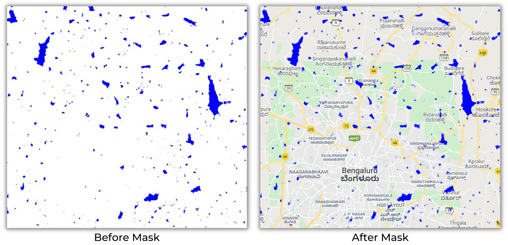
```


```{js eval=FALSE, code=readLines('code/gee_water_resources_management/02-Surface_Water_Mapping/02b_Create_a_Water_Mask_(complete)')}
```

[Open in Code Editor &#8599;](https://code.earthengine.google.co.in/?scriptPath=users%2Fujavalgandhi%2FGEE-Water-Resources-Management%3A02-Surface_Water_Mapping%2F02b_Create_a_Water_Mask_(complete)){target="_blank"}

### Exercise

The `seasonality` band gives information on the number of months water was present in a pixel. Pixel value ranges from 1 to 12, 1 represents water present for 1 month, and 12 represents water present for 12 months in a year.

Select all pixels in which water present for more than 5 months in a year.

```{js eval=FALSE, code=readLines('code/gee_water_resources_management/02-Surface_Water_Mapping/02c_Create_a_Water_Mask_(exercise)')}
```

[Try in Code Editor &#8599;](https://code.earthengine.google.co.in/?scriptPath=users%2Fujavalgandhi%2FGEE-Water-Resources-Management%3A02-Surface_Water_Mapping%2F02c_Create_a_Water_Mask_(exercise)){target="_blank"}


## 03. Find Lost Waterbodies

The `transition` band has water class changes between 1986 and 2020. It has [10 classes](https://developers.google.com/earth-engine/datasets/catalog/JRC_GSW1_3_GlobalSurfaceWater#bands) representing different changes, in which classes *3* and *6* represent *permanent* and *seasonal water loss*. We can calculate the total area of surface water lost by selecting both classes. 

The *binary operator* `eq` is used to select a particular class and create a binary image representing the availability of the class. The *boolean operator* `or` is used to create a binary image where either class value is present.

```{js eval=FALSE, code=readLines('code/gee_water_resources_management/02-Surface_Water_Mapping/03b_Find_Lost_Waterbodies_(complete)')}
```
[Open in Code Editor &#8599;](https://code.earthengine.google.com/?scriptPath=users%2Fujavalgandhi%2FGEE-Water-Resources-Management%3A02-Surface_Water_Mapping%2F03b_Find_Lost_Waterbodies_(complete)){target="_blank"}

### Exercise

Use the `transition` band and find the total surface water gain. 

```{js eval=FALSE, code=readLines('code/gee_water_resources_management/02-Surface_Water_Mapping/03c_Find_Lost_Waterbodies_(exercise)')}
```

[Try in Code Editor &#8599;](https://code.earthengine.google.com/?scriptPath=users%2Fujavalgandhi%2FGEE-Water-Resources-Management%3A02-Surface_Water_Mapping%2F03c_Find_Lost_Waterbodies_(exercise)){target="_blank"}

## 04. Get Yearly Water History

The [JRC Yearly Water Classification History](https://developers.google.com/earth-engine/datasets/catalog/JRC_GSW1_3_YearlyHistory) image collection contains the spatiotemporal map of surface water from 1984 to 2020. A total of 37 images represent 1 image for each year.

Let us filter this collection to visualize the surface water map of the year *2020*. This data contains 4 bands, where bands 2 and 3 indicate water presence.

> After filtering the Image Collection, the resultant would be a collection even if it contains just 1 image. We can use the function `.first()` to extract the particular image.

```{js eval=FALSE, code=readLines('code/gee_water_resources_management/02-Surface_Water_Mapping/04b_Get_Yearly_Water_History_(complete)')}
```
[Open in Code Editor &#8599;](https://code.earthengine.google.com/?scriptPath=users%2Fujavalgandhi%2FGEE-Water-Resources-Management%3A02-Surface_Water_Mapping%2F04b_Get_Yearly_Water_History_(complete)){target="_blank"}

### Exercise

Use the `JRC Yearly Water Classification History` dataset and visualize the surface water map for the year *2010*. 

```{js eval=FALSE} 
// Get the surface water image for the year 2010
// Display it on the map
```

[Try in Code Editor &#8599;](https://code.earthengine.google.com/?scriptPath=users%2Fujavalgandhi%2FGEE-Water-Resources-Management%3A02-Surface_Water_Mapping%2F04c_Get_Yearly_Water_History_(exercise)){target="_blank"}

## 05. Locate a SubBasin

The [HydroSHEDS](https://www.hydrosheds.org/) is a series of data primarily developed by the *World Wildlife Fund*. It contains a global level geo-reference stream network, watershed boundaries, and drainage directions. We will use the `hydroBASINS,` a feature collection containing drainage basin boundaries. This data is created using SRTM DEM data. There are multiple levels of hydroBASINS, ranging from 1 to 11. In level 1, the basin boundaries are delineated as huge groups. Moving levels up, these boundaries will be sub-divided into smaller boundaries.

We will use the Level 7 hydroBASINS feature collection to filter and locate a sun-basin called *Arkavathy*. The hydroBASINS doesn't contain basin names, so basins should be visually located and filtered using the *HYBAS_ID* property to filter a particular basin boundary.

```{js eval=FALSE, code=readLines('code/gee_water_resources_management/02-Surface_Water_Mapping/05b_Locate_a_SubBasin_(complete)')}
```
[Open in Code Editor &#8599;](https://code.earthengine.google.com/?scriptPath=users%2Fujavalgandhi%2FGEE-Water-Resources-Management%3A02-Surface_Water_Mapping%2F05b_Locate_a_SubBasin_(complete)){target="_blank"}

### Exercise

Using the Level 7 hydroBASINS, locate and filter a watershed basin in your region of interest. 

```{js eval=FALSE}
// Add the hydrobasins layer to the map
// Zoom to your region on interest and inspect the layer
// Find the id for a sub basin of interest and add it to the map.
```

[Try in Code Editor &#8599;](https://code.earthengine.google.com/?scriptPath=users%2Fujavalgandhi%2FGEE-Water-Resources-Management%3A02-Surface_Water_Mapping%2F05c_Locate_a_SubBasin_(exercise)){target="_blank"}

## 06. Create a Surface Water Map

A raster image output can be post-processed using morphological operations to create a clean-looking surface map. There are different types of operations like *Morphological Opening*, *Morphological Closing*, and *Majority Filtering*. 

* The opening operation can reduce the salt and pepper noise in the image. 
* The closing operation can fill holes and create a complete class. 
* A majority filter will smooth the image. This operation should be used for mapping purposes only and not used while calculating statistics, as it will significantly alter the result.

Earth Engine has many functions to perform morphological operations under `ee.Image`. Let's use the `Max_extent` band from Global Surface Water and fill holes to create a surface water map. An *Erosion* operation follows a *Dilation* operation to perform a closing operation, which translates as the *focalMin* function chained with *focalMax* in the earth engine. Different *kernelType* are available, let's use the *Square* kernel with *30* as search *radius* as the JRC's Global Surface Water spatial resolution is 30m. We can also define a custom kernel if the required kernel is unavailable in kernelType. 

```{r echo=FALSE, fig.align='center', out.width='150%', fig.cap='Before Operation vs After Operation'}
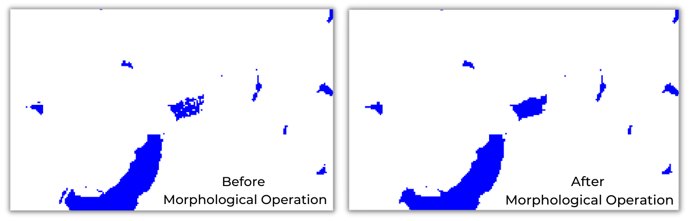
```

```{js eval=FALSE, code=readLines('code/gee_water_resources_management/02-Surface_Water_Mapping/06b_Create_a_Surface_Water_Map_(complete)')}
```
[Open in Code Editor &#8599;](https://code.earthengine.google.com/?scriptPath=users%2Fujavalgandhi%2FGEE-Water-Resources-Management%3A02-Surface_Water_Mapping%2F06b_Create_a_Surface_Water_Map_(complete)){target="_blank"}

### Exercise

By default, the total iteration is 1. We can increase it as required, so the kernel will pass through the image to perform the operation as many times as required. 

Set the iteration parameter to 2 and execute the morphological closing operation. 

```{js eval=FALSE, code=readLines('code/gee_water_resources_management/02-Surface_Water_Mapping/06c_Create_a_Surface_Water_Map_(exercise)')}
```

[Try in Code Editor &#8599;](https://code.earthengine.google.com/?scriptPath=users%2Fujavalgandhi%2FGEE-Water-Resources-Management%3A02-Surface_Water_Mapping%2F06c_Create_a_Surface_Water_Map_(exercise)){target="_blank"}

## 07. Convert Raster to Vector

After creating a final raster map, we can vectorize it. The `reduceToVectors` function should be used with *countEvery* reducer to convert a raster to a vector. This reducer will connect all linked pixels of the same class into a single feature and return a feature collection. By default, the connectedness of a pixel is checked in cardinal directions only. To check the connectedness of a pixel in the diagonal direction, *eightConnected* should be set as *true*.


```{js eval=FALSE, code=readLines('code/gee_water_resources_management/02-Surface_Water_Mapping/07b_Convert_Raster_to_Vector_(complete)')}
```
[Open in Code Editor &#8599;](https://code.earthengine.google.com/?scriptPath=users%2Fujavalgandhi%2FGEE-Water-Resources-Management%3A02-Surface_Water_Mapping%2F07b_Convert_Raster_to_Vector_(complete)){target="_blank"}

### Exercise

The final feature collection will contain the class value from the pixel as the *label* property. Since the raster is a binary image with 0 - 1 value, the label with value 1 will represent the water bodies. 

Use the *eq* filter and filter the water bodies alone.

```{js eval=FALSE, code=readLines('code/gee_water_resources_management/02-Surface_Water_Mapping/07c_Convert_Raster_to_Vector_(exercise)')}
```

[Try in Code Editor &#8599;](https://code.earthengine.google.com/?scriptPath=users%2Fujavalgandhi%2FGEE-Water-Resources-Management%3A02-Surface_Water_Mapping%2F07c_Convert_Raster_to_Vector_(exercise)){target="_blank"}


# Module 3: Precipitation Time Series Analysis 

The main advantage of the gridded precipitation dataset is that they offer a consistent long-term time-series. We will cover the basics of gridded rainfall datasets, how to aggregate them to the requirement temporal resolution and prepare a time-series for trend analysis.

[{width="400px"}](https://docs.google.com/presentation/d/1G-v9Nz90DGGQ2OfTPxwD5j-HspPcIYUu9UB-nkNnGn4/edit?usp=sharing){target="_blank"}

[View the Presentation &#8599;](https://docs.google.com/presentation/d/1G-v9Nz90DGGQ2OfTPxwD5j-HspPcIYUu9UB-nkNnGn4/edit?usp=sharing){target="_blank"}

But to fully leverage the computation power of Earth Engine for our analysis, we must first learn about techniques for writing efficient paralell computing code. The Earth Engine API uses [Map/Reduce](https://en.wikipedia.org/wiki/MapReduce) paradigm for parallel computing. 

In this module, we will first learn about earth engine objects, creating user-defined functions, mapping a function, and using reducers. We will then apply these technique to create a time series chart and carry out spatio-temporal trend analysis of precipitation.

[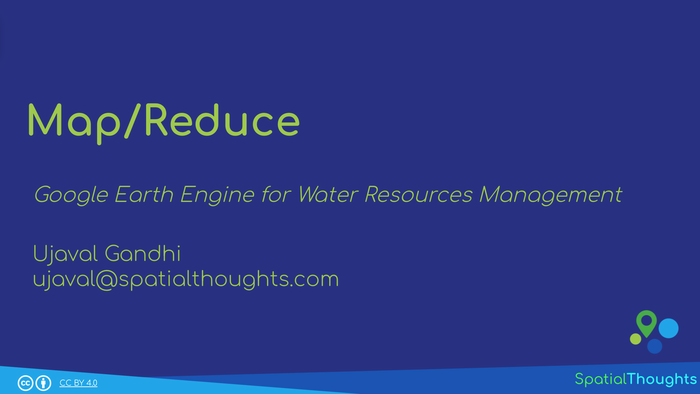{width="400px"}](https://docs.google.com/presentation/d/1F_yRyBkItQdpbm-TXOTc4CkMXxynulfKY2p1TG0xS-g/edit?usp=sharing){target="_blank"}

[View the Presentation &#8599;](https://docs.google.com/presentation/d/1F_yRyBkItQdpbm-TXOTc4CkMXxynulfKY2p1TG0xS-g/edit?usp=sharing){target="_blank"}


## 01. Mapping a Function

This script introduces the basics of the Earth Engine API. Here we map a list of objects over a function to perform a task on all the objects. While defining a function, it should return a result after computation, which can be stored in a variable. To learn more, visit the [Earth Engine Objects and Methods](https://developers.google.com/earth-engine/tutorial_js_02) section of the Earth Engine User Guide. 

Apart from other regular strings and numbers, the earth engine can understand dates. Under `ee.Date` there are many functions by which dates can be defined or converted from one format to another.

```{js eval=FALSE, code=readLines('code/gee_water_resources_management/03-Time_Series_Analysis/01b_Mapping_a_Function_(complete)')}
```

[Open in Code Editor &#8599;](https://code.earthengine.google.co.in/?scriptPath=users%2Fujavalgandhi%2FGEE-Water-Resources-Management%3A03-Time_Series_Analysis%2F01b_Mapping_a_Function_(complete)){target="_blank"}

### Exercise

Define the function `createDate`, map the `weeks` list as input. The function should return dates incremented by the week number.

```{js eval=FALSE, code=readLines('code/gee_water_resources_management/03-Time_Series_Analysis/01c_Mapping_a_Function_(exercise)')}
```
[Try in Code Editor &#8599;](https://code.earthengine.google.co.in/?scriptPath=users%2Fujavalgandhi%2FGEE-Water-Resources-Management%3A03-Time_Series_Analysis%2F01c_Mapping_a_Function_(exercise)){target="_blank"}


## 02. Reducers

A *Reduce* operation allows you to compute statistics on a large amount of inputs. In Earth Engine, you need to run reduction operation when creating composites, calculating statistics, doing regression analysis etc. The Earth Engine API comes with a large number of built-in reducer functions (such as `ee.Reducer.sum()`, `ee.Reducer.histogram()`, `ee.Reducer.linearFit()` etc.) that can perform a variety of statistical operations on input data. You can run reducers using the `reduce()` function. Earth Engine supports running reducers on all data structures that can hold multiple values, such as Images (reducers run on different bands), ImageCollection, FeatureCollection, List, Dictionary etc. The script below introduces basic concepts related to reducers.

```{js eval=FALSE, code=readLines('code/gee_water_resources_management/03-Time_Series_Analysis/02b_Reducers_(complete)')}
```
[Open in Code Editor &#8599;](https://code.earthengine.google.co.in/?scriptPath=users%2Fujavalgandhi%2FGEE-Water-Resources-Management%3A03-Time_Series_Analysis%2F02b_Reducers_(complete)){target="_blank"}

### Exercise 

```{js eval=FALSE, code=readLines('code/gee_water_resources_management/03-Time_Series_Analysis/02c_Reducers_(exercise)')}
```
[Try in Code Editor &#8599;](https://code.earthengine.google.co.in/?scriptPath=users%2Fujavalgandhi%2FGEE-Water-Resources-Management%3A03-Time_Series_Analysis%2F02c_Reducers_(exercise)){target="_blank"}

## 03. Calculating Total Rainfall

The CHIRPS Pentad is 5 days composite of rainfall at ~6 km spatial resolution. To compute this data, both satellite and grounds values are considered. To read more about the methodology, visit [nature.com](https://www.nature.com/articles/sdata201566)

Using this image collection, lets filter all the images for 2017. To get a yearly rainfall we can reduce the collection using `reduce` function with *sum* reducer. This will return a single global image where each pixel represent the total annual rainfall value in *mm* at that location. Now to get a annual average rainfall at a particular region of interest, we can do a `reduceRegions` with a *mean* reducer over the region. This reducer will reduce the region's image and return a dictionary. The dictionary will contain the average value of all the bands in the image, which can be extracted using the *get* function.


```{js eval=FALSE, code=readLines('code/gee_water_resources_management/03-Time_Series_Analysis/03b_Calculating_Total_Rainfall_(complete)')}
```

[Open in Code Editor &#8599;](https://code.earthengine.google.co.in/?scriptPath=users%2Fujavalgandhi%2FGEE-Water-Resources-Management%3A03-Time_Series_Analysis%2F03b_Calculating_Total_Rainfall_(complete)){target="_blank"}

Output 

```
Average rainfall across ROI :
1345.867775034789
```
### Exercise

Update the date rage for monsoon season(1 June - 30 September) in India. 

```{js eval=FALSE}
// Update the script to calculate total rainfall for the monsoon season
// Monsoon season in India is from 1 June - 30 September
```

[Try in Code Editor &#8599;](https://code.earthengine.google.co.in/?scriptPath=users%2Fujavalgandhi%2FGEE-Water-Resources-Management%3A03-Time_Series_Analysis%2F03c_Calculating_Total_Rainfall_(exercise)){target="_blank"}


## 04. Aggregating Time Series

In the previous exercise, we aggregated to get the average rainfall across a region. Let's compute a time series representing the total rainfall of each month in 2019.

Earth Engine has a function called `ee.Date.fromYMD` to create a date from *Year*, *Month*, and *Date*. Using this function and `.advance()`, we can create the filter date to filter the image collection to a particular month. Then with `reduce` function with *sum* as reducer, the monthly image collection is aggregated to the monthly total image. This newly created image won't have any properties. Hence using the `.set()` function, we have to assign the *Year*, *Month*, *system:time_start*, and *system:time_end* properties. With the above procedure in the sequence, we can create a function to input the month's number and return the monthly total precipitation image.

We can create the month's list using `ee.List.sequence` and map it to the function built. Since the mapped object is of type List, the resultant will also be a list with 12 images. This list of images can be converted back as Image Collection using `ee.ImageCollection.fromYMD`.
Once we have the collection print, it will contain 12 images representing the month's total precipitation.

>The *system:time_start* is a unique property that the earth engine can natively understand. It is the [Unix Timestamp](https://en.wikipedia.org/wiki/Unix_time) that is used to create a time series chart.
 

```{js eval=FALSE, code=readLines('code/gee_water_resources_management/03-Time_Series_Analysis/04b_Aggregating_Time_Series_(complete)')}
```

[Open in Code Editor &#8599;](https://code.earthengine.google.co.in/?scriptPath=users%2Fujavalgandhi%2FGEE-Water-Resources-Management%3A03-Time_Series_Analysis%2F04b_Aggregating_Time_Series_(complete)){target="_blank"}

### Exercise

Filter the `monthlyCollection` for the months June, July, August and September.
```{js eval=FALSE}
// Apply a filter to select images for the months
// June, July, August and September
// Print the collection to verify
```

[Try in Code Editor &#8599;](https://code.earthengine.google.co.in/?scriptPath=users%2Fujavalgandhi%2FGEE-Water-Resources-Management%3A03-Time_Series_Analysis%2F04c_Aggregating_Time_Series_(exercise)){target="_blank"}

## 05. Charting Monthly Rainfall 

Now we can put together all the skills we have learned so far - filter, map, and reduce to create a chart of monthly total rainfall in the year 2019 over a region. Earth Engine API supports charting functions based on the Google Chart API. There are various charts to use, from which we use the `ui.Chart.image.series()` function to create a time-series chart.

Image series chart accepts an *image collection*, *geometry*, *scale*, and *reducer*. The geometry in the region of interest, reducer in the reduction operation the region of interest should be aggregated if the geometry is a polygon. Scale is the resolution at which the image should be reduced. Using `.setOptions`, we can customize the chart to our needs. 

Charting itself is vast, and all function are self explanatory. Google Earth Engine documentation provides all types of [charting examples](https://developers.google.com/earth-engine/guides/charts_overview.)   

```{js eval=FALSE, code=readLines('code/gee_water_resources_management/03-Time_Series_Analysis/05b_Charting_Monthly_Rainfall_(complete)')}
```
[Open in Code Editor &#8599;](https://code.earthengine.google.co.in/?scriptPath=users%2Fujavalgandhi%2FGEE-Water-Resources-Management%3A03-Time_Series_Analysis%2F05b_Charting_Monthly_Rainfall_(complete)){target="_blank"}

```{r echo=FALSE, fig.align='center', out.width='100%', fig.cap='2019 - Monthly rainfall'}
knitr::include_graphics('images/gee_water_resources_management/charting_monthly_rainfall.png')
```

### Exercise

Change the geometry to your location, comput the monthly total rainfall. Download the timeseries chart generated.

```{js eval=FALSE}
// Create a chart of monthly rainfall at your selected location
// print the chart and download it as a PNG
```

[Try in Code Editor &#8599;](https://code.earthengine.google.co.in/?scriptPath=users%2Fujavalgandhi%2FGEE-Water-Resources-Management%3A03-Time_Series_Analysis%2F05c_Charting_Monthly_Rainfall_(exercise)){target="_blank"}

## 06. Import

You can import vector or raster data into Earth Engine. We will now import a shapefile of [Taluk](https://kgis.ksrsac.in/kgis/downloads.aspx) for a state in India. Unzip the `Taluk.rar` into a folder on your computer. In the Code Editor, go to *Assets &rarr; New &rarr; Table Upload &rarr; Shape Files*. Select the `.cpj`, `.sbn`, `.shp`, `.shx`, `.dbf`and .`prj` files. Enter `Taluk_Boundary` as the *Asset Name* and click  *Upload*. In the *Tasks* tab you can see the progress of the upload. Once the ingestion is complete you will have a new asset in the *Assets* tab. The shapefile will be imported as a Feature Collection in Earth Engine. Select the `Taluk_Boundary` asset and click *Import*.  You can then visualize the imported data.

```{r echo=FALSE, fig.align='center', out.width='150%', fig.cap='Importing a Shapefile'}
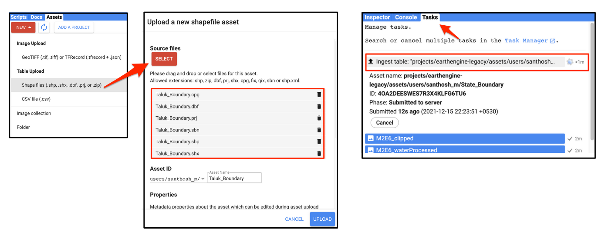
```

```{js eval=FALSE, code=readLines('code/gee_water_resources_management/03-Time_Series_Analysis/06b_Import_(complete)')}
```

[Open in Code Editor &#8599;](https://code.earthengine.google.co.in/?scriptPath=users%2Fujavalgandhi%2FGEE-Water-Resources-Management%3A03-Time_Series_Analysis%2F06b_Import_(complete)){target="_blank"}

### Exercise

Explore the uploaded Feature Collection, `SHAPE_STAr` property contains the area in meter_square, using `addArea` function area is converted into kilometer_square and stored as `area_sqkm`. Using this property filter all regions with area greater than 1000 kmsq. 


```{js eval=FALSE, code=readLines('code/gee_water_resources_management/03-Time_Series_Analysis/06c_Import_(exercise)')}
```
[Try in Code Editor &#8599;](https://code.earthengine.google.co.in/?scriptPath=users%2Fujavalgandhi%2FGEE-Water-Resources-Management%3A03-Time_Series_Analysis%2F06c_Import_(exercise)){target="_blank"}

## 07. Zonal Statistics

Now that we have uploaded a shapefile with many Taluk boundaries let us calculate the mean rainfall for each district. Before in `reduceRegion`, we learned to reduce a single image over a whole geometry. But by using the `reduceRegions`, we can reduce the image for each geometry in the feature collection. This function will return a *Feature Collection*, which contains all the features with an additional property of the reduced value.

```{r echo=FALSE, fig.align='center', out.width='100%', fig.cap='Zonal Statistics'}
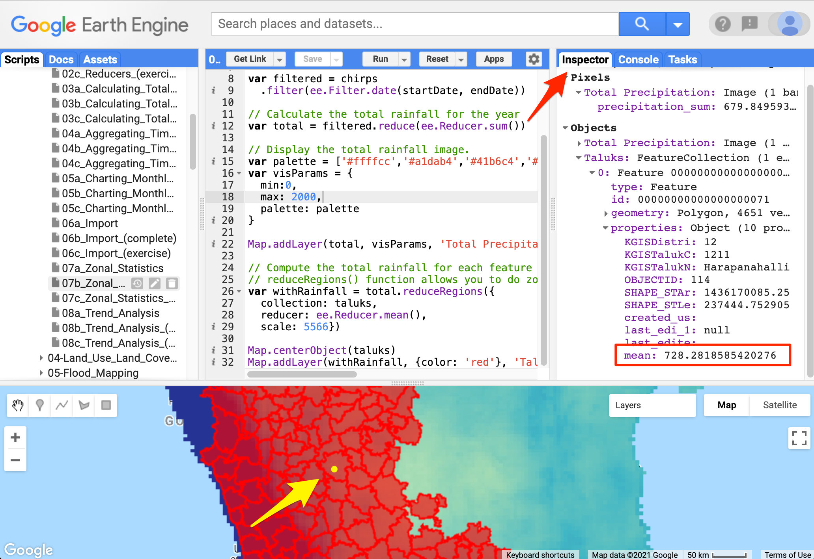
```

```{js eval=FALSE, code=readLines('code/gee_water_resources_management/03-Time_Series_Analysis/07b_Zonal_Statistics_(complete)')}
```
[Open in Code Editor &#8599;](https://code.earthengine.google.co.in/?scriptPath=users%2Fujavalgandhi%2FGEE-Water-Resources-Management%3A03-Time_Series_Analysis%2F07b_Zonal_Statistics_(complete)){target="_blank"}

### Exercise

Write an export function to export the Feature Collection as a CSV file. 

```{js eval=FALSE, code=readLines('code/gee_water_resources_management/03-Time_Series_Analysis/07c_Zonal_Statistics_(exercise)')}
```
[Try in Code Editor &#8599;](https://code.earthengine.google.co.in/?scriptPath=users%2Fujavalgandhi%2FGEE-Water-Resources-Management%3A03-Time_Series_Analysis%2F07c_Zonal_Statistics_(exercise)){target="_blank"}

## 08. Trend Analysis

Trend Analysis is a technique that is used to find the pattern. Let us do a Non-Parametric Trend Analysis using the [Sen Slope](https://en.wikipedia.org/wiki/Theil%E2%80%93Sen_estimator) technique to find the pattern of rainfall over time.

The sens slope is a reduction operation that expects two-band X and Y. The X is the constant band with value year, and the Y is the total precipitation of that pixel in that year. After creating the image collection in this format we can use the `ee.Reducer.sensSlope()` with the collection to compute the slope at each year.

This function returns an image with a positive pixel value representing the increase in precipitation and vice-versa.

> An advantage of doing trend analysis in earth engine is computing pre-pixel calculation other wise which would be computation intestiive task to perform. 

```{js eval=FALSE, code=readLines('code/gee_water_resources_management/03-Time_Series_Analysis/08b_Trend_Analysis_(complete)')}
```

[Open in Code Editor &#8599;](https://code.earthengine.google.co.in/?scriptPath=users%2Fujavalgandhi%2FGEE-Water-Resources-Management%3A03-Time_Series_Analysis%2F08b_Trend_Analysis_(complete)){target="_blank"}

### Exercise

The trend analysis is done for a particular season. Change the filter dates to compute the annual precipitation trend.

```{js eval=FALSE, code=readLines('code/gee_water_resources_management/03-Time_Series_Analysis/08c_Trend_Analysis_(exercise)')}
```

[Try in Code Editor &#8599;](https://code.earthengine.google.co.in/?scriptPath=users%2Fujavalgandhi%2FGEE-Water-Resources-Management%3A03-Time_Series_Analysis%2F08c_Trend_Analysis_(exercise)){target="_blank"}


# Module 4: Land Use Land Cover Classification

## Introduction to Machine Learning and Supervised Classification

Supervised classification is a classical machine learning technique in remote sensing. There is a variety of applications that can be performed using this technique. Google Earth Engine is uniquely suited for supervised classification at a large scale, and it has all the resources pre-loaded for convenience. The interactive nature of Earth Engine development allows for iterative development of supervised classification workflows by combining many different datasets into the model. This module covers basic supervised classification workflow, accuracy assessment, hyperparameter tuning, and using the ESA world cover data. 

[{width="400px"}](https://docs.google.com/presentation/d/16jsxRrYG9RddvlUfa6Myt3_mc-ye4GgDcvYK6n7IgkU/edit?usp=sharing){target="_blank"}

[View the Presentation &#8599;](https://docs.google.com/presentation/d/16jsxRrYG9RddvlUfa6Myt3_mc-ye4GgDcvYK6n7IgkU/edit?usp=sharing){target="_blank"}


## 01. Basic Supervised Classification

We will learn the technique to do a basic land cover classification using training points collected using the Code Editor with the help of the High-Resolution base map imagery provided by Google Maps. Even if no field data is available for training the model, this method is very effective in generating high-quality classification samples anywhere in the world. The goal is to classify Sentinel 2A pixel into one of the following classes - *urban, bare, water,* or *vegetation*. Using the drawing tools in the code editor lets us create 4 new feature collections with points representing pixels of each class. Each feature collection will be created with a property `landcover` where each collection has values of 0, 1, 2, or 3, representing urban, bare, water, or vegetation, respectively. We use these collected samples to train a *Random Forest* classifier and apply it to all the image pixels to create a  land cover image with 4 classes.

> Fun fact: The classifiers in Earth Engine API have names starting with **smile** - such as `ee.Classifier.smileRandomForest()`. The *smile* part refers to the [Statistical Machine Intelligence and Learning Engine (SMILE)](https://haifengl.github.io/index.html) JAVA library which is used by Google Earth Engine to implement these algorithms.

```{js eval=FALSE, code=readLines('code/gee_water_resources_management/04-Land_Use_Land_Cover_Classification/01d_Basic_Supervised_Classification_(noimport)')}
```

[Open in Code Editor &#8599;](https://code.earthengine.google.com/?scriptPath=users%2Fujavalgandhi%2FGEE-Water-Resources-Management%3A04-Land_Use_Land_Cover_Classification%2F01d_Basic_Supervised_Classification_(noimport)){target="_blank"}

```{r echo=FALSE, fig.align='center', out.width='100%', fig.cap='Supervised Classification Output'}
knitr::include_graphics('images/gee_water_resources_management/classified.png')
```

### Exercise

Select and city of your choice from `urbanAreas` data. Create Feature collection with property `landcover`  and collect training points for every four classes *urban, bare, water*, and *vegetation*. Then use the code to classify and create a land cover of the city.

```{js eval=FALSE, code=readLines('code/gee_water_resources_management/04-Land_Use_Land_Cover_Classification/01c_Basic_Supervised_Classification_(exercise)')}
```
[Try in Code Editor &#8599;](https://code.earthengine.google.com/?scriptPath=users%2Fujavalgandhi%2FGEE-Water-Resources-Management%3A04-Land_Use_Land_Cover_Classification%2F01c_Basic_Supervised_Classification_(exercise)){target="_blank"}

## 02. Accuracy Assessment

It is important to get a quantitative estimate of the accuracy of the classification. To do this, a common strategy is to divide your training samples into 2 random fractions - one used for *training* the model and the other for *validation* of the predictions. Once a classifier is trained, it can be used to classify the entire image. We can then compare the classified values with the ones in the validation fraction. We can use the `ee.Classifier.confusionMatrix()` method to calculate a *Confusion Matrix* representing expected accuracy.

> Don't get carried away tweaking your model to give you the highest validation accuracy. You must use both qualitative measures (such as visual inspection of results) along with quantitative measures to assess the results. 

```{js eval=FALSE, code=readLines('code/gee_water_resources_management/04-Land_Use_Land_Cover_Classification/02b_Accuracy_Assessment_(complete)')}
```

[Open in Code Editor &#8599;](https://code.earthengine.google.com/?scriptPath=users%2Fujavalgandhi%2FGEE-Water-Resources-Management%3A04-Land_Use_Land_Cover_Classification%2F02b_Accuracy_Assessment_(complete)){target="_blank"}

Output 

```
Confusion Matrix
0: [41,4,0,0]
1: [3,43,0,0]
2: [0,0,48,3]
3: [0,0,0,37]

Test Accuracy
0.9441340782122905
```

## 03. Improving the Classification

The Earth Engine data-model is especially well suited for machine learning tasks because of its ability to easily incorporate data sources of different spatial resolutions, projections and data types together By giving additional information to the classifier, it is able to separate different classes easily. Here we take the same example and augment it with the following techniques

* *Apply Cloud Masking*
* *Add Spectral Indices*: We add bands for different spectral indices such as - NDVI, NDBI, MNDWI and BSI. 
* *Add Elevation and Slope*: We also add slope and elevation bands from the ALOS DEM. 
* *Normalize the Inputs*: Machine learning models work best when all the inputs have the same scale. We will divide each band with the maximum value. This method ensures that all input values are between 0-1. 

Our training features have more parameters and contain values of the same scale. The result is a much improved classification.

```{js eval=FALSE, code=readLines('code/gee_water_resources_management/04-Land_Use_Land_Cover_Classification/03b_Improving_the_Classification_(complete)')}
```

[Open in Code Editor &#8599;](https://code.earthengine.google.com/?scriptPath=users%2Fujavalgandhi%2FGEE-Water-Resources-Management%3A04-Land_Use_Land_Cover_Classification%2F03b_Improving_the_Classification_(complete)){target="_blank"}

Output 

```
Confusion Matrix
0: [41,3,0,0]
1: [3,43,0,0]
2: [0,0,49,2]
3: [0,0,0,37]

Test Accuracy
0.9550561797752809
```

## 04. Exporting Classification Results

When working with complex classifiers over large regions, you may get a *User memory limit exceeded* or *Computation timed out* error in the Code Editor. The reason for this is that there is a fixed time limit and smaller memory allocated for code that is run with the *On-Demand Computation* mode. For larger computations, you can use the *Batch* mode with the `Export` functions. Exports run in the background and can run longer than 5-minutes time allocated to the computation code run from the Code Editor. This allows you to process very large and complex datasets. Here's an example showing how to export your classification results to Google Drive.

> We can only export Images or FeatureCollections. What if you wanted to export a number that is the result of a long computation? A useful *hack* is to create a FeatureCollection with just 1 feature containing `null` geometry and a property containing the number you want to export.

```{js eval=FALSE, code=readLines('code/gee_water_resources_management/04-Land_Use_Land_Cover_Classification/04b_Exporting_Classification_Results_(complete)')}
```
[Open in Code Editor &#8599;](https://code.earthengine.google.com/?scriptPath=users%2Fujavalgandhi%2FGEE-Water-Resources-Management%3A04-Land_Use_Land_Cover_Classification%2F04b_Exporting_Classification_Results_(complete)){target="_blank"}

```{r echo=FALSE, fig.align='center', out.width='50%', fig.cap='Exported Classification Accuracy'}
knitr::include_graphics('images/gee_water_resources_management/export_accuracy.png')
```

### Exercise

It is also a good idea to export the classified image as an Asset. This will allows you to import the classified image in another script without running the whole classification workflow. Use the `Export.image.toAsset()` function to export the classified image as an asset.

```{js eval=FALSE, code=readLines('code/gee_water_resources_management/04-Land_Use_Land_Cover_Classification/04c_Exporting_Classification_Results_(exercise)')}
```
[Try in Code Editor &#8599;](https://code.earthengine.google.co.in/?scriptPath=users%2Fujavalgandhi%2FGEE-Water-Resources-Management%3A04-Land_Use_Land_Cover_Classification%2F04c_Exporting_Classification_Results_(exercise)){target="_blank"}


```{r echo=FALSE, fig.align='center', out.width='100%', fig.cap='Exported Classified Asset'}
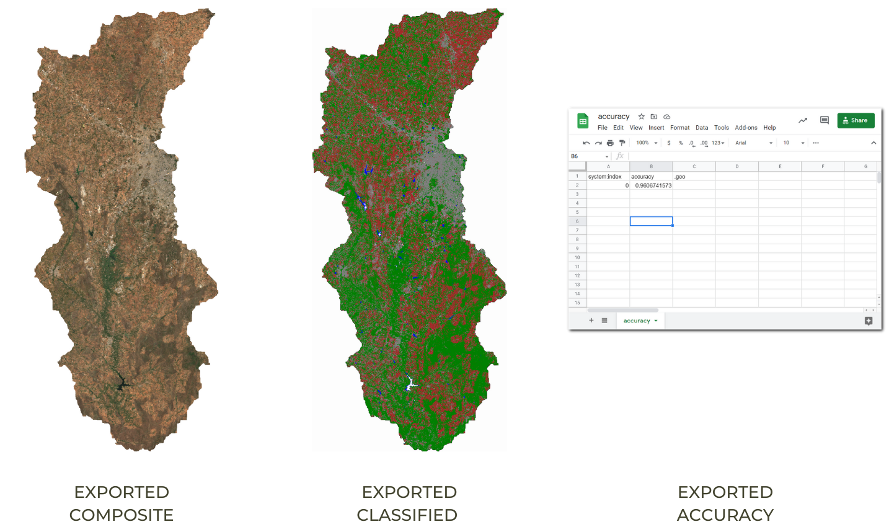
```


## 05. Using Existing Landcover Datasets

One of the ambitious projects was creating a global landcover data with many classes for many years. This type of data is essential as in expect few countries, the landcover data of terrain is not available / not shared publically by the local governments. Hence creating a global land cover has been attempted by a few organizations One among them is *European Space Agency*. The ESA has created the 10m global landcover called [WorldCover](https://esa-worldcover.org/en) with 10 classes. At present, this data is available for the year 2020 and, ESA has promised to develop and release this data every year following 2020. [Watch the launch event](https://vimeo.com/637205140) to know more about this data and the methodology used to create this.

We can use the `eq` operator to extract a particular class, extract the water class, and create a surface water map for the Arkavathy region.

```{js eval=FALSE, code=readLines('code/gee_water_resources_management/04-Land_Use_Land_Cover_Classification/05b_Using_Existing_Landcover_Datasets_(complete)')}
```

[Open in Code Editor &#8599;](https://code.earthengine.google.com/?scriptPath=users%2Fujavalgandhi%2FGEE-Water-Resources-Management%3A04-Land_Use_Land_Cover_Classification%2F05b_Using_Existing_Landcover_Datasets_(complete)){target="_blank"}

```{r echo=FALSE, fig.align='center', out.width='75%', fig.cap='WorldView'}
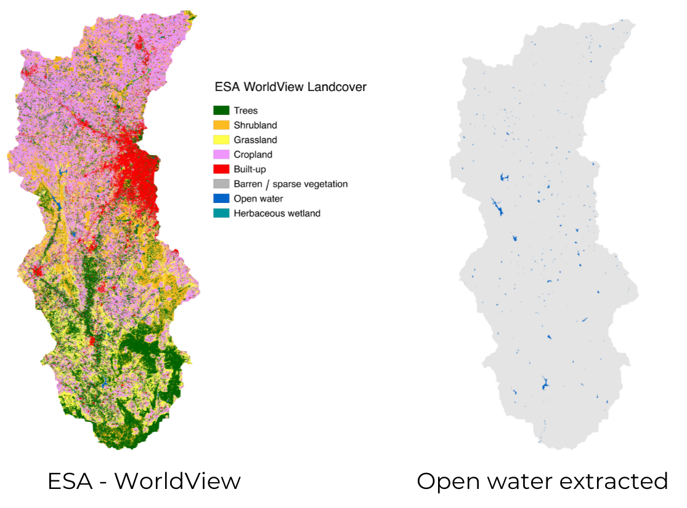
```

### Exercise 

Use the WorldView data and extract the `Cropland` class for Arkavathy region. Then add it to map with *green* palette. 

```{js eval=FALSE, code=readLines('code/gee_water_resources_management/04-Land_Use_Land_Cover_Classification/05c_Using_Existing_Landcover_Datasets_(exercise)')}
```

[Open in Code Editor &#8599;](https://code.earthengine.google.com/?scriptPath=users%2Fujavalgandhi%2FGEE-Water-Resources-Management%3A04-Land_Use_Land_Cover_Classification%2F05c_Using_Existing_Landcover_Datasets_(exercise)){target="_blank"}


## 06. Calculating Area

Now that we have extracted the open water from WorldView, we will learn how to calculate the area for pixels in each class. Calculating area for features is done using the `area()` function and for images using the `ee.Image.pixelArea()` function. The `ee.Image.pixelArea()` function creates an image where each pixel's value is the area of the pixel. We multiply this pixel area image with our image and sum up the area using the `reduceRegion()` function.

> The `ee.Image.pixelArea()` function uses a custom equal-area projection for area calculation. The result is area in square meters regardless of the projection of the input image. [Learn more](https://groups.google.com/g/google-earth-engine-developers/c/Ccaorx-obVw/m/_ZQdP2wVAgAJ)

```{js eval=FALSE, code=readLines('code/gee_water_resources_management/04-Land_Use_Land_Cover_Classification/06b_Calculating_Area_(complete)')}
```

[Open in Code Editor &#8599;](https://code.earthengine.google.com/?scriptPath=users%2Fujavalgandhi%2FGEE-Water-Resources-Management%3A04-Land_Use_Land_Cover_Classification%2F06b_Calculating_Area_(complete)){target="_blank"}

Output

```
Total basin Area(sqkm)
4178

Total water area in the basin(sqkm)
19
```

### Exercise 

Extract the area value as a number and convert it as hectares. 

```{js eval=FALSE, code=readLines('code/gee_water_resources_management/04-Land_Use_Land_Cover_Classification/06c_Calculating_Area_(exercise)')}

```

[Try in Code Editor &#8599;](https://code.earthengine.google.com/?scriptPath=users%2Fujavalgandhi%2FGEE-Water-Resources-Management%3A04-Land_Use_Land_Cover_Classification%2F06c_Calculating_Area_(exercise)){target="_blank"}


# Module 5: Flood Mapping

This module lets us map the flooded regions and calculate the flooded area during the [2018 Kerala Floods](https://en.wikipedia.org/wiki/2018_Kerala_floods) in Ernakulam district.

We will use the Sentinel 1 GRD (Ground Range Detected) data. This satellite is an active remote sensing platform that uses the microwave C-band to collect data. The main advantage of using microwave data is that it can penetrate through clouds and capture reflectance value both day and night since it is not dependent on Sunlight for reflectance. The spatial resolution of this data is 10m, and the temporal resolution varies between 6-12 days, depending on the location. 

The Google Earth Engine provides an Analysis Ready Data (ARD) in which all the required pre-processing is done. To know more about microwave remote sensing data application and usage, visit [Remote Sensing Tutorials](https://www.nrcan.gc.ca/maps-tools-and-publications/satellite-imagery-and-air-photos/tutorial-fundamentals-remote-sensing/9309) by Canada Centre for Mapping and Earth Observation.

[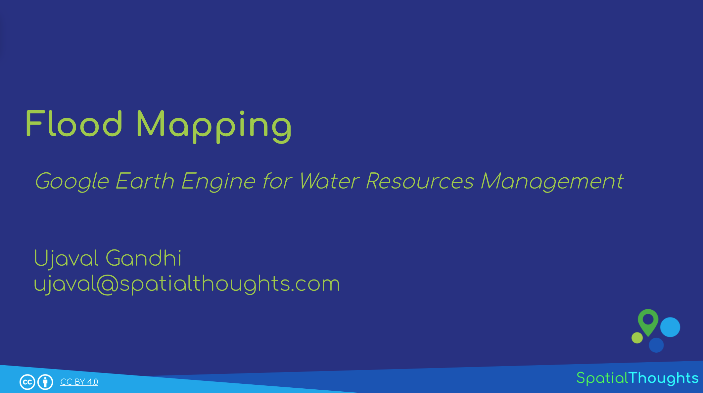{width="400px"}](https://docs.google.com/presentation/d/1w1bTP49jI4LbHYTtQzEg4yytGGbCx_l5bhTisITXxKY/edit?usp=sharing){target="_blank"}

[View the Presentation &#8599;](https://docs.google.com/presentation/d/1w1bTP49jI4LbHYTtQzEg4yytGGbCx_l5bhTisITXxKY/edit?usp=sharing){target="_blank"}

## 01. Load and Filter Sentinel-1 Data

We have learned basic skills to search for a dataset and filter it to a date range and location. Let us load the [Sentinel-1 C-band SAR log scaling ](https://developers.google.com/earth-engine/datasets/catalog/COPERNICUS_S1_GRD) dataset and filter the collection to flooding event time period. Filter the collection to the Ernakulam region.

Each image will have 3 bands *VV*, *VH*, and *angle*. Most research results say *VH - (vertical transmit and horizontal receive)* is best for detecting floods as water has low reflectance in the VH band and is easy to detect. Lets us select the VH band, clip it to the ROI and display it in Map with the appropriate visualization parameter.


```{js eval=FALSE, code=readLines('code/gee_water_resources_management/05-Flood_Mapping/01b_Load_and_Filter_Sentinel-1_Data_(complete)')}
```

[Open in Code Editor &#8599;](https://code.earthengine.google.com/?scriptPath=users%2Fujavalgandhi%2FGEE-Water-Resources-Management%3A05-Flood_Mapping%2F01b_Load_and_Filter_Sentinel-1_Data_(complete)){target="_blank"}

### Exercise

To detect the flooded regions, we need 2 collections, one before and another after flood occurrence. A before image and an after image has been created. Select the *VH* band from the images and add both images to the map canvas.

```{r echo=FALSE, fig.align='center', out.width='100%', fig.cap='VH single band visualization'}
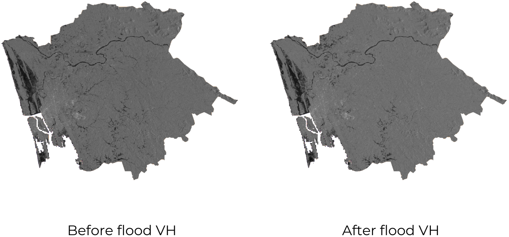
```

```{js eval=FALSE, code=readLines('code/gee_water_resources_management/05-Flood_Mapping/01c_Load_and_Filter_Sentinel-1_Data_(exercise)')}
```

[Try in Code Editor &#8599;](https://code.earthengine.google.com/?scriptPath=users%2Fujavalgandhi%2FGEE-Water-Resources-Management%3A05-Flood_Mapping%2F01c_Load_and_Filter_Sentinel-1_Data_(exercise)){target="_blank"}

## 02. Visualize RGB Composites

We visualized the VH band as a single band image in the previous exercise. We can also visualize a SAR image as a multi-band RGB image. The usual practice is using the *VV* band in the red channel, the *VH* band in the green channel, and the *VV/VH* in the blue channel. 

Three bands have different min-max values, but a single number for min-max value in visualization will not be correct. So we can pass a list of numbers, each representing each band's min-max value in Red Green Blue order, respectively.

```{r echo=FALSE, fig.align='center', out.width='100%', fig.cap='RGB multi band visualization'}
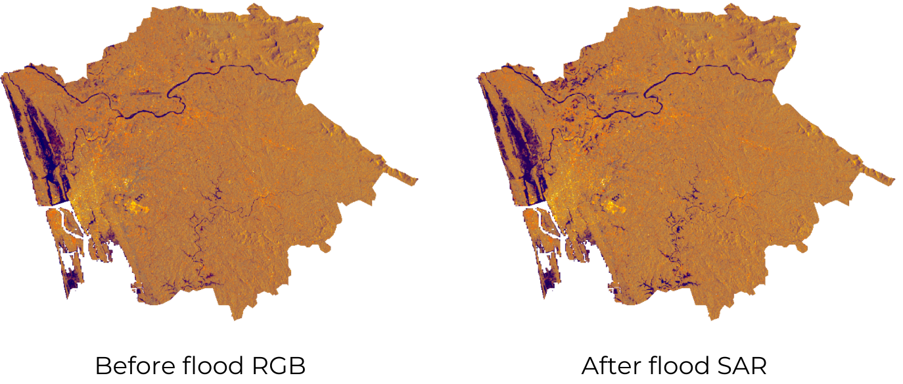
```

```{js eval=FALSE, code=readLines('code/gee_water_resources_management/05-Flood_Mapping/02b_Visualize_RGB_Composites_(complete)')}
```

[Open in Code Editor &#8599;](https://code.earthengine.google.com/?scriptPath=users%2Fujavalgandhi%2FGEE-Water-Resources-Management%3A05-Flood_Mapping%2F02b_Visualize_RGB_Composites_(complete)){target="_blank"}

### Exercise

We have learned to visualize a multi-band image using *VV*, *VH*, and *VV/VH* bands. Let us visualize the change by creating a composite image with *VH - before image*, *VH - after image*, and *VH - before image*. This visualization can effectively identify the before and after images’ changes.

To create this visualization, select the particular bands from each image and concatenate the three bands in the same order using `ee.Image.cat` function, use the visualization parameter as min: -25 and max: -8 and add it to the canvas.

```{r echo=FALSE, fig.align='center', out.width='75%', fig.cap='Change visualization'}
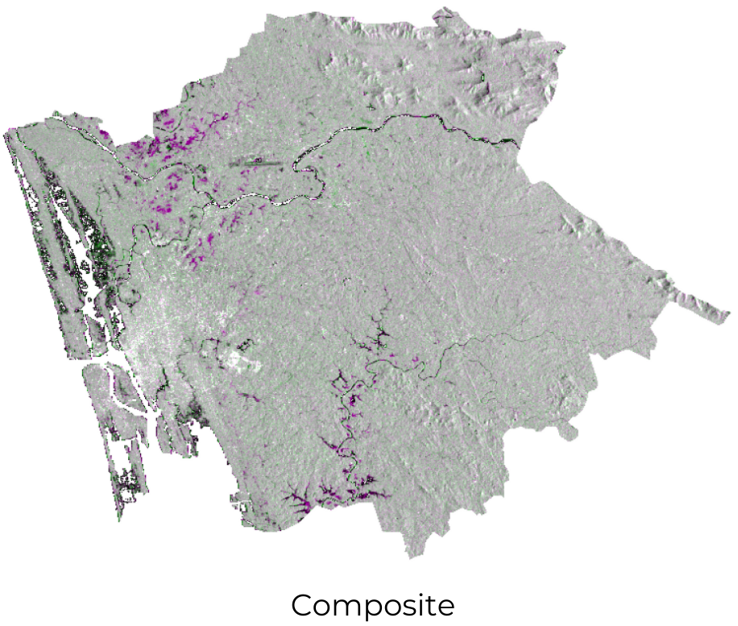
```

```{js eval=FALSE, code=readLines('code/gee_water_resources_management/05-Flood_Mapping/02c_Visualize_RGB_Composites_(exercise)')}
```

[Try in Code Editor &#8599;](https://code.earthengine.google.com/?scriptPath=users%2Fujavalgandhi%2FGEE-Water-Resources-Management%3A05-Flood_Mapping%2F02c_Visualize_RGB_Composites_(exercise)){target="_blank"}

## 03. Apply Speckle Filter

Any SAR image will be with noise. Speckle is like salt and pepper noise in the image. Before performing any operation, a filter is applied over the image to smooth it and reduce the noise. There are many types of filters. *RefinedLee* filter is a more scientific approach in filtering the noise.

The raw image should be passed into the `RefinedLee` function. Hence, the log image is converted to raw using the `toNatural` function. The resulting image from RefinedLee is again converted to log scale by passing it `toDB` function.

> Guido Lemoine implemented the RefinedLee filter in GEE. Keeping the Speckle filtering function at the end of any SAR processing script can be very handy for conversions and save time.

```{r echo=FALSE, fig.align='center', out.width='100%', fig.cap='Speckle Filter'}
knitr::include_graphics('images/gee_water_resources_management/flood_speckle.png')
```

```{js eval=FALSE, code=readLines('code/gee_water_resources_management/05-Flood_Mapping/03b_Apply_Speckle_Filter_(complete)')}
```

[Open in Code Editor &#8599;](https://code.earthengine.google.com/?scriptPath=users%2Fujavalgandhi%2FGEE-Water-Resources-Management%3A05-Flood_Mapping%2F03b_Apply_Speckle_Filter_(complete)){target="_blank"}

## 04. Apply a Threshold

A *difference* image can be created by dividing the *after image* by the *before image*. Then by considering a 25% change, we can select all the pixel values greater than 1.25. This 1.25 threshold is arbitrary, and it can be updated by trial and error for any region. In general, considering a 25% change as the initial assumption is common.

This threshold can be applied using the boolean function `gt()`. The resultant will be a binary image where a pixel value with *1* represents the flooded region.

```{r echo=FALSE, fig.align='center', out.width='75%', fig.cap='Flooded Area'}
knitr::include_graphics('images/gee_water_resources_management/flood_initialArea.png')
```

```{js eval=FALSE, code=readLines('code/gee_water_resources_management/05-Flood_Mapping/04b_Apply_a_Threshold_(complete)')}
```

[Open in Code Editor &#8599;](https://code.earthengine.google.com/?scriptPath=users%2Fujavalgandhi%2FGEE-Water-Resources-Management%3A05-Flood_Mapping%2F04b_Apply_a_Threshold_(complete)){target="_blank"}

### Exercise

This exercise script is adopted from UN-SPIDER's recommended approach to computing the flooded region. 

Compute the *difference* image by finding the difference between the after and before images. Use a threshold od -3 (arbitrary value) to identify the initial flooded regions. Click *Try in Code Editor* to view the complete script.

```{js eval=FALSE}
// There is an alternate way to detect change
// Since the S1_GRD collection has log-scaled DB values, subtract is more appropriate
// If you use subtract(), the threshold value also changes.

// Calculate afterFiltered - beforeFiltered
// Create a flood imagge using a threshold of -3
// Display the results with a 'purple' palette
```

[Try in Code Editor &#8599;](https://code.earthengine.google.com/?scriptPath=users%2Fujavalgandhi%2FGEE-Water-Resources-Management%3A05-Flood_Mapping%2F04c_Apply_a_Threshold_(exercise)){target="_blank"}


## 05. Apply Masks

The Initial flooded map shows all the areas where the possibility of water is logged. But this contains both noise and permanent water. We can mask out the other pixels based on our need to get the exact flooded area. In this exercise, we will mask

1. Permanent water. 

2. High degree slope area.

3. Isolated pixels.

The *permanent water* is detected using the GSW water dataset. The pixel with a [seasonality band](#exercise-10) greater than 5 is considered permanent water for this computation. Based on the ground information, this value can be changed. Using the `updateMask` function, we can mask out all the permanent water pixels.

The *slope* mask is created using the hydroSheds DEM dataset. The terrain slope can be calculated from the DEM using `ee.Algorithms.Terrain`. The areas with a slope greater than 5 degrees are selected and masked out. Mostly the water detected in this area is due to noise in the imagery.

The *isolated* pixel mask is done to reduce the noise. A single pixel detected as flood in the middle of nowhere  must probably be a noise. Hence, all the pixels with less than 8 connected neighbors can be considered noise and masked out. To identify the connected pixels, we can use the `connectedPixelCount` function to check the connectedness for a pixel in all possible directions. This function will return an image where each pixel has the number of connected pixel counts of the image passed to it. Then, using the boolean function `gt()`, select all the connected pixel count greater than 8.

After applying all the filters to the initial flooded area image, the remaining pixels can be considered an original flooded region.

> Although the computation for the mask is done between images with different resolutions, GEE will convert all the images to the images added in map canvas or resolution mentioned during export. In our case, all the images will be resampled and projected to Sentinel 1 GRD projection.

```{r echo=FALSE, fig.align='center', out.width='100%', fig.cap='Flood mask'}
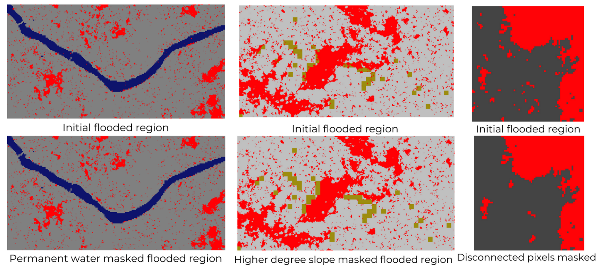
```

```{r echo=FALSE, fig.align='center', out.width='100%', fig.cap='Flooded region'}
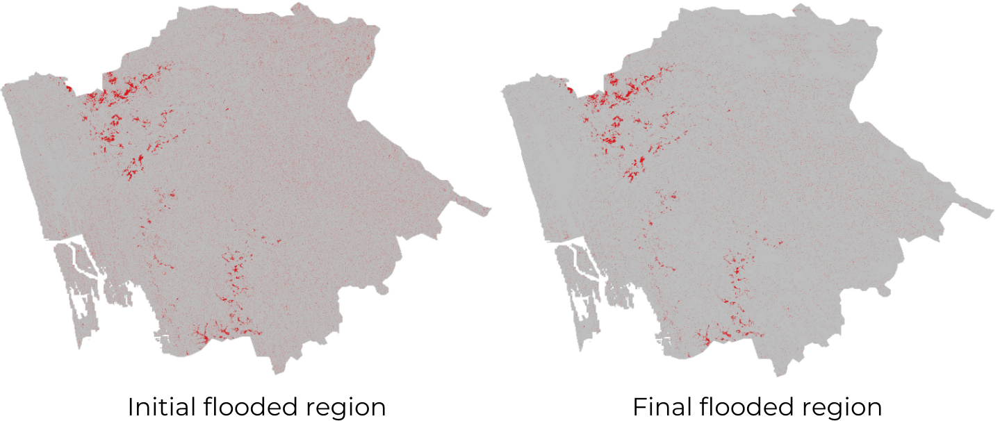
```

```{js eval=FALSE, code=readLines('code/gee_water_resources_management/05-Flood_Mapping/05b_Apply_Masks_(complete)')}
```

[Open in Code Editor &#8599;](https://code.earthengine.google.com/?scriptPath=users%2Fujavalgandhi%2FGEE-Water-Resources-Management%3A05-Flood_Mapping%2F05b_Apply_Masks_(complete)){target="_blank"}


### Exercise

We just learned to mask permanent water using the GSW water dataset. Now mask the cropland pixels extracted from the ESA worldview dataset and add the layer to canvas.

```{js eval=FALSE, code=readLines('code/gee_water_resources_management/05-Flood_Mapping/05c_Apply_Masks_(exercise)')}
```

[Try in Code Editor &#8599;](https://code.earthengine.google.com/?scriptPath=users%2Fujavalgandhi%2FGEE-Water-Resources-Management%3A05-Flood_Mapping%2F05c_Apply_Masks_(exercise)){target="_blank"}

## 06. Calculate Flooded Area

We visually inspected the flooded regions in the previous exercise, now lets us calculate the total flooded area in hectares and compute the percentage of the area flooded. We have already discussed the technique for [calculating area]((#calculating-area)) in the earth engine.

```{r echo=FALSE, fig.align='center', out.width='50%', fig.cap='Flooded area'}
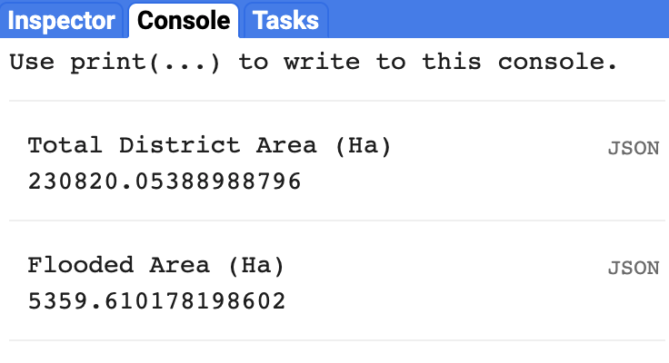
```

```{js eval=FALSE, code=readLines('code/gee_water_resources_management/05-Flood_Mapping/06b_Calculate_Flooded_Area_(complete)')}
```

[Open in Code Editor &#8599;](https://code.earthengine.google.com/?scriptPath=users%2Fujavalgandhi%2FGEE-Water-Resources-Management%3A05-Flood_Mapping%2F06b_Calculate_Flooded_Area_(complete)){target="_blank"}

### Exercise

Printing the results in the console may timeout for more extensive computations. Convert the flood area numeric value as Feature Collection and export the area as a CSV file. The technique to export numeric values is discussed in [Exporting Classified Result.](#exporting-classification-results)

```{js eval=FALSE}
// Export the result as a CSV
// Export the fc as a CSV
```
[Try in Code Editor &#8599;](https://code.earthengine.google.com/?scriptPath=users%2Fujavalgandhi%2FGEE-Water-Resources-Management%3A05-Flood_Mapping%2F06c_Calculate_Flooded_Area_(exercise)){target="_blank"}

# 06 Drought Monitoring

There are many definitions for drought, depending on the context used. Monitoring and calculating the impact of drought in large sales is quite tedious without remote sensing data. In this module, we will learn to calculate the *Impact of Hydrological drought* using the MODIS data product.

[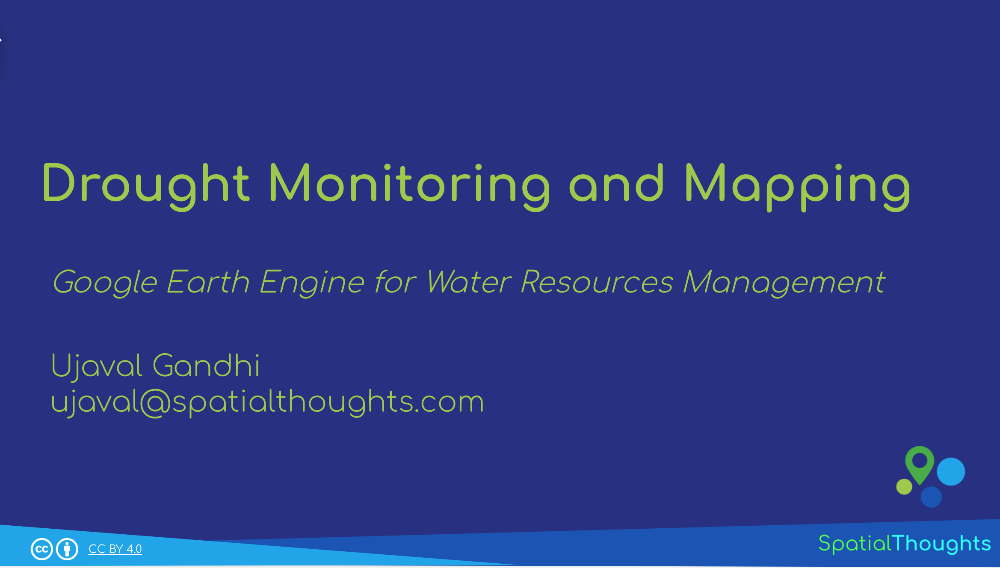{width="400px"}](https://docs.google.com/presentation/d/1xdq172hcxkcjlHNexxankLRx6q60Py6VepNB3M9nepM/edit?usp=sharing){target="_blank"}

[View the Presentation &#8599;](https://docs.google.com/presentation/d/1xdq172hcxkcjlHNexxankLRx6q60Py6VepNB3M9nepM/edit?usp=sharing){target="_blank"}

> Apart from *Hydrological drought*, another common drought is the *Metrological drought*. To track the meteorological drought, rainfall deviation should be calculated. To know more about it, visit [Spatial Thought YouTube.](https://www.youtube.com/playlist?list=PLppGmFLhQ1HJ5VhW6BZfhPX6spUcTY7SR)

## 01. Load MODIS NDVI

[MODIS Moderate Resolution Imaging Spectroradiometer](https://modis.gsfc.nasa.gov/about/) has many derived products apart from the raw imagery captured every day. There are 2 satellite sensors, Terra and Aqua. The raw images from these satellites are used to produce different data products categorized as *Atmospheric products, Land products, Cryosphere products,* and *Ocean Products*. We will use the 16-day composite NDVI data at 250m resolution for this exercise. Also, MODIS follows a unique naming pattern, which helps identify the data.

The product which we use in this exercise is ``MOD13Q1.061``.

| Name     | Meaning                                                                        | 
| :------- |:-------------------------------------------------------------------------------|
| MOD      | Terra  sensor                                                                  | 
| 13Q1     | Vegetation Index at 250m                                                       | 
| 061     | Version number (*use the latest version available at the time of computation*) |

Load the *Terra Vegetation Indices* at 250m resolution and filter the collection from *2010* to *2020*. Each image has 12 bands, in which `NDVI` and `EVI` are the two vegetation indices bands, other bands contain additional information about the data at pixel level. NDVI is used to monitor vegetation, but for very thick vegetation like dense forest, NDVI value will saturate, and no helpful information can be derived. EVI is used to track and monitor thick vegetation cover.

```{js eval=FALSE, code=readLines('code/gee_water_resources_management/06-Drought_Monitoring/01b_Load_MODIS_NDVI_(complete)')}
```

[Open in Code Editor &#8599;](https://code.earthengine.google.co.in/?scriptPath=users%2Fujavalgandhi%2FGEE-Water-Resources-Management%3A06-Drought_Monitoring%2F01b_Load_MODIS_NDVI_(complete)){target="_blank"}

### Exercise 

Add the first image to the map be visualizing it using a suitable color palette. 

```{r echo=FALSE, fig.align='center', out.width='50%', fig.cap='Visualized MODIS NDVI Image over Australia'}
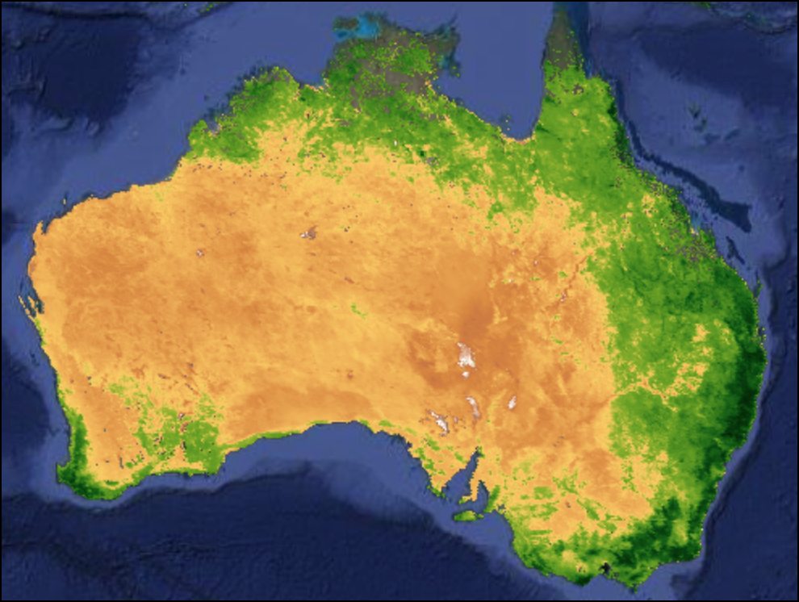
```


```{js eval=FALSE, code=readLines('code/gee_water_resources_management/06-Drought_Monitoring/01c_Load_MODIS_NDVI_(exercise)')}
```

[Try in Code Editor &#8599;](https://code.earthengine.google.co.in/?scriptPath=users%2Fujavalgandhi%2FGEE-Water-Resources-Management%3A06-Drought_Monitoring%2F01c_Load_MODIS_NDVI_(exercise)){target="_blank"}

## 02. Apply Cloud Mask

Every image has another band ``Summary QA``, and this band contains pixel-level information about the quality of data. We want to keep only the pixels with bit values 0 or 1. We will use the ``.leftShift()`` to create the bitmask for selecting good quality data.

> Bitmasking itself is a complex topic of discussion. Read the blog on [Working with QA Bands and Bitmasks](https://spatialthoughts.com/2021/08/19/qa-bands-bitmasks-gee/) to know more about it.

```{r echo=FALSE, fig.align='center', out.width='50%'}

```


```{js eval=FALSE, code=readLines('code/gee_water_resources_management/06-Drought_Monitoring/02b_Apply_Cloud_Mask_(complete)')}
```
[Open in Code Editor &#8599;](https://code.earthengine.google.co.in/?scriptPath=users%2Fujavalgandhi%2FGEE-Water-Resources-Management%3A06-Drought_Monitoring%2F02b_Apply_Cloud_Mask_(complete)){target="_blank"}

```{r echo=FALSE, fig.align='center', out.width='50%', fig.cap='Snow/Cloud Masked MODIS NDVI'}
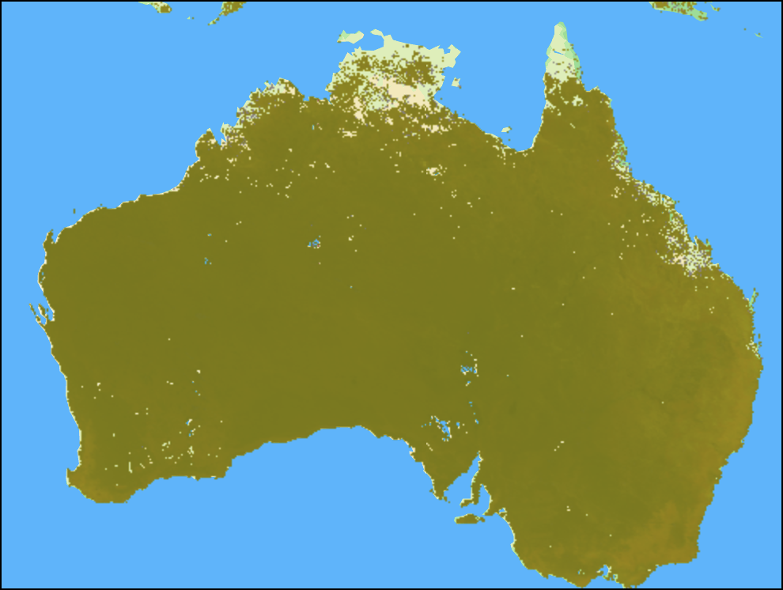
```

### Exercise 

Use the cloud masking function, pass the filtered collection to get good quality data. 

```{js eval=FALSE}
// Apply cloud mask to all images in the filtered collection
```
[Try in Code Editor &#8599;](https://code.earthengine.google.co.in/?scriptPath=users%2Fujavalgandhi%2FGEE-Water-Resources-Management%3A06-Drought_Monitoring%2F02c_Apply_Cloud_Mask_(exercise)){target="_blank"}

## 03. Extract and Scale NDVI Band

The *NDVI* value will be a decimal number ranging between ``-2`` to ``1``. But in GEE, each NDVI pixel value ranges between ``-20000`` to ``10000``. This is done to use the storage effectively because an integer number will take less storage when compared to a floating-point number. Hence, each pixel value is multiplied by ``10,000`` and stored as int. Before using these pixel values for analysis, we can divide each pixel with the same scale factor as down-scaling to get the original pixel value. We can find this scale factor information in the data catalog under the band’s section. 

To down-scale each image, we need to pass the image collection into a function and compute the value for each image. Any computation on the image will result in a new image with no metadata like *system:timestart* of the original image without which timeseries charting is impossible. So, before returning the image from the function, we can carry over the required properties using the ``.copyProperties()`` function.

```{js eval=FALSE, code=readLines('code/gee_water_resources_management/06-Drought_Monitoring/03b_Extract_and_Scale_NDVI_Band_(complete)')}
```

[Open in Code Editor &#8599;](https://code.earthengine.google.co.in/?scriptPath=users%2Fujavalgandhi%2FGEE-Water-Resources-Management%3A06-Drought_Monitoring%2F03b_Extract_and_Scale_NDVI_Band_(complete)){target="_blank"}

### Exercise 

Add the scaled image to the map canvas using a suitable visualization parameter. Inspect any pixel and check the NDVI value. 

```{r echo=FALSE, fig.align='center', out.width='50%', fig.cap='Masked and Scaled MODIS NDVI'}
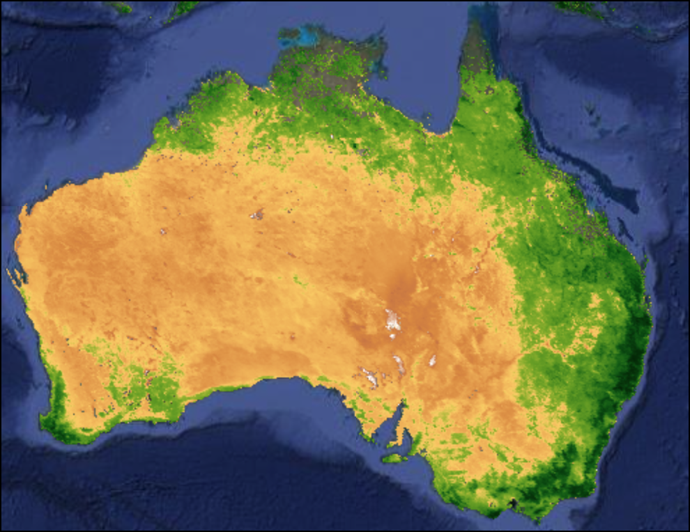
```

```{js eval=FALSE}
// Extract 1 image from the ndviScaled collection
// Visualize it and add it to the map
```

[Try in Code Editor &#8599;](https://code.earthengine.google.co.in/?scriptPath=users%2Fujavalgandhi%2FGEE-Water-Resources-Management%3A06-Drought_Monitoring%2F03c_Extract_and_Scale_NDVI_Band_(exercise)){target="_blank"}

## 04. Create Monthly Images

The MODIS Vegetation Indices is a 16-day composite, and it cannot be standardized in a calendar unit. So let's create one image per month by aggregating all the images in the month as a *mean* composite. To filter the collection for with *year, month, day* level ``ee.Filter.calenderRange()`` function should be use. 

We should use a nested map function to map the years first then the months in the inner map function. The inner months map will return a Feature Collection, which results in a *Feature collection of Feature Collection* when returned by the outer years function. A Feature collection can contain only Features but not Feature Collection. Hence we can use the ``.flatten()`` algorithm with the outer years map function to convert  *Feature collection of Feature Collection* to *Feature Collection with List of Features*.

For an 11-year time series, we will create a final output of 132 (11 x 12) images.

```{r echo=FALSE, fig.align='center', out.width='50%'}
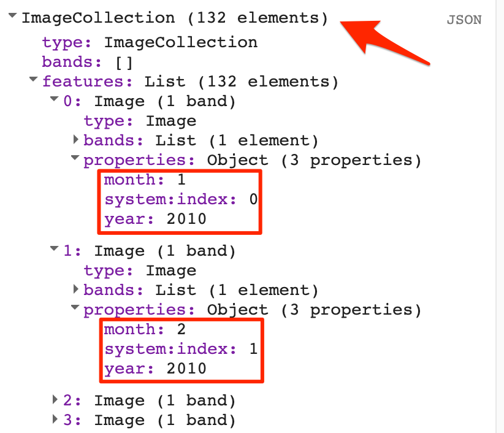
```

```{js eval=FALSE, code=readLines('code/gee_water_resources_management/06-Drought_Monitoring/04b_Create_Monthly_Images_(complete)')}
```

[Open in Code Editor &#8599;](https://code.earthengine.google.co.in/?scriptPath=users%2Fujavalgandhi%2FGEE-Water-Resources-Management%3A06-Drought_Monitoring%2F04b_Create_Monthly_Images_(complete)){target="_blank"}

### Exercise 

The final output will be a list of images, convert this into an ImageCollection. 

[Try in Code Editor &#8599;](https://code.earthengine.google.co.in/?scriptPath=users%2Fujavalgandhi%2FGEE-Water-Resources-Management%3A06-Drought_Monitoring%2F04c_Create_Monthly_Images_(exercise)){target="_blank"}


## 05. Calculate Min Max Composites

To compute the VCI, we need to calculate each month's minimum NDVI and maximum NDVI values. The ``min()`` and ``max()`` reducers are used to compute image collections for the creation of minimum and maximum NDVI values.

```{js eval=FALSE, code=readLines('code/gee_water_resources_management/06-Drought_Monitoring/05b_Calculate_Min_Max_Composites_(complete)')}
```

[Open in Code Editor &#8599;](https://code.earthengine.google.co.in/?scriptPath=users%2Fujavalgandhi%2FGEE-Water-Resources-Management%3A06-Drought_Monitoring%2F05b_Calculate_Min_Max_Composites_(complete)){target="_blank"}

### Exercise 

Add the min and max NDVI images to map canvas using a suitable visualization parameter for the month of **May**.


```{r echo=FALSE, fig.align='center', out.width='100%', fig.cap='Historic Minimum and Maximum NDVI for the Month of May'}
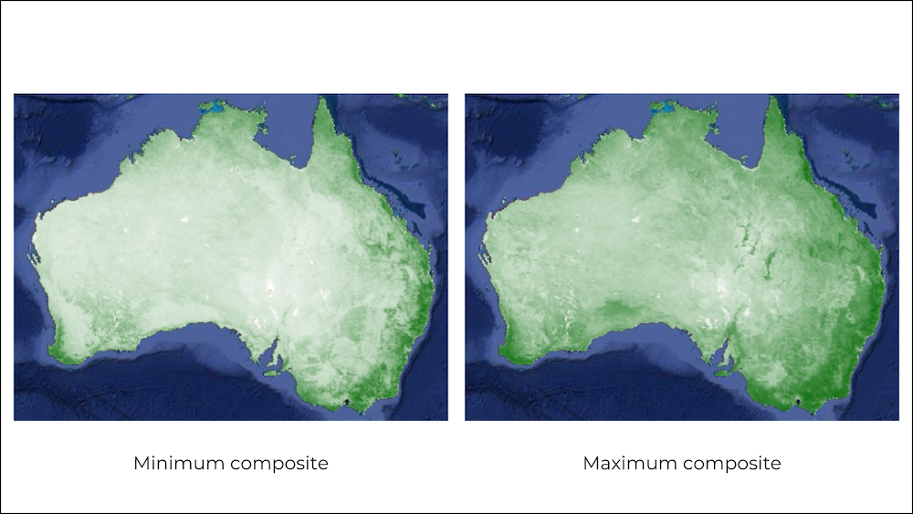
```

```{js eval=FALSE}
// Extract 1 image from the ndviScaled collection
// Visualize it and add it to the map
```

[Try in Code Editor &#8599;](https://code.earthengine.google.co.in/?scriptPath=users%2Fujavalgandhi%2FGEE-Water-Resources-Management%3A06-Drought_Monitoring%2F05c_Calculate_Min_Max_Composites_(exercise)){target="_blank"}

## 06. Calculate VCI

Vegetation Condition Index (VCI) is a drought monitoring index that takes the previous year's minimum and maximum NDVI values at a particular area and compares it against the current NDVI value to identify if the area is experiencing drought. As recommended by [Un-Spider - Drought Monitoring Recommended Practice](https://un-spider.org/book/export/html/9206) VCI value of less than 40 % can be considered as drought.


```{r echo=FALSE, fig.align='center', out.width='50%', fig.cap='VCI Formula'}
knitr::include_graphics('images/gee_water_resources_management/vci_formula.png')
```


```{js eval=FALSE, code=readLines('code/gee_water_resources_management/06-Drought_Monitoring/06b_Calculate_VCI_(complete)')}
```

[Open in Code Editor &#8599;](https://code.earthengine.google.co.in/?scriptPath=users%2Fujavalgandhi%2FGEE-Water-Resources-Management%3A06-Drought_Monitoring%2F06b_Calculate_VCI_(complete)){target="_blank"}


```{r echo=FALSE, fig.align='center', out.width='50%', fig.cap='VCI for the Month of May'}
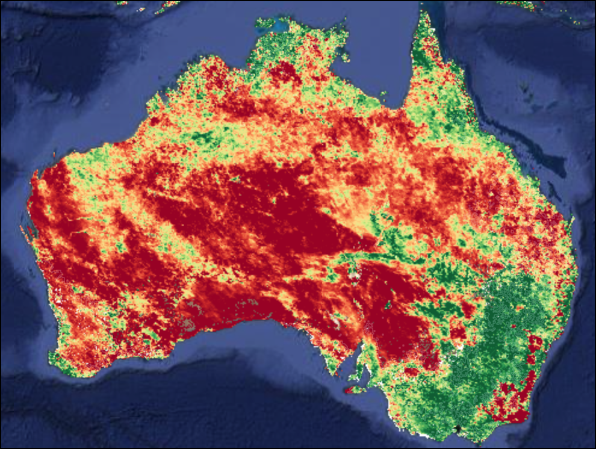
```

### Exercise 

As VCI uses the NDVI index to compute the impact on agriculture. NDVI over non-croplands do not make sense and should be excluded from VCI calculation. Use the [Global Food-Support Analysis Data](https://developers.google.com/earth-engine/datasets/catalog/USGS_GFSAD1000_V1) and mask all non-cropland areas.

[Try in Code Editor &#8599;](https://code.earthengine.google.co.in/?scriptPath=users%2Fujavalgandhi%2FGEE-Water-Resources-Management%3A06-Drought_Monitoring%2F06c_Calculate_VCI_(exercise)){target="_blank"}

## 07. Classify VCI Image

Let us classify the VCI image into 3 categories: Good, Fair, and Poor. To select a range of values, we can use the [boolean operators](https://courses.spatialthoughts.com/gee-water-resources-management.html#computation-on-images). We can use the ``.where()`` function to perform this over an image.

```{js eval=FALSE, code=readLines('code/gee_water_resources_management/06-Drought_Monitoring/07b_Classify_VCI_Image_(complete)')}
```

[Open in Code Editor &#8599;](https://code.earthengine.google.co.in/?scriptPath=users%2Fujavalgandhi%2FGEE-Water-Resources-Management%3A06-Drought_Monitoring%2F07b_Classify_VCI_Image_(complete)){target="_blank"}

```{r echo=FALSE, fig.align='center', out.width='50%', fig.cap='Masked and Classified VCI Image'}
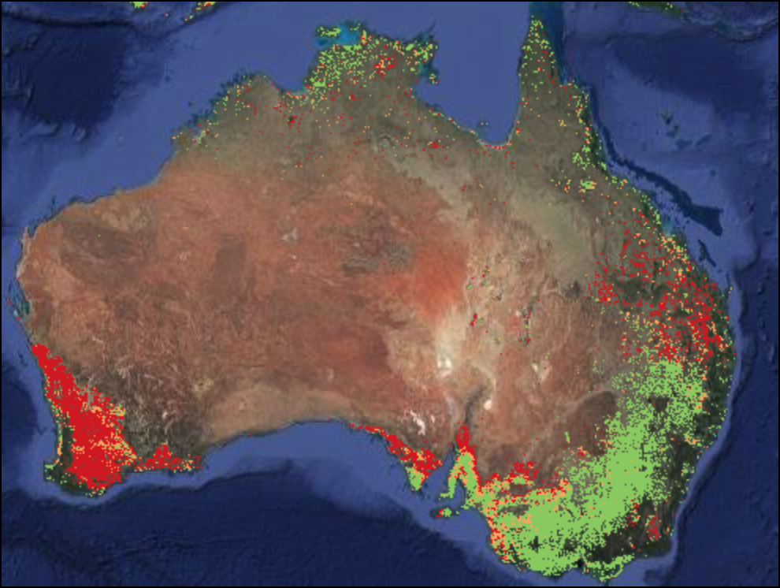
```

### Exercise 

Extract all pixels representing Poor VCI (Value = 1) from the classified VCI image. Apply a Mask and display the regions in 'red' color.

[Try in Code Editor &#8599;](https://code.earthengine.google.co.in/?scriptPath=users%2Fujavalgandhi%2FGEE-Water-Resources-Management%3A06-Drought_Monitoring%2F07c_Classify_VCI_Image_(exercise)){target="_blank"}


# 07 Earth Engine Apps

A simple yet powerful application of GEE is the building App. We can build these apps to share the work with others as a working model instead of a static report. Earth Engine Apps uses JavaScript internally. This module will introduce you to GEE Apps by creating Surface Water Explorer App.

[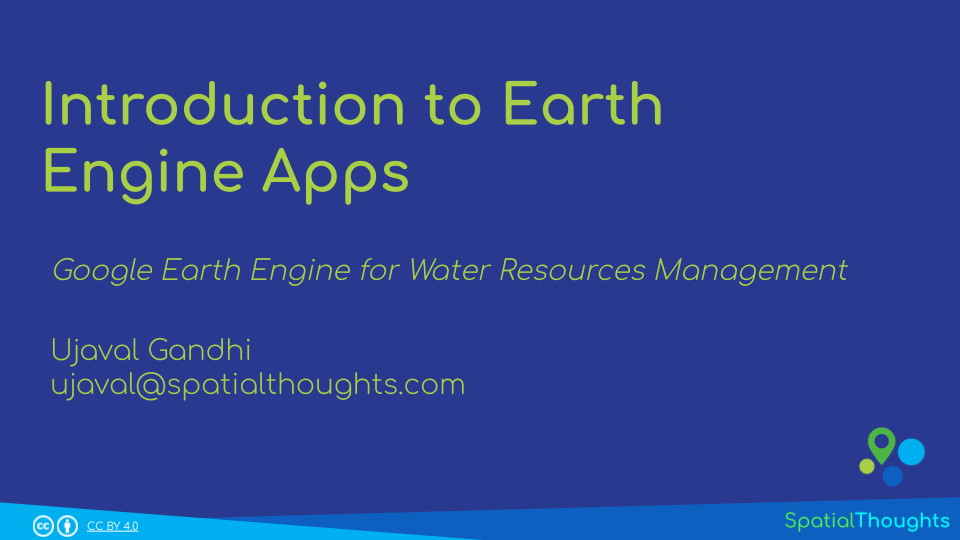{width="400px"}](https://docs.google.com/presentation/d/1B4NiKObQpmL29yLk7CHR5lVu706TVNkWjqOtngP1wl8/edit?usp=sharing){target="_blank"}

[View the Presentation &#8599;](https://docs.google.com/presentation/d/1B4NiKObQpmL29yLk7CHR5lVu706TVNkWjqOtngP1wl8/edit?usp=sharing){target="_blank"}


## 01. Client vs Server

The User Interface elements in your Code Editor - Map View, Drawing Tools etc. are 'client-side' elements. They run in YOUR browser. Image Collections, feature collections, calculations on Earth Engine objects etc. are 'server-side' elements. They run in Google's data center. You cannot mix both these objects. To learn more, visit the [Client vs. Server](https://developers.google.com/earth-engine/guides/client_server) section of the Earth Engine User Guide.

* To convert client-side objects to server-side objects, you can use the appropriate API function. Server-side functions start with `ee.`, such `ee.Date()`, `ee.Image()` etc.
* To convert server-side objects to client-side objects, you can call `.getInfo()` on am Earth Engine object. For the Python API, this is the only way to extract information from a server-side object, but the Javascript API provides a better (and preferred) - method for bring server-side objects to client-side using the `evaluate()` method. This method asynchronously retrieves the value of the object, without blocking the user interface - meaning it will let your code continue to execute while it fetches the value. 

```{js eval=FALSE, code=readLines('code/gee_water_resources_management/07-Earth_Engine_Apps/01b_Client_vs_Server_(complete)')}
```

[Open in Code Editor &#8599;](https://code.earthengine.google.co.in/?scriptPath=users%2Fujavalgandhi%2FGEE-Water-Resources-Management%3A07-Earth_Engine_Apps%2F01b_Client_vs_Server_(complete)){target="_blank"}

## 02. Building an App with UI Widgets

Earth Engine comes with a User Interface API that allows you to build an interactive web application powered by Earth Engine. Building a web mapping application typically requires the skills of a full stack developer and are out of reach for most analysts and scientists. But the Earth Engine User Interface API makes this process much more accessible by providing ready-to-use widgets, such as Buttons, Drop-down Menus, Sliders etc. - and free cloud hosting to allow anyone to publish an app with just a few lines of code. 

The apps run in your browser, so they need to use *client-side* functions. All the user interface functions are contained in the `ui.` package - such as `ui.Select()`, `ui.Button()`. You can create those elements by calling these functions with appropriate parameters. The main container object is the `ui.Panel()` which can contain different types of widgets. Learn more in the [Earth Engine User Interface API](https://developers.google.com/earth-engine/guides/ui) section of the Earth Engine User Guide.

The code below shows how to build an app called Surface Water Explorer that allows anyone to pick a district in Karnataka, India then load the *JRC Yearly Water Classification History* of the district. . 

### Publishing the App. 

We can publish the app to be viewed by anyone regardless of having an account in the earth engine. Click the *Apps* button in the top left of the script panel and click *New apps* in the *Manage Apps* dialog. In the *Publish New App* dialog, give an app's name, a public URL will be generated by which we can access the app. Then if you do not have a GCP account, create one and select a project in which you should publish the app. Then with the default settings, click *Publish.* It will take a few minutes for the earth engine to process your request. After that, your Geo APP will be up and running on the GCP server. 

```{r echo=FALSE, fig.align='center', out.width='75%'}

```


```{js eval=FALSE, code=readLines('code/gee_water_resources_management/07-Earth_Engine_Apps/02b_Building_an_App_with_UI_Widgets_(complete)')}
```

[Open in Code Editor &#8599;](https://code.earthengine.google.co.in/?scriptPath=users%2Fujavalgandhi%2FGEE-Water-Resources-Management%3A07-Earth_Engine_Apps%2F02b_Building_an_App_with_UI_Widgets_(complete)){target="_blank"}

### Exercise 

Create the app for your location. 

```{js eval=FALSE}
// Change the ADM2_NAME to a State/Provice in your region
// Change the Map.setCenter to center the map on the chosen region
// Test the App

```

[Try in Code Editor &#8599;](https://code.earthengine.google.co.in/?scriptPath=users%2Fujavalgandhi%2FGEE-Water-Resources-Management%3A07-Earth_Engine_Apps%2F02c_Building_an_App_with_UI_Widgets_(exercise)){target="_blank"}

## 03. Performing Calculations 

We can also perform calculations based on user input, and we can do this by using the *onChange* and ``evaluate()`` function. Any UI algorithm that accepts user information will have an option called *onChange*, and this will initiate a function if the user changes the value. We need to perform calculations only after the data is retrieved for user inputs, and this can be done using the *evaluate* function, which works asynchronously without affecting other computations.

```{r echo=FALSE, fig.align='left', out.width='70%'}
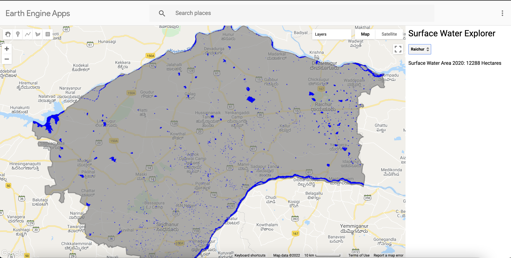
```

[Explore App &#8599;](https://santhosh-m.users.earthengine.app/view/surface-water-app){target="_blank"}

```{js eval=FALSE, code=readLines('code/gee_water_resources_management/07-Earth_Engine_Apps/03b_Performing_Calculations_(complete)')}
```

[Open in Code Editor &#8599;](https://code.earthengine.google.co.in/?scriptPath=users%2Fujavalgandhi%2FGEE-Water-Resources-Management%3A07-Earth_Engine_Apps%2F03b_Performing_Calculations_(complete)){target="_blank"}

### Exercise 

Before publishing your app, add your name as Autor. 

```{js eval=FALSE}
// Add a new panel called authorPanel
// Add a new label called authorLabel with your name
// Add the authorLabel to authorPanel
// Add the authorPanel to the mainPanel
// Test the app
```

[Try in Code Editor &#8599;](https://code.earthengine.google.co.in/?scriptPath=users%2Fujavalgandhi%2FGEE-Water-Resources-Management%3A07-Earth_Engine_Apps%2F03c_Performing_Calculations_(exercise)){target="_blank"}

# Supplement 

## Drought Monitoring

### Pie Chart Group Statistics 

```{js eval=FALSE, code=readLines('code/gee_water_resources_management/Supplement/Drought_Monitoring/Pie_Chart_Group_Statistics')}
```


## Hydrology

### Chart Cumulative Rainfall

```{js eval=FALSE, code=readLines('code/gee_water_resources_management/Supplement/Hydrology/Chart_Cumulative_Rainfall')}
```

### Exporting Precipitation Data

```{js eval=FALSE, code=readLines('code/gee_water_resources_management/Supplement/Hydrology/Exporting_Precipitation_Data')}
```

### GPM Precipitation Time Series

```{js eval=FALSE, code=readLines('code/gee_water_resources_management/Supplement/Hydrology/GPM_Precipitation_Time_Series')}
```

### IMD Number of Rainy Days 

```{js eval=FALSE, code=readLines('code/gee_water_resources_management/Supplement/Hydrology/IMD_Number_of_Rainy_Days')}
```

## Surface Water

### Detect First Year of Water

```{js eval=FALSE, code=readLines('code/gee_water_resources_management/Supplement/Surface_Water/Detect_First_Year_of_Water')}
```

### Otsu Dynamic Thresholding

```{js eval=FALSE, code=readLines('code/gee_water_resources_management/Supplement/Surface_Water/Otsu_Dynamic_Thresholding')}
```

### Smoothing Vectors 

```{js eval=FALSE, code=readLines('code/gee_water_resources_management/Supplement/Surface_Water/Smoothing_Vectors')}
```

### Surface Water Explorer Split Panel App

```{js eval=FALSE, code=readLines('code/gee_water_resources_management/Supplement/Surface_Water/Surface_Water_Explorer_Split_Panel_App')}
```

### Unsupervised Clustering Basic

```{js eval=FALSE, code=readLines('code/gee_water_resources_management/Supplement/Surface_Water/Unsupervised_Clustering_Basic')}
```

### Unsupervised Clustering Advanced 


```{js eval=FALSE, code=readLines('code/gee_water_resources_management/Supplement/Surface_Water/Unsupervised_Clustering_Advanced')}
```

## SAR

### Sentinel-1 ARD Pre-Processing

This example script shows how to apply a Gamma MAP (Maximum A-posterior) Speckle Filter and Radiometric Terrain Correction to Sentinel-1 images using the Analysis Ready Data (ARD) preparation framework published by Mullissa, A. et. al.

```{r echo=FALSE, fig.align='center', out.width='100%', fig.cap='Gamma MAP Speckle filtering'}
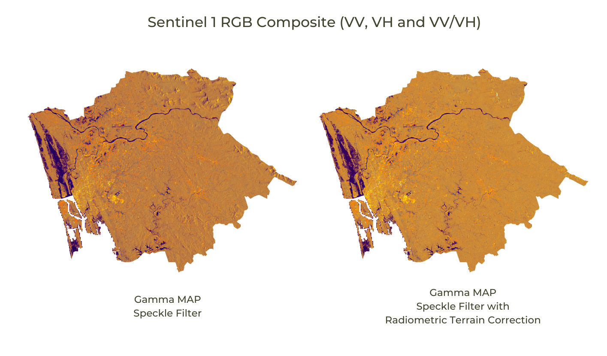
```

```{js eval=FALSE, code=readLines('code/gee_water_resources_management/Supplement/SAR/S1_ARD_Preprocessing')}
```

## Time Series Analysis

### Mann Kendall Test

```{js eval=FALSE, code=readLines('code/gee_water_resources_management/Supplement/Time_Series_Analysis/Mann_Kendall_Test')}
```


# Data Credits

* **Sentinel-2 Level-1C, Level-2A** and **Sentinel-1 SAR GRD**: Contains Copernicus Sentinel data.
* **TerraClimate: Monthly Climate and Climatic Water Balance for Global Terrestrial Surfaces, University of Idaho**: Abatzoglou, J.T., S.Z. Dobrowski, S.A. Parks, K.C. Hegewisch, 2018, Terraclimate, a high-resolution global dataset of monthly climate and climatic water balance from 1958-2015, Scientific Data 5:170191, doi:10.1038/sdata.2017.191

* **FAO GAUL 500m: Global Administrative Unit Layers 2015, Second-Level Administrative Units**: Source of Administrative boundaries: The Global Administrative Unit Layers (GAUL) dataset, implemented by FAO within the CountrySTAT and Agricultural Market Information System (AMIS) projects.
* **CHIRPS Pentad: Climate Hazards Group InfraRed Precipitation with Station Data (version 2.0 final)**: Funk, Chris, Pete Peterson, Martin Landsfeld, Diego Pedreros, James Verdin, Shraddhanand Shukla, Gregory Husak, James Rowland, Laura Harrison, Andrew Hoell & Joel Michaelsen. "The climate hazards infrared precipitation with stations—a new environmental record for monitoring extremes". Scientific Data 2, 150066. doi:10.1038/sdata.2015.66 2015.
* **MOD13Q1.006 Terra Vegetation Indices 16-Day Global 250m**: Didan, K. (2015). <i>MOD13Q1 MODIS/Terra Vegetation Indices 16-Day L3 Global 250m SIN Grid V006</i> [Data set]. NASA EOSDIS Land Processes DAAC. Accessed 2021-05-06 from https://doi.org/10.5067/MODIS/MOD13Q1.006

# License

The course material (text, images, presentation, videos) is licensed under a [Creative Commons Attribution 4.0 International License](https://creativecommons.org/licenses/by/4.0/).

The code (scripts, Jupyter notebooks) is licensed under the MIT License. For a copy, see https://opensource.org/licenses/MIT

Kindly give appropriate credit to the original author as below:

Copyright &copy; 2021 Ujaval Gandhi [www.spatialthoughts.com](https://spatialthoughts.com)


# Citing and Referencing

You can cite the course materials as follows

* Gandhi, Ujaval, 2021. *Google Earth Engine for Water Resources Management* Course. Spatial Thoughts. https://courses.spatialthoughts.com/gee-water-resources-management.html

***

**This course is offered as an instructor-led online class. Visit [Spatial Thoughts](https://spatialthoughts.com/events/) to know details of upcoming sessions.**
