\newpage

***

```{r echo=FALSE, fig.align='center', out.width='75%', out.width='250pt'}
knitr::include_graphics('images/spatial_thoughts_logo.png')
```

***

\newpage

# Introduction 

This workshop is a gentle introduction to Git, GitHub and Web Development with the goal of creating and publishing a personal portfolio website. We will start with a ready-to-use portfolio website template for geospatial professionals and learn how to edit and set up your GitHub repository to publish your website. We will cover best practices on leveraging LLM-based AI assistants to extract and format content from existing documents and populate the portfolio.

At the end of the workshop, you will have a beautiful, modern and customized portfolio website that is hosted for free on GitHub Pages and ready to be shared with your network. 

**No prior experience with Git or GitHub is required.**

This workshop will cover the following topics:

- Introduction to GitHub and GitHub pages
- Introduction to Static Site Generators
- Fundamentals of Markdown
- Introduction to MkDocs
- Use of AI-Assistants to automatically extract and format content from your CV and Project Reports
- Setting up a local development environment and advanced customization

We will use the [MkDocs](https://www.mkdocs.org/) static site generator with [Material theme](https://squidfunk.github.io/mkdocs-material/) that creates modern responsive website from Markdown-formatted content.

[{width="400px"}](https://spatialthoughts.github.io/){target="_blank"}

[View Example Portfolio Website &#8599; ](https://spatialthoughts.github.io/)


----

# Installation and Preparation

## Sign-up for GitHub

Visit [GitHub.com](https://github.com/) and create a free account. If you already have an account, skip this step.

## Install Git and GitHub CLI

Follow our [Git and GitHub CLI Installation Guide](install-git-github.html) install and configure Git and GitHub CLI.

## Install Conda

We will use conda to install the required Python packages and manage local development environment. 

Follow our step-by-step [Conda Installation Guide](install-conda.html) to install Miniconda for your operating system.

## Install Visual Studio Code

We recommend Visual Studio Code (VS Code) editor for this workshop. 

Follow our step-by-step [Visual Studio Code Installation Guide](install-vscode.html) to install and configure VS Code on your system.

## Sign-up for Claude

We rely heavily on LLM-based AI assistants for populating the content of your portfolio. If you already have a favorite coding assistant (ChatGPT, Microsoft Copilot etc.), you may use it for this workshop. However, we strongly recommend using Claude. You can sign-up for a free account using the instructions below.

1. Visit [Claude AI](https://claude.ai/) and sign-up for an account. Select the *Free* plan.

```{r echo=FALSE, fig.align='center', out.width='75%'}
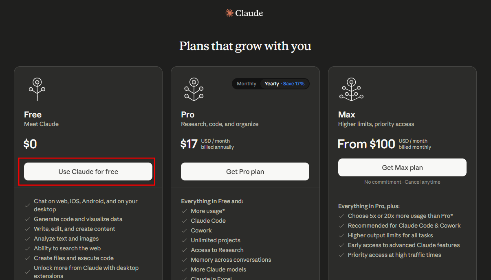
```

2. For this workshop, we will be using the web interface.  Click *Skip* when prompted to install the app.

```{r echo=FALSE, fig.align='center', out.width='75%'}
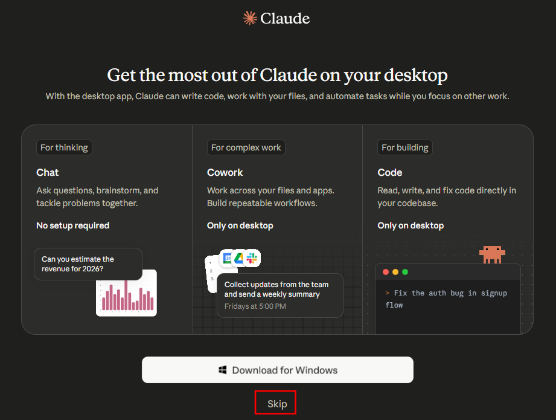
```

## Prepare Content for the Portfolio

Before you start building the portfolio, it will be helpful to have the following items saved to a local directory on your computer.

* **Profile Picture**: Save your preferred profile photo as a PNG file named `profile.png`. Preferably 300px x 300px in size.
* **Homepage Picture**: A photo for the *About Me* section. Save a photo you would like to use on the homepage as a PNG file named `about.png`. Maximum 500px width.
* **Your Resume/CV**: Save a copy of your CV as a PDF file named `[YOUR NAME]-CV.pdf`. If your name is John, the file would be `John-CV.pdf`.
* **Project Artifacts**: Project Reports, Jupyter Notebooks or any other data relating to the projects you would like to showcase in the portfolio.


# 1. Basics of Git, GitHub and Web Development

[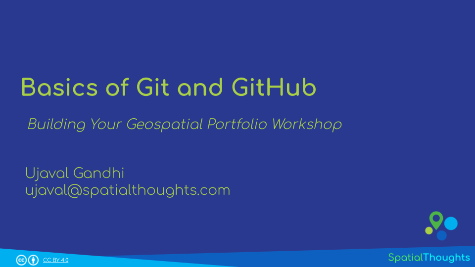{width="400px"}](https://docs.google.com/presentation/d/1gPhdcBnQPbQLWJTkW2xqbuL9O-xT5E00iW625dGprP4/edit?usp=sharing)

[View the Presentation &#8599;](https://docs.google.com/presentation/d/1gPhdcBnQPbQLWJTkW2xqbuL9O-xT5E00iW625dGprP4/edit?usp=sharing){target="_blank"}


# 2. Setting up Your Local Development Environment

In this section, we will clone your GitHub repository to the computer, install the required packages, and start a local preview server.

1. Login to your GitHub account. Go to the template repository at https://github.com/spatialthoughts/portfolio-website-template/. Go to **Use this template &rarr; Create a new repository**.

```{r echo=FALSE, fig.align='center', out.width='75%'}
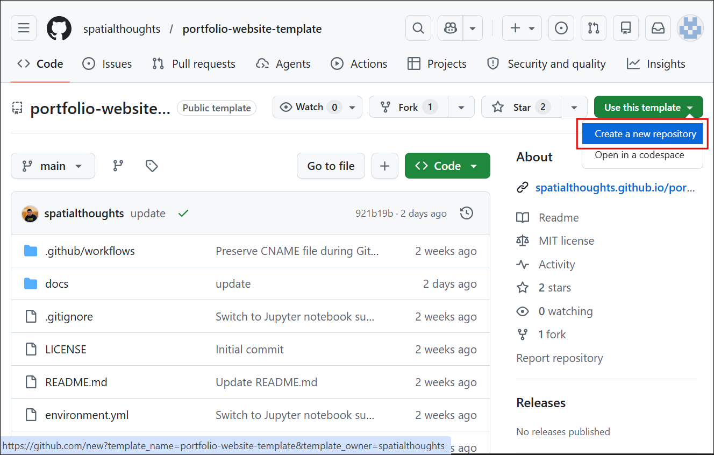
```

2. Under *General*, enter the `Repository name`. To use GitHub Pages for free at https://your-username.github.io, name the repository exactly as `your-username.github.io` (replace your-username with your actual GitHub username). For example, if the github username is `spatialthoughts`, the repository name should be `spatialthoughts.github.io`. This is a special repository naming pattern that GitHub uses to publish the site at the root of your GitHub pages . Optionally, you may use any other name and the the site will be published at https://your-username.github.io/your-repository-name. Leave all other options as-is and click *Create Repository*.

```{r echo=FALSE, fig.align='center', out.width='75%'}
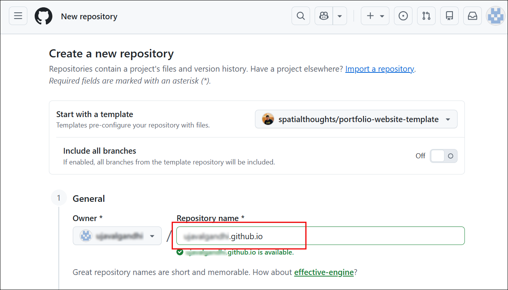
```

3. In your GitHub repository, click the *Code* button and copy the repository URL shown for *HTTPS*. The URL should be in the form `https://github.com/<your-username>/<your-username>.github.io.git`.

```{r echo=FALSE, fig.align='center', out.width='75%'}
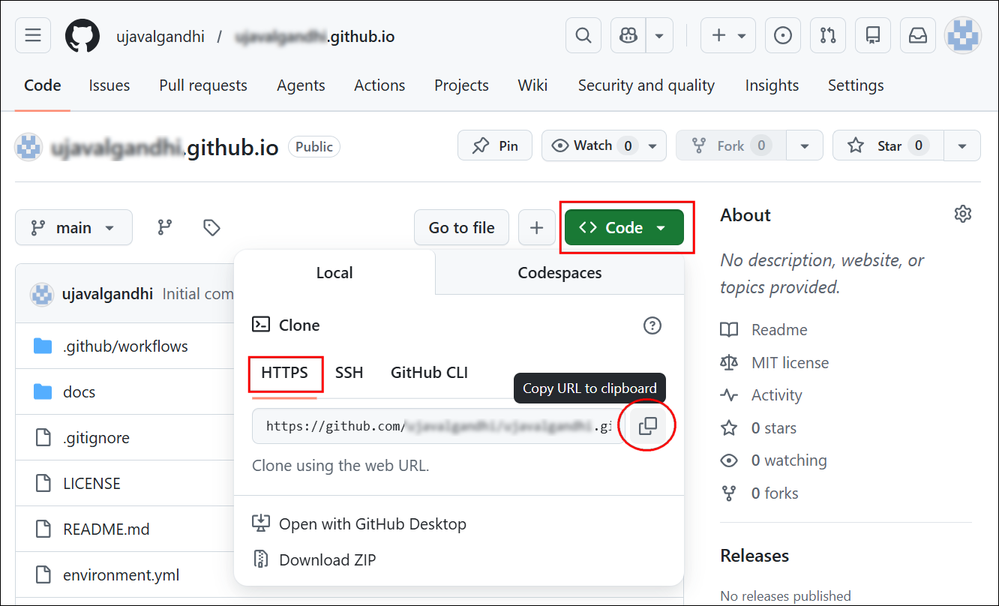
```

4. On your computer, launch *Visual Studio Code*. Click the *Explorer* button to open the file browser and click *Open Folder*. Browse to a folder on your computer where you want the Git repository. The `Desktop` folder is a good choice as you easily locate it for copy/pasting files. Select it and click *Open*. If you are prompted with a security warning, click *Yes, I truest the authors.*

```{r echo=FALSE, fig.align='center', out.width='75%'}
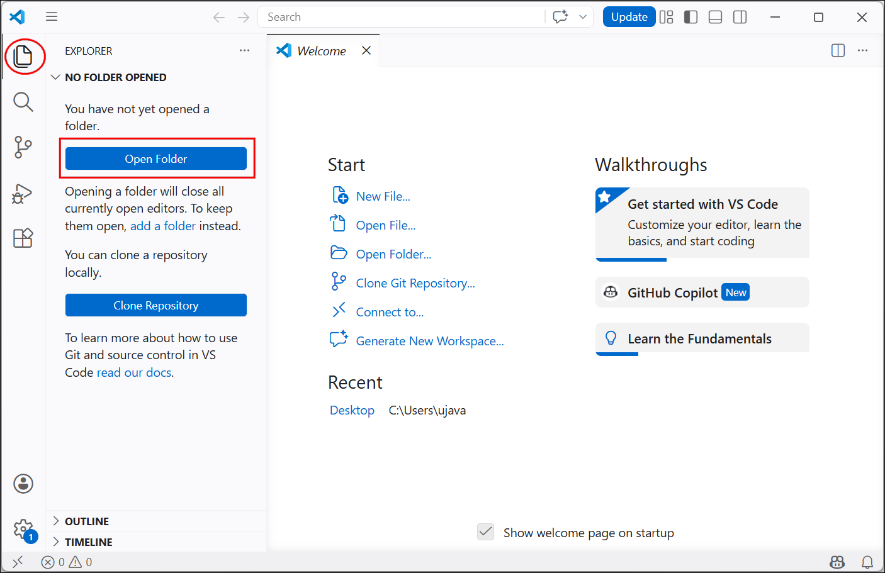
```

5. Once the folder is open, open a new terminal by going to **Terminal &rarr; New Terminal**.

```{r echo=FALSE, fig.align='center', out.width='75%'}
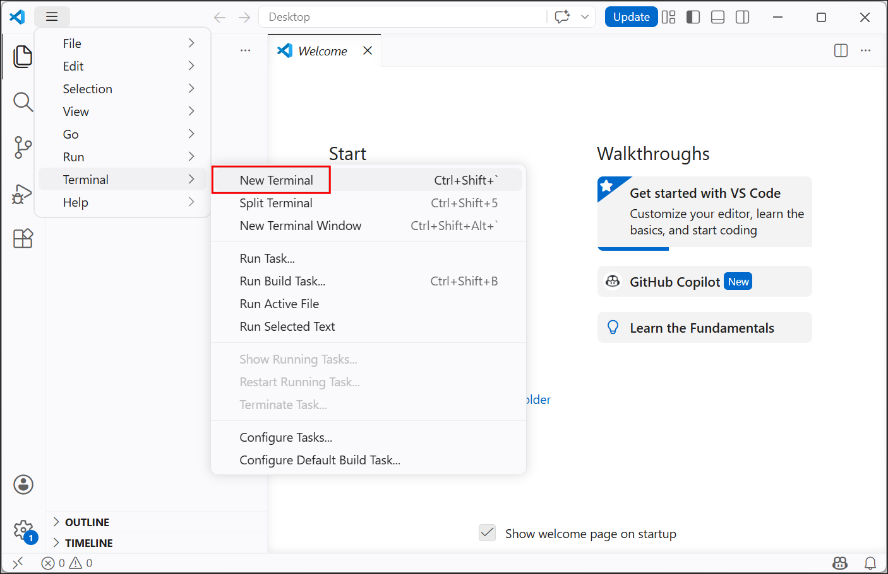
```

6. A new terminal will open and the current working directory will be set to the open folder in the editor. Also the conda environment will be initialized and you should see the `base` environment activated. 

> On some Windows systems, you may get a Powershell `UnauthorizedAccess` error. Run this command and restart the terminal to fix it.

```
Set-ExecutionPolicy RemoteSigned -Scope CurrentUser
```

```{r echo=FALSE, fig.align='center', out.width='75%'}
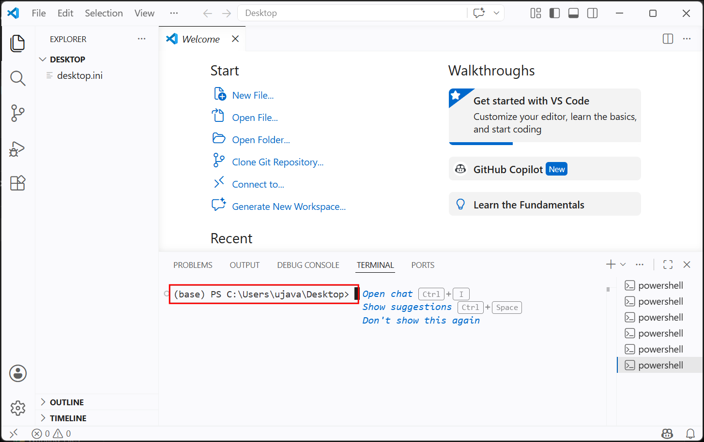
```

7. Now we will clone your Git repository to computer. Enter the following command - replacing the URL with your own repository URL.

```bash
git clone https://github.com/<your-username>/<your-username>.github.io.git
```

```{r echo=FALSE, fig.align='center', out.width='75%'}
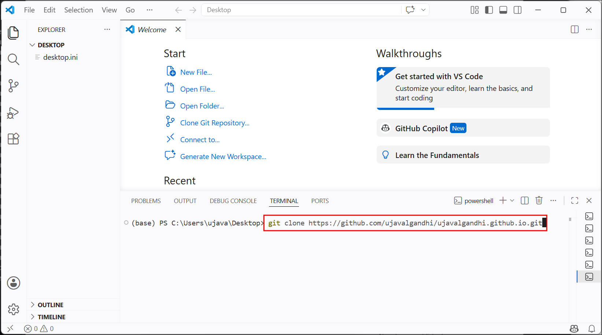
```

8.  This will copy the repository to your computer. Use the `cd` (*Change Directory*) command to go to the folder with the newly cloned repository.

```bash
cd <your-username>.github.io
```

```{r echo=FALSE, fig.align='center', out.width='75%'}
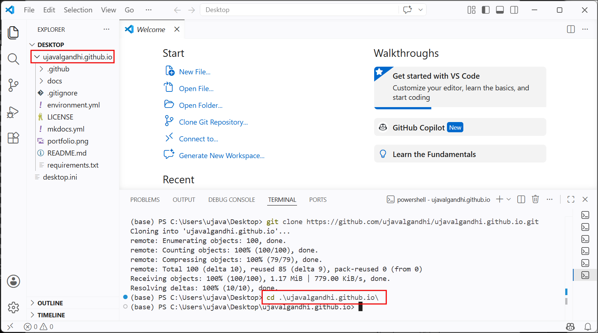
```

9. Next we create a new conda environment and install the required packages. Run the following commands to create a new environment using this file. This will create a new conda environment named `portfolio` and install the required packages.

```bash
conda create --name portfolio -y
conda activate portfolio
conda install -c conda-forge pip -y
pip install mkdocs-material mkdocs-jupyter
```

```{r echo=FALSE, fig.align='center', out.width='75%'}
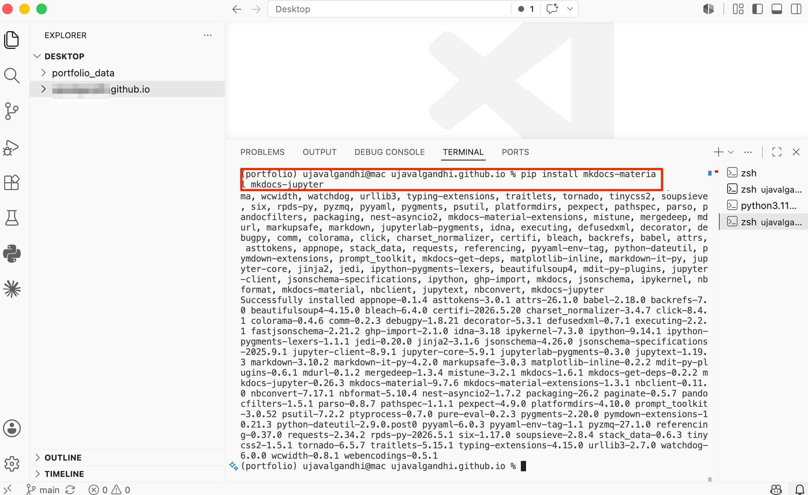
```

10.  Next, we start a local MkDocs server which will build the portfolio website from the source content. The `--livereload` option tells the server to watch the files in the repository and automatically rebuild the site whenever we update any content.

> A warning maybe displayed about the MkDocs 2.0 version. You can ignore it.

```bash
mkdocs serve --livereload
```

```{r echo=FALSE, fig.align='center', out.width='75%'}
knitr::include_graphics('images/geospatial_portfolio_workshop/setup10.png')
```

11. Once the server has started, open your browser and go to [http://127.0.0.1:8000](http://127.0.0.1:8000). You will see the portfolio website.

```{r echo=FALSE, fig.align='center', out.width='75%'}
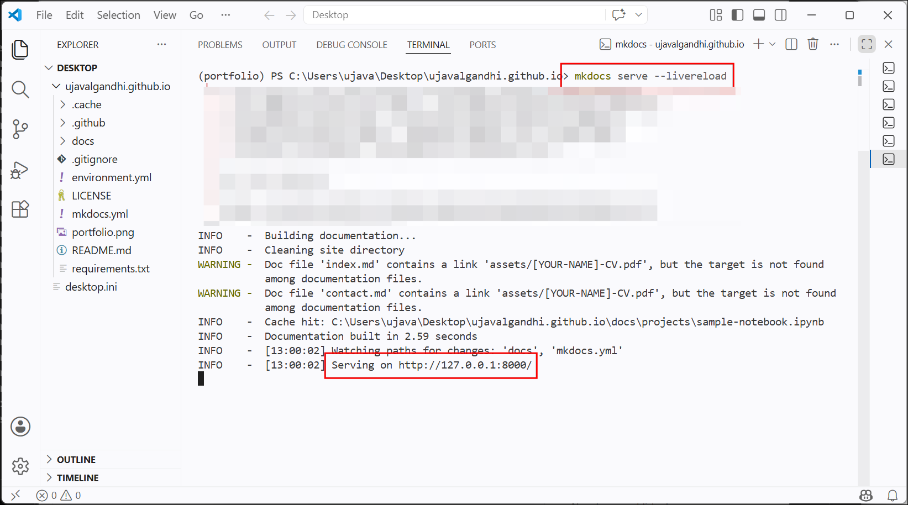
```

12. Your local development environment is now setup. Keep the server running so you will be able to preview changes as you edit the content. Click the *Hide Panel* button to close the Terminal window. If you want to see it, you can open it from **View &rarr; Terminal**

```{r echo=FALSE, fig.align='center', out.width='75%'}
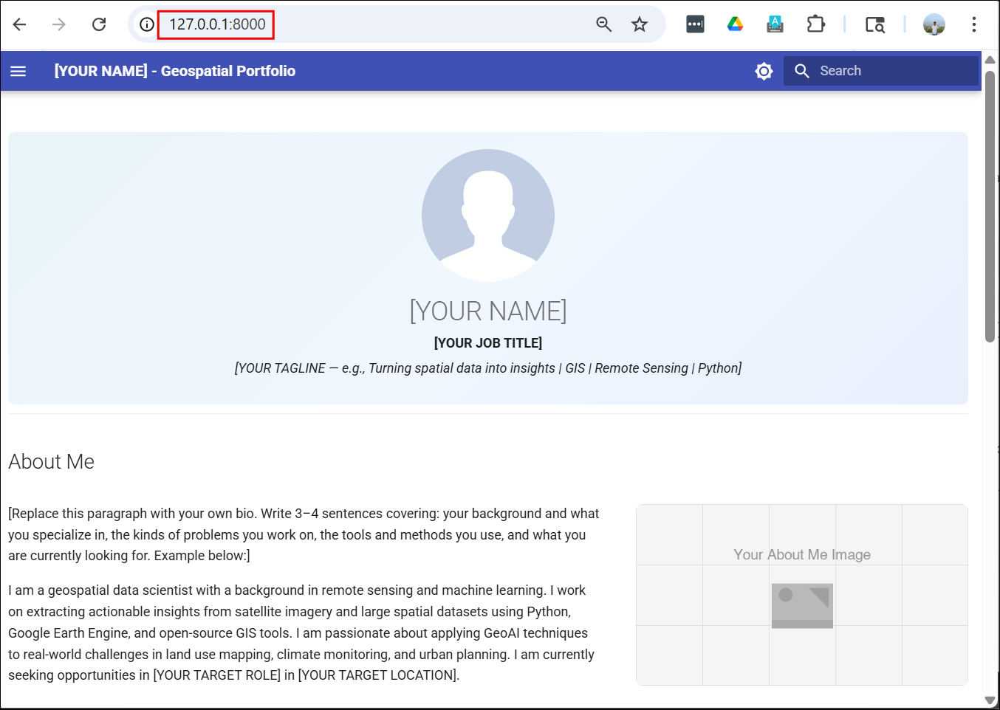
```


# 3. Introduction to Markdown

Markdown is a simple formatting language to create structured documents. It allows you to write plain-text documents with simple markups that is both human and machine-readable. It is a widely used standard for creating documents, websites, and prompts for AI models. We will now practice writing Markdown by editing the `README.md` file in your repository.

1. Expand your repository's folder in Visual Studio Code's *Explorer*. Click on the `README.md` file.

```{r echo=FALSE, fig.align='center', out.width='75%'}
knitr::include_graphics('images/geospatial_portfolio_workshop/markdown1.png')
```

3. Delete the existing text and enter new text about your repository in the Markdown format. Below is the sample text you can use. You can use the *Open Preview to the Side* button to see the rendered version of your text.

> You can see Github's [Markdown Guide](https://docs.github.com/en/get-started/writing-on-github/getting-started-with-writing-and-formatting-on-github/basic-writing-and-formatting-syntax) for help with syntax.

```
# [YOUR NAME]'s Portfolio

This is the repository for my portfolio website. The portfolio is hosted at https://<your-username>.github.io/

 This website is built using the following tools
 
* MkDocs
* GitHub Pages
* GitHub Actions

> Tip: You can get the portfolio template from [Spatial Thoughts](https://github.com/spatialthoughts/portfolio-website-template)
```

```{r echo=FALSE, fig.align='center', out.width='75%'}
knitr::include_graphics('images/geospatial_portfolio_workshop/markdown2.png')
```

3. Check the preview and fix any formatting issues.

```{r echo=FALSE, fig.align='center', out.width='75%'}
knitr::include_graphics('images/geospatial_portfolio_workshop/markdown3.png')
```

4. Once you are done, save the changes from **File &rarr; Save**.

```{r echo=FALSE, fig.align='center', out.width='75%'}
knitr::include_graphics('images/geospatial_portfolio_workshop/markdown4.png')
```


# 4. Introduction to MkDocs

[MkDocs](https://www.mkdocs.org/) is a Python-based static site generator focused on building project documentation sites. The template we are using is setup to use MkDocs to create the portfolio website using the following components. 

* **Content**: Each page is a Markdown (`.md`) file in the `docs/` folder.
* **Configuration**: All configuration lives in a single `mkdocs.yml` file. The site name, navigation etc. are defined in a single place.
* **Theme**: The template uses the popular [Material for MkDocs](https://squidfunk.github.io/mkdocs-material/) which supports responsive design with search, dark mode, and more.

```{r echo=FALSE, fig.align='center', out.width='60%'}
knitr::include_graphics('images/geospatial_portfolio_workshop/mkdocs1.png')
```

# 5. Publishing Your Portfolio Site

We will now edit the content files using a code editor, preview the updated portfolio and then push the changes to GitHub.

## 5.1 Updating the Site Configuration

MkDocs uses a central configuration file named `mkdocs.yml`. This file is in the YAML format (`.yml`). You can learn about all available settings  at [MkDocs Configuration](https://www.mkdocs.org/user-guide/configuration/) page. We will edit this file with the main configuration settings now.

1. From your GitHub repository folder, locate the `mkdocs.yml` file. Click on the filename to edit it.Update the placeholders with your name and information. At the least, you should update the `site_name`, `site_description`, `site_author`, `site_url`, `copyright` and `extra.social` values. 

```{r echo=FALSE, fig.align='center', out.width='60%'}
knitr::include_graphics('images/geospatial_portfolio_workshop/config1.png')
```

## 5.2 Editing and Committing Changes

All the content pages as in the Markdown format (.md). We can edit these files and preview the resulting site. Once we are happy with the changes, we will commit and push these changes to GitHub.

1.We will start by updating the homepage of the site which is built from the `index.md` file. The homepage requires a profile picture and an about me picture. We will first upload these image. Go to the `docs/assets/` folder, right-click and select *Reveal in File Explorer*. 

```{r echo=FALSE, fig.align='center', out.width='75%'}
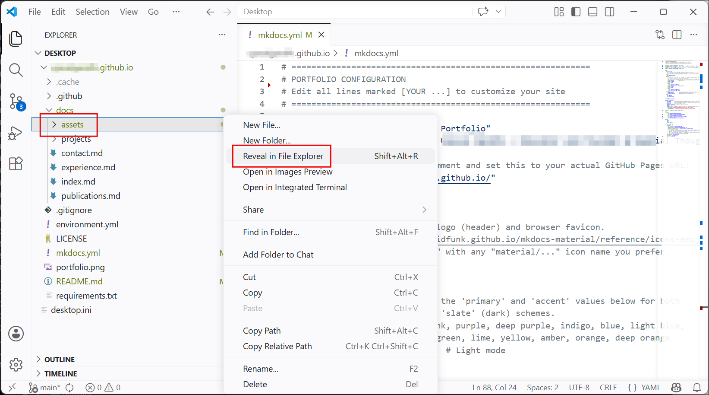
```

2. In the `docs/assets/` folder, copy your CV. You can name your file `<your name>-CV.pdf` (If your name is John, name the file `John-CV.pdf`).

> GitHub has a limit of 25MB per file. Ensure your CV file is smaller than the limit. You can use a tool such as [Smallpdf](https://smallpdf.com/compress-pdf) to compress your file.

```{r echo=FALSE, fig.align='center', out.width='75%'}
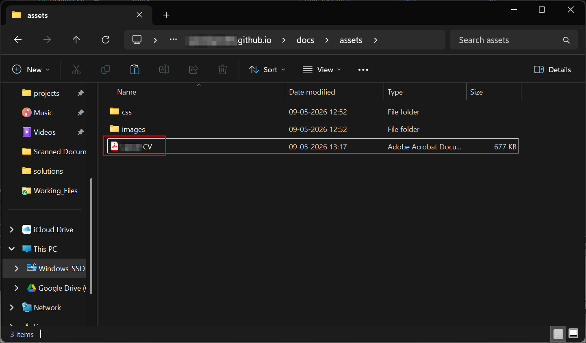
```

3. Next, replace the placeholder images in the `docs/assets/images/` folder with your own. Copy your profile photo named `profile.png` (case sensitive). Similarly, copy your about me picture named `about.png`. 

> Ensure your photos are not too large. These photos are loaded every time someone visits your homepage. To ensure optimal experience, ensure the pictures are not too large. Use *Resize image* tool on your computer to reduce the size of the images to a maximum of 500px.

```{r echo=FALSE, fig.align='center', out.width='75%'}
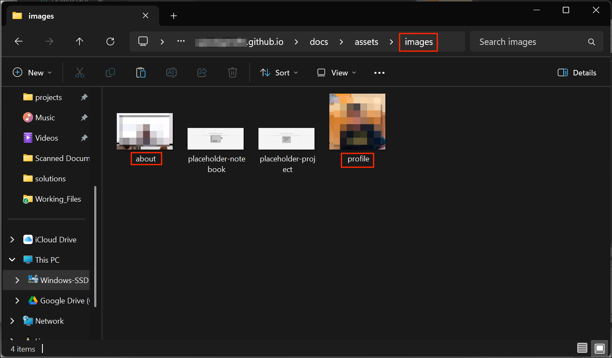
```

4. Now we will update the Markdown file for the homepage. Locate the `index.md` file in the `docs/` folder. Click to open it.

```{r echo=FALSE, fig.align='center', out.width='75%'}
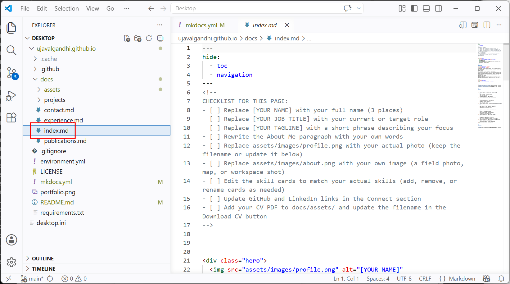
```

5. In the editor, update the placeholders `[YOUR NAME]`, `[YOUR JOB TITLE]`, `[YOUR TAGLINE]` with your information. In the *About Me* section, replace the paragraph with your bio. If your uploaded images have different names, make sure to update them as well. Scroll down and update the *Skills* and *Connect* sections. You can delete cards and links which are not relevant for you. Once done, save your changes.

```{r echo=FALSE, fig.align='center', out.width='75%'}
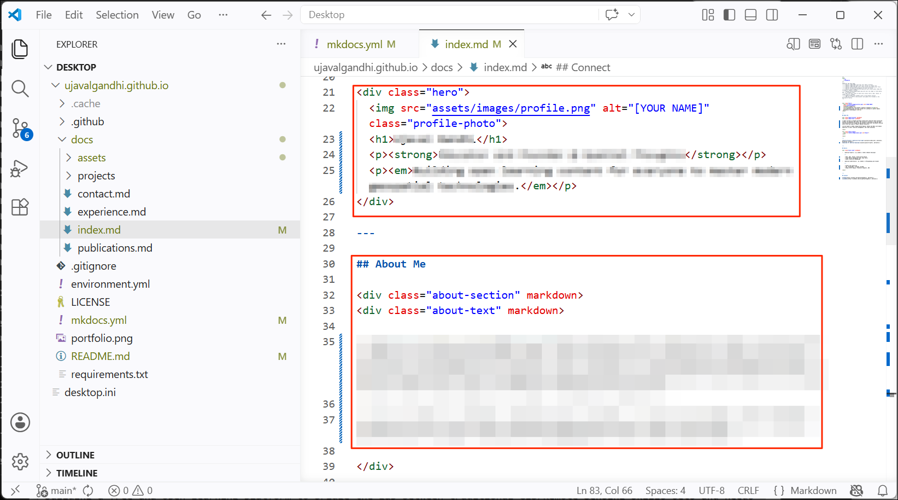
```

6.  Your homepage is now ready. Head over to the browser tab connected to the local development server. You should see the homepage with your pictures and information. If you see any formatting errors, you can go back and update the `index.md` file. If the images do not appear, ensure they are uploaded in the correct folder and the names match as specified in the `index.md` file. 


```{r echo=FALSE, fig.align='center', out.width='75%'}
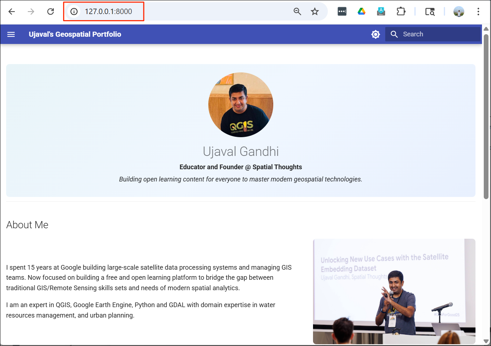
```

7. We will now commit these changes and push them to GitHub. Go to **View &rarr; Terminal**. Click the *+ New Terminal* button. 

```{r echo=FALSE, fig.align='center', out.width='75%'}
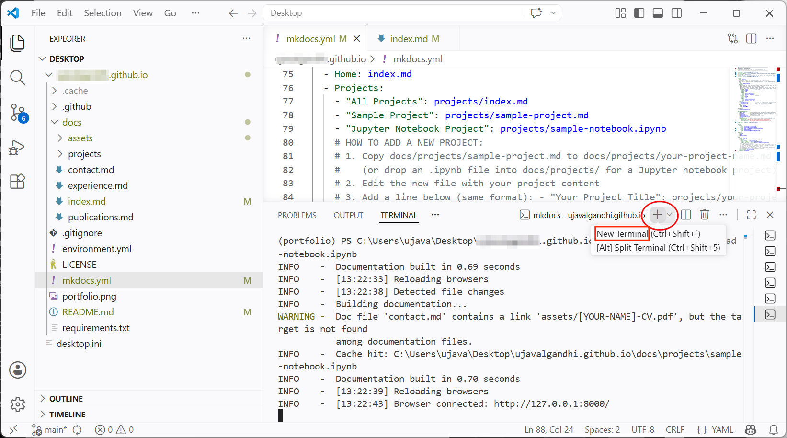
```

8. Change the directory to the GitHub repository and enter the following command to see the status.

```bash
cd <your-username>.github.io
```

```bash
git status
```

```{r echo=FALSE, fig.align='center', out.width='75%'}
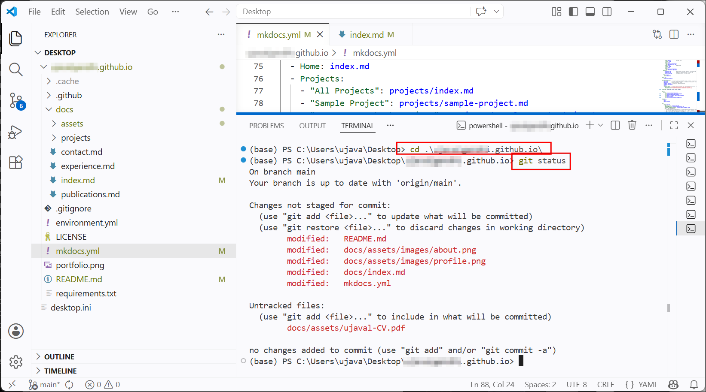
```

9. We have some modifications to existing files and some new files that needs to be committed. We first use `git add` command to move these changes to the staging area. `git add .` stages all changes in the current directory and its sub-directories.

```bash
git add .
```

```{r echo=FALSE, fig.align='center', out.width='75%'}
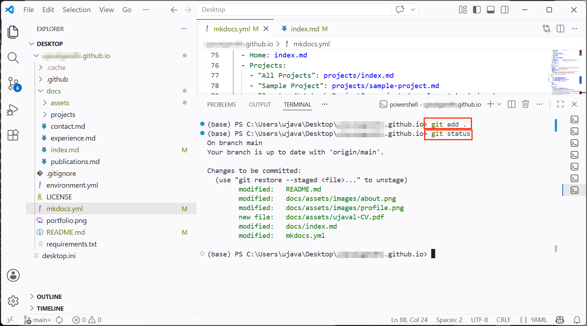
```

10. Now we commit these changes to the Git repository. The `-m` option is to add a commit message that will appear in the Git history.

```bash
git commit -m "update"
```

```{r echo=FALSE, fig.align='center', out.width='75%'}
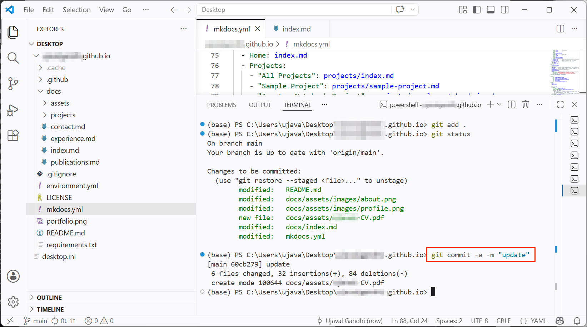
```

11. Next, we push the locally committed changes to the GitHub repository. 

> If you get an error, make sure you have signed-in to your GitHub account using the [GitHub CLI](install-git-github.html#configure-github-cli)

```bash
git push
```

```{r echo=FALSE, fig.align='center', out.width='75%'}
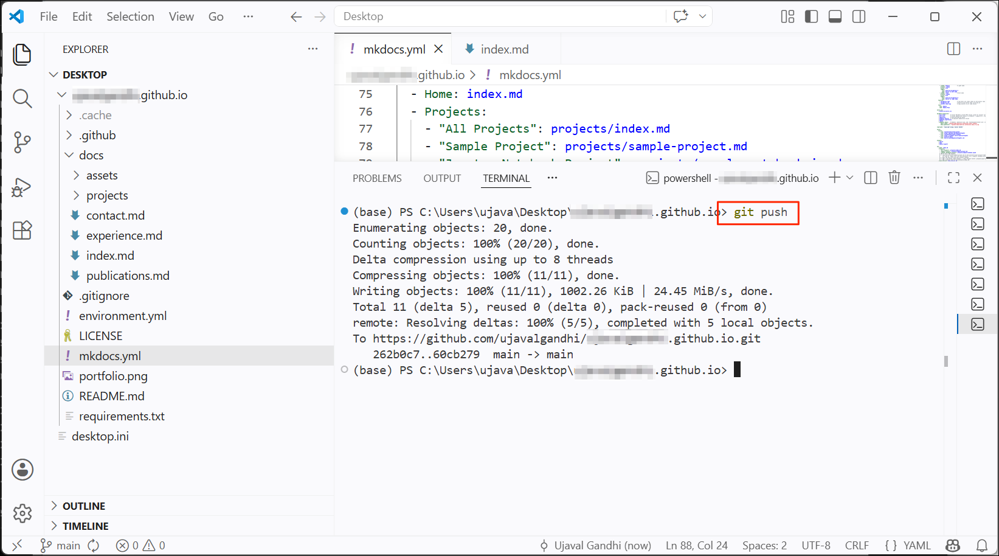
```

## 5.3 Publishing on GitHub Pages

[GitHub Pages](https://pages.github.com/) is a static site hosting service that turns your repository files into a live website. You can enable Github Pages on your repository and configure it to publish the content from a branch to your user site. MkDocs is setup to create static HTML pages in a separate branch called `gh-pages`. We will now create this branch, deploy the content and setup GitHub Pages to serve from that branch.

```{r echo=FALSE, fig.align='center', out.width='60%'}
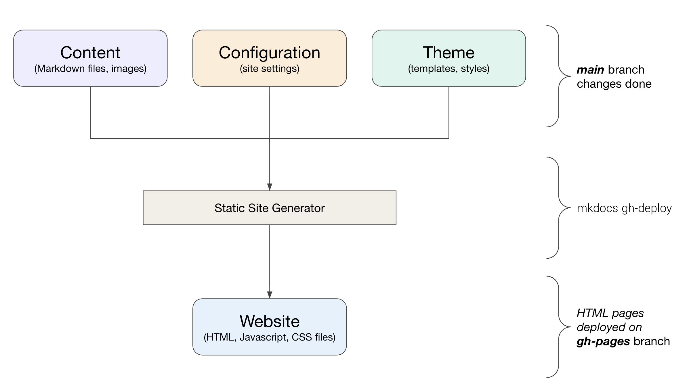
```

1. After you have pushed your changes to the `main` branch, activate the conda environment in the same Terminal window.

```bash
conda activate portfolio
```

```{r echo=FALSE, fig.align='center', out.width='75%'}
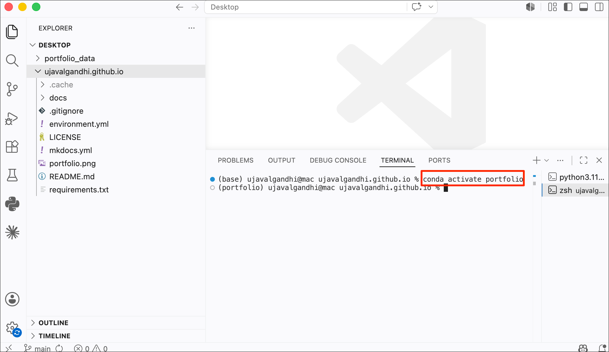
```

2. Once the environment is activated run the following command that will create the HTML pages and push them to a branch named `gh-pages`.

```bash
mkdocs gh-deploy
```

```{r echo=FALSE, fig.align='center', out.width='75%'}
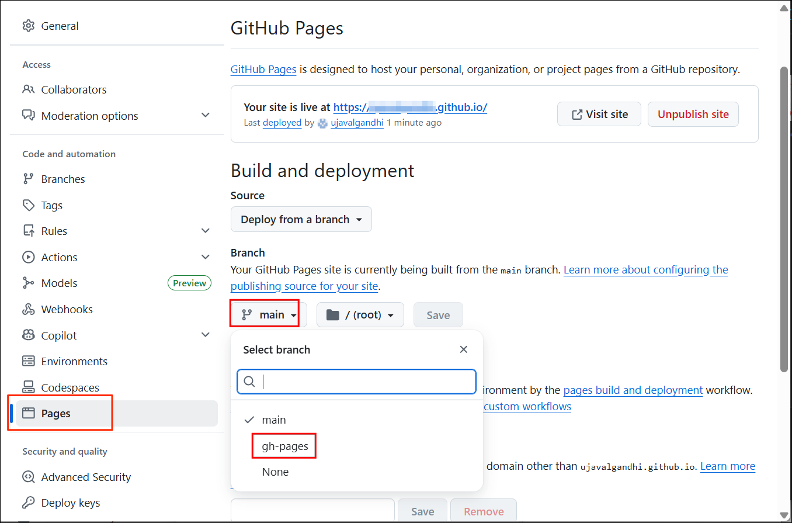
```

3. Go to your portfolio repository on Github. Select the `gh-pages` branch to see the website content pushed there. We will now setup GitHib Pages to serve this content.

```{r echo=FALSE, fig.align='center', out.width='75%'}
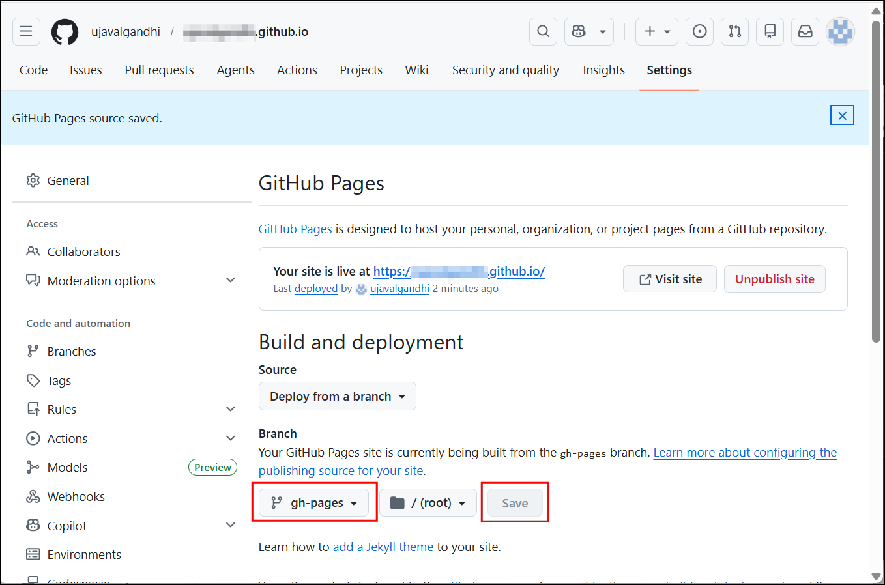
```

4. Navigate to **Settings &rarr; Pages**.

```{r echo=FALSE, fig.align='center', out.width='75%'}
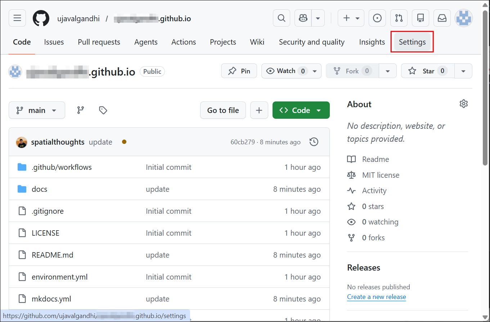
```

5. For user repositories named `<your-username>.github.io`, GitHub Pages is enabled by default. If it is not enabled for your repository, select a branch under *Deploy from a branch* option.

```{r echo=FALSE, fig.align='center', out.width='75%'}
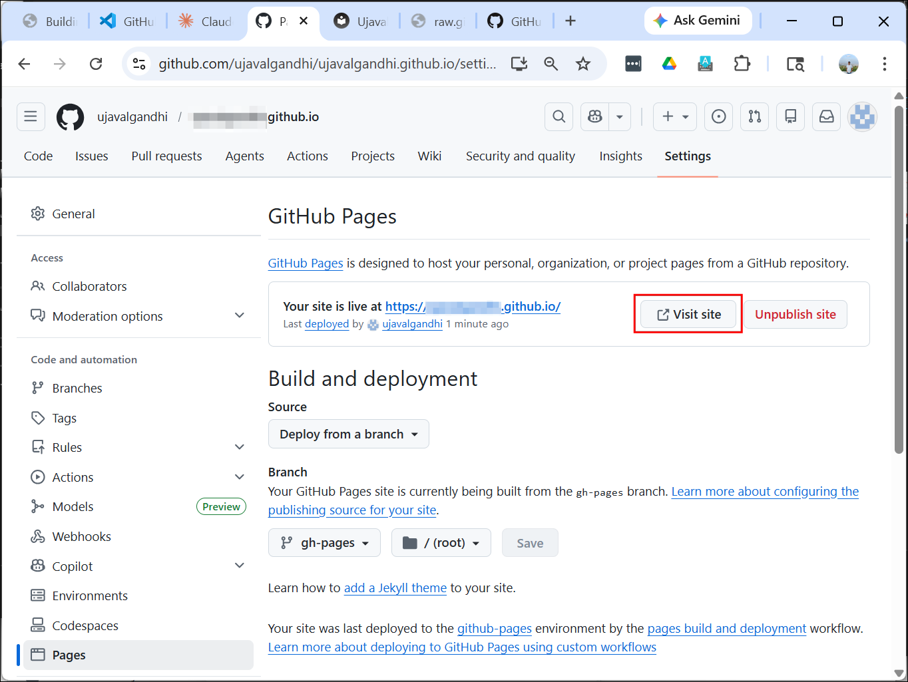
```

6. Select `gh-pages` and click *Save*.

```{r echo=FALSE, fig.align='center', out.width='75%'}
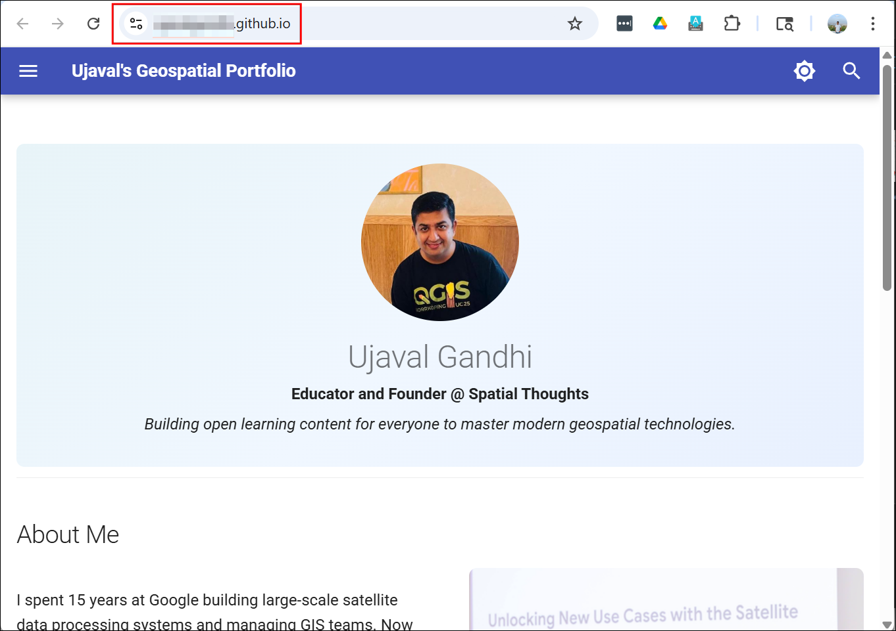
```


7. The content will now be served as a static website on GitHub Pages. Wait for a minute for this process to finish and go to **Settings &rarr; Pages** and click on the *Visit site* button.

```{r echo=FALSE, fig.align='center', out.width='75%'}

```

8. You will now see the site deployed and accessible from a public URL `<your-username>.github.io`.

```{r echo=FALSE, fig.align='center', out.width='75%'}

```

This is a one-time configuration. Now your repository is set to automatically build and deploy to GitHub Pages. Next time you update any content in the `main` branch, run `mkdocs gh-deploy` and the site will be updated.

# 6. Updating the Site Content

## 6.1 Updating Content Pages (LLM Assisted)

You are now familiar with the process of updating the content of a page with Markdown text. You can update the `contact.md`, `experience.md` and `publications.md` with personalized content. Most of this content will already be present in your CV, LinkedIN profile or Google Scholar. In this section, we will learn how we can use LLM AI Assistants to automatically format existing content to Markdown for easily updating your portfolio. 

> We recommend using [Claude AI](https://claude.ai/new) but you may use your favorite AI assistant.

1. Locate and open the `experience.md` file in the `docs/` folder. This file is for the page on your portfolio that lists your work experience, education, certifications etc. We will automatically create this content from your CV. Click on the file and open it.

```{r echo=FALSE, fig.align='center', out.width='75%'}
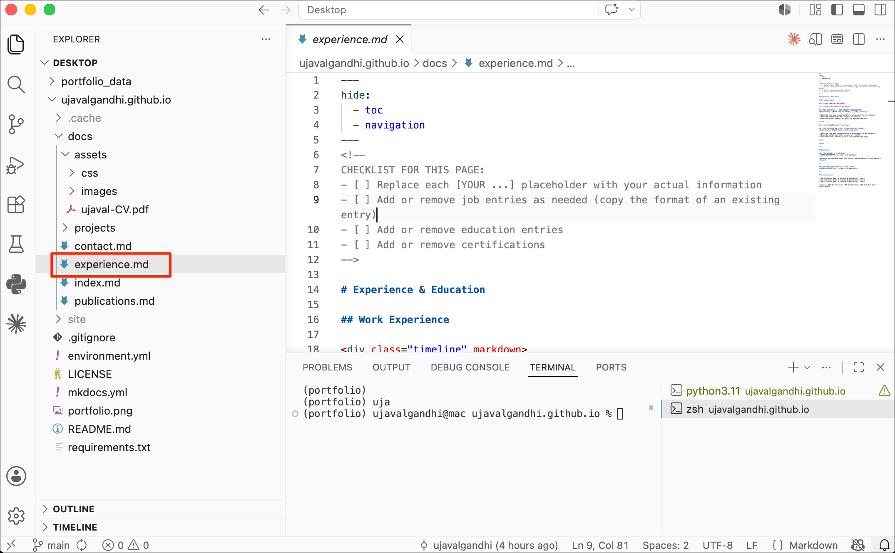
```


2. Go to [Claude AI](https://claude.ai/new) and start a new chat. Attach your CV and enter a prompt like below. Copy content of the `experience.md` file and include it in the prompt.

```
I want to use the information from my attached CV to update my online portfolio. See the Markdown text below for the required format. Format the content from my CV as Markdown that I can copy/paste to update that file.

<Paste the content of your experience.md file>
```

```{r echo=FALSE, fig.align='center', out.width='75%'}
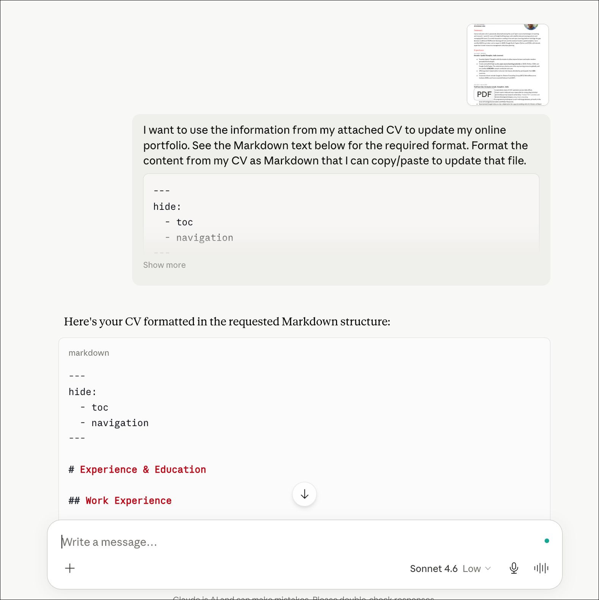
```

3. Copy the LLM generated Markdown content and paste it as the content of the `experience.md` page and save it.

```{r echo=FALSE, fig.align='center', out.width='75%'}
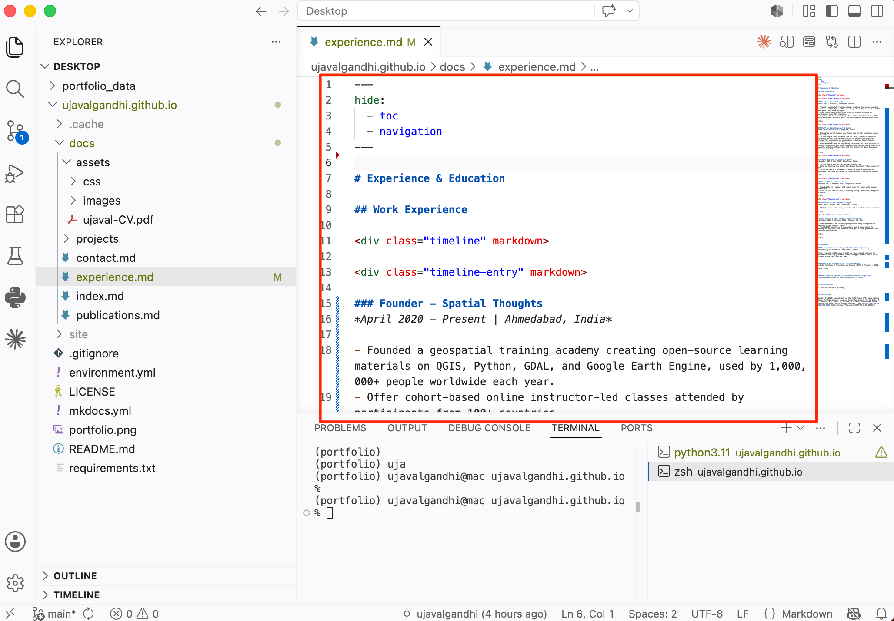
```

4. Go to the browser tab connected to the local development server at http://127.0.0.1:8000/ and preview the content. Make edits in your editor as required.

```{r echo=FALSE, fig.align='center', out.width='75%'}
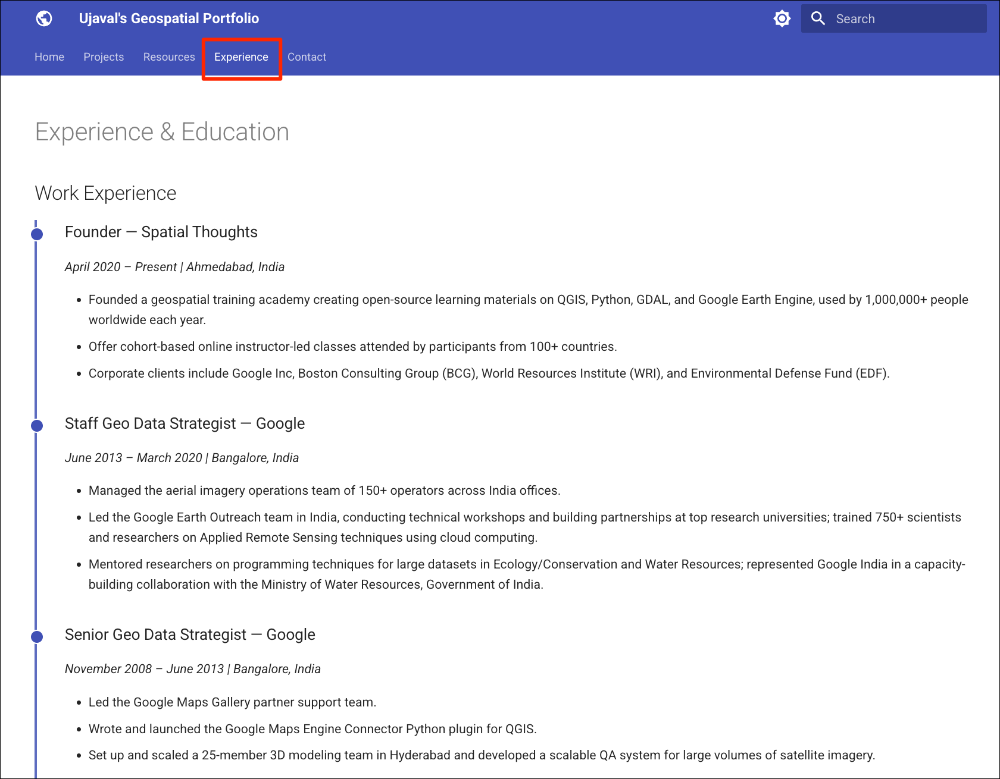
```

5. Once satisfied, commit the changes by running the following sequence of Git commands.

```bash
git status
git add .
git commit -m "update'
git push
```

```{r echo=FALSE, fig.align='center', out.width='75%'}
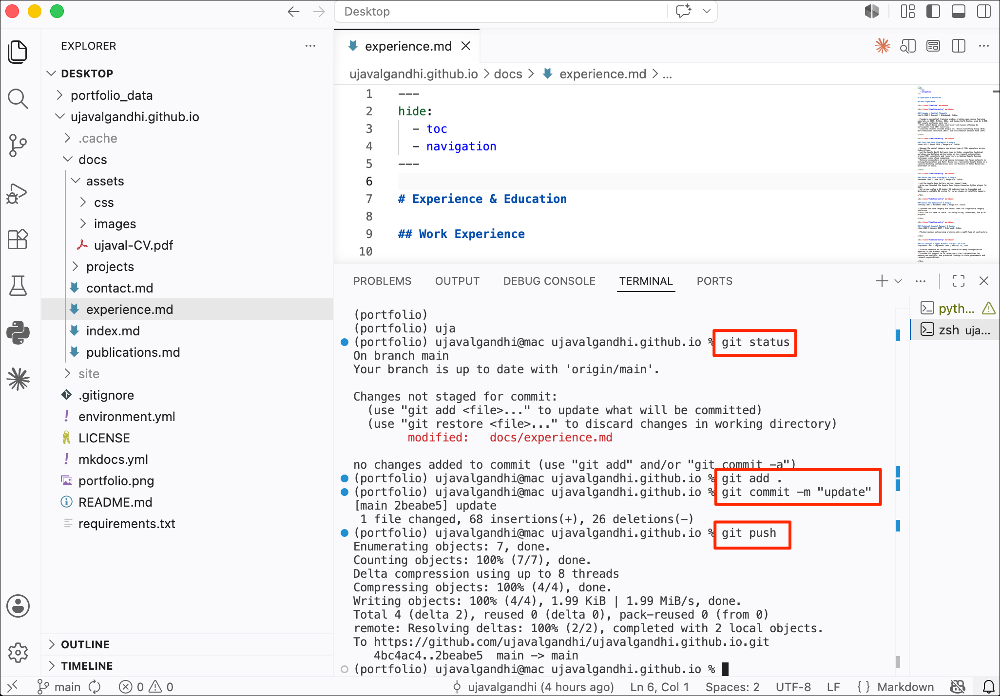
```

6. Deploy the changes to your live portfolio. 

```bash
mkdocs gh-deploy
```

```{r echo=FALSE, fig.align='center', out.width='75%'}
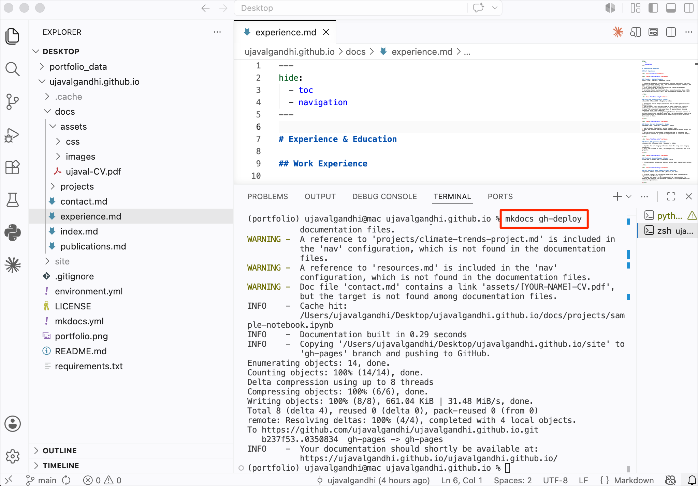
```


You can repeat this process for the `publication.md` page to pull your publications from your CV, ResearchGate or Google Scholar profile.

## 6.2 Adding a New Page

The template provides you with a handful of pages pre-configured for the website. It is quite easy to add new pages. Adding a new page is a 2-step process - you first create a new file with the content and then update the `mkdocs.yml` file to add it to the navigation. Let's create a new page.

1. Right-click the `docs` folder and select *New File...*.

```{r echo=FALSE, fig.align='center', out.width='75%'}
knitr::include_graphics('images/geospatial_portfolio_workshop/addpage1.png')
```

2. You can name the page with the `.md` extension. Here we are creating a new page that lists learning resources so we have named it `resources.md`. Add the content for the page in the Markdown format. Here we are using the [Grids](https://squidfunk.github.io/mkdocs-material/reference/grids/) provided by the Material theme to organize the resources in a responsive layout. Save the file.

```{r echo=FALSE, fig.align='center', out.width='75%'}
knitr::include_graphics('images/geospatial_portfolio_workshop/addpage2.png')
```

3. Next go to the root of your repository and locate the `mkdocs.yml` file. Open it for editing and scroll down to the `nav:` section. Add the newly created page to the navigation menu. Save the file.

```{r echo=FALSE, fig.align='center', out.width='75%'}
knitr::include_graphics('images/geospatial_portfolio_workshop/addpage3.png')
```

4. Go to the browser tab connected to the local development server at http://127.0.0.1:8000/ and preview the content.

```{r echo=FALSE, fig.align='center', out.width='75%'}
knitr::include_graphics('images/geospatial_portfolio_workshop/addpage4.png')
```

5. Commit, push and deploy the changes.

```
git add .
git commit -m "update'
git push
mkdocs gh-deploy
```

```{r echo=FALSE, fig.align='center', out.width='75%'}
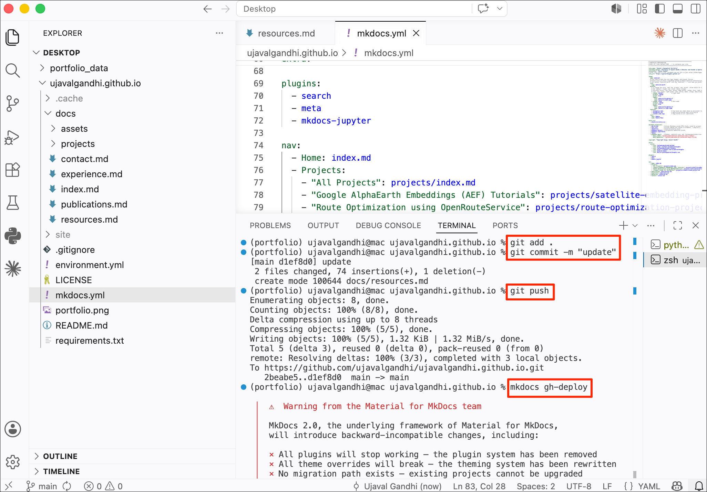
```

## 6.3 Deleting a Page

If there are pages from the template that you would like to remove, you can first remove it from the navigation menu in `mkdocs.yml` and delete the file. Let's see the process by removing the `publications.md` page.

1. Open the `mkdocs.yml` file and scroll down to the `nav:` section. Locate the item with the page that you would like to delete.

```{r echo=FALSE, fig.align='center', out.width='75%'}
knitr::include_graphics('images/geospatial_portfolio_workshop/delete1.png')
```

2. Delete the line and save the file. This will now remove the reference to this page from the navigation menu.

```{r echo=FALSE, fig.align='center', out.width='75%'}
knitr::include_graphics('images/geospatial_portfolio_workshop/delete2.png')
```

3. Go to the `docs/` folder and right-click the file that you want to delete and select **Delete** and confirm.

```{r echo=FALSE, fig.align='center', out.width='75%'}
knitr::include_graphics('images/geospatial_portfolio_workshop/delete3.png')
```

4. Commit and push the changes.

```
git status
git add .
git commit -m "update'
git push
```

```{r echo=FALSE, fig.align='center', out.width='75%'}
knitr::include_graphics('images/geospatial_portfolio_workshop/delete4.png')
```

5. Deploy the changes to GitHub Pages.

```
mkdocs gh-deploy
```

```{r echo=FALSE, fig.align='center', out.width='75%'}
knitr::include_graphics('images/geospatial_portfolio_workshop/delete5.png')
```

6. Refresh the portfolio and you will see the updated menu.

```{r echo=FALSE, fig.align='center', out.width='75%'}
knitr::include_graphics('images/geospatial_portfolio_workshop/delete6.png')
```

## 6.4 Adding a Project Page (LLM Assisted)

The portfolio template is custom design to showcase your project. You can add multiple projects to your site. Each project will be shown using a card layout. Adding a project requires uploading a cover image and creating a Markdown file.

1. Select a cover image for your project. The project images are shown as horizontal cards, so choose an appropriate image with a landscape layout. You can drag-and-drop the image file to the `docs/assets/images/` folder in Visual Studio Code.

```{r echo=FALSE, fig.align='center', out.width='75%'}
knitr::include_graphics('images/geospatial_portfolio_workshop/project1.png')
```

2. The template comes with a `sample-project.md` file with suggested sections for a project. Open the file and copy its content. We will use this to prompt an LLM Assistant to help us draft the project page.

```{r echo=FALSE, fig.align='center', out.width='75%'}
knitr::include_graphics('images/geospatial_portfolio_workshop/project2.png')
```

3. Go to [Claude AI](https://claude.ai/new) and start a new chat. Enter a prompt shown below, replacing the image name and file path with your own. Claude will ask you questions about the project and share as much information as you can. You can optionally attach your project report or add a link with information about your project. Once the content is created, click the *Copy* button.

```
I want to add a project to my portfolio

My cover image path is docs/assets/images/project1-cover.png

My template content is pasted below

Ask me questions regarding my project and once you have enough information, generate the content in Markdown format that I can use to create the page
```

```{r echo=FALSE, fig.align='center', out.width='75%'}
knitr::include_graphics('images/geospatial_portfolio_workshop/project3.png')
```

4. Back in your editor, go to `docs/projects/` folder, right-click and select **New File....**. Enter the name as `<project-name>.md` - replacing `<project-name>` is an appropriate name for your project. 

```{r echo=FALSE, fig.align='center', out.width='75%'}
knitr::include_graphics('images/geospatial_portfolio_workshop/project4.png')
```

5. Paste the Markdown content from Claude. Edit it as required and save the file.

```{r echo=FALSE, fig.align='center', out.width='75%'}
knitr::include_graphics('images/geospatial_portfolio_workshop/project5.png')
```

6. We need to add the project to the card layout. Open the `docs/projects/index.md` file. Edit the first project card section with the project name and description. Update the cover image and project file path. 

```{r echo=FALSE, fig.align='center', out.width='75%'}
knitr::include_graphics('images/geospatial_portfolio_workshop/project6.png')
```

7. Next, we add this project to the navigation menu. Edit the `mkdocs.yml` file and add the name and path of the project file and save it.

```{r echo=FALSE, fig.align='center', out.width='75%'}
knitr::include_graphics('images/geospatial_portfolio_workshop/project7.png')
```

8.  Go to the browser tab connected to the local development server at http://127.0.0.1:8000/ and head over to the *Projects* page to see the new project.

```{r echo=FALSE, fig.align='center', out.width='75%'}
knitr::include_graphics('images/geospatial_portfolio_workshop/project8.png')
```

9. Commit, push and deploy the changes.

```
git status
git add .
git commit -m "update'
git push
mkdocs gh-deploy
```

```{r echo=FALSE, fig.align='center', out.width='75%'}
knitr::include_graphics('images/geospatial_portfolio_workshop/project9.png')
```


## 6.5 Adding a Notebook Project

The portfolio template also supports using Jupyter Notebooks (`.ipynb`) as project pages. The notebooks can have cells with Markdown content, code, charts, interactive maps. These will be converted to compatible Markdown content by MkDocs and will be rendered as a project page. Adding a project via a notebook requires uploading a cover image and a notebook file.

1. Copy your notebook in the `projects` folder.

```{r echo=FALSE, fig.align='center', out.width='75%'}
knitr::include_graphics('images/geospatial_portfolio_workshop/notebook1.png')
```

2. Prepare your project notebook. Make sure to add a Markdown cell at the top with the project title. You may clear outputs of cells with warnings or unwanted outputs so your resulting page is clean. Also make sure to replace any API Keys with placeholders.

```{r echo=FALSE, fig.align='center', out.width='75%'}
knitr::include_graphics('images/geospatial_portfolio_workshop/notebook2.png')
```

3. Next, go to the `docs/assets/images/` folder and copy a cover image for the project.

```{r echo=FALSE, fig.align='center', out.width='75%'}
knitr::include_graphics('images/geospatial_portfolio_workshop/notebook3.png')
```

4. Update the `index.md` in the `docs/projects/` folder with the card for the newly uploaded project.

```{r echo=FALSE, fig.align='center', out.width='75%'}
knitr::include_graphics('images/geospatial_portfolio_workshop/notebook4.png')
```

5. Add this project to the navigation menu by editing the `mkdocs.yml` file and adding the name and path of the project file.

```{r echo=FALSE, fig.align='center', out.width='75%'}
knitr::include_graphics('images/geospatial_portfolio_workshop/notebook5.png')
```

6. Save all the changes and go to the browser tab connected to the local development server at http://127.0.0.1:8000/. Head over to the *Projects* page to see the new project.

```{r echo=FALSE, fig.align='center', out.width='75%'}
knitr::include_graphics('images/geospatial_portfolio_workshop/notebook6.png')
```

7. Commit, push and deploy the changes.

```
git status
git add .
git commit -m "update'
git push
mkdocs gh-deploy
```

```{r echo=FALSE, fig.align='center', out.width='75%'}
knitr::include_graphics('images/geospatial_portfolio_workshop/notebook7.png')
```

# Supplement

## Adding a Cover Image on the Homepage

To add a cover image to your homepage, add a banner image `assets/images/hero-image.png` and update the *Hero section* in the `assets/css/extra.css` as below.

```css
/* Hero section on the Home page */
.hero {
  text-align: center;
  padding: 1rem 1rem 1.25rem 1rem;
  background:
    linear-gradient(135deg, 
      rgba(232,244,248,0.82) 0%,
      rgba(240,247,255,0.82) 50%, 
      rgba(232,240,254,0.82) 100%),
    url('../images/hero-image.png') center / cover no-repeat;
  border-radius: 8px;
}
```

```{r echo=FALSE, fig.align='center', out.width='75%'}
knitr::include_graphics('images/geospatial_portfolio_workshop/hero_cover.png')
```


## Automating Deployment with GitHub Actions

[GitHub Actions](https://github.com/features/actions) is feature of the GitHub platform that allows you to automate workflows. You can setup actions to trigger a task when a specific event happens. A useful automation is to add a workflow action that watches your repository and runs MkDocs to generate new set of static HTML pages whenever you update the `main` branch. This way you are able to edit your files online and update your website without having access to a local development environment.

1. Go to your repository homepage on GitHub and click *Actions*.

```{r echo=FALSE, fig.align='center', out.width='75%'}
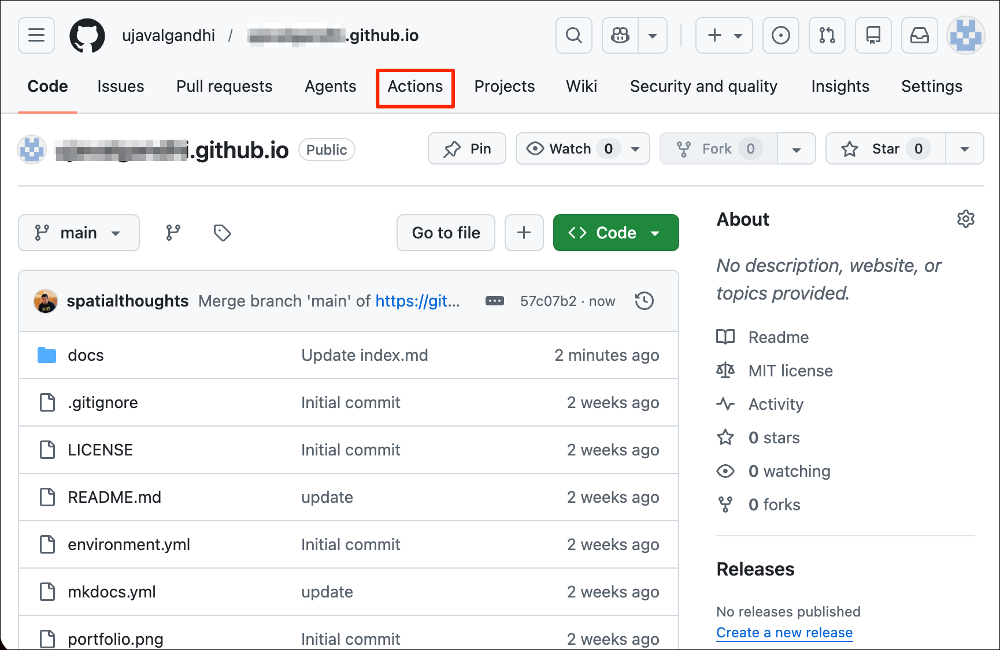
```

2. Click the *New workflow* buttton to setup a new action.

```{r echo=FALSE, fig.align='center', out.width='75%'}
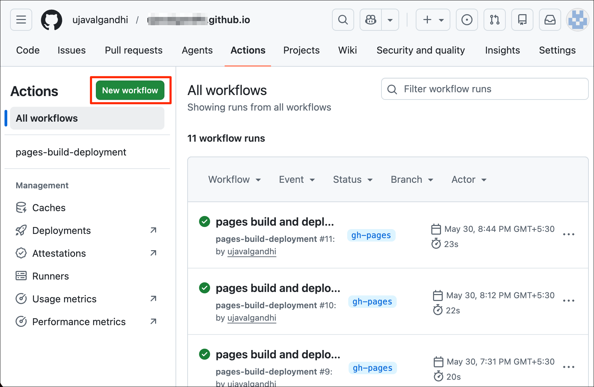
```

3. Choose the *Simple workflow* template and click *Configure*.

```{r echo=FALSE, fig.align='center', out.width='75%'}
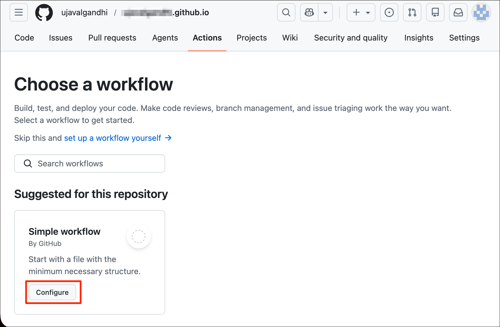
```

4. GitHub actions are stored in a hidden folder in your repository at `.github/workflows/`. Enter the name of the file as `deploy.yml` and enter the content below. The configuration is in the YAML format and is very sensitive to whitespaces, so ensure you paste the content exactly as it is below. Once done, click *Commit changes...* and click *Commit changes* when prompted for confirmation.

```yml
name: Run MkDocs and Create HTML pages

on:
  push:
    branches:
      - main

permissions:
  contents: write

jobs:
  deploy:
    runs-on: ubuntu-latest
    steps:
      - uses: actions/checkout@v4

      - uses: actions/setup-python@v5
        with:
          python-version: "3.11"

      - name: Install dependencies
        run: pip install -r requirements.txt

      - name: Preserve CNAME if present
        run: |
          if [ -f CNAME ]; then
            cp CNAME docs/CNAME
          fi

      - name: Deploy
        run: mkdocs gh-deploy --force
```

```{r echo=FALSE, fig.align='center', out.width='75%'}
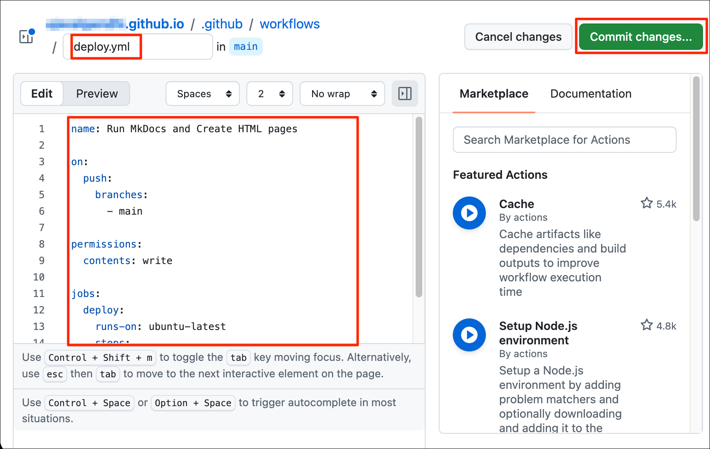
```

5. Your action is setup. Now wheever you push new changes to the `main` branch of your repository, this action will be triggered and will publish the `gh-pages` automatically by running `mkdocs gh-deploy`. 

```{r echo=FALSE, fig.align='center', out.width='75%'}
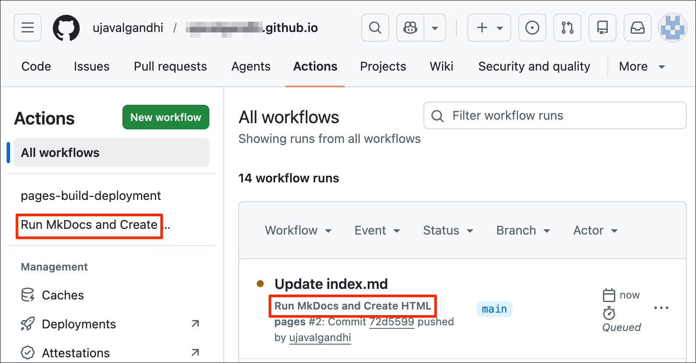
```

## Using a Custom Domain

GitHub Pages allows to connect your site to your own domain name and host the GitHub Pages site on it. See [About custom domains and GitHub Pages
](https://docs.github.com/en/pages/configuring-a-custom-domain-for-your-github-pages-site/about-custom-domains-and-github-pages) for official instructions. We are providing simplified version of these instructions here for the most common setup.

1. To use a custom domain, you need to purchase a domain name. There are many registrars who sell domain names. The cost depends on the uniqueness of the domain and the extension (like `.com`, `.in`, `.ai`). We recommend [Hover](https://www.hover.com/) for purchasing the domain but you can use any registrar of your choice. All you need is the access to the control panel.

> Make sure to include [WHOIS privacy](https://support.hover.com/support/solutions/articles/201000064738-domain-whois-privacy) when purchasing a domain. Skipping this may expose your contact information to the public.

```{r echo=FALSE, fig.align='center', out.width='75%'}
knitr::include_graphics('images/geospatial_portfolio_workshop/domain1.png')
```

2. Once you have access to the domain, login to the control panel. Go to *Forwards* and setup a forward from `your-domain.com` to `www.your-domain.com`. This greatly simplifies the configuration needed to connect the domain to GitHub.

```{r echo=FALSE, fig.align='center', out.width='75%'}
knitr::include_graphics('images/geospatial_portfolio_workshop/domain2.png')
```

3. Next, go to the *DNS* and add a `CNAME` record for the host `www` with the value `your-username.github.io` (replacing `your-username` with your GitHub username).

```{r echo=FALSE, fig.align='center', out.width='75%'}
knitr::include_graphics('images/geospatial_portfolio_workshop/domain3.png')
```

4. Now, go to your GitHub repository. Go to **Settings &rarr; Pages** and add the custom domain name. Make sure to prefix `www` to the name and click *Save*. The site URL will update and your portfolio will be visible at the new domain.

> DNS propagation can take some time. So you may need to wait 15-30mins before the new domain starts working.

```{r echo=FALSE, fig.align='center', out.width='75%'}
knitr::include_graphics('images/geospatial_portfolio_workshop/domain4.png')
```

## Static Site Hosting Alternatives

There are many services that offer free hosting for static sites similar to GitHub Pages. Below are some of the other popular alternatives

* [Netlify](https://www.netlify.com/): Offers additional option of hosted backends that allows you to easily add forms, database and serverless functions.
* [Cloudflare Pages](https://pages.cloudflare.com/): Free plan with unlimited bandwidth and Workers to add dynamic logic.
* [GitLab Pages](https://docs.gitlab.com/user/project/pages/): Allows private repositories in the free plan.

# License

This workshop material is licensed under a [Creative Commons Attribution 4.0 International (CC BY 4.0)](https://creativecommons.org/licenses/by/4.0/). You are free to re-use and adapt the material but are required to give appropriate credit to the original author as below:

*Building Your Geospatial Portfolio Website* by Ujaval Gandhi [www.spatialthoughts.com](https://spatialthoughts.com)

&copy; 2026 Spatial Thoughts [www.spatialthoughts.com](https://spatialthoughts.com)