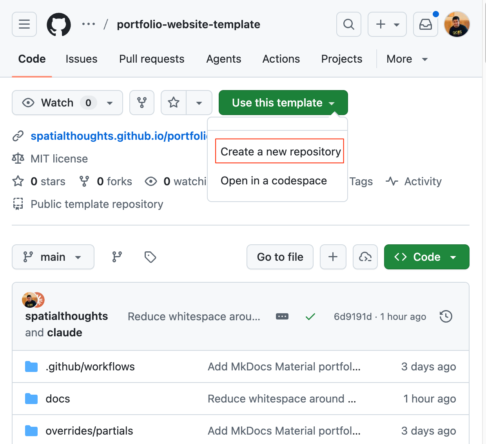
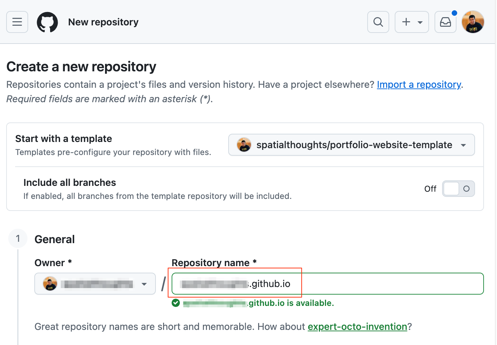
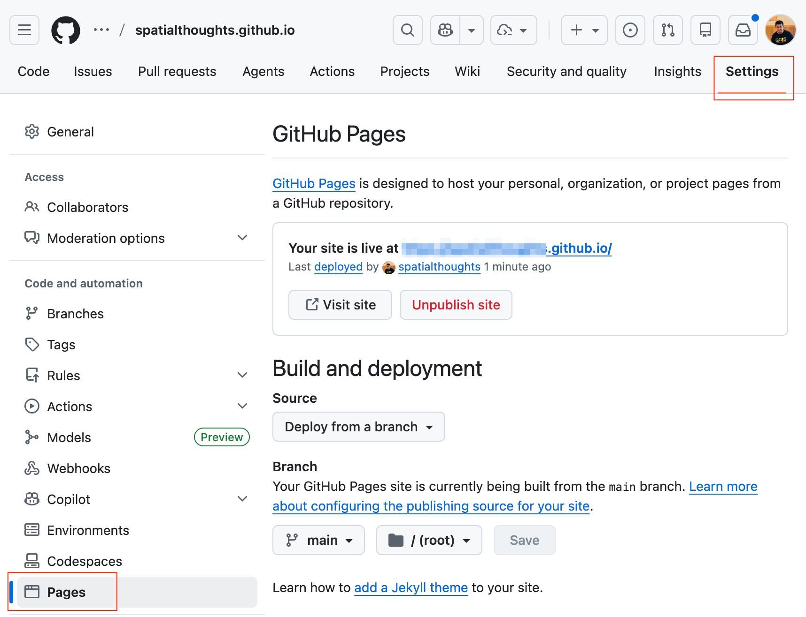
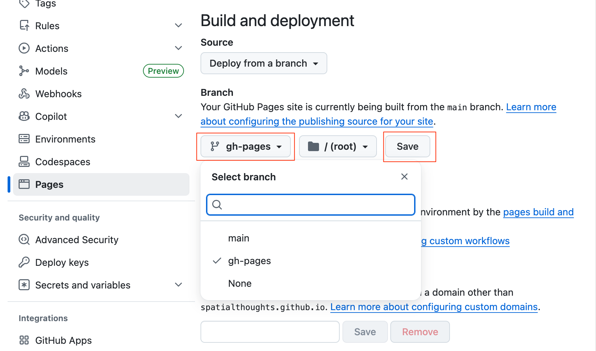
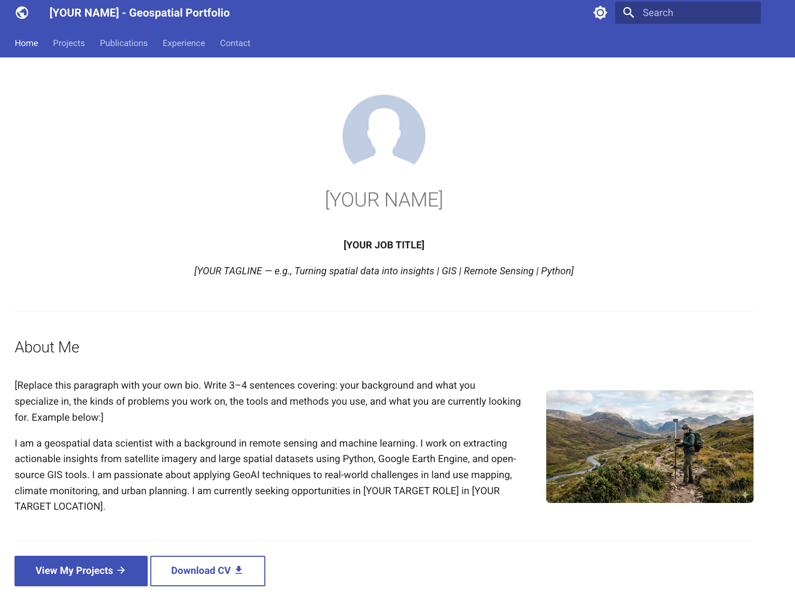

\newpage

***

```{r echo=FALSE, fig.align='center', out.width='75%', out.width='250pt'}

```

***

\newpage

# Introduction 

This workshop is designed to help you create and publish a modern portfolio website. We will start with a ready-to-use portfolio website template for geospatial professionals and learn how to edit and setup your GitHub repository to publish your website. At the end of the workshop, you will have a beautiful and customized website with your portfolio that is hosted for free on GitHub Pages and ready to be shared with your network. 

We will use the [MkDocs](https://www.mkdocs.org/) static site generator with [Material theme](https://squidfunk.github.io/mkdocs-material/) that creates modern responsive website from Markdown-formatted content.

This workshop will cover the following topics:

- Introduction to GitHub and GitHub pages.
- Introduction to Static Site Generators.
- Fundamentals of Markdown
- Introduction to MkDocs
- Use of AI-Assistants to automatically extract and format content from your CV and Project Reports.
- Setting up a local development environment and advanced customization

[{width="400px"}](https://docs.google.com/presentation/d/1SAZ6BGZ07VQKtVi0uSptDI4xhzYfQxDxvTZODamEXBU/edit?usp=sharing){target="_blank"}

----

# Installation and Setting up the Environment

## Sign-up for GitHub

# 1. Setting Up Your Repository

Make sure you are logged-in to your GitHub account before trying the following steps.


1. Go to the template repository at https://github.com/spatialthoughts/portfolio-website-template/. Go to **Use this template &rarr; Create a new repository**.

```{r echo=FALSE, fig.align='center', out.width='75%'}

```

2. Under *General*, enter the `Repository name`. To use GitHub Pages for free at https://your-username.github.io, name the repository exactly as `your-username.github.io` (replace your-username with your actual GitHub username). For example, if the github username is `spatialthoughts`, the repository name should be `spatialthoughts.github.io`. This is a special repository naming pattern that GitHub uses to publish the site at the root of your GitHub pages . Optionally, you may use any other name and the the site will be published at https://your-username.github.io/your-repository-name. Leave all other options as-is and click *Create Repository*.

```{r echo=FALSE, fig.align='center', out.width='75%'}

```

3. Your repository will now be created. When you first copy the template, a GitHub Action will run and setup a new branch named `gh-pages` and enable Github Pages. Wait for a minute for these tasks to finish and then go to **Settings &rarr; Pages**. It will show the URL of the portfolio website. Click on it to open the website in a new tab. It is not yet setup with the correct content.

```{r echo=FALSE, fig.align='center', out.width='75%'}

```

4. Scroll down to the *Branch* section and select `gh-pages` as the branch. Click *Save*. This will now take the HTML files generated by MkDocs and publish it on the Github Pages site. 

```{r echo=FALSE, fig.align='center', out.width='75%'}

```

5. Wait for a minute and refresh the tab with your website. It should now show the default template website hosted on your GitHub Pages.

```{r echo=FALSE, fig.align='center', out.width='75%'}

```


# 2. Updating Content

# 3. Extracting Content from Existing Resources

# 4. Setting-up a Local Development Environment

# 5. Advanced Customizations

# License

This workshop material is licensed under a [Creative Commons Attribution 4.0 International (CC BY 4.0)](https://creativecommons.org/licenses/by/4.0/). You are free to re-use and adapt the material but are required to give appropriate credit to the original author as below:

*Building Your Geospatial Portfolio Website* by Ujaval Gandhi [www.spatialthoughts.com](https://spatialthoughts.com)

&copy; 2026 Spatial Thoughts [www.spatialthoughts.com](https://spatialthoughts.com)