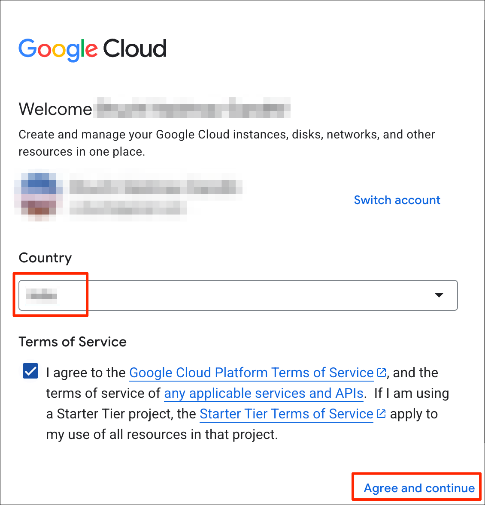
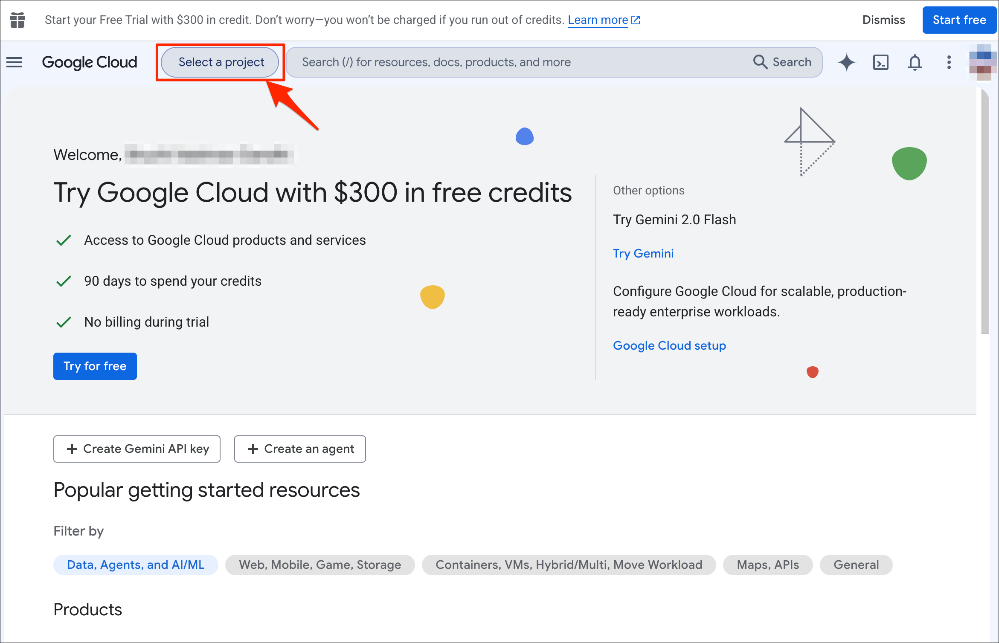
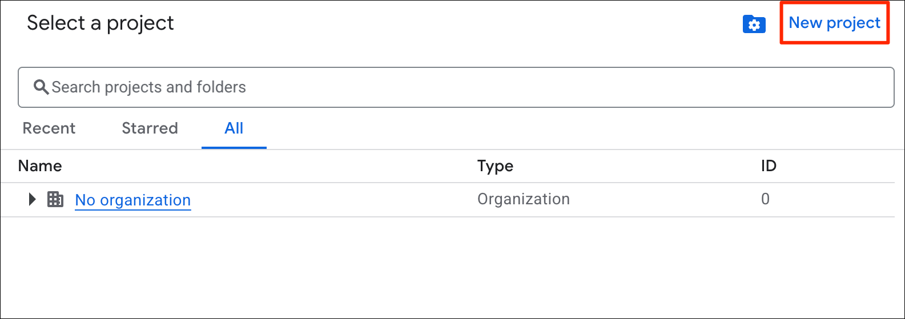
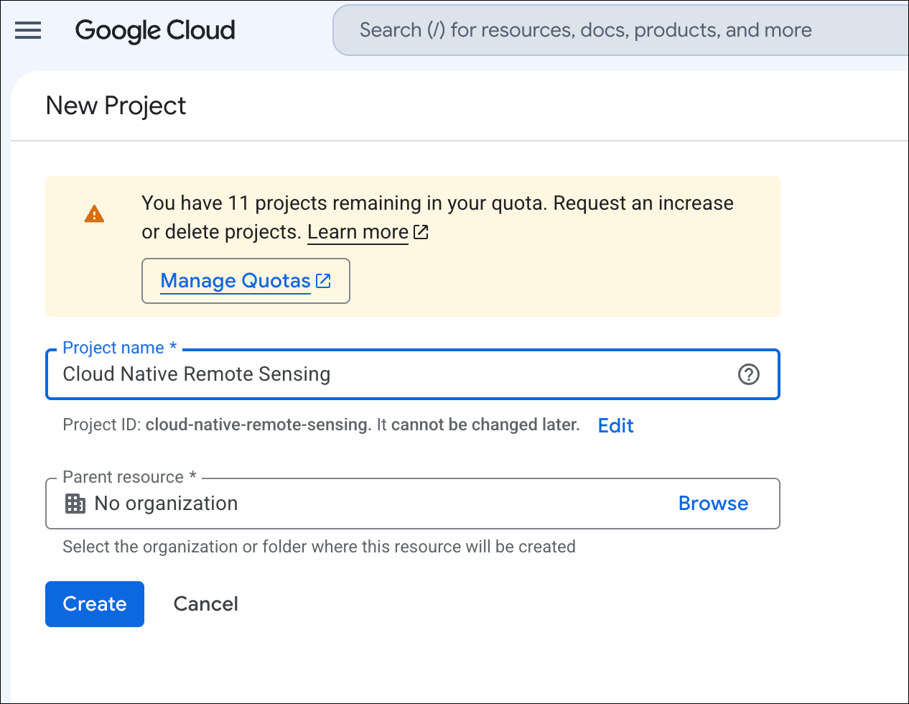
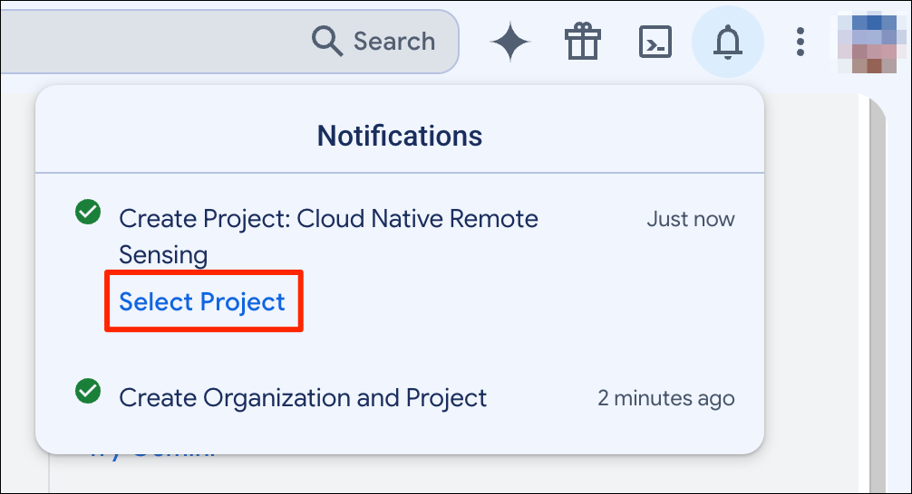
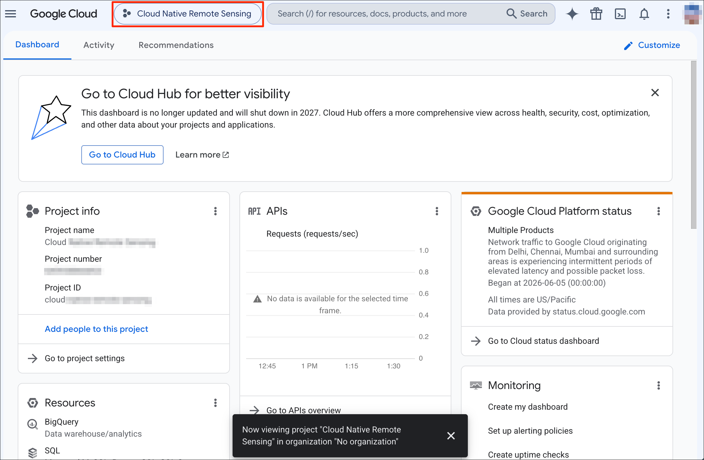
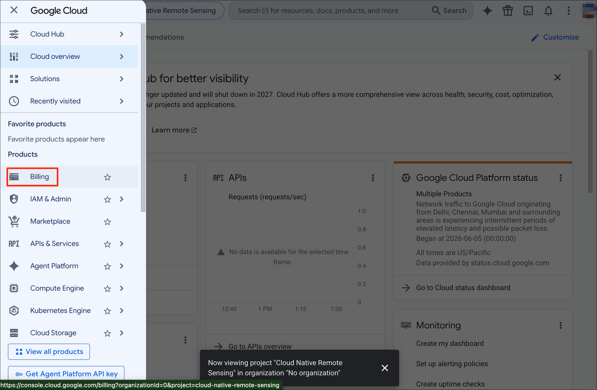
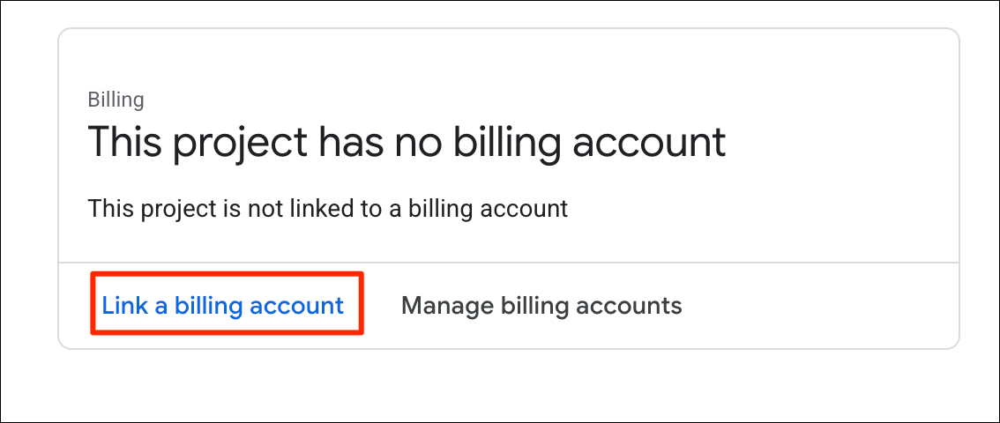
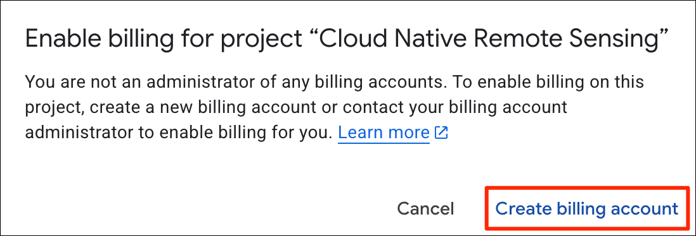
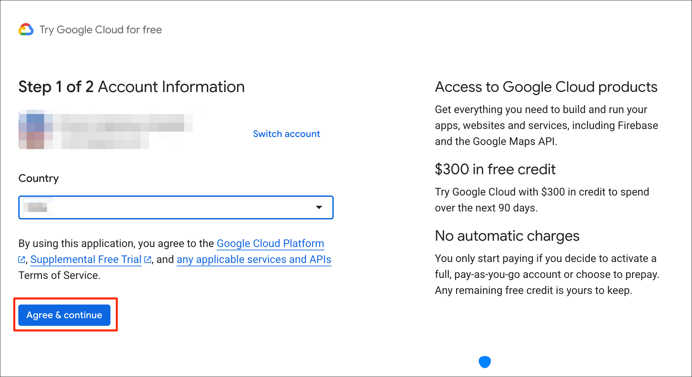

Google Cloud offers many services that help geospatial developers host data and run their computation. The following are some of the key geospatial offerings of Google Cloud Platform.

- Google Maps Platform
- Google Earth Engine
- Google Cloud Storage
- Google BigQuery
- Google Colab Enterprise

This guide will help you sign-up for an account, create your first project, set-up a billing account and activate services.

If you are looking to sign-up for Google Earth Engine - please visit our [Google Earth Engine Account Sign-up Guide](gee-sign-up.html).

----


## Create a Project and Setup a Billing Account

1. Visit Google Cloud Console https://console.cloud.google.com/. If you had previously not activated any cloud projects, you will be presented with a sign-up dialog. Choose your country and review the Terms of Service. Check the box to agree to the Terms of Service and click *Agree and continue*.

```{r echo=FALSE, fig.align='center', out.width='50%'}

```

2. Next step is to setup a **Project**. The project is like a workspace where you can enable certain APIs and configure services. Click on *Select a project* button.

> When you first login, you maybe presented with an offer for a free trial. You can also claim this offer later on when you first setup a billing account. 

```{r echo=FALSE, fig.align='center', out.width='75%'}

```

3. If this is your individual account, your projects will be part of a group named *No organization*. Click on the *New project* button.

```{r echo=FALSE, fig.align='center', out.width='50%'}

```

4. Enter a project name. You can choose any project name. It is recommended to make it descriptive so you can identify the purpose for which you created this project.

```{r echo=FALSE, fig.align='center', out.width='50%'}

```

5. Once the project is created, click on *Select Project*.

```{r echo=FALSE, fig.align='center', out.width='40%'}

```

6. The newly created project will be selected.

```{r echo=FALSE, fig.align='center', out.width='75%'}

```

7. Next, you need to setup a billing account and connect it to the project. Many Google Cloud services have a free tier but they still require setting up a billing account. Open the menu on the left-hand panel and select *Billing*.

```{r echo=FALSE, fig.align='center', out.width='75%'}

```

8. When prompted to connect a billing account, click *Link a billing account*.

```{r echo=FALSE, fig.align='center', out.width='40%'}

```

9. In the confirmation dialog, click *Create billing account*.

```{r echo=FALSE, fig.align='center', out.width='40%'}

```

10. The billing setup will depend on your country and available payment methods. Go through the setup and enter your payment information.

```{r echo=FALSE, fig.align='center', out.width='75%'}

```

## Setup a Budget and Alerts


----
