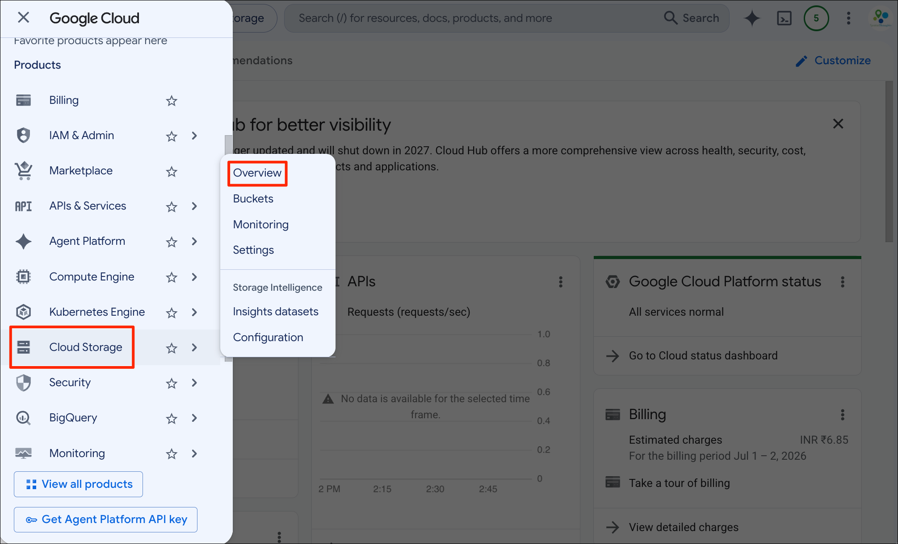
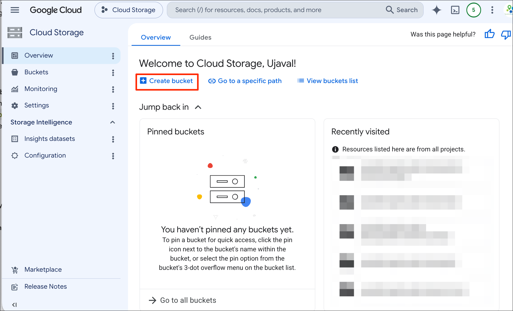
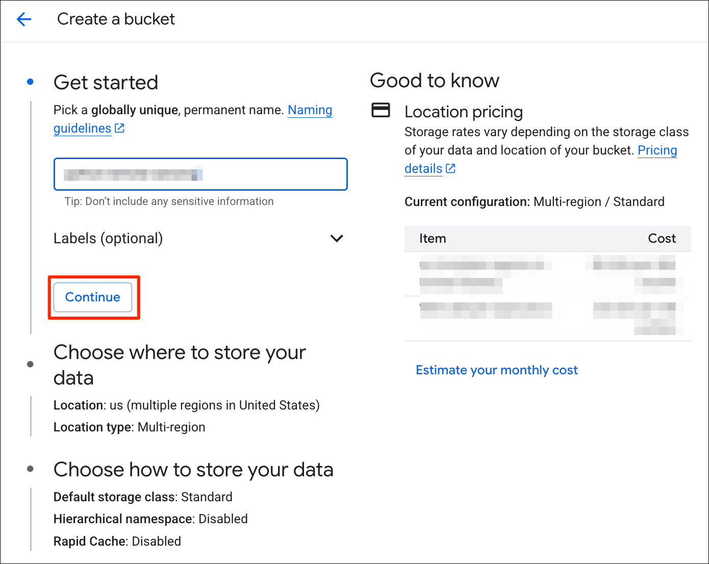
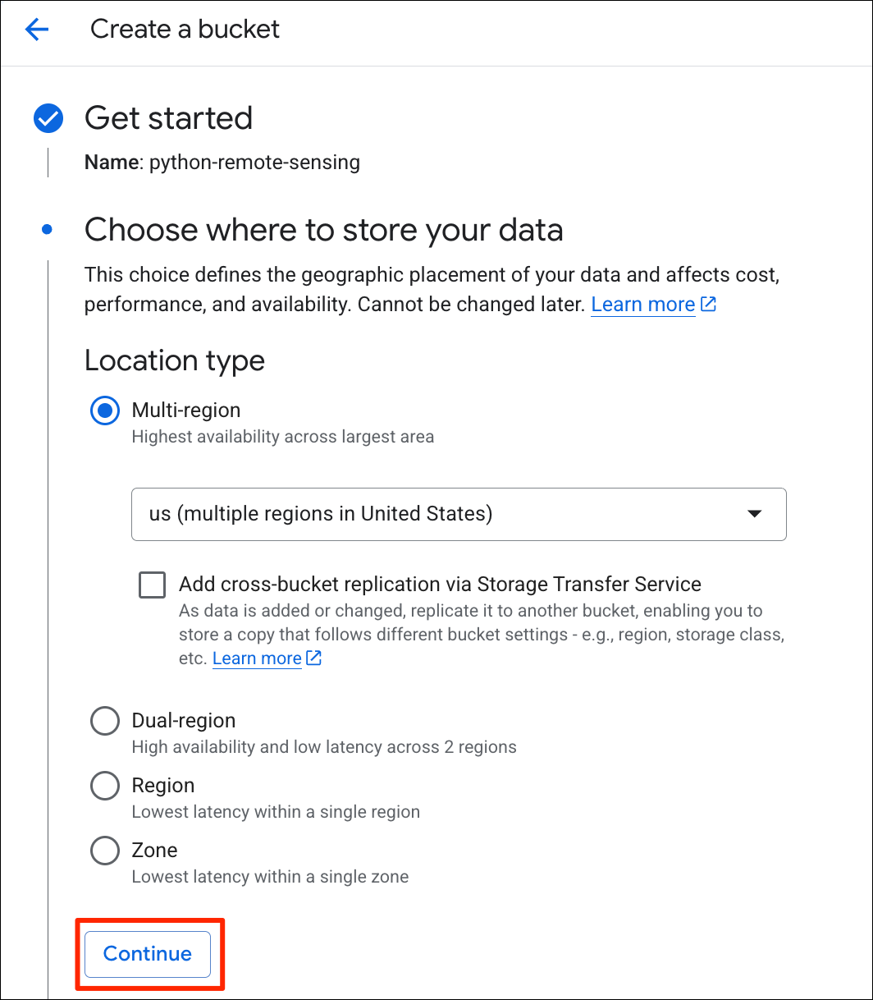
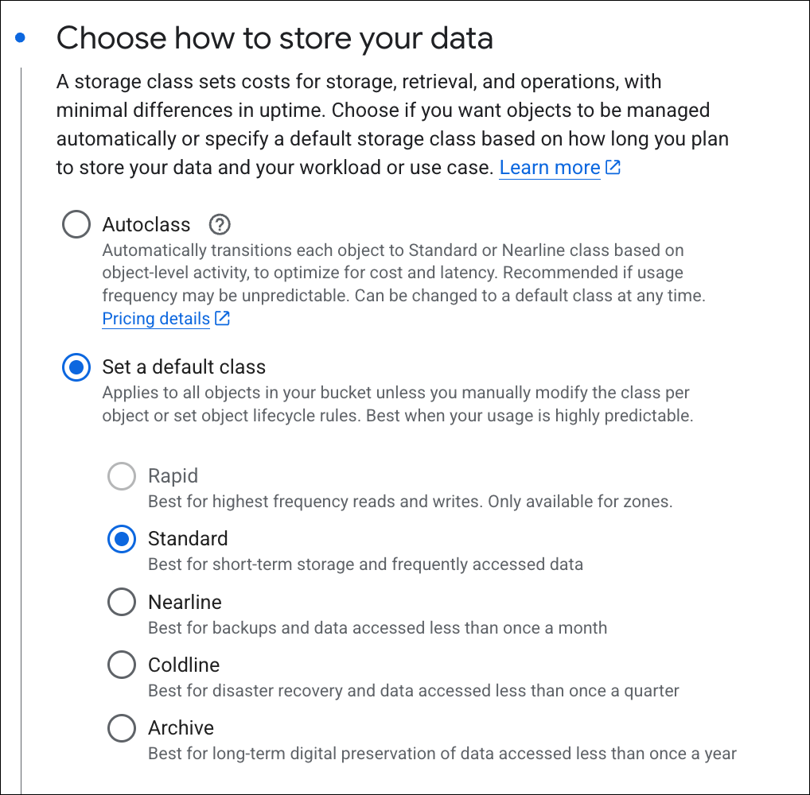
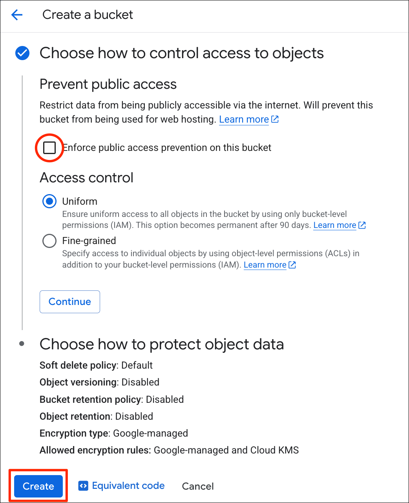
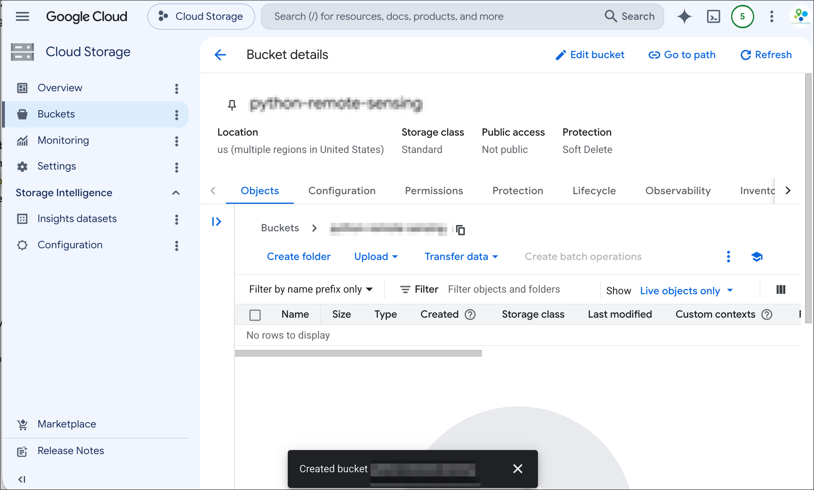

Google Cloud Storage is a data storage service that allows you to store binary and unstructured data. It is a cheap and fast option to store geospatial data in cloud-optimized formats such as Cloud Optimized GeoTIFFs (COGs), Zarr archives and GeoParquet files. This guide will show you how to use this service to activate the service, create a bucket, configure it for public access and upload your data.

> This is a simplified guide for our course participants and not an official document. Refer to the [Google Cloud Storage Documentation](https://docs.cloud.google.com/storage/docs) for official instructions.

----


## Before You Start

To use the Google Cloud Storage service, you must have a Google Cloud Project with billing enabled. See our [Google Cloud Sign-up Guide](google-cloud-sign-up.html) to learn how to setup a project and enable billing.

## Create a Bucket

A **Bucket** is the top-level container in Google Cloud Storage. It is like a *folder* that can contain other folders and files. Let's create a bucket.

1. Open your [Google Cloud Console](https://console.cloud.google.com/). Open the menu from the left-hand panel and go to the **Cloud Storage &rarr; Overview**.

```{r echo=FALSE, fig.align='center', out.width='75%'}

```

2. Click the *+ Create bucket* button.

```{r echo=FALSE, fig.align='center', out.width='75%'}

```

3. Enter a bucket name. The bucket name has to be globally-unique as you can refer to your bucket with just it's name like `gs://<my-bucket-name>` without referring to a project or an account name. Once you find a unique name for your bucket, click *Continue*.

```{r echo=FALSE, fig.align='center', out.width='50%'}

```

4. Next, choose a region for your data. The data will be stored in a data center in the chosen region. You should choose a region closest to the users who will access the data. Click *Continue*.

```{r echo=FALSE, fig.align='center', out.width='50%'}

```

5. Next, you need to decide the storage class. For data that will be accessed in your web applications and GIS viewers, the *Standard** storage class is a good choice. Click *Continue*.

```{r echo=FALSE, fig.align='center', out.width='50%'}

```

6. If you are create a bucket for public access (i.e. hosting data for a website), uncheck the *Enforce public access prevention on this bucket* option. You can review the defaults for *Choose how to protect object data* and Click *Create*.

```{r echo=FALSE, fig.align='center', out.width='50%'}

```

7. Your bucket is now created.

```{r echo=FALSE, fig.align='center', out.width='75%'}

```


----
