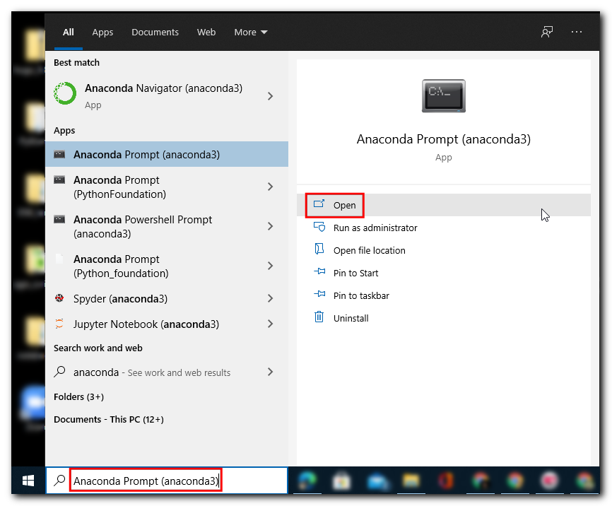
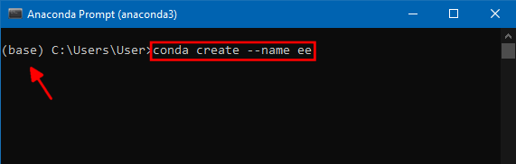
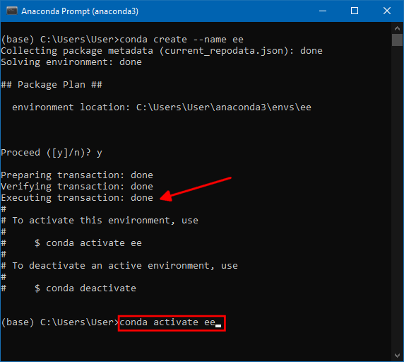
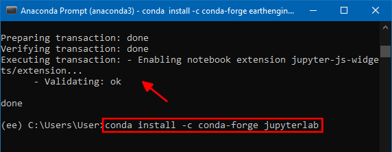
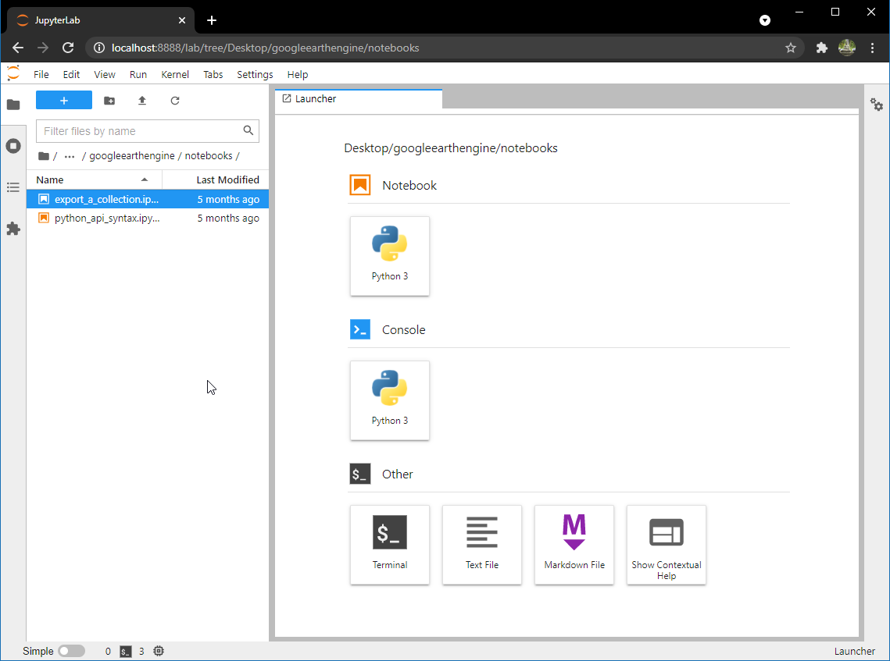
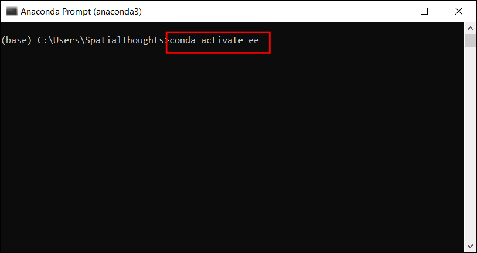

## Installation

The preferred method for installing the Earth Engine Python API is via Anaconda. 

1. [Download the Anaconda Installer](https://www.anaconda.com/products/individual) for Python 3.7 (or a higher version) for your operating system. Once downloaded, double click the installer and install it into the default suggested directory. Select an install for *Just Me* and **use default settings**. *Note: If your username has spaces, or non-English characters, it causes problems. In that case, you can install it to a path such as  `C:\anaconda`.*

```{r echo=FALSE, fig.align='center', out.width='75%'}
knitr::include_graphics('images/common/eeapi_conda1.png')
```

2. (*Windows users*) Once installed, search for *Anaconda Prompt* launch it. (*Mac/Linux users*): Launch a *Terminal* window.

```{r echo=FALSE, fig.align='center', out.width='75%'}

```

3. Once the prompt launches, it will be in the *base* environment. It is a good practice to install new packages in a separate environment. We will new create a new environment to install Earth Engine related packages. Enter the below code to create a new environment called **ee**. 

> Note: You can use the shortcut *Shift + Insert* to paste commands in Anaconda Prompt.

```
conda create --name ee
```

```{r echo=FALSE, fig.align='center', out.width='75%'}

```

4. Anaconda will validate the conda commands and before proceeding will ask for confirmation, press **y**, and **enter** to confirm. 

```{r echo=FALSE, fig.align='center', out.width='75%'}
knitr::include_graphics('images/common/eeapi_conda4.png')
```

5. Once the environment is created the *Executing transaction: done* message will be displayed, if the execution is not successful, it will be marked as failed with an error message. Enter the code to activate the environment.

```
conda activate ee
```

```{r echo=FALSE, fig.align='center', out.width='75%'}

```

6. Now the ```(base)``` will be replaced with ```(ee)``` indicating the environment is activated, now libraries in this environment will not affect the base environment. Also, these libraries can be used only in this environment cannot be accessed from the base or other environments. 

```{r echo=FALSE, fig.align='center', out.width='75%'}
knitr::include_graphics('images/common/eeapi_conda6.png')
```

7. Now, the **earthengine-api** library can be installed using the conda-forge enter the below code, anaconda prompt will ask for confirmation, press **y** and **Enter** to install the library.

```
conda install -c conda-forge earthengine-api
```


```{r echo=FALSE, fig.align='center', out.width='75%'}
knitr::include_graphics('images/common/eeapi_conda7.png')
```

8. On successful installation *Executing transaction: done* will be displayed, enter the below code to install *geemap* library. 

```
conda install -c conda-forge geemap
```

```{r echo=FALSE, fig.align='center', out.width='75%'}
knitr::include_graphics('images/common/eeapi_conda8.png')
```

9. Once the library installs successfully, enter the below code to install ```jupyter lab```, it is a browser-based user interface that can be used for executing python commands in a notebook format file. 

```
conda install -c conda-forge jupyterlab
```

```{r echo=FALSE, fig.align='center', out.width='75%'}

```

10. On successful installation *Executing transaction: done* will be displayed. To launch it enter the below code and click enter. 

```
jupyter lab
```

```{r echo=FALSE, fig.align='center', out.width='75%'}
knitr::include_graphics('images/common/eeapi_conda10.png')
```


11. A new browser tab will open with an instance of JupterLab. Click the *Python 3*  button under *Notebooks*.

> Note: Do not close the Anaconda prompt as the jupyter server is running using this connection, which will be interrupted if the prompt is closed.  

```{r echo=FALSE, fig.align='center', out.width='75%'}

```

12. Enter the below code and click the *Run* button, if the execution is successful all the libraries and their dependencies are installed successfully. 

```
import ee
import geemap
```   

```{r echo=FALSE, fig.align='center', out.width='75%'}
knitr::include_graphics('images/common/eeapi_conda12.png')
```


## Authentication

To run Python scripts locally using the `ee` module, you must complete a one-time authentication using the steps below. Once you complete the authentication flow, a token is permanently saved on the machine and will be used by the API automatically. This should be done only once on your machine.

1. Launch a terminal and activate the environment where you have installed the `earthengine-api` package. If you haven't created an environment yet, refer to our [installation guide](#introduction-to-the-python-api).

```
conda activate ee
```

```{r echo=FALSE, fig.align='center', out.width='75%'}

``` 


2. Earth Engine API comes with a [Command Line Interface](https://developers.google.com/earth-engine/guides/command_line) (CLI) in form of the `earthengine` command. Run the command to check if it is successfully installed.

```
earthengine
```

```{r echo=FALSE, fig.align='center', out.width='75%'}
knitr::include_graphics('images/common/eeapi_auth02.png')
```

3. If the installation is correct, you should get a summary of available commands in the earth engine. If you get an error, follow the steps in  our [installation guide](#introduction-to-the-python-api).

```{r echo=FALSE, fig.align='center', out.width='75%'}
knitr::include_graphics('images/common/eeapi_auth03.png')
```

4. Let’s authenticate the client library by running the `authenticate` command. This command will open the default browser to verify your google earth engine account. Make sure the earth engine account is logged in from that browser. Follow the authentication flow till you get a token.

```
earthengine authenticate
```

```{r echo=FALSE, fig.align='center', out.width='75%'}
knitr::include_graphics('images/common/eeapi_auth04.png')
```

5. Copy the token and paste it. Click *Enter*. 

```{r echo=FALSE, fig.align='center', out.width='75%'}
knitr::include_graphics('images/common/eeapi_auth05.png')
```

6. You will receive a success message once the authentication is complete. 

```{r echo=FALSE, fig.align='center', out.width='75%'}
knitr::include_graphics('images/common/eeapi_auth06.png')
```

Now your environment is ready to run Python scripts that use the Google Earth Engine API.