## Install Git

### Windows

1. Go to [git-scm.com](https://git-scm.com/install/windows) and download the latest version of *Git for Windows*. During install, accept all defaults.

```{r echo=FALSE, fig.align='center', out.width='75%'}
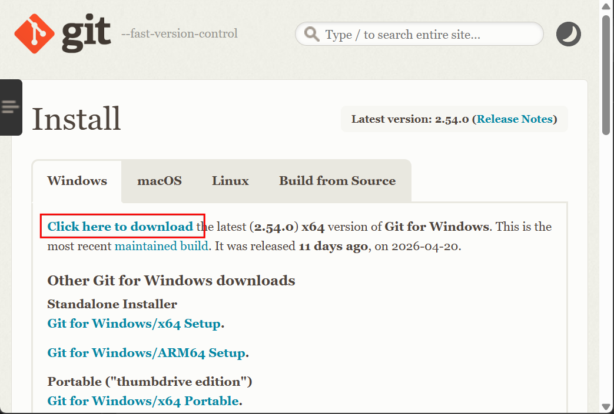
```

### Mac

Most versions of MacOS will already have Git installed, and you can activate it through the terminal. Open *Terminal* and run the following command. If Git is installed, it will print the version. If it is not installed, macOS will prompt you to install it.

```
git --version
```

```{r echo=FALSE, fig.align='center', out.width='60%'}
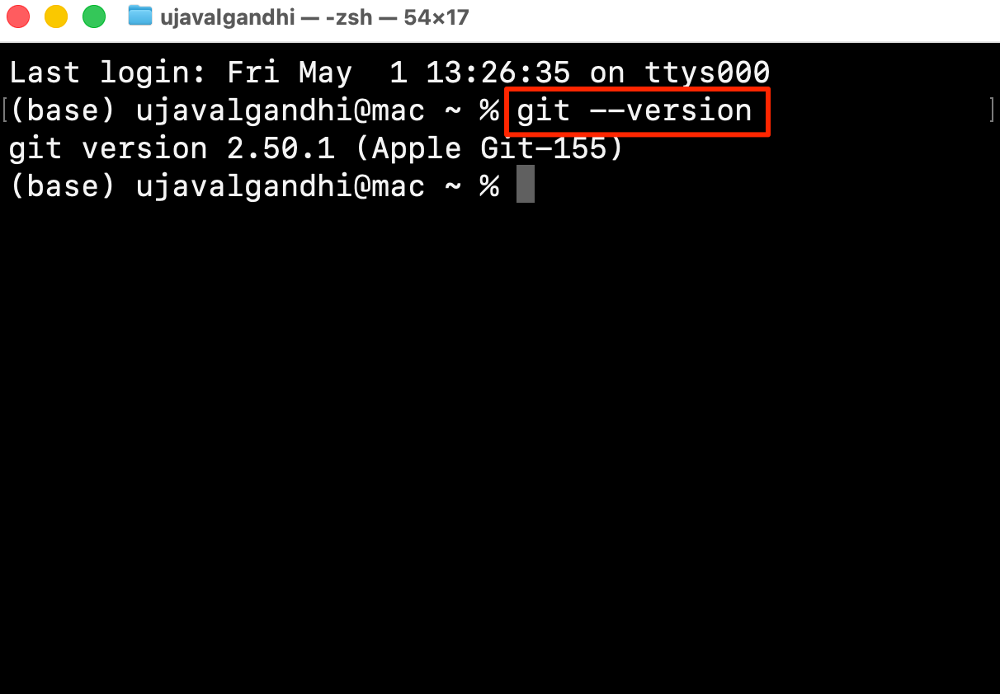
```

### Linux

You can install Git via the package management tool for your Linux distribution. GitHub has a detailed [Install Git for Linux](https://github.com/git-guides/install-git#install-git-on-linux) guide with instructions for different operating systems.


## Configure Git

Once installed, *(Windows users)*, search for Windows Powershell and launch it. *(Mac/Linux users)*: Launch a Terminal window.

Run the following commands to set your name and email. Make sure to change `<Your Name>` and `<your-email@example.com>` with your own details.

```bash
git config --global user.name "<Your Name>"
```

```bash
git config --global user.email "<your-email@example.com>"
```

```{r echo=FALSE, fig.align='center', out.width='75%'}
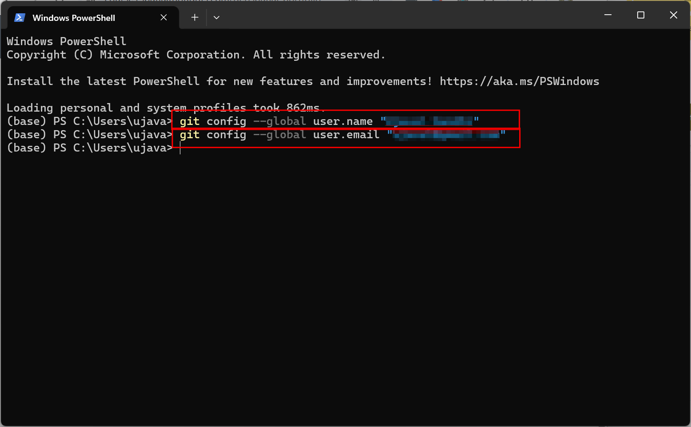
```

## Install GitHub CLI

GitHub offers a Command-Line Interface (CLI) to manage your GitHub account. We will install and configure it so you can push updates to your GitHub repositories.

### Windows

Search for *Windows Powershell* and launch it. Enter the following command and follow the installation prompts.

```
winget install --id GitHub.cli
```

```{r echo=FALSE, fig.align='center', out.width='75%'}
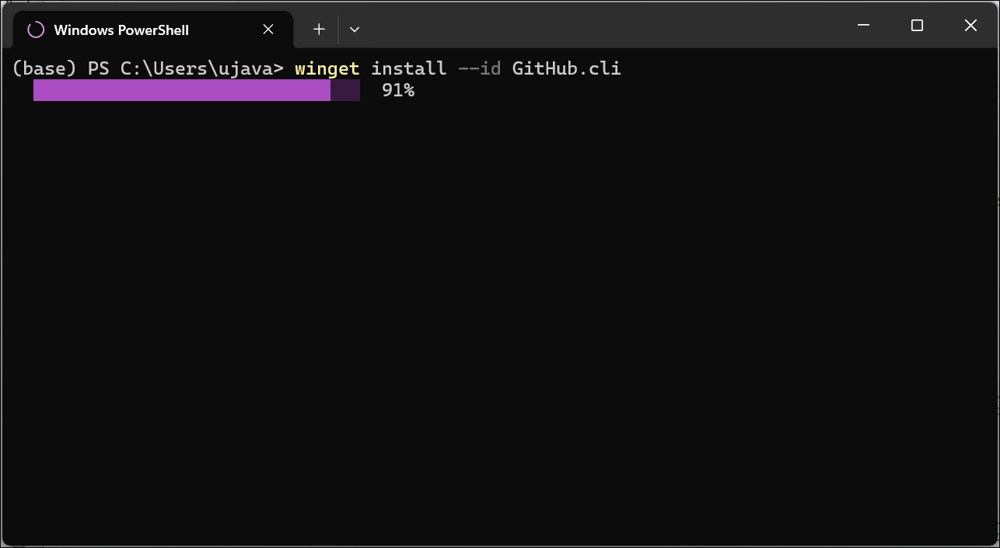
```

In case you have trouble with this method, Github also offers [pre-compiled binaries](https://github.com/cli/cli/blob/trunk/docs/install_windows.md#precompiled-binaries) that can be downloaded and installed directly.

### Mac

You can install the GitHub CLI via Homebrew. In case you do not have Homebrew install, head over to [Homebrew](https://brew.sh/) and install it first. 

Open a Terminal and enter the following command

```
brew install gh
```

```{r echo=FALSE, fig.align='center', out.width='75%'}
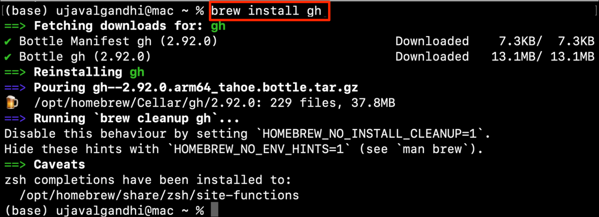
```

In case you have trouble with this method, Github also offers [pre-compiled binaries](https://github.com/cli/cli/blob/trunk/docs/install_macos.md#precompiled-binaries) that can be downloaded and installed directly.

### Linux

Visit [GitHub CLI Linux & Unix Installation](https://github.com/cli/cli#linux--unix) guide for instructions for your distribution.

## Configure GitHub CLI

You will need a GitHub account for this section. If you do not have one, visit [GitHub.com](https://github.com/) and create a free account. 

1. *(Windows users)*, search for Windows Powershell and launch it. *(Mac/Linux users)*: Launch a Terminal window. Enter the following command to sign-in to your GitHub account.

```{r echo=FALSE, fig.align='center', out.width='75%'}
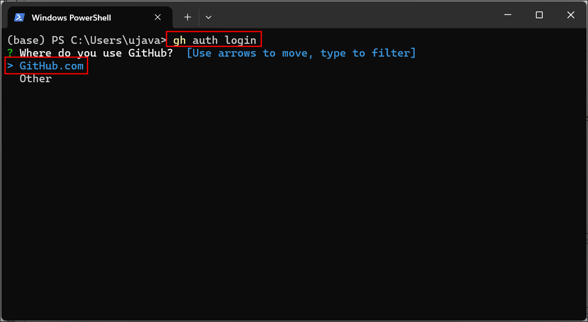
```

2. Select `GitHub.com` as the response for *Where do you use GitHub?* and press *Enter*. Next, select `HTTPS` as the response for *What is your preferred protocol for Git operations on this host?* and press *Enter*.

```{r echo=FALSE, fig.align='center', out.width='75%'}
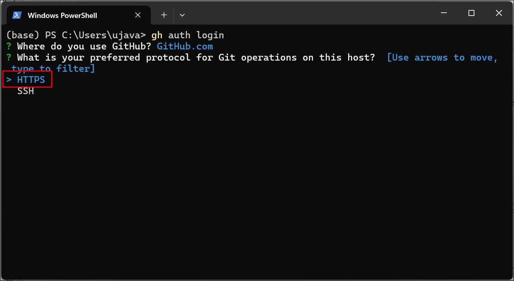
```

3. Choose `Login with a web browser` as the option for *How would you like to authenticate GitHub CLI?* and press *Enter*.

```{r echo=FALSE, fig.align='center', out.width='75%'}
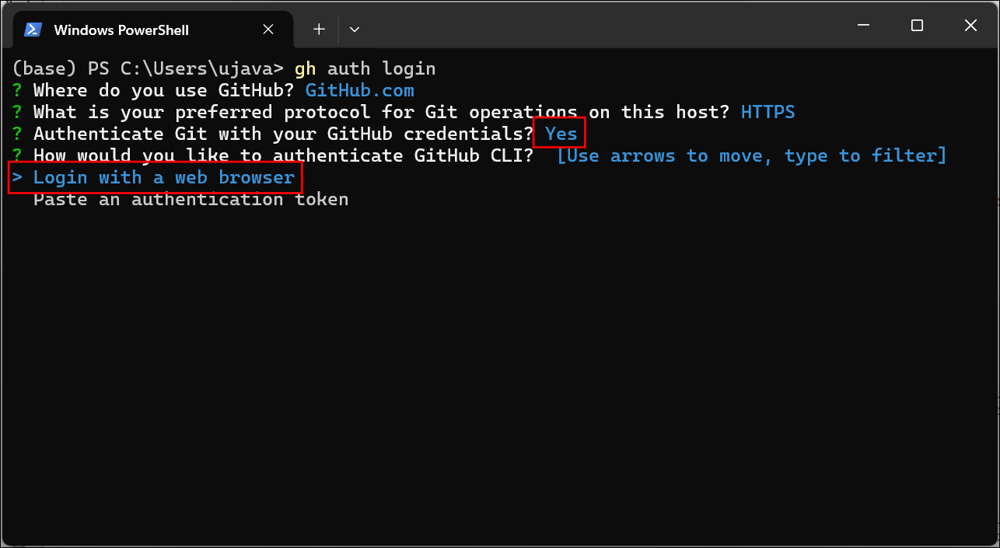
```

4. You will be prompted to copy a code. Select the code and copy it. You will need it in the next step. Press *Enter*.

```{r echo=FALSE, fig.align='center', out.width='75%'}
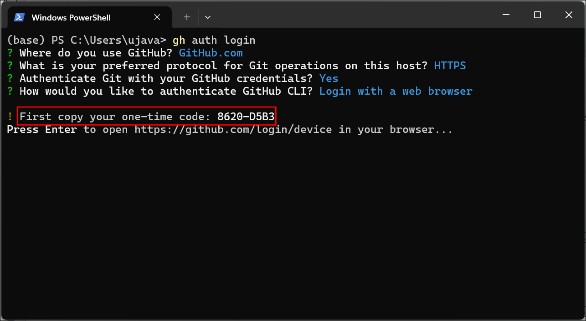
```

5. A new browser tab will open and you will be prompted to sign-in to GitHub for *Device Activation*. Click *Continue*.

```{r echo=FALSE, fig.align='center', out.width='60%'}
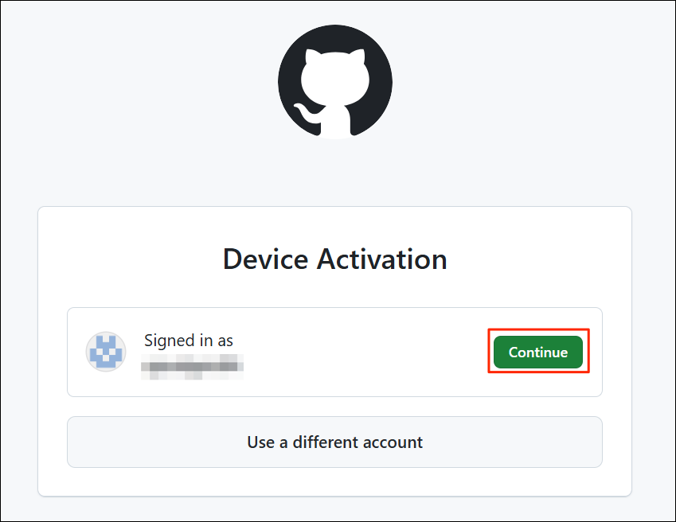
```

6. In the next step, you will have will be prompted to *Authorize your device*. Paste the code and click *Continue*.

```{r echo=FALSE, fig.align='center', out.width='60%'}
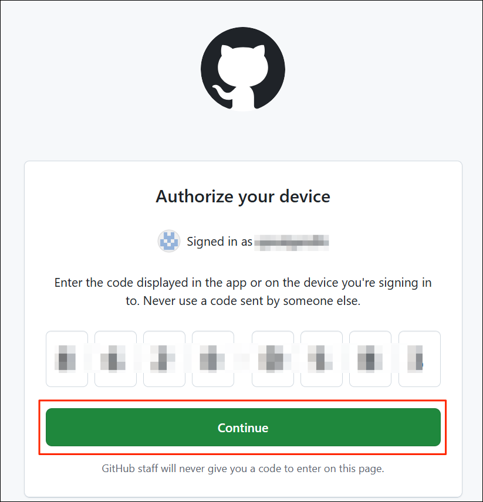
```

7. Once completed, you can close the browser tab.

```{r echo=FALSE, fig.align='center', out.width='60%'}

```

8. Back in the Terminal, you should see a confirmation message.

```{r echo=FALSE, fig.align='center', out.width='75%'}
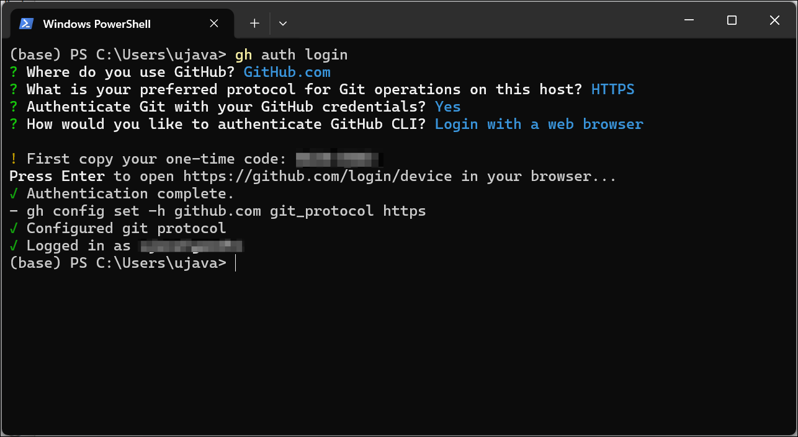
```

Your setup is now complete.