## Install QGIS on Windows


> Before you start: If you already have an older version of QGIS installed in your system, you need to uninstall it to avoid  dependency related errors. To uninstall, see our [uninstallation guide](uninstall-qgis-ltr.html#uninstall-qgis-on-windows).


1. Visit the [QGIS.org Download](https://qgis.org/en/site/forusers/download.html) page. On the page, you may donate or click on **Skip it and go to download** to see the download options. 

```{r echo=FALSE, fig.align='center', out.width='75%'}
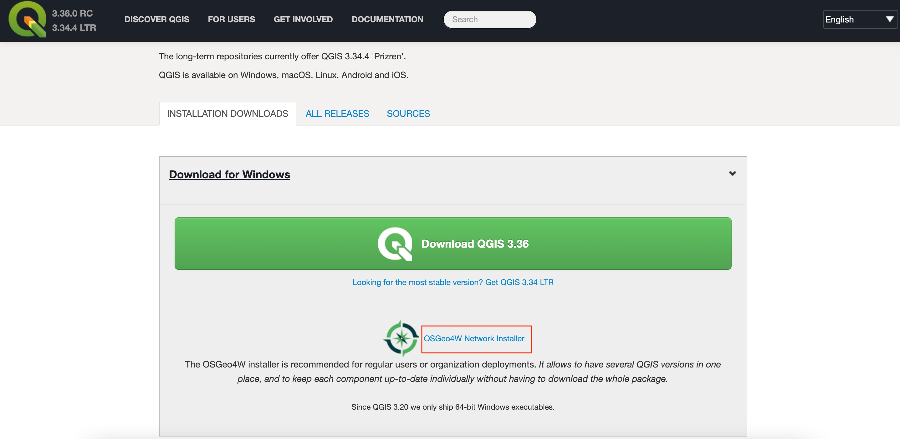
```

2. Scroll-down to find the option *Download for Windows*. Click the **OSGeo4W Network Installer**. The OSGeo4W Network Installer is the preferred way to install QGIS because it ensures you get all the required dependencies for the software.

```{r echo=FALSE, fig.align='center', out.width='75%'}
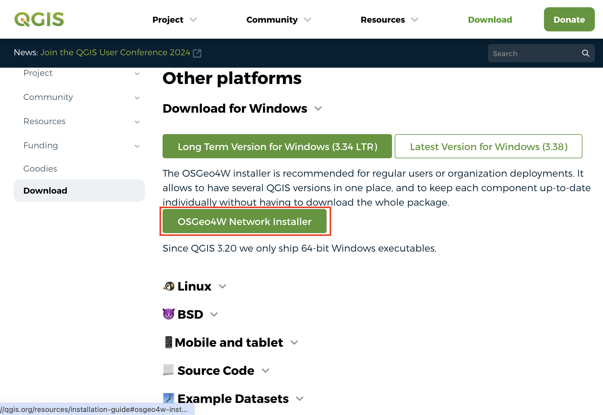
```

3. You will see the *Installation steps*. Click the **OSGeo4W Installer** link to start the download.

```{r echo=FALSE, fig.align='center', out.width='50%'}
knitr::include_graphics('images/common/winInstall03.png')
```

4. Once downloaded, double-click the osgeo4w-setup.exe to launch the installer.

```{r echo=FALSE, fig.align='center', out.width='50%'}
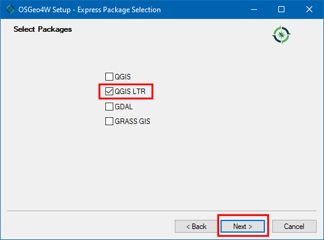
```

5. In the **OSGeo4W Setup** window, choose **Express Install** and click *Next*. If you are prompted to *Choose a Download Site*, select `http://download.osgeo.org` and click *Next*.

```{r echo=FALSE, fig.align='center', out.width='50%'}
knitr::include_graphics('images/common/winInstall05.png')
```

6. Select **QGIS LTR** and click *Next*. 

```{r echo=FALSE, fig.align='center', out.width='50%'}
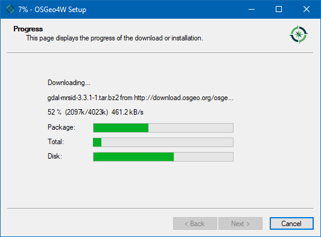
```

7. Accept all the terms and conditions and click *Next*. You will have to accept terms for some  non open-source packages.

```{r echo=FALSE, fig.align='center', out.width='75%'}
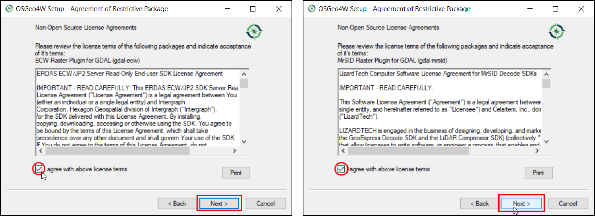
```

8. Download will begin. 

```{r echo=FALSE, fig.align='center', out.width='50%'}
knitr::include_graphics('images/common/winInstall08.png')
```

9. Once the download gets completed, search for **QGIS** in the Windows Start Menu and choose the *QGIS Desktop 3.40*, click *Open*. 

> You may have a slightly different minor version than shown here. As long as the version number starts with 3.40, it should be fine.

```{r echo=FALSE, fig.align='center', out.width='75%'}
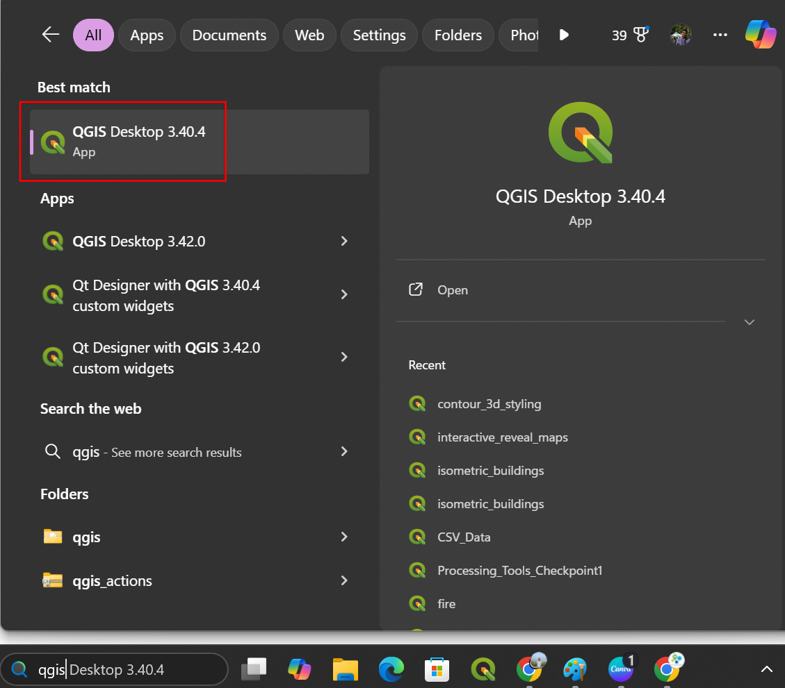
```

## Install QGIS on Mac

There are several different ways to install QGIS on Mac computers. We recommend the official installers provided by QGIS.org and have provided step-by-step instructions for their installation below. 

### Official Installers

1. Visit the [QGIS.org Download](https://qgis.org/en/site/forusers/download.html) page. On the page, you may donate or click on **Skip it and go to download** to see the download options.

```{r echo=FALSE, fig.align='center', out.width='75%'}
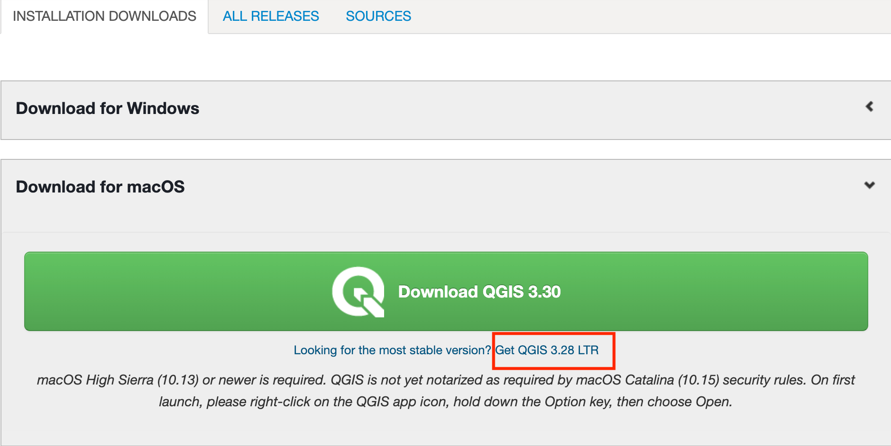
```

2. Go to **Download for macOS** under *Installation Downloads*. Click on the **Long Term Version for Mac OS (3.40 LTR)** to start the download.

```{r echo=FALSE, fig.align='center', out.width='75%'}
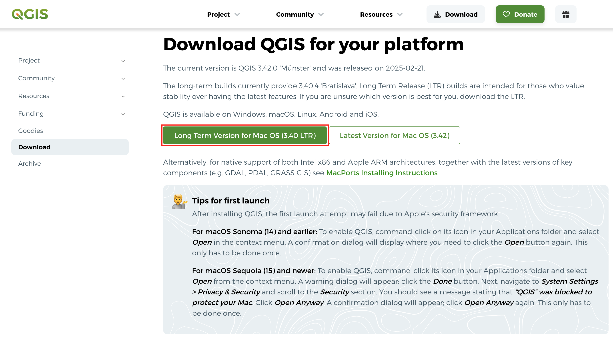
```

3.Once downloaded, double-click the `qgis-macos-ltr.dmg` file to open the package. Drag the **QGIS-LTR** icon to the *Applications* folder.

```{r echo=FALSE, fig.align='center', out.width='75%'}
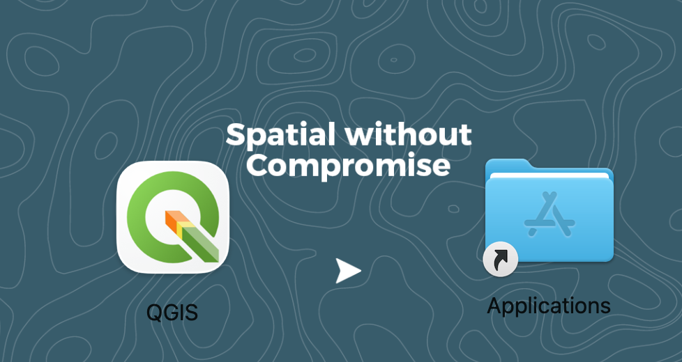
```

4. It will copy QGIS to the *Application* folder. This process can take up to 15 minutes.

```{r echo=FALSE, fig.align='center', out.width='60%'}
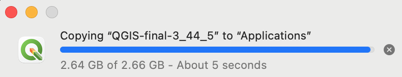
```

5. Once finished, Go to the *Applications* folder. Find the **QGIS-LTR** application and double-click to launch it.

```{r echo=FALSE, fig.align='center', out.width='75%'}
knitr::include_graphics('images/common/mac5.png')
```

6. The first time you launch the program, you will get a warning that *"QGIS-LTR" can't be opened because Apple cannot check for malicious software*. Click *OK*.

```{r echo=FALSE, fig.align='center', out.width='50%'}
knitr::include_graphics('images/common/mac6.png')
```

7. Go to *Preferences &rarr; Security & Privacy &rarr; General*. (On newer versions of MacOS, the setting has been moved to *System Settings &rarr; Privacy & Security &rarr; Security*). Click the *Open Anyway* button to launch QGIS. You may have to click the *Lock* icon and enter your password to enable the button. This step needs to be done only once. The next time, you can launch QGIS-LTR directly from the Applications folder. 

```{r echo=FALSE, fig.align='center', out.width='75%'}
knitr::include_graphics('images/common/mac7.png')
```

### Third-party Installers

Offical mac packages provided by QGIS do not come with support for newer data formats (such as GeoParquet) and has older versions of libraries such as PDAL (used for point-cloud processing). If you need these features, you can use the following alternate installation methods.

* [MacPorts](https://www.qgis.org/resources/installation-guide/#macports): Provides native packages for Intel as well as Apple processors. Support for latest libraries and formats. Slightly more complex installation process.
* [Conda Installer Packages](https://github.com/opengisch/qgis-conda-builder/releases): Installers based on conda packages. Provides native packages for Intel as well as Apple processors. Allows you to easily manage multiple versions of QGIS on your system. Lacks support for GRASS.

## Install QGIS on Ubuntu

QGIS-LTR packages are provided on a variety of Ubuntu versions. The instructions provided here are forUbuntu 22.04 Jammy Jellyfish, but they should work on other versions as well. 

1. Open a terminal. First install some required packages. Run the following command. You will be prompted for a confirmation, type **Y** and press *Enter*.

```
sudo apt install gnupg software-properties-common
```

```{r echo=FALSE, fig.align='center', out.width='75%'}
knitr::include_graphics('images/common/ubuntu1.png')
```

2. Next we install the QGIS Signing Key, so QGIS software from the QGIS repo will be trusted and installed

```
sudo mkdir -m755 -p /etc/apt/keyrings
sudo wget -O /etc/apt/keyrings/qgis-archive-keyring.gpg https://download.qgis.org/downloads/qgis-archive-keyring.gpg
```

```{r echo=FALSE, fig.align='center', out.width='75%'}
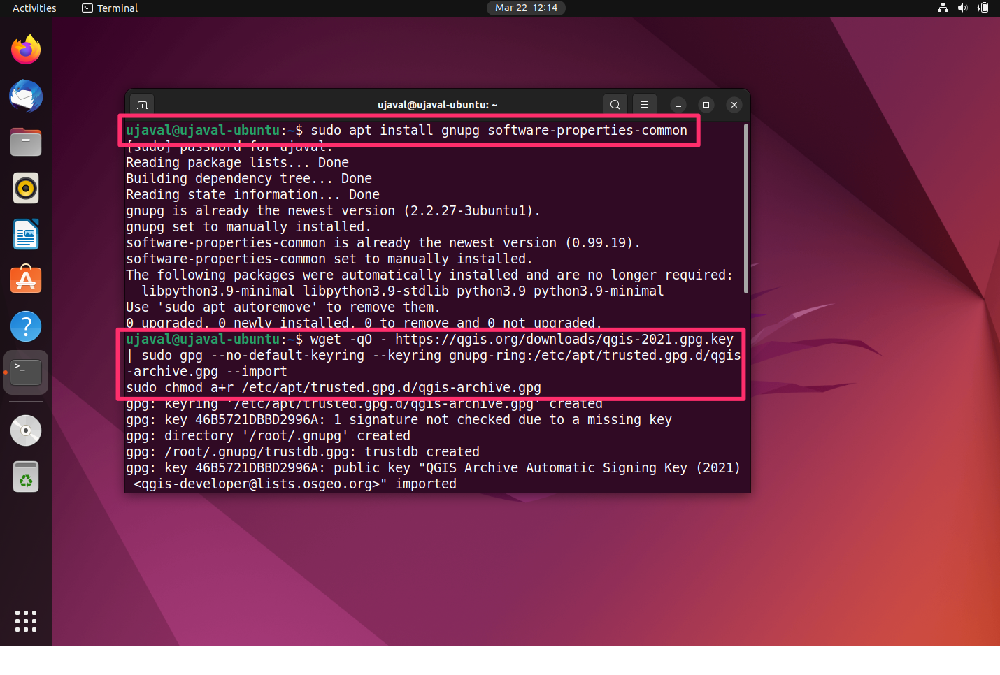
```


3. Now we need the QGIS-LTR repository for the Ubuntu version you are using. Note that the LTR packages are in the `qgis.org/ubuntu-ltr` repository. If you want the latest version of QGIS instead of LTR, replace it with `qgis.org/ubuntu`. First run `lsb_release -cs` to check the name of your version. You will need to use that name in the next step. Next, we need to add a new file with the details of the QGIS repository. Here we are using the `nano` editor to edit the file.

```
sudo nano /etc/apt/sources.list.d/qgis.sources
```

```{r echo=FALSE, fig.align='center', out.width='75%'}
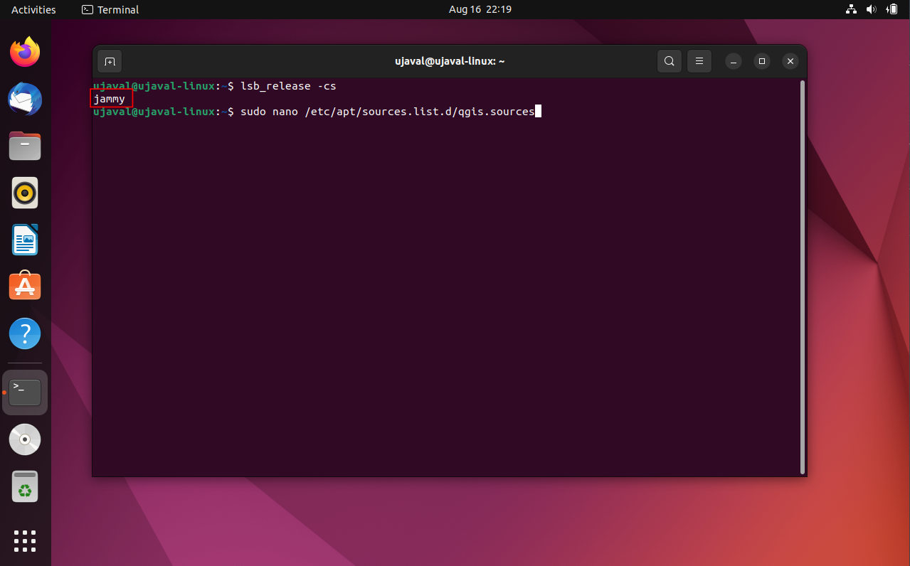
```

4. Paste the following content in the editor. Remember to change `jammy` with the name of your ubuntu version. After that press `Ctrl+O` (Save), now you will be prompted to give a file name. Leave it to default and press `Enter`, then press `Ctrl+X` (Exit).

```
Types: deb deb-src
URIs: https://qgis.org/ubuntu-ltr
Suites: jammy
Architectures: amd64
Components: main
Signed-By: /etc/apt/keyrings/qgis-archive-keyring.gpg
```

```{r echo=FALSE, fig.align='center', out.width='75%'}
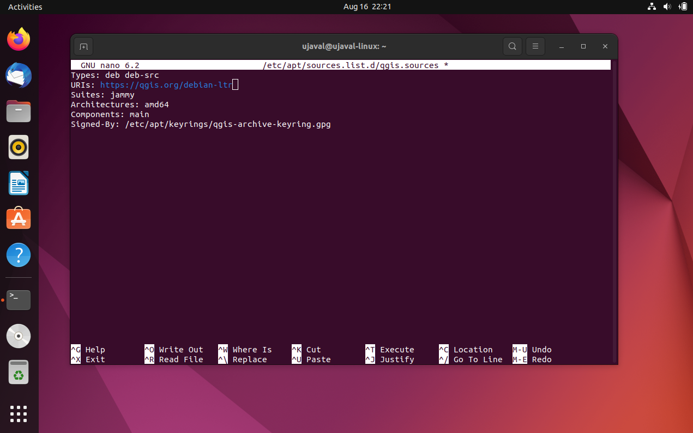
```


5. Update your repository to fetch the information from the newly added repository. 

```
sudo apt-get update
```

```{r echo=FALSE, fig.align='center', out.width='75%'}
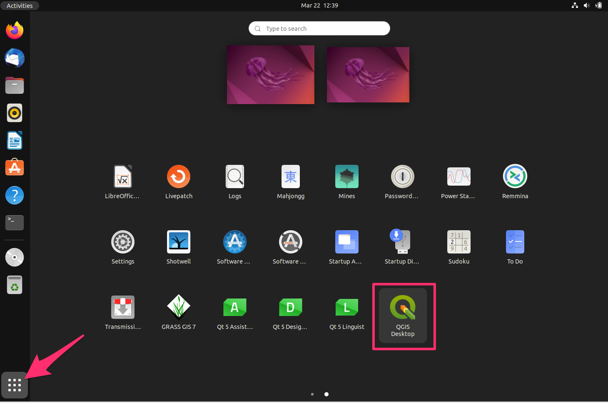
```

6. Once updated, you can install the `qgis` package. The `qgis-plugin-grass` is also recommended to get access to GRASS tools within QGIS. You will be prompted for a confirmation, type **Y** and press *Enter*.

```
sudo apt install qgis qgis-plugin-grass
```

```{r echo=FALSE, fig.align='center', out.width='75%'}
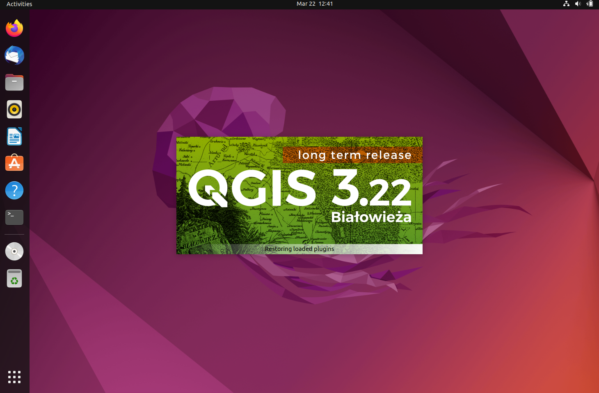
```

7. From Ubuntu Desktop, click the *Show Applications* button and locate the **QGIS** application. Click to launch it.

```{r echo=FALSE, fig.align='center', out.width='75%'}
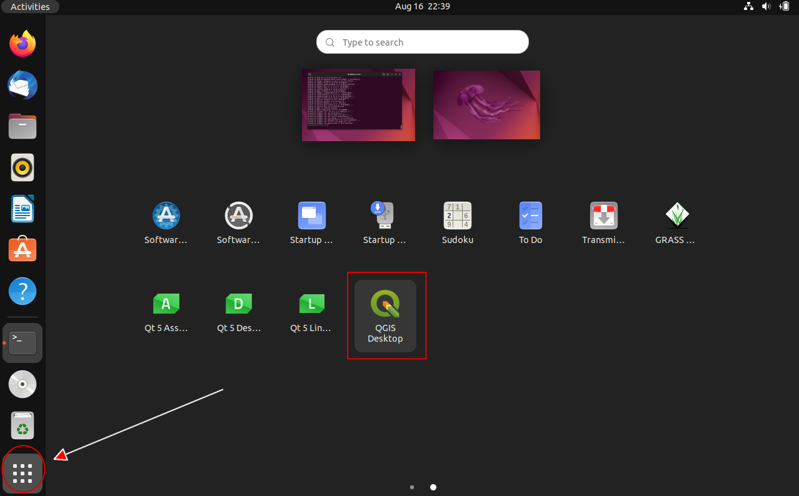
```

8. You now have QGIS-LTR version 3.40 running on your Ubuntu system.

```{r echo=FALSE, fig.align='center', out.width='75%'}
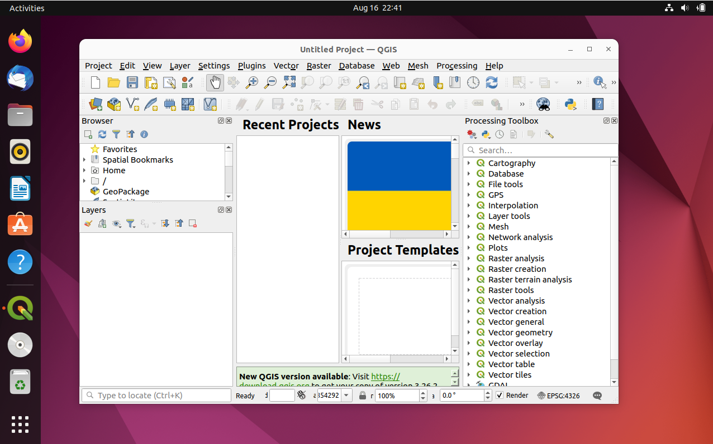
```


## Install QGIS on Linux

QGIS is supported on many linux flavors. 

* Ubuntu: Refer to our [step-by-step guide](#install-qgis-on-ubuntu).
* Other Distros: Follow the instructions for your distribution from [QGIS.org Downloads](https://qgis.org/en/site/forusers/alldownloads.html#linux).

## Install QGIS via Conda

If your distribution does not have a QGIS package, or you are having difficulty with the installation, you can install QGIS via Conda. This is also the preferred method for PyQGIS Development. You not only get all the Python bindings, but also a full QGIS installation with the user interface. Please follow the [Using QGIS from Conda](https://gisunchained.wordpress.com/2019/05/29/using-qgis-from-conda/) guide by Alexander Neto. 

To install the `QGIS-LTR` version from Conda, you must specify the full version name.
```
conda create --name qgis-ltr
conda activate qgis-ltr
conda install -c conda-forge qgis=3.40.4
```
