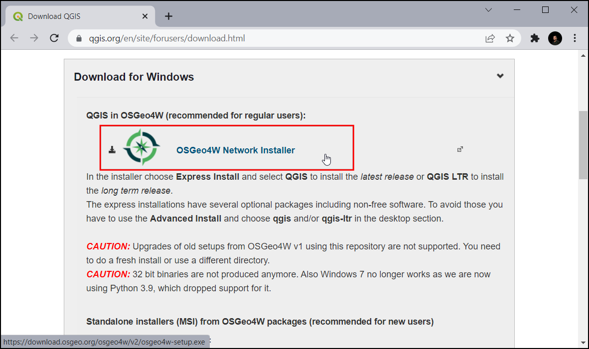
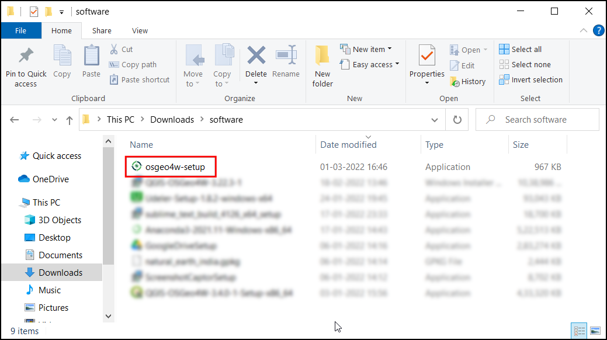
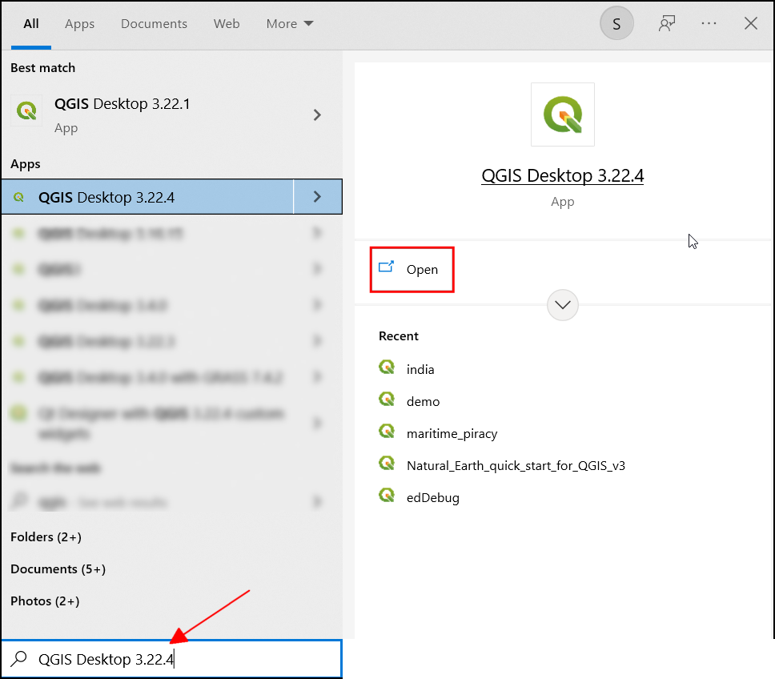
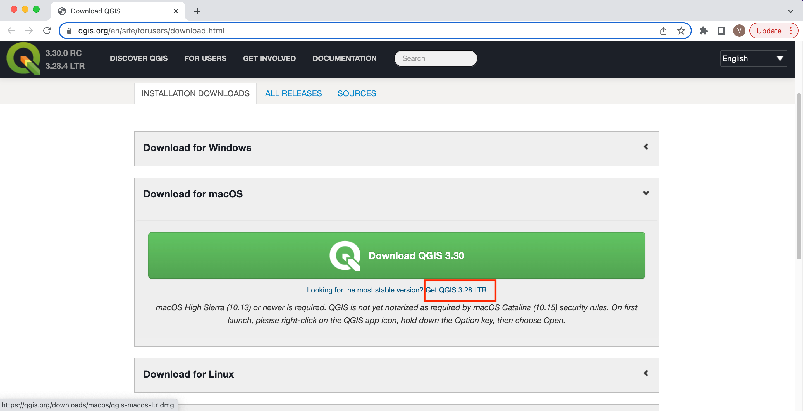

## Install QGIS on Windows


> Before you start: If you already have an older version of QGIS installed in your system, you need to uninstall it to avoid  dependency related errors. To uninstall, see our [uninstallation guide](uninstall-qgis-ltr.html#uninstall-qgis-on-windows).


1. Visit the [QGIS.org Download](https://qgis.org/en/site/forusers/download.html) page. Click the **OSGeo4W Network Installer** link to download the installer. The OSGeo4W Network Installer is the preferred way to install QGIS because it ensures you get all the required dependencies for the software.

```{r echo=FALSE, fig.align='center', out.width='75%'}

```

2. Once downloaded, double-click the `osgeo4w-setup.exe` to launch the installer. 

```{r echo=FALSE, fig.align='center', out.width='75%'}

```
3. In the **OSGeo4W Setup** window, choose **Express Install** and click *Next*. If you are prompted to *Choose a Download Site*, select `http://download.osgeo.org` and click *Next*.

```{r echo=FALSE, fig.align='center', out.width='50%'}
knitr::include_graphics('images/common/winInstall03.png')
```

4. Select **QGIS LTR** and click *Next*. 

```{r echo=FALSE, fig.align='center', out.width='50%'}
knitr::include_graphics('images/common/winInstall04.png')
```

5. Accept all the terms and conditions and click *Next*. You will have to accept terms for some  non open-source packages.

```{r echo=FALSE, fig.align='center', out.width='75%'}

```

6. Download will begin. 


```{r echo=FALSE, fig.align='center', out.width='50%'}
knitr::include_graphics('images/common/winInstall06.png')
```

7. Once the download gets completed, search for **QGIS** in the Windows Start Menu and choose the *QGIS Desktop 3.22*, click *Open*. 

> You may have a slightly different minor version than shown here. As long as the version number starts with 3.22, it should be fine.

```{r echo=FALSE, fig.align='center', out.width='75%'}

```

## Install QGIS on Mac

1. Visit the [QGIS.org Download](https://qgis.org/en/site/forusers/download.html) page. Click the **QGIS macOS Installer Version 3.22** under the *Official All-in-one, signed installers* section.

```{r echo=FALSE, fig.align='center', out.width='75%'}

```

2. Once downloaded, double-click the `qgis-macos-ltr.dmg` file to open the package. Drag the **QGIS-LTR** icon to the *Applications* folder.

```{r echo=FALSE, fig.align='center', out.width='75%'}
knitr::include_graphics('images/common/mac2.png')
```

3. It will copy QGIS to the *Application* folder. This process can take up to 15 minutes.

```{r echo=FALSE, fig.align='center', out.width='60%'}
knitr::include_graphics('images/common/mac3.png')
```

4. Once finished, Go to the *Applications* folder. Find the **QGIS-LTR** application and double-click to launch it.

```{r echo=FALSE, fig.align='center', out.width='75%'}
knitr::include_graphics('images/common/mac4.png')
```

5. The first time you launch the program, you will get a warning that *"QGIS-LTR" can't be opened because Apple cannot check for malicious software*. Click *OK*.

```{r echo=FALSE, fig.align='center', out.width='50%'}
knitr::include_graphics('images/common/mac5.png')
```

6. Go to *Preferences &rarr; Security & Privacy &rarr; General*. Click the *Lock* icon and enter your password. Click the *Open Anyway* button to launch QGIS. This step needs to be done only once. The next time, you can launch QGIS-LTR directly from the Applications folder.

```{r echo=FALSE, fig.align='center', out.width='75%'}
knitr::include_graphics('images/common/mac6.png')
```

## Install QGIS on Ubuntu

QGIS-LTR packages are provided on a variety of Ubuntu versions. The instructions provided here are forUbuntu 22.04 Jammy Jellyfish, but they should work on other versions as well. 

1. Open a terminal. First install some required packages. Run the following command. You will be prompted for a confirmation, type **Y** and press *Enter*.

```
sudo apt install gnupg software-properties-common
```

```{r echo=FALSE, fig.align='center', out.width='75%'}
knitr::include_graphics('images/common/ubuntu1.png')
```

2. Next we install the QGIS Signing Key, so QGIS software from the QGIS repo will be trusted and installed

```
sudo mkdir -m755 -p /etc/apt/keyrings
sudo wget -O /etc/apt/keyrings/qgis-archive-keyring.gpg https://download.qgis.org/downloads/qgis-archive-keyring.gpg
```

```{r echo=FALSE, fig.align='center', out.width='75%'}
knitr::include_graphics('images/common/ubuntu2.png')
```


3. Now we need the QGIS-LTR repository for the Ubuntu version you are using. Note that the LTR packages are in the `qgis.org/ubuntu-ltr` repository. If you want the latest version of QGIS instead of LTR, replace it with `qgis.org/ubuntu`. First run `lsb_release -cs` to check the name of your version. You will need to use that name in the next step. Next, we need to add a new file with the details of the QGIS repository. Here we are using the `nano` editor to edit the file.

```
sudo nano /etc/apt/sources.list.d/qgis.sources
```

```{r echo=FALSE, fig.align='center', out.width='75%'}
knitr::include_graphics('images/common/ubuntu3.png')
```

4. Paste the following content in the editor. Remember to change `jammy` with the name of your ubuntu version. After that press `Ctrl+O` (Save), now you will be prompted to give a file name. Leave it to default and press `Enter`, then press `Ctrl+X` (Exit).

```
Types: deb deb-src
URIs: https://qgis.org/ubuntu-ltr
Suites: jammy
Architectures: amd64
Components: main
Signed-By: /etc/apt/keyrings/qgis-archive-keyring.gpg
```

```{r echo=FALSE, fig.align='center', out.width='75%'}
knitr::include_graphics('images/common/ubuntu4.png')
```


5. Update your repository to fetch the information from the newly added repository. 

```
sudo apt-get update
```

```{r echo=FALSE, fig.align='center', out.width='75%'}
knitr::include_graphics('images/common/ubuntu5.png')
```

6. Once updated, you can install the `qgis` package. The `qgis-plugin-grass` is also recommended to get access to GRASS tools within QGIS. You will be prompted for a confirmation, type **Y** and press *Enter*.

```
sudo apt install qgis qgis-plugin-grass
```

```{r echo=FALSE, fig.align='center', out.width='75%'}
knitr::include_graphics('images/common/ubuntu6.png')
```

7. From Ubuntu Desktop, click the *Show Applications* button and locate the **QGIS** application. Click to launch it.

```{r echo=FALSE, fig.align='center', out.width='75%'}
knitr::include_graphics('images/common/ubuntu7.png')
```

8. You now have QGIS-LTR version 3.22 running on your Ubuntu system.

```{r echo=FALSE, fig.align='center', out.width='75%'}
knitr::include_graphics('images/common/ubuntu8.png')
```


## Install QGIS on Linux

QGIS is supported on many linux flavors. 

* Ubuntu: Refer to our [step-by-step guide](#install-qgis-on-ubuntu).
* Other Distros: Follow the instructions for your distribution from [QGIS.org Downloads](https://qgis.org/en/site/forusers/alldownloads.html#linux).
