\newpage

***

```{r echo=FALSE, fig.align='center', out.width='75%', out.width='250pt'}
knitr::include_graphics('images/spatial_thoughts_logo.png')
```

***

\newpage

# Introduction 

This is an introductory course that covers QGIS from the very basics. You will learn how to use QGIS for mapping, spatial data processing and spatial analysis. This class is ideal for participants with a basic knowledge of GIS and want to learn how to use QGIS carry out common GIS tasks.


[{width="400px"}](https://docs.google.com/presentation/d/1Lw0NQlLQXUSW1Mf1rzy9pLb_m2wxSUHQDxF-vjPTBaU/edit?usp=sharing){target="_blank"}

[View the Presentation &#8599;](https://docs.google.com/presentation/d/1Lw0NQlLQXUSW1Mf1rzy9pLb_m2wxSUHQDxF-vjPTBaU/edit?usp=sharing){target="_blank"}


# Software

This course requires QGIS LTR version 3.22. 

Please review [QGIS-LTR Installation Guide](install-qgis-ltr.html) for step-by-step instructions.

# Get the Data Package

The code examples in this class use a variety of datasets. All the required datasets and Jupyter notebooks are supplied to you in the ``python_dataviz.zip`` file. Unzip this file to a directory - preferably to the ``<home folder>/Downloads/introduction_to_qgis/`` folder. 

<!-- *Not enrolled in our instructor-led class but want to work through the material on your own?* [Get free access to the data package](https://docs.google.com/forms/d/e/1FAIpQLSf6TGQmr5w_QlDEgZ7QJrfuiRTu-aCuhfcNY_fYCU3zv9hHOg/viewform){target="_blank"} -->

# 1. Creating Maps

This section is designed to help you get familiar with the basic workflow of importing data layers, applying symbology, adding labels and designing layouts for maps. We will take a text file containing historic records of earthquakes and turn it into an informative visualization like below.


```{r echo=FALSE, fig.align='center', out.width='75%'}
knitr::include_graphics('images/introduction_to_qgis/earthquake_map.png')
```

## 1.1 Data Pre-Processing

1. Open QGIS. The first step is to import the source datasets. Click on the *Open Data Source Manager* button.

```{r echo=FALSE, fig.align='center', out.width='75%'}
knitr::include_graphics('images/introduction_to_qgis/earthquakes_part1_1.png')
```

2. Select the *Vector* tab. Click the *...* button next to *Vector Dataset(s)* and browse to the data directory. 

```{r echo=FALSE, fig.align='center', out.width='75%'}
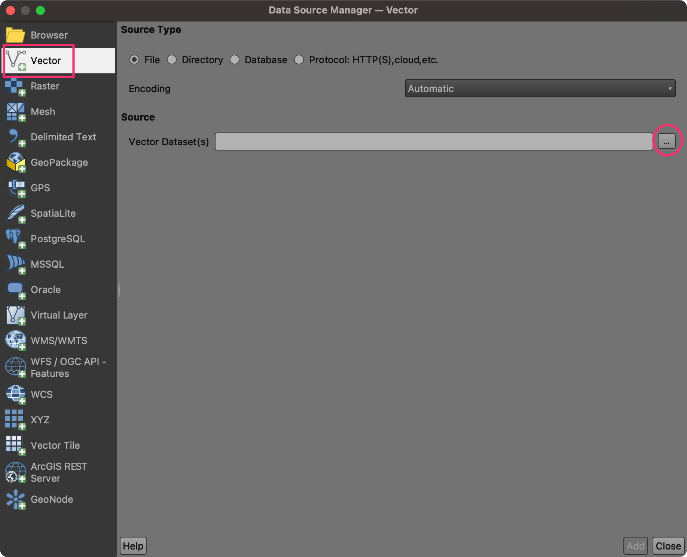
```

3. Select the `ne_10m_land.shp` file and click *Open*. In the *Data Source Manager* window, click *Add*.

```{r echo=FALSE, fig.align='center', out.width='75%'}
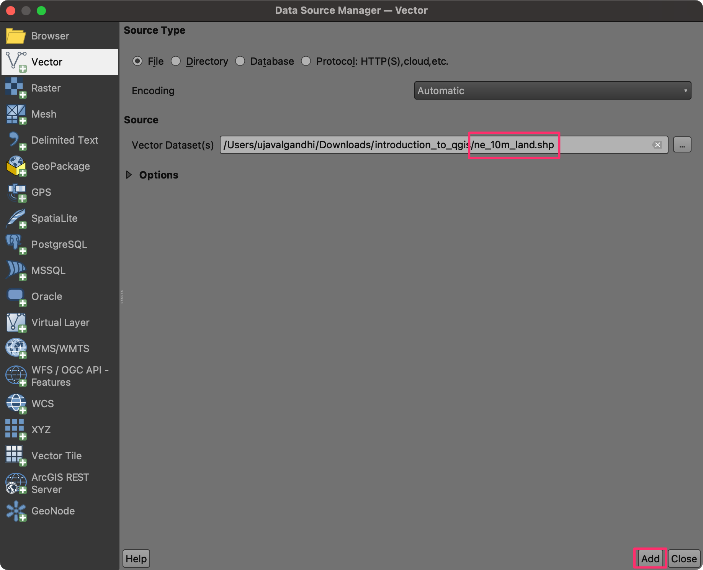
```

4. A new layer `ne_10m_land` will be added to the *Layers* panel and will be displayed on the Canvas. This layer contains polygons representing the land areas of the world. Click on the *Open Data Source Manager* button again.

```{r echo=FALSE, fig.align='center', out.width='75%'}
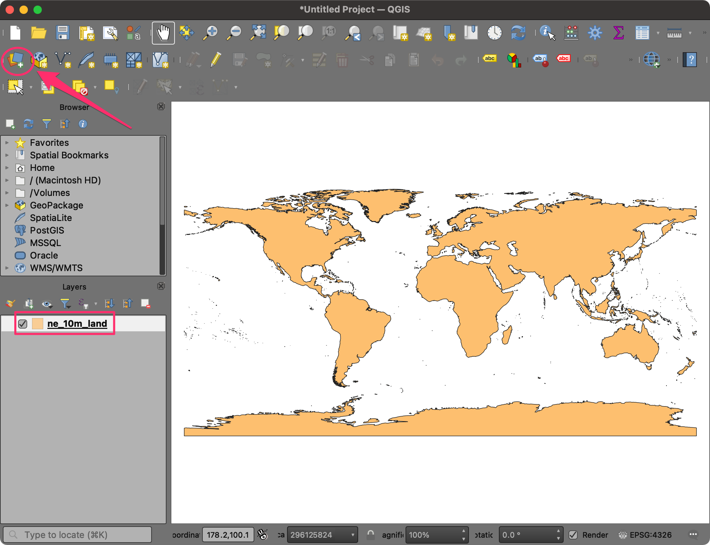
```

5. Click the *...* button next to *Vector Dataset(s)* and browse to the data directory. Select the `gem_active_faults_harmonized.gpkg` file and click *Open* followed by *Add*.

```{r echo=FALSE, fig.align='center', out.width='75%'}
knitr::include_graphics('images/introduction_to_qgis/earthquakes_part1_5.png')
```

6. A new layer `gem_active_faults_harmonized` will be added to the *Layers* panel and will be displayed on the Canvas. This is a global layer containing lines representing all the active faults. We will now import another layer of earthquake points. Click on the *Open Data Source Manager* button again.

```{r echo=FALSE, fig.align='center', out.width='75%'}
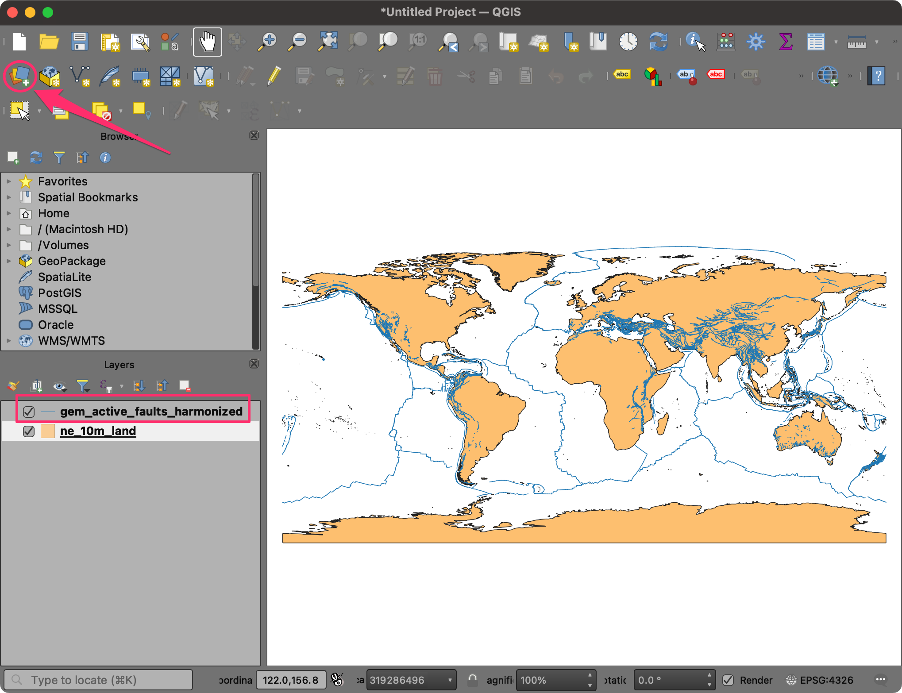
```

7. Select the *Delimited Text* tab. Click the *...* button next to *File name* and browse to the data directory. Select the `significant_earthquakes_2000_2020.tsv` file. This is a text file in the *Tab-Seperated Values (TSV) format*. In the *File Format* section, select **Custom delimiters**.

```{r echo=FALSE, fig.align='center', out.width='75%'}
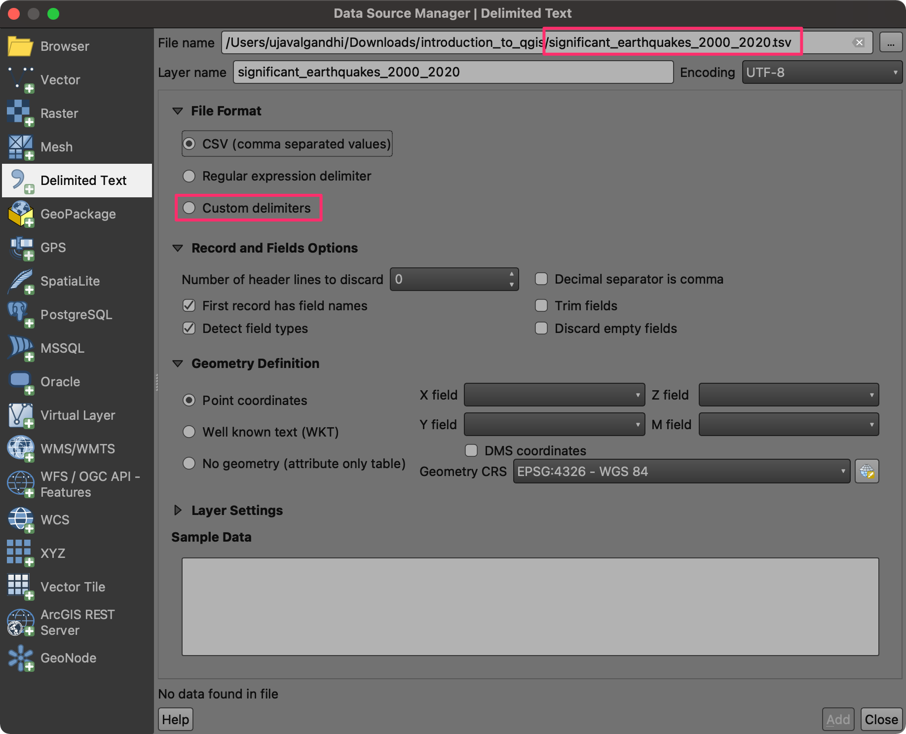
```

8. Check the *Tab* checkbox. In the *Geometry Definition* section, ensure **Longitude** is selected as the *X Field* and **Latitude** is selected as the *Y Field*. Leave other options to their default values and click *Add*.

```{r echo=FALSE, fig.align='center', out.width='75%'}
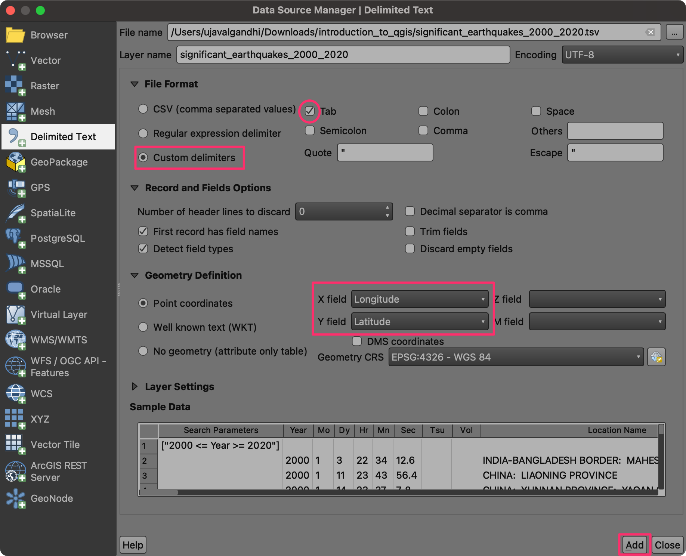
```

9. A new layer `significant_earthquakes_2000_2020` will be added to the *Layers* panel and will be displayed on the Canvas.This layer contains over 1000 records of significant earthquakes recorded between 2000 and 2020. Right-click on the `significant_earthquakes_2000_2020` layer and select *Open Attribute Table*. Examine all the attributes and their values.

```{r echo=FALSE, fig.align='center', out.width='75%'}
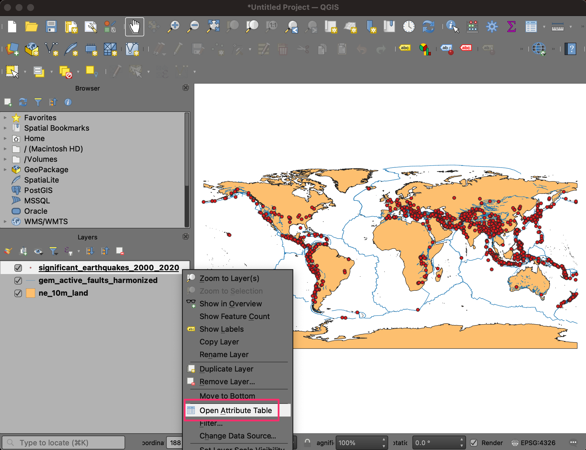
```

10. We will now learn about some of the tools to query and select records. From the *Selection Toolbar*, click the *Select Features by Value...* button.

```{r echo=FALSE, fig.align='center', out.width='75%'}
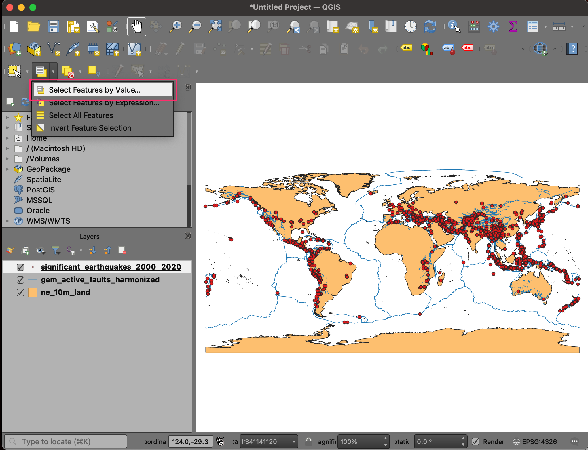
```

11. In the *Select Features* dialog, enter **2020** as the *Year* and click the *Select Features* button. You will see all earthquakes occurred during the year 2020 will be highlighted in yellow. You may also click the *Flash Features* button to see the selected records blink.

```{r echo=FALSE, fig.align='center', out.width='75%'}
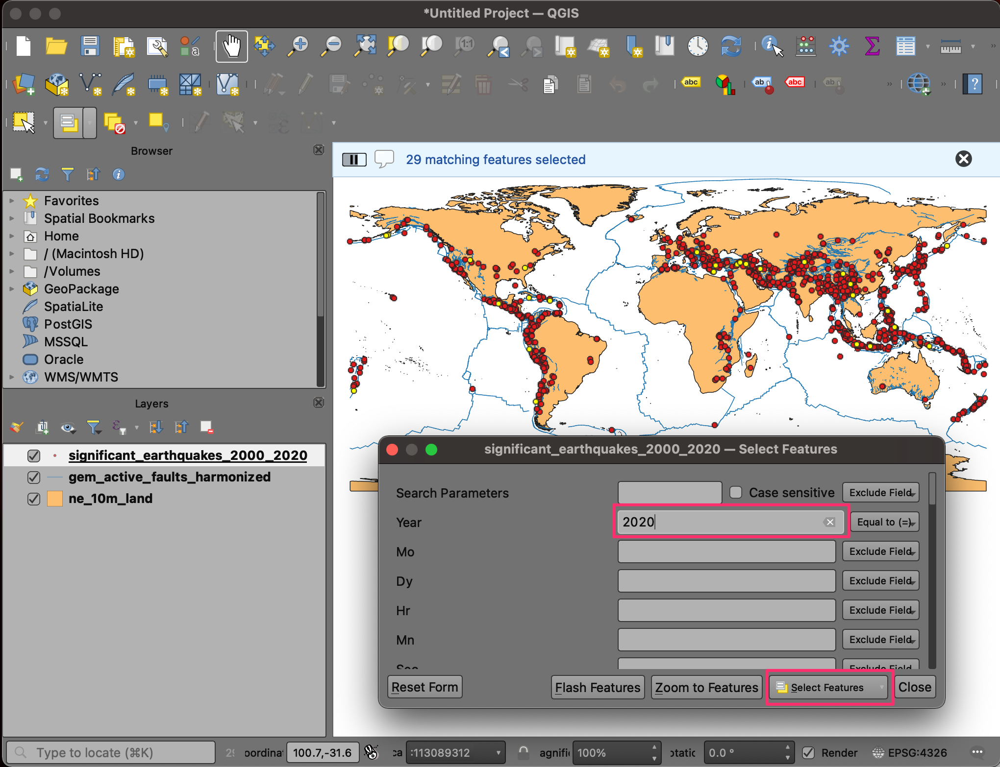
```

12. Let's refine the query a little more. Enter **7** as the *Mag* parameter and set the criteria to be *Greater than (>)*. Click *Select Features*. You will now see only those points where the earthquake occured in 2020 and its magnitude was greater than 7. Close the window.

```{r echo=FALSE, fig.align='center', out.width='75%'}
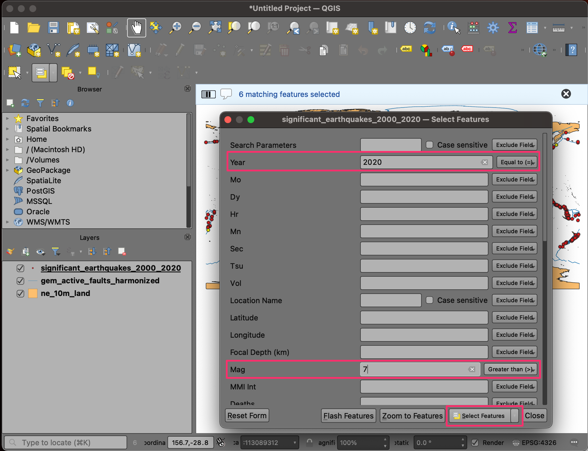
```

13. Right-click on the `significant_earthquakes_2000_2020` layer and select *Open Attribute Table*. You will see that there are 6 selected features in the layer. If you wanted to examine their attributes, there is a handy shortcut. Click the *Move selection to top* button.

```{r echo=FALSE, fig.align='center', out.width='75%'}
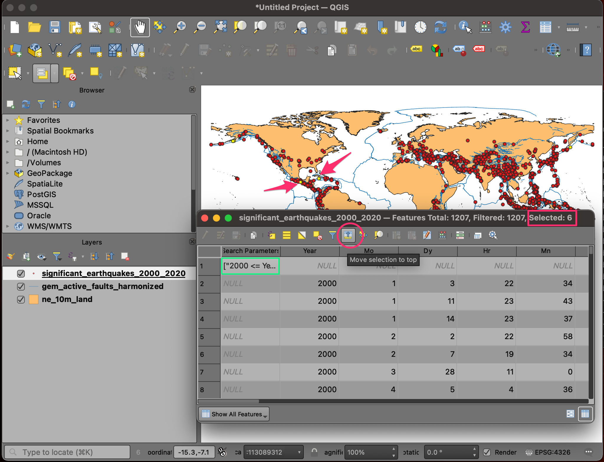
```

14. All the selected rows will be displayed on the top of the attribute table - making it easy to examine the selected features. Click the *Deselect all features from the layer* button.

```{r echo=FALSE, fig.align='center', out.width='75%'}
knitr::include_graphics('images/introduction_to_qgis/earthquakes_part1_14.png')
```

15. For our map, we need another layer of 10 largest earthquakes - so we can style it differently than other earthquakes. For the purpose of our visualization, we will define largest earthquakes being the ones that resulted in the largest number of deaths. Locate the *Total Deaths* attribute and click twice on the column header. This will sort the features in descending order of the values in this column.

```{r echo=FALSE, fig.align='center', out.width='75%'}
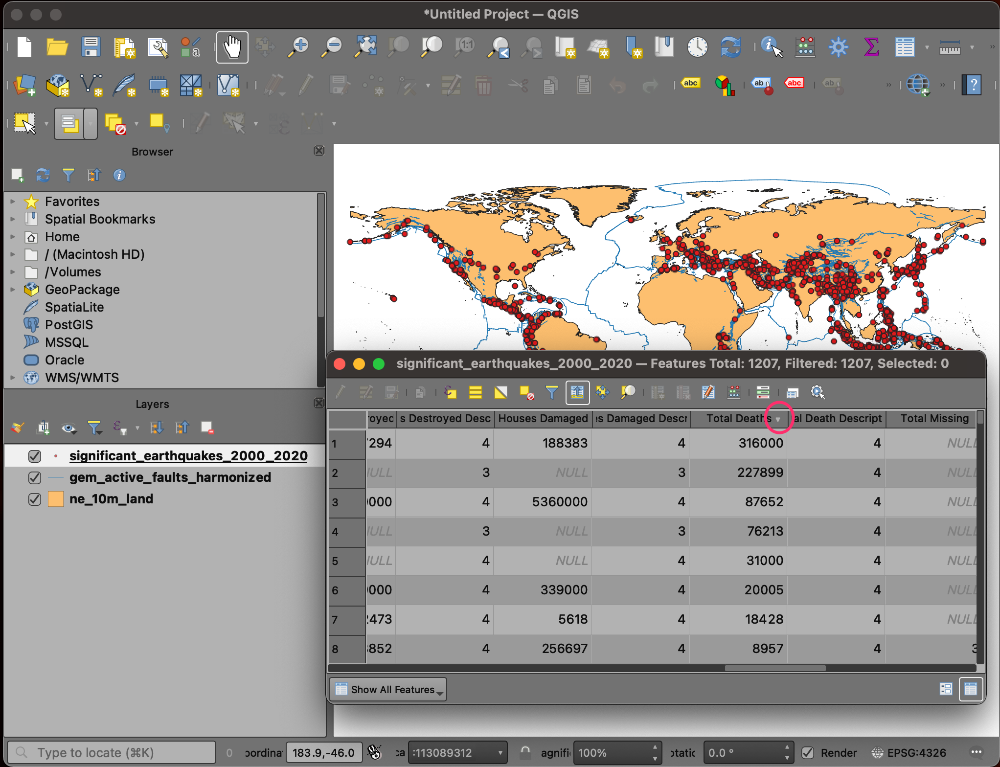
```

16. Hold the *Shift* key and select the first 10 rows. This selection will be the 10 earthquakes with the largest fatalities.

```{r echo=FALSE, fig.align='center', out.width='75%'}
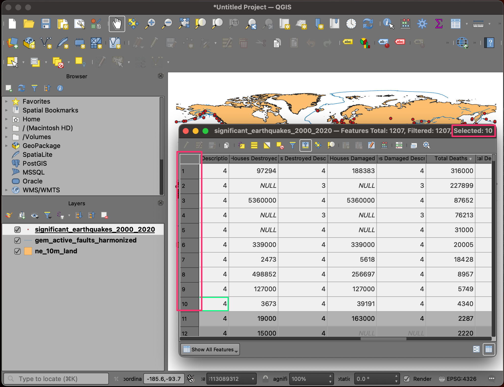
```

17. We will save the selected 10 features as a new layer. Right-click the `significant_earthquakes_2000_2020` layer and go to *Export &rarr; Save Selected Features As..*.

```{r echo=FALSE, fig.align='center', out.width='75%'}
knitr::include_graphics('images/introduction_to_qgis/earthquakes_part1_17.png')
```

18. Select **GeoPackage** as the *Format*. Click the *...* buton next to *File name* and browse to the data directory. Name the layer as `large_earthquakes.gpkg`. Click *Save*. Click *OK*.

```{r echo=FALSE, fig.align='center', out.width='75%'}
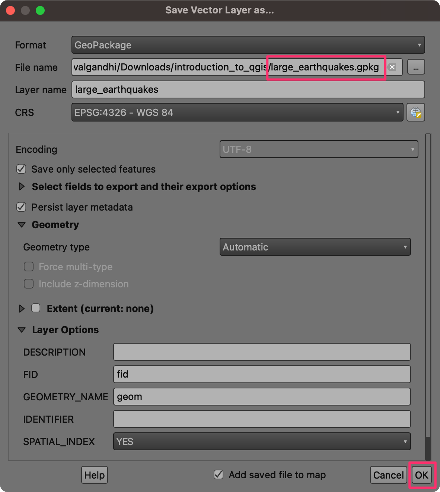
```

19. A new layer `large_earthquakes` will be added to the *Layers* panel.

```{r echo=FALSE, fig.align='center', out.width='75%'}
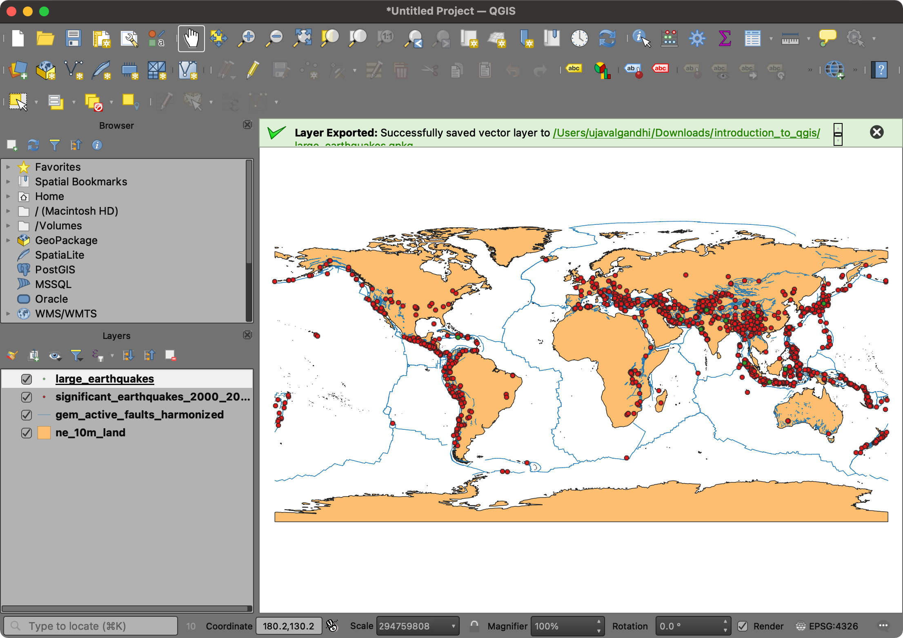
```

20. Our data preparation is now complete. Let's save our work. Go to *Project &rarr; Save*. Browse to the data directory and enter the name as **Earthquakes**. Click *Save*.

```{r echo=FALSE, fig.align='center', out.width='75%'}
knitr::include_graphics('images/introduction_to_qgis/earthquakes_part1_20.png')
```

21. The project will be saved as a file in the QGZ format. 

```{r echo=FALSE, fig.align='center', out.width='75%'}
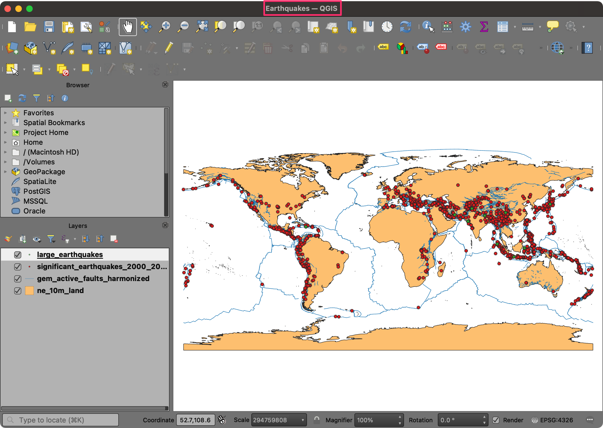
```

We have now finish the first part of this exercise. Your output should match the contents of the `Earthquakes_Checkpoint1.qgz` file in the `solutions` folder.

## Challenge

Do you know about the [Null Island](https://en.wikipedia.org/wiki/Null_Island)? The `ne_10m_land` contains a polygon for this feature. Locate this polygon on the map.

Hint: Open the attribute table, find and select the feature for Null island. Then use the *Zoom map to the selected rows* button.

## 1.2 Symbology

The symbology of a layer is its visual appearance on the map. We will now learn different techniques for styling each of our layers to visually convey the information.

1. Select the ``ne_10m_land`` layer and click *Open the Layer Styling Panel*.

```{r echo=FALSE, fig.align='center', out.width='75%'}
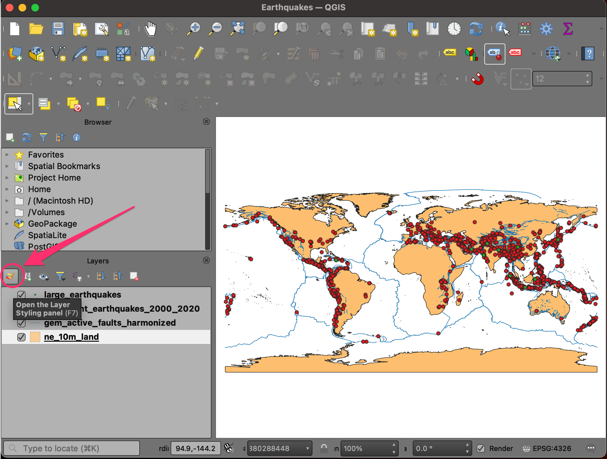
```

2. We will style this layer with a simple grey color. Click *Simple Fill* to reveal more options. Click the dropdown next to *Fill color*.

```{r echo=FALSE, fig.align='center', out.width='75%'}
knitr::include_graphics('images/introduction_to_qgis/earthquakes_part2_2.png')
```

3. Use the color picker to select a light shade of grey color. The *Layer Styling Panel* is interactive, so your choice of color can be immediately previewed on the map canvas.

```{r echo=FALSE, fig.align='center', out.width='75%'}
knitr::include_graphics('images/introduction_to_qgis/earthquakes_part2_3.png')
```

4. Similarly, change the *Stroke color* to white.

```{r echo=FALSE, fig.align='center', out.width='75%'}
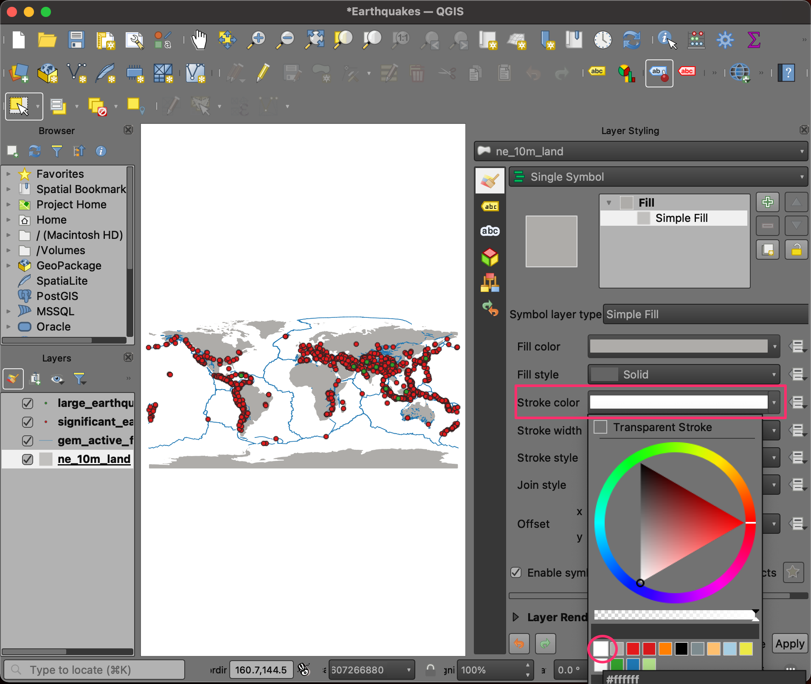
```

5. Next, we will style the faults layer. Select ``gem_active_faults_harmonized`` layer in the *Layers* panel. Click the *Simple Line* symbol to reveal more styling options. Change the *Color* to a shade of brown. Set the *Stroke width* to **0.1**.

```{r echo=FALSE, fig.align='center', out.width='75%'}
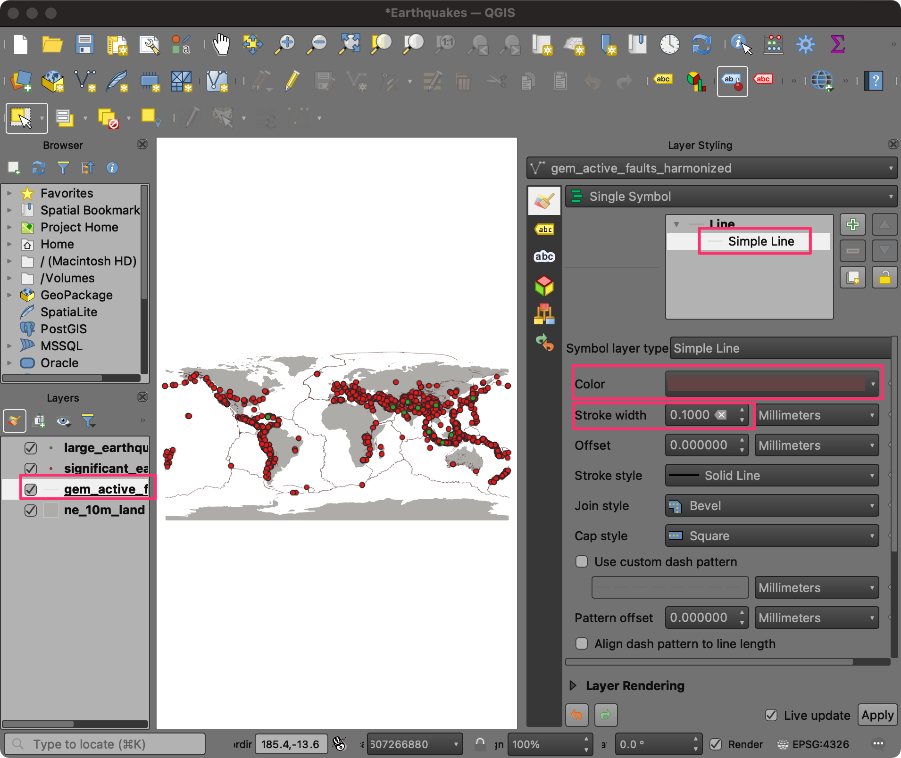
```

6. Now we will change the style of the earthquake points. Select the ``significant_earhtquakes_2000_2020`` layer. Click the *Simple Marker* symbol. Change the *Size* option to **0.7** *Millimeters*. Select red as the *Fill color* and white as the *Stroke color*. Change the *Stroke width* to **0.1**. 

```{r echo=FALSE, fig.align='center', out.width='75%'}
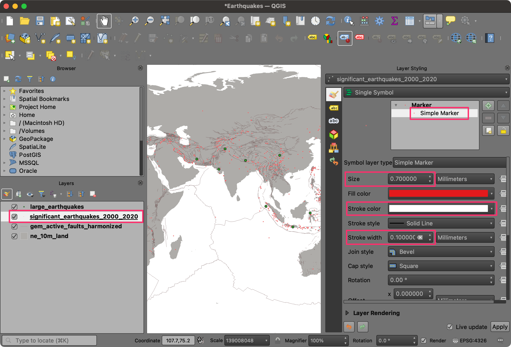
```

7. We have now styles the three background layers. Now we will style the ``large_earthquakes`` layer which features the main information we want to convey through this map. We will use a *Proportional Circle* style and have the size of the circle represent the total fatalities caused by the respective earthquake. Click *Simple Marker* to see more styling options. Click the *Data defined override* button next to *Size* and choose **Assistant**.

```{r echo=FALSE, fig.align='center', out.width='75%'}
knitr::include_graphics('images/introduction_to_qgis/earthquakes_part2_7.png')
```

8. In the *Input* section, select **Total Deaths** as the *Source*. Set the range of *Values from* **5000** *to* **500000**. In the *Output* section, set the range of *Size from* **3** *to* **10**. This will use the attribute value in the *Total Deaths* field to set the size of the circles. Click the *Go Back* button at the top of the panel to return to the previous menu.

```{r echo=FALSE, fig.align='center', out.width='75%'}
knitr::include_graphics('images/introduction_to_qgis/earthquakes_part2_8.png')
```

9. Click the *Fill color* and adjust the transparency. This will help show the information under the large circles.

```{r echo=FALSE, fig.align='center', out.width='75%'}
knitr::include_graphics('images/introduction_to_qgis/earthquakes_part2_9.png')
```

10. Set the *Stroke color* to white.

```{r echo=FALSE, fig.align='center', out.width='75%'}
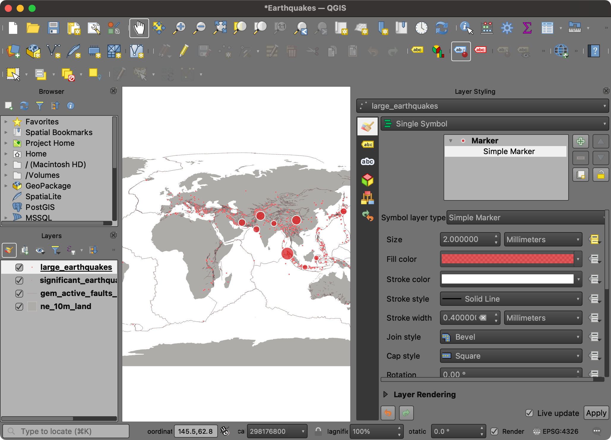
```

11. The circles represent the number of deaths caused by each earthquake. But the reader of our map will not know what these sizes represent. It will help interpret the map better if we had a legend. Let's set a legend for this layer. Click the *Marker* symbol. At the bottom of the panel, select *Advanced &rarr; Data-defined Size Legend*. 

```{r echo=FALSE, fig.align='center', out.width='75%'}
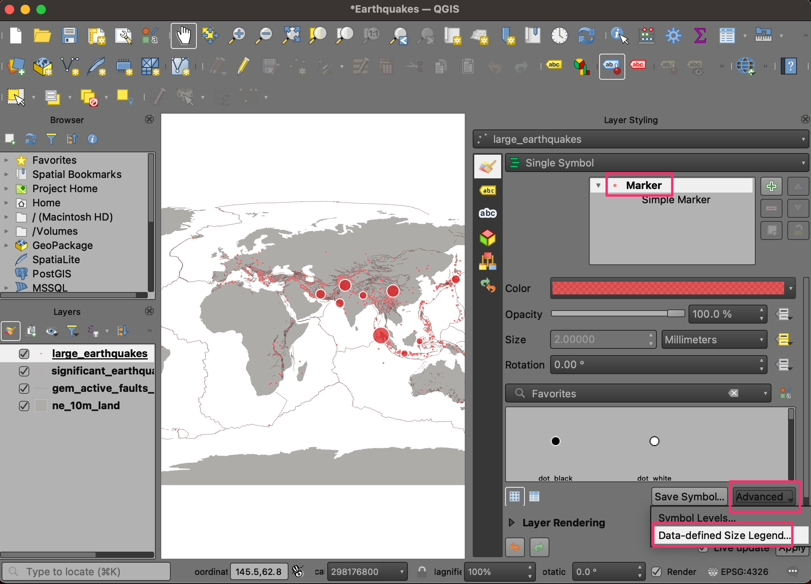
```

12. Choose the *Collapsed legend* option. Check the *Manual size classes* option. Click the *+* button to add the class definition manually.

```{r echo=FALSE, fig.align='center', out.width='75%'}
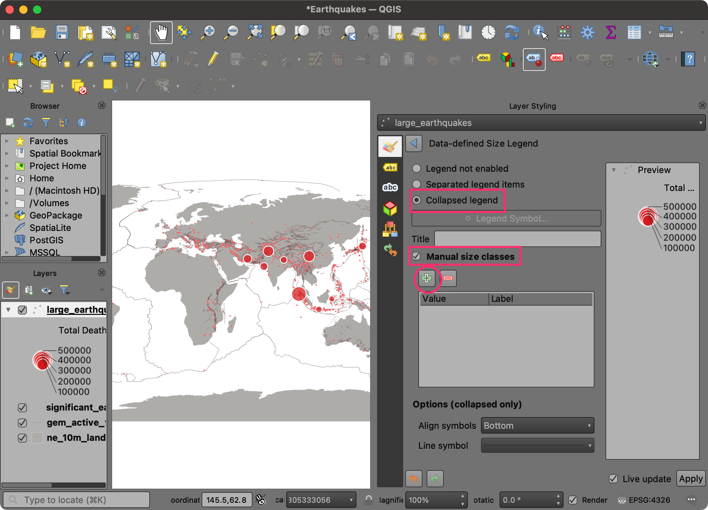
```

13. Set three different size classes for **5000**, **50000** and **500000**. You will see a legend in the *Layers* panel show the circle sizes and their related fatality value.

```{r echo=FALSE, fig.align='center', out.width='75%'}
knitr::include_graphics('images/introduction_to_qgis/earthquakes_part2_13.png')
```

14. Click the *Save Project* button to save your work.

```{r echo=FALSE, fig.align='center', out.width='75%'}
knitr::include_graphics('images/introduction_to_qgis/earthquakes_part2_14.png')
```

We have now finish the second part of this exercise. Your output should match the contents of the `Earthquakes_Checkpoint2.qgz` file in the `solutions` folder.

## Challenge

QGIS has many rich cartography features. One of my favorites is called *Live Layer Effects*. This allows you to add effects such as *Outer Glow*, *Drop Shadow* etc. to each symbol. This takes your symboloy to the next level, and helps highlight certain features. Select the `large_earthquakes`  layer and open the *Layer Styling Panel*. Expand the *Layer Rendering* section and enable *Draw effects*. Click the *Customize effects* button and add a drop shadow effect to the layer.

```{r echo=FALSE, fig.align='center', out.width='75%'}
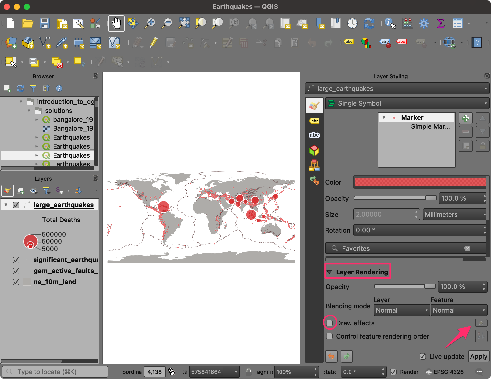
```


# 2. Visualizing Spatial Data

In this section, we will learn basic data processing and visualization techniques. We will use geographic boundaries and population count data for the City of New York and create a population density map.

## 2.1 Data Pre-Processing

1. Open QGIS. The first step is to import the source datasets. Click on the *Open Data Source Manager* button.

```{r echo=FALSE, fig.align='center', out.width='75%'}
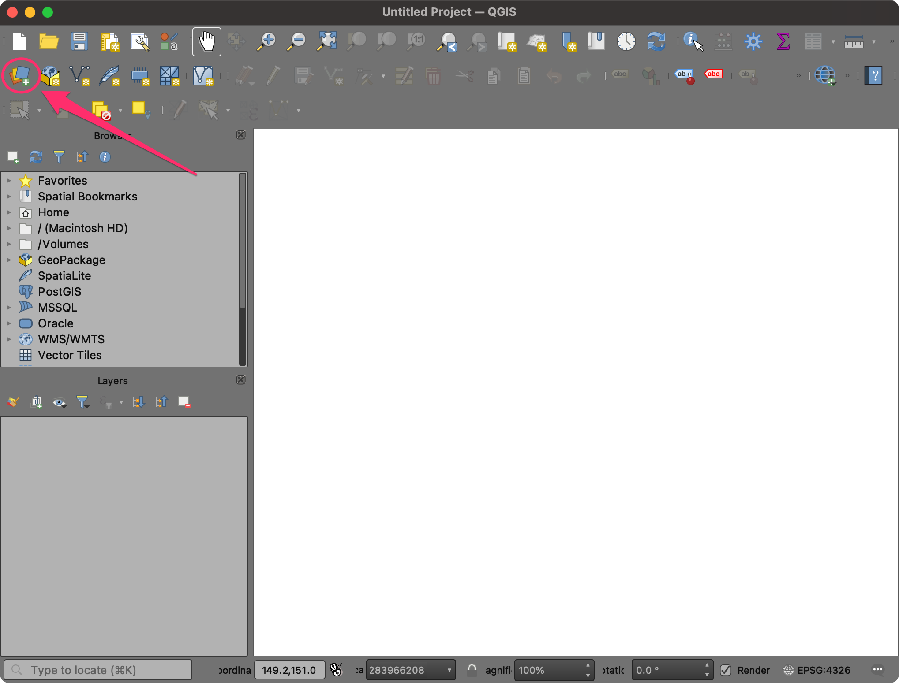
```

2. Select the *Vector* tab. Click the *...* button next to *Vector Dataset(s)* and browse to the data directory. Select the `nynta2010.shp` file and click *Open*. In the *Data Source Manager* window, click *Add*.

```{r echo=FALSE, fig.align='center', out.width='75%'}
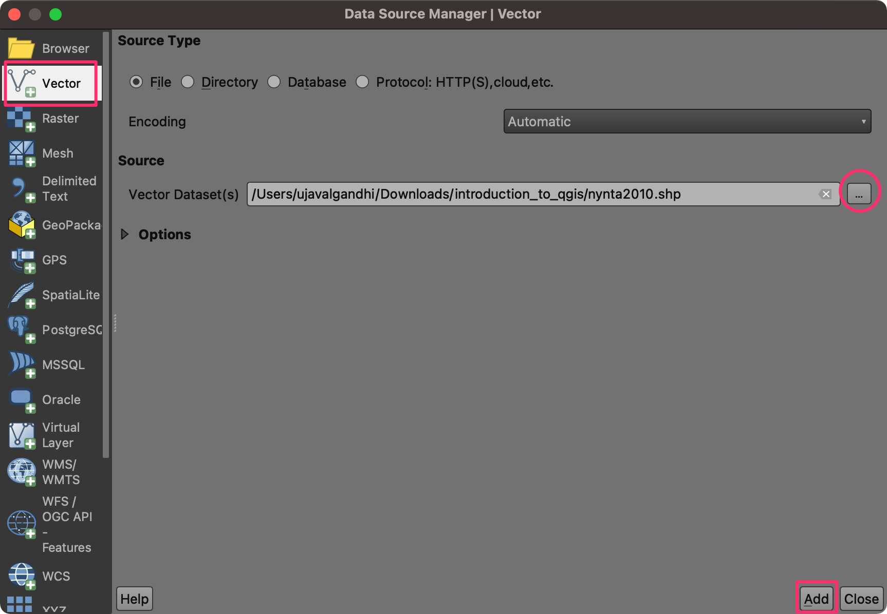
```

3. You may be prompted to *Select Transformation for nynta2010*. The source shapefile is in the `EPSG:2263 NAD83 / New York Long Island (ftUS)` projection whereas the default projection in QGIS is `EPSG:4326 - WGS84`. This dialog presents several transformations to convert between the coordinates between these projections. Choose the first option and click *OK*.

```{r echo=FALSE, fig.align='center', out.width='75%'}
knitr::include_graphics('images/introduction_to_qgis/population_part1_3.png')
```

4. A new layer `nyta2010` will be added to the *Layers* panel and will be displayed on the Canvas. This layer contains polygons representing the *Neighborhood Tabulation Areas (NTAs)* for New York city. Right-click on the `nyta2010` layer and select *Open Attribute Table*.


```{r echo=FALSE, fig.align='center', out.width='75%'}
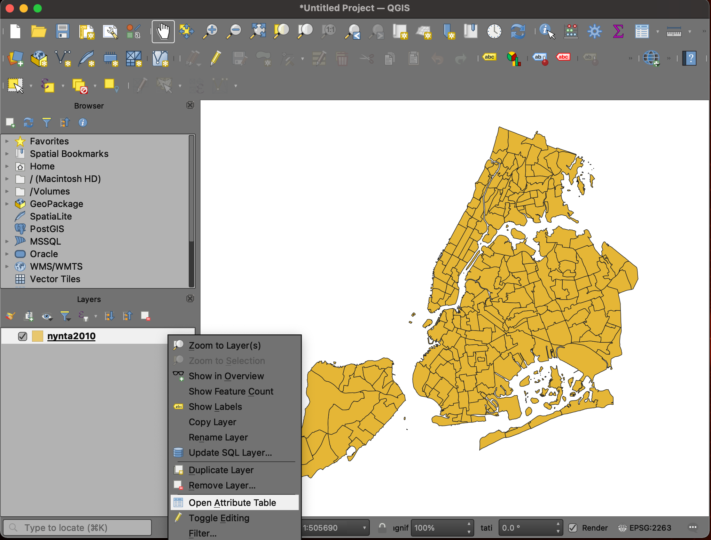
```

5. Examine the attributes of the layer. The `NTACode` field contains a unique identifier for each polygon. Notice that we do not have any population or demographic attributes in this layer. 

```{r echo=FALSE, fig.align='center', out.width='75%'}
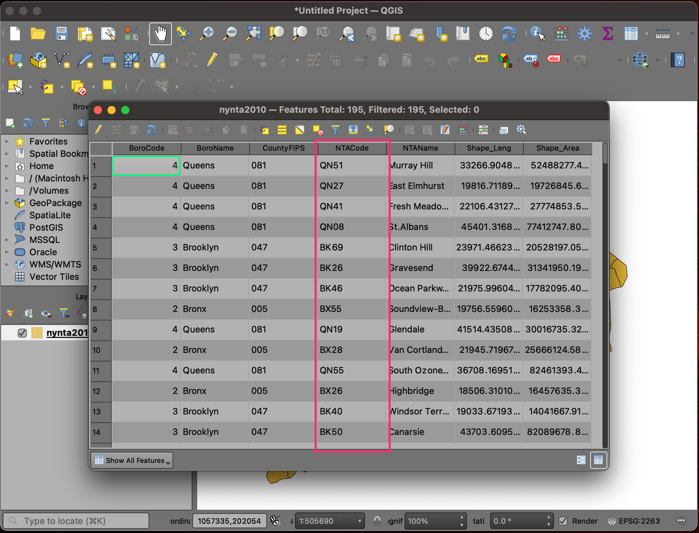
```

6. The population and other demographic datasets are typically distributed as tables. These tables would have the same unique identifier as the shapefile that can be used to merge the relevant fields to the vector layer. Let's import a table representing *New York City Population By Neighborhood Tabulation Areas*. Click on the *Open Data Source Manager* button.

```{r echo=FALSE, fig.align='center', out.width='75%'}
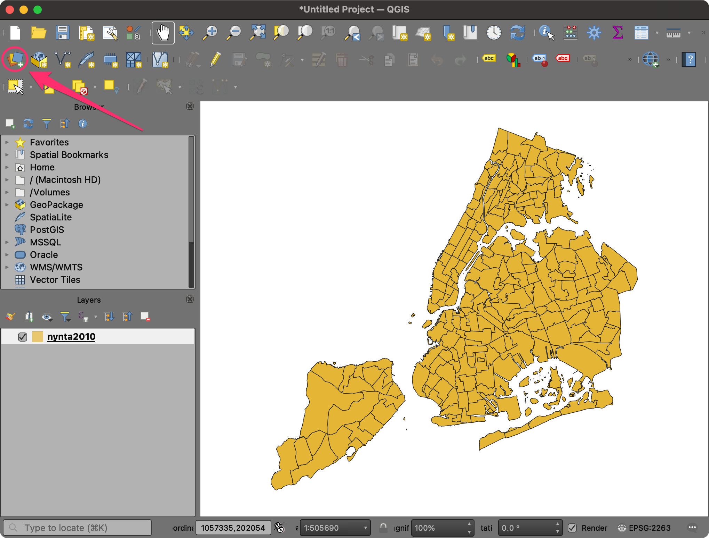
```

7. Switch to the *Delimited Text* tab. Browse to the ``New_York_City_Population_By_Neighborhood_Tabulation_Areas.csv`` file and select it. Since this CSV file is just tabular data, select *No geometry (attribute only table)* option and click *Add*.

```{r echo=FALSE, fig.align='center', out.width='75%'}
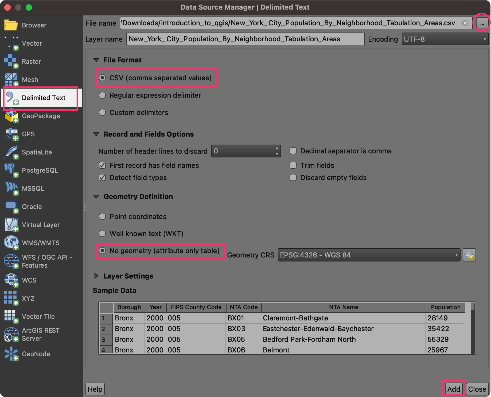
```

8. Once the new tabular layer ``New_York_City_Population_By_Neighborhood_Tabulation_Areas`` is added to the *Layers* panel, right-click on it and select *Open Attribute Table*.

```{r echo=FALSE, fig.align='center', out.width='75%'}
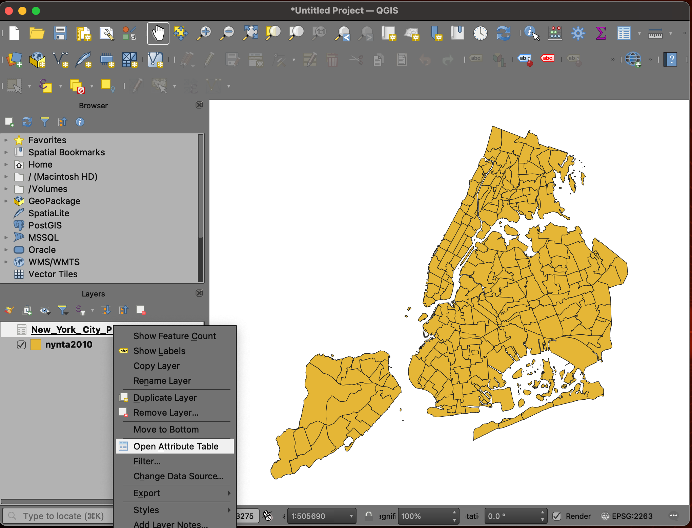
```

9. This table has a **Population** column with the population for each of the tabulation areas. We also have the **NTA Code** column containing the same codes as our `nynta2020` layer. We can use this column to join this table with the vector layer.

```{r echo=FALSE, fig.align='center', out.width='75%'}
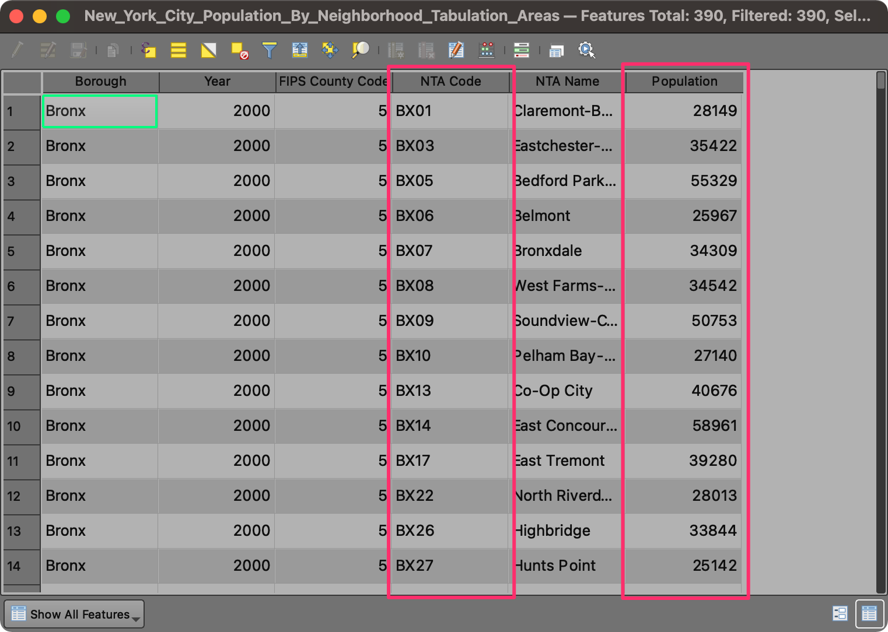
```

10. Open **Processing &rarr; Toolbox** from the main menu at the top.

```{r echo=FALSE, fig.align='center', out.width='75%'}
knitr::include_graphics('images/introduction_to_qgis/population_part1_10.png')
```

11. Search and locate the algorithm **Vector general &rarr; Join attributes by field value** and double-click to launch it.

```{r echo=FALSE, fig.align='center', out.width='75%'}
knitr::include_graphics('images/introduction_to_qgis/population_part1_11.png')
```

12. In the *Join Attributes by Field Value* dialog, select ``nynta2010`` as the *Input layer* and ``NTACode`` as the *Table field*. Select ``New_York_City_Population_By_Neighborhood_Tabulation_Areas`` as the *Input layer 2* and ``NTA Code`` as the *Table field 2*. Click the *...* button next to *Layer 2 fields to copy*.

```{r echo=FALSE, fig.align='center', out.width='75%'}
knitr::include_graphics('images/introduction_to_qgis/population_part1_12.png')
```

13. We want to copy only the population data, so select the `Population` field and click *OK*.

```{r echo=FALSE, fig.align='center', out.width='75%'}
knitr::include_graphics('images/introduction_to_qgis/population_part1_13.png')
```

14. Next, we need to configure the output. Click the *...* button next to *Joined layer* and select *Save to File...*.

```{r echo=FALSE, fig.align='center', out.width='75%'}
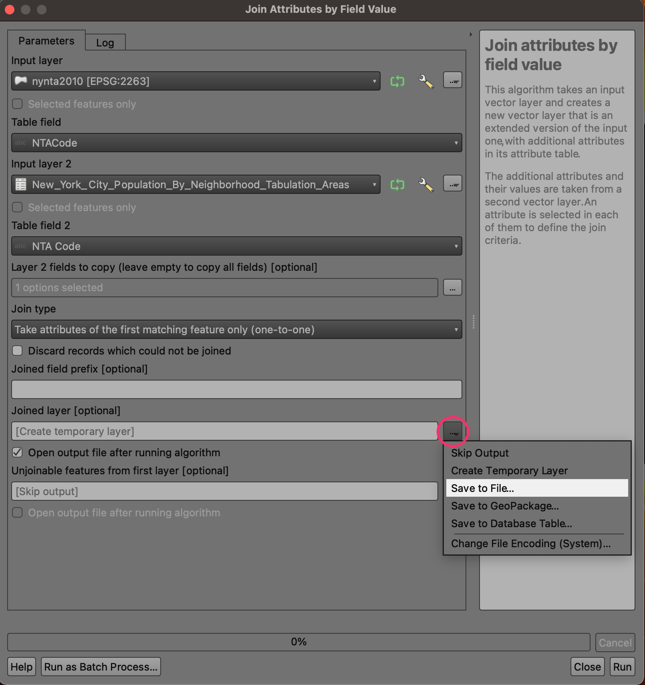
```

15. Browse to the data directory and name the output as `nynta_with_population`. Make sure the file type is selected as *GPKG files (\*.gpkg)*. Click *Save*.

```{r echo=FALSE, fig.align='center', out.width='75%'}
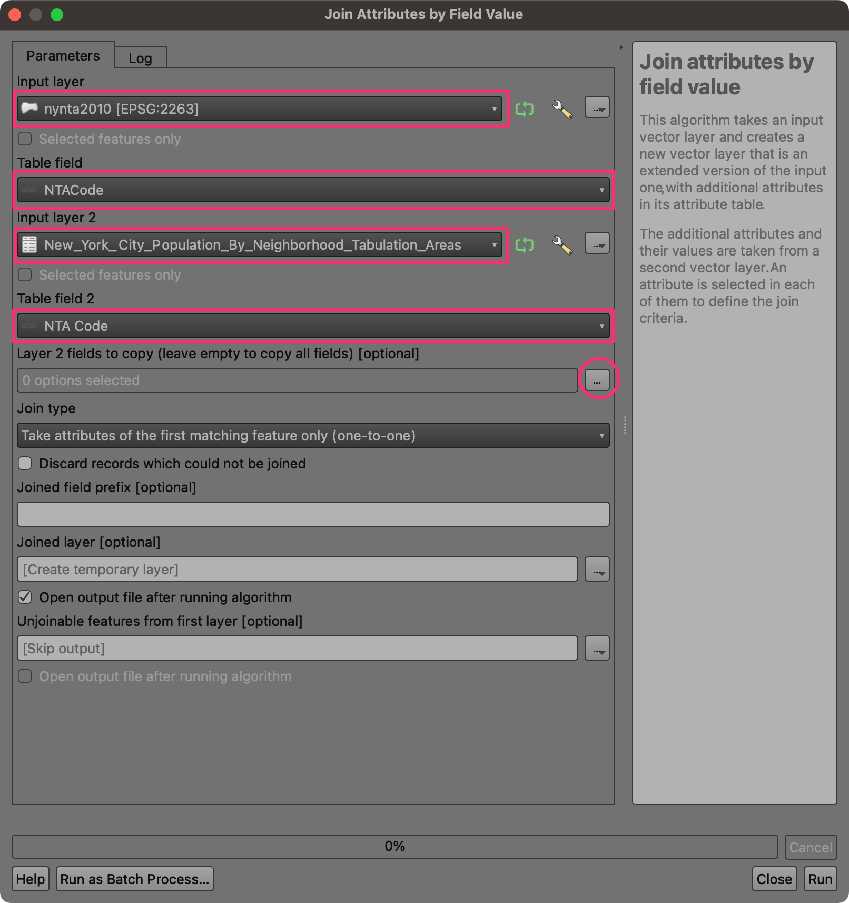
```

16. Once the configuration is complete, click the *Run* button. 

```{r echo=FALSE, fig.align='center', out.width='75%'}
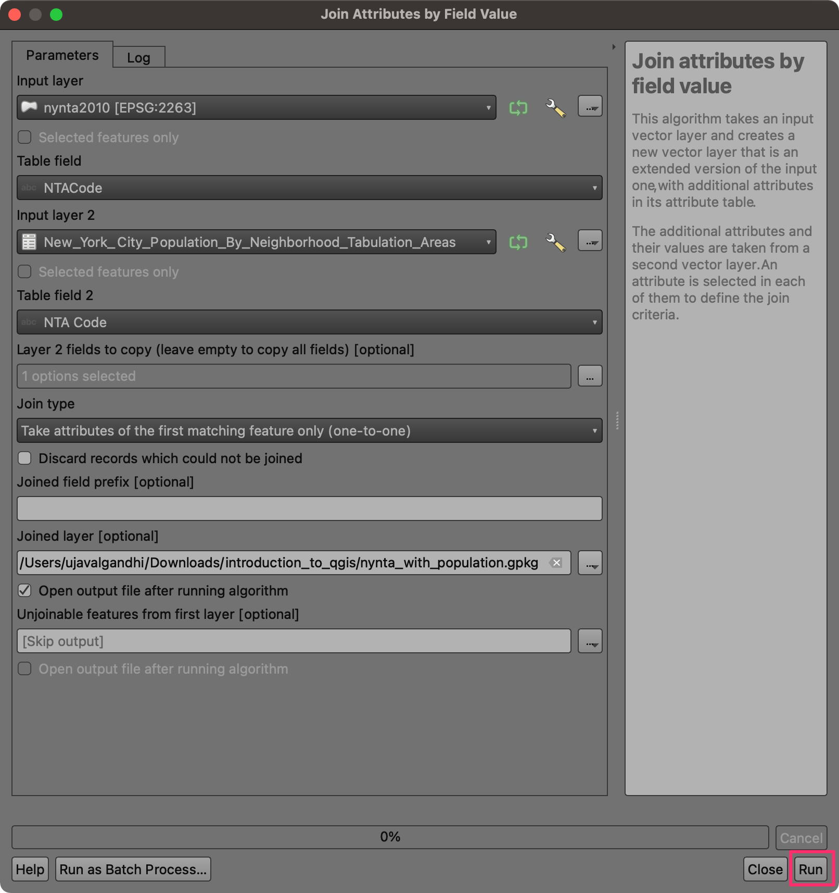
```

17. Upon completion of processing, a new layer `nynta_with_population` will be added to the *Layers* panel. Right-click the layer and select *Open Attribute Table*. You will see that we now have an additional column **Population** in the attribute table. The table also has a column **Shape_Area** containing the area of each polygon in Sq.Ft.

```{r echo=FALSE, fig.align='center', out.width='75%'}
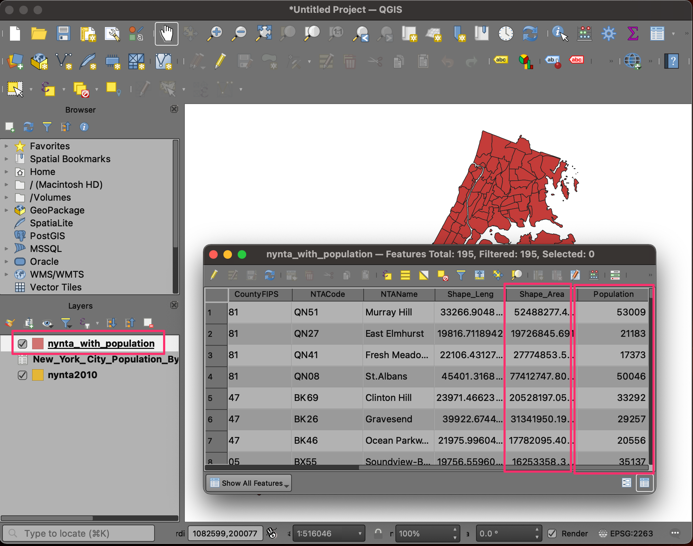
```

18. Our goal is to map the population density. We can use the population count and area columns and calculate a new column for population density. From the Processing Toolbox, search and locate the algorithm **Vector table &rarr; Field Calculator** and double-click to launch it.

```{r echo=FALSE, fig.align='center', out.width='75%'}
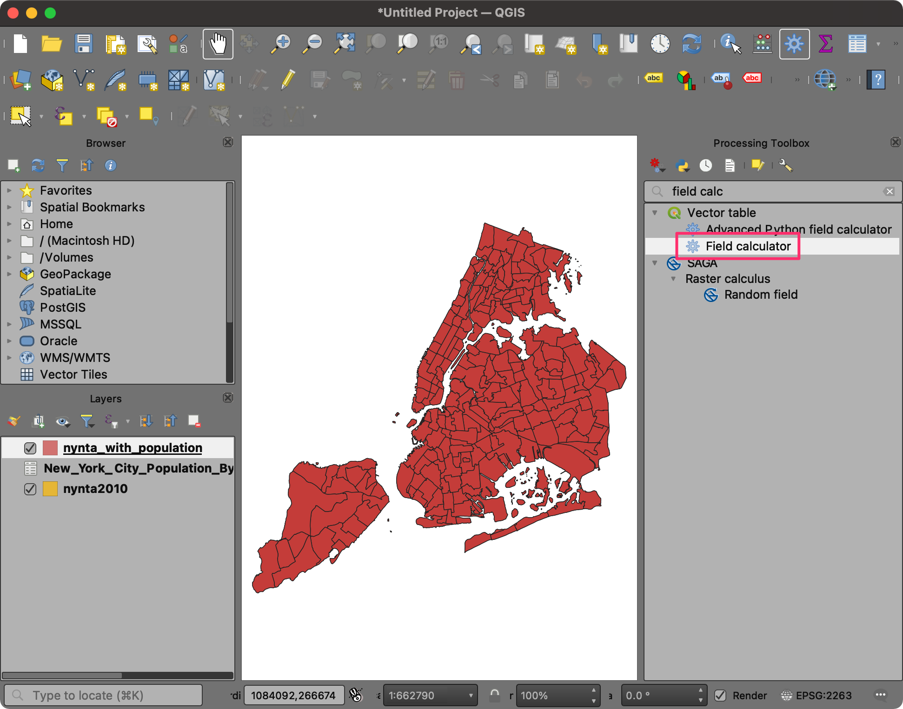
```

19. In the *Field Calculator* dialog, enter ``Density`` as the *Field Name*. We will now build the expression to calculate population density. From the function groups next to the *Expression* panel, expand the *Fields and Values* section. Double-click the ``Population`` field to add it to the expression editor. Note that fields are referred using double-quotes (") in QGIS.

```{r echo=FALSE, fig.align='center', out.width='75%'}
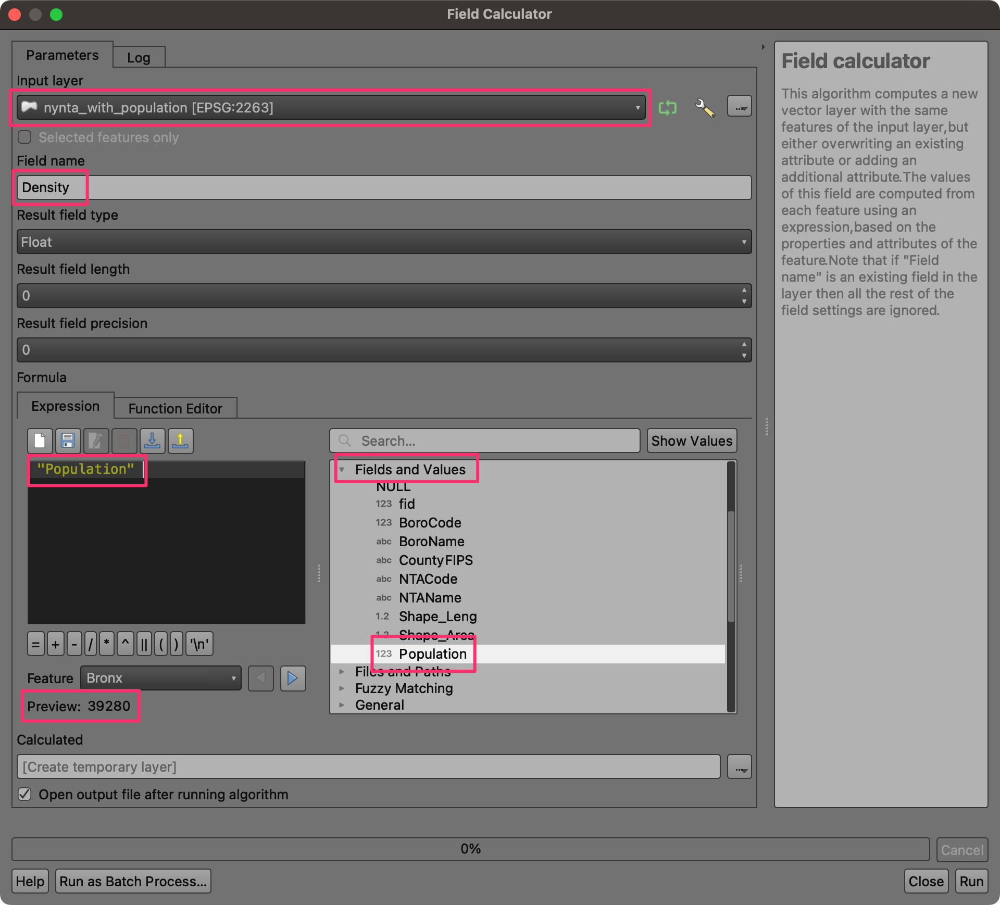
```

20. Select the **/** button to enter the division operator and then click the ``Shape_Area`` field to enter it. You may also type the expression instead of picking the values from the dialog. The final expression should look like below. 

```
"Population" / "Shape_area"
```

```{r echo=FALSE, fig.align='center', out.width='75%'}
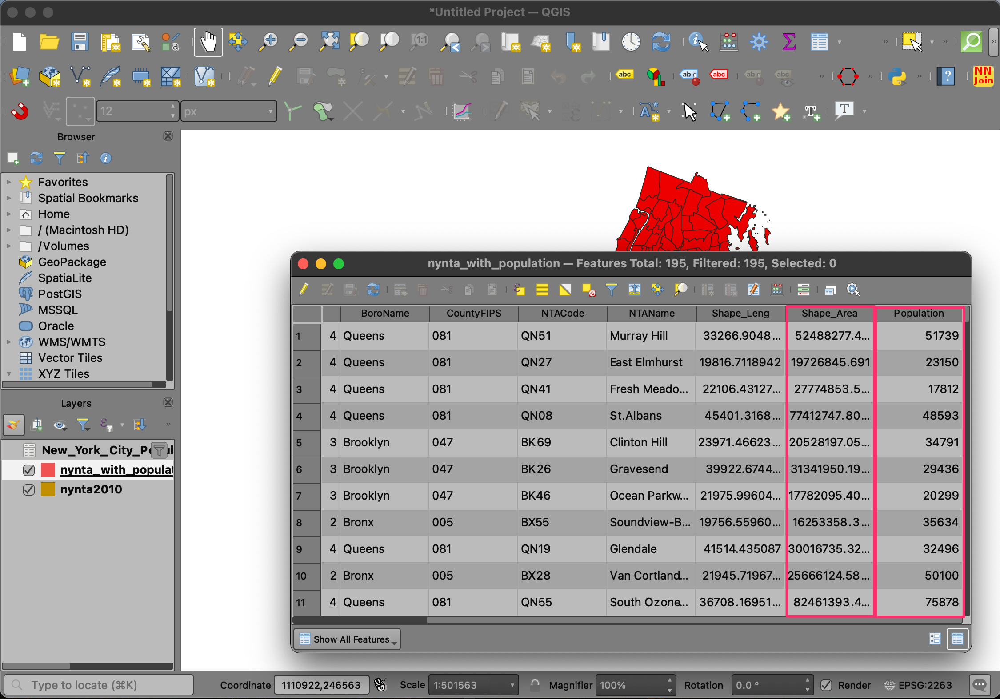
```

21. This will give us the population density in persons per square feet. A more appropriate unit for population density is persons per square miles. Let's convert the value to miles using the conversion factor or *1 mile = 5280 ft*. Change the expression as shown below. Once done, select *Save to File*.

```
5280 * 5280 * ("Population" / "Shape_area")
```

```{r echo=FALSE, fig.align='center', out.width='75%'}
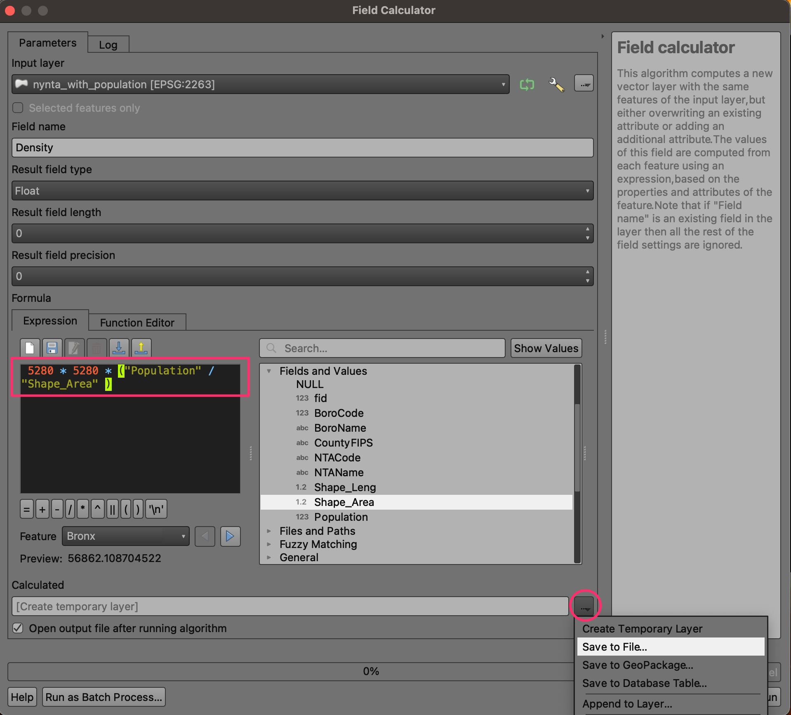
```

22. Name the output as `nynta_population_density.gpkg` and click *Run*.

```{r echo=FALSE, fig.align='center', out.width='75%'}
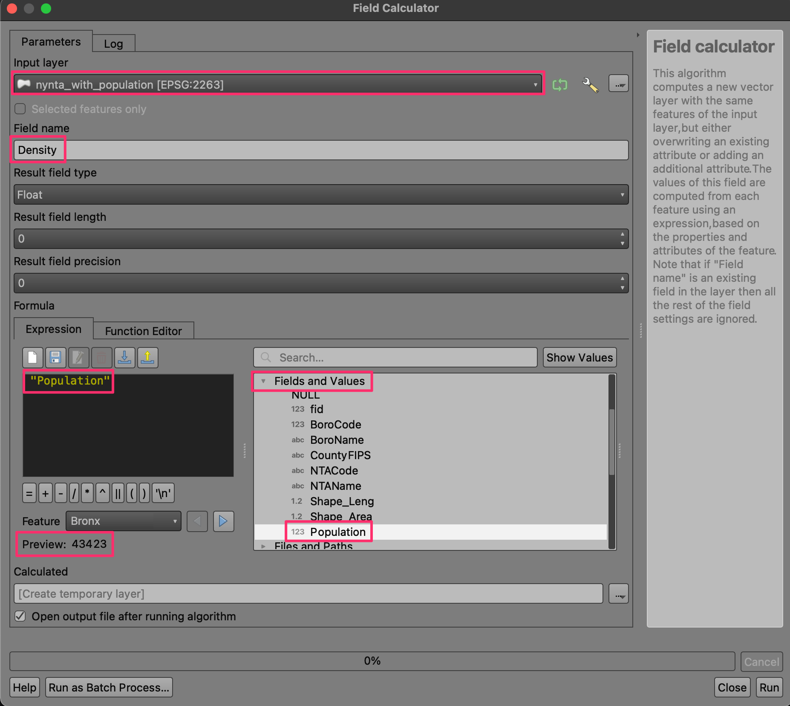
```

23. Once the processing finishes as new layer `nynta_population_density` will be added to the *Layers* panel. Open the attribute table and verify that you have a new column named *Density*.

```{r echo=FALSE, fig.align='center', out.width='75%'}
knitr::include_graphics('images/introduction_to_qgis/population_part1_23.png')
```

24. We don't need the other layers in our project. Hold the *Shift* key and select all layers except `nynta_population_density`. Right-click and select *Remove Layer...*.

```{r echo=FALSE, fig.align='center', out.width='75%'}

```

25. Let's save our work so we can retrieve it later. Go to **Project  &rarr; Save**.

```{r echo=FALSE, fig.align='center', out.width='75%'}
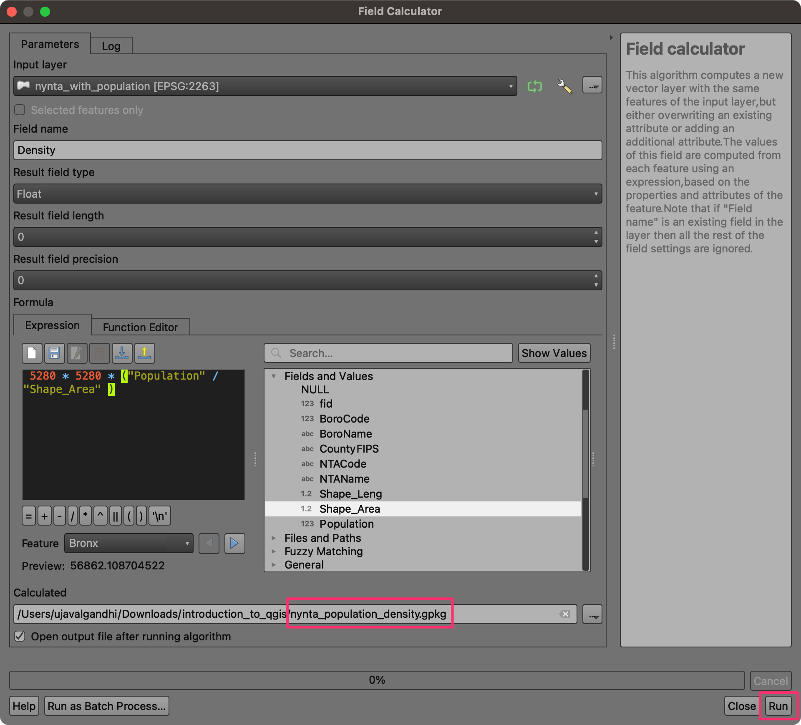
```

26. Save the project as `NYC_Population_Density` and click *Save*. QGIS will save the project file in the *QGZ* format.

```{r echo=FALSE, fig.align='center', out.width='75%'}
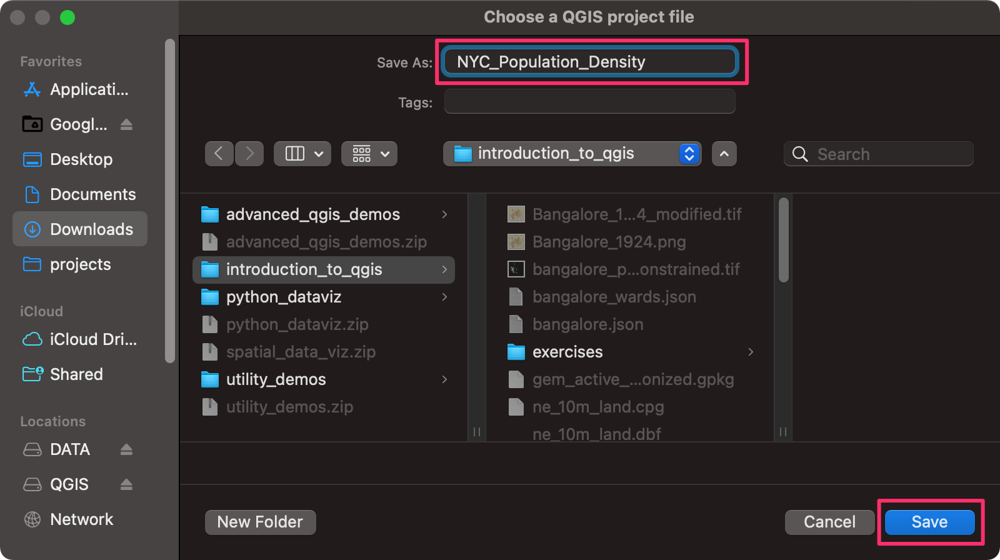
```

We have now finish the first part of this exercise. Your output should match the contents of the `NYC_Population_Density_Checkpoint1.qgz` file in the `solutions` folder.

## Challenge

Round the population density values to the nearest integer and store them in another column named **Density_Round**.

- Hint1: Use the *Field Calculator* algorithm from the processing toolbox.
- Hint2: The QGIS expression engine has a function named `round()` that can round a fraction to the chosen number of decimal places.

## 2.2 Create a Choropleth Map

1. Continuing the exercise, we will now visualize the spatial distribution of population density in form of a choropleth map. From the *Layers* panel, click the *Open the Layer Styling panel* button.

```{r echo=FALSE, fig.align='center', out.width='75%'}
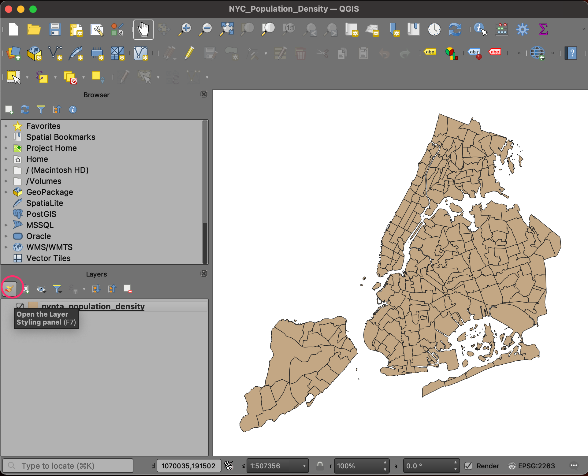
```

2. Select the ``Graduated`` renderer.

```{r echo=FALSE, fig.align='center', out.width='75%'}
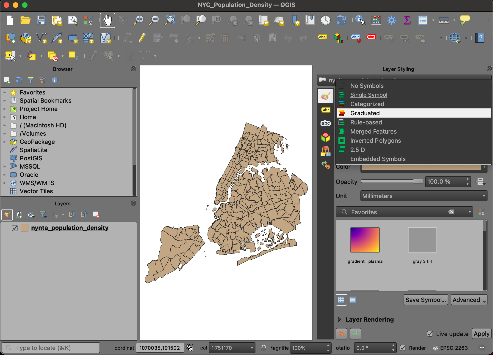
```

3. As we want to map the population density, choose ``Density`` as the *Value*.

```{r echo=FALSE, fig.align='center', out.width='75%'}
knitr::include_graphics('images/introduction_to_qgis/population_part2_3.png')
```

4. Next we select a color ramp. Click the drop-down button next to *Color Ramp*, select *All Color Ramps* and pick the ``YlOrBr`` (Yellow-Orange-Brown) ramp.

```{r echo=FALSE, fig.align='center', out.width='75%'}
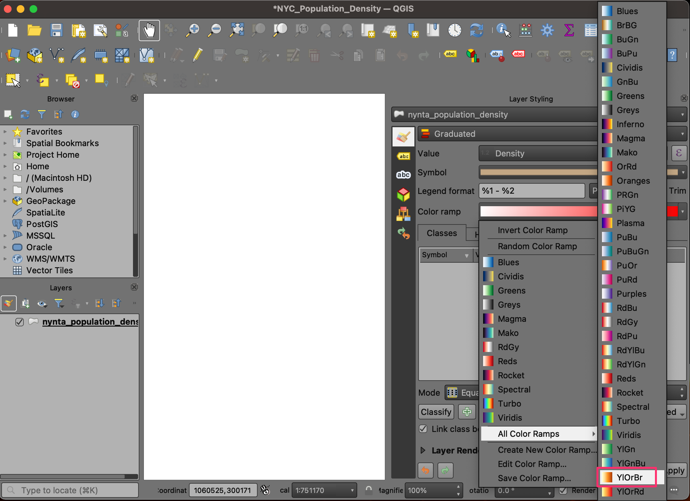
```

5. Change the *Classes* value to ``6`` and click *Classify*. You will see each polygon colored according to the population density attribute. 

```{r echo=FALSE, fig.align='center', out.width='75%'}
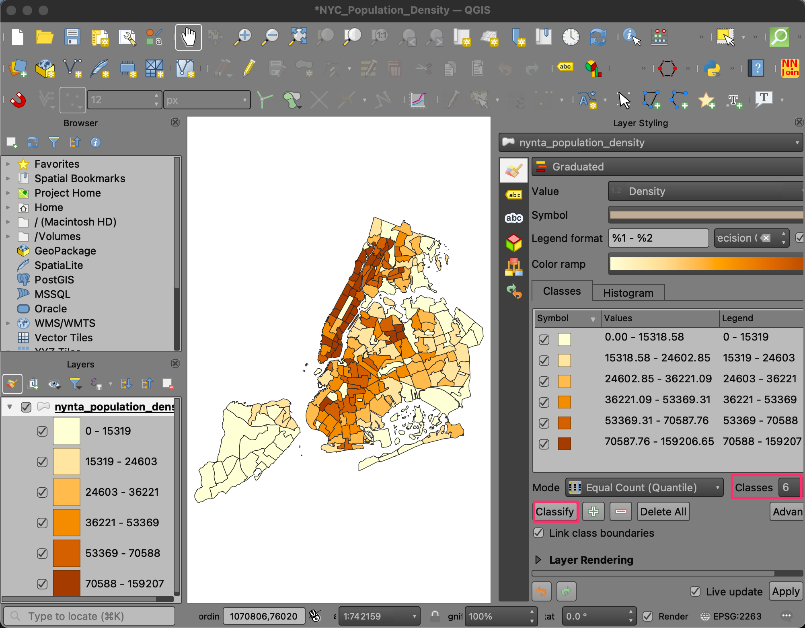
```

6. The default mode of classification is *Quantile* - which tried to divide the input data such that all 6 classes have approximately equal number of features. There are other modes of classification as well. You can learn more about Data Classification Modes in the [QGIS Documentation](https://docs.qgis.org/testing/en/docs/user_manual/working_with_vector/vector_properties.html?#graduated-renderer). We can also define custom data ranges for each class. Click on the *Values* column for the first row in the classification table. Change the *Upper value8 to `20000`.

```{r echo=FALSE, fig.align='center', out.width='75%'}
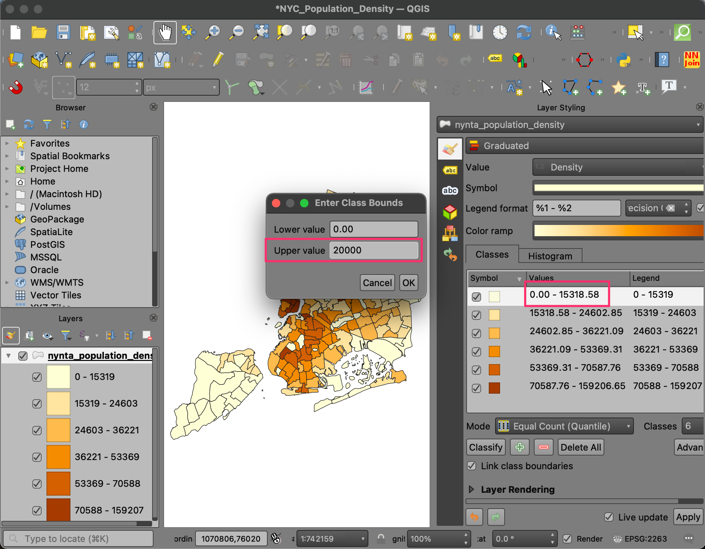
```

7. Similarly change other class ranges so they become easy to interpret. The last row contains the upper value to the maximum value in the dataset. Instead of displaying the maximum value, we can update the label. Click the *Legend* column for the last row.

```{r echo=FALSE, fig.align='center', out.width='75%'}
knitr::include_graphics('images/introduction_to_qgis/population_part2_7.png')
```

8. Change the label to `> 100000`. 

```{r echo=FALSE, fig.align='center', out.width='75%'}
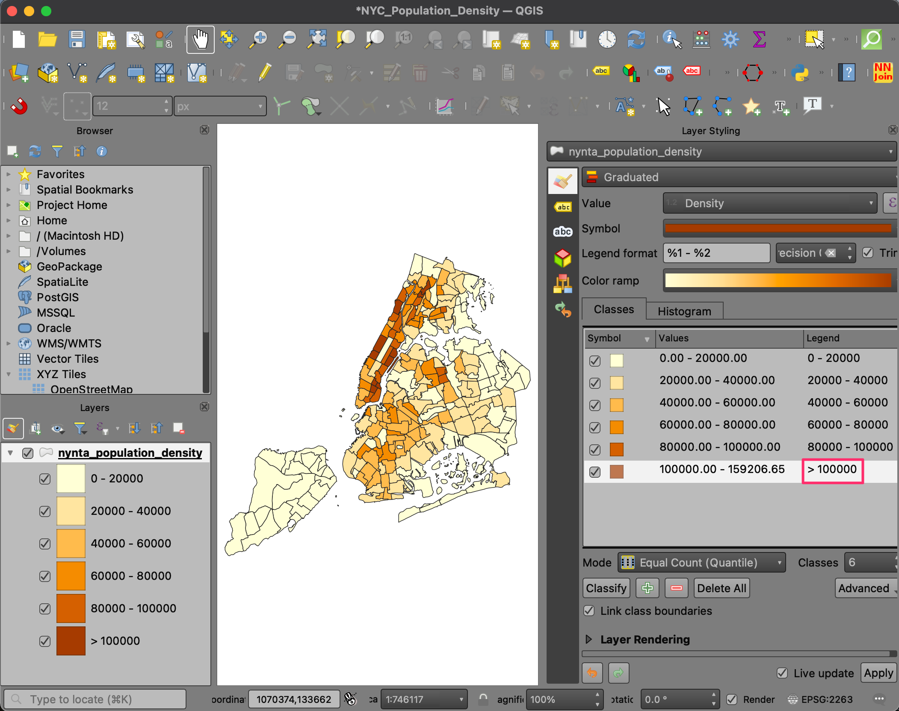
```

9. Now you have an informative visualization of population density in New York city with an easy to interpret legend. Click the *Save* button to save your work. All your visualization settings are saved along with the project, so next time when you load this project in QGIS, you will see the same visualization.

```{r echo=FALSE, fig.align='center', out.width='75%'}
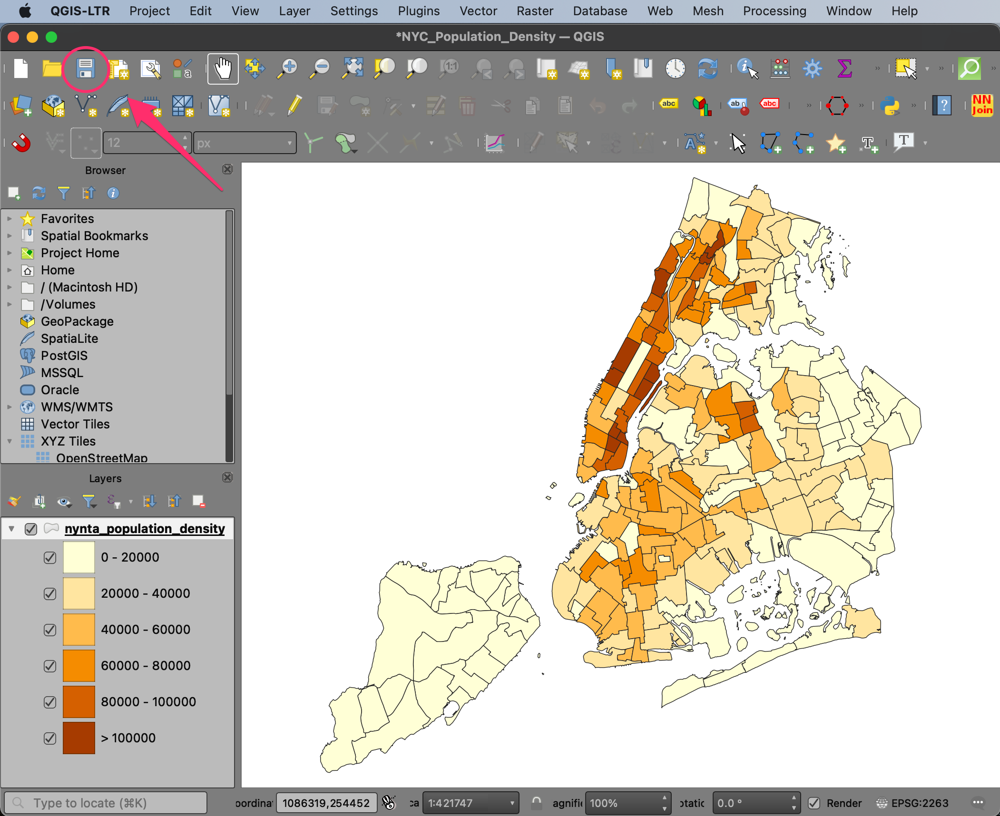
```

We have now finish the second part of this exercise. Your output should match the contents of the `NYC_Population_Density_Checkpoint2.qgz` file in the `solutions` folder.


# 3. Georeferencing

Most GIS projects require Georeferencing some raster data. Georeferencing is the process of assigning real-world coordinates to each pixel of the raster. Many times these coordinates are obtained by doing field surveys - collecting coordinates with a GPS device for few easily identifiable features in the image or map. In some cases, where you are looking to digitize scanned maps with grid markings, you can obtain the coordinates from the markings on the map image itself. Using these sample coordinates or GCPs (Ground Control Points), the image is warped and made to fit within the chosen coordinate system. 

## 3.1 Georeference a Scanned Map

In this exercise, you will learn the process and strategies to achieve a high accuracy georeferencing in QGIS. We will take a scanned map of Bangalore in 1924. This map is possibly hand-drawn, so scale and projection information is not available. We will use the OpenStreetMap basemap to identify coordinates of features from the scanned map and rectify the map to a    lign with the basemap.


1. Open QGIS. Add the OpenStreetMap basemap from **Web &rarr; QuickMapServices &rarr; OSM &rarr; OpenStreetMap** layer. 

```{r echo=FALSE, fig.align='center', out.width='75%'}
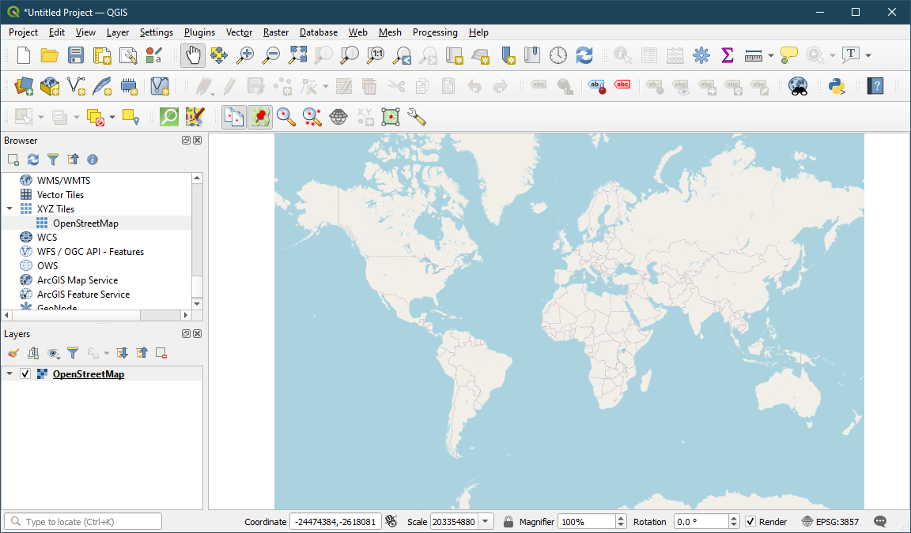
```

2. Go to **Raster &rarr; Georeferencer…** 

```{r echo=FALSE, fig.align='center', out.width='75%'}
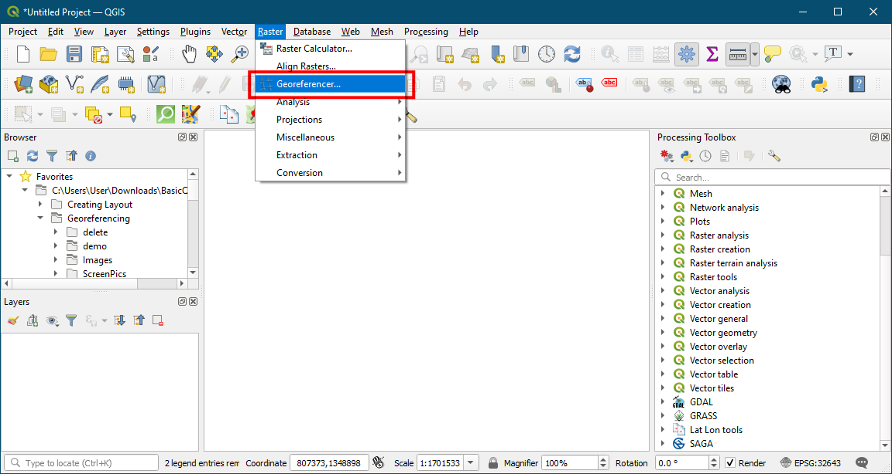
```

3. The  *Georeferencer* window is divided into 2 sections. The top section where the image will be displayed and the bottom section where a table showing your GCPs will appear.

```{r echo=FALSE, fig.align='center', out.width='60%'}
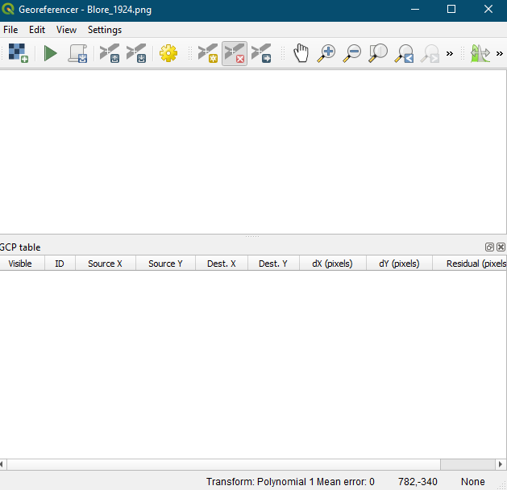
```

4. Go to **File &rarr; Open Raster**. Browse to the `Banglore_1924.png` and click Open.

```{r echo=FALSE, fig.align='center', out.width='75%'}
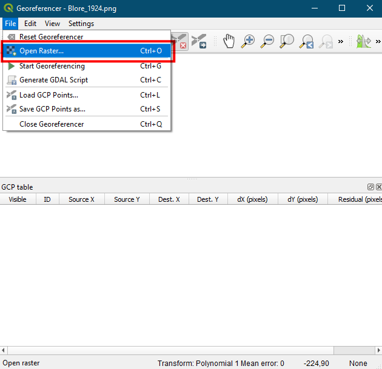
```

5. The toposheet will be loaded on the top section. You can use the *Zoom/Pan* controls in the toolbar to learn more about the map.

```{r echo=FALSE, fig.align='center', out.width='75%'}
knitr::include_graphics('images/introduction_to_qgis/reference_img05.png')
```

6. To assign coordinates to reference points (ground reference points) on this map. Click the *Add points* button and click on a location that can be located in ```Openstreetmap```. Select **From Map Canvas**.

> Always select points from permament structures such as road intersections, junctions, big-building corners etc.. It is not advisable to georeference using the natural structure such as river edges, hill tops, etc. as they can change over time.
 
```{r echo=FALSE, fig.align='center', out.width='75%'}
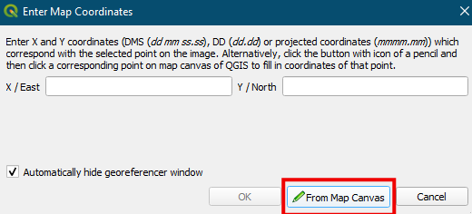
```

7. Select a minimum of 6 GCPs for georeferencing, usually a higher number of GCPs will be useful in reducing the error. 

```{r echo=FALSE, fig.align='center', out.width='75%'}
knitr::include_graphics('images/introduction_to_qgis/reference_img07.png')
```

8. Click on **Settings**, *Transformation type* as **Polynomial 2**, *Resampling method* as **Nearest neighbourhood**, *Target SRS* as *WGS 84 / Pseudo-Mercator EPSG : 3857*, *Output layer* as **Banglore_1924_modified.tif**. Also choose *LZW* as the *Compression* type,  Check *Save GCP Points* and *Load in QGIS* when done. And Click OK. 

```{r echo=FALSE, fig.align='center', out.width='75%'}
knitr::include_graphics('images/introduction_to_qgis/reference_img08.png')
```

9. Now the GCPs now have a non-zero *dX, dY* and *Residual* error values. If a particular GCP has unusually high error values, that usually means a human-error in entering the coordinate values.

```{r echo=FALSE, fig.align='center', out.width='75%'}
knitr::include_graphics('images/introduction_to_qgis/reference_img09.png')
```

10. You can delete that GCP and capture it again. Repeat the process till the errors are acceptable.

```{r echo=FALSE, fig.align='center', out.width='75%'}
knitr::include_graphics('images/introduction_to_qgis/reference_img10.png')
```

11. Click the *Start Georeferencing* button to start georeferencing. This will start the process of warping the image using the GCPs and creating the target raster. 

```{r echo=FALSE, fig.align='center', out.width='75%'}
knitr::include_graphics('images/introduction_to_qgis/reference_img11.png')
```

12. The georeferenced map will be loaded in main window as `Banglore_1924_modified` and can be validated with the `Openstreetmap` basemap in QGIS. 

```{r echo=FALSE, fig.align='center', out.width='75%'}
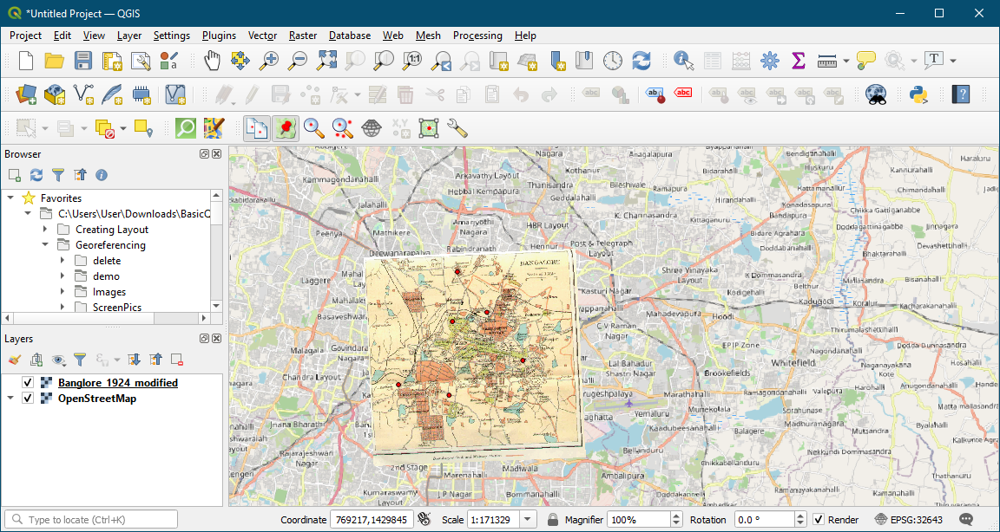
```

## Challenge

Change the *Transformation type* to **Thin Plate Spline** and run the georeferencing process again. Compare the results with the previous output.s


# 4. Digitizing

Digitizing is one of the most common tasks that a GIS Specialist has to do. Often a large amount of GIS time is spent in digitizing raster data to create vector layers that you use in your analysis. Many machine learning projects also require creating labeled dataset that needs tyo be created by digitizing features from satellite imagery or historic maps. QGIS has powerful on-screen digitizing and editing capabilities that we will explore in this tutorial.

## 4.1 Digitize Historic Lakes

We will take the georeferenced map created in the previous exercise and create a polygon layer representing the lakes in the city of Bengaluru in 1924. Bengaluru has experienced rapid urbanization and many of these historic lakes no longer exist. This exercise will allow you to create a vector layer and discover the lakes that are fully or partially lost.


<!-- "catalog_name" IN ('EMME', 'EOS_SE_Asia', 'HimaTibetMap') -->


# Data Credits

* OSM Tile Layer, Bangalore Metro Stations : (c) OpenStreetMap contributors
* Bangalore Ward Maps Provided by [Spatial Data of Municipalities (Maps) Project](http://projects.datameet.org/Municipal_Spatial_Data/) by Data{Meet}.
* Karnataka Population Grid 2020: Downloaded from [WorldPop](https://www.worldpop.org/geodata/summary?id=6527) - School of Geography and Environmental Science, University of Southampton; Department of Geography and Geosciences, University of Louisville; Departement de Geographie, Universite de Namur) and Center for International Earth Science Information Network (CIESIN), Columbia University (2018). Global High Resolution Population Denominators Project - Funded by The Bill and Melinda Gates Foundation (OPP1134076). https://dx.doi.org/10.5258/SOTON/WP00645

# License


This course material is licensed under a [Creative Commons Attribution-NonCommercial 4.0 International License](https://creativecommons.org/licenses/by-nc/4.0/). You are free to use the material for any non-commercial purpose. Kindly give appropriate credit to the original author.

If you would like to utilize these materials as part of a commercial offering, you can purchase a *Trainer License* for a small fee. 

Please [contact us](https://spatialthoughts.com/contact/) for pricing and terms.
<!--
This material is part of the *Trainer's Package* and the buyer gets a non-exclusive, non-transferable, perpetual license to the material. You can fully customise and brand the materials to your requirements.
-->

&copy; 2022 Ujaval Gandhi [www.spatialthoughts.com](https://spatialthoughts.com)

***

**This course is offered as an instructor-led online class. Visit [Spatial Thoughts](https://spatialthoughts.com/events/) to know details of upcoming sessions.**
