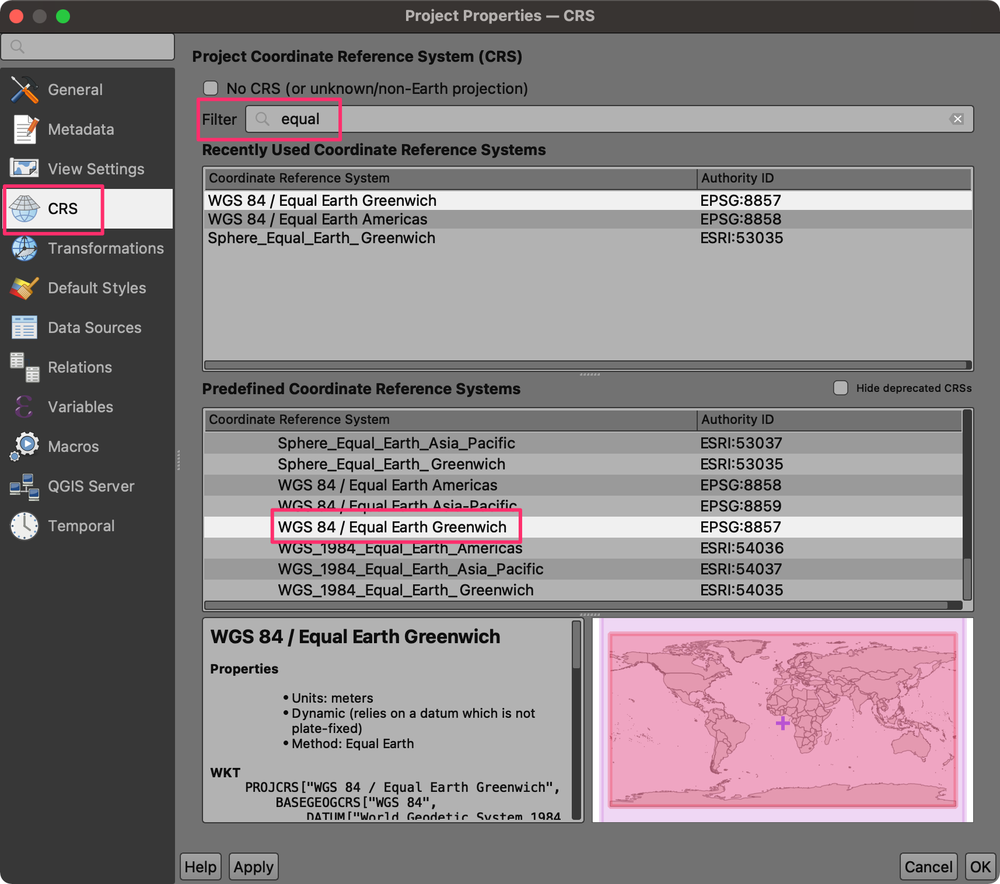
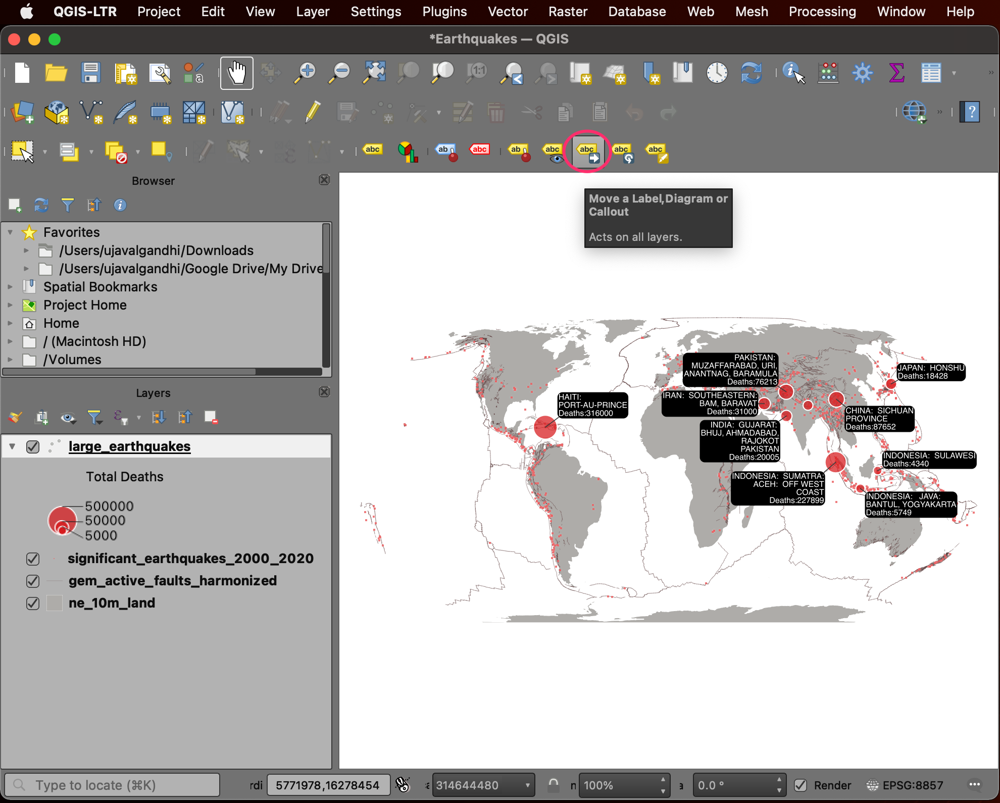
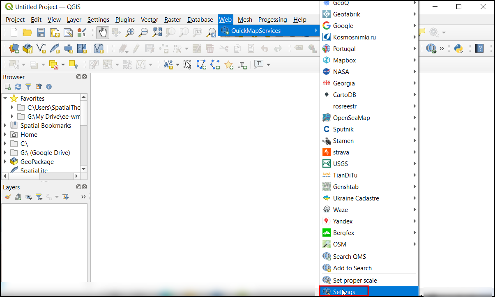

\newpage

***

```{r echo=FALSE, fig.align='center', out.width='75%', out.width='250pt'}
knitr::include_graphics('images/spatial_thoughts_logo.png')
```

***

\newpage

# Introduction 

This is an introductory course that covers QGIS from the very basics. You will learn how to use QGIS for mapping, spatial data processing and spatial analysis. This class is ideal for participants with a basic knowledge of GIS and want to learn how to use QGIS carry out common GIS tasks.


[{width="400px"}](https://docs.google.com/presentation/d/1Lw0NQlLQXUSW1Mf1rzy9pLb_m2wxSUHQDxF-vjPTBaU/edit?usp=sharing){target="_blank"}

[View the Presentation ↗](https://docs.google.com/presentation/d/1Lw0NQlLQXUSW1Mf1rzy9pLb_m2wxSUHQDxF-vjPTBaU/edit?usp=sharing){target="_blank"}


# Software

This course requires QGIS LTR version 3.22. 

Please review [QGIS-LTR Installation Guide](install-qgis-ltr.html) for step-by-step instructions.

# Get the Data Package

The code examples in this class use a variety of datasets. All the required datasets and Jupyter notebooks are supplied to you in the ``python_dataviz.zip`` file. Unzip this file to a directory - preferably to the ``<home folder>/Downloads/introduction_to_qgis/`` folder. 

<!-- *Not enrolled in our instructor-led class but want to work through the material on your own?* [Get free access to the data package](https://docs.google.com/forms/d/e/1FAIpQLSf6TGQmr5w_QlDEgZ7QJrfuiRTu-aCuhfcNY_fYCU3zv9hHOg/viewform){target="_blank"} -->

# 1. Creating Maps

This section is designed to help you get familiar with the basic workflow of importing data layers, applying symbology, adding labels and designing layouts for maps. We will take a text file containing historic records of earthquakes and turn it into an informative visualization like below.


```{r echo=FALSE, fig.align='center', out.width='75%'}
knitr::include_graphics('images/introduction_to_qgis/earthquake_map.png')
```

## 1.1 Data Pre-Processing

1. Open QGIS. The first step is to import the source datasets. Click on the *Open Data Source Manager* button.

```{r echo=FALSE, fig.align='center', out.width='75%'}
knitr::include_graphics('images/introduction_to_qgis/earthquakes_part1_1.png')
```

2. Select the *Vector* tab. Click the *...* button next to *Vector Dataset(s)* and browse to the data directory. 

```{r echo=FALSE, fig.align='center', out.width='75%'}
knitr::include_graphics('images/introduction_to_qgis/earthquakes_part1_2.png')
```

3. Select the `ne_10m_land.shp` file and click *Open*. In the *Data Source Manager* window, click *Add*.

```{r echo=FALSE, fig.align='center', out.width='75%'}
knitr::include_graphics('images/introduction_to_qgis/earthquakes_part1_3.png')
```

4. A new layer `ne_10m_land` will be added to the *Layers* panel and will be displayed on the Canvas. This layer contains polygons representing the land areas of the world. Click on the *Open Data Source Manager* button again.

```{r echo=FALSE, fig.align='center', out.width='75%'}
knitr::include_graphics('images/introduction_to_qgis/earthquakes_part1_4.png')
```

5. Click the *...* button next to *Vector Dataset(s)* and browse to the data directory. Select the `gem_active_faults_harmonized.gpkg` file and click *Open* followed by *Add*.

```{r echo=FALSE, fig.align='center', out.width='75%'}
knitr::include_graphics('images/introduction_to_qgis/earthquakes_part1_5.png')
```

6. A new layer `gem_active_faults_harmonized` will be added to the *Layers* panel and will be displayed on the Canvas. This is a global layer containing lines representing all the active faults. We will now import another layer of earthquake points. Click on the *Open Data Source Manager* button again.

```{r echo=FALSE, fig.align='center', out.width='75%'}
knitr::include_graphics('images/introduction_to_qgis/earthquakes_part1_6.png')
```

7. Select the *Delimited Text* tab. Click the *...* button next to *File name* and browse to the data directory. Select the `significant_earthquakes_2000_2020.tsv` file. This is a text file in the *Tab-Separated Values (TSV) format*. In the *File Format* section, select **Custom delimiters**.

```{r echo=FALSE, fig.align='center', out.width='75%'}
knitr::include_graphics('images/introduction_to_qgis/earthquakes_part1_7.png')
```

8. Check the *Tab* checkbox. In the *Geometry Definition* section, ensure **Longitude** is selected as the *X Field* and **Latitude** is selected as the *Y Field*. Leave other options to their default values and click *Add*.

```{r echo=FALSE, fig.align='center', out.width='75%'}
knitr::include_graphics('images/introduction_to_qgis/earthquakes_part1_8.png')
```

9. A new layer `significant_earthquakes_2000_2020` will be added to the *Layers* panel and will be displayed on the Canvas.This layer contains over 1000 records of significant earthquakes recorded between 2000 and 2020. Right-click on the `significant_earthquakes_2000_2020` layer and select *Open Attribute Table*. Examine all the attributes and their values.

```{r echo=FALSE, fig.align='center', out.width='75%'}
knitr::include_graphics('images/introduction_to_qgis/earthquakes_part1_9.png')
```

10. We will now learn about some of the tools to query and select records. From the *Selection Toolbar*, click the *Select Features by Value...* button.

```{r echo=FALSE, fig.align='center', out.width='75%'}
knitr::include_graphics('images/introduction_to_qgis/earthquakes_part1_10.png')
```

11. In the *Select Features* dialog, enter **2020** as the *Year* and click the *Select Features* button. You will see all earthquakes occurred during the year 2020 will be highlighted in yellow. You may also click the *Flash Features* button to see the selected records blink.

```{r echo=FALSE, fig.align='center', out.width='75%'}
knitr::include_graphics('images/introduction_to_qgis/earthquakes_part1_11.png')
```

12. Let's refine the query a little more. Enter **7** as the *Mag* parameter and set the criteria to be *Greater than (>)*. Click *Select Features*. You will now see only those points where the earthquake occurred in 2020 and its magnitude was greater than 7. Close the window.

```{r echo=FALSE, fig.align='center', out.width='75%'}
knitr::include_graphics('images/introduction_to_qgis/earthquakes_part1_12.png')
```

13. Right-click on the `significant_earthquakes_2000_2020` layer and select *Open Attribute Table*. You will see that there are 6 selected features in the layer. If you wanted to examine their attributes, there is a handy shortcut. Click the *Move selection to top* button.

```{r echo=FALSE, fig.align='center', out.width='75%'}
knitr::include_graphics('images/introduction_to_qgis/earthquakes_part1_13.png')
```

14. All the selected rows will be displayed on the top of the attribute table - making it easy to examine the selected features. Click the *Deselect all features from the layer* button.

```{r echo=FALSE, fig.align='center', out.width='75%'}
knitr::include_graphics('images/introduction_to_qgis/earthquakes_part1_14.png')
```

15. For our map, we need another layer of 10 largest earthquakes - so we can style it differently than other earthquakes. For the purpose of our visualization, we will define largest earthquakes being the ones that resulted in the largest number of deaths. Locate the *Total Deaths* attribute and click twice on the column header. This will sort the features in descending order of the values in this column.

```{r echo=FALSE, fig.align='center', out.width='75%'}
knitr::include_graphics('images/introduction_to_qgis/earthquakes_part1_15.png')
```

16. Hold the *Shift* key and select the first 10 rows. This selection will be the 10 earthquakes with the largest fatalities.

```{r echo=FALSE, fig.align='center', out.width='75%'}
knitr::include_graphics('images/introduction_to_qgis/earthquakes_part1_16.png')
```

17. We will save the selected 10 features as a new layer. Right-click the `significant_earthquakes_2000_2020` layer and go to *Export &rarr; Save Selected Features As..*.

```{r echo=FALSE, fig.align='center', out.width='75%'}
knitr::include_graphics('images/introduction_to_qgis/earthquakes_part1_17.png')
```

18. Select **GeoPackage** as the *Format*. Click the *...* button next to *File name* and browse to the data directory. Name the layer as `large_earthquakes.gpkg`. Click *Save*. Click *OK*.

```{r echo=FALSE, fig.align='center', out.width='75%'}
knitr::include_graphics('images/introduction_to_qgis/earthquakes_part1_18.png')
```

19. A new layer `large_earthquakes` will be added to the *Layers* panel.

```{r echo=FALSE, fig.align='center', out.width='75%'}
knitr::include_graphics('images/introduction_to_qgis/earthquakes_part1_19.png')
```

20. Our data preparation is now complete. Let's save our work. Go to *Project &rarr; Save*. Browse to the data directory and enter the name as **Earthquakes**. Click *Save*.

```{r echo=FALSE, fig.align='center', out.width='75%'}
knitr::include_graphics('images/introduction_to_qgis/earthquakes_part1_20.png')
```

21. The project will be saved as a file in the QGZ format. 

```{r echo=FALSE, fig.align='center', out.width='75%'}
knitr::include_graphics('images/introduction_to_qgis/earthquakes_part1_21.png')
```

We have now finish the first part of this exercise. Your output should match the contents of the `Earthquakes_Checkpoint1.qgz` file in the `solutions` folder.

### 1.1.1 Challenge

Do you know about the [Null Island](https://en.wikipedia.org/wiki/Null_Island)? The `ne_10m_land` contains a polygon for this feature. Locate this polygon on the map.

Hint: Open the attribute table, find and select the feature for Null island. Then use the *Zoom map to the selected rows* button.

## 1.2 Symbology

The symbology of a layer is its visual appearance on the map. We will now learn different techniques for styling each of our layers to visually convey the information.

1. Select the ``ne_10m_land`` layer and click *Open the Layer Styling Panel*.

```{r echo=FALSE, fig.align='center', out.width='75%'}
knitr::include_graphics('images/introduction_to_qgis/earthquakes_part2_1.png')
```

2. We will style this layer with a simple grey color. Click *Simple Fill* to reveal more options. Click the dropdown next to *Fill color*.

```{r echo=FALSE, fig.align='center', out.width='75%'}
knitr::include_graphics('images/introduction_to_qgis/earthquakes_part2_2.png')
```

3. Use the color picker to select a light shade of grey color. The *Layer Styling Panel* is interactive, so your choice of color can be immediately previewed on the map canvas.

```{r echo=FALSE, fig.align='center', out.width='75%'}
knitr::include_graphics('images/introduction_to_qgis/earthquakes_part2_3.png')
```

4. Similarly, change the *Stroke color* to white.

```{r echo=FALSE, fig.align='center', out.width='75%'}
knitr::include_graphics('images/introduction_to_qgis/earthquakes_part2_4.png')
```

5. Next, we will style the faults layer. Select ``gem_active_faults_harmonized`` layer in the *Layers* panel. Click the *Simple Line* symbol to reveal more styling options. Change the *Color* to a shade of brown. Set the *Stroke width* to **0.1**.

```{r echo=FALSE, fig.align='center', out.width='75%'}
knitr::include_graphics('images/introduction_to_qgis/earthquakes_part2_5.png')
```

6. Now we will change the style of the earthquake points. Select the ``significant_earhtquakes_2000_2020`` layer. Click the *Simple Marker* symbol. Change the *Size* option to **0.7** *Millimeters*. Select red as the *Fill color* and white as the *Stroke color*. Change the *Stroke width* to **0.1**. 

```{r echo=FALSE, fig.align='center', out.width='75%'}
knitr::include_graphics('images/introduction_to_qgis/earthquakes_part2_6.png')
```

7. We have now styles the three background layers. Now we will style the ``large_earthquakes`` layer which features the main information we want to convey through this map. We will use a *Proportional Circle* style and have the size of the circle represent the total fatalities caused by the respective earthquake. Click *Simple Marker* to see more styling options. Click the *Data defined override* button next to *Size* and choose **Assistant**.

```{r echo=FALSE, fig.align='center', out.width='75%'}
knitr::include_graphics('images/introduction_to_qgis/earthquakes_part2_7.png')
```

8. In the *Input* section, select **Total Deaths** as the *Source*. Set the range of *Values from* **5000** *to* **500000**. In the *Output* section, set the range of *Size from* **3** *to* **10**. This will use the attribute value in the *Total Deaths* field to set the size of the circles. Click the *Go Back* button at the top of the panel to return to the previous menu.

```{r echo=FALSE, fig.align='center', out.width='75%'}
knitr::include_graphics('images/introduction_to_qgis/earthquakes_part2_8.png')
```

9. Click the *Fill color* and adjust the transparency. This will help show the information under the large circles.

```{r echo=FALSE, fig.align='center', out.width='75%'}
knitr::include_graphics('images/introduction_to_qgis/earthquakes_part2_9.png')
```

10. Set the *Stroke color* to white.

```{r echo=FALSE, fig.align='center', out.width='75%'}
knitr::include_graphics('images/introduction_to_qgis/earthquakes_part2_10.png')
```

11. The circles represent the number of deaths caused by each earthquake. But the reader of our map will not know what these sizes represent. It will help interpret the map better if we had a legend. Let's set a legend for this layer. Click the *Marker* symbol. At the bottom of the panel, select *Advanced &rarr; Data-defined Size Legend*. 

```{r echo=FALSE, fig.align='center', out.width='75%'}
knitr::include_graphics('images/introduction_to_qgis/earthquakes_part2_11.png')
```

12. Choose the *Collapsed legend* option. Check the *Manual size classes* option. Click the *+* button to add the class definition manually.

```{r echo=FALSE, fig.align='center', out.width='75%'}
knitr::include_graphics('images/introduction_to_qgis/earthquakes_part2_12.png')
```

13. Set three different size classes for **5000**, **50000** and **500000**. You will see a legend in the *Layers* panel show the circle sizes and their related fatality value.

```{r echo=FALSE, fig.align='center', out.width='75%'}
knitr::include_graphics('images/introduction_to_qgis/earthquakes_part2_13.png')
```

14. Click the *Save Project* button to save your work.

```{r echo=FALSE, fig.align='center', out.width='75%'}
knitr::include_graphics('images/introduction_to_qgis/earthquakes_part2_14.png')
```

We have now finish the second part of this exercise. Your output should match the contents of the `Earthquakes_Checkpoint2.qgz` file in the `solutions` folder.

### 1.2.1 Challenge

QGIS has many rich cartography features. One of my favorites is called *Live Layer Effects*. This allows you to add effects such as *Outer Glow*, *Drop Shadow* etc. to each symbol. This takes your symbology to the next level, and helps highlight certain features. Select the `large_earthquakes`  layer and open the *Layer Styling Panel*. Expand the *Layer Rendering* section and enable *Draw effects*. Click the *Customize effects* button and add a drop shadow effect to the layer.

```{r echo=FALSE, fig.align='center', out.width='75%'}
knitr::include_graphics('images/introduction_to_qgis/earthquakes_part2_challenge.png')
```

## 1.3 Labelling

Labels are a useful way to convey additional information for any features. Labels are associated with each feature and can be configured to show information from the attributes. We will now add labels to each of the large earthquake points to show the name of the location as well as the deaths caused due to that earthquake.

1. Before we proceed further, let's change the projection of our map to a more appropriate one. The preferred and modern choice for global maps is the [Equal Earth](http://equal-earth.com/) projection. It is much more visually appealing and also preserves relative areas of continents. Go to *Project &rarr; Properties...*.

```{r echo=FALSE, fig.align='center', out.width='75%'}
knitr::include_graphics('images/introduction_to_qgis/earthquakes_part3_1.png')
```

2. Switch to the *CRS* tab. Search and select the **WGS84 / Equal Earth Greenwich** CRS. Click *OK*.

```{r echo=FALSE, fig.align='center', out.width='75%'}

```

3. Back in the QGIS Window, you will notice that the shape of the map looks different now. The bottom-right corner also displayed the current project CRS *EPSG:8857*. Select the ``large_earthquakes`` layer and open the *Layer Styling Panel*. Switch to the *Labels* tab.

> Note: Changing the Project CRS does not change the CRS of the layers, but reprojects them on-the-fly to the chosen CRS for display.

```{r echo=FALSE, fig.align='center', out.width='75%'}
knitr::include_graphics('images/introduction_to_qgis/earthquakes_part3_3.png')
```

4. Select *Single Labels*. We will combine the values from multiple attributes for the label using an expression. Click the *Expression* button next to *Value*.

```{r echo=FALSE, fig.align='center', out.width='75%'}
knitr::include_graphics('images/introduction_to_qgis/earthquakes_part3_4.png')
```

5. Locate the **Location Name** attribute under *Fields and Values* group. Double-click to add it to the expression. You can check the *Preview* at the bottom to see the result of the expression.

```{r echo=FALSE, fig.align='center', out.width='75%'}
knitr::include_graphics('images/introduction_to_qgis/earthquakes_part3_5.png')
```

6. We will create a longer label text by combining multiple attributes. You can use the **||** operator in QGIS expression to concatenate strings. Create the expression as shown below. Click *OK*.

```
"Location Name" ||  ';' || 'Deaths:' || "Total Deaths"
```

```{r echo=FALSE, fig.align='center', out.width='75%'}
knitr::include_graphics('images/introduction_to_qgis/earthquakes_part3_6.png')
```

7. The labels will be rendered next to the points on the canvas. Select the *Formatting* tab. At the bottom, enter **;** as the value for *Wrap on character* and **20** characters as the value for *Wrap lines to*. This will break the labels into multiple lines and make them readable.

```{r echo=FALSE, fig.align='center', out.width='75%'}

```

8. Next we will change the appearance of the label text. Switch to the *Text* tab. Change the *Size* to **8** and set the *Color* to white.

```{r echo=FALSE, fig.align='center', out.width='75%'}
knitr::include_graphics('images/introduction_to_qgis/earthquakes_part3_8.png')
```

9. A useful labeling technique is to add a background to the labels to improve legibility. Switch to the *Background* tab and enable *Draw background*. Set the *Color* to black. Also set the *Size X* and *Size Y* of *Buffer* to be **1** point. At the bottom, set the *Radius X,Y* to **5**.

```{r echo=FALSE, fig.align='center', out.width='75%'}
knitr::include_graphics('images/introduction_to_qgis/earthquakes_part3_9.png')
```

10. To attach the labels to each of the symbols, you can use a leader line. Switch to the *Callouts* tab and check *Draw callouts*. 

```{r echo=FALSE, fig.align='center', out.width='75%'}
knitr::include_graphics('images/introduction_to_qgis/earthquakes_part3_10.png')
```

11. As we have only a few labels, we can adjust their placement manually to fir the layout better. Close the *Layer Styling Panel*. Right-click anywhere on the *Toolbar* are and select the *Label Toolbar* to activate it.

```{r echo=FALSE, fig.align='center', out.width='75%'}
knitr::include_graphics('images/introduction_to_qgis/earthquakes_part3_11.png')
```

12. Once the *Label Toolbar* is activated, you will see new tools. Select the *Move a Label, Diagram or Callout* tool.

```{r echo=FALSE, fig.align='center', out.width='75%'}

```

13. Click on any of the label. The first time you do this, you will be prompted with a *Auxiliary Storage: Choose Primary Key* dialog. This is use to store the position of the labels for each label. You can choose any field containing unique values. In our case, the default value **fid** is fine. Click *OK*.

```{r echo=FALSE, fig.align='center', out.width='75%'}
knitr::include_graphics('images/introduction_to_qgis/earthquakes_part3_13.png')
```

14. Click on the label again to start moving it. Drag your mouse to the new label location and click again to move the label.

```{r echo=FALSE, fig.align='center', out.width='75%'}
knitr::include_graphics('images/introduction_to_qgis/earthquakes_part3_14.png')
```

15. Similarly, move other labels to appropriate locations. Once you are satisfied, save your work.

```{r echo=FALSE, fig.align='center', out.width='75%'}
knitr::include_graphics('images/introduction_to_qgis/earthquakes_part3_15.png')
```

We have now finish the third part of this exercise. Your output should match the contents of the `Earthquakes_Checkpoint3.qgz` file in the `solutions` folder.

### 1.3.1 Challenge

The numbers displayed in the labels can be hard to read since they are not formatted. We can make them readable by adding a thousands-separator. So a number such as *227899* is displayed as *227,899* and a number like *5749* as *5,749*. Update the expression for the labels so the numbers are formatted. You can use the `format_number()` function in the QGIS expression editor to achieve this.

## 1.4 Print Layout

QGIS comes with a rich set of tools to create map layouts that allows you to add elements such labels, images, legend, scale bar, north arrow etc. to your map. It also allows you to export the map layout as an image or a PDF. We will now take the visualization created in the QGIS map canvas and create a print layout.

1. Go to *Project &rarr; New Print Layout...*.

```{r echo=FALSE, fig.align='center', out.width='75%'}
knitr::include_graphics('images/introduction_to_qgis/earthquakes_part4_1.png')
```

2. You will be prompted by a *Create Print Layout* dialog asking to *Enter a unique print layout title*. You can leave it blank and click *OK*.

```{r echo=FALSE, fig.align='center', out.width='75%'}
knitr::include_graphics('images/introduction_to_qgis/earthquakes_part4_2.png')
```

3. A new window will open with the title *Layout 1*. First let's set the page size. Right-click on the canvas and select *Page Properties...*. Select *Size* as **A4** and *Orientation* as **Landscape**.

```{r echo=FALSE, fig.align='center', out.width='75%'}
knitr::include_graphics('images/introduction_to_qgis/earthquakes_part4_3.png')
```

4. Next, go to *Add Item &rarr; Add Map*.

```{r echo=FALSE, fig.align='center', out.width='75%'}
knitr::include_graphics('images/introduction_to_qgis/earthquakes_part4_4.png')
```

5. Hold the left mouse button and select the part of the canvas where you want the map to appear. We will use the full width for the map, but leave some space at the top for a title and at the bottom for additional information.

```{r echo=FALSE, fig.align='center', out.width='75%'}
knitr::include_graphics('images/introduction_to_qgis/earthquakes_part4_5.png')
```

6. The map will be rendered at the chosen location. You can adjust the scale to make the map fit the area. Enter **120000000** as the value for *Scale*. You can also select the *Interactively Edit Map Extent* button and click on the map to move it.

```{r echo=FALSE, fig.align='center', out.width='75%'}

```

7. Once you are satisfied with the map view, go to *Add Item &rarr; Add Label*. 

```{r echo=FALSE, fig.align='center', out.width='75%'}

```

8. Drag a rectangle at the top. On the right-hand side *Item Properties* panel, enter **10 Largest Earthquakes (2000-2020)** as the text. Click on the *Font* button under *Appearance* and set the *Font Size* to **24**. You can also center align the label by selecting **Center** as the *Horizontal alignment* and **Middle** as the *Vertical Alignment*.

```{r echo=FALSE, fig.align='center', out.width='75%'}
knitr::include_graphics('images/introduction_to_qgis/earthquakes_part4_8.png')
```

9. We will now add a legend to the map. Go to *Add Item &rarr; Add Legend*. Draw a rectangle at an empty region on the map.

```{r echo=FALSE, fig.align='center', out.width='75%'}
knitr::include_graphics('images/introduction_to_qgis/earthquakes_part4_9.png')
```

10. Once the legend is added, un-check the *Auto update* box. This will allow us to customize the items in the legend. Select the ``ne_10m_land`` layer and click the *Remove selected item(s) from legend*. 

```{r echo=FALSE, fig.align='center', out.width='75%'}
knitr::include_graphics('images/introduction_to_qgis/earthquakes_part4_10.png')
```

11. You can also edit the layer name to be more suitable for the map. Select the ``gem_active_faults_harmonized`` layer and click the *Edit selected item properties* button. Change the name of the layer to ``Faults``. Similarly change the ``large_earthquakes`` layer name to ``Deaths``.

```{r echo=FALSE, fig.align='center', out.width='75%'}
knitr::include_graphics('images/introduction_to_qgis/earthquakes_part4_11.png')
```

12. Select the ``Total Deaths`` layer and click *Remove selected item(s) from legend*. The legend now contains only the items that are easy to interpret and add context to the symbols in the map. 

```{r echo=FALSE, fig.align='center', out.width='75%'}
knitr::include_graphics('images/introduction_to_qgis/earthquakes_part4_12.png')
```

13. You can also add a border to all the elements by enabling the *Frame* under the respective *Item Properties*. Next, we will add some logos to the map. Go to *Add Item &rarr; Add Picture*.

```{r echo=FALSE, fig.align='center', out.width='75%'}

```

14. Add the picture to the bottom-right corner. Locate the *App Symbols &rarr; logos* folder in the *Item Properties* panel. Select the **Made with QGIS** logo. You can also add a logo of your organization by browsing to a SVG/PNG file on your computer.

```{r echo=FALSE, fig.align='center', out.width='75%'}
knitr::include_graphics('images/introduction_to_qgis/earthquakes_part4_14.png')
```

15. A good practice is to credit the data sources used to create the map. This can be added using *Add Item &rarr; Add Label*. Once you are satisfied with the layout, you can export it. Go to *Layout &rarr; Export as Image...*.

```{r echo=FALSE, fig.align='center', out.width='75%'}
knitr::include_graphics('images/introduction_to_qgis/earthquakes_part4_15.png')
```

16. Browse to the data folder and enter the name of the image as **large_earthquakes.png**. Click *Save*. You will be prompted to choose *Image Export Options*. Leave the settings to default and click *Save*.

```{r echo=FALSE, fig.align='center', out.width='75%'}
knitr::include_graphics('images/introduction_to_qgis/earthquakes_part4_16.png')
```

17. The layout will be saved as a static image. You can embed this image in a report, presentation or share on social media.

```{r echo=FALSE, fig.align='center', out.width='75%'}
knitr::include_graphics('images/introduction_to_qgis/earthquakes_part4_17.png')
```

We come to the end of this this exercise. Your output should match the contents of the `Earthquakes_Checkpoint4.qgz` file in the `solutions` folder.

### 1.4.1 Challenge 

Export your layout as a PDF.

```{r echo=FALSE, fig.align='center', out.width='75%', fig.cap='Print Layout Exported as a PDF'}
knitr::include_graphics('images/introduction_to_qgis/earthquakes_part4_challenge.png')
```

# 2. Visualizing Spatial Data

In this section, we will learn basic data processing and visualization techniques. We will use geographic boundaries and population count data for the City of New York and create a population density map.

## 2.1 Data Pre-Processing

1. Open QGIS. The first step is to import the source datasets. Click on the *Open Data Source Manager* button.

```{r echo=FALSE, fig.align='center', out.width='75%'}
knitr::include_graphics('images/introduction_to_qgis/population_part1_1.png')
```

2. Select the *Vector* tab. Click the *...* button next to *Vector Dataset(s)* and browse to the data directory. Select the `nynta2010.shp` file and click *Open*. In the *Data Source Manager* window, click *Add*.

```{r echo=FALSE, fig.align='center', out.width='75%'}
knitr::include_graphics('images/introduction_to_qgis/population_part1_2.png')
```

3. You may be prompted to *Select Transformation for nynta2010*. The source shapefile is in the `EPSG:2263 NAD83 / New York Long Island (ftUS)` projection whereas the default projection in QGIS is `EPSG:4326 - WGS84`. This dialog presents several transformations to convert between the coordinates between these projections. Choose the first option and click *OK*.

```{r echo=FALSE, fig.align='center', out.width='75%'}
knitr::include_graphics('images/introduction_to_qgis/population_part1_3.png')
```

4. A new layer `nyta2010` will be added to the *Layers* panel and will be displayed on the Canvas. This layer contains polygons representing the *Neighborhood Tabulation Areas (NTAs)* for New York city. Right-click on the `nyta2010` layer and select *Open Attribute Table*.


```{r echo=FALSE, fig.align='center', out.width='75%'}
knitr::include_graphics('images/introduction_to_qgis/population_part1_4.png')
```

5. Examine the attributes of the layer. The `NTACode` field contains a unique identifier for each polygon. Notice that we do not have any population or demographic attributes in this layer. 

```{r echo=FALSE, fig.align='center', out.width='75%'}
knitr::include_graphics('images/introduction_to_qgis/population_part1_5.png')
```

6. The population and other demographic datasets are typically distributed as tables. These tables would have the same unique identifier as the shapefile that can be used to merge the relevant fields to the vector layer. Let's import a table representing *New York City Population By Neighborhood Tabulation Areas*. Click on the *Open Data Source Manager* button.

```{r echo=FALSE, fig.align='center', out.width='75%'}
knitr::include_graphics('images/introduction_to_qgis/population_part1_6.png')
```

7. Switch to the *Delimited Text* tab. Browse to the ``New_York_City_Population_By_Neighborhood_Tabulation_Areas.csv`` file and select it. Since this CSV file is just tabular data, select *No geometry (attribute only table)* option and click *Add*.

```{r echo=FALSE, fig.align='center', out.width='75%'}
knitr::include_graphics('images/introduction_to_qgis/population_part1_7.png')
```

8. Once the new tabular layer ``New_York_City_Population_By_Neighborhood_Tabulation_Areas`` is added to the *Layers* panel, right-click on it and select *Open Attribute Table*.

```{r echo=FALSE, fig.align='center', out.width='75%'}
knitr::include_graphics('images/introduction_to_qgis/population_part1_8.png')
```

9. This table has a **Population** column with the population for each of the tabulation areas. We also have the **NTA Code** column containing the same codes as our `nynta2020` layer. We can use this column to join this table with the vector layer.

```{r echo=FALSE, fig.align='center', out.width='75%'}
knitr::include_graphics('images/introduction_to_qgis/population_part1_9.png')
```

10. Open **Processing &rarr; Toolbox** from the main menu at the top.

```{r echo=FALSE, fig.align='center', out.width='75%'}
knitr::include_graphics('images/introduction_to_qgis/population_part1_10.png')
```

11. Search and locate the algorithm **Vector general &rarr; Join attributes by field value** and double-click to launch it.

```{r echo=FALSE, fig.align='center', out.width='75%'}
knitr::include_graphics('images/introduction_to_qgis/population_part1_11.png')
```

12. In the *Join Attributes by Field Value* dialog, select ``nynta2010`` as the *Input layer* and ``NTACode`` as the *Table field*. Select ``New_York_City_Population_By_Neighborhood_Tabulation_Areas`` as the *Input layer 2* and ``NTA Code`` as the *Table field 2*. Click the *...* button next to *Layer 2 fields to copy*.

```{r echo=FALSE, fig.align='center', out.width='75%'}
knitr::include_graphics('images/introduction_to_qgis/population_part1_12.png')
```

13. We want to copy only the population data, so select the `Population` field and click *OK*.

```{r echo=FALSE, fig.align='center', out.width='75%'}
knitr::include_graphics('images/introduction_to_qgis/population_part1_13.png')
```

14. Next, we need to configure the output. Click the *...* button next to *Joined layer* and select *Save to File...*.

```{r echo=FALSE, fig.align='center', out.width='75%'}
knitr::include_graphics('images/introduction_to_qgis/population_part1_14.png')
```

15. Browse to the data directory and name the output as `nynta_with_population`. Make sure the file type is selected as *GPKG files (\*.gpkg)*. Click *Save*.

```{r echo=FALSE, fig.align='center', out.width='75%'}
knitr::include_graphics('images/introduction_to_qgis/population_part1_15.png')
```

16. Once the configuration is complete, click the *Run* button. 

```{r echo=FALSE, fig.align='center', out.width='75%'}
knitr::include_graphics('images/introduction_to_qgis/population_part1_16.png')
```

17. Upon completion of processing, a new layer `nynta_with_population` will be added to the *Layers* panel. Right-click the layer and select *Open Attribute Table*. You will see that we now have an additional column **Population** in the attribute table. The table also has a column **Shape_Area** containing the area of each polygon in Sq.Ft.

```{r echo=FALSE, fig.align='center', out.width='75%'}
knitr::include_graphics('images/introduction_to_qgis/population_part1_17.png')
```

18. Our goal is to map the population density. We can use the population count and area columns and calculate a new column for population density. From the Processing Toolbox, search and locate the algorithm **Vector table &rarr; Field Calculator** and double-click to launch it.

```{r echo=FALSE, fig.align='center', out.width='75%'}
knitr::include_graphics('images/introduction_to_qgis/population_part1_18.png')
```

19. In the *Field Calculator* dialog, enter ``Density`` as the *Field Name*. We will now build the expression to calculate population density. From the function groups next to the *Expression* panel, expand the *Fields and Values* section. Double-click the ``Population`` field to add it to the expression editor. Note that fields are referred using double-quotes (") in QGIS.

```{r echo=FALSE, fig.align='center', out.width='75%'}
knitr::include_graphics('images/introduction_to_qgis/population_part1_19.png')
```

20. Select the **/** button to enter the division operator and then click the ``Shape_Area`` field to enter it. You may also type the expression instead of picking the values from the dialog. The final expression should look like below. 

```
"Population" / "Shape_area"
```

```{r echo=FALSE, fig.align='center', out.width='75%'}
knitr::include_graphics('images/introduction_to_qgis/population_part1_20.png')
```

21. This will give us the population density in persons per square feet. A more appropriate unit for population density is persons per square miles. Let's convert the value to miles using the conversion factor or *1 mile = 5280 ft*. Change the expression as shown below. Once done, select *Save to File*.

```
5280 * 5280 * ("Population" / "Shape_area")
```

```{r echo=FALSE, fig.align='center', out.width='75%'}
knitr::include_graphics('images/introduction_to_qgis/population_part1_21.png')
```

22. Name the output as `nynta_population_density.gpkg` and click *Run*.

```{r echo=FALSE, fig.align='center', out.width='75%'}
knitr::include_graphics('images/introduction_to_qgis/population_part1_22.png')
```

23. Once the processing finishes as new layer `nynta_population_density` will be added to the *Layers* panel. Open the attribute table and verify that you have a new column named *Density*.

```{r echo=FALSE, fig.align='center', out.width='75%'}
knitr::include_graphics('images/introduction_to_qgis/population_part1_23.png')
```

24. We don't need the other layers in our project. Hold the *Shift* key and select all layers except `nynta_population_density`. Right-click and select *Remove Layer...*.

```{r echo=FALSE, fig.align='center', out.width='75%'}
knitr::include_graphics('images/introduction_to_qgis/population_part1_24.png')
```

25. Let's save our work so we can retrieve it later. Go to **Project  &rarr; Save**.

```{r echo=FALSE, fig.align='center', out.width='75%'}
knitr::include_graphics('images/introduction_to_qgis/population_part1_25.png')
```

26. Save the project as `NYC_Population_Density` and click *Save*. QGIS will save the project file in the *QGZ* format.

```{r echo=FALSE, fig.align='center', out.width='75%'}
knitr::include_graphics('images/introduction_to_qgis/population_part1_26.png')
```

We have now finish the first part of this exercise. Your output should match the contents of the `NYC_Population_Density_Checkpoint1.qgz` file in the `solutions` folder.

### 2.1.1 Challenge

Round the population density values to the nearest integer and store them in another column named **Density_Round**.

- Hint1: Use the *Field Calculator* algorithm from the processing toolbox.
- Hint2: The QGIS expression engine has a function named `round()` that can round a fraction to the chosen number of decimal places.

## 2.2 Create a Choropleth Map

1. Continuing the exercise, we will now visualize the spatial distribution of population density in form of a choropleth map. From the *Layers* panel, click the *Open the Layer Styling panel* button.

```{r echo=FALSE, fig.align='center', out.width='75%'}
knitr::include_graphics('images/introduction_to_qgis/population_part2_1.png')
```

2. Select the ``Graduated`` renderer.

```{r echo=FALSE, fig.align='center', out.width='75%'}
knitr::include_graphics('images/introduction_to_qgis/population_part2_2.png')
```

3. As we want to map the population density, choose ``Density`` as the *Value*.

```{r echo=FALSE, fig.align='center', out.width='75%'}
knitr::include_graphics('images/introduction_to_qgis/population_part2_3.png')
```

4. Next we select a color ramp. Click the drop-down button next to *Color Ramp*, select *All Color Ramps* and pick the ``YlOrBr`` (Yellow-Orange-Brown) ramp.

```{r echo=FALSE, fig.align='center', out.width='75%'}
knitr::include_graphics('images/introduction_to_qgis/population_part2_4.png')
```

5. Change the *Classes* value to ``6`` and click *Classify*. You will see each polygon colored according to the population density attribute. 

```{r echo=FALSE, fig.align='center', out.width='75%'}
knitr::include_graphics('images/introduction_to_qgis/population_part2_5.png')
```

6. The default mode of classification is *Quantile* - which tried to divide the input data such that all 6 classes have approximately equal number of features. There are other modes of classification as well. You can learn more about Data Classification Modes in the [QGIS Documentation](https://docs.qgis.org/testing/en/docs/user_manual/working_with_vector/vector_properties.html?#graduated-renderer). We can also define custom data ranges for each class. Click on the *Values* column for the first row in the classification table. Change the *Upper value8 to `20000`.

```{r echo=FALSE, fig.align='center', out.width='75%'}
knitr::include_graphics('images/introduction_to_qgis/population_part2_6.png')
```

7. Similarly change other class ranges so they become easy to interpret. The last row contains the upper value to the maximum value in the dataset. Instead of displaying the maximum value, we can update the label. Click the *Legend* column for the last row.

```{r echo=FALSE, fig.align='center', out.width='75%'}
knitr::include_graphics('images/introduction_to_qgis/population_part2_7.png')
```

8. Change the label to `> 100000`. 

```{r echo=FALSE, fig.align='center', out.width='75%'}
knitr::include_graphics('images/introduction_to_qgis/population_part2_8.png')
```

9. Now you have an informative visualization of population density in New York city with an easy to interpret legend. Click the *Save* button to save your work. All your visualization settings are saved along with the project, so next time when you load this project in QGIS, you will see the same visualization.

```{r echo=FALSE, fig.align='center', out.width='75%'}
knitr::include_graphics('images/introduction_to_qgis/population_part2_9.png')
```

We have now finish the second part of this exercise. Your output should match the contents of the `NYC_Population_Density_Checkpoint2.qgz` file in the `solutions` folder.

### 2.2.2 Assignment

Create a Print Layout with the content of this project. The map should contain a legend, scalebar, labels and data credits.


# 3. Georeferencing

Most GIS projects require Georeferencing raster data. Georeferencing is the process of assigning real-world coordinates to each pixel of the raster. These coordinates are often obtained from field surveys - collecting coordinates with a hand-held GPS device for a few easily identifiable features in the image or map. In other cases, where you are looking to digitize the scanned maps with grid markings, the coordinates will be marked on the map image itself. Using these sample coordinates or GCPs (Ground Control Points), the image is warped and made to fit within the chosen coordinate system. 

In this exercise, you're going to georeference an old scanned map of Banglore, India, in 1924. This map is possibly hand-drawn and has no coordinate markings, so we have to use any other georeferenced map as a basemap to locate the features and obtain coordinates. QGIS has a variety of basemaps. You can use any of the available maps for georeferencing. 

## 3.1 Loading a basemap. 

This section you will learn to obtain different basemaps in QGIS and load the ``OSM Standard`` map as the basemap. 

1. Open QGIS. We have to install a plugin to load different basemaps. From the *Plugins* menu choose *Manage and Install Plugins...*.

```{r echo=FALSE, fig.align='center', out.width='75%'}

```

2. The *Plugins* dialog contains all the available plugins in QGIS. Under the *All* tab, search for ``quickmapservices``. It has different basemaps that can be used based on your purpose. Click on the *Install Plugin*, to add this plugin to QGIS. 

```{r echo=FALSE, fig.align='center', out.width='75%'}

```

3. Once installed to enable, check the box next to the *QuickMapServices* label. Click *Close*. 

```{r echo=FALSE, fig.align='center', out.width='75%'}

```

4. Now you will see a new *Web* menu added to the menu-bar. Click on it and expand the *QuickMapServices* menu. Depending upon your QGIS usage, you may or may not have all the basemaps. To enable all the basemap, click on the *Settings*. 

```{r echo=FALSE, fig.align='center', out.width='75%'}
knitr::include_graphics('images/introduction_to_qgis/georef_part1_4.png')
```


5. In the setting's dialog, switch to the *More services* tab. Click on the ``Get contributed pack`` to download and enable all available basemaps. 


```{r echo=FALSE, fig.align='center', out.width='75%'}
knitr::include_graphics('images/introduction_to_qgis/georef_part1_5.png')
```

6. Now under *QuickMapService* menu, you will get the latest available basemaps. The basemaps available here have different terms and conditions to be followed before displaying it in any applications. Hence use it with caution. 

```{r echo=FALSE, fig.align='center', out.width='75%'}
knitr::include_graphics('images/introduction_to_qgis/georef_part1_6.png')
```


7. The OpenStreetMap has different themed basemaps. Since we need to locate the features in the scanned maps let's add the *OSM Standard*. Click on the **Web &rarr; QuickMapServices &rarr; OSM &rarr; OSM Standard**. 


```{r echo=FALSE, fig.align='center', out.width='75%'}
knitr::include_graphics('images/introduction_to_qgis/georef_part1_7.png')
```

8. Now in the canvas, the basemap will be loaded. This map is georeferenced and projected in **EPSG:3857**. This information can be viewed on the bottom-right of the QGIS, where the project CRS will be updated. 

```{r echo=FALSE, fig.align='center', out.width='75%'}
knitr::include_graphics('images/introduction_to_qgis/georef_part1_8.png')
```

We have now finish the first part of this exercise. Your output should match the contents of the ``Georeferencing_Checkpoint1.qgz`` file in the solutions folder.

### 3.1.1 Challenge 

Load any [Stamen](https://wiki.openstreetmap.org/wiki/Stamen) map as a basemap. This is one of the best open-source map for data visualization. 

```{r echo=FALSE, fig.align='center', out.width='75%'}
knitr::include_graphics('images/introduction_to_qgis/georef_challenge_1.png')
```

## 3.2 Loading a Scanned map and gereferencer tool tour.  

In this session, you will learn to load the scanned image and understand the georeferencing tools. Then you will collect multiple ground control points and save the scanned map as a georeferenced TIF. 

1. Click on the **Raster &rarr; Georeferencer** from the menu-bar to open the georeferencing tool.

```{r echo=FALSE, fig.align='center', out.width='75%'}

```

2. Now a georeferencing tool will be poped up. This tool primarily contains two sections, the top is for viewing images, and the bottom is for tabular data. The ribbon on top has essential operations like Zoom/Pan, adding and editing GCPs (Ground Contol Points). 

```{r echo=FALSE, fig.align='center', out.width='75%'}

```

3.  Click on the **Open Raster..** button from the ribbon to load the scanned map. Browse to the scanned map location and click *open*.

```{r echo=FALSE, fig.align='center', out.width='75%'}
knitr::include_graphics('images/introduction_to_qgis/georef_part2_3.png')
```


4. The scanned map will be loaded in the image panel. To collect the GCPs, let's close the table panel for now and dock the georeferencer to the QGIS main window. Click and drag the georeferencer title bar to the bottom of the canvas.

```{r echo=FALSE, fig.align='center', out.width='75%'}
knitr::include_graphics('images/introduction_to_qgis/georef_part2_4.png')
```


5. Now we can view both the scanned map and basemap as a single window. 

```{r echo=FALSE, fig.align='center', out.width='75%'}

```

6. Locate a feature both in the scanned map and the basemap. Click on the *Add Point* button. 

```{r echo=FALSE, fig.align='center', out.width='75%'}
knitr::include_graphics('images/introduction_to_qgis/georef_part2_6.png')
```

7. The *Enter Map Coordinates* dialog will appear. Click on the *From Map Canvas* button since we don't have the coordinates marking.

```{r echo=FALSE, fig.align='center', out.width='75%'}
knitr::include_graphics('images/introduction_to_qgis/georef_part2_7.png')
```


8. Now drop a point in the QGIS main canvas above the matching feature from the scanned map. This will auto-populate the coordinates and the projection. Click *OK* to close the dialog.

```{r echo=FALSE, fig.align='center', out.width='75%'}
knitr::include_graphics('images/introduction_to_qgis/georef_part2_8.png')
```

9. Similarly, choose a minimum of six-point. The best features to look for are rail and road intersections, building corners, city squares, or any other corners and edges. After choosing the points, click on the pop-out button in Georeferencing window to detach this tool from the main QGIS. 

```{r echo=FALSE, fig.align='center', out.width='75%'}
knitr::include_graphics('images/introduction_to_qgis/georef_part2_9.png')
```


10. Now we can view the points in tabular format. Click on the **View &rarr; Panels &rarr; GCP table**. 

```{r echo=FALSE, fig.align='center', out.width='75%'}
knitr::include_graphics('images/introduction_to_qgis/georef_part2_10.png')
```


11. The *GCP table* dialog will display the details of each point, the *Residual (pixels)* will denote the error magnitude created by each point during the georeferencing. Once the transformation is set, the residual error will be displayed. To assign transformation, click on the *Transformation Settings…* button.

```{r echo=FALSE, fig.align='center', out.width='75%'}
knitr::include_graphics('images/introduction_to_qgis/georef_part2_11.png')
```

12. In the *Transformation Settings* dialog, choose *Polynomial 2* as *Transformation type*. This type is known as rubber sheet transformation, as the scanned map will be adjusted for the GCPs chosen. Choose *Nearest Neighbour* as *Resampling method* and *EPSG:3857* as *Target SRS*. Click on the *...* in *Output raster* and save the file as ``Banglore_1924_modified.tif``. Raster files are huge, so compressing using a lossless technique is always recommended. Choose *LZW* in *Compression*. Finally, check the *Save GCP points* to edit it in the future for improvements, and check *Load in QGIS when done*. Click *OK* to save this setting and close the settings dialog. 

```{r echo=FALSE, fig.align='center', out.width='75%'}
knitr::include_graphics('images/introduction_to_qgis/georef_part2_12.png')
```

13. The residual for each point will be calculated, and the mean error will be displayed at the bottom. To get a better-georeferenced image, the mean error should be minimum.

```{r echo=FALSE, fig.align='center', out.width='75%'}
knitr::include_graphics('images/introduction_to_qgis/georef_part2_13.png')
```


14. Locate the point with the highest residual. We can use the *Move point* or *Delete point* to adjust the point's position. Since we have more GCPs, let's delete the point with high residual. Before georeferencing, a minimum of six GCPs should be available.

```{r echo=FALSE, fig.align='center', out.width='75%'}
knitr::include_graphics('images/introduction_to_qgis/georef_part2_14.png')
```


15. Now the total mean error and the residual for each point are lowered considerably.

```{r echo=FALSE, fig.align='center', out.width='75%'}
knitr::include_graphics('images/introduction_to_qgis/georef_part2_15.png')
```

16. Click on the *Start Georeferencing* button to georeference the scanned map. 

```{r echo=FALSE, fig.align='center', out.width='75%'}
knitr::include_graphics('images/introduction_to_qgis/georef_part2_16.png')
```

17. In the main QGIS canvas, the georeferenced image ``Banglore_1924_modified`` will be added and overlayed on the basemap. 

```{r echo=FALSE, fig.align='center', out.width='75%'}
knitr::include_graphics('images/introduction_to_qgis/georef_part2_17.png')
```

We have now completed all steps and you should have a georeferenced image. You can load the image ``Georeferencing_Checkpoint2.qgz`` from solutions directory to verify. 

### 3.2.1 Assignment 

In this exercise we used the rubber sheet georeferencing (Polynomial 2) technique, now lets try a different method. [Thin Plate Spline](https://en.wikipedia.org/wiki/Thin_plate_spline) in this technique each pixel relative position is calculated using interpolation technique. 

1. Load the GCPs collected and the ``Banglore_1924.png`` scanned map in the georeferencing tool. 

2. In the *Transformation setting* dialog choose *Thin Plate Spline* transformation technique. 

# 4. Digitizing

Digitizing is one of the most common tasks that a GIS Specialist has to do. Often a large amount of GIS time is spent in digitizing raster data to create vector layers that you use in your analysis. Many machine learning projects also require creating labeled dataset that needs to be created by digitizing features from satellite imagery or historic maps. QGIS has powerful on-screen digitizing and editing capabilities that we will explore in this tutorial.

## 4.1 Digitize Historic Lakes

We will take the georeferenced map created in the previous exercise and create a polygon layer representing the lakes in the city of Bengaluru in 1924. Bengaluru has experienced rapid urbanization and many of these historic lakes no longer exist. This exercise will allow you to create a vector layer and discover the lakes that are fully or partially lost.


<!-- "catalog_name" IN ('EMME', 'EOS_SE_Asia', 'HimaTibetMap') -->


# Data Credits

* OSM Tile Layer, Bangalore Metro Stations : (c) OpenStreetMap contributors
* Bangalore Ward Maps Provided by [Spatial Data of Municipalities (Maps) Project](http://projects.datameet.org/Municipal_Spatial_Data/) by Data{Meet}.
* Karnataka Population Grid 2020: Downloaded from [WorldPop](https://www.worldpop.org/geodata/summary?id=6527) - School of Geography and Environmental Science, University of Southampton; Department of Geography and Geosciences, University of Louisville; Departement de Geographie, Universite de Namur) and Center for International Earth Science Information Network (CIESIN), Columbia University (2018). Global High Resolution Population Denominators Project - Funded by The Bill and Melinda Gates Foundation (OPP1134076). https://dx.doi.org/10.5258/SOTON/WP00645

# License


This course material is licensed under a [Creative Commons Attribution-NonCommercial 4.0 International License](https://creativecommons.org/licenses/by-nc/4.0/). You are free to use the material for any non-commercial purpose. Kindly give appropriate credit to the original author.

If you would like to utilize these materials as part of a commercial offering, you can purchase a *Trainer License* for a small fee. 

Please [contact us](https://spatialthoughts.com/contact/) for pricing and terms.
<!--
This material is part of the *Trainer's Package* and the buyer gets a non-exclusive, non-transferable, perpetual license to the material. You can fully customise and brand the materials to your requirements.
-->

&copy; 2022 Ujaval Gandhi [www.spatialthoughts.com](https://spatialthoughts.com)

***

**This course is offered as an instructor-led online class. Visit [Spatial Thoughts](https://spatialthoughts.com/events/) to know details of upcoming sessions.**
