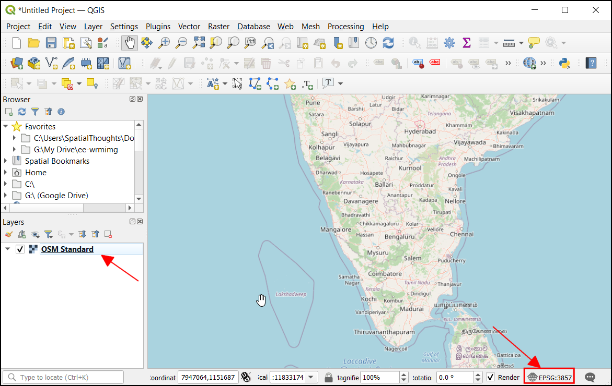
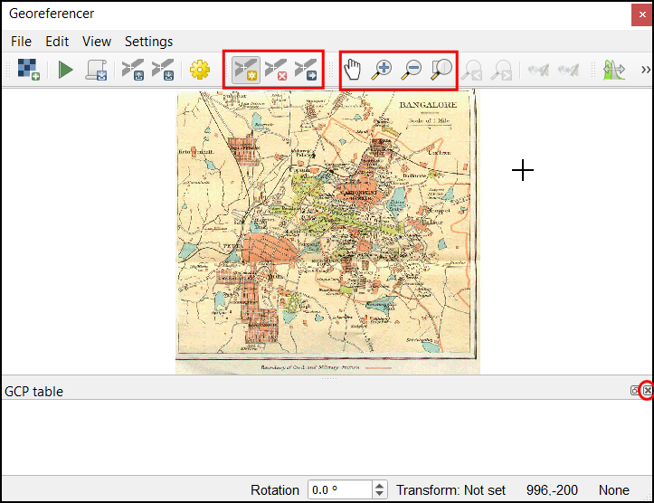

\newpage

***

```{r echo=FALSE, fig.align='center', out.width='75%', out.width='250pt'}
knitr::include_graphics('images/spatial_thoughts_logo.png')
```

***

\newpage

# Introduction 

This is an introductory course that covers QGIS from the very basics. You will learn to use QGIS for mapping, spatial data processing, and spatial analysis. This class is ideal for participants with a basic knowledge of GIS and who want to learn how to use QGIS to carry out everyday GIS tasks.


[{width="400px"}](https://docs.google.com/presentation/d/1Lw0NQlLQXUSW1Mf1rzy9pLb_m2wxSUHQDxF-vjPTBaU/edit?usp=sharing){target="_blank"}

[View the Presentation &#8599;](https://docs.google.com/presentation/d/1Lw0NQlLQXUSW1Mf1rzy9pLb_m2wxSUHQDxF-vjPTBaU/edit?usp=sharing){target="_blank"}


# Software

This course requires QGIS LTR version 3.22.x. 

Please review [QGIS-LTR Installation Guide](install-qgis-ltr.html) for step-by-step instructions.

# Get the Data Package

The exercises and challenges in this course4 use a variety of datasets. All the required datasets are supplied in the ``introduction_to_qgis.zip`` file. Unzip this file to a directory - preferably to the ``<home folder>/Downloads/introduction_to_qgis/`` folder. 

The data package also comes with a ``solutions`` folder that contain model solutions for each section.

*Not enrolled in our instructor-led class but want to work through the material on your own?* [Get free access to the data package](https://docs.google.com/forms/d/e/1FAIpQLSfOLQriuUsKqVkqMq1BW-q_bPpyuP0V8Vch9_uwsifcITyHgw/viewform){target="_blank"}

# Configuration and Setup

## Enable Required Toolbars

We will be using several toolbars in this course. To ensure you have the required tools for the exercises, go to *View* menu, select  *Toolbars* and ensure that the following toolbars are checked. 

- Attributes Toolbar
- Data Source Manager Toolbar
- Digitizing Toolbar
- Label Toolbar
- Map Navigation Toolbar
- Project Toolbar
- Selection Toolbar
- Snapping Toolbar


```{r echo=FALSE, fig.align='center', out.width='60%'}
knitr::include_graphics('images/introduction_to_qgis/toolbars.png')
```

## Install Required Plugins

We will be using the following plugins during the course. Go to From the *Plugins* menu, choose *Manage and Install Plugins...*. Under the *All* tab, search for the plugin name and click on the *Install Plugin* button to install it.

- QuickMapServices
- QuickOSM

```{r echo=FALSE, fig.align='center', out.width='75%'}
knitr::include_graphics('images/introduction_to_qgis/plugins1.png')
```

```{r echo=FALSE, fig.align='center', out.width='75%'}
knitr::include_graphics('images/introduction_to_qgis/plugins2.png')
```

```{r echo=FALSE, fig.align='center', out.width='75%'}
knitr::include_graphics('images/introduction_to_qgis/plugins3.png')
```

# 1. Creating Maps

This section is designed to help you get familiar with the basic workflow of importing data layers, applying symbology, adding labels, and designing layouts for maps. We will take a text file containing historical records of earthquakes and turn it into an informative visualization like the one below.


```{r echo=FALSE, fig.align='center', out.width='75%'}
knitr::include_graphics('images/introduction_to_qgis/earthquake_map.png')
```

## 1.1 Importing Vector Data

1. Open QGIS. The first step is to import the source datasets. Click on the *Open Data Source Manager* button.

```{r echo=FALSE, fig.align='center', out.width='75%'}
knitr::include_graphics('images/introduction_to_qgis/earthquakes_part1_1.png')
```

2. Select the *Vector* tab. Click the *...* button next to *Vector Dataset(s)* and browse to the data directory. 

```{r echo=FALSE, fig.align='center', out.width='75%'}
knitr::include_graphics('images/introduction_to_qgis/earthquakes_part1_2.png')
```

3. Select the `ne_10m_land.shp` file and click *Open*. In the *Data Source Manager* window, click *Add*.

```{r echo=FALSE, fig.align='center', out.width='75%'}
knitr::include_graphics('images/introduction_to_qgis/earthquakes_part1_3.png')
```

4. A new layer, `ne_10m_land` will be added to the *Layers* panel and displayed on the Canvas. This layer contains polygons representing the land areas of the world. Click on the *Open Data Source Manager* button again.

```{r echo=FALSE, fig.align='center', out.width='75%'}
knitr::include_graphics('images/introduction_to_qgis/earthquakes_part1_4.png')
```

5. Click the *...* button next to *Vector Dataset(s)* and browse to the data directory. Select the `gem_active_faults_harmonized.gpkg` file and click *Open* followed by *Add*.

```{r echo=FALSE, fig.align='center', out.width='75%'}
knitr::include_graphics('images/introduction_to_qgis/earthquakes_part1_5.png')
```

6. A new layer, `gem_active_faults_harmonized` will be added to the *Layers* panel and displayed on the Canvas. This is a global layer containing lines representing all the active faults. We will now import another layer of earthquake points. Click on the *Open Data Source Manager* button again.

```{r echo=FALSE, fig.align='center', out.width='75%'}
knitr::include_graphics('images/introduction_to_qgis/earthquakes_part1_6.png')
```

7. Select the *Delimited Text* tab. Click the *...* button next to *File name* and browse to the data directory. Select the `significant_earthquakes_2000_2020.tsv` file. This is a text file in the *Tab-Separated Values (TSV) format*. In the *File Format* section, select *Custom delimiters*.

> Note: Windows users may need to change the *File Type* as **All** in *Choose a Delimited Text File to Open* dialog to see the TSV file.

```{r echo=FALSE, fig.align='center', out.width='75%'}
knitr::include_graphics('images/introduction_to_qgis/earthquakes_part1_7.png')
```

8. Check the *Tab* checkbox. In the *Geometry Definition* section, ensure **Longitude** is selected as the *X Field* and **Latitude** is selected as the *Y Field*. Choose **EPSG:4326** as *Geometry CRS*. Leave other options to their default values and click *Add*.

```{r echo=FALSE, fig.align='center', out.width='75%'}
knitr::include_graphics('images/introduction_to_qgis/earthquakes_part1_8.png')
```

9. A new layer, `significant_earthquakes_2000_2020` will be added to the *Layers* panel and displayed on the Canvas. This layer contains over 1000 records of significant earthquakes recorded between 2000 and 2020. Right-click on the `significant_earthquakes_2000_2020` layer and select *Open Attribute Table*. Examine all the attributes and their values.

```{r echo=FALSE, fig.align='center', out.width='75%'}
knitr::include_graphics('images/introduction_to_qgis/earthquakes_part1_9.png')
```

10. We will now learn about some of the tools to query and select records. From the *Selection Toolbar*, click the *Select Features by Value...* button.

> Note: If the selection toolbar is not enabled, right-click on the toolbar panel and check **Selection Toolbar**. 

```{r echo=FALSE, fig.align='center', out.width='75%'}
knitr::include_graphics('images/introduction_to_qgis/earthquakes_part1_10.png')
```

11. In the *Select Features* dialog, enter **2020** as the *Year* and click the *Select Features* button. You will see all earthquakes that occurred during 2020 will be highlighted in yellow. You may also click the *Flash Features* button to see the selected records blink.

```{r echo=FALSE, fig.align='center', out.width='75%'}
knitr::include_graphics('images/introduction_to_qgis/earthquakes_part1_11.png')
```

12. Let's refine the query a little more. Enter **7** as the *Mag* parameter and set the criteria as *Greater than (>)*. Click *Select Features*. You will now see only those points where the earthquake occurred in 2020, and its magnitude was greater than 7. Close the window.

```{r echo=FALSE, fig.align='center', out.width='75%'}
knitr::include_graphics('images/introduction_to_qgis/earthquakes_part1_12.png')
```

13. Right-click on the `significant_earthquakes_2000_2020` layer and select *Open Attribute Table*. You will see that there are 6 selected features in the layer. If you want to examine their attributes, there is a handy shortcut. Click the *Move selection to top* button.

```{r echo=FALSE, fig.align='center', out.width='75%'}
knitr::include_graphics('images/introduction_to_qgis/earthquakes_part1_13.png')
```

14. All the selected rows will be displayed on the top of the attribute table - making it easy to examine the selected features. Click the *Deselect all features from the layer* button.

```{r echo=FALSE, fig.align='center', out.width='75%'}
knitr::include_graphics('images/introduction_to_qgis/earthquakes_part1_14.png')
```

15. For our map, we need another layer of 10 largest earthquakes - so we can style it differently than other earthquakes. For our visualization, we will define the largest earthquakes like the ones that resulted in the highest number of deaths. Locate the *Total Deaths* attribute and click twice on the column header. This will sort the features in descending order of the values in this column.

```{r echo=FALSE, fig.align='center', out.width='75%'}
knitr::include_graphics('images/introduction_to_qgis/earthquakes_part1_15.png')
```

16. Hold the *Shift* key and select the first 10 rows. This selection will be the 10 earthquakes with the high fatalities.

```{r echo=FALSE, fig.align='center', out.width='75%'}
knitr::include_graphics('images/introduction_to_qgis/earthquakes_part1_16.png')
```

17. We will save the selected 10 features as a new layer. Right-click the `significant_earthquakes_2000_2020` layer and go to *Export &rarr; Save Selected Features As..*.

```{r echo=FALSE, fig.align='center', out.width='75%'}
knitr::include_graphics('images/introduction_to_qgis/earthquakes_part1_17.png')
```

18. Select **GeoPackage** as the *Format*. Click the *...* button next to *File name* and browse to the data directory. Name the layer as `large_earthquakes.gpkg`. Click *Save*. Click *OK*.

```{r echo=FALSE, fig.align='center', out.width='75%'}
knitr::include_graphics('images/introduction_to_qgis/earthquakes_part1_18.png')
```

19. A new layer, `large_earthquakes` will be added to the *Layers* panel.

```{r echo=FALSE, fig.align='center', out.width='75%'}
knitr::include_graphics('images/introduction_to_qgis/earthquakes_part1_19.png')
```

20. Our data preparation is now complete. Let's save our work. Go to *Project &rarr; Save*. Browse to the data directory and enter the name as **Earthquakes**. Click *Save*.

```{r echo=FALSE, fig.align='center', out.width='75%'}
knitr::include_graphics('images/introduction_to_qgis/earthquakes_part1_20.png')
```

21. The project will be saved in the *QGZ* format as a file. 

```{r echo=FALSE, fig.align='center', out.width='75%'}
knitr::include_graphics('images/introduction_to_qgis/earthquakes_part1_21.png')
```

We have now finished the first part of this exercise. Your output should match the contents of the `Earthquakes_Checkpoint1.qgz` file in the `solutions` folder.

### 1.1.1 Challenge

Do you know about [Null Island](https://en.wikipedia.org/wiki/Null_Island)? The `ne_10m_land` contains a polygon for this feature. Locate this polygon on the map.

Hint: Open the attribute table, find and select the feature for Null island. Then use the *Zoom map to the selected rows* button.

## 1.2 Symbology

The symbology of a layer is its visual appearance on the map. We will now learn different techniques for styling each layer to convey the information visually.

1. Select the ``ne_10m_land`` layer and click *Open the Layer Styling Panel*.

```{r echo=FALSE, fig.align='center', out.width='75%'}
knitr::include_graphics('images/introduction_to_qgis/earthquakes_part2_1.png')
```

2. We will style this layer with a simple grey color. Click *Simple Fill* to reveal more options. Click the dropdown next to *Fill color*.

```{r echo=FALSE, fig.align='center', out.width='75%'}
knitr::include_graphics('images/introduction_to_qgis/earthquakes_part2_2.png')
```

3. Use the color picker to select a light shade of grey color. The *Layer Styling Panel* is interactive, so you can immediately preview your styling changes in the map canvas.

```{r echo=FALSE, fig.align='center', out.width='75%'}
knitr::include_graphics('images/introduction_to_qgis/earthquakes_part2_3.png')
```

4. Similarly, change the *Stroke color* to white.

```{r echo=FALSE, fig.align='center', out.width='75%'}
knitr::include_graphics('images/introduction_to_qgis/earthquakes_part2_4.png')
```

5. Next, we will style the faults layer. Select ``gem_active_faults_harmonized`` layer in the *Layers* panel. Click the *Simple Line* symbol to reveal more styling options. Change the *Color* to a shade of brown. Set the *Stroke width* to **0.1**.

```{r echo=FALSE, fig.align='center', out.width='75%'}
knitr::include_graphics('images/introduction_to_qgis/earthquakes_part2_5.png')
```

6. Now we will change the style of the earthquake points. Select the ``significant_earhtquakes_2000_2020`` layer. Click the *Simple Marker* symbol. Change the *Size* option to **0.7** *Millimeters*. Select red as the *Fill color* and white as the *Stroke color*. Change the *Stroke width* to **0.1**. 

```{r echo=FALSE, fig.align='center', out.width='75%'}
knitr::include_graphics('images/introduction_to_qgis/earthquakes_part2_6.png')
```

7. We have now styled the three background layers. We will style the ``large_earthquakes`` layer, which features the main information we want to convey through this map. We will use a *Proportional Circle* style and have the size of the circle represent the total fatalities caused by the respective earthquake. Click *Simple Marker* to see more styling options. Click the *Data defined override* button next to *Size* and choose **Assistant**.

```{r echo=FALSE, fig.align='center', out.width='75%'}
knitr::include_graphics('images/introduction_to_qgis/earthquakes_part2_7.png')
```

8. In the *Input* section, select **Total Deaths** as the *Source*. Set the range of *Values from* **5000** *to* **500000**. In the *Output* section, set the range of *Size from* **3** *to* **10**. This will use the attribute value in the *Total Deaths* field to set the size of the circles. Click the *Go Back* button at the top of the panel to return to the previous menu.

> The default *Scale method* used by QGIS is **Flannery**. This method applies a non-linear scaling to compensate for human perception of areas. [Learn more. &#8599;](https://makingmaps.net/2007/08/28/perceptual-scaling-of-map-symbols/){target="_blank"}


```{r echo=FALSE, fig.align='center', out.width='75%'}
knitr::include_graphics('images/introduction_to_qgis/earthquakes_part2_8.png')
```

9. Click the *Fill color* and adjust the transparency. This will help show the information under the large circles.

```{r echo=FALSE, fig.align='center', out.width='75%'}
knitr::include_graphics('images/introduction_to_qgis/earthquakes_part2_9.png')
```

10. Set the *Stroke color* to white.

```{r echo=FALSE, fig.align='center', out.width='75%'}
knitr::include_graphics('images/introduction_to_qgis/earthquakes_part2_10.png')
```

11. The circles represent the number of deaths caused by each earthquake. But the reader of our map will not know what these sizes represent. It would help interpret the map better if we had a legend. Let's set a legend for this layer. Click the *Marker* symbol. At the bottom of the panel, select *Advanced &rarr; Data-defined Size Legend*. 

```{r echo=FALSE, fig.align='center', out.width='75%'}
knitr::include_graphics('images/introduction_to_qgis/earthquakes_part2_11.png')
```

12. Choose the *Collapsed legend* option. Check the *Manual size classes* option. Click the *+* button to add the class definition manually.

```{r echo=FALSE, fig.align='center', out.width='75%'}
knitr::include_graphics('images/introduction_to_qgis/earthquakes_part2_12.png')
```

13. Set three different size classes for **5000**, **50000** and **500000**. You will see a legend in the *Layers* panel showing the circle sizes and corresponding fatality values.

```{r echo=FALSE, fig.align='center', out.width='75%'}
knitr::include_graphics('images/introduction_to_qgis/earthquakes_part2_13.png')
```

14. Click the *Save Project* button to save your work.

```{r echo=FALSE, fig.align='center', out.width='75%'}
knitr::include_graphics('images/introduction_to_qgis/earthquakes_part2_14.png')
```

We have now finish the second part of this exercise. Your output should match the contents of the `Earthquakes_Checkpoint2.qgz` file in the `solutions` folder.

### 1.2.1 Challenge

QGIS has many rich cartography features. One of my favorites is called *Live Layer Effects*. This allows you to add effects such as *Outer Glow*, *Drop Shadow*, etc., to each symbol. This takes your symbology to the next level and helps highlight certain features. Select the `large_earthquakes`  layer and open the *Layer Styling Panel*. Expand the *Layer Rendering* section and enable *Draw effects*. Click the *Customize effects* button and add a drop shadow effect to the layer.

```{r echo=FALSE, fig.align='center', out.width='75%'}
knitr::include_graphics('images/introduction_to_qgis/earthquakes_part2_challenge.png')
```

## 1.3 Labelling

Labels are a useful way to convey additional information for any features. Labels are associated with each feature and can be configured to show information from the attributes. We will now add labels to each of the large earthquake points to show the name of the location as well as the deaths caused due to that earthquake.

1. Before we proceed further, let's change the projection of our map to a more appropriate one. The preferred and modern choice for global maps is the [Equal Earth](http://equal-earth.com/) projection. It is much more visually appealing and also preserves relative areas of continents. Go to *Project &rarr; Properties...*.

```{r echo=FALSE, fig.align='center', out.width='75%'}
knitr::include_graphics('images/introduction_to_qgis/earthquakes_part3_1.png')
```

2. Switch to the *CRS* tab. Search *8857* and select the **WGS84 / Equal Earth Greenwich** CRS. Click *OK*.

```{r echo=FALSE, fig.align='center', out.width='75%'}
knitr::include_graphics('images/introduction_to_qgis/earthquakes_part3_2.png')
```

3. Back in the QGIS Window, you will notice that the shape of the map looks different now. The bottom-right corner also displayed the current project CRS *EPSG:8857*. Select the ``large_earthquakes`` layer and open the *Layer Styling Panel*. Switch to the *Labels* tab.

> Note: Changing the Project CRS does not change the CRS of the layers, but reprojects them on-the-fly to the chosen CRS for display.

```{r echo=FALSE, fig.align='center', out.width='75%'}
knitr::include_graphics('images/introduction_to_qgis/earthquakes_part3_3.png')
```

4. Select *Single Labels*. We will combine the values from multiple attributes for the label using an expression. Click the *Expression* button next to *Value*.

```{r echo=FALSE, fig.align='center', out.width='75%'}

```

5. Locate the **Location Name** attribute under *Fields and Values* group. Double-click to add it to the expression. You can check the *Preview* at the bottom to see the result of the expression.

```{r echo=FALSE, fig.align='center', out.width='75%'}
knitr::include_graphics('images/introduction_to_qgis/earthquakes_part3_5.png')
```

6. We will create a longer label text by combining multiple attributes. You can use the **||** operator in the QGIS expression to concatenate strings. Create the expression as shown below. Click *OK*.

```
"Location Name" ||  ';' || 'Deaths:' || "Total Deaths"
```

```{r echo=FALSE, fig.align='center', out.width='75%'}

```

7. The labels will be rendered next to the points on the canvas. Select the *Formatting* tab. At the bottom, enter **;** as the value for *Wrap on character* and **20** characters as the value for *Wrap lines to*. This will break the labels into multiple lines and make them readable.

```{r echo=FALSE, fig.align='center', out.width='75%'}
knitr::include_graphics('images/introduction_to_qgis/earthquakes_part3_7.png')
```

8. Next, we will change the appearance of the label text. Switch to the *Text* tab. Change the *Size* to **8** and set the *Color* to white.

```{r echo=FALSE, fig.align='center', out.width='75%'}
knitr::include_graphics('images/introduction_to_qgis/earthquakes_part3_8.png')
```

9. A useful labeling technique is to add a background to the labels to improve legibility. Switch to the *Background* tab and enable *Draw background*. Set the *Color* to black. Also, set the *Size X* and *Size Y* of *Buffer* to be **1** point. At the bottom, set the *Radius X,Y* to **5**.

```{r echo=FALSE, fig.align='center', out.width='75%'}

```

10. To attach the labels to each symbol, you can use a leader line. Switch to the *Callouts* tab and check *Draw callouts*. 

```{r echo=FALSE, fig.align='center', out.width='75%'}
knitr::include_graphics('images/introduction_to_qgis/earthquakes_part3_10.png')
```

11. As we have only a few labels, we can adjust their placement manually to fit the layout better. Close the *Layer Styling Panel*. Right-click anywhere on the *Toolbar* are and select the *Label Toolbar* to activate it.

```{r echo=FALSE, fig.align='center', out.width='75%'}
knitr::include_graphics('images/introduction_to_qgis/earthquakes_part3_11.png')
```

12. Once the *Label Toolbar* is activated, you will see new tools. Select the *Move a Label, Diagram, or Callout* tool.

```{r echo=FALSE, fig.align='center', out.width='75%'}
knitr::include_graphics('images/introduction_to_qgis/earthquakes_part3_12.png')
```

13. Click on any of the labels. The first time you do this, you will be prompted with an *Auxiliary Storage: Choose Primary Key* dialog. This is used to store the position of the labels for each label. You can choose any field containing unique values. In our case, the default value **fid** is fine. Click *OK*.

```{r echo=FALSE, fig.align='center', out.width='75%'}

```

14. Click on the label again to start moving it. Drag your mouse to the new label location and click again to move the label.

```{r echo=FALSE, fig.align='center', out.width='75%'}
knitr::include_graphics('images/introduction_to_qgis/earthquakes_part3_14.png')
```

15. Similarly, move other labels to appropriate locations. Once you are satisfied, save your work.

```{r echo=FALSE, fig.align='center', out.width='75%'}

```

We have now finished the third part of this exercise. Your output should match the contents of the `Earthquakes_Checkpoint3.qgz` file in the `solutions` folder.

### 1.3.1 Challenge

The numbers displayed in the labels can be hard to read since they are not formatted. We can make them readable by adding a thousand-separator. So a number such as *227899* is displayed as *227,899* and a number like *5749* as *5,749*. Update the expression for the labels, so the numbers are formatted. To achieve this, you can use the `format_number()` function in the QGIS expression editor.

## 1.4 Print Layout

QGIS comes with a rich set of tools to create map layouts that allow you to add elements such as labels, images, legend, scale bar, north arrow, etc., to your map. It also allows you to export the map layout as an image or a PDF. We will now take the visualization created in the QGIS map canvas and create a print layout.
1. Go to *Project &rarr; New Print Layout...*.

```{r echo=FALSE, fig.align='center', out.width='75%'}
knitr::include_graphics('images/introduction_to_qgis/earthquakes_part4_1.png')
```

2. You will be prompted by a *Create Print Layout* dialog asking you to *Enter a unique print layout title*. You can leave it blank and click *OK*.

```{r echo=FALSE, fig.align='center', out.width='75%'}
knitr::include_graphics('images/introduction_to_qgis/earthquakes_part4_2.png')
```

3. A new window will open with the title *Layout 1*. First, let's set the page size. Right-click on the canvas and select *Page Properties...*. Select *Size* as **A4** and *Orientation* as **Landscape**.

```{r echo=FALSE, fig.align='center', out.width='75%'}
knitr::include_graphics('images/introduction_to_qgis/earthquakes_part4_3.png')
```

4. Next, go to *Add Item &rarr; Add Map*.

```{r echo=FALSE, fig.align='center', out.width='75%'}
knitr::include_graphics('images/introduction_to_qgis/earthquakes_part4_4.png')
```

5. Hold the left mouse button and select the canvas part where you want the map to appear. We will use the full width for the map but leave some space at the top for a title and at the bottom for additional information.

```{r echo=FALSE, fig.align='center', out.width='75%'}

```

6. The map will be rendered at the chosen location. You can adjust the scale to make the map fit the area and enter **120000000** as the value for *Scale*. You can also select the *Interactively Edit Map Extent* button and click on the map to move it.

```{r echo=FALSE, fig.align='center', out.width='75%'}
knitr::include_graphics('images/introduction_to_qgis/earthquakes_part4_6.png')
```

7. Once you are satisfied with the map view, go to *Add Item &rarr; Add Label*. 

```{r echo=FALSE, fig.align='center', out.width='75%'}
knitr::include_graphics('images/introduction_to_qgis/earthquakes_part4_7.png')
```

8. Drag a rectangle at the top. On the right-hand side *Item Properties* panel, enter **10 Largest Earthquakes (2000-2020)** as the text. Click on the *Font* button under *Appearance* and set the *Font Size* to **24**. You can also center align the label by selecting **Center** as the *Horizontal alignment* and **Middle** as the *Vertical Alignment*.

```{r echo=FALSE, fig.align='center', out.width='75%'}

```

9. We will now add a legend to the map. Go to *Add Item &rarr; Add Legend*. Draw a rectangle at an empty region on the map.

```{r echo=FALSE, fig.align='center', out.width='75%'}
knitr::include_graphics('images/introduction_to_qgis/earthquakes_part4_9.png')
```

10. Once the legend is added, un-check the *Auto update* box. This will allow us to customize the items in the legend. Select the ``ne_10m_land`` layer and click the *Remove selected item(s) from legend*. 

```{r echo=FALSE, fig.align='center', out.width='75%'}

```

11. You can also edit the layer name to be more suitable for the map. Select the ``gem_active_faults_harmonized`` layer and click the *Edit selected item properties* button. Change the name of the layer to ``Faults``. Similarly, change the ``large_earthquakes`` layer name to ``Deaths``.

```{r echo=FALSE, fig.align='center', out.width='75%'}
knitr::include_graphics('images/introduction_to_qgis/earthquakes_part4_11.png')
```

12. Select the ``Total Deaths`` layer and click *Remove selected item(s) from legend*. The legend now contains only the items that are easy to interpret and add context to the symbols on the map. 

```{r echo=FALSE, fig.align='center', out.width='75%'}

```

13. You can also add a border to all the elements by enabling the *Frame* under the respective *Item Properties*. Next, we will add some logos to the map. Go to *Add Item &rarr; Add Picture*.

```{r echo=FALSE, fig.align='center', out.width='75%'}
knitr::include_graphics('images/introduction_to_qgis/earthquakes_part4_13.png')
```

14. Add the picture to the bottom-right corner. Locate the *App Symbols &rarr; logos* folder in the *Item Properties* panel. Select the **Made with QGIS** logo. You can also add your organization's logo by browsing an SVG/PNG file on your computer.

```{r echo=FALSE, fig.align='center', out.width='75%'}

```

15. A good practice is to credit the data sources used to create the map. This can be added using *Add Item &rarr; Add Label*. Once you are satisfied with the layout, you can export it. Go to *Layout &rarr; Export as Image...*.

```{r echo=FALSE, fig.align='center', out.width='75%'}
knitr::include_graphics('images/introduction_to_qgis/earthquakes_part4_15.png')
```

16. Browse to the data folder and enter the name of the image as **large_earthquakes.png**. Click *Save*. You will be prompted to choose *Image Export Options*. Leave the settings to default and click *Save*.

```{r echo=FALSE, fig.align='center', out.width='75%'}

```

17. The layout will be saved as a static image. You can embed this image in a report, presentation, or share it on social media.

```{r echo=FALSE, fig.align='center', out.width='75%'}
knitr::include_graphics('images/introduction_to_qgis/earthquakes_part4_17.png')
```

We come to the end of this exercise. Your output should match the contents of the `Earthquakes_Checkpoint4.qgz` file in the `solutions` folder.

### 1.4.1 Challenge 

Export your layout as a PDF.

Hint: The *PDF Export Options* dialog has an option *Simplify geometries to reduce output file size* at the bottom. While useful, this can have unexpected effect on the output. Un-check it while doing the export.

```{r echo=FALSE, fig.align='center', out.width='75%', fig.cap='Print Layout Exported as a PDF'}
knitr::include_graphics('images/introduction_to_qgis/earthquakes_part4_challenge.png')
```

# Concept: Joins and Data Normalization

[{width="400px"}](https://docs.google.com/presentation/d/1YJfWrjSDeriYJMsA6bmVi4zZmzLmGOo5dm13Lr5JaiI/edit?usp=sharing){target="_blank"}

[View the Presentation &#8599;](https://docs.google.com/presentation/d/1YJfWrjSDeriYJMsA6bmVi4zZmzLmGOo5dm13Lr5JaiI/edit?usp=sharing){target="_blank"}


# 2. Visualizing Spatial Data

In this section, we will learn basic data processing and visualization techniques. We will use geographic boundaries and population count data for the City of New York and create a population density map. This requires doing a table join and using a graduated symbology to create a choropleth map.

## 2.1 Table Join

1. Open QGIS. The first step is to import the source datasets. Click on the *Open Data Source Manager* button.

```{r echo=FALSE, fig.align='center', out.width='75%'}
knitr::include_graphics('images/introduction_to_qgis/population_part1_1.png')
```

2. Select the *Vector* tab. Click the *...* button next to *Vector Dataset(s)* and browse to the data directory. Select the `nynta2010.shp` file and click *Open*. In the *Data Source Manager* window, click *Add*.

```{r echo=FALSE, fig.align='center', out.width='75%'}
knitr::include_graphics('images/introduction_to_qgis/population_part1_2.png')
```

3. You may be prompted to *Select Transformation for nynta2010*. The source shapefile is in the `EPSG:2263 NAD83 / New York Long Island (ftUS)` projection whereas the default projection in QGIS is `EPSG:4326 - WGS84`. This dialog presents several transformations to convert between the coordinates between these projections. Choose the first option and click *OK*.

```{r echo=FALSE, fig.align='center', out.width='75%'}
knitr::include_graphics('images/introduction_to_qgis/population_part1_3.png')
```

4. A new layer `nyta2010` will be added to the *Layers* panel and will be displayed on the Canvas. This layer contains polygons representing the *Neighborhood Tabulation Areas (NTAs)* for New York city. Right-click on the `nyta2010` layer and select *Open Attribute Table*.


```{r echo=FALSE, fig.align='center', out.width='75%'}
knitr::include_graphics('images/introduction_to_qgis/population_part1_4.png')
```

5. Examine the attributes of the layer. The `NTACode` field contains a unique identifier for each polygon. Notice that we do not have any population or demographic attributes in this layer. 

```{r echo=FALSE, fig.align='center', out.width='75%'}
knitr::include_graphics('images/introduction_to_qgis/population_part1_5.png')
```

6. The population and other demographic datasets are typically distributed as tables. These tables would have the same unique identifier as the shapefile that can be used to merge the relevant fields to the vector layer. Let's import a table representing *New York City Population By Neighborhood Tabulation Areas*. Click on the *Open Data Source Manager* button.

```{r echo=FALSE, fig.align='center', out.width='75%'}
knitr::include_graphics('images/introduction_to_qgis/population_part1_6.png')
```

7. Switch to the *Delimited Text* tab. Browse to the ``New_York_City_Population_By_Neighborhood_Tabulation_Areas.csv`` file and select it. Since this CSV file is just tabular data, select *No geometry (attribute only table)* option and click *Add*.

```{r echo=FALSE, fig.align='center', out.width='75%'}
knitr::include_graphics('images/introduction_to_qgis/population_part1_7.png')
```

8. Once the new tabular layer ``New_York_City_Population_By_Neighborhood_Tabulation_Areas`` is added to the *Layers* panel, right-click on it and select *Open Attribute Table*.

```{r echo=FALSE, fig.align='center', out.width='75%'}
knitr::include_graphics('images/introduction_to_qgis/population_part1_8.png')
```

9. This table has a **Population** column with the population for each of the tabulation areas. We also have the **NTA Code** column containing the same codes as our `nynta2020` layer. We can use this column to join this table with the vector layer.

```{r echo=FALSE, fig.align='center', out.width='75%'}
knitr::include_graphics('images/introduction_to_qgis/population_part1_9.png')
```

10. If you double-click the *NTA Code* column to sort the table by the code, you will notice that each neighborhood has 2 records of population. For this exercise, we want to use the population for the year 2010. We will apply a filter to select only the population records for 2010.

```{r echo=FALSE, fig.align='center', out.width='75%'}
knitr::include_graphics('images/introduction_to_qgis/population_part1_10.png')
```

11. In the main QGIS window, right-click the ``New_York_City_Population_By_Neighborhood_Tabulation_Areas`` layer and select *Filter*.

```{r echo=FALSE, fig.align='center', out.width='75%'}
knitr::include_graphics('images/introduction_to_qgis/population_part1_11.png')
```

12. In the *Query Builder* dialog, enter the filter expression as below. You can also  double-click the column name to insert them in the expression. Click *OK*.

```
"Year" = 2010
```

```{r echo=FALSE, fig.align='center', out.width='75%'}
knitr::include_graphics('images/introduction_to_qgis/population_part1_12.png')
```

13. Now we will do the table join. Open **Processing &rarr; Toolbox** from the main menu at the top.

```{r echo=FALSE, fig.align='center', out.width='75%'}
knitr::include_graphics('images/introduction_to_qgis/population_part1_13.png')
```

14. Search and locate the algorithm **Vector general &rarr; Join attributes by field value** and double-click to launch it.

```{r echo=FALSE, fig.align='center', out.width='75%'}
knitr::include_graphics('images/introduction_to_qgis/population_part1_14.png')
```

15. In the *Join Attributes by Field Value* dialog, select ``nynta2010`` as the *Input layer* and ``NTACode`` as the *Table field*. Select ``New_York_City_Population_By_Neighborhood_Tabulation_Areas`` as the *Input layer 2* and ``NTA Code`` as the *Table field 2*. Click the *...* button next to *Layer 2 fields to copy*.

```{r echo=FALSE, fig.align='center', out.width='75%'}
knitr::include_graphics('images/introduction_to_qgis/population_part1_15.png')
```

16. We want to copy only the population data, so select the `Population` field and click *OK*.

```{r echo=FALSE, fig.align='center', out.width='75%'}
knitr::include_graphics('images/introduction_to_qgis/population_part1_16.png')
```

17. Next, we need to configure the output. Click the *...* button next to *Joined layer* and select *Save to File...*.

```{r echo=FALSE, fig.align='center', out.width='75%'}
knitr::include_graphics('images/introduction_to_qgis/population_part1_17.png')
```

18. Browse to the data directory and name the output as `nynta_with_population`. Make sure the file type is selected as *GPKG files (\*.gpkg)*. Click *Save*.

```{r echo=FALSE, fig.align='center', out.width='75%'}
knitr::include_graphics('images/introduction_to_qgis/population_part1_18.png')
```

19. Once the configuration is complete, click the *Run* button. 

```{r echo=FALSE, fig.align='center', out.width='75%'}
knitr::include_graphics('images/introduction_to_qgis/population_part1_19.png')
```

20. Upon completion of processing, a new layer `nynta_with_population` will be added to the *Layers* panel. Right-click the layer and select *Open Attribute Table*. You will see that we now have an additional column **Population** in the attribute table. The table also has a column **Shape_Area** containing the area of each polygon in Sq.Ft.

```{r echo=FALSE, fig.align='center', out.width='75%'}
knitr::include_graphics('images/introduction_to_qgis/population_part1_20.png')
```

21. Our goal is to map the population density. We can use the population count and area columns and calculate a new column for population density. From the Processing Toolbox, search and locate the algorithm **Vector table &rarr; Field Calculator** and double-click to launch it.

```{r echo=FALSE, fig.align='center', out.width='75%'}
knitr::include_graphics('images/introduction_to_qgis/population_part1_21.png')
```

22. In the *Field Calculator* dialog, enter ``Density`` as the *Field Name*. We will now build the expression to calculate population density. From the function groups next to the *Expression* panel, expand the *Fields and Values* section. Double-click the ``Population`` field to add it to the expression editor. Note that fields are referred using double-quotes (") in QGIS.

```{r echo=FALSE, fig.align='center', out.width='75%'}
knitr::include_graphics('images/introduction_to_qgis/population_part1_22.png')
```

23. Select the **/** button to enter the division operator and then click the ``Shape_Area`` field to enter it. You may also type the expression instead of picking the values from the dialog. The final expression should look like below. 

```
"Population" / "Shape_area"
```

```{r echo=FALSE, fig.align='center', out.width='75%'}
knitr::include_graphics('images/introduction_to_qgis/population_part1_23.png')
```

24. This will give us the population density in persons per square feet. A more appropriate unit for population density is persons per square miles. Let's convert the value to miles using the conversion factor or *1 mile = 5280 ft*. Change the expression as shown below. Once done, select *Save to File*.

```
5280 * 5280 * ("Population" / "Shape_area")
```

```{r echo=FALSE, fig.align='center', out.width='75%'}
knitr::include_graphics('images/introduction_to_qgis/population_part1_24.png')
```

25. Name the output as `nynta_population_density.gpkg` and click *Run*.

```{r echo=FALSE, fig.align='center', out.width='75%'}
knitr::include_graphics('images/introduction_to_qgis/population_part1_25.png')
```

26. Once the processing finishes as new layer `nynta_population_density` will be added to the *Layers* panel. Open the attribute table and verify that you have a new column named *Density*.

```{r echo=FALSE, fig.align='center', out.width='75%'}
knitr::include_graphics('images/introduction_to_qgis/population_part1_26.png')
```

27. We don't need the other layers in our project. Hold the *Shift* key and select all layers except `nynta_population_density`. Right-click and select *Remove Layer...*.

```{r echo=FALSE, fig.align='center', out.width='75%'}
knitr::include_graphics('images/introduction_to_qgis/population_part1_27.png')
```

28. Let's save our work so we can retrieve it later. Go to **Project  &rarr; Save**.

```{r echo=FALSE, fig.align='center', out.width='75%'}
knitr::include_graphics('images/introduction_to_qgis/population_part1_28.png')
```

29. Save the project as `NYC_Population_Density` and click *Save*. QGIS will save the project file in the *QGZ* format.

```{r echo=FALSE, fig.align='center', out.width='75%'}
knitr::include_graphics('images/introduction_to_qgis/population_part1_29.png')
```

We have now finish the first part of this exercise. Your output should match the contents of the `NYC_Population_Density_Checkpoint1.qgz` file in the `solutions` folder.

### 2.1.1 Challenge

Round the population density values to the nearest integer and store them in another column named **Density_Round**.

- Hint1: Use the *Field Calculator* algorithm from the processing toolbox.
- Hint2: The QGIS expression engine has a function named `round()` that can round a fraction to the chosen number of decimal places.

## 2.2 Creating a Choropleth Map

1. Continuing the exercise, we will now visualize the spatial distribution of population density in form of a choropleth map. From the *Layers* panel, click the *Open the Layer Styling panel* button.

```{r echo=FALSE, fig.align='center', out.width='75%'}
knitr::include_graphics('images/introduction_to_qgis/population_part2_1.png')
```

2. Select the ``Graduated`` renderer.

```{r echo=FALSE, fig.align='center', out.width='75%'}
knitr::include_graphics('images/introduction_to_qgis/population_part2_2.png')
```

3. As we want to map the population density, choose ``Density`` as the *Value*.

```{r echo=FALSE, fig.align='center', out.width='75%'}
knitr::include_graphics('images/introduction_to_qgis/population_part2_3.png')
```

4. Next we select a color ramp. Click the drop-down button next to *Color Ramp*, select *All Color Ramps* and pick the ``YlOrBr`` (Yellow-Orange-Brown) ramp.

```{r echo=FALSE, fig.align='center', out.width='75%'}
knitr::include_graphics('images/introduction_to_qgis/population_part2_4.png')
```

5. Change the *Classes* value to ``6`` and click *Classify*. You will see each polygon colored according to the population density attribute. 

```{r echo=FALSE, fig.align='center', out.width='75%'}
knitr::include_graphics('images/introduction_to_qgis/population_part2_5.png')
```

6. The default mode of classification is *Quantile* - which divides the input data such that all 6 classes have approximately equal number of features. There are other modes of classification as well. You can learn more about Data Classification Modes in the [QGIS Documentation](https://docs.qgis.org/testing/en/docs/user_manual/working_with_vector/vector_properties.html?#graduated-renderer). We can also define custom data ranges for each class. Click on the *Values* column for the first row in the classification table. Change the *Upper value* to `20000`.

```{r echo=FALSE, fig.align='center', out.width='75%'}
knitr::include_graphics('images/introduction_to_qgis/population_part2_6.png')
```

7. Similarly change other class ranges so they become easy to interpret. The last row contains the upper value to the maximum value in the dataset. Instead of displaying the maximum value, we can update the label. Click the *Legend* column for the last row.

```{r echo=FALSE, fig.align='center', out.width='75%'}
knitr::include_graphics('images/introduction_to_qgis/population_part2_7.png')
```

8. Change the label to `> 100000`. 

```{r echo=FALSE, fig.align='center', out.width='75%'}
knitr::include_graphics('images/introduction_to_qgis/population_part2_8.png')
```

9. Now you have an informative visualization of population density in New York city with an easy to interpret legend. Click the *Save* button to save your work. All your visualization settings are saved along with the project, so next time when you load this project in QGIS, you will see the same visualization.

```{r echo=FALSE, fig.align='center', out.width='75%'}
knitr::include_graphics('images/introduction_to_qgis/population_part2_9.png')
```

We have now finish the second part of this exercise. Your output should match the contents of the `NYC_Population_Density_Checkpoint2.qgz` file in the `solutions` folder.

### 2.2.2 Assignment

Create a Print Layout with the content of this project. The map should contain a legend, scalebar, labels and data credits.


# 3. Georeferencing

Georeferencing is the process of assigning real-world coordinates to each pixel of the raster. This is an important step in preparing your data for further analysis. Many projects, particularly machine learning projects - need continuous historic records to build a model. Many of the older datasets may come in form of scanned maps or aerial photos that needs to be georeferenced. Similarly, some organizations may only share a PDF or a static map image of the dataset which will need to be converted into a GIS-ready format using georeferencing process.

Georeferencing process involves collecting GCPs (Ground Control Points) or Tie-Points. These GCPs are easily identifiable features in the image or map whose real-world coordinates are obtained from field-survey using a GPS device or identified from already georeferenced sources within a GIS.

In this exercise, you're going to georeference an old scanned map of Bangalore, India created in 1924. This map is possibly hand-drawn and has no coordinate markings, so we will use a tiled basemap layer to locate the features and obtain the GCPs.

## 3.1 Using Basemaps 

1. Open QGIS. We will use a plugin called **QuickMapServices** to load a basemap. From the *Plugins* menu choose *Manage and Install Plugins...*.

```{r echo=FALSE, fig.align='center', out.width='75%'}
knitr::include_graphics('images/introduction_to_qgis/georef_part1_1.png')
```

2. The *Plugins* dialog contains all the available plugins in QGIS. Under the *All* tab, search for **quickmapservices**. It has different basemaps that can be used based on your purpose. Click on the *Install Plugin*, to add this plugin to QGIS. 

```{r echo=FALSE, fig.align='center', out.width='75%'}
knitr::include_graphics('images/introduction_to_qgis/georef_part1_2.png')
```

3. Once installed, check the box next to the *QuickMapServices* label to enable it. Click *Close*. 

```{r echo=FALSE, fig.align='center', out.width='75%'}
knitr::include_graphics('images/introduction_to_qgis/georef_part1_3.png')
```

4. Now you will see a new *Web* menu added to the menu-bar. Go to *Web &rarr; QuickMapServices* menu. You will see some map providers and available basemaps. We can enable a few more providers to have many more options. Click on the *Web &rarr; QuickMapServices &rarr; Settings*. 

```{r echo=FALSE, fig.align='center', out.width='75%'}

```

5. In the *Settings* dialog, switch to the *More services* tab. Click on the ``Get contributed pack`` to download 3rd-party basemaps. 

> You will see a warning against using contributed services. Some of these services may have restrictions on their usage and/or attribution requirement that you need to follow. Please review them before using them in your project.

```{r echo=FALSE, fig.align='center', out.width='75%'}

```

6. Once the new services are added, you will see many more options in the  *Web &rarr; QuickMapServices* menu.

```{r echo=FALSE, fig.align='center', out.width='75%'}

```

7. For our current task, we will use a basemap based on OpenStreetMap data. Since we need to locate the features in the scanned maps let's add the *OSM Standard*. Click on the **Web &rarr; QuickMapServices &rarr; OSM &rarr; OSM Standard**. 


```{r echo=FALSE, fig.align='center', out.width='75%'}

```

8. Now in the canvas, the basemap will be loaded. This map is georeferenced and projected in **EPSG:3857** CRS. This information can be viewed on the bottom-right of the QGIS, where the project CRS will be updated. 

```{r echo=FALSE, fig.align='center', out.width='75%'}
knitr::include_graphics('images/introduction_to_qgis/georef_part1_8.png')
```

We have now finished the first part of this exercise. Your output should match the contents of the ``Georeferencing_Checkpoint1.qgz`` file in the solutions folder.

### 3.1.1 Challenge 

Load the **Stamen Watercolor** basemap by [Stamen](https://wiki.openstreetmap.org/wiki/Stamen). This is an award-winning basemap that renders OpenStreetMap data in a hand-painted watercolor style.

## 3.2 Using the Georeferencer

In this section, you will learn how to load a scanned image, collect  GCPs (ground control points) and warp the image to create a GeoTiff file.

1. Click on the **Raster &rarr; Georeferencer** from the menu-bar to open the georeferencing tool.

```{r echo=FALSE, fig.align='center', out.width='75%'}
knitr::include_graphics('images/introduction_to_qgis/georef_part2_1.png')
```

2. A new *Georeferencer* window will open. This tool primarily contains two sections, the top is for viewing images, and the bottom is for tabular data. 

```{r echo=FALSE, fig.align='center', out.width='75%'}
knitr::include_graphics('images/introduction_to_qgis/georef_part2_2.png')
```

3.  Click on the **Open Raster..** button from the ribbon to load the scanned map. Browse to the ``Bangalore_1924.png`` file in your data package and click *open*.

```{r echo=FALSE, fig.align='center', out.width='75%'}

```

4. The image will be loaded in the *Georeferencer* window. The ribbon at the top has buttons essential operations like Zoom/Pan that you can use to navigate around the image. There are also buttons for adding and editing GCPs (Ground Control Points) that we will use next.

```{r echo=FALSE, fig.align='center', out.width='75%'}

```

5. Before we start collecting GCPs, you may also dock the *Georeferencer* window to the main QGIS window. This makes it easier to find the tie-points. Close the *GCP table* window. Click and drag the georeferencer title bar to the bottom of the canvas. 

```{r echo=FALSE, fig.align='center', out.width='75%'}
knitr::include_graphics('images/introduction_to_qgis/georef_part2_5.png')
```

6. Locate a feature that is visible in both the scanned map and the basemap. Click on the *Add Point* button. 

```{r echo=FALSE, fig.align='center', out.width='75%'}
knitr::include_graphics('images/introduction_to_qgis/georef_part2_6.png')
```

7. The *Enter Map Coordinates* dialog will appear. Click on the *From Map Canvas* button.

```{r echo=FALSE, fig.align='center', out.width='75%'}
knitr::include_graphics('images/introduction_to_qgis/georef_part2_7.png')
```

8. Click on the QGIS main canvas at the visible feature on the basemap. This will fill the coordinates of that point in the CRS of the basemap. Click *OK* to close the dialog.

```{r echo=FALSE, fig.align='center', out.width='75%'}
knitr::include_graphics('images/introduction_to_qgis/georef_part2_8.png')
```

9. Similarly, go ahead and find more GCPs. The best features to look for are rail and road intersections, building corners, city squares, or any other corners and edges. Depending on the method to transform type you would use, you need a minimum different number of points. For this exercise, we will be using a  *Polynomial* transformation which requires a minimum of 6 GCPs. Learn more about [Transformation Algorithms](https://docs.qgis.org/testing/en/docs/user_manual/working_with_raster/georeferencer.html?#available-transformation-algorithms) in the QGIS Documentation. 

```{r echo=FALSE, fig.align='center', out.width='75%'}
knitr::include_graphics('images/introduction_to_qgis/georef_part2_9.png')
```

10. Let's view the points in a tabular format. If you had docked the window, click on the pop-out button in Georeferencing window to detach this tool from the main QGIS. Go to **View &rarr; Panels &rarr; GCP table**. 

```{r echo=FALSE, fig.align='center', out.width='75%'}
knitr::include_graphics('images/introduction_to_qgis/georef_part2_10.png')
```

11. The *GCP table* dialog will display the details of each point. Click on the *Transformation Settings* button.

```{r echo=FALSE, fig.align='center', out.width='75%'}
knitr::include_graphics('images/introduction_to_qgis/georef_part2_11.png')
```

12. In the *Transformation Settings* dialog, choose **Polynomial 2** as *Transformation type*. Choose **Nearest Neighbour** as *Resampling method* and *EPSG:3857* as *Target SRS*. Click on the *...* in *Output raster* and save the file as ``Banglore_1924_modified.tif``. Choose *LZW* in *Compression*. Finally, check the *Save GCP points* and *Load in QGIS when done* boxes. Click *OK* to save this setting and close the settings dialog. 

```{r echo=FALSE, fig.align='center', out.width='60%'}
knitr::include_graphics('images/introduction_to_qgis/georef_part2_12.png')
```

13. Note the *Residual (pixels)* columns will not display the error for each GCPs based on the chosen transformation algorithm. Lower error means the transformation would be able to accurately assign the chosen coordinate to the pixel.

```{r echo=FALSE, fig.align='center', out.width='75%'}
knitr::include_graphics('images/introduction_to_qgis/georef_part2_13.png')
```

14. If you have a GCP with high residual, you can use the *Move point* to adjust the point's position or *Delete point* to remove it. Before georeferencing, a minimum of six GCPs should be available.

```{r echo=FALSE, fig.align='center', out.width='75%'}
knitr::include_graphics('images/introduction_to_qgis/georef_part2_14.png')
```

15. Repeat this process till you are satisfied with the the total mean error and the residuals.

```{r echo=FALSE, fig.align='center', out.width='75%'}
knitr::include_graphics('images/introduction_to_qgis/georef_part2_15.png')
```

16. Click on the *Start Georeferencing* button to georeference the scanned map. 

```{r echo=FALSE, fig.align='center', out.width='75%'}
knitr::include_graphics('images/introduction_to_qgis/georef_part2_16.png')
```

17. In the main QGIS canvas, the georeferenced layer ``Banglore_1924_modified`` will be added and overlayed on the basemap. 

```{r echo=FALSE, fig.align='center', out.width='75%'}
knitr::include_graphics('images/introduction_to_qgis/georef_part2_17.png')
```

We have now completed all steps and you should have a georeferenced image.Your output should match the contents of the ``Georeferencing_Checkpoint2.qgz`` file in the solutions folder. We have also provided the saved GCPs in the solutions folder. To load them, you can go to *File &rarr; Load GCP Points..* and select the ``bangalore_gcp.points`` file in the `solutions/` folder of the data package.

```{r echo=FALSE, fig.align='center', out.width='75%'}
knitr::include_graphics('images/introduction_to_qgis/load_gcps.png')
```

### 3.2.1 Challenge 

In this exercise we used the **Polynomial 2** technique. For datasets that require more aggressive transformation, you can use the [Thin Plate Spline](https://en.wikipedia.org/wiki/Thin_plate_spline) algorithm. This method is also known as *Rubber Sheeting*. Change the transformation setting to use **Thin Plate Split** and run the georeferencer again. Compare the output with the previous result.

# 4. Data Editing

Many GIS tasks require editing existing data layers or creating new datasets. Often a large amount of GIS time is spent digitizing raster data to create vector layers that you use in your analysis. Many machine learning projects also require creating a labeled dataset that needs to be made by digitizing features from satellite imagery or historical maps. QGIS has powerful on-screen digitizing and editing capabilities that we will explore in this tutorial. 

In this exercise, you will create a vector layer of historic lakes in the city of Bangalore, India. This city has experienced urbanization at a rapid pace. Due to this, many water bodies have been lost. We will use the georeferenced scanned map from the previous exercise to digitize polygons for all the water bodies in 1924 and label their current status. Finally, we will create a vector layer and assign attributes to them, indicating whether they are healthy, lost, or partially lost.

## 4.1 Attribute Forms

We will first create a new layer and configure the attribute form to capture the data about the features.

1. Go to *Project &rarr; Open* and browse to the data package. Select the ``Digitizing.qgz`` project and click *Open*.

```{r echo=FALSE, fig.align='center', out.width='75%'}
knitr::include_graphics('images/introduction_to_qgis/digitizing_part1_01.png')
```

2. This project contains the ``OSM Standard`` basemap and the ``Banglore_1924_modified`` georeferenced scanned map. To digitize the waterbodies, let's create a new vector layer. Click on the *Layer &rarr; Create Layer &rarr;  New GeoPackage Layer...* from the menubar. 

```{r echo=FALSE, fig.align='center', out.width='75%'}
knitr::include_graphics('images/introduction_to_qgis/digitizing_part1_02.png')
```

3. In the *New GeoPackage Layer* dialog, click on the *...* next to *Database* and browse to the project location. Enter the file name as ``banglore_lakes`` and click *OK*. Now the *Table name* will be auto-populated as ``banglore_lakes``. Choose ``MultiPolygon`` as *Geometry type*. Let the CRS be in default ``EPSG:4326`` projection.  

```{r echo=FALSE, fig.align='center', out.width='75%'}
knitr::include_graphics('images/introduction_to_qgis/digitizing_part1_03.png')
```

4. In the new layer, let's add some basic fields. First, let's add the name field. Under the *New Field* section, in *Name* enter ``name``, in *Type* choose ``Text Data``, and in *Maximum length*, enter ``50``. Now click *Add to Fields List* button. 

```{r echo=FALSE, fig.align='center', out.width='75%'}
knitr::include_graphics('images/introduction_to_qgis/digitizing_part1_04.png')
```

5. The *Fields List* section will get updated. Similarly, add a ``status`` filed with *Type* as ``integer``. Click *OK* to close the dialog.  

```{r echo=FALSE, fig.align='center', out.width='75%'}
knitr::include_graphics('images/introduction_to_qgis/digitizing_part1_05.png')
```

6. Now the ``banglore_lakes`` layer will be added to the *Layers* tab.  

```{r echo=FALSE, fig.align='center', out.width='75%'}
knitr::include_graphics('images/introduction_to_qgis/digitizing_part1_06.png')
```

7. let's inspect the attribute table of the new layer. Right-click on the ``banglore_lakes`` layer and click *Open Attribute Table*. 

```{r echo=FALSE, fig.align='center', out.width='75%'}
knitr::include_graphics('images/introduction_to_qgis/digitizing_part1_07.png')
```

8. In the ``bangalore_lakes`` attribute table, there are three fields. *fid*  is an integer field which is required by the GeoPackage format and is autogenerated. The *name* and *status* must be entered while digitizing the waterbodies. Close the attribute table. 

```{r echo=FALSE, fig.align='center', out.width='75%'}
knitr::include_graphics('images/introduction_to_qgis/digitizing_part1_08.png')
```

9. Again right-click on ``banglore_lakes`` layer and click *Properties* to open the properties dialog. 

```{r echo=FALSE, fig.align='center', out.width='75%'}
knitr::include_graphics('images/introduction_to_qgis/digitizing_part1_09.png')
```

10. In the *Layer Properties* dialog, choose *Attribute Form*. Under *Fields*, select *status*. Choose the *Widget Type* as ``Value Map``. Value Map allows us to create a drop-down menu that allows you to pick from a predefined set of values.

```{r echo=FALSE, fig.align='center', out.width='75%'}
knitr::include_graphics('images/introduction_to_qgis/digitizing_part1_10.png')
```

11. The status field will be set as a drop-down with these three values. Enter the value and description as follows 

| Value  | Description    | 
|:------:|:---------------| 
|  1     | Healthy        | 
|  2     | Partially Lost | 
|  3     | Lost           | 

```{r echo=FALSE, fig.align='center', out.width='75%'}
knitr::include_graphics('images/introduction_to_qgis/digitizing_part1_11.png')
```

12. We require this field's input must be given for every feature, so let's make this a mandatory field. Under *Constraints* check *Not null* and *Enforce not null constraint*. Click *OK* to save the changes and close the properties dialog. 

```{r echo=FALSE, fig.align='center', out.width='75%'}
knitr::include_graphics('images/introduction_to_qgis/digitizing_part1_12.png')
```

Save the project. Your results should match the contents of the ``Digitizing_Checkpoint1.qgz`` file in the solutions folder.

### 4.1.1 Challenge

The **fid** column contains auto-increment unique id for each feature.The GeoPackage format requires this integer field to maintain data integrity. Manually overriding this id to a different value can cause data corruption. Edit the attribute form for the **fid** field so that it is not user-editable.

## 4.2 Digitizing Polygons

1. Before we start digitizing, let's enable the snapping toolbar. This toolbar will help select the nearby vertices and avoid invalid geometries. Right-click on the toolbar and check the *Snapping Toolbar* to enable it.

```{r echo=FALSE, fig.align='center', out.width='75%'}
knitr::include_graphics('images/introduction_to_qgis/digitizing_part2_1.png')
```

2. Now the snapping toolbar will be added to the main QGIS.  

```{r echo=FALSE, fig.align='center', out.width='75%'}
knitr::include_graphics('images/introduction_to_qgis/digitizing_part2_2.png')
```

3. Enable snap setting by clicking *Enable Snapping* button. Zoom to any part of the map containing a waterbody. Toggle the visibility of the ``Banglore_1924_modified`` layer and check if the lake exists in the current basemap. This will be helpful in entering the attribute of the lake you will digitize.

```{r echo=FALSE, fig.align='center', out.width='75%'}
knitr::include_graphics('images/introduction_to_qgis/digitizing_part2_3.png')
```

4. Turn the ``Banglore_1924_modified`` on. Select the ``banglore_lakes`` layer and start digitizing the waterbody. Click the *Toggle editing* followed by the *Add Polygon Feature* button.  Starting from an edge, keep on adding vertices using left-click. Once the polygon is fully digitized, right-click to complete it.

```{r echo=FALSE, fig.align='center', out.width='75%'}
knitr::include_graphics('images/introduction_to_qgis/digitizing_part2_4.png')
```

5. Now you will be prompted by the *Feature Attributes* dialog to enter the attributes values for the feature you just created. By referring to the ``OSM Standard`` basemap, enter the *name* and select the *status* of the waterbody. Click *OK*

```{r echo=FALSE, fig.align='center', out.width='75%'}
knitr::include_graphics('images/introduction_to_qgis/digitizing_part2_5.png')
```

6. Now the polygon show the fully digitized feature.

```{r echo=FALSE, fig.align='center', out.width='75%'}
knitr::include_graphics('images/introduction_to_qgis/digitizing_part2_6.png')
```

7. Zoom to another waterbody and digitize with the same process. If the waterbody name is unavailable in both basemap and scanned map, leave the *name* field empty and select the *status* of the waterbody. Click *OK*. 

```{r echo=FALSE, fig.align='center', out.width='75%'}
knitr::include_graphics('images/introduction_to_qgis/digitizing_part2_7.png')
```

8. Digitize all the available waterbodies. Once completed, click on the *Save Layer Edits* button and turn off the editing mode by pressing the *Toggle Editing* button.  

```{r echo=FALSE, fig.align='center', out.width='75%'}
knitr::include_graphics('images/introduction_to_qgis/digitizing_part2_8.png')
```

9. let's inspect the attribute table of the digitized layer. Now right-click on the ``banglore_lakes`` layer and click *Open Attribute Table*. 

```{r echo=FALSE, fig.align='center', out.width='75%'}
knitr::include_graphics('images/introduction_to_qgis/digitizing_part2_9.png')
```

10. The Attribute Table contains ``24`` digitized features. You can note the *fid* column is auto-populated with a unique value for each record. Close the attribute table. 

```{r echo=FALSE, fig.align='center', out.width='75%'}
knitr::include_graphics('images/introduction_to_qgis/digitizing_part2_10.png')
```

11. Now let's save the project, click *Project &rarr; Save*. 

```{r echo=FALSE, fig.align='center', out.width='75%'}
knitr::include_graphics('images/introduction_to_qgis/digitizing_part2_11.png')
```

Your results should now match the contents of the ``Digitizing_Checkpoint2.qgz`` file in the solutions folder.

### 4.2.1 Challenge

Style the layer based on the *status* column. This column has categorical values that can be used assign a different color to each waterbody. 

Hint: Use the **Categorized** renderer.

```{r echo=FALSE, fig.align='center', out.width='75%'}
knitr::include_graphics('images/introduction_to_qgis/digitizing_part2_challenge.png')
```


# Concept: Introduction to OpenStreetMap

[{width="400px"}](https://docs.google.com/presentation/d/1hiVXo82VnRHrQBroxzrByYod8CeNvsB1iVwy6q62mz8/edit?usp=sharing){target="_blank"}

[View the Presentation &#8599;](https://docs.google.com/presentation/d/1hiVXo82VnRHrQBroxzrByYod8CeNvsB1iVwy6q62mz8/edit?usp=sharing){target="_blank"}


# 5. Geoprocessing

Geoprocessing refers to the set of operations used to transform the input data to create a new dataset. This section will learn about some essential vector and raster geoprocessing tools to solve a complex spatial analysis problem. 

In this analysis, we will learn how to download vector data from OpenStreetMap and use it to determine the number of people who live within 1 km of a metro station.

## 5.1 Download OpenStreetMap Data

1. Open QGIS. We will first load a layer with the boundary for the city of Bengaluru, India. This file comes in the GeoJSON format. Click on the Open Data Source Manager button. Select the *Vector* tab. Click the *...* button next to *Vector Dataset(s)* and browse the data directory. Locate the ``bangalore.json`` file and click *Open*. In the *Data Source Manager* window, click *Add*.

```{r echo=FALSE, fig.align='center', out.width='75%'}
knitr::include_graphics('images/introduction_to_qgis/geoprocessing_part1_1.png')
```

2. Now, we will query the OpenStreetMap database to get a vector layer of railway stations in the city. We will use the **QuickOSM** plugin for this task. From the *Plugins* menu, choose *Manage and Install Plugins...*. Under the *All* tab, search for **quickosm**. Click on the *Install Plugin*, to add this plugin to QGIS. 

```{r echo=FALSE, fig.align='center', out.width='75%'}
knitr::include_graphics('images/introduction_to_qgis/geoprocessing_part1_2.png')
```

3. Once installed, go to **Vector &rarr; QuickOSM &rarr; QuickOSM**. 

```{r echo=FALSE, fig.align='center', out.width='75%'}
knitr::include_graphics('images/introduction_to_qgis/geoprocessing_part1_3.png')
```

4. OpenStreetMap uses a tagging system to record properties of physical features. The tags and the key/value pairs are described in [OpenStreetMap wiki](https://wiki.openstreetmap.org/wiki/Map_Features). The railway stations are tagged with ``railway=station``. Enter ``railway`` as the *Key*, ``station`` as the *Value* and *Bangalore* as the geographic filter *In*. Expand the *Advanced* section and check only the *Node* and *Points* boxes. Click *Run Query*.

```{r echo=FALSE, fig.align='center', out.width='75%'}
knitr::include_graphics('images/introduction_to_qgis/geoprocessing_part1_4.png')
```

5. Once the query finishes, you will see a new layer, ``railway_station_Bangalore`` loaded in the canvas. This includes all railway stations - including the one's operator by Indian Railways and stations under construction. We can apply a filter to select only the operational metro stations. Right-click the layer and select *Filter*.

```{r echo=FALSE, fig.align='center', out.width='75%'}
knitr::include_graphics('images/introduction_to_qgis/geoprocessing_part1_5.png')
```

6. In the *Query Builder*, enter the following expression and click *OK*.

> Note use of `IS NOT` operator instead of `!=`. The reason is that these columns contain **NULL** records. *NULL* is not a value that cannot be equal or not equal to another value. The `IS NOT` operator will match all records that do not match the value, including NULL records.

```
"operator" = 'BMRCL' AND 
"disused" IS NOT 'yes' AND 
"disused:railway" IS NOT 'station'
```

```{r echo=FALSE, fig.align='center', out.width='75%'}
knitr::include_graphics('images/introduction_to_qgis/geoprocessing_part1_6.png')
```

7. Now, the map will update to show all the operation metro stations in the city. A station is constructed but disconnected from the system as the intermediate station is under construction. So on visual interpretation, let's clean the data a little more. Click on the *Select Features* icon and select the un-connected metro station. 

```{r echo=FALSE, fig.align='center', out.width='75%'}
knitr::include_graphics('images/introduction_to_qgis/geoprocessing_part1_7.png')
```

8. Now click on *Toggle editing mode* from the *Digitizing Toolbar* and click *Delete selected features*. After deleting, click again *Toggle editing mode* icon and click *Save*. 

```{r echo=FALSE, fig.align='center', out.width='75%'}
knitr::include_graphics('images/introduction_to_qgis/geoprocessing_part1_8.png')
```

9. You will notice a memory icon next to the ``railway_station_Bangalore`` layer in the *Layers* panel, indicating that it is a temporary scratch layer. IF we do not save it, it will go away when we close QGIS. Right-click on it and select *Make Permanent*.

```{r echo=FALSE, fig.align='center', out.width='75%'}
knitr::include_graphics('images/introduction_to_qgis/geoprocessing_part1_9.png')
```

10. Click *...* next to *File name* and save the file as ``railway_station_Bangalore.gpkg``. Click *OK*. We have now saved the layer to the disk. Save your project as ``Geoprocessing.qgz``.

```{r echo=FALSE, fig.align='center', out.width='75%'}
knitr::include_graphics('images/introduction_to_qgis/geoprocessing_part1_10.png')
```

We have now completed the data download and pre-processing steps. Your output should match the contents of the ``Geoprocessing_Checkpoint1.qgz`` file in the solutions folder.


### 5.1.1 Challenge

You will notice that the attribute table for the ``rainway_station_bangalore`` layer has many columns. Open the attribute table and delete all the columns except the **fid** and **osm_id** columns. Hint: Use the *Delete field* tool from the attribute table.

```{r echo=FALSE, fig.align='center', out.width='75%'}
knitr::include_graphics('images/introduction_to_qgis/geoprocessing_part1_challenge.png')
```

## 5.2 Reproject and Buffer

1. Now, the map will update to show only the operation metro stations in the city. Next, we need to apply a *Buffer* to these stations to find areas within 1km. But our data comes in the EPSG:4326 WGS84 Geographic Projection - which has degrees as units. To do geoprocessing operations on this layer in projected units such as kilometers, we must first reproject the layer in a suitable projected coordinate reference system (CRS). Go to **Processing &rarr; Toolbox**. Search for and locate the **Vector general &rarr; Reproject layer** algorithm. Double-click to launch it.

```{r echo=FALSE, fig.align='center', out.width='75%'}
knitr::include_graphics('images/introduction_to_qgis/geoprocessing_part2_1.png')
```

2. Choose  ``railway_station_Bangalore`` as the *Input layer*. Select ``EPSG:32643 - WGS 84 UTM Zone 43N`` as the *Target CRS*. Name the *Reprojected* layer as ``metro_stations_reprojected.gpkg``.

```{r echo=FALSE, fig.align='center', out.width='75%'}
knitr::include_graphics('images/introduction_to_qgis/geoprocessing_part2_2.png')
```

3. Once the reprojected layer ``metro_stations_reprojected`` is created, search for the **Vector geometry &rarr; Buffer** algorithm and double-click to launch the algorithm.

```{r echo=FALSE, fig.align='center', out.width='75%'}
knitr::include_graphics('images/introduction_to_qgis/geoprocessing_part2_3.png')
```

4. Select ``metro_stations_reprojected`` as the *Input layer*. Enter **1 kilometers**  as the *Distance*. Check the *Dissolve result* option and name the *Buffered* output layer as ``metro_stations_buffer.gpkg``. Click *Run*.

```{r echo=FALSE, fig.align='center', out.width='75%'}
knitr::include_graphics('images/introduction_to_qgis/geoprocessing_part2_4.png')
```

5. The layer now has a polygon representing areas within 1km of a metro station. Now that we are done with the geoprocessing operation, let's convert the result back to the original projection to use it and other layers. Search for **Vector general &rarr; Reproject layer** algorithm and launch it.

```{r echo=FALSE, fig.align='center', out.width='75%'}
knitr::include_graphics('images/introduction_to_qgis/geoprocessing_part2_5.png')
```

6. Select ``metro_stations_buffer`` as the *Input layer* and ``EPSG:4326 -WGS 84`` as the *Target CRS*. Name the output as ``metro_station_buffer_reprojected.gpkg``. Click *Run*.

```{r echo=FALSE, fig.align='center', out.width='75%'}
knitr::include_graphics('images/introduction_to_qgis/geoprocessing_part2_6.png')
```

7. A new layer ``metro_station_buffer_reprojected`` will be added to the canvas. We will now remove the intermediate layers from the project. Hold the *Shift* key and select the ``metro_station_buffer``, ``metro_stations_reprojected`` and ``railway_station_Bangalore`` layers. Right-click and select *Remove Layer...*.

```{r echo=FALSE, fig.align='center', out.width='75%'}
knitr::include_graphics('images/introduction_to_qgis/geoprocessing_part2_7.png')
```

8. We now have a layer representing the area within 1 km of a metro station within the city of Bengaluru.

```{r echo=FALSE, fig.align='center', out.width='75%'}
knitr::include_graphics('images/introduction_to_qgis/geoprocessing_part2_8.png')
```

Your output should match the contents of the ``Geoprocessing_Checkpoint2.qgz`` file in the solutions folder.

### 5.2.1 Challenge

Your data package contains a dataset called ``bangalore_pubs.gpkg`` with the location of all pubs within the city. Select all the pubs from the layer within 1km of a metro station. Hint: Use the **Select by Location** tool from the Processing Toolbox.

## 5.3 Calculate Zonal Statistics

We will now use a population grid and overlay the buffered polygon to calculate the number of people who live within the buffer zone.

1. Click on the Open Data Source Manager button. Select the *Raster* tab. Click the *...* button next to *Raster Dataset(s)* and browse the data directory. Locate the ``bangalore_ppp_2020_constrained.tif`` in the data package. Click *Add*.

```{r echo=FALSE, fig.align='center', out.width='75%'}
knitr::include_graphics('images/introduction_to_qgis/geoprocessing_part3_1.png')
```

2. Select the ``bangalore_ppp_2020_constrained`` layer and use the *Identify* tool to explore the pixel values. The resolution of the raster is 100m x 100m per pixel. The raster layer has only one band, and the pixel value is the estimated number of people within the 100 sq.km area. Click the *Pan Map* button (Hand icon) to exit the *Identify* mode.

```{r echo=FALSE, fig.align='center', out.width='75%'}
knitr::include_graphics('images/introduction_to_qgis/geoprocessing_part3_2.png')
```

3. We can determine the total population by summing up the values from the pixels that fall within a polygon. This operation is known as *Zonal Statistics*. Search for and locate the **Raster analysis &rarr; Zonal statistics** algorithm. This algorithm would add a new attribute to each layer with the total population contained within the polygonsdouble-click to launch it.

```{r echo=FALSE, fig.align='center', out.width='75%'}
knitr::include_graphics('images/introduction_to_qgis/geoprocessing_part3_3.png')
```


4. In the *Zonal Statistics* dialog, select the ``metro_station_buffer_reprojected`` as the *Input layer* and  ``bangalore_ppp_2020_constrained`` as the *Raster layer*. Enter **population_** as the *Output column prefix*. Click the *...* button next to *Statistics to calculate* and choose only **Sum**. Finally, next to *Zonal Statistics* output, click the ``...`` and save the layer as ``metro_station_buffer_pop.gpkg`` Click *Run*.

```{r echo=FALSE, fig.align='center', out.width='75%'}
knitr::include_graphics('images/introduction_to_qgis/geoprocessing_part3_4.png')
```

5. Now, a new layer, ``metro_station_buffer_pop``, will be added to the canvas. Right-click the layer and select *Open Attribute Table*. You will see a new field **population_sum** field containing the population within the buffer polygon.

```{r echo=FALSE, fig.align='center', out.width='75%'}
knitr::include_graphics('images/introduction_to_qgis/geoprocessing_part3_5.png')
```

Your output should match the contents of the ``Geoprocessing_Checkpoint3.qgz`` file in the solutions folder.

### 5.3.1 Challenge

Repeat the Zonal Statistics operation on the ``bangalore`` layer to calculate the city's total population. Determine what percentage of the city population lives within 1km of a metro station.

# Data Credits

* Land boundaries: Made with Natural Earth. Free vector and raster map data @ naturalearthdata.com.
* Earthquake Faults: Styron, Richard, and Marco Pagani. "The GEM Global Active Faults Database." Earthquake Spectra, vol. 36, no. 1_suppl, Oct. 2020, pp. 160180, doi:10.1177/8755293020944182. Downloaded from [The GEM Global Active Faults Database. (GEM GAF-DB)](https://github.com/cossatot/gem-global-active-faults)
* Significant Earthquakes: National Centers for Environmental Information / World Data Service (NGDC/WDS): The significant Earthquake Database. National Centers for Environmental Information, NOAA. doi:10.7289/V5TD9V7K
* 2010 Neighborhood Tabulation Areas (NTAs), Department of City Planning (DCP), New York City. Downloaded from [NYC Open Data Portal](https://data.cityofnewyork.us/City-Government/2010-Neighborhood-Tabulation-Areas-NTAs-/cpf4-rkhq).
* New York City Population By Neighborhood Tabulation Areas: Compiled by the Population Division  New York City Department of City Planning. Downloaded from [NYC Open Data Portal](https://data.cityofnewyork.us/City-Government/New-York-City-Population-By-Neighborhood-Tabulatio/swpk-hqdp).
* Bangalore 1924 Map: Historical Map of Bangalore, India, circa 1924. Scan of a 1924 city map from "Murray's 1924 Handbook". Downloaded from [Wikimedia Commons](https://commons.wikimedia.org/wiki/File:Bangalore1924_map.png).
* OSM Tile Layer, Bangalore Metro Stations : (c) OpenStreetMap contributors.
* Bangalore Ward Maps Provided by [Spatial Data of Municipalities (Maps) Project](http://projects.datameet.org/Municipal_Spatial_Data/) by Data{Meet}.
* Bangalore Population Grid 2020: Downloaded from [WorldPop](https://www.worldpop.org/geodata/summary?id=6527) - School of Geography and Environmental Science, University of Southampton; Department of Geography and Geosciences, University of Louisville; Departement de Geographie, Universite de Namur) and Center for International Earth Science Information Network (CIESIN), Columbia University (2018). Global High Resolution Population Denominators Project - Funded by The Bill and Melinda Gates Foundation (OPP1134076). https://dx.doi.org/10.5258/SOTON/WP00645

# License


This course material is licensed under a [Creative Commons Attribution-NonCommercial 4.0 International License](https://creativecommons.org/licenses/by-nc/4.0/). You are free to use the material for any non-commercial purpose. Kindly give appropriate credit to the original author.

If you would like to utilize these materials as part of a commercial offering, you can purchase a *Trainer License* for a small fee. 

Please [contact us](https://spatialthoughts.com/contact/) for pricing and terms.
<!--
This material is part of the *Trainer's Package* and the buyer gets a non-exclusive, non-transferable, perpetual license to the material. You can fully customise and brand the materials to your requirements.
-->

&copy; 2022 Ujaval Gandhi [www.spatialthoughts.com](https://spatialthoughts.com)

***

**This course is offered as an instructor-led online class. Visit [Spatial Thoughts](https://spatialthoughts.com/events/) to know details of upcoming sessions.**
