\newpage

***

```{r echo=FALSE, fig.align='center', out.width='75%', out.width='250pt'}
knitr::include_graphics('images/spatial_thoughts_logo.png')
```

***

\newpage

# Introduction 

This class introduces the concepts of Python programming within the QGIS environment. We will cover the full breadth of topics that involve everything from using the Python Console to building a fully functional plugin. We will also explore GUI programming techniques for customizing the QGIS interface using Qt widgets.

This course requires basic knowledge of Python. If you are not familiar with Python, it is strongly recommended you complete our [Python Foundation for Spatial Analysis](https://spatialthoughts.com/training/python-foundation-for-spatial-analysis/) course. We will build upon the exercises covered in that course.

[{width="400px"}](https://docs.google.com/presentation/d/1GT0c6jG3WmOZgsLuiIniEE9T1H8NJ5G6oemWX43VIUA/edit?usp=sharing){target="_blank"}

[View the Presentation](https://docs.google.com/presentation/d/1GT0c6jG3WmOZgsLuiIniEE9T1H8NJ5G6oemWX43VIUA/edit?usp=sharing){target="_blank"}

# Software

This course requires QGIS LTR version 3.16. You can download QGIS for your platform from [QGIS.org](https://qgis.org/)

```{r child='install-qgis-ltr.Rmd'}
```

# Get the Data Package

The code examples in this class use a variety of datasets. All the required layers, project files, icons etc. are supplied to you in the ``pyqgis_in_a_day.zip`` file. Unzip this file to the `Downloads` directory. All scripts assume the data is available in the ``<home folder>/Downloads/pyqgis_in_a_day/`` directory. 


*Not enrolled in our instrctor-led class but want to work through the material on your own?* [Get free access to the data package](https://docs.google.com/forms/d/e/1FAIpQLScr7UrXTwrP1Ec1M-EEIWVcgsXxMewv5uCdM_HaEk3YvUd0Uw/viewform){target="_blank"}


# Where can you use Python in QGIS?

- Issue commands from Python Console
- Automatically run python code when QGIS starts
- Write custom expressions
- Write custom actions
- Create new processing algorithms
- Create plugins
- Create custom standalone applications

# 1. Hello World!

QGIS Comes with a built-in **Python Console** and a code editor where you can write and run Python code.

Go to **Plugins &rarr; Python Console** to open the console.

```{r echo=FALSE, fig.align='center', out.width='75%', out.width='75%'}
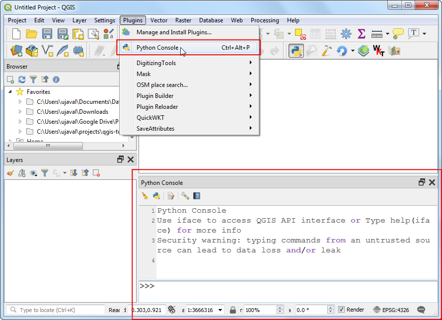
```

At the `>>>` prompt, type in the following command and press Enter.

```{python eval=FALSE}
print('Hello World!')
```

Here you are running Python's *print()* function with the text 'Hello World'. The output of the statement will be printed below.

```{r echo=FALSE, fig.align='center', out.width='75%'}
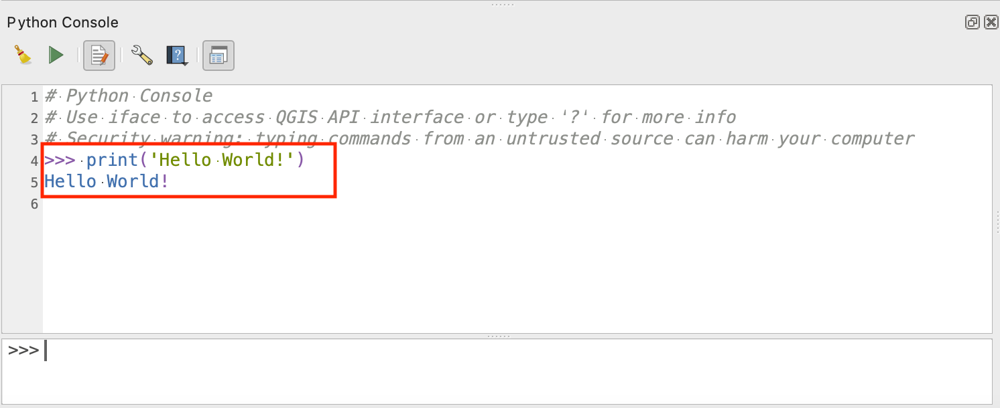
```

While console is useful for typing 1-2 lines of code or printing information contained in a variable, you should use the built-in editor for typing longer scripts or code snippets. Click the *Show Editor* button to open the editor panel. Enter the code and click the *Run Script* button to execute it. The results will appear in the console as before. If you are working on a longer script, you can also click the *Save* button in the editor to save the script for future use.

```{r echo=FALSE, fig.align='center', out.width='75%'}
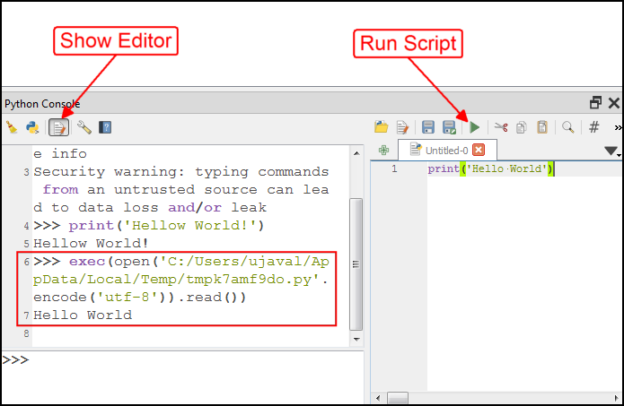
```

All code snippets below should be run from the Editor.

# 2. Hello PyQGIS!

QGIS provides a Python API (Application Programming Interface), commonly known as PyQGIS. The API is vast and very capable. Almost every operation that you can do using QGIS - can be done using the API. This allows developers to write code to build new tools, customize the interface and automate workflows.

Let's try out the API to perform some GIS data management tasks.

Browse to the data directory and load the `shoreline.shp` layer. Open the *Attribute Table*. This layer has 6 attribute columns. Let's say we want to delete the 2nd column (`SDE_SFGIS_`) from the layer.

```{r echo=FALSE, fig.align='center', out.width='75%'}
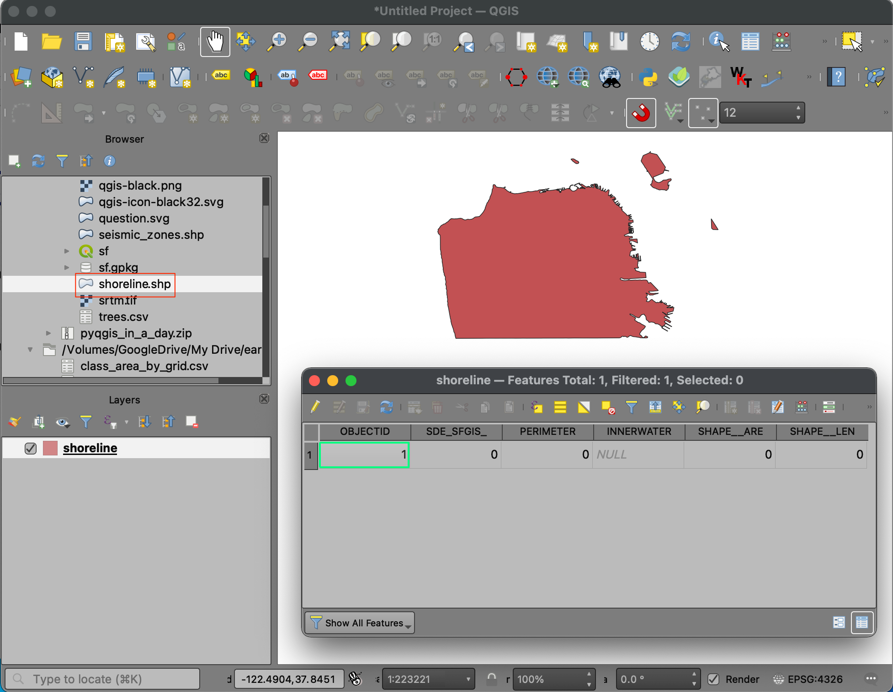
```

This can be done using the QGIS GUI as follows

1. Right-click the `shoreline` layer and click *Open Attribute Table*. 
2. In the Attribute Table, click the *Toggle Editing mode* button.
2. Click the *Delete field* button. Select the `SDE_SFGIS_` column and click *OK*.
4. Click the *Save edits* button and click the *Toggle Editing mode* to stop editing.

QGIS Provides an API to accomplish all of this using Python code. We will now do this task - but using only Python code. Open the *Editor* and enter the following code. Click the *Run Script* button to execute it. 

> Make sure you have selected the `shoreline` layer in the *Layers* panel before running the code.

```{python eval=FALSE}
layer = iface.activeLayer()
layer.startEditing()
layer.deleteAttribute(1)
layer.commitChanges()
```

You will see that the 2nd column is now deleted from the attribute table. 

```{r echo=FALSE, fig.align='center', out.width='75%'}
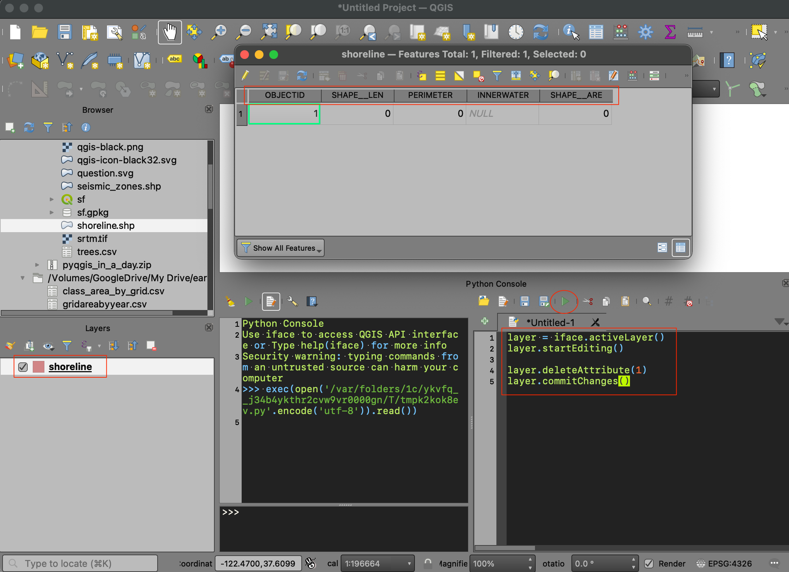
```

Let's understand the code step-by-step

1. `layer = iface.activeLayer()`: This line uses the `iface` object and runs the `activeLayer()` method which returns the currently selected layer in QGIS. We will learn more about `iface` in the [QGIS Interface API](#qgis-interface-api-qgisinterface) section. The method returns the reference to the layer which is saved in the `layer` variable. 
2. `layer.startEditing()`: This is equivalent to putting the layer in the editing mode.
3. `layer.deleteAttribute(1)`: The `deleteAttribute()` is a method from `QgsVectorLayer` class. It takes the index of the attribute to be deleted. Here we pass on index `1` for the second attribute. (index 0 is the first attribute)
4. `layer.commitChanges()`: This method saves the edit buffer and also disables the editing mode.

This gives you a preview of the power of the API. To harness the full power of the PyQGIS API, we must first understand how classes work.

# 3. Understanding Classes

Before we dive it to PyQGIS, it is important to understand certain concepts related to C++ and Python Classes. Qt as well as QGIS is written in C++ language. Functionality of each Qt/QGIS Widget is implemented as a class - having certain properties and functions. When we use PyQt or PyQGIS classes, it is executing the code in the C++ classes via the python bindings.

[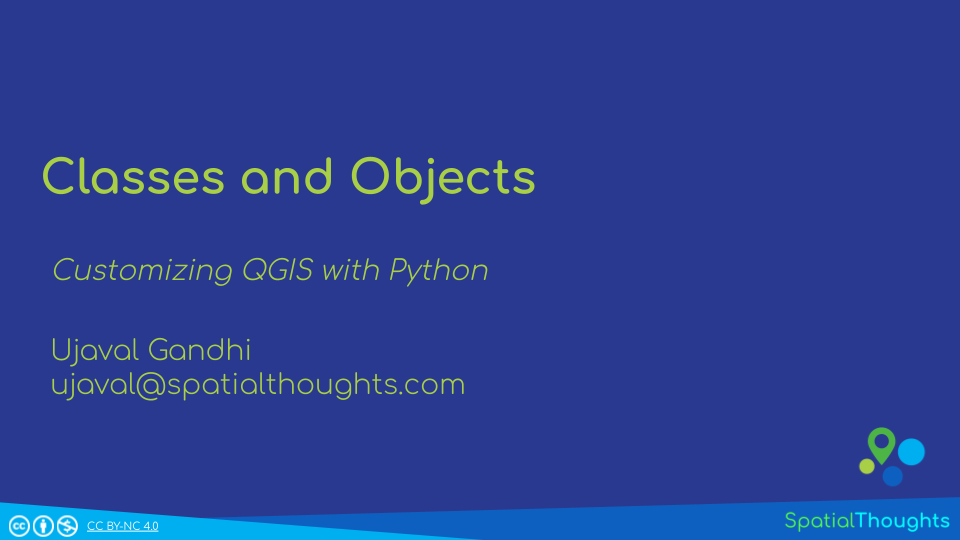{width="400px"}](https://docs.google.com/presentation/d/1b4i1nEDR_uKJVu0IIqjoqrxeFD2a-tnj88JRXQW0JiA/edit?usp=sharing){target="_blank"}

[View the Presentation](https://docs.google.com/presentation/d/1b4i1nEDR_uKJVu0IIqjoqrxeFD2a-tnj88JRXQW0JiA/edit?usp=sharing){target="_blank"}

# 4. Using PyQGIS Classes

Let's start working with PyQGIS classes now. QGIS has classes for the whole range of operations - from building the user interface to doing geoprocessing. We will see how to access these classes via the PyQGIS API.

## 4.1 Calculating distance using PyQGIS

A basic but important operation in a GIS is the calculation of distance and areas. We will see how you can use PyQGIS APIs to compute distances.

We will compute distance between the following 2 coordinates

```{python eval=FALSE}
san_francisco = (37.7749, -122.4194)
new_york = (40.661, -73.944)
```

QGIS provides the class `QgsDistanceArea` that has methods to compute distances and areas.

To use this class, we must create an object by instantiating it. Looking at the [class documentation](https://qgis.org/pyqgis/master/core/QgsDistanceArea.html), the class constructor doesn't take any arguments. We can use the default constructor to create an object and assign it to the `d` variable.

```{python eval=FALSE}
d = QgsDistanceArea()
```

The documentation mentions that if a valid ellipsoid has been set for the QgsDistanceArea, all calculations will be performed using ellipsoidal algorithms (e.g. using Vincenty's formulas). As we want to compute the distance between a pair of latitude/longitudes, we need to use the ellipsoidal algorithms. Let's set the ellipsoid `WGS84` for our calculation. We can use the method `setEllipsoid()`. Remember,  methods should be applied on objects, and not classes directly.

```{python eval=FALSE}
d.setEllipsoid('WGS84')
```

> Tip: All valid ellipsoids can be found by calling `QgsEllipsoidUtils.acronyms()`

Now our object `d` is capable of performing ellipsoidal distance computations. Browsing through the available methods in the `QgsDistanceArea` class, we can see a `measureLine()` method. This method takes a list [QgsPointXY](https://qgis.org/pyqgis/master/core/QgsPointXY.html) objects. We can create these objects from our coordinate pairs and pass them on to the `measureLine()` method to get the distance.


```{python eval=FALSE}
lat1, lon1 = san_francisco
lat2, lon2 = new_york
# Remember the order is X,Y
point1 = QgsPointXY(lon1, lat1)
point2 = QgsPointXY(lon2, lat2)

distance = d.measureLine([point1, point2])
print(distance/1000)
```

Putting it all together, below is the complete code to calculate the distance between a pair of coordinates using PyQGIS. When you run the code in the Python Console of QGIS, all the PyQGIS classes are already imported. If you are running this code from a script or a plugin, you must explicitly import the `QgsDistanceArea` class.

```{python eval=FALSE, code=readLines('code/pyqgis/distance.py')}
```

## Exercise 1

Let's say you want to make a stop at Las Vegas on the way from San Francisco to New York. 

Calculate the total ellipsoidal distance considering a stop at Las Vegas.

```{python eval=FALSE}
san_francisco = (37.7749, -122.4194)
new_york = (40.661, -73.944)
las_vegas = (36.1699, -115.1398)
```

If your code is correct, you should see the output distance to be `4271.02` kilometers.


# 5. Graphical User Interface (GUI) Programming Basics

## 5.1 Qt and PyQt

[Qt](https://www.qt.io/) is a free and open-source widget toolkit for creating graphical user interfaces as well as cross-platform applications. QGIS is built using the Qt platform. Both Qt and QGIS itself have well-documented APIs that should be used when writing Python code to be run within QGIS.

[PyQt](https://wiki.python.org/moin/PyQt) is the Python interface to Qt. PyQt provides classes and functions to interact with Qt widgets.


## 5.2 Building a Dialog Box

Let's learn how to use PyQt classes to create and interact with GUI elements. Here we will create a simple dialog box that prompts a user for confirmation. You can type the code in the **Editor** and click **Run Script**.

```{python eval=FALSE}
mb = QMessageBox()
```
The `QMessageBox` is a PyQt class for creating a dialog with buttons. To use the class, you create object by *instantiating* the class. Here `mb` is an object, which is an instance of the `QMessageBox` class, created using the default parameters.


`type()` tells you what is the class of the object
```{python eval=FALSE}
type(mb)
```

`dir` returns list of the attributes and methods of any object
```{python eval=FALSE}
dir(mb)
```

Classes have methods that provide functionality. You can run the class methods on instance objects. For the `QMessageBox` class, `setText()` method will add a text to the dialog.

```{python eval=FALSE}
mb = QMessageBox()
mb.setText('Click OK to confirm')
```

Classes also have class attributes which are shared across all instances.
The `QMessageBox` class has `Ok` and `Cancel` attributes, which can be referred using  `QMessageBox.Ok` and `QMessageBox.Cancel`.

```{python eval=FALSE}
mb = QMessageBox()
mb.setText('Click OK to confirm')
mb.setStandardButtons(QMessageBox.Ok | QMessageBox.Cancel)
```

To see the dialog, we need to use the `exec()` method. The user input is then captured and saved in the `return_value` variable. 

The complete code snippet is as follows.Try it out and see the result of your action reflect in the Python Console.

```{python eval=FALSE}
mb = QMessageBox()
mb.setText('Click OK to confirm')
mb.setStandardButtons(QMessageBox.Ok | QMessageBox.Cancel)
return_value = mb.exec()
if return_value == QMessageBox.Ok:
    print('You pressed OK')
elif return_value == QMessageBox.Cancel:
    print('You pressed Cancel')
```

```{r echo=FALSE, fig.align='center', out.width='75%'}
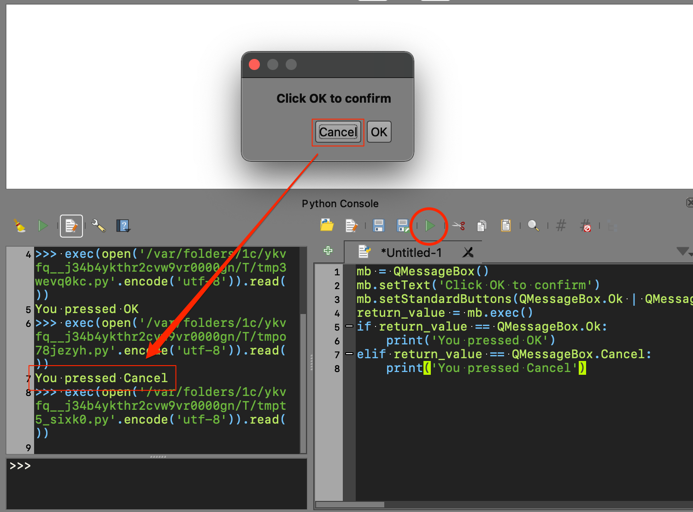
```

# 6. Deep Dive into PyQGIS


[PyQGIS](https://docs.qgis.org/testing/en/docs/pyqgis_developer_cookbook/) is the Python interface to QGIS. It is created using SIP and integrates with PyQt.

> **_Fun Fact:_**  Most QGIS class names start with the prefix *Qgs*. **Q** is for Qt and **gs** stands for Gary Sherman - the founder of the QGIS project.

QGIS C++ API documentation is available at https://qgis.org/api/

QGIS Python API documentation is available at https://qgis.org/pyqgis/3.0

Both C++ and Python APIs are identical for most part, but certain functions are not available in the Python API. [^1]

[^1]: See https://qgis.org/api/3.4/classQgsProject.html

## 6.1 QGIS Interface API (QgisInterface)

You are ready to dive into the PyQGIS API now. In this section, we will focus on the `QgisInterface` class - which provides methods for interaction with the QGIS environment. When QGIS is running, a variable called `iface` is set up to provide an object of the class `QgisInterface` to interact with the running QGIS environment. This interface allows access to the map canvas, menus, toolbars and other parts of the QGIS application. Python Console and Plugins can use `iface` to access various parts of the QGIS interface.


### 6.1.1 Change Title of QGIS Main Window

```{python eval=FALSE}
title = iface.mainWindow().windowTitle()
new_title = title.replace('QGIS', 'My QGIS')
iface.mainWindow().setWindowTitle(new_title)
```

### 6.1.2 Change Icon of QGIS Main Window

> `os.path.expanduser('~')` returns the path to the home directory of the user.

```{python eval=FALSE}
import os

icon = 'qgis-black.png'
data_dir = os.path.join(os.path.expanduser('~'), 'Downloads', 'pyqgis_in_a_day')
icon_path = os.path.join(data_dir, icon)
icon = QIcon(icon_path)
iface.mainWindow().setWindowIcon(icon)
```

```{r echo=FALSE, fig.align='center', out.width='50%'}
knitr::include_graphics('images/pyqgis/mainwindow2.png')
```

### 6.1.3 Remove Raster and Vector Menus

```{python eval=FALSE}
vector_menu = iface.vectorMenu()
raster_menu = iface.rasterMenu()
menubar = vector_menu.parentWidget()
menubar.removeAction(vector_menu.menuAction())
menubar.removeAction(raster_menu.menuAction())
```

```{r echo=FALSE, fig.align='center', out.width='75%'}
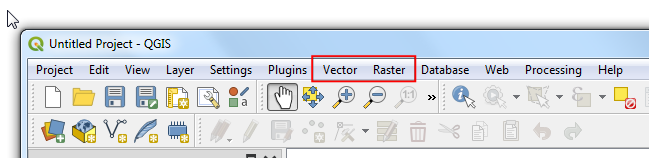
```

```{r echo=FALSE, fig.align='center', out.width='75%'}
knitr::include_graphics('images/pyqgis/menu2.2.png')
```


### 6.1.4 Understanding Signals and Slots

GUI programming requires responding to user’s actions. All objects in Qt have a mechanism where they can emit a signal when there is a change in status. i.e. when a user *clicks* a button, or a window is *closed*. As a programmer, you can connect the signal to a slot (i.e. a python function) which will be called when the signal is emitted. The general syntax for connecting the signal to a slot is as follows

```{python eval=FALSE}
object.signal.connect(function)
```

### 6.1.5 Add A New Menu Item

A new button or menu item is created using `QAction()`. Here we create an action and then connect the *click* signal to a method that opens a website. [^4]

[^4]: Code reference https://gis.stackexchange.com/questions/318816/add-help-menu-entry-in-qgis-3-from-startup-py

```{python eval=FALSE}
import webbrowser

def open_website():
    webbrowser.open('https://gis.stackexchange.com')

website_action = QAction('Go to gis.stackexchange')
website_action.triggered.connect(open_website)
iface.helpMenu().addSeparator()
iface.helpMenu().addAction(website_action)
```

```{r echo=FALSE, fig.align='center', out.width='50%'}
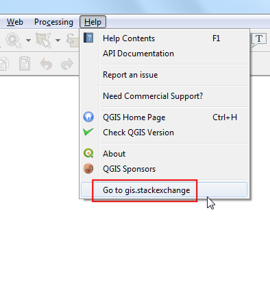
```

### 6.1.6 Change Visibility of a Toolbar

```{python eval=FALSE}
iface.pluginToolBar().setVisible(True)
```

### 6.1.7 Add a button to a toolbar

```{python eval=FALSE}
import os
from datetime import datetime

icon = 'question.svg'
data_dir = os.path.join(os.path.expanduser('~'), 'Downloads', 'pyqgis_in_a_day')
icon_path = os.path.join(data_dir, icon)

def show_time():
    now = datetime.now()
    current_time = now.strftime("%H:%M:%S")
    iface.messageBar().pushInfo('Current Time', current_time)

action = QAction('Show Time')
action.triggered.connect(show_time)
action.setIcon(QIcon(icon_path))
iface.addToolBarIcon(action)
```


```{r echo=FALSE, fig.align='center', out.width='75%'}
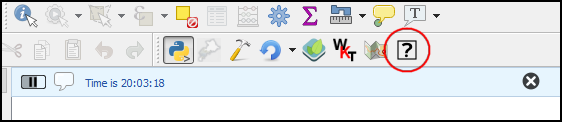
```

### Exercise 2

In the previous example, the alert is displayed in the QGIS message bar as an *Info* message. Change the type of the message to a *Warning* message.

Hint: Look at the appropriate method in the [QgsMessageBar](https://qgis.org/pyqgis/3.0/gui/Message/QgsMessageBar.html) class

### 6.1.8 Add New Layers

```{r echo=FALSE, fig.align='center', out.width='75%'}
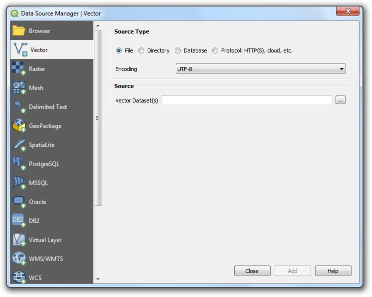
```

Data sources are identified by an URI (Uniform Resource Identifier)
- For files on computer the URI is the file path
- For databases, the URI is constructed using QgsDataSourceUri() class and encodes,the database path, table, username, password etc.
- For web layers, such as WMF/WFS etc, the URI is the web URL


```{python eval=FALSE}
import os
data_dir = os.path.join(os.path.expanduser('~'), 'Downloads', 'pyqgis_in_a_day')

filename = 'seismic_zones.shp'
uri = os.path.join(data_dir, filename)
iface.addVectorLayer(uri, 'seismic_zones', 'ogr')

filename = 'sf.gpkg|layername=zoning'
uri = os.path.join(data_dir, filename)
iface.addVectorLayer(uri, 'zoning', 'ogr')
```

```{r echo=FALSE, fig.align='center', out.width='50%'}
knitr::include_graphics('images/pyqgis/vectorlayer.png')
```


### 6.1.9 Change name of a Layer

```{python eval=FALSE}
layer = iface.activeLayer()
name = layer.name()
layer.setName('sf_' + name)
```


## 6.2 QGIS Project API (QgsProject)

Another very important QGIS class is `QgsProject`. This class is used for all operations in a QGIS project - including adding/removing map layers, styling, print layouts etc. The `QgsProject` is a **Singleton Class** - meaning it can have only 1 instance at a time. The instance refers to the current QGIS project that is loaded. When QGIS starts, a blank project is created. When you load another project, the existing project is closed and a new project instance is created. You can get the current instance of the QgsProject class by calling the 
**`QgsProject.instance()`**  method.

### 6.2.1 Load a project

```{python eval=FALSE}
import os
data_dir = os.path.join(os.path.expanduser('~'), 'Downloads', 'pyqgis_in_a_day')

project = QgsProject.instance()
project_name = 'sf.qgz'
project_path = os.path.join(data_dir, project_name)
project.read(project_path)
```

```{r echo=FALSE, fig.align='center', out.width='75%'}
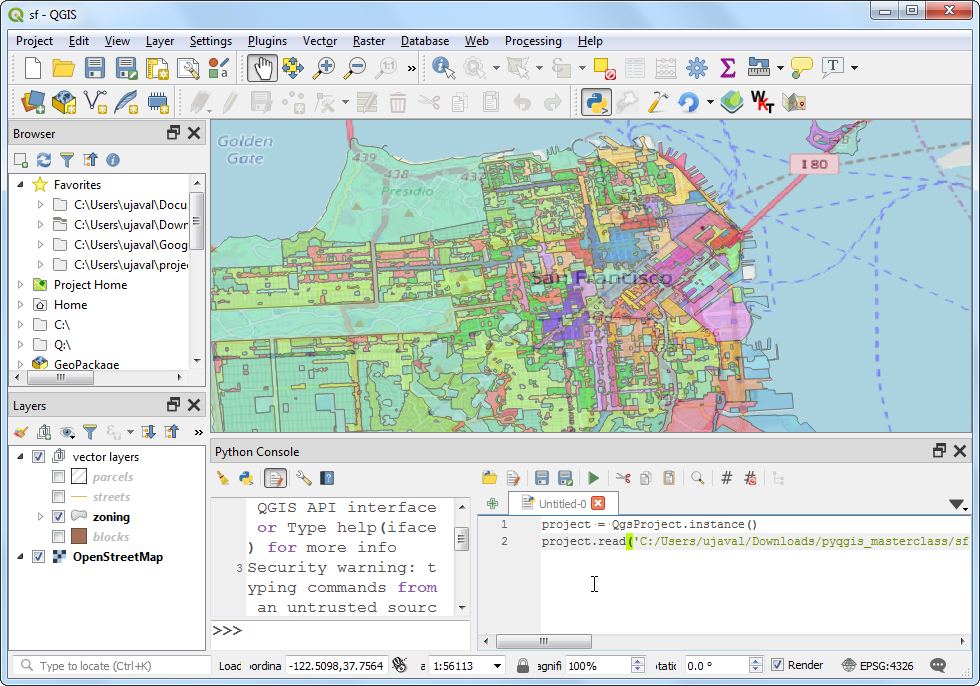
```

### 6.2.2 Search for a layer

```{python eval=FALSE}
blocks = QgsProject.instance().mapLayersByName('blocks')[0]
```

### 6.2.3 Turn a layer on/off

```{python eval=FALSE}
QgsProject.instance().layerTreeRoot().findLayer(blocks.id()).setItemVisibilityChecked(True)
```

### Exercise 3

Write a code snippet that checks the active layer selected by the user. If the active layer is named `zoning`, display a success message in the message bar, else display an error message.

```{r echo=FALSE, fig.align='center', out.width='75%'}
knitr::include_graphics('images/pyqgis/success.png')
```
```{r echo=FALSE, fig.align='center', out.width='75%'}
knitr::include_graphics('images/pyqgis/error.png')
```

# 7. Running Python Code at QGIS Launch

It is possible to execute some PyQGIS code every time QGIS starts. QGIS looks for a file named `startup.py` in the user's Python home directory, and if it is found, executes it. This file is very useful in customizing QGIS interface with techniques learnt in the previous section. 

If you are running multiple versions of QGIS, a very useful customization is to display the QGIS version number and name in the main window. The version name is stored in a global QGIS variable called `qgis_version`. We can read that variable and set the main window's title with it. We connect this code to the signal `iface.initializationCompleted` signal when the main window is loaded.

Create a new file named `startup.py` with the following code. Note the imports at the top - including `iface`. When we ran the code snippets in the Python Console, we did not have to import any modules since they are done automatically when the console starts. For pyqgis scripts elsewhere, we have to explicitly import the modules (classes) that we want to use.

```{python eval=FALSE, code=readLines('code/pyqgis/startup.py')}
```

This file needs to be copied to the appropriate directory on your system. See [QGIS documentation](https://docs.qgis.org/testing/en/docs/pyqgis_developer_cookbook/intro.html#running-python-code-when-qgis-starts) for details on the path for your platform.

```{r echo=FALSE, fig.align='center', out.width='75%'}
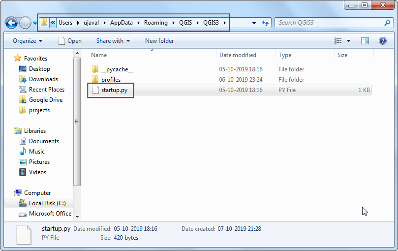
```

Once you copy the file at that location, restart QGIS. The title bar should now have the QGIS version name in it.

```{r echo=FALSE, fig.align='center', out.width='75%'}
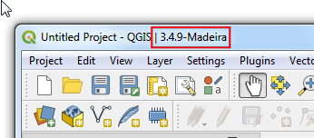
```

## Exercise 4

Trying opening a new project in QGIS after you have restarted GIS with `startup.py` file in place. You will notice that the custom title with the version name is replaced with the default title. 

Make a change to your `startup.py` so that the customization is applied even when a new project is loaded.

# 8. Creating Custom Python Actions

[Actions](https://docs.qgis.org/testing/en/docs/user_manual/working_with_vector/vector_properties.html#actions-properties) in QGIS provide a quick and easy way to trigger custom behavior in response to a user's action - such as click on a feature in the canvas or an attribute value in the attribute table. 

Actions provide an easy way to add custom behavior to QGIS without having to write plugins. Actions are integrated into the QGIS GUI and allow you to execute PyQGIS code on vector layers.

Actions are defined at the layer level. We will define an action for the `parcels` layer so when a user clicks on a parcel, all parcels that belong to the same block will be selected. The parcel layer has an attribute **block_num** that refers to the block that parcel belongs to. 

Right-click the `parcels` layer and switch to *Actions* tab. Click *Add a new action* button. Select **Python** as the *Type*. Name the action as **Select all parcels from the same block**. This action is meant to be used for selecting features on the map canvas, so check the **Canvas** as the *Action Scope*. Enter the following code snippet in the *Action Text* and click *OK*. [^9]

[^9]: Code reference: https://gis.stackexchange.com/a/340615/5160


```{r echo=FALSE, fig.align='center', out.width='75%'}
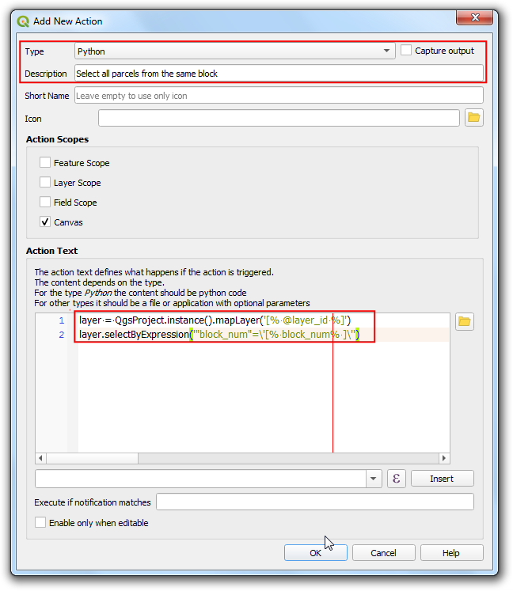
```

```{python eval=FALSE}
layer = QgsProject.instance().mapLayer('[% @layer_id %]')
layer.selectByExpression('"block_num"=\'[% block_num %]\'')
```

Back in the main QGIS window, enable the `parcels` layer. Click the *Run feature action* button from the *Attributes Toolbar* and select **Select all parcels from the same block**. With the action enabled, click on any parcel and you will see all parcels from the block get selected.


```{r echo=FALSE, fig.align='center', out.width='75%'}
knitr::include_graphics('images/pyqgis/action2.png')
```

# 9. Writing Python Expression Functions

Expressions in QGIS have a lot of power and are used in many core features: selection, calculating field values, styling, labeling etc. QGIS also has support for user-defined expressions. With a little bit of python programming, you can define your own functions that can be used within the expression engine.

Custom python functions in QGIS use ``@qgsfunction`` decorator to make the function available across the system. 

## 9.1 Understanding Python Decorators

Decorators are functions that take a function as an input and returns a modified function. Decorators are an easy way to inject additional functionality into existing functions without a lot of repeated code. To decorate a function, you use the `@decorator` syntax above the function definition. Once decorated, the original function gets modified with the decorator function.

```{python eval=FALSE}
def fancify(normal_function):
    
    def fancy(*args, **kwargs):
        val = normal_function(*args, **kwargs)
        return '*****' + val + '*****'
        
    return fancy
    
def hello(name):
    return 'Hello ' + name
    
print(hello('World'))

@fancify
def hello(name):
    return 'Hello ' + name
    
print(hello('World'))
```


## 9.2 Custom function to find UTM Zone of a feature

We will define a custom function that finds the UTM zone number of a map feature. Open the project ``places.qgz`` from the data directory.

Click the *Select features using an expression button* on the Attributes Toolbar.

```{r echo=FALSE, fig.align='center', out.width='75%'}
knitr::include_graphics('images/pyqgis/expressionselect.png')
```
In the Select by Expression dialog, switch to the Function Editor tab. Here you can write any PyQGIS code that will be executed by the expression engine. We will define a new function called `GetUtmZone()`. Note the use of `@qgsfunction` decorator which registers this function with the expression engine. Enter the following code and save the file as `utm_zone.py`

`utm_zone.py`
```{python eval=FALSE, code=readLines('code/pyqgis/utm_zone.py')}
```

```{r echo=FALSE, fig.align='center', out.width='75%'}
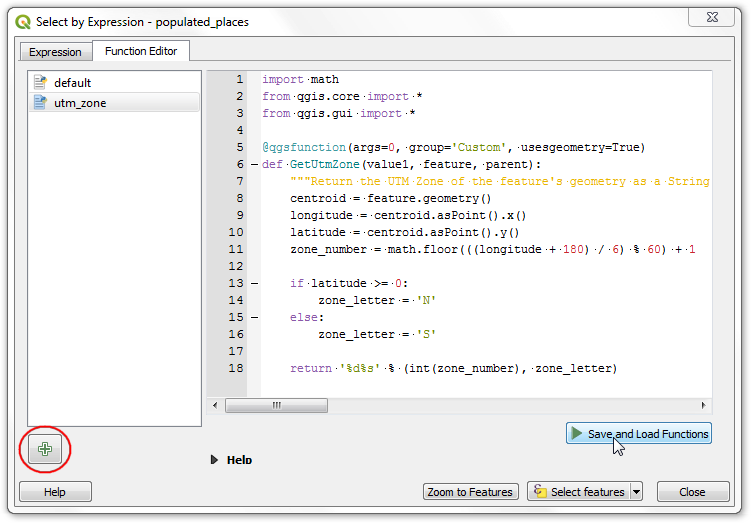
```

Switch to the *Expression* tab in the Select by expression dialog. Find and expand the *Custom* group in the Functions section. You will notice a new custom function `GetUtmZone` in the list. We can now use this function in the expressions just like any other function. Type the following expression in the editor and click *Select*.

```
GetUtmZone() = '44N'
```

```{r echo=FALSE, fig.align='center', out.width='75%'}
knitr::include_graphics('images/pyqgis/expressionuse.png')
```

Back in the main QGIS window, you should see some points highlighted in yellow. These are the points falling in the UTM Zone we specified in the expression.
```{r echo=FALSE, fig.align='center', out.width='75%'}
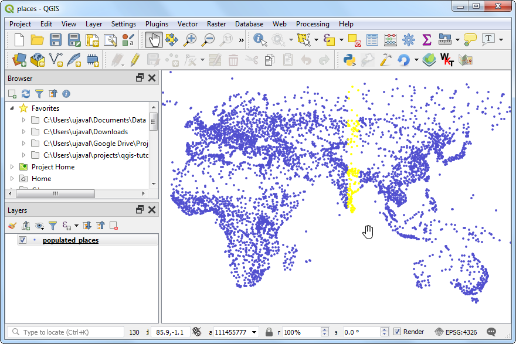
```

You can also use the expression in the field calculator. Open the field calculator and add a new virtual field called `utmzone` with the following expression

```
GetUtmZone()
```

```{r echo=FALSE, fig.align='center', out.width='75%'}
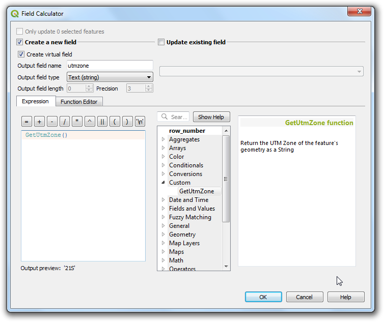
```

You will see the attribute table updates with the corresponding utm zone for each feature.


```{r echo=FALSE, fig.align='center', out.width='75%'}
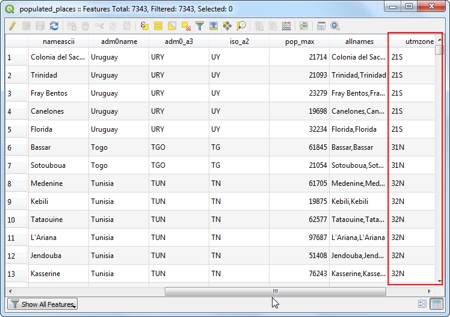
```

## Exercise 5

Write a new custom function called `unique_values()` that takes the a comma-separated string value and removes duplicate values.

For example,
```
'cat,mouse,dog,mouse' --> 'cat,mouse,dog'
```

Test this function by reading values from the `allnames` column and creating a new column `uniquenames`.

Below is the template to get started.

```{python eval=FALSE}
from qgis.core import *
from qgis.gui import *

@qgsfunction(args='auto', group='Custom')
def unique_values(value, feature, parent):
    # Write your code here
```


# 10. Running Processing Algorithms

While the PyQGIS API providers many functions to work with layers, features, attributes and geometry - it is a much better practice to use the built-in processing algorithms to alter the layers or do any analysis. This will give you better performance and result in much lesser code. Here are some examples on how to use processing algorithms from Python to do vector and raster layer editing.

```{r echo=FALSE, fig.align='center', out.width='75%'}
knitr::include_graphics('images/pyqgis/processing.png')
```

## 10.1 Creating Hillshade from a DEM

To use any Processing Algorithm via Python, you need to know how to specify all the required parameters. This is easiest to obtain by running the algorithm via the GUI first. 

In this section we will learn how to create a hillshade raster from a DEM. We will first carry out the task using QGIS.

1. Browse to the data directory and load the `srtm.tif` layer. Search and locate the **Processing Toolbox &rarr; Raster terrain analysis &rarr; Hillshade**  algorithm from the *Processing Toolbox*. Double-click to open it.

```{r echo=FALSE, fig.align='center', out.width='75%'}
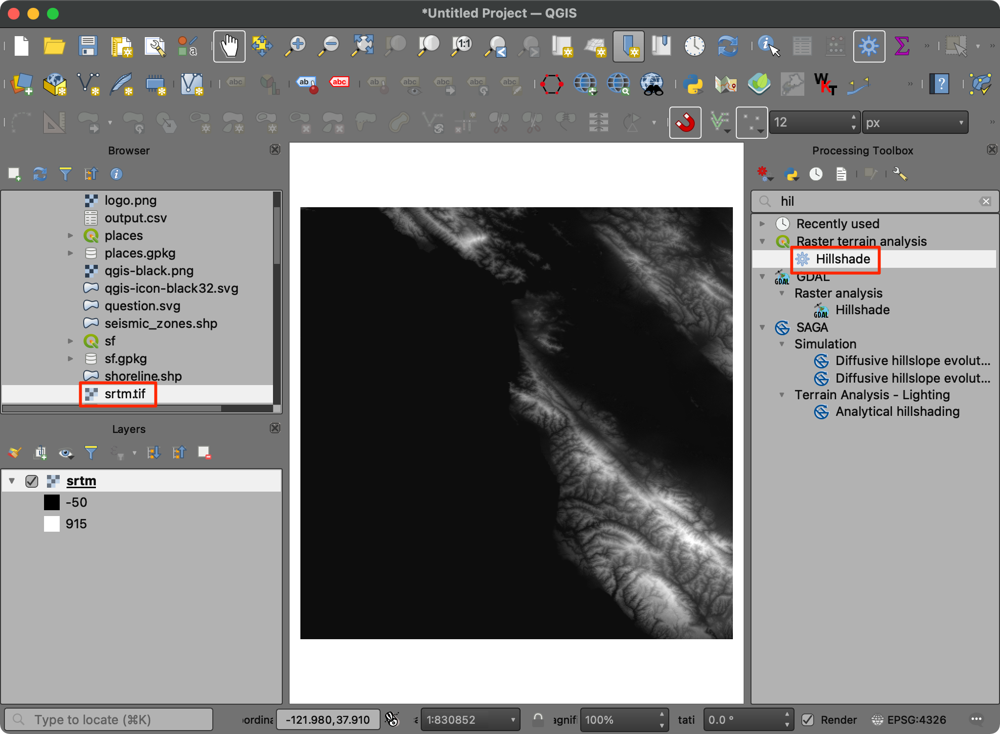
```

2. Select `srtm` as the *Elevation layer* and keep all the other parameters to their default value. Click *Run*.

```{r echo=FALSE, fig.align='center', out.width='75%'}
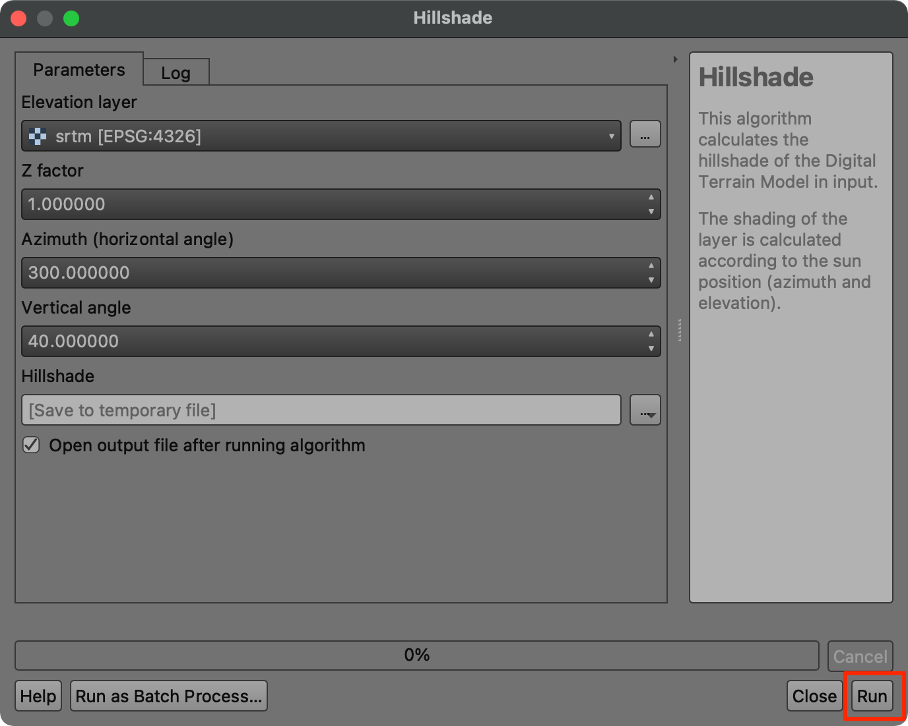
```

3. A new `Hillshade` layer will be added to the *Layers* panel. Now we will locate the Python command for this operation from the *Processing History*. Go to **Processing &rarr; History*.

```{r echo=FALSE, fig.align='center', out.width='75%'}
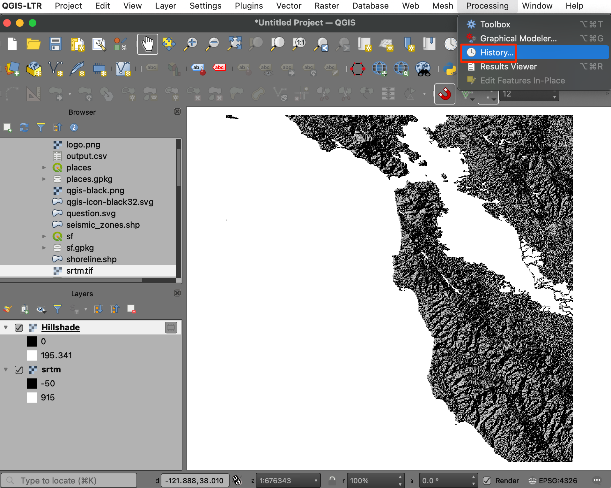
```

4. The first entry in the top panel will show the last algorithm that was ran from the toolbox. Click on it to select it. The full Python command will be shown at the bottom. Copy it.

```{r echo=FALSE, fig.align='center', out.width='75%'}
knitr::include_graphics('images/pyqgis/processing4.png')
```

You can now use the parameters in your Python code and replace the path of the input. Below is the code snippet that runs the same algorithm from a Python script. Note that we are using the `processing.runAndLoadResults()` method that adds the resulting layer to the canvas.    

```{python eval=FALSE}
import os
data_dir = os.path.join(os.path.expanduser('~'), 'Downloads', 'pyqgis_in_a_day')

filename = 'srtm.tif'
srtm = os.path.join(data_dir, filename)
iface.addRasterLayer(srtm, 'srtm', 'gdal')

results = processing.runAndLoadResults("native:hillshade", 
    {'INPUT': srtm, 
    'Z_FACTOR':2,
    'AZIMUTH':300,
    'V_ANGLE':40,
    'OUTPUT': 'TEMPORARY_OUTPUT'})
```

## 10.2 Running Multiple Processing Algorithms

We can also *chain* multiple processing tools to build a script to build a data processing pipeline. In the example below, we will do 2 steps

1. Clip  `srtm.tif` raster using the `shoreline.shp` layer.
2. Calculate the hillshade on the clipped raster and load it in QGIS.

Note that we are using the `processing.run()` method for the first step. This method calculates the output, but does not load the result to QGIS. This allows us to carry out multiple processing steps and not load intermediate layers.

```{python eval=FALSE}
import os
data_dir = os.path.join(os.path.expanduser('~'), 'Downloads', 'pyqgis_in_a_day')

filename = 'srtm.tif'
srtm = os.path.join(data_dir, filename)
filename = 'shoreline.shp'
shoreline = os.path.join(data_dir, filename) 

results = processing.run("gdal:cliprasterbymasklayer", 
    {'INPUT':srtm,
    'MASK': shoreline,
    'OUTPUT':'TEMPORARY_OUTPUT'})

clipped_dem = results['OUTPUT']
   
results = processing.runAndLoadResults("native:hillshade", 
    {'INPUT': clipped_dem, 
    'Z_FACTOR':2,
    'AZIMUTH':300,
    'V_ANGLE':40,
    'OUTPUT': 'TEMPORARY_OUTPUT'})
```

You can also do batch-processing by iterating through multiple layers and running the processing algorithm in a for-loop. Doing it via Python allows you greater flexibility - such as combining the results into a single layer. See [Running Processing Algorithms via Python](https://www.qgistutorials.com/en/docs/3/processing_algorithms_pyqgis.html){target="_blank"} tutorial for a complete example.

## Exercise 6

Let's say we want to find the elevation of the highest point in San Francisco. We can use the DEM and QGIS Processing Algorithms to get the answer. Use the `qgis:rasterlayerstatistics` algorithm to calculate statistics on the clipped DEM and print the answer.

Hint: The result of the `qgis:rasterlayerstatistics` algorithm is a dictionary. Printthe result to see iit and extract relevant value.

```{python eval=FALSE}
import os
data_dir = os.path.join(os.path.expanduser('~'), 'Downloads', 'pyqgis_in_a_day')

filename = 'srtm.tif'
srtm = os.path.join(data_dir, filename)

filename = 'shoreline.shp'
shoreline = os.path.join(data_dir, filename)

results = processing.run("gdal:cliprasterbymasklayer", 
    {'INPUT':srtm,
    'MASK': shoreline,
    'OUTPUT':'TEMPORARY_OUTPUT'})
clipped_dem = results['OUTPUT']

# Use the qgis:rasterlayerstatistics algorithm on clipped_dem
```

# 11. Understanding Python Iterators

An *Iterator* is a type of Python object that contains items that can be iterator upon. They are similar to other objects, like *lists* - but with a key difference. When you create an iterator, you don't store all the items in memory. The iterator loads a single item at a time and then fetches the next item when asked for it. This makes it very efficient for reading large amounts of data without having to read the entire dataset. QGIS implements iterators for many different object types. 

In the example below, the result of calling `layer.getFeatures()` is an iterator. You can call the `next()` function to fetch the next item from the iterator. 

```{python eval=FALSE}
layer = iface.activeLayer()
features = layer.getFeatures()
f = next(features)
print(f.attributes())
f = next(features)
print(f.attributes())
```

You can also use for-loops to iterate through an iterator. Here we look up the *Feature ID* of each feature using the `id()` method and store it in a list.

```{python eval=FALSE}
layer = iface.activeLayer()
features = layer.getFeatures()
ids = []
for f in features:
  id = f.id()
  ids.append(id)

print(ids)
```

# 12. Writing Python Console Scripts

We will now see how can we write python scripts, save them and run them within QGIS. We will also see examples of best practices - such as validating inputs, writing files safely and communicating the status to the user.

A goal of the script is to read the features of a selected vector layer, and write its attributes to a CSV file. 

Open the Python Console and click the *Show Editor* button. Copy/paste the following code. Click the *Save* button and save the file as `save_attributes_console.py`. The file can be saved anywhere.

```{r echo=FALSE, fig.align='center', out.width='75%'}
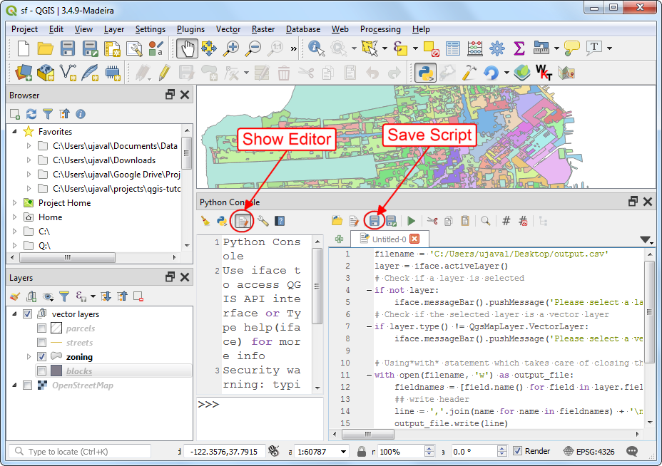
```

```{python eval=FALSE, code=readLines('code/pyqgis/save_attributes_console.py')}
```

You can run this script by clicking the *Run Script* button. The script will process the layer and write the file at the given location.

```{r echo=FALSE, fig.align='center', out.width='75%'}
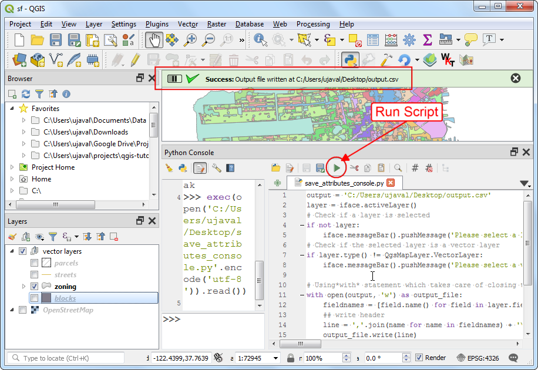
```

# 13. Writing Standalone Python Scripts

Having the python script run within QGIS is useful and desired most of the time. But there is a way to write python scripts that run on your system without QGIS being open. Let's convert the script from the previous section to a standalone pyqgis script. 

Create a new file with the code below and save it as `save_attributes_standalone.py`.

```{python eval=FALSE, code=readLines('code/pyqgis/save_attributes_standalone.py')}
```

You will notice that the script is almost exactly the same, but with a few notable changes. First there is the import statement at the top, to explicitly import the required modules. Next, we create an instance of the `QgsApplication` class and run `initQis()` method to load the QGIS data providers and layer registry. Finally we call `exitQgis()` to remove them from memory. Here we don't have a way to take user input, so we hard-code the path to the input layer. Also we don't have the QGIS GUI, we have no way of displaying the messages, so we remove those statements.

When you run the script within QGIS environment, all the paths to QGIS libraries and environment variables are already set and python is able to find and use it. But when you run the script outside of QGIS, you need to set them yourself. The way to run the script depends on the platform.

> You may need to change these paths slightly based on where QGIS is installed. The following scripts assume you are running QGIS 3.16 LTR installed at the default location.

## Windows

On Windows, you can do this using a batch file. Create a new file named `run_script.bat` with the following code. Make sure to save it in the same directory.

```{python eval=FALSE, code=readLines('code/pyqgis/run_script.bat')}
```

Open the command prompt, browse to the directory with the above files, type `run_script.bat` and press Enter.

> You can also just double-click the `run_script.bat` to run it, but you will not see any error or success messages. So it is always a good idea to run the script from the shell.

The script will run and produce the output at the given path.

```{r echo=FALSE, fig.align='center', out.width='75%'}
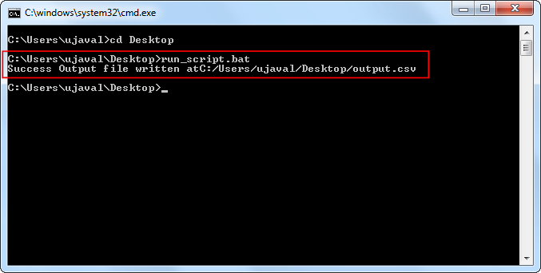
```

## MacOS

On MacOS, you can set the required environment variables and run the script using a shell script. Create a file named `run_script.sh` and save it in the same directory as the script.

```{python eval=FALSE, code=readLines('code/pyqgis/run_script.sh')}
```

Open a Terminal and browse to the directory with the script. Type `bash run_script.sh` and press enter. The script will run and produce the output at the given path.

# 14. Processing Scripts

We already saw 2 different ways to write a Python script in QGIS. But there is another way - and it is the preferred approach to write scripts. Whenever you are writing a new script, consider using the built-in **Processing Framework**. This has several advantages. First, taking user input and writing output files is far easier because Processing Framework offers standardized user interface for these. Second, having your script in the Processing Toolbox also allows it to be part of any Processing Model or be run as a Batch job with multiple inputs. This tutorial will show how to write a custom python script that can be part of the Processing Framework in QGIS.

We will now see how the Python Console script can be converted to a Processing script. But first, a word on Python Classes.

## 14.1 Writing a Python Class

We have sen how to use a class from PyQt or PyQGIS libraries. But we have not written a new class. To write a Processing Script, we must write a new class. A new class is defined using the word `class`. All classes have a function called` __init__()`, which is always executed when a new object is being created. There is also the keyword `self` which refers to the current instance of the class.

```{python eval=FALSE}
class Hello:
  def __init__(self, greeting):
    self.greeting = greeting

  def hello(self):
    print(self.greeting, 'World!')

hi = Hello('Hi')
hi.hello()
hola = Hello('Hola')
hola.hello()
```

As we saw, all PyQGIS and PyQt inherit from other classes. When using them, sometimes you will see the use of a function `super()`. Here `super` refers to the parent class and when you are using the child class, you need to initialize the parent class using this keyword. Let's see this in action.

## 14.2 Writing a Processing Script

To create a new processing script, go to **Processing &rarr; Processing Toolbox**. Click the *Scripts* button and select *Create New Script..*.

```{r echo=FALSE, fig.align='center', out.width='75%'}
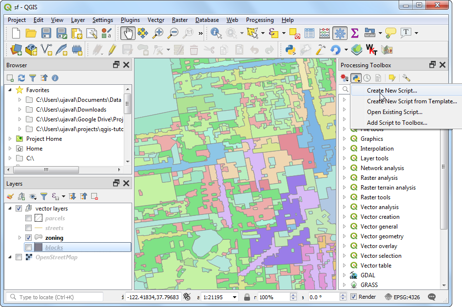
```

Copy/paste the following code into the *Processing Script Editor*.

`save_attributes_processing.py`
```{python eval=FALSE, code=readLines('code/pyqgis/save_attributes_processing.py')}
```

```{r echo=FALSE, fig.align='center', out.width='75%'}
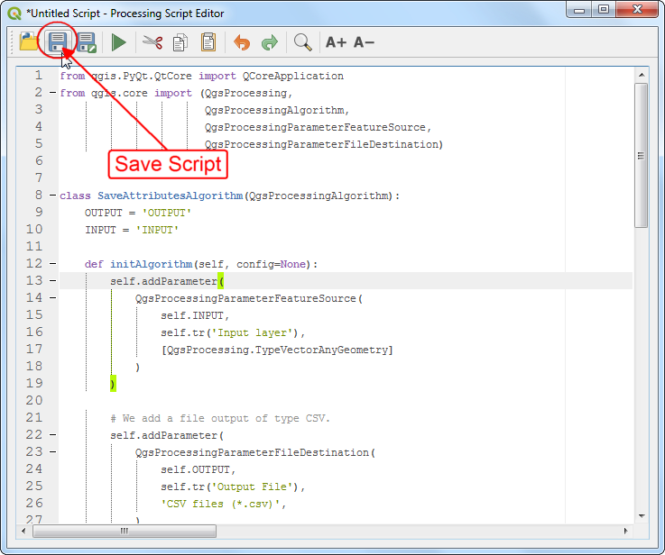
```

By now, you must be familiar with the code in the `processAlgorithm()` method. This method contains the main logic of the script that gets executed when the user clicks the *Run* button. Here we are creating a new class called `SaveAttributesAlgorithm`. As this is a processing script, we must inherit from the `QgsProcessingAlgorithm` class. The `initAlgorithm()` method is called to set-up the inputs and the outputs. There are other methods that set the algorithm name and group.

Click the *Save Script* button and save the script as `save_attributes_algorithm.py`. This script must be saved inside the `{profile foler}/processing/scripts/` directory so it can be loaded when QGIS starts.

Once saved, the algorithm will appear in the *Processing Toolbox* under **Scripts  &rarr; Save Attributes As CSV**. Double-click to launch it. You will see the standard processing algorithm dialog where the user can select inputs and outputs easily. Progress bar is shown correctly and the execution also stops if the user presses the *Cancel* button. If the large is large and the algorithm would take time to process it, the user can also close the window and the algorithm will continue to run in the background.

You can review additional information and tips in the [Writing new Processing algorithms as Python scripts](https://docs.qgis.org/3.16/en/docs/user_manual/processing/scripts.html) section of the QGIS User Guide.

```{r echo=FALSE, fig.align='center', out.width='75%'}
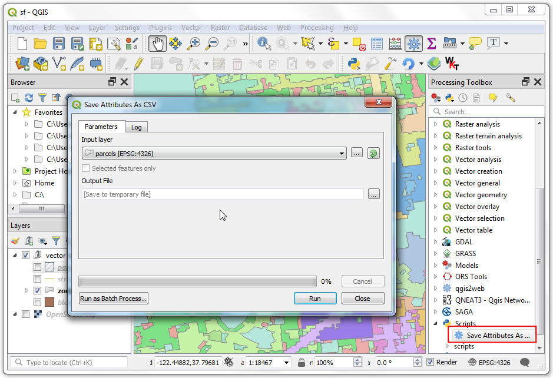
```


## 14.3 Simplifying Processing Scripts

The Processing Framework providers a simpler way to write processing scripts by using the ``@alg`` decorator. Using this approach, you are able to remove a lot of *boilerplate* code and focus on just writing the main algorithm function. There are some limitations of this approach - the main one being that scripts written using the ``@alg`` decorator cannot be used in plugins. But if your goal is to create a processing scripts, this is a much simpler style.

> Note: the ``@alg`` decorator cannot be used in plugins. If you are writing processing algorithms for a plugin, use the full script template shown in the previous section.

Let's modify the `save_attributes_algorithm.py` script to use the built-in ``@alg`` decorator. Locate the script in *Processing Toolbox* under **Scripts  &rarr; Save Attributes As CSV**. Right-click on it and select *Edit Script...*. Replace all the code in the *Processing Script Editor* with the following and click the *Save Script* button

```{python eval=FALSE, code=readLines('code/pyqgis/save_attributes_decorator.py')}
```

You can run the script and see that the behavior is almost identical but the code is much simpler. The code uses the ``@alg`` decorator for defining algorithm name, group, inputs and outputs in a more concise way. 

Another important thing to note is that to create a processing algorithm, one must create a class that inherits from ``QgsProcessingAlgorithm``. When you write a class, you refer to the current instance of the class with the keyword ``self``. Here you are just writing a function, and the decorator will create a class for you. So we are using a parameter named ``instance``. When the decorator will create a class, the reference to the instance will be passed on to our function as this parameter.

# 15. Writing Plugins

Plugins are a great way to extend the functionality of QGIS. You can write plugins using Python that can range from adding a simple button to sophisticated tool-kits. There are 2 broad categories of python plugins - Processing Plugins and GUI Plugins. We will cover both in this section.

There is a plugin named [Plugin Builder](https://plugins.qgis.org/plugins/pluginbuilder/) that can help you generate a starter plugin. I have published step-by-step instructions for both [GUI plugins](https://www.qgistutorials.com/en/docs/3/building_a_python_plugin.html) and [Processing Plugins](https://www.qgistutorials.com/en/docs/3/processing_python_plugin.html) using the Plugin Builder method. While this method gives you an easy way to have a functional plugin, it is not the ideal way to learn plugin development. I prefer starting from a minimal template and adding elements as and when needed. Here we will learn the basics of plugin framework using a minimal plugin and learn how to add various element to make it a full plugin.

## 15.1 A Minimal Plugin

Plugins are much more integrated into the QGIS system than Python Scripts. They are managed by **Plugin Manager** and are initialized when QGIS starts. To understand the required structure, let's see what a minimal plugin looks like. You can learn more about this structure at [QGIS Minimalist Plugin Skeleton](https://github.com/wonder-sk/qgis-minimal-plugin).

We will be the same script for saving attributes of a vector layer and convert it to a plugin. 
The first requirement for plugins is a file called `metadata.txt`. This file contains general info, version, name and some other metadata used by plugins website and plugin manager. 

`metadata.txt`
```{python eval=FALSE, code=readLines('code/pyqgis/minimal/metadata.txt')}
```

Second file is called `__init__.py` which is the starting point of the plugin. It has to have the classFactory() method that returns the instance of the main plugin class.

`__init__.py`
```{python eval=FALSE, code=readLines('code/pyqgis/minimal/__init__.py')}
```

Third is the file that contains the main logic of the plugin. It must have `__init__()` method that gives the plugin access to the QGIS Interface (iface). The `initGui()` method is called when the plugin is loaded and `unload()` method which is called when the plugin is unloaded. For now, we are creating a minimal plugin that just add a button and a menu entry that displays message when clicked.

`save_attributes.py`
```{python eval=FALSE, code=readLines('code/pyqgis/minimal/save_attributes.py')}
```

Create these 3 files and put them in a folder named `save_attributes`. Copy the `logo.png` file from `<home folder>/Downloads/pyqgis_in_a_day/logo.png` to this folder. Copy the folder to the python plugins directory at `{profile folder}/python/plugins`. 

```{r echo=FALSE, fig.align='center', out.width='75%'}
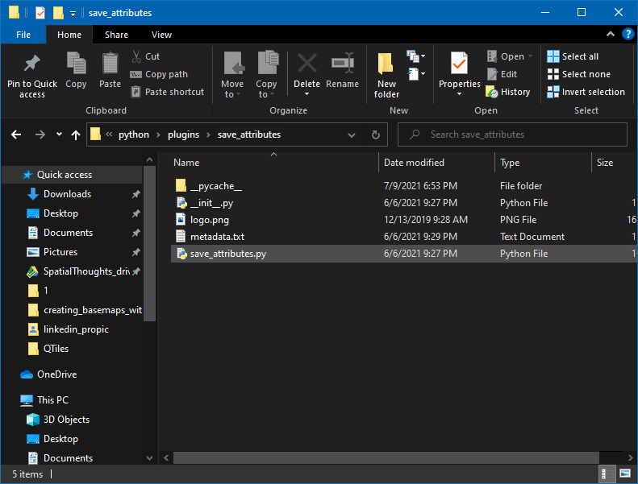
```

Restart QGIS. Go to  **Plugins &rarr; Manage and Install plugins... &rarr; Installed** and enable the **Save Attributes** plugin. You will see the menu entry and the toolbar icon from the plugin.


```{r echo=FALSE, fig.align='center', out.width='75%'}
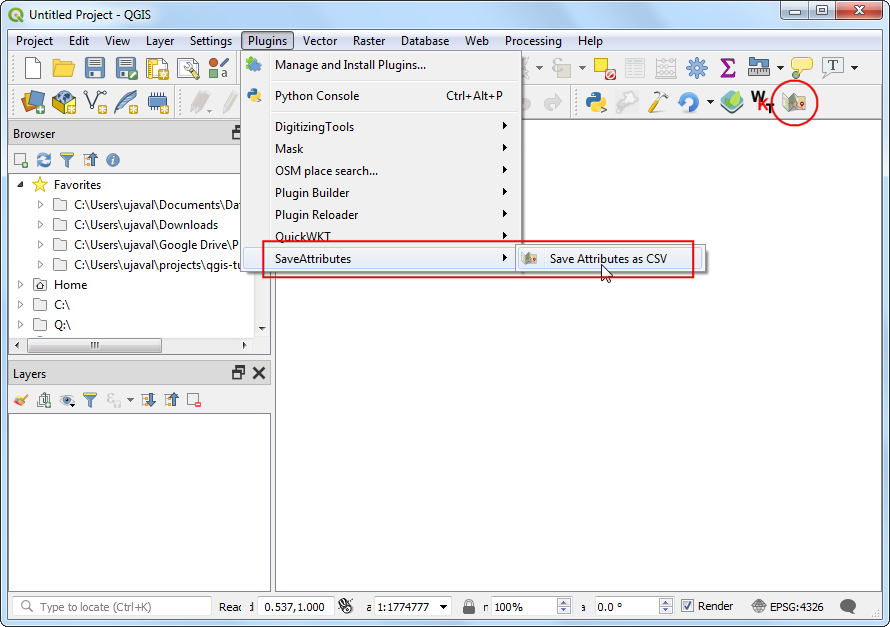
```

## Exercise 7

Take the minimal plugin template from above and build a new plugin called **Show Time**. This plugin will add a button to the Plugin Toolbar which will display the current time when clicked. The code to add such a button is already covered in the **Add a button to a toolbar** section.exer

## 15.2 Processing Plugin

The new and preferred way to write plugins in QGIS is using the Processing Framework. It removes the need for you to design the user interface. The resulting plugin integrates seamlessly in the Processing Toolbox and is inoperable with other processing algorithms.

Let's take the minimal plugin and see what is required to make it a functional processing plugin. We need 2 additional files. One to define the processing algorithm and another to define a new processing provider. 

The processing algorithm file is identical to the script we wrote earlier. Create a new file called `save_attributes_algorithm.py` with the contents of the processing script from the 'Writing a Processing Script' section of this document.

Next, we need to define a new processing provider. Create a new file `save_attributes_provider.py` with the following content.

`save_attributes_provider.py`
```{python eval=FALSE, code=readLines('code/pyqgis/processing/save_attributes_provider.py')}
```

We now make changes to the existing `save_attributes.py` file to import and initialize the new processing provider. Change the contents of the file to the following

`save_attributes.py`
```{python eval=FALSE, code=readLines('code/pyqgis/processing/save_attributes.py')}
```

The plugin folder should look like below. 

```{r echo=FALSE, fig.align='center', out.width='75%'}
knitr::include_graphics('images/pyqgis/pluginprocessingfiles.png')
```

Now let's reload the plugin and see what it looks like. This is a helper plugin which allows iterative development of plugins. Using this plugin, you can change your plugin code and have it reflected in QGIS without having to restart QGIS every time. Find and install the **Plugin Reloader** plugin. Once installed, go to **Plugin  &rarr; Plugin Reloader &rarr; Choose a plugin to be reloaded**. Select `save_attributes` in the Configure Plugin reloader dialog.


```{r echo=FALSE, fig.align='center', out.width='75%'}
knitr::include_graphics('images/pyqgis/pluginprocessingreload.png')
```

Once reloaded, you can click on the toolbar button or **Plugin  &rarr; Save Attributes &rarr; Save Attributes As CSV** to launch the processing algorithm.

```{r echo=FALSE, fig.align='center', out.width='75%'}
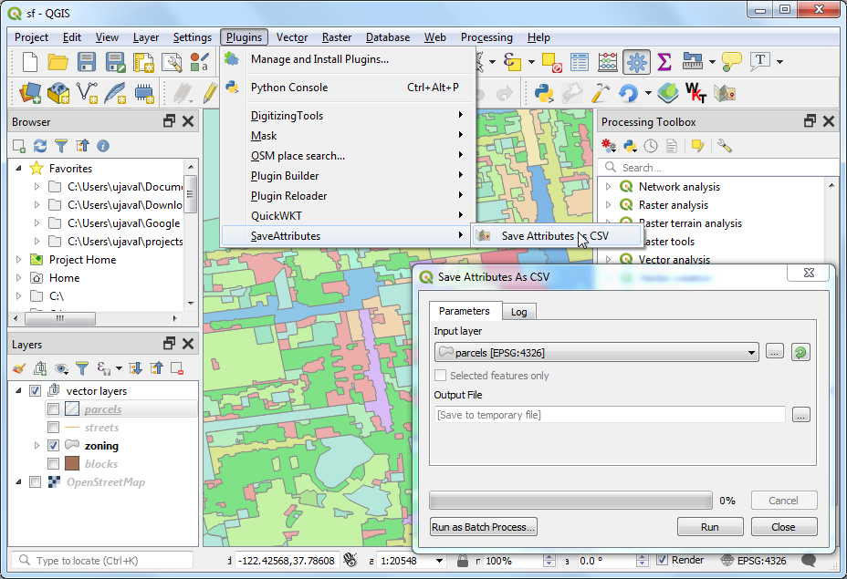
```

# 16. Supplement

This section contains code snippets for common PyQGIS operations.

All code snipets assume you have loaded the `sf.qgz` project. You can load the project using the code below.

```{python eval=FALSE}
import os
data_dir = os.path.join(os.path.expanduser('~'), 'Downloads', 'pyqgis_in_a_day')
project = QgsProject.instance()
project_name = 'sf.qgz'
project_path = os.path.join(data_dir, project_name)
project.read(project_path)
```

## Save Map Rendering as an Image

`saveAsImage()` method is quick and easy, but you do not have much control over the resulting image. You can't control the resolution, size or how each layer will be rendered. There is another way to achieve this. You can look at the code for exporting map as an image in QGIS and you will discover 2 classes `QgsMapRendererParallelJob` and `QgsMapRendererSequentialJob` that lets you achieve a better result. The code snippet below exports a hi-resolution image of the project. [^5]

[^5]: Code reference https://github.com/qgis/QGIS/blob/8a3c7b14c367771d096b4a6d006aa3c4b1017dd5/tests/src/python/utilities.py

```{python eval=FALSE}
import os
data_dir = os.path.join(os.path.expanduser('~'), 'Downloads', 'pyqgis_in_a_day')
image_name = 'sf_hires.png'
image_path = os.path.join(data_dir, image_name)

settings = iface.mapCanvas().mapSettings()
settings.setOutputSize(QSize(1000,1000))

settings.setFlag(QgsMapSettings.DrawLabeling, False)
settings.setFlag(QgsMapSettings.Antialiasing, True)

job = QgsMapRendererSequentialJob(settings)
job.start()
job.waitForFinished()
image = job.renderedImage()
image.save(image_path)
```

```{r echo=FALSE, fig.align='center', out.width='75%'}
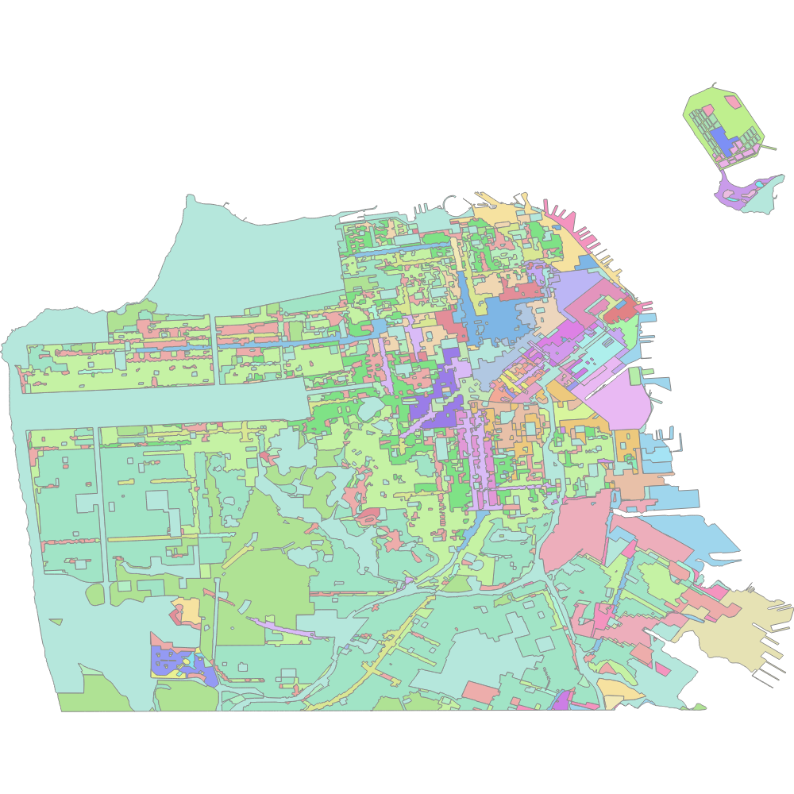
```

## Get all Layers

```{python eval=FALSE}
for layer in QgsProject.instance().mapLayers().values():
	print(layer.name())
```

## Get only checked (visible) Layers

```{python eval=FALSE}
for layer in iface.mapCanvas().layers():
	print(layer.name())
```

## Get only selected Layers

```{python eval=FALSE}
for layer in iface.layerTreeView().selectedLayers():
  print(layer.name())
```

## Set Canvas Extent to a Layer Extent

Select one of the layers in the *Layers* panel and run the following code.

```{python eval=FALSE}
layer = iface.activeLayer()
mc = iface.mapCanvas()
mc.setExtent(layer.extent())
mc.refresh()
```

## Get Layers with Hierarchy

This code snippet is taken from the [Cheat Sheet for PyQGIS](https://docs.qgis.org/testing/en/docs/pyqgis_developer_cookbook/cheat_sheet.html) , but contains an important modification. If you notice carefully, the function `getGroupLayers` is called recursively from within `getGroupLayers`. This allows one to even get layers that have sub-groups within layer groups.

```{python eval=FALSE}
def getGroupLayers(group):
    print('- group:' + group.name())
    for child in group.children():
        if isinstance(child, QgsLayerTreeGroup):
            getGroupLayers(child)
        else:
            print('  - layer:' + child.name())


root = QgsProject.instance().layerTreeRoot()
for child in root.children():
    if isinstance(child, QgsLayerTreeGroup):
        getGroupLayers(child)
    elif isinstance(child, QgsLayerTreeLayer):
        print ("- layer: " + child.name())
```

```{r echo=FALSE, fig.align='center', out.width='50%'}
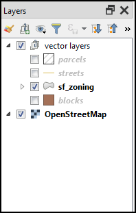
```

## Remove a Specific Button from a Toolbar

The following code snippet shows how once can find names of different widget in the QGIS Application and locate specific toolbars and button. The following code will disable to *Deselect All Features from Layers* button from the *Selection Toolbar*.

```{python eval=FALSE}
# Find all child objects of the mainWindow that are type QToolbar
for x in iface.mainWindow().findChildren(QToolBar): 
    print(x.objectName())
    
# In the printed list, we observe that 
# the selection toolbar is named mSelectionToolBar
# Get a reference to it by name
selectionToolbar = iface.mainWindow().findChild(QToolBar,'mSelectionToolBar')

# Find the buttons on the toolbar
for x in selectionToolbar.findChildren(QAction):
    print(x.objectName())

# Alternatively, you can also use the following
for x in selectionToolbar.actions():
    print(x.objectName())

# If the toolbar button is not an action, you
# We know the name of the deselection button 
# Get a reference to it by name
deselection = selectionToolbar.findChild(QAction,'ActionDeselection')

# We can disable a widget by calling setEnabled(False)
deselection.setEnabled(False)

# We can remove it completely by calling removeAction()
selectionToolbar.removeAction(deselection)
```

## Add a Drop-down Menu to Toolbar

This example shows how to add a `QCombobox` widget to a toolbar and populate it with attribute values from a layer. On click of the button, the selection is read from the combo box and used to apply a filter to the layer

> You must have a layer with an attribute called **NAME** for this example to work. Tested with the [Natural Earth Admin 0 - Countries](https://www.naturalearthdata.com/downloads/10m-cultural-vectors/) layer.

```{python eval=FALSE}
toolBar = iface.addToolBar("My Toolbar")
toolBar.setObjectName("My Toolbar")

countryCombo = QComboBox(toolBar)
toolBar.addWidget(countryCombo)
countryCombo.setToolTip("Select a country")


filterButton = QPushButton('Filter')
filterButton.setToolTip('Filter')
toolBar.addWidget(filterButton)

resetButton = QPushButton('Reset')
resetButton.setToolTip('Reset')
toolBar.addWidget(resetButton)

# We want to sort the layer by country names
# configure QgsFeatureRequest and use it with getFeatures()
request = QgsFeatureRequest()
clause = QgsFeatureRequest.OrderByClause('NAME')
orderby = QgsFeatureRequest.OrderBy([clause])
request.setOrderBy(orderby)
layer = iface.activeLayer()

# Read the country names and save in a list
countries = []
for f in layer.getFeatures(request):
  countries.append(f['NAME'])

# Add items to the combobox
for country in countries:
    countryCombo.addItem(country)

# Define functions to apply and reset filters
def filter_layer():
    layer = iface.activeLayer()
    country = countryCombo.currentText()
    expression = '\"NAME\" = \'{}\''.format(country)
    layer.setSubsetString(expression)

def reset_layer():
    layer = iface.activeLayer()
    layer.setSubsetString('')
    countryCombo.clear()
    for country in countries:
      countryCombo.addItem(country)
      
filterButton.clicked.connect(filter_layer)
resetButton.clicked.connect(reset_layer)
```

## Adding CSV Layers

```{python eval=FALSE}
import os
data_dir = os.path.join(os.path.expanduser('~'), 'Downloads', 'pyqgis_in_a_day')

filename = 'trees.csv'
csvpath = 'file:///' + data_dir + filename
uri = '{}?type=csv&xField={}&yField={}&crs={}'.format(
  csvpath, 'Longitude', 'Latitude', 'EPSG:4326')
iface.addVectorLayer(uri, 'trees', 'delimitedtext')
```

## Inserting Layers in the Layer Tree

We can use the `QgsLayerTree` class to insert the layer at an appropriate place.

```{python eval=FALSE}
import os
data_dir = os.path.join(os.path.expanduser('~'), 'Downloads', 'pyqgis_in_a_day')

filename = 'srtm.tif'
uri = os.path.join(data_dir, filename)
rlayer = QgsRasterLayer(uri, 'srtm', 'gdal')

rastergroup = QgsLayerTreeGroup('raster layers')
treelayer = QgsLayerTreeLayer(rlayer)
rastergroup.insertChildNode(0, treelayer)

root = QgsProject.instance().layerTreeRoot()
root.insertChildNode(1, rastergroup)
```

```{r echo=FALSE, fig.align='center', out.width='50%'}
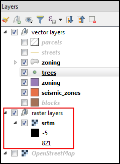
```

## Create a New Vector Layer

A simple example showing how to create a point layer with 1 feature and 1 attribute. [^7]

[^7]: Code reference https://anitagraser.com/pyqgis-101-introduction-to-qgis-python-programming-for-non-programmers/pyqgis101-creating-editing-a-new-vector-layer/

```{python eval=FALSE}
vlayer = QgsVectorLayer('Point?crs=EPSG:4326', 'point', 'memory')

provider = vlayer.dataProvider()
provider.addAttributes([QgsField('name', QVariant.String)])
vlayer.updateFields() 
f = QgsFeature()
f.setGeometry(QgsGeometry.fromPointXY(QgsPointXY(-122.41, 37.77)))
f.setAttributes(['San Francisco'])
provider.addFeature(f)
vlayer.updateExtents() 
QgsProject.instance().addMapLayer(vlayer)
```

## Saving Layers to Disk

Use the `QgsRasterFileWriter` or `QgsVectorFileWriter` classes for writing layers to disk. [^6]

[^6]: Code reference https://gis.stackexchange.com/questions/285346/add-layers-to-geopackage-using-pyqgis-qgis-3

```{python eval=FALSE}
import os
data_dir = os.path.join(os.path.expanduser('~'), 'Downloads', 'pyqgis_in_a_day')

options = QgsVectorFileWriter.SaveVectorOptions()
options.actionOnExistingFile = QgsVectorFileWriter.CreateOrOverwriteLayer 
options.layerName = 'point'

filename = 'sf.gpkg'
path = os.path.join(data_dir, filename)
QgsVectorFileWriter.writeAsVectorFormat(vlayer, path, options)
```

## Displaying a label with a background color

This is a vast topic, but you can get a taste of the flexibility offered by the API to control all aspects of labeling. Notice the class name `QgsPalLayerSettings` - this is because QGIS uses a labeling library called [PAL](http://pal.heig-vd.ch/index.php?page=about-pal) for labels. The code snippet below shows how to create a label for a point layer with a background color. [^8]

[^8]: Code reference https://gis.stackexchange.com/questions/292136/qgspallayersettings-error/294019

```{python eval=FALSE}
vlayer = QgsProject.instance().mapLayersByName('point')[0]
symbol = QgsMarkerSymbol.createSimple({'name': 'square', 'color': 'red'})
vlayer.renderer().setSymbol(symbol)

label_settings = QgsPalLayerSettings()
#label_settings.drawBackground = True
label_settings.fieldName = 'name'

text_format = QgsTextFormat()
background_color = QgsTextBackgroundSettings()
background_color.setFillColor(QColor('white'))
background_color.setEnabled(True)
text_format.setBackground(background_color )
label_settings.setFormat(text_format)

vlayer.setLabeling(QgsVectorLayerSimpleLabeling(label_settings))
vlayer.setLabelsEnabled(True)
vlayer.triggerRepaint()
```

```{r echo=FALSE, fig.align='center', out.width='75%'}
knitr::include_graphics('images/pyqgis/label.png')
```

## Edit Attribute Table of a Vector Layer

When you use processing, a new layer is created by each algorithm. This example shows, how to use processing to overwrite the original layer with the results of processing.

```{python eval=FALSE}
import os
data_dir = os.path.join(os.path.expanduser('~'), 'Downloads', 'pyqgis_in_a_day')

filename = 'sf.gpkg|layername=blocks'
uri = os.path.join(data_dir, filename)
blocks = QgsVectorLayer(uri, 'blocks', 'ogr')

output = processing.run(
    "qgis:deletecolumn", 
    {'INPUT': blocks,'COLUMN':['multigeom'],'OUTPUT':'memory:'})
outputlayer = output['OUTPUT']

final = processing.run("qgis:fieldcalculator",
    {'INPUT':outputlayer,
    'FIELD_NAME':'area',
    'FIELD_TYPE':0,
    'FIELD_LENGTH':10,
    'FIELD_PRECISION':3,
    'NEW_FIELD':True,
    'FORMULA':'$area',
    'OUTPUT':'memory:'})
finallayer = final['OUTPUT']

options = QgsVectorFileWriter.SaveVectorOptions()
# We overwrite the original layer
options.layerName = 'blocks'
options.actionOnExistingFile = QgsVectorFileWriter.CreateOrOverwriteLayer 

output_file = 'sf.gpkg'
output_path = os.path.join(data_dir, output_file)
QgsVectorFileWriter.writeAsVectorFormat(finallayer, output_path, options)
QgsProject.instance().reloadAllLayers()
```


## Creating a PDF with Title


```{r echo=FALSE, fig.align='center', out.width='75%'}
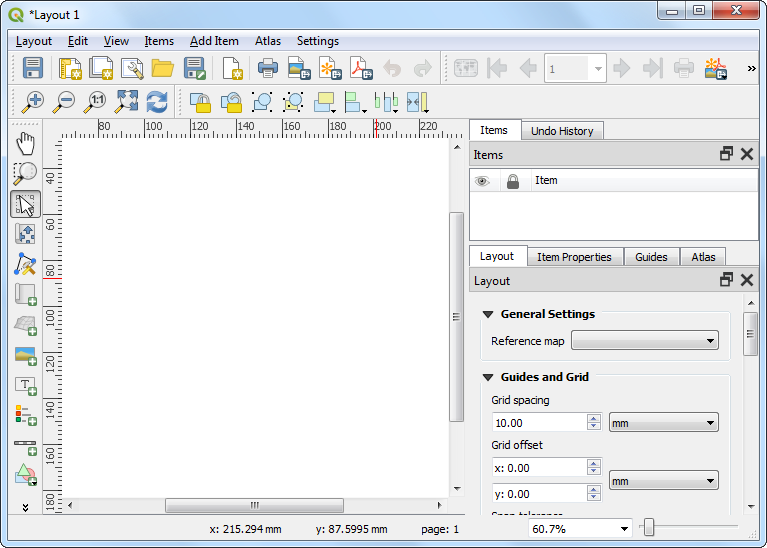
```

```{python eval=FALSE}
import os
data_dir = os.path.join(os.path.expanduser('~'), 'Downloads', 'pyqgis_in_a_day')

project = QgsProject.instance()
extent = QgsRectangle(-122.52, 37.71, -122.35, 37.83)

layout = QgsPrintLayout(project)
layout.initializeDefaults()

pages = layout.pageCollection()
pages.beginPageSizeChange()
page = pages.page(0)
page.setPageSize('A4',  QgsLayoutItemPage.Landscape)
pages.endPageSizeChange()
page_center = page.pageSize().width() / 2


map = QgsLayoutItemMap(layout)
map.setRect(QRectF(-122.52, 37.71, -122.35, 37.83))
map.setExtent(extent)
a4 = QPageSize().size(QPageSize.A4, QPageSize.Millimeter)
map.attemptResize(QgsLayoutSize(a4.height(),  a4.width()))

layout.addItem(map)
title = QgsLayoutItemLabel(layout)
title.setText('San Francisco')
title.setFont(QFont('Arial', 36))
title.adjustSizeToText()
title.setReferencePoint(QgsLayoutItem.UpperMiddle)
title.attemptMove(QgsLayoutPoint(page_center, 10))
layout.addItem(title)

output_file = 'sf.pdf'
output_path = os.path.join(data_dir, output_file)

exporter = QgsLayoutExporter(layout)
exporter.exportToPdf(
    output_path, QgsLayoutExporter.PdfExportSettings())
```

```{r echo=FALSE, fig.align='center', out.width='75%'}
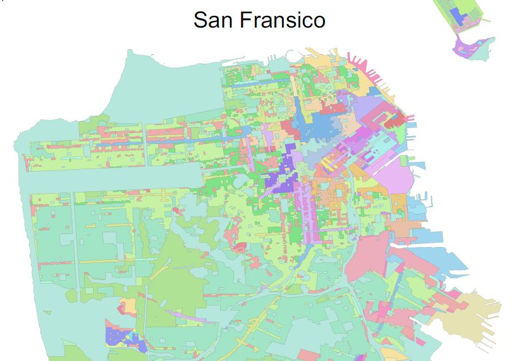
```


# Resources for Further Learning
* Official QGIS Documentation - [PyQGIS Developer Cookbook](https://docs.qgis.org/testing/en/docs/pyqgis_developer_cookbook/)
* [PyQGIS 101: Introduction to QGIS Python programming for non-programmers](https://anitagraser.com/pyqgis-101-introduction-to-qgis-python-programming-for-non-programmers/) by Anita Graser
* [PyQGIS Samples](https://webgeodatavore.github.io/pyqgis-samples/) by Thomas Gratier

# Data Credits

* `blocks`, `parcels`, `streets`, `zoning`, `trees`, `seasmic_zones`, `shoreline`. Downloaded from [DataSF Open Data Portal](https://datasf.org/opendata/)
* `srtm` NASA Shuttle Radar Topography Mission Global 1 arc second provided by The Land Processes Distributed Active Archive Center (LP DAAC). Downloaded using [30-Meter SRTM Tile Downloader](https://dwtkns.com/srtm30m/)
* `aoi`: CA Places Boundaries from 2016 TIGER/Line Shapefiles. Downloaded from [California Open Data Portal](https://data.ca.gov/dataset/ca-geographic-boundaries)
* `populated_places`: Made with Natural Earth. Free vector and raster map data @ [naturalearthdata.com](https://www.naturalearthdata.com/)

# License


This course material is licensed under a [Creative Commons Attribution-NonCommercial 4.0 International License](https://creativecommons.org/licenses/by-nc/4.0/). You are free to use the material for any non-commercial purpose. Kindly give appropriate credit to the original author.

<!--
This material is part of the *Trainer's Package* and the buyer gets a non-exclusive, non-transferable, perpetual license to the material. You can fully customise and brand the materials to your requirements.
-->


&copy; 2020 Ujaval Gandhi [www.spatialthoughts.com](https://spatialthoughts.com)

***

**This course is offered as an instructor-led online class. Visit [Spatial Thoughts](https://spatialthoughts.com/events/) to know details of upcoming sessions.**