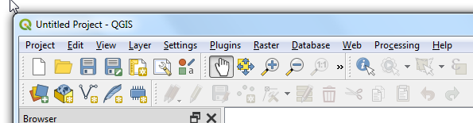
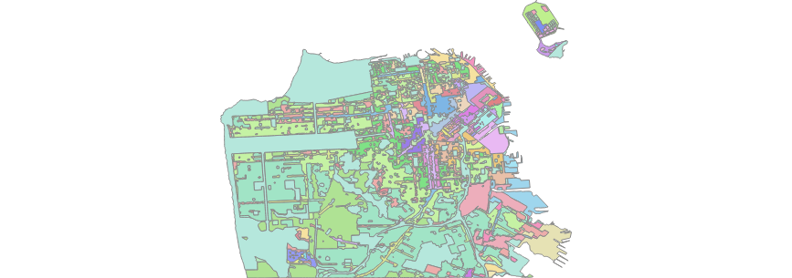
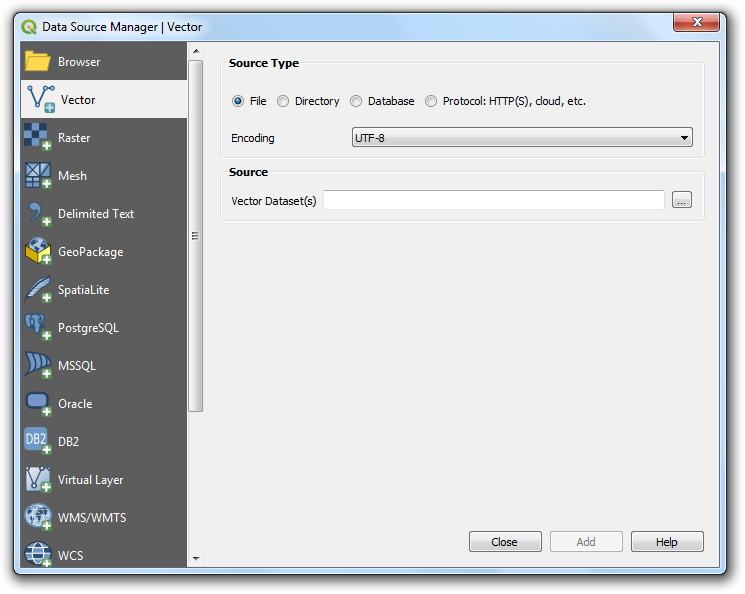
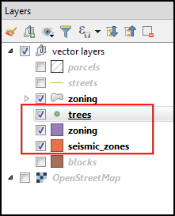
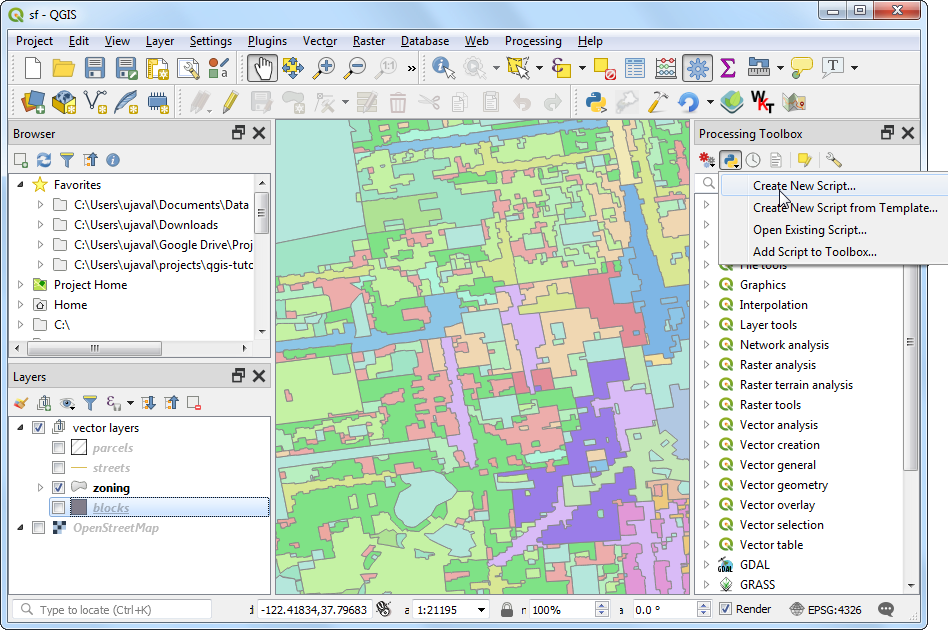
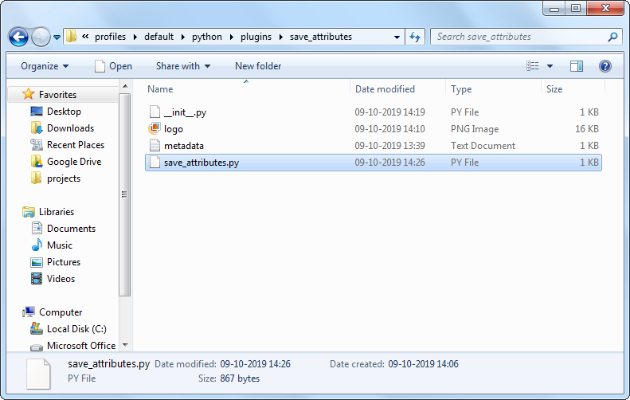
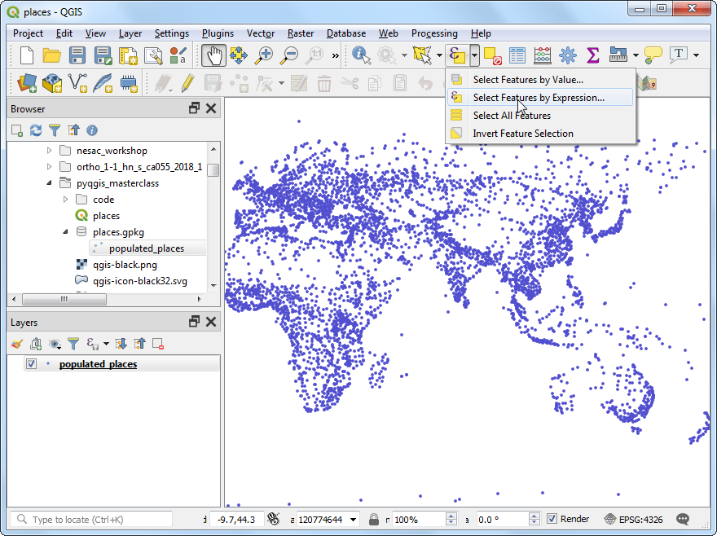

This course is also offered as a in-person class. Please visit [www.spatialthoughts.com](http://www.spatialtohughts.com) to see the schedule for upcoming sessions.

\newpage

# Introduction 

This class introduces the concepts of Python programming within the QGIS environment. We will cover the full breadth of topics that involve everything from using the Python Console to building a fully functional plugin. We will also explore GUI programming techniques for customizing the QGIS interface using Qt widgets.


# Get the Data Package
The code examples in this class use a variety of datasets. All the required layers, project files, icons etc. are available in the `pyqgis_masterclass.zip`. Download and unzip this file to `F:\Data\pyqgis_masterclass` directory. 

# Where can you use Python in QGIS?

- Issue commands from Python Console
- Write custom expressions
- Write custom actions
- Create new processing algorithms
- Create plugins
- Automatically run python code when QGIS starts
- Create custom standalone applications

# Qt, PyQt and PyQGIS

## Qt

[Qt](https://www.qt.io/) is a free and open-source widget toolkit for creating graphical user interfaces as well as cross-platform applications.

QGIS is built using the Qt platform. Both QT and QGIS itself have well-documented APIs that should be used when writing Python code to be run within QGIS.

## PyQt

[PyQt](https://wiki.python.org/moin/PyQt) is the Python interface to Qt. PyQt provides classes and functions to interact with Qt widgets.

## PyQGIS

QGIS provides a Python API (Application Programming Interface), commonly known as PyQGIS. 
[PyQGIS](https://docs.qgis.org/testing/en/docs/pyqgis_developer_cookbook/) is created using SIP and integrates with PyQt.

> **_Fun Fact:_**  Most QGIS class names start with the prefix *Qgs*. **Q** is for QT and **gs** stands for Gary Sherman - the founder of the QGIS project.

C++ API documentation is available at https://qgis.org/api/

Python API documentation is available at https://qgis.org/pyqgis/3.0

Both C++ and Python APIs are identical for most part, but certain functions are not available in the Python API. [^1]

[^1]: See https://qgis.org/api/3.4/classQgsProject.html

# Hello World!

QGIS Comes with a built-in **Python Console** and a code editor where you can write and run Python code.

Go to **Plugins &rarr; Python Console** to open the console.

```{r echo=FALSE, fig.align='center'}
knitr::include_graphics('images/console.png')
```

At the `>>>` prompt, type in the following command and press Enter.

```
print('Hello World!')
```

Here you are running Python's *print()* function with the text 'Hello World'. The output of the statement will be printed below.

```{r echo=FALSE, fig.align='center'}
knitr::include_graphics('images/helloworld.png')
```

While console is useful for typing 1-2 lines of code or printing information contained in a variable, you should use the built-in editor for typing longer scripts or code snippets. Click the *Show Editor* button to open the editor panel. Enter the code and click the *Run Script* button to execute it. The results will appear in the console as before. If you are working on a longer script, you can also click the *Save* button in the editor to save the script for future use.

```{r echo=FALSE, fig.align='center'}
knitr::include_graphics('images/editor.png')
```

# Understanding Classes

Before we dive it to PyQGIS, it is important to understand certain concepts related to C++ and Python Classes. Qt as well as QGIS is written in C++ language. Functionality of each Qt/QGIS Widget is implemented as a class - having certain properties and functions. When we use PyQt or PyQGIS classes, it is executing the code in the C++ classes via the python bindings.

## Classes vs Objects

A class can be thought of as a template. You cannot use it directly. To use it in a program, you must create an 'instance' of it - which uses the template along with the supplied parameters to create an instance of the class. This is known as an object.

```
mb = QMessageBox()
```
The `QMessageBox` is a PyQt class for creating a dialog with buttons. To use the class, you create object by *instantiating* the class. Here `mb` is an object, which is an instance of the `QMessageBox` class, created using the default parameters.

## Inspecting Objects

`type()` tells you what is the class of the object
```
type(mb)
```

`dir` returns list of the attributes and methods of any object
```
dir(mb)
```

## Methods (or functions)

Classes have methods that provide functionality. You can run the class methods on instance objects. For the `QMessageBox` class, `setText()` method will add a text to the dialog.

```
mb = QMessageBox()
mb.setText('Click OK to confirm')
```

## Instance Attributes

Classes have 2 types of attributes - class attributes and instance attributes. Qt provides access functions for instance attributes. For the `QMessageBox` class, there is a `text()` method to get the text attribute of the mb instance.

```
mb = QMessageBox()
mb.setText('Click OK to confirm')
print(mb.text())
```

## Class Attributes

Classes also have class attributes which are shared across all instances.
The `QMessageBox` class has `Ok` and `Cancel` attributes, which can be referred using  `QMessageBox.Ok` and `QMessageBox.Cancel`.

```
mb = QMessageBox()
mb.setText('Click OK to confirm')
mb.setStandardButtons(QMessageBox.Ok | QMessageBox.Cancel)
```

## Inheritance

`QObject` is the most basic class in Qt. All Qt widgets and QGIS classes inherit from QObject. The most basic widget is the QWidget. `QWidget` contains most properties that are used to describe a window, or a widget, like position and size, mouse cursor, tooltips, etc. The `QDialog` class is the base class of dialog windows. `QMessageBox` is a specialized QDialog. 


```{r echo=FALSE, out.width='300px', fig.align='center'}
knitr::include_graphics('images/inheritance.png')
```

## Putting it all together

Try out this simple example which constructs a confirmation dialog using PyQt. You can type the code in the **Editor** and click **Run Script**.

```
mb = QMessageBox()
mb.setText('Click OK to confirm')
mb.setStandardButtons(QMessageBox.Ok | QMessageBox.Cancel)
mb.exec()
```

```{r echo=FALSE, fig.align='center'}
knitr::include_graphics('images/messagebox.png')
```

# Visual Tour of the PyQGIS API

The `QgisInterface` class provides methods for interaction with the QGIS environment. When QGIS is running, a variable called `iface` is set up to provide an object of the class `QgisInterface` to interact with the running QGIS environment. This interface allows access to the map canvas, menus, toolbars and other parts of the QGIS application. Python Console and Plugins can use `iface` to access various parts of the QGIS interface.

## QGIS Main Window

**`iface.mainWindow()`**

```{r echo=FALSE, fig.align='center'}
knitr::include_graphics('images/mainwindow1.png')
```

### Change Title

```
title = iface.mainWindow().windowTitle()
new_title = title.replace('QGIS', 'My QGIS')
iface.mainWindow().setWindowTitle(new_title)
```

### Change Icon

```
icon_path = 'F:/Data/pyqgis_masterclass/qgis-black.png'
icon = QIcon(icon_path)
iface.mainWindow().setWindowIcon(icon)
```

```{r echo=FALSE, fig.align='center'}
knitr::include_graphics('images/mainwindow2.png')
```

## Menus

**`iface.projectMenu()`**

**`iface.vectorMenu()`**

**`iface.viewMenu()`**

**`iface.helpMenu()`**

**...**


```{r echo=FALSE, fig.align='center'}
knitr::include_graphics('images/menu1.png')
```

### Remove Raster and Vector Menus

```
vector_menu = iface.vectorMenu()
raster_menu = iface.rasterMenu()
menubar = vector_menu.parentWidget()
menubar.removeAction(vector_menu.menuAction())
menubar.removeAction(raster_menu.menuAction())
```

```{r echo=FALSE, fig.align='center'}
knitr::include_graphics('images/menu2.1.png')
```

```{r echo=FALSE, fig.align='center'}

```

### Add A New Menu Item

#### Signals and Slots

GUI programming requires responding to user’s actions. All objects in Qt have a mechanism where they can emit a signal when there is a change in status. i.e. when a user *clicks* a button, or a window is *closed*. As a programmer, you can connect the signal to a slot (i.e. a python function) which will be called when the signal is emitted. The general syntax for connecting the signal to a slot is as follows

```
object.signal.connect(function)
```

A new button or menu item is created using `QAction()`. Here we create an action and then connect the *click* signal to a method that opens a website.

```
import webbrowser

def open_website():
    webbrowser.open('https://gis.stackexchange.com')

website_action = QAction('Go to gis.stackexchange')
website_action.triggered.connect(open_website)
iface.helpMenu().addSeparator()
iface.helpMenu().addAction(website_action)
```

```{r echo=FALSE, fig.align='center'}
knitr::include_graphics('images/menu3.png')
```

## Toolbars

**`iface.pluginToolBar()`**

**`iface.attributesToolBar()`**

**`iface.mapNavToolToolBar()`**

**...**


```{r echo=FALSE, fig.align='center'}
knitr::include_graphics('images/toolbar.png')
```

### Change Visibility of a Toolbar

```
iface.pluginToolBar().setVisible(True)
```

### Add a button to a toolbar

```
from datetime import datetime

icon_path = 'F:/Data/pyqgis_masterclass/question.svg'

def show_time():
    now = datetime.now()
    current_time = now.strftime("%H:%M:%S")
    iface.messageBar().pushMessage('Time is {}'.format(current_time))
    
action = QAction('Show Time')
action.triggered.connect(show_time)
action.setIcon(QIcon(icon_path))
iface.addToolBarIcon(action)
```


```{r echo=FALSE, fig.align='center'}
knitr::include_graphics('images/toolbar2.png')
```

## Projects

**`QgsProject.instance()`**

### Load a project

```
project = QgsProject.instance()
project.read('F:/Data/pyqgis_masterclass/sf.qgz')
```

```{r echo=FALSE, fig.align='center'}
knitr::include_graphics('images/project.png')
```

## Map Canvas

**`iface.mapCanvas()`**

```{r echo=FALSE, fig.align='center'}
knitr::include_graphics('images/mapcanvas.png')
```

### Set Canvas Extent to a Layer Extent

```
layer = iface.activeLayer()
mc = iface.mapCanvas()
mc.setExtent(layer.extent())
mc.refresh()
```

### Save Map as an Image

```
mc = iface.mapCanvas()
mc.saveAsImage('F:/Data/pyqgis_masterclass/sf.png')
```

```{r echo=FALSE, fig.align='center'}

```

### Save Map Rendering as an Image

```
settings = iface.mapCanvas().mapSettings()
settings.setOutputSize(QSize(1000,1000))

settings.setFlag(QgsMapSettings.DrawLabeling, False)
settings.setFlag(QgsMapSettings.Antialiasing, True)

job = QgsMapRendererSequentialJob(settings)
job.start()
job.waitForFinished()
image = job.renderedImage()
image.save('F:/Data/pyqgis_masterclass/sf_hires.png')
```

```{r echo=FALSE, fig.align='center'}
knitr::include_graphics('images/sf_hires.png')
```

## Layers Panel / Table of Contents (TOC)

**`iface.activeLayer()`**

**`iface.layerTreeView()`**

**`iface.mapCanvas().layers()`**

**`QgsProject.instance().mapLayers()`**

**`QgsProject.instance().layerTreeRoot()`**

```{r echo=FALSE, fig.align='center'}
knitr::include_graphics('images/layerspanel.png')
```

### Change name of a Layer

```
layer = iface.activeLayer()
name = layer.name()
layer.setName('sf_' + name)
```

### Get all Layers

```
for layer in QgsProject.instance().mapLayers().values():
	print(layer.name())
```

### Get only checked (visible) Layers

```
for layer in iface.mapCanvas().layers():
	print(layer.name())
```

### Get only selected Layers

```
for layer in iface.layerTreeView().selectedLayers():
  print(layer.name())
```

### Get Layers with Hierarchy

```
def getGroupLayers(group):
    print('- group:' + group.name())
    for child in group.children():
        if isinstance(child, QgsLayerTreeGroup):
            getGroupLayers(child)
        else:
            print('  - layer:' + child.name())


root = QgsProject.instance().layerTreeRoot()
for child in root.children():
    if isinstance(child, QgsLayerTreeGroup):
        getGroupLayers(child)
    elif isinstance(child, QgsLayerTreeLayer):
        print ("- layer: " + child.name())
```

```{r echo=FALSE, fig.align='center'}

```

## Adding Data Sources

**`iface.addRasterLayer()`**

**`iface.addVectorLayer()`**

**..**

**`QgsProject.instance().addMapLayer()`**

**`QgsProject.instance().addMapLayers()`**

```{r echo=FALSE, fig.align='center'}

```

Data sources are identified by an URI (Uniform Resource Identifier)
- For files on computer the URI is the file path
- For databases, the URI is constructed using QgsDataSourceUri() class and encodes,the database path, table, username, password etc.
- For web layers, such as WMF/WFS etc, the URI is the web URL

### Adding Vector Layers

```
uri = 'F:/Data/pyqgis_masterclass/seismic_zones.shp'
iface.addVectorLayer(uri, 'seismic_zones', 'ogr')

uri = 'F:/Data/pyqgis_masterclass/sf.gpkg|layername=zoning'
iface.addVectorLayer(uri, 'zoning', 'ogr')

csvpath = 'file:///F:/Data/pyqgis_masterclass/trees.csv'
uri = '{}?type=csv&xField={}&yField={}&crs={}'.format(
  csvpath, 'Longitude', 'Latitude', 'EPSG:4326')
iface.addVectorLayer(uri, 'trees', 'delimitedtext')
```

```{r echo=FALSE, fig.align='center'}

```

### Adding Raster Layers

`iface.addRasterLayer()` will not give you control on where the layer will be inserted in the layer tree. We can instead use `QgsLayerTree` class to insert the layer at an appropriate place.

```
uri = 'GPKG:F:/Data/pyqgis_masterclass/sf.gpkg:srtm'
rlayer = QgsRasterLayer(uri, 'srtm', 'gdal')
QgsProject.instance().addMapLayer(rlayer, False)

rastergroup = QgsLayerTreeGroup('raster layers')
treelayer = QgsLayerTreeLayer(rlayer)
rastergroup.insertChildNode(0, treelayer)

root = QgsProject.instance().layerTreeRoot()
root.insertChildNode(1, rastergroup)
```

```{r echo=FALSE, fig.align='center'}
knitr::include_graphics('images/rasterlayer.png')
```

### Searching for a layer

```
blocks = QgsProject.instance().mapLayersByName('blocks')[0]
```

### Turning a layer on/off

```
QgsProject.instance().layerTreeRoot().findLayer(blocks.id()).setItemVisibilityChecked(True)
```

### Create a New Vector Layer

```
vlayer = QgsVectorLayer('Point?crs=EPSG:4326', 'point', 'memory')

provider = vlayer.dataProvider()
provider.addAttributes([QgsField('name', QVariant.String)])
vlayer.updateFields() 
f = QgsFeature()
f.setGeometry(QgsGeometry.fromPointXY(QgsPointXY(-122.41, 37.77)))
f.setAttributes(['San Francisco'])
provider.addFeature(f)
vlayer.updateExtents() 
QgsProject.instance().addMapLayer(vlayer)
```

### Saving Layers to Disk

```
options = QgsVectorFileWriter.SaveVectorOptions()
options.actionOnExistingFile = QgsVectorFileWriter.CreateOrOverwriteLayer 
options.layerName = 'point'

path = 'F:/Data/pyqgis_masterclass/sf.gpkg'
QgsVectorFileWriter.writeAsVectorFormat(vlayer, path, options)
```

## Symbology and Labeling


```{r echo=FALSE, fig.align='center'}
knitr::include_graphics('images/styling.png')
```

### Displaying a label with a background color

```
vlayer = QgsProject.instance().mapLayersByName('point')[0]
symbol = QgsMarkerSymbol.createSimple({'name': 'square', 'color': 'red'})
vlayer.renderer().setSymbol(symbol)

label_settings = QgsPalLayerSettings()
#label_settings.drawBackground = True
label_settings.fieldName = 'name'

text_format = QgsTextFormat()
background_color = QgsTextBackgroundSettings()
background_color.setFillColor(QColor('white'))
background_color.setEnabled(True)
text_format.setBackground(background_color )
label_settings.setFormat(text_format)

vlayer.setLabeling(QgsVectorLayerSimpleLabeling(label_settings))
vlayer.setLabelsEnabled(True)
vlayer.triggerRepaint()
```

```{r echo=FALSE, fig.align='center'}
knitr::include_graphics('images/label.png')
```

## Processing

While the PyQGIS API providers many functions to work with layers, features, attributes and geometry - it is a much better practice to use the built-in processing algorithms to alter the layers or do any analysis. This will give you better performance and result in much lesser code. Here are some examples on how to use processing algorithms from Python to do vector and raster layer editing.

```{r echo=FALSE, fig.align='center'}
knitr::include_graphics('images/processing.png')
```

### Get min/max value from a Raster Layer

```
uri = 'GPKG:F:/Data/pyqgis_masterclass/sf.gpkg:srtm'
rlayer = QgsRasterLayer(uri, 'srtm', 'gdal')

results = processing.run("qgis:rasterlayerstatistics", 
    {'INPUT': rlayer,'BAND':1})
print('min:{},max:{}'.format(results['MIN'], results['MAX']))
```

### Create a hillshade from a DEM

```
uri = 'GPKG:F:/Data/pyqgis_masterclass/sf.gpkg:srtm'
rlayer = QgsRasterLayer(uri, 'srtm', 'gdal')

results = processing.runAndLoadResults("qgis:hillshade", 
    {'INPUT': rlayer, 
    'Z_FACTOR':2,
    'AZIMUTH':300,
    'V_ANGLE':40,
    'OUTPUT':'c:/Users/ujaval/Desktop/hillshade.tif'})
print(results)
```

```{r echo=FALSE, fig.align='center'}
knitr::include_graphics('images/hillshade.png')
```

### Edit Attribute Table of a Vector Layer

When you use processing, a new layer is created by each algorithm. This example shows, how to use processing to overwrite the original layer with the results of processing.

```
uri = 'F:/Data/pyqgis_masterclass/sf.gpkg|layername=blocks'
blocks = QgsVectorLayer(uri, 'blocks', 'ogr')

output = processing.run(
    "qgis:deletecolumn", 
    {'INPUT': blocks,'COLUMN':['multigeom'],'OUTPUT':'memory:'})
outputlayer = output['OUTPUT']

final = processing.run("qgis:fieldcalculator",
    {'INPUT':outputlayer,
    'FIELD_NAME':'area',
    'FIELD_TYPE':0,
    'FIELD_LENGTH':10,
    'FIELD_PRECISION':3,
    'NEW_FIELD':True,
    'FORMULA':'$area',
    'OUTPUT':'memory:'})
finallayer = final['OUTPUT']

options = QgsVectorFileWriter.SaveVectorOptions()
# We overwrite the original layer
options.layerName = 'blocks'
options.actionOnExistingFile = QgsVectorFileWriter.CreateOrOverwriteLayer 


path = 'F:/Data/pyqgis_masterclass/sf.gpkg'
QgsVectorFileWriter.writeAsVectorFormat(finallayer, path, options)
QgsProject.instance().reloadAllLayers()
```

## Print Layouts

```{r echo=FALSE, fig.align='center'}
knitr::include_graphics('images/layout.png')
```

### Creating a PDF with Title

```
project = QgsProject.instance()
extent = QgsRectangle(-122.52, 37.71, -122.35, 37.83)

layout = QgsPrintLayout(project)
layout.initializeDefaults()

pages = layout.pageCollection()
pages.beginPageSizeChange()
page = pages.page(0)
page.setPageSize('A4',  QgsLayoutItemPage.Landscape)
pages.endPageSizeChange()
page_center = page.pageSize().width() / 2


map = QgsLayoutItemMap(layout)
map.setRect(QRectF(-122.52, 37.71, -122.35, 37.83))
map.setExtent(extent)
a4 = QPageSize().size(QPageSize.A4, QPageSize.Millimeter)
map.attemptResize(QgsLayoutSize(a4.height(),  a4.width()))

layout.addItem(map)
title = QgsLayoutItemLabel(layout)
title.setText('San Francisco')
title.setFont(QFont('Arial', 36))
title.adjustSizeToText()
title.setReferencePoint(QgsLayoutItem.UpperMiddle)
title.attemptMove(QgsLayoutPoint(page_center, 10))
layout.addItem(title)

exporter = QgsLayoutExporter(layout)
exporter.exportToPdf(
    'C:/Users/ujaval/Desktop/sf.pdf', QgsLayoutExporter.PdfExportSettings())
```

```{r echo=FALSE, fig.align='center'}
knitr::include_graphics('images/layoutpdf.png')
```

# Running Python Code at QGIS Launch

It is possible to execute some PyQGIS code every time QGIS starts. QGIS looks for a file named `startup.py` in the user's Python home directory, and if it is found, executes it. This file is very useful in customizing QGIS interface with techniques learnt in the previous section. 

If you are running multiple versions of QGIS, a very useful customization is to display the QGIS version number and name in the main window. The version name is stored in a global QGIS variable called `qgis_version`. We can read that variable and set the main window's title with it. We connect this code to the signal `iface.initializationCompleted` signal when the main window is loaded.

Create a new file named `startup.py` with the following code. Note the imports at the top - including `iface`. When we ran the code snippets in the Python Console, we did not have to import any modules since they are done automatically when the console starts. For pyqgis scripts elsewhere, we have to explicitly import the modules (classes) that we want to use.

```
from qgis.utils import iface
from qgis.core import QgsExpressionContextUtils

def customize():
	version = QgsExpressionContextUtils.globalScope().variable('qgis_version')
	title = iface.mainWindow().windowTitle()
	iface.mainWindow().setWindowTitle('{} | {}'.format(title,version))


iface.initializationCompleted.connect(customize)
```

This file needs to be copied to the appropriate directory on your system. See [QGIS documentation](https://docs.qgis.org/testing/en/docs/pyqgis_developer_cookbook/intro.html#running-python-code-when-qgis-starts) for details on the path for your platform. For windows users, the directory will be as follows. Replace {username} with your user name.

For Windows, this directory is `C:/Users/{username}/AppData/Roaming/QGIS/QGIS3`

```{r echo=FALSE, fig.align='center'}
knitr::include_graphics('images/startup.png')
```

Once you copy the file at that location, restart QGIS. The title bar should now have the QGIS version name in it.

```{r echo=FALSE, fig.align='center'}
knitr::include_graphics('images/customtitle.png')
```

## Exercise

Trying opening a new project in QGIS after you have restarted GIS with `startup.py` file in place. You will notice that the custom title with the version name is replaced with the default title. 

Make a change to your `startup.py` so that the customization is applied even when a new project is loaded.

# Writing Python Console Scripts

We will now see how can we write python scripts, save them and run them within QGIS. We will also see examples of best practices - such as validating inputs, writing files safely and communicating the status to the user.

A goal of the script is to read the features of a selected vector layer, and write its attributes to a CSV file. 

Open the Python Console and click the *Show Editor* button. Copy/paste the following code. Make sure to replace the username in the file path with your username. Click the *Save* button and save the file as `save_attributes_console.py`. The file can be saved anywhere.

```{r echo=FALSE, fig.align='center'}
knitr::include_graphics('images/consolescript.png')
```


```
output = 'C:/Users/ujaval/Desktop/output.csv'
layer = iface.activeLayer()
# Check if a layer is selected
if not layer:
    iface.messageBar().pushMessage('Please select a layer',  level=Qgis.Critical) 
# Check if the selected layer is a vector layer
if layer.type() != QgsMapLayer.VectorLayer:
    iface.messageBar().pushMessage('Please select a vector layer',  level=Qgis.Critical)
    
# Using*with* statement which takes care of closing the files and handling errors
with open(output, 'w') as output_file:
    fieldnames = [field.name() for field in layer.fields()]
    ## write header
    line = ','.join(name for name in fieldnames) + '\n'
    output_file.write(line)
    # write feature attributes
    for f in layer.getFeatures():
        line = ','.join(str(f[name]) for name in fieldnames) + '\n'
        output_file.write(line)
iface.messageBar().pushMessage(
    'Success:', 'Output file written at ' + output, level=Qgis.Success)
```

You can run this script by clicking the *Run Script* button. The script will process the layer and write the file at the given location.

```{r echo=FALSE, fig.align='center'}
knitr::include_graphics('images/consolescriptrun.png')
```

# Writing Standalone Python Scripts

Having the python script run within QGIS is useful and desired most of the time. But there is a way to write python scripts that run on your system without QGIS being open. Let's convert the script from the previous section to a standalone pyqgis script. 

Create a new file with the code below and save it as `save_attributes_standalone.py`.

```
from qgis.core import QgsApplication, QgsVectorLayer

qgs = QgsApplication([], False)
qgs.initQgis()

uri = 'F:/Data/pyqgis_masterclass/sf.gpkg|layername=zoning'
layer = QgsVectorLayer(uri, 'zoning', 'ogr')
output = 'C:/Users/ujaval/Desktop/output.csv'
    
with open(output, 'w') as output_file:
	fieldnames = [field.name() for field in layer.fields()]
	line = ','.join(name for name in fieldnames) + '\n'
	output_file.write(line)
	for f in layer.getFeatures():
		line = ','.join(str(f[name]) for name in fieldnames) + '\n'
		output_file.write(line)

print('Success: ', 'Output file written at' + output)
qgs.exitQgis()
```

You will notice that the script is almost exactly the same, but with a few notable changes. First there is the import statement at the top, to explicitly import the required modules. Next, we create an instance of the `QgsApplication` class and run `initQis()` method to load the QGIS data providers and layer registry. Finally we call `exitQgis()` to remove them from memory. Here we don't have a way to take user input, so we hard-code the path to the input layer. Also we don't have the QGIS GUI, we have no way of displaying the messages, so we remove those statements.

When you run the script within QGIS environment, all the paths to QGIS libraries and environment variables are already set and python is able to find and use it. But when you run the script outside of QGIS, you need to set them yourself. On Windows, you can do this using a batch file. Create a new file named `run_script.bat` with the following code. Make sure to save it in the same directory.

```
@echo off 

set OSGEO4W_ROOT=C:\OSGeo4W
 
call "%OSGEO4W_ROOT%\bin\o4w_env.bat" 
call "%OSGEO4W_ROOT%\bin\qt5_env.bat" 
call "%OSGEO4W_ROOT%\bin\py3_env.bat" 
 
set PATH=%OSGEO4W_ROOT%\bin;%OSGEO4W_ROOT%\apps\qgis-ltr\bin;%OSGEO4W_ROOT%\apps\Qt5\bin;%PATH%
set PYTHONPATH=%OSGEO4W_ROOT%\apps\qgis-ltr\python;%PYTHONPATH%
set QGIS_PREFIX_PATH=%OSGEO4W_ROOT%\apps\qgis-ltr
set QT_QPA_PLATFORM_PLUGIN_PATH=%OSGEO4W_ROOT%\apps\Qt5\plugins

python3 save_attributes_standalone.py
```

Open the command prompt, browse to the directory with the above files, type `run_script.bat` and press Enter.

> You can also just double-click the `run_script.bat` to run it, but you will not see any error or success messages. So it is always a good idea to run the script from the shell.

The script will run and produce the output at the given path.

```{r echo=FALSE, fig.align='center'}
knitr::include_graphics('images/standalonescript.png')
```

# Processing Scripts

We already saw 2 different ways to write a Python script in QGIS. But there is another way - and it is the preferred approach to write scripts. Whenever you are writing a new script, consider using the built-in **Processing Framework**. This has several advantages. First, taking user input and writing output files is far easier because Processing Framework offers standardized user interface for these. Second, having your script in the Processing Toolbox also allows it to be part of any Processing Model or be run as a Batch job with multiple inputs. This tutorial will show how to write a custom python script that can be part of the Processing Framework in QGIS.

We will now see how the Python Console script can be converted to a Processing script. But first, a word on Python Classes.

## Writing a Python Class

We have sen how to use a class from PyQt or PyQGIS libraries. But we have not written a new class. To write a Processing Script, we must write a new class. A new class is defined using the word `class`. All classes have a function called` __init__()`, which is always executed when a new object is being created. There is also the keyword `self` which refers to the current instance of the class.

```
class Hello:
  def __init__(self, greeting):
    self.greeting = greeting

  def hello(self):
    print(self.greeting, 'World!')

hi = Hello('Hi')
hi.hello()
hola = Hello('Hola')
hola.hello()
```

As we saw, all PyQGIS and PyQt inherit from other classes. When using them, sometimes you will see the use of a function `super()`. Here `super` refers to the parent class and when you are using the child class, you need to initialize the parent class using this keyword. Let's see this in action.

```
class Talk(Hello):
  def __init__(self, language):
    if language == 'English':
      super().__init__('Hi')
    elif language == 'Spanish':
      super().__init__('Hola')
    else:
      raise ValueError('Unsupported Language')

t = Talk('English')
t.hello()
t = Talk('Spanish')
t.hello()

```

## Writing a Processing Script

To create a new processing script, go to **Processing &rarr; Processing Toolbox**. Click the *Scripts* button and select *Create New Script..*.

```{r echo=FALSE, fig.align='center'}

```

Copy/paste the following code into the *Processing Script Editor*.

```
from PyQt5.QtCore import QCoreApplication
from qgis.core import (QgsProcessing,
                       QgsProcessingAlgorithm,
                       QgsProcessingParameterFeatureSource,
                       QgsProcessingParameterFileDestination)


class SaveAttributesAlgorithm(QgsProcessingAlgorithm):
    OUTPUT = 'OUTPUT'
    INPUT = 'INPUT'

    def initAlgorithm(self, config=None):
        self.addParameter(
            QgsProcessingParameterFeatureSource(
                self.INPUT,
                self.tr('Input layer'),
                [QgsProcessing.TypeVectorAnyGeometry]
            )
        )

        # We add a file output of type CSV.
        self.addParameter(
            QgsProcessingParameterFileDestination(
                self.OUTPUT,
                self.tr('Output File'),
                'CSV files (*.csv)',
            )
        )

    def processAlgorithm(self, parameters, context, feedback):
        source = self.parameterAsSource(parameters, self.INPUT, context)
        csv = self.parameterAsFileOutput(parameters, self.OUTPUT, context)

        fieldnames = [field.name() for field in source.fields()]

        # Compute the number of steps to display within the progress bar and
        # get features from source
        total = 100.0 / source.featureCount() if source.featureCount() else 0
        features = source.getFeatures()

        with open(csv, 'w') as output_file:
          # write header
          line = ','.join(name for name in fieldnames) + '\n'
          output_file.write(line)
          for current, f in enumerate(features):
              # Stop the algorithm if cancel button has been clicked
              if feedback.isCanceled():
                  break

              # Add a feature in the sink
              line = ','.join(str(f[name]) for name in fieldnames) + '\n'
              output_file.write(line)

              # Update the progress bar
              feedback.setProgress(int(current * total))

        return {self.OUTPUT: csv}

    def name(self):
        return 'save_attributes'

    def displayName(self):
        return self.tr('Save Attributes As CSV')

    def group(self):
        return self.tr(self.groupId())

    def groupId(self):
        return ''

    def tr(self, string):
        return QCoreApplication.translate('Processing', string)

    def createInstance(self):
        return SaveAttributesAlgorithm()
```

```{r echo=FALSE, fig.align='center'}
knitr::include_graphics('images/processingscriptwrite.png')
```

By now, you must be familiar with the code in the `processAlgorithm()` method. This method contains the main logic of the script that gets executed when the user clicks the *Run* button. Here we are creating a new class called `SaveAttributesAlgorithm`. As this is a processing script, we must inherit from the `QgsProcessingAlgorithm` class. The `initAlgorithm()` method is called to set-up the inputs and the outputs. There are other methods that set the algorithm name and group.

Click the *Save Script* button and save the script as `save_attributes_processing.py`. This script must be saved inside the `{profile foler}/processing/scripts/` directory so it can be loaded when QGIS starts.

```{r echo=FALSE, fig.align='center'}
knitr::include_graphics('images/processingscriptsave.png')
```

Once saved, the algorithm will appear in the *Processing Toolbox* under **Scripts  &rarr; Save Attributes As CSV**. Double-click to launch it. You will see the standard processing algorithm dialog where the user can select inputs and outputs easily. Progress bar is shown correctly and the execution also stops if the user presses the *Cancel* button. If the large is large and the algorithm would take time to process it, the user can also close the window and the algorithm will continue to run in the background.

```{r echo=FALSE, fig.align='center'}
knitr::include_graphics('images/processingscriptrun.png')
```

# Writing Plugins

Plugins are a great way to extend the functionality of QGIS. You can write plugins using Python that can range from adding a simple button to sophisticated tool-kits. There are 2 broad categories of python plugins - Processing Plugins and GUI Plugins. We will cover both in this section.

## A Minimal Plugin

Plugins are much more integrated into the QGIS system than Python Scripts. They are managed by **Plugin Manager** and are initialized when QGIS starts. To understand the required structure, let's see what a minimal plugin looks like. You can learn more about this structure at [QGIS Minimalist Plugin Skeleton](https://github.com/wonder-sk/qgis-minimal-plugin).

We will be the same script for saving attributes of a vector layer and convert it to a plugin. 
The first requirement for plugins is a file called `metadata.txt`. This file contains general info, version, name and some other metadata used by plugins website and plugin manager. 

`metadata.txt`

```
[general]
name=Save Attributes
description=This plugin saves the attributes of the selected vector layer as a CSV file
version=1.0
qgisMinimumVersion=3.0
author=Ujaval Gandhi
email=ujaval@spatialthoughts.com
```

Second file is called `__init__.py` which is the starting point of the plugin. It has to have the classFactory() method that returns the instance of the main plugin class.

`__init__.py`

```
from .save_attributes import SaveAttributesPlugin

def classFactory(iface):
    return SaveAttributesPlugin(iface)
```

Third is the file that contains the main logic of the plugin. It must have `__init__()` method that gives the plugin access to the QGIS Interface (iface). The `initGui()` method is called when the plugin is loaded and `unload()` method which is called when the plugin is unloaded. For now, we are creating a minimal plugin that just add a button and a menu entry that displays message when clicked.

`save_attributes.py`

```
import os
import sys
import inspect
from PyQt5.QtWidgets import QAction
from PyQt5.QtGui import QIcon

cmd_folder = os.path.split(inspect.getfile(inspect.currentframe()))[0]

class SaveAttributesPlugin:
    def __init__(self, iface):
        self.iface = iface

    def initGui(self):
      icon = os.path.join(os.path.join(cmd_folder, 'logo.png'))
      self.action = QAction(QIcon(icon), 'Save Attributes as CSV', self.iface.mainWindow())
      self.action.triggered.connect(self.run)
      self.iface.addPluginToMenu('&Save Attributes', self.action)
      self.iface.addToolBarIcon(self.action)

    def unload(self):
      self.iface.removeToolBarIcon(self.action)
      self.iface.removePluginMenu('&SaveAttributes', self.action)  
      del self.action

    def run(self):
      self.iface.messageBar().pushMessage('Hello from Plugin')
```

Create these 3 files and put them in a folder named `save_attributes`. Copy the `logo.png` file from `F:/Data/pyqgis_masterclass/logo.png` to this folder. Copy the folder to the python plugins directory at `{profile folder}/python/plugins`. 

```{r echo=FALSE, fig.align='center'}

```

Restart QGIS. Go to  **Plugins &rarr; Manage and Install plugins... &rarr; Installed** and enable the **Save Attributes** plugin. You will see the menu entry and the toolbar icon from the plugin.


```{r echo=FALSE, fig.align='center'}

```

## Processing Plugin

The new and preferred way to write plugins in QGIS is using the Processing Framework. It removes the need for you to design the user interface. The resulting plugin integrates seamlessly in the Processing Toolbox and is inoperable with other processing algorithms.

Let's take the minimal plugin and see what is required to make it a functional processing plugin. We need 2 additional files. One to define the processing algorithm and another to define a new processing provider. 

The processing algorithm file is identical to the script we wrote earlier. Create a new file called `save_attributes_algorithm.py` with the contents of the processing script from the 'Writing a Processing Script' section of this document.

Next, we need to define a new processing provider. Create a new file `save_attributes_provider.py` with the following content.

import os
import inspect
from PyQt5.QtGui import QIcon

from qgis.core import QgsProcessingProvider
from .save_attributes_algorithm import SaveAttributesAlgorithm

```
class SaveAttributesProvider(QgsProcessingProvider):

    def __init__(self):
        QgsProcessingProvider.__init__(self)

    def unload(self):
        pass

    def loadAlgorithms(self):
        self.addAlgorithm(SaveAttributesAlgorithm())

    def id(self):
        return 'save_attributes'

    def name(self):
        return self.tr('Save Attributes')

    def icon(self):
        cmd_folder = os.path.split(inspect.getfile(inspect.currentframe()))[0]
        icon = QIcon(os.path.join(os.path.join(cmd_folder, 'logo.png')))
        return icon

    def longName(self):
        return self.name()
```

We now make changes to the existing `save_attributes.py` file to import and initialize the new processing provider. Change the contents of the file to the following

```
import os
import sys
import inspect
from PyQt5.QtWidgets import QAction
from PyQt5.QtGui import QIcon

from qgis.core import QgsProcessingAlgorithm, QgsApplication
import processing
from .save_attributes_provider import SaveAttributesProvider


cmd_folder = os.path.split(inspect.getfile(inspect.currentframe()))[0]

class SaveAttributesPlugin:
    def __init__(self, iface):
        self.iface = iface

    def initProcessing(self):
      self.provider = SaveAttributesProvider()
      QgsApplication.processingRegistry().addProvider(self.provider)
        
    def initGui(self):
      self.initProcessing()
      icon = os.path.join(os.path.join(cmd_folder, 'logo.png'))
      self.action = QAction(QIcon(icon), 'Save Attributes as CSV', self.iface.mainWindow())
      self.action.triggered.connect(self.run)
      self.iface.addPluginToMenu('&Save Attributes', self.action)
      self.iface.addToolBarIcon(self.action)

    def unload(self):
      QgsApplication.processingRegistry().removeProvider(self.provider)
      self.iface.removeToolBarIcon(self.action)
      self.iface.removePluginMenu('&SaveAttributes', self.action)  
      del self.action

    def run(self):
      processing.execAlgorithmDialog('save_attributes:save_attributes')
```

The plugin folder should look at follows. 

```{r echo=FALSE, fig.align='center'}
knitr::include_graphics('images/pluginprocessingfiles.png')
```

Now let's reload the plugin and see what it looks like. This is a helper plugin which allows iterative development of plugins. Using this plugin, you can change your plugin code and have it reflected in QGIS without having to restart QGIS every time. Find and install the **Plugin Reloader** plugin. Once installed, go to **Plugin  &rarr; Plugin Reloader &rarr; Choose a plugin to be reloaded**. Select `save_attributes` in the Configure Plugin reloader dialog.


```{r echo=FALSE, fig.align='center'}
knitr::include_graphics('images/pluginprocessingreload.png')
```

Once reloaded, you can click on the toolbar button or **Plugin  &rarr; Save Attributes &rarr; Save Attributes As CSV** to launch the processing algorithm.

```{r echo=FALSE, fig.align='center'}
knitr::include_graphics('images/pluginprocessingrun.png')
```

## GUI Plugin

There are times when the plugin needs to modify the QGIS GUI or add complex widgets. In such cases, you will have to build and program the widgets using PyQt and PyQGIS APIs. We will now see how can we design and program a dialog box to the *Minimal plugin* and convert it to a GUI plugin.

Open **Qt Designer** from `C:\OSGeo4W\bin\qgis-designer.bat`

Select the *Dialog with Buttons Bottom* and click *Create*.

```{r echo=FALSE, fig.align='center'}
knitr::include_graphics('images/designercreate.png')
```

This is a basic dialog box that we will modify later. Let's save it for now. Name the file as `save_attributes_dialog.ui` and save it in the plugin directory `{profile_folder}\python\plugins\save_attributes\`


```{r echo=FALSE, fig.align='center'}
knitr::include_graphics('images/designersave.png')
```

We need to create a new file that reads this `.ui` file and creates a PyQt QDialog() object from it. Create a new `save_attributes_dialog.py` in the plugin folder with the following content.

```
import os

from PyQt5 import uic
from PyQt5 import QtWidgets

FORM_CLASS, _ = uic.loadUiType(os.path.join(
    os.path.dirname(__file__), 'save_attributes_dialog.ui'))


class SaveAttributesDialog(QtWidgets.QDialog, FORM_CLASS):
    def __init__(self, parent=None):
        super(SaveAttributesDialog, self).__init__(parent)
        self.setupUi(self)
```

Now we can import this into the main plugin file `save_attributes.py` and initialize the dialog. Replace the content of the file with the following.

```
import os
import sys
import inspect
from PyQt5.QtWidgets import QAction
from PyQt5.QtGui import QIcon
from .save_attributes_dialog import SaveAttributesDialog

cmd_folder = os.path.split(inspect.getfile(inspect.currentframe()))[0]

class SaveAttributesPlugin:
    def __init__(self, iface):
        self.iface = iface

    def initGui(self):
      icon = os.path.join(os.path.join(cmd_folder, 'logo.png'))
      self.action = QAction(QIcon(icon), 'Save Attributes as CSV', self.iface.mainWindow())
      self.action.triggered.connect(self.run)
      self.iface.addPluginToMenu('&Save Attributes', self.action)
      self.iface.addToolBarIcon(self.action)
      self.first_start = True


    def unload(self):
      self.iface.removeToolBarIcon(self.action)
      self.iface.removePluginMenu('&Save Attributes', self.action)  
      del self.action

    def run(self):
      if self.first_start == True:
        self.first_start = False
        self.dlg = SaveAttributesDialog()
        
      self.dlg.show()
```

Back in QGIS, reload the plugin. Click the *Save Attributes As CSV* toolbar button. You will see the UI dialog appear.


```{r echo=FALSE, fig.align='center'}
knitr::include_graphics('images/dialogfirstload.png')
```

Now we can go back to Qt Designer and complete the UI design. You can drag various elements like *label*, *Combo Box*, *Line Edit* and *Push Button* as shown below. Once complete, save the dialog. Note the name of the object names of various widgets. We will use these names to program these elements.


```{r echo=FALSE, fig.align='center'}
knitr::include_graphics('images/designercomplete.png')
```

The main file `save_attributes.py` needs to be changed. Most importantly we need to add a new `select_output_file()` method and connect it to the *...* button. Rest of the code should be familiar from the previous sections.

```
import os
import sys
import inspect
from PyQt5.QtGui import QIcon
from PyQt5.QtWidgets import QAction, QFileDialog
from qgis.core import QgsProject, Qgis, QgsMapLayer
from .save_attributes_dialog import SaveAttributesDialog

cmd_folder = os.path.split(inspect.getfile(inspect.currentframe()))[0]

class SaveAttributesPlugin:
    def __init__(self, iface):
        self.iface = iface

    def initGui(self):
      icon = os.path.join(os.path.join(cmd_folder, 'logo.png'))
      self.action = QAction(QIcon(icon), 'Save Attributes as CSV', self.iface.mainWindow())
      self.action.triggered.connect(self.run)
      self.iface.addPluginToMenu('&Save Attributes', self.action)
      self.iface.addToolBarIcon(self.action)
      self.first_start = True


    def unload(self):
      self.iface.removeToolBarIcon(self.action)
      self.iface.removePluginMenu('&Save Attributes', self.action)  
      del self.action

    def select_output_file(self):
      filename, _filter = QFileDialog.getSaveFileName(
        self.dlg, "Select   output file ","", '*.csv')
      self.dlg.lineEdit.setText(filename)
      
    def run(self):
      if self.first_start == True:
        self.first_start = False
        self.dlg = SaveAttributesDialog()
        self.dlg.pushButton.clicked.connect(self.select_output_file)

        
      layers = QgsProject.instance().mapLayers().values()
      vectorlayers = [layer for layer in layers if layer.type() == QgsMapLayer.VectorLayer]
      self.dlg.comboBox.clear()
      self.dlg.lineEdit.clear()
      self.dlg.comboBox.addItems([layer.name() for layer in vectorlayers])
      self.dlg.show()
      # Run the dialog event loop
      result = self.dlg.exec_()
      # See if OK was pressed
      if result:
        filename = self.dlg.lineEdit.text()
        with open(filename, 'w') as output_file:
          selectedLayerName = self.dlg.comboBox.currentText()
          selectedLayer = QgsProject.instance().mapLayersByName(selectedLayerName)[0]
          fieldnames = [field.name() for field in selectedLayer.fields()]
          # write header
          line = ','.join(name for name in fieldnames) + '\n'
          output_file.write(line)
          # wirte feature attributes
          for f in selectedLayer.getFeatures():
            line = ','.join(str(f[name]) for name in fieldnames) + '\n'
            output_file.write(line)
        self.iface.messageBar().pushMessage(
          'Success', 'Output file written at ' + filename, level=Qgis.Success)
```

Reload and you will see the fully functioning plugin.

```{r echo=FALSE, fig.align='center'}
knitr::include_graphics('images/dialogcomplete.png')
```

# Writing Python Expression Functions

Expressions in QGIS have a lot of power and are used in many core features: selection, calculating field values, styling, labeling etc. QGIS also has support for user-defined expressions. With a little bit of python programming, you can define your own functions that can be used within the expression engine.

Custom python functions in QGIS use **decorators** to make the function available across the system. Let's understand how decorators work.

## Understanding Python Decorators

Decorators are functions that take a function as an input and returns a modified function. Decorators are an easy way to inject additional functionality into existing functions without a lot of repeated code. To decorate a function, you use the `@decorator` syntax above the function definition.

```
def fancify(normal_function):
    
    def fancy(*args, **kwargs):
        val = normal_function(*args, **kwargs)
        return val.replace('Hello', 'Hellooo!!!')
        
    return fancy
    
def hello(name):
    return 'Hello ' + name
    
print(hello('World'))

@fancify
def hello(name):
    return 'Hello ' + name
    
print(hello('World'))
```

## Custom function to find UTM Zone of a feature

We will define a custom function that finds the UTM zone number of a map feature. Open the project ``places.qgz`` from `c:\Users\ujaval\Downloads\pyqgis_masterclass\places.qgz`

Click the *Select features using an expression button* on the Attributes Toolbar.

```{r echo=FALSE, fig.align='center'}

```
In the Select by Expression dialog, switch to the Function Editor tab. Here you can write any PyQGIS code that will be executed by the expression engine. We will define a new function called `GetUtmZone()`. Note the use of `@qgsfunction` decorator which registers this function with the expression engine. Enter the following code.

```
import math
from qgis.core import *
from qgis.gui import *

@qgsfunction(args=0, group='Custom', usesgeometry=True)
def GetUtmZone(value1, feature, parent):
    """Return the UTM Zone of the feature's geometry as a String"""
    centroid = feature.geometry()
    longitude = centroid.asPoint().x()
    latitude = centroid.asPoint().y()
    zone_number = math.floor(((longitude + 180) / 6) % 60) + 1

    if latitude >= 0:
        zone_letter = 'N'
    else:
        zone_letter = 'S'

    return '%d%s' % (int(zone_number), zone_letter)
```

```{r echo=FALSE, fig.align='center'}
knitr::include_graphics('images/expressionwrite.png')
```

Switch to the *Expression* tab in the Select by expression dialog. Find and expand the *Custom* group in the Functions section. You will notice a new custom function `GetUtmZone` in the list. We can now use this function in the expressions just like any other function. Type the following expression in the editor and click *Select*.


```
GetUtmZone() == '44N'
```

```{r echo=FALSE, fig.align='center'}
knitr::include_graphics('images/expressionuse.png')
```

Back in the main QGIS window, you should see some points highlighted in yellow. These are the points falling in the UTM Zone we specified in the expression.
```{r echo=FALSE, fig.align='center'}
knitr::include_graphics('images/expressionselectedmap.png')
```

You can also use the expression in the field calculator. Open the field calculator and add a new virtual field called `utmzone` with the following expression


```
GetUtmZone()
```

```{r echo=FALSE, fig.align='center'}
knitr::include_graphics('images/expressionaddfield.png')
```

You will see the attribute table updates with the corresponding utm zone for each feature.


```{r echo=FALSE, fig.align='center'}
knitr::include_graphics('images/expressiontable.png')
```

## Exercise

Write a new custom function called `unique_values()` that takes the a comma-separated string value and removes duplicate values.

For example,
```
'cat,mouse,dog,mouse' --> 'cat,mouse,dog'
```

Test this function by reading values from the `allnames` column and creating a new column `uniquenames`.

Below is the template to get started.

```
from qgis.core import *
from qgis.gui import *

@qgsfunction(args='auto', group='Custom')
def unique_values(value, feature, parent):
    # Write your code here
```

# Resources for Further Learning
* Official QGIS Documentation - [PyQGIS Developer Cookbook](https://docs.qgis.org/testing/en/docs/pyqgis_developer_cookbook/)
* [PyQGIS 101: Introduction to QGIS Python programming for non-programmers](https://anitagraser.com/pyqgis-101-introduction-to-qgis-python-programming-for-non-programmers/) by Anita Graser
* [PyQGIS Samples](https://webgeodatavore.github.io/pyqgis-samples/) by Thomas Gratier
* [QGIS Python tests](https://github.com/qgis/QGIS/tree/adc25ec8f775036fe16c888eb369eb196b64aee8/tests/src/python)

# Data Credits

* `blocks`, `parcels`, `streets`, `zoning`, `trees`, `seasmic_zones`. Downloaded from [DataSF Open Data Portal](https://datasf.org/opendata/)
* `srtm` NASA Shuttle Radar Topography Mission Global 1 arc second provided by The Land Processes Distributed Active Archive Center (LP DAAC). Downloaded using [30-Meter SRTM Tile Downloader](https://dwtkns.com/srtm30m/)
* `aoi`: CA Places Boundaries from 2016 TIGER/Line Shapefiles. Downloaded from [California Open Data Portal](https://data.ca.gov/dataset/ca-geographic-boundaries)
* `populated_places`: Made with Natural Earth. Free vector and raster map data @ naturalearthdata.com

---
This course is licensed under a [Creative Commons Attribution 4.0 International License](http://creativecommons.org/licenses/by/4.0/deed.en_US) {width=0.5cm} {width=0.5cm} 
