\newpage

***

```{r echo=FALSE, fig.align='center', out.width='75%', out.width='250pt'}
knitr::include_graphics('images/spatial_thoughts_logo.png')
```

***

\newpage

# Introduction 

This class introduces the concepts of Python programming within the QGIS environment. We will cover the full breadth of topics that involve everything from using the Python Console to building a fully functional plugin. We will also explore GUI programming techniques for customizing the QGIS interface using Qt widgets.

This course requires basic knowledge of Python. If you are not familiar with Python, it is strongly recommended you complete our [Python Foundation for Spatial Analysis](https://spatialthoughts.com/training/python-foundation-for-spatial-analysis/) course. We will build upon the exercises covered in that course.

[{width="400px"}](https://docs.google.com/presentation/d/1GT0c6jG3WmOZgsLuiIniEE9T1H8NJ5G6oemWX43VIUA/edit?usp=sharing){target="_blank"}

[View the Presentation &#8599;](https://docs.google.com/presentation/d/1GT0c6jG3WmOZgsLuiIniEE9T1H8NJ5G6oemWX43VIUA/edit?usp=sharing){target="_blank"}


# Get the Data Package

The code examples in this class use a variety of datasets. All the required layers, project files, icons etc. are supplied to you in the ``pyqgis_masterclass.zip`` file. Unzip this file to the `Downloads` directory. All scripts assume the data is available in the ``<home folder>/Downloads/pyqgis_masterclass/`` directory. 

Download [pyqgis_masterclass.zip](https://drive.google.com/uc?export=download&id=1KtLCvy5V8hI8FfJv2yUBoSOxRYlWhgBC).

# Installation and Setting up the Environment

## Install QGIS

This course requires QGIS LTR version 3.34. Please review [QGIS-LTR Installation Guide](install-qgis-ltr.html) for step-by-step instructions.

## Get a Text Editor

Any kind of software development requires a good text editor. If you already have a favorite text editor or an IDE (Integrated Development Environment), you may use it for this course. Otherwise, each platform offers a wide variety of free or paid options for text editors. Choose the one that fits your needs.

Below are my recommendations editors that are simple to use for beginners.

- Windows: [Notepad++](https://notepad-plus-plus.org/downloads/) is a good free editor for windows. Download and install the Notepad++ editor. Tip: Before writing Python code in Notepad+++, make sure to go to Settings &rarr; Preferences &rarr; Language and enable `Replace by space`. Python is very sensitive about whitespace and this setting will ensure tabs and spaces are treated properly.
- Mac: [TextMate](https://macromates.com/) is an open-source editor for Mac that is currently available for free.


# 1. Hello World!

QGIS Comes with a built-in **Python Console** and a code editor where you can write and run Python code.

Go to **Plugins &rarr; Python Console** to open the console.

```{r echo=FALSE, fig.align='center', out.width='75%', out.width='75%'}
knitr::include_graphics('images/pyqgis/console.png')
```

At the `>>>` prompt, type in the following command and press Enter.

```{python eval=FALSE}
print('Hello World!')
```

Here you are running Python's *print()* function with the text 'Hello World'. The output of the statement will be printed below.

```{r echo=FALSE, fig.align='center', out.width='75%'}
knitr::include_graphics('images/pyqgis/helloworld.png')
```

While console is useful for typing 1-2 lines of code or printing information contained in a variable, you should use the built-in editor for typing longer scripts or code snippets. Click the *Show Editor* button to open the editor panel. Enter the code and click the *Run Script* button to execute it. The results will appear in the console as before. If you are working on a longer script, you can also click the *Save* button in the editor to save the script for future use.

```{r echo=FALSE, fig.align='center', out.width='75%'}
knitr::include_graphics('images/pyqgis/editor.png')
```

All code snippets below should be run from the Editor.

# 2. Hello PyQGIS!

QGIS provides a Python API (Application Programming Interface), commonly known as PyQGIS. The API is vast and very capable. Almost every operation that you can do using QGIS - can be done using the API. This allows developers to write code to build new tools, customize the interface and automate workflows.

Let's try out the API to perform some GIS data management tasks.

Browse to the data directory and load the `shoreline.shp` layer. Open the *Attribute Table*. This layer has 6 attribute columns. Let's say we want to delete the 2nd column (`SDE_SFGIS_`) from the layer.

```{r echo=FALSE, fig.align='center', out.width='75%'}
knitr::include_graphics('images/pyqgis/hellopyqgis1.png')
```

This can be done using the QGIS GUI as follows

1. Right-click the `shoreline` layer and click *Open Attribute Table*. 
2. In the Attribute Table, click the *Toggle Editing mode* button.
2. Click the *Delete field* button. Select the `SDE_SFGIS_` column and click *OK*.
4. Click the *Save edits* button and click the *Toggle Editing mode* to stop editing.

QGIS Provides an API to accomplish all of this using Python code. We will now do this task - but using only Python code. Open the *Editor* and enter the following code. Click the *Run Script* button to execute it. 

> Make sure you have selected the `shoreline` layer in the *Layers* panel before running the code.

```{python eval=FALSE}
layer = iface.activeLayer()
layer.startEditing()
layer.deleteAttribute(1)
layer.commitChanges()
```

You will see that the 2nd column is now deleted from the attribute table. 

```{r echo=FALSE, fig.align='center', out.width='75%'}
knitr::include_graphics('images/pyqgis/hellopyqgis2.png')
```

Let's understand the code step-by-step

1. `layer = iface.activeLayer()`: This line uses the `iface` object and runs the `activeLayer()` method which returns the currently selected layer in QGIS. We will learn more about `iface` in the [QGIS Interface API](#qgis-interface-api-qgisinterface) section. The method returns the reference to the layer which is saved in the `layer` variable. 
2. `layer.startEditing()`: This is equivalent to putting the layer in the editing mode.
3. `layer.deleteAttribute(1)`: The `deleteAttribute()` is a method from `QgsVectorLayer` class. It takes the index of the attribute to be deleted. Here we pass on index `1` for the second attribute. (index 0 is the first attribute)
4. `layer.commitChanges()`: This method saves the edit buffer and also disables the editing mode.

This gives you a preview of the power of the API. To harness the full power of the PyQGIS API, we must first understand how classes work.

Note that you can also trigger the Start Editing and Stop Editing actions using the [`QgsVectorLayerTools`](https://qgis.org/pyqgis/3.34/core/QgsVectorLayerTools.html) class. Below is an alternative code that presents the confirmation dialog to the user before committing changes.

```{python eval=FALSE}
layer = iface.activeLayer()
iface.vectorLayerTools().startEditing(layer)
layer.deleteAttribute(1)
iface.vectorLayerTools().stopEditing(layer)
```

# 3. Understanding Classes

Before we dive it to PyQGIS, it is important to understand certain concepts related to C++ and Python Classes. Qt as well as QGIS is written in C++ language. Functionality of each Qt/QGIS Widget is implemented as a class - having certain properties and functions. When we use PyQt or PyQGIS classes, it is executing the code in the C++ classes via the python bindings.

[{width="400px"}](https://docs.google.com/presentation/d/1b4i1nEDR_uKJVu0IIqjoqrxeFD2a-tnj88JRXQW0JiA/edit?usp=sharing){target="_blank"}

[View the Presentation &#8599;](https://docs.google.com/presentation/d/1b4i1nEDR_uKJVu0IIqjoqrxeFD2a-tnj88JRXQW0JiA/edit?usp=sharing){target="_blank"}

Here's the code to create a class called `Car` demonstrating the example we covered in the [Classes and Objects](https://docs.google.com/presentation/d/1b4i1nEDR_uKJVu0IIqjoqrxeFD2a-tnj88JRXQW0JiA/edit?usp=sharing) presentation. It creates a class, initializes it to create new instances and demonstrates the concept of inheritance. A new class is defined using the word `class`. All classes have a function called` __init__()`, which is always executed when a new object is being created. There is also the keyword `self` which refers to the current instance of the class. The code uses the `super` keyword to refer to the parent class. 

```{python eval=FALSE, code=readLines('code/pyqgis/car.py')}
```

# 4. Using PyQGIS Classes

Let's start working with PyQGIS classes now. QGIS has classes for the whole range of operations - from building the user interface to doing geoprocessing. We will see how to access these classes via the PyQGIS API.

## 4.1 Calculating distance using PyQGIS

A basic but important operation in a GIS is the calculation of distance and areas. We will see how you can use PyQGIS APIs to compute distances.

We will compute distance between the following 2 coordinates

```{python eval=FALSE}
san_francisco = (37.7749, -122.4194)
new_york = (40.661, -73.944)
```

QGIS provides the class `QgsDistanceArea` that has methods to compute distances and areas.

To use this class, we must create an object by instantiating it. Looking at the [class documentation](https://qgis.org/pyqgis/3.34/core/QgsDistanceArea.html), the class constructor doesn't take any arguments. We can use the default constructor to create an object and assign it to the `d` variable.

```{python eval=FALSE}
d = QgsDistanceArea()
```

The documentation mentions that if a valid ellipsoid has been set for the QgsDistanceArea, all calculations will be performed using ellipsoidal algorithms (e.g. using Vincenty's formulas). As we want to compute the distance between a pair of latitude/longitudes, we need to use the ellipsoidal algorithms. Let's set the ellipsoid `WGS84` for our calculation. We can use the method `setEllipsoid()`. Remember,  methods should be applied on objects, and not classes directly.

```{python eval=FALSE}
d.setEllipsoid('WGS84')
```

> Tip: All valid ellipsoids can be found by calling `QgsEllipsoidUtils.acronyms()`

Now our object `d` is capable of performing ellipsoidal distance computations. Browsing through the available methods in the `QgsDistanceArea` class, we can see a `measureLine()` method. This method takes a list [QgsPointXY](https://qgis.org/pyqgis/3.34/core/QgsPointXY.html) objects. We can create these objects from our coordinate pairs and pass them on to the `measureLine()` method to get the distance. The output will be in meters. We divide it by 1000 to convert it to kilometers.


```{python eval=FALSE}
lat1, lon1 = san_francisco
lat2, lon2 = new_york
# Remember the order is X,Y
point1 = QgsPointXY(lon1, lat1)
point2 = QgsPointXY(lon2, lat2)

distance = d.measureLine([point1, point2])
print(distance/1000)
```

Putting it all together, below is the complete code to calculate the distance between a pair of coordinates using PyQGIS. When you run the code in the Python Console of QGIS, all the PyQGIS classes are already imported. If you are running this code from a script or a plugin, you must explicitly import the `QgsDistanceArea` class.

```{python eval=FALSE, code=readLines('code/pyqgis/distance.py')}
```

## Exercise 1

Let's say you want to make a stop at Las Vegas on the way from San Francisco to New York. 

Calculate the total ellipsoidal distance considering a stop at Las Vegas.

```{python eval=FALSE}
san_francisco = (37.7749, -122.4194)
new_york = (40.661, -73.944)
las_vegas = (36.1699, -115.1398)
```

If your code is correct, you should see the output distance to be `4271.02` kilometers.

## 4.2 Distance Conversion

The distance returned by the `measureLine()` method in the previous section was in meters, and we divided it by 1000 to convert it to kilometers. Rather than doing this conversion manually, we can use the PyQGIS API. The `QgsDistanceArea` class has a method `convertLengthMeasurement()` that can convert the measured distance to any supported unit. The `convertLengthMeasurement()` method takes 2 arguments - the length measured by `measureLine()` method and the unit to convert the measurement to. The  unit should be a value of the type `Qgis.DistanceUnit`. The permitted values are defined in the [Qgis.DistanceUnit documentation](https://qgis.org/pyqgis/3.34/core/Qgis.html#qgis.core.Qgis.DistanceUnit). The code below shows how to convert the measured distance to Kilometers and Miles.

> Prior to QGIS 3.34, the unit types were specified as `QgsUnitTypes.DistanceKilometers`.

```{python eval=FALSE, code=readLines('code/pyqgis/distance_conversion.py')}
```

```{r echo=FALSE, fig.align='center', out.width='75%'}
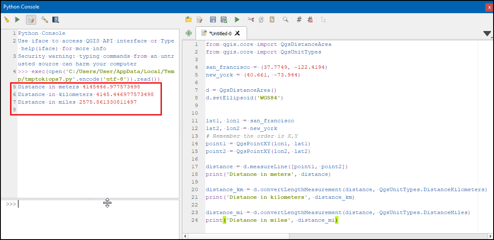
```

# 5. Graphical User Interface (GUI) Programming Basics

[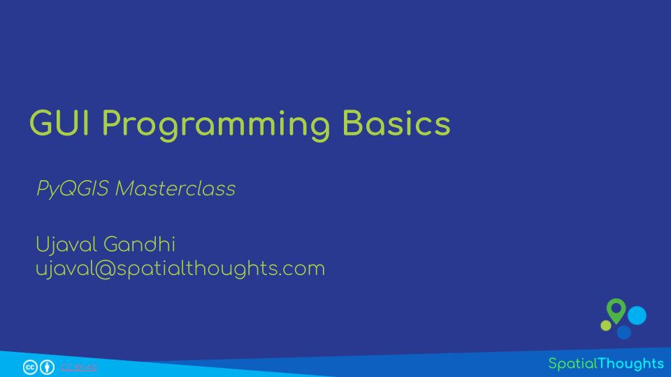{width="400px"}](https://docs.google.com/presentation/d/1eK75jjfKx1IznIPrfcEljokLLQwkbNJ2DoStXDkF_f4/edit?usp=sharing){target="_blank"}

[View the Presentation &#8599;](https://docs.google.com/presentation/d/1eK75jjfKx1IznIPrfcEljokLLQwkbNJ2DoStXDkF_f4/edit?usp=sharing){target="_blank"}

## 5.1 Qt and PyQt

[Qt](https://www.qt.io/) is a free and open-source widget toolkit for creating graphical user interfaces as well as cross-platform applications. QGIS is built using the Qt platform. Both Qt and QGIS itself have well-documented APIs that should be used when writing Python code to be run within QGIS.

[PyQt](https://wiki.python.org/moin/PyQt) is the Python interface to Qt. PyQt provides classes and functions to interact with Qt widgets.


## 5.2 Building a Dialog Box

Let's learn how to use PyQt classes to create and interact with GUI elements. Here we will create a simple dialog box that prompts a user for confirmation. You can type the code in the **Editor** and click **Run Script**.

```{python eval=FALSE}
mb = QMessageBox()
```
The `QMessageBox` is a PyQt class for creating a dialog with buttons. To use the class, you create an object by *instantiating* the class. Here `mb` is an object, which is an instance of the `QMessageBox` class, created using the default parameters.


`type()` tells you what is the class of the object
```{python eval=FALSE}
type(mb)
```

`dir` returns list of the attributes and methods of any object
```{python eval=FALSE}
dir(mb)
```

Classes have methods that provide functionality. You can run the class methods on instance objects. For the `QMessageBox` class, `setText()` method will add a text to the dialog.

```{python eval=FALSE}
mb = QMessageBox()
mb.setText('Click OK to confirm')
```

Classes also have class attributes which are shared across all instances.
The `QMessageBox` class has `Ok` and `Cancel` attributes, which can be referred using  `QMessageBox.Ok` and `QMessageBox.Cancel`.

```{python eval=FALSE}
mb = QMessageBox()
mb.setText('Click OK to confirm')
mb.setStandardButtons(QMessageBox.Ok | QMessageBox.Cancel)
```

To see the dialog, we need to use the `exec()` method. The user input is then captured and saved in the `return_value` variable. 

The complete code snippet is as follows.Try it out and see the result of your action reflect in the Python Console.

```{python eval=FALSE}
mb = QMessageBox()
mb.setText('Click OK to confirm')
mb.setStandardButtons(QMessageBox.Ok | QMessageBox.Cancel)
return_value = mb.exec()
if return_value == QMessageBox.Ok:
    print('You pressed OK')
elif return_value == QMessageBox.Cancel:
    print('You pressed Cancel')
```

```{r echo=FALSE, fig.align='center', out.width='75%'}
knitr::include_graphics('images/pyqgis/messagebox.png')
```

# 6. Deep Dive into PyQGIS


[PyQGIS](https://docs.qgis.org/testing/en/docs/pyqgis_developer_cookbook/) is the Python interface to QGIS. It is created using SIP and integrates with PyQt.

> **_Fun Fact:_**  Most QGIS class names start with the prefix *Qgs*. **Q** is for Qt and **gs** stands for Gary Sherman - the founder of the QGIS project.

QGIS C++ API documentation is available at https://qgis.org/api/3.34/

QGIS Python API documentation is available at https://qgis.org/pyqgis/3.34/

Both C++ and Python APIs are identical for most part, but certain functions are not available in the Python API. [^1]

[^1]: See https://qgis.org/api/3.4/classQgsProject.html

## 6.1 QGIS Interface API (QgisInterface)

You are ready to dive into the PyQGIS API now. In this section, we will focus on the `QgisInterface` class - which provides methods for interaction with the QGIS environment. When QGIS is running, a variable called `iface` is set up to provide an object of the class `QgisInterface` to interact with the running QGIS environment. This interface allows access to the map canvas, menus, toolbars and other parts of the QGIS application. Python Console and Plugins can use `iface` to access various parts of the QGIS interface.


### 6.1.1 Change Title of QGIS Main Window

```{python eval=FALSE}
title = iface.mainWindow().windowTitle()
new_title = title.replace('QGIS', 'My QGIS')
iface.mainWindow().setWindowTitle(new_title)
```

### 6.1.2 Change Icon of QGIS Main Window

> `os.path.expanduser('~')` returns the path to the home directory of the user.

```{python eval=FALSE}
import os

icon_image = 'qgis-black.png'
data_dir = os.path.join(os.path.expanduser('~'), 'Downloads', 'pyqgis_masterclass')
icon_path = os.path.join(data_dir, icon_image)
icon = QIcon(icon_path)
iface.mainWindow().setWindowIcon(icon)
```

```{r echo=FALSE, fig.align='center', out.width='50%'}
knitr::include_graphics('images/pyqgis/mainwindow2.png')
```

### 6.1.3 Remove Raster and Vector Menus

```{python eval=FALSE}
vector_menu = iface.vectorMenu()
raster_menu = iface.rasterMenu()
menubar = vector_menu.parentWidget()
menubar.removeAction(vector_menu.menuAction())
menubar.removeAction(raster_menu.menuAction())
```

```{r echo=FALSE, fig.align='center', out.width='75%'}
knitr::include_graphics('images/pyqgis/menu2.1.png')
```

```{r echo=FALSE, fig.align='center', out.width='75%'}
knitr::include_graphics('images/pyqgis/menu2.2.png')
```


### 6.1.4 Understanding Signals and Slots

GUI programming requires responding to user’s actions. All objects in Qt have a mechanism where they can emit a signal when there is a change in status. i.e. when a user *clicks* a button, or a window is *closed*. As a programmer, you can connect the signal to a slot (i.e. a python function) which will be called when the signal is emitted. The general syntax for connecting the signal to a slot is `<object>.<signal>.connect(function)`.

### 6.1.5 Add A New Menu Item

A new button or menu item is created using `QAction()`. Here we create an action and then connect the *click* signal to a method that opens a website.

```{python eval=FALSE}
import webbrowser

def open_website():
    webbrowser.open('https://gis.stackexchange.com')

website_action = QAction('Go to gis.stackexchange')
website_action.triggered.connect(open_website)
iface.helpMenu().addSeparator()
iface.helpMenu().addAction(website_action)
```

```{r echo=FALSE, fig.align='center', out.width='50%'}
knitr::include_graphics('images/pyqgis/menu3.png')
```

### 6.1.6 Change Visibility of a Toolbar

```{python eval=FALSE}
iface.pluginToolBar().setVisible(True)
```

### 6.1.7 Add a button to a toolbar

```{python eval=FALSE}
import os
from datetime import datetime

icon = 'question.svg'
data_dir = os.path.join(os.path.expanduser('~'), 'Downloads', 'pyqgis_masterclass')
icon_path = os.path.join(data_dir, icon)

def show_time():
    now = datetime.now()
    current_time = now.strftime("%H:%M:%S")
    iface.messageBar().pushInfo('Current Time', current_time)

action = QAction('Show Time')
action.triggered.connect(show_time)
action.setIcon(QIcon(icon_path))
iface.addToolBarIcon(action)
```


```{r echo=FALSE, fig.align='center', out.width='75%'}
knitr::include_graphics('images/pyqgis/toolbar2.png')
```

### Exercise 2

In the previous example, the alert is displayed in the QGIS message bar as an *Info* message. Change the type of the message to a *Warning* message.

Hint: Look at the appropriate method in the [QgsMessageBar](https://qgis.org/pyqgis/3.34/gui/QgsMessageBar.html) class

### 6.1.8 Add New Layers

Data sources are identified by an URI (Uniform Resource Identifier)
- For files on computer the URI is the file path
- For databases, the URI is constructed using the `QgsDataSourceUri` class and encodes,the database path, table, username, password etc.
- For web layers, such as WMF/WFS etc, the URI is the web URL


```{python eval=FALSE}
import os
data_dir = os.path.join(os.path.expanduser('~'), 'Downloads', 'pyqgis_masterclass')

filename = 'seismic_zones.shp'
uri = os.path.join(data_dir, filename)
iface.addVectorLayer(uri, 'seismic_zones', 'ogr')

filename = 'sf.gpkg|layername=zoning'
uri = os.path.join(data_dir, filename)
iface.addVectorLayer(uri, 'zoning', 'ogr')
```

```{r echo=FALSE, fig.align='center', out.width='50%'}
knitr::include_graphics('images/pyqgis/vectorlayer.png')
```

### 6.1.9 Change name of a Layer

```{python eval=FALSE}
layer = iface.activeLayer()
name = layer.name()
layer.setName('sf_' + name)
```


### Exercise 3

Write a code snippet that checks the active layer selected by the user. If the active layer is named `zoning`, display a success message in the message bar, else display an error message.

```{r echo=FALSE, fig.align='center', out.width='75%'}
knitr::include_graphics('images/pyqgis/success.png')
```
```{r echo=FALSE, fig.align='center', out.width='75%'}
knitr::include_graphics('images/pyqgis/error.png')
```

## 6.2 QGIS Project API (QgsProject)

Another very important QGIS class is `QgsProject`. This class is used for all operations in a QGIS project - including adding/removing map layers, styling, print layouts etc. The `QgsProject` is a **Singleton Class** - meaning it can have only 1 instance at a time. The instance refers to the current QGIS project that is loaded. When QGIS starts, a blank project is created. When you load another project, the existing project is closed and a new project instance is created. You can get the current instance of the QgsProject class by calling the 
**`QgsProject.instance()`**  method.

### 6.2.1 Load a project

```{python eval=FALSE}
import os
data_dir = os.path.join(os.path.expanduser('~'), 'Downloads', 'pyqgis_masterclass')

project = QgsProject.instance()
project_name = 'sf.qgz'
project_path = os.path.join(data_dir, project_name)
project.read(project_path)
```

```{r echo=FALSE, fig.align='center', out.width='75%'}
knitr::include_graphics('images/pyqgis/project.png')
```


### 6.2.2 Load Projects using a Dropdown Menu

The code snippet below shows how to create a new toolbar with a label and a drop-down menu. Selecting an item will load the project with that name.

```{r echo=FALSE, fig.align='center'}
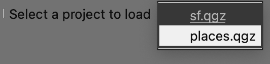
```


```{python eval=FALSE, code=readLines('code/pyqgis/project_toolbar.py')}
```

### 6.2.3 Create a New Vector Layer

We will now create a temporary memory layer using PyQGIS. Memory layers are not saved to the disk and ideal to store intermediate results. The code snippet below creates a polygon layer with the extent of the current map canvas.

```{python eval=FALSE}
mc = iface.mapCanvas()
extent = mc.extent()

vlayer = QgsVectorLayer('Polygon', 'extent', 'memory')
crs = QgsProject.instance().crs()
vlayer.setCrs(crs)

provider = vlayer.dataProvider()

f = QgsFeature()
geometry = QgsGeometry.fromRect(extent)
f.setGeometry(geometry)

provider.addFeature(f)
vlayer.updateExtents() 

QgsProject.instance().addMapLayer(vlayer)
```

### Exercise 4

The following code snippet creates a toolbar called *CRS Toolbar* with a label, textbox and a button. When the button is clicked, the function `changeCRS` is called. Implement this function so that it changes the CRS of the current project to the EPSG code entered by the user.

Hint: Use [`QgsProject.instance().setCrs()`](https://qgis.org/pyqgis/3.34/core/QgsProject.html) method.

```{r echo=FALSE, fig.align='center', out.width='75%'}
knitr::include_graphics('images/pyqgis/crs_selector.png')
```

```{python eval=FALSE}
crsToolbar = iface.addToolBar('CRS Toolbar')

label = QLabel('Enter an EPSG Code', parent=crsToolbar)
crsTextBox = QLineEdit('4326', parent=crsToolbar)
crsTextBox.setFixedWidth(80)
button = QPushButton('Go!', parent=crsToolbar)

crsToolbar.addWidget(label)
crsToolbar.addWidget(crsTextBox)
crsToolbar.addWidget(button)

def changeCrs(crsText):
    epsgCode = int(crsTextBox.text())
    iface.messageBar().pushInfo('Function called', f'You entered {epsgCode}')
    # Add code to change the project CRS to the EPSG code

button.clicked.connect(changeCrs)
```

# 7. Running Python Code at QGIS Launch

It is possible to execute some PyQGIS code every time QGIS starts. QGIS looks for a file named `startup.py` in the user's Python home directory, and if it is found, executes it. This file is very useful in customizing QGIS interface with techniques learnt in the previous section. 

If you are running multiple versions of QGIS, a very useful customization is to display the QGIS version number and name in the main window. The version name is stored in a global QGIS variable called `qgis_version`. We can read that variable and set the main window's title with it. We connect this code to the signal `iface.initializationCompleted` signal when the main window is loaded.

Create a new file named `startup.py` with the following code. Note the imports at the top - including `iface`. When we ran the code snippets in the Python Console, we did not have to import any modules since they are done automatically when the console starts. For pyqgis scripts elsewhere, we have to explicitly import the modules (classes) that we want to use.

```{python eval=FALSE, code=readLines('code/pyqgis/startup.py')}
```

This file needs to be copied to the appropriate directory on your system. See [QGIS documentation](https://docs.qgis.org/testing/en/docs/pyqgis_developer_cookbook/intro.html#running-python-code-when-qgis-starts) for details on the path for your platform.

```{r echo=FALSE, fig.align='center', out.width='75%'}
knitr::include_graphics('images/pyqgis/startup.png')
```

Once you copy the file at that location, restart QGIS. The title bar should now have the QGIS version name in it.

```{r echo=FALSE, fig.align='center', out.width='75%'}
knitr::include_graphics('images/pyqgis/customtitle.png')
```

> Pro Tip: It is possible to put the `startup.py` file on a shared drive for enterprise deployment of QGIS customizations. [Learn more](https://gis.stackexchange.com/questions/319224/central-deployment-of-startup-py-in-qgis/319225).

## Exercise 5

Trying opening a new project in QGIS after you have restarted GIS with `startup.py` file in place. You will notice that the custom title with the version name is replaced with the default title. 

Make a change to your `startup.py` so that the customization is applied even when a new project is loaded.

# 8. Running Processing Algorithms

While the PyQGIS API providers many functions to work with layers, features, attributes and geometry - it is a much better practice to use the built-in processing algorithms to alter the layers or do any analysis. This will give you better performance and result in much lesser code. Here are some examples on how to use processing algorithms from Python to do vector and raster layer editing. You will find more information about various options and techniques in the article [Using processing algorithms from the console](https://docs.qgis.org/testing/en/docs/user_manual/processing/console.html) of the QGIS User Guide 

```{r echo=FALSE, fig.align='center', out.width='75%'}
knitr::include_graphics('images/pyqgis/processing.png')
```

## 8.1 Creating Hillshade from a DEM

To use any Processing Algorithm via Python, you need to know how to specify all the required parameters. This is easiest to obtain by running the algorithm via the GUI first. 

In this section we will learn how to create a hillshade raster from a DEM. We will first carry out the task using QGIS.

1. Browse to the data directory and load the `srtm.tif` layer. Search and locate the **Processing Toolbox &rarr; Raster terrain analysis &rarr; Hillshade**  algorithm from the *Processing Toolbox*. Double-click to open it.

```{r echo=FALSE, fig.align='center', out.width='75%'}
knitr::include_graphics('images/pyqgis/processing1.png')
```

2. Select `srtm` as the *Elevation layer* and keep all the other parameters to their default value. Click *Run*.

```{r echo=FALSE, fig.align='center', out.width='75%'}
knitr::include_graphics('images/pyqgis/processing2.png')
```

3. A new `Hillshade` layer will be added to the *Layers* panel. Now we will locate the Python command for this operation from the *Processing History*. Go to **Processing &rarr; History**.

```{r echo=FALSE, fig.align='center', out.width='75%'}
knitr::include_graphics('images/pyqgis/processing3.png')
```

4. The first entry in the top panel will show the last algorithm that was ran from the toolbox. Click on it to select it. The full Python command will be shown at the bottom. Copy it.

```{r echo=FALSE, fig.align='center', out.width='75%'}
knitr::include_graphics('images/pyqgis/processing4.png')
```

You can now use the parameters in your Python code and replace the path of the input. Below is the code snippet that runs the same algorithm from a Python script. Note that we are using the `processing.runAndLoadResults()` method that adds the resulting layer to the canvas.    

```{python eval=FALSE}
import os
data_dir = os.path.join(os.path.expanduser('~'), 'Downloads', 'pyqgis_masterclass')

filename = 'srtm.tif'
srtm = os.path.join(data_dir, filename)
iface.addRasterLayer(srtm, 'srtm', 'gdal')

results = processing.runAndLoadResults("native:hillshade", 
    {'INPUT': srtm, 
    'Z_FACTOR':2,
    'AZIMUTH':300,
    'V_ANGLE':40,
    'OUTPUT': 'TEMPORARY_OUTPUT'})
```

## 8.2 Running Multiple Processing Algorithms

We can also *chain* multiple processing tools to build a script to build a data processing pipeline. In the example below, we will do 2 steps

1. Clip  `srtm.tif` raster using the `shoreline.shp` layer.
2. Calculate the hillshade on the clipped raster and load it in QGIS.

Note that we are using the `processing.run()` method for the first step. This method calculates the output, but does not load the result to QGIS. This allows us to carry out multiple processing steps and not load intermediate layers.

```{python eval=FALSE}
import os
data_dir = os.path.join(os.path.expanduser('~'), 'Downloads', 'pyqgis_masterclass')

filename = 'srtm.tif'
srtm = os.path.join(data_dir, filename)
filename = 'shoreline.shp'
shoreline = os.path.join(data_dir, filename) 

results = processing.run("gdal:cliprasterbymasklayer", 
    {'INPUT':srtm,
    'MASK': shoreline,
    'OUTPUT':'TEMPORARY_OUTPUT'})

clipped_dem = results['OUTPUT']
   
results = processing.runAndLoadResults("native:hillshade", 
    {'INPUT': clipped_dem, 
    'Z_FACTOR':2,
    'AZIMUTH':300,
    'V_ANGLE':40,
    'OUTPUT': 'TEMPORARY_OUTPUT'})
```

You can also do batch-processing by iterating through multiple layers and running the processing algorithm in a for-loop. Doing it via Python allows you greater flexibility - such as combining the results into a single layer. See [Running Processing Algorithms via Python](https://www.qgistutorials.com/en/docs/3/processing_algorithms_pyqgis.html){target="_blank"} tutorial for a complete example.

## Exercise 6

Your data package contains a polygon layer of seismic zones in San Francisco. We want to calculate the average elevation within each seismic zone from this layer. The code below reads the vector layer `seismic_zones.shp` of seismic zones and the raster layer `srtm.tif` containing elevation values. The vector layer contains some invalid polygons, so we run the `native:fixgeometries` algorithm to fix them.

Use the resulting layer with the fixes geometries and calculate Zonal Statistics algorithm `native:zonalstatisticsfb` to calculate the average elevation from the raster layer. 

```{python eval=FALSE}
import os
data_dir = os.path.join(os.path.expanduser('~'), 'Downloads', 'pyqgis_masterclass')

vector_layer = 'seismic_zones.shp'
vector_layer_path = os.path.join(data_dir, vector_layer)

raster_layer = 'srtm.tif'
raster_layer_path = os.path.join(data_dir, raster_layer)

# Input vector has invalid geometries
# Fix them first
results = processing.run("native:fixgeometries", {
  'INPUT':vector_layer_path,
  'METHOD': 0,
  'OUTPUT':'TEMPORARY_OUTPUT'})

fixed_vector_layer = results['OUTPUT']

# Run Zonal Statistics and load the resulting layer

```

# Assignment 

The following assignment is designed to help you practice the skills learnt so far in the course and explore the PyQGIS API.

Your task is to write a PyQGIS Script to show the average value of the selected raster layer within the current map extent. For example, if you load the `srtm` layer from the data package, select it and click the button - it should calculate and display the average elevation within the canvas extent. If you zoom/pan the map and click the button again - it should compute the display the average elevation within the new extent. Here is the recommended structure for your script.

* Add a button to the *Plugins Toolbar* called *Show Raster Statistics* with an icon of your choice.
* Write a function named `show_statistics()` that is called when the button is clicked.
* The function should obtain the current extent of the map canvas and calculate the raster statistics.
* Once the statistics are computed, it should display a message in the message bar with the information.

Hint: [`QgsRasterInterface`](https://qgis.org/pyqgis/3.34/core/QgsRasterInterface.html#module-QgsRasterInterface) class provides a `bandStatistics()` method for calculating statistics from a raster band. You can get the reference to the instance of this class for a raster layer using `layer.dataProvider()`.

```{r echo=FALSE, fig.align='center', out.width='75%'}
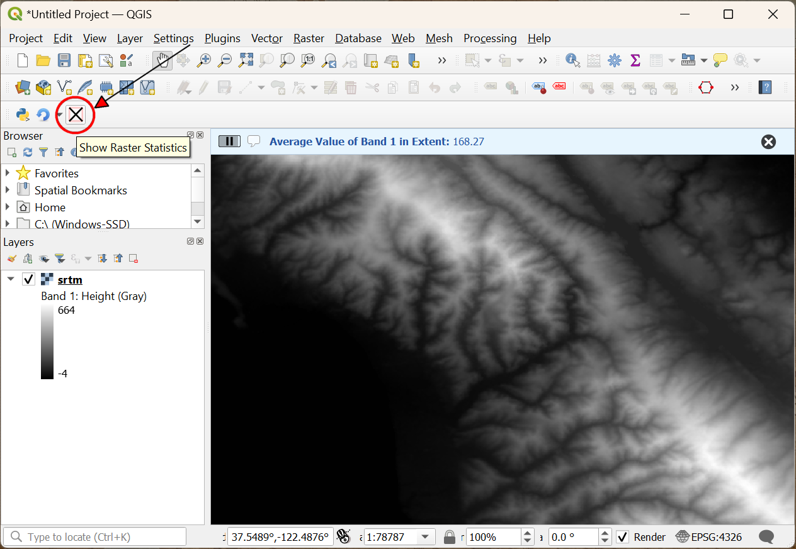
```

Extra credit if your script also does error checking and displays an error message on the message bar for the following conditions:

* If the user has not selected any layer or the selected layer is not a raster layer, display an error.
* If the current map canvas extent does not have any valid pixels, display an error.


```{r echo=FALSE, fig.align='center', out.width='75%'}
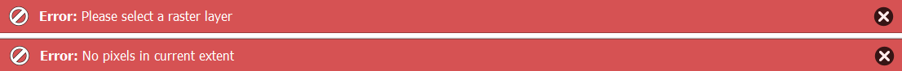
```

# 9. Writing Plugins

Plugins are a great way to extend the functionality of QGIS. You can write plugins using Python that can range from adding a simple button to sophisticated tool-kits.

[{width="400px"}](https://docs.google.com/presentation/d/1wegCN-_aQ6G4-VyyN-lO4o0n7Kj9kU-xT2jSz1wL5Ec/edit?usp=sharing){target="_blank"}

[View the Presentation &#8599;](https://docs.google.com/presentation/d/1wegCN-_aQ6G4-VyyN-lO4o0n7Kj9kU-xT2jSz1wL5Ec/edit?usp=sharing){target="_blank"}

> There is a plugin named [Plugin Builder](https://plugins.qgis.org/plugins/pluginbuilder/) that can help you generate a starter plugin. We have published step-by-step instructions for both [GUI plugins](https://www.qgistutorials.com/en/docs/3/building_a_python_plugin.html) and [Processing Plugins](https://www.qgistutorials.com/en/docs/3/processing_python_plugin.html) using the Plugin Builder method. While this method gives you an easy way to have a functional plugin, it is not the ideal way to learn plugin development. We recommend starting from a minimal template and adding elements as and when needed. Here we will learn the basics of plugin framework using a minimal plugin and learn how to add various element to make it a full plugin.

## 9.1 Understanding Plugins

Plugins are much more integrated into the QGIS system than Python Scripts. They are managed by **Plugin Manager** and are initialized when QGIS starts. To understand the required structure, let's see what a minimal plugin looks like. You can learn more about this structure at [QGIS Minimalist Plugin Skeleton](https://github.com/wonder-sk/qgis-minimal-plugin).

We will now build a simple plugin named **Basemap Loader** that adds a button in the *Plugin Toolbar* that loads a basemap from OpenStreetMap to the current project.

The first requirement for plugins is a file called `metadata.txt`. This file contains general info, version, name and some other metadata used by plugins website and plugin manager. 

`metadata.txt`
```{python eval=FALSE, code=readLines('code/pyqgis/basemap_loader_minimal/metadata.txt')}
```

Second is the file that contains the main logic of the plugin. It must have `__init__()` method that gives the plugin access to the QGIS Interface (iface). The `initGui()` method is called when the plugin is loaded and `unload()` method which is called when the plugin is unloaded. For now, we are creating a minimal plugin that just add a button and a menu entry that displays message when clicked.

`load_basemap.py`
```{python eval=FALSE, code=readLines('code/pyqgis/basemap_loader_minimal/load_basemap.py')}
```

Third file is called `__init__.py` which is the starting point of the plugin. It imports the plugin class created in the second file and creates an instance of it.

`__init__.py`
```{python eval=FALSE, code=readLines('code/pyqgis/basemap_loader_minimal/__init__.py')}
```

Create these 3 files and put them in a folder named `basemap_loader`. Copy the `logo.png` file from `<home folder>/Downloads/pyqgis_masterclass/logo.png` to this folder. Copy the folder to the python plugins directory at `{profile folder}/python/plugins`. 

```{r echo=FALSE, fig.align='center', out.width='75%'}
knitr::include_graphics('images/pyqgis/pluginbasemapfiles.png')
```

Restart QGIS. Go to  **Plugins &rarr; Manage and Install plugins... &rarr; Installed** and enable the **Basemap Loader** plugin. You will the toolbar icon from the plugin. Click on the button and the *Hello from Plugin* message is displayed. 

```{r echo=FALSE, fig.align='center', out.width='75%'}
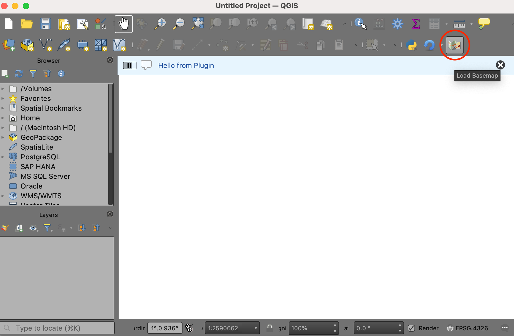
```

## 9.2 Adding Functionality

Now let's build on the basic plugin structure and add the functionality to load a XYZ Tile Layer when the button is clicked. We will be using the [OpenStreetMap Standard](https://wiki.openstreetmap.org/wiki/Raster_tile_providers#Base_maps) XYZ layer. The PyQGIS code to load a XYZ tile layer is adapted from the [PyQGIS Cookbook](https://docs.qgis.org/3.34/en/docs/pyqgis_developer_cookbook/cheat_sheet.html). Modify the `load_basemap.py` file with the content from below.

`load_basemap.py`
```{python eval=FALSE, code=readLines('code/pyqgis/basemap_loader_complete/load_basemap.py')}
```

To see the result of our changes, we must restart QGIS. This can be quite tedious while developing plugins, so there is a handy plugin named **Plugin Reloader** that can reload a selected plugin without having to restart QGIS. Go to  *Plugins &rarr; Manage and Install plugins... &rarr; All* and search for the plugin named **Plugin Reloader**. Click *Install Plugin*. Once the plugin is installed, locate the *Configure* button from the *Plugin Toolbar* and select the **Basemap Loader** plugin. Click *Reload* to reload the plugin.

```{r echo=FALSE, fig.align='center', out.width='75%'}
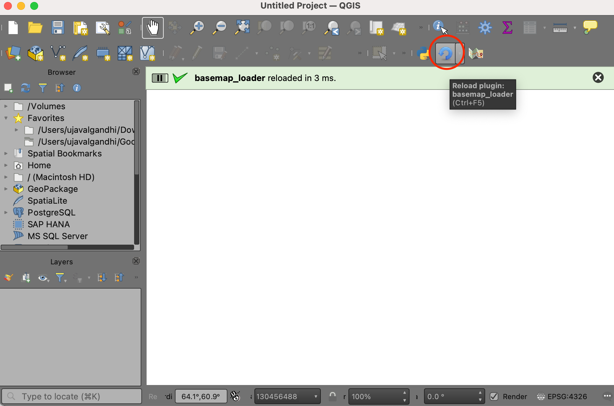
```

Once reloaded, click the *Load Basemap* button from the toolbar and you will see the basemap layer loaded in QGIS.

```{r echo=FALSE, fig.align='center', out.width='75%'}
knitr::include_graphics('images/pyqgis/pluginbasemapcomplete.png')
```

## Exercise 7

Load the `places.qgz` project from your data package. 

Modify the plugin to change the Project CRS to the crs of the tile layer once the basemap is loaded.

Hint: Use [`QgsProject.instance().setCrs()`](https://qgis.org/pyqgis/3.34/core/QgsProject.html) method.

By default, the new layer will be inserted at the top of the layer tree. If you want to insert the layer at a specific place, you can use the code snippet below.

```{python eval=FALSE}
# Add the layer, but not to the legend
QgsProject.instance().addMapLayer(rlayer, False)
# Insert layer at the bottom of Layer Tree
root = QgsProject.instance().layerTreeRoot()
position = len(root.children())
root.insertLayer(position, rlayer)
```

# 10. Advanced Python Concepts

## 10.1 Understanding Python Iterators

An *Iterator* is a type of Python object that contains items that can be iterator upon. They are similar to other objects, like *lists* - but with a key difference. When you create an iterator, you don't store all the items in memory. The iterator loads a single item at a time and then fetches the next item when asked for it. This makes it very efficient for reading large amounts of data without having to read the entire dataset. QGIS implements iterators for many different object types. 

We will continue to work with the `sf.qgz` project. Open the project and select the `blocks` layer. In the example below, the result of calling `layer.getFeatures()` is an iterator. You can call the `next()` function to fetch the next item from the iterator. 

```{python eval=FALSE}
layer = iface.activeLayer()
features = layer.getFeatures()
f = next(features)
print(f.attributes())
f = next(features)
print(f.attributes())
```

You can also use for-loops to iterate through an iterator. Here we look up the *Feature ID* of each feature using the `id()` method and store it in a list.

```{python eval=FALSE}
layer = iface.activeLayer()
features = layer.getFeatures()
ids = []
for f in features:
  id = f.id()
  ids.append(id)

print(ids)
```

## 10.2 List Comprehensions

A common data processing task in Python is to read items from a list or an iterator, doing some processing on each item and creating a new list with the results. The regular way to do this is to first create an empty list, iterate over each item of the existing list, and append the results to the new empty list. Python provides a powerful alternative to this workflow in the form of *List Comprehension*. The snippet below shows the syntax.


```{python eval=FALSE, code=readLines('code/pyqgis/list_comprehensions.py')}
```

## Exercise 8

The following code creates a list of field names for the selected layer. Convert the code to use a list comprehension.

```{python eval=FALSE}
layer = iface.activeLayer()
fields = layer.fields()
field_names = []

for field in fields:
  field_names.append(field.name())

print(field_names)
```

# 11. Writing Processing Plugins

The new and preferred way to write plugins in QGIS is using the Processing Framework. It removes the need for you to design the user interface. The resulting plugin integrates seamlessly in the Processing Toolbox and is interoperable with other processing algorithms.


In this section, we will learn how to build a plugin called **Save Attributes** that adds a new algorithm to iterate over all features of a layer, extract their attribute values and save the results as a CSV file. We will learn about different components of a processing plugin and learn the skills required to create a functional processing plugin.

## 11.1 Iterating over Features

Let's start by learning how to iterate over features of a vector layer. We will iterate over each feature and extract the value of all attributes. To keep things simple for now, we will use Pandas library to create a DataFrame and save the results. We will later modify this code to use native PyQGIS API.

Open the Python Console and click the *Show Editor* button. Copy/paste the following code. Select the `blocks` layer and run this script by clicking the *Run Script* button. The script will process the layer and write the file at the given location.

```{python eval=FALSE, code=readLines('code/pyqgis/save_attributes_pandas.py')}
```


## Exercise 9

Modify the above code to save attributes of only selected features. Bonus points if your script checks whether the user has selected any features on the layer and display an error if no features are selected.

Hint1: See the available methods for the [`QgsVectorLayer`](https://qgis.org/pyqgis/3.34/core/QgsVectorLayer.html) class.

Hint2: To check if the layer has any selected features, check for a method that gives you the count of selected features.


## 11.2 Saving Vector Layers

Let's take the script we wrote above and learn how to save the results a vector layer as a file using PyQGIS classes. This is the preferred method while developing scripts that can be used as Processing algorithms or plugins. We will use the [`QgsVectorFileWriter`](https://qgis.org/pyqgis/3.34/core/QgsVectorFileWriter.html) class to create a file in any of the supported vector data formats. 

We will use QgsVectorFileWriter.create() method which takes the following parameters

* `fileName`: Path to the file
* `fields`: Fields to write
* `geometryType`: geometry type of output file
* `srs`: CRS of the output file
* `transformContext`: Datum transformation settings
* `options`: Save Options such as format, encoding etc.

Once we initialize a `QgsVectorFileWriter` object, we iterate over the original layer and call the `addFeature()` method to add features to the writer.

Open the Python Console and click the *Show Editor* button. Copy/paste the following code. Select the `blocks` layer and run this script by clicking the *Run Script* button. The script will process the layer and write the file at the given location.

```{python eval=FALSE, code=readLines('code/pyqgis/save_attributes_console.py')}
```


```{r echo=FALSE, fig.align='center', out.width='75%'}
knitr::include_graphics('images/pyqgis/consolescriptrun.png')
```

## 11.3. Writing a Processing Script

We saw how to write a Python script in the QGIS Python Console Code Editor. But there is another way - and it is the preferred approach to write scripts. Whenever you are writing a new script, consider using the built-in **Processing Framework**. This has several advantages. First, taking user input and writing output files is far easier because Processing Framework offers standardized user interface for these. Second, having your script in the Processing Toolbox also allows it to be part of any Processing Model or be run as a Batch job with multiple inputs. This tutorial will show how to write a custom python script that can be part of the Processing Framework in QGIS.


[{width="400px"}](https://docs.google.com/presentation/d/1RraIdhQ0wv0ex66p_JGri7QzSYyLNU0elcxfxSGDS1Y/edit?usp=sharing){target="_blank"}

[View the Presentation &#8599;](https://docs.google.com/presentation/d/1RraIdhQ0wv0ex66p_JGri7QzSYyLNU0elcxfxSGDS1Y/edit?usp=sharing){target="_blank"}

You can review additional information and tips in the [Writing new Processing algorithms as Python scripts](https://docs.qgis.org/3.34/en/docs/user_manual/processing/scripts.html) section of the QGIS User Guide. 

The Processing algorithms follow the structure as described below:

* Processing scripts inherit from the base [`QgsProcessingAlgorithm`](https://qgis.org/pyqgis/3.34/core/QgsProcessingAlgorithm.html) class. 
* The `initAlgorithm()` method is called to set-up the inputs and the outputs. The inputs and outputs to the processing algorithms must be defined with appropriate class for the type of parameter. You can see all the available classes for defining parameters that inherit the [`QgsProcessingParameterDefinition`](https://api.qgis.org/api/classQgsProcessingParameterDefinition.html) class. 
* The `processAlgorithm()`  method contains the main logic of the script that gets executed when the user clicks the *Run* button. You can get the references to the user selected inputs and outputs using the methods from the [`QgsProcessingAlgorithm`](https://qgis.org/pyqgis/3.34/core/QgsProcessingAlgorithm.html) class.

There is additional terminology and classes that you must understand for writing Processing Scripts:

* **context**: This is an object of the [`QgsProcessingContext`](https://qgis.org/pyqgis/3.34/core/QgsProcessingContext.html) class that contains information about the current project and settings. Learn more at [what does context mean in PyQGIS?](https://gis.stackexchange.com/questions/419632/what-does-context-mean-in-pyqgis).
* **feedback**: This is an object of the [`QgsProcessingFeedback`](https://qgis.org/pyqgis/3.34/core/QgsProcessingFeedback.html) class that is used to communicate with the user during the execution of the algorithm. This is used for updaitng the progress bar, displaying error messages etc.
* **source** and **sink**: Processing algorithms use specialized classes that make is simple to read and write vector layers. The [`QgsFeatureSource`](https://qgis.org/pyqgis/3.34/core/QgsFeatureSource.html) class has methods to easily read features and [`QgsFeatureSink`](https://qgis.org/pyqgis/3.34/core/QgsFeatureSink.html) has methods to write features.


We will now see how the Python Console script can be converted to a Processing script.

To create a new processing script, go to **Processing &rarr; Processing Toolbox**. Click the *Scripts* button and select *Create New Script..*.

```{r echo=FALSE, fig.align='center', out.width='75%'}
knitr::include_graphics('images/pyqgis/processingscriptnew.png')
```

Copy/paste the following code into the *Processing Script Editor*.

`save_attributes_processing.py`
```{python eval=FALSE, code=readLines('code/pyqgis/save_attributes_processing.py')}
```

```{r echo=FALSE, fig.align='center', out.width='75%'}
knitr::include_graphics('images/pyqgis/processingscriptwrite.png')
```


Click the *Save Script* button and save the script as `save_attributes_algorithm.py`. This script must be saved inside the `{profile folder}/processing/scripts/` directory so it can be loaded when QGIS starts.

Once saved, the algorithm will appear in the *Processing Toolbox* under **Scripts  &rarr; Save Attributes As CSV**. Double-click to launch it. You will see the standard processing algorithm dialog where the user can select inputs and outputs easily. Progress bar is shown correctly and the execution also stops if the user presses the *Cancel* button. If the large is large and the algorithm would take time to process it, the user can also close the window and the algorithm will continue to run in the background.


```{r echo=FALSE, fig.align='center', out.width='75%'}
knitr::include_graphics('images/pyqgis/processingscriptrun.png')
```


## 11.4 Processing Plugin

Let's take the the processing script and package it in a processing plugin. We will need to create the following files.

* `metadata.txt`: Plugin information
* `__init__.py`: Initialization file
* `save_attributes.py`: The main file containing the plugin's class
* `save_attributes_algorithm.py`: The processing script. This is identical to the script we wrote earlier.
* `save_attributes_provider.py`: Processing provider that loads the algorithm.
* `logo.png`: Logo for the plugin action.

 Create these files with the content from below.
 
`metadata.txt`
```{python eval=FALSE, code=readLines('code/pyqgis/processing/metadata.txt')}
```

`__init__.py`
```{python eval=FALSE, code=readLines('code/pyqgis/processing/__init__.py')}
```

`save_attributes_algorithm.py`
```{python eval=FALSE, code=readLines('code/pyqgis/processing/save_attributes_algorithm.py')}
```

`save_attributes_provider.py`
```{python eval=FALSE, code=readLines('code/pyqgis/processing/save_attributes_provider.py')}
```

`save_attributes.py`
```{python eval=FALSE, code=readLines('code/pyqgis/processing/save_attributes.py')}
```

`logo.png`

Copy the logo file from your data package.

The plugin folder should look like below. 

```{r echo=FALSE, fig.align='center', out.width='75%'}
knitr::include_graphics('images/pyqgis/pluginprocessingfiles.png')
```

Restart QGIS and enable the plugin from **Plugins &rarr; Manage and Install plugins... &rarr; Installed &rarr; Save Attributes** 

Once loaded, you can click on the toolbar button or **Plugin  &rarr; Save Attributes &rarr; Save Attributes As CSV** to launch the processing algorithm.

```{r echo=FALSE, fig.align='center', out.width='75%'}
knitr::include_graphics('images/pyqgis/pluginprocessingrun.png')
```

# 12. QGIS Actions

[Actions](https://docs.qgis.org/testing/en/docs/user_manual/working_with_vector/vector_properties.html#actions-properties) in QGIS provide a quick and easy way to trigger custom behavior in response to a user's action - such as click on a feature in the canvas or an attribute value in the attribute table. Actions are defined for a layer and are saved in QGIS projects. This makes actions the easiest way to add and distribute QGIS customizations without having to write plugins.

[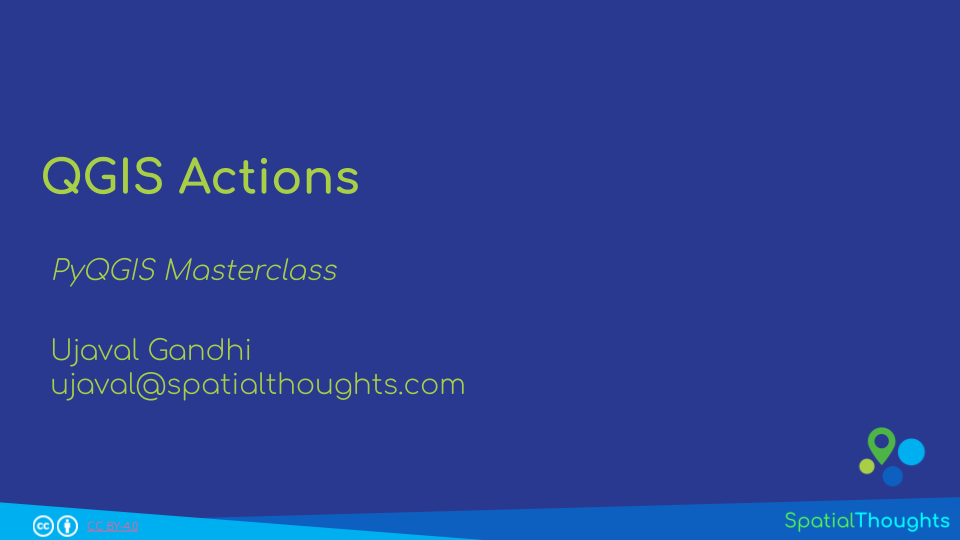{width="400px"}](https://docs.google.com/presentation/d/1wuGXVRBfZ2RxiiKY8zVs85JDKSgs0_NeZDS795hroCw/edit?usp=sharing){target="_blank"}

[View the Presentation &#8599;](https://docs.google.com/presentation/d/1wuGXVRBfZ2RxiiKY8zVs85JDKSgs0_NeZDS795hroCw/edit?usp=sharing){target="_blank"}

## 12.1 Hello World

Let's get started by learning the basics of QGIS Actions. We will create an action that takes a layer of all countries in the world and allows you to extract any country polygon by clicking on it.

1. Open QGIS. QGIS comes with a few hidden *Easter Eggs* that can be triggered by typing a keyword in the *Coordinate* box at the bottom of the main window. While many of these are for fun, some provide useful functionality. One such hidden feature is the ability to load a world map by typing a keyword. Enter the keyword **world** into the coordinate box at the bottom of the QGIS window rm and click *Enter*.

```{r echo=FALSE, fig.align='center', out.width='75%'}
knitr::include_graphics('images/pyqgis/helloworld1.png')
```

2. A new layer named `World Map` will be added to the *Layers* panel. This layer is the [Admin0 - Countries](https://www.naturalearthdata.com/downloads/10m-cultural-vectors/) boundaries dataset from Natural Earth. Let's define an action on this layer. Right-click the layer and select *Properties*.

```{r echo=FALSE, fig.align='center', out.width='75%'}
knitr::include_graphics('images/pyqgis/helloworld2.png')
```

3. Switch to the *Actions* tab and click the *Add a new action* (*+*) button.

```{r echo=FALSE, fig.align='center', out.width='75%'}
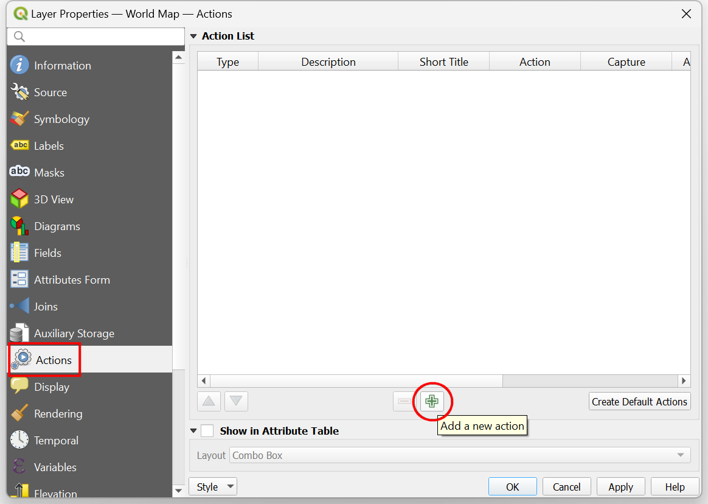
```

4. Select **Python** as the *Type*. Enter **Hello World** as the *Description*. This will be the name of the action as it appears in various menu items. Leave the *Action Scopes* to the default selected values of **Feature** and **Canvas**. Under the *Action Text* enter the following Python code and click *OK*.

```{python eval=FALSE}
print('Hello World')
```

```{r echo=FALSE, fig.align='center', out.width='60%'}
knitr::include_graphics('images/pyqgis/helloworld4.png')
```

5. Click *OK* again to get back to the main QGIS Canvas. We now have an action that will print `Hello World` when we click on a feature. To see the output, open the *Python Console* from **Plugins &rarr; Python Console**. Locate the *Actions* button on the *Attributes Toolbar*. Click the dropdown menu next to it and select *Hello World*. 

```{r echo=FALSE, fig.align='center', out.width='75%'}
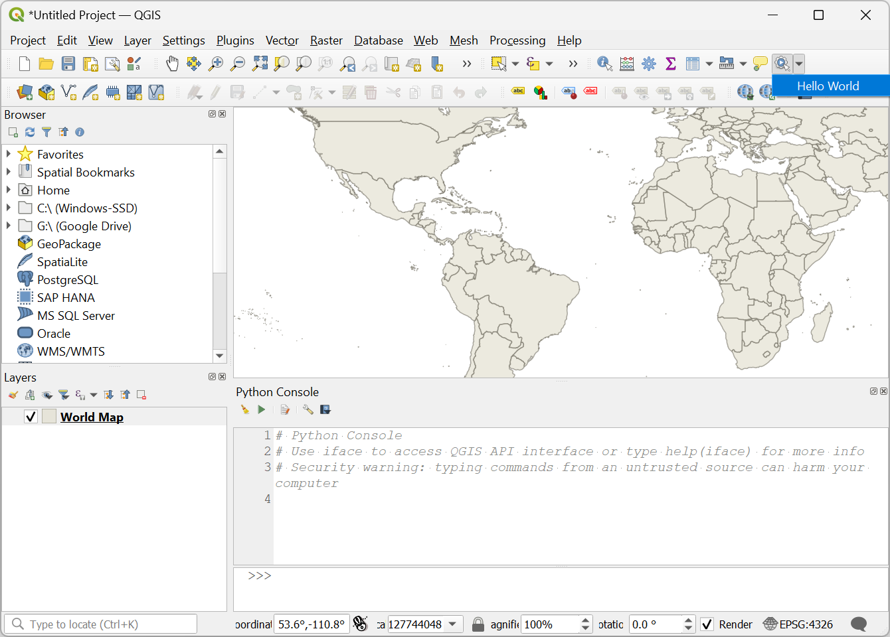
```

6. Once the action is selected, click on any feature from the layer. You will see *Hello World* printed in the console.

```{r echo=FALSE, fig.align='center', out.width='75%'}
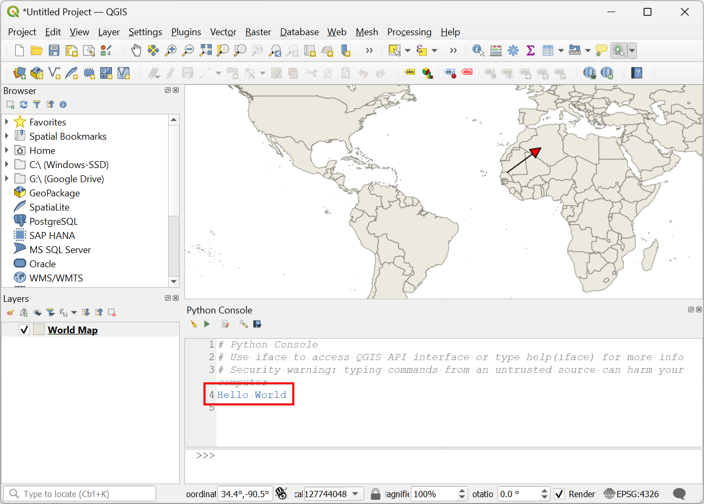
```

7. You now know how to define and trigger a Python action. Let's make the action more useful. Instead of printing a static text, let's modify the action to print the name of the country where we clicked. Open the *Attribute Table* of the `World Map` layer. You will notice that the **NAME** attribute contains the country names.

```{r echo=FALSE, fig.align='center', out.width='75%'}
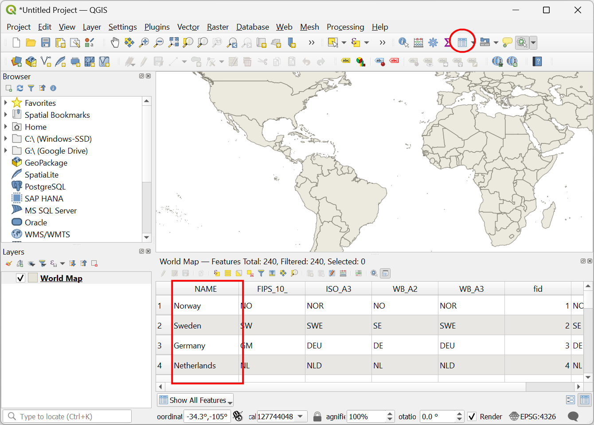
```

8. Right click the `World Map` layer and select *Properties*. From the *Actions* tab, double click the already defined *Hello World* action.

```{r echo=FALSE, fig.align='center', out.width='75%'}
knitr::include_graphics('images/pyqgis/helloworld8.png')
```

9. Our action is triggered by clicking on a feature and we can access the attributes of that feature. Select the **NAME** attribute and click *Insert*.

```{r echo=FALSE, fig.align='center', out.width='60%'}
knitr::include_graphics('images/pyqgis/helloworld9.png')
```

10. You will see the value `[%NAME%]` entered in the *Action Text* text box. This is a special expression syntax which indicates that the value surrounded by `[%` and `%]` will be replaced with the value of the attribute from the feature when the action is triggered.

```{r echo=FALSE, fig.align='center', out.width='60%'}
knitr::include_graphics('images/pyqgis/helloworld10.png')
```

11. Update the code to print the attribute value as below.

```{python eval=FALSE}
print('[%NAME%]')
```

```{r echo=FALSE, fig.align='center', out.width='60%'}
knitr::include_graphics('images/pyqgis/helloworld11.png')
```

12. Click *OK* and get back to the main window. Select the action and click on any feature. You will now see the name of the country printed in the console.

```{r echo=FALSE, fig.align='center', out.width='75%'}
knitr::include_graphics('images/pyqgis/helloworld12.png')
```

13. Along with all the attributes of the clicked feature, we also have access to other project and layer variables. Update the code as below to print the values of the feature id and layer id along with the value of the `NAME` attribute. Note that we are using the Python [f-strings](https://realpython.com/python-string-formatting/#3-string-interpolation-f-strings-python-36) for formatting the output.

```{python eval=FALSE}
feature_name = '[%NAME%]'
feature_id = [%$id%]
layer_id = '[%@layer_id%]'
print(f'feature name: {feature_name}')
print(f'feature id: {feature_id}')
print(f'layer id: {layer_id}')
```

```{r echo=FALSE, fig.align='center', out.width='60%'}
knitr::include_graphics('images/pyqgis/helloworld13.png')
```

14. Click *OK* and try the action again. This time you will see the feature id and layer id printed along with the feature name.

```{r echo=FALSE, fig.align='center', out.width='75%'}
knitr::include_graphics('images/pyqgis/helloworld14.png')
```

15. Now you know how to access the `@layer_id` and `$id` values of the current feature. We can now use it to extract the current feature and create a new layer from it. Replace the *Action Text* with the following code which uses  [`QgsFeatureSource.materialize()`](https://qgis.org/pyqgis/3.34/core/QgsFeatureSource.html#qgis.core.QgsFeatureSource.materialize) method to create a new memory based vector layer with the query containing the feature id.

```{python eval=FALSE}
feature_name = '[%NAME%]'
feature_id = [%$id%]
layer_id = '[%@layer_id%]'

layer = QgsProject.instance().mapLayer(layer_id)
new_layer = layer.materialize(
    QgsFeatureRequest().setFilterFids([feature_id]))
new_layer.setName(feature_name)
QgsProject.instance().addMapLayer(new_layer)
```

```{r echo=FALSE, fig.align='center', out.width='60%'}
knitr::include_graphics('images/pyqgis/helloworld15.png')
```

16. Go back to the main Canvas and close the *Python Console*. Select the *Hello World* action and click on any feature. You will see a new layer added to the *Layers* panel that contains the feature. Really useful!

```{r echo=FALSE, fig.align='center', out.width='75%'}
knitr::include_graphics('images/pyqgis/helloworld16.png')
```

17. We have a small problem. As the new layer is created and added to the *Layers* panel, it becomes the active layer. To trigger the action again, we have to select the `World Map` layer again. To prevent this, we can use [`QgisInterface.setActiveLayer()`](https://qgis.org/pyqgis/3.34/gui/QgisInterface.html#qgis.gui.QgisInterface.setActiveLayer) method to set the current layer as the active layer. We import `iface` in the code to access the current instance of the `QgisInterface` class.

```{python eval=FALSE}
from qgis.utils import iface

feature_name = '[%NAME%]'
feature_id = [%$id%]
layer_id = '[%@layer_id%]'

layer = QgsProject.instance().mapLayer(layer_id)
new_layer = layer.materialize(
    QgsFeatureRequest().setFilterFids([feature_id]))
new_layer.setName(feature_name)
QgsProject.instance().addMapLayer(new_layer)
iface.setActiveLayer(layer)
```

```{r echo=FALSE, fig.align='center', out.width='60%'}
knitr::include_graphics('images/pyqgis/helloworld17.png')
```

18. Now you are able to click around and extract multiple countries without having to manually switch layers.

```{r echo=FALSE, fig.align='center', out.width='75%'}
knitr::include_graphics('images/pyqgis/helloworld18.png')
```

## Exercise 10

Update the action to display an *Info* message on the QGIS message bar as shown below. 

Hint: You can use [iface.messageBar().pushInfo()](https://qgis.org/pyqgis/3.0/gui/Message/QgsMessageBar.html#qgis.gui.QgsMessageBar.pushInfo) method to display a message.

```{r echo=FALSE, fig.align='center', out.width='75%'}
knitr::include_graphics('images/pyqgis/helloworld_exercise.png')
```

## 12.2 Selecting Neighbors

In this section, we will work with a dataset of US States and implement QGIS Actions for selecting easily selecting neighbors of any state.

1. Locate the `neighbors.gpkg` from the data package in the *Browser* panel. Expand it and click on the `neighbors.qgz` project to open it.

```{r echo=FALSE, fig.align='center', out.width='75%'}
knitr::include_graphics('images/pyqgis/neighbors1.png')
```

2. Right-click the `states` layer and select *Properties*. 

```{r echo=FALSE, fig.align='center', out.width='75%'}
knitr::include_graphics('images/pyqgis/neighbors2.png')
```

3. Switch to the *Actions* tab and click the *Add a new action (+)* button. Select **Python** as the Type. Enter **Select First-degree Neighbors** as the Description. Leave the Action Scopes to the default selected values of **Feature** and **Canvas**. Under the Action Text enter the following Python code and click *OK*. Click *OK* again to get back to the main QGIS Canvas.

```{r echo=FALSE, fig.align='center', out.width='60%'}
knitr::include_graphics('images/pyqgis/neighbors3.png')
```

```{python eval=FALSE}
layer_id = '[%@layer_id%]'
fid = [% $id %]

layer = QgsProject.instance().mapLayer(layer_id)

def get_neighbors(fid):
    f = layer.getFeature(fid)
    # Use list comprehension to get all intersecting features
    # You may also use touches() if your data is topologically correct
    # Supply the bounding box to getFeatures() to use Spatial Index
    neighbors = [
        c.id()
        for c in layer.getFeatures(f.geometry().boundingBox())
        if c.geometry().intersects(f.geometry()) and c.id() != f.id()
    ]
    return neighbors


first_degree_neighbors = get_neighbors(fid)

# Apply the selection
layer.selectByIds(first_degree_neighbors)
```

4.  Locate the *Actions* button on the *Attributes Toolbar*. Trigger the action *Select First-degree Neighbors* and click on any states. You will see all the neighbors selected.

```{r echo=FALSE, fig.align='center', out.width='75%'}
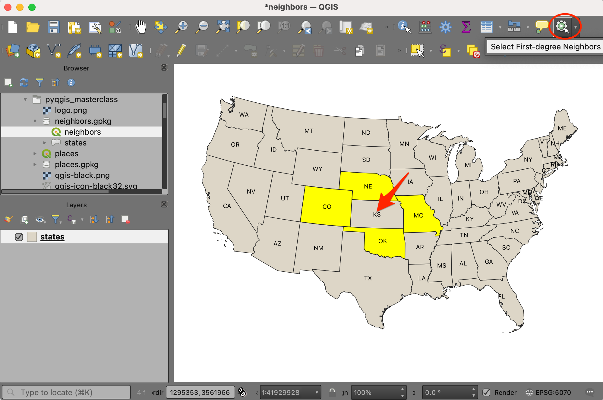
```

5. We can add one more action to select second-degree neighbors (i.e. neighbors of neighbors). Right-click the `states` layer and select Properties. Switch to the *Actions* tab and click the *Add a new action (+)* button. Select **Python** as the Type. Enter **Select Second-degree Neighbors** as the Description. Leave the Action Scopes to the default selected values of **Feature** and **Canvas**. Under the Action Text enter the following Python code and click *OK*. Click *OK* again to get back to the main QGIS Canvas.

```{r echo=FALSE, fig.align='center', out.width='60%'}
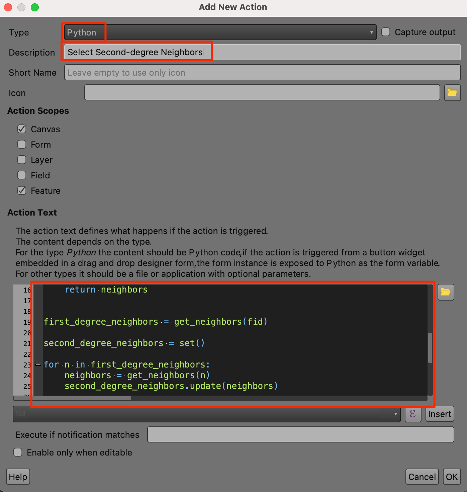
```

```{python eval=FALSE}
layer_id = '[%@layer_id%]'
fid = [% $id %]

layer = QgsProject.instance().mapLayer(layer_id)

def get_neighbors(fid):
    f = layer.getFeature(fid)
    # Use list comprehension to get all intersecting features
    # You may also use touches() if your data is topologically correct
    # Supply the bounding box to getFeatures() to use Spatial Index
    neighbors = [
        c.id()
        for c in layer.getFeatures(f.geometry().boundingBox())
        if c.geometry().intersects(f.geometry()) and c.id() != f.id()
    ]
    return neighbors


first_degree_neighbors = get_neighbors(fid)

second_degree_neighbors = set()

for n in first_degree_neighbors:
    neighbors = get_neighbors(n)
    second_degree_neighbors.update(neighbors)

# Remove all first-degree neighbors from the set
second_degree_neighbors = second_degree_neighbors.difference(
    set(first_degree_neighbors))
    
# Remove the feature itself from the set if it exists
second_degree_neighbors.discard(fid)

# Apply the selection
layer.selectByIds(list(second_degree_neighbors))
```

6.  Locate the *Actions* button on the *Attributes Toolbar*. Trigger the action *Select Second-degree Neighbors* and click on any states. You will see all the neighbors of neighbors selected.

```{r echo=FALSE, fig.align='center', out.width='75%'}
knitr::include_graphics('images/pyqgis/neighbors6.png')
```

## Exercise 11

If you use the action again, the current selection will go away and a new selection will be made. We want to change this behavior by adding to the existing selection. Update the code for the action *Select Second-degree Neighbors* so when used, it adds the second-degree neighbors to already selected features.

Hint: Supply an additional behavior option for the  [`QgsVectorLayer.selectByIds()`](https://qgis.org/pyqgis/3.34/core/QgsVectorLayer.html#qgis.core.QgsVectorLayer.selectByIds) method.

```{r echo=FALSE, fig.align='center', out.width='75%'}
knitr::include_graphics('images/pyqgis/neighbors_exercise.png')
```

## 12.3 Learn More

If you are intrigued by the power of QGIS Actions, check out our full-length [QGIS Actions workshop](https://courses.spatialthoughts.com/qgis-actions.html) which cover many more practical examples of automating tasks in QGIS using Actions.


# 13. Writing Standalone Python Scripts

Having the python script run within QGIS is useful and desired most of the time. But there is a way to write python scripts that run on your system without QGIS being open. Ability to run PyQGIS scripts in a headless mode allows you to automate your workflow and run it on a server without human intervention. Let's use some QGIS processing algorithms to carry out zonal statistics using a standalone python script.

Create a new file with the code below and save it as `zonal_stats.py`.

```{python eval=FALSE, code=readLines('code/pyqgis/zonal_stats.py')}
```

You will notice that the script has a few notable parts. First there is the import statement at the top, to explicitly import the required modules. Next, we create an instance of the `QgsApplication` class and run `initQis()` method to load the QGIS data providers and layer registry. We also import the `Processing` module and initialize it. Finally we call `exitQgis()` to remove them from memory. We have hard-coded the path to the input layers but they can easily be taken as command-line flags using Python's [argparse](https://docs.python.org/3/library/argparse.html) module. Also we don't have the QGIS GUI, we have no way of displaying the messages, so we remove those statements.

When you run the script within QGIS, all the paths to QGIS libraries and environment variables are already set and python is able to find and use it. But when you run the script outside of QGIS, you need to set them yourself. Also if you are using Processing Algorithms, you need to make sure the path to core plugin folder is included in the PYTHONPATH environment variable.

Our recommended environment setup takes care of all the requirements and allows you to run PyQGIS scripts easily. The next sections describe this setup and show you how to run the script on various platforms.

> You may need to change these paths slightly based on where QGIS is installed. The following scripts assume you are running QGIS-LTR installed at the default location.

## Windows Configuration

On Windows, you can do this using a batch file. Create a new file named `run_script.bat` with the following code. Make sure to save it in the same directory.

```{bash eval=FALSE, code=readLines('code/pyqgis/run_script.bat')}
```

Open the command prompt, browse to the directory with the above files, type `run_script.bat` and press Enter.

> You can also just double-click the `run_script.bat` to run it, but you will not see any error or success messages. So it is always a good idea to run the script from the shell.

The script will run and produce the output at the given path.

```{r echo=FALSE, fig.align='center', out.width='75%'}
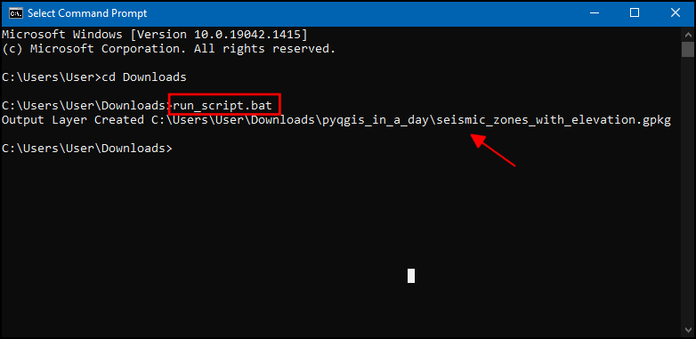
```

The resulting vector layer has an additional column containing the statistics from the raster.

```{r echo=FALSE, fig.align='center', out.width='75%'}
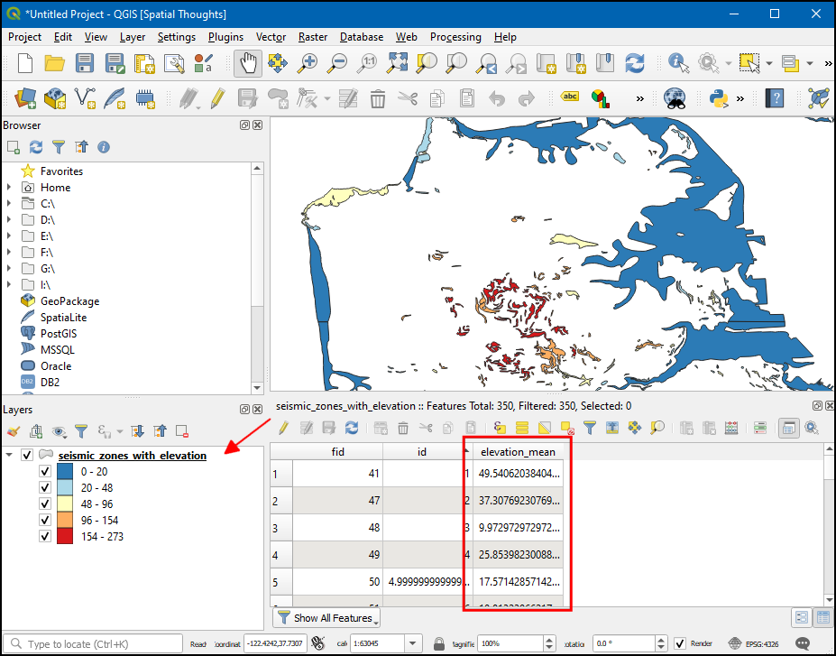
```

## MacOS Configuration

On MacOS, you can set the required environment variables and run the script using a shell script. Create a file named `run_script.sh` and save it in the same directory as the script.

```{python eval=FALSE, code=readLines('code/pyqgis/run_script.sh')}
```

Open a Terminal and browse to the directory with the script. Type `bash run_script.sh` and press enter. The script will run and produce the output at the given path.


# Supplement

This section contains code snippets for common PyQGIS operations.

All code snipets assume you have loaded the `sf.qgz` project. You can load the project using the code below.

```{python eval=FALSE}
import os
data_dir = os.path.join(os.path.expanduser('~'), 'Downloads', 'pyqgis_masterclass')
project = QgsProject.instance()
project_name = 'sf.qgz'
project_path = os.path.join(data_dir, project_name)
project.read(project_path)
```

## Create a Geodesic Line

Connects 2 points using the great circle arc along an ellipsoid. Uses the `geodesicLine()` method provided by the `QgsDistanceArea()` class for the computation.

```{r echo=FALSE, fig.align='center', out.width='75%'}
knitr::include_graphics('images/pyqgis/geodesic_line.png')
```

```{python eval=FALSE, code=readLines('code/pyqgis/geodesic_line.py')}
```

## Save Map Rendering as an Image

`saveAsImage()` method is quick and easy, but you do not have much control over the resulting image. You can't control the resolution, size or how each layer will be rendered. There is another way to achieve this. You can look at the code for exporting map as an image in QGIS and you will discover 2 classes `QgsMapRendererParallelJob` and `QgsMapRendererSequentialJob` that lets you achieve a better result. The code snippet below exports a hi-resolution image of the project.

```{python eval=FALSE}
import os
data_dir = os.path.join(os.path.expanduser('~'), 'Downloads', 'pyqgis_masterclass')
image_name = 'sf_hires.png'
image_path = os.path.join(data_dir, image_name)

settings = iface.mapCanvas().mapSettings()
settings.setOutputSize(QSize(1000,1000))

settings.setFlag(QgsMapSettings.DrawLabeling, False)
settings.setFlag(QgsMapSettings.Antialiasing, True)

job = QgsMapRendererSequentialJob(settings)
job.start()
job.waitForFinished()
image = job.renderedImage()
image.save(image_path)
```

```{r echo=FALSE, fig.align='center', out.width='75%'}
knitr::include_graphics('images/pyqgis/sf_hires.png')
```

## Search for a layer

```{python eval=FALSE}
blocks = QgsProject.instance().mapLayersByName('blocks')[0]
```

## Turn a layer on/off

```{python eval=FALSE}
blocks = QgsProject.instance().mapLayersByName('blocks')[0]
QgsProject.instance().layerTreeRoot().findLayer(blocks.id()).setItemVisibilityChecked(True)
```


## Get all Layers

```{python eval=FALSE}
for layer in QgsProject.instance().mapLayers().values():
	print(layer.name())
```

## Get only checked (visible) Layers

```{python eval=FALSE}
for layer in iface.mapCanvas().layers():
	print(layer.name())
```

## Get only selected Layers

```{python eval=FALSE}
for layer in iface.layerTreeView().selectedLayers():
  print(layer.name())
```

## Set Canvas Extent to a Layer Extent

Select one of the layers in the *Layers* panel and run the following code.

```{python eval=FALSE}
layer = iface.activeLayer()
mc = iface.mapCanvas()
mc.setExtent(layer.extent())
mc.refresh()
```

## Get Layers with Hierarchy

This code snippet is taken from the [Cheat Sheet for PyQGIS](https://docs.qgis.org/testing/en/docs/pyqgis_developer_cookbook/cheat_sheet.html) , but contains an important modification. If you notice carefully, the function `getGroupLayers` is called recursively from within `getGroupLayers`. This allows one to even get layers that have sub-groups within layer groups.

```{python eval=FALSE}
def getGroupLayers(group):
    print('- group:' + group.name())
    for child in group.children():
        if isinstance(child, QgsLayerTreeGroup):
            getGroupLayers(child)
        else:
            print('  - layer:' + child.name())


root = QgsProject.instance().layerTreeRoot()
for child in root.children():
    if isinstance(child, QgsLayerTreeGroup):
        getGroupLayers(child)
    elif isinstance(child, QgsLayerTreeLayer):
        print ("- layer: " + child.name())
```

```{r echo=FALSE, fig.align='center', out.width='50%'}
knitr::include_graphics('images/pyqgis/layergroup.png')
```

## Remove a Specific Button from a Toolbar

The following code snippet shows how once can find names of different widget in the QGIS Application and locate specific toolbars and buttons. The following code will disable to *Deselect All Features from Layers* button from the *Selection Toolbar*.

```{python eval=FALSE}
# Find all child objects of the mainWindow that are type QToolbar
for x in iface.mainWindow().findChildren(QToolBar): 
    print(x.objectName())
    
# In the printed list, we observe that 
# the selection toolbar is named mSelectionToolBar
# Get a reference to it by name
selectionToolbar = iface.mainWindow().findChild(QToolBar,'mSelectionToolBar')

# Find the buttons on the toolbar
for x in selectionToolbar.findChildren(QAction):
    print(x.objectName())

# Alternatively, you can also use the following
for x in selectionToolbar.actions():
    print(x.objectName())

# If the toolbar button is not an action, you
# We know the name of the deselection button 
# Get a reference to it by name
deselection = selectionToolbar.findChild(QAction,'ActionDeselection')

# We can disable a widget by calling setEnabled(False)
deselection.setEnabled(False)

# We can remove it completely by calling removeAction()
selectionToolbar.removeAction(deselection)
```

## Add a Drop-down Menu to Toolbar

This example shows how to add a `QCombobox` widget to a toolbar and populate it with attribute values from a layer. On click of the button, the selection is read from the combo box and used to apply a filter to the layer

> You must have a layer with an attribute called **NAME** for this example to work. Tested with the [Natural Earth Admin 0 - Countries](https://www.naturalearthdata.com/downloads/10m-cultural-vectors/) layer.

```{python eval=FALSE}
toolBar = iface.addToolBar("My Toolbar")
toolBar.setObjectName("My Toolbar")

countryCombo = QComboBox(toolBar)
toolBar.addWidget(countryCombo)
countryCombo.setToolTip("Select a country")


filterButton = QPushButton('Filter')
filterButton.setToolTip('Filter')
toolBar.addWidget(filterButton)

resetButton = QPushButton('Reset')
resetButton.setToolTip('Reset')
toolBar.addWidget(resetButton)

# We want to sort the layer by country names
# configure QgsFeatureRequest and use it with getFeatures()
request = QgsFeatureRequest()
clause = QgsFeatureRequest.OrderByClause('NAME')
orderby = QgsFeatureRequest.OrderBy([clause])
request.setOrderBy(orderby)
layer = iface.activeLayer()

# Read the country names and save in a list
countries = []
for f in layer.getFeatures(request):
  name = f['NAME']
  if name:
    countries.append(name)

# Add items to the combobox
for country in countries:
    countryCombo.addItem(country)

# Define functions to apply and reset filters
def filter_layer():
    layer = iface.activeLayer()
    country = countryCombo.currentText()
    expression = '\"NAME\" = \'{}\''.format(country)
    layer.setSubsetString(expression)

def reset_layer():
    layer = iface.activeLayer()
    layer.setSubsetString('')
    countryCombo.clear()
    for country in countries:
      countryCombo.addItem(country)
      
filterButton.clicked.connect(filter_layer)
resetButton.clicked.connect(reset_layer)
```

## Adding CSV Layers

```{python eval=FALSE}
import os
data_dir = os.path.join(os.path.expanduser('~'), 'Downloads', 'pyqgis_masterclass')

filename = 'trees.csv'
csvpath = 'file:///' + data_dir + filename
uri = '{}?type=csv&xField={}&yField={}&crs={}'.format(
  csvpath, 'Longitude', 'Latitude', 'EPSG:4326')
iface.addVectorLayer(uri, 'trees', 'delimitedtext')
```

## Inserting Layers in the Layer Tree

We can use the `QgsLayerTree` class to insert the layer at an appropriate place.

```{python eval=FALSE}
import os
data_dir = os.path.join(os.path.expanduser('~'), 'Downloads', 'pyqgis_masterclass')

filename = 'srtm.tif'
uri = os.path.join(data_dir, filename)
rlayer = QgsRasterLayer(uri, 'srtm', 'gdal')

rastergroup = QgsLayerTreeGroup('raster layers')
treelayer = QgsLayerTreeLayer(rlayer)
rastergroup.insertChildNode(0, treelayer)

root = QgsProject.instance().layerTreeRoot()
root.insertChildNode(1, rastergroup)
```

```{r echo=FALSE, fig.align='center', out.width='50%'}
knitr::include_graphics('images/pyqgis/rasterlayer.png')
```

## Saving Layers to Disk

Use the `QgsRasterFileWriter` or `QgsVectorFileWriter` classes for writing layers to disk.


```{python eval=FALSE}
import os
data_dir = os.path.join(os.path.expanduser('~'), 'Downloads', 'pyqgis_masterclass')

options = QgsVectorFileWriter.SaveVectorOptions()
options.actionOnExistingFile = QgsVectorFileWriter.CreateOrOverwriteLayer 
options.layerName = 'point'

filename = 'sf.gpkg'
path = os.path.join(data_dir, filename)
QgsVectorFileWriter.writeAsVectorFormat(vlayer, path, options)
```

## Displaying a label with a background color

This is a vast topic, but you can get a taste of the flexibility offered by the API to control all aspects of labeling. Notice the class name `QgsPalLayerSettings` - this is because QGIS uses a labeling library called [PAL](http://pal.heig-vd.ch/index.php?page=about-pal) for labels. The code snippet below shows how to create a label for a point layer with a background color. [^8]


```{python eval=FALSE}
vlayer = QgsProject.instance().mapLayersByName('point')[0]
symbol = QgsMarkerSymbol.createSimple({'name': 'square', 'color': 'red'})
vlayer.renderer().setSymbol(symbol)

label_settings = QgsPalLayerSettings()
#label_settings.drawBackground = True
label_settings.fieldName = 'name'

text_format = QgsTextFormat()
background_color = QgsTextBackgroundSettings()
background_color.setFillColor(QColor('white'))
background_color.setEnabled(True)
text_format.setBackground(background_color )
label_settings.setFormat(text_format)

vlayer.setLabeling(QgsVectorLayerSimpleLabeling(label_settings))
vlayer.setLabelsEnabled(True)
vlayer.triggerRepaint()
```

```{r echo=FALSE, fig.align='center', out.width='75%'}
knitr::include_graphics('images/pyqgis/label.png')
```

## Edit Attribute Table of a Vector Layer

When you use processing, a new layer is created by each algorithm. This example shows, how to use processing to overwrite the original layer with the results of processing.

```{python eval=FALSE}
import os
data_dir = os.path.join(os.path.expanduser('~'), 'Downloads', 'pyqgis_masterclass')

filename = 'sf.gpkg|layername=blocks'
uri = os.path.join(data_dir, filename)
blocks = QgsVectorLayer(uri, 'blocks', 'ogr')

output = processing.run(
    "qgis:deletecolumn", 
    {'INPUT': blocks,'COLUMN':['multigeom'],'OUTPUT':'memory:'})
outputlayer = output['OUTPUT']

final = processing.run("qgis:fieldcalculator",
    {'INPUT':outputlayer,
    'FIELD_NAME':'area',
    'FIELD_TYPE':0,
    'FIELD_LENGTH':10,
    'FIELD_PRECISION':3,
    'NEW_FIELD':True,
    'FORMULA':'$area',
    'OUTPUT':'memory:'})
finallayer = final['OUTPUT']

options = QgsVectorFileWriter.SaveVectorOptions()
# We overwrite the original layer
options.layerName = 'blocks'
options.actionOnExistingFile = QgsVectorFileWriter.CreateOrOverwriteLayer 

output_file = 'sf.gpkg'
output_path = os.path.join(data_dir, output_file)
QgsVectorFileWriter.writeAsVectorFormat(finallayer, output_path, options)
QgsProject.instance().reloadAllLayers()
```


## Creating a PDF with Title


```{r echo=FALSE, fig.align='center', out.width='75%'}
knitr::include_graphics('images/pyqgis/layout.png')
```

```{python eval=FALSE}
import os
data_dir = os.path.join(os.path.expanduser('~'), 'Downloads', 'pyqgis_masterclass')

project = QgsProject.instance()
extent = QgsRectangle(-122.52, 37.71, -122.35, 37.83)

layout = QgsPrintLayout(project)
layout.initializeDefaults()

pages = layout.pageCollection()
pages.beginPageSizeChange()
page = pages.page(0)
page.setPageSize('A4',  QgsLayoutItemPage.Landscape)
pages.endPageSizeChange()
page_center = page.pageSize().width() / 2


map = QgsLayoutItemMap(layout)
map.setRect(QRectF(-122.52, 37.71, -122.35, 37.83))
map.setExtent(extent)
a4 = QPageSize().size(QPageSize.A4, QPageSize.Millimeter)
map.attemptResize(QgsLayoutSize(a4.height(),  a4.width()))

layout.addItem(map)
title = QgsLayoutItemLabel(layout)
title.setText('San Francisco')
title.setFont(QFont('Arial', 36))
title.adjustSizeToText()
title.setReferencePoint(QgsLayoutItem.UpperMiddle)
title.attemptMove(QgsLayoutPoint(page_center, 10))
layout.addItem(title)

output_file = 'sf.pdf'
output_path = os.path.join(data_dir, output_file)

exporter = QgsLayoutExporter(layout)
exporter.exportToPdf(
    output_path, QgsLayoutExporter.PdfExportSettings())
```

```{r echo=FALSE, fig.align='center', out.width='75%'}
knitr::include_graphics('images/pyqgis/layoutpdf.png')
```


## Simplifying Processing Scripts

The Processing Framework providers a simpler way to write processing scripts by using the ``@alg`` decorator. Using this approach, you are able to remove a lot of *boilerplate* code and focus on just writing the main algorithm function. There are some limitations of this approach - the main one being that scripts written using the ``@alg`` decorator cannot be used in plugins. But if your goal is to create a processing scripts, this is a much simpler style.

> Note: the ``@alg`` decorator cannot be used in plugins. If you are writing processing algorithms for a plugin, use the full script template shown in the previous section.

Let's modify the `save_attributes_algorithm.py` script covered in the [previous section](#writing-a-processing-script) to use the built-in ``@alg`` decorator. Locate the script in *Processing Toolbox* under **Scripts  &rarr; Save Attributes As CSV**. Right-click on it and select *Edit Script...*. Replace all the code in the *Processing Script Editor* with the following and click the *Save Script* button

```{python eval=FALSE, code=readLines('code/pyqgis/save_attributes_decorator.py')}
```

You can run the script and see that the behavior is almost identical but the code is much simpler. The code uses the ``@alg`` decorator for defining algorithm name, group, inputs and outputs in a more concise way. 

Another important thing to note is that to create a processing algorithm, one must create a class that inherits from ``QgsProcessingAlgorithm``. When you write a class, you refer to the current instance of the class with the keyword ``self``. Here you are just writing a function, and the decorator will create a class for you. So we are using a parameter named ``instance``. When the decorator will create a class, the reference to the instance will be passed on to our function as this parameter.


*[Back to Top](#){style="float:right"}*

# What next?

We have several step-by-step tutorials and guides on PyQGIS development. You can do those tutorials to practice your skills and build confidence.

**Tutorials**

- [Getting Started With Python Programming](https://www.qgistutorials.com/en/docs/3/getting_started_with_pyqgis.html){target="_blank"}
- [Running Processing Algorithms via Python](https://www.qgistutorials.com/en/docs/3/processing_algorithms_pyqgis.html){target="_blank"}
- [Using Custom Python Expression Functions](https://www.qgistutorials.com/en/docs/3/custom_python_functions.html){target="_blank"}
- [Writing Python Scripts for Processing Framework](https://www.qgistutorials.com/en/docs/3/processing_python_scripts.html){target="_blank"}
- [Building a Python Plugin](https://www.qgistutorials.com/en/docs/3/building_a_python_plugin.html){target="_blank"}
- [Building a Processing Plugin](https://www.qgistutorials.com/en/docs/3/processing_python_plugin.html){target="_blank"}

**Guides**

- [Snapping GPS tracks to Roads using PyQGIS and OSRM](https://spatialthoughts.com/2020/02/22/snap-to-roads-qgis-and-osrm/){target="_blank"}
- [Approximating Geodesic Buffers with PyQGIS](https://spatialthoughts.com/2019/04/05/geodesic-buffers-in-qgis/){target="_blank"}
- [Exporting Print Layouts from Processing Scripts](https://spatialthoughts.com/2020/02/09/exporting-map-layouts/){target="_blank"}
- [K-Means Clustering with Equal Sized Clusters in QGIS](https://spatialthoughts.com/2021/01/31/equal-sized-kmeans-qgis/){target="_blank"}
- [Creating Maps with Google Earth Engine and PyQGIS](https://spatialthoughts.com/2020/04/04/ndvi-time-series-gee-qgis/){target="_blank"}

# Resources

* Official QGIS Documentation - [PyQGIS Developer Cookbook](https://docs.qgis.org/testing/en/docs/pyqgis_developer_cookbook/){target="_blank"}
* [PyQGIS 101: Introduction to QGIS Python programming for non-programmers](https://anitagraser.com/pyqgis-101-introduction-to-qgis-python-programming-for-non-programmers/){target="_blank"} by Anita Graser
* [PyQGIS Samples](https://webgeodatavore.github.io/pyqgis-samples/){target="_blank"} by Thomas Gratier
* [Deploying a Customized Version of QGIS](https://github.com/haubourg/custom-osgeo4w-qgis){target="_blank"} by Régis Haubourg 

# Data Credits

* `blocks`, `parcels`, `streets`, `zoning`, `trees`, `seasmic_zones`, `shoreline`. Downloaded from [DataSF Open Data Portal](https://datasf.org/opendata/)
* `srtm` NASA Shuttle Radar Topography Mission Global 1 arc second provided by The Land Processes Distributed Active Archive Center (LP DAAC). Downloaded using [30-Meter SRTM Tile Downloader](https://dwtkns.com/srtm30m/)
* `aoi`: CA Places Boundaries from 2016 TIGER/Line Shapefiles. Downloaded from [California Open Data Portal](https://data.ca.gov/dataset/ca-geographic-boundaries)
* `populated_places`: Made with Natural Earth. Free vector and raster map data @ [naturalearthdata.com](https://www.naturalearthdata.com/)

# License

This course material is licensed under a [Creative Commons Attribution 4.0 International (CC BY 4.0)](https://creativecommons.org/licenses/by/4.0/). You are free to re-use and adapt the material but are required to give appropriate credit to the original author as below:

*Customizing QGIS with Python Course* by Ujaval Gandhi [www.spatialthoughts.com](https://spatialthoughts.com)

<!--
If you would like to white-label these materials as part of a commercial offering, you can purchase a *Trainer License* for a small fee. Please [contact us](https://spatialthoughts.com/contact/) for pricing and terms.


This material is part of the *Trainer's Package* and the buyer gets a non-exclusive, non-transferable, perpetual license to the material. You can fully customize and brand the materials to your requirements.
-->

***

**This course is offered as an instructor-led online class. Visit [Spatial Thoughts](https://spatialthoughts.com/events/) to know details of upcoming sessions.**

***

&copy; 2020 Spatial Thoughts [www.spatialthoughts.com](https://spatialthoughts.com)