\newpage

***

```{r echo=FALSE, fig.align='center', out.width='75%', out.width='250pt'}
knitr::include_graphics('images/spatial_thoughts_logo.png')
```

***

\newpage

# Introduction 

This is an intermediate-level course that teaches you how to use Python for creating charts, plots, animations, and maps.


[{width="400px"}](https://docs.google.com/presentation/d/1Mc8O7zXJt-0LwUocPjpfjvkqYj-0qRnUMUIFpftVZFw/edit?usp=sharing){target="_blank"}

[View the Presentation &#8599;](https://docs.google.com/presentation/d/1Mc8O7zXJt-0LwUocPjpfjvkqYj-0qRnUMUIFpftVZFw/edit?usp=sharing){target="_blank"}

# Notebooks and Datasets

This course uses Google Colab for all exercises. You do not need to install any packages or download any datasets. 

The notebooks can be accessed by clicking on the  buttons at the beginning of each section. Once you have opened the notebook in Colab, you can copy it to your own account by going to *File &rarr; Save a Copy in Drive*. 


```{r echo=FALSE, fig.align='center', out.width='75%'}
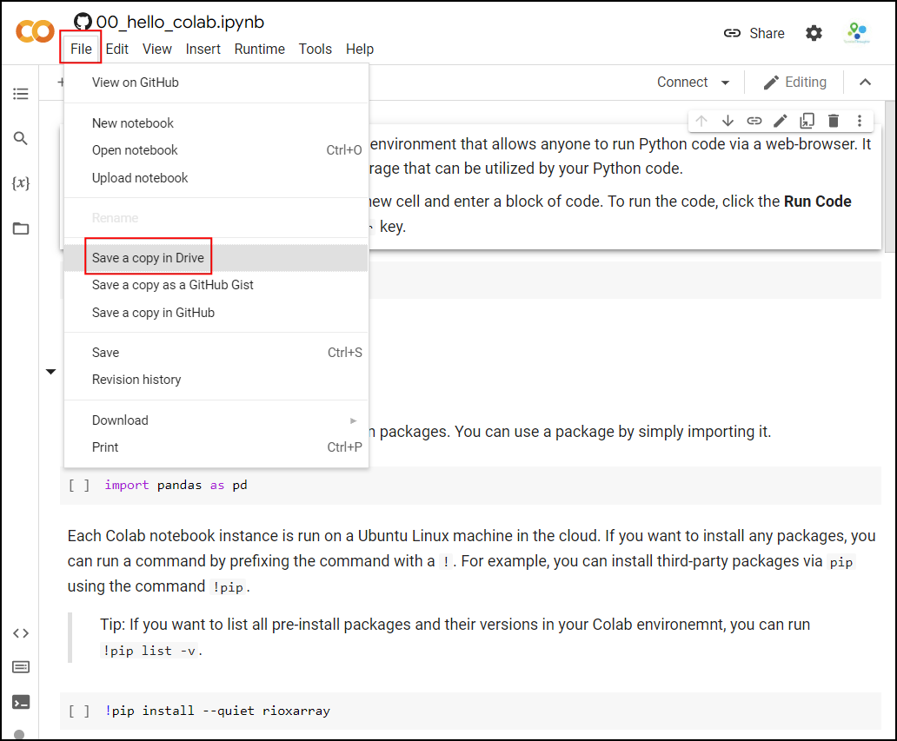
```

Once the notebooks are saved to your drive, you will be able to modify the code and save the updated copy. You can also click the *Share* button and share a link to the notebook with others.

```{r echo=FALSE, fig.align='center', out.width='75%'}
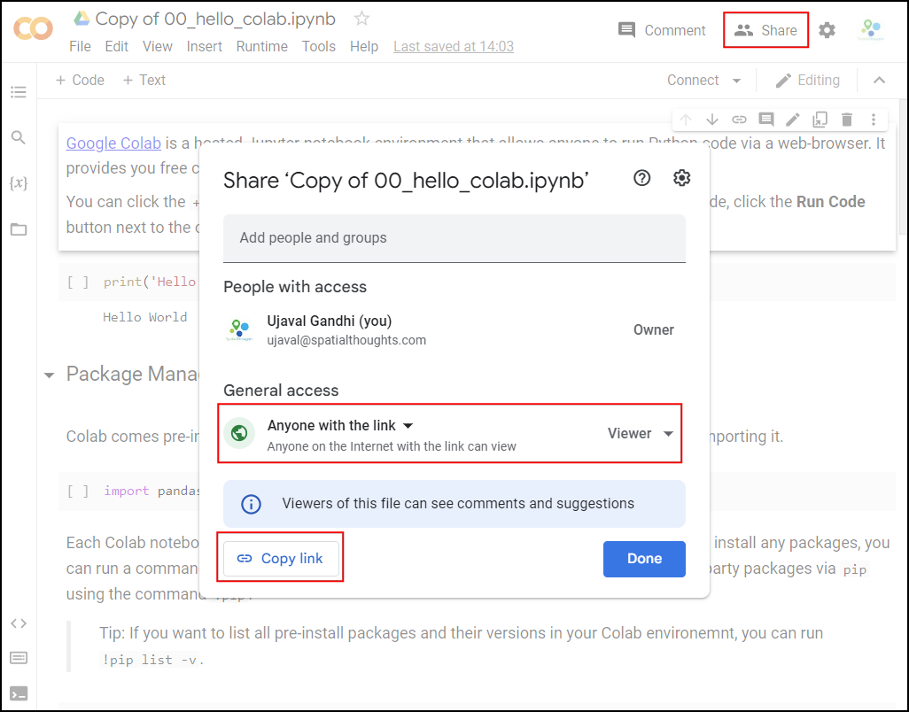
```


\newpage


# Hello Colab

[](https://colab.research.google.com/github/spatialthoughts/python-dataviz-web/blob/main/00_hello_colab.ipynb)


```{r child='python-dataviz-output/00_hello_colab.md'}
```

----

# Matplotlib Basics

[](https://colab.research.google.com/github/spatialthoughts/python-dataviz-web/blob/main/01_matplotlib_basics.ipynb)


```{r child='python-dataviz-output/01_matplotlib_basics.md'}
```

----

# Creating Charts

[](https://colab.research.google.com/github/spatialthoughts/python-dataviz-web/blob/main/02_creating_charts.ipynb)


```{r child='python-dataviz-output/02_creating_charts.md'}
```

----

# Creating Maps

[](https://colab.research.google.com/github/spatialthoughts/python-dataviz-web/blob/main/03_creating_maps.ipynb)

```{r child='python-dataviz-output/03_creating_maps.md'}
```

----

# Using Basemaps

[](https://colab.research.google.com/github/spatialthoughts/python-dataviz-web/blob/main/04_using_basemaps.ipynb)

```{r child='python-dataviz-output/04_using_basemaps.md'}
```

----

# XArray Basics

[](https://colab.research.google.com/github/spatialthoughts/python-dataviz-web/blob/main/05_xarray_basics.ipynb)

```{r child='python-dataviz-output/05_xarray_basics.md'}
```

----

# Mapping Gridded Datasets

[](https://colab.research.google.com/github/spatialthoughts/python-dataviz-web/blob/main/06_mapping_gridded_datasets.ipynb)

```{r child='python-dataviz-output/06_mapping_gridded_datasets.md'}
```

----

# Visualizing Rasters

[](https://colab.research.google.com/github/spatialthoughts/python-dataviz-web/blob/main/07_visualizing_rasters.ipynb)

```{r child='python-dataviz-output/07_visualizing_rasters.md'}
```

----

# Interactive Maps with Folium

[](https://colab.research.google.com/github/spatialthoughts/python-dataviz-web/blob/main/08_interactive_maps_folium.ipynb)


```{r child='python-dataviz-output/08_interactive_maps_folium.md'}
```

----

# Multi-layer Interactive Maps

[](https://colab.research.google.com/github/spatialthoughts/python-dataviz-web/blob/main/09_multilayer_maps.ipynb)

Open the notebook named ``09_multilayer_maps.ipynb``.

----

```{r child='python-dataviz-output/09_multilayer_maps.md'}
```

# Leafmap Basics

[](https://colab.research.google.com/github/spatialthoughts/python-dataviz-web/blob/main/10_leafmap_basics.ipynb)

----

```{r child='python-dataviz-output/10_leafmap_basics.md'}
```

\newpage

# Streamlit Basics 

Streamlit is a Python library that allows you to create web-apps and dashboard by just writing Python code. It provides you with a wide range of UI widgets and layouts that can be used to build user-    interfaces. Your streamlit app is just a regular Python file with a `.py` extension. 

## Installation and Setting up the Environment 

You need to install the `streamlit` package to create the app. We will be using Anaconda to install ``streamlit`` and related packages on your machine. Please review the [Anaconda Installation Guide](https://courses.spatialthoughts.com/python-foundation.html#installation-and-setting-up-the-environment) for step-by-step instructions.

Once you have installed Anaconda, open *Anaconda Prompt* or a *Terminal* and run the following commands.

```
conda create --name streamlit -y
conda activate streamlit
conda install -c conda-forge streamlit leafmap geopandas streamlit-folium -y
```

After the installation is done, run the following command.

```
streamlit hello
```

```{r echo=FALSE, fig.align='center', out.width='75%'}
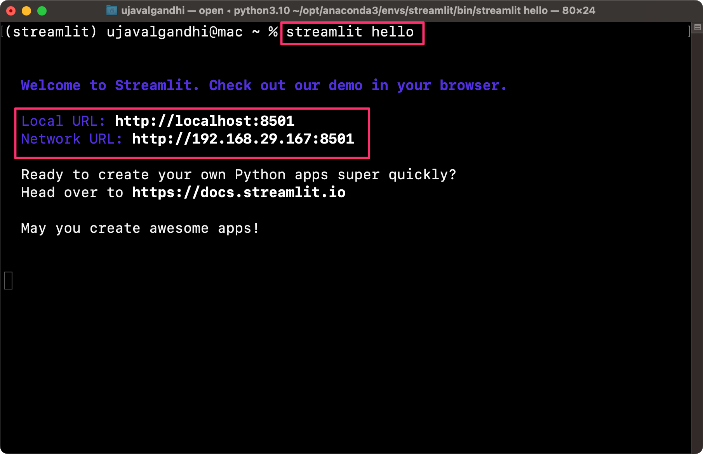
```

A new browser tab will open and display the streamlit Hello app.

```{r echo=FALSE, fig.align='center', out.width='75%'}
knitr::include_graphics('images/python_dataviz/streamlit2.png')
```

Your installation is now complete. You can close the terminal window to stop the streamlit server.


## Create a Simple Dashboard

Let's create a simple interactive dashboard by loading a CSV file and displaying a chart with some statistics. We will get familiar with the streamlit app development workflow and explore different widgets and layout elements.

1. Create a folder named **simple_dashboard** on your Desktop.

```{r echo=FALSE, fig.align='center', out.width='75%'}
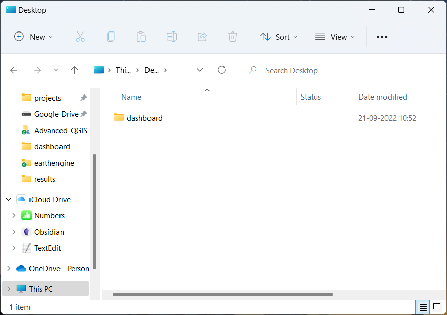
```

2. Open your favorite text editor and create a file with the following content. By convention, we import `streamlit as st`. Then we can use the `st.title()` to display the title of our dashboard and `st.write()` to add a paragraph of text. Save the file in the **simple_dashboard** folder on your desktop as `app.py`

```{python eval=FALSE}
import streamlit as st

st.title('A Simple Dashboard')
st.write('This dashboard displays a chart for the selected region.')
```

```{r echo=FALSE, fig.align='center', out.width='75%'}
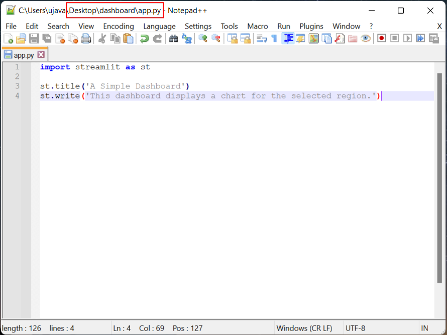
```

3. Once the file is saved, open *Anaconda Prompt* (Windows) or *Terminal* (Mac/Linux). Switch to the conda environment where you have installed the required packages. We then use `cd` command to change the current directory to  the once with the `app.py` file. Then run the following command to start the streamlit server and launch the app.

```{python eval=FALSE}
streamlit run app.py
```

```{r echo=FALSE, fig.align='center', out.width='75%'}
knitr::include_graphics('images/python_dataviz/dashboard3.png')
```

4. A new browser tab will open and display the output of the app.

```{r echo=FALSE, fig.align='center', out.width='75%'}
knitr::include_graphics('images/python_dataviz/dashboard4.png')
```

5. Let's read some data and display it. We load a CSV file from a URL using Pandas and get a DataFrame object. We then use `st.dataframe()` widget to render the dataframe. Update your `app.py` with the following code. As you save the file, you will notice that streamlit will detect it and display a prompt to re-run your app. Choose *Always rerun*.

```{python eval=FALSE}
import streamlit as st
import pandas as pd


st.title('A Simple Dashboard')
st.write('This dashboard displays a chart for the selected region.')


data_url = 'https://github.com/spatialthoughts/python-dataviz-web/raw/main/data/osm/'
csv_file = 'highway_lengths_by_district.csv'

url = data_url + csv_file
df = pd.read_csv(url)

st.dataframe(df)
```

```{r echo=FALSE, fig.align='center', out.width='75%'}
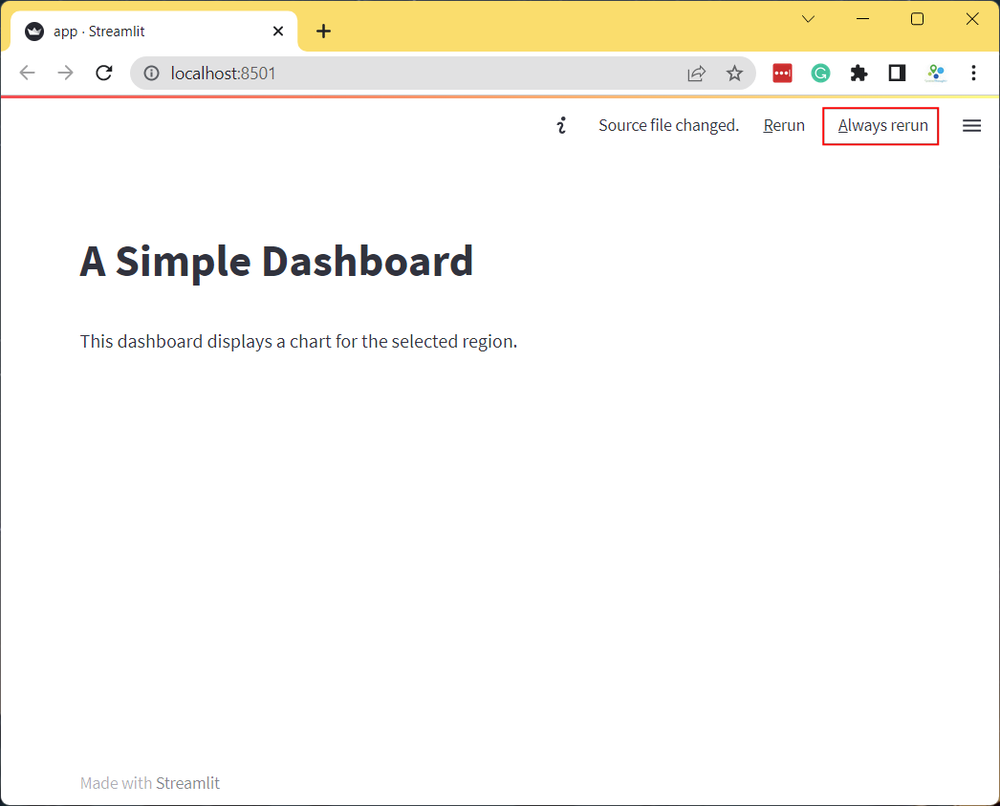
```

6. The app will now display the dataframe. The dataframe consists of 3 columns. The `DISTRICT` column contains a unique name for the admin region. The *NH* and *SH* columns contain the length of *National Highways* and *State Highways* in Kilometers for each admin region. We will now create a dashboard that displays a chart with the lengths of highways for the user-selected admin region.

```{r echo=FALSE, fig.align='center', out.width='75%'}
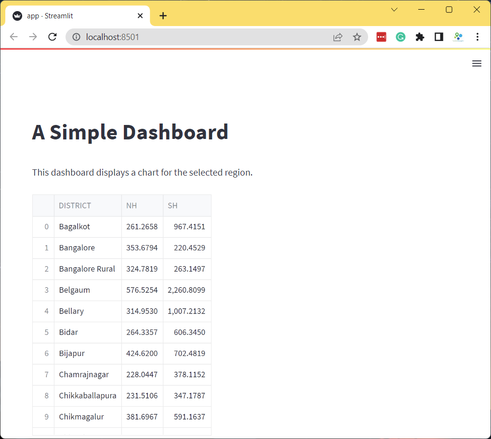
```


7. Let's add a dropdown menu with the list of admin regions. We first get the names from the `DISTRICT` column and use `st.selectbox()` to add a dropdown selector. Streamlit apps always run the entire `app.py` whenever any selection is changed. With our current app structure, whenever the user selected a new admin region, the source file will be fetched again and a new dataframe will be created. This is not required as the source data does not change on every interaction. A good practice is to put the data fetching in a function and use the `@st.cache` decorator which will cache the results. Anytime the function is called with the same arguments, it will return the cached version of the data instead of fetching it.

```{python eval=FALSE}
import streamlit as st
import pandas as pd


st.title('A Simple Dashboard')
st.write('This dashboard displays a chart for the selected region.')

@st.cache
def load_data():
    data_url = 'https://github.com/spatialthoughts/python-dataviz-web/raw/main/data/osm/'
    csv_file = 'highway_lengths_by_district.csv'

    url = data_url + csv_file
    df = pd.read_csv(url)
    
    return df

df = load_data()

districts = df.DISTRICT.values
district = st.selectbox('Select a district', districts)
```

```{r echo=FALSE, fig.align='center', out.width='75%'}
knitr::include_graphics('images/python_dataviz/dashboard7.png')
```

8. As the user selects an admin region from the selectbox, the selected value is saved in the `district` variable. We use it to filter the DataFrame to the selected district. Then we use Matplotlib to create a bar-chart with the filtered dataframe and display it using `st.pyplot()` widget.

```{python eval=FALSE}
import streamlit as st
import pandas as pd
import matplotlib.pyplot as plt


st.title('A Simple Dashboard')
st.write('This dashboard displays a chart for the selected region.')

@st.cache
def load_data():
    data_url = 'https://github.com/spatialthoughts/python-dataviz-web/raw/main/data/osm/'
    csv_file = 'highway_lengths_by_district.csv'

    url = data_url + csv_file
    df = pd.read_csv(url)
    
    return df

df = load_data()

districts = df.DISTRICT.values
district = st.selectbox('Select a district', districts)
filtered = df[df['DISTRICT'] == district] 


fig, ax = plt.subplots(1, 1)

filtered.plot(kind='bar', ax=ax, color=['#0000FF', '#FF0000'],
    ylabel='Kilometers', xlabel='Category')
ax.get_xaxis().set_ticklabels([])
stats = st.pyplot(fig)
```


```{r echo=FALSE, fig.align='center', out.width='75%'}
knitr::include_graphics('images/python_dataviz/dashboard8.png')
```

9. Our dashboard now displays an updated chart every-time you change the selection. Streamlit provides many other user-interface widgets. Let's explore some more of them. We will use `st.color_picker()` widget to allow users to customize the color of the bar chart. We can display 2 color-pickers side-by-side using a column layout. We use `st.columns()` to create 2 columns `col1` and `col2`. We add a `color_picker()` to each column with appropriate label and a default color. If we have more than 1 widget of the same type in the app, we need to provide a unique `key` that can be used to identify the widget. We make some final tweaks to the chart and complete the dashboard.


```{python eval=FALSE, code=readLines('code/python_dataviz/streamlit/simple_dashboard/app.py')}
```

```{r echo=FALSE, fig.align='center', out.width='75%'}
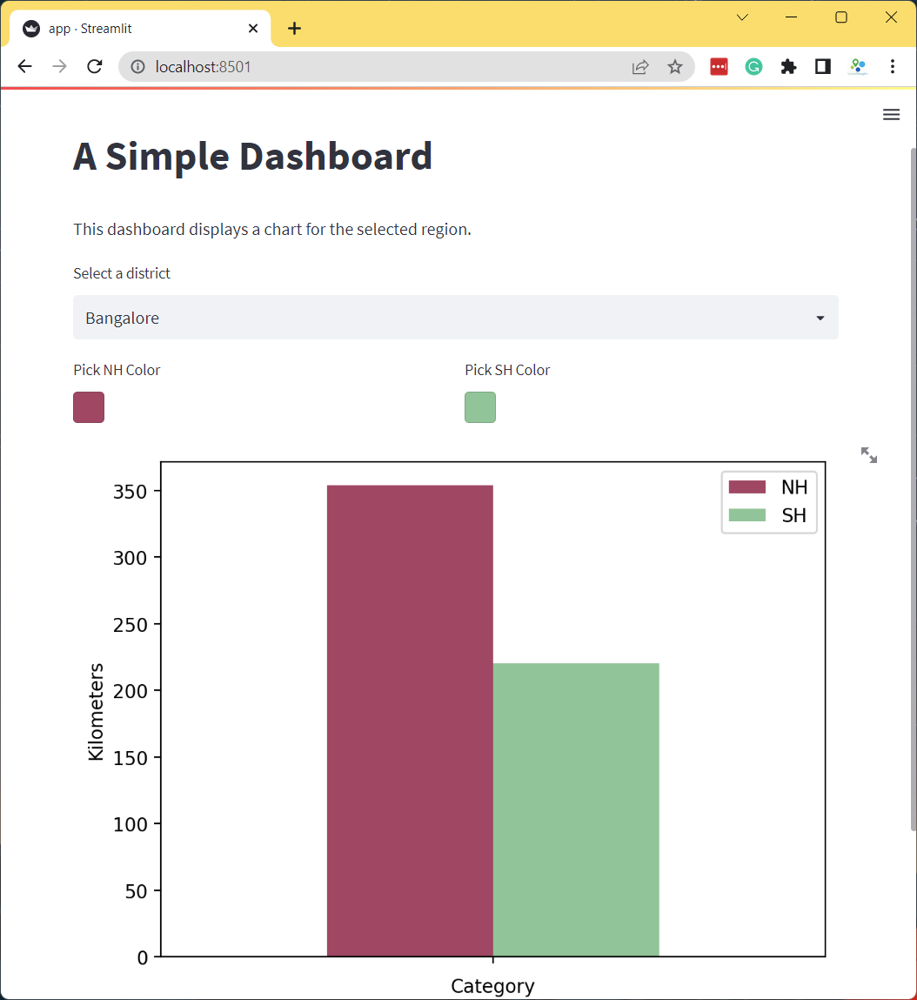
```

## Exercise

Add a radio-button to the app that allows the user to select the units for length between Kilometers and Miles as shown below. As the user toggles the radio-button, you should apply the appropriate conversion from Kilometer to Miles and update the chart.

* Hint1: Change `st.columns()` to have 3 columns and save the results into 3 separate objects. `col1, col2, col3 = st.columns(3)`
* Hint2: You can convert the values from Kilometer to Miles using `filtered = filtered[['NH', 'SH']]*0.621371`


```{r echo=FALSE, fig.align='center', out.width='75%'}
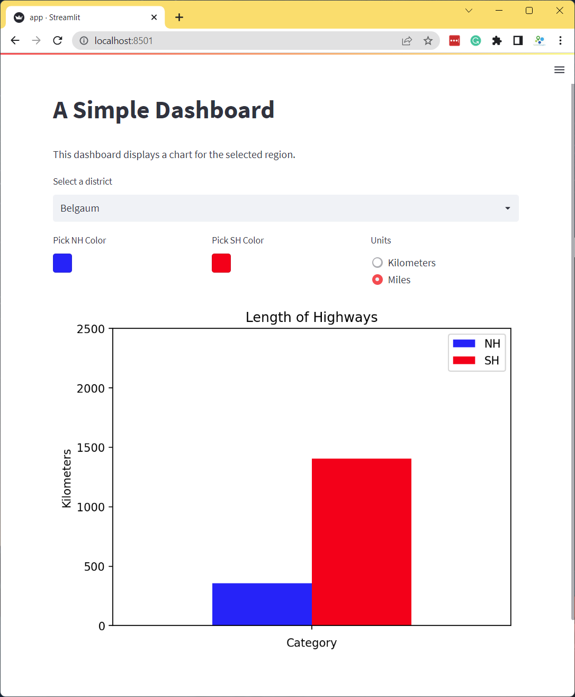
```

## Create a Simple App

Let's create a simple app that geocodes a user query and displays the results on a map. We will use [OpenRouteService Geocoding API](https://openrouteservice.org/dev/#/api-docs/geocode) for geocoding and Folium to display the results on a map.

1. We start by creating a new folder **simple_app* and create the `app.py` with a basic layout with a title, a description and a text input for the address.

```{python eval=FALSE}
import folium
import requests
import streamlit as st

st.title('A Simple Geocoder')
st.markdown('This app uses the [OpenRouteService API](https://openrouteservice.org/) '
    'to geocode the input address and siplay the results on a map.')
    
address = st.text_input('Enter an address.')
```

```{r echo=FALSE, fig.align='center', out.width='75%'}
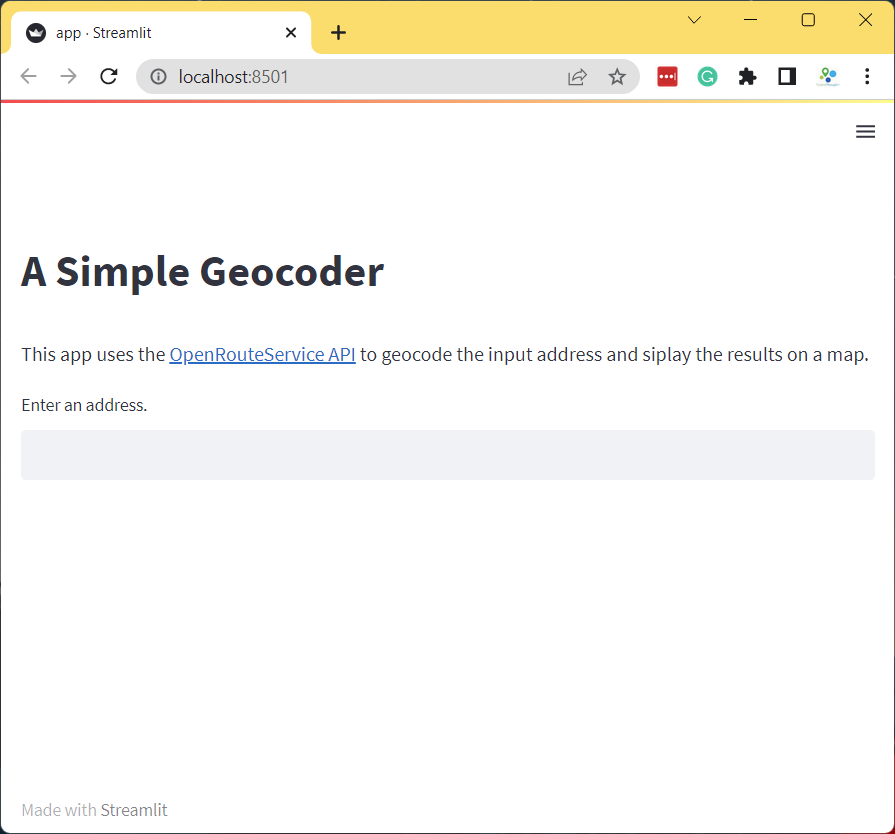
```

2. We need an API Key for OpenRouteService for our app. It is not a good practice to store the key in the code as it can be seen by others and can be misused. Streamlit provides an easy way to store such *secrets*. You create a folder named `.streamlit` in the app directory and store any key=value pairs in a file named `secrets.toml`. In the app, you can read any value using `st.secrets` with the stored key. Create a new file `secrets.toml` in the `.streamlit` directory with the following content. Replace `<your api key>` with the actual key. Once done, update the app to read the key from secrets.

```
'ORS_API_KEY' = '<your api key>'
```

```{python eval=FALSE}
import requests
import streamlit as st

st.title('A Simple Geocoder')
st.markdown('This app uses the [OpenRouteService API](https://openrouteservice.org/) '
    'to geocode the input address and siplay the results on a map.')
    
address = st.text_input('Enter an address.')

ORS_API_KEY = st.secrets['ORS_API_KEY']

```


```{r echo=FALSE, fig.align='center', out.width='75%'}

```


3. Now we add a `geocode()` function that will take an address and geocode it using OpenRouteService API.

```{python eval=FALSE}
import requests
import streamlit as st

st.title('A Simple Geocoder')
st.markdown('This app uses the [OpenRouteService API](https://openrouteservice.org/) '
  'to geocode the input address and siplay the results on a map.')

address = st.text_input('Enter an address.')

ORS_API_KEY = st.secrets['ORS_API_KEY']

@st.cache
def geocode(query):
    parameters = {
        'api_key': ORS_API_KEY,
        'text' : query
    }

    response = requests.get(
         'https://api.openrouteservice.org/geocode/search',
         params=parameters)
    if response.status_code == 200:
        data = response.json()
        if data['features']:
            x, y = data['features'][0]['geometry']['coordinates']
            return (y, x)
    
if address:
    results = geocode(address)
    if results:
        st.write('Geocoded Coordinates: {}, {}'.format(results[0], results[1]))
    else:
        st.error('Request failed. No results.')
```


```{r echo=FALSE, fig.align='center', out.width='75%'}
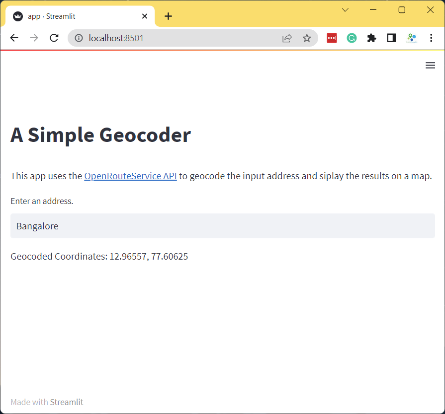
```


4. Now that we have coordinates, we can display it on a map using the [`streamlit_folium`](https://github.com/randyzwitch/streamlit-folium) component. 

```{python eval=FALSE, code=readLines('code/python_dataviz/streamlit/simple_app/app.py')}
```


```{r echo=FALSE, fig.align='center', out.width='75%'}
knitr::include_graphics('images/python_dataviz/app4.png')
```

## Exercise

Add a dropdown menu to give the users an option to change the default basemap of the Folium map. 

* Hint: Add a `st.selectbox()` with basemap strings. `st.selectbox('Select a basemap', ['OpenStreetMap', 'Stamen Terrain', 'Stamen Toner'])`

Reference: [`folium.folium.Map`](https://python-visualization.github.io/folium/modules.html#module-folium.folium)

```{r echo=FALSE, fig.align='center', out.width='75%'}
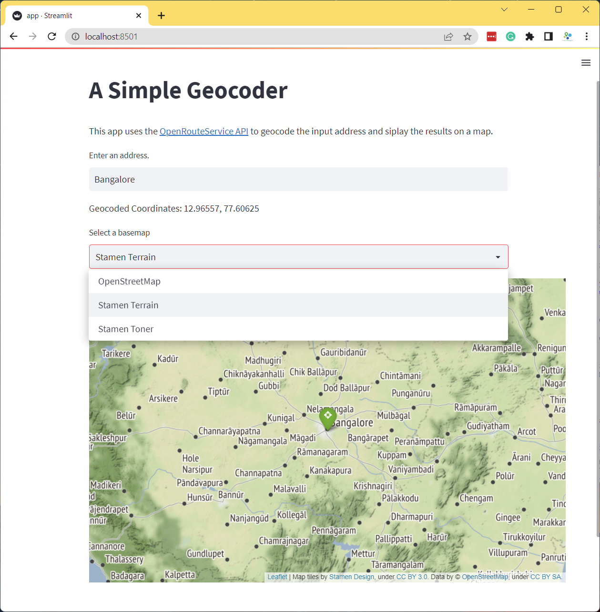
```


# Building Mapping Apps with Leafmap and Streamlit

We can leverag `leafmap` to create an interactive mapping dashboard that gives us the flexibility of using many different mapping backends and way to read a wide-variety of spatial data formats.

## Create a Mapping Dashboard

The code below creates an interactive mapping dashboard that displays the statistics of the selected region.

1. We start by creating the app directory **mapping_dashboard** and creating `app.py` with the following content. This code creates a layout with a sidebar using `st.sidebar()` and adds some widgets to it. Note that while we need to use `st.title()` for the main section, we use `st.sidebar.title()` for the sidebar.

```{python eval=FALSE}
import streamlit as st

st.set_page_config(page_title='Dashboard', layout='wide')

st.title('Highway Dashboard')

st.sidebar.title('About')
st.sidebar.info('Explore the Highway Statistics')
```

```{r echo=FALSE, fig.align='center', out.width='75%'}
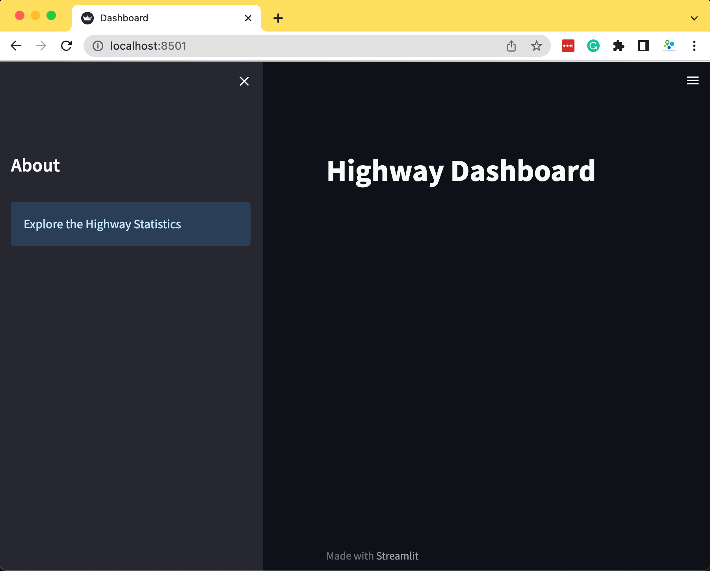
```


2. We now use `geopandas` to read 2 vector layers from a geopackage and `pandas` to read a CSV file containing road statistics. We put the code for data fetching inside a function and cache it using `@st.cache`

```{python eval=FALSE}
import streamlit as st
import geopandas as gpd
import pandas as pd

st.set_page_config(page_title='Dashboard', layout='wide')

st.title('Highway Dashboard')

st.sidebar.title('About')
st.sidebar.info('Explore the Highway Statistics')


data_url = 'https://github.com/spatialthoughts/python-dataviz-web/raw/main/data/osm/'
gpkg_file = 'karnataka.gpkg'
csv_file = 'highway_lengths_by_district.csv'

@st.cache
def read_gdf(url, layer):
    gdf = gpd.read_file(url, layer=layer)
    return gdf

@st.cache
def read_csv(url):
    df = pd.read_csv(url)
    return df
    
data_load_state = st.text('Loading data...')   
gpkg_url = data_url + gpkg_file
csv_url = data_url + csv_file
districts_gdf = read_gdf(gpkg_url, 'karnataka_districts')
roads_gdf = read_gdf(gpkg_url, 'karnataka_highways')
lengths_df = read_csv(csv_url)
data_load_state.text('Loading data... done!')
```


```{r echo=FALSE, fig.align='center', out.width='75%'}
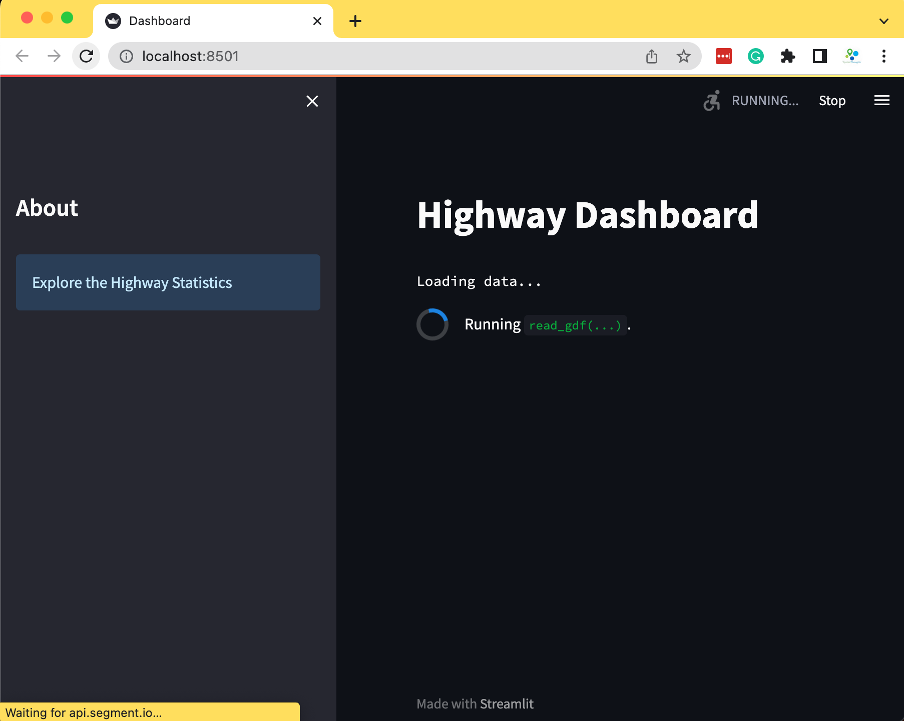
```

3. Now we use the information in the CSV file to display a chart in the sidebar.

```{python eval=FALSE}
import streamlit as st
import geopandas as gpd
import pandas as pd
import matplotlib.pyplot as plt

st.set_page_config(page_title='Dashboard', layout='wide')

st.title('Highway Dashboard')

st.sidebar.title('About')
st.sidebar.info('Explore the Highway Statistics')


data_url = 'https://github.com/spatialthoughts/python-dataviz-web/raw/main/data/osm/'
gpkg_file = 'karnataka.gpkg'
csv_file = 'highway_lengths_by_district.csv'

@st.cache
def read_gdf(url, layer):
    gdf = gpd.read_file(url, layer=layer)
    return gdf

@st.cache
def read_csv(url):
    df = pd.read_csv(url)
    return df

gpkg_url = data_url + gpkg_file
csv_url = data_url + csv_file
districts_gdf = read_gdf(gpkg_url, 'karnataka_districts')
roads_gdf = read_gdf(gpkg_url, 'karnataka_highways')
lengths_df = read_csv(csv_url)

# Create the chart
districts = districts_gdf.DISTRICT.values
district = st.sidebar.selectbox('Select a District', districts)

district_lengths = lengths_df[lengths_df['DISTRICT'] == district]

fig, ax = plt.subplots(1, 1)
district_lengths.plot(kind='bar', ax=ax, color=['blue', 'red'],
    ylabel='Kilometers', xlabel='Category')
ax.get_xaxis().set_ticklabels([])
stats = st.sidebar.pyplot(fig)
```


```{r echo=FALSE, fig.align='center', out.width='75%'}
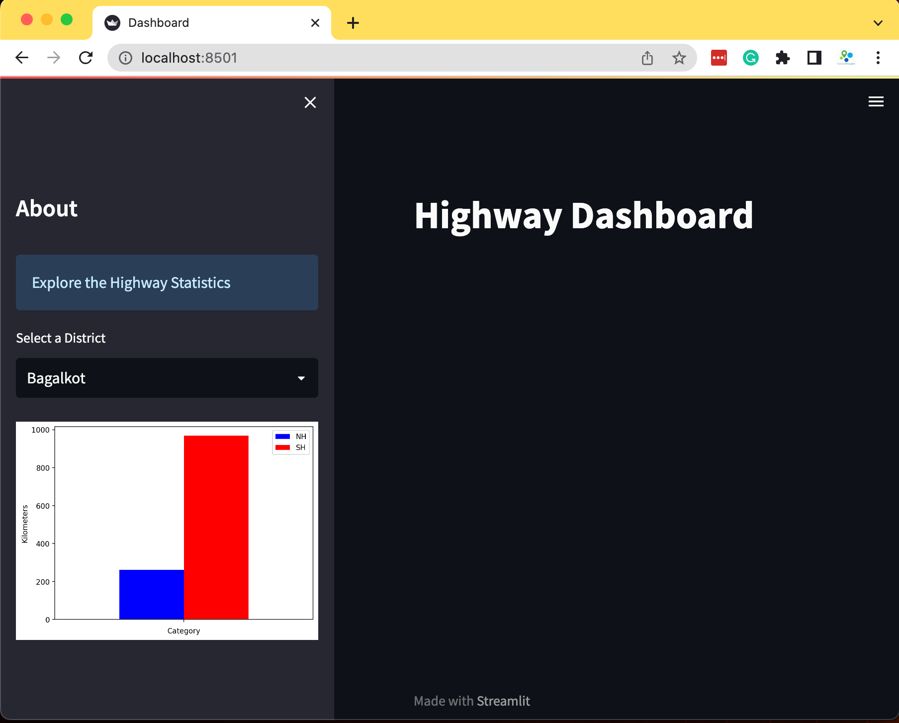
```

4. Now we create a folium map using `leafmap.Map()` and render the vector layers. We also add a third layer with the boundary of the selected district to highlight the selection.

```{python eval=FALSE}
import streamlit as st
import geopandas as gpd
import pandas as pd
import matplotlib.pyplot as plt
import leafmap.foliumap as leafmap

st.set_page_config(page_title='Dashboard', layout='wide')

st.title('Highway Dashboard')

st.sidebar.title('About')
st.sidebar.info('Explore the Highway Statistics')


data_url = 'https://github.com/spatialthoughts/python-dataviz-web/raw/main/data/osm/'
gpkg_file = 'karnataka.gpkg'
csv_file = 'highway_lengths_by_district.csv'

@st.cache
def read_gdf(url, layer):
    gdf = gpd.read_file(url, layer=layer)
    return gdf

@st.cache
def read_csv(url):
    df = pd.read_csv(url)
    return df

gpkg_url = data_url + gpkg_file
csv_url = data_url + csv_file
districts_gdf = read_gdf(gpkg_url, 'karnataka_districts')
roads_gdf = read_gdf(gpkg_url, 'karnataka_highways')
lengths_df = read_csv(csv_url)

# Create the chart
districts = districts_gdf.DISTRICT.values
district = st.sidebar.selectbox('Select a District', districts)

district_lengths = lengths_df[lengths_df['DISTRICT'] == district]

fig, ax = plt.subplots(1, 1)
district_lengths.plot(kind='bar', ax=ax, color=['blue', 'red'],
    ylabel='Kilometers', xlabel='Category')
ax.get_xaxis().set_ticklabels([])
stats = st.sidebar.pyplot(fig)

## Create the map

m = leafmap.Map(
    layers_control=True,
    draw_control=False,
    measure_control=False,
    fullscreen_control=False,
)
m.add_basemap('CartoDB.DarkMatter')
m.add_gdf(
    gdf=districts_gdf,
    zoom_to_layer=False,
    layer_name='districts',
    info_mode='on_click',
    style={'color': '#7fcdbb', 'fillOpacity': 0.3, 'weight': 0.5},
    )


selected_gdf = districts_gdf[districts_gdf['DISTRICT'] == district]

m.add_gdf(
    gdf=selected_gdf,
    layer_name='selected',
    zoom_to_layer=True,
    info_mode=None,
    style={'color': 'yellow', 'fill': None, 'weight': 2}
 )


m_streamlit = m.to_streamlit(600, 600)
```


```{r echo=FALSE, fig.align='center', out.width='75%'}
knitr::include_graphics('images/python_dataviz/mapping_dashboard4.png')
```

5. We can selectively load certain layers on the map using a user-input widget. Let's add a checkbox that allows the user to overlay the roads on the map.

```{python eval=FALSE, code=readLines('code/python_dataviz/streamlit/mapping_dashboard/app.py')}
```

```{r echo=FALSE, fig.align='center', out.width='75%'}
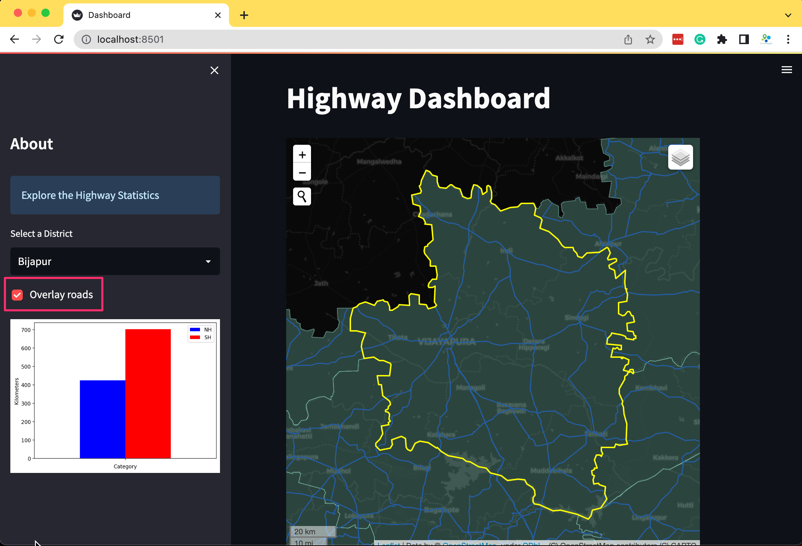
```

# Publishing Apps with Streamlit Cloud

Streamlit provides free hosting for your streamlit apps. In this section, we will now learn how to deploy an app to Streamlit cloud and configure it correctly.

## Upload the app to GitHub

To run your app on Streamlit Cloud, you need to upload your app to GitHub. Streamlit supports both private and public repositories. In this example, we will be deploying a *Route Finder* app which has been uploaded to GitHub at `https://github.com/spatialthoughts/python-dataviz-web/blob/main/streamlit/route_finder/app.py`

## Add App dependencies

If your app needs a third-party Python package, you need to add it in a separate file called `requirements.txt`. The packages listed in the file will be installed on Streamlit Cloud before running the app.

For our app, we have created the `requirements.txt` file with the following content and uploaded it to GitHub in the same directory as the `app.py`

```
streamlit
folium
streamlit-folium
```

You may also specify other dependencies for your app. Learn more at [App dependencies](https://docs.streamlit.io/streamlit-cloud/get-started/deploy-an-app/app-dependencies) documentation.

## Deploy your App

Now you are ready to deploy your app to Streamlit Cloud.

1. Visit [Streamlit Cloud](https://streamlit.io/cloud) and sign-in. If you do not have an account, you can click *Sign-up* and create a new account. Once logged-in, click the *New app* button.

```{r echo=FALSE, fig.align='center', out.width='75%'}
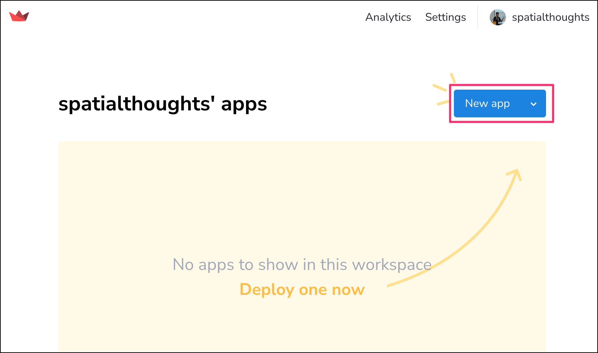
```

2. Click *Paste GitHub URL* and paste the URL to your streamlit `app.py` file. For this example, you may use  for the Route Finder app. Next, click *Advanced settings...*


```{r echo=FALSE, fig.align='center', out.width='75%'}
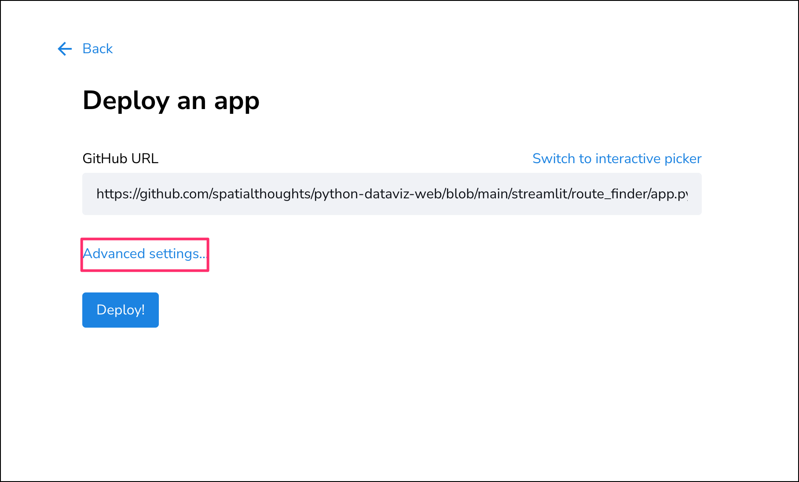
```

3. This dialog allows you to store your private information required by your apps, such as API keys, username/password for your database, etc. For the **Route Finder** app, you need to enter the API Key for OpenRouteService. Visit [OpenRouteService Dashboard](https://openrouteservice.org/dev/#/signup) and copy your API Key. Enter your API key in the following format and replace <your key> with your  actual API key. Click *Save*.

```
'ORS_API_KEY' = '<your key>'
```

```{r echo=FALSE, fig.align='center', out.width='50%'}
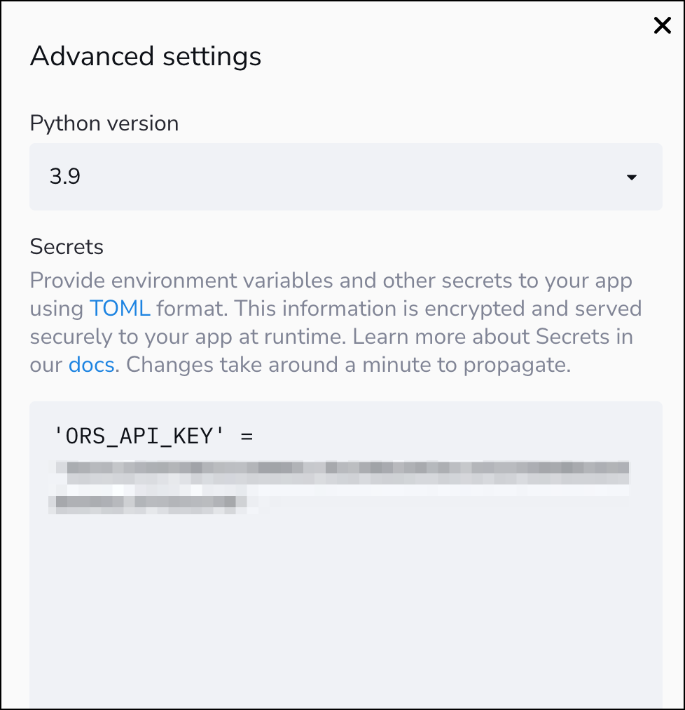
```

4. You are now ready to deploy the app. Click *Deploy!*.

```{r echo=FALSE, fig.align='center', out.width='75%'}
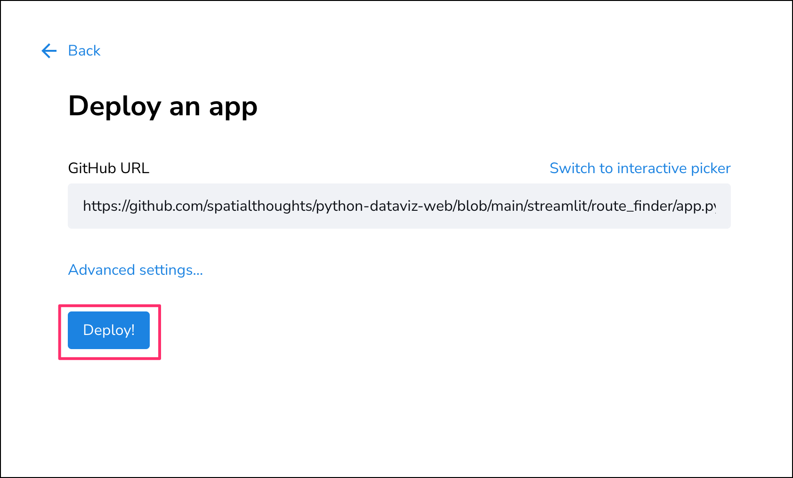
```

5. Your app will now be deployed and will be accessible via the provided URL. You can visit your Dashboard to manage the app once it is deployed.


```{r echo=FALSE, fig.align='center', out.width='75%'}
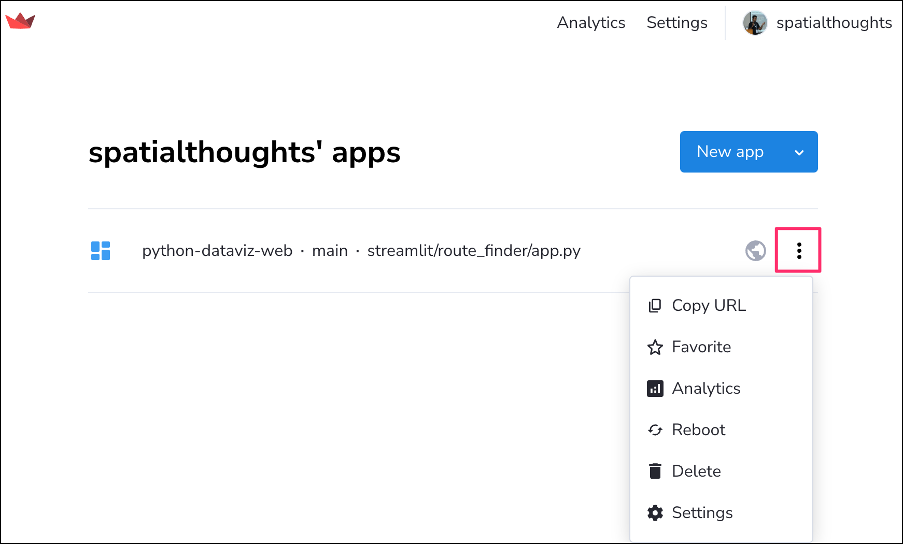
```

The app is now live! Visit the [Route Finder](https://spatialthoughts-python-dataviz--streamlitroute-finderapp-gqzg4q.streamlitapp.com/) app to see it in action.


# Supplement

## Contextily


[](https://colab.research.google.com/github/spatialthoughts/python-dataviz-web/blob/main/supplement_contextily.ipynb)

```{r child='python-dataviz-output/supplement_contextily.md'}
```

## Advanced Plotting


[](https://colab.research.google.com/github/spatialthoughts/python-dataviz-web/blob/main/supplement_elevation_profile_plot.ipynb)

```{r child='python-dataviz-output/supplement_elevation_profile_plot.md'}
```


[](https://colab.research.google.com/github/spatialthoughts/python-dataviz-web/blob/main/supplement_stacked_barcharts.ipynb)

```{r child='python-dataviz-output/supplement_stacked_barcharts.md'}
```

## Animation

[](https://colab.research.google.com/github/spatialthoughts/python-dataviz-web/blob/main/supplement_animating_maps.ipynb)

```{r child='python-dataviz-output/supplement_animating_maps.md'}
```

## Leafmap

[](https://colab.research.google.com/github/spatialthoughts/python-dataviz-web/blob/main/supplement_leafmap_osm.ipynb)

```{r child='python-dataviz-output/supplement_leafmap_osm.md'}
```


# Resources

- [Visualization with Matplotlib](https://jakevdp.github.io/PythonDataScienceHandbook/04.00-introduction-to-matplotlib.html). Python Data Science Handbook by Jake VanderPlas
- [Awesome Streamlit](https://github.com/MarcSkovMadsen/awesome-streamlit)

# Data Credits

- London Crime Statistics: ASB Incidents, Crime and Outcome - UK Home Office. Retrieved 2022-01-20. https://data.police.uk/about/
- California Census Data: U.S. Census Bureau, 2019 American Community Survey 5-Year Estimates and Cartographic Boundary Files - Shapefile: 2019
- Eclipse Shapefiles: NASA's Scientific Visualization Studio Downloaded from https://svs.gsfc.nasa.gov/4518
- NASA Shuttle Radar Topography Mission (SRTM) Elevation Dataset. Downloaded from [30m SRTM Tile Downloader](https://dwtkns.com/srtm30m/%5D).
- Temperature Anomalies: GISTEMP Team, 2022: GISS Surface Temperature Analysis (GISTEMP), version 4. NASA Goddard Institute for Space Studies. Dataset accessed 2022-01-26 at https://data.giss.nasa.gov/gistemp/.

# License


This course material is licensed under a [Creative Commons Attribution-NonCommercial 4.0 International License](https://creativecommons.org/licenses/by-nc/4.0/). You are free to use the material for any non-commercial purpose. Kindly give appropriate credit to the original author.

If you would like to utilize these materials as part of a commercial offering, you can purchase a *Trainer License* for a small fee. 

Please [contact us](https://spatialthoughts.com/contact/) for pricing and terms.
<!--
This material is part of the *Trainer's Package* and the buyer gets a non-exclusive, non-transferable, perpetual license to the material. You can fully customise and brand the materials to your requirements.
-->

&copy; 2022 Ujaval Gandhi [www.spatialthoughts.com](https://spatialthoughts.com)

***

**This course is offered as an instructor-led online class. Visit [Spatial Thoughts](https://spatialthoughts.com/events/) to know details of upcoming sessions.**
