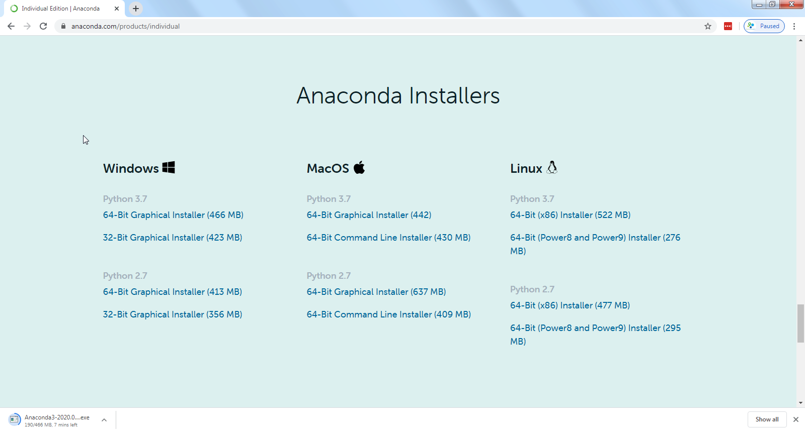
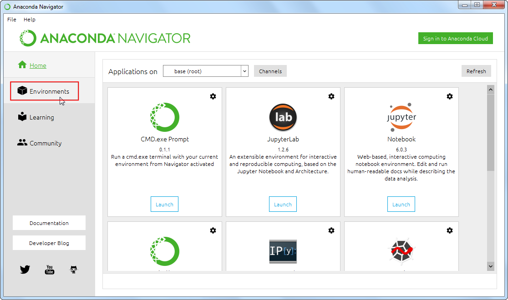
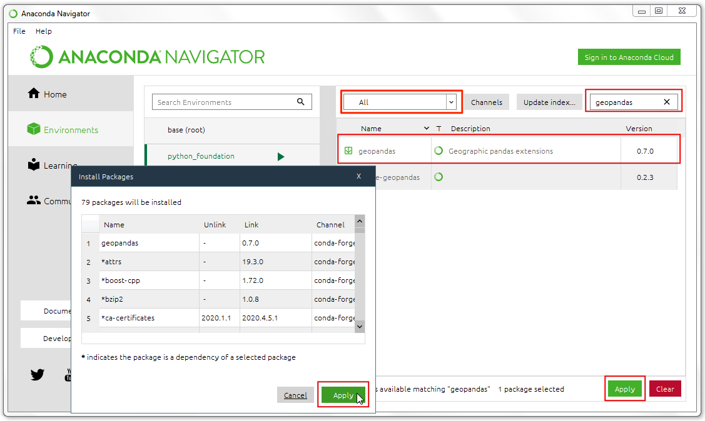
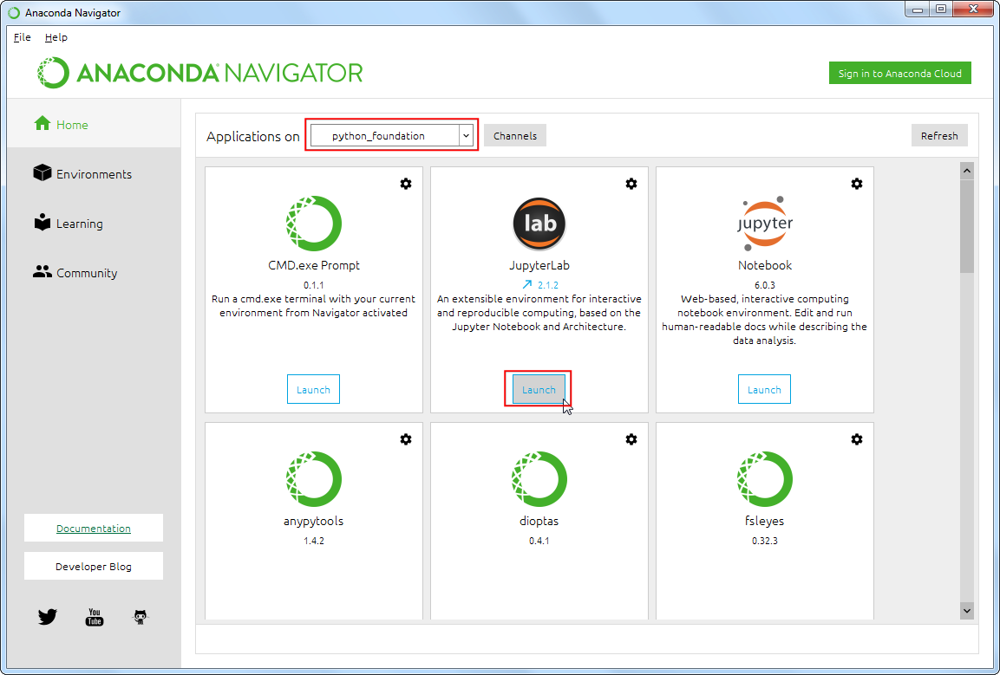
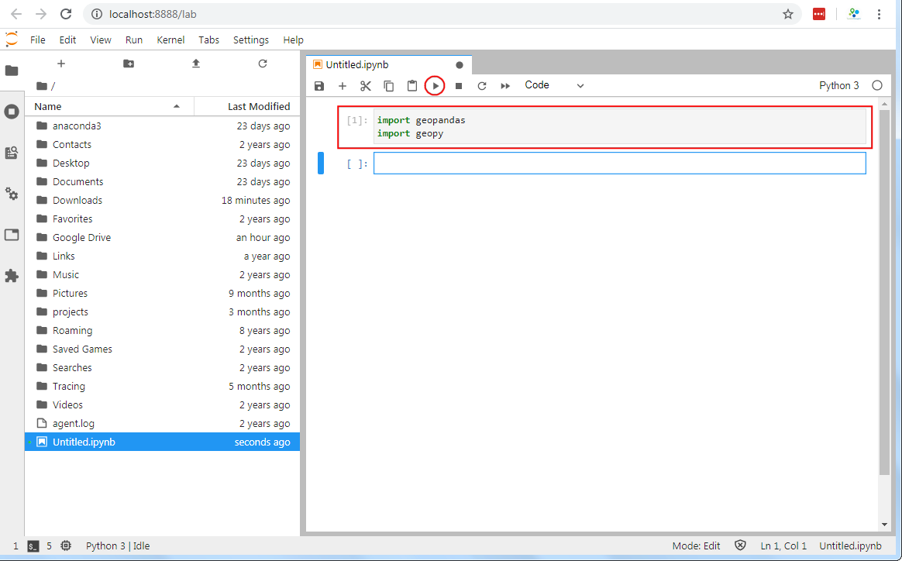

\newpage

***

```{r echo=FALSE, fig.align='center', out.width='250pt'}
knitr::include_graphics('images/spatial_thoughts_logo.png')
```


**This course is also offered as an online class. Visit  [www.spatialthoughts.com/events](https://spatialthoughts.com/events/) to know details of upcoming sessions. You may also sign up for [my mailing list](https://mailchi.mp/1d44f6c0c955/spatialthoughts) to know when new sessions are scheduled.**

***


\newpage

# Introduction 

This class covers Python from the very basics. Suitable for GIS practitioners with no programming background or python knowledge. The course will introduce participants to basic programming concepts, libraries for spatial analysis, geospatial APIs and techniques for building spatial data processing pipelines.

# Get the Data Package
The code examples in this class use a variety of datasets. All the required datasets are supplied to you in the ``python_foundation.zip`` with your purchase. Unzip this file to the `Downloads` directory. All code examples assume the data is available in the ``<home folder>/Downloads/python_foundation/`` directory. 

# Installation and Setting up the Environment

There are many ways to install Python on your system. Many operating systems comes with a Python distribution built-in too. If you use software such as QGIS - it comes with its own version of Python. Working on Python projects typically require installing third-party packages (i.e. tools). As these pacakges have different dependencies - they often cause conflicts and errors due to different versions of Python on your system. 

An easy and reliable way to get a Python installation on your system is via [Anaconda](https://www.anaconda.com/). For this course, we will use the Anaconda3 Individual Edition to install Python and required spatial analysis packages.

> Many Python tool names have references to the reptile world. The default Python package manager is called [Pip](https://pypi.org/project/pip/) which references the process of hatching eggs. Interestingly, the naming of the Python language itself had [nothing to do with reptiles](https://en.wikipedia.org/wiki/Guido_van_Rossum#Python).

1. [Download the Anaconda Installer](https://www.anaconda.com/products/individual) for Python 3.7 for your operating system. Once downloaded, double click the installer and install it into the default suggested directory. Select an install for *Just Me* and use default settings.

> Note: Install Anaconda to a directory path that does not contain spaces or unicode characters.

  ```{r echo=FALSE, fig.align='center'}
  
  ```

2. Once installed, launch the *Anaconda Navigator* program. It is a good practice to create a new *environment* for each of your Python projects. An environment is a space where you will install required packages. Many packages may contain conflicting requirements which could prevent them all being installed into a single environment. Having a separate environment isolates your project from such problems. Click on the *Environments* tab.

```{r echo=FALSE, fig.align='center'}

```

3. Click the *+ Create* button and name the environment as ``python_foundation``. Click *Create*.

```{r echo=FALSE, fig.align='center'}
knitr::include_graphics('images/python_foundation/conda3.png')
```

4. Once created, click the *Channels* button. A channel is a repository where packages are hosted. The default channel is good for most purposes. But some packages we require for this class are not available in the default channel, so we need to add another channel. In the *Manage channels* dialog, click *Add* and enter ``conda-forge``. Press *Enter*.

> Learn more about [conda-forge](https://conda-forge.org/docs/user/introduction.html) 

```{r echo=FALSE, fig.align='center'}
knitr::include_graphics('images/python_foundation/conda4.png')
```

5. Click the *Update Channels* button.

```{r echo=FALSE, fig.align='center'}
knitr::include_graphics('images/python_foundation/conda5.png')
```

6. Once the update is done, search for the package ``geopandas``. This is a package that allows you to work with vector geospatial data in Python. Select the checkbox next to the first result and click *Apply* to install the package with all its dependencies.

```{r echo=FALSE, fig.align='center'}

```

7. Similarly, search and install the following packages

- ``geopy``
- ``rasterio``

```{r echo=FALSE, fig.align='center'}
knitr::include_graphics('images/python_foundation/conda7.png')
```

8. Switch to the *Home* tab. Ensure that you have the *python_foundation* environemnt selected. We will now install some programs which allow us to write and execute Python scripts. From the home screen, install the ``JupyterLab`` and ``CMD.exe prompt`` applications. (Mac and Linux users can skip the CMD.exe prompt install).

```{r echo=FALSE, fig.align='center'}
knitr::include_graphics('images/python_foundation/conda8.png')
```

9. After the installation completes, click *Launch* button for the *JupyterLab* application. JupyterLab is a web application that allows you to write, document and run Python code. It allow you to interactively run small bits of code and see the results. It also support a variety of output formats such as charts or maps - making it an ideal platform for data science projects. We will be using Jupyter notebooks for all exercises in this course.

> The name Jupyter comes from the 3 primary programming languages it supports - Julia, Python and R.

```{r echo=FALSE, fig.align='center'}

```

10. A new browser tab will open with an instance of JupterLab. Click the *Python 3*  button under *Notebooks*.

```{r echo=FALSE, fig.align='center'}
knitr::include_graphics('images/python_foundation/conda10.png')
```

11. Enter the following statements in the first cell and click the *Run* button. If the code executes without any errors - your installation was successful and you are ready to start coding. If you get an *ImportError*, repeat the installation steps carefully again.

```{r echo=FALSE, fig.align='center'}

```

\newpage


```{r child='code/python_foundation/00_hello_world.md'}
```

\newpage

```{r child='code/python_foundation/01_variables.md'}
```

\newpage

```{r child='code/python_foundation/02_data_structures.md'}
```

\newpage

```{r child='code/python_foundation/03_string_operations.md'}
```

\newpage

```{r child='code/python_foundation/04_functions.md'}
```

\newpage


```{r child='code/python_foundation/05_standard_library.md'}
```

\newpage


```{r child='code/python_foundation/06_third_party_modules.md'}
```

\newpage

```{r child='code/python_foundation/07_loops_and_conditionals.md'}
```

\newpage

```{r child='code/python_foundation/08_reading_files.md'}
```

\newpage

```{r child='code/python_foundation/09_reading_csv_files.md'}
```

\newpage

```{r child='code/python_foundation/10_using_web_apis.md'}
```

\newpage

```{r child='code/python_foundation/11_working_with_pandas.md'}
```

\newpage

```{r child='code/python_foundation/12_working_with_geopandas.md'}
```


# License

This course material is licensed under a [Creative Commons Attribution-NonCommercial 4.0 International License](https://creativecommons.org/licenses/by-nc/4.0/). You are free to use the material for any non-commercial purpose. Kindly give appropriate credit to the original author

If you would like to use this material for commercial use or for teaching a course, kindly [contact me](https://spatialthoughts.com/contact/) for terms.

&copy; 2020 Ujaval Gandhi [www.spatialthoughts.com](https://spatialthoughts.com)