\newpage
 
***

```{r echo=FALSE, fig.align='center', out.width='75%', out.width='250pt'}
knitr::include_graphics('images/spatial_thoughts_logo.png')
```

***

\newpage

# Introduction 

This class covers Python from the very basics. Suitable for GIS practitioners with no programming background or python knowledge. The course will introduce participants to basic programming concepts, libraries for spatial analysis, geospatial APIs and techniques for building spatial data processing pipelines.

[](https://www.youtube.com/watch?v=rHgsslH-_y0&list=PLppGmFLhQ1HJspXSA0asH9kw1OhlLrxHT&index=1){target="_blank"}

[Watch the Video &#8599;](https://www.youtube.com/watch?v=rHgsslH-_y0&list=PLppGmFLhQ1HJspXSA0asH9kw1OhlLrxHT&index=1){target="_blank"}

[Access the Presentation &#8599;](https://docs.google.com/presentation/d/125LV0qR47S_OGaZZr5Zv-7lbWfdZ5pNo3iFm6IOX7uI/edit?usp=sharing){target="_blank"}


# Get the Data Package

The code examples in this class use a variety of datasets. All the required datasets and Jupyter notebooks are supplied to you in the ``python_foundation.zip`` file. Unzip this file to a directory - preferably to the ``<home folder>/Downloads/python_foundation/`` folder. 

Download [python_foundation.zip](https://github.com/spatialthoughts/courses/releases/download/data/python_foundation.zip).

> Note: Certification and Support are only available for participants in our paid instructor-led classes.

# Get the Course Videos

The course is accompanied by a set of videos covering the all the modules. These videos are recorded from our live instructor-led classes and are edited to make them easier to consume for self-study. We have 2 versions of the videos:

### YouTube

We have created a YouTube Playlist with separate videos for each notebook and exercise to enable effective online-learning. [Access the YouTube Playlist &#8599;](https://www.youtube.com/playlist?list=PLppGmFLhQ1HJspXSA0asH9kw1OhlLrxHT){target="_blank"}

### Vimeo

We are also making combined full-length video for each module available on Vimeo. These videos can be downloaded for offline learning. [Access the Vimeo Playlist &#8599;](https://vimeo.com/showcase/11034058){target="_blank"}


# Installation and Setting up the Environment 

There are many ways to install Python on your system. Many operating systems comes with a Python distribution built-in too. If you use software such as QGIS - it comes with its own version of Python. Working on Python projects typically require installing third-party packages (i.e. tools). As these packages have different dependencies - they often cause conflicts and errors due to different versions of Python on your system. 

An easy and reliable way to get a Python installation on your system is via [Anaconda](https://www.anaconda.com/). For this course, we will use the Anaconda3 Individual Edition to install Python and required spatial analysis packages.

> Many Python tool names have references to the reptile world. The default Python package manager is called [Pip](https://pypi.org/project/pip/) which references the process of hatching eggs. Interestingly, the naming of the Python language itself had [nothing to do with reptiles](https://en.wikipedia.org/wiki/Guido_van_Rossum#Python).

Anaconda  provides the `conda` command that can be run from the *Command Prompt* on Windows or the *Terminal* on Mac/Linux. This is the preferred method to install the required packages.


1. [Download the Anaconda Installer](https://www.anaconda.com/products/individual#Downloads) for Python 3.8 (or a higher version) for your operating system. Once downloaded, double click the installer and install it into the default suggested directory. Select an install for *Just Me* and **use default settings**. 

> Note: If your username has spaces, or non-English characters, it causes problems. In that case, you can install it to a path such as  `C:\anaconda`.

```{r echo=FALSE, fig.align='center', out.width='75%'}
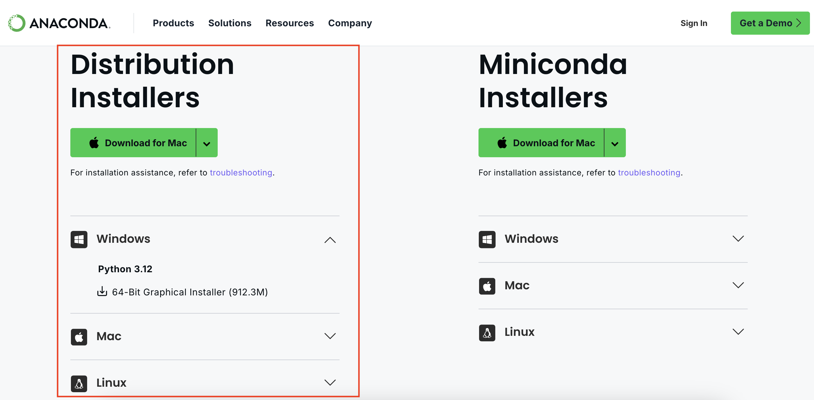
```
  
2. (*Windows users*) Once installed, search for *Anaconda Prompt* launch it. (*Mac/Linux users*): Launch a *Terminal* window.

```{r echo=FALSE, fig.align='center', out.width='75%'}
knitr::include_graphics('images/python_foundation/condacli2.png')
```

3. It is a good practice to create a new *environment* for each of your Python projects. An environment is a space where you will install required packages. Many packages may contain conflicting requirements, preventing them from all being installed into a single environment. Having a separate environment isolates your project from such problems. We will now type commands in a terminal to create a new environment. *(Windows users)* Search for Anaconda Prompt in the Start Menu and launch it. *(Mac/Linux users)*: Open a Terminal window.  Enter the command below and press *Enter* to create your new environment.

```
conda create --name python_foundation
```

```{r echo=FALSE, fig.align='center', out.width='75%'}
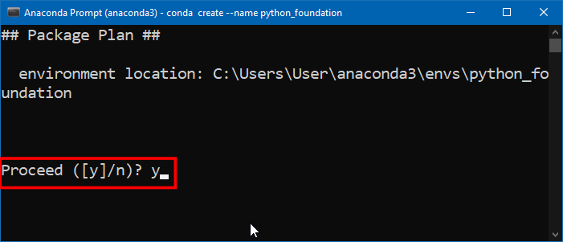
```

4. Now you will be asked for confirmation; press *y + Enter* to proceed and complete your environment creation.

```{r echo=FALSE, fig.align='center', out.width='75%'}
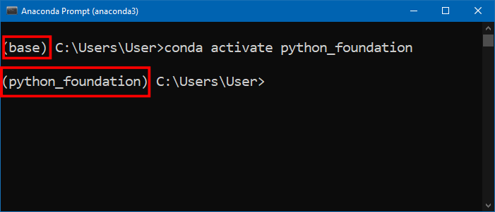
```

5. Now that the environment is created, you need to activate it. Type the command below and press *Enter*. Once the environment activates, the ``(base)`` will change to ``(python_foundation)``. 

```
conda activate python_foundation
```

```{r echo=FALSE, fig.align='center', out.width='75%'}
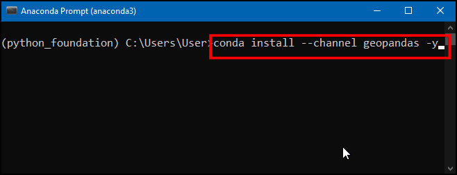
```

6. Now we are ready to install the required packages using the `conda install` command. First we will install ``geopandas``. This is a module that allows you to work with vector geospatial data in Python. We will use the `conda-forge` channel to install the package. The `-y` option will skip the confirmation dialog. Enter the command below and press *Enter*. 

```
conda install --channel conda-forge geopandas -y
```

> Learn more about [conda-forge](https://conda-forge.org/docs/user/introduction.html) 


```{r echo=FALSE, fig.align='center', out.width='75%'}
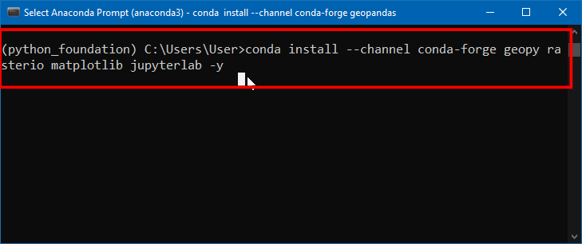
```

7. If the installation is successful, you should see a message as shown here. 

```{r echo=FALSE, fig.align='center', out.width='75%'}
knitr::include_graphics('images/python_foundation/condacli7.png')
```

8. `geopandas` installation is a bit tricky and can sometimes fail. So it is a good idea to check if it can be imported without errors. We will use the `python` command with the `-c` option which will execute a python statement. Enter the below command and press Enter. 

```
python -c "import geopandas"
```

```{r echo=FALSE, fig.align='center', out.width='75%'}
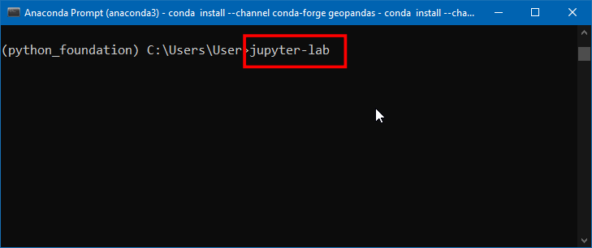
```

9. If your geopandas installation was successful, the command will run without any output. **If nothing happens - it means your installation was successful!**. If you see any errors, please follow the [debugging guide](#debugging-python-installation-errors).

```{r echo=FALSE, fig.align='center', out.width='75%'}
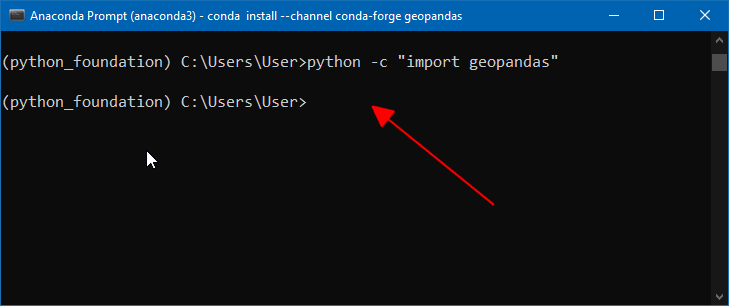
```

10. We can now install other required packages for this class. Run the command below to install `geopy`, `rasterio`, `matplotlib` and `jupyterlab` packages.

```
conda install --channel conda-forge geopy rasterio matplotlib jupyterlab -y
```

```{r echo=FALSE, fig.align='center', out.width='75%'}
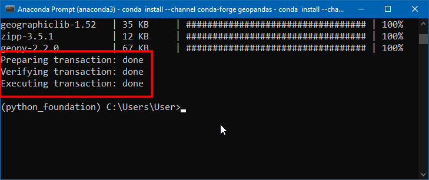
```

11. Once the command finishes, you should see a screen such as below.

```{r echo=FALSE, fig.align='center', out.width='75%'}

```

12. Your Python environment is now ready. Launch the *JupyterLab* application using the command below. This will initiate and run a local server in your system and opens in your default browser. 

> Note: Do not close your anaconda prompt after *JupyterLab* opens up. You need to keep it running as long as you want to use JupyterLab.

```
jupyter-lab
```

```{r echo=FALSE, fig.align='center', out.width='75%'}
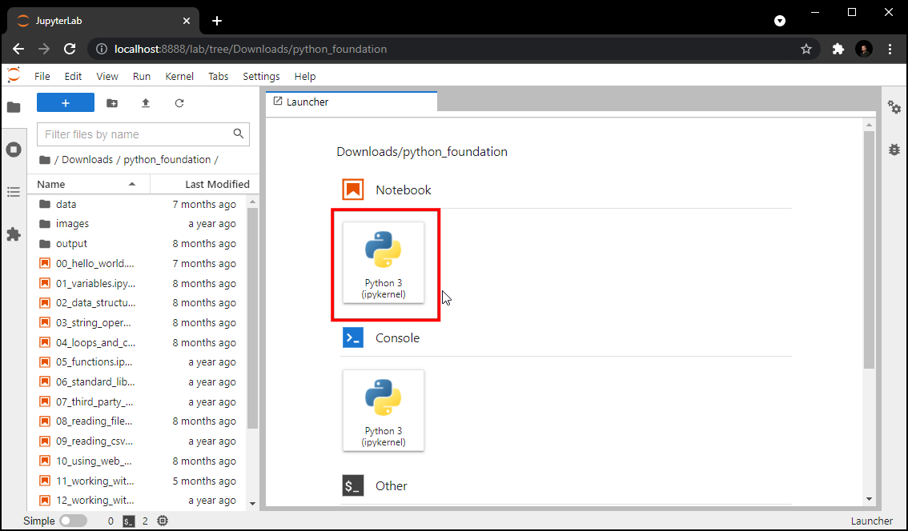
```

Note that JupyterLab application can browse the files only on the Drive from where it was launched from. If your data is stored on a different drive, you will need an additional step to switch to that drive before launching Jupyterlab.

*Windows*

On the command prompt, type the drive letter followed by `:` and press *Enter* to switch to the drive.
```
D:
```
```
jupyter-lab
```

```{r echo=FALSE, fig.align='center', out.width='75%'}
knitr::include_graphics('images/python_foundation/condacli12a.png')
```

*Mac/Linux*

Check the drives mounted on your system by entering `ls /Volumes`. After that use `cd` command to switch to the drive.
```
cd /Volumes/<NameofYourDrive>
```
```
jupyter-lab
```

13. A new browser tab will open with an instance of JupyterLab. Click the *Python 3*  button under *Notebook*.

```{r echo=FALSE, fig.align='center', out.width='75%'}

```

14. Enter the following statements in the first cell and click the *Run* button. **If nothing happens - it means your installation was successful!**. Your environment is now ready for the course. If you get an *ImportError*, repeat the installation steps carefully again.

```
import geopandas
import geopy
import rasterio
```

```{r echo=FALSE, fig.align='center', out.width='75%'}
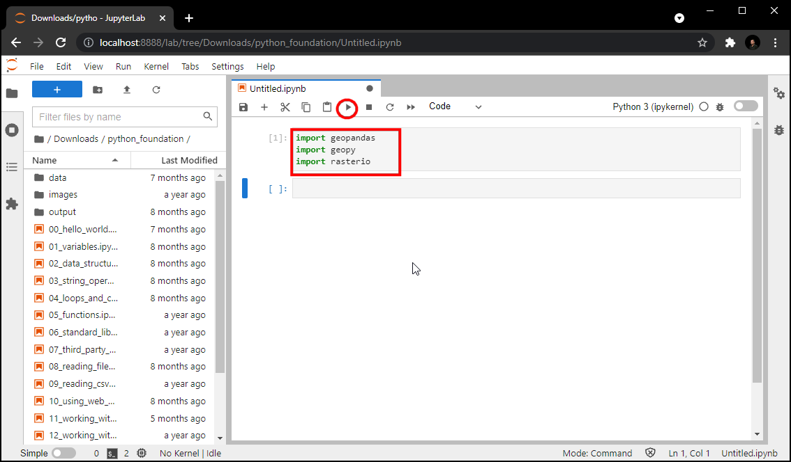
```


## Debugging Python Installation Errors

The following section describes common installation errors with suggested fixes.

#### OpenSSL Error

On many Windows systems, you may get an error such **CondaSSLError: OpenSSL appears to be unavailable on this machine. OpenSSL is required to download and install packages**. This means the OpenSSL module is missing. Please download and install the [Win32/Win64 OpenSSL packages](https://slproweb.com/products/Win32OpenSSL.html) and try again.

If the error persists, you can manually fix the issue by copying the required DLL files in the correct place as [described in this issue](https://github.com/conda/conda/issues/11982#issuecomment-1285538983).

#### RTree spatialindex Error

When importing GeoPandas, you may see an error **Could not find or load spatialindex_c-64.dll**. This error is likely caused by a corrupted installation. This error is easily fixed by deleting the conda environment and reinstalling geopandas. Run the following sequence of commands to delete the environment.

```
conda deactivate
conda env remove -n python_foundation
```

Follow the installation steps and reinstall geopandas.

# Using Jupyter Notebooks

[](https://www.youtube.com/watch?v=xsId8Yt-S-Y&list=PLppGmFLhQ1HJspXSA0asH9kw1OhlLrxHT&index=3){target="_blank"}

[Watch the Video &#8599;](https://www.youtube.com/watch?v=xsId8Yt-S-Y&list=PLppGmFLhQ1HJspXSA0asH9kw1OhlLrxHT&index=3){target="_blank"}

Your class data package contain multiple Jupyter notebooks containing code and exercises for this class. 

1. Launch the *JupyterLab* application. It will open your Web Browser and load the application in a new tab. From the left-hand panel, navigate to the directory where you extracted the data package.

```{r echo=FALSE, fig.align='center', out.width='75%'}
knitr::include_graphics('images/python_foundation/setup1.png')
```

2. Jupyter notebooks have a `.ipynb` extensions. Double-click on a notebook file to open it. Code in the notebook is executed cell-by-cell. You can select a cell and click the *Run* button to execute the code and see the output.

```{r echo=FALSE, fig.align='center', out.width='75%'}
knitr::include_graphics('images/python_foundation/setup2.png')
```

3. At the end of each notebook, you will find an exercise. Before adding a new cell and attempting to complete the exercise, make sure you go to **Run &rarr; Run All Cells** to execute all the code in the notebook. Doing this will ensure all the required variables are avalable to you to use in the exervise.

```{r echo=FALSE, fig.align='center', out.width='75%'}
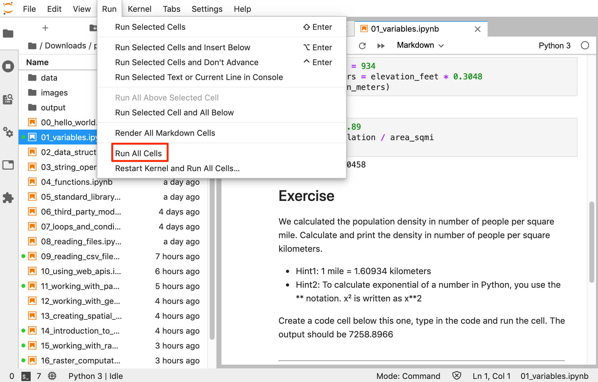
```

\newpage

----

Open the notebook named ``01_variables.ipynb``.

[](https://www.youtube.com/watch?v=JPZOxlOLTKU&list=PLppGmFLhQ1HJspXSA0asH9kw1OhlLrxHT&index=4){target="_blank"}

[Watch the Video &#8599;](https://www.youtube.com/watch?v=JPZOxlOLTKU&list=PLppGmFLhQ1HJspXSA0asH9kw1OhlLrxHT&index=4){target="_blank"}

----

```{r child='python-foundation-output/01_variables.md'}
```

\newpage

Open the notebook named ``02_data_structures.ipynb``.

[](https://www.youtube.com/watch?v=BxKrHhGAodY&list=PLppGmFLhQ1HJspXSA0asH9kw1OhlLrxHT&index=6){target="_blank"}

[Watch the Video &#8599;](https://www.youtube.com/watch?v=BxKrHhGAodY&list=PLppGmFLhQ1HJspXSA0asH9kw1OhlLrxHT&index=6){target="_blank"}


----

```{r child='python-foundation-output/02_data_structures.md'}
```

\newpage

Open the notebook named ``03_string_operations.ipynb``.

[](https://www.youtube.com/watch?v=RNp5sF-ZEkM&list=PLppGmFLhQ1HJspXSA0asH9kw1OhlLrxHT&index=8){target="_blank"}

[Watch the Video &#8599;](https://www.youtube.com/watch?v=RNp5sF-ZEkM&list=PLppGmFLhQ1HJspXSA0asH9kw1OhlLrxHT&index=8){target="_blank"}

----

```{r child='python-foundation-output/03_string_operations.md'}
```

\newpage
Open the notebook named ``04_loops_and_conditionals.ipynb``.

[](https://www.youtube.com/watch?v=NkKuzVkYOzk&list=PLppGmFLhQ1HJspXSA0asH9kw1OhlLrxHT&index=10){target="_blank"}

[Watch the Video &#8599;](https://www.youtube.com/watch?v=NkKuzVkYOzk&list=PLppGmFLhQ1HJspXSA0asH9kw1OhlLrxHT&index=10){target="_blank"}

----

```{r child='python-foundation-output/04_loops_and_conditionals.md'}
```

\newpage

Open the notebook named ``05_functions.ipynb``.

[](https://www.youtube.com/watch?v=rcO29Q5Nd3Y&list=PLppGmFLhQ1HJspXSA0asH9kw1OhlLrxHT&index=12){target="_blank"}

[Watch the Video &#8599;](https://www.youtube.com/watch?v=rcO29Q5Nd3Y&list=PLppGmFLhQ1HJspXSA0asH9kw1OhlLrxHT&index=12){target="_blank"}

[Access the Presentation &#8599;](https://docs.google.com/presentation/d/1fFCOHSEPnGamcymzTZGE3Sc9lMJGo4tQ063leEyZMU8/edit?usp=sharing){target="_blank"}

----

```{r child='python-foundation-output/05_functions.md'}
```

\newpage

Open the notebook named ``06_standard_library.ipynb``.

[](https://www.youtube.com/watch?v=kgY2npOQFM8&list=PLppGmFLhQ1HJspXSA0asH9kw1OhlLrxHT&index=14){target="_blank"}

[Watch the Video &#8599;](https://www.youtube.com/watch?v=kgY2npOQFM8&list=PLppGmFLhQ1HJspXSA0asH9kw1OhlLrxHT&index=14){target="_blank"}

----

```{r child='python-foundation-output/06_standard_library.md'}
```

\newpage

Open the notebook named ``07_third_party_modules.ipynb``.

[](https://www.youtube.com/watch?v=BqBPWQt9PL0&list=PLppGmFLhQ1HJspXSA0asH9kw1OhlLrxHT&index=16){target="_blank"}

[Watch the Video &#8599;](https://www.youtube.com/watch?v=BqBPWQt9PL0&list=PLppGmFLhQ1HJspXSA0asH9kw1OhlLrxHT&index=16){target="_blank"}

----

```{r child='python-foundation-output/07_third_party_modules.md'}
```

\newpage

Open the notebook named ``08_using_web_apis.ipynb``.

[](https://www.youtube.com/watch?v=WBip-hbQYnM&list=PLppGmFLhQ1HJspXSA0asH9kw1OhlLrxHT&index=18){target="_blank"}

[Watch the Video &#8599;](https://www.youtube.com/watch?v=WBip-hbQYnM&list=PLppGmFLhQ1HJspXSA0asH9kw1OhlLrxHT&index=18){target="_blank"}

----

```{r child='python-foundation-output/08_using_web_apis.md'}
```

\newpage

Open the notebook named ``assignment.ipynb``.

[](https://www.youtube.com/watch?v=HaC3-y7c_F8&list=PLppGmFLhQ1HJspXSA0asH9kw1OhlLrxHT&index=20){target="_blank"}

[Watch the Video &#8599;](https://www.youtube.com/watch?v=HaC3-y7c_F8&list=PLppGmFLhQ1HJspXSA0asH9kw1OhlLrxHT&index=20){target="_blank"}

----

```{r child='python-foundation-output/assignment.md'}
```


----

\newpage

----

Open the notebook named ``common_errors.ipynb``.

[](https://www.youtube.com/watch?v=nMS_al2za3U&list=PLppGmFLhQ1HJspXSA0asH9kw1OhlLrxHT&index=21){target="_blank"}

[Watch the Video &#8599;](https://www.youtube.com/watch?v=nMS_al2za3U&list=PLppGmFLhQ1HJspXSA0asH9kw1OhlLrxHT&index=21){target="_blank"}

----

```{r child='python-foundation-output/common_errors.md'}
```

----

\newpage

Open the notebook named ``09_reading_files.ipynb``.

[](https://www.youtube.com/watch?v=v1dbrcIKL_E&list=PLppGmFLhQ1HJspXSA0asH9kw1OhlLrxHT&index=22){target="_blank"}

[Watch the Video &#8599;](https://www.youtube.com/watch?v=v1dbrcIKL_E&list=PLppGmFLhQ1HJspXSA0asH9kw1OhlLrxHT&index=22){target="_blank"}

----

```{r child='python-foundation-output/09_reading_files.md'}
```

\newpage

Open the notebook named ``10_reading_csv_files.ipynb``.

[](https://www.youtube.com/watch?v=rgALt7FzOMY&list=PLppGmFLhQ1HJspXSA0asH9kw1OhlLrxHT&index=24){target="_blank"}

[Watch the Video &#8599;](https://www.youtube.com/watch?v=rgALt7FzOMY&list=PLppGmFLhQ1HJspXSA0asH9kw1OhlLrxHT&index=24){target="_blank"}

----

```{r child='python-foundation-output/10_reading_csv_files.md'}
```

\newpage

Open the notebook named ``11_working_with_pandas.ipynb``.

[](https://www.youtube.com/watch?v=lYqoohizNNw&list=PLppGmFLhQ1HJspXSA0asH9kw1OhlLrxHT&index=26){target="_blank"}

[Watch the Video &#8599;](https://www.youtube.com/watch?v=lYqoohizNNw&list=PLppGmFLhQ1HJspXSA0asH9kw1OhlLrxHT&index=26){target="_blank"}

[Access the Presentation &#8599;](https://docs.google.com/presentation/d/1fyNe15yhbMq_435yaHRZefKzos4Vpyf54mqNfhC_flQ/edit?usp=sharing){target="_blank"}

----

```{r child='python-foundation-output/11_working_with_pandas.md'}
```

\newpage

Open the notebook named ``12_working_with_geopandas.ipynb``.

[](https://www.youtube.com/watch?v=wsqJQX8sZaA&list=PLppGmFLhQ1HJspXSA0asH9kw1OhlLrxHT&index=28){target="_blank"}

[Watch the Video &#8599;](https://www.youtube.com/watch?v=wsqJQX8sZaA&list=PLppGmFLhQ1HJspXSA0asH9kw1OhlLrxHT&index=28){target="_blank"}

----

```{r child='python-foundation-output/12_working_with_geopandas.md'}
```

\newpage

Open the notebook named ``13_creating_spatial_data.ipynb``.

[](https://www.youtube.com/watch?v=6fheYLAGuzc&list=PLppGmFLhQ1HJspXSA0asH9kw1OhlLrxHT&index=30){target="_blank"}

[Watch the Video &#8599;](https://www.youtube.com/watch?v=6fheYLAGuzc&list=PLppGmFLhQ1HJspXSA0asH9kw1OhlLrxHT&index=30){target="_blank"}

----

```{r child='python-foundation-output/13_creating_spatial_data.md'}
```

\newpage

Open the notebook named ``14_introduction_to_numpy.ipynb``.

[](https://www.youtube.com/watch?v=HfvkZFsx3ys&list=PLppGmFLhQ1HJspXSA0asH9kw1OhlLrxHT&index=32){target="_blank"}

[Watch the Video &#8599;](https://www.youtube.com/watch?v=HfvkZFsx3ys&list=PLppGmFLhQ1HJspXSA0asH9kw1OhlLrxHT&index=32){target="_blank"}

----

```{r child='python-foundation-output/14_introduction_to_numpy.md'}
```

\newpage

Open the notebook named ``15_working_with_rasterio.ipynb``.

[](https://www.youtube.com/watch?v=N3sePRkzK9s&list=PLppGmFLhQ1HJspXSA0asH9kw1OhlLrxHT&index=34){target="_blank"}

[Watch the Video &#8599;](https://www.youtube.com/watch?v=N3sePRkzK9s&list=PLppGmFLhQ1HJspXSA0asH9kw1OhlLrxHT&index=34){target="_blank"}

----

```{r child='python-foundation-output/15_working_with_rasterio.md'}
```

\newpage

# Writing Standalone Python Scripts

[](https://www.youtube.com/watch?v=38GeIR4zom0&list=PLppGmFLhQ1HJspXSA0asH9kw1OhlLrxHT&index=36){target="_blank"}

[Watch the Video &#8599;](https://www.youtube.com/watch?v=38GeIR4zom0&list=PLppGmFLhQ1HJspXSA0asH9kw1OhlLrxHT&index=36){target="_blank"}


So far we have used Jupyter Notebooks to write and execute Python code. A notebook is a great choice to interactively explore, visualize and document workflows. But they are not suited for writing scripts for automation. If you have tasks that are long running or want to execute certain tasks on a schedule, you have to write scripts in a standalone `.py` file and run it from a Terminal or Console.

## Get a Text Editor

Any kind of software development requires a good text editor. If you already have a favorite text editor or an IDE (Integrated Development Environment), you may use it for this course. Otherwise, each platform offers a wide variety of free or paid options for text editors. Choose the one that fits your needs.

Below are my recommendations editors that are simple to use for beginners.

- Windows: [Notepad++](https://notepad-plus-plus.org/downloads/) is a good free editor for windows. Download and install the Notepad++ editor.
- Mac: [TextMate](https://macromates.com/) is an open-source editor for Mac that is currently available for free.

## Writing a Script

Copy the following code and paste it in your text editor. Browse to the data package directory and save the file as `get_distance.py`. Make sure that there is no `.txt` extension at the end. 

```{python eval=FALSE, code=readLines('code/python_foundation/get_distance.py')}
```

## Executing a Script

### Windows

1. Open Command Prompt/Terminal.

2. Navigate to the directory containing the script using the `cd` command.

```
cd Downloads\python_foundation
```

```{r echo=FALSE, fig.align='center', out.width='75%'}
knitr::include_graphics('images/python_foundation/win_script2.png')
```

3. Run the script using the `python` command. The script will run and print the distance.

```
python get_distance.py
```

```{r echo=FALSE, fig.align='center', out.width='75%'}
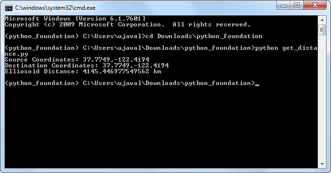
```

### Mac and Linux

1. Open a Terminal Window.

```{r echo=FALSE, fig.align='center', out.width='75%'}
knitr::include_graphics('images/python_foundation/mac_script1.png')
```

2. Switch to the correct conda environment. 

```
conda activate python_foundation
```

```{r echo=FALSE, fig.align='center', out.width='75%'}
knitr::include_graphics('images/python_foundation/mac_script2.png')
```

3. Navigate to the directory containing the script using the `cd` command.

```
cd Downloads/python_foundation
```

```{r echo=FALSE, fig.align='center', out.width='75%'}
knitr::include_graphics('images/python_foundation/mac_script3.png')
```

4. Run the script using the `python` command. The script will run and print the distance.

> If you have multiple python installations on your system, you will have to pick the right Python binary. If the command fails, try `python3.7` instead of just `python` in the command below. The script will run and print the distance.

```
python get_distance.py
```

```{r echo=FALSE, fig.align='center', out.width='75%'}
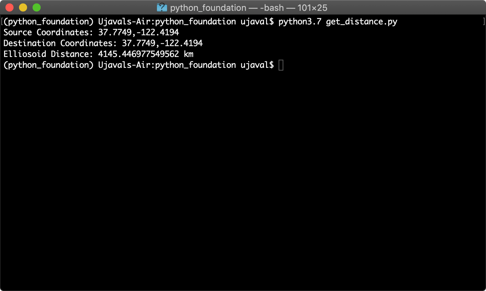
```

\newpage

# What next?

To achieve mastery in programming, you need to practice writing code and solve many diverse type of problems. I strongly recommend picking up a project and implementing it in Python to improve your skills. You can also take other courses to learn aspects of Python and spatial data processing.

[](https://www.youtube.com/watch?v=a4oDDxQyaus&list=PLppGmFLhQ1HJspXSA0asH9kw1OhlLrxHT&index=37){target="_blank"}

[Watch the Video &#8599;](https://www.youtube.com/watch?v=a4oDDxQyaus&list=PLppGmFLhQ1HJspXSA0asH9kw1OhlLrxHT&index=37){target="_blank"}

## Do a Project

An ideal project is something that is both critical to your work and also interesting to you. We encourage you to pick a project in your domain that helps you automate a workflow or solves a problem otherwise not possible.

You may want to check out this [Awesome Geospatial](https://github.com/sacridini/Awesome-Geospatial/blob/master/README.md#python) that has a curated list of geospatial Python packages that you can use for your project.


### Example Projects

Below are some projects that our previous participants worked on. These are good examples of what complete beginners can achieve after completing this course. Use these as inspiration to come up with your own project and start working on it!

* [Geocoding Addresses from a spreadsheet](https://nbviewer.org/github/KlausAgerskov/Python_geocode_internships/blob/master/klaus_danish_geocode_final.ipynb) by Klaus Agerskov
* [Retrieving and visualizing data from OpenStreetMap](https://nbviewer.org/github/luicarboni/My_Projects/blob/master/Starting_with_OSMnx.ipynb) by Luigi Carboni
* [Route Optimization](https://nbviewer.org/github/amitkb3/python_spatial_analysis_final_project/blob/master/PythonSpatialAnalysisCourse_FinalProject.ipynb) by Amit Bothra
* [Unsupervised Clustering of industrial locations](https://github.com/AshishA2812/Python_Spatial_Project1/blob/master/DBscan%20clustering_AshishA.ipynb) by Ashish Andhale
* [Mapping VIIRS Active Fires in South America](https://nbviewer.jupyter.org/github/acoiman/mapping_wildfires/blob/master/mapping_wildfires.ipynb) by Abraham Coiman
* [Zonal Statistics using Sentinel-2 imagery](https://github.com/grsguru/spatial_python/blob/master/PROJECT_NDVI_BBMP.ipynb) by Gurudatta
* [Analyzing Music using Spotify API](https://nbviewer.org/github/deepikajpsharma/Spotify/blob/main/Spotify%20data%20analysis.ipynb) by Deepika Sharma
* [Analyzing Primate Distribution in Protected Areas](https://github.com/ulfboge/galago-wdpa/tree/main) by Johan Karlsson
* [Finding Solar Sites from OpenStreetMap](https://nbviewer.org/github/cosmith57/Python-Foundations-for-Spatial-Analysis/blob/main/Colby_Smith_PFSA.ipynb) by Colby Smith
* [Saline System Visualizer](https://nbviewer.org/github/valegio/saline_map/blob/main/saline_map.ipynb) by Valentina Giovanetti


### Project Ideas

If you do not have a project of your own, here are some recommendation for projects that are a good fit for beginners, but are still challenging to help you become proficient. You can try to work on as many of the following problems as you like.

- **Geo-processing**: I have several intermediate level geoprocessing tutorials that use QGIS. You can take any of the following tutorials and implement it using libraries such as *geopandas* and *rasterio*.
    - [Performing Table Joins](https://www.qgistutorials.com/en/docs/3/performing_table_joins.html) 
    - [Performing Spatial Joins](https://www.qgistutorials.com/en/docs/3/performing_spatial_joins.html) 
    - [Nearest Neighbor Analysis](https://www.qgistutorials.com/en/docs/3/nearest_neighbor_analysis.html)
    - [Sampling Raster Data using Points or Polygons](https://www.qgistutorials.com/en/docs/3/sampling_raster_data.html)
- **Network Analysis**: Use the [osmnx package](https://github.com/gboeing/osmnx) to do network analysis with OpenStreetMap data and Python. Start by looking at [examples](https://github.com/gboeing/osmnx-examples/tree/master/notebooks)
- **Visualization and Interactive Mapping**: Use the plotting library [geoplot](https://residentmario.github.io/geoplot/index.html) or mapping library [folium](https://python-visualization.github.io/folium/) to create an interactive map. See this [example](https://medium.com/analytics-vidhya/interactive-choropleth-map-in-python-using-folium-4e1479d9e568)
- **Text Processing using LLMs**: Use Large-Language Models to process text and build applications. See our tutorial [Natural Language Processing using OpenAI API](https://www.geopythontutorials.com/notebooks/openai_mapping_news_articles.html) for mapping news articles.
- **Image Segmentation**: [Segment Geospatial](https://samgeo.gishub.org/) is a Python package to extract features from satellite imagery. Use this to extract objects from satellite or drone imagery. See our tutorials for [Extracting Farm Boundaries](https://www.geopythontutorials.com/notebooks/samgeo_farm_boundary_extraction.html) and [Detecting Mine Perimeter](https://www.geopythontutorials.com/notebooks/samgeo_mine_perimeter_detection.html).


## Keep Learning

Here are some recommendations for courses and tutorials you could  do after you have completed this course.

* Spatial Thoughts' [Geospatial Python Tutorials](https://www.geopythontutorials.com/) covering step-by-step tutorials for GeoPandas, XArray and more.
* Spatial Thoughts' Intermediate Python course [Mapping and Data Visualization with Python](https://spatialthoughts.com/courses/python-dataviz/)
* University of Helsinki's Free [Geo-Python Course](https://geo-python-site.readthedocs.io/en/latest/)
* University of Helsinki's Free [Automating GIS Processes Course](https://autogis-site.readthedocs.io/en/latest/)
* Kaggle's Free [Python Courses](https://www.kaggle.com/learn), including [Geospatial Analysis](https://www.kaggle.com/learn/geospatial-analysis)
* Allen Downey's Free [Elements of Data Science Course](https://allendowney.github.io/ElementsOfDataScience/)
* [Doing Geospatial in Python](https://geopython.github.io/geopython-workshop/) online workshop. Covers some more geospatial libraries, with a focus on OGC services and metadata.
* Andrew Ng's [ChatGPT Prompt Engineering for Developers](https://www.deeplearning.ai/short-courses/chatgpt-prompt-engineering-for-developers/) that teaches how to use OpenAI API for building applications.


\newpage

# Data Credits
* [World Cities Database](https://simplemaps.com/data/world-cities): Basic database. Copyright SimpleMaps.com 2010-2020
* [Geonames](https://www.geonames.org) places database for USA, Canada and Mexico
* Karnataka Admin Boundaries: Downloaded from [Datameet Spatial Data repository](https://github.com/datameet/maps/tree/master/States).
* OpenStreetMap (osm) data layers: Data/Maps Copyright 2019 Geofabrik GmbH and OpenStreetMap Contributors. [OSM India free extract](https://download.geofabrik.de/asia/india.html) downloaded from Geofabrik.
* Bangalore Sentinel-2 Imagery. Downloaded from [Copernicus Open Access Hub](https://scihub.copernicus.eu/). Copyright European Space Agency - ESA.
* NASA Shuttle Radar Topography Mission (SRTM) Elevation Dataset. Downloaded from [30m SRTM Tile Downloader](https://dwtkns.com/srtm30m/]).


# License

This course material is licensed under a [Creative Commons Attribution 4.0 International (CC BY 4.0)](https://creativecommons.org/licenses/by/4.0/). You are free to re-use and adapt the material but are required to give appropriate credit to the original author as below:

*Python Foundation for Spatial Analysus Course* by Ujaval Gandhi [www.spatialthoughts.com](https://spatialthoughts.com)

&copy; 2023 Ujaval Gandhi [www.spatialthoughts.com](https://spatialthoughts.com)

***

**This course is offered as an instructor-led online class. Visit [Spatial Thoughts](https://spatialthoughts.com/events/) to know details of upcoming sessions.**
