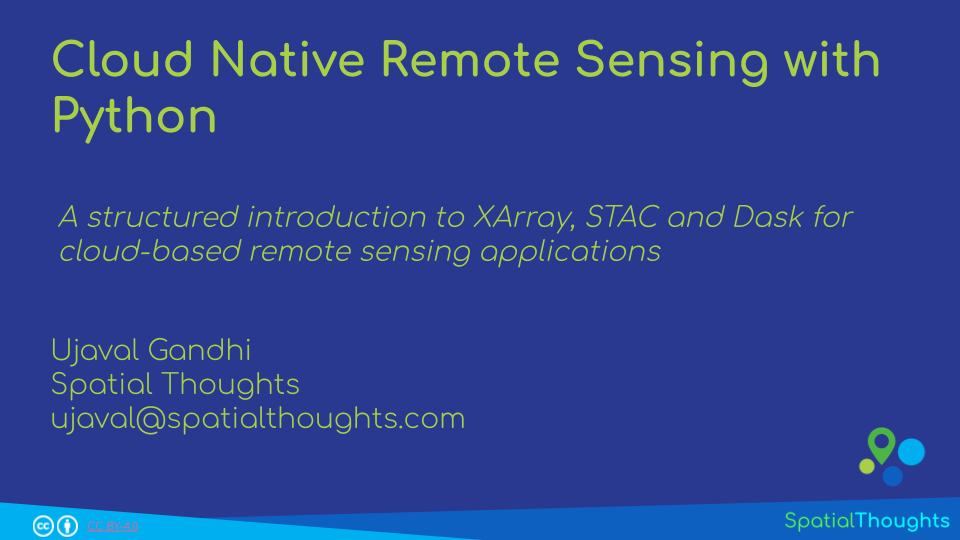
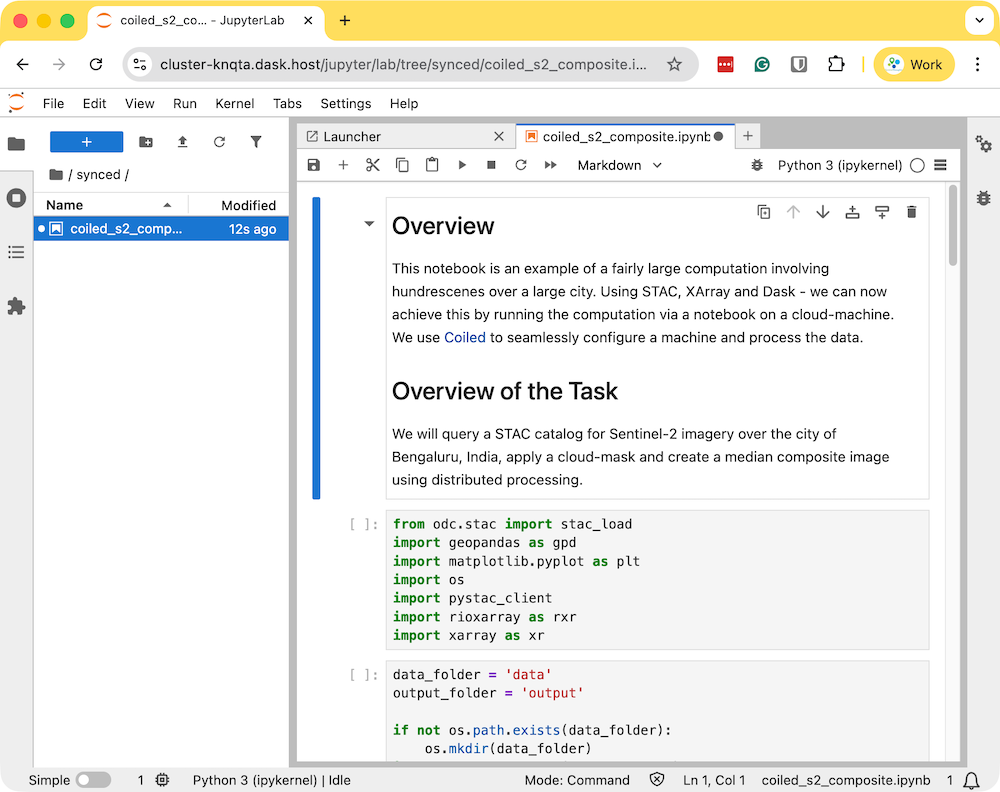
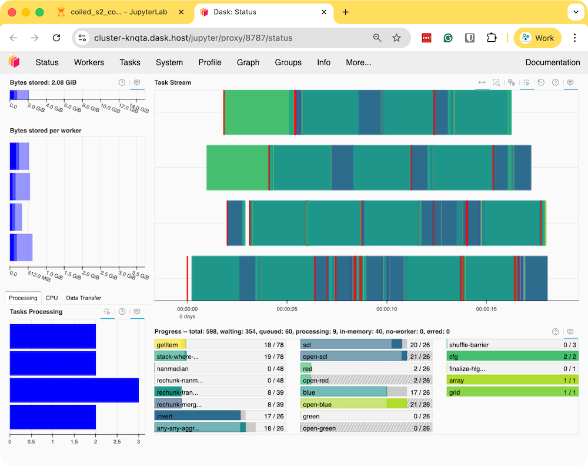
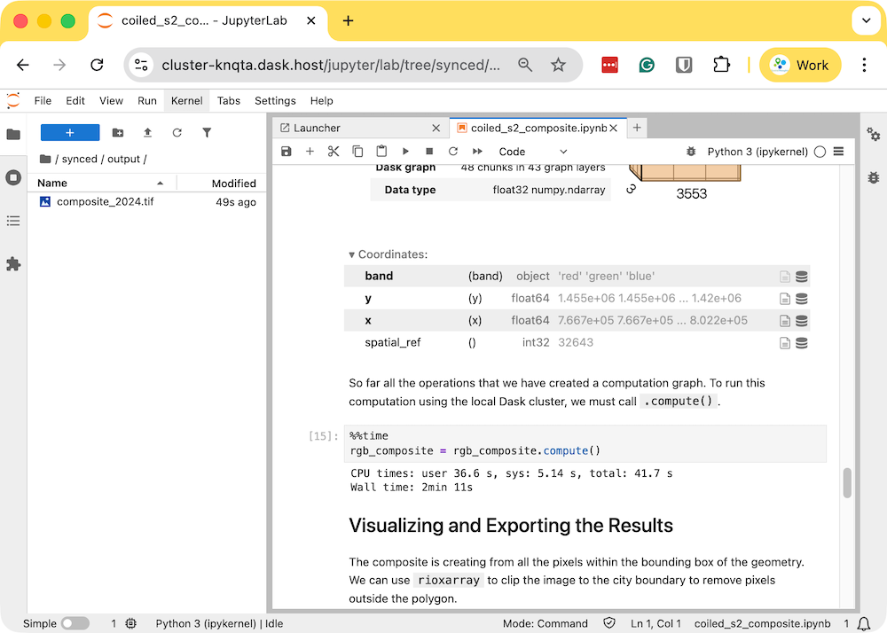

\newpage

***

```{r echo=FALSE, fig.align='center', out.width='75%', out.width='250pt'}
knitr::include_graphics('images/spatial_thoughts_logo.png')
```

***

\newpage

# Introduction 

XArray is a powerful Python package for working with climate and earth observation datasets. Inspired by libraries like pandas - it is particularly suited for working with multi-dimensional time-series raster datasets. With the growing ecosystem of spatial extensions like rioxarray and xarray-spatial and built-in support for parallel computing with Dask, it has become the de-facto standard for working with large spatio-temporal raster datasets. This workshop will show you how you can use it to effectively process large volumes of earth observation data using cloud-based datasets.


[{width="400px"}](https://docs.google.com/presentation/d/1YhT8OdrOm0JkkoTJ-eyQC89V2q6QiFXpA_57QW6caec/edit?usp=sharing){target="_blank"}

[View the Presentation &#8599;](https://docs.google.com/presentation/d/1YhT8OdrOm0JkkoTJ-eyQC89V2q6QiFXpA_57QW6caec/edit?usp=sharing){target="_blank"}


# Notebooks and Datasets

This workshop uses Google Colab for all exercises. You do not need to install any packages or download any datasets. 

The notebooks can be accessed by clicking on the  buttons at the beginning of each section. Once you have opened the notebook in Colab, you can copy it to your own account by going to *File &rarr; Save a Copy in Drive*. 


```{r echo=FALSE, fig.align='center', out.width='75%'}
knitr::include_graphics('images/common/colab1.png')
```

Once the notebooks are saved to your drive, you will be able to modify the code and save the updated copy. You can also click the *Share* button and share a link to the notebook with others.

```{r echo=FALSE, fig.align='center', out.width='75%'}
knitr::include_graphics('images/common/colab2.png')
```


# Hello Colab

[](https://colab.research.google.com/github/spatialthoughts/python-dataviz-web/blob/main/00_hello_colab.ipynb)


```{r child='python-remote-sensing-output/00_hello_colab.md'}
```

# 1. XArray Basics

[](https://colab.research.google.com/github/spatialthoughts/courses/blob/master/code/python_remote_sensing/01_xarray_basics.ipynb)


```{r child='python-remote-sensing-output/01_xarray_basics.md'}
```

# 2. STAC and Dask Basics

[](https://colab.research.google.com/github/spatialthoughts/courses/blob/master/code/python_remote_sensing/02_stac_dask_basics.ipynb)


```{r child='python-remote-sensing-output/02_stac_dask_basics.md'}
```

# 3. Calculating Spectral Indices

[](https://colab.research.google.com/github/spatialthoughts/courses/blob/master/code/python_remote_sensing/03_calculating_indices.ipynb)


```{r child='python-remote-sensing-output/03_calculating_indices.md'}
```

# 4. Masking Clouds

[](https://colab.research.google.com/github/spatialthoughts/courses/blob/master/code/python_remote_sensing/04_masking_clouds.ipynb)


```{r child='python-remote-sensing-output/04_masking_clouds.md'}
```

# 5. Extracting Time-Series

[](https://colab.research.google.com/github/spatialthoughts/courses/blob/master/code/python_remote_sensing/05_extracting_time_series.ipynb)


```{r child='python-remote-sensing-output/05_extracting_time_series.md'}
```

# 6. Scaling Analysis with Coiled

[Coiled](https://coiled.io/) is a platform that allows you to easily setup cloud infrastructure for distributed processing. It provides a Python-package and a Notebook service that makes it very easy to scale your Xarray + Dask workflows to process large volumes of data. In this section, you will learn how to setup coiled and run a notebook in a cloud-hosted machine for creating a median cloud-free annual composite from Sentinel-2 imagery.

## Installation and Setting up the Environment

You need to install the `coiled` along with other required packages in your local Python environment and configure your account. Visit the [Coiled Documentation](https://docs.coiled.io/user_guide/setup/index.html) for detailed setup instructions. 

### Create an Account

[Sign-up](https://cloud.coiled.io/signup) for a free coiled account.

### Install Coiled

We will be using Anaconda to install and manage the packages. Please review the [Anaconda Installation Guide](https://courses.spatialthoughts.com/python-foundation.html#installation-and-setting-up-the-environment) for step-by-step instructions.

1. Once you have installed Anaconda, open *Anaconda Prompt* or a *Terminal* and run the following commands to create a fresh environment and activate it.

```
conda create --name coiled -y
conda activate coiled
```

2. Now your environment is ready. We will install the required packages. First install `geopandas`.

```
conda install -c conda-forge coiled "dask[complete]" -y
conda install -c conda-forge jupyterlab odc-stac rioxarray \ 
  matplotlib jupyter-server-proxy geopandas pystac-client -y
```

3. Login to your account.

```
coiled login
```

### Connect your Cloud Account

Next, you will need to configure it with your own cloud account. All popular cloud services (GCP, AWS, Azure) are supported. Below is the command required to configure it with your GCP account.

```
coiled setup gcp
```

Once setup, you can visit the [Coiled Dashboard](https://cloud.coiled.io/) to verify the setup.

### Setup Mutagen (Optional)

A great feature of the coiled notebook service is the ability to sync your local Python environment and files with the cloud machine. This requires installing the [Mutagen](https://docs.coiled.io/user_guide/notebooks.html#notebook-file-sync) utility. On MacOS and Linux, this is straightforward using Homebrew.

```
brew install mutagen-io/mutagen/mutagen
```

### Start a Notebook on a Cloud Machine

1. Change your local directory to a folder where you have your code.

```
cd Desktop/coiled
```

2. Start a notebook on a cloud machine. The default machine you get on GCP is the `e2-standard-4` VM with 4 vCPU and 16 GB memory. This is a decent and cheap option for small to medium sized workloads. You can always get bigger machine with more memory of more vCPUs. See how to specify [VM Size and Type](https://docs.coiled.io/user_guide/clusters/size-and-type.html).

```
coiled notebook start --sync
```

```{r echo=FALSE, fig.align='center', out.width='75%'}
knitr::include_graphics('images/python_remote_sensing/coiled_notebook_start.png')
```

## Running Your Notebook

1. Download the example notebook to your machine. Visit [coiled_s2_composite.ipynb](https://github.com/spatialthoughts/courses/blob/master/code/python_remote_sensing/coiled_s2_composite.ipynb) and click the *Download raw file* button. Copy the file to your preferred directory where you started the coiled notebook. The file will appear in the Jupyter Lab instance that was launched by Coiled. Double-click to open the notebook.

```{r echo=FALSE, fig.align='center', out.width='75%'}

```

2. Run the notebook to start the data processing. The notebook is running on a cloud machine and you can see the progress on the Dask Dashboard.

```{r echo=FALSE, fig.align='center', out.width='75%'}

```

3. Once the processing finishes, the resulting composite `rgb_composite_2024.tif` will be available in the `output` folder which will be automatically synced to your machine.

```{r echo=FALSE, fig.align='center', out.width='75%'}

```

4. The resulting Sentinel-2 RGB composite is now available on your machine and can be viewed using QGIS.

```{r echo=FALSE, fig.align='center', out.width='75%'}
knitr::include_graphics('images/python_remote_sensing/coiled_composite.png')
```

5. Once you are done with processing, remember to stop the notebook server. This will stop the cloud instance.

> If you forget to stop the server, you will continue getting charged for the running intance in the cloud. You can always visit the [Coiled Dashboard](https://cloud.coiled.io/) to verify that there are no running clusters.

```{r echo=FALSE, fig.align='center', out.width='50%'}
knitr::include_graphics('images/python_remote_sensing/coiled_notebook_stop.png')
```

# Supplement

## Using Planetary Computer Data Catalog

[](https://colab.research.google.com/github/spatialthoughts/courses/blob/master/code/python_remote_sensing/supplement_pc_extracting_time_series.ipynb)

```{r child='python-remote-sensing-output/supplement_pc_extracting_time_series.md'}
```
----


# Data Credits
* Sentinel-2 Level 2A Scenes: Contains modified Copernicus Sentinel data (2025-02)
* Bangalore Ward Maps Provided by Spatial Data of Municipalities (Maps) Project by Data{Meet}.


# License

This workshop material is licensed under a [Creative Commons Attribution 4.0 International (CC BY 4.0)](https://creativecommons.org/licenses/by/4.0/). You are free to re-use and adapt the material but are required to give appropriate credit to the original author as below:

*Scalable Remote Sensing Workflows with Xarray* workshop by Ujaval Gandhi [www.spatialthoughts.com](https://spatialthoughts.com)


***

&copy; 2025 Spatial Thoughts [www.spatialthoughts.com](https://spatialthoughts.com)
