\newpage

***

```{r echo=FALSE, fig.align='center', out.width='75%', out.width='250pt'}
knitr::include_graphics('images/spatial_thoughts_logo.png')
```

***

\newpage

# Introduction 

This is an intermediate-level course that covers tools and techniques for working with climate and earth observation datasets using modern cloud-native approach. With the growing ecosystem of cloud native data formats, open data catalogs and powerful open-source packages - remote sensing practitioners are now able to adopt open and vendor agnostic cloud-based data processing workflows. This class will cover how to implement these workflows using Python-based tooling with hands-on examples. 


[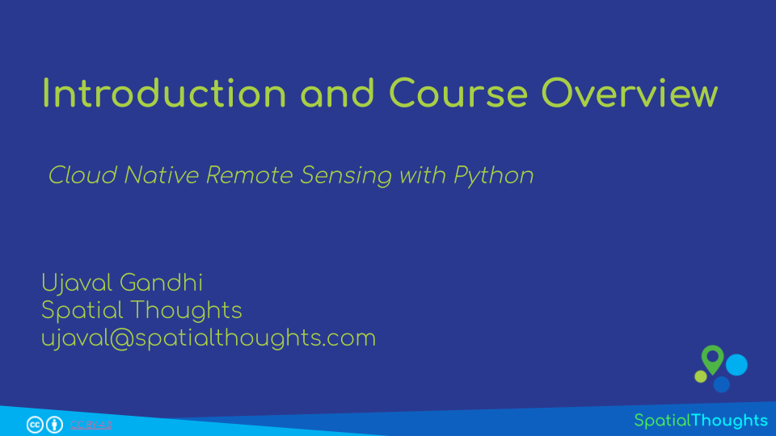{width="400px"}](https://docs.google.com/presentation/d/1YhT8OdrOm0JkkoTJ-eyQC89V2q6QiFXpA_57QW6caec/edit?usp=sharing){target="_blank"}

[View the Presentation &#8599;](https://docs.google.com/presentation/d/1YhT8OdrOm0JkkoTJ-eyQC89V2q6QiFXpA_57QW6caec/edit?usp=sharing){target="_blank"}


# Installation and Setting up the Environment 

For the most part of the course, we will be using [Google Colab](https://research.google.com/colaboratory/faq.html). This does not require any setup and can be used with a Google account. 

All the notebooks provided here can also be run on your own machine using Jupyter Lab. Complete the following setup to install the required packages.

## Install Conda

Follow our step-by-step [Conda Installation Guide](install-conda.html) to install Miniconda for your operating system.

## Create an Environment and Install Packages

We will use conda to install the required Python packages and manage local development environment. 

1. *(Windows users)*, search for Windows Powershell and launch it. *(Mac/Linux users)*: Launch a Terminal window. Run the following commands to create a fresh environment and activate it.

```{bash eval=FALSE}
conda create --name python_remote_sensing -y
conda activate python_remote_sensing
```

2. Now your environment is ready. We will install the required packages from `conda-forge`.

```{bash eval=FALSE}
conda install -c conda-forge -y \
  botocore \
  bottleneck \
  coiled \
  dask \
  distributed \
  duckdb \
  earthengine-api \
  exactextract \
  geopandas \
  jupyterlab \
  jupyter-server-proxy \
  lonboard \
  matplotlib \
  netcdf4 \
  numpy \
  odc-stac \
  openpyxl \
  pandas \
  planetary-computer \
  pyproj \
  pystac-client \
  python-graphviz \
  rioxarray \
  scikit-learn \
  xarray \
  xarray-spatial \
  xee \
  xvec
```

3. Some packages are not available on conda-forge, so we install them from PyPI using `pip`.

```{bash eval=FALSE}
conda install -c conda-forge -y pip
pip install aef-loader xrscipy 
```

# Development Tools

## Introduction to Google Colab

[](https://colab.research.google.com/github/spatialthoughts/courses/blob/master/code/python_remote_sensing/00_hello_colab.ipynb)


```{r child='python-remote-sensing-output/00_hello_colab.md'}
```

## Introduction to GeoLibre

[GeoLibre](https://geolibre.app/) is an open-source cloud-native GIS platform that supports loading and visualizing a wide-variety of cloud-native geospatial data formats. It is well suited for cloud-native data work - exploring large datasets, collecting training samples, interactively visualizing outputs and more. 

We will be using the [GeoLibre Viewer](https://viewer.geolibre.app/) in this course. Let's take a quick tour to get familiar with the interface and the capabilities.

1. Visit https://viewer.geolibre.app/ to open the GeoLibre Viewer. The viewer is a static web app that runs on your browser.

```{r echo=FALSE, fig.align='center', out.width='75%'}
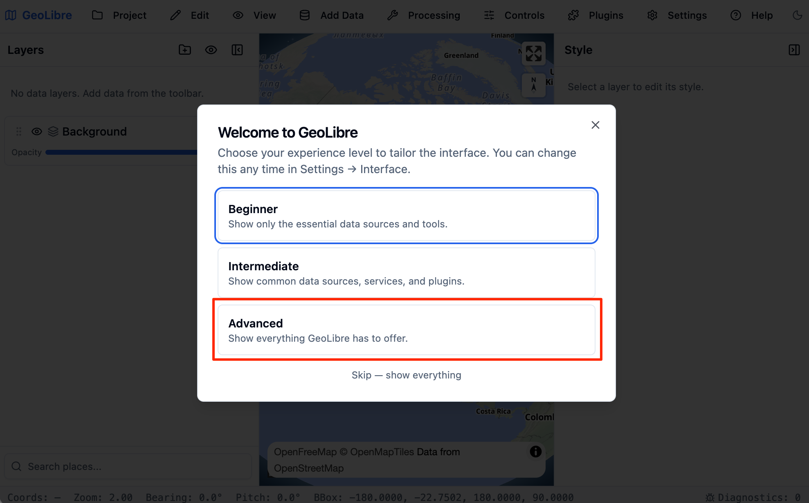
```

2. GeoLibre can load data from your local machine as well as cloud locations. Let's load a vector layer. Go to **Add Data &rarr; Vector Layer**.

```{r echo=FALSE, fig.align='center', out.width='75%'}
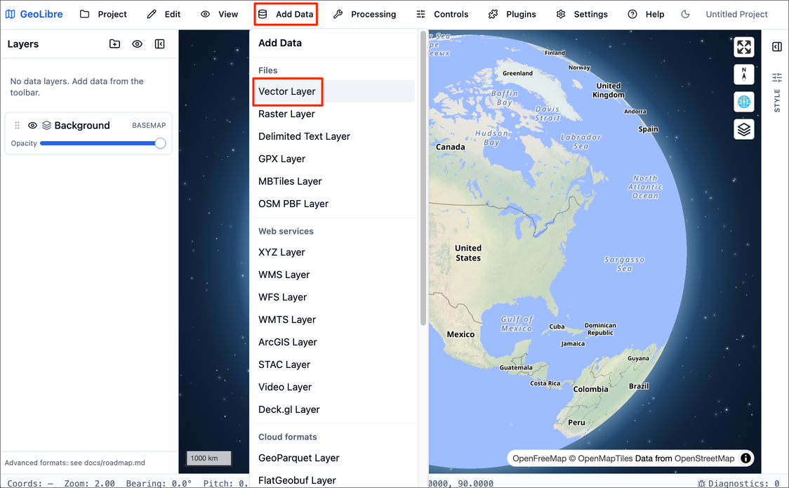
```

3. In the *Add Vector Data* panel, click the *Drop file or click to browse* button. Locate the `capitals.gpkg` we downloaded in the previous section and click *Open*. A new layer `capitals` will be added to the viewer. Close the panel.

```{r echo=FALSE, fig.align='center', out.width='75%'}
knitr::include_graphics('images/python_remote_sensing/geolibre3.png')
```

4. Let's add a raster layer next. Go to **Add Data &rarr; Raster Layer**. We will load a large Cloud Optimized GeoTiff (COG) of the VIIRS Nighttiem Lights dataset hosted in a cloud bucket. Paste the following URL and click *Load*.

```
https://storage.googleapis.com/spatialthoughts-public-data/ntl/viirs/viirs_ntl_2021_global.tif
```

```{r echo=FALSE, fig.align='center', out.width='75%'}
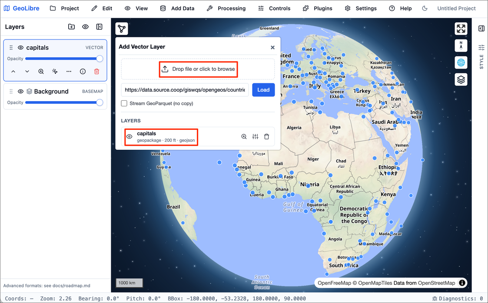
```

5. A new layer `viirs_ntl_2021_global.tif` will be added. You can change the default colormap to any other colormap of your choice and adjust the visualization settings. You can also insepct the pixel values by first enabling the *Inspect* button and then clicking on the map. When you are done, close the panel.

```{r echo=FALSE, fig.align='center', out.width='75%'}
knitr::include_graphics('images/python_remote_sensing/geolibre5.png')
```

6. GeoLibre comes with many plugins that extend its core functionality. We will add a basemap layer next. Go to **Plugins &rarr; Basemaps &rarr; Activate**.

```{r echo=FALSE, fig.align='center', out.width='75%'}
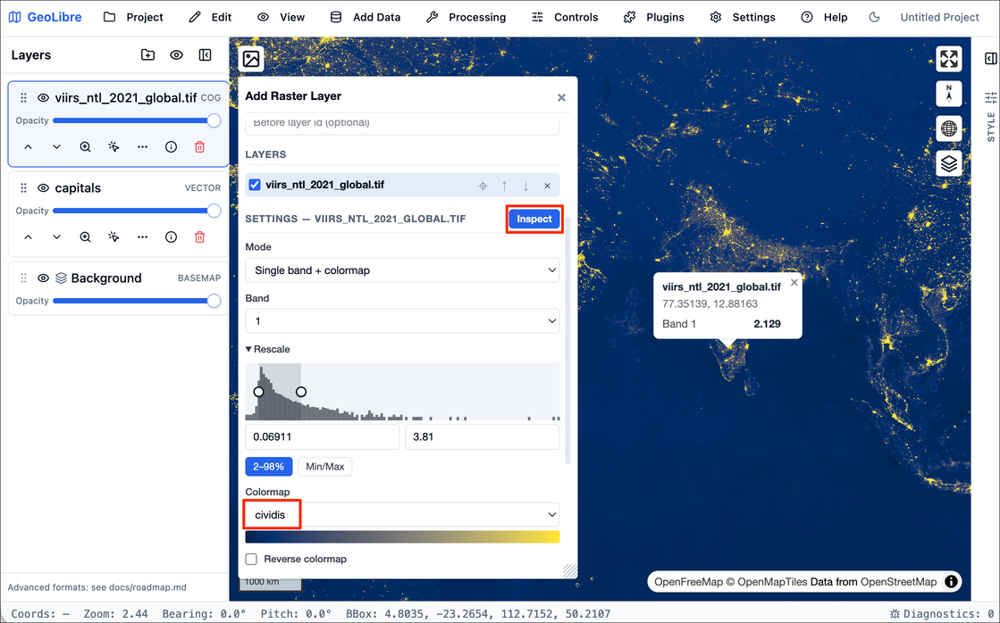
```

7. Select the **Google Satellite** basemap and it will be added to the viewer. Adjust the *Opacity* slider to see the layer below.

```{r echo=FALSE, fig.align='center', out.width='75%'}
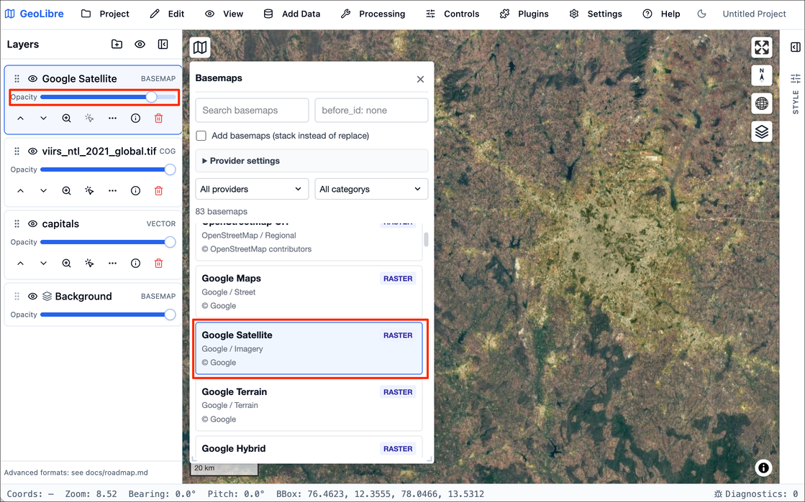
```

In this course, we will also use GeoLibre for collecting samples for supervised classification. Detailed workflow for data creation is explained in Module 4.

## AI Coding Agents

### Google Gemini in Colab

We recommend using the built-in Gemini integration in Google Colab for writing, modifying and updating code in the provided notebooks.

```{r echo=FALSE, fig.align='center', out.width='75%'}
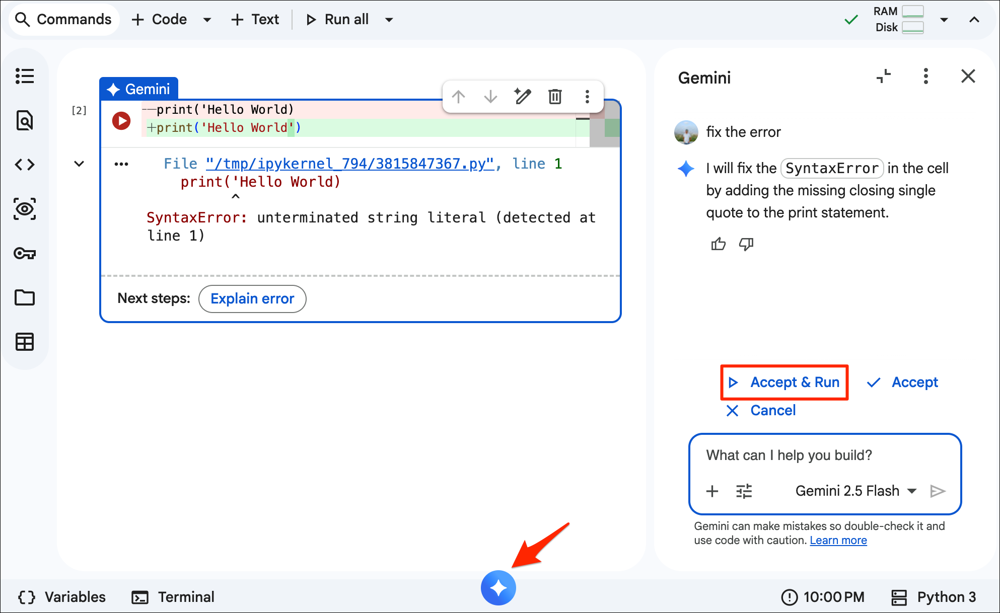
```

### Claude Code

We have provided a Claude Code skill [cloud-native-remote-sensing](https://github.com/spatialthoughts/spatialthoughts-ai-skills/) that captures the best-practices and workflows taught in this course. This approach is recommended when creating new notebooks or working on more complex updates. See the repository [README.md](https://github.com/spatialthoughts/spatialthoughts-ai-skills/blob/main/README.md) for instructions on how to install and use this skill.

```{r echo=FALSE, fig.align='center', out.width='75%'}
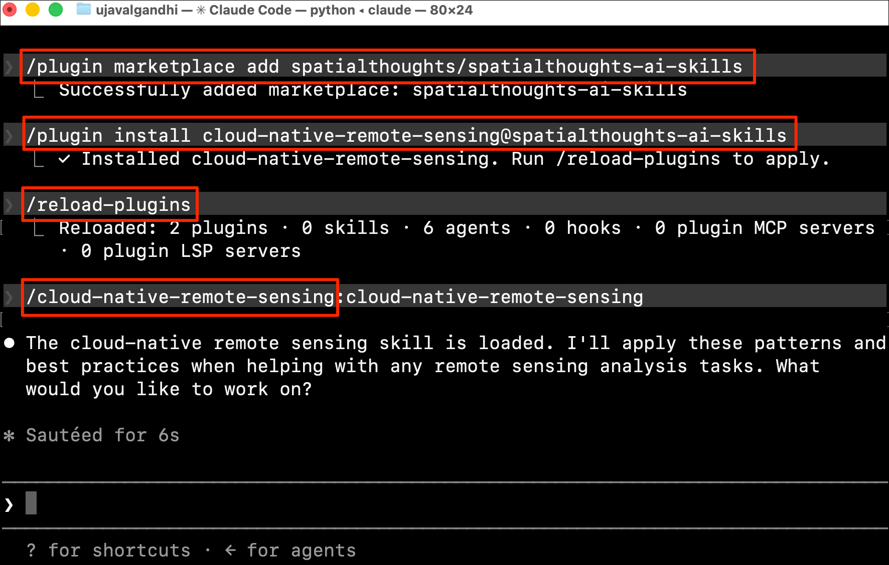
```

# Using Colab Notebooks

The notebooks in this course can be accessed by clicking on the  buttons at the beginning of each section. Once you have opened the notebook in Colab, you can copy it to your own account by going to *File &rarr; Save a Copy in Drive*. 

```{r echo=FALSE, fig.align='center', out.width='75%'}
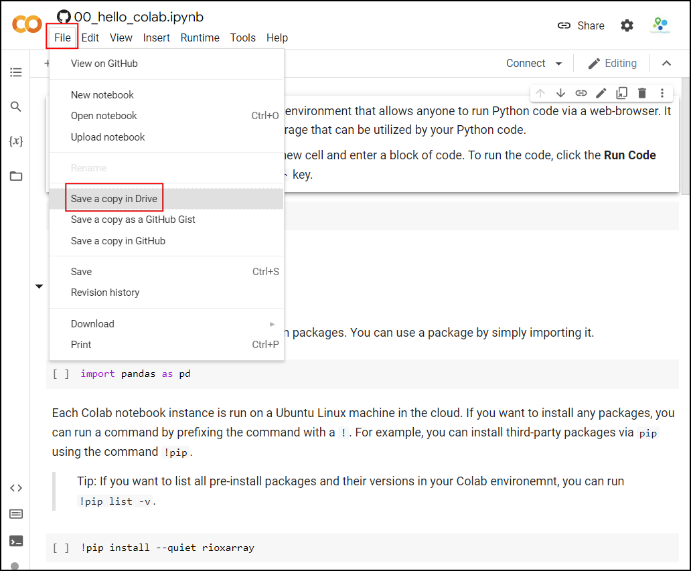
```

Once the notebooks are saved to your drive, you will be able to modify the code and save the updated copy. You can also click the *Share* button and share a link to the notebook with others.

```{r echo=FALSE, fig.align='center', out.width='75%'}
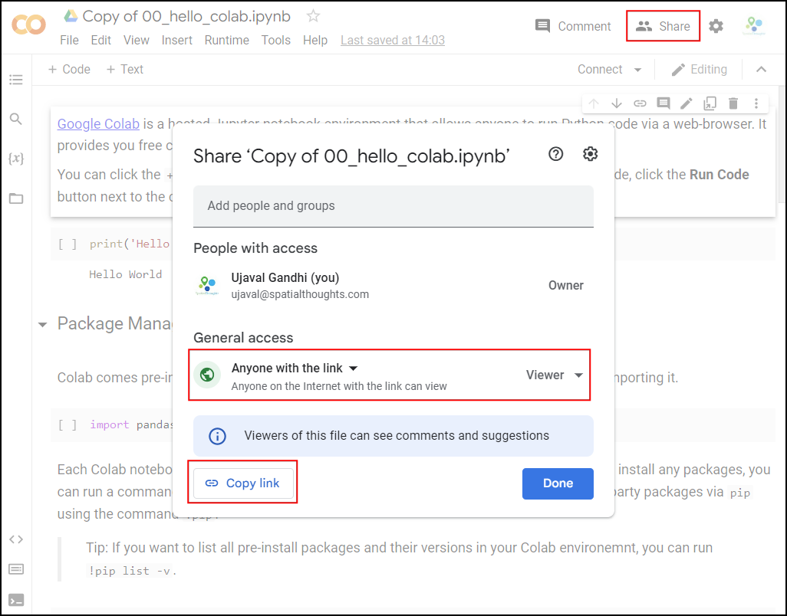
```

# Module 1: Cloud Native Geospatial Fundamentals

[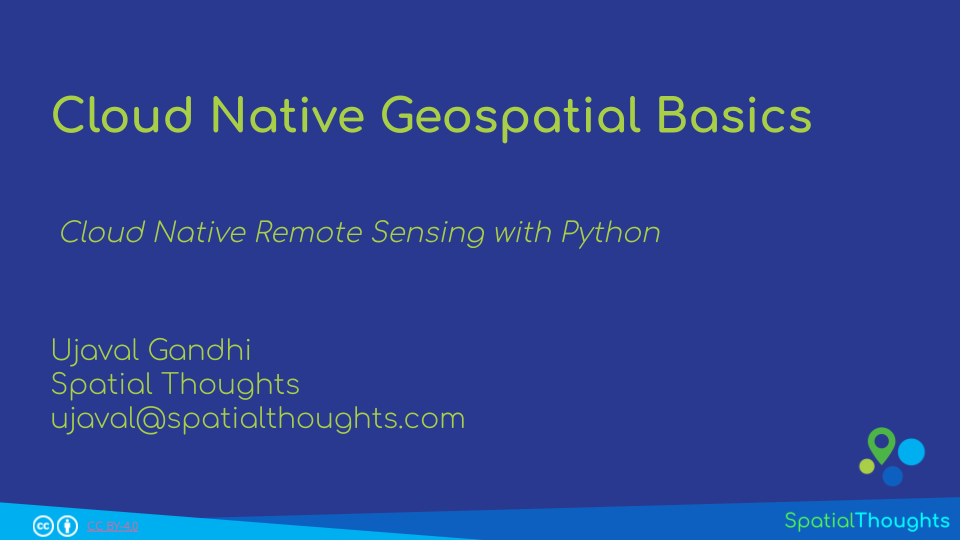{width="400px"}](https://docs.google.com/presentation/d/1FPQ4ZQVqTXW5hQ2FVZG9knwZNDnR3aUoeJvpUOoRC6Y/edit?usp=sharing){target="_blank"}

[View the Presentation &#8599;](https://docs.google.com/presentation/d/1FPQ4ZQVqTXW5hQ2FVZG9knwZNDnR3aUoeJvpUOoRC6Y/edit?usp=sharing){target="_blank"}


## 1.1 XArray Basics

[](https://colab.research.google.com/github/spatialthoughts/courses/blob/master/code/python_remote_sensing/module_01/01_xarray_basics.ipynb)


```{r child='python-remote-sensing-output/module_01/01_xarray_basics.md'}
```

## 1.2 STAC and Dask Basics

[](https://colab.research.google.com/github/spatialthoughts/courses/blob/master/code/python_remote_sensing/module_01/02_stac_dask_basics.ipynb)


```{r child='python-remote-sensing-output/module_01/02_stac_dask_basics.md'}
```

## 1.3 DuckDB Basics

[](https://colab.research.google.com/github/spatialthoughts/courses/blob/master/code/python_remote_sensing/module_01/03_duckdb_basics.ipynb)


```{r child='python-remote-sensing-output/module_01/03_duckdb_basics.md'}
```

## 1.4 Creating a Median Composite

[](https://colab.research.google.com/github/spatialthoughts/courses/blob/master/code/python_remote_sensing/module_01/04_median_composite.ipynb)


```{r child='python-remote-sensing-output/module_01/04_median_composite.md'}
```

## Assignment 1

[](https://colab.research.google.com/github/spatialthoughts/courses/blob/master/code/python_remote_sensing/module_01/assignment1.ipynb)


```{r child='python-remote-sensing-output/module_01/assignment1.md'}
```


# Module 2: Remote Sensing Fundamentals

## 2.1 Calculating Spectral Indices

[](https://colab.research.google.com/github/spatialthoughts/courses/blob/master/code/python_remote_sensing/module_02/01_calculating_indices.ipynb)


```{r child='python-remote-sensing-output/module_02/01_calculating_indices.md'}
```

## 2.2 Masking Clouds

[](https://colab.research.google.com/github/spatialthoughts/courses/blob/master/code/python_remote_sensing/module_02/02_masking_clouds.ipynb)


```{r child='python-remote-sensing-output/module_02/02_masking_clouds.md'}
```

## 2.3 Extracting and Processing Time-Series

[](https://colab.research.google.com/github/spatialthoughts/courses/blob/master/code/python_remote_sensing/module_02/03_extracting_time_series.ipynb)


```{r child='python-remote-sensing-output/module_02/03_extracting_time_series.md'}
```

## Assignment 2

[](https://colab.research.google.com/github/spatialthoughts/courses/blob/master/code/python_remote_sensing/module_02/assignment2.ipynb)


```{r child='python-remote-sensing-output/module_02/assignment2.md'}
```


# Module 3: Computation and Data Processing

## 3.1 Calculating Area

[](https://colab.research.google.com/github/spatialthoughts/courses/blob/master/code/python_remote_sensing/module_03/01_calculating_area.ipynb)


```{r child='python-remote-sensing-output/module_03/01_calculating_area.md'}
```

## 3.2 Computing Zonal Statistics

[](https://colab.research.google.com/github/spatialthoughts/courses/blob/master/code/python_remote_sensing/module_03/02_zonal_statistics.ipynb)


```{r child='python-remote-sensing-output/module_03/02_zonal_statistics.md'}
```

## 3.3 Interoperability with Google Earth Engine

[](https://colab.research.google.com/github/spatialthoughts/courses/blob/master/code/python_remote_sensing/module_03/03_working_with_xee.ipynb)


```{r child='python-remote-sensing-output/module_03/03_working_with_xee.md'}
```

# Module 4: Machine Learning and AI

## 4.1 Preparing Data for Machine Learning

[](https://colab.research.google.com/github/spatialthoughts/courses/blob/master/code/python_remote_sensing/module_04/01_preparing_composites.ipynb)


```{r child='python-remote-sensing-output/module_04/01_preparing_composites.md'}
```

## 4.2 Unsupervised Classification

[](https://colab.research.google.com/github/spatialthoughts/courses/blob/master/code/python_remote_sensing/module_04/02_unsupervised_classification.ipynb)


```{r child='python-remote-sensing-output/module_04/02_unsupervised_classification.md'}
```

## 4.3 Supervised Classification

## 4.4 Supervised Classification with Embeddings

[](https://colab.research.google.com/github/spatialthoughts/courses/blob/master/code/python_remote_sensing/module_04/04_supervised_classification_embeddings.ipynb)

```{r child='python-remote-sensing-output/module_04/04_supervised_classification_embeddings.md'}
```


# Module 5: Computation Environments

[](https://colab.research.google.com/github/spatialthoughts/courses/blob/master/code/python_remote_sensing/module_05/cloudfree_s2_composites.ipynb)

```{r child='python-remote-sensing-output/module_05/cloudfree_s2_composite.md'}
```

## 5.1 Running Computation on Your Hardware

1. Open the notebook in Google Colab. Go to **File &rarr; Download &rarr; Download .ipynb** and download the notebook to your computer.

2. *(Windows users)*, search for Windows Powershell and launch it. *(Mac/Linux users)*: Launch a Terminal window. Run the following commands to activate your conda environment.

```{bash eval=FALSE}
conda activate python_remote_sensing
```

3. Launch Jupyter Lab.

```{bash eval=FALSE}
jupyter-lab
```

4. Locate the notebook in Jupyter Lab and click *Run*.

## 5.2 Using Google Cloud Runtime

Google Colab offers a seamless way to setup a VM in Google Cloud with a Colab Runtime and use it for executing your Colab Notebooks. 

### Connect to a Cloud Runtime


1. In Google Colab, click the  *Additional connection options* dropdown next to the *Connect* button and select **Connect to Google Cloud Runtime**.

```{r echo=FALSE, fig.align='center', out.width='60%'}
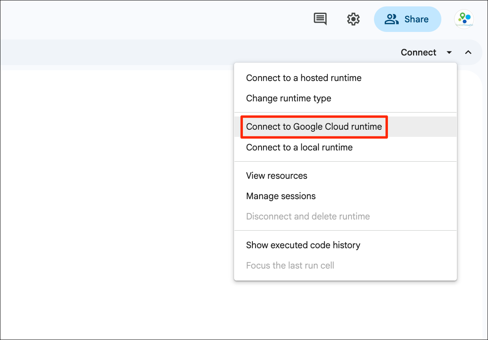
```

2. Select a project in the *Google Cloud project*. If you do not have any VMs available, click *Manage runtimes*.

```{r echo=FALSE, fig.align='center', out.width='50%'}
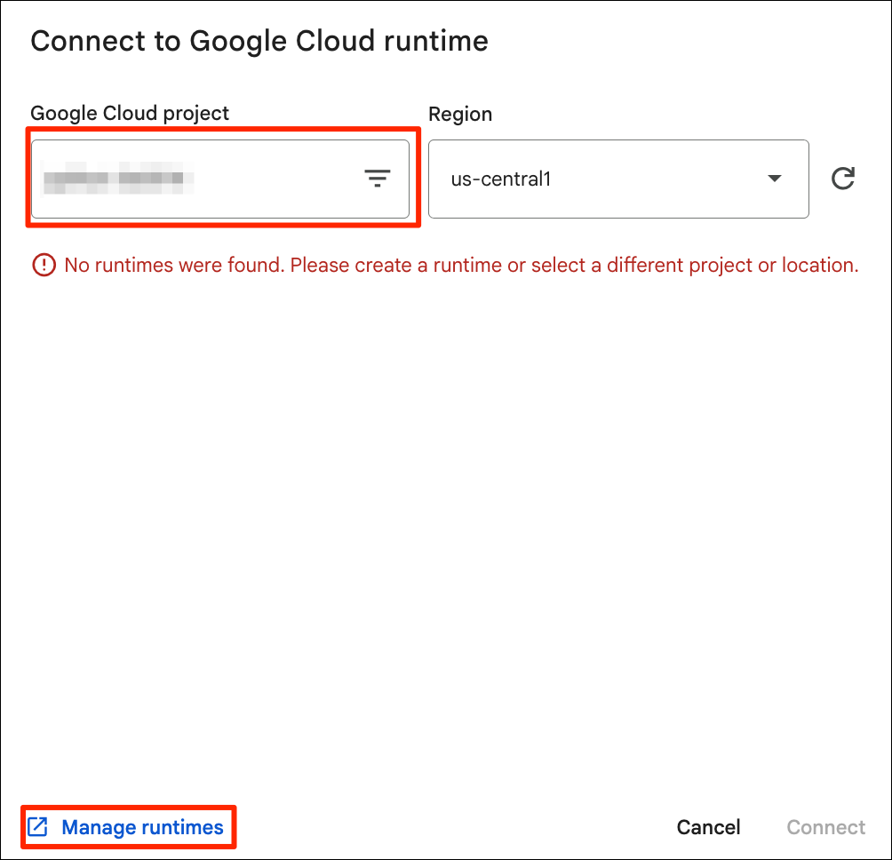
```

3. This will open the *Colab Enterprise* section in Google Cloud Console. Click on *Runtume templates*.

```{r echo=FALSE, fig.align='center', out.width='75%'}
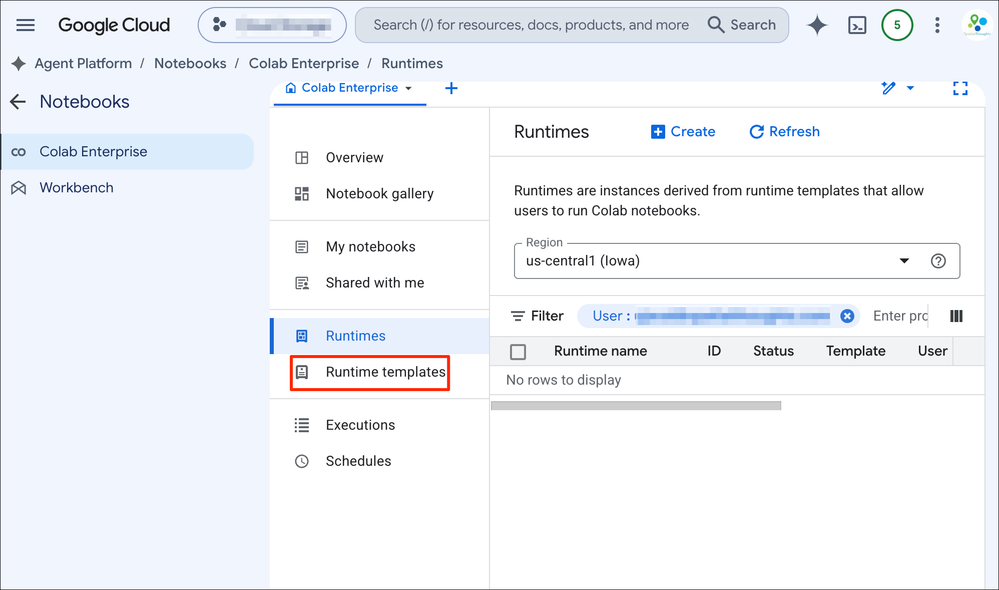
```

4. In the *Runtime templates* tab, click on *+ New Template*.

```{r echo=FALSE, fig.align='center', out.width='75%'}
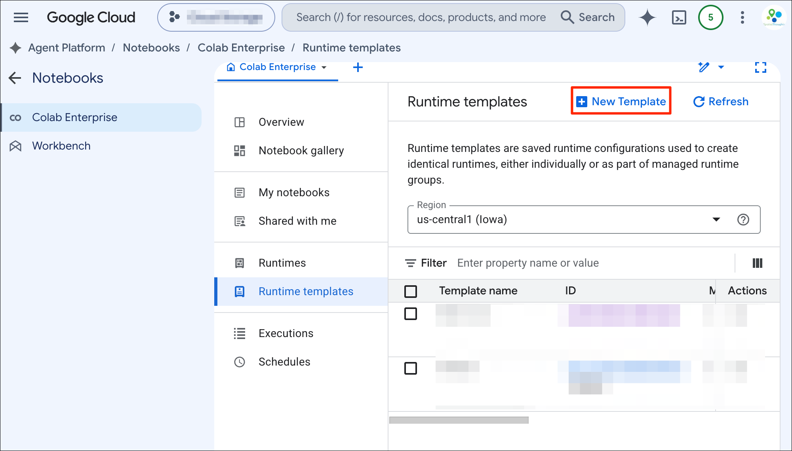
```

5. Enter a name for your template and click *Configure compute*.

```{r echo=FALSE, fig.align='center', out.width='75%'}
knitr::include_graphics('images/python_remote_sensing/colab_cloudruntime5.png')
```

6. Select the type of machine you need. Higher number of CPU cores will allow more parallel computing and faster processing. Once selected, click *Create*.

```{r echo=FALSE, fig.align='center', out.width='75%'}
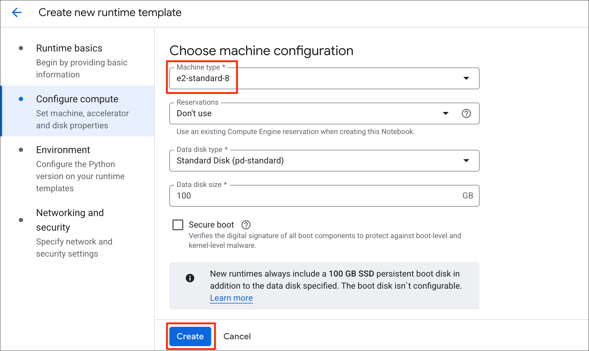
```

7. Once the template is created, click on the overflow menu *:* and select *Create runtime*.

```{r echo=FALSE, fig.align='center', out.width='75%'}
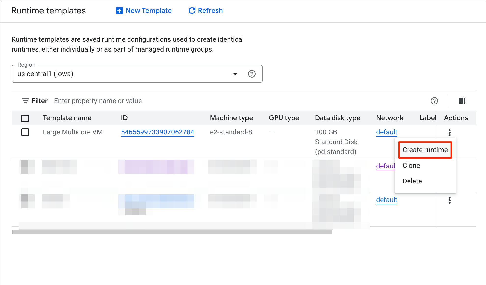
```

8. Confirm the details and click *Create*.

```{r echo=FALSE, fig.align='center', out.width='50%'}
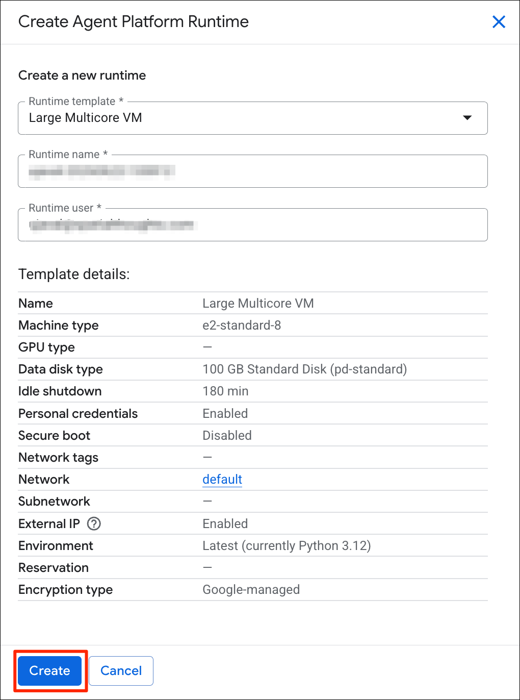
```

9. It will take a few minutes for the new runtime to be created. Wait till the *Status* shows **Healthy**.

```{r echo=FALSE, fig.align='center', out.width='75%'}
knitr::include_graphics('images/python_remote_sensing/colab_cloudruntime9.png')
```

10. Switch back to Google Colab and click the *Refresh* button. Your newly created VM should be listed. Select it and click *Connect*.

```{r echo=FALSE, fig.align='center', out.width='50%'}
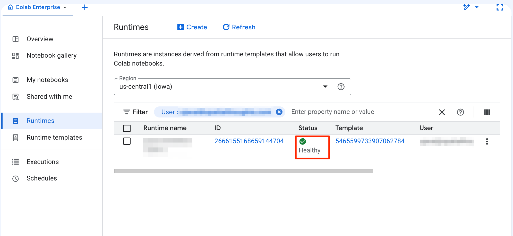
```

### Run Your Notebook

Run your notebook as usual. Your analysis will run on the cloud VM.

### Delete the Runtime

If you do not delete the VM after you are done with the analysis, you will incur recurring charges for the compute and storage. It is advisable to delete any Rumtimes that you are not using actively.

Once you are done with the analysis, go back to the *Colab Enterprise* section and select *Runtimes*. Click the *:* menu for any Runtime that are running and select *Delete*.

```{r echo=FALSE, fig.align='center', out.width='75%'}
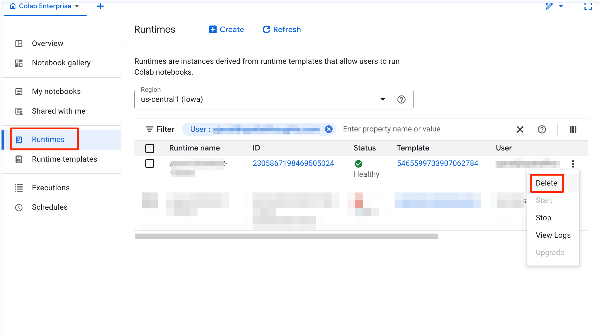
```

## 5.3 Scaling Analysis in Cloud with Coiled

[Coiled](https://coiled.io/) is a platform that allows you to easily setup cloud infrastructure for distributed processing. It provides a Python-package and a Notebook service that makes it very easy to scale your Xarray + Dask workflows to process large volumes of data. In this section, you will learn how to setup coiled and run a notebook in a cloud-hosted machine for creating a median cloud-free annual composite from Sentinel-2 imagery.

### Installation and Setting up the Environment

You need to install the `coiled` along with other required packages in your local Python environment and configure your account. Visit the [Coiled Documentation](https://docs.coiled.io/user_guide/setup/index.html) for detailed setup instructions. 

#### Create an Account

[Sign-up](https://cloud.coiled.io/signup) for a free coiled account.

#### Login to Coiled

We will use our existing conda environment to run the coiled notebook. Activate the environment and login to coiled.

```
conda activate python_remote_sensing
coiled login
```

#### Connect your Cloud Account

Next, you will need to configure it with your own cloud account. All popular cloud services (GCP, AWS, Azure) are supported. Below is the command required to configure it with your GCP account.

```
coiled setup gcp
```

Once setup, you can visit the [Coiled Dashboard](https://cloud.coiled.io/) to verify the setup.

#### Setup Mutagen (Optional)

A great feature of the coiled notebook service is the ability to sync your local Python environment and files with the cloud machine. This requires installing the [Mutagen](https://docs.coiled.io/user_guide/notebooks.html#notebook-file-sync) utility. On MacOS and Linux, this is straightforward using Homebrew.

```
brew install mutagen-io/mutagen/mutagen
```

#### Start a Notebook on a Cloud Machine

1. Change your local directory to a folder where you have your code.

```
cd Desktop/coiled
```

2. Start a notebook on a cloud machine. The default machine you get on GCP is the `e2-standard-4` VM with 4 vCPU and 16 GB memory. This is a decent and cheap option for small to medium sized workloads. You can always get bigger machine with more memory of more vCPUs. See how to specify [VM Size and Type](https://docs.coiled.io/user_guide/clusters/size-and-type.html).

```
coiled notebook start --sync
```

```{r echo=FALSE, fig.align='center', out.width='75%'}
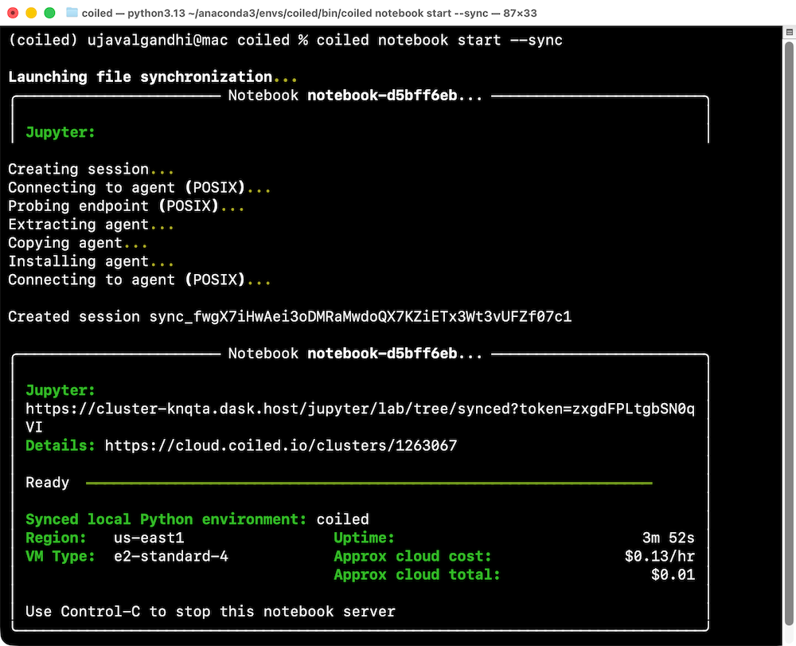
```

### Run Your Notebook

1. Download the example notebook to your machine. Visit [coiled_s2_composite.ipynb](https://github.com/spatialthoughts/courses/blob/master/code/python_remote_sensing/module_05/cloudfree_s2_composite.ipynb) and click the *Download raw file* button. Copy the file to your preferred directory where you started the coiled notebook. The file will appear in the Jupyter Lab instance that was launched by Coiled. Double-click to open the notebook.

```{r echo=FALSE, fig.align='center', out.width='75%'}
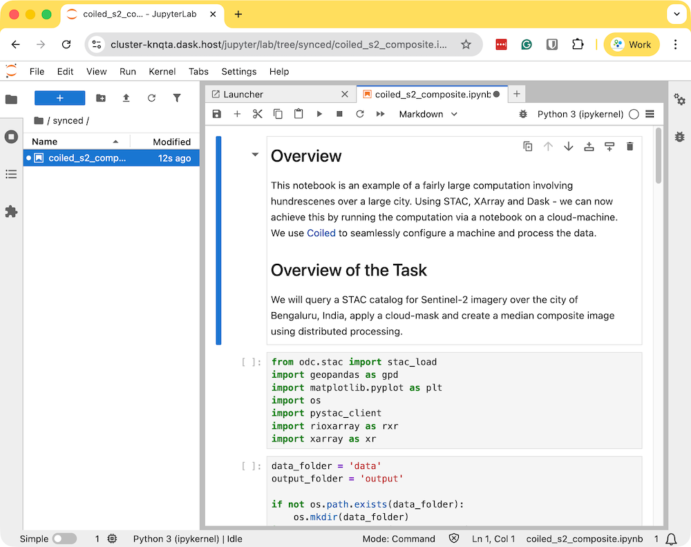
```

2. Run the notebook to start the data processing. The notebook is running on a cloud machine and you can see the progress on the Dask Dashboard.

```{r echo=FALSE, fig.align='center', out.width='75%'}
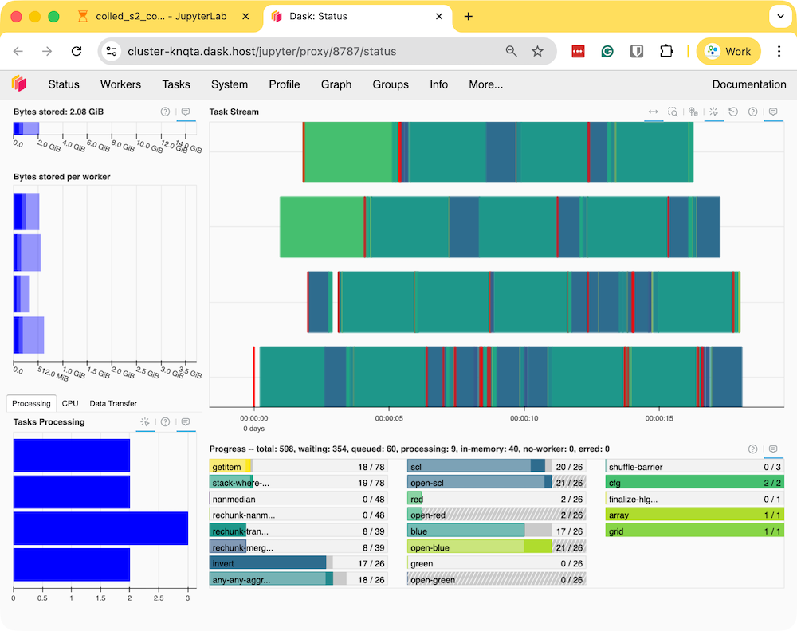
```

3. Once the processing finishes, the resulting composite `rgb_composite_2024.tif` will be available in the `output` folder which will be automatically synced to your machine.

```{r echo=FALSE, fig.align='center', out.width='75%'}
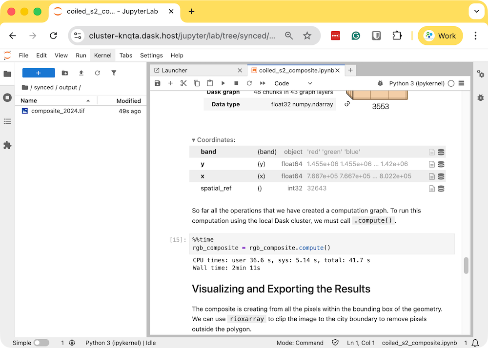
```

4. The resulting Sentinel-2 RGB composite is now available on your machine and can be viewed using QGIS.

```{r echo=FALSE, fig.align='center', out.width='75%'}
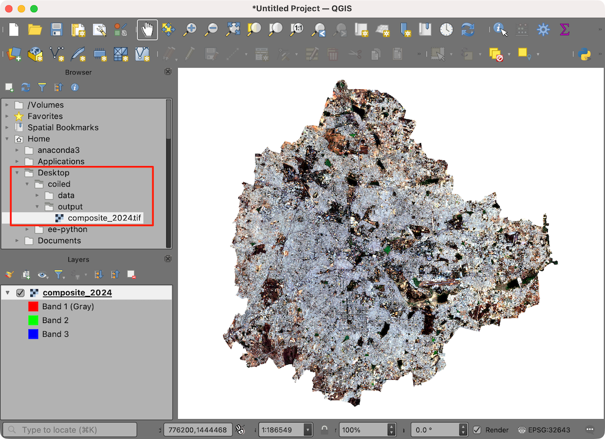
```

5. Once you are done with processing, remember to stop the notebook server. This will stop the cloud instance.

> If you forget to stop the server, you will continue getting charged for the running intance in the cloud. You can always visit the [Coiled Dashboard](https://cloud.coiled.io/) to verify that there are no running clusters.

```{r echo=FALSE, fig.align='center', out.width='50%'}
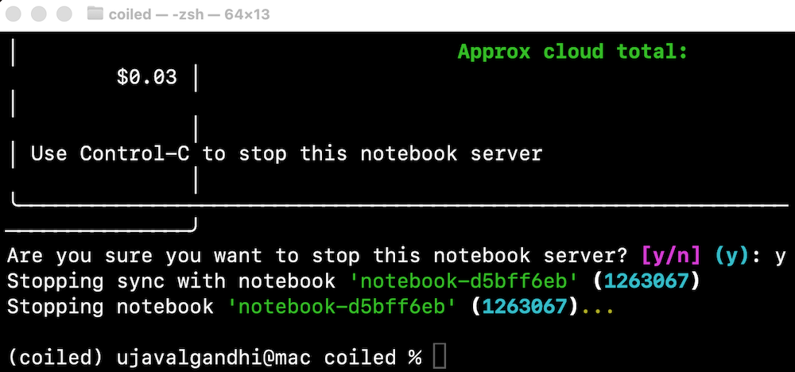
```

# Supplement

## Using Planetary Computer Data Catalog

[](https://colab.research.google.com/github/spatialthoughts/courses/blob/master/code/python_remote_sensing/supplement/pc_extracting_time_series.ipynb)

```{r child='python-remote-sensing-output/supplement/pc_extracting_time_series.md'}
```

## Downloading Sentinel-2 Cloud Free Mosaics

[](https://colab.research.google.com/github/spatialthoughts/courses/blob/master/code/python_remote_sensing/supplement/s2_cloudfree_mosaics.ipynb)

```{r child='python-remote-sensing-output/supplement/s2_cloudfree_mosaics.md'}
```

## Extracting Building Heights from GlobalBuildingAtlas

[](https://colab.research.google.com/github/spatialthoughts/courses/blob/master/code/python_remote_sensing/supplement/extracting_building_heights.ipynb)

```{r child='python-remote-sensing-output/supplement/extracting_building_heights.md'}
```


## Calculating Zonal Stats for Landcover Area

[](https://colab.research.google.com/github/spatialthoughts/courses/blob/master/code/python_remote_sensing/supplement/s2_cloudfree_mosaics.ipynb)

```{r child='python-remote-sensing-output/supplement/zonal_histogram.md'}
```


----

# Learning Resources

## Tutorials

* [EOPF Xarray Notebooks](https://eopf-toolkit.github.io/eopf-101/06_eopf_zarr_in_action/64_flood_mapping_valencia.html): Case studies and applications of EOPF Sentinel Zarr products - including flood mapping, vegetation monitoring, fire mapping and more. 
* [Earth Data Hub Tutorials](https://github.com/bopen/edh-learning/): Jupyter notebooks showing how to access and process climate and Earth observation Zarr data (ERA5, Sentinel-1 ARD, CMIP6, Copernicus DEM) via Python and Xarray.
* [Building an EVI Timeseries with ODC STAC](https://github.com/nasa/HLS-Data-Resources/blob/main/python/tutorials/EVI_timeseries_with_odc_stac.ipynb): A tutorial showing how to access Harmonized Landsat Sentinel-2 (HLS) data from NASA CMR-STAC and earthaccess.
* [Project Pythia Cookbooks](https://cookbooks.projectpythia.org/): A community learning resource for Python-based computing in the geosciences. Includes examples of remote sensing data such as [Landsat ML Cookbook](https://projectpythia.org/landsat-ml-cookbook/).
* [Exploring HLS data](https://github.com/auspatious/hls-experiments/tree/main): Loading and processing Harmonized Landsat and Sentinel-2 data with advanced cloud-masking using morphological operations.


# Data Credits

* Sentinel-2 Level 2A Scenes: Contains modified Copernicus Sentinel data (2025-02)
* Bangalore Ward Maps Provided by Spatial Data of Municipalities (Maps) Project by Data{Meet}.
* Admin boundaries: FieldMaps, geoBoundaries, U.S. Department of State, OpenStreetMap
* TerraClimate: Monthly Climate and Climatic Water Balance for Global Terrestrial Surfaces, University of Idaho: Abatzoglou, J.T., S.Z. Dobrowski, S.A. Parks, K.C. Hegewisch, 2018, Terraclimate, a high-resolution global dataset of monthly climate and climatic water balance from 1958-2015, Scientific Data 5:170191, doi:10.1038/sdata.2017.191
* Climate Hazards Center (2025). Climate Hazards Center Infrared Precipitation with Stations (CHIRPS) Data Repository. https://doi.org/10.15780/G2JQ0P. Accessed 2026-05-01.
* Zhu, X. X., Chen, S., Zhang, F., Shi, Y., and Wang, Y.: GlobalBuildingAtlas: an open global and complete dataset of building polygons, heights and LoD1 3D models, Earth Syst. Sci. Data, 17, 6647–6668, https://doi.org/10.5194/essd-17-6647-2025, 2025.
* Chen, J., Jönsson, P., Tamura, M., Gu, Z., Matsushita, B., & Eklundh, L. (2004). A simple method for reconstructing a high-quality NDVI time-series data set based on the Savitzky–Golay filter. Remote Sensing of Environment, 91(3–4), 332–344. https://doi.org/10.1016/j.rse.2004.03.014

# References

* Cordeiro, M. C. R.; Martinez, J.-M.; Peña-Luque, S. Automatic Water Detection from Multidimensional Hierarchical Clustering for Sentinel-2 Images and a Comparison with Level 2A Processors. *Remote Sensing of Environment* 2021, 253, 112209.

# License

This course material is licensed under a [Creative Commons Attribution 4.0 International (CC BY 4.0)](https://creativecommons.org/licenses/by/4.0/). You are free to re-use and adapt the material but are required to give appropriate credit to the original author as below:

*Cloud Native Remote Sensing with Python* course by Ujaval Gandhi [www.spatialthoughts.com](https://spatialthoughts.com)


***

&copy; 2025 Spatial Thoughts [www.spatialthoughts.com](https://spatialthoughts.com)
