\newpage

***

```{r echo=FALSE, fig.align='center', out.width='250pt'}
knitr::include_graphics('images/spatial_thoughts_logo.png')
```

***

\newpage

# Introduction 

QGIS allows you to define custom Actions on map layers. Actions can launch commands or run python code when the user clicks on a feature from the layer. This workshop will cover QGIS Actions in detail along with use cases on how you can harness its power to automate GIS workflows. We will focus on Python Actions and go through various examples of implementing new functionality and automating tasks with just a few lines of PyQGIS code.

This workshop requires prior knowledge of Python and familiarity with PyQGIS API.

[{width="400px"}](https://docs.google.com/presentation/d/16CiiFs3mLyQIrDXf4Uc50DFwRHsmCeMRpo1i25JNk-s/edit?usp=sharing){target="_blank"}

[View the Presentation &#8599;](https://docs.google.com/presentation/d/16CiiFs3mLyQIrDXf4Uc50DFwRHsmCeMRpo1i25JNk-s/edit?usp=sharing){target="_blank"}

# Software

This workshop requires QGIS LTR version 3.40. 

Please review [QGIS-LTR Installation Guide](install-qgis-ltr.html) for step-by-step instructions.

# Get the Data Package

The code examples in this workshop use a variety of datasets. All the required layers, project files etc. are supplied to you in the zip file `qgis-actions.zip`. Unzip this file to the `Downloads` directory.

The data package also comes with a ``solutions`` folder that contain model solutions for each section.

Download [qgis-actions.zip](https://github.com/spatialthoughts/courses/releases/download/data/qgis_actions.zip).

# 1. Hello World

Let's get started by learning the basics of QGIS Actions.

## 1.1 Extract a Feature from a Layer

We will create an action that takes a layer of all countries in the world and allows you to extract any country polygon by clicking on it.

1. Open QGIS. QGIS comes with a few hidden *Easter Eggs* that can be triggered by typing a keyword in the *Coordinate* box at the bottom of the main window. While many of these are for fun, some provide useful functionality. One such hidden feature is the ability to load a world map by typing a keyword. Enter the keyword **world** into the coordinate box at the bottom of the QGIS window rm and click *Enter*.

```{r echo=FALSE, fig.align='center', out.width='75%'}
knitr::include_graphics('images/qgis_actions/helloworld1.png')
```

2. A new layer named `World Map` will be added to the *Layers* panel. This layer is the [Admin0 - Countries](https://www.naturalearthdata.com/downloads/10m-cultural-vectors/) boundaries dataset from Natural Earth. Let's define an action on this layer. Right-click the layer and select *Properties*.

```{r echo=FALSE, fig.align='center', out.width='75%'}
knitr::include_graphics('images/qgis_actions/helloworld2.png')
```

3. Switch to the *Actions* tab and click the *Add a new action* (*+*) button.

```{r echo=FALSE, fig.align='center', out.width='75%'}
knitr::include_graphics('images/qgis_actions/helloworld3.png')
```

4. Select **Python** as the *Type*. Enter **Hello World** as the *Description*. This will be the name of the action as it appears in various menu items. Leave the *Action Scopes* to the default selected values of **Feature** and **Canvas**. Under the *Action Text* enter the following Python code and click *OK*.

```{python eval=FALSE}
print('Hello World')
```

```{r echo=FALSE, fig.align='center', out.width='60%'}
knitr::include_graphics('images/qgis_actions/helloworld4.png')
```

5. Click *OK* again to get back to the main QGIS Canvas. We now have an action that will print `Hello World` when we click on a feature. To see the output, open the *Python Console* from **Plugins &rarr; Python Console**. Locate the *Actions* button on the *Attributes Toolbar*. Click the dropdown menu next to it and select *Hello World*. 

```{r echo=FALSE, fig.align='center', out.width='75%'}
knitr::include_graphics('images/qgis_actions/helloworld5.png')
```

6. Once the action is selected, click on any feature from the layer. You will see *Hello World* printed in the console.

```{r echo=FALSE, fig.align='center', out.width='75%'}
knitr::include_graphics('images/qgis_actions/helloworld6.png')
```

7. You now know how to define and trigger a Python action. Let's make the action more useful. Instead of printing a static text, let's modify the action to print the name of the country where we clicked. Open the *Attribute Table* of the `World Map` layer. You will notice that the **NAME** attribute contains the country names.

```{r echo=FALSE, fig.align='center', out.width='75%'}
knitr::include_graphics('images/qgis_actions/helloworld7.png')
```

8. Right click the `World Map` layer and select *Properties*. From the *Actions* tab, double click the already defined *Hello World* action.

```{r echo=FALSE, fig.align='center', out.width='75%'}
knitr::include_graphics('images/qgis_actions/helloworld8.png')
```

9. Our action is triggered by clicking on a feature and we can access the attributes of that feature. Select the **NAME** attribute and click *Insert*.

```{r echo=FALSE, fig.align='center', out.width='60%'}
knitr::include_graphics('images/qgis_actions/helloworld9.png')
```

10. You will see the value `[%NAME%]` entered in the *Action Text* text box. This is a special expression syntax which indicates that the value surrounded by `[%` and `%]` will be replaced with the value of the attribute from the feature when the action is triggered.

```{r echo=FALSE, fig.align='center', out.width='60%'}
knitr::include_graphics('images/qgis_actions/helloworld10.png')
```

11. Update the code to print the attribute value as below.

```{python eval=FALSE}
print('[%NAME%]')
```

```{r echo=FALSE, fig.align='center', out.width='60%'}
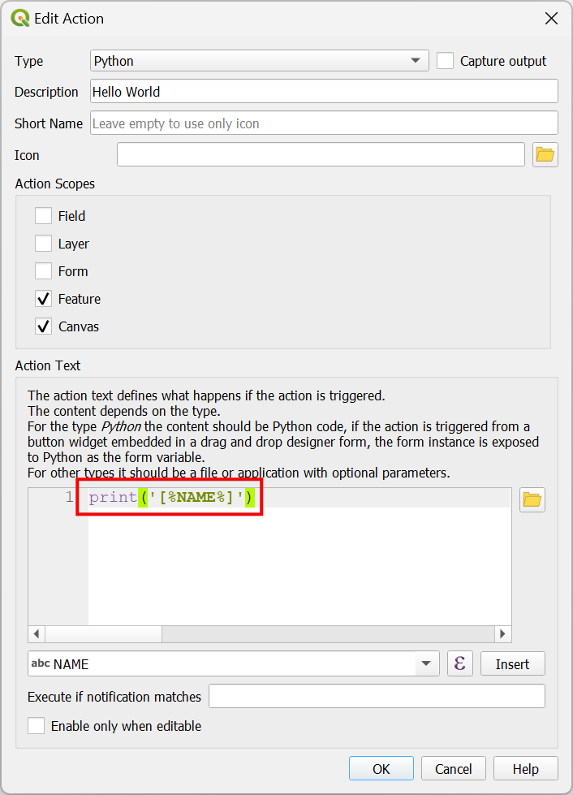
```

12. Click *OK* and get back to the main window. Select the action and click on any feature. You will now see the name of the country printed in the console.

```{r echo=FALSE, fig.align='center', out.width='75%'}
knitr::include_graphics('images/qgis_actions/helloworld12.png')
```

13. Along with all the attributes of the clicked feature, we also have access to other project and layer variables. Update the code as below to print the values of the feature id and layer id along with the value of the `NAME` attribute. Note that we are using the Python [f-strings](https://realpython.com/python-string-formatting/#3-string-interpolation-f-strings-python-36) for formatting the output.

```{python eval=FALSE}
feature_name = '[%NAME%]'
feature_id = [%$id%]
layer_id = '[%@layer_id%]'
print(f'feature name: {feature_name}')
print(f'feature id: {feature_id}')
print(f'layer id: {layer_id}')
```

```{r echo=FALSE, fig.align='center', out.width='60%'}
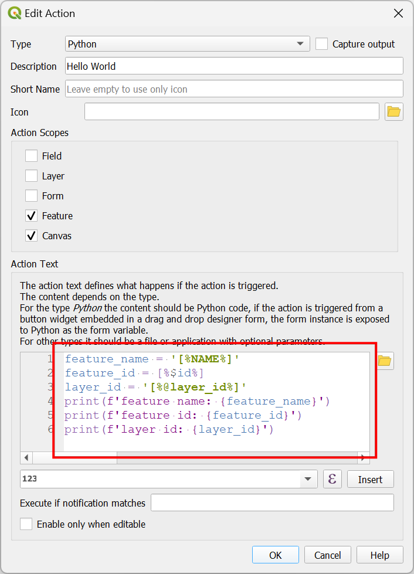
```

14. Click *OK* and try the action again. This time you will see the feature id and layer id printed along with the feature name.

```{r echo=FALSE, fig.align='center', out.width='75%'}
knitr::include_graphics('images/qgis_actions/helloworld14.png')
```

15. Now you know how to access the `@layer_id` and `$id` values of the current feature. We can now use it to extract the current feature and create a new layer from it. Replace the *Action Text* with the following code which uses  [`QgsFeatureSource.materialize()`](https://qgis.org/pyqgis/3.0/core/Feature/QgsFeatureSource.html#qgis.core.QgsFeatureSource.materialize) method to create a new memory based vector layer with the query containing the feature id.

```{python eval=FALSE}
feature_name = '[%NAME%]'
feature_id = [%$id%]
layer_id = '[%@layer_id%]'

layer = QgsProject.instance().mapLayer(layer_id)
new_layer = layer.materialize(
    QgsFeatureRequest().setFilterFids([feature_id]))
new_layer.setName(feature_name)
QgsProject.instance().addMapLayer(new_layer)
```

```{r echo=FALSE, fig.align='center', out.width='60%'}
knitr::include_graphics('images/qgis_actions/helloworld15.png')
```

16. Go back to the main Canvas and close the *Python Console*. Select the *Hello World* action and click on any feature. You will see a new layer added to the *Layers* panel that contains the feature. Really useful!

```{r echo=FALSE, fig.align='center', out.width='75%'}
knitr::include_graphics('images/qgis_actions/helloworld16.png')
```

17. We have a small problem. As the new layer is created and added to the *Layers* panel, it becomes the active layer. To trigger the action again, we have to select the `World Map` layer again. To prevent this, we can use [`QgisInterface.setActiveLayer()`](https://qgis.org/pyqgis/master/gui/QgisInterface.html#qgis.gui.QgisInterface.setActiveLayer) method to set the current layer as the active layer. We import `iface` in the code to access the current instance of the `QgisInterface` class.

```{python eval=FALSE}
from qgis.utils import iface

feature_name = '[%NAME%]'
feature_id = [%$id%]
layer_id = '[%@layer_id%]'

layer = QgsProject.instance().mapLayer(layer_id)
new_layer = layer.materialize(
    QgsFeatureRequest().setFilterFids([feature_id]))
new_layer.setName(feature_name)
QgsProject.instance().addMapLayer(new_layer)
iface.setActiveLayer(layer)
```

```{r echo=FALSE, fig.align='center', out.width='60%'}
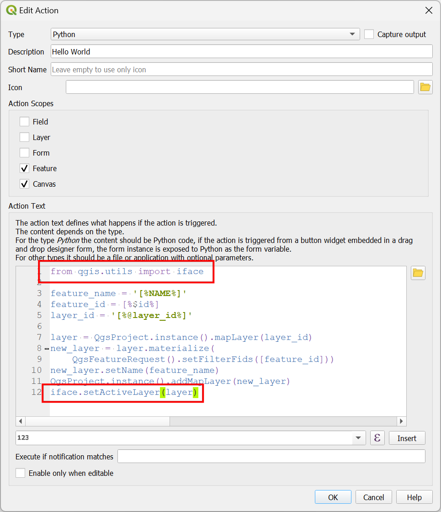
```

18. Now you are able to click around and extract multiple countries without having to manually switch layers.

```{r echo=FALSE, fig.align='center', out.width='75%'}
knitr::include_graphics('images/qgis_actions/helloworld18.png')
```

We have now finished this section and you are ready to do the exercise. Your can load the `HelloWorld_Checkpoint1.qgz` file in the `solutions` folder to catch up to this point.

## Exercise 1

Update the action to display an *Info* message on the QGIS message bar as shown below. 

Hint: You can use [iface.messageBar().pushInfo()](https://qgis.org/pyqgis/3.0/gui/Message/QgsMessageBar.html#qgis.gui.QgsMessageBar.pushInfo) method to display a message.

```{r echo=FALSE, fig.align='center', out.width='75%'}
knitr::include_graphics('images/qgis_actions/helloworld_exercise.png')
```

# 2. Automate Data Editing and Selection

In this section, we will work with a dataset of land parcels and learn how QGIS Actions can be used to speed up data selection and editing.

## 2.1 Select Multiple Features

1. Open the `Parcels_Multi_Select.qgz` project from your data package.

```{r echo=FALSE, fig.align='center', out.width='75%'}
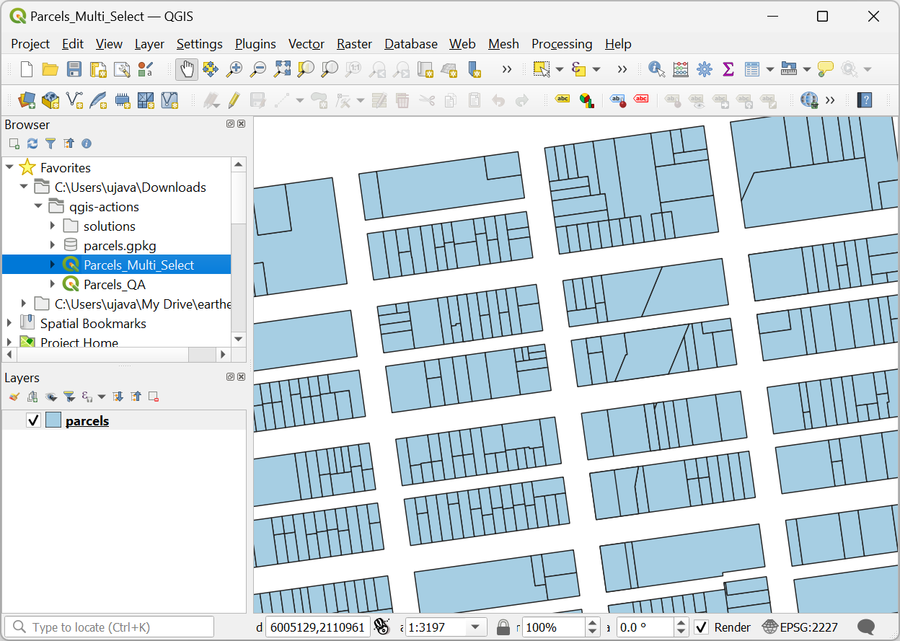
```

2. Select the `parcels` layer and open the *Attribute Table*. The **mapblklot** attribute contains a unique identifier for each parcels and the **block_num** attribute has a unique identifier for each city block. 

```{r echo=FALSE, fig.align='center', out.width='75%'}
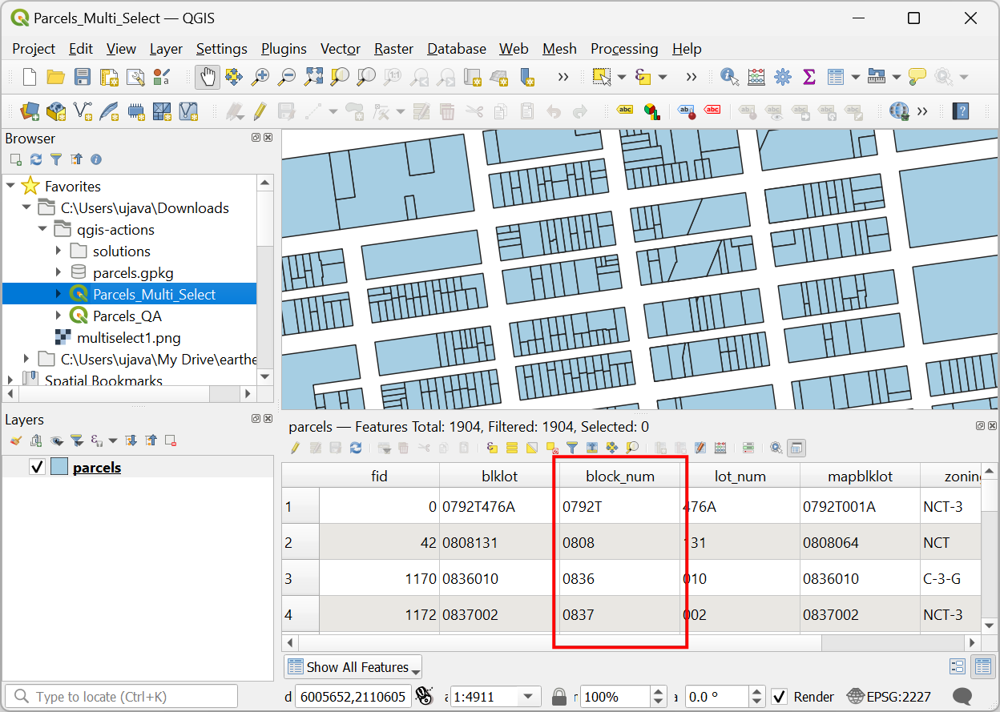
```

3. A city block is a group of parcels that is surrounded by streets. If we select a few parcels belonging to the same city block, you will see that they all have the same value for the **block_num** attribute. 

```{r echo=FALSE, fig.align='center', out.width='75%'}
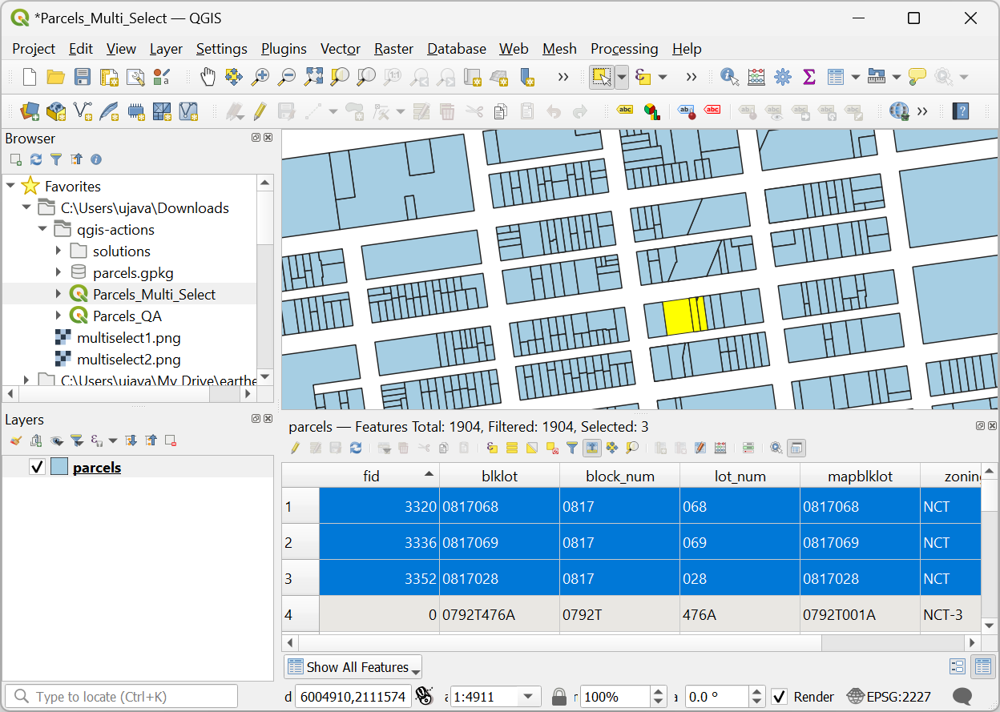
```

4. A common task while managing such data is to select all parcels belonging to the same block. Let's build an action that allows us to select all parcels from a block with a single click. Right-click the `parcels` layer and select *Properties*.

```{r echo=FALSE, fig.align='center', out.width='75%'}
knitr::include_graphics('images/qgis_actions/multiselect4.png')
```

5. Switch to the *Actions* tab and click the *Add a new action* (*+*) button.

```{r echo=FALSE, fig.align='center', out.width='75%'}
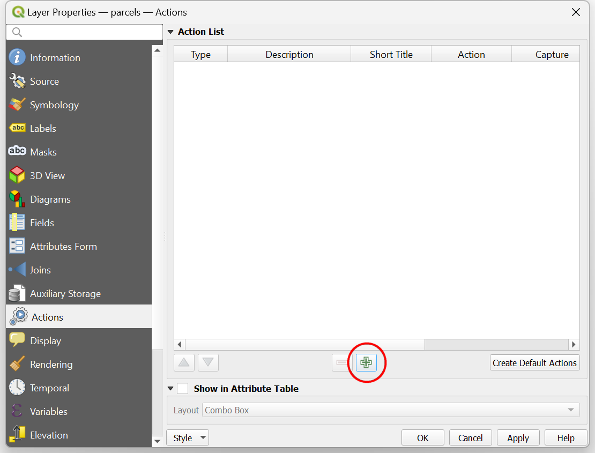
```

6. Select **Python** as the *Type*. Enter **Select all Parcels from the Block** as the *Description*. Leave the *Action Scopes* to the default selected values of **Feature** and **Canvas**. Under the *Action Text* enter the following Python code and click *OK*. Click *OK* again to get back to the main QGIS Canvas.

```{python eval=FALSE}
layer_id = '[%@layer_id%]'
layer = QgsProject.instance().mapLayer(layer_id)

field_name = 'block_num'
field_value = '[%block_num%]'
expression = f'"{field_name}" = \'{field_value}\''
print(expression)
```

```{r echo=FALSE, fig.align='center', out.width='60%'}
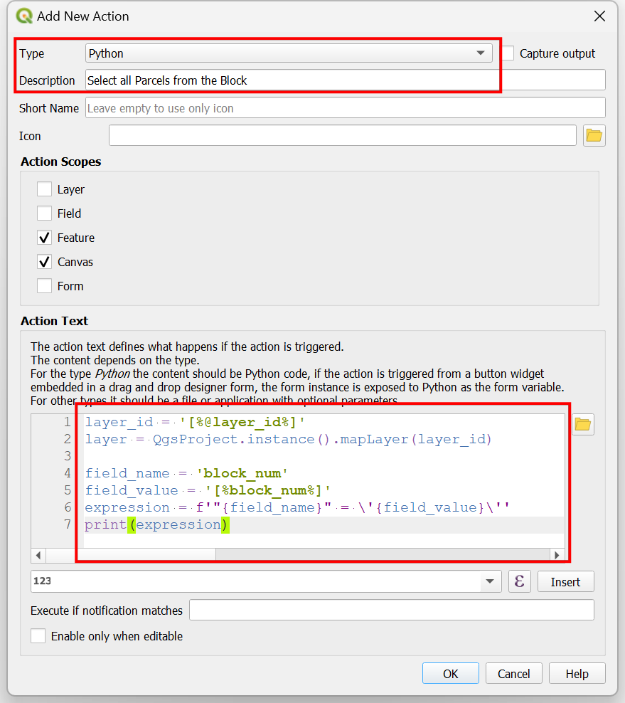
```

7. This action is going to print an expression that can be used to select all parcels from the same block as the parcel where you clicked. Let's test this. Open the *Python Console* from **Plugins &rarr; Python Console**. Locate the *Actions* button on the *Attributes Toolbar*. Click the dropdown menu next to it and select *Select all Parcels from the Block*. Click on any parcel. You will see an expression printed in the console.

```{r echo=FALSE, fig.align='center', out.width='75%'}
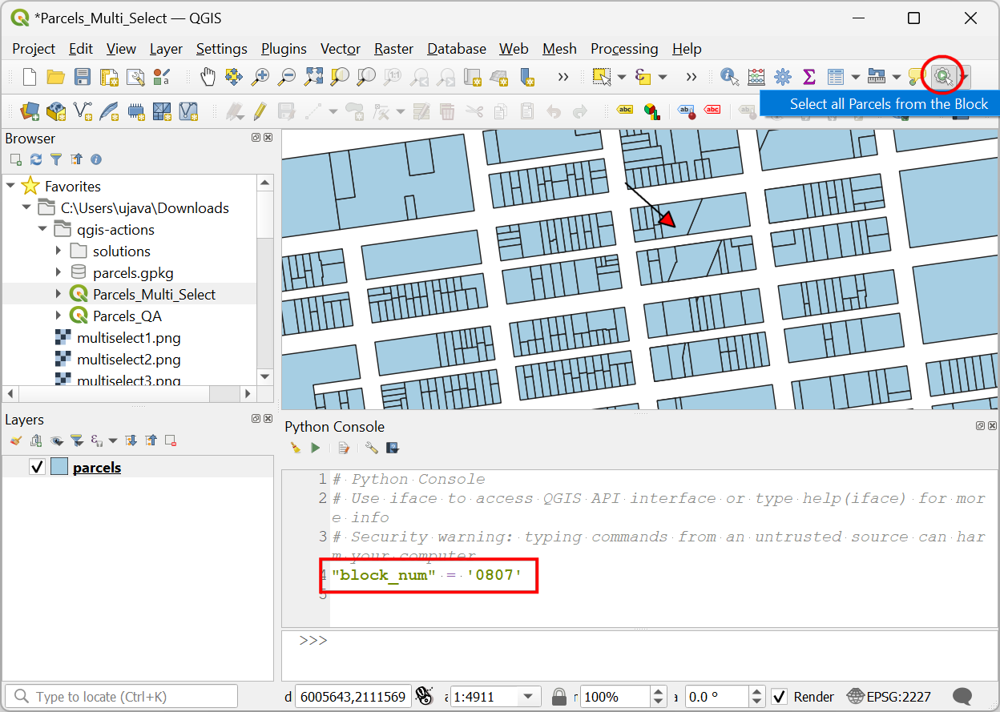
```

8. The expression should work to select all parcels having the same block number. Let's update the action with the code as follows.

```{python eval=FALSE}
layer_id = '[%@layer_id%]'
layer = QgsProject.instance().mapLayer(layer_id)

field_name = 'block_num'
field_value = '[%block_num%]'
expression = f'"{field_name}" = \'{field_value}\''
layer.selectByExpression(expression)
```

```{r echo=FALSE, fig.align='center', out.width='60%'}
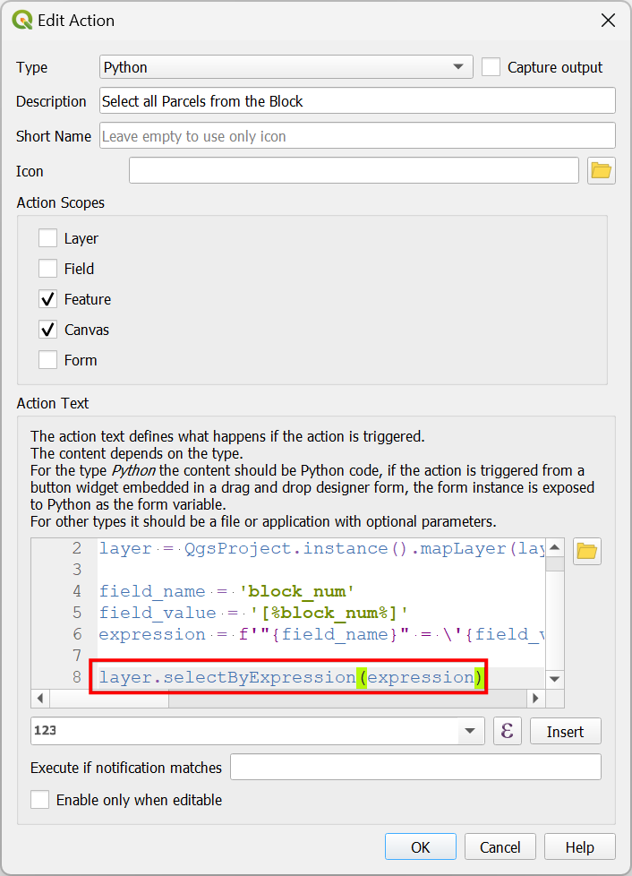
```

9. Trigger the action again and click on any parcels. This time you will see that all the parcels from the block will be selected.

```{r echo=FALSE, fig.align='center', out.width='75%'}
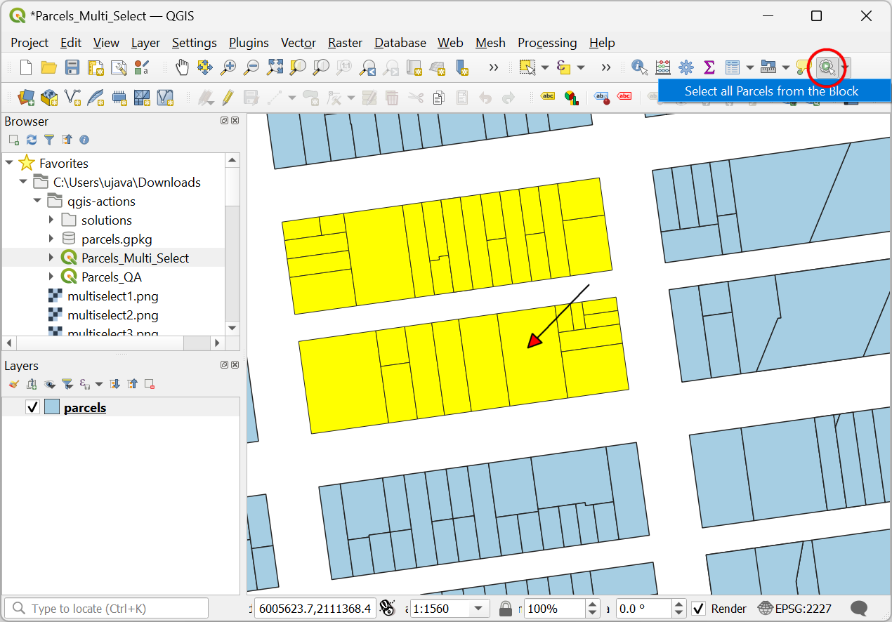
```

10. If you use the action again, the current selection will go away and a new selection will be made. We can change this behavior by supplying an addition *behavior* option to the [`QgsVectorLayer.selectByExpression()`](https://qgis.org/pyqgis/master/core/QgsVectorLayer.html#qgis.core.QgsVectorLayer.selectByExpression) method. Update the code as below.

```{python eval=FALSE}
layer_id = '[%@layer_id%]'
layer = QgsProject.instance().mapLayer(layer_id)

field_name = 'block_num'
field_value = '[%block_num%]'
expression = f'"{field_name}" = \'{field_value}\''
layer.selectByExpression(expression, QgsVectorLayer.AddToSelection)
```

```{r echo=FALSE, fig.align='center', out.width='60%'}
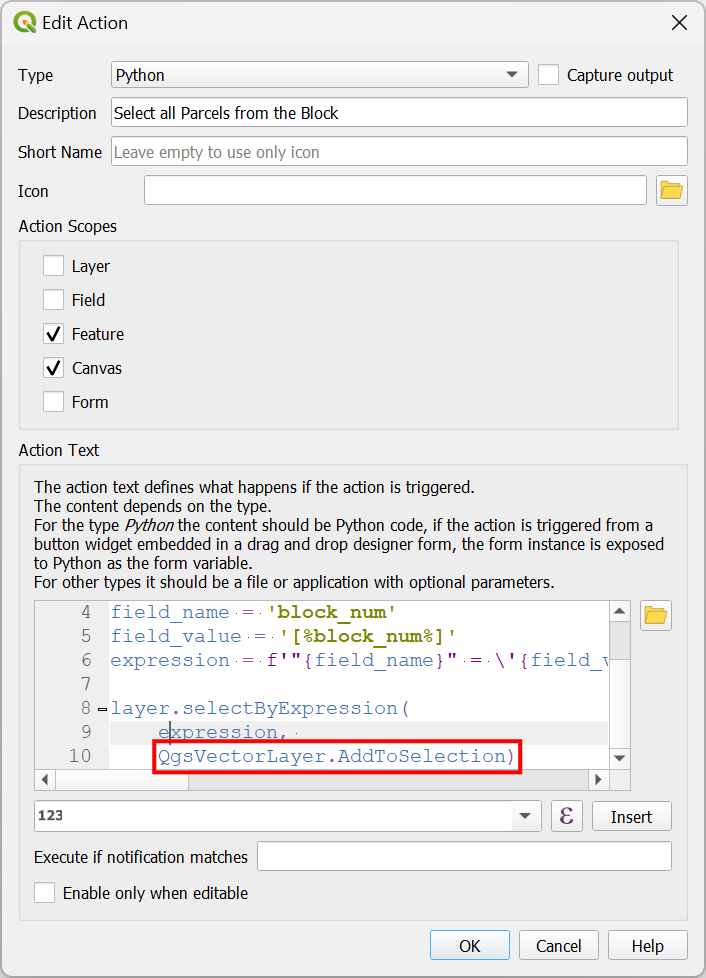
```

11. Now as you click on multiple parcels, the new block selection will be added to the previous selections.


```{r echo=FALSE, fig.align='center', out.width='75%'}
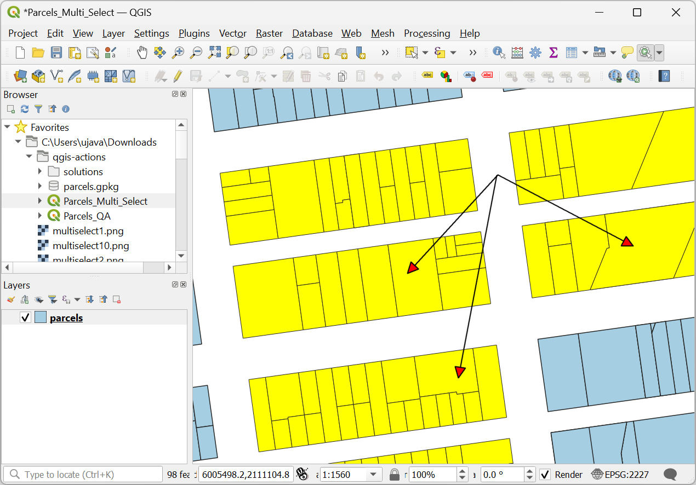
```

We have now finished this section and you are ready to do the exercise. Your can load the `Parcels_Multi_Select_Checkpoint1.qgz` file in the `solutions` folder to catch up to this point.

## Exercise 2

Add another action to the `parcels` layer called *Extract Selected Features*. This action should create a new memory layer from the selected parcels. The following code block shows how to get a list of selected feature ids that can be used in your solution.

```{python eval=FALSE}
from qgis.utils import iface

layer_id = '[%@layer_id%]'

layer = QgsProject.instance().mapLayer(layer_id)
selected_ids = [feature.id() for feature in layer.selectedFeatures()]
```

**Hint**: Use [`QgsFeatureSource.materialize()`](https://qgis.org/pyqgis/3.0/core/Feature/QgsFeatureSource.html#qgis.core.QgsFeatureSource.materialize) method we learnt in the previous section.


```{r echo=FALSE, fig.align='center', out.width='75%'}
knitr::include_graphics('images/qgis_actions/multiselect_exercise.png')
```

## 2.2 Update Field Values

1. Open the `Parcels_QA.qgz` project from your data package. 

```{r echo=FALSE, fig.align='center', out.width='75%'}
knitr::include_graphics('images/qgis_actions/qa2.png')
```

2. This project contains the same `parcels` layer that has been styled and labeled using the values from the **checked** column. This column contains the value of either **Y** or **N**. Let's say we are tasked with checking each feature and then updating the value of this field to **Y** once it has been checked. Let's setup an action to automate this QA process.

```{r echo=FALSE, fig.align='center', out.width='75%'}
knitr::include_graphics('images/qgis_actions/qa2.png')
```

3. Right-click the `parcels` layer and select *Properties*.

```{r echo=FALSE, fig.align='center', out.width='75%'}
knitr::include_graphics('images/qgis_actions/qa3.png')
```

4. Switch to the *Actions* tab and click the *Add a new action* (*+*) button. Select **Python** as the *Type*. Enter **Mark QA Done** as the *Description*. Leave the *Action Scopes* to the default selected values of **Feature** and **Canvas**. Under the *Action Text* enter the following Python code and click *OK*. This code uses [`QgsVectorLayer.changeAttributeValue()`](https://qgis.org/pyqgis/master/core/QgsVectorLayer.html#qgis.core.QgsVectorLayer.changeAttributeValue) method to update the field **checked**'s value to **Y**. Note that we are using the `with edit(layer)` statement to wrap our editing code in a more semantic code block. This will ensure that the changes committed at the end or rolled back appropriately if there are any errors.

```{python eval=FALSE}
from qgis.utils import iface

feature_id = [%$id%]
layer_id = '[%@layer_id%]'
field_name = 'checked'

layer = QgsProject().instance().mapLayer(layer_id)
field = layer.fields().lookupField(field_name)

with edit(layer):
    layer.changeAttributeValue(feature_id, field, 'Y')
    iface.messageBar().pushInfo('Success', 'Field Value Updated')
```

```{r echo=FALSE, fig.align='center', out.width='60%'}
knitr::include_graphics('images/qgis_actions/qa4.png')
```

5. Click *OK* again to get back to the main QGIS Canvas. Select the action and click on any parcel with the **N** label. You will see that the value is updated and the parcel turns green instantly.

```{r echo=FALSE, fig.align='center', out.width='75%'}
knitr::include_graphics('images/qgis_actions/qa5.png')
```

6. Actions can also be triggered from other interfaces. Let's add this action to the attribute table. Right-click the `parcels` layer and select *Properties*. Switch to the *Actions* tab. At the bottom, check the *Show in Attribute Table* box. Click *OK*.

```{r echo=FALSE, fig.align='center', out.width='60%'}
knitr::include_graphics('images/qgis_actions/qa6.png')
```

7. Click *OK* again to get back to the main QGIS Canvas. Open the *Attribute Table* for the `parcels` layer. You will notice that there is a new *Actions* column with the *Mark QA Done* action added to the table. You can click on the button to trigger the action for each feature.

```{r echo=FALSE, fig.align='center', out.width='75%'}
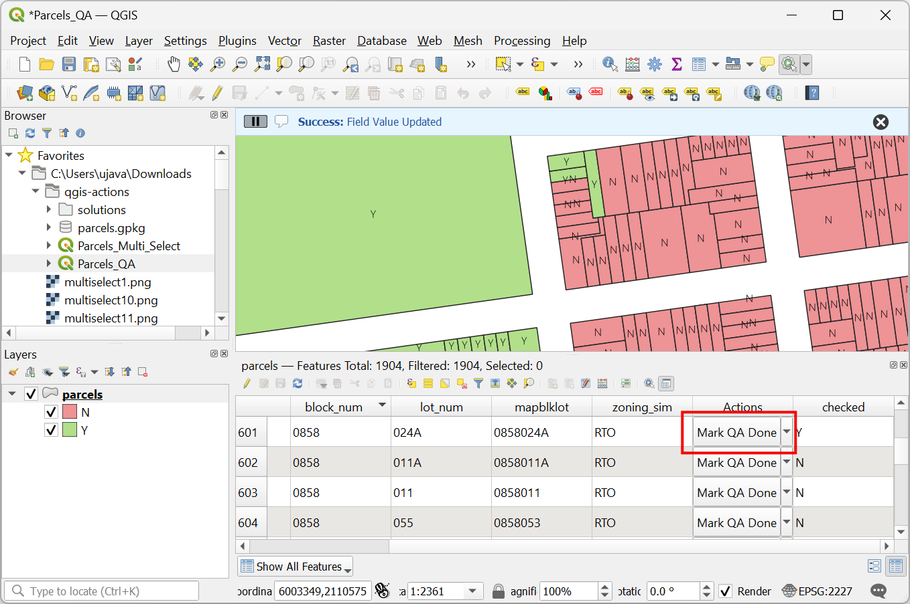
```

We have now finished this section and you are ready to do the exercise. Your can load the `Parcels_QA_Checkpoint1.qgz` file in the `solutions` folder to catch up to this point.

## Exercise 3

Add another action to the `parcels` layer called *Delete Parcel*. This action should delete the feature when selected. Use the following code block to start working on your solution.

```{python eval=FALSE}
feature_id = [%$id%]
layer_id = '[%@layer_id%]'

layer = QgsProject.instance().mapLayer(layer_id)
```

*Hint:* You can use [`QgsVectorLayer.deleteFeature()`](https://qgis.org/pyqgis/master/core/QgsVectorLayer.html#qgis.core.QgsVectorLayer.deleteFeature) method to delete a feature by its feature id.


```{r echo=FALSE, fig.align='center', out.width='75%'}
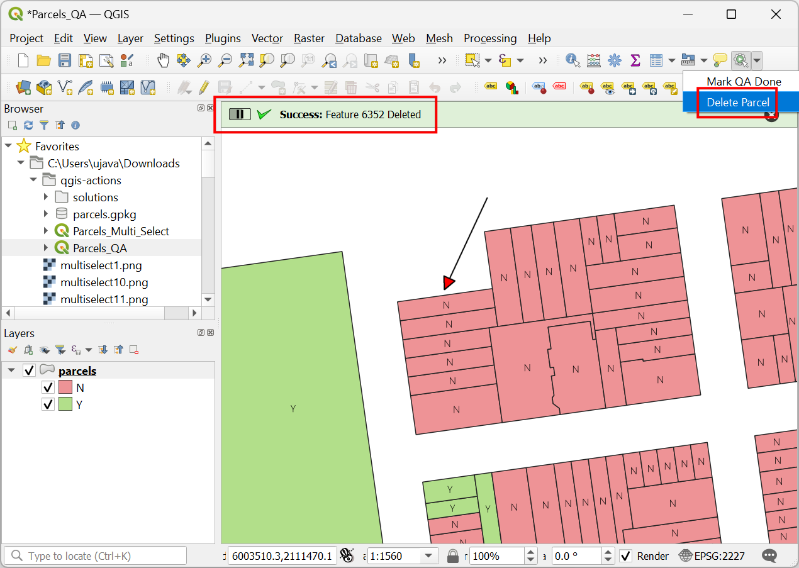
```

# 3. Manage Imagery Collections

Actions also provide a simple and intuitive way to manage large imagery collections using QGIS. In this section, we will learn how to create a *Tile Index* and setup actions to interactively load and remove raster layers of interest.

## 3.1 Load and Remove Raster Layers

1. The first step in our process is to create a tile index layer from a set of raster files in your data package. Open the QGIS Processing Toolbox from **Processing &rarr; Toolbox**. Search for the algorithm named **Tile index**. Double-click to open it.

```{r echo=FALSE, fig.align='center', out.width='75%'}
knitr::include_graphics('images/qgis_actions/tileindex1.png')
```

2. In the *Tile Index* dialog, click *...*.

```{r echo=FALSE, fig.align='center', out.width='75%'}
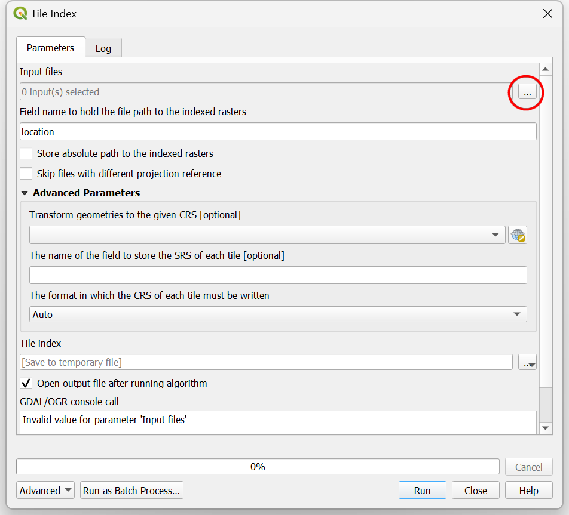
```

3. In the *Input files* dialog, click *Add Directory...* button and browse to the **qgis_actions &rarr; imagery** folder. Click *open*. Once the files are listed, click *OK*.

```{r echo=FALSE, fig.align='center', out.width='75%'}
knitr::include_graphics('images/qgis_actions/tileindex3.png')
```

4. Back in the *Tile Index* dialog, check the *Store absolute path to the indexed rasters* box. Leave all other parameters to their default value and click *Run*.

```{r echo=FALSE, fig.align='center', out.width='75%'}
knitr::include_graphics('images/qgis_actions/tileindex4.png')
```

5. A new layer named *Tile Index* will be loaded in the *Layers* panel. This layer has bounding box polygons for each of the image tiles in the folder along with its path. Open the *Attribute Table*. You will see that the path to the raster tiles is stored in the *location* attribute.

```{r echo=FALSE, fig.align='center', out.width='75%'}
knitr::include_graphics('images/qgis_actions/tileindex5.png')
```

6. Right-click the `Tile Index` layer and select *Properties*.

```{r echo=FALSE, fig.align='center', out.width='75%'}
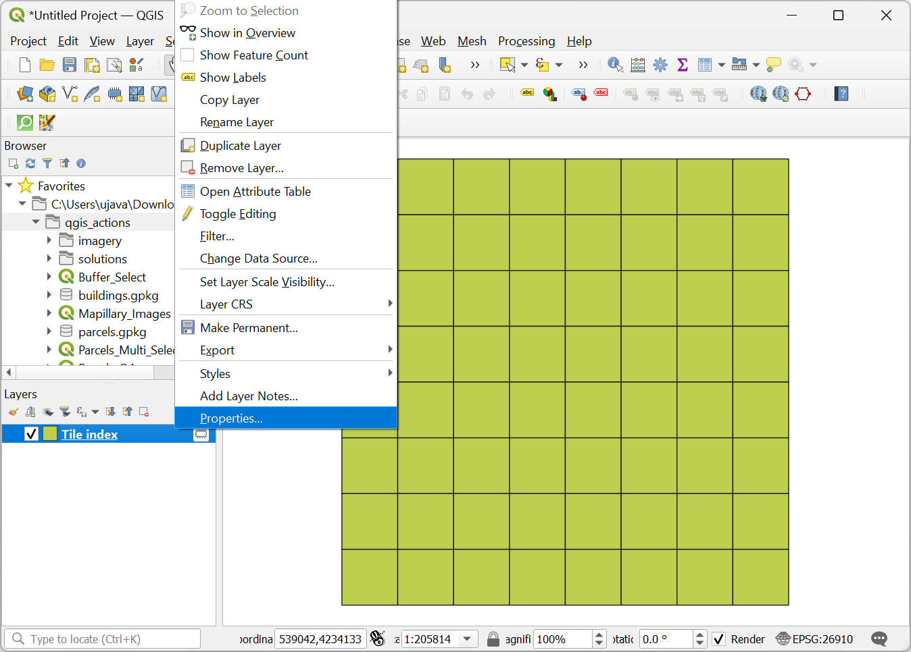
```

7. Switch to the *Actions* tab and click the *Add a new action* (*+*) button. Select **Python** as the *Type*. Enter **Load Selected Tile** as the *Description*. Leave the *Action Scopes* to the default selected values of **Feature** and **Canvas**. Under the *Action Text* enter the following Python code and click *OK*. 

```{python eval=FALSE}
import os
from qgis.utils import iface

path = r'[%location%]'
iface.addRasterLayer(path)

file_name = os.path.basename(path)
iface.messageBar().pushSuccess(
  'Success', f'Raster tile {file_name} loaded')

layer_id = '[%@layer_id%]'
layer = QgsProject.instance().mapLayer(layer_id)
iface.setActiveLayer(layer)
```

```{r echo=FALSE, fig.align='center', out.width='60%'}
knitr::include_graphics('images/qgis_actions/tileindex7.png')
```

8. Click *OK* again to get back to the main QGIS Canvas. Select the action *Load Selected Tile* and click on any polygon to load the raster layer in QGIS. This action allows you to selectively load only the required tiles.

```{r echo=FALSE, fig.align='center', out.width='75%'}
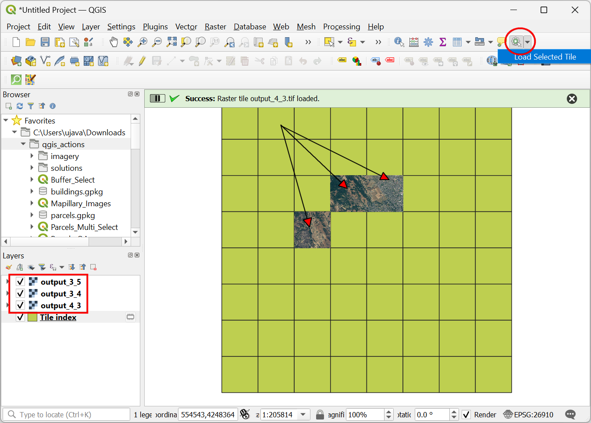
```

9. Let's setup another action to remove the unwanted tile layers. Right-click the `Tile Index` layer and select *Properties*. Switch to the *Actions* tab and click the *Add a new action* (*+*) button. Select **Python** as the *Type*. Enter **Remove Selected Tile** as the *Description*. Leave the *Action Scopes* to the default selected values of **Feature** and **Canvas**. Under the *Action Text* enter the following Python code. Here we use the [`QgsProject.removeMapLayer()`](https://qgis.org/pyqgis/3.0/core/Project/QgsProject.html#qgis.core.QgsProject.removeMapLayer) method to remove the layer. We must also call `iface.mapCanvas().refresh()` to see the results. Click *OK*. 

```{python eval=FALSE}
import os
from qgis.utils import iface

path = r'[%location%]'

file_name = os.path.basename(path)
layer_name = os.path.splitext(file_name)[0]
layer_list = QgsProject.instance().mapLayersByName(layer_name)

if layer_list:
  QgsProject.instance().removeMapLayer(layer_list[0])
  iface.mapCanvas().refresh()
  iface.messageBar().pushSuccess(
    'Success', f'Raster tile {file_name} removed.')
```

```{r echo=FALSE, fig.align='center', out.width='60%'}
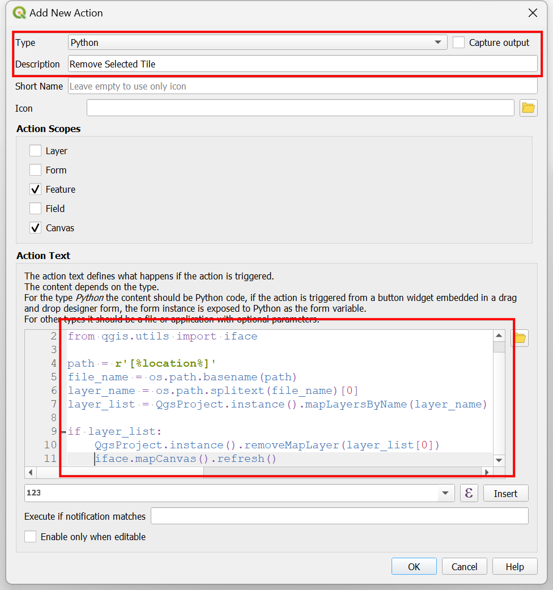
```

10. Click *OK* again to get back to the main QGIS Canvas. Select the action *Remove Selected Tile* and click on the canvas over any tile that has been loaded in QGIS. That tile will be removed.

```{r echo=FALSE, fig.align='center', out.width='75%'}
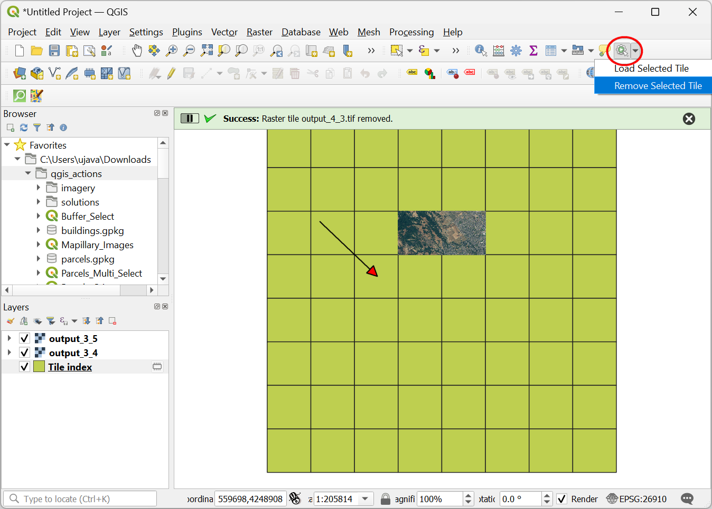
```

We have now finished this section and you are ready to do the exercise. Your can load the `Tile_Index_Checkpoint1.qgz` file in the `solutions` folder to catch up to this point.

## Exercise 4

The action *Load Selected Tile* allows you to load any tile multiple times. This is not desirable since it will create duplicate layers. Update the action to load a tile only if it is not previously loaded in QGIS. It should display an error message when you try to load a tile that is already loaded.

Hint: Use `iface.messageBar().pushCritical()` to display an error message.

```{r echo=FALSE, fig.align='center', out.width='75%'}
knitr::include_graphics('images/qgis_actions/tileindex_exercise.png')
```


# Supplement

## Select Features in a Buffer Zone

Another useful application of action is to select features from a layer within a buffer zone. Open the `Buffer_Select.qgz` project from your data package. This project contains a `roads` and a `buildings` layer. The `roads` layer has an action defined called **Select Buildings within Buffer** that selects all buildings that are within 20 meters of the selected road segment.

> Note: This example uses `line_geometry.boundingBox()` in the `getFeatures()` method which makes use of the spatial index (if it exists) to speed up finding the candidate features.

```{python eval=FALSE}
layer_id = '[%@layer_id%]'
fid = [% $id %]
distance = 20

line_layer = QgsProject.instance().mapLayer(layer_id)
line_feature = line_layer.getFeature(fid)
line_geometry = line_feature.geometry().buffer(distance, 5)

polygon_layer_name = 'buildings'
polygon_layer = QgsProject.instance().mapLayersByName(polygon_layer_name)[0]
nearby_features = [
  p.id() 
  for p in polygon_layer.getFeatures(line_geometry.boundingBox()) 
  if p.geometry().intersects(line_geometry)
]
if nearby_features:
  polygon_layer.selectByIds(nearby_features)
```

Select the action and click on any road feature. All the buildings within the buffer zone will be selected.

```{r echo=FALSE, fig.align='center', out.width='75%'}
knitr::include_graphics('images/qgis_actions/buffer_select1.png')
```

## Reversing Line Direction using Processing Algorithm

The QGIS Processing Toolbox contains many useful algorithms. You can call any algorithms using Python from Actions. This example shows how to setup an action to run a processing algorithm a line feature to reverse direction.

We will use the **Vector Geometry &rarr; Reverse line direction** algorithm. By default, all Processing algorithms create new layer. If we want to edit the layer, we must enable the [Edit Features In-Place mode](https://docs.qgis.org/testing/en/docs/user_manual/working_with_vector/editing_geometry_attributes.html#the-processing-in-place-layer-modifier). The same mode can be invoked from PyQGIS via `execute_in_place()` method.

> Note: The *Advanced Digitizing Toolbar* already has a tool that allows you reverse the line direction for the selected feature. This example is an implementation of a similar functionality using an Action.

Open the `Network_Linedirection.qgz` project. It contains a line layer named `street_centerlines` which has been styled to show an arrow in the direction of the line. We have defined an action **Reverse Line Direction** on this layer with the following code.

```{python eval=FALSE}
from processing.gui.AlgorithmExecutor import execute_in_place

layer_id = '[%@layer_id%]'
layer = QgsProject.instance().mapLayer(layer_id)
fid = [% $id %]
layer.selectByIds([fid])

registry = QgsApplication.instance().processingRegistry()
algorithm = registry.algorithmById('native:reverselinedirection')

parameters = {
    'INPUT': layer,
    'selectedFeaturesOnly': True,
    'featureLimit': -1,
   ' geometryCheck': QgsFeatureRequest.GeometryAbortOnInvalid
}
with edit(layer):
    execute_in_place(algorithm, parameters)
    
layer.removeSelection()
```

Select the action and click on any line segment. You will see the line direction will get reversed. Our Python action saves many extra clicks compared to executing this via the Toolbox.

```{r echo=FALSE, fig.align='center', out.width='75%'}
knitr::include_graphics('images/qgis_actions/reverse_line.png')
```

## Creating Isochrones using ORS Tools plugin

Similar to native algorithms, we can also call any third-party algorithms added from QGIS Plugins. This example shows how to use the **ORS Tools &rarr; Isochrones &rarr; Isochrones from point** algorithm to generate a walking-directions isochrone from a point layer. 

Before using this example, you must install the *ORS Tools* plugin and configure it. Follow the steps below for configuration after you have installed the plugin.

* Visit [OpenRouteService Sign-Up](https://openrouteservice.org/dev/#/signup) page and create an account. Once your account is activated, visit your [Dashboard](https://openrouteservice.org/dev/#/home) and request a token. Select Standard as the Token type and enter **QGIS** as the Token name. Click *CREATE TOKEN*.
* In QGIS, go to **Web &rarr; ORS Tools &rarr; Provider Settings** and enter the API key created in the previous step.

Now you are ready to try out the action. Open the `Stations_Isochrones.qgz` project from your data package. This project has a `san_francisco_stations` layer with a few actions such as **Calculate Isochrone (1km)** defined with code similar to below.

```{python eval=FALSE}
import processing
from qgis.utils import iface

x_coord = [%@click_x%]
y_coord = [%@click_y%]
layer_id = '[%@layer_id%]'
# Distance in meters
distance = 1000

# Check if ORS Tools in available
providers = [x.name() for x in QgsApplication.processingRegistry().providers()]

if 'ORS Tools' not in providers:
    iface.messageBar().pushCritical('Error', 'This action requires the ORS Tools plugin. Please install and configure the plugin.')
else:
    input_point = f'{x_coord},{y_coord}'
    result = processing.run(
        'ORS Tools:isochrones_from_point',{
        'INPUT_PROVIDER':0,'INPUT_PROFILE':6,'INPUT_POINT': input_point,
        'INPUT_METRIC':1,'INPUT_RANGES':f'{distance}', 'INPUT_AVOID_FEATURES':[],
        'INPUT_AVOID_BORDERS':None,'INPUT_AVOID_COUNTRIES':'',
        'INPUT_SMOOTHING': None, 'LOCATION_TYPE': 0,
        'INPUT_AVOID_POLYGONS':None,'OUTPUT':'TEMPORARY_OUTPUT'
        }
    )
    new_layer = result['OUTPUT']
    new_layer.setName(f'Isochrone Polygon ({distance}m)')
    QgsProject.instance().addMapLayer(new_layer)

    layer = QgsProject.instance().mapLayer(layer_id)
    iface.setActiveLayer(layer)
```

Select the layer and use the action **Calculate Isochrone (1km)** and click on any point. The OpenRouteService API will generate a isochrone using the OpenStreetMap(OSM) network and you will see a polygon of all areas reachable by walk within 1 km of the station. Similarly, you can try out other actions for different distances.

```{r echo=FALSE, fig.align='center', out.width='75%'}
knitr::include_graphics('images/qgis_actions/isochrone.png')
```


## View Panorama from Mapillary

QGIS actions can also be used to query an external API and display the results. The example below shows how to use the [Mapillary API](https://www.mapillary.com/developer/api-documentation) to fetch street-level imagery and display them in QGIS. 

To try the action, open the `Mapillary_Images.qgz` project from the data package. The `pharmacies` layer has an action defined called **Show Panorama from Mapillary** with the code below. Before you can use this action, you will need a *Client Token* from Mapillary. [Sign-up for a Mapillary Developer Account](https://www.mapillary.com/developer) and register a new application. Click on *View* under *Client Token* and obtain your access token.

```{r echo=FALSE, fig.align='center', out.width='75%'}
knitr::include_graphics('images/qgis_actions/mapillary1.png')
```

Open the code for the action and replace `YOUR_ACCESS_TOKEN` with your access token.

```{python eval=FALSE}
import requests
from qgis.PyQt.QtCore import QUrl
from qgis.PyQt.QtWebKitWidgets import QWebView
from qgis.utils import iface

# Sign up at https://www.mapillary.com/developer
# Replace YOUR_ACCESS_TOKEN with your own token below
parameters = {
    'access_token': 'YOUR_ACCESS_TOKEN',
    'bbox': '{},{},{},{}'.format([%$x%]-0.001,[%$y%]-0.001, [%$x%]+0.001, [%$y%]+0.001),
    'fields': 'thumb_1024_url',
	'limit': 1
}

response = requests.get(
        'https://graph.mapillary.com/images', params=parameters)
if response.status_code == 200:
    data_json = response.json()
    if data_json['data']:
        url = data_json['data'][0]['thumb_1024_url']
        myWV = QWebView(None)
        myWV.load(QUrl(url))
        myWV.show()
    else:
        qgis.utils.iface.messageBar().pushMessage('No images found')
```

Once the token is updated, you can select the action and click on any pharmacy location. The action will send a request to mapillary API to fetch the nearest imagery. It will be then displayed in a new window in QGIS.

```{r echo=FALSE, fig.align='center', out.width='75%'}
knitr::include_graphics('images/qgis_actions/mapillary2.png')
```


# Data Credits

* Admin0 boundaries: Made with Natural Earth. Free vector and raster map data @ naturalearthdata.com.
* Parcels and Neighborhood boundaries downloaded from [DataSF Open Data Portal](https://datasf.org/opendata/)
* NAIP 2016 Aerial Imagery for California: The National Agriculture Imagery Program (NAIP). USDA-FSA-APFO Aerial Photography Field Office. Downloaded from [NRCS](https://nrcs.app.box.com/v/naip/folder/18144379349)
* OpenStreetMap (osm) data layers: Data/Maps Copyright 2023 Geofabrik GmbH and OpenStreetMap Contributors.


# License

This workshop material is licensed under a [Creative Commons Attribution 4.0 International (CC BY 4.0)](https://creativecommons.org/licenses/by/4.0/). You are free to re-use and adapt the material but are required to give appropriate credit to the original author as below:

*QGIS Automation using Actions* by Ujaval Gandhi [www.spatialthoughts.com](https://spatialthoughts.com)

***