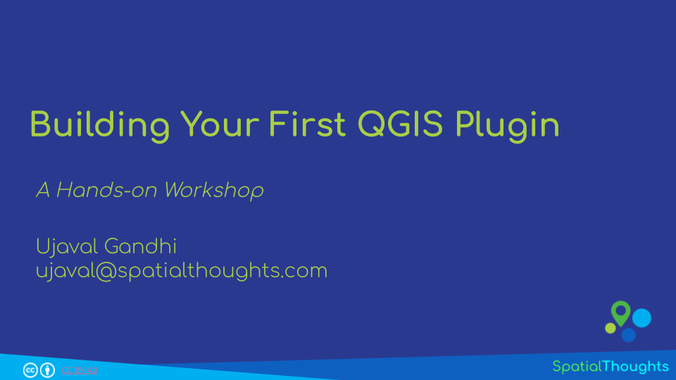
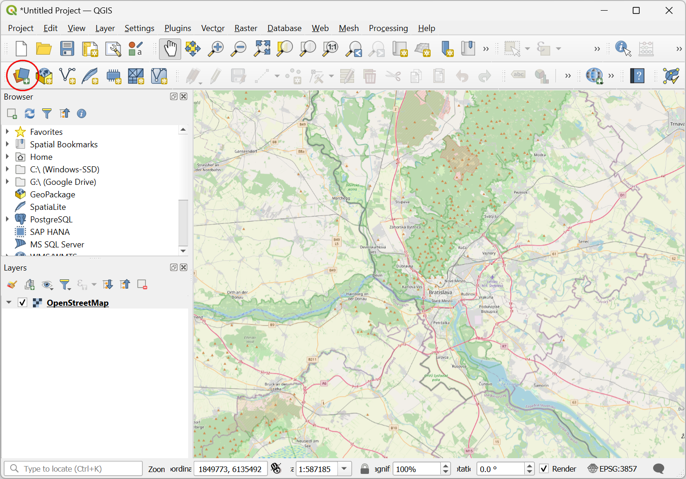
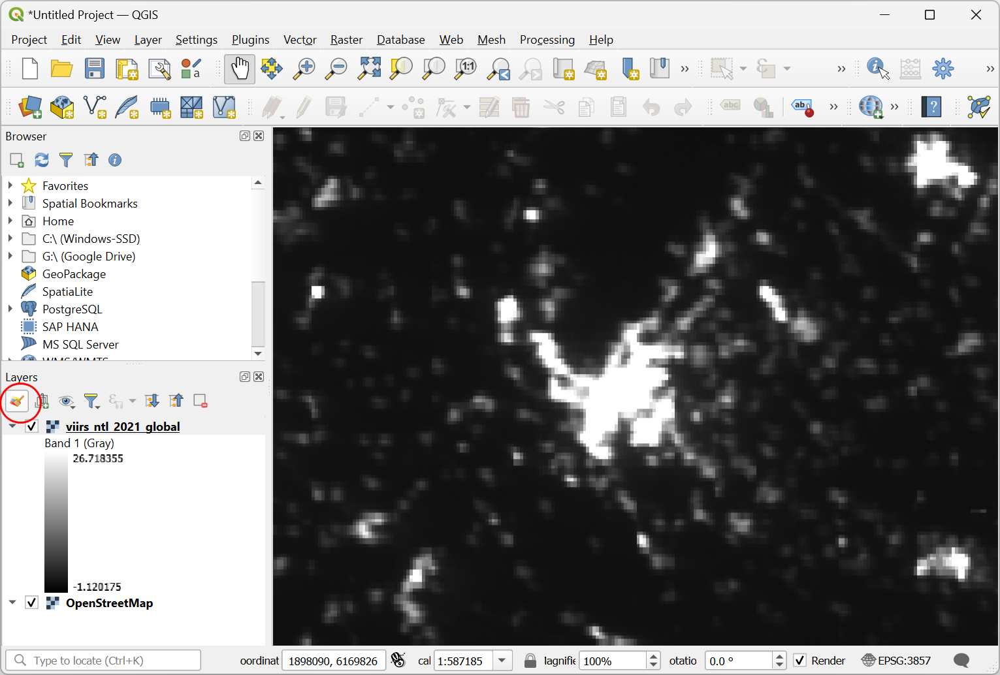
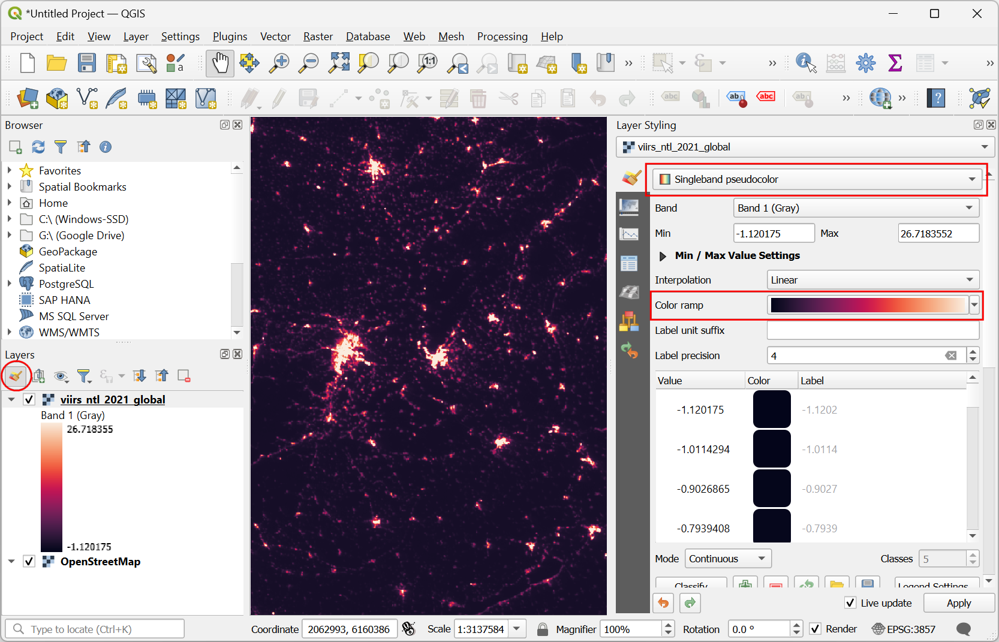
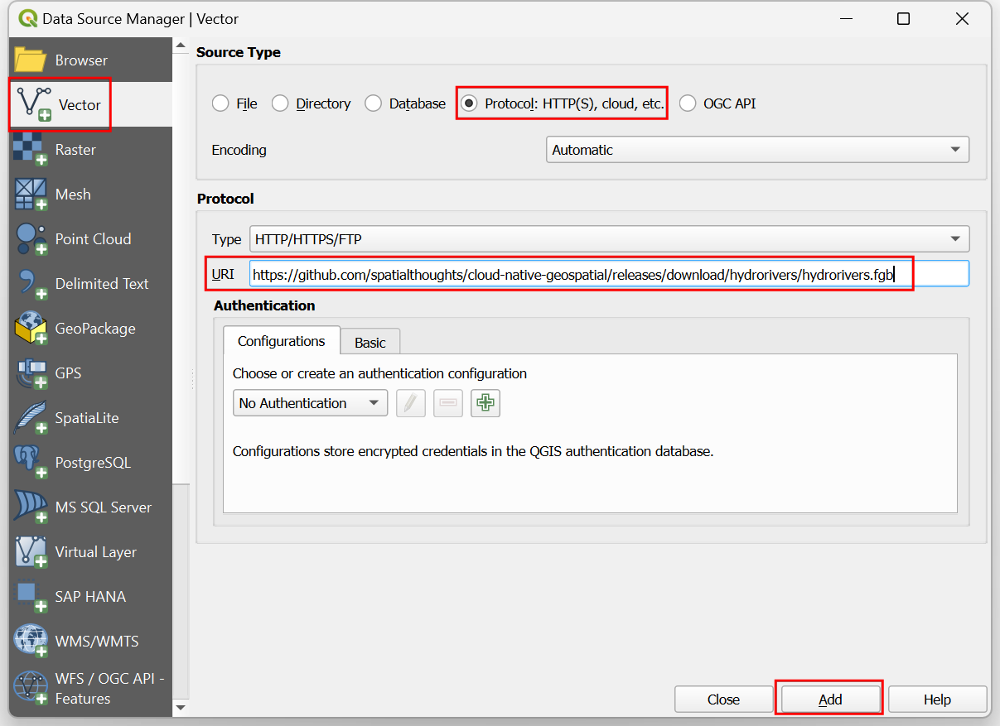
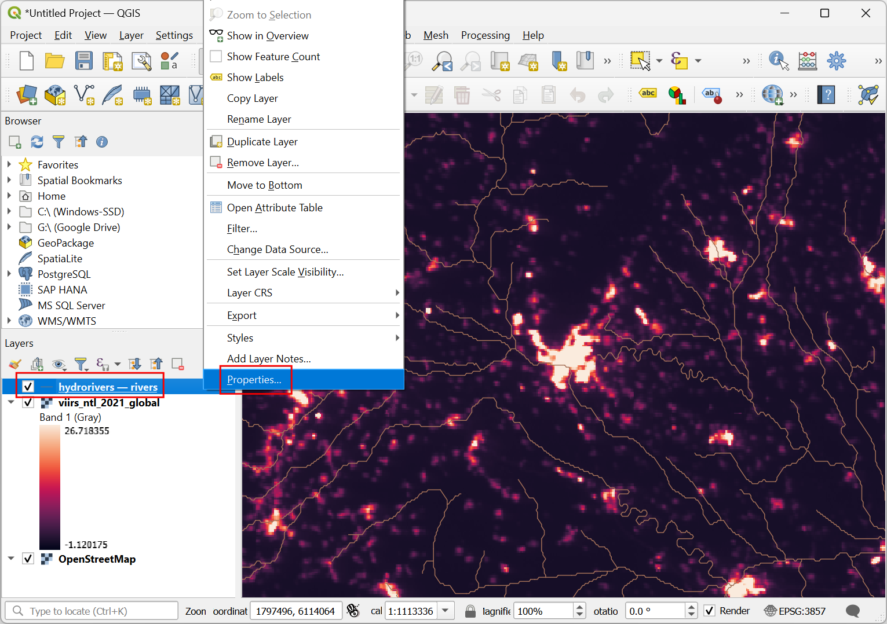
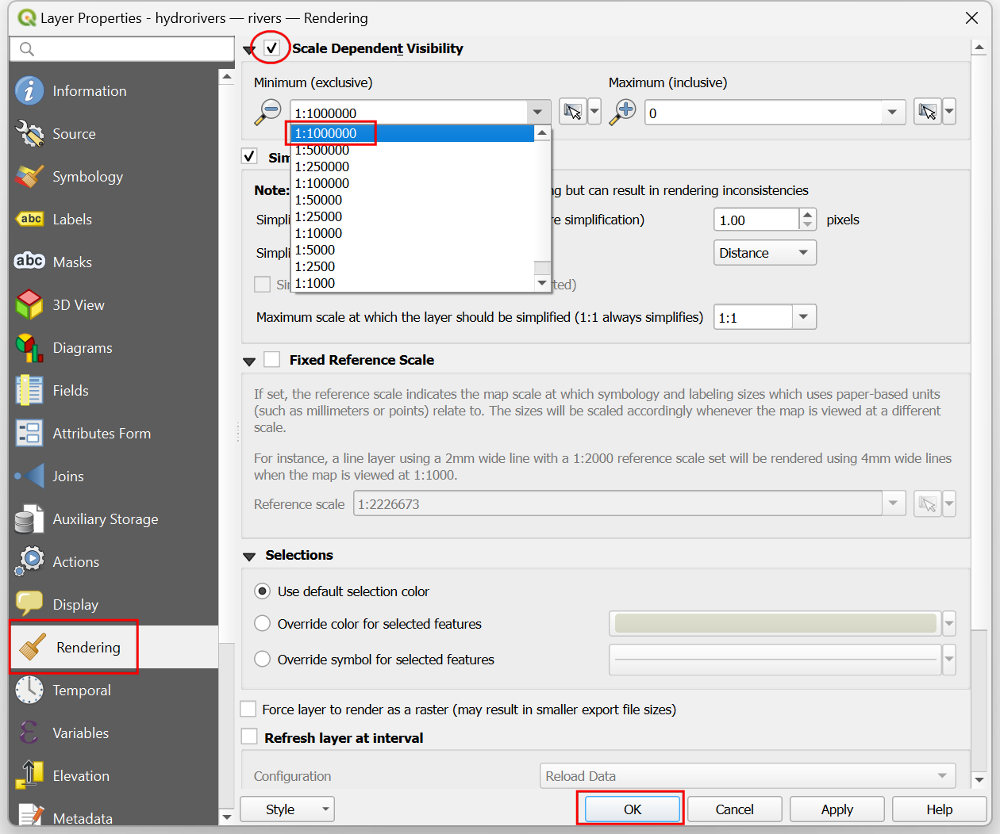
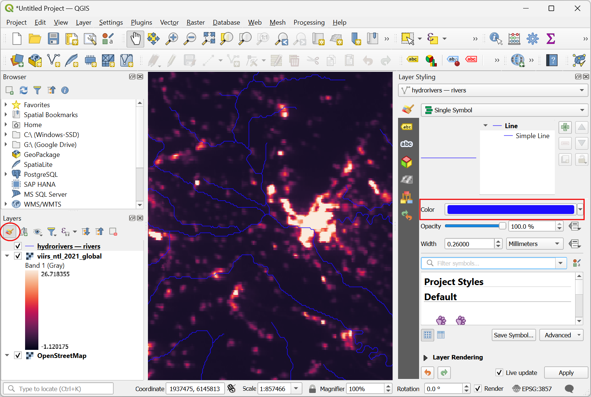
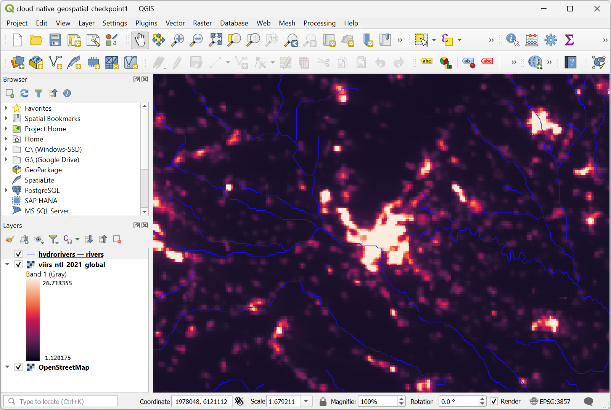

\newpage

***

```{r echo=FALSE, fig.align='center', out.width='75%', out.width='250pt'}
knitr::include_graphics('images/spatial_thoughts_logo.png')
```

***

\newpage

# Introduction 

This workshop is designed to help you take your first steps in building QGIS plugins. We will understand the QGIS plugin architecture and see how you can package your code and distribute it as a plugin. 

[{width="400px"}](https://docs.google.com/presentation/d/1NKTXASOgu8GFTWKkQpPbGDVRwDcyzRSdVwCg0772dTI/edit?usp=sharing){target="_blank"}

[View the Presentation &#8599;](https://docs.google.com/presentation/d/1NKTXASOgu8GFTWKkQpPbGDVRwDcyzRSdVwCg0772dTI/edit?usp=sharing){target="_blank"}

# Installation and Setting up the Environment

## Install QGIS

This workshop requires QGIS LTR version 3.34. Please review [QGIS-LTR Installation Guide](install-qgis-ltr.html) for step-by-step instructions.

# 1. Cloud Native Geospatial Formats

## 1.1 Load a Cloud-Optimized GeoTIFF (COG)

1. Open QGIS. We'll first load a basemap. From the *Browser* panel, scroll down and locate **XYZ Tiles &rarr; OpenStreetMap** tile layer. Drag and drop it to the main canvas. 

```{r echo=FALSE, fig.align='center', out.width='75%'}
knitr::include_graphics('images/qgis_cloud_native_geospatial/cog1.png')
```

2. Once the `OpenStreetMap` layer is loaded, go to your region of interest. Now we will load a 8GB cloud-optimized geotiff file stored on Google Cloud Storage and stream the pixels over this region. Click the *Open Data Source Manager* button.


```{r echo=FALSE, fig.align='center', out.width='75%'}

```

3. Select the *Raster* tab. Select `Protocol: HTTP(S), cloud etc.` as the *Source Type*. Enter the following URL as the *URI*. Click *Add*.

```
https://storage.googleapis.com/spatialthoughts-public-data/ntl/viirs/viirs_ntl_2021_global.tif
```
 
```{r echo=FALSE, fig.align='center', out.width='75%'}
knitr::include_graphics('images/qgis_cloud_native_geospatial/cog3.png')
```

4. A new layer `viirs_ntl_2021_global` will be added to the *Layers* panel. This is a global layer showing nighttime lights intensity values recorded by the VIIRS instrument. Note that the file loaded instantly and as you zoom in further, higher resolution pixels are fetched dynamically from the file. While this file is located on a remote location, you can use it just as if it was a regular GeoTIFF file. Let's visualize the layer using a color-ramp. Click the *Open Layer Styling Panel* button on the *Layers* panel.

```{r echo=FALSE, fig.align='center', out.width='75%'}

```

5. In the *Layer Styling* panel, change the renderer to `Singleband pseudocolor`. Select a color ramp of your choice. The layer rendering will be updated.

```{r echo=FALSE, fig.align='center', out.width='75%'}

```

## 1.2 Load a FlatGeoBuf (FGB) Vector Layer

1. Next, we will learn how to load a cloud-hosted vector layer to QGIS. We will stream a 800MB line layer hosted on GitHub file storage and stream the features in the current canvas extent. Click the *Open Data Source Manager* button.

```{r echo=FALSE, fig.align='center', out.width='75%'}
knitr::include_graphics('images/qgis_cloud_native_geospatial/fgb1.png')
```

2. Select the *Vector* tab. Select `Protocol: HTTP(S), cloud etc.` as the *Source Type*. Enter the following URL as the *URI*. Click *Add*.

```
https://github.com/spatialthoughts/cloud-native-geospatial/releases/download/hydrorivers/hydrorivers.fgb
```

```{r echo=FALSE, fig.align='center', out.width='75%'}

```

3. A new layer `hydrorivers -- rivers` will be added to the *Layers* panel. This is a large line layer containing over 2.5 million features. QGIS will request and load only the features within the current canvas extent. FlatGeoBuf format does not contain simplified versions of features that can be loaded at lower zoom levels. So if you zoom out to a large region, all the features within that region will be requested. To prevent fetching unnecesarily large amounts of data - we can enable scale dependent visibility. Right-click the `hydrorivers -- rivers` layer and select *Properties*.

```{r echo=FALSE, fig.align='center', out.width='75%'}

```

4. Select the *Rendering* tab and enable the *Scale Dependent Visibility*. From the drop-down selector for *Minimum (exclusive)* scale, select `1:1000000`. Click *OK*.

```{r echo=FALSE, fig.align='center', out.width='75%'}

```

5. Now only when your canvas is zoomed in beyond the selected scale, the features will be requested and rendered. Next, we will apply some style to the vector layer. Click the *Open Layer Styling Panel* button on the *Layers* panel. Change the *Color* to any color of your choice. You can also adjust the *Width* of the lines if required.

```{r echo=FALSE, fig.align='center', out.width='75%'}

```

6. Zoom/Pan around the map and go to any region in the world. Data from both the cloud-hosted files will be requested and rendered in the chosen style.

```{r echo=FALSE, fig.align='center', out.width='75%'}

```

# 2. SpatioTemporal Asset Catalogs (STAC)

## 2.1 Load a STAC Asset

## 2.2 Application: Zonal Statistics

## 2.3 Explore STAC Catalogs

# 3. STAC API Browser Plugin

## 3.1 Query a STAC API

## 3.2 Analyze Landcover Change

## 3.3 Create a Sentinel-2 RGB Composite

# 4. Creating and Hosting Cloud Native Geospatial Data

## 4.1 Creating Cloud Native Geospatial Data

```
gdal_translate -of COG viirs_ntl_2021_global.tif viirs_ntl_2021_global_cog.tif
```

```
ogr2ogr -f FlatGeobuf hydrorivers.fgb hydrorivers.gpkg
```


## 4.2 Hosting Cloud Native Geospatial Data


# License

This workshop material is licensed under a [Creative Commons Attribution 4.0 International (CC BY 4.0)](https://creativecommons.org/licenses/by/4.0/). You are free to re-use and adapt the material but are required to give appropriate credit to the original author as below:

*Cloud Native Geospatial Workflows with QGIS* by Ujaval Gandhi [www.spatialthoughts.com](https://spatialthoughts.com)


&copy; 2024 Spatial Thoughts [www.spatialthoughts.com](https://spatialthoughts.com)