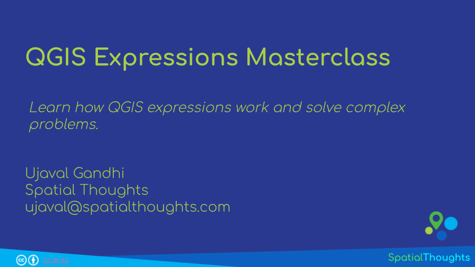
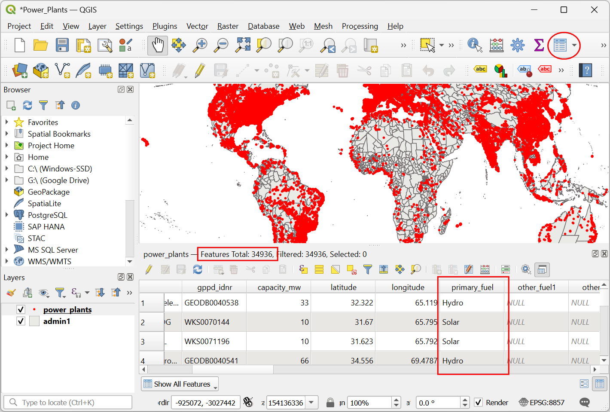
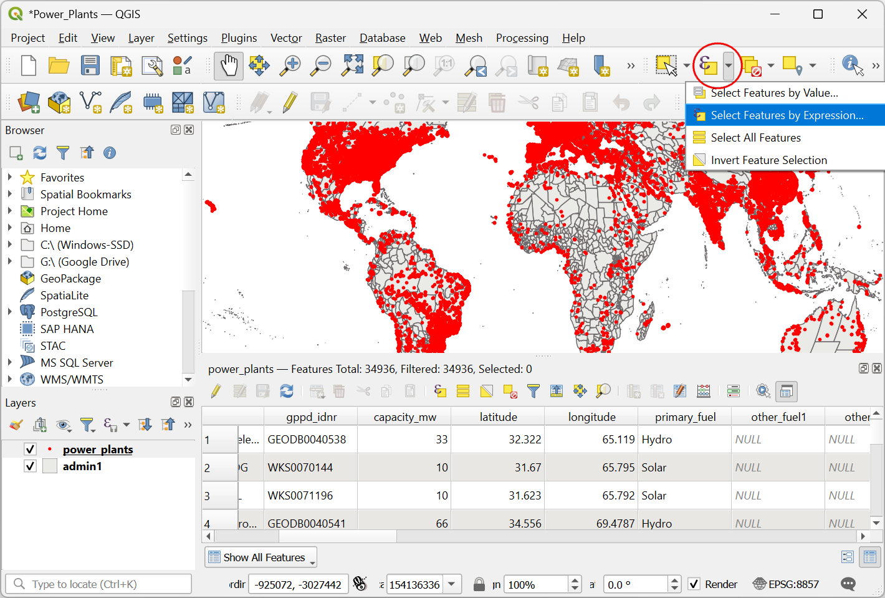
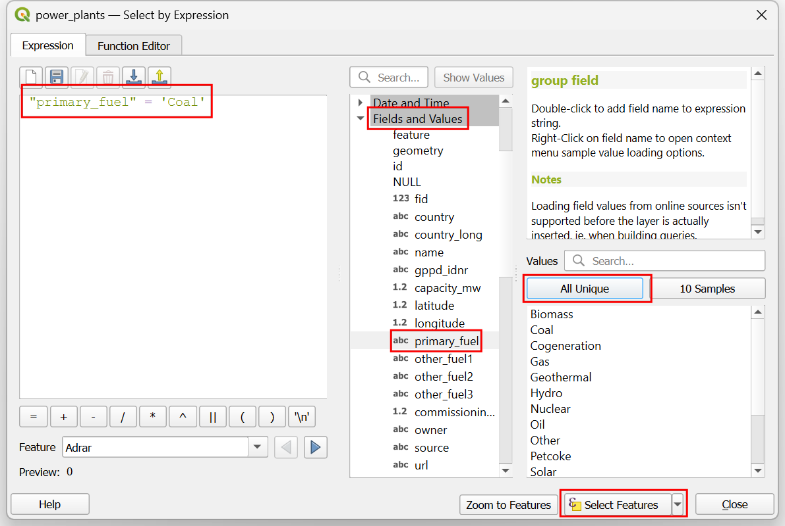
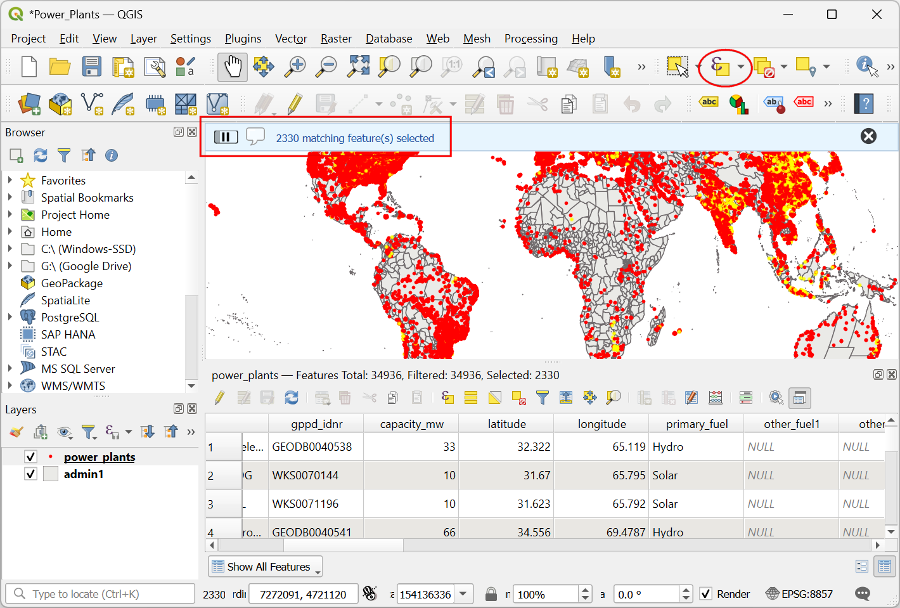
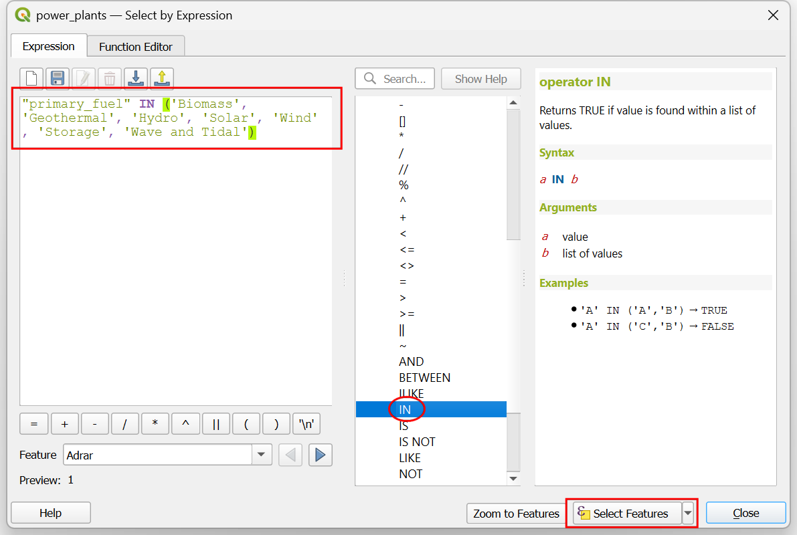
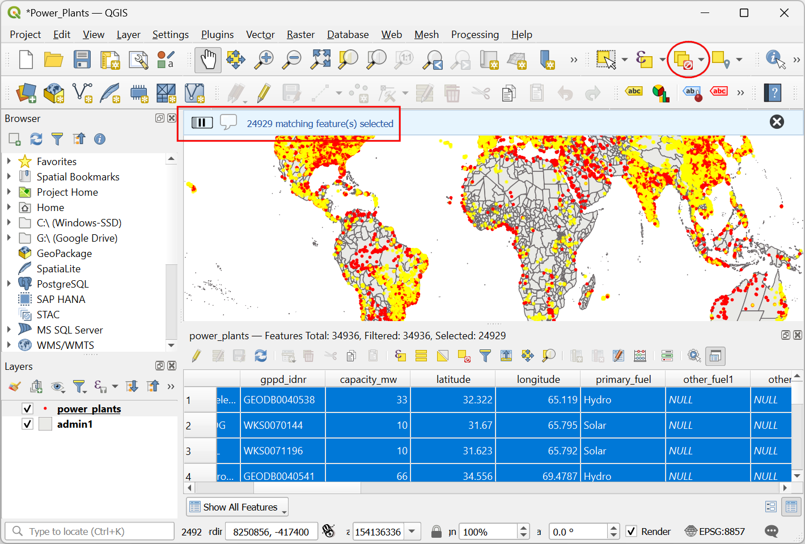

\newpage

***

```{r echo=FALSE, fig.align='center', out.width='250pt'}
knitr::include_graphics('images/spatial_thoughts_logo.png')
```

***

\newpage

# Introduction 

Expressions are one of the most powerful features of QGIS. In this hands-on workshop, we will start from the basics of expression syntax and you will learn how to solve complex problems by combining the basic building blocks.

This workshop requires basic working knowledge of QGIS.

[{width="400px"}](https://docs.google.com/presentation/d/16CiiFs3mLyQIrDXf4Uc50DFwRHsmCeMRpo1i25JNk-s/edit?usp=sharing){target="_blank"}

[View the Presentation &#8599;](https://docs.google.com/presentation/d/1Gv4jZpgMdGR4cvtQxCdf-509CRXNrxuDFW0IXmAug3k/edit?usp=sharing){target="_blank"}

# Software

This workshop requires QGIS LTR version 3.40. 

Please review [QGIS-LTR Installation Guide](install-qgis-ltr.html) for step-by-step instructions.

# Get the Data Package

The code examples in this workshop use a variety of datasets. All the required layers, project files etc. are supplied to you in the zip file `qgis-expressions.zip`. Unzip this file to the `Downloads` directory.

The data package also comes with a ``solutions`` folder that contain model solutions for each section.

Download [qgis-expressions.zip]

# 1. Expressions Basics

## 1.1 Expression Operators

1. Open QGIS. Navigate to the folder containing the data package. Locate and open the **Power_Plants** project. This project contains 2 data layers. A point layer named `power_plants` containing locations of all power plants in the world and a polygon layer named `admin1` with states/province boundaries for all countries. 

```{r echo=FALSE, fig.align='center', out.width='75%'}
knitr::include_graphics('images/qgis_expressions/operator1.png')
```

2. Select the `power_plants` layer and click *Open Attribute Table* button. You will see that the layer as a column named `primary_fuel` describing the primary energy source used in electricity generation. We can use this to select different types of power plants.

```{r echo=FALSE, fig.align='center', out.width='75%'}

```

3. We will now use an expressions to select features from this layer. From the *Selection Toolbar*, click the *Select Features by Expression...* button.

```{r echo=FALSE, fig.align='center', out.width='75%'}

```

4. In the *Expression* dialog, locate the **primary_fuel** attribute under *Fields and Values* group. Double-click to add it to the expression. While the field is selected, click the *All Unique* button to show all unique values contained in that field. Here we want to select all Coal power plants, so enter the expression as below and click *Select Features*.

```
"primary_fuel" = 'Coal'
```

```{r echo=FALSE, fig.align='center', out.width='75%'}

```

5. In the main QGIS window, you will see the features matching the expression selected in yellow color. We could select all Coal power plants. What if we want to select all power plants that use renewable energy source? We need to be able to specify multiple fuel types for the query. Let's update the expression. From the *Selection Toolbar*, click the *Select Features by Expression...* again.

```{r echo=FALSE, fig.align='center', out.width='75%'}

```

6. We can use the **IN** operator to specify a list of fuel types that we want to select. Enter the following expression and click *Select Features*.

```
"primary_fuel" IN ('Biomass', 'Geothermal', 'Hydro', 'Solar', 'Wind', 'Storage', 'Wave and Tidal')
```

```{r echo=FALSE, fig.align='center', out.width='75%'}

```

7. You will now see all power plants with renewable fuel types selected. Click the *Deselect Features from All Layers* button.

```{r echo=FALSE, fig.align='center', out.width='75%'}

```

8. Next, we will learn how we can use expressions to extract certain features into a new layer. Open Processing Toolbox from **Processing &rarr; Toolbox**. Search and locate the algorithm **Vector selection &rarr; Extract by expression** and double-click to launch it.

```{r echo=FALSE, fig.align='center', out.width='75%'}
knitr::include_graphics('images/qgis_expressions/operator8.png')
```


## 1.2 Expression Functions

# 2. Advanced Expressions

## 2.1 Geometry Generators

## 2.2 Iterations

# Data Credits

* Admin 1 – States, Provinces: Made with Natural Earth. Free vector and raster map data @ naturalearthdata.com. Admin1 boundaries were edited and combined with countries (India POV) boundaries.
* Global Power Plant Database: Global Energy Observatory, Google, KTH Royal Institute of Technology in Stockholm, Enipedia, World Resources Institute. 2021. Global Power Plant Database version 1.3.0. Accessed through https://datasets.wri.org/datasets/global-power-plant-database on <date>


# License

This workshop material is licensed under a [Creative Commons Attribution 4.0 International (CC BY 4.0)](https://creativecommons.org/licenses/by/4.0/). You are free to re-use and adapt the material but are required to give appropriate credit to the original author as below:

*QGIS Expressions Masterclass* by Ujaval Gandhi [www.spatialthoughts.com](https://spatialthoughts.com)

***