\newpage

***

```{r echo=FALSE, fig.align='center', out.width='250pt'}
knitr::include_graphics('images/spatial_thoughts_logo.png')
```

***

\newpage

# Introduction 

Expressions are one of the most powerful features of QGIS. In this hands-on workshop, we will start from the basics of expression syntax and you will learn how to solve complex problems by combining the basic building blocks.

This workshop requires basic working knowledge of QGIS.

[{width="400px"}](https://docs.google.com/presentation/d/16CiiFs3mLyQIrDXf4Uc50DFwRHsmCeMRpo1i25JNk-s/edit?usp=sharing){target="_blank"}

[View the Presentation &#8599;](https://docs.google.com/presentation/d/1Gv4jZpgMdGR4cvtQxCdf-509CRXNrxuDFW0IXmAug3k/edit?usp=sharing){target="_blank"}

# Software

This workshop requires QGIS LTR version 3.40. 

Please review [QGIS-LTR Installation Guide](install-qgis-ltr.html) for step-by-step instructions.

# Get the Data Package

The code examples in this workshop use a variety of datasets. All the required layers, project files etc. are supplied to you in the zip file `qgis-expressions.zip`. Unzip this file to the `Downloads` directory.

The data package also comes with a ``solutions`` folder that contain model solutions for each section.

Download [qgis-expressions.zip](https://github.com/spatialthoughts/courses/releases/download/data/qgis_expressions.zip).

# 1. Operators and Conditionals

In this section, we will learn about operators and conditions used in QGIS expressions and learn how to use them to select and extract features from layers.

1. Open QGIS. Navigate to the folder containing the data package. Locate and open the **Power_Plants** project. This project contains 2 data layers. A point layer named `power_plants` containing locations of all power plants in the world and a polygon layer named `admin1` with states/province boundaries for all countries. 

```{r echo=FALSE, fig.align='center', out.width='75%'}
knitr::include_graphics('images/qgis_expressions/operator1.png')
```

2. Select the `power_plants` layer and click *Open Attribute Table* button. You will see that the layer as a column named `primary_fuel` describing the primary energy source used in electricity generation. We can use this to select different types of power plants.

```{r echo=FALSE, fig.align='center', out.width='75%'}
knitr::include_graphics('images/qgis_expressions/operator2.png')
```

3. We will now use an expressions to select features from this layer. From the *Selection Toolbar*, click the *Select Features by Expression...* button.

```{r echo=FALSE, fig.align='center', out.width='75%'}
knitr::include_graphics('images/qgis_expressions/operator3.png')
```

4. In the *Expression* dialog, locate the **primary_fuel** attribute under *Fields and Values* group. Double-click to add it to the expression. While the field is selected, click the *All Unique* button to show all unique values contained in that field. Here we want to select all Coal power plants, so enter the expression as below and click *Select Features*.

```
"primary_fuel" = 'Coal'
```

```{r echo=FALSE, fig.align='center', out.width='75%'}
knitr::include_graphics('images/qgis_expressions/operator4.png')
```

5. In the main QGIS window, you will see the features matching the expression selected in yellow color. We could select all Coal power plants. What if we want to select all power plants that use renewable energy source? We need to be able to specify multiple fuel types for the query. Let's update the expression. From the *Selection Toolbar*, click the *Select Features by Expression...* again.

```{r echo=FALSE, fig.align='center', out.width='75%'}
knitr::include_graphics('images/qgis_expressions/operator5.png')
```

6. We can use the **IN** operator to specify a list of fuel types that we want to select. Enter the following expression and click *Select Features*.

```
"primary_fuel" IN ('Biomass', 'Geothermal', 'Hydro', 'Solar', 'Wind', 'Storage', 'Wave and Tidal')
```

```{r echo=FALSE, fig.align='center', out.width='75%'}
knitr::include_graphics('images/qgis_expressions/operator6.png')
```

7. You will now see all power plants with renewable fuel types selected. Click the *Deselect Features from All Layers* button.

```{r echo=FALSE, fig.align='center', out.width='75%'}
knitr::include_graphics('images/qgis_expressions/operator7.png')
```

8. Next, we will learn how we can use expressions to extract certain features into a new layer. Open the Processing Toolbox from **Processing &rarr; Toolbox**. Search and locate the algorithm **Vector selection &rarr; Extract by expression** and double-click to launch it.

```{r echo=FALSE, fig.align='center', out.width='75%'}
knitr::include_graphics('images/qgis_expressions/operator8.png')
```

9.  In the *Vector Selection - Extract by Expression* dialog, select ``power_plants`` as the *Input layer*. Click the *Expression* button.

```{r echo=FALSE, fig.align='center', out.width='75%'}
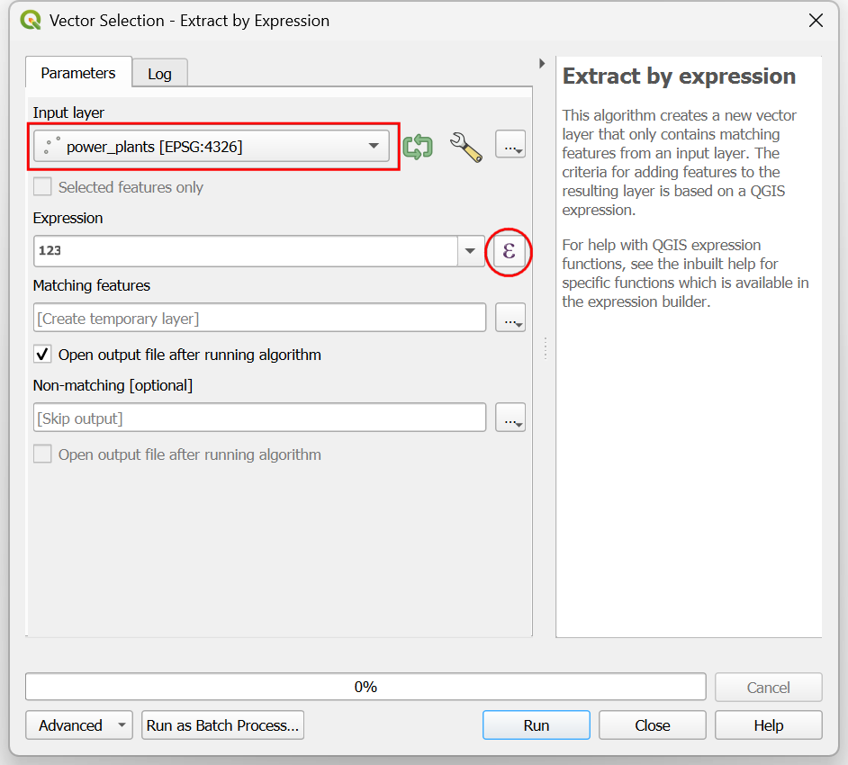
```

10. Enter the following expression to extract all hydro power plants and click *OK*.

```{r echo=FALSE, fig.align='center', out.width='75%'}
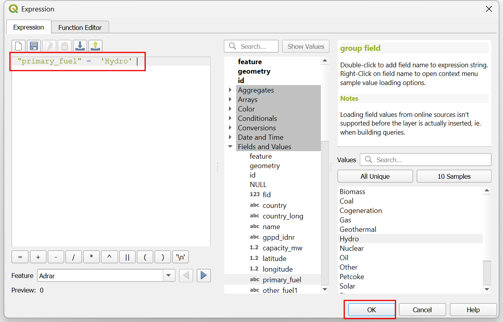
```

11. Click the *...* next to *Matching Features* and select **Save to File...**. Enter the name of the output file as ``hydro_power_plants.gpkg`` and click *Run*.

```{r echo=FALSE, fig.align='center', out.width='75%'}
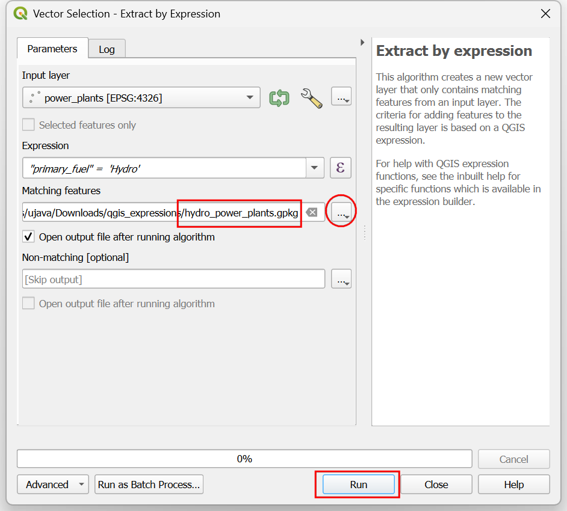
```

12. Once the processing finishes, a new layer `hydro_power_plants` will be added to the *Layers* panel. Open the attribute table and verify that all the power plants have *Hydro* as the `primary_fuel`. Next, we will learn how to classify these power plants based on their capacity. The column `capacity_mw` has electrical generating capacity in megawatts. You may now turn off the visibility of the `power_plants` layer.

```{r echo=FALSE, fig.align='center', out.width='75%'}
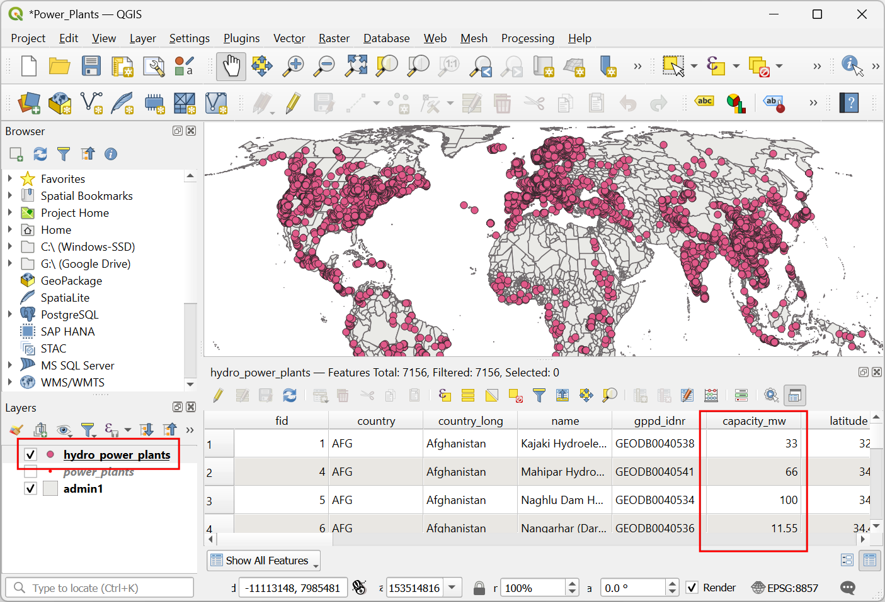
```

13. Select the `hydro_power_plants` layer. From the Processing Toolbox, search and locate the algorithm **Vector table &rarr; Field calculator** and double-click to launch it.

```{r echo=FALSE, fig.align='center', out.width='75%'}
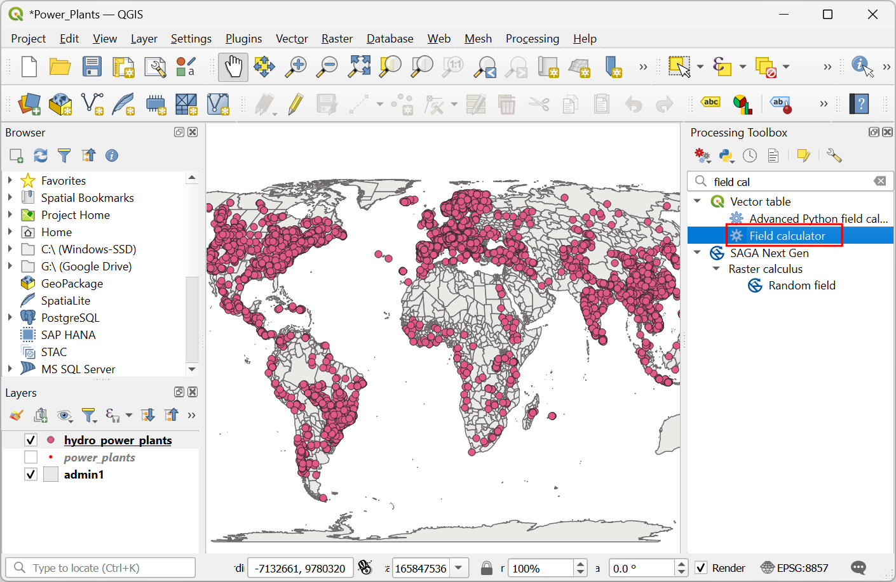
```

14. In the *Vector Table - Field Calculator* dialog, select `hydro_power_plants` as the *Input Layer*. Enter **classification** as the *Field name*.

```{r echo=FALSE, fig.align='center', out.width='75%'}
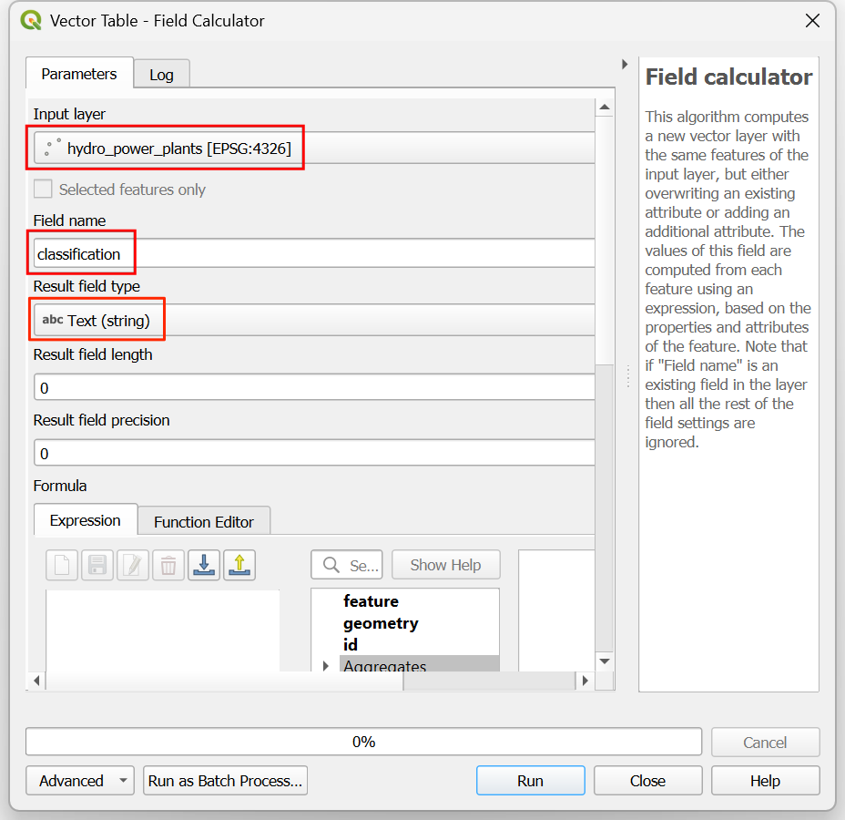
```

15. We want to assign one of the category from Small, Medium and Large to each power plant based on the capacity. We can use the `CASE` statement to assign different values based on different conditions. Enter the following expression.

```
CASE
WHEN  "capacity_mw" < 25 THEN 'Small'
WHEN  "capacity_mw" >= 25 AND  "capacity_mw" <= 100 THEN 'Medium'
WHEN  "capacity_mw" > 100 THEN 'Large'
END
```

```{r echo=FALSE, fig.align='center', out.width='75%'}
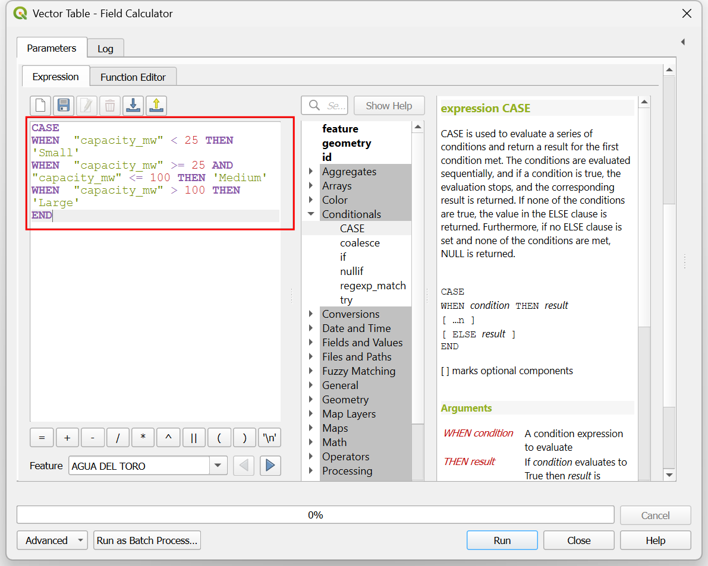
```

16. Click the *...* next to *Calculated* and select **Save to File...**. Enter the name of the output file as ``hydro_power_plants_classification.gpkg`` and click *Run*.

```{r echo=FALSE, fig.align='center', out.width='75%'}
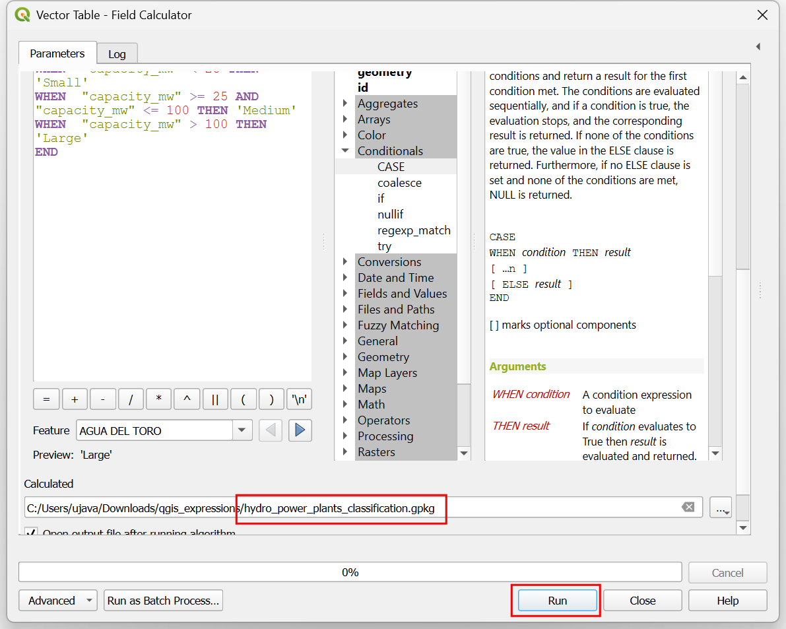
```

17. Once the processing finishes, a new layer `hydro_power_plants_classification` will be added to the *Layers* panel. Open the attribute table and see the assigned values in the *classification* column.

```{r echo=FALSE, fig.align='center', out.width='75%'}
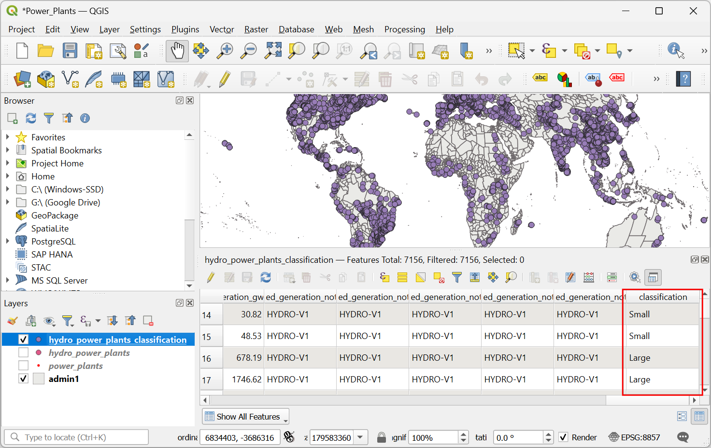
```

We have now finished the first part of this exercise. You can load the `Power_Plants_CheckPoint1.qgz` project in the `solutions` folder to catch up to this point and do the challenge.

## Challenge 1

Create a new layer containing only the **Large** hydro power plants in your country. The `country` column contains 3-digit ISO codes for each country. Pick a country and build an expression to extract the features.

```{r echo=FALSE, fig.align='center', out.width='75%'}
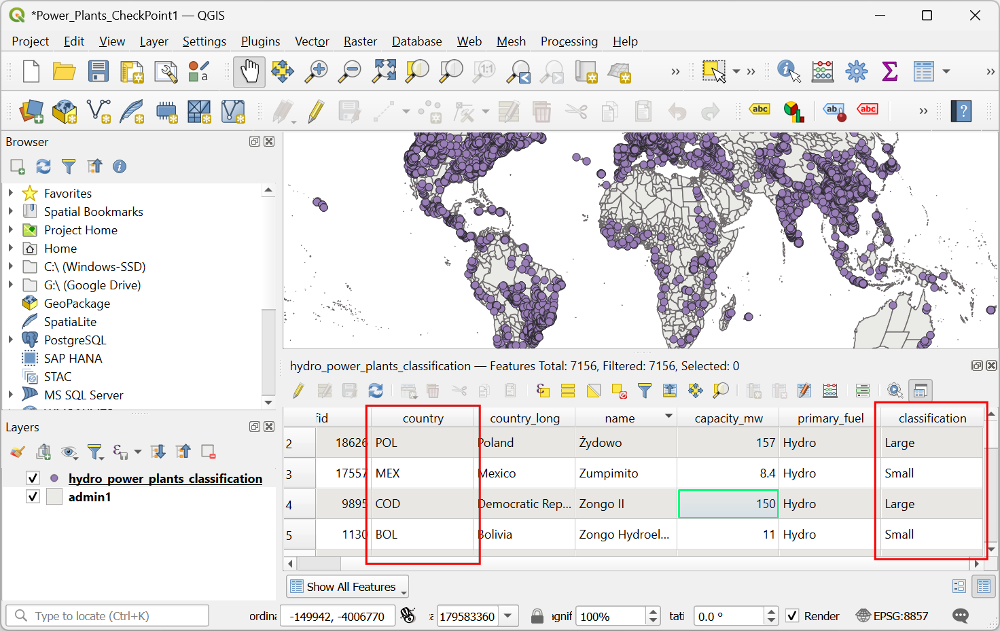
```

# 2. Functions

We will now learn how to use the expression functions for spatial analysis. Our goal will be to get a list of hydro power plants and the total installed capacity for each admin1 region in a country.

1. Continuing from the previous section, remove all layers except the `admin1` and `hydro_power_plants_classification` layers. We will now apply a filter to each of these layers to keep only the features for our chosen country. Right=click the `hydro_power_plants_classification` layer and choose *Filter...*.

```{r echo=FALSE, fig.align='center', out.width='75%'}
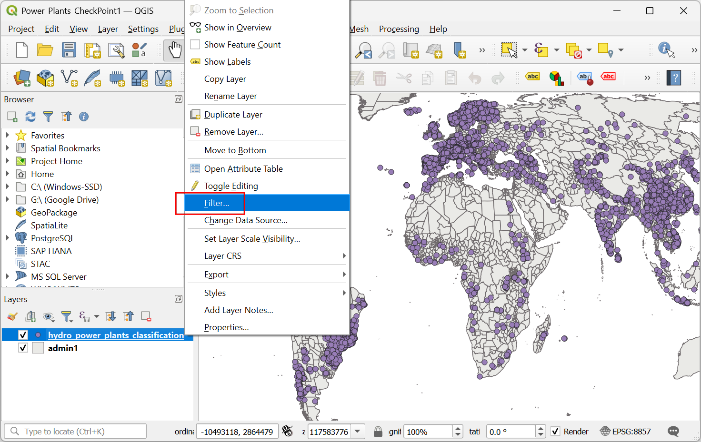
```

2. In the *Query Builder* dialog, enter the following expression and click *OK*. You may replace **SWE** with the 3-digit ISO code for your country.

```
"country" = 'SWE'
```

```{r echo=FALSE, fig.align='center', out.width='75%'}
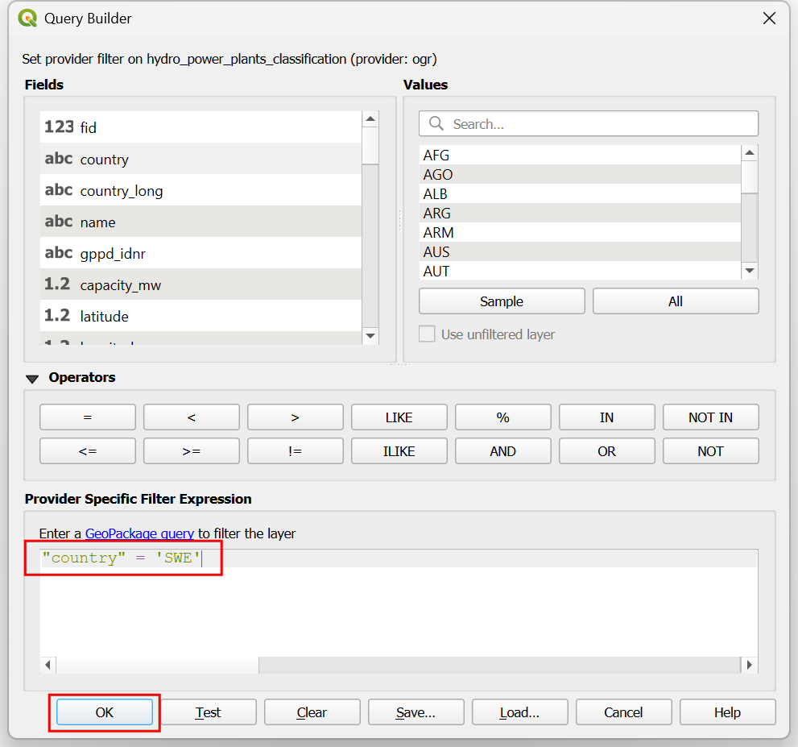
```

3. Next, right-click the `admin1` layer and select *Filter...*.

```{r echo=FALSE, fig.align='center', out.width='75%'}
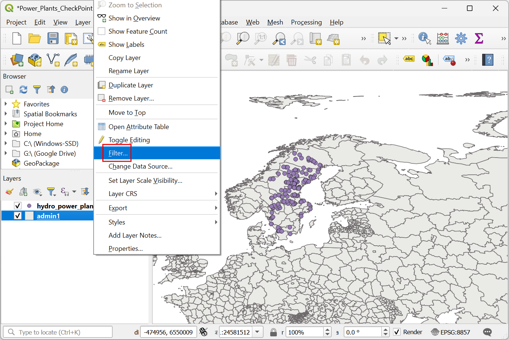
```

4. In the *Query Builder* dialog, enter the following expression and click *OK*.

```
"adm0_a3" = 'SWE'
```

```{r echo=FALSE, fig.align='center', out.width='75%'}
knitr::include_graphics('images/qgis_expressions/functions4.png')
```

5. Both the layers now have an active filter applied to them and you should only see features for the chosen country. Select the `hydro_power_plants_classification` layer and open the Attribute Table. Note that the column `name` contains the name of the power plant and the column `capacity_mw` contains the power generation capacity.

```{r echo=FALSE, fig.align='center', out.width='75%'}
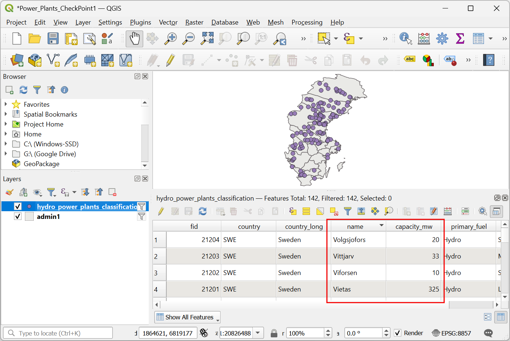
```

6. Select the `admin1` layer and open the Processing Toolbox from **Processing &rarr; Toolbox**. Search and locate the algorithm **Vector table &rarr; Field calculator** and double-click to launch it.

```{r echo=FALSE, fig.align='center', out.width='75%'}
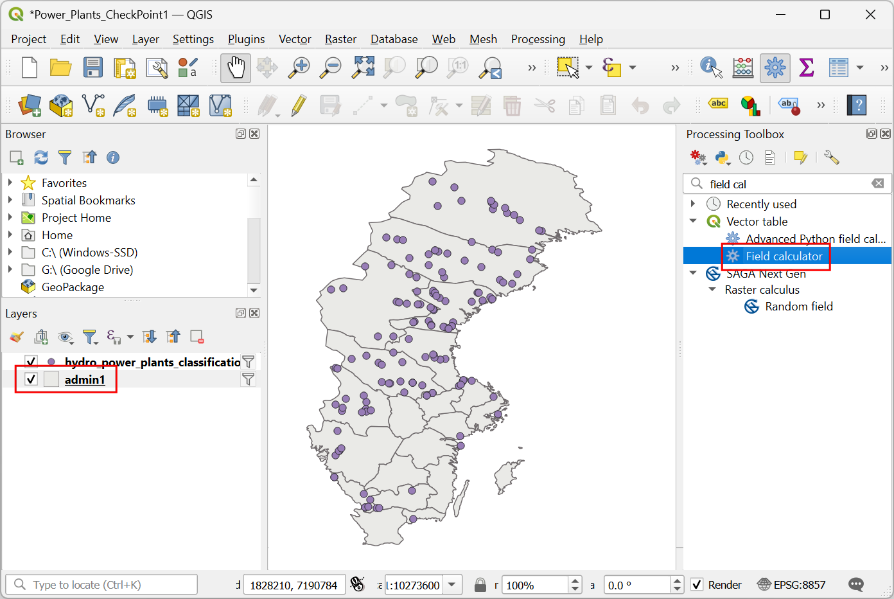
```

7. In the *Vector Table - Field Calculator* dialog, select `admin1` as the *Input Layer*. Enter **power_plants_list** as the *Field name*. Select **String List** as the *Result field type*.

```{r echo=FALSE, fig.align='center', out.width='75%'}
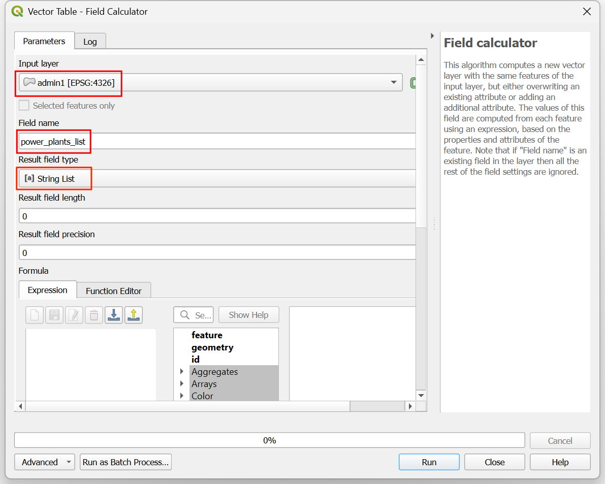
```

8. We want to find the names of all power plant features intersecting each admin1 polygon. The `overlay_intersect` function allows you to locate intersecting features from another layer. Enter the following expression.

```
overlay_intersects(
  layer:='hydro_power_plants_classification',
  expression:="name"
)
```

```{r echo=FALSE, fig.align='center', out.width='75%'}
knitr::include_graphics('images/qgis_expressions/functions8.png')
```

9. In the *Preview* below the expression, you can see the output is a list of matching power plants for admin1 region. Click the *...* next to *Calculated* and select **Save to File...**. Enter the name of the output file as ``hydro_power_plant_list.gpkg`` and click *Run*.

```{r echo=FALSE, fig.align='center', out.width='75%'}
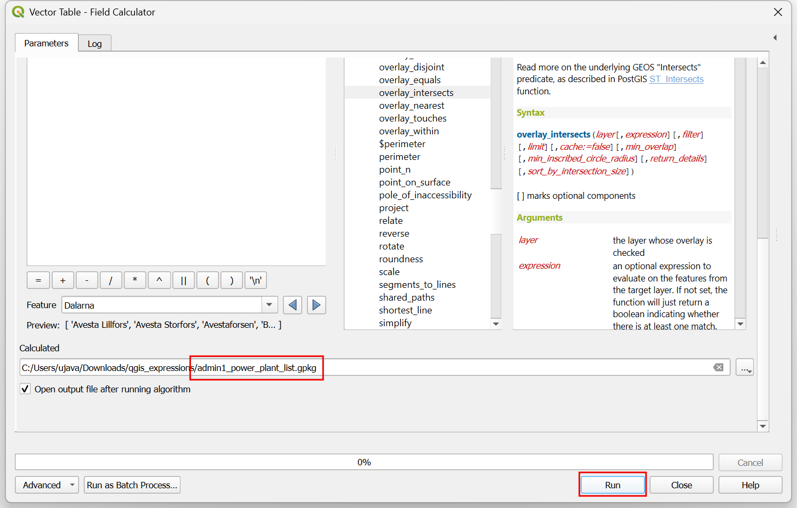
```

10. Once the processing finishes, a new layer `hydro_power_plant_list` will be added to the *Layers* panel. Open the attribute table and verify that the *power_plants_list* has the list of intersecting power plant names. Next, we will add another column with the total capacity for each region. Open the **Vector table &rarr; Field calculator** algorithm from the Processing Toolbox.

```{r echo=FALSE, fig.align='center', out.width='75%'}
knitr::include_graphics('images/qgis_expressions/functions10.png')
```

11. In the *Vector Table - Field Calculator* dialog, select `admin1_power_plant_list` as the *Input Layer*. Enter **total_hydro_capacity** as the *Field name*. Select **Decimal (double)** as the *Result field type*.

```{r echo=FALSE, fig.align='center', out.width='75%'}
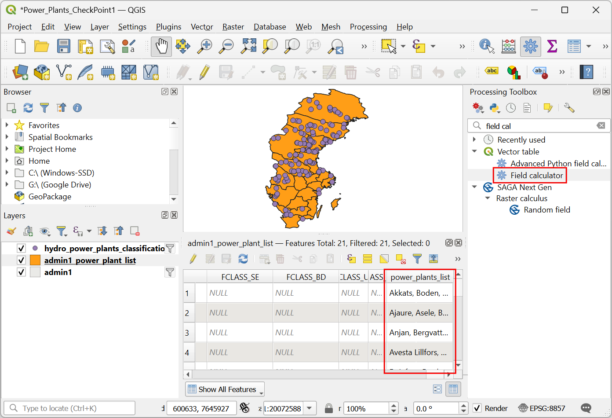
```

12. Similar to the previous step, we can use the `overlay_intersects` function to get a list of values for the *capacity_mw* attribute for all intersecting power plant features. As we want to calculate the total capacity, we can use the `array_sum` function to calculate the total. Enter the following expression.

```
array_sum(
  overlay_intersects(
    layer:='hydro_power_plants_classification',
    expression:="capacity_mw"
  )
)
```

```{r echo=FALSE, fig.align='center', out.width='75%'}
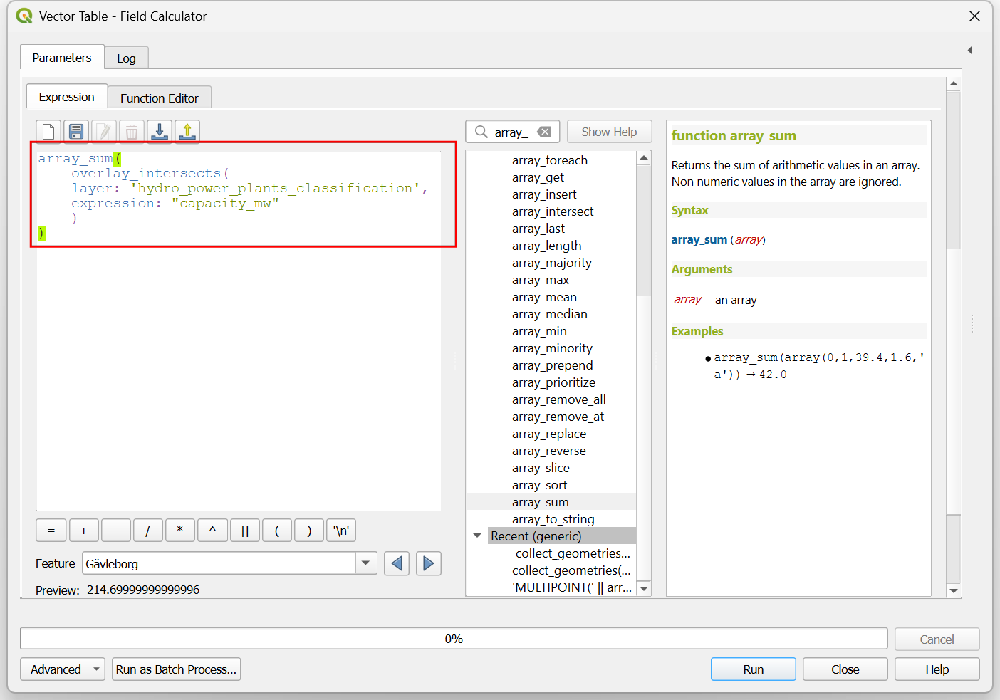
```

13. Click the *...* next to *Calculated* and select **Save to File...**. Enter the name of the output file as ``hydro_power_plant_capacity.gpkg`` and click *Run*.

```{r echo=FALSE, fig.align='center', out.width='75%'}

```

14. Once the processing finishes, a new layer `hydro_power_plant_capacity` will be added to the *Layers* panel. Open the attribute table and you will notice that the *total_hydro_capacity* has the sum of the capacities of all hydro power plants within each region.

```{r echo=FALSE, fig.align='center', out.width='75%'}
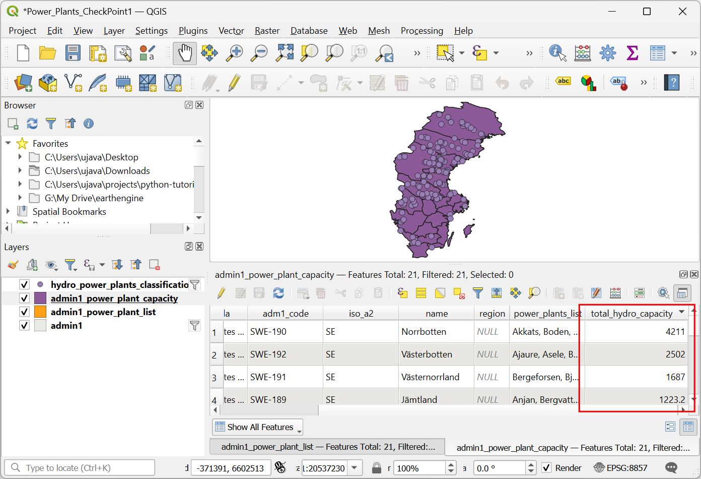
```

15. We are done with the analysis, but often times it i desirable to share the results with others in a non-spatial format. We will not clean up our output and save the data as a spreadsheet. Search and locate the **Vector table &rarr; Refactor fields** algorithm and double-click to launch it.

```{r echo=FALSE, fig.align='center', out.width='75%'}
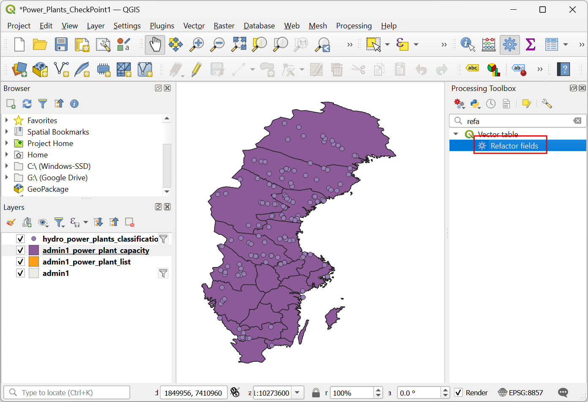
```

16. Our attribute table contains over 100 columns. We can delete most of them and only keep a few columns in the output. In the *Fields mapping* section, hold the *Shift* key and click on the row numbers to select them. Once selected, click the *Delete selected field* button to remove it from the output.

```{r echo=FALSE, fig.align='center', out.width='75%'}
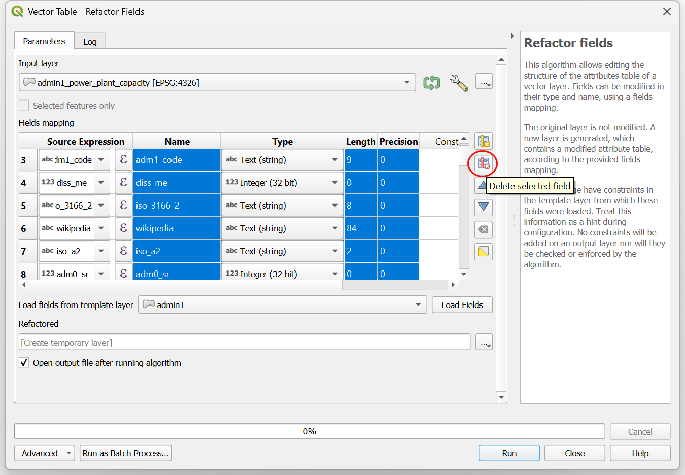
```

17. For the final output, only keep the `name`, `power_plants_list` and `total_hydro_capacity` fields.  Click the *...* next to *Refactored* and select **Save to File...**.

```{r echo=FALSE, fig.align='center', out.width='75%'}
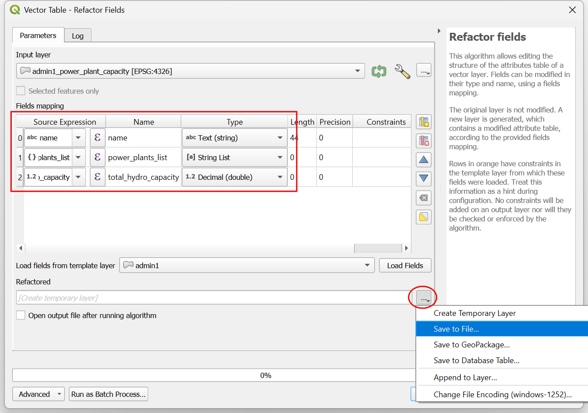
```

18. In the *Save file* dialog, choose **XLSX files (*.xlsx)** as the *Save as type*. Enter the name of the output file as ``admin1_hydro_power_plant_data`` and click *Save*.

```{r echo=FALSE, fig.align='center', out.width='75%'}
knitr::include_graphics('images/qgis_expressions/functions18.png')
```

19. Un-check the *Open output file after running algorithm* box and click *Run*.

```{r echo=FALSE, fig.align='center', out.width='75%'}
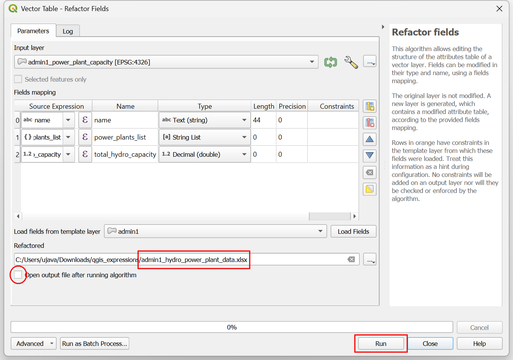
```

20. Once the processing finishes, open the resulting spreadsheet in Excel or Open Office Calc to see the output.

```{r echo=FALSE, fig.align='center', out.width='75%'}
knitr::include_graphics('images/qgis_expressions/functions20.png')
```

21. Back in QGIS, we are ready to do the next challenge. 

```{r echo=FALSE, fig.align='center', out.width='75%'}
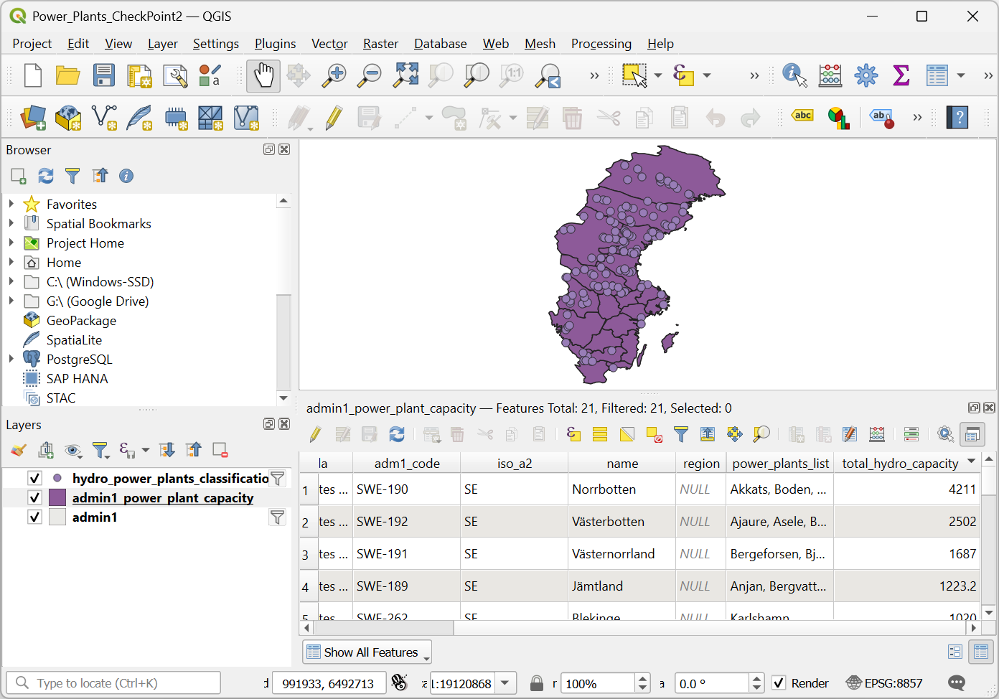
```

You can load the `Power_Plants_CheckPoint2.qgz` project in the `solutions` folder to catch up to this point and do the challenge.

## Challenge 2

Add a new column **power_plant_count** with the total number of hydro power plants in each admin1 region.

Hint: Look under the `array_` section to find a suitable function for calculating number of items in a list.


# Data Credits

* Admin 1 – States, Provinces: Made with Natural Earth. Free vector and raster map data @ naturalearthdata.com. Admin1 boundaries were edited and combined with countries (India POV) boundaries.
* Global Power Plant Database: Global Energy Observatory, Google, KTH Royal Institute of Technology in Stockholm, Enipedia, World Resources Institute. 2021. Global Power Plant Database version 1.3.0. Accessed through https://datasets.wri.org/datasets/global-power-plant-database on <date>


# License

This workshop material is licensed under a [Creative Commons Attribution 4.0 International (CC BY 4.0)](https://creativecommons.org/licenses/by/4.0/). You are free to re-use and adapt the material but are required to give appropriate credit to the original author as below:

*QGIS Expressions Masterclass* by Ujaval Gandhi [www.spatialthoughts.com](https://spatialthoughts.com)

***