\newpage

***

```{r echo=FALSE, fig.align='center', out.width='75%', out.width='250pt'}
knitr::include_graphics('images/spatial_thoughts_logo.png')
```

***

\newpage

# Introduction 

Google Earth Engine is a cloud-based platform that enables working with large-scale earth observation datasets effectively. The [Google Earth Engine Plugin for QGIS](https://github.com/gee-community/qgis-earthengine-plugin) brings this power to the desktop and enables QGIS users to combine their geospatial workflows with cloud-based datasets. This workshop will give you hands-on experience using plugin to leverage cloud-based datasets in desktop-based geospatial workflows.

[{width="400px"}](https://docs.google.com/presentation/d/1yogtMCTOkELcXWLKp285vHQqhHezZpBLObVSeAzDs7w/edit?usp=sharing){target="_blank"}

[View the Presentation &#8599;](https://docs.google.com/presentation/d/1yogtMCTOkELcXWLKp285vHQqhHezZpBLObVSeAzDs7w/edit?usp=sharing){target="_blank"}

# Installation and Setting up the Environment

## Install QGIS

This workshop requires QGIS LTR version 3.40. Please review [QGIS-LTR Installation Guide](install-qgis-ltr.html) for step-by-step instructions.

## Sign-up for Google Earth Engine

If you already have a Google Earth Engine account, you can skip this step.

Visit our [GEE Sign-Up Guide](gee-sign-up.html) for step-by-step instructions.

## Install the Google Earth Engine Plugin for QGIS

This workshops requires the **Google Earth Engine Plugin for QGIS**.The plugin can be installed by the Plugin Manager from the official QGIS plugin repository and involves a few extra steps to authenticate with your Google Earth Engine account and set the Google Cloud project.

Visit the [QGIS Earth Engine Plugin Installation Guide](https://gee-community.github.io/qgis-earthengine-plugin/installation/) for step-by-step instructions.

## Get the Data Package

We have created a data package containing checkpoint projects that will allow you to load the results of each section. You can download the data package from [qgis-gee-workshop.zip](https://github.com/spatialthoughts/courses/releases/download/data/qgis_gee_workshop.zip). Once downloaded, unzip the contents to a folder on your computer.

# Overview of the Earth Engine Data Model

Earth Engine supported georeferenced raster and vector datasets. The terminology used by Earth Engine is different than used by QGIS. Below is the explanation of common data types in Earth Engine.

* **Image**: A single georeferenced raster dataset. It can have one or more bands. The image metadata is stored as *properties*. Each band in the image can have different data type, spatial resolution (i.e. scale) and projection.
* **ImageCollection**: The most common type of dataset used in Earth Engine that consists of multiple *Image* objects. Images over both space and time can be put in a single ImageCollection. 
* **FeatureCollection**: Vector datasets are represented as FeatureCollections in Earth Engine. Each *Feature* in the collection consists of a *geometry* and some *properties*.

# Earth Engine Datasets

## Official Data Catalog

The Google Earth Engine team maintains a large catalog of ready-to-use datasets that can be readily accessed via the plugin. You can search and browse the datasets at the [Earth Engine Data Catalog](https://developers.google.com/earth-engine/datasets).

```{r echo=FALSE, fig.align='center', out.width='75%'}
knitr::include_graphics('images/qgis_gee_workshop/main_catalog.png')
```

## Awesome GEE Community Catalog

The Earth Engine Community, led by Samapriya Roy maintains another large catalog of datasets that have been processed and ingested in Earth Engine. This catalog can be accessed from [awesome-gee-community-catalog](https://gee-community-catalog.org/). The dataset available in this catalog can also be used directly in the QGIS Earth Engine plugin.

```{r echo=FALSE, fig.align='center', out.width='75%'}
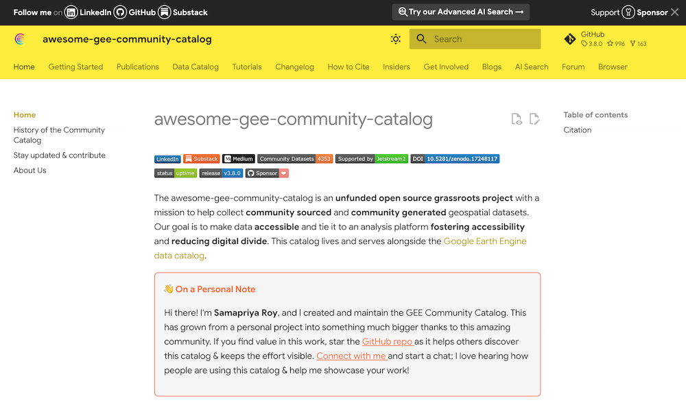
```

## User Uploaded Assets

Earth Engine users can also upload their own datasets and use them in the plugin. This is useful if you wanted to access your private assets through the QGIS Earth Engine plugin. You must be either the owner of the asset or need read access to the asset.


# Hands-on With QGIS Earth Engine Plugin

## 1. Downloading Images from Earth Engine

The Google Earth Engine plugin comes with a handy **Export Image to GeoTIFF** algorithm that allows you to download images from GEE directly to your computer as GeoTIFF files. In this tutorial, we will use the plugin to create a Sentinel-2 median composite for a region and download it as a GeoTIFF file.

1. Open QGIS. To help us select a region of interest, it will be helpful to have a basemap. From the QGIS Browser Panel, locate the *XYZ Tiles → OpenStreetMap* layer and drag it to the canvas.

```{r echo=FALSE, fig.align='center', out.width='75%'}
knitr::include_graphics('images/qgis_gee_workshop/download_image1.png')
```

2. We can use the QGIS’s built-in geocoder to search for a place. For this tutorial, we want to download imagery over Paris. Select the locator bar in the bottom left corner and enter the search term `> paris`. Make sure there is a space between the `>` character and the search term. From the results, click on the first one to zoom to the location.

```{r echo=FALSE, fig.align='center', out.width='75%'}
knitr::include_graphics('images/qgis_gee_workshop/download_image2.png')
```

3. Zoom and pan the map to the desired extent. Open the Processing Toolbox from *Processing → Toolbox*. Locate the *Add Image Collection* algorithm from the Google Earth Engine provider. Double-click to open it.

```{r echo=FALSE, fig.align='center', out.width='75%'}
knitr::include_graphics('images/qgis_gee_workshop/download_image3.png')
```

4. To add an Image Collection, we first need to find the Image Collection ID for the Sentinel-2 Level-2A collection. 

```{r echo=FALSE, fig.align='center', out.width='75%'}
knitr::include_graphics('images/qgis_gee_workshop/download_image4.png')
```

5. Open the [Earth Engine Data Catalog](https://developers.google.com/earth-engine/datasets/) and navigate to the dataset page for [Harmonized Sentinel-2 MSI: MultiSpectral Instrument, Level-2A (SR)](https://developers.google.com/earth-engine/datasets/catalog/COPERNICUS_S2_SR_HARMONIZED). Copy the Image Collection ID `COPERNICUS/S2_SR_HARMONIZED` shown on the page.

```{r echo=FALSE, fig.align='center', out.width='75%'}
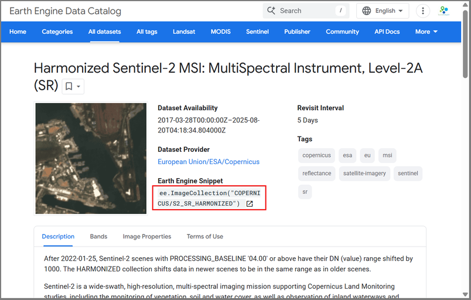
```

6. Back in the *Add Image Collection* dialog, paste the Image Collection ID `COPERNICUS/S2_SR_HARMONIZED`. Next, we can apply a metadata filter to select images with less cloud. In the *Filter by Image Properties* section, select `CLOUDY_PIXEL_PERCENTAGE` as the property, `<` as the operator and enter `30` as the value. This will select all images with < 30% cloud cover.

```{r echo=FALSE, fig.align='center', out.width='75%'}
knitr::include_graphics('images/qgis_gee_workshop/download_image6.png')
```

7. In the *Compositing* section, select `Median` as the *Compositing Method*. This method will take all available images and calculate the median value for each pixel. For optical imagery, such as Sentinel-2, this method is useful in selecting the best representative pixel for the chosen duration without being affected by outliers such as clouds and cloud-shadow. We want to create an annual composite, so in the *Filter by Dates* section, enter the *Start* and *End* dates as `01-01-2024` and `01-01-2025`. 

    > Remember that the *End* date in the Earth Engine date filter is *exclusive* - so we need to add an extra day to ensure do not exclude the last day of the year.

```{r echo=FALSE, fig.align='center', out.width='75%'}
knitr::include_graphics('images/qgis_gee_workshop/download_image7.png')
```


8. Expand the *Filter by Extent (Bounds)* section. Click the `Map Canvas Extent` button to load the selected region in the canvas.

```{r echo=FALSE, fig.align='center', out.width='75%'}
knitr::include_graphics('images/qgis_gee_workshop/download_image8.png')
```

9. Before loading the image, we need to specify the visualization parameters. For multi-band images, we can select 3 bands to be used for visualization. We will visualize the resulting image in natural color, so select `B4` (Red) , `B3` (Green) and `B2` (Blue) as the bands. The typical range of pixel values for Sentinel-2 images are between 0-3000, so enter `0` as *Min* and `3000` as *Max*. Check the *Clip to Extent* box to load only the pixels within the selected extent and click *Run*.

```{r echo=FALSE, fig.align='center', out.width='75%'}
knitr::include_graphics('images/qgis_gee_workshop/download_image9.png')
```

10. Once the algorithm finishes, a new layer `IC: COPERNICUS/S2_SR_HARMONIZED (Median)` will be added to the *Layers* panel. This layer is being streamed from the Earth Engine servers. As you zoom or pan the image - new pixels will be computed on-the-fly and displayed. Lets download this image so we can use it within QGIS for analysis. Locate the `Export → Export Image to GeoTIFF` algorithm from the Google Earth Engine provider in the Processing Toolbox. Double-click to open it.

```{r echo=FALSE, fig.align='center', out.width='75%'}
knitr::include_graphics('images/qgis_gee_workshop/download_image10.png')
```

11. In the Export Image to GeoTIFF dialog, select `IC: COPERNICUS/S2_SR_HARMONIZED (Median)` as the EE Image. We want to export this at its native resolution, so enter `10` as the *Scale (meters)*. We can also specify the projection in which we want the output image. Click the *Select CRS* button.

```{r echo=FALSE, fig.align='center', out.width='75%'}
knitr::include_graphics('images/qgis_gee_workshop/download_image11.png')
```

12. It is recommended to use a Projected CRS suitable for the region of interest. UTM is a good choice for such a CRS. We can find the CRS for the UTM Zone where our region is located. If you do not know the UTM Zone, you can use this handy [What UTM Zone am I in?](https://mangomap.com/robertyoung/maps/69585/what-utm-zone-am-i-in-#) map. Paris is located in the *UTM Zone 31N*. Search and select the `WGS84 / UTM zone 31N (EPSG:32631)` CRS. Once selected, click the arrow at the top of the selector to go back to the previous dialog.

```{r echo=FALSE, fig.align='center', out.width='75%'}
knitr::include_graphics('images/qgis_gee_workshop/download_image12.png')
```

13. Next, select the Map Canvas Extent as the Extent of the image for Export. We can choose the subset and order of bands to export. For this tutorial, lets export the B4, B3 and B2 bands. You can select each band from the left-hand section and use the >> button to add them to the list of output bands.

```{r echo=FALSE, fig.align='center', out.width='75%'}
knitr::include_graphics('images/qgis_gee_workshop/download_image13.png')
```

14. For the *Output File*, browse to a directory on your computer and enter the file name as `s2_median_composite.tif`. Once configured, click *Run*.

```{r echo=FALSE, fig.align='center', out.width='75%'}
knitr::include_graphics('images/qgis_gee_workshop/download_image14.png')
```

15. The requested region will be divided into smaller tiles and each tile will be downloaded separately. The algorithm will then merge the downloaded tiles into a single mosaic and save it at the requested location. Depending on the size of the region, resolution, number of bands, and your internet bandwidth, this process can take some time. Once the algorithm finishes, click *Close*.

```{r echo=FALSE, fig.align='center', out.width='75%'}
knitr::include_graphics('images/qgis_gee_workshop/download_image15.png')
```

16. In the layer panel, turn off the `IC: COPERNICUS/S2_SR_HARMONIZED (Median)` layer as it is no longer required. In the *Browser* panel, locate the directory where you saved the output file. Drag and drop the `s2_median_composite.tif` file to the canvas to see the downloaded image.

```{r echo=FALSE, fig.align='center', out.width='75%'}
knitr::include_graphics('images/qgis_gee_workshop/download_image16.png')
```

## 2. Building Workflows with Model Designer

The processing algorithms provided by the Google Earth Engine plugin can be used in the QGIS Model Designer to automate workflows that combine data from the Earth Engine Data Catalog with processing algorithms from QGIS.

In this section, we will build a model that will run the following steps in a single workflow:

- Load landcover data from the Earth Engine Data Catalog
- Download the data as a GeoTIFF file for the chosen region
- Calculate area of each landcover class
- Convert the computed area to square kilometers
- Add input validation to the model

```{r echo=FALSE, fig.align='center', out.width='75%', fig.cap='QGIS Model for Calculating Landcover Statistics'}
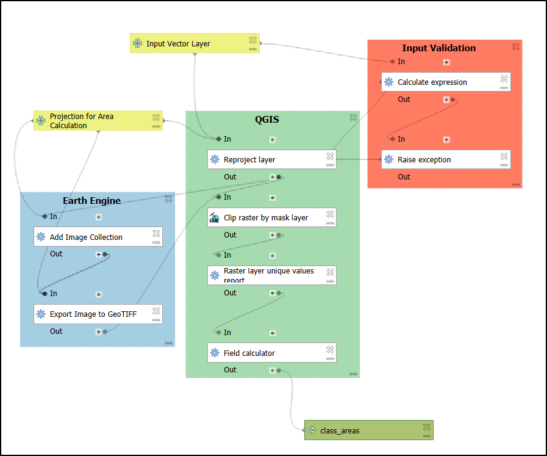
```

There are many landcover datasets available in the [Earth Engine Data Catalog](https://developers.google.com/earth-engine/datasets) as well as [GEE Community Catalog](https://gee-community-catalog.org/). A similar process can be used to load any of the available datasets.

We will use the [ESA WorldCover 10m v200](https://developers.google.com/earth-engine/datasets/catalog/ESA_WorldCover_v200?hl=en) global land cover map for 2021 at 10 m resolution. Visit the [dataset description page](https://developers.google.com/earth-engine/datasets/catalog/ESA_WorldCover_v200?hl=en#description) and note the ImageCollection ID.

```{r echo=FALSE, fig.align='center', out.width='75%'}
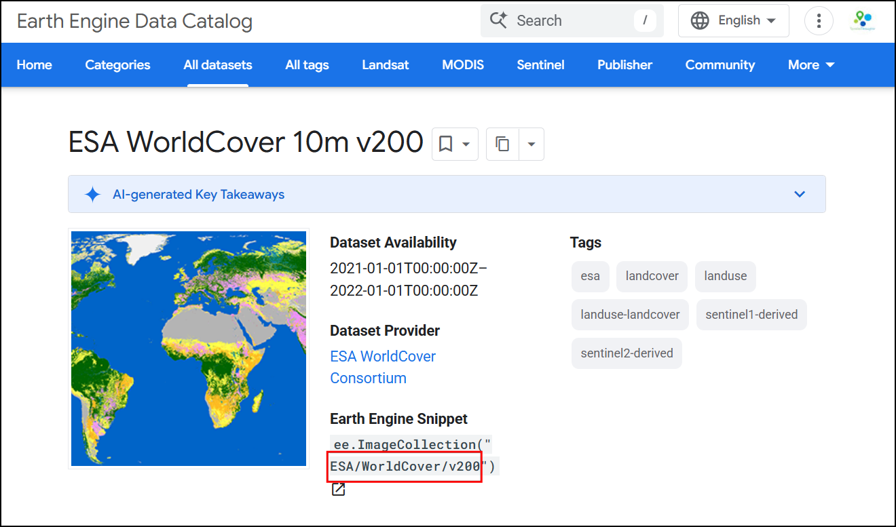
```

This dataset contains a data band named **Map** and 11-class classification with each class assigned a value between 10-100.

```{r echo=FALSE, fig.align='center', out.width='75%'}
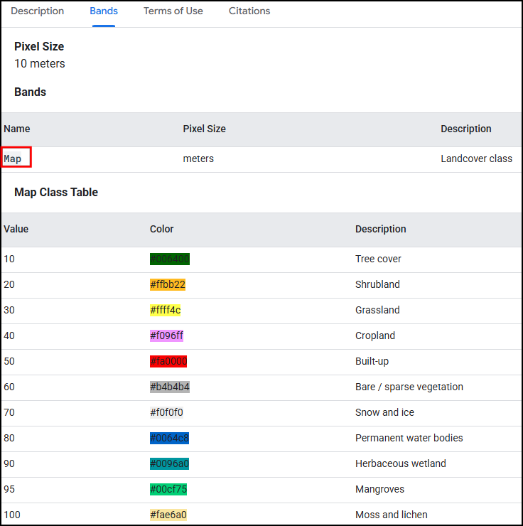
```

### 2.1 Building the model

1. Open QGIS. From the QGIS Browser Panel, locate the supplied `bangalore.geojson` file and double-click to open it. This will load a vector layer containing a single feature representing the municipal boundary for the city of Bengaluru, India. Next, open the Processing Toolbox from *Processing &rarr; Toolbox*. From the toolbar, select *Models &rarr; Create New Model..*.

```{r echo=FALSE, fig.align='center', out.width='75%'}
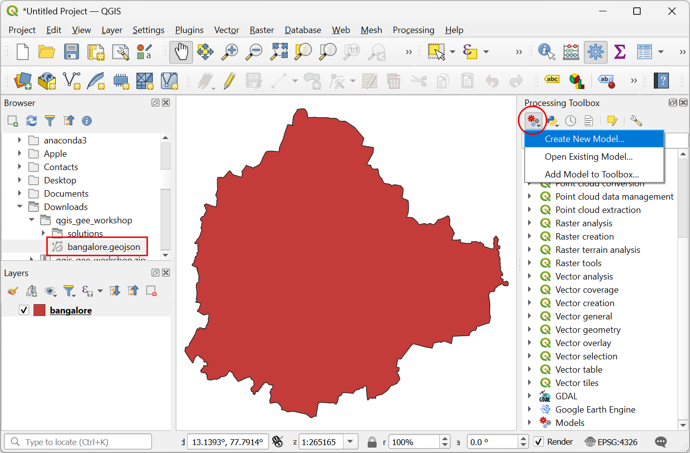
```

2. In the Model Designer dialog, enter the model Name as `Calculate Landcover Statistics` and click the *Save model* button. When prompted to enter the file name, enter `calculate_landcover_statistics.model3`.

```{r echo=FALSE, fig.align='center', out.width='75%'}
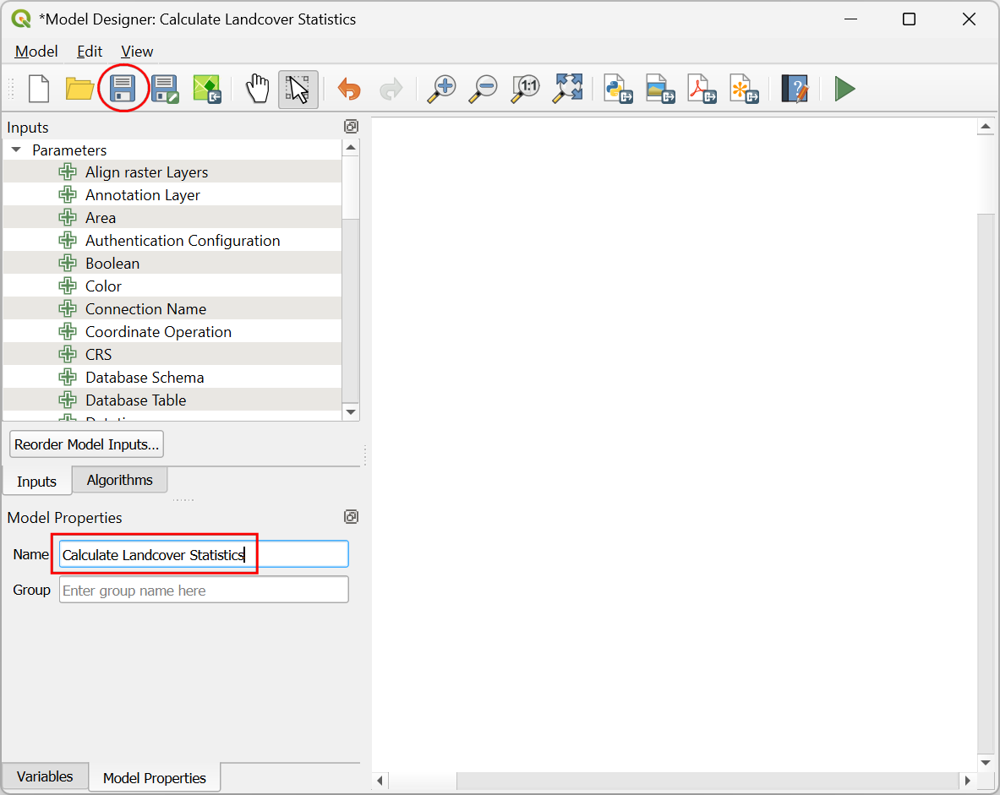
```

3. We will now start building the model. The first input to the model will be the layer with region boundary. From the *Inputs* tab, scroll down to find the *+ Vector Layer* input. Drag it to the canvas. In the *Vector Layer Parameter Definition* dialog, enter `Input Vector Layer` as the *Description* and select `Polygon` as the *Geometry type*. Click *OK*.

```{r echo=FALSE, fig.align='center', out.width='75%'}
knitr::include_graphics('images/qgis_gee_workshop/model3.png')
```

4. Next we will add an input for the user to specify the CRS to be used for the analysis. Locate the *+ CRS* input and drag it to the canvas. In the *CRS Parameter Definition* dialog, enter `Projection for Area Calculation` as the *Description*. As the layer we are using falls in the UTM Zone 43N, we can enter the *Default value* of the CRS as `EPSG:32643 - WGS84 / UTM Zone 43N`. Click *OK*.

```{r echo=FALSE, fig.align='center', out.width='75%'}
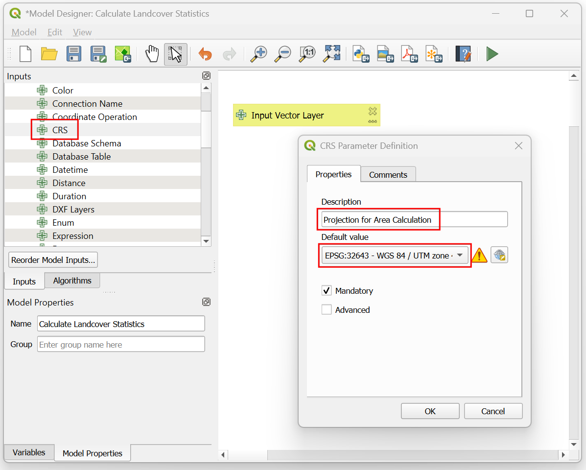
```

5. Once the inputs are configured, lets start building the workflow. First step is to reproject the input layer to the specified CRS. Switch to the *Algorithms* tab, search and locate the *Vector general &rarr; Reproject layer* algorithm  and drag it to the canvas. In the *Vector general - Reproject layer* dialog, switch to *Using model input* for *Input layer* and select the `Input Vector Layer` parameter. Similarly for *Target CRS* select the `Projection for Area Calculation` parameter. Click *OK*.

```{r echo=FALSE, fig.align='center', out.width='75%'}
knitr::include_graphics('images/qgis_gee_workshop/model5.png')
```

6.  Next step is to load the dataset from Earth Engine. Scroll down to the *Google Earth Engine provider* and locate the *Add Image Collection* algorithm. Drag it to the canvas.

```{r echo=FALSE, fig.align='center', out.width='75%'}
knitr::include_graphics('images/qgis_gee_workshop/model6.png')
```

7. Enter the Earth Engine Image Collection ID `ESA/WorldCover/v200` for the ESA WorldCover dataset. For the *Extent*, switch to *Using algorithm output* and select `"Reprojected" from algorithm "Reproject layer"`. For the *Extent CRS*, select *Using model input* and select `Projection for Area Calculation`.

```{r echo=FALSE, fig.align='center', out.width='75%'}
knitr::include_graphics('images/qgis_gee_workshop/model7.png')
```

8. Scroll down in the dialog and delete the default help text for both *Filter Image Properties* and *Visualization Parameters (JSON)*. Select `Mosaic` for the *Compositing Method* and click *OK*.

```{r echo=FALSE, fig.align='center', out.width='75%'}
knitr::include_graphics('images/qgis_gee_workshop/model8.png')
```

9. The next step is to connect the *Export Image to GeoTIFF* algorithm. Locate it and drag it to the canvas.

```{r echo=FALSE, fig.align='center', out.width='75%'}
knitr::include_graphics('images/qgis_gee_workshop/model9.png')
```

10. In the *Export Image to GeoTIFF* dialog box, for the *EE Image Name*, switch to *Using algorithm output* and select `"Layer Name"from algorithm "Add Image Collection"`. For *Extent*, switch to *Using algorithm output* and select `"Reprojected" from algorithm "Reproject layer"`. The spatial resolution of the dataset is 10m, so enter `10` as the *Scale (meters)*. Enter `Map` as the *Bands to export*. Click OK.

```{r echo=FALSE, fig.align='center', out.width='75%'}
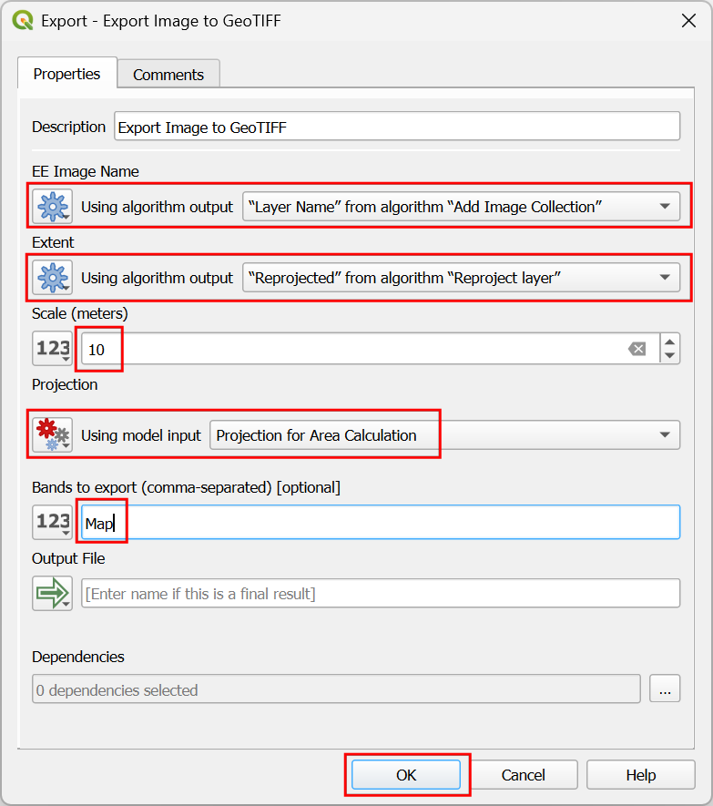
```

11. The previous step will download the data for the given extent as a GeoTIFF file. Let's clip this to the area of interest. Search and locate the *GDAL &rarr; Raster extraction &rarr; Clip raster by mask layer* algorithm  and drag it to the canvas.

```{r echo=FALSE, fig.align='center', out.width='75%'}
knitr::include_graphics('images/qgis_gee_workshop/model11.png')
```

12. In the *Raster extraction - Clip raster by mask layer* dialog, configure the *Input layer* by switching to *Using algorithm output* and selecting `"Output File" from algorithm "Export Image to GeoTIFF"`. Specify the *Mask layer* by switching to *Using algorithm output* and selecting `"Reprojected" from algorithm "Reproject layer"`. Click *OK*.

```{r echo=FALSE, fig.align='center', out.width='75%'}
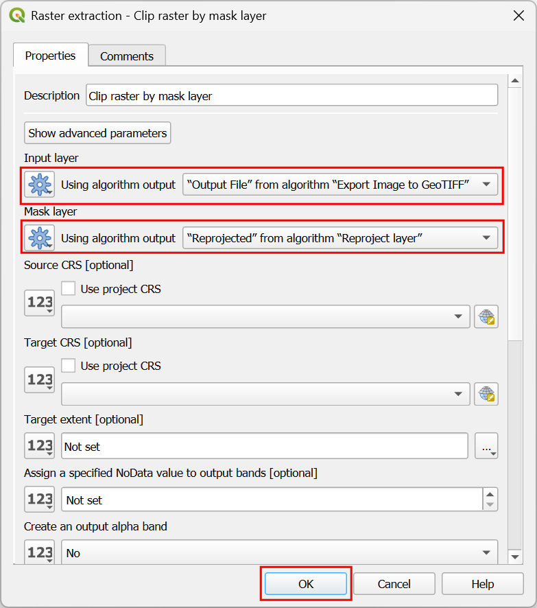
```

13. Now we will add a step to calculate the area for each class. This is done using the *Raster analysis &rarr; Raster layer unique values report* algorithm. Locate it and drag it to the canvas.

> Note: The *Raster layer unique values report* algorithm gives you the areas for the entire raster layer. If you want to calculate areas for different regions over the raster, you can use the **Zonal histogram** tool to get pixel counts for each class and then multiply it with the area of each pixel.

```{r echo=FALSE, fig.align='center', out.width='75%'}
knitr::include_graphics('images/qgis_gee_workshop/model13.png')
```

14. In the *Raster analysis - Raster layer unique values report*, configure the *Input layer* by switching to *Using algorithm output* and selecting `"Clipped (mask)" from algorithm "Clip raster by mask layer"`. Keep other parameter values to their default and click *OK*.

```{r echo=FALSE, fig.align='center', out.width='75%'}
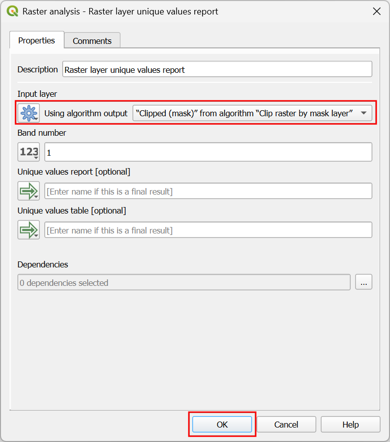
```

15. The results from the previous step will be a table with columns **value** and **m2** containing the class value and total area in square meters. Let's convert the area to square kilometers. Locate the *Vector table &rarr; Field calculator* algorithm and drag it to the canvas.

```{r echo=FALSE, fig.align='center', out.width='75%'}
knitr::include_graphics('images/qgis_gee_workshop/model15.png')
```

16. In the *Vector table - Field Calculator* dialog, configure the *Input layer* by switching to *Using algorithm output* and selecting `"Unique values table" from algorithm "Raster layer unique values report"`. Enter the *Field name* as `area_sqkm` and *Result field type* as `Decimal (double)`. For the *Formula*, we will divide the area in square meters by 1000 x 1000 (i.e. 1e6) to convert it to square kilometers. Enter the expression as `"m2"/1e6`.

```{r echo=FALSE, fig.align='center', out.width='75%'}
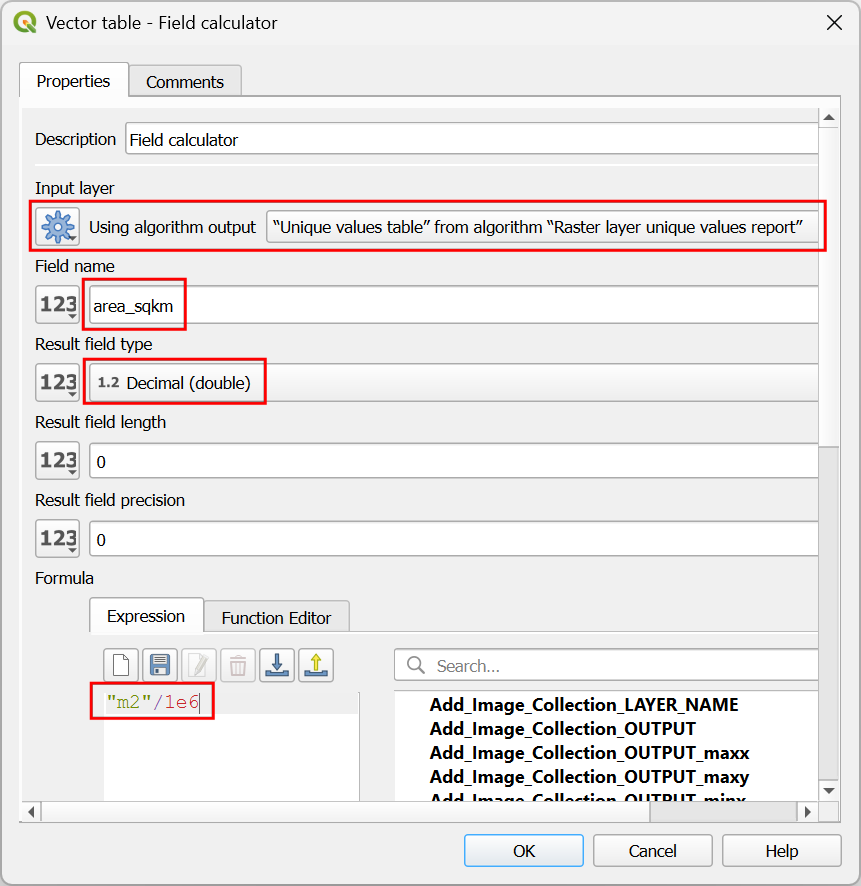
```

17. As this table will be our final output, enter the *Calculate* layer name as `class_areas` and click *OK*.

```{r echo=FALSE, fig.align='center', out.width='75%'}
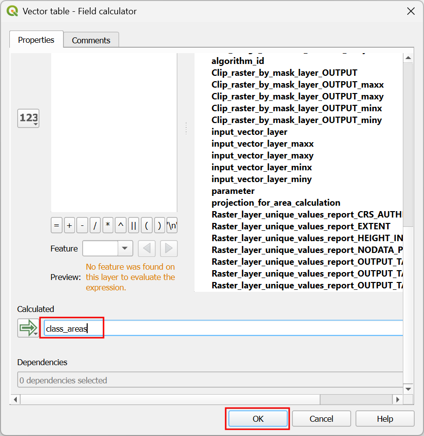
```

18. The model is now complete. Click the *Run model* button.

```{r echo=FALSE, fig.align='center', out.width='75%'}
knitr::include_graphics('images/qgis_gee_workshop/model18.png')
```

19. In the *Calculate Landcover Statistics*, select `bangalore` as the *Input Vector Layer*. Keep the other values to their default and click *Run*.

```{r echo=FALSE, fig.align='center', out.width='75%'}
knitr::include_graphics('images/qgis_gee_workshop/model19.png')
```

20. Once the model run completes, a new layer `class_areas` will be added to the *Layers* panel. Open the attribute table and you will see new column with class area statistics computed from the ESA WorldCover dataset..

```{r echo=FALSE, fig.align='center', out.width='75%'}
knitr::include_graphics('images/qgis_gee_workshop/model20.png')
```

21. It is a good practice to save the model along with the QGIS project so it is always available to whoever is using the project file. Click the *Save model in project* button to embed the model in your QGIS project file. 

```{r echo=FALSE, fig.align='center', out.width='75%'}
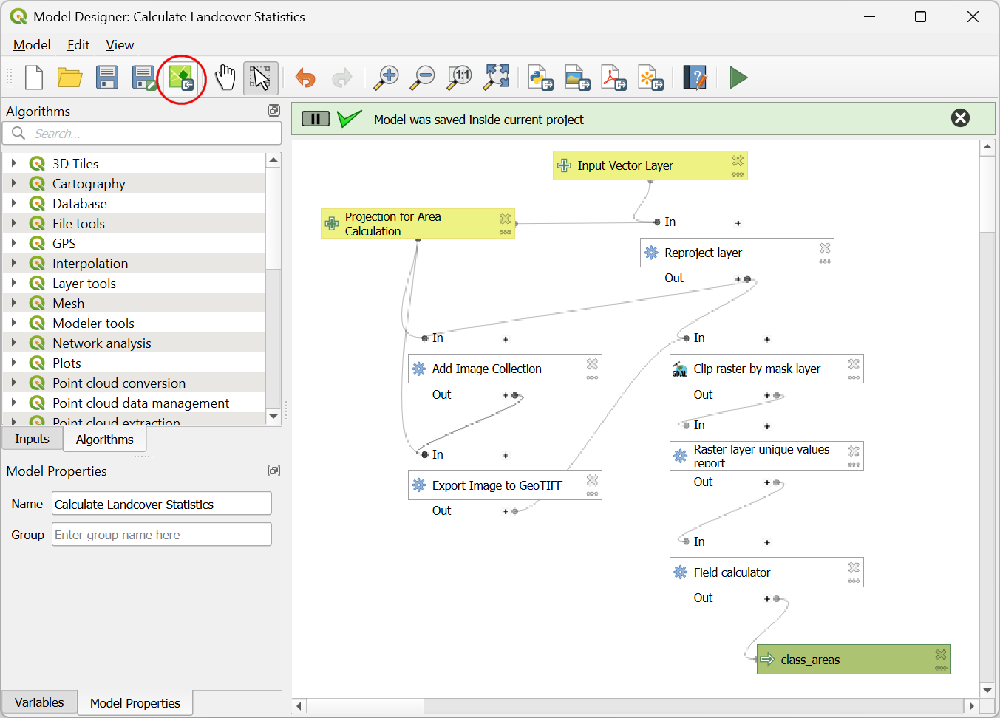
```

22. From the main QGIS interface, you will now see a new folder *Project models* in the Processing Toolbox containing the model we created. 

```{r echo=FALSE, fig.align='center', out.width='75%'}
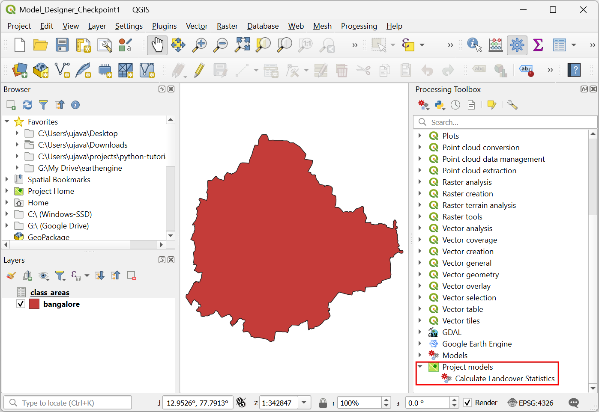
```

If you'd like to catch up to this point, you can load the `Model_Designer_Checkpoint1.qgz` file in the `solutions` folder of the data package.

### 2.2 Validation and Organization

At this point, the model works and generates the landcover statistics for any input region in the world. Let's learn how to get the model production ready by adding some validation checks and adding visual cues to make model maintenance easy.

1. The model is saved in the Processing Toolbox in the *Project models* folder. Select the *Calculate Landcover Statistics* model, right-click and select *Edit Model...*.

```{r echo=FALSE, fig.align='center', out.width='75%'}
knitr::include_graphics('images/qgis_gee_workshop/validation1.png')
```

2. Our input vector layer is expected to have only a single polygon in it. The model does not work with vector layers containing more than 1 polygon. To ensure the supplied layer meets this criteria, we will add a check and raise an error if the feature count of the layer is more than 1. Locate the *Modeler tools &rarr; Calculate expression* algorithm and drag it to the canvas.

```{r echo=FALSE, fig.align='center', out.width='75%'}
knitr::include_graphics('images/qgis_gee_workshop/validation2.png')
```

3. In the *Modeler tools - Calculate expression* dialog, click the *Expression* button.

```{r echo=FALSE, fig.align='center', out.width='75%'}
knitr::include_graphics('images/qgis_gee_workshop/validation3.png')
```

4. We will use the expression function `layer_property()` to get a count of features for the input layer. Enter the expression as shown below and click *OK*..

```
layer_property(@input_vector_layer, 'feature_count')
```

```{r echo=FALSE, fig.align='center', out.width='75%'}
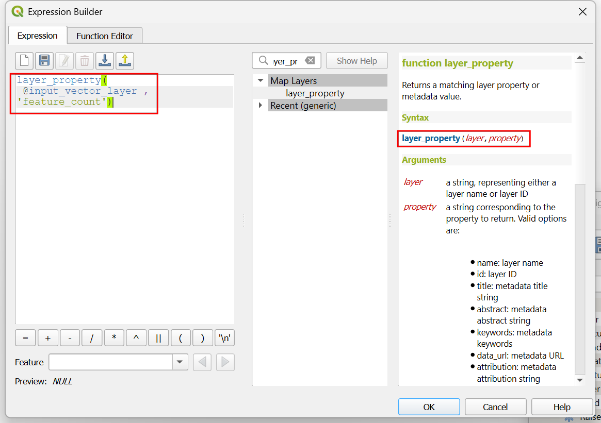
```

5. Next locate the *Modeler tools &rarr; Raise exception* algorithm and drag it to the canvas.

```{r echo=FALSE, fig.align='center', out.width='75%'}
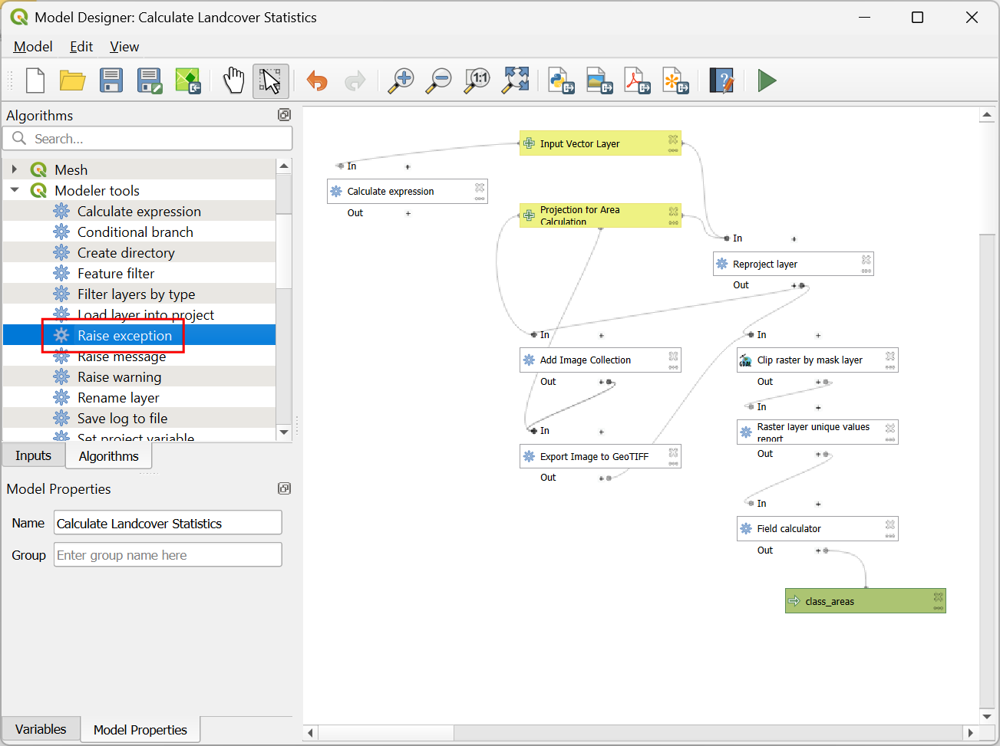
```

6. In the **Modeler tools - Raise exception* dialog, enter `The Input Layer has more than 1 feature` as the *Error message*. For the *Condition*, switch to *Pre-calculated Value*, enter the following expression. This configuration will throw an error when the number of features is greater than 1.

```
 @Calculate_expression_OUTPUT > 1
```

```{r echo=FALSE, fig.align='center', out.width='75%'}
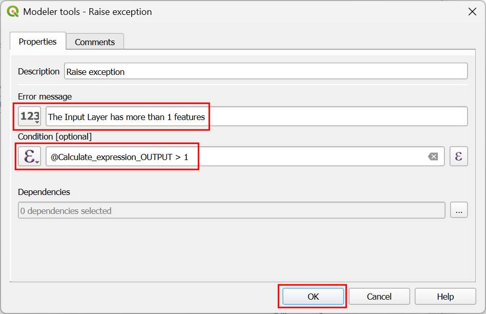
```


7. We want the input validation to happen before any of the processing steps. So we add the validation as a dependency to the first step of the workflow. Click the box for *Reproject layer*.

```{r echo=FALSE, fig.align='center', out.width='75%'}
knitr::include_graphics('images/qgis_gee_workshop/validation7.png')
```

8. In the *Vector general - Reproject layer* dialog, scroll down to the bottom and click the *...* button for *Dependencies*. 

```{r echo=FALSE, fig.align='center', out.width='75%'}
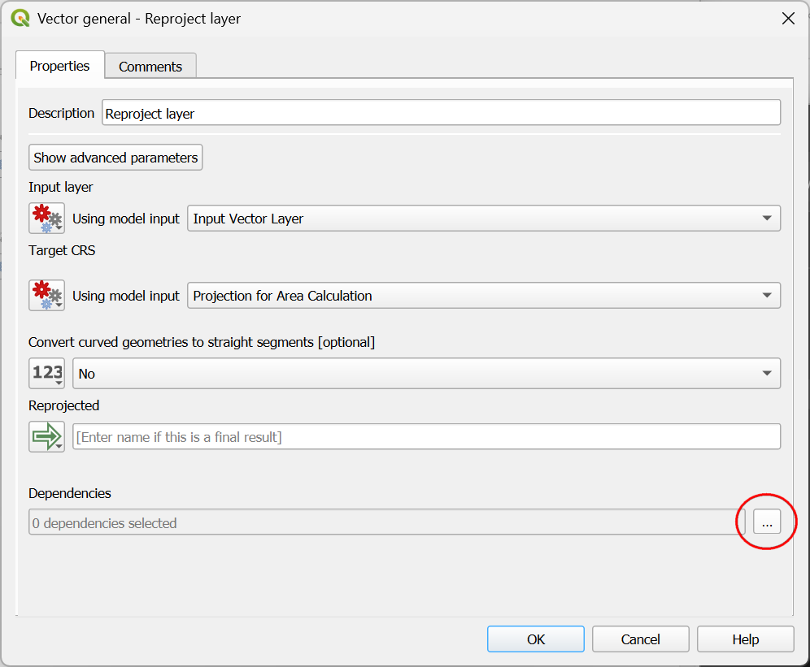
```

9. Select both `Calculate expression` and `Raise exception` algorithms and click *OK*. This will ensure these algorithms are completed before this step.

```{r echo=FALSE, fig.align='center', out.width='75%'}
knitr::include_graphics('images/qgis_gee_workshop/validation9.png')
```

10. Test the model by selecting any data layer having more than 1 polygon and you will see the exception raise by the model.

```{r echo=FALSE, fig.align='center', out.width='75%'}
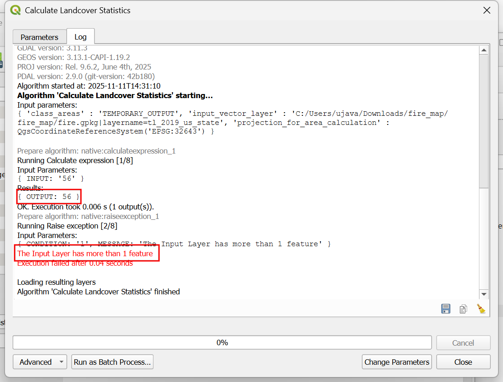
```

11. It is a good practice to add some documentation to the model and add visual cues to help maintainers understand the workflow better. Let's add a group box to group and label certain steps of the workflow. Go to *Edit &rarr; Add Group Box*.

```{r echo=FALSE, fig.align='center', out.width='75%'}
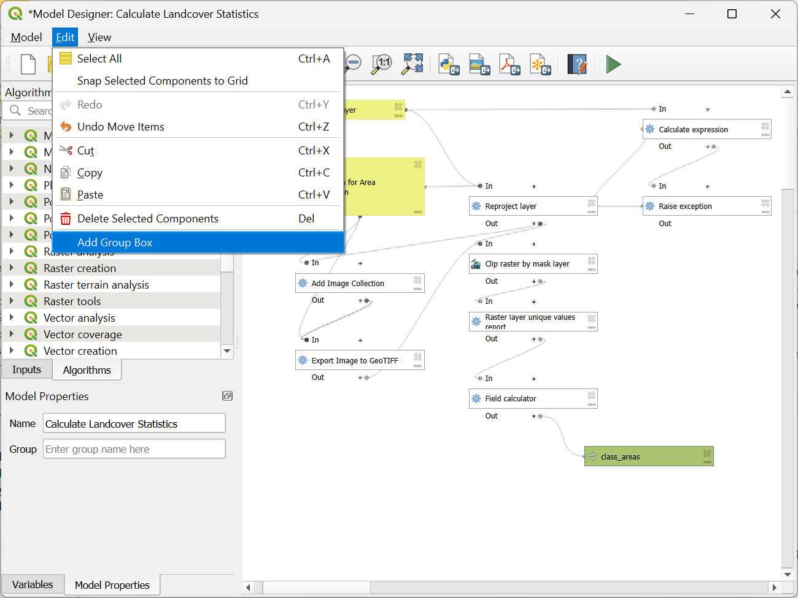
```

12. Click on the canvas to add a group box. Align it over the steps related to Google Earth Engine. Double-click the box and enter the *Title* as `Earth Engine` and select a color of your choice.

```{r echo=FALSE, fig.align='center', out.width='75%'}
knitr::include_graphics('images/qgis_gee_workshop/validation12.png')
```

13. Similarly add group boxes for the steps related to QGIS processing and input validation.

```{r echo=FALSE, fig.align='center', out.width='75%'}
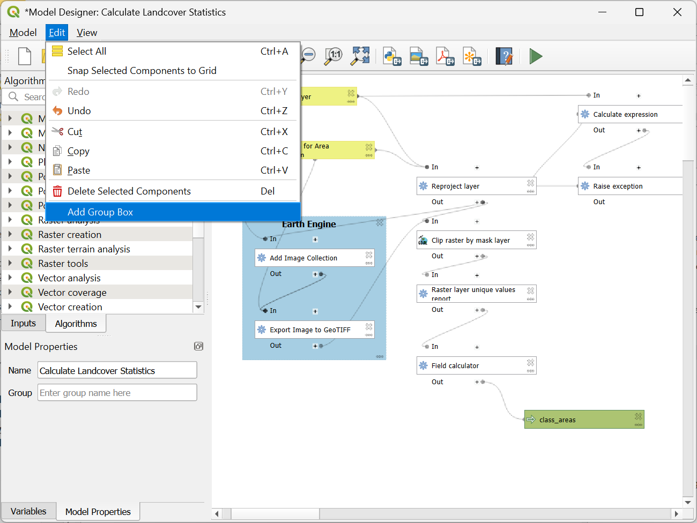
```

14. Now the model is complete. Save it in the QGIS project.

```{r echo=FALSE, fig.align='center', out.width='75%'}
knitr::include_graphics('images/qgis_gee_workshop/validation14.png')
```

If you'd like to catch up to this point, you can load the `Model_Designer_Checkpoint2.qgz` file in the `solutions` folder of the data package.

## 3. Visualizing Data from Earth Engine

The Google Earth Engine plugin allows you to access Earth Engine datasets programmatically within QGIS using the Python Console. You can filter and pre-process the datasets using the Earth Engine Python API and then visualize the results as a WMS layer in QGIS. This enables you to quickly iterate and create visualizations without exporting large amounts of data from Earth Engine.

In this section, we will use the [NEX-GDDP-CMIP6: NASA Earth Exchange Global Daily Downscaled Climate Projections](https://developers.google.com/earth-engine/datasets/catalog/NASA_GDDP-CMIP6) dataset and use the GEE Python API to create a Map layer of mean maximum daily temperature for a chosen year under a chosen model and scenario. We will then load and visualize this layer in QGIS on a globe.

```{r echo=FALSE, fig.align='center', out.width='75%'}
knitr::include_graphics('images/qgis_gee_workshop/visualization_globe.png')
```

1. Open the QGIS Python Consolve from *Plugins → Python Console*.

```{r echo=FALSE, fig.align='center', out.width='75%'}
knitr::include_graphics('images/qgis_gee_workshop/visualization1.png')
```

2. The Python Console allows you to write, edit and run Python scripts in QGIS. Click the *Show Editor* button to open the *Editor* panel.

```{r echo=FALSE, fig.align='center', out.width='75%'}
knitr::include_graphics('images/qgis_gee_workshop/visualization2.png')
```

3. Once the Google Earth Engine plugin has been installed, you are able to access the EE Python API by importing the `ee` module in the Python Console. The plugin also adds functions from the `Map` module to load EE data layers in QGIS canvas. Copy/paste the following block of code in the editor and click the *Run Script* button. If the script runs without any errors - it means the plugin has been installed and configured correctly. If you get any errors, re-install and configure the Google Earth Engine plugin.

```{r echo=FALSE, fig.align='center', out.width='75%'}
knitr::include_graphics('images/qgis_gee_workshop/visualization3.png')
```

```{python eval=FALSE}
import ee
from ee_plugin import Map
```

4. We can now write code to access the `NASA/GDDP-CMIP6` ImageCollection, apply a filter to select the images for the chosen band, year, model and scenario, convert the units from Kelvin to Celcius and calculate the mean annual values. All of this processing is done on the Earth Engine servers. Once we are ready to visualize the results, we use the `Map.addLayer()` function to add the results to QGIS. Copy/paste the code below into your Python Console Code Editor and click *Run Script*. A new layer `tasmax_2030_ACCESS-CM2_ssp245` will be added to the *Layers* panel. This is a WMS layer that is streaming tiles from the Earth Engine servers. 

```{r echo=FALSE, fig.align='center', out.width='75%'}
knitr::include_graphics('images/qgis_gee_workshop/visualization4.png')
```

```{python eval=FALSE}
import ee
from ee_plugin import Map

# Use the CMIP6 Climate Projections Dataset
cmip6 = ee.ImageCollection(`'NASA/GDDP-CMIP6'`)

# Select a model and a scenario

model = 'ACCESS-CM2'
scenario = 'ssp245'

# Select the band
# Here we are using maximum air temperature
band = 'tasmax'

# Select the year
year = 2030
startDate = ee.Date.fromYMD(year, 1, 1)
endDate = startDate.advance(1, 'year')

filtered = cmip6 \
.filter(ee.Filter.date(startDate, endDate)) \
.filter(ee.Filter.eq('model', model)) \
.filter(ee.Filter.eq('scenario', scenario)) \
.select(band)

# Temperature values are in Kelvin
# convert to Celcius

def scaleValues(image):
return image \
    .subtract(273.15) \
    .copyProperties(image,
    ['system:time_start', 'model', 'scenario'])

scaled = filtered.map(scaleValues)

# Calculate average daily maximum temperature
mean = scaled.mean()

tempVis = {
'min': 10,
'max': 40,
'palette': ['blue', 'purple', 'cyan', 'green', 'yellow', 'red'],
}

layer_name = f'{band}_{year}_{model}_{scenario}'
Map.addLayer(mean, tempVis, layer_name)
```

5. A global layer like this is best visualized on a globe. We will use another QGIS plugin named **Globe Builder** to create a custom orthographic projection for rendering this layer. You can close the *Python Console* and go to *Plugins → Manage and Install Plugins*, switch to the *All* tab and search for the *Globe Builder* plugin. Click *Install Plugin*.

```{r echo=FALSE, fig.align='center', out.width='75%'}
knitr::include_graphics('images/qgis_gee_workshop/visualization5.png')
```

6. Once the plugin is installed, launch it from *Plugins → Globe Builder → Build Globe view*. 

```{r echo=FALSE, fig.align='center', out.width='75%'}
knitr::include_graphics('images/qgis_gee_workshop/visualization6.png')
```

7. In the *Globe Builder* panel, you have an option to opverlay various global data layers and/or graticule layers. For this tutorial, we don't need them, so uncheck all the data sources. Select `Azimuthal Orthographic` as the *Projection*.

```{r echo=FALSE, fig.align='center', out.width='75%'}
knitr::include_graphics('images/qgis_gee_workshop/visualization7.png')
```

8. Scroll down and in the *Center the Globe based on:* section, choose the *Coordinates* option. Enter coordinates `0, 30`. This will create a cutom orthographic projection centered at these coordinates.

```{r echo=FALSE, fig.align='center', out.width='75%'}
knitr::include_graphics('images/qgis_gee_workshop/visualization8.png')
```

9. Lastly, under the *Visualization* section, choose `White` as the *Background* color. Once done, click the *Add the Globe to a Map* button.

```{r echo=FALSE, fig.align='center', out.width='75%'}
knitr::include_graphics('images/qgis_gee_workshop/visualization9.png')
```

10. The plugin will set the *Project CRS* to a custom projection based on your configuration. The Earth Engine layer will request new tiles from the server in this projection and they will be rendered as a globe.

```{r echo=FALSE, fig.align='center', out.width='75%'}
knitr::include_graphics('images/qgis_gee_workshop/visualization10.png')
```


# Data Credits

* Sentinel-2 Level-2A: Contains Copernicus Sentinel data.
* Zanaga, D., Van De Kerchove, R., Daems, D., De Keersmaecker, W., Brockmann, C., Kirches, G., Wevers, J., Cartus, O., Santoro, M., Fritz, S., Lesiv, M., Herold, M., Tsendbazar, N.E., Xu, P., Ramoino, F., Arino, O., 2022. ESA WorldCover 10 m 2021 v200. (doi:10.5281/zenodo.7254221)
* NEX-GDDP-CMIP6: NASA Earth Exchange Global Daily Downscaled Climate Projections: Thrasher, B., Maurer, E. P., McKellar, C., & Duffy, P. B., 2012: Technical Note: Bias correcting climate model simulated daily temperature extremes with quantile mapping. Hydrology and Earth System Sciences, 16(9), 3309-3314. doi:10.5194/hess-16-3309-2012

# License

This workshop material is licensed under a [Creative Commons Attribution 4.0 International (CC BY 4.0)](https://creativecommons.org/licenses/by/4.0/). You are free to re-use and adapt the material but are required to give appropriate credit to the original author as below:

*Cloud-based Remote Sensing with QGIS and Google Earth Engine* by Ujaval Gandhi [www.spatialthoughts.com](https://spatialthoughts.com)


&copy; 2025 Spatial Thoughts [www.spatialthoughts.com](https://spatialthoughts.com)