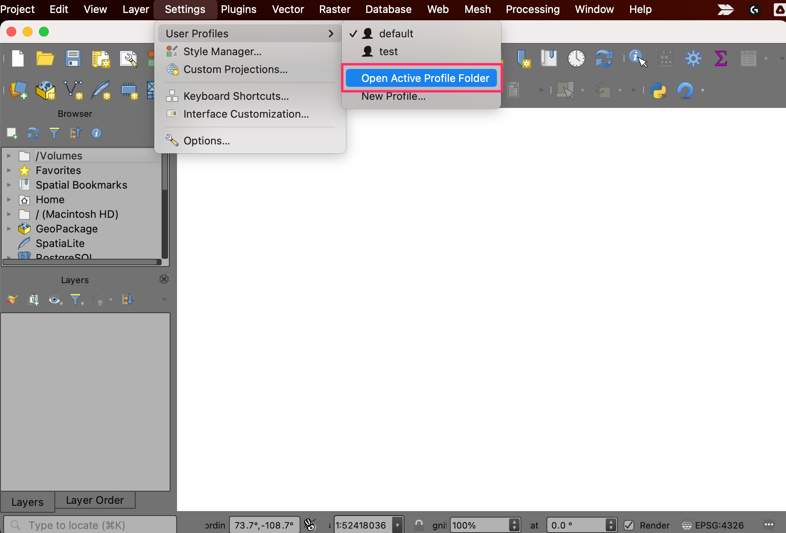
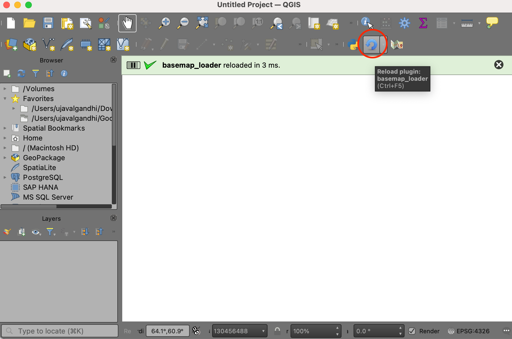
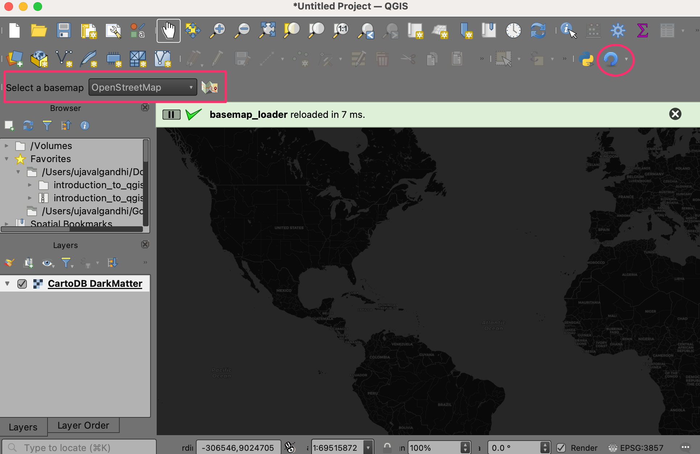

\newpage

***

```{r echo=FALSE, fig.align='center', out.width='75%', out.width='250pt'}
knitr::include_graphics('images/spatial_thoughts_logo.png')
```

***

\newpage

# Introduction 

This workshop is designed to help you take your first steps in building QGIS plugins. We will understand the QGIS plugin architecture and see how you can package your code and distribute it as a plugin. 

[{width="400px"}](https://docs.google.com/presentation/d/1NKTXASOgu8GFTWKkQpPbGDVRwDcyzRSdVwCg0772dTI/edit?usp=sharing){target="_blank"}

[View the Presentation &#8599;](https://docs.google.com/presentation/d/1NKTXASOgu8GFTWKkQpPbGDVRwDcyzRSdVwCg0772dTI/edit?usp=sharing){target="_blank"}

# Installation and Setting up the Environment

## Install QGIS

This workshop requires QGIS LTR version 3.34. Please review [QGIS-LTR Installation Guide](install-qgis-ltr.html) for step-by-step instructions.

## Get a Text Editor

Any kind of software development requires a good text editor. If you already have a favorite text editor or an IDE (Integrated Development Environment), you may use it for this workshop. Otherwise, each platform offers a wide variety of free or paid options for text editors. Choose the one that fits your needs.

Below are my recommendations editors that are simple to use for beginners.

- Windows: [Notepad++](https://notepad-plus-plus.org/downloads/) is a good free editor for windows. Download and install the Notepad++ editor. Tip: Before writing Python code in Notepad+++, make sure to go to Settings &rarr; Preferences &rarr; Language and enable `Replace by space`. Python is very sensitive about whitespace and this setting will ensure tabs and spaces are treated properly.
- Mac: [TextMate](https://macromates.com/) is an open-source editor for Mac that is currently available for free.


# Building a Plugin

The workshop will teach you how to build a plugin named **Basemap Loader** that adds a toolbar to QGIS allowing you to pick and easily load your favorite basemaps.

```{r echo=FALSE, fig.align='center', out.width='75%', fig.cap='The Basemap Loader Plugin'}
knitr::include_graphics('images/qgis_plugin_workshop/basemap_loader.gif')
```


## 1. Create a Minimal Plugin

We will now build a simple plugin named **Basemap Loader** that adds a button in the *Plugin Toolbar* that loads a basemap from OpenStreetMap to the current project. To understand the required structure, let's see what a minimal plugin looks like. You can learn more about this structure at [QGIS Minimalist Plugin Skeleton](https://github.com/wonder-sk/qgis-minimal-plugin).


1. The first requirement for plugins is a file called `metadata.txt`. This file contains general info, version, name and some other metadata used by plugins website and plugin manager. 

`metadata.txt`
```{python eval=FALSE, code=readLines('code/qgis_plugin_workshop/basemap_loader_minimal/metadata.txt')}
```

2. Second is the file that contains the main logic of the plugin. It must have `__init__()` method that gives the plugin access to the QGIS Interface (iface). The `initGui()` method is called when the plugin is loaded and `unload()` method which is called when the plugin is unloaded. For now, we are creating a minimal plugin that just add a button and a menu entry that displays message when clicked.

`main.py`
```{python eval=FALSE, code=readLines('code/qgis_plugin_workshop/basemap_loader_minimal/main.py')}
```

3. Third file is called `__init__.py` which is the starting point of the plugin. It imports the plugin class created in the second file and creates an instance of it.

`__init__.py`
```{python eval=FALSE, code=readLines('code/qgis_plugin_workshop/basemap_loader_minimal/__init__.py')}
```

4. Create these 3 files and put them in a folder named `basemap_loader`. Download the [logo.png](https://courses.spatialthoughts.com/images/qgis_plugin_workshop/logo.png) file and copy to this folder. 

```{r echo=FALSE, fig.align='center', out.width='75%'}
knitr::include_graphics('images/qgis_plugin_workshop/pluginbasemapfiles.png')
```

5. Next we need to copy the folder to the appropriate directory so QGIS loads it at startup. Open your profile folder by going to **Settings &rarr; User Profiles &rarr; Open Active Profile Folder**

```{r echo=FALSE, fig.align='center', out.width='75%'}

```

6. Locate the python plugins directory at `{profile folder}/python/plugins`. Copy the entire folder to this directory.

```{r echo=FALSE, fig.align='center', out.width='75%'}
knitr::include_graphics('images/qgis_plugin_workshop/active_profile_folder2.png')
```

7. Restart QGIS. Go to  **Plugins &rarr; Manage and Install plugins... &rarr; Installed** and enable the **Basemap Loader** plugin.

```{r echo=FALSE, fig.align='center', out.width='75%'}
knitr::include_graphics('images/qgis_plugin_workshop/enable_plugin.png')
```

8. You will the toolbar icon from the plugin. Click on the button and the *Hello from Plugin* message is displayed. 

```{r echo=FALSE, fig.align='center', out.width='75%'}
knitr::include_graphics('images/qgis_plugin_workshop/pluginbasemaphello.png')
```

## 2. Add Core Functionality

Now let's build on the basic plugin structure and add the functionality to load a XYZ Tile Layer when the button is clicked. We will be using the [OpenStreetMap Standard](https://wiki.openstreetmap.org/wiki/Raster_tile_providers#Base_maps) XYZ layer. The PyQGIS code to load a XYZ tile layer is adapted from the [PyQGIS Cookbook](https://docs.qgis.org/3.34/en/docs/pyqgis_developer_cookbook/cheat_sheet.html). 

1. Modify the `main.py` file with the content from below.

`main.py`
```{python eval=FALSE, code=readLines('code/qgis_plugin_workshop/basemap_loader_complete/main.py')}
```

2. To see the result of our changes, we must restart QGIS. This can be quite tedious while developing plugins, so there is a handy plugin named **Plugin Reloader** that can reload a selected plugin without having to restart QGIS. Go to  **Plugins &rarr; Manage and Install plugins... &rarr; All** and search for the plugin named **Plugin Reloader**. Click *Install Plugin*. Once the plugin is installed, locate the *Configure* button from the *Plugin Toolbar* and select the **Basemap Loader** plugin. Click *Reload* to reload the plugin.

```{r echo=FALSE, fig.align='center', out.width='75%'}

```

3. Once reloaded, click the *Load Basemap* button from the toolbar and you will see the basemap layer loaded in QGIS.

```{r echo=FALSE, fig.align='center', out.width='75%'}
knitr::include_graphics('images/qgis_plugin_workshop/pluginbasemapcomplete.png')
```

## 3. Add User Interface

We will now add some user-interface widget to the plugin. Instead of a button that loads a single basemap, we can build a toolbar that has a drop-down menu of many options that the user can pick from and load the basemap.

For a comprehensive list of basemap tile-services and their URLs, you can see the [Contextily Providers](https://contextily.readthedocs.io/en/latest/providers_deepdive.html) page.

1. Modify the `main.py` file with the content from below.

`main.py`
```{python eval=FALSE, code=readLines('code/qgis_plugin_workshop/basemap_loader_ui/main.py')}
```

2. Reload the plugin to see the toolbar.

```{r echo=FALSE, fig.align='center', out.width='75%'}

```

## 4. Package and Share Your Plugin

1. The easiest way to share your plugin with other users is by creating a ZIP file. Right-click the plugin directory and create a zip file.

```{r echo=FALSE, fig.align='center', out.width='75%'}
knitr::include_graphics('images/qgis_plugin_workshop/compress.png')
```

2. You can send the resulting `basemap_loader.zip` file to other users. You may also host this file and share the link with other users. For example, the final plugin can be downloaded from this link &rarr; [basemap_loader.zip](https://drive.google.com/uc?export=download&id=1_0liBiBP18x4y2CVNswtkt_lK0e-qiCu). Once downloaded, the plugin can be installed from **Plugins &rarr; Manage and Install plugins... &rarr; Install from ZIP**. Click *Install Plugin* to install the plugin.

> You will get a warning *Installing a plugin from an untrusted source can harm the computer. Only continue if you received the plugin from a source you trust. Continue?*. Click *Yes* to continue the installation.

```{r echo=FALSE, fig.align='center', out.width='75%'}
knitr::include_graphics('images/qgis_plugin_workshop/install.png')
```

3. Switch to to  *Installed* table and enable the **Basemap Loader** plugin.

```{r echo=FALSE, fig.align='center', out.width='75%'}
knitr::include_graphics('images/qgis_plugin_workshop/enable_plugin.png')
```

# What next?

If you enjoyed this workshop, check out our full course [PyQGIS Masterclass](pyqgis-masterclass.html) which covers the entire PyQGIS API in a structured manner.

# License

This workshop material is licensed under a [Creative Commons Attribution 4.0 International (CC BY 4.0)](https://creativecommons.org/licenses/by/4.0/). You are free to re-use and adapt the material but are required to give appropriate credit to the original author as below:

*Building Your First QGIS Plugin Workshop* by Ujaval Gandhi [www.spatialthoughts.com](https://spatialthoughts.com)


&copy; 2024 Spatial Thoughts [www.spatialthoughts.com](https://spatialthoughts.com)