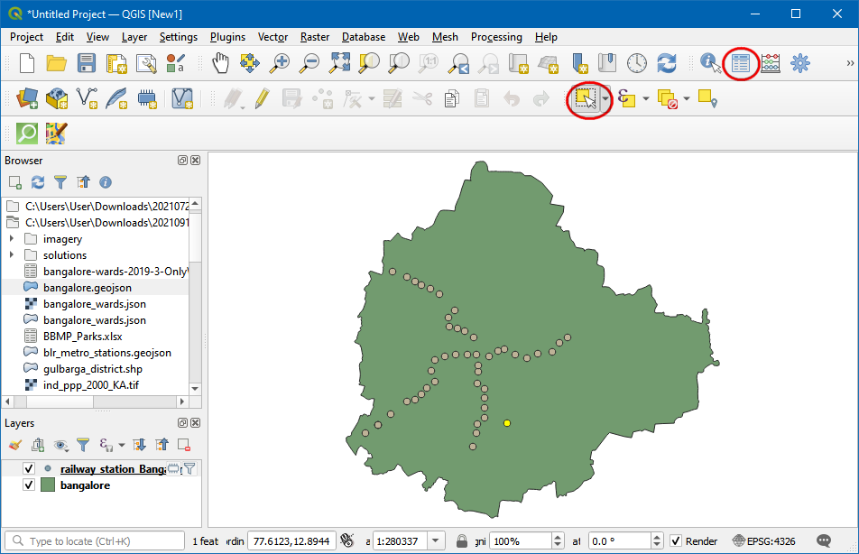
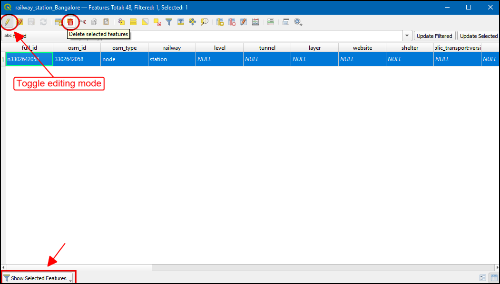
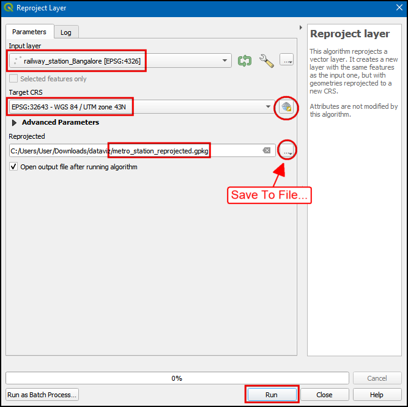
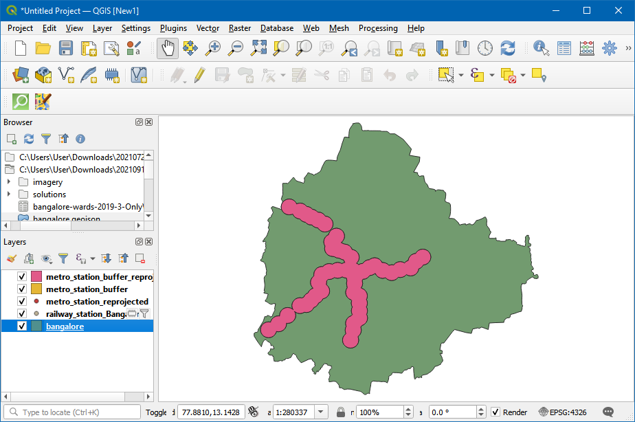
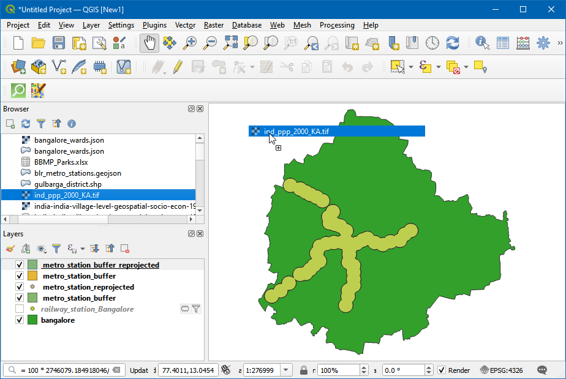
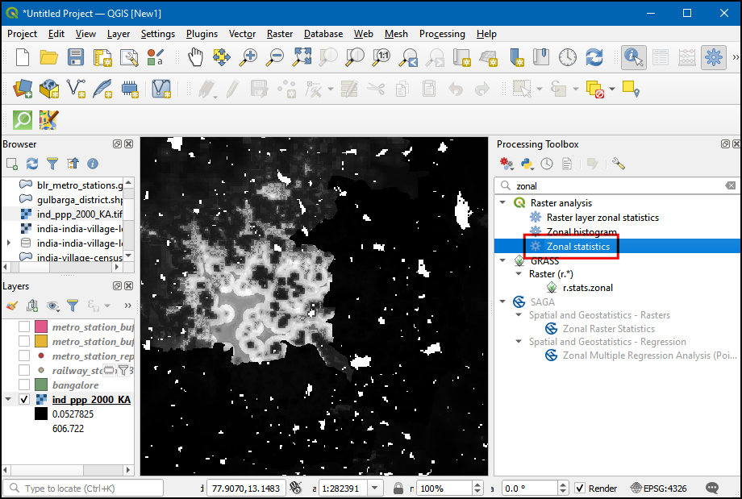

\newpage

***

```{r echo=FALSE, fig.align='center', out.width='250pt'}
knitr::include_graphics('images/spatial_thoughts_logo.png')
```

***

# Introduction 

This class is a broad introduction to working with location datasets. We will cover a wide range of use-cases and applications that give you hands-on experience in techniques for visualizing mapping data and deriving insights from them. This class assumes no prior knowledge of GIS/Remote Sensing and suitable for practitioners of all disciplines. We will use the open-source program [QGIS](https://qgis.org/en/site/) for all the exercises, so this class also serves as an introductory course to learn QGIS.

[{width="400px"}](https://docs.google.com/presentation/d/1fTS69fafSHUxYdIB3Y8PI-T00G7Xc_wvlFexViVrvqI/edit?usp=sharing){target="_blank"}

[View the Presentation](https://docs.google.com/presentation/d/1fTS69fafSHUxYdIB3Y8PI-T00G7Xc_wvlFexViVrvqI/edit?usp=sharing){target="_blank"}

# Software

This course requires QGIS LTR version 3.16. Please review [QGIS-LTR Installation Guide](install-qgis-ltr.html) for step-by-step instructions.


# Get the Data Package

The exercises in this class use a variety of datasets. All the required layers, project files etc. are supplied to you in the file ``spatial_data_viz.zip``. Unzip this file to the `Downloads` directory.

*Not enrolled in our instructor-led class but want to work through the material on your own?* [Get free access to the data package](https://docs.google.com/forms/d/e/1FAIpQLSdwB5I9PdheF8V4yOSeoGSkmEdBZoe4R9CyFQVzlFH-pTl6FQ/viewform){target="_blank"}

# Complete the Class Pre-Work

This class needs about 1-hour of pre-work. Before starting the exercises, it is important to understand how spatial data is modeled and learn about coordinate reference systems.

## A Practical Introduction to GIS Video

Please watch the following video to get a good understanding of GIS concepts. Video can be streamed using video link below.

[{width="400px"}](https://www.youtube.com/watch?v=yfLjnK569XY){target="_blank"}

- [Watch the Video](https://www.youtube.com/watch?v=yfLjnK569XY){target="_blank"}
- [View the Presentation](https://docs.google.com/presentation/d/1tYNHx767FaoineBAYaBmRbOVVmv6RpRLGsgCyJK9w3Y/edit?usp=sharing){target="_blank"}

## Take the Quiz

After you watch the video, please complete the following quiz to test your understanding. Quiz is open to everyone.

*  [GIS Concepts Quiz](https://forms.gle/p79Ssyte91NHZtkp6){target="_blank"}

# Understanding Spatial Data

## Why do we care about location?

> "Everything is related to everything else, but near things are more related than distant things." - Waldo Tobler's [First Law of Geography](https://en.wikipedia.org/wiki/Tobler%27s_first_law_of_geography)

When modeling and analyzing our world, location is a critical factor. A non-spatial model cannot accurately reflect the processes and interactions happening in our world. Take this example - [predicting housing prices](https://medium.com/geoai/using-forest-based-classification-regression-to-model-and-estimate-house-values-5a0e26682c42) - where a spatial prediction model performed much better than a purely non-spatial one. 

## Location data is everywhere

Today the availability of location data - both for individuals and businesses - has exploded. Spatial data adds another dimension to data, and reveals patterns that are otherwise not obvious. 

Individuals - with GPS sensors on their smartphones - have the ability to tag their data with location. Photos taken with smartphones have the location embedded in it. If opted-in, one can store and access their location history on an ongoing basis.

Most businesses have location data in one form or the other. Customer addresses, IP-locations of website visitors, sales territories, supply chain routes and so on. For other businesses - such as taxi aggregators, food delivery, logistics - generate huge amounts of location data that can be mined for intelligence. 

IoT (Internet-Of-Things) devices are collecting location data continuously alongside with sensor data.

Governments are also increasing collecting and sharing location based data. Data relating to urban infrastructure, census, LIDAR and aerial imagery etc. are being collected at massive scale. Many governments have implemented open data sharing policies - making this data available to individuals and businesses to use.


## Spatial Data Model

The spatial data model consists of 2 parts: **geometry** + **properties**

*Geometry* (Shape) is defined with coordinates and a coordinate reference system
*Properties* (Attributes) is defined with data and data types

Consider the following representation of a city as a point.

```
 {
      "type": "Feature",
      "geometry": {
        "type": "Point",
        "coordinates": [ 77.58270263671875, 12.963074139604124]
      },
      "properties": {
        "id": 1,
        "name": "Bengaluru"
      }
  }
```

This representation is in [GeoJson](https://geojson.org/) format. The point geometry is defined with X (Longitude) and Y (Latitude) coordinates. The point is assigned 2 properties - *id* with a value of ``1``, and *name* with the value of ``Bengaluru``. The GeoJson format supports only 1 type of Coordinate Reference System (WGS84), so we do not need to specify it explicitly.

## Spatial Data Formats

We saw a basic way to represent the spatial data. But there is a variety of data formats to represent the data to suit different applications. In most cases, spatial data formats are an extension of existing data formats.

|   **Type**       |**Non-Spatial Data**        | **Spatial Data**     |
|:-----------------|:---------------------------|:---------------------|
| Text             | csv, json, xml             | csv, geojson, gml, kml |
| Binary/Compressed| pdf, xls, zip              | shapefile, geopdf, geopackage |
| Images           | tiff, jpg, png             | geotiff, jpeg2000    | 
| Databases        | SQLite, PostgreSQL, Oracle | Spatialite, PostGIS, Oracle Spatial |

## Spatial Data Types

Spatial Data can be broadly categorized into 2 types - Vector and Raster. For serving these data on the web, they are usually cut into smaller chunks (tiles), so they can be categorized as the 3rd type.


|   **Type**     |**Sub Types**       |**Examples**                            |
|:---------------|:-------------------|:---------------------------------------|
| Vector         | Point              | *Sensor Observations, Places*          |
|                | Line               | *GPS Tracks, Roads, Rivers, Contours*  |
|                | Polygons           | *Administrative Boundaries, Buildings* |
|                | Point Cloud        | *LIDAR surveys*                        |
| Raster         | Photos             | *Aerial and Drone Photos*              | 
|                | Grids              | *Satellite Imagery, Elevation Data*    |
|                | Mesh               | *Climate and Scientific Data*           | 
| Tiles          | Raster Tile Layers | *Web Maps*                             | 
|                | Vector Tile Layers | *Web Maps*                             |

## Map Projections and Coordinate Reference Systems

If there was one thing that makes spatial data 'special' - it would have to be Coordinate Reference System (CRS) or Spatial Reference System (SRS).

A *Map Projection* transforms the earth from its spherical shape (3D) to a planar shape (2D).

A *Coordinate Reference System (CRS)* then defines how the 2D map relates to real places on the earth.

The [QGIS Documentation](https://docs.qgis.org/testing/en/docs/gentle_gis_introduction/coordinate_reference_systems.html) provides a comprehensive introduction to the topic. 

There are hundreds of different map projection and CRS - each with different properties and uses. The most important thing to remember is that every projection distorts the map in some way. This [mashup of map projections distortions](https://bl.ocks.org/syntagmatic/ba569633d51ebec6ec6e) provide a useful visual reference to population projection. For a more in-depth guide, you can refer to Jochen Albrecht's guide to [choosing a projection](http://www.geo.hunter.cuny.edu/~jochen/gtech201/lectures/lec6concepts/map%20coordinate%20systems/how%20to%20choose%20a%20projection.htm). A [recent papaer](https://onlinelibrary.wiley.com/doi/full/10.1111/tgis.12636) shows the impact of projection choice for area and volume calculations. 

So what projection should you use for your project? This being a vast and complex topic, often, the answer is - it depends. But following are guidelines that will help you.

* **Global Maps**: If you are producing global maps, the preferred and modern choice is the [Equal Earth](http://equal-earth.com/) projection. Added advantage of this projection is that it preserves areas, so it is also a good choice for global scale analysis that require equal-area grids.It is much more visually appealing that other alternatives like the [Gall-Peters projection](https://en.wikipedia.org/wiki/Gall%E2%80%93Peters_projection). Newer versions of QGIS has built-in support for various Equal Earth CRSs. If you are using an earlier version, you will need to define a [Custom CRS](https://docs.qgis.org/testing/en/docs/user_manual/working_with_projections/working_with_projections.html#custom-coordinate-reference-system) with the following proj string

```
+proj=eqearth +datum=WGS84 +wktext
```

```{r echo=FALSE, fig.align='center', out.width='75%', fig.cap='The Equal Earth Projection'}
knitr::include_graphics('images/spatial_data_viz/equal-earth.jpg')
```

* **Country Maps**: Most countries have adopted a specific CRS designed to minimize distortions over the region. You should consult the country's national mapping agency (USGS, Ordnance Survey, Survey of India etc.) for guidance. For India, the National Spatial Framework (NSF) recommends using the CRS EPSG: 7755 for country-level mapping - which is based on Lambert Conformal Conic (LCC) projection.

```{r echo=FALSE, fig.align='center', out.width='75%', fig.cap='India Political Map by Survey of India'}
knitr::include_graphics('images/spatial_data_viz/india_map.jpg')
```

* **Local and Regional Maps**: Similar to country-level CRSs, most countries have a state/province level CRSs. In absence of them, the Universal Transverse Mercator (UTM) provides a good overall system that can be used in any part of the world. The distortions within each zone is minimized, and if the area of interest is contained within the zone - it is a good choice for analysis as well as mapping. [Here's a map](http://www.dmap.co.uk/utmworld.htm) showing all the UTM zones of the world. For India, UTM Zones 42N, 43N, 44N, 45N, 46N and 47N are used depending on the where your area of interest is located.

```{r echo=FALSE, fig.align='center', out.width='75%', fig.cap='UTM Zones of the world'}
knitr::include_graphics('images/spatial_data_viz/utm_zones.png')
```

\newpage


# Introduction to QGIS

[QGIS](https://qgis.org/) is a free and open-source software for creating, editing, visualizing, analyzing and publishing geospatial data. QGIS is available for Windows, Mac and Linux. This class uses QGIS for the exercises.

Visit the [download page](https://qgis.org/en/site/forusers/download.html) to download and install the latest LTR (Long Term Release) stable version.

## Plugins

QGIS offers an easy way for developers to extend the core functionality of the software using plugins. Plugins can be installed from QGIS from **Plugins &rarr; Manage and Install Plugins..**. To install a plugin, switch to the *All* tab and search for the plugin. Once you find it, select and click *Install Plugin*.

```{r echo=FALSE, fig.align='center', out.width='75%'}
knitr::include_graphics('images/spatial_data_viz/plugins.png')
```

For this class, we will be using the following plugins. Go ahead and install them.

* QuickMapServices
* QuickOSM

\newpage

# Visualization

## Points

The simplest representation of spatial data can be done using a table. A place can be represented using a pair of coordinates - Latitude and Longitude - with other attribute information about the place. Many spatial data source come in this form. Excel sheets, CSV files, database tables etc.

### Exercise: Mapping Air Quality

Worsening air quality is a severe problem in many countries around the world. India - particularly - Delhi suffers from [acute problems of high pollution levels](https://ig.ft.com/india-pollution/).One of the first steps to better understand the problem, is to have continuous monitoring of air quality across the cities. Many organizations have stepped up and setup such sensors that collect air quality data and make it publicly available. [OpenAQ](https://openaq.org/) is a platform that collects this data from all public sources and makes it available in an easy to use form.

>> If you are interested in this air quality in India, [Urban Emissions](http://www.urbanemissions.info/) has a lot of relevant information and datasets.

We will take the sensor data for [PM2.5 concentrations](https://blissair.com/what-is-pm-2-5.htm) 1 day and map it. The aim is to turn this tabular data info an informative spatial data visualization. 

For this exercise, we are using daily average data for Delhi, India for February 15, 2020. This data was downloaded from [OpenAQ Data Download](https://openaq.org/#/countries?_k=dmlk2k)


```{r echo=FALSE, fig.align='center', out.width='75%'}
knitr::include_graphics('images/spatial_data_viz/aq0.png')
```

1. Open the ``openaq.csv`` file in a text editor and examine it. Each row of data contains data from 1 monitoring station. The ``latitude`` and ``longitude`` column contain the coordinates of the station and the ``value`` contains the daily average PM2.5 concentration

```{r echo=FALSE, fig.align='center', out.width='75%'}
knitr::include_graphics('images/spatial_data_viz/aq1.png')
```

2. Tabular data in text files fall into the category of **Delimited Text** files, such as this can be imported in QGIS via *Data Source Manager*. Click *Open Data Source Manager* button.

```{r echo=FALSE, fig.align='center', out.width='75%'}
knitr::include_graphics('images/spatial_data_viz/aq2.png')
```

3. Browse to the ``openaq.csv`` file and open it. As we want to import this file as points, select *Point coordinates*. Choose ``longitude`` as *X Field* and ``latitude`` as *Y Field*. Choose ``EPSG 4326 - WGS 84`` in *Geometry CRS*. Click *Add*.

```{r echo=FALSE, fig.align='center', out.width='75%'}
knitr::include_graphics('images/spatial_data_viz/aq3.png')
```

4. You will see the tabular data now loaded in QGIS canvas as a spatial data layer. Use the *Identify* button and click on any of the point. You will see the attribute data that is attached to each point.

```{r echo=FALSE, fig.align='center', out.width='75%'}
knitr::include_graphics('images/spatial_data_viz/aq4.png')
```

5. Through we can see the point distribution is across the city of Delhi, we are missing the context on where is point is located. A base-map layer will help us understand this data better. The **QuickMapServices** plugin gives us ready access to many different types of base-maps.  Go to **Web &rarr; QuickMapServices &rarr; OSM &rarr; OpenStreetMap monochrome** layer.

> Note: If you don't see the OpenStreetMap monochrome, Go to **Web &rarr; QuickMapServices &rarr; Settings**, switch to **More services**, click ``Get Contributed Pack``. Click **Save**. 

```{r echo=FALSE, fig.align='center', out.width='75%'}
knitr::include_graphics('images/spatial_data_viz/aq5.png')
```

6. A new layer will get added to the *Layers* panel and the *Canvas*. Now you can see the points in the context of the city and surroundings. Let's style the point layer better now. Click *Open the Layer Styling Panel*.

```{r echo=FALSE, fig.align='center', out.width='75%'}
knitr::include_graphics('images/spatial_data_viz/aq6.png')
```

7. We will color each point according to the observed PM2.5 value. Choose ``Graduated`` renderer and ``value`` as the *Value* column. Set the number of *Classes* to ``6`` and click *Classify*.

> The default classification mode is *Equal Count* - which is fine for this exercise. You can learn more about Data Classification Modes in the [QGIS Documentation](https://docs.qgis.org/testing/en/docs/user_manual/working_with_vector/vector_properties.html?#graduated-renderer).

```{r echo=FALSE, fig.align='center', out.width='75%'}
knitr::include_graphics('images/spatial_data_viz/aq7.png')
```

For the class ranges to have some meaning, we need to link them to the commonly used scale. India has adopted [National Air Quality Index](https://pib.gov.in/newsite/PrintRelease.aspx?relid=110654) with the following definitions.

```{r echo=FALSE, fig.align='center', out.width='75%'}
knitr::include_graphics('images/spatial_data_viz/aq_naqi.png')
```

8. Let's adjust the class values to match those defined in the National Air Quality Index. We can also change the *Legend* labels to the human-readable category names. You can double-click each class range and edit it. 

> Note: The range boundaries includes the upper bound value but excludes the lower bound value. So if the range is 30-60, the range will include all values >30 and <=60. See the [discussion here](https://github.com/qgis/QGIS/issues/29852) for more info. 

```{r echo=FALSE, fig.align='center', out.width='75%'}
knitr::include_graphics('images/spatial_data_viz/aq8.png')
```

9. As you edit the categories, the map visualization will change accordingly. The layer legend will also show the legend labels now.

```{r echo=FALSE, fig.align='center', out.width='75%'}
knitr::include_graphics('images/spatial_data_viz/aq9.png')
```

10. We can change the color also to match those defined in the index. Select the dropdown next to the color ramp and select the ``RdYlGn`` (Red-Yellow-Green) ramp.

```{r echo=FALSE, fig.align='center', out.width='75%'}
knitr::include_graphics('images/spatial_data_viz/aq10.png')
```

11. We want the ramp to go from Green (low PM2.5 values) to Red (high PM2.5 values) - so click the dropdown again and select *Invert Color Ramp*.

```{r echo=FALSE, fig.align='center', out.width='75%'}
knitr::include_graphics('images/spatial_data_viz/aq11.png')
```

12. We will add labels to the points now. Switch to the *Labels* tab.

```{r echo=FALSE, fig.align='center', out.width='75%'}
knitr::include_graphics('images/spatial_data_viz/aq12.png')
```

13. Choose ``Single labels`` and ``value`` as *Value*. Scroll down and check *Formatted numbers* and change the *Decimal places* to ``0``.

```{r echo=FALSE, fig.align='center', out.width='75%'}
knitr::include_graphics('images/spatial_data_viz/aq13.png')
```

14. Next, switch to the *Background* tab. Check *Draw background* and adjust the *Size X* and *Size Y*. 

```{r echo=FALSE, fig.align='center', out.width='75%'}
knitr::include_graphics('images/spatial_data_viz/aq14.png')
```

15. Scroll down to the *Fill color* section. We want the fill color for each box to match the color of the associated point. Click the *Data defined override* button and choose *Edit*.

```{r echo=FALSE, fig.align='center', out.width='75%'}
knitr::include_graphics('images/spatial_data_viz/aq15.png')
```

16. Double-click the ``@symbol_color`` variable to add it to the expression. Click OK.

```{r echo=FALSE, fig.align='center', out.width='75%'}
knitr::include_graphics('images/spatial_data_viz/aq16.png')
```

17. You will see the map change and the label shields will have the color matching the category based on the values. We will move the labels slightly above so the points are also seen. Switch to the *Placement* tab and select *Offset from point*. Check the *Offset Y* to ``-5``.

```{r echo=FALSE, fig.align='center', out.width='75%'}
knitr::include_graphics('images/spatial_data_viz/aq17.png')
```

18. Lastly, go the *Callouts* tab and check *Draw callouts* to make it easy to see which labels belong to which point.

```{r echo=FALSE, fig.align='center', out.width='75%'}
knitr::include_graphics('images/spatial_data_viz/aq18.png')
```

19. It is a good idea to save out work. Click the *Save Project* button and save it as ``air_quality.qgz``.

```{r echo=FALSE, fig.align='center', out.width='75%'}
knitr::include_graphics('images/spatial_data_viz/aq19.png')
```

20. You can see most of the labels are legible, but some are too close and feel a bit cluttered. We can fix them by manually adjusting the placement. Right-click anywhere on the toolbar area and enable the *Label Toolbar*.

```{r echo=FALSE, fig.align='center', out.width='75%'}
knitr::include_graphics('images/spatial_data_viz/aq20.png')
```

21. Click the *Move a Label* button. Click *OK* on the *Auxiliary Storage* prompt.

```{r echo=FALSE, fig.align='center', out.width='75%'}
knitr::include_graphics('images/spatial_data_viz/aq21.png')
```

22. With the *Move a Label* button active, click on a any label to select it. Click at the place you want to move it to, and it will be placed there. Once you are satisfied, save the project. It is time to export our map. Go to **Project &rarr; New Print Layout...**. Leave the name empty and click *OK*.

```{r echo=FALSE, fig.align='center', out.width='75%'}
knitr::include_graphics('images/spatial_data_viz/aq22.png')
```

23. Print Layouts are a way to compose a static map with various elements such as labels, legends, north arrow, scale bar etc. Go to **Add Item &rarr; Add Map**.

```{r echo=FALSE, fig.align='center', out.width='75%'}
knitr::include_graphics('images/spatial_data_viz/aq23.png')
```

24. Drag a rectangle where you want the map to be rendered. Once you let go of you your mouse button, the map from the main canvas will be loaded in the region.

> If you do not see the full extent of your map in the region, you can click the *Set Map Extent to Match Main Canvas Extent* button located in the toolbar under *Item Properties* for ``Map 1``

```{r echo=FALSE, fig.align='center', out.width='75%'}
knitr::include_graphics('images/spatial_data_viz/aq24.png')
```

25. Next, we will add a *Rectangle* which will hold the tile, legend and attribution. 

```{r echo=FALSE, fig.align='center', out.width='75%'}
knitr::include_graphics('images/spatial_data_viz/aq25.png')
```

26. Place the rectangle on the top-right hand corner and change the *Corner radius* to ``10``.

```{r echo=FALSE, fig.align='center', out.width='75%'}
knitr::include_graphics('images/spatial_data_viz/aq26.png')
```

27. Next, add a *Label* within the rectangle we just created. Enter the title ``Average PM2.5 Concentration (µg/m3)`` and date ``15 February, 2020``.

```{r echo=FALSE, fig.align='center', out.width='75%'}
knitr::include_graphics('images/spatial_data_viz/aq27.png')
```

28. In the same rectangle, add another *Label* with the attribution text ``Data Source: Central Pollution Control Board, EPA AirNow DOS. Downloaded from OpenAQ.org``. Now we will add a legend, so our users know how to interpret various colors on the map. Go to **Add Item &rarr; Add Legend**

```{r echo=FALSE, fig.align='center', out.width='75%'}
knitr::include_graphics('images/spatial_data_viz/aq28.png')
```

29. Drag a box to insert the legend in the rectangle. Go to the *Item Properties* tab and turn-off *Auto update*. Remove the ``OpenStreetMap monochrome`` layer and set the ``openaq`` group label to *Hidden*.

```{r echo=FALSE, fig.align='center', out.width='75%'}
knitr::include_graphics('images/spatial_data_viz/aq29.png')
```

30. The default legend placement is vertical - in a single column. We can change it to be in multiple columns to make it span horizontal. Scroll down to the *Columns* section and change the *Count* to ``2`` and check *Split layers* button.

```{r echo=FALSE, fig.align='center', out.width='75%'}
knitr::include_graphics('images/spatial_data_viz/aq30.png')
```

31. In the *Main Properties* section, enter a *Title* for the legend as ``Air Quality Index Category``.

```{r echo=FALSE, fig.align='center', out.width='75%'}
knitr::include_graphics('images/spatial_data_viz/aq31.png')
```

32. Once you are satisfied with the map, we can export the map. You can export the composition as an **Image** if you wanted to use it in a website, email, slideshow etc. You can also export it to as an **SVG** so it can be further edited in a graphics program such as [InkScape](https://inkscape.org/). But the most common format for maps is still a PDF.

```{r echo=FALSE, fig.align='center', out.width='75%', fig.cap='Credit: Atanas Entchev'}
knitr::include_graphics('images/spatial_data_viz/shp_to_pdf.png')
```

  So let's export our map to a PDF. Before exporting, switch to the *Layout* tab. We are using the basemap layer from OpenStreetMap. This layer is created using individual tiles that are zoom dependent. Setting a higher export resolution will fetch higher resolution tiles with different labeling scheme when exporting. You may experiment with this value to get the right level of detail in the basemap. For this particular exercise *Export resolution* to ``100`` dpi works well. Go to **Layout &rarr; Export as PDF**.

```{r echo=FALSE, fig.align='center', out.width='75%'}
knitr::include_graphics('images/spatial_data_viz/aq32.png')
```

33. In the *PDF Export Options*, you can check *Create Geospatial PDF (GeoPDF)*. GeoPDF is an enhanced PDF format that is spatially aware and preserves layer and attribute information. Click *Save* and save the output as ``delhi_air_quality.pdf``.

```{r echo=FALSE, fig.align='center', out.width='75%'}
knitr::include_graphics('images/spatial_data_viz/aq33.png')
```

34. If you open the resulting PDF in a compatible reader such as [Adobe Acrobat](https://get.adobe.com/reader/), you can toggle layer visibility, query attributes by features, measure distances and so on. 

> In Adobe Reader, you can enable the measuring tool by going to Tools &rarr; Measure. [Learn more](https://helpx.adobe.com/in/acrobat/using/grids-guides-measurements-pdfs.html#measure_the_height_width_or_area_of_objects)


```{r echo=FALSE, fig.align='center', out.width='75%'}
knitr::include_graphics('images/spatial_data_viz/aq34.png')
```

\newpage

## Lines

Many of our transportation infrastructure such as roads, bridges, railways etc. as well as natural features such as rivers, streams etc. can be modeled as lines. Other abstract concepts, such as contours and trajectories are also modeled using linear features. Shapefiles, GeoJSON, GPX are commonly used file formats for storing line datasets.

### Exercise: Visualize GPS Tracks

GPS tracks have become ubiquitous in modern life. With GPS built-into most phones, many of us capture the tracks while running or biking outdoors. Cab companies use GPS tracks collected during the trip to determine fares. Delivery and logistics companies store and analyze millions of GPS tracks from their assets to derive location intelligence. 

We will use a GPS track I collected using the open-source [GPS Logger app](https://www.basicairdata.eu/projects/android/android-gps-logger/) on my Android phone while cycling to work. If you are on iOS, I recommend the open-source app [Open GPX Tracker](https://apps.apple.com/app/open-gpx-tracker/id984503772) that can record GPS tracks. The default format for storing GPS tracks is [GPS Exchange Format (GPX)](https://en.wikipedia.org/wiki/GPS_Exchange_Format). It is a XML-based text format that allows storing points, tracks and routes in a single file. We will use the data in ``sample_gps_track.gpx`` file and create an animated GIF showing the trip.

1. Locate the ``sample_gps_track.gpx`` file and drag it to the canvas. 


```{r echo=FALSE, fig.align='center', out.width='75%'}
knitr::include_graphics('images/spatial_data_viz/gps1.png')
```

2. As the file contains multiple data types, a pop-up will ask us to select the layers to add. Hold the *Shift* key and select both ``track_points`` and ``tracks`` layers. Click *OK*.

```{r echo=FALSE, fig.align='center', out.width='75%'}
knitr::include_graphics('images/spatial_data_viz/gps2.png')
```

3. To add some context to the map, we should add a basemap. A dark background map works best for the visualization we want to create. Go to **Web &rarr; QuickMapServices &rarr; CartoDB &rarr; Dark Matter** layer.

```{r echo=FALSE, fig.align='center', out.width='75%'}
knitr::include_graphics('images/spatial_data_viz/gps3.png')
```

4. Turn off the visibility of the ``sample_gps_track points`` layer by un-checking the box next to it. Select the ``sample_gps_track tracks`` layer and click *Open the Layer Styling Panel*. You can change the line *Color* to ``Blue`` and *Width* to ``0.5``.

```{r echo=FALSE, fig.align='center', out.width='75%'}
knitr::include_graphics('images/spatial_data_viz/gps4.png')
```

5. Turn on the visibility of the ``sample_gps_track points`` layer and select it. In the *Layer Styling Panel*, select *Simple marker* symbol. Change the point *Size* to ``1`` . Choose a lighter shade of Blue as the *Fill color* and a ``Transparent Stroke`` as *Stroke color*.

```{r echo=FALSE, fig.align='center', out.width='75%'}
knitr::include_graphics('images/spatial_data_viz/gps5.png')
```

6. We want to give a glow effect to the points as it is animating. Right-click the ``gps_points`` layer and choose *Duplicate Layer*. 

```{r echo=FALSE, fig.align='center', out.width='75%'}
knitr::include_graphics('images/spatial_data_viz/gps6.png')
```

7. Drag the duplicate layer on top of the stack in the *Layers* panel. In the *Layer Styling Panel* for the duplicated ``sample_gps_track points_copy`` layer, choose bright neon as the *Color* from the color picker and increase the size to ``1.5``. Check the *Draw Effects* option and click the *Effects* button next to it.

```{r echo=FALSE, fig.align='center', out.width='75%'}
knitr::include_graphics('images/spatial_data_viz/gps7.png')
```

8. In the *Effects Properties* panel, check *Outer Glow*. Select ``2.0`` for both *Spread* and *Blue radius*. 

```{r echo=FALSE, fig.align='center', out.width='75%'}
knitr::include_graphics('images/spatial_data_viz/gps8.png')
```

9. Now we are ready to animate the points. Right-click the ``sample_gps_track points_copy`` layer and select *Properties*.

```{r echo=FALSE, fig.align='center', out.width='75%'}
knitr::include_graphics('images/spatial_data_viz/gps9.png')
```

10. Switch to the *Temportal* tab. Check the *Temportal* button. Select `Single Field with Date/Time` as the *Configuration*. Set `time` as the *Field*. Click *OK*.

```{r echo=FALSE, fig.align='center', out.width='75%'}
knitr::include_graphics('images/spatial_data_viz/gps10.png')
```

11. You will notice that a clock icon now appears to the layer indicating that this layer can now be controlled by the *Temporal Controller*. Next, right-click the ``sample_gps_track points`` layer and select *Properties*.

```{r echo=FALSE, fig.align='center', out.width='75%'}
knitr::include_graphics('images/spatial_data_viz/gps11.png')
```

12. Repear the same configuration as before. But this time, check the *Accumulate features over time*. This setting will keep the points from the past timestamps visible as the layer is animated.

```{r echo=FALSE, fig.align='center', out.width='75%'}
knitr::include_graphics('images/spatial_data_viz/gps12.png')
```

13. Locate the *Temporal Controller Panel* button from the *Map Navigation Toolbar*.

```{r echo=FALSE, fig.align='center', out.width='75%'}
knitr::include_graphics('images/spatial_data_viz/gps13.png')
```

14. The *Temporal Controller* panel will appear at the top of the map canvas. Click the *Animated temportal navigation* button.

```{r echo=FALSE, fig.align='center', out.width='75%'}
knitr::include_graphics('images/spatial_data_viz/gps14.png')
```

15. Next, click the *Set to Full Range* button to load the start and end times automatically. Set the *Step* to `1` and from the drop-down select *seconds*. Click the *Temporal Settings* button on the top-right corner.

```{r echo=FALSE, fig.align='center', out.width='75%'}
knitr::include_graphics('images/spatial_data_viz/gps15.png')
```

16. Set the *Frame rate* to `10`.

```{r echo=FALSE, fig.align='center', out.width='75%'}
knitr::include_graphics('images/spatial_data_viz/gps16.png')
```

17. Check the *Loop* button and hit the *Play* button. You will see the map canvas animate to show the trip progress.

```{r echo=FALSE, fig.align='center', out.width='75%'}
knitr::include_graphics('images/spatial_data_viz/gps17.png')
```

18. It would be useful to have the current time displayed on the map. Go to **View &rarr; Decorations &rarr; Title Label...**.

```{r echo=FALSE, fig.align='center', out.width='75%'}
knitr::include_graphics('images/spatial_data_viz/gps18.png')
```

19. In the *Title Label Decoration*, click the *Insert an Expression* button. 
```{r echo=FALSE, fig.align='center', out.width='75%'}
knitr::include_graphics('images/spatial_data_viz/gps19.png')
```

20. The current timestamp of the map is stored in the `@map_start_time` variable. We can use it with the `format_date()` function to create a readable timestamp. But note that the GPS timestamps are in universal time (UTC). So we can use `to_interval()` function to convert it to the UTC+5:30 timezone for India. Enter the following expression

```
format_date( @map_start_time + to_interval('5 hours 30 mins'), 'yyyy-MM-dd hh:mm')
```

```{r echo=FALSE, fig.align='center', out.width='75%'}
knitr::include_graphics('images/spatial_data_viz/gps20.png')
```

21. Click the *Font* options and increase the font size to `24`. Set the *Background bar color* to `White`. Click *OK*.

```{r echo=FALSE, fig.align='center', out.width='75%'}
knitr::include_graphics('images/spatial_data_viz/gps21.png')
```

22. Now as you play the animation, the timestamp will update to display the time of the current point on the track. Click the *Export Animation* button to save the animation as individual frames.

```{r echo=FALSE, fig.align='center', out.width='75%'}
knitr::include_graphics('images/spatial_data_viz/gps22.png')
```

23. In the *Export Map Animation* dialog, select the *Output directory*. The track is over 500 seconds long, so to reduce the number of frames, you can increate the *Step* to `5`. Click *Save* and QGIS will write an image for each time step to the chosen directory.

```{r echo=FALSE, fig.align='center', out.width='60%'}
knitr::include_graphics('images/spatial_data_viz/gps23.png')
```

24. Once you have the individual frames, you can use a program such as [ezgif.com](https://ezgif.com/) to create an animated GIF from them. {target="_blank"}]

```{r echo=FALSE, fig.align='center', out.width='75%'}
knitr::include_graphics('images/spatial_data_viz/gps24.png')
```

\newpage

## Polygons

Regions are modeled as polygons. Polygons are most commonly used to model administrative areas, buildings, land parcels etc. Polygon geometry is represented as a series of coordinates. Since the shapes can be complex, polygons have a more verbose geometry descriptions and seldom come in a CSV files. GeoJSON and shapefile are the most commonly used file formats for storing polygon datasets.

### Exercise: Mapping Census Data

Census data is one of the major sources of secondary data available in a country. Many types of spatial analysis requires detailed demographic information that is available from the census data.

Census data is usually published as tables by aggregating the raw numbers to an administrative region - typically a *census block*. To map these tables, one needs to know the *goemetry* of these regions - which are supplied separately as boundary files. Both of these can be joined to create a polygon layer that can be visualized and mapped. See [this tutorial](https://www.qgistutorials.com/en/docs/3/performing_table_joins.html) on how this process is carried out in QGIS.

We will use [India Village-Level Geospatial Socio-Economic Data Set](https://sedac.ciesin.columbia.edu/data/set/india-india-village-level-geospatial-socio-econ-1991-2001) published by NASA Socioeconomic Data and Applications Center (SEDAC). This dataset combines the village/town level boundaries with Primary Census Abstract (PCA) and Village Directory (VD) data series of the Indian census. It is distributed as shapefiles.

For this exercise, we will be using the shapefile for the state of Karnataka and map the literacy rate in the Gulbarga district.

1. Locate the ``india-village-census-2001-KA.shp`` file in the *Browser* panel and drag it to QGIS canvas.

```{r echo=FALSE, fig.align='center', out.width='75%'}
knitr::include_graphics('images/spatial_data_viz/census1.png')
```

2. A new layer ``india-village-census-2001-KA`` will be added to the *Layers* panel. Use the *Identify* tool to click on any polygon are explore the attributes. The definitions of each column is contained in the documentation that is supplied with the data. As we are looking to map the literacy levels, the attributes with ``_LIT`` suffix are useful for our purpose. The ``P_LIT`` column refers  to *Person Literates* and ``TOT_P`` refers to *Total Population* that we will use to calculate and map literacy rate.

```{r echo=FALSE, fig.align='center', out.width='75%'}
knitr::include_graphics('images/spatial_data_viz/census2.png')
```

3. We want to select a subset of polygons from this layer belonging to the *Gulbarga* district. Load the ``gulbarga_district.shp`` layer that has been extracted from the Districts shapefile supplied by DataMeet. The column ``DT_CEN_CD`` contains the district id for this particular district. We can use this to filter the polygon layer.

```{r echo=FALSE, fig.align='center', out.width='75%'}
knitr::include_graphics('images/spatial_data_viz/census3.png')
```

4. In the *Layers* panel, drag the ``gulbarga_district`` layer below the ``india-village-census-2001-KA`` layer. Right-click the ``india-village-census-2001-KA`` layer and select *Filter*.

```{r echo=FALSE, fig.align='center', out.width='75%'}
knitr::include_graphics('images/spatial_data_viz/census4.png')
```

5. Enter the expression ``DISTRICT = 4`` to select all villages and towns from our chosen district. Click *OK*.

```{r echo=FALSE, fig.align='center', out.width='75%'}
knitr::include_graphics('images/spatial_data_viz/census5.png')
```

6. You will see a filter icon next to the ``india-village-census-2001-KA`` layer indicating that a filter is applied to the layer. The map canvas will update to show only the polygons belonging to the district.

```{r echo=FALSE, fig.align='center', out.width='75%'}
knitr::include_graphics('images/spatial_data_viz/census6.png')
```

7. Now we will create a *thematic* map showing the literacy rate in the district. When creating a thematic (choropleth) map such as this, it is important to normalize the values you are mapping. A common mistake is to use totals instead of rates in such map.

```{r echo=FALSE, fig.align='center', out.width='50%', fig.cap='Credit: Kenneth Field @kennethfield'}
knitr::include_graphics('images/spatial_data_viz/totals_vs_rates.png')
```

Click *Open the Layer Styling Panel*. Select *Graduated* renderer. In the *Value* column, click the *Expression* button.

```{r echo=FALSE, fig.align='center', out.width='75%'}
knitr::include_graphics('images/spatial_data_viz/census7.png')
```

8. Enter the following expression. As we want to map literacy rate, we can normalize the total literate persons by dividing with the total population.

```
100*("P_LIT"/"TOT_P")
```

```{r echo=FALSE, fig.align='center', out.width='75%'}
knitr::include_graphics('images/spatial_data_viz/census8.png')
```

9. Choose a color ramp and the *Mode* of your choice and click *Classify*. You can also open the color ramp drop-down and select *Invert color ramp* to make the colors go in the reverse order. You will see the polygons colored according to the literacy rates. Mapping this makes is much easier to see the pattern that villages to the south of the district have much lower literacy rates than their northern counterparts.

> There are many way to categorize your data into classes. [This article](https://gisgeography.com/choropleth-maps-data-classification/) gives a good overview with pros/cons of each mode.

```{r echo=FALSE, fig.align='center', out.width='75%'}
knitr::include_graphics('images/spatial_data_viz/census9.png')
```

10. If you zoom in - you will notice gaps in the polygon layer. These are the areas with cities which do not have Village Directory (VD) data tables and thus excluded in this data layer. Instead of a hole, we can style is better to indicate no-data values. Select the ``gulbarga_district`` layer. Change the *Symbol layer type* to be ``Line pattern fill``. Change the spacing as per your liking.

```{r echo=FALSE, fig.align='center', out.width='75%'}
knitr::include_graphics('images/spatial_data_viz/census10.png')
```

11. You will notice that the options for fill do not have a cross pattern fill. That is because it can be easily created by combining 2 line pattern fills of opposite direction. Click the *Duplicate the current layer* button in the *Layer Styling Panel*. 

```{r echo=FALSE, fig.align='center', out.width='75%'}
knitr::include_graphics('images/spatial_data_viz/census11.png')
```

12. Change the  *Rotation* value to ``-45.00`` degrees. You will see the gaps now rendered with a cross-pattern fill.

```{r echo=FALSE, fig.align='center', out.width='75%'}
knitr::include_graphics('images/spatial_data_viz/census12.png')
```

13. You have a visualization of the literacy rate in the district.

```{r echo=FALSE, fig.align='center', out.width='75%'}
knitr::include_graphics('images/spatial_data_viz/census13.png')
```

\newpage


## Raster - Photos

Photos collected from airborne sensors - such as kites, hot-air balloons, planes, helicopters and more recently UAVs - are useful source of information for mapping. They often act as a basemap - providing context for other spatial data. They are also used to extract feature information that are modeled as vector data.

The most common format for imagery is GeoTiff. A geotiff file contains additional metadata that allow us to convert pixel location (row/column) to a real-world location (latitude/longitude). A regular photo can be converted to a spatially-aware raster through a process known as [GeoReferencing](https://en.wikipedia.org/wiki/Georeferencing).

### Exercise: View Drone Imagery

[OpenAerialMap](https://openaerialmap.org/) is an open service to share and download overhead imagery. We will use an image of Kathmandu University Grounds shared by WeRobotics.

1. Browse to the ``kathmandu_drone_imagery.tif`` file and drag it to QGIS. Use the Zoom/Pan tools to explore the imagery. 

```{r echo=FALSE, fig.align='center', out.width='75%'}
knitr::include_graphics('images/spatial_data_viz/drone1.png')
```
2. At the bottom right, notice that the CRS is EPSG:32645 which refers to the UTM Zone 45N. Select the *Identify* tool and click anywhere on the image. You will see that the image contains 3 bands - one each for Red, Green and Blue. The coordinates are projected coordinates - not geographic coordinates. These are referred as *X (Easting)* and *Y (Northing)*.

```{r echo=FALSE, fig.align='center', out.width='75%'}
knitr::include_graphics('images/spatial_data_viz/drone2.png')
```

3. As the image is also georeferenced, we can see it in context of other spatial layers. Go to **Web &rarr; QuickMapServices &rarr; OSM &rarr; OSM Standard**. A tile layer will be added to the *Layers* panel and you can see both line up with each other since both layers are spatially aware.

```{r echo=FALSE, fig.align='center', out.width='75%'}
knitr::include_graphics('images/spatial_data_viz/drone3.png')
```

### Exercise: View Cloud-optimized Drone Imagery

[Zanzibar Mapping Initiative (ZMI)](https://map.openaerialmap.org/#/39.220848083496094,-6.162059582511514,11/user/5ac4842b26964b0010033104) is a cooperative project between the Tanzania Commission for Science and Technology (COSTECH) and the Revolutionary Government of Zanzibar (RGoZ). This project is capturing drone imagery to create an aerial basemap for Zanzibar and making it available openly via [OpenAerialMap](https://openaerialmap.org/).

A new format called [Cloud-Optimized GeoTIFF (COG)](https://www.cogeo.org/) is making access to such vast amount of imagery easier to access and analyze. A *Cloud-optimized* GeoTIFF is behaves just like a regular GeoTIFF imagery like we saw in the previous exercise, but instead of downloading the entire image locally, you are able to access *portions* of imagery hosted on a cloud server streamed to clients like QGIS. This makes is very efficient to access this data and even analyze it - without downloading large files.

All imagery collected and processed by Zanzibar Mapping Initiative is distributed as cloud-optimized geotiffs hosted on Amazon S3. We will see how we can access this imagery in QGIS.

1. First step is to visit [Zanzibar Mapping Initiative (ZMI)](https://map.openaerialmap.org/#/39.220848083496094,-6.162059582511514,11/user/5ac4842b26964b0010033104) 's user page on OpenAerialMap. Once you find the imagery that you want to use, right-click on the ``Download raw .tiff image file`` button and choose *Copy Link Address*. For this exercise, you can use [this image URL](https://oin-hotosm.s3.amazonaws.com/5b00370f2b6a08001185f125/10/5b00370f2b6a08001185f130.tif)

```{r echo=FALSE, fig.align='center', out.width='75%'}
knitr::include_graphics('images/spatial_data_viz/cog1.jpg')
```

2. In QGIS, click the *Open Data Source Manager* button or use the keyboard shortcut ``Ctrl+L`` / ``Cmd +L``.

```{r echo=FALSE, fig.align='center', out.width='75%'}
knitr::include_graphics('images/spatial_data_viz/cog2.png')
```

3. Switch to the *Raster* tab and select ``Protocol: HTTP(S), cloud etc.`` as the *Source type*. Enter the URL to the geotiff in the *URI* field. Click *Add*.

```{r echo=FALSE, fig.align='center', out.width='75%'}
knitr::include_graphics('images/spatial_data_viz/cog3.png')
```

4. After a brief initial download, the imagery will be displayed as a new layer in QGIS. Note that each source image could be hundreds of MB in size, but only a fraction of data will be transferred during the loading.

```{r echo=FALSE, fig.align='center', out.width='75%'}
knitr::include_graphics('images/spatial_data_viz/cog4.png')
```

5. Use the *Identify* tool to click anywhere on the image. You will notice that this is a 4-band drone image (Red, Green, Blue and Alpha). You are able to not only view, but also query the image for pixel values - like a regular geotiff. This is not possible if your image is a XYZ tiled layer. So a cloud-optimized geotiff offers this unique advantage of fast streaming access while retaining the full fidelity of the source data.

```{r echo=FALSE, fig.align='center', out.width='75%'}
knitr::include_graphics('images/spatial_data_viz/cog5.png')
```

\newpage

## Raster - Satellite Images

There are hundreds of Earth Observation Satellites in space continuously capturing images of the earth. Many space agencies around the world make this data available freely. These datasets are immensely valuable to scientists, researchers, governments and businesses. 

The satellite images are different than regular photos because they contain information across many bands of wavelengths - not just - Red, Green and Blue. This rich information allows machine learning models to easily distinguish different objects. For example, an astroturf and real lawn may both look green, but reflect the infrared light very differently. So one can easily differentiate between these using the additional information contained in a multi-spectral image.

### Exercise: View Sentinel-2 Image and Create Composites

[Sentinel-2](https://sentinel.esa.int/web/sentinel/missions/sentinel-2) is a European Space Agency (ESA) mission with 2 satellites. The resolution of each pixel in the image is 10 meters. This is lower than drone or aerial imagery resolution, but still good enough for city and region level analysis. More importantly, the data is captured in 12 different bands - making it very useful for scientific applications. These mission capture every location on the earth every 5 days, allowing for continuous monitoring of the whole earth. ESA also makes all the data from this mission freely available.

We will load a Sentinel-2 image for Bangalore, India captured on 18 February, 2020. The data package directory ``imagery/sentinel-2`` 4 files in JPEG2000 format. The 4 files are for bands Red (B4), Green (B3), Blue (B2) and Near Infrared (B8).

1. Drag all 4 images to the QGIS canvas. Zoom in to any area. Select the *Identify* tool from the *Attributes Toolbar* and click on the image. In the *Identify Results* window, select *View* as ``Table``  and explore how the same object has different reflectance in different bands.

```{r echo=FALSE, fig.align='center', out.width='75%'}
knitr::include_graphics('images/spatial_data_viz/satellite1.png')
```

2. We can combine multiple bands into a single image and visualize it. These are called *Color Composites*. To merge individual images to a single one, go to **Processing &rarr; Toolbox** and find **GDAL &rarr; Raster miscellaneous &rarr; Build virtual raster**. Double-click to launch the tool.

```{r echo=FALSE, fig.align='center', out.width='75%'}
knitr::include_graphics('images/spatial_data_viz/satellite2.png')
```

3. Select all 4 layers as *Input layers* and check *Place each input file into a separate band*. Next click *Run*.

```{r echo=FALSE, fig.align='center', out.width='75%'}
knitr::include_graphics('images/spatial_data_viz/satellite3.png')
```

4. A new layer ``Virtual`` will be added to the *Layers* panel. This layer contains references to the 4 different images. Note that the order of the bands in alphabetical, so the mapping in the virtual raster is as follows:


| **Virtual Raster Band** |**Image**|
|:------------------------|:--------|
| Band 1                  | B02 (Blue)     |
| Band 2                  | B03 (Green)    |
| Band 3                  | B04 (Red)    |
| Band 4                  | B08 (NIR)    |

We will first visualize a *RGB Color Composite*. This is also referred as a *Natural Color Composite* since it is how the image would be perceived by the human eye. Place ``Band 3``, ``Band 2`` and ``Band 1`` as *Red*, *Green* and *Blue* bands. Change the *Min/Max Value Settings* to ``Cumulative count cut``. You will see the image now appears in natural colors.

```{r echo=FALSE, fig.align='center', out.width='75%'}
knitr::include_graphics('images/spatial_data_viz/satellite4.png')
```


5. Let's create a different type of visualization, known as *False Color Composite*. Here we want to create a *NRG Color Composite* where we put Near Infrared band in Red channel, Red band in green channel and Green band in blue channel. This visualization highlights the vegetation in red color and allows for easy visual interpretation of vegetation. Note how the water body and vegetation appeared almost the same color in the RGB composite, but are easy to separate in the NRG composite.

```{r echo=FALSE, fig.align='center', out.width='75%'}
knitr::include_graphics('images/spatial_data_viz/satellite5.png')
```

\newpage

## Point Clouds

Modern mapping technology includes doing aerial surveys using a LiDAR sensor. LiDAR stands for "Light Detection and Ranging". This sensor uses light pulses to determine the distance to the objects of the ground. For each light-pulse that is sent out the system computes X,Y and Z coordinates of the object. This data representation is not new for spatial data - but since survey of even a small area can result in millions of such points - standard tools for viewing and processing points do not work. Such a *Point Cloud* is typically stored in the LAS or LAZ formats.

```{r echo=FALSE, fig.align='center', out.width='75%', fig.cap="Credit: Cargyrak, Wikipedia"}
knitr::include_graphics('images/spatial_data_viz/lidar.jpg')
```

### Exercise: View Point Cloud from an Aerial Survey

UK's Department of Environment Food & Rural Affairs (DEFRA) provides country-wide LiDAR data and products via the [Defra Data Services Platform](https://environment.data.gov.uk/) under an open license. We will use a point cloud dataset for Oxford University available as a LAZ file. 

1. [Plasio](https://github.com/verma/plasio) is a browser-based LAS/LAZ point cloud viewer. Visit [plas.io](https://plas.io/). Click *Browse* and locate the ``SP5008_P_10967_20161130_20161130.laz`` file. Click *Open*. Note that this small region is rendered with over 3.5M source points.

```{r echo=FALSE, fig.align='center', out.width='75%'}
knitr::include_graphics('images/spatial_data_viz/pointcloud1.png')
```

2. Once the data is loaded, scroll down in the right-hand panel and locate the *Intensity Source* section. Select ``Heightmap Grayscale`` option from the drop-down selector.

```{r echo=FALSE, fig.align='center', out.width='75%'}
knitr::include_graphics('images/spatial_data_viz/pointcloud2.png')
```

3. Use the left-mouse button and scroll-wheel to zoom/pan around and explore the dataset.

```{r echo=FALSE, fig.align='center', out.width='75%'}
knitr::include_graphics('images/spatial_data_viz/pointcloud3.png')
```

\newpage

## Raster - Elevation Data

Raster data is well suited for modeling continuous phenomena, such as elevation. Each pixel of the raster is assigned the height as the value. This is a simple but effective way to model the terrain. Such raster are known as a Digital Elevation Model (DEM).

Digital Elevation Models fall into 2 broad categories

* Digital Surface Model (DSM): A DSM represents the true surface of the earth, including tree canopy, buildings etc.
* Digital Terrain Model (DTM): A DTM represents the bare ground and natural terrain. A DTM is usually created by algorithmic or manual processing of a DSM.

### Exercise: View and compare DSM/DTM

UK's Department of Environment Food & Rural Affairs (DEFRA) provides country-wide elevation data products via the [Defra Data Services Platform](https://environment.data.gov.uk/) under an open license. We will use DSM and DTM dataset for Oxford University available as a ASC files, ``dsm_F0195499_20161130_20161130_mm_units.asc`` and ``dtm_F0195499_20161130_20161130_mm_units.asc`` 

The ``.asc`` file is in the text-based ASCII Raster File Format. It is a simple data format that contains a header with information about the raster and pixel values as rows/columns. If you open any of the files in a text editor, it will appear as below:

```
cols          2000
nrows         2000
xllcorner     450000
yllcorner     208000
cellsize      1
NODATA_value  -9999
-9999 -9999 -9999 -9999 -9999 -9999 ...
...
...
```

The header contains the X and Y coordinates of lower-left (ll) corner of the image. Knowing this 1 coordinate pair, the size of the image and the Coordinate Reference System (CRS) will allow us to geo-reference the entire image. The information about the CRS is contained in the [metadata](https://ckan.publishing.service.gov.uk/harvest/object/2533c88a-ccf2-41d7-8ac7-704c46bfd177/html) and is specified as *EPSG:27700 British National Grid*. We now have enough information to view these rasters.

1. Open QGIS. Before we load the data, we should set our project CRS to the CRS of the rasters. Go to **Project &rarr; Properties**.

```{r echo=FALSE, fig.align='center', out.width='75%'}
knitr::include_graphics('images/spatial_data_viz/elevation1.png')
```

2. Switch to the *CRS* tab and search for ``EPSG:27700`` and select it. Click *OK*.

```{r echo=FALSE, fig.align='center', out.width='75%'}
knitr::include_graphics('images/spatial_data_viz/elevation2.png')
```

3. Locate the ``dsm_F0195499_20161130_20161130_mm_units.asc`` file and drag it to the canvas. Select *Identify* and click anywhere on the image. You will see that the *Band 1* of the image contains the elevation of the pixel in millimeters.

```{r echo=FALSE, fig.align='center', out.width='75%'}
knitr::include_graphics('images/spatial_data_viz/elevation3.png')
```

4. Click *Open the Layer Styling Panel*. Select ``Singleband pseudocolor`` renderer. Expand the *Min / Max Value Settings* section and select *Cumulative count cut*. Select a color ramp of your choice. Once the style is applied you will be able to see the building outlines, trees, riverbed etc clearly.

```{r echo=FALSE, fig.align='center', out.width='75%'}
knitr::include_graphics('images/spatial_data_viz/elevation4.png')
```

5. Next locate the ``dtm_F0195499_20161130_20161130_mm_units.asc`` file and drag it to the canvas. To enable easy comparison between the 2 layers, we should visualize them with the same parameters. Fortunately QGIS provides and easy way to copy/paste styles between layers. Right-click the ``dsm_F0195499_20161130_20161130_mm_units`` layer and go to **Styles &rarr; Copy Style**.

```{r echo=FALSE, fig.align='center', out.width='75%'}
knitr::include_graphics('images/spatial_data_viz/elevation5.png')
```

6. Next, select the ``dtm_F0195499_20161130_20161130_mm_units`` layer, right-click and go to **Styles &rarr; Paste Style**.

```{r echo=FALSE, fig.align='center', out.width='75%'}
knitr::include_graphics('images/spatial_data_viz/elevation6.png')
```

7. Toggle the visibility of the top layer and compare both the DSM and the DTM. You will see the DTM contains only the underlying terrain with all natural and man-made features removed. [View Animated GIF &#8599;](https://courses.spatialthoughts.com/images/spatial_data_viz/elevation7.gif){target="_blank"}

```{r echo=FALSE, fig.align='center', out.width='75%'}
knitr::include_graphics('images/spatial_data_viz/elevation7.png')
```

\newpage

# Analysis

## Exercise: Uber Movement Analysis

[Uber](https://movement.uber.com/) provides anonymized data aggregated from over ten billion taxi trips to help urban planning around the world. The data is freely available in open-format for download. The dataset includes info such as travel times and speeds along each road segment.

We will take the [Travel Times data](https://movement.uber.com/explore/bangalore/travel-times/query?lang=hi-IN) for the city of Bangalore to analyze the traffic patterns and find out the areas that are accessible within 30 minutes of driving. This type of map is known as an [Isochrone Map](https://en.wikipedia.org/wiki/Isochrone_map) and is useful in urban planning.

The data comes in 2 parts. A GeoJSON file ``bangalore_wards.json`` depicting the boundaries of wards in the city and a CSV file ``bangalore-wards-2019-3-OnlyWeekdays-HourlyAggregate.csv`` that contains travel times aggregated at the ward level and hour of the day for the time period Q3 (July-Sep) of 2019. [A whitepaper](https://d3i4yxtzktqr9n.cloudfront.net/web-movement/76002ded222a46a02ae89f207e91e335.pdf) documents the methodology used for creating this dataset.

The structure of the CSV file is as follows


|**sourceid** |**dstid**|**hod**|**mean_travel_time**|...|
|:------------|:--------|:------|:-------------------|:--|
|55           |111      |8      |2026.76             |...|
|22           |25       |13     |770.07              |...|
|...          |
|...          |

- **sourceid** and **dstid**: the pair of origin-destination ward ids
- **hod**: hour-of-day. Ranges from 0-23
- **mean_travel_time**: average travel time in seconds aggregated from all the trips

There are 198 wards in Bangalore. The file contains pair-wise travel time between each of them for all hours of the day. The total records of travel times between them would be 198 x 198 x 24 = 940896. But since not all wards have enough trips between them at certain hours, they are not provided. Thus our file contains a total of 818263 rows. This is still a lot of data and  we need to do some Analysis to extract the right set from it.

1. Locate the ``bangalore_wards.json`` file in the *Browser* panel and drag it to the canvas. Next, we will load a basemap layer from OpenStreetMap. Go to **Web &rarr; QuickMapServices &rarr; OSM &rarr; OSM Standard**. Once loaded, click *Open Data Source Manager* button.

```{r echo=FALSE, fig.align='center', out.width='75%'}
knitr::include_graphics('images/spatial_data_viz/uber1.png')
```

2. Switch to the *Delimited Text* tab. Browse to the ``bangalore-wards-2019-3-OnlyWeekdays-HourlyAggregate.csv`` file and select it. Since this CSV file is just tabular data, select *No geometry (attribute only table)* option and click *Add*.

```{r echo=FALSE, fig.align='center', out.width='75%'}
knitr::include_graphics('images/spatial_data_viz/uber2.png')
```

3. Once the ``bangalore-wards-2019-3-OnlyWeekdays-HourlyAggregate`` layer is added to the *Layers* panel, right-click on it and select *Show Feature Count*. The total rows from the table will be displayed next to it.

```{r echo=FALSE, fig.align='center', out.width='75%'}
knitr::include_graphics('images/spatial_data_viz/uber3.png')
```

4. For the purpose of this exercise, we will calculate all areas that are accessible within 30 minutes from [Spatial Thoughts office](https://g.page/spatialthoughts?share). When you find the area on the basemap, you can select the *Identify* button and select ``bangalore_wards`` layer and click on it. The results will confirm that the office is located in the *JP Nagar* ward with the *MOVEMENT_ID* **193**.

```{r echo=FALSE, fig.align='center', out.width='75%'}
knitr::include_graphics('images/spatial_data_viz/uber4.png')
```

5. We can filter the travel time records to just those which have this ward as the destination. We can also restrict our analysis to the peak morning commute hours of 9am-10am. Right-click the ``bangalore-wards-2019-3-OnlyWeekdays-HourlyAggregate`` layer and select *Filter*.

```{r echo=FALSE, fig.align='center', out.width='75%'}
knitr::include_graphics('images/spatial_data_viz/uber5.png')
```

6. Enter the following filter expression and click *OK*.

```
"dstid" = 193 AND "hod" = 9
```

```{r echo=FALSE, fig.align='center', out.width='75%'}
knitr::include_graphics('images/spatial_data_viz/uber6.png')
```

7. Back in the main QGIS window, you will see that the number of records in the filtered table are now down to just *197*. Since there are a total of 198 wards in the city, we have records of travel times between the 1 destination ward and 197 source wards. Open the attribute table of both the layers using the  *Open Attribute Table* button in the *Attributes* toolbar.

```{r echo=FALSE, fig.align='center', out.width='75%'}
knitr::include_graphics('images/spatial_data_viz/uber7.png')
```

8. Now we have the shapes of the ward in the layer ``bangalore_wards`` and tabular information in the layer ``bangalore-wards-2019-3-OnlyWeekdays-HourlyAggregate``. We can join the attribute information to the shapes using a common attribute. Here the **MOVEMENT_ID** column from the ``bangalore_wards`` layer and **sourceid** column from the ``bangalore-wards-2019-3-OnlyWeekdays-HourlyAggregate`` are unique ward identifiers that can be joined. This operation is called a *Table Join*. 

```{r echo=FALSE, fig.align='center', out.width='75%'}
knitr::include_graphics('images/spatial_data_viz/uber8.png')
```

9. Before we can join these two layers, we must ensure that the values in both columns match exactly. Thought they appear the same, they are of different type. Since GeoJSON format has no way of specifying property types, all values are assumed to be of the type *String* - i.e. Text. But when we import a CSV to QGIS, QGIS intelligently determines the types of the columns based on the values and hence has assigned the type *Integer* to the column **sourceid**. So we need to convert the column from the GeoJSON to an integer type as well.  Go to **Processing &rarr; Toolbox**. Search for the *Vector Table &rarr; Field Calculator* algorithm. Double-click to launch it.

```{r echo=FALSE, fig.align='center', out.width='75%'}
knitr::include_graphics('images/spatial_data_viz/uber9.png')
```

10. Choose ``bangalore_wards`` as the *Input Layer*.  Name the Field Name as ``joinfield`` and select the *Result field type* as ``Integer``. Enter ``"MOVEMENT_ID"`` as the Expression. Click the *...* button next to the *Calculated* and select *Save to File..* then enter the name of the output file as ``bangalore_wards_fixed.gpkg``. Click *Run*. Close the field calculator.

```{r echo=FALSE, fig.align='center', out.width='75%'}
knitr::include_graphics('images/spatial_data_viz/uber10.png')
```

11. A new layer ``bangalore_wards_fixed`` will be added to the *Layers* panel. Now we are ready to perform the join. Search for and locate the *Join attributes by field value* algorithm from the Processing Toolbox.

```{r echo=FALSE, fig.align='center', out.width='75%'}
knitr::include_graphics('images/spatial_data_viz/uber11.png')
```

12. Select ``bangalore_wards_fixed`` as the *Input layer* and ``joinfield`` as the *Table field*. Select ``bangalore-wards-2019-3-OnlyWeekdays-HourlyAggregate`` as the *Input layer 2* and ``sourceid`` as the *Table field 2*. Name the *Joined layer* as ``uber_travel_times.gpkg`` and click *Run*.

```{r echo=FALSE, fig.align='center', out.width='75%'}
knitr::include_graphics('images/spatial_data_viz/uber12.png')
```

13. A new layer ``uber_travel_times`` will be added to the *Layers* panel. Let's style it to visualize the result of the join. Click *Open the Layer Styling Panel*. Select the ``Graduated`` renderer and ``mean_travel_time`` as the *Value*. Select a color ramp and click *Classify*. You will see the map showing increasing travel times further you go from the destination.

```{r echo=FALSE, fig.align='center', out.width='75%'}
knitr::include_graphics('images/spatial_data_viz/uber13.png')
```

14. But we are looking to analyze and extract areas that are within 30 minutes of travel time, so we need to do some more processing. Switch the styling back to the *Single symbol* renderer. Right-click the ``uber_travel_times`` layer and select *Filter*.

```{r echo=FALSE, fig.align='center', out.width='75%'}
knitr::include_graphics('images/spatial_data_viz/uber14.png')
```

15. Enter the following expression to select all wards within 1800 seconds (30 minutes) of mean travel time. We also need to include our destination ward which will have 0 travel time.

```
"mean_travel_time" <= 1800 OR "MOVEMENT_ID" = 193
```

```{r echo=FALSE, fig.align='center', out.width='75%'}
knitr::include_graphics('images/spatial_data_viz/uber15.png')
```

16. The layer will now show the cluster of polygons that constitute the area of interest. We will merge all of them to a single polygon now. Search and locate the *Dissolve* algorithm from the Processing Toolbox.

```{r echo=FALSE, fig.align='center', out.width='75%'}
knitr::include_graphics('images/spatial_data_viz/uber16.png')
```

17. Select ``uber_travel_times`` as the *Input layer*. Name the *Dissolved* layer as ``30min_isochrone.gpkg``. Click *Run*.

```{r echo=FALSE, fig.align='center', out.width='75%'}
knitr::include_graphics('images/spatial_data_viz/uber17.png')
```

18. A new layer ``30min_isochrone`` will be added to the *Layers* panel showing the result of our analysis.

```{r echo=FALSE, fig.align='center', out.width='75%'}
knitr::include_graphics('images/spatial_data_viz/uber18.png')
```

\newpage

## Exercise: Analyze Metro Rail Accessibility

When planning urban infrastructure, particularly in Transit Oriented Development (TOD) - a useful criteria is accessibility to public transport. This excellent article by [LiveMint](https://www.livemint.com/news/india/india-s-public-transport-challenge-1568355574941.html) analyzes the metro rail accessibility for cities across India. We will try to do a similar analysis.

In this analysis, we will determine what percentage of population in Bangalore live within 1km of a metro station. The power of GIS lies in combining information from multiple disparate sources to answer questions. To carry out this analysis, we will first query OpenStreetMap database to get the location of functioning metro stations in Bangalore. Then we calculate a 1km buffer and combine it with a population grid from WorldPop to determine the population statistics.

1. Locate the ``bangalore.geojson`` file and drag it to the canvas. This polygon layer represents the city boundary.

```{r echo=FALSE, fig.align='center', out.width='75%'}

```

2. Now we will query OpenStreetMap to get a vector layer of railway stations in the city. Go to **Vector &rarr; QuickOSM &rarr; QuickOSM**. OpenStreetMap uses a tagging system to record properties of physical features. The tags and the key/value pairs are described in [OpenStreetMap wiki](https://wiki.openstreetmap.org/wiki/Map_Features). The railway stations are tagged with ``railway=station``. Enter ``railway`` as the *Key*, ``station`` as the *Value* and *Bangalore* as the geographic filter *In*. Expand the *Advanced* section and check only the *Node* and *Points* boxes. Click *Run Query*.

```{r echo=FALSE, fig.align='center', out.width='75%'}
knitr::include_graphics('images/spatial_data_viz/pop2.png')
```

3. Once the query finishes, you will see a new layer ``railway_station_Bangalore`` loaded in the canvas. This includes all railway stations - including the ones operator by Indian Railways and stations under constructions. We can apply a filter to select only the operational metro stations. Right-click the layer and select *Filter*.

```{r echo=FALSE, fig.align='center', out.width='75%'}
knitr::include_graphics('images/spatial_data_viz/pop3.png')
```

4. In the *Query Builder* enter the following expression and click *OK*.

> Note the use of `IS NOT` operator instead of `!=`. The reason is that these columns contain **NULL** records. *NULL* is not a value that cannot be equal or not equal to another value. The `IS NOT` operator will match all records that do not match the value`, including NULL records.

```
"operator" = 'BMRCL' AND "disused" IS NOT 'yes' 
AND "disused:railway" IS NOT 'station'
```

```{r echo=FALSE, fig.align='center', out.width='75%'}
knitr::include_graphics('images/spatial_data_viz/pop4.png')
```

5. Now the map will update to show only the operation metro stations in the city. Next, we need to apply a *Buffer* to these stations to find areas within 1km. But our data comes in the EPSG:4326 WGS84 Geographic Projection - which has degrees as units. To do geoprocessing operations on this layer in projected units such as kilometers, we must first reproject the layer in a suitable projected coordinate reference system (CRS). Go to **Processing &rarr; Toolbox**. Search for and locate the **Vector general &rarr; Reproject layer** algorithm. Double-click to launch it.

```{r echo=FALSE, fig.align='center', out.width='75%'}

```

6. Choose  ``railway_station_Bangalore`` as the *Input layer*. Select ``EPSG:32643 - WGS 84 UTM Zone 43N`` as the *Target CRS*. Name the *Reprojected* layer as ``metro_stations_reprojected.gpkg``.

```{r echo=FALSE, fig.align='center', out.width='75%'}

```

7. Once the reprojected layer ``metro_stations_reprojected`` is created, search for the **Vector geometry &rarr; Buffer** algorithm and double-click to launch the algorithm.

```{r echo=FALSE, fig.align='center', out.width='75%'}

```

8. Select ``metro_stations_reprojected`` as the *Input layer*. Enter ``1 kilometers`` as the *Distance*. Check the *Dissolve result* option and name the *Buffered* output layer as ``metro_stations_buffer.gpkg``. click *Run*.

```{r echo=FALSE, fig.align='center', out.width='75%'}

```

9. The layer now has a polygon representing areas within 1km of a metro station. Now that we are done with the geoprocessing operation, let's convert the result back to the original projection so we can use it along with other layers. Search for **Vector general &rarr; Reproject layer** algorithm and launch it.

```{r echo=FALSE, fig.align='center', out.width='75%'}
knitr::include_graphics('images/spatial_data_viz/pop9.png')
```

10. Select ``metro_stations_buffer`` as the *Input layer* and ``EPSG:4326 -WGS 84`` as the *Target CRS*. Name the output as ``metro_station_buffer_reprojected.gpkg``. Click *Run*.

```{r echo=FALSE, fig.align='center', out.width='75%'}
knitr::include_graphics('images/spatial_data_viz/pop10.png')
```

11. A new layer ``metro_station_buffer_reprojected`` will be added to the canvas that represents the area within 1 km of a metro station. We already have the ``bangalore`` layer representing the extent of the city. Now we are ready to extract the population data for both these layers.

```{r echo=FALSE, fig.align='center', out.width='75%'}

```

12. Locate the ``ind_ppp_2000_KA.tif`` in the *Browser* panel. Drag it to the canvas.

```{r echo=FALSE, fig.align='center', out.width='75%'}

```

13. Select the ``ind_ppp_2000_KA`` layer and use the *Identify* tool to explore the pixel values. The resolution of the raster is roughly 100m x 100m. The raster layer has only 1 band and the pixel value is the estimated number of people within the 100 sq. m. area.

```{r echo=FALSE, fig.align='center', out.width='75%'}

```

14. We can determine the total population by summing up the values from the pixels that fall within a polygon. This operation is known as *Zonal Statistics*. Search for and locate the **Raster analysis &rarr; Zonal statistics** algorithm. This algorithm would add a new attribute to each of these layers with the total population contained within the polygons. Double-click to launch it.

```{r echo=FALSE, fig.align='center', out.width='75%'}

```

15. Select ``bangalore`` as the *Input layer* and ``ind_ppp_2000_KA`` as the *Raster layer*. Enter ``population_`` as the *Output column prefix*. We are interested only in the **Sum** so click on ``...`` next to *Statistics to calculate* and check only ``Sum``. In *Zonal Statistics* click ``...`` and save the layer as ``banglore_pop.gpkg`` Click *Run*.

```{r echo=FALSE, fig.align='center', out.width='75%'}
knitr::include_graphics('images/spatial_data_viz/pop15.png')
```

16. Once the algorithm finishes, select the ``metro_station_buffer_reprojected`` as the *Input layer* and in *Zonal Statistics* click ``...`` and save the layer as ``metro_station_buffer_pop.gpkg`` Click *Run*.

```{r echo=FALSE, fig.align='center', out.width='75%'}

```

17. Now two new layer will be added to canvas, click on ``banglore_pop`` and Use the *Identify* tool and click on the polygons. The **population_sum** field will contain the population. You can right-click on it and select *Copy Attribute Value*

```{r echo=FALSE, fig.align='center', out.width='75%'}
knitr::include_graphics('images/spatial_data_viz/pop17.png')
```

18. QGIS has a built-in calculator. Click on the *Locator* box at the bottom-left of the window and type ``= ``. Paste the population totals from the ``metro_station_buffer_pop`` and the ``banglore_pop``. The result is the percentage of population that lives within 1km of a metro station.

```
= 100 * pasted value from from metro_station_buffer_pop / pasted value from banglore_pop 
```

```{r echo=FALSE, fig.align='center', out.width='75%'}
knitr::include_graphics('images/spatial_data_viz/pop18.png')
```

\newpage

## Exercise: Distribution of Green Spaces

Open spaces like parks are a critical necessity in dense urban areas. Not only they help the environment and providing recreational facilities, but as [this study](https://www.google.com/earth/outreach/success-stories/public-health-foundation-of-india/) by Public Health Foundation of India (PHFI) found - proximity to a park can also have a positive impact on one's mental health.

In this exercise, we will take a List of Parks published by Bruhat Bengaluru Mahanagara Palike (BBMP), calculate the total area of parks for each ward of the city and map the results. This data is made available by [OpenCity - Urban Data Portal](http://opencity.in) as a PDF file. I converted this PDF to an Excel file using [Zamzar Online file conversion](https://www.zamzar.com/convert/pdf-to-xls/) tool. The resulting file was cleaned up and is available as ``BBMP_Parks.xlsx``. 

>> This exercise tackles only the total area of park per ward. But quality also matters. Do take a look at the [Parks and Playgrounds Score of Bengaluru Report](https://www.ichangemycity.com/pdf/parks-playgrounds-survey-report.pdf) by ichangemycity that did a comprehensive analysis of open spaces in the city.

1. locate the ``bangalore_wards.json`` file in the *Browser* panel and drag it to the canvas. Next find the ``BBMP_Parks.xlsx`` file. QGIS can read Excel files directly too. Drag it to the canvas. You will have 2 layers ``bangalore_wards`` and ``BBMP_Parks_Area`` loaded in the *Layers* panel.

```{r echo=FALSE, fig.align='center', out.width='75%'}
knitr::include_graphics('images/spatial_data_viz/park1.png')
```

2. Select the ``BBMP_Parks_Area`` layer and click *Open Attribute Table*. The table contains 900+ rows with each row describing a park and its area in sq. meters. We don't have the exact location of the park, but we know which ward it belongs to.

```{r echo=FALSE, fig.align='center', out.width='75%'}
knitr::include_graphics('images/spatial_data_viz/park2.png')
```

3. We can group all the parks by ward and calculate total park area by each ward. Open the *Processing Toolbox* and search for the **Vector analysis &rarr; Statistics by categories** algorithm. Double-click to launch it.

```{r echo=FALSE, fig.align='center', out.width='75%'}
knitr::include_graphics('images/spatial_data_viz/park3.png')
```

4. Select ``BBMP_Parks_Area`` as the *Input vector layer*. Select ``Area`` as the *Field to calculate statistics on*. As we want to group by wards, select ``Ward`` as the *Field(s) with categories*. Name the resulting *Statistics by category* layer as ``park_area_by_ward.gpkg``. Click *Run*.

```{r echo=FALSE, fig.align='center', out.width='75%'}
knitr::include_graphics('images/spatial_data_viz/park4.png')
```

5. Now we have a table with the *sum* of area for each ward allowing us to join it with a spatial layer. Search for and locate the *Join attributes by field value* algorithm from the Processing Toolbox. Select ``bangalore_wards`` as the *Input layer* and ``WARD_NO`` as the *Table field*. Select ``park_area_by_ward`` as the *Input layer 2* and ``Ward`` as the *Table field 2*. The ``park_area_by_ward`` contains many columns with different statistics but we are only interested in *sum*. So select ``sum`` as the *Layer 2 fields to copy*. Name the output layer as ``bangalore_wards_park_area_joined.gpkg`` and click *Run*.

>> You will get a warning mentioning that not all features were joined. This is because the excel file does not contain park information for all wards. This is ok for the purpose of this analysis.

```{r echo=FALSE, fig.align='center', out.width='75%'}
knitr::include_graphics('images/spatial_data_viz/park5.png')
```

6. A new layer ``bangalore_wards_park_area_joined`` will be added to the *Layers* panel. Before we finalize the results, we can rename the columns to be more descriptive. Search for and locate the **Vector table &rarr; Refactor fields** algorithm.

```{r echo=FALSE, fig.align='center', out.width='75%'}
knitr::include_graphics('images/spatial_data_viz/park6.png')
```

7. Select un-wanted columns and use the *Delete field* to remove them. For the *sum* column, enter ``PARK_AREA`` as the *Field  name*. Name the *Refactored* output as ``bangalore_wards_park_area.gpkg`` and click *Run*.

```{r echo=FALSE, fig.align='center', out.width='75%'}
knitr::include_graphics('images/spatial_data_viz/park7.png')
```

8. The resulting layer ``bangalore_wards_park_area`` will be added to the *Layers* panel. Explore the attribute table to know the total park area for each ward.

```{r echo=FALSE, fig.align='center', out.width='75%'}
knitr::include_graphics('images/spatial_data_viz/park8.png')
```

\newpage

## Exercise: Determine the Best Area for a Home

Finding optimal locations is a widely used spatial analytic technique. Using a suitability model, we can combine multiple criteria and determine rank sites. Here we will take a realistic scenario of determining the best place to live in a city using multiple criteria.

The criteria for this exercise is to rank the wards according to the following criteria

* Must be within 30-minute driving distance from work. We will consider [Spatial Thoughts office](https://g.page/spatialthoughts?share) as the work location.
* Must be within 1km of a metro station.
* Accessibility to parks. Wards with more parks are preferred.

We already have the data prepped from the previous exercises. 

* ``30min_isochrone.gpkg`` layer representing areas within 30-minute driving distance from work.
* ``metro_station_buffer_reprojected.gpkg`` layer representing all areas within 1km of a metro station.
* ``bangalore_wards_park_area.gpkg`` layer with total park area for each ward.

We can now use overlay techniques to carry out the suitability analysis using the above layers.

1. Locate ``30min_isochrone.gpkg``, ``metro_station_buffer_reprojected.gpkg`` and ``bangalore_wards_park_area.gpkg`` layers and add them to QGIS. Search and locate the **Vector overlay &rarr; Intersection** algorithm. Double-click to launch it. 

```{r echo=FALSE, fig.align='center', out.width='75%'}
knitr::include_graphics('images/spatial_data_viz/overlay1.png')
```

2. Select ``30min_isochrone`` as the *Input layer* and ``metro_station_buffer_reprojected`` as the *Overlay layer*. Name the *Intersection* output as ``intersection.gpkg``. Click *Run*.

```{r echo=FALSE, fig.align='center', out.width='75%'}
knitr::include_graphics('images/spatial_data_viz/overlay2.png')
```

3. The resulting ``intersection`` layer represents the area that meets 2 of our criteria. Now time to apply the 3rd criteria. Search and locate the **Vector analysis &rarr; Overlap analysis** algorithm. Double-click to launch it. 

```{r echo=FALSE, fig.align='center', out.width='75%'}
knitr::include_graphics('images/spatial_data_viz/overlay3.png')
```

4. Select ``bangalore_wards_park_area.gpkg`` as the *Input layer*. Select ``intersection`` as the *Overlay layer*. Name the *Output layer* as ``park_intersection_overlap.gpkg`` and click *Run*.

```{r echo=FALSE, fig.align='center', out.width='75%'}
knitr::include_graphics('images/spatial_data_viz/overlay4.png')
```

5. The resulting layer ``park_intersection_overlap`` adds 2 new columns to the original park layer: ``intersection_area`` and ``intersection_pc``. For each ward polygon - we now know what percentage of the polygon intersects with our region of interest. If we assume the parks are evenly distributed throughout the ward, we can calculate the park area in the area of interest using the ``intersection_pc`` attribute.  Search for the *Vector Table &rarr; Field Calculator* algorithm. Double-click to launch it.

```{r echo=FALSE, fig.align='center', out.width='75%'}
knitr::include_graphics('images/spatial_data_viz/overlay5.png')
```

6. Select the *Output file* as ``park_intersection_percentage_area.gpkg``. Name the *Output field name* as ``perc_area``. Enter the following expression and click *OK*.

```
("intersection_pc" * "PARK_AREA")/100
```

```{r echo=FALSE, fig.align='center', out.width='75%'}
knitr::include_graphics('images/spatial_data_viz/overlay6.png')
```

7. We are almost done. We now know what is the total area of parks in the intersection region for each ward. We can now assign a rank to them. Search for the *Vector Table &rarr; Add autoincremental field* algorithm. Double-click to launch it.

```{r echo=FALSE, fig.align='center', out.width='75%'}
knitr::include_graphics('images/spatial_data_viz/overlay7.png')
```

8. Select ``park_intersection_percentage_area`` as the *Input layer*. Enter ``RANK`` as the *Field name* and ``1`` as the *Start values at*. Expand the *Advanced parameter* section and select ``perc_area`` as the *Sort expression*. Un-check the *Sort ascending* box. Name the *Incremented* output layer as ``bangalore_ward_rank.gpkg`` and click *Run*.

```{r echo=FALSE, fig.align='center', out.width='75%'}
knitr::include_graphics('images/spatial_data_viz/overlay8.png')
```

9. Right-click the resulting ``bangalore_ward_rank`` layer and select *Filter*. Enter the following expression to select the Top 10 wards.

```
"RANK" <= 10
```

```{r echo=FALSE, fig.align='center', out.width='75%'}
knitr::include_graphics('images/spatial_data_viz/overlay9.png')
```

10. You will see the top 10 wards on the map. Click *Open the Layer Styling Panel* and switch to the *Labels* tab. Choose *Single labels* and ``RANK`` as the *Value*. A label with the rank of the ward will be displayed on the map.

```{r echo=FALSE, fig.align='center', out.width='75%'}
knitr::include_graphics('images/spatial_data_viz/overlay10.png')
```

\newpage

# Data Credits

* Delhi PM2.5 concentrations. Downloaded from [OpenAQ](https://openaq.org/) [data download](https://openaq.org/#/countries?_k=dmlk2k) service. Source data from Central Pollution Control Board (CPCB) India and EPAAirNow DOC.
* OSM Tile Layer, Bangalore Metro Stations : (c) OpenStreetMap contributors
* India Village-Level Geospatial Socio-Economic Data Set. Meiyappan, P., P. S. Roy, A. Soliman, T. Li, P. Mondal, S. Wang, and A. K. Jain. 2018. India Village-Level Geospatial Socio-Economic Data Set: 1991, 2001. Palisades, NY: NASA Socioeconomic Data and Applications Center (SEDAC). https://doi.org/10.7927/H4CN71ZJ. Accessed 15 February 2020.
* Census 2001 Districts: Downloaded from [Datameet Spatial Data repository](https://github.com/datameet/maps/tree/master/States).
* Oxford Point Cloud. DTM, and DSM. Downloaded from [Defra Data Services Platform](https://environment.data.gov.uk/DefraDataDownload/). Crown Copyright 2019
* Kathmandu University Ground Drone Imagery. Downloaded from [OpenAerialMap](https://map.openaerialmap.org/#/85.53695037961006,27.61776421799196,20/user/59f0ecea31eff4000c3804fd/5a00c096bac48e5b1cf75232?_k=tkjpjw). Captured by [WeRobotics](https://werobotics.org/)
* Zanzibar Cloud-Optimized GeoTiff and XYZ Layer. Accessed from [OpenAerialMap](https://map.openaerialmap.org/#/39.220848083496094,-6.162059582511514,11/user/5ac4842b26964b0010033104). Commission for Lands (COLA) ; Revolutionary Government of Zanzibar (RGoZ)
* Bangalore Sentinel-2 Imagery. Downloaded from [Copernicus Open Access Hub](https://scihub.copernicus.eu/). Copyright European Space Agency - ESA.
* Travel Times for Bangalore. Data retrieved from Uber Movement, (c) 2020 Uber Technologies, Inc., https://movement.uber.com.
* Bangalore Ward Maps Provided by [Spatial Data of Municipalities (Maps) Project](http://projects.datameet.org/Municipal_Spatial_Data/) by Data{Meet}.
* Karnataka Population Grid 2020: Downloaded from [WorldPop](https://www.worldpop.org/geodata/summary?id=6527) - School of Geography and Environmental Science, University of Southampton; Department of Geography and Geosciences, University of Louisville; Departement de Geographie, Universite de Namur) and Center for International Earth Science Information Network (CIESIN), Columbia University (2018). Global High Resolution Population Denominators Project - Funded by The Bill and Melinda Gates Foundation (OPP1134076). https://dx.doi.org/10.5258/SOTON/WP00645
* [BBMP: List of Parks - wardwise](http://opencity.in/documents/bbmp-list-of-parks-wardwise): Downloaded from OpenCity Urban Data Portal by Oorvani Foundation and DataMeet.

# License


This course material is licensed under a [Creative Commons Attribution-NonCommercial 4.0 International License](https://creativecommons.org/licenses/by-nc/4.0/). You are free to use the material for any non-commercial purpose. Kindly give appropriate credit to the original author.

<!--
This material is part of the *Trainer's Package* and the buyer gets a non-exclusive, non-transferable, perpetual license to the material. You can fully customise and brand the materials to your requirements.
-->

&copy; 2020 Ujaval Gandhi [www.spatialthoughts.com](https://spatialthoughts.com)


***

**This course is offered as an instructor-led online class. Visit [Spatial Thoughts](https://spatialthoughts.com/events/) to know details of upcoming sessions.**