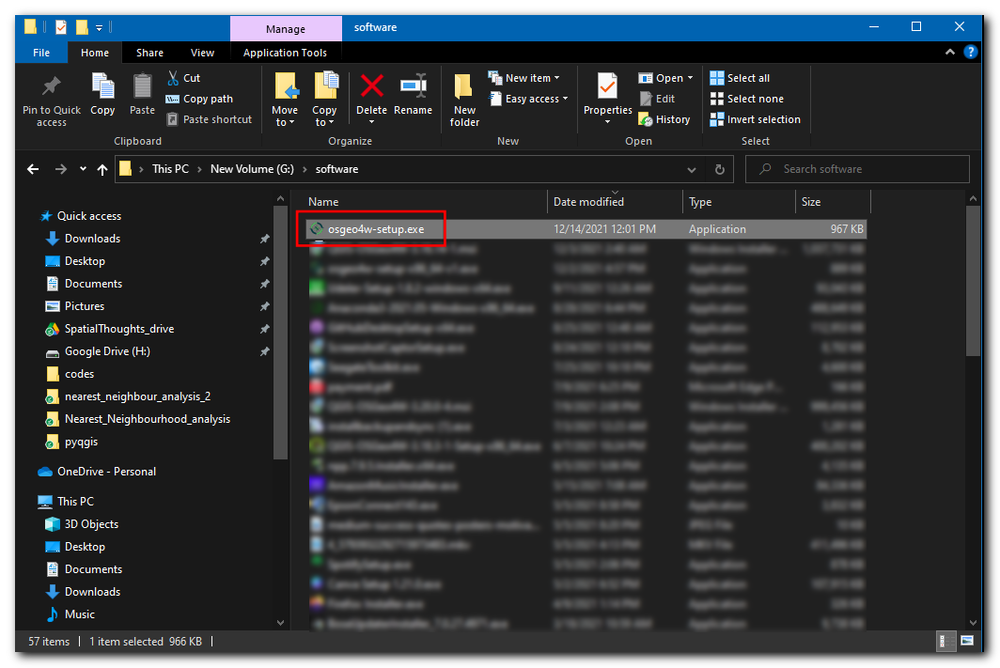
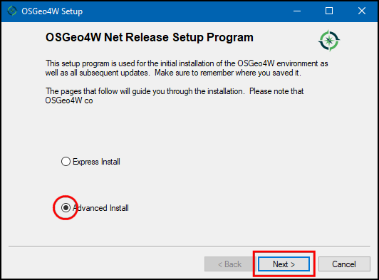
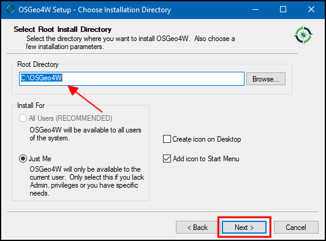
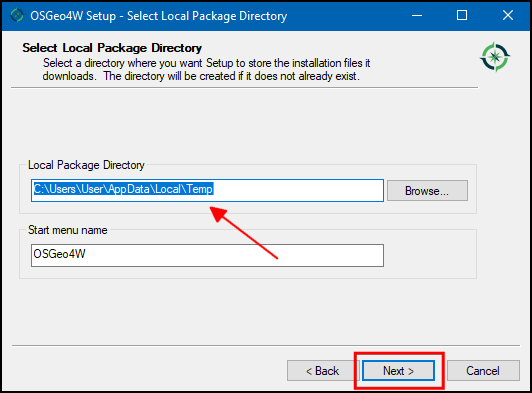
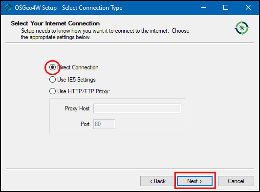
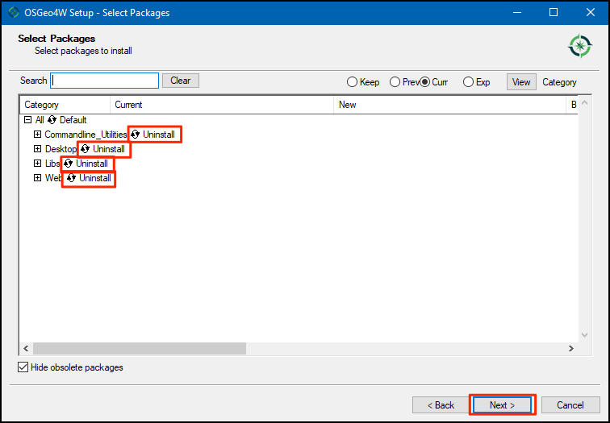
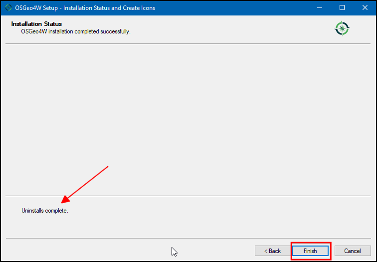
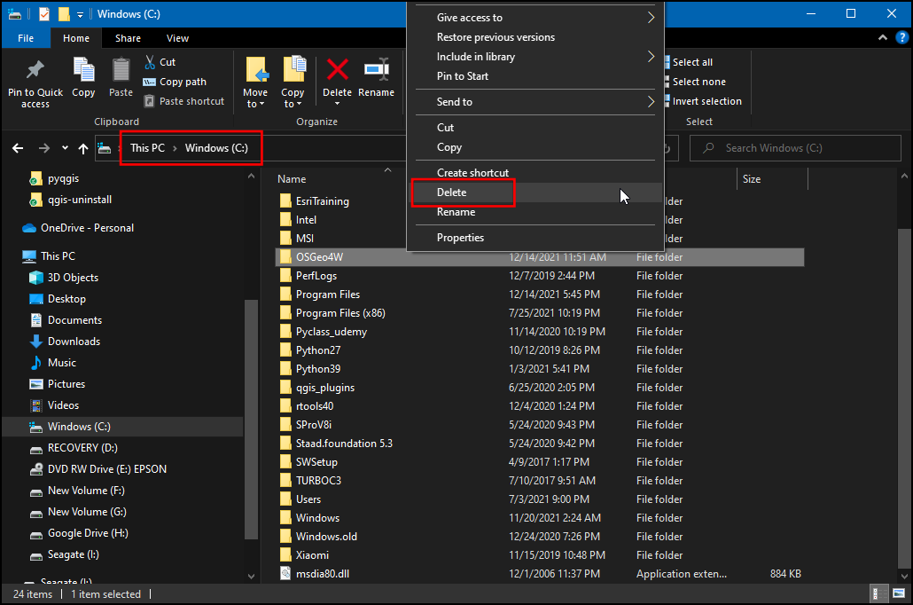
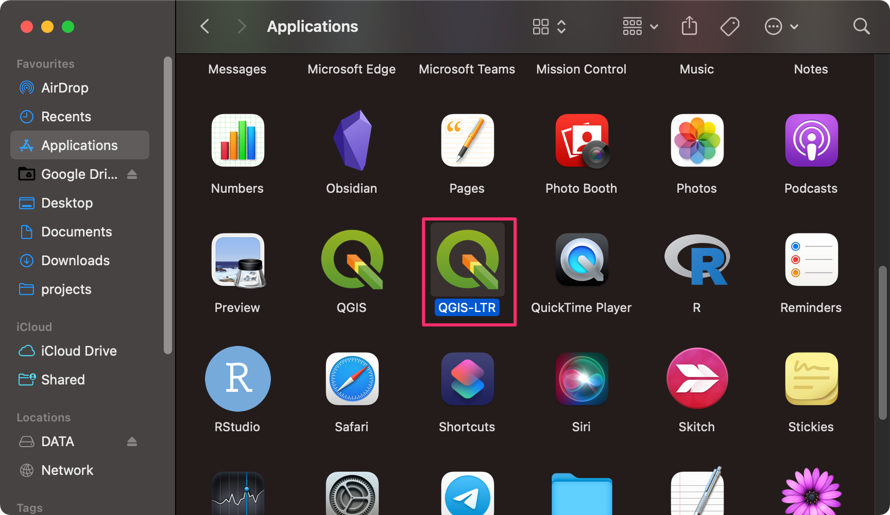
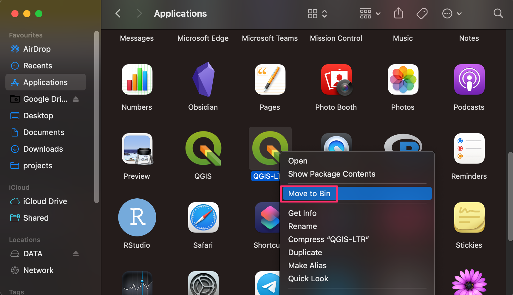

## Uninstall QGIS on Windows

> This is a guide to **Un-Install** QGIS from your system. If you need to install QGIS, please see our [Install QGIS-LTR on Windows](install-qgis-ltr.html#install-qgis-on-windows) guide. 

Our installation guide recommends installing QGIS via the OSGeo4W installer. This is also the preferred way to remove it from your system.

1. Visit the [QGIS.org Download](https://qgis.org/en/site/forusers/download.html) page. Click the **OSGeo4W Network Installer** link to download the installer. Once downloaded, double-click the `osgeo4w-setup.exe` to launch the installer. Make sure to close any running QGIS applications before starting the installer.

```{r echo=FALSE, fig.align='center', out.width='75%'}

```
2. In the **OSGeo4W Setup** window, choose **Advanced Install** and click *Next*. 

```{r echo=FALSE, fig.align='center', out.width='75%'}

```

3. When asked to *Choose a Download Source*, select `Install from Internet` and click *Next*.

```{r echo=FALSE, fig.align='center', out.width='75%'}
knitr::include_graphics('images/common/winUninstall03.png')
```

4. The default location of the *Root Directory* is `C:\OSGeo4W`. Keep it to the default value unless you have installed QGIS in a different location. Click *Next*.

```{r echo=FALSE, fig.align='center', out.width='75%'}

```

5. Keep the *Local Package Directory* and *Start menu name* to be their default choices and click *Next*. 

```{r echo=FALSE, fig.align='center', out.width='75%'}

```

6. In the *Select Connection Type* choose `Direct Conection`. If you are on a corporate or a university network that uses a proxy server, you can configure it here. Click *Next*.

```{r echo=FALSE, fig.align='center', out.width='75%'}

```

7. You will be prompted to *Choose a Download Site*. Select `http://download.osgeo.org` and click *Next*. 

```{r echo=FALSE, fig.align='center', out.width='75%'}
knitr::include_graphics('images/common/winUninstall07.png')
```

8. Next you will be presented with a dialog to *Select Packages*. Here is where you specify packages that you want to remove. Keep clicking on the text *Default* next to each section until it turns to *Uninstall*. Doing this will ensure all QGIS versions and dependecies will be removed from your system. If you want to remove a specific version of QGIS, expand the *Desktop* section, and choose *Uninstall* for that version.

```{r echo=FALSE, fig.align='center', out.width='75%'}

```

9. You may be prompted with a warning *Unmet Dependencies Found*. Make sure to `un-check` the *Install these packages to meet dependecies* checkbox to make sure all packages are removed.

```{r echo=FALSE, fig.align='center', out.width='75%'}
knitr::include_graphics('images/common/winUninstall09.png')
```

10. The installer will now remove all chosen packages. When finished, you will see a dialog with the message *Uninstalls complete*.

```{r echo=FALSE, fig.align='center', out.width='75%'}

```

11. The last step is to remove the `C:\OSGeo4W` folder from your system. Open *Windows Explorer* and navigate to the `C:\` directory. Select the `OSGeo4W` folder and delete it.

```{r echo=FALSE, fig.align='center', out.width='75%'}

```

You have now successfully removed QGIS from your Windows computer.

## Uninstall QGIS on Mac

> This is a guide to **Un-Install** QGIS from your system. If you need to install QGIS, please see our [Install QGIS-LTR on Mac](install-qgis-ltr.html#install-qgis-on-mac) guide. 

1. Go to the *Applications* folder. Find the **QGIS-LTR** application.

```{r echo=FALSE, fig.align='center', out.width='75%'}

```

2. Hold the *Ctrl* key and click on the **QGIS-LTR** icon. In the contextual menu, select *Move to Bin*. 

```{r echo=FALSE, fig.align='center', out.width='75%'}

```

You have now successfully removed QGIS from your Mac.

## Uninstall QGIS on Linux

> This is a guide to **Un-Install** QGIS from your system. If you need to install QGIS, please see our [Install QGIS-LTR on Linux](install-qgis-ltr.html#install-qgis-on-linux) guide. 

Please follow the instructions for your Linux distribution from [QGIS.org Downloads](https://qgis.org/en/site/forusers/alldownloads.html#linux).

If you have installed QGIS via Conda, you can run the following command from your conda environment. To remove the `QGIS-LTR` version from Conda, you must specify the full version name.

```
conda remove qgis=3.16.8 --c conda-forge 
```